# 波浪能装置输出功率最大化模型

#

本文从分析波浪能装置在海水中垂荡和纵摇运动出发，通过分别对浮子和振子进行受力分析、建立微分方程，获得了浮子和振子从静止到进行垂荡和纵摇运动各时刻的运动状态；而后通过调节直线阻尼器和旋转阻尼器的阻尼系数的相关参数，计算出使得PTO系统均输出功率最大的阻尼系数的相关参数，提升了波浪能装置的能量转换效率。

针对问题1，我们仅考虑装置做垂荡运动的情况，不计海水纵摇激励力等的影响，可认为这是一个多自由度线性系统。根据题意，初始状态装置平衡于静水中，假设此后浮子进行垂荡运动时不会完全浸没水中或露出圆锥部分，则可得到静水恢复力的线性表达式。对浮子和振子分别进行受力分析、建立多元微分方程，利用MATLAB中的ode45功能函数求解，最终得到浮子和振子在40个波浪周期内的垂荡位移和速度，两小问各自条件下10s、20s、40s、60s、100s时的数据如下文 ${ \bf 5 . 1 }$ 中表1和表2所示。

针对问题2，由于是求使得PTO系统平均输出功率最大的阻尼系数，则不妨利用稳态下浮子和振子的运动来简化运算。在阻尼系数为某一常量时，可以利用稳态时浮子和振子的运动频率同海浪相等，以此得到稳态下二者的相对速度的解析解，从而写出PTO系统平均输出功率的表达式： $\begin{array} { r } { P T O = \frac { 1 } { 2 } \frac { \omega ^ { 5 } m _ { z } ^ { 2 } f ^ { 2 } \eta _ { l } } { ( C \cdot D \eta ) ^ { 2 } + \omega ^ { 2 } [ E \eta _ { l } + B \lambda _ { l } ] ^ { 2 } } } \end{array}$ ，由此可知： $\begin{array} { r } { \eta _ { i , \mathrm { b e s t } } = \sqrt { \frac { C ^ { 2 } + \omega ^ { 2 } B ^ { 2 } \lambda _ { i } ^ { 2 } } { D ^ { 2 } + \omega ^ { 2 } E ^ { 2 } } } } \end{array}$ 时有最大功率。除此之外，我们还可以利用已经得到的数值结果计算每0.2秒PTO系统的做功，利用trapz梯形数值积分后再除以总时间，得到某一阻尼系数下的近似平均输出功率，再遍历阻尼系数的取值，可以得到最大输出功率为229.334W，此时的阻尼系数取值为37193.812。当阻尼系数和相对速度绝对值的幂成正比时，难以得到其解析解，参考第一小问的结果，可见trapz梯形数值积分的精度满足要求，因此直接使用前者进行计算，得到最大输出功率为230.127W，阻尼比例系数为 $9 . 7 5 \times 1 0 ^ { 4 }$ ，幂值为0.370。

针对问题3，浮子和振子不仅做垂荡运动，还进行纵摇运动。仔细审题发现，题目并未明确纵摇激励力矩、兴波阻尼力矩等力矩的相对转轴，我们在对转轴和中轴上的作用力与作用点进行分析之后，发现过于繁琐且诸多信息未知，需要对模型进行合理近似。通过对附表中给出数据的初步估算，得到浮子和振子的角位移为小量，因此在考虑垂荡运动时，可以忽略由于纵摇运动带来的影响；在考虑纵摇运动时，由于计算得到的浮子和振子的相对垂荡位移很小，因此可以将浮子和振子视为一个整体计算其在海水中的转动，此后再构建以转轴为原点的平动非惯性参考系，分析振子的转动，最终得到浮子和振子在40个波浪周期内的垂荡位移和速度以及纵摇角位移和角速度，10s、20s、40s、60s、100s时的数据如下文5.3中表3和表4所示。

针对问题4，仅需考虑阻尼系数为常量的情况，参考问题2的解法，可认为trapz梯形数值积分法足够精确，使用MATLAB做出全局遍历图并得到该条件下最大输出功率为322.128W，此时直线阻尼器的阻尼系数为 $5 . 9 3 \times 1 0 ^ { 4 }$ ，旋转阻尼器的阻尼系数为100000。

经过模型稳定性分析，对于大多数波浪激励力、波浪激励力矩下模型均成立。模型具有较好鲁棒性。总体而言，该模型原创度高，简化较为合理，结果吻合初始假设；在第三、四问的模型中，由于做了小量近似，可能导致当波浪较大时出现一定误差，精度有所下降。该模型还可推广至研究弹簧刚度和扭转弹簧刚度、或浮子、振子的质量比对于输出功率最大化的影响，以提升波浪能装置的转换效率。

关键词：多自由度线性系统、多元微分方程、平动非惯性系

# 一、问题重述

# 1.1问题背景

当今全球化石燃料日益枯竭，环境问题也日益严重。波浪能具有可再生、储量多、易获取的特点，有望成为人类解决当前所面临的能源危机与环境污染的一大助力。而要想规模化使用波浪能这一重要的海洋可再生能源，则需要解决波浪能装置的能量转化效率问题。

一种利用波浪能的装置的原理为，在波浪作用下浮子的运动带动其内部振子的运动，通过由弹簧和阻尼器所构成的PTO（能量输出系统），利用两者的相对运动驱动阻尼器做功，从而实现向其他能源的转化。

# 1.2问题提出

某波浪能装置由四个部分组成，分别为质量均匀的空心壳体浮子以及被密封在浮子内部的中轴、穿在中轴上的振子与包含弹簧和阻尼器的PTO。其中，浮子由一个有盖无底的圆柱壳体和一个圆锥壳体共同组成，中轴的底座固定于两壳体连接部分的隔层中心处，并通过PTO与振子连接。在波浪的作用下，浮子在海面做摇荡运动，浮子和振子的相对运动使得阻尼器做功，将波浪能转化为可利用的能量，同时通过调节阻尼器的阻尼系数有望提升此装置的能量转化效率。

基于以上背景信息与附件内容，需建立数学模型解决以下问题：

问题一：考虑浮子只做垂荡运动的情况，且中轴固定，振子由PTO与底座连接并只沿中轴运动，其受到阻尼力的大小与其同浮子的相对速度正相关。装置在初始状态平衡于静水中，此后受垂荡激励力影响开始运动。建立数学模型，分别计算在阻尼器的阻尼系数固定为 $1 0 0 0 0 \mathrm { N } { \cdot } \mathrm { s } / \mathrm { m }$ 时，以及阻尼系数正比于浮子和振子相对速度绝对值的幂（取比例系数为10000，幂指数0.5）两种情况下，装置受垂荡激励力作用后 $4 0$ 个波浪周期内浮子与振子分别的垂荡位移和速度。

问题二：其他条件与（1）中相同，求解最优阻尼使得装置转化效率最佳，分别对[0,100000]内的常量阻尼系数以及比例系数处于[0,100000]内、幂指数处于[0,1]区间内的阻尼系数计算出最大平均输出功率和相应阻尼系数。

问题三：考虑装置同时进行垂荡和纵摇运动的情况。此时中轴与底座采取铰接，并在转轴处增置了旋转阻尼器和扭转弹簧，各项参数见附件。要求建立数学模型并算出平衡于水中的装置在此情况下受垂荡激励力和纵摇激励力矩共同作用后在40个周期内浮子和振子分别的垂荡位移和速度以及纵摇角位移和角速度。

问题四：对阻尼系数在[0,100000]内直线阻尼器和旋转阻尼器取值，计算出浮子同时进行垂荡和纵摇的情况下最大输出功率与相应阻尼系数。

# 二、问题分析

本文主要解决的是一种波浪能装置的能量转化效率最优化问题。问题一、问题二要解决的是在该装置只做垂荡运动时浮子与振子的运动状况以及如何确定最优的阻尼系数使得平均输出功率最高，而问题三、问题四要解决的是在该设备只做垂荡和纵摇运动时浮子与振子的运动状况以及通过调节阻尼系数实现平均输出功率的最优化。

# 2.1问题一的分析

问题一考虑浮子在波浪中只做垂荡运动，中轴与底座固定连接。 $\scriptstyle 1 = 0$ 时，装置平衡于静水中；t>0时，浮子受垂荡激励力作用带动振子开始运动，并在一段时间后达到稳态。由于已经假定浮子仅做垂荡运动，故不考虑纵摇激励力的影响。依据题目所给条件首先对装置内各部分进行受力分析，建立关于浮子和振子的动力学方程。

第一小问：题目给定阻尼固定的情况下，取阻尼系数为 $1 0 0 0 0 \mathrm { N \cdot s / m }$ 带入所列的两个联立微分方程，使用MATLAB算出数值解即可。

第二小问：题目给定阻尼系数正比于浮子、振子两者之间的相对速度绝对值的幂，则修正动力学方程，带入比例系数10000和幂指数0.5，同样使用计MATLAB求解。

# 2.2问题二的分析

问题二要求确定在问题一条件下最优的阻尼系数以实现PTO系统最大平均功率。对于最优的阻尼系数，一方面可以利用复数解法求解响应函数，得到PTO功率和阻尼系数的关系式，确定其解析解；另一方面，也可通过计算机枚举以取得最佳阻尼系数的数值解。

第一小问：求得其解析解和数值解，对比两个解，差距较小则可认定两种方法均能准确求出最优阻尼系数。

第二小问：由于复数解法较难解决非线性方程，在比例系数和幂指数均未知的情况下可能会出现解析解无法写出的情况，此时则需考虑用数值解代替解析解。若第一小问中两个解差距很小，则可认定数值解也足够准确，取计算机枚举得到的数值解为本小问情形下的最优解。

# 2.3问题三的分析

问题三考虑浮子在水中只做垂荡和纵摇运动，中轴与底座铰接，并在转轴处增加了旋转阻尼器与旋转弹簧,其余条件与问题一相同。

假定浮子和振子的角位移很小，因此在考虑垂荡运动时，可以忽略由于纵摇运动带来的影响；在考虑纵摇运动时，由于计算得到的浮子和振子的相对垂荡位移很小，因此可以将浮子和振子视为一个整体计算转动，此后再构建以转轴为原点的平动非惯性参考系，分析振子的转动。

分别列出2条动力学方程和2条转动方程，利用MATLAB求解微分方程。

# 2.4问题四的分析

问题四需要对阻尼系数在[0,10000]内直线阻尼器和旋转阻尼器取值，得到浮子同时进行垂荡和纵摇的情况下最大输出功率与相应阻尼系数。类似于问题二，利用数值积分法求解出系统PTO，再对直线阻尼器和旋转阻尼器最优阻尼系数从0-100000进行遍历，计算出不同条件下输出PTO。通过多次细分目标区间，找出最优参数。

# 三、模型假设

1.假设海水是无粘且无旋的；  
2.底座、中轴、隔层、PTO的质量与所有的摩擦不计；  
3.忽略附件未给出的有关底座、中轴、中轴架、转轴以及其他结构的大小、厚度、高度等；  
4.海平面足够大且浮子的运动对海平面高度不产生影响；  
5.浮子顶端不会浸没且圆锥部分不露出水面；  
6.在解决问题二时，假设模型将在有限时间内趋于稳定，最终所有广义坐标的圆频率与激  
励力圆频率相等；  
7.在解决问题三时，相比于浮子的垂荡运动，振子与浮子的垂荡运动的相对位移可视为小  
量；  
8.在解决问题三时，浮子与振子的纵摇运动的角位移为小量；

# 四、符号说明

<html><body><table><tr><td>符号</td><td>意义</td><td>单位</td></tr><tr><td>mf</td><td>浮子质量</td><td>kg</td></tr><tr><td>Rf</td><td>浮子底半径</td><td>m</td></tr><tr><td>h</td><td>浮子圆柱部分高度</td><td>m</td></tr><tr><td>h</td><td>浮子圆锥部分高度</td><td>m</td></tr><tr><td>mz</td><td>振子质量</td><td>kg</td></tr><tr><td></td><td>振子半径</td><td>m</td></tr><tr><td>Hz</td><td>振子高度</td><td>m</td></tr><tr><td>p</td><td>海水的密度</td><td>kg/m2</td></tr><tr><td>g</td><td>重力加速度</td><td>m/s2</td></tr><tr><td>k</td><td>弹簧刚度</td><td>N/m</td></tr><tr><td>L0</td><td>弹簧原长</td><td>m</td></tr><tr><td>𝐶k</td><td>扭转弹簧刚度</td><td>N·m</td></tr><tr><td>𝐶𝑤</td><td>静水恢复力矩系数</td><td>N·m</td></tr><tr><td>1z</td><td>振子转动惯量 国大学生在</td><td>kg·m²</td></tr><tr><td></td><td>浮子转动惯量</td><td></td></tr><tr><td></td><td>入射波浪频率</td><td></td></tr><tr><td></td><td>垂荡附加质量</td><td>kg gov.cns</td></tr></table></body></html>

<html><body><table><tr><td></td><td>纵摇附加转动惯量</td><td>kg·m2</td></tr><tr><td></td><td>垂荡兴波阻尼系数</td><td>N·s/m</td></tr><tr><td></td><td>纵摇兴波阻尼系数</td><td>Ns/m</td></tr><tr><td>f</td><td>垂荡激励力振幅</td><td>N</td></tr><tr><td></td><td>纵摇激励力矩振幅</td><td>N·m</td></tr><tr><td>ni</td><td>直线阻尼器阻尼系数</td><td>N·s/m</td></tr><tr><td>n</td><td>直线阻尼器阻尼比例系数</td><td></td></tr><tr><td>n1</td><td>旋转阻尼器阻尼系数</td><td>N·sm</td></tr><tr><td>h</td><td>初始状态(t=0)时浮子顶端超过水面的距离</td><td>m</td></tr><tr><td>h1</td><td>初始状态振子质心距转轴的距离</td><td>m</td></tr><tr><td>h</td><td>初始状态浮子质心距转轴的距离</td><td>m</td></tr><tr><td>h</td><td>初始状态浮子和振子二者质心距转轴的距离</td><td>m</td></tr></table></body></html>

# 五、模型建立与求解

# 5.1问题一模型的建立与求解

# 5.1.1模型的建立

考虑到波浪能装置在海面做垂荡运动，首先需要排除振幅过大导致海平面高于浮子顶板或者浮子圆锥部分露出水面的情况，因为此情况下静水恢复力的线性条件不再适用。故首先计算平衡状态下浮子顶端距离海平面的距离用以比对。设浮子顶端距离水面的距离为$\mathbf { h } _ { 0 }$ ，假设浮子正常做垂荡运动，则振幅需同时小于 $\cdot _ { \mathrm { h } _ { 0 } }$ 以及圆柱壳体部分长度与h0的差。

初始状态，即t＝0时，由于海面足够大，可认为浮子的运动不会引起海平面发生变化由于此状态下受力平衡，因此有以下等式：

$$
\rho g [ \frac { 1 } { 3 } \pi R _ { f } ^ { 2 } h _ { z } + \pi R _ { f } ^ { 2 } ( h _ { y } - h _ { 0 } ) ] = ( m _ { f } + m _ { z } ) g
$$

得到： $\scriptstyle \mathtt { h } _ { 0 } = 0 . 9 9 9 9 9 9 m$ 之后将用以比对振幅以验证浮子是否符合假设。

接下来，需要分析浮子和振子的受力与运动情况。设浮子竖直向上位移为 $| x _ { 1 } |$ 振子竖直向上的位移为 $x _ { 2 }$ 。

在40个波浪周期内，浮子受到周期性的垂荡激励力的作用，其运动的同时还会受到阻碍其运动的静水恢复力（与其位移 $\cdot x _ { 1 }$ 正相关）、垂荡兴波阻尼力（与其速度正相关）以及垂荡附加惯性力。在装置内部，由于浮子与振子并非刚性连接，故二者的相对运动会产生相应的弹簧弹力（与二者相对位移正相关）以及阻尼力（与二者的相对运动速度正相关）。

考虑到在垂直方向上，浮子收到波浪激励力、静水回复力、兴波阻尼力、附加惯性力以及TPO系统的弹力与阻尼力，取浮子的位移为 $x _ { 1 }$ ，振子的位移为 $x _ { 2 }$ ，则受力分析后得到该系统的运动方程。

阻尼系数固定时，浮子与振子的运动方程如下:

$$
\begin{array} { c } { { \left\{ ( m _ { f } + \mu ) \ddot { x } _ { 1 } + \eta _ { i } ( \dot { x } _ { 1 } - \dot { x } _ { 2 } ) + \lambda _ { i } \dot { x } _ { 1 } + k ( x _ { 1 } - x _ { 2 } ) + \rho g \pi R _ { f } ^ { 2 } x _ { 1 } = f \right. } } \\ { { \left. m _ { z } \ddot { x } _ { 2 } + \eta _ { i } ( \dot { x } _ { 2 } - \dot { x } _ { 1 } ) + k ( x _ { 2 } - x _ { 1 } ) = 0 \right. } } \end{array}
$$

阻尼系数正比于浮子和振子相对速度绝对值的幂时，浮子与振子的运动方程如下：

$$
\left\{ \begin{array} { c } { \left( m _ { f } + \mu \right) \ddot { x } _ { 1 } + \eta ( \dot { x } _ { 1 } - \dot { x } _ { 2 } ) \left| \dot { x } _ { 1 } - \dot { x } _ { 2 } \right| ^ { \frac { 1 } { 2 } } + \lambda _ { 1 } \dot { x } _ { 1 } + k ( x _ { 1 } - x _ { 2 } ) + \rho g \pi R _ { f } ^ { 2 } x _ { 1 } = f } \\ { m _ { z } \ddot { x } _ { 2 } + \eta ( \dot { x } _ { 2 } - \dot { x } _ { 1 } ) \left| \dot { x } _ { 1 } - \dot { x } _ { 2 } \right| ^ { \frac { 1 } { 2 } } + k ( x _ { 2 } - x _ { 1 } ) = 0 } \end{array} \right.
$$

对以上两组方程分别求解即可得到浮子与振子位移和速度随时间的变化情况，从而解决本问题。

# 5.1.2第一小问模型的求解（阻尼系数固定时）

ode45是MATLAB中一种专门用于求解微分方程的功能函数，是一种中阶、自适应步长、用以求解非刚性常微分方程的方式。针对已经得到的公式（1），对其进行代码编写并得到数值解，使用ode45求解非刚性微分方程，得到数据见附件result1­1.xlsx。

对得到的结果进行可视化以直观体现浮子与振子随时间的运动情况，得到下图：

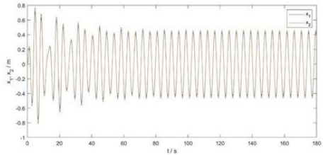  
图1浮子与振子位移 $\langle x _ { 1 }$ $x _ { 2 }$ 随时间t的变化曲线

其中，在10s、20s、40s、 $6 0 \mathrm { s }$ 、100s时浮子与振子的垂荡位移和速度如下表所示：

表1浮子与振子的垂荡位移和速度表（其中时间t单位为s，位移单位为m，速度单位为m/s)

<html><body><table><tr><td></td><td>x1</td><td>v1</td><td>x2</td><td>V2</td><td>x1-x2</td></tr><tr><td>10</td><td>-0.190591947</td><td>-0.640564278</td><td>-0.211549275</td><td>-0.69360835</td><td>0.020957328</td></tr><tr><td>20</td><td>0.590531163</td><td>-0.240467502</td><td>-0.634068234</td><td>-0.27228741</td><td>0.043537071</td></tr><tr><td>40</td><td>0.285456229</td><td>0.313435653</td><td>0.296609879</td><td>0.333247927</td><td>0.01115365</td></tr><tr><td>60</td><td>-0.31443603</td><td>-0.479107064</td><td>-0.33135498</td><td>-0.51555596</td><td>0.01691895</td></tr><tr><td>100</td><td>-0.083590128</td><td>-0.604065973</td><td>-0.084036856</td><td>-0.64304386</td><td>0.000446728</td></tr></table></body></html>

5.1.3第二小问模型的求解（阻尼系数正比于浮子和振子相对速度绝对值的幂）

同理，使用ode45求解公式（2），得到的数据见附件result1-2.xlsx。对得到的结果进行可视化以直观体现浮子与振子随时间的运动情况，得到下图：

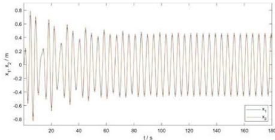  
图2浮子与振子位移 $x _ { 1 }$ 0 $x _ { 2 }$ 随时间t的变化曲线

表2浮子与振子的垂荡位移和速度表(其中时间t单位为s，位移单位为m，速度单位为m/s)  

<html><body><table><tr><td>t</td><td>X1</td><td>v1</td><td></td><td>𝑣2</td></tr><tr><td>10</td><td>-0.20583</td><td>-0.65279</td><td>-0.23463</td><td>-0.69823</td></tr><tr><td>20</td><td>-0.61125</td><td>-0.25419</td><td>-0.66077</td><td>-0.27589</td></tr><tr><td>40</td><td>0.268708</td><td>0.295805</td><td>0.280324</td><td>0.313936</td></tr><tr><td>60</td><td>-0.32725</td><td>-0.49125</td><td>-0.3493</td><td>-0.52414</td></tr><tr><td>100</td><td>-0.08832</td><td>-0.60974</td><td>-0.09376</td><td>-0.64955</td></tr></table></body></html>

不难发现 $x _ { 1 }$ 的最大振幅均小于 $\cdot _ { \mathrm { h } _ { 0 } }$ ，满足水面不会没过浮子顶盖以及浮子圆锥壳体部分不会露出水面的假设。

# 5.2问题二模型的建立与求解

由于是求使得PTO系统平均输出功率最大的阻尼系数，则不妨利用稳态下浮子和振子的运动来简化运算。在阻尼系数为某一常量时，可以利用稳态时浮子和振子的运动频率同海浪相等1，以此得到稳态下二者的相对速度的解析解，从而写出PTO系统平均输出功率的表达式，得到令输出功率最大的阻尼系数的解析解。除此之外，我们还可以利用已经得到的数值结果计算每0.2秒PTO系统的做功，利用trapz梯形数值积分后再除以总时间，得到某一阻尼系数下的近似平均输出功率，再遍历阻尼系数的取值，可以得到最大输出功率和此时的阻尼系数的取值。当阻尼系数和相对速度绝对值的幂成正比时，难以得到其解析解，参考第一小问的结果，如果trapz梯形数值积分的精度满足要求，便可直接使用前者进行计算，得到最大输出功率、阻尼比例系数和幂值。

# 5.2.1第一小问模型的求解（阻尼系数为某一定值时）

# 5.2.1.1第一小问的解析解

由于阻尼做功只与阻尼系数以及浮子和振子间的相对运动有关，取PTO为装置的能量转化功率，则在阻尼系数为某一固定值时，其关系可表示为：

$$
P T O = \frac { 1 } { 2 } \eta _ { i } \omega ^ { 2 } \left| x _ { 1 } - x _ { 2 } \right| ^ { 2 }
$$

其中，此时的 $x _ { 1 }$ ， $x _ { 2 }$ 表示复振幅。

因此首先需要确定浮子与振子相对运动位移的方程。

首先尝试公式解。利用复数解法求解响应函数。由5.1可知，阻尼系数固定时的运动方程如（1）所示，对于（1），利用稳态时浮子和振子的运动频率同海浪相等，可将其改写为：

$$
\begin{array} { r } { \left[ { \begin{array} { c c } { - \omega ^ { 2 } ( m _ { f } + \mu _ { 1 } ) + i \omega ( \lambda _ { \uparrow } + \eta _ { \uparrow } ) + k + \rho g \pi R _ { f } ^ { 2 } } & { - i \omega \eta _ { \downarrow } - k } \\ { - i \omega \eta _ { \downarrow } - k } & { - \omega ^ { 2 } m _ { z } + i \omega \eta _ { \downarrow } + k } \end{array} } \right] \left[ { \begin{array} { c } { x _ { 1 } } \\ { x _ { 2 } } \end{array} } \right] = \left[ { \begin{array} { c } { f } \\ { 0 } \end{array} } \right] } \end{array}
$$

取：

$$
{ \bf { { Y } } } = \left[ \begin{array} { c c } { { - \omega ^ { 2 } ( m _ { f } + \mu _ { 1 } ) + i \omega ( \lambda _ { 1 } + \eta _ { 1 } ) + k + \rho g \pi R _ { f } ^ { 2 } } } & { { - i \omega \eta _ { 1 } - k } } \\ { { - i \omega \eta _ { 1 } - k } } & { { - \omega ^ { 2 } m _ { z } + i \omega \eta _ { 1 } + k } } \end{array} \right]
$$

则有：

$$
{ \binom { x _ { 1 } } { x _ { 2 } } } = Y ^ { - 1 } { \binom { f } { 0 } } = { \frac { f } { \left| Y \right| } } { \binom { - \omega ^ { 2 } m _ { z } + i \omega \eta _ { \scriptscriptstyle { 1 } } + k } { i \omega \eta _ { \scriptscriptstyle { 1 } } + k } }
$$

由此得到 $x _ { 1 } - x _ { 2 } = \frac { f } { \vert Y \vert } [ - \omega ^ { 2 } m _ { = } ]$

取 $\mathrm { A } { = } { - } \omega ^ { 2 } ( m _ { \gamma } + \mu _ { 1 } ) { + } k + \rho g \pi R _ { \gamma } ^ { 2 } , \mathrm { B } { = } { - } \omega ^ { 2 } m _ { z } { + } k$

对 $x _ { 1 } { - } x _ { 2 }$ 取模长并平方，并令C=AB $\cdot k ^ { 2 }$ ， $D = - \infty ^ { 2 } \lambda$ ，E=A+B-2k，则可简化得到：

$$
\left| x _ { 1 } - x _ { 2 } \right| ^ { 2 } = \frac { \omega ^ { 4 } m _ { z } ^ { 2 } f ^ { 2 } } { ( C - D \eta ) ^ { 2 } + \omega ^ { 2 } [ E \eta _ { i } + B \lambda _ { i } ] ^ { 2 } }
$$

带入后得到： $P T O = \frac { 1 } { 2 } \frac { \omega ^ { 6 } m _ { z } ^ { 2 } f ^ { 2 } \eta _ { i } } { ( C - D \eta _ { i } ) ^ { 2 } + \omega ^ { 2 } [ E \eta _ { i } + B \lambda _ { i } ] ^ { 2 } }$ 对此式求导可知：nbe= $\eta _ { _ \mathrm { b e s t } } = \sqrt { \frac { C ^ { 2 } + \omega ^ { 2 } B ^ { 2 } \lambda _ { \eta } ^ { 2 } } { D ^ { 2 } + \omega ^ { 2 } E ^ { 2 } } }$ 时有最大功率。

带入数据，得到最佳的 $\eta _ { \mathrm { _ { \mathrm { ~ h e s t } } } } = 3 7 1 9 3 . 8 1 1 9 \mathrm { N } { \cdot } \mathrm { s } / \mathrm { m }$ ，对应的最大功率为229.3339W。

# 5.2.1.2第一小问的数值解

数值解采取trapz梯形法执行数值积分运算，通过将一个区域分为包含多个更容易计算的区域的梯形，对区间内的积分计算近似值。

考虑到波浪能装置在初始状态后一段时间内未达到垂荡稳定状态，因此在采样区间应当从某一适当的时刻开始。

取积分区间为0­400s，采样区间为200­400s，步长为0.2s。得到𝑛𝑖在[0,100000]的范围内时PTO关于 $\eta _ { i }$ 的函数关系如图所示：

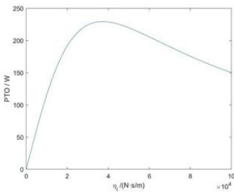  
图3PTO关于η𝑖的函数图1

观察图像可知，PTO的峰值出现在𝑖位于[30000,40000]的区间，在此区间作图得：

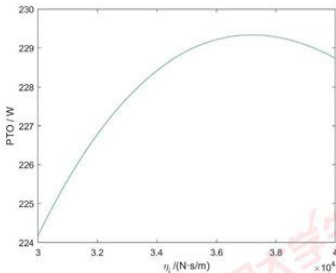  
图4PTO关于ni的函数图2

对峰值采样，得到最大功率为229.497276437679W，此时的阻尼系数为 $3 . 7 2 \times 1 0 ^ { 4 }$ （20$\mathbf { N } { \cdot } \mathbf { s } / \mathbf { m }$ 0

# 5.2.2第二小问模型的求解（阻尼系数正比于浮子和振子相对速度绝对值的幂）

使用与5.2.1中相同的方式建立模型，则在阻尼系数正比于浮子和振子相对速度绝对值的幂时，令幂指数为 $\alpha$ ，比例系数为 $\mathfrak { n }$ ，则其关系可表示为：

$$
P T O = \frac { 1 } { 2 } \eta \omega ^ { 2 } \left| x _ { 1 } - x _ { 2 } \right| ^ { 2 + \alpha }
$$

由于幂指数为 $\alpha$ 未知，很难求出该方程的解析解。

5.2.1中，经对比可知，由trapz梯形法积分后枚举取得的结果229.49728W相比于此前采取数学方法获得的解析解得到的229.33394W十分接近，因此可以认为，使用数值法得到的结果具有相当的精确性，在难以得到解析解的时候可以采用数值法得出结果。

考虑用数值解来解决本问题。

使用与5.2.1相同的思路，取积分区间为 $0 { - } 4 0 0 \mathrm { s }$ ，采样区间为200-400s，步长为0.2s，用MATLAB进行二层遍历，做出PTO关于比例系数η和幂指数 $\alpha$ 的函数。

经可视化后，得到η在[0,100000]、 $\scriptstyle a$ 在[0,1]的范围内时PTO关于两者的函数关系如图所示：

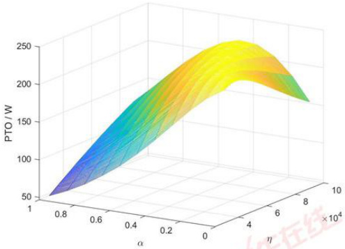  
图5PTO关于比例系数η和幂指数 $\alpha$ 的函数图1

观察图像可知，得到η在[20000,100000]、α在[0.3,0.5]的范围内时PTO取得峰值。

故在此范围内重新作图，得到图像如下所示：

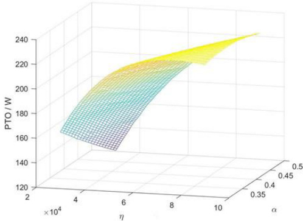  
图6PTO关于比例系数η和幂指数 $\alpha$ 的函数图2

最后对所得的数据进行排序，最终得到最大PTO＝230.12739W。此时有幂值 $a = 0 . 3 7 0$ 比例系数 $\eta { = } 9 . 7 5 \times 1 0 ^ { 4 }$

# 5.3问题三模型的建立与求解

# 5.3.1各部分转动惯量的确定

计算转动惯量和平衡拽台下质心距离需要用到浮子壳体各部分的面积，故首先需计算得到以下三部分的面积：

浮子圆筒部分侧面积： $S _ { 1 } = \pi R _ { f } h _ { y } = 6 \pi$

浮子圆维部分的面积：S=πR√R+=

浮子桶盖部分的面积： $S _ { 3 } = \pi R _ { f } ^ { 2 } = \pi$

为简化表述，在之后的算式中均直接以其数值代替符号表示，不再出现面积。平衡状态下振子质心距离转轴O的距离： 代

$$
h _ { 1 } = L _ { 0 } + \frac { 1 } { 2 } H _ { : } - \frac { m _ { z } g } { k }
$$

平衡状态下浮子质心距离转轴 $^ \circ$ 的距离：

$$
h _ { 2 } = \frac { 1 } { 3 5 + \sqrt { 4 1 } } [ \sqrt { 4 1 } ( \frac { - h _ { z } } { 3 } ) + 3 0 ( \frac { h _ { y } } { 2 } ) + 5 h _ { y } ]
$$

平衡状态下振子和浮子共同的质心距离转轴 $^ \mathrm { o }$ 的距离：

$$
h _ { 3 } = \frac { 1 } { m _ { z } + m _ { f } } ( m _ { z } h _ { 1 } + m _ { f } h _ { 2 } )
$$

振子相对于振子质心的水平轴的转动惯量：

$$
I _ { z } = \frac { 1 } { 4 } m _ { z } R _ { z } ^ { 2 } + \frac { 1 } { 1 2 } m _ { z } H _ { z } ^ { 2 }
$$

浮子相对于浮子质心的水平轴的转动惯量：

$$
I _ { f } = \frac { m _ { f } } { 3 5 + \sqrt { 4 1 } } [ \sqrt { 4 1 } ( \frac { h _ { z } ^ { 2 } } { 6 } + \frac { R _ { f } ^ { 2 } } { 4 } + \frac { 2 } { 3 } h _ { z } h _ { 2 } ) + 3 0 ( \frac { R _ { f } ^ { 2 } } { 2 } + \frac { h _ { f } ^ { 2 } } { 1 2 } ) + 5 ( \frac { R _ { f } ^ { 2 } } { 4 } + ( h _ { y } - h _ { z } ) ^ { 2 } ) ]
$$

# 5.3.2垂荡运动和纵摇运动的求解

经过对附表中给出数值的初步估算，假设浮子和振子的角位移为小量，因此在计算浮子的垂荡运动时，无需考虑纵摇运动的影响。由此可得：

$$
\left\{ \begin{array} { c } { { ( m _ { f } + \mu ) \ddot { x } _ { 1 } + \lambda _ { \perp } \dot { x } _ { 1 } + \rho g \pi R _ { f } ^ { 2 } x _ { 1 } = f \cos \omega t + k x _ { 2 } + \eta _ { i } \dot { x } _ { 2 } } } \\ { { \nonumber } } \\ { { m _ { z } \ddot { x } _ { z } + y _ { i } \dot { x } _ { 2 } + k x _ { 2 } = m _ { z } [ g ( 1 - \cos \theta _ { 2 } ) - \ddot { x } _ { 1 } \cos \theta _ { 2 } + \ddot { \theta _ { 1 } } h _ { 3 } \sin ( \theta _ { 2 } - \theta _ { 1 } ) - h _ { 3 } \dot { \theta } _ { 1 } ^ { 2 } \cos ( \theta _ { 2 } - \theta _ { 1 } ) ] } } \end{array} \right.
$$

其中， $x _ { 1 }$ 的定义于5.1中一样，表示浮子在垂直方向上的位移，正方向定为垂直向上；$x _ { 2 }$ 的定义略有变化（如图9所示），定义为以转轴O为原点的平动非惯性系中振子沿中轴的位移，正方向沿中轴向上，可以近似理解为浮子和振子的相对位移。具体求解结果结果见附件result3.xlsx。解得 $x _ { 1 }$ $x _ { 2 }$ 随时间的变化：

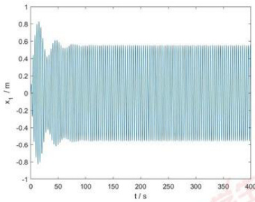  
图7x1关于时间的变化

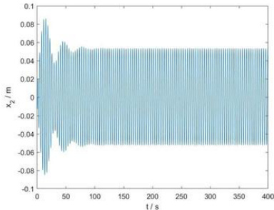  
图8x2关于时间的变化

不难发现浮子和振子之间的相对位移 $\mathbf { x } _ { 2 }$ 是一个小量，因此在计算浮子的纵摇运动时，不妨将浮子和振子视为一个整体进行计算，得到浮子的位移、速度、角位移与角速度后，建立以转轴O为原点的平动非惯性系，以计算在此系中的振子的运动情况。取浮子偏转角度为 $| \theta _ { 1 } \rrangle$ ，振子偏转角度（等于中轴摆动角度） $\theta _ { 2 }$ ，浮子位移 $\scriptstyle \cdot x _ { 1 }$ 、振子位移 $x _ { 2 }$ ，正方向如图。

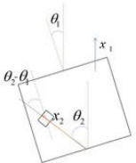  
图9以中轴与底座的连接转轴O建立平动非惯性系

考虑此系中分析浮子和振子的受力情况和力矩平衡，得到以下联立方程组：

$$
\begin{array} { r } { \left\{ \begin{array} { l l } { [ I _ { \mathrm { r } } + I _ { \mathrm { \ell } } + M _ { \mathrm { r } } ( h _ { \mathrm { b } } - h _ { \mathrm { l } } ) ^ { 2 } + M _ { \mathrm { \ell } } ( h _ { \mathrm { b } } - h _ { \mathrm { 2 } } ) ^ { 2 } ] \ddot { \theta } _ { \mathrm { 1 } } + \lambda , \dot { \theta } _ { \mathrm { 1 } } + C _ { \mathrm { s } } \theta _ { \mathrm { 1 } } = L \cos \omega t } \\ { \{ I _ { \mathrm { r } } + m _ { \mathrm { r } } ( h _ { \mathrm { l } } + x _ { \mathrm { 2 } } ) ^ { 2 } ] \ddot { \theta } _ { \mathrm { 2 } } + C _ { \mathrm { k } } ( \theta _ { \mathrm { 2 } } - \theta _ { \mathrm { 1 } } ) + \eta _ { \mathrm { r } } ( \dot { \theta } _ { \mathrm { 2 } } - \dot { \theta } _ { \mathrm { 1 } } ) } \\ { = m _ { \mathrm { r } } [ ( g + \ddot { x } _ { \mathrm { 1 } } ) \sin \theta _ { \mathrm { 2 } } + h _ { \mathrm { 3 } } \dot { \theta } _ { \mathrm { 1 } } ^ { 2 } \sin ( \theta _ { \mathrm { 2 } } - \theta _ { \mathrm { 1 } } ) + \ddot { \theta } _ { \mathrm { 1 } } h _ { \mathrm { 3 } } \cos ( \theta _ { \mathrm { 2 } } - \theta _ { \mathrm { 1 } } ) ] ( h _ { \mathrm { 1 } } + x _ { \mathrm { 2 } } ) } \end{array} \right. } \end{array}
$$

采用MATLAB中的ode45功能函数来求解非刚性微分方程，其结果见附件result3.xlsx。

最终得到 $\theta _ { 1 }$ ， $\theta _ { 2 }$ 随时间的变化如下图所示。

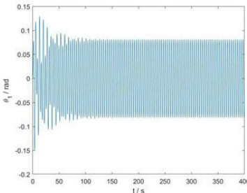  
图101关于时间的变化

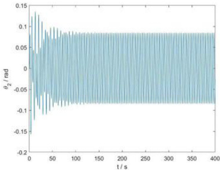  
图 $\begin{array} { r l } {  { 1 1 \ \theta _ { 2 } } } \end{array}$ 关于时间的变化

不难发现 $\boldsymbol { \theta } _ { 1 }$ ， $\boldsymbol { \theta } _ { 2 }$ 均为小量，满足初始假设。

其中，浮子和振子在10s、20s、40s、60s、100s时的垂荡位移和速度以及纵摇角位移和角速度分别如表3和表4所示，其中各数值的单位为标准单位。

表3浮子垂荡位移和速度以及纵摇角位移和角速度  

<html><body><table><tr><td>t</td><td>x1</td><td>v1</td><td></td><td>𝜔1</td></tr><tr><td>10</td><td>-0.52313</td><td>0.98326</td><td>-0.05299</td><td>-0.13555</td></tr><tr><td>20</td><td>-0.69838</td><td>-0.24489</td><td>0.12253</td><td>0.02588</td></tr><tr><td>40</td><td>0.37500</td><td>0.76586</td><td>-0.05116</td><td>-0.06105</td></tr><tr><td>60</td><td>-0.31531</td><td>-0.72160</td><td>0.07359</td><td>0.09148</td></tr><tr><td>100</td><td>-0.04792</td><td>-0.94736</td><td>0.03163</td><td>0.13157</td></tr></table></body></html>

表4振子垂荡位移和速度以及纵摇角位移和角速度  

<html><body><table><tr><td>t</td><td>x</td><td></td><td></td><td>ω2</td></tr><tr><td rowspan="4">10 20 40</td><td>-0.59350</td><td>1.05454</td><td>-0.05529</td><td>-0.14150</td></tr><tr><td>-0.76358</td><td>-0.28834</td><td>0.12784</td><td>0.02742</td></tr><tr><td>0.39883</td><td>0.85610</td><td>-0.05293</td><td>-0.06373</td></tr><tr><td>-0.33537</td><td>-0.79616</td><td>0.07664</td><td>0.09485</td></tr><tr><td>60 100</td><td>-0.04062</td><td>-1.03652</td><td>0.03294</td><td>0.13739</td></tr></table></body></html>

同样，不难发现 $x _ { 1 }$ 的最大振幅均小于 $\mathbf { h } _ { 0 }$ ，满足水面不会没过浮子顶盖以及浮子圆锥壳体部分不会露出水面的假设。

# 5.4问题四模型的建立与求解

问题四的思路与问题二相同。由于同样难以得到解析解，因此采取trapz梯形法执行数值积分运算，对区间内的积分计算近似值，得到数值解。

做出PTO关于η𝑖和𝑗的全局遍历图如下：

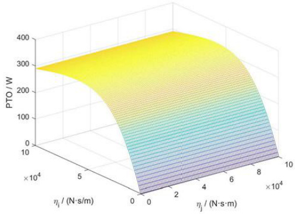  
图12PTO关于η𝑖和η𝑗的全局遍历图

根据PTO关于 $\eta _ { i }$ 、𝑗的数据输出表2可以得出，经过研究数据发现PTO对于η𝑗单调变化，因此取得最大PTO时旋转阻尼系数j的值为100000。再对 $\eta _ { j }$ 取100000时的局部遍历、求解。得到局部图如下：

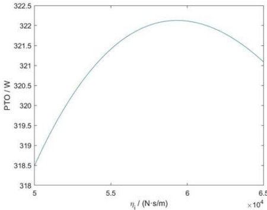  
图13PTO关于η𝑖的局部遍历图

对峰值采样，得到的最大功率为：322.128795508752W此时直线阻尼系数η𝑖 $5 . 9 3 \times 1 0 ^ { 4 }$ ，旋转阻尼系数为𝑗=100000。

# 六、模型的分析与检验

# 6.1模型检验

6.1.1对“浮子顶端不会浸没且圆锥部分不露出水面”的检验

由4个问题中得到的浮子位移数据，均小于起平衡时顶端距离水面的高度 ${ \mathrm { ( 1 . 0 0 ~ m } }$ 2假设成立。

# 6.1.2对“系统在有限时间内趋于稳态”的检验

利用MATLAB的信号分析器，对问题一中垂荡位移数据进行频谱分析，得到功率谱。取运动后半段（趋于稳定），得到信号圆频率为0.0891\*5∗pi1.399rad/s，与激励力圆频率近似相等。假设成立。

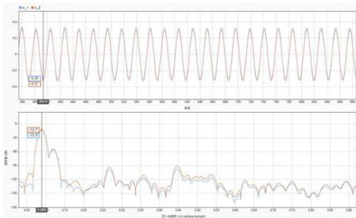  
图14频率分析

# 6.1.3对于“振子与浮子的垂荡运动的相对位移可视为小量”的检验

由4个问题的数据可知，相对位移与浮子垂荡位移的比值在[0.09,0.10]区间内，可视为小量。

# 6.1.4对于“浮子与振子的纵摇运动的角位移为小量”的检验

由问题三的数据可知，浮子角位移最大为6.88°，振子角位移最大为 $7 . 7 3 ^ { \circ }$ 均可视为小角。

# 6.2模型稳定性分析

# 6.2.1模型对波浪激励力的稳定性分析

对于不同大小的波浪激励力，计算振子相对于浮子的位移。

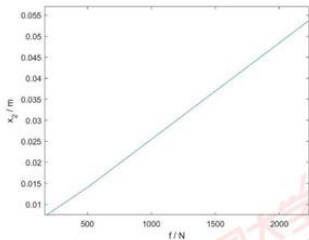  
图15波浪激励力的稳定性分析图

可得波浪激励力大小在一定范围内变动时，振子相对于浮子位移均满足小量的假设。

# 6.2.2模型对波浪激励力矩的稳定性分析

对于不同大小的波浪激励力矩，计算振子相对于浮子的角位移

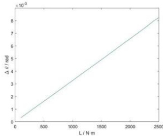  
图16波浪激励力矩的稳定性分析图

可得，波浪激励力矩大小在一定范围内变动，振子相对于浮子位移均满足小量的假设。

# 6.2.3模型对扭转弹簧刚度的稳定性分析

对于不同大小的扭转弹簧刚度，计算输出功率。

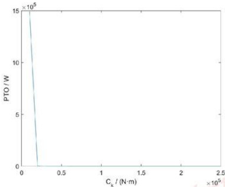  
图17扭转弹簧刚度的稳定性分析图

可得，扭转弹簧刚度在题目给出数据的领域内变动，模型均成立，系统输出正常；扭转弹簧刚度小于一定值之后，模型崩溃。 福

# 6.2.4模型对弹簧刚度的稳定性分析

对于不同大小的弹簧刚度，计算输出功率。

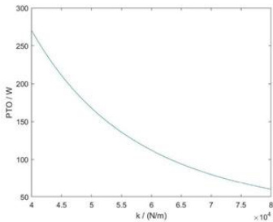  
图18弹簧刚度的稳定性分析图

可得，弹簧刚度在题目给出数据的领域内变动，模型均成立，系统输出正常。

# 七、模型的评价

# 7.1模型优点

1.原创性高，本文中所有模型均为自主建立；  
2.在问题二中，给出解析解和积分解两种解法，准确性更高；  
3.在问题三中，对模型进行了合理简化，避免了对转轴和中轴受力（矩）的讨论；  
4.在问题三中，巧妙地选取了平动非惯性系，使模型便于理解也便于计算；

# 7.2模型缺点与改进

1.模型忽略了该波浪能装置中次要部件的体积、质量以及摩擦带来的影响，因此和生产生活中的实际情况存在差异：

2.问题三和问题四的模型建立在浮子和振子的纵摇为小角度、相对位移为小量的基础上，当波浪较大时可能会出现较大误差，详见“六、模型的分析与检验”；

3.问题二和问题四中采取的是积分法求数值解，未能给出解析解的公式，可能会略微降低精度，同时在模型引申使用时需要重新计算；

可能的改进方案是：

1.加入次要部件的体积、质量以及摩擦的影响；  
2.充分分析转轴和中轴处的作用力（矩），将振子与浮子分开分析，重新列得微分方程；

3.尽可能给出更精确的积分算法，或寻找更高的理论解得解析解；

# 7.3模型推广

本文对一种波浪能装置的能量转化过程作了理论分析，并构建了数学模型。通过对直线阻尼系数和旋转阻尼系数不同取值的分析，得到了使得输出功率最大化的阻尼系数及其形式。同理，该模型可以用于分析，当弹簧刚度和扭转弹簧刚度、或浮子、振子的质量比发生变化时，寻求使得输出功率最大化的弹簧刚度或质量比，以提升波浪能装置的转换效率。

# 参考文献

[1]李慧彬.振动理论与工程应用.北京理工大学出版社.2006年9月第一版.

[2]郑雄波,张亮,马勇.双浮体波能装置的水动力计算与能量转换特性分析[J].科技导报,2014,32(19):26-30.

附录  

<html><body><table><tr><td colspan="4">附录1</td></tr><tr><td colspan="4">支撑文件清单</td></tr><tr><td colspan="2">文件夹名</td><td>文件名</td><td>含义</td></tr><tr><td rowspan="3" colspan="2">数据</td><td>result1-1.xlsx</td><td>问题一(1)结果</td></tr><tr><td>result1-2.xsx</td><td>问题一(2）结果</td></tr><tr><td>resut3.xlsx</td><td>问题三结果</td></tr><tr><td rowspan="10">代码</td><td rowspan="2">1</td><td>code1.m</td><td>主函数</td></tr><tr><td>func1.m</td><td>微分方程</td></tr><tr><td rowspan="4">2</td><td>code2.1_积分解.m</td><td>积分法求解</td></tr><tr><td>code2.1_解析解.m</td><td>公式求解</td></tr><tr><td>code2.2-积分解.m</td><td>积分求解</td></tr><tr><td>func2.m</td><td>微分方程</td></tr><tr><td rowspan="2">3</td><td>code3.m</td><td>主函数</td></tr><tr><td>func3.m</td><td>微分方程</td></tr><tr><td rowspan="2">4</td><td>code4.m</td><td>主函数</td></tr><tr><td>func4.m</td><td>微分方程</td></tr><tr><td rowspan="3">支撑性</td><td></td><td>问题4数据表</td><td>支撑问题4对于𝑗的假设</td></tr><tr><td>code5.m</td><td>主函数</td><td></td></tr><tr><td></td><td>func5.m</td><td>微分方程</td></tr></table></body></html>

<html><body><table><tr><td>附录2</td></tr><tr><td>关于问题2­1解析解相等的引证</td></tr><tr><td>第20页-第22页-2.3.2线性阻尼系统对简弦激励的响应</td></tr><tr><td>由牛顿运动定律得振动微分方程： gov.cn</td></tr><tr><td></td></tr></table></body></html>

$$
p ^ { 2 } \equiv { \frac { k } { m } } , X _ { 0 } \equiv { \frac { F _ { 0 } } { k } } , \zeta \equiv { \frac { c } { 2 p m } } = { \frac { c } { 2 { \sqrt { m k } } } } = { \frac { c } { c _ { c } } }
$$

得到对应于初始条件的解为：

$$
\begin{array}{c} x = \mathrm { e } ^ { - \zeta p t } \Big ( \frac { \dot { x } _ { 0 } + \zeta p x _ { 0 } } { q } \sin q t + x _ { 0 } \cos q t \Big ) - X _ { \mathrm { e } } ^ { - \zeta p t } \Big ( \frac { \zeta p s i n \psi + \omega \cos \psi } { q } \sin q t + \sin \psi \cos q t \Big )  \\ { + X \sin ( \omega t - \psi ) } \end{array}
$$

不难发现，经过有限长时间后，方程前两项由于阻尼存在衰减为0，故可得稳态解圆频率即为激励力圆频率。

附录3

问题1程序code1.m

<html><body><table><tr><td>%%argument</td><td></td></tr><tr><td></td><td></td></tr><tr><td></td><td></td></tr><tr><td>23</td><td>m-5.535；</td></tr><tr><td>45</td><td></td></tr><tr><td></td><td>i1056.3616；</td></tr><tr><td>6. k=80000, rho=1025;</td><td></td></tr><tr><td>7 8.</td><td></td></tr><tr><td>g=9.8 9.</td><td></td></tr><tr><td>Rf=1; 10.f=6250;</td><td></td></tr><tr><td>11.omega=1.4005;</td><td></td></tr><tr><td>12.m_z=2433；</td><td></td></tr><tr><td>13.</td><td></td></tr><tr><td>14.x_0=[0000];</td><td></td></tr><tr><td>15.tspan=[0:0.2:180];</td><td></td></tr><tr><td>16.</td><td></td></tr><tr><td>17. %%run</td><td></td></tr><tr><td></td><td>18.[t,x]=ode45(@(t,x)func1(t,x),tspan,x_0);</td></tr><tr><td>20.%lot</td><td></td></tr><tr><td>21.pot(t（,1）,,t（）,</td><td></td></tr><tr><td></td><td></td></tr></table></body></html>

<html><body><table><tr><td>附录4</td></tr><tr><td>问题1程序func1.m</td></tr><tr><td></td></tr><tr><td>1 functiondxdt =funel(t, x)</td></tr><tr><td>mf=4866,</td></tr><tr><td>m1=1335.535;</td></tr><tr><td>23456789 eta_i=10000, 中国大学生在线</td></tr><tr><td>lambda_i=656.3616; k-80000</td></tr><tr><td>rho=1025,</td></tr><tr><td>g=9.8</td></tr><tr><td>Rf-1,</td></tr><tr><td>10. f=6250; gov.cn</td></tr><tr><td>11. omega=1.4005;</td></tr><tr><td>m_z-2433</td></tr><tr><td>e.</td></tr><tr><td>14. dxdt=zeros(4,1）</td></tr></table></body></html>

<html><body><table><tr><td>15 dxdt(1)x(2);</td><td></td></tr><tr><td>16.</td><td>dxdt(2)=(fcos(omega=t)-etai（x(2)-(4))sqr（(abs(x(2)-x4))-ambdaix(2)-k（</td></tr><tr><td></td><td>x(1)(3)-hog∗pi“R_𝑓2x(1))/(m_𝑓+mu_1);</td></tr><tr><td></td><td>dxdt(4)=(-etai“(x(4)-(2))“sqrt(abs(x(2)-x(4)-k*((3)-x(1))/m_,</td></tr><tr><td></td><td></td></tr><tr><td></td><td></td></tr></table></body></html>

<html><body><table><tr><td>附录5</td></tr><tr><td>问题2程序code2.1积分解.m</td></tr><tr><td>1. %积分法求解PTO</td></tr><tr><td>2345</td></tr><tr><td>%%argument</td></tr><tr><td>m_f=4866;</td></tr><tr><td>m1=1165.992;</td></tr><tr><td>67 1-17.8395</td></tr><tr><td></td></tr><tr><td>8. k=80000</td></tr><tr><td>9. ho=1025;</td></tr><tr><td>10. g=9.8</td></tr><tr><td>11. Rf=1; f=4890;</td></tr><tr><td></td></tr><tr><td>omega=2.2143; mz-2433</td></tr><tr><td></td></tr><tr><td>alpha=0;</td></tr><tr><td></td></tr><tr><td>x0=[0000]；</td></tr><tr><td>span=[0:0.2:400];</td></tr><tr><td>16171810 20.</td></tr><tr><td>21. %%run</td></tr><tr><td>22. [t,x]=ode45(@(t,x)func2(t,x,eta_i,alpha),tspan,x_0);</td></tr><tr><td></td></tr><tr><td></td></tr><tr><td></td></tr><tr><td></td></tr><tr><td>%%v</td></tr><tr><td>delta_v=x(1000:2000,2)-x(1000:2000,4)</td></tr><tr><td></td></tr><tr><td>pto=eta_i.*delta_v.2</td></tr><tr><td>22422628223 PTO=trapz(pto)/(1000)</td></tr></table></body></html>

<html><body><table><tr><td>附录6</td></tr><tr><td>问题2程序code2.1_解析解.m</td></tr><tr><td>1 %%argument 中国大学生在线</td></tr><tr><td></td></tr><tr><td>23 m_f=4866;</td></tr><tr><td>1456789101 m1=1165.992;</td></tr><tr><td>%etai=10000;</td></tr><tr><td>lambda_i=167.8395; k=80000, oe.gov.cn</td></tr><tr><td>rho=1025,</td></tr><tr><td>g=9.8;</td></tr><tr><td>Rf=i,</td></tr><tr><td>f=4890:</td></tr></table></body></html>

<html><body><table><tr><td></td><td>omega=2.2143;</td></tr><tr><td></td><td>m_z=2433</td></tr><tr><td></td><td></td></tr><tr><td></td><td>%%AB</td></tr><tr><td></td><td>A=-omega^2"(m_f+mu_1)+k+rhog*pi“R_f²2;</td></tr><tr><td></td><td>B=-omega^2m_zk;</td></tr><tr><td>18.</td><td>C=AB-k2</td></tr><tr><td>19.</td><td>D=omega2lambda_i;</td></tr><tr><td></td><td></td></tr><tr><td>2021224252627</td><td></td></tr><tr><td></td><td>E-A+B-2</td></tr><tr><td></td><td>etai_best=sqt(C^2+omega^2*B^2*lambda_i2)/(D²2+mega^2*E2));</td></tr><tr><td></td><td>eta_i_best</td></tr><tr><td></td><td></td></tr><tr><td></td><td>etai=eta_i_best;</td></tr><tr><td>28.</td><td></td></tr><tr><td>da_i)^2)</td><td>PTO=0.5（omega6m_z2*f²2etai)/(C-Detai）2+omega2（Eetai+Blamb</td></tr><tr><td>29</td><td></td></tr><tr><td>30.</td><td></td></tr><tr><td>31,</td><td>%%plot</td></tr><tr><td>32.</td><td>eta_i=[00001:4000};</td></tr><tr><td>33.</td><td></td></tr><tr><td>mbda_i).2)</td><td>PTO=0.5(omega6m_z2“f2.*etai)/(C-D"etai).2+omega2(E.“etai+Bla</td></tr><tr><td>3</td><td></td></tr><tr><td></td><td></td></tr><tr><td></td><td></td></tr><tr><td></td><td>plot(eta_i,PTO,</td></tr><tr><td></td><td></td></tr></table></body></html>

<html><body><table><tr><td>附录7</td><td></td></tr><tr><td colspan="2">问题2程序code2.2-积分解.m</td></tr><tr><td>1.</td><td>%积分法求解PTO</td></tr><tr><td>23 %%argument</td><td></td></tr><tr><td></td><td>m_f=4866；</td></tr><tr><td></td><td>mu_1=1165.992;</td></tr><tr><td>45678</td><td>lambda_i=167.8395,</td></tr><tr><td></td><td></td></tr><tr><td></td><td>k=80000;</td></tr><tr><td>9.</td><td></td></tr><tr><td></td><td></td></tr><tr><td>10.</td><td></td></tr><tr><td>11.</td><td>f=4890</td></tr><tr><td></td><td>omega=2.2143</td></tr><tr><td></td><td>m_z=2433;</td></tr><tr><td>1314</td><td></td></tr><tr><td>15. 1718</td><td>x0=[0000];</td></tr><tr><td></td><td>tspan=[0:0.2:400]；</td></tr><tr><td></td><td></td></tr><tr><td></td><td>%%run-local</td></tr><tr><td>19.</td><td>PTO=zeros(21,141);</td></tr><tr><td>20.</td><td></td></tr><tr><td></td><td>foralpha_index=1:21</td></tr><tr><td></td><td>alpha=(alphaindex-1）"0.05;</td></tr><tr><td>2122124</td><td></td></tr><tr><td></td><td>freeax-1）5000</td></tr><tr><td></td><td></td></tr><tr><td></td><td>[t,x]=ode45(@(t,x)func2(t,x,eta_i,alpha),tspan,x_0); 国大学生在线</td></tr><tr><td></td><td>oe.gov.cn</td></tr><tr><td></td><td>deltav=x(100:2000,2）-(1000:2000,4);</td></tr><tr><td></td><td></td></tr><tr><td></td><td></td></tr><tr><td></td><td>pto=eta_i.*（abs(delta_v).（2+ alpha);</td></tr><tr><td></td><td>PTO(alpha_index,eta_i_index)=trapz(pto)/(1000);</td></tr><tr><td>22272230313</td><td></td></tr></table></body></html>

<html><body><table><tr><td></td><td></td></tr><tr><td></td><td>end</td></tr><tr><td></td><td>%通过不断改变参数区间，即可精确化极值点。此处只放了第一个版本</td></tr><tr><td>3430</td><td></td></tr><tr><td></td><td>%%PTO</td></tr><tr><td></td><td>PTO</td></tr><tr><td></td><td></td></tr><tr><td></td><td>mesh([3000:500:1000],[:.05:1],PTO)</td></tr></table></body></html>

<html><body><table><tr><td>附录8</td></tr><tr><td>问题2程序func2.m</td></tr><tr><td>1. finctiondxdt=func2(t,x,eta_i,alpha) 2. mf-4866 3. mu_1=1165.992;</td></tr></table></body></html>

<html><body><table><tr><td>附录9</td></tr><tr><td>问题3程序code3.m</td></tr><tr><td>%%argument</td></tr><tr><td>2 hy=3;</td></tr><tr><td>3 h_z=0.8;</td></tr><tr><td>Rz-0.5</td></tr><tr><td>4567 H_z=0.5;</td></tr><tr><td>L0=0.5:</td></tr><tr><td>C_k=250000,</td></tr><tr><td>8. C_w=8890.7,</td></tr><tr><td>9. mf=4866;</td></tr><tr><td>10.mz=2433;</td></tr><tr><td>11.rho=1025;</td></tr><tr><td>12.g=9.8;</td></tr><tr><td>13.R_f=1;</td></tr><tr><td>14.k=80000;</td></tr><tr><td>15. 16. J=7001.914;</td></tr><tr><td></td></tr><tr><td>17.lambda_i=683.4558;</td></tr><tr><td>18.lambdaj=654.3383; 中国大学生在线 gov.cn</td></tr><tr><td>19.omega=1.7152;</td></tr><tr><td>20.mu=1028.876;</td></tr><tr><td>21.f-3640; 22. Mj=1690:</td></tr></table></body></html>

<html><body><table><tr><td>25.eaj=1000;</td><td>23. 24.eta_i=1000,</td></tr><tr><td></td><td></td></tr><tr><td>26.</td><td>27.h1=L0+0.5*H_z-m_zg/k;</td></tr><tr><td></td><td>28.h_2=(sqrt(41)=(-h_z/3)+30(h_y/2)+5*h_y)/(35+sqrt(41));</td></tr><tr><td></td><td>29.h3=(m_z*h_1+m_f*h_2)/(m_z+m_f）；</td></tr><tr><td></td><td>30 31.12=0.25*m_zR_z2+（1/12）*m_zH2</td></tr><tr><td></td><td>32.1f=(m_f/(35+sqrt(41))）（sqrt(41）（0.5*h_z2+0.25=R_f2-(2*h_z/3)2+(h</td></tr><tr><td></td><td>z/3+h_2)2)+30*(0.5=R_f2+(1/12)=hy2)+5(0.25=R_f2+(hy-h2)2))；</td></tr><tr><td></td><td></td></tr><tr><td></td><td>33.</td></tr><tr><td></td><td>34.%%run</td></tr><tr><td></td><td>35.x0=[00000000]；</td></tr><tr><td></td><td>36.tspan=[0:0.2:400]；</td></tr><tr><td></td><td>37.</td></tr><tr><td></td><td>38.[t,x]=ode45(@(t,x)fune3(t,x,eta_i,eta_j),tspan,_0);</td></tr><tr><td></td><td>39.</td></tr><tr><td></td><td>40.plot(t,x（,1）,</td></tr><tr><td></td><td>41plot(t,x(,5),</td></tr><tr><td></td><td>42.plot(t,x（,3）,</td></tr><tr><td></td><td>43.plot(t,x(,7）,</td></tr><tr><td></td><td>44.</td></tr><tr><td></td><td>45.%%pto</td></tr><tr><td></td><td>46.xx2dot=x(1000:2000,6）;</td></tr><tr><td></td><td>47.delta_tha=x(1000:200,8)-(10002000,4);</td></tr><tr><td></td><td>48.</td></tr><tr><td></td><td></td></tr><tr><td></td><td>49.pto=eta_i.“x_2_dot.^2+eta_j.*delta_theta.^2;</td></tr><tr><td></td><td></td></tr><tr><td></td><td></td></tr><tr><td></td><td></td></tr><tr><td></td><td>50.PTO(,eta_i_index)=rapz(pto)/(1000);</td></tr><tr><td></td><td></td></tr><tr><td></td><td></td></tr><tr><td></td><td></td></tr><tr><td></td><td></td></tr><tr><td></td><td></td></tr><tr><td></td><td></td></tr><tr><td></td><td></td></tr><tr><td></td><td></td></tr><tr><td></td><td></td></tr><tr><td></td><td></td></tr><tr><td></td><td></td></tr><tr><td></td><td></td></tr><tr><td></td><td></td></tr><tr><td></td><td></td></tr><tr><td></td><td></td></tr><tr><td></td><td></td></tr><tr><td></td><td></td></tr><tr><td></td><td></td></tr><tr><td></td><td></td></tr><tr><td></td><td></td></tr><tr><td></td><td></td></tr><tr><td></td><td></td></tr><tr><td></td><td></td></tr><tr><td></td><td></td></tr><tr><td></td><td></td></tr><tr><td></td><td></td></tr><tr><td></td><td></td></tr><tr><td></td><td></td></tr><tr><td></td><td></td></tr></table></body></html>

<html><body><table><tr><td>附录10</td></tr><tr><td>问题3程序func3.m</td></tr><tr><td>1. functiondxdt=func3(t,x,eta_i, eta_i)</td></tr><tr><td></td></tr><tr><td>hy=3</td></tr><tr><td>234567891234867892021224252022 h_z=0.8;</td></tr><tr><td>R_z-0.5,</td></tr><tr><td>H_z=0.5,</td></tr><tr><td>L0=0.5;</td></tr><tr><td>Ck=250000;</td></tr><tr><td>Cw=8890.7;</td></tr><tr><td>mf=4866; mz=2433,</td></tr><tr><td>ho=1025;</td></tr><tr><td>g=9.8</td></tr><tr><td>Rf-1,</td></tr><tr><td>k=80000</td></tr><tr><td></td></tr><tr><td>J=7001.914;</td></tr><tr><td>lambda_i=683.4558;</td></tr><tr><td>lambdaj=654.3383;</td></tr><tr><td>omega=1.7152；</td></tr><tr><td>m=1028.876,</td></tr><tr><td>f=3640;</td></tr><tr><td>Mj-1690;</td></tr><tr><td>eta_i=10000;</td></tr><tr><td>etaj-1000</td></tr><tr><td></td></tr><tr><td>h_1=L_0+0.5*H_z-m_z*g/k; .gov.cn</td></tr><tr><td>h2=(sqrt（41）*（-hz/3）+30=（hy/2）+5*hy)/（35+sqrt(41)）: 国大学生在线</td></tr></table></body></html>

<html><body><table><tr><td>h_3=(m_𝑧✳h_1+m_𝑓*h_2)/(m_z+m_f); 1z=0.25*m_z*R_z2+（1/12)*m_z*H_z2；</td></tr><tr><td>Lf=（m_f/(35+sqrt(41)）（sqrt(41）（0.5h_z20.25R_f2-(2*h_z/3)2+(h_z/3+ h2)2)+30(0.5R_f2+(1/12)*hγ2)+5(0.25R_2+(h𝑦h2)2)</td></tr><tr><td>33. dxdt = zeros(8,1）;</td></tr><tr><td>3435</td></tr><tr><td>dxdt(1）=x(2）； 37 dxdt(2)=(f“cos(omega“t)+k=x(5)+eta_i“x(6)-rho“g“pi“R_f2“x(1)-lambda_i=x(</td></tr><tr><td>2))/(m_𝑓mu);</td></tr><tr><td>38. dxdt(3)=x(4)</td></tr><tr><td>39. dxdt(4)=(M_j“cos(omega=t)-C_w“x(3)-lambdaj*x(4)/(I_z1_f+m_z*(h_3-h_1)2 m_𝑓“(h_3­h_2)^2);</td></tr><tr><td>40. dxdt(5)(6);</td></tr><tr><td>41. dxdt(6)=g(1-cos(x(7))-dxdt(2)*cos(x(7))+dxdt(4)*h_3*sin(x(7)x(3))</td></tr><tr><td>etaix(6)/m_z-kx（5)/m_z-（x(4)2)h3cos(x(7)(3)）；</td></tr><tr><td></td></tr><tr><td>42. dxdt（7）=x（8）</td></tr><tr><td></td></tr><tr><td></td></tr><tr><td>43. dxdt(8)=(mz“(g+dxdt(2))“sin(x(7))+(x(4))2“h3=sin(x(7)-x(3))dxdt(4)“h3“cos</td></tr><tr><td></td></tr><tr><td>((7)(3))∗(h1(5))-etaj(x(8)x(4)-Ck((7)(3)(Izm𝑧(h1(5)′2)；</td></tr><tr><td></td></tr><tr><td></td></tr><tr><td>44.</td></tr><tr><td>45.</td></tr><tr><td>end</td></tr></table></body></html>

<html><body><table><tr><td>附录11</td></tr><tr><td>问题4程序func4.m</td></tr><tr><td>1.%argument</td></tr><tr><td>2.hy=3;</td></tr><tr><td>3.h_z=0.8;</td></tr><tr><td>4.R_z=0.5;</td></tr><tr><td>5.H_z=0.5;</td></tr><tr><td>6.L=0.5；</td></tr><tr><td>7.C_k=250000；</td></tr><tr><td>8.C_w=8890.7;</td></tr><tr><td>9.m_f=4866；</td></tr><tr><td>10.m_2=2433；</td></tr><tr><td>11.rho=1025；</td></tr><tr><td>12.g=9.8;</td></tr><tr><td>13.R_f-1;</td></tr><tr><td>14.k=80000；</td></tr><tr><td>15. 16.3=7142.493;</td></tr><tr><td>17.1ambda_i=528.5018;</td></tr><tr><td></td></tr><tr><td>18.1ambda_j=1655.909； 19.omega=1.9806;</td></tr><tr><td>20.mu-1091.099； 中国大学生在线 .gov.cn</td></tr><tr><td>21.f=1760； oe</td></tr></table></body></html>

<html><body><table><tr><td>22.M_j-2140；</td><td></td></tr><tr><td>23.%eta_i=1000;</td><td></td></tr><tr><td>24.%etaj=1000；</td><td></td></tr><tr><td>25.</td><td></td></tr><tr><td>26.h1=L_e+0.5*H_z·m_z*g/k;</td><td></td></tr><tr><td>27.h2=（sqrt(41）（- hz/3）+30（hy/2）+5*hy）/（35+sqrt41））；</td><td></td></tr><tr><td>28.h3=（m_z*h_1+m_f*h_2）/（m_z+m_f）；</td><td></td></tr><tr><td>29.</td><td></td></tr><tr><td>30.I_z=0.25*m_2*R_z2+（1/12）*m_2*H_z^2；</td><td></td></tr><tr><td>（2h2/3）2+（2/3+h2）2）+30（0.5Rf2+（1/12）y2） +5（.25·R_f2+（hy-h2）2））；</td><td>31.If=（mf/（35+sqrt（41））*（sqrt（41）（0.5h^2+0.25Rf2-</td></tr><tr><td>32.</td><td></td></tr><tr><td>33.%%run_global</td><td></td></tr><tr><td>34.x0</td><td>[00000000]；</td></tr><tr><td>35.tspan=[0:0.2:400];</td><td></td></tr><tr><td>36</td><td></td></tr><tr><td>37.</td><td></td></tr><tr><td>38.PTO=zeros(101,101）；</td><td></td></tr><tr><td>39.</td><td></td></tr><tr><td>40.for etaiindex=1:101</td><td></td></tr><tr><td>41.</td><td>etai=（eta_i_index-1）·1000；</td></tr><tr><td>42.</td><td></td></tr><tr><td>43.</td><td>foretaj_index=1:101</td></tr><tr><td>44.</td><td>eta_j=(eta_j_index-1)*1000;</td></tr><tr><td>45.</td><td>[t，x]=ode45(@(t，×）func4(t，x，etai，eta_j），tspan，𝜃）；</td></tr><tr><td>46.</td><td></td></tr><tr><td>47.</td><td>xx_2_dot=x(1000:2000,6)；</td></tr><tr><td>48.</td><td>delta_theta_dot=x（100:2000，8）-x(1000:2000，4）;</td></tr><tr><td>49.</td><td></td></tr><tr><td>50.</td><td>pto=etai.x_2_dot.^2+eta_j.delta_thetadot.2;</td></tr><tr><td>51.</td><td>PTO(eta_i_index，etaj_index)=trapz(pto）/（1000);</td></tr><tr><td>52. end</td><td></td></tr><tr><td>53.</td><td></td></tr><tr><td>54.end</td><td></td></tr><tr><td>55.</td><td>大学生在线</td></tr><tr><td>56.%mesh</td><td></td></tr><tr><td>57.mesh（[0:100e:100000]，[0:1000:100000]，PTO</td><td></td></tr></table></body></html>

<html><body><table><tr><td>58.</td></tr><tr><td>59.%run-local</td></tr><tr><td>60.</td></tr><tr><td>61.x0=[00000000]；</td></tr><tr><td>62.tspan=[0:0.2:400]；</td></tr><tr><td>63.</td></tr><tr><td>64.etaj=10000;</td></tr><tr><td>65.PTO=zeros(151，1）；</td></tr><tr><td>66.</td></tr><tr><td>67.foreta_i_index=1:151</td></tr><tr><td>68. etai=(eta_i_index-1）*100+50000；</td></tr><tr><td>69.</td></tr><tr><td>70. [t，x]=ode45（@（t，×）func4(t，x，etai,etaj），tspan，x_0）；</td></tr><tr><td>71. 72.</td></tr><tr><td>xx_2_dot=x(1000:2000,6);</td></tr><tr><td>73. delta_thetadot=x(1000:2000，8）-x（1000:2000，4）;</td></tr><tr><td>74. 75.</td></tr><tr><td>pto=etai.x_2_dot.^2+etaj.delta_thetadot^2; 76.</td></tr><tr><td>PTO(eta_i_index)=trapz(pto）/（1000）; 77.</td></tr><tr><td></td></tr><tr><td>78.end</td></tr><tr><td></td></tr><tr><td>80.%% PTO 81.PTO</td></tr><tr><td></td></tr><tr><td>82.</td></tr><tr><td>83.p1ot([35000:100:37000],PTO）</td></tr><tr><td>84.[maxPTO，maxPTO_index]=max(PTO）</td></tr></table></body></html>

<html><body><table><tr><td colspan="2">附录12</td></tr><tr><td colspan="2">问题4程序func4.m</td></tr><tr><td colspan="2">85. finctiondxdt=func4(t,x,eta_i,eta_j)</td></tr><tr><td colspan="2"></td></tr><tr><td>hy-3</td><td></td></tr><tr><td>hz=0.8;</td><td></td></tr><tr><td>R_z=0.5;</td><td></td></tr><tr><td colspan="2">H_z-0.5, L0-0.5;</td></tr><tr><td></td><td></td></tr><tr><td></td><td>Ck=250000;</td></tr><tr><td>8888802808</td><td>Cw=8890.7,</td></tr><tr><td>mf=4866;</td><td>P.9 中国大学生在线 gov.cn</td></tr><tr><td colspan="2">mz=2433</td></tr></table></body></html>

5 rho=1025, g=9.8 Rf-1: k=80000   
101. J=7142.493;   
102. lambda_ $\fallingdotseq$ 528.5018;   
103. lambda_j=1655.909;   
104. omega $\fallingdotseq$ 1.9806,   
105. mu=1091.099,   
106. f1760,   
107. Mj=2140   
108. %etai=10000,   
109. %eta $\ L =$ 1000;   
110   
$\begin{array} { r l } & { \begin{array} { r l } & { \mathrm { 1 1 1 1 } } \\ & { \mathrm { 1 1 1 2 } } \\ & { \mathrm { 1 1 1 2 } } \\ & { \mathrm { 1 1 1 2 } } \\ & { \mathrm { 1 1 3 } } \\ & { \mathrm { 1 2 2 } } \\ & { \mathrm { 1 2 3 } } \\ & { \mathrm { 1 1 4 } } \end{array} } & { - \begin{array} { r l } { 1 . 0 + 0 . 5 \times 1 . 0 . 2 \times 9 . 8 . 7 \times 1 . 8 . 9 . 7 \times 1 . 8 . 7 0 + 5 . 1 . 8 . 1 9 7 \times 1 . 9 ^ { 7 } ( 3 . 5 + 8 . 9 7 ( 4 1 ) ) ^ { 5 } } \\ { \mathrm { 1 3 } } & { \mathrm { 2 3 } } \\ & { \mathrm { 3 3 } } \\ & { \mathrm { 2 3 } } \end{array} } \\ & { \begin{array} { r l } { 1 . 0 - 0 . 0 6 7 \times 1 1 + 0 . 2 7 \times 1 0 . 2 3 + 0 . 0 7 \times 1 0 . 2 0 \times 1 0 . 5 \times 1 0 . 7 } \\ { \mathrm { 1 1 3 } } & { \mathrm { 1 2 } } \\ & { \mathrm { 1 2 3 } } \\ & { \mathrm { 1 2 4 } } \\ & { \mathrm { 1 2 7 7 } } \\ & { \mathrm { 1 2 3 } } \\ & { \mathrm { 1 3 5 } } \end{array} } \\ & { \begin{ r l } { 1 . 0 - 0 . 5 \times 1 . 0 2 + 0 . 5 \times 1 . 0 . 7 \times 1 0 . 2 + 0 . 1 2 5 \times 1 . 0 ^ { - 2 } \mathrm { 1 3 } } \\ & { \mathrm { 1 4 6 } } \\ & { \mathrm { 2 7 } } \\ & { \mathrm { 1 1 7 2 } } \\ & { \mathrm { 1 3 8 } } \end{array} } \\ & { \begin{ r l } { 1 . 0 - 0 . 5 \times 1 . 0 2 + 0 . 5 \times 1 . 0 . 7 \times 1 0 . 5 + 0 . 5 \times 1 . 0 . 7 \times 1 0 . 2 + 0 . 5 \times 1 . 0 . 7 \times 1 . 0 ^ { - 3 } \mathrm { 1 } } \\ & { \mathrm { 2 0 } } \\ & { \mathrm { 3 6 } } \\ & { \mathrm { 2 0 } } \\ & { \mathrm { 1 2 1 } } \end{array} } \\ &  \begin{array} { r l } { 1 . 0 + 0 . 6 \times 1 . 0 . 2 + 0 . 1 2 5 \times 1 . 0 . 7 + 0 . 5 \times 1 . 0 . 7 \times 1 . 0 . 7 \times 1 . 1 \times 1 . 0 . 1 6 \times 1 . 3 ^ { \circ } } \\ { \mathrm { 1 2 } } & { \mathrm { 3 6 } } \\ & { \mathrm { 2 7 2 } } \\ & { \mathrm { 2 7 0 } } \\ & { \mathrm { 1 2 0 } } \\ & { \mathrm { 2 7 0 } } \\ & { \mathrm { 1 2 2 } } \\ & { \mathrm { 1 2 4 } } \\ & { \mathrm { 2 1 2 } } \\ & { \mathrm { 2 1 2 } } \\ &  \mathrm$ end

# 2026年全国大学生国家安全知识答题