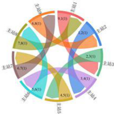
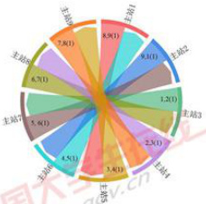
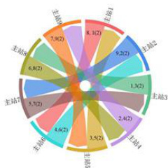
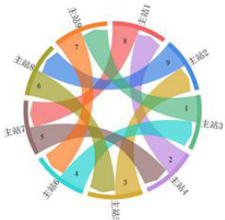
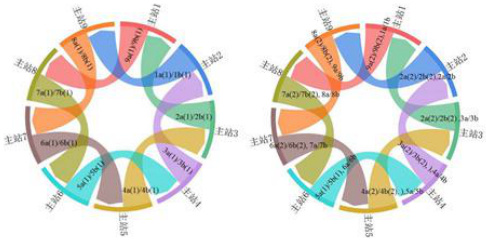

# 气象报文信息卫星通信传输

# 摘要

在某些紧急救援任务中下，为了更好地获取准确完整的气象信息，需要气象分队通过卫星通信传输数据，保障救援任务顺利完成。本文基于信息传输率最大化原则和各站点对称性原则，给出了气象报文信息共享的最少传输次数公式和最大站点个数公式，并通过建立传输模型对其进行证明。最终，给出了3个具体问题的传输方案。

针对问题一，首先计算出 $N$ 个主站间需要共享的信息总数为 $N \times ( N - 1 )$ 条，以及每次可传输的最大信息数为1.5条（第一次由于每个站点只拥有自己的1条气象信息，故只能传输1条信息）。因此，为满足信息传输率最大化原则和对称性原则，从第二次传输开始后，每个站点均按最大传输信息数1.5发送信息，由此得到传输次数 $\boldsymbol { K }$ 和主站点数量N之间的关系 $K \geq \lceil ( N - 2 ) / 1 . 5 \rceil + 1$ 。然后通过对$N$ 的取值进行分类讨论，分别证明了在不同情况下 $K = \lceil ( N - 2 ) \rceil 1 . 5 \rceil + 1$ 。由此建立一般的信息传输模型，并针对 $N = 9$ 得出了相应的最短传输时间 $K = 6$ ，并给出了具体的传输方案。

针对问题二，经分析，一个副站单次成功传输给任一主站的概率为 $8 0 \%$ 不满足题目条件，因此需要两个副站同时向任一主站传输或分别向不同主站各传输两次，此时概率为 $9 6 \%$ 。并且在信息传输时，优先主站间的气象报文相互传输。主站间传输模型与问题一一致，在主站传输信息的同时，副站依次给各主站发送信息，当主站信息共享完成后，主站和副站一同发送副站的信息。根据除首次传输外，每次最多均可传输2.5条信息，得出在传播时间 $\boldsymbol { K }$ 固定时，最大站点数量$N$ 与 $\boldsymbol { K }$ 满足 $N = \lfloor ( 5 K + 1 ) / 4 \rfloor$ ，且针对不同情况进行了证明并给出了对应的传输模型。针对 $K = 7$ 求得 $N = 9$ ，并结合给出的方案，通过使用VS(C $^ { + + }$ 计算了成功接收每分队至少一个副站气象报文的主站数量的期望值为6.2325、任一主站接收副站数量的期望值为13.12。

针对问题三，考虑到副站给主站传输至少需三条信息，抽象化定义每次分站小队传输的信息数量为2/3条，结合问题一和问题二的推导过程，得到了传播时间 $\boldsymbol { K }$ 固定时，最大站点数量 $N$ 与 $K$ 满足 $N = \lfloor ( 1 3 K + 3 ) / 1 2 \rfloor$ 。在此基础上，根据题中条件 $K = 8$ 求得 $N = 8$ ，并给出了相应的传输方案。基于该方案，计算了成功接收每分队至少一个副站气象报文的主站数量的期望值为7.50208、任一主站接收副站数量的期望值为11.008。 国广 gov

关键词：对称性原则，最小传输次数，VS（C+期望

# 一、问题重述

# 1.1问题背景

在一些紧急救援的情况下，受气象环境等因素影响，需将物资进行空投给待救援区域。如果地面通信系统出现了瘫痪情况，就需要派遣气象分队前往救援区域的主要目标点，进行实时气象数据采集并通过卫星通信传输数据，从而获得完整准确的地面气象观测信息，以保障救援任务的顺利进行。

# 1.2已知条件

针对上述情况，有如下的己知条件：

a)、一支气象分队需在一个区域的三个不同地点设立一个主站，两个副站；b)、一支气象分队有车载型卫星通信设备一套（主站部署），便携型卫星通  
信设备两套（副站部署）：c)、车载型卫星通信设备发送和接收的成功率为均 $1 0 0 \%$ d)、便携型卫星通信设备发送和接收的成功率为均 $8 0 \%$ e)、收发信息为气象报文，一条气象报文内容包含100个字符，每条信息  
发送时可包含158个字符；f)、同一条报文可分割成上下两个半段分别传输；g)、每部设备每次只能发送一条信息，发送两条信息之间需间隔一分钟h)、每部设备收发通道互不干涉，在发送信息的同时可以接收任意多条信  
息，且收发时间可以忽略；i)、副站不知本站信息是否发送成功；j)、每小时各分队主副站对所在地气象信息进行一次采集并进行信息共享；k)、信息共享是指任意观测站的气象信息被成功的发给其他所有观测站；1)、设派遣队伍数量为N，完成共享时间为 $\kappa$ 0

# 1.3问题

（1） $\textcircled{1}$ 在K分钟内完成 $\mathrm { ~ N ~ }$ 个主站间气象报文共享，根据 $\kappa$ 与 $\aleph$ 的关系建  
立传输模型；$\textcircled{2}$ 当派遣9支队伍 $\left( N = 9 \right)$ 时，怎么传输用时最短 $( k _ { \mathrm { s i n } } )$ 6（2） $\textcircled{1}$ 每支分队每个主站成功接收至少一个副站的气象报文概率 $\geq 0 . 9$ 。在  
满足前提条件的情况下，要求在K分钟内 $( k \geq 5 )$ 完成 $_ \mathrm { ~ N ~ }$ 个主站间气象报文的信  
息共享，根据N的最大值与K的关系建立一般传输模型；$\textcircled{2}$ 当传输时间为7分钟 $K = 7$ 时求出N的最大值，并给出此时副站的传输  
方案。并计算此方案下平均有多少主战能成功接收每支分队至少一个副站的气象

报文，及任一主站平均能成功接收多少个副站的气象报文。

（3）每支分队每个主站成功接收至少一个副站的气象报文概率 $\geq 0 . 9 7$ 当传输时间为8分钟 $\left( K = 8 \right)$ 时求出N的最大值，并给出此时副站的传输方案。并计算此方案下平均有多少主战能成功接收每支分队至少一个副站的气象报文，及任一主站平均能成功接收多少个副站的气象报文。

# 二、问题分析

# 2.1问题一分析

针对该问题，需保证在 $N \geq 5$ 时，所有主站点共享信息时间K最短。因此先确定N支队伍所需接收的信息总数，然后确定N支队伍每次最多可发送的信息量（认定每次每个站点最多发送1.5条信息）。为保证观测站点可以以最多发送量发送信息，在第一次传输后保证每个站点掌握两条信息（200个字符），用所需接收的信息总数除以每次可发送的最大信息量以此得出最短时间，得到K与N之间满足的不等式。

基于上述结果，对N的取值进行分类讨论，分别证明K可以取到不等式的下界，这样就求得了K与N之间的定量关系。针对每种情况，分别给出传输的一般模型，并代入 $\scriptstyle \mathbf { N } = 9$ 进行求解，得到该情况的传输模型。

# 2.2问题二分析

针对该问题，一个副站单次成功传输给任一主站的概率为 $8 0 \%$ 不满足题目条件，因此需要两个副站同时向任一主站传输或分别向不同主站各传输两次，此时概率为 $9 6 \%$ 。为保证最大效率，尽可能使所有站点都发送信息。且主站间优先发送信息进行气象报文信息共享。在主站进行气象信息共享的同时，副站依次给各主站发送信息，当主站间气象报文信息共享完成后，开始发送所收到的副站信息。考虑到除第一次外，其余每次传输信息上限为2.5N条，根据需要的总信息数量建立K与N之间的关系，得到K与N之间满足的不等式。

基于上述结果，对K的取值进行分类讨论，分别证明N可以取到不等式的上界，这样就求得了K与N之间的定量关系。针对每种情况，分别给出传输的一般模型，并代入 $K = 7$ 进行求解，得到该情况的传输模型。计算成功接收每分队至少一个副站气象报文的主站数量的期望值、任一主站接收副站数量的期望值。

# 2.3问题三分析

针对该问题，考虑到副站给主站传输至少需3条信息，抽象每次分站小队传输的信息数量为2/3条。结合上文问题二的分析，根据需传输的信息总数与单次传输上限，得到给定K与最大站点数量N之间的定量关系。

基于上述结果，代入 $K { = } 8$ 进行求解N的值，并给出该情况的传输模型，计算成功接收每分队至少一个副站气象报文的主站数量的期望值、任一主站接收副站数量的期望值。

# 三、模型假设

（1）假设每次传输所有站点同时发送信息。  
（2）假设每个气象报文只可平均分为上下两段。  
（3）假设每次发送的信息最多为1.5条（字符数小于158）。  
（4）假设在第一次发送信息前卫星通信设备不存在间隔时间情况。  
（5）假设N支队伍按顺序从1至N编号。

# 四、符号说明

<html><body><table><tr><td>序号</td><td>符号</td><td>含义</td></tr><tr><td>1</td><td>K</td><td>气象报文信息共享时间</td></tr><tr><td>2</td><td>N</td><td>气象分队的数量</td></tr><tr><td>3</td><td>m</td><td>≥1的自然数</td></tr><tr><td>4</td><td>i</td><td>任意一个主站</td></tr><tr><td>5</td><td>[]</td><td>向上取整</td></tr><tr><td>6</td><td></td><td>向下取整</td></tr><tr><td>7</td><td>j</td><td>某一站点采集的信息</td></tr><tr><td>8</td><td>i:（j，j,jN-1j）</td><td>第i个站点掌握的主站信息</td></tr></table></body></html>

# 五、模型的建立与求解

# 5.1模型的建立

# 5.1.1问题一

对于 $N$ 个主站，分析问题可知，每个主站所需的信息个数为N−1。

因为第一次发送信息时，各站点只掌握自己的报文信息，故第一次每个站点只能发送自己的信息给其他站点，本着对称性原则，第一次发送信息结束后各站点均掌握2条信息，所以此时各主站所需的信息数为N−2。

则N个主站所需发送的信息总数为，

$$
N \times ( N - 2 )
$$

由信息传输率最大化原则，每次发送信息的个数，均按最大值1.5N计算，可得传输完所有信息所需的时间数 $\boldsymbol { K }$ 应满足以下条件，OV

$$
K \ge \left\lceil \frac { N \times ( N - 2 ) } { 1 . 5 N } \right\rceil + 1
$$

化简整理可得，

$$
K \ge \left\lceil \frac { N - 2 } { 1 . 5 N } \right\rceil + 1
$$

针对上述不等式，给出N个主站间的传输方案模型，来证明 $K$ 可以取到$[ ( N - 2 ) / 1 . 5 ] + 1$ ，过程如下：

令 $N = ( 3 m + 2 . 3 m + 3 , 3 m + 4 ) \geq 5 { \bigl ( } m \geq 1 { \bigr ) }$ ，则可取到 $N \geq 5$ 所有自然数。

1）当 $N = 3 m + 2 ( m \geq 1 )$ 时：

Step1:从第 $i$ 个主站开始依次向下一个相邻主站发送信息

$$
i \to i + 1 , ( i = 1 , \cdots , N - 1 ) , N \to 1
$$

此时，从第1到第 $_ \mathrm { ~ N ~ }$ 个主站掌握的信息情况为：

$$
1 { : } ( J _ { _ { N } } , J _ { 1 } ) , \ \cdots . . . . . , N : ( J _ { _ { N - 1 } } , J _ { _ { N } } )
$$

S𝑡𝑒𝑝2：每个队的主站依次向间隔一个队伍的主站发送信息

$$
i  i + 2 , ( i = 1 , \cdots , N - 2 ) , N - 1  1 , N  2 .
$$

此时，从第1到第 $_ \mathrm { ~ N ~ }$ 个主站掌握的信息情况为：

$$
1 ; ( J _ { _ { N - 2 ( 1 ) } } , J _ { _ { N - 1 } } , J _ { _ { N } } , J _ { 1 } ) , \quad \cdots \cdots , N : ( J _ { _ { N - 3 ( 1 ) } } , J _ { _ { N - 2 } } , J _ { _ { N - 1 } } , J _ { _ { N } } ) .
$$

S𝑡𝑒𝑝3：每个主站依次向间隔两个主站对应的主站发送信息

$$
i  i + 3 , ( i = 1 , \cdots , N - 3 ) , N - 2  1 , N - 1  2 , N  3 .
$$

此时，从第1到第 $\mathrm { ~ N ~ }$ 个主站掌握的信息情况为：

$$
\begin{array} { r l r } {  { 1 ; ( J _ { N - 3 } , J _ { N - 2 } , J _ { N - 1 } , J _ { N } , J _ { 1 } ) , \ \cdots \cdots , N : ( J _ { N - 4 } , J _ { N - 3 } , J _ { N - 2 } , J _ { N - 1 } , J _ { N } ) . } } \\ & { } & \\ & { \vdots } & \\ & { } & { \vdots } \end{array}
$$

递推可得，当传输 $2 m + 1$ 次时，每个主站接收到的信息总数为 $3 m + 2$ ，此时每个主站掌握的信息为：

$$
1 ; ( J _ { 2 } , . . . . . , J _ { N - 1 } , J _ { N } , J _ { 1 } ) , \ . . . . . , N : ( J _ { 1 } , J _ { 2 } , . . . . , J _ { N - 2 } , J _ { N - 1 } , J _ { N } )
$$

传输完成，此时传输次数为 $2 m + 1$ 次，将 $N = 3 m + 2 ( m \geq 1 )$ 代入 $\lceil ( N - 2 ) / 1 . 5 \rceil + 1$ 中得， $\lceil ( N - 2 ) / 1 . 5 \rceil + 1 = 2 m + 1$ 。证明在 $N = 3 m + 2 ( m \geq 1 )$ 时， $K$ 可以取到最大值$[ ( N - 2 ) / 1 . 5 ] + 1$ 业 v.cn

2）当 $N = 3 m + 3 ( m \geq 1 )$ 时：

Stepl:从第 $i$ 个主站开始依次向下一个相邻主站发送信息

$$
i \to i + 1 , ( i = 1 , \cdots , N - 1 ) , N \to 1
$$

此时，从第1到第 $\mathrm { ~ N ~ }$ 个主站掌握的信息情况为：

$$
1 { \div } ( J _ { _ { N } } , J _ { 1 } ) , \ { \cdots } { \cdots } , N : ( J _ { _ { N - 1 } } , J _ { _ { N } } )
$$

St𝑒𝑝2：每个队的主站依次向间隔一个队伍的主站发送信息

$$
i  i + 2 , ( i = 1 , \cdots  , N - 2 ) , N - 1  1 , N  2 .
$$

此时，从第1到第 $\mathrm { ~ N ~ }$ 个主站掌握的信息情况为：

$$
1 ; ( J _ { N - 2 ( 1 ) } , J _ { N - 1 } , J _ { N } , J _ { 1 } ) , \cdots \cdots , N ; ( J _ { N - 3 ( 1 ) } , J _ { N - 2 } , J _ { N - 1 } , J _ { N } ) .
$$

S𝑡𝑒p3：每个主站依次向间隔两个主站对应的主站发送信息

$$
i  i + 3 , ( i = 1 , \cdots , N - 3 ) , N - 2  1 , N - 1  2 , N  3 .
$$

此时，从第1到第 $_ \mathrm { ~ N ~ }$ 个主站掌握的信息情况为：

$$
1 { \mathopen : } ( J _ { \scriptscriptstyle { N - 3 } } , J _ { \scriptscriptstyle { N - 2 } } , J _ { \scriptscriptstyle { N - 1 } } , J _ { \scriptscriptstyle { N } } , J _ { 1 } ) , \qquad \cdot . . . , N { \mathopen : } ( J _ { \scriptscriptstyle { N - 4 } } , J _ { \scriptscriptstyle { N - 3 } } , J _ { \scriptscriptstyle { N - 2 } } , J _ { \scriptscriptstyle { N - 1 } } , J _ { \scriptscriptstyle { N } } ) .
$$

递推可得，当传输 $2 m + 1$ 次时，每个主站接收到的信息总数为 $3 m + 2$ ，此时每个主站掌握的信息为：

$$
1 { \mathopen { : } } ( J _ { 3 } , J _ { 4 } , . . . . . , J _ { N - 1 } J _ { N } , J _ { 1 } ) , \ . . . . . , N : ( J _ { 2 } , J _ { 3 } , . . . . , J _ { _ { N - 2 } } , J _ { _ { N - 1 } } , J _ { _ { N } } )
$$

此时传输次数为 $2 m + 1$ 次，每个主站尚有1个主站的信息未知，因此还需传输 $^ 1$ 次使得所有主站共享信息。此时传输完成，传输次数为 $2 m + 2$

将 $N = 3 m + 3 ( m \geq 1 )$ 代入 $[ ( N - 2 ) / 1 . 5 ] + 1$ 中得， $\lceil ( N - 2 ) / 1 . 5 \rceil + 1 = 2 m + 2$ 。证明在 $N = 3 m + 3 ( m \geq 1 )$ 时， $\boldsymbol { K }$ 可以取到最大值 $\lceil ( N - 2 ) / 1 . 5 \rceil + 1$ 。

3）当 $N = 3 m + 4 ( m \geq 1 )$ 时：

Step1：从第 $i$ 个主站开始依次向下一个相邻主站发送信息

$$
i \to i + 1 , ( i = 1 , \cdots , N - 1 ) , N \to 1
$$

此时，从第1到第 $\mathrm { ~ N ~ }$ 个主站掌握的信息情况为：

$$
1 { : } ( J _ { \boldsymbol { N } } , J _ { 1 } ) , \ \cdots { } , \ N : ( J _ { \boldsymbol { N - 1 } } , J _ { \boldsymbol { N } } )
$$

S𝑡e𝑝2：每个队的主站依次向间隔一个队伍的主站发送信息

$$
i \to i + 2 , ( i = 1 , \cdots , N - 2 ) , N - 1 \to 1 , N \to 2 .
$$

此时，从第 $^ 1$ 到第N个主站掌握的信息情况为：

$$
1 { \colon } ( J _ { _ { N - 2 ( 1 ) } } , J _ { _ { N - 1 } } , J _ { _ { N } } , J _ { 1 } ) , \ { \cdots } { \cdots } , N { \colon } ( J _ { _ { N - 3 ( 1 ) } } , J _ { _ { N - 2 } } , J _ { _ { N - 1 } } ; J _ { _ { N } } ) .
$$

Step3：每个主站依次向间隔两个主站对应的主站发送信息

$$
i  i + 3 , ( i = 1 , \cdots , N - 3 ) , N - 2  1 , N - 1  2 , N  3 .
$$

此时，从第1到第 $\mathrm { ~ N ~ }$ 个主站掌握的信息情况为：

$$
1 { \colon } ( J _ { _ { N - 3 } } , J _ { _ { N - 2 } } , J _ { _ { N - 1 } } , J _ { _ { N } } , J _ { 1 } ) , \ \cdots , N { \colon } ( J _ { _ { N - 4 } } , J _ { _ { N - 3 } } , J _ { _ { N - 2 } } , J _ { _ { N - 1 } } , J _ { _ { N } } ) .
$$

递推可得，当传输 $2 m + 1$ 次时，每个主站接收到的信息总数为 $3 m + 2$ ，此时每个主站掌握的信息为：

$$
1 ; ( J _ { 4 } , J _ { 5 } , . . . . . . , J _ { N - 1 } J _ { N } , J _ { 1 } ) , \cdots . . . . . , N : ( J _ { 3 } , J _ { 4 } , . . . . , J _ { _ { N - 2 } } , J _ { _ { N - 1 } } , J _ { _ { N } } )
$$

此时传输次数为 $2 m + 1$ 次，每个主站尚有2个主站的信息未知，因此还需至少传输2次使得所有主站共享信息。此时传输完成，传输次数为 $2 m + 3$

将 $N = 3 m + 4 ( m \geq 1 )$ 代入 $[ ( N - 2 ) / 1 . 5 ] + 1$ 中得， $\lceil ( N - 2 ) / 1 . 5 \rceil + 1 = 2 m + 3$ 。证明在 $N = 3 m + 4 ( m \geq 1 )$ 时， $K$ 可以取到最大值 $[ ( N - 2 ) / 1 . 5 ] + 1$

综上所述，当主站个数 $N \geq 5$ 时，都可以取到 $K = \lceil ( N - 2 ) \rceil 1 . 5 \rceil + 1$ ，且给出相应的传输方案，然后可计算出成功接收每分队至少一个副站气象报文的主站数量的期望值、任一主站接收副站数量的期望值。

# 5.1.2问题二

为了提高气象信息的地理密度，还需要副站的信息加以补充。但需满足每个主站成功接受任一分队至少一个副站报文信息的概率大于等于0.9，经简单的概率计算，得到同一分队的 $2$ 个主站同时向某一主站传输信息时，该主站成功接收至少一个副站报文信息的概率为：

$$
P = ( 1 - 0 . 8 ) ^ { 2 } = 0 . 9 6
$$

满足副站向主站传递信息的条件。因此规定，将同一主站的 $2$ 个副站看作一个整体。

在主副站同时发送信息的情况下，所需的全部信息数为 $2 N - 3$ ，在此过程，为保证发送信息的成功率，只考虑副站给主站发送信息的情况。因此，每次各分队最大发送信息数为 $1 + 1 . 5 = 2 . 5$ ，由上述可得出 $K$ 关于 $N$ 的表达式为，

$$
K \geq \left\lceil { \frac { 2 N - 3 } { 2 . 5 } } \right\rceil + 1
$$

经过恒等变形，可得出 $N$ 关于 $\boldsymbol { K }$ 的表达式为，

$$
N \leq \left\lfloor { \frac { 5 K + 1 } { 4 } } \right\rfloor
$$

针对上述不等式，给出 $N$ 个主站间的传输方案模型，证明N可以取到$\lfloor ( 5 K + 1 ) / 4 \rfloor$ ，过程如下： 1ov

取 $5 K + 1 = 4 n , 4 n + 1 , 4 n + 2 , 4 n + 3$ ，则可遍历所有自然数。

1）当 $5 K + 1 = 4 n$ 时，假设站点个数可取到 $N = n$ ，只需证明 $N = n$ 个站点使用的发送次数等于 $\boldsymbol { K }$ ，即可说明该方案满足要求，且站点个数可取到 $N = n$ 。

由于 $5 K = 4 n - 1$ 的个位数只能为0或5，但由于 $4 n - 1$ 为奇数，所以 $4 n$ 的个位数只能为 $6$ ，只有个位数为4或9的数字与4相乘时个位数为6，所以 $n$ 可表示为 $_ { 5 m - 1 }$ 的形式；

假设刚好传输完主站信息的次数为 $K _ { 1 }$ ，则有：

$$
K _ { 1 } = \left\lceil { \frac { n - 2 } { 1 . 5 } } \right\rceil + 1 = \left\lceil { \frac { m } { 3 } } \right\rceil + 3 m - 1
$$

a当 $\scriptstyle m = 3 a$ 时，有 $K _ { 1 } = 1 0 a - 1 , N = 1 5 a - 1 , K = 1 2 a - 1 ;$

在第 $K _ { 1 }$ 次之后，1,… $N$ 所含信息情况如下

$$
1 \div \left( \begin{array} { l } { \pm \tilde { \mathcal { A } } \sharp : 1 , \cdots \cdots , 1 5 a - 1 } \\ { \mathbb { E } \lVert \tilde { \mathcal { A } } : 5 a + 2 , \cdots \cdots , 1 5 a - 1 } \end{array} \right) \cdots \cdots \cdots \cdot N : \left( \begin{array} { l } { \pm \tilde { \mathcal { A } } \sharp : 1 , \cdots \cdots , 1 5 a - 1 } \\ { \mathbb { E } \lVert \tilde { \mathcal { A } } : 5 a + 1 , \cdots \cdots , 1 5 a - 1 } \end{array} \right)
$$

剩余5a个副站信息未知，此时主站和副站每次传输2.5个副站信息，需2a次即可完成传输。

此时传输次数为： $K _ { 1 } + 2 a = 1 2 a - 1 = K$

因为传输次数与计算出的 $K$ 值相同， $N$ 可以取到 $\lfloor ( 5 K + 1 ) / 4 \rfloor$ ，方案可行；b)当 $\begin{array} { r } { m = 3 a + 1 } \end{array}$ 时，有 $K _ { 1 } = 1 0 a + 3$ 。 $K _ { \iota }$ 表示主站完成共享传输次数）

$$
K = 1 2 a + 3
$$

在第 $K _ { 1 } - 2$ 次之后，1. $N$ 所含信息情况如下

$$
\begin{array} { r } { 1 : \left( \begin{array} { l } { \pm \tilde { y } [ \pm 4 , 5 , \cdots \cdots , 1 5 a + 4 , 1 } \\ { \mp 1 ] \tilde { y } [ \pm 5 , 5 a + 5 , \cdots \cdots , 1 5 a + 4 , 1 } \end{array} \right) } \\ { N : \left( \begin{array} { l } { \pm \tilde { y } [ \pm 3 , 4 , \cdots \cdots , 1 5 a + 4 , 1 } \\ { \mp 1 ] \tilde { y } [ \pm 4 , 5 , a + 4 , \cdots \cdots , 1 5 a + 4 , 1 } \end{array} \right) } \end{array}
$$

在第 $K _ { \kappa }$ -1次之后，., $N$ 所含信息情况如下

在第 $K _ { 1 }$ 次之后，.N所含信息情况如下

$$
\begin{array} { r l } & { 1 : \left( \begin{array} { l } { \pm \breve { y } _ { 1 } ^ { k } ; 1 , : . . . . . . , 1 5 a + 4 } \\ { \breve { \mathbb { E } } \| \breve { y } _ { 1 } ^ { k } ; 5 a + 2 , : . . . . . . , 1 5 a + 4 , 1 } \end{array} \right) } \\ & { \quad N : \left( \frac { 2 5 \breve { y } _ { 1 } ^ { k } ; 1 , . . . . . . , 1 5 a + 4 } { \breve { \mathbb { E } } \| \breve { y } _ { 1 } ^ { k } ; 5 a + 1 , . . . . . . , 1 5 a + 4 } \right) } \end{array}
$$

剩余 ${ \mathfrak { s } } _ { a }$ 不知，则再需 $2 a$ 次即可完成传输  
此时传输次数为： $K _ { 1 } + 2 a = 1 2 a + 3 = K$ （204号  
因为传输次数与计算出的 $K$ 值相同， $N$ 可以取到 $\lfloor ( 5 K + 1 ) / 4 \rfloor$ ，方案可行：  
c当 $m = 3 a + 2$ 时，有 $K _ { 1 } = 1 0 a + 6$ C $K _ { \iota }$ 表示主站完成共享传输次数）

$$
K = 1 2 a + 7
$$

在第 $K _ { 1 }$ −1次之后，1.,…, $N$ 所含信息情况如下

$$
\begin{array} { r } { 1 : \left( \begin{array} { l } { \pm \frac { \partial [ \xi ] } { \partial [ \xi ] } : 3 , 4 , 5 , \cdots \cdots , 1 5 a + 9 , 1 } \\ { \frac { \partial [ \xi ] } { \partial [ \xi ] } : 5 a + 6 , \cdots \cdots , 1 5 a + 9 , 1 } \end{array} \right) } \\ { N : \left( \begin{array} { l } { \pm \frac { \partial [ \xi ] } { \partial [ \xi ] } : 2 , 3 , 4 , \cdots \cdots , 1 5 a + 9 , 1 } \\ { \frac { \partial [ \xi ] } { \partial [ \xi ] } \frac { \partial [ \xi ] } { \partial [ \xi ] } : 5 a + 5 , \cdots \cdots , 1 5 a + 9 } \end{array} \right) } \end{array}
$$

在第 $K _ { \iota }$ 次之后，1,, $N$ 所含信息情况如下

$$
\begin{array} { r l } & { 1 \colon \left( \begin{array} { l } { \pm \frac { \partial L _ { 1 } } { \partial L _ { 1 } ^ { 5 } } \pm 1 , \cdots \cdots , 1 5 a + 9 } \\ { \frac { \partial L _ { 1 } } { \partial L _ { 1 } ^ { 5 } } \pm 5 a + 4 ( 1 ) , \cdots \cdots , 1 5 a + 9 , 1 } \end{array} \right) } \\ & { N : \left( \begin{array} { l } { \pm \frac { \partial L _ { 1 } } { \partial L _ { 1 } ^ { 5 } } \pm 1 , \cdots \cdots , 1 5 a + 9 } \\ { \frac { \partial L _ { 1 } } { \partial L _ { 1 } ^ { 5 } } \pm 5 a + 3 ( 1 ) , \cdots \cdots , 1 5 a + 9 } \end{array} \right) } \end{array}
$$

在第 $K _ { 1 } + 1$ 次之后，1., $N$ 所含信息情况如下

$$
\begin{array} { r l } & { 1 : \left( \begin{array} { l } { \pm \frac { \lambda _ { l } \xi _ { 1 } } { k [ \lambda _ { l } ] } , 1 , . . . . . . , 1 5 a + 9 } \\ { \frac { \lambda _ { l } } { [ \lambda _ { l } ] } [ \frac { \lambda _ { l } } { \lambda _ { l } } ; 5 a + 2 , . . . . . . , 1 5 a + 9 , 1 } \end{array} \right) } \\ &  \quad N : \left( \begin{array} { l } { \pm \frac { \lambda _ { l } } { \vert \lambda _ { l } \vert } , . . . . . . , 1 5 a + 9 } \\ { \frac { \lambda _ { l } } { [ \lambda _ { l } ] \vert \frac { \lambda _ { l } } { \lambda _ { l } } ; 5 a + 1 , . . . . . . , 1 5 a + 9 } \end{array} \right) } \end{array}
$$

剩余 $5 a$ 不知，则再需 $2 a$ 次即可完成传输；

此时传输次数为： $K _ { 1 } + 1 + 2 a = 1 2 a + 7 = K$

因为传输次数与计算出的 $K$ 值相同， $N$ 可以取到 $\lfloor ( 5 K + 1 ) / 4 \rfloor$ ，方案可行：2）当 $5 K + 1 = 4 n + 2 . 4 n + 3$ 时，参考上述的证明过程，也可给出相应的方案

来证明 $N$ 最大可以取到 $\lfloor ( 5 K + 1 ) / 4 \rfloor$

综上所述，当传输次数 $K \geq 5$ 时，都可以取到 $N = \lfloor ( 5 K + 1 ) / 4 \rfloor$ ，且给出相应的传输方案，然后可计算出成功接收每分队至少一个副站气象报文的主站数量的期望值、任一主站接收副站数量的期望值。

# 5.1.3问题三

题中要求，各主站至少成功接收到各自分队副站气象报文的概率 $\geq 0 . 9 7$ ，则意味着各分队副站至少发送三条消息才能满足题意。且规定 $K = 8$ ，求出队伍 $N$ 最大时的情况。

根据题意建立模型：

假设副站每次发送的信息总数为2/3条，则每支队伍所需要获得的消息数为

$$
\left( 2 N - 1 \right) \times N - N - \frac { 2 } { 3 } \cdot N
$$

每次所发消息的总数为

$$
\left( \frac { 3 } { 2 } + \frac { 2 } { 3 } \right) \cdot N
$$

那么此时， $\mathbf { K }$ 与 $\mathrm { ~ N ~ }$ 就满足以下关系式

$$
\left\lceil \frac { ( 2 N - 1 ) \times N - N - \frac { 2 } { 3 } \cdot N } { ( \frac { 3 } { 2 } + \frac { 2 } { 3 } ) \cdot N } \right\rceil + 1 \le K
$$

化简整理，得

$$
N \leq \left\lfloor { \frac { 1 3 K + 3 } { 1 2 } } \right\rfloor
$$

同问题二类似，也可证明：

$$
N = \left\lfloor { \frac { 1 3 K + 3 } { 1 2 } } \right\rfloor
$$

这里不再赘述。

# 5.2模型的求解

# 5.2.1问题一

当 $N = 9$ 时，将 $N = 9$ 代入上述公式，得到 $K _ { \mathrm { e } i \mathrm { n } } = 6$ ，再依据上述传输方案得到主站间具体气象报文传输方案如下表： .cn

表1主站气象报文的传输方方案 $( \Nu = \ldots , \Nu = \ldots )$   

<html><body><table><tr><td>传输轮 数序号</td><td>发送站 点序号</td><td>接受站 点序号</td><td>发送信息所属 站点序号（含信</td><td></td><td></td><td>此轮后接收站点已有信息所 属站点序号（含信息完整性）</td></tr><tr><td>1</td><td>1</td><td>2</td><td>息完整性） 1</td><td></td><td>1,2</td><td></td></tr><tr><td>1</td><td></td><td>3</td><td>2</td><td></td><td>2,3</td><td></td></tr><tr><td>1</td><td>23</td><td>4</td><td>3</td><td></td><td>3,4</td><td></td></tr><tr><td>1</td><td>4</td><td>5</td><td>4</td><td></td><td>4.5</td><td></td></tr><tr><td>1</td><td>5678</td><td>6</td><td>5</td><td></td><td>5,6</td><td></td></tr><tr><td>1</td><td></td><td>7</td><td>6</td><td></td><td>6,7</td><td></td></tr><tr><td>1</td><td></td><td>8</td><td>7</td><td></td><td>7.8</td><td></td></tr><tr><td>1</td><td></td><td>9</td><td>8</td><td></td><td>8,9</td><td></td></tr><tr><td>1</td><td>9</td><td>1</td><td>9</td><td></td><td>1,9</td><td></td></tr><tr><td>2</td><td>1</td><td>3</td><td>9，1(1)</td><td></td><td>2，3，9，1（1）</td><td></td></tr><tr><td>2</td><td>2</td><td>4</td><td>1，2（1）</td><td></td><td>3,4，1，2（1）</td><td></td></tr><tr><td>2</td><td>3</td><td>5</td><td>2，3（1）</td><td></td><td>4，5，2，3（1）</td><td></td></tr><tr><td>2</td><td>4</td><td>6</td><td>3，4（1）</td><td></td><td>5，6，3，4（1）</td><td></td></tr><tr><td>2</td><td>5</td><td>7</td><td>4,5（1）</td><td></td><td>6，7，4，5（1）</td><td></td></tr><tr><td>2</td><td>6</td><td>8</td><td>5，6（1）</td><td></td><td>7，8，5，6（1）</td><td></td></tr><tr><td>2</td><td>7</td><td>9</td><td>6，7（1）</td><td></td><td></td><td>8,9，6，7（1）</td></tr><tr><td>2</td><td>8</td><td>1</td><td>7.8（1）</td><td></td><td></td><td>9，1，7，8（1）</td></tr><tr><td>2</td><td>9</td><td>2</td><td>8,9（1）</td><td></td><td></td><td>1，2,8.9（1）</td></tr><tr><td>3</td><td>1</td><td>4</td><td>9,2(2)</td><td></td><td>1,2，3,4,9</td><td></td></tr><tr><td>333</td><td>2</td><td>5</td><td>1.3(2)</td><td></td><td>2.3,4,5.1</td><td></td></tr><tr><td></td><td>3</td><td>6</td><td>2,4(2)</td><td></td><td>3,4,5,6，2</td><td></td></tr><tr><td></td><td>4</td><td>7</td><td>3.5(2)</td><td></td><td>4.5.6.7.3</td><td></td></tr><tr><td></td><td>5</td><td>8</td><td>4,6(2)</td><td></td><td>5,6,7.8,4</td><td></td></tr><tr><td></td><td>67</td><td>9</td><td>5,7(2)</td><td></td><td>6,7,8,9,5</td><td></td></tr><tr><td></td><td></td><td>1</td><td>6，8(2)</td><td></td><td>7.8,9,</td><td>1,6</td></tr><tr><td>３３３３</td><td>8</td><td>2</td><td>7.9 (2)</td><td></td><td>8,9.1,</td><td>2.7</td></tr><tr><td>3</td><td>9</td><td>3</td><td>8.1(2)</td><td></td><td>9,1，2,3,8</td><td>2，3，4，5，8，9（1），1</td></tr><tr><td>4 4</td><td>1 2</td><td>5 6</td><td>8,9（1） 9，1（1）</td><td></td><td></td><td>3，4，5，6，9，1（1），2</td></tr><tr><td>4</td><td>3</td><td>7</td><td>1,2（1）</td><td></td><td></td><td>4，5，6，7，1，2（1），3</td></tr><tr><td>4</td><td>4</td><td>8</td><td>2，3（1）</td><td></td><td></td><td>5，6，7，8，2，3（1），4</td></tr><tr><td>4</td><td>5</td><td>9</td><td>3，4（1）</td><td></td><td></td><td>6，7，8，9，3，4（1），5</td></tr><tr><td>4</td><td>6</td><td>1</td><td>4.5（1）</td><td></td><td></td><td>7，8，9，1，4，5（1），6</td></tr><tr><td>4</td><td>7</td><td>2</td><td>5，6（1）</td><td></td><td></td><td>8,9，1,2，5,6（1），7</td></tr><tr><td>4</td><td>8</td><td>3</td><td>6,7（1）</td><td></td><td></td><td>9,1，2.3.6，7（1），8</td></tr><tr><td>4</td><td>9</td><td>4</td><td>7，8（1）</td><td></td><td></td><td>1,2.3.4,7.8（1）.9</td></tr><tr><td>5</td><td></td><td>6</td><td>8,1(2)</td><td></td><td>1.2.3.4,</td><td>5, 6, 8.9</td></tr><tr><td>5</td><td>1 2</td><td>7</td><td>9.2(2)</td><td></td><td>1.2.3,4</td><td>6, 7, 9</td></tr><tr><td>5</td><td>3</td><td>8</td><td>1.3（2)</td><td></td><td>1.2,3,4,</td><td>5, 6, 7.8</td></tr><tr><td>5</td><td>4</td><td>9</td><td>2.4(2)</td><td></td><td>2.3，4,5,</td><td>6, 7, 8.9</td></tr></table></body></html>

<html><body><table><tr><td>555</td><td></td><td></td><td>3,5(2) 4，</td></tr><tr><td></td><td>567</td><td></td><td>4,6(2)</td></tr><tr><td></td><td></td><td>23</td><td></td></tr><tr><td>5</td><td>8</td><td>4</td><td>999 6,8(2)</td></tr><tr><td>56</td><td>91</td><td></td><td></td></tr><tr><td></td><td></td><td>57</td><td>7,9(2)</td></tr><tr><td>6</td><td>2</td><td>8</td><td>9 1</td></tr><tr><td>6</td><td>3</td><td>9</td><td></td></tr><tr><td>6</td><td>4</td><td>1</td><td></td></tr><tr><td>6</td><td>5</td><td>2</td><td>2 3</td></tr><tr><td>6</td><td>6</td><td>3</td><td>4</td></tr><tr><td>6</td><td>7</td><td>4</td><td>5</td></tr><tr><td>6</td><td>8</td><td>5</td><td>6</td></tr><tr><td>6</td><td>9</td><td>6</td><td>7</td></tr><tr><td></td><td></td><td></td><td></td></tr></table></body></html>

表中1（1）,2（1），…，9（1）表示每个主站信息的上半段；1（2），2（2），9（2）表示该每个主站信息的下半段。

主站8小 主站3主站7

  
图2.第二次传输

8IC)主站8 1,3(2)7,9(2)主站7 木 主站3新 一

  
图1.第一次传输  
图3.第三次传输  
图4.第四次传输

  
图5.第五次传输

  
图6.第六次传输

# 5.2.2问题二

当 $K = 7$ 时，将 $K = 7$ 代入上述公式，得到 $N _ { \mathrm { m a x } } = 9$ ，再依据上述传输方案得到主站间具体气象报文传输方案如下表：

表2副站气象报文的传输方案 $( \Nu = \ l _ { \cdots } , \ \ l _ { \textsc { k } } = \ l _ { \cdots } )$   

<html><body><table><tr><td>传输轮数序号</td><td>发送站点序号</td><td>接受站点序号</td><td>发送信息所属站点序号 （含信息完整性）</td></tr><tr><td>1</td><td>1a,1b</td><td>1</td><td>1a,1b</td></tr><tr><td>1</td><td>2a,2b</td><td>2</td><td>2a,2b</td></tr><tr><td>1</td><td>3a,3b</td><td>3</td><td>3a,3b</td></tr><tr><td>1</td><td>4a,4b</td><td>4</td><td>4a,4b</td></tr><tr><td>1</td><td>5a,5b</td><td>5</td><td>5a,5b</td></tr><tr><td>1</td><td>6a,6b</td><td>6</td><td>6a,6b</td></tr><tr><td>1</td><td>7a,7b</td><td>7</td><td>7a,7b</td></tr><tr><td>1</td><td>8a,8b</td><td>8</td><td>8a,8b</td></tr><tr><td>1</td><td>9a,9b</td><td>9</td><td>9a,9b</td></tr><tr><td>2</td><td>9a,9b</td><td>1</td><td>9a,9b</td></tr><tr><td>2</td><td>1a,1b</td><td>2</td><td>la,1b</td></tr><tr><td>2</td><td>2a,2b</td><td>3</td><td>2a,2b</td></tr><tr><td>2</td><td>3a,3b</td><td>4</td><td>3a,3b</td></tr><tr><td>2</td><td>4a,4b</td><td>5</td><td>4a,4b</td></tr><tr><td>2</td><td>5a,5b</td><td>6</td><td>5a,5b</td></tr><tr><td>2</td><td>6a,6b</td><td>7</td><td>6a,6b</td></tr><tr><td>2</td><td>7a,7b</td><td>8</td><td>7a,7b</td></tr><tr><td>2</td><td>8a,8b</td><td>9 中国大学生在 oe.gov.cn</td><td>8a.8b</td></tr><tr><td>3</td><td>8a,8b</td><td></td><td>8a,8b</td></tr><tr><td>3</td><td>9a,9b</td><td></td><td>9a,9b</td></tr><tr><td>3</td><td>1a,1b</td><td></td><td>1a,1b</td></tr><tr><td>3</td><td>2a,2b</td><td>5.</td><td>2a,2b</td></tr></table></body></html>

<html><body><table><tr><td>3</td><td>3a,3b</td><td>5</td><td>3a,3b</td></tr><tr><td>3</td><td>4a,4b</td><td>6</td><td>4a,4b</td></tr><tr><td>3</td><td>5a,5b</td><td>7</td><td>5a,5b</td></tr><tr><td>3</td><td>6a,6b</td><td>8</td><td>6a,6b</td></tr><tr><td>3</td><td>7a,7b</td><td>9</td><td>7a,7b</td></tr><tr><td>4</td><td>7a,7b</td><td>1</td><td>7a,7b</td></tr><tr><td>4</td><td>8a,8b</td><td>2</td><td>8a,8b</td></tr><tr><td>4</td><td>9a,9b</td><td>3</td><td>9a,9b</td></tr><tr><td>4</td><td>1a,1b</td><td>4</td><td>1a,1b</td></tr><tr><td>4</td><td>2a,2b</td><td>5</td><td>2a,2b</td></tr><tr><td>4</td><td>3a,3b</td><td>6</td><td>3a,3b</td></tr><tr><td>4</td><td>4a,4b</td><td>7</td><td>4a,4b</td></tr><tr><td>4</td><td>5a,5b</td><td>8</td><td>5a,5b</td></tr><tr><td>4</td><td>6a,6b</td><td>9</td><td>6a,6b</td></tr><tr><td>5</td><td>6a,6b</td><td>1</td><td>6a,6b</td></tr><tr><td>5</td><td>7a,7b</td><td>2</td><td>7a,7b</td></tr><tr><td>5</td><td>8a,8b</td><td>3</td><td>8a,8b</td></tr><tr><td>5</td><td>9a,9b</td><td>4</td><td>9a,9b</td></tr><tr><td>5</td><td>1a,1b</td><td>5</td><td>1a,1b</td></tr><tr><td>5</td><td>2a,2b</td><td>6</td><td>2a,2b</td></tr><tr><td>5</td><td>3a,3b</td><td>7</td><td>3a,3b</td></tr><tr><td>5</td><td>4a,4b</td><td>8</td><td>4a,4b</td></tr><tr><td>5</td><td>5a,5b</td><td>9</td><td>5a,5b</td></tr><tr><td>6</td><td>5a,5b</td><td>1</td><td>5a,5b</td></tr><tr><td>6</td><td>6a,6b</td><td>2</td><td>6a,6b</td></tr><tr><td>6</td><td>7a,7b</td><td>3</td><td>7a,7b</td></tr><tr><td>6</td><td>8a,8b</td><td>4</td><td>8a,8b</td></tr><tr><td>6</td><td>9a,9b</td><td>5</td><td>9a,9b</td></tr><tr><td>6</td><td>1a,1b</td><td>6</td><td>1a,1b</td></tr><tr><td>6</td><td>2a,2b</td><td>7</td><td>2a,2b</td></tr><tr><td>6</td><td>3a,3b</td><td>8</td><td>3a,3b</td></tr><tr><td>6</td><td>4a,4b</td><td>9</td><td>4a,4b</td></tr><tr><td>6 6</td><td>3</td><td>1</td><td>2a(1)/2b(1)</td></tr><tr><td>6</td><td>4</td><td>2</td><td>3a(1)3b(1)</td></tr><tr><td>6</td><td>5</td><td>3</td><td>4a(1)/4b(1)</td></tr><tr><td>6</td><td>6</td><td>4</td><td>5a(1)5b(1)</td></tr><tr><td>6</td><td>7</td><td>5</td><td>6a(1)/6b(1)</td></tr><tr><td>6</td><td>8</td><td>6</td><td>7a(1)7b(1)</td></tr><tr><td></td><td>9</td><td>7</td><td>8a(1）/8b（1）</td></tr><tr><td>6</td><td>1</td><td>8</td><td>9a(1)9b(1)</td></tr><tr><td>6</td><td>2</td><td>中国大学生 3oe.gov.cn</td><td>la(1)/1b(1)</td></tr><tr><td>7</td><td>4a,4b</td><td></td><td>4a,4b</td></tr><tr><td>7</td><td>5a.5b</td><td></td><td>5a,5b</td></tr><tr><td>7</td><td>6a,6b</td><td></td><td>6a,6b</td></tr></table></body></html>

<html><body><table><tr><td>7</td><td>7a,7b</td><td>4</td><td>7a,7b</td></tr><tr><td>7</td><td>8a,8b</td><td>5</td><td>8a,8b</td></tr><tr><td>7</td><td>9a,9b</td><td>6</td><td>9a,9b</td></tr><tr><td>7</td><td>1a,1b</td><td>7</td><td>1a,1b</td></tr><tr><td>7</td><td>2a,2b</td><td>8</td><td>2a,2b</td></tr><tr><td>7</td><td>3a,3b</td><td>9</td><td>3a,3b</td></tr><tr><td>7</td><td>3</td><td>1</td><td>2a(2)/2b(2),3a/3b</td></tr><tr><td>7</td><td>4</td><td>2</td><td>3a(2)/3b(2),4a/4b</td></tr><tr><td>7</td><td>5</td><td>3</td><td>4a(2)/4b(2),5a/5b</td></tr><tr><td>7</td><td>6</td><td>4</td><td>5a(2)/5b(2),6a/6b</td></tr><tr><td>7</td><td>7</td><td>5</td><td>6a(2)/6b(2),7a/7b</td></tr><tr><td>7</td><td>8</td><td>6</td><td>7a(2)/7b(2),8a/8b</td></tr><tr><td>7</td><td>9</td><td>7</td><td>8a(2)/8b(2),9a/9b</td></tr><tr><td>7</td><td>1</td><td>8</td><td>9a(2)/9b(2),1a/1b</td></tr><tr><td>7</td><td>2</td><td>9</td><td>1a(2)/1b(2),2a/2b</td></tr></table></body></html>

表中“/”表示两个数据任选其一。

  
图7主站传输副站消息（副站传输副站消息见附录）

1）计算一个主站成功接受全部副站的消息为P， $P = 0 . 6 9 2 5$ 当有0个成功接受时

$$
X _ { \circ } = ( 1 - P _ { \intercal } ) ^ { N - 1 } { \bullet } ( 1 - P _ { \intercal } )
$$

当有1个成功时

$$
\textstyle X _ { 1 } = C _ { _ { N } } ^ { 1 } ( 1 - P ) ^ { ^ { N - 1 } } \cdot P 
$$

当有i个成功时

当有 $_ \mathrm { ~ N ~ }$ 个成功时

期望值

$$
X = \sum _ { i = 0 } ^ { N } i \cdot x _ { i }
$$

根据上面的公式所得平均有6.2325个主站能成功接受到每只队伍的至少一个副站的气象报文。

2） $P _ { 1 }$ 表示主站有N­1个信息是完整的， $P _ { r }$ 表示有主站传输的 $^ 1$ 个信息是由上下半段组成。

当有0个时

$$
X _ { 0 } = ( 0 . 2 ) ^ { 1 4 } \bullet ( 0 . 0 4 ) ^ { 2 }
$$

当有1个时

$$
\begin{array} { r } { X _ { 1 } = C _ { 2 } ^ { 1 } 0 . 9 6 \times 0 . 0 4 \times ( 0 . 2 ) ^ { 4 } + C _ { 1 4 } ^ { 1 } \times 0 . 8 \times ( 0 . 2 ) ^ { 1 3 } \times ( 0 . 0 4 ) ^ { 2 } } \end{array}
$$

当有2个时

$$
X _ { 2 } = C _ { 2 } ^ { 2 } ( 0 . 9 6 ) ^ { 2 } \times ( 0 . 2 ) ^ { 1 4 } + C _ { 2 } ^ { 1 } C _ { 1 4 } ^ { 1 } \times 0 . 8 \times 0 . 9 6 \times ( 0 . 2 ) ^ { 1 3 } \times 0 . 0 4 + C _ { 1 4 } ^ { 1 } \times ( 0 . 8 ) ^ { 2 } \times ( 0 . 2 ) ^ { 1 2 } \times ( 0 . 0 4 ) ^ { 2 }
$$

当有i个时

$$
X _ { \ast } = C _ { 2 } ^ { 2 } \ast C _ { N - 2 } ^ { i - 2 } P ^ { 2 } \ast ( P _ { 1 } ) ^ { N - \ast } ( 1 - P _ { 1 } ) ^ { N - i } + C _ { 2 } ^ { 1 } \ast C _ { N - 2 } ^ { i - 1 } \ast P _ { 2 } \ast ( P _ { 1 } ) ^ { i - 1 } \ast ( 1 - P _ { 2 } ) ( 1 - P _ { 1 } ) ^ { N - i - 1 } + C _ { N - 2 } ^ { i } \ast P _ { 1 } ^ { i } \ast ( 1 - P _ { 1 } ) ^ { N - i - 2 } \ast ( 1 - P _ { 1 } ) ^ { 2 }
$$

当有15个时

$$
X _ { 1 5 } = C _ { 2 } ^ { 2 } \times C _ { 1 4 } ^ { 1 3 } \times 0 . 9 6 ^ { 2 } \times ( 0 . 0 8 ) ^ { 1 3 } \times 0 . 2 + C _ { 2 } ^ { 1 } \times C _ { 1 4 } ^ { 1 4 } \times ( 0 . 8 _ { 1 } ) ^ { 1 4 } \times 0 . 9 6 \times 0 . 0 4
$$

当有16个时

$$
\boldsymbol { X } _ { 1 6 } = 0 . 9 6 ^ { 2 } \times ( 0 . 0 8 ) ^ { 1 4 }
$$

根据上面的公式所得任一主站平均能成功接受 $1 3 . 1 2$ 个副站的气象报文。

# 5.2.3问题三

针对5.1.3中给出的模型，把 $K = 8$ 代入模型，得

$$
\Bigg \lfloor \frac { 1 2 N - 1 6 } { 1 3 } \Bigg \rfloor + 1 = 8
$$

由此得出，当 $K = 8$ 时， $N$ 可取最大值为8根据上述结果，得出气象报文传输方案，结果如下表：

表3主站气象报文的传输方案 $( \Nu = \ l _ { \dots } , \ \Nu = \ l _ { \dots } )$ （204号  

<html><body><table><tr><td>传输轮 数序号</td><td>发送站点 序号</td><td>接受站点 序号</td><td>发送信息所属站点 序号（含信息完整 性）</td><td>此轮后接收站点已有信息所属站 点序号（含信息完整性）</td></tr><tr><td>1</td><td>1</td><td>2</td><td>1</td><td>1.2</td></tr><tr><td>1</td><td>2</td><td>3</td><td>2</td><td>2.3 中国大学 noe.gov</td></tr><tr><td>1</td><td>3</td><td>4</td><td></td><td>3，4</td></tr><tr><td>1</td><td>4</td><td>5</td><td></td><td>4.5</td></tr></table></body></html>

<html><body><table><tr><td>1</td><td>5</td><td>6</td><td>5</td><td>5，6</td></tr><tr><td>1</td><td>6</td><td>7</td><td>6</td><td>6，7</td></tr><tr><td>1</td><td>7</td><td>8</td><td>7</td><td>7,8</td></tr><tr><td>1</td><td>8</td><td>1</td><td>8</td><td>8，1</td></tr><tr><td>2</td><td>1</td><td>3</td><td>8,1（1)</td><td>2,3,8,1（1）</td></tr><tr><td>2</td><td>2</td><td>4</td><td>1,2(1)</td><td>3,4，1，2（1）</td></tr><tr><td>2</td><td>3</td><td>5</td><td>2,3(1）</td><td>4,5,2,3(1）</td></tr><tr><td>2</td><td>4</td><td>6</td><td>3,4(1) 4,5（1）</td><td>5,6，3,4（1） 6,7,4,5（1）</td></tr><tr><td>2</td><td>5</td><td>7</td><td></td><td></td></tr><tr><td>2</td><td>6</td><td>8</td><td>5,6(1)</td><td>7，8，5，6（1） 8,1,6,7（1)</td></tr><tr><td>2</td><td>7</td><td>1</td><td>6,7(1)</td><td></td></tr><tr><td>2</td><td>8</td><td>2</td><td>7,8(1)</td><td>1,2,7,8（1）</td></tr><tr><td>3</td><td>1</td><td>4</td><td>8，2（2）</td><td>1，2，3，4，8</td></tr><tr><td>3 3</td><td>2 3</td><td>5</td><td>1，3（2） 2，4（2）</td><td>2，3，4，5，1</td></tr><tr><td>3</td><td>4</td><td>6 7</td><td></td><td>3，4，5，6，2</td></tr><tr><td>3</td><td>5</td><td>8</td><td>3，5（2）</td><td>4，5，6，7，3 5，6，7，8，4</td></tr><tr><td>3</td><td>6</td><td></td><td>4，6（2）</td><td>6，7，8，1，5</td></tr><tr><td>3</td><td></td><td>1</td><td>5，7（2）</td><td></td></tr><tr><td>3</td><td>7</td><td>2</td><td>6，8（2）</td><td>7，8，1，2，6</td></tr><tr><td></td><td>8</td><td>3</td><td>7，1（2）</td><td>8，1，2，3,7 2,3，4，5，6，7（1），1</td></tr><tr><td>4</td><td>1</td><td>5</td><td>6,7(1)</td><td></td></tr><tr><td>4</td><td>2 3</td><td>6</td><td>7,8(1)</td><td>3,4,5,6,7,8（1），2</td></tr><tr><td>4 4</td><td></td><td>7 8</td><td>8,1（1）</td><td>4,5，6,7,8,1（1），3</td></tr><tr><td>4</td><td>4</td><td></td><td>1,2(1)</td><td>5,6，7,8，1，2（1），4</td></tr><tr><td>4</td><td>5</td><td>1</td><td>2,3(1)</td><td>6，7,8，1，2,3（1），5 7,8,1,2,3,4（1），6</td></tr><tr><td>4</td><td>6 7</td><td>2</td><td>3,4（1）</td><td></td></tr><tr><td>4</td><td></td><td>3</td><td>4,5（1）</td><td>8，1，2,3,4,5（1），7</td></tr><tr><td>5</td><td>8 1</td><td>4 6</td><td>5,6(1)</td><td>1，2，3，4，5，6（1），8 1，2，3，4，5，6，7，8</td></tr><tr><td>5</td><td>2</td><td>7</td><td>1，8（2） 2，1（2）</td><td>1，2，3，4,5，6，7，8</td></tr><tr><td>5</td><td>3</td><td>8</td><td>3，2（2）</td><td>1，2，3，4，5，6，7，8</td></tr><tr><td>5</td><td>4</td><td>1</td><td>4，3（2）</td><td>1，2，3，4，5，6，7，8</td></tr><tr><td>5</td><td>5</td><td>2</td><td>5，4（2）</td><td>1，2，3，4，5，6，7，8</td></tr><tr><td>5</td><td>6</td><td>3</td><td>6，5（2）</td><td>1，2，3，4，5，6，7，8</td></tr><tr><td>5</td><td>7</td><td>4</td><td>7，6（2）</td><td>1，2，3,4，5，6，7，8</td></tr><tr><td>5</td><td>8</td><td>5</td><td>8，7（2）</td><td>1，2，3，4,5，6，7，8</td></tr><tr><td>6</td><td>1</td><td>5</td><td>6a/6b,7a(1)/7b(1)</td><td>1~8，6a/6b,7a(1)/7b(1)</td></tr><tr><td>6</td><td>2</td><td>6</td><td>7a/7b,8a(1)/8b(1)</td><td>1~8，7a/7b,8a(1)/8b(1)</td></tr><tr><td>6</td><td>3</td><td>7</td><td>8a/8b,1a(1)/1b(1)</td><td>1~8，8a/8b,1a(1)/1b(1)</td></tr><tr><td>6</td><td></td><td></td><td>1a/1b,2a(1)/2b(1)</td><td>1~8，1a/1b.3a(1）/3b(1)</td></tr><tr><td></td><td>4</td><td>8</td><td></td><td>1~8，2a/2b,3a(1)3b(1)</td></tr><tr><td>6</td><td>5</td><td>1</td><td>2a/2b,3a(1)/3b(1)</td><td></td></tr><tr><td>6</td><td>6</td><td>2</td><td>3a/3b,4a(1)/4b(1)</td><td>1~8，3a/3b,4a(1)/4b(1)</td></tr><tr><td>6</td><td>7</td><td>3</td><td>4a/4b,5a(1)/5b(1)</td><td>1-8，4a/4b,5a(1)/5b(1)</td></tr><tr><td>6</td><td>8</td><td>4</td><td>5a/5b,6a(1/6b(1）</td><td>1~8，5a/5b,6a(1）/6b(1)</td></tr></table></body></html>

<html><body><table><tr><td>7</td><td>1</td><td>6</td><td>1a/1b,8a(2)/8b(2)</td><td>1~8，7a/7b,8a/8b,1a/1b,</td></tr><tr><td>7</td><td>2</td><td>7</td><td>2a/2b,1a(2)/1b(2)</td><td>1~8，8a/8b,1a/1b,2a/2b,</td></tr><tr><td>7</td><td>3</td><td>8</td><td>3a/3b,2a(2)/2b(2）</td><td>1~8，1a/1b,3a/3b,3a/3b,</td></tr><tr><td>7</td><td>4</td><td>1</td><td>4a/4b,3a(2)/3b(2)</td><td>1~8，2a/2b,3a/3b,4a/4b,</td></tr><tr><td>7</td><td>5</td><td>2</td><td>5a/5b,4a(2)/4b(2)</td><td>1~8，3a/3b,4a/4b,5a/5b,</td></tr><tr><td>7</td><td>6</td><td>3</td><td>6a/6b,5a(2)/5b(2)</td><td>1~8，4a/4b,5a/5b,6a/6b</td></tr><tr><td>7</td><td>7</td><td>4</td><td>7a/7b,6a(2)/6b(2)</td><td>1~8，5a/5b,6a/6b,7a/7b,</td></tr><tr><td>7</td><td>8</td><td>5</td><td>8a/8b,7a(2)/7b(2)</td><td>1~8，6a/6b,7a/7b/8a/8b, 1~8，6a/6b,7a/7b/8a/8b,1a/1b</td></tr><tr><td>8 8</td><td>1</td><td>5</td><td>1a/1b</td><td></td></tr><tr><td></td><td>2</td><td>6</td><td>2a/2b</td><td>1~8，7a/7b,8a/8b,1a/1b,2a/2b</td></tr><tr><td>8</td><td>3</td><td>7</td><td>3a/3b</td><td>1~8，8a/8b,1a/1b,2a/2b,3a/3b</td></tr><tr><td>8</td><td>4</td><td>8</td><td>4a/4b</td><td>1~8，1a/1b,3a/3b,3a/3b,4a/4b</td></tr><tr><td>8</td><td>5</td><td>1</td><td>5a/5b</td><td>1~8，2a/2b,3a/3b,4a/4b,5a/5b</td></tr><tr><td>8</td><td>6</td><td>2</td><td>6a/6b</td><td>1~8，3a/3b,4a/4b,5a/5b,6a/6b</td></tr><tr><td>8</td><td>7</td><td>3</td><td>7a/7b)</td><td>1~8，4a/4b,5a/5b,6a/6b,7a/7b</td></tr><tr><td>8</td><td>8</td><td>4</td><td>8a/8b</td><td>1~8，5a/5b,6a/6b,7a/7b,8a/8b</td></tr></table></body></html>

表2副站气象报文的传输方案 $( \Nu = \cdots , \Nu = \cdots )$   

<html><body><table><tr><td>传输轮数序号</td><td>发送站点序号</td><td>接受站点序号</td><td>发送信息所属站点序 号（含信息完整性）</td></tr><tr><td>1</td><td>1a</td><td>1</td><td>1a</td></tr><tr><td>1</td><td>1b</td><td>1</td><td>1b</td></tr><tr><td>1</td><td>2a</td><td>2</td><td>2a</td></tr><tr><td>1</td><td>2b</td><td>2</td><td>2b</td></tr><tr><td>1</td><td>3a</td><td>3</td><td>3a</td></tr><tr><td>1</td><td>3b</td><td>3</td><td>3b</td></tr><tr><td></td><td>4a</td><td>4</td><td>4a</td></tr><tr><td></td><td>4b</td><td>4</td><td>4b</td></tr><tr><td>1</td><td>5a</td><td>5</td><td>5a</td></tr><tr><td></td><td>5b</td><td>5</td><td>5b</td></tr><tr><td>1</td><td>6a</td><td>6</td><td>6a</td></tr><tr><td>1</td><td>6b</td><td>6</td><td>6b</td></tr><tr><td>1</td><td>7a</td><td>7</td><td>7a</td></tr><tr><td>1</td><td>7b</td><td>7</td><td>7b</td></tr><tr><td>1</td><td>8a</td><td>8</td><td>8a</td></tr><tr><td>1</td><td>8b</td><td>8</td><td>8b</td></tr><tr><td>2</td><td>1a</td><td>1</td><td>1a</td></tr><tr><td>2</td><td>1b</td><td>2</td><td></td></tr><tr><td>2</td><td>2a</td><td>2</td><td></td></tr><tr><td>2</td><td>2b</td><td>3</td><td>2b</td></tr><tr><td>2</td><td>3a</td><td>中国大学生在线 moe.gov.cn</td><td>3a</td></tr><tr><td>2</td><td>3b</td><td></td><td>3b</td></tr><tr><td>2</td><td>4a</td><td></td><td>4a</td></tr><tr><td>2</td><td>4b</td><td></td><td>4b</td></tr></table></body></html>

<html><body><table><tr><td></td><td>5d 5b 6</td><td>5d 5b</td></tr><tr><td>2</td><td></td><td></td></tr><tr><td>2</td><td>6a 6</td><td>6a</td></tr><tr><td>2</td><td>6b 7</td><td>6b</td></tr><tr><td>2 7a</td><td>7</td><td>7a</td></tr><tr><td>2 7b</td><td>8</td><td>7b</td></tr><tr><td>2 8a</td><td>8</td><td>8a</td></tr><tr><td>2</td><td>8b 1</td><td>8b</td></tr><tr><td>3 1b</td><td>1a 2</td><td>1a</td></tr><tr><td>3</td><td>2</td><td>1b</td></tr><tr><td>3 2a</td><td>3</td><td>2a</td></tr><tr><td>3 2b 3a</td><td>3</td><td>2b</td></tr><tr><td>3</td><td>4</td><td>3a</td></tr><tr><td>3 3b</td><td>4</td><td>3b</td></tr><tr><td>3 4a</td><td>5</td><td>4a</td></tr><tr><td>3 4b</td><td>5</td><td>4b</td></tr><tr><td>3 5a</td><td>6</td><td>5a</td></tr><tr><td>3 5b</td><td>6</td><td>5b</td></tr><tr><td>3 6a</td><td>7</td><td>6a</td></tr><tr><td>3 6b</td><td>7</td><td>6b</td></tr><tr><td>3 7a</td><td>8</td><td>7a</td></tr><tr><td>3 7b</td><td>8</td><td>7b</td></tr><tr><td>3 8a</td><td>1</td><td>8a</td></tr><tr><td>3 8b</td><td>1</td><td>8b</td></tr><tr><td>4</td><td>1a 3</td><td>1a</td></tr><tr><td>4 1b</td><td>3</td><td>1b</td></tr><tr><td>4 2a</td><td>4</td><td>2a</td></tr><tr><td>4 2b</td><td>4</td><td>2b</td></tr><tr><td>4 3a</td><td>5</td><td>3a</td></tr><tr><td>4 3b</td><td>5</td><td>3b</td></tr><tr><td>4 4a</td><td>6</td><td>4a</td></tr><tr><td>4 4b</td><td>6</td><td>4b</td></tr><tr><td>4 5a 5b</td><td>7</td><td>5a</td></tr><tr><td>4 4</td><td>7</td><td>5b</td></tr><tr><td>6a 4 6b</td><td>8 8</td><td>6a 6b</td></tr><tr><td>4 7a</td><td>1</td><td>7a</td></tr><tr><td>4</td><td>7b 1</td><td>7b</td></tr><tr><td>4</td><td>2</td><td>8a</td></tr><tr><td>4</td><td>8a 8b 2</td><td>8b</td></tr><tr><td>5</td><td>1a</td><td>1a</td></tr><tr><td>5</td><td>1b</td><td>1b 中国大学生在 rsoe.gov.cn</td></tr><tr><td>5</td><td>2a</td><td>2a</td></tr><tr><td></td><td></td><td></td></tr><tr><td>5</td><td>2b</td><td>2b</td></tr></table></body></html>

<html><body><table><tr><td>5</td><td>3a</td><td>5 3a</td></tr><tr><td>5</td><td>3b</td><td>6 3b</td></tr><tr><td>5</td><td>4a</td><td>6 4a</td></tr><tr><td>5</td><td>4b</td><td>7 4b</td></tr><tr><td>5</td><td>5a</td><td>5a</td></tr><tr><td>5</td><td>7 5b 8</td><td>5b</td></tr><tr><td>5</td><td>6a 8</td><td>6a</td></tr><tr><td>5</td><td>6b 1</td><td>6b</td></tr><tr><td>5</td><td>7a 1</td><td>7</td></tr><tr><td>5</td><td>7b 2</td><td>7b</td></tr><tr><td>5</td><td>8a 2</td><td>8a</td></tr><tr><td>5</td><td>8b 3</td><td>8b</td></tr><tr><td>6</td><td>1a</td><td>1a</td></tr><tr><td>6</td><td>4 1b 4</td><td>1b</td></tr><tr><td>6</td><td>2a 5</td><td>2a</td></tr><tr><td>6</td><td>2b 5</td><td>2b</td></tr><tr><td>6</td><td>3a 6</td><td>3a</td></tr><tr><td>6</td><td>3b 6</td><td>3b</td></tr><tr><td>6</td><td>4a 7</td><td>4a</td></tr><tr><td>6</td><td>4b 7</td><td>4b</td></tr><tr><td>6</td><td>5a 8</td><td>5a</td></tr><tr><td>6</td><td>5b 8</td><td>5b</td></tr><tr><td>6</td><td>6a 1</td><td>6a</td></tr><tr><td>6</td><td>6b 1</td><td>6b</td></tr><tr><td>6</td><td>7a 2</td><td>7a</td></tr><tr><td>6</td><td>7b 2</td><td>7b</td></tr><tr><td>6</td><td>8a 3</td><td>8a</td></tr><tr><td>6</td><td>8b 3</td><td>8b</td></tr></table></body></html>

计算成功接收每分队至少一个副站气象报文的主站数量的期望值、任一主站接收副站数量的期望值方法与问题二类似，结果为平均有7.50208个主站能成功接受到每只队伍的至少一个副站的气象报文，任一主站平均能成功接受11.008个副站的气象报文。

# 六、模型评价

针对本题最优传输方案问题，我们通过研究K与N的关系，建立了满足任意数量队伍传输最短时间及固定时间内完成气象报文最多站点数量的模型。并根据计算出的结果，给出了普适性方案，可解决类似多种问题。

# 参考文献

[1]《算法导论》，ThomasH.Cormen、CharlesE.leiserson；  
[2] $\operatorname { \& C } + +$ 语言程序设计》（第三版），1郑莉，董渊，张瑞丰.北京：清华大学出版社，2003年；  
[3]陈东彦，李冬梅，王树忠：数学建模，科学出版社2007年版；  
[4]方道元，韦明俊：数学建模：方法导引与案例分析，浙江大学出版社2011年版；  
[5]姜启源，谢金星，叶俊：数学模型（第4版），高等教育出版社2011年版；  
[6]李大潜：中国大学生数学建模竞赛，高等教育出版社1998年版.

#

附录   
问题 ${ \mathrm { ~ 2 ~ C ^ { + + } } }$ 代码   
#include<iostream>//计算问题2平均多少个主站可掛   
文   
#include<cmath>   
using namespace std;   
intJiecheng(int m);   
longlongC_zuhe(int m,int n）;   
int Jiecheng(int m) //求m的阶乘   
{ int output $\mathbf { \tau } = \mathfrak { I } ;$ if $m > 0$ 一 { for(int i=1;i<=m;i++） { output $\mathbf { \Psi } = \mathbf { \Psi }$ output\*i; 1 } else; return output;   
}   
long long C_zuhe(int m,int n) //求组合Cmn的值   
{ longlongoutput ${ \mathbf { \tau } } = \mathbb { 1 } ;$ if（n<=m-n）{n=m-n;} if（m >=n） { for(inti=n+1;i<=m;i++） { output \*=i； 1 for(inti=1;i<=m-n;i++） { output/=i; } 1 return output;   
} A

intmain（){ int $N = 1 8 ;$

double $P = 0 . 8$ doubleResult ${ \bf \varepsilon } = 0 . 0 ;$ for(inti=0;i<=N;i++） { Result $=$ Result+C_zuhe(N,i)\*pow(P,i)\*pow(1-P,N-i)\*i; } cout $\ll$ Result $< <$ endl; returm0; }

# 第二问结果呈现

站1 主站 副站1b 站2 主站2 副站26 副站3 主站 站3 副站4 主站4 副站4b 副站5 主站5 副站5b 副站6a 主站 副站6b 副站7 主站7 站7b 副站8a 主站8 副站Bb 副站98 主站9 副站9b 副站1a 主站1 副站1b 副站2a 主站2 副站2b 副站3 主站3 副站3b 副站48 主站4 副站4b 副站5a 主站5 副站5b 副站6a 主站6 副站6b 副站7a 主站7 副站7b 副站8a 主站8 副站8b 副站9a 主站9 副站9b 副站1a 主站1 副站1b 副站2a 主站2 副站2b 副站3a 主站3 副站3b 副站4a 副站5a 主站4 主站5 M 副站5b 副站4b 副站6a 主站6 副站6b 副站78 主站7 副站7b 副站8a 主站8 副站8b 副站9a 主站9 副站9b 副站1a 主站1 副站1b 副站2a 主站2 副站2b 副站3a 主站3 副站3b 副站4a 主站4 副站4b 副站5a 主站5 副站5b 副站6a 主站6 副站6b 副站7a 主站7 副站7b 副站8a 主站8 副站8b 副站9a 主站9 副站9b 副站1a 主站1 副站1b 副站2a 主站2 副站2b 副站3a 主站3 副站3b 副站4a 主站4 副站4b 副站5a 1 主站5 H 副站5b 副站6a 1 主站6 副站6b 副站7 主站7 副站7b 副站8a 主站8 副站Bb 副站9a 主站9 副站9b 副站1a 主站1 副站1b 副站2a 主站2 副站2b 副站3a 主站3 副站3b 副站4a 主站4 副站4b 副站5a 主站5 R 副站5b 副站6a 主站6 副站6b 副站7a 主站7 副站7b 副站8a 主站8 副站8b 副站9a 主站9 副站9b

# 2026年全国大学生国家安全知识答题