# 多波束测深合理探测方案的设计及效果分析

# 摘要

多波束测深系统比单波束测深系统测量范围大、精度高，适合大面积海底地形的勘探。在实际探测中，海底地形起伏大，不能简单地根据海区平均水深设计测线间隔。本文基于对覆盖宽度、重叠率等的分析，建立了适当的数学模型，设计了合理的探测方案，对提高探测效率和准确性有一定作用。

对于问题一，本文建立了二维平面上计算多波束测深的覆盖宽度及条带重叠率的数学模型。根据问题的变化，我们首先给出了坡面情况下重叠率的计算方法。利用三角形中存在的几何关系推导出了海水深度、覆盖宽度、重叠率的计算公式，并计算相关数值将其填入表1，发现最浅两条测线出现了漏测现象。

对于问题二，本文在第一问的基础上，在不同测线方向的情况下以深度与坡度角度完善了在三维情况下多波束测深覆盖宽度的数学模型。我们首先提取出了三个主要参数：当前坡度𝛾、当前深度 $x _ { D }$ 、当前开角𝜃，并分析了它们之间存在的关系。推导出了各参数在三维情况下的求解公式，以此公式计算出了题中所列位置多波束测深的覆宽，并将它们填入表2。

对于问题三，本文制定了基于贪心思想的测线设计方案。我们首先分析出需要使得 $w _ { i }$ 在各点最宽以得到最短路径和最佳航向，以重叠率为控制条件进行迭代计算。经过优化后，我们得到了平行的测线方向，共34条。同时对不同重叠率下的路线数量和平行方向上的航线密度做了横向分析。

对于问题四，本文首先采用微分思想，利用插值拟合和随机森林模型对数据进行预处理以及数据特点分析，深入探讨了不同曲面以及开角情况下的测量状态，基于第三问的研究改进了飞火焰算法，并给出具体的路径搜索流程，在对区域进行分块之后，以重叠率为 $1 0 \%$ ，在空间内迭代搜索了各区域最佳路径，给出各个分区的数据，经过整合之后，得到了最优化的路线且覆盖率达99. $9 6 \%$ ，测线总长度为434662m。

综上所述，本文基于微分思想和贪心思想建立层层递进的计算与智能搜索模型。我们首先建立二维平面上的多波束测深的覆盖宽度及条带重叠率的数学模型，然后扩展至三维空间中，从简单地形测线的设计推进到复杂真实海底测量策略的优化，解决了多波束测深系统最优路线方案的设计问题，并且给出具体的图像和精确数据。对使用多波束测深系统进行实际海底地形测绘有一定参考价值。

关键词：空间几何贪心思想微分随机森林飞火焰算法多波東测深

# 一、问题重述

# 1.1问题背景

一份详细的海底地形图可以保障水下船体航行，同时在预测海洋灾害、探测海底资源等方面具有重要作用。测绘海底地形图有多种方法，其中多波束测深系统是一种用于测量海底地形的、承载多传感器的系统。它比单波束测深系统测量范围大、速度快、精度高，特别适合大面积海底地形的勘探。

进行探测时，测线产生的相邻条带需要有 $1 0 \% \sim 2 0 \%$ 的重叠率。重叠率过高会导致数据冗余、处理测量结果过程繁琐；重叠率过低会导致漏测。由于在实际探测中，海底地形较为复杂，不能简单地根据海区平均水深设计测线间隔。为了避免重叠率过高或过低的情况、提高探测效率和准确性，需要建立适当的数学模型，来设计合理的测线间隔。

# 1.2需要解决的问题

1．当测线方向垂直的平面与海底坡面的交线面面角为时：

(1)建立计算多波束测深的覆盖宽度及相邻条带之间重叠率的数学模型。  
(2)依据该模型计算表1中的各指标值。

2．当待测海域为矩形、测线方向与海底坡面的法向在水平面上投影的夹角为𝛽时：

(1)建立矩形待测海域的计算多波束测深覆盖宽度的模型。  
(2)依据该计算模型探究表2中所列位置多波束测深的覆盖宽度。

3．当矩形海域南北长2海里，东西宽4海里，深度为 $1 1 0 m$ ，海底西深东浅时：

(1)依据1、2中的数据模型，综合考虑探测效率和准确性，设计一组测线，使得测量长度最短、 $\eta \epsilon [ 1 0 \% , 2 0 \% ]$ ，且要求测线完全覆盖待测的矩形海域。

4．现有南北长5海里、东西宽4海里的某海域单波束测量的测深数据：

(1)设计多波束测量船的测量布线方案，使得测线形成的条带尽可能覆盖待测海域： $\eta$ 尽可能不超过 $2 0 \%$ ；测线的总长度最短。  
(2)计算设计出的测线的总长度、漏测海区占总待测海域面积的百分比，以及$\eta > 2 0 \%$ 部分的总长度。

# 二、问题分析

# 2.1问题一的分析

题目中给出的重叠率的定义是基于水平状态下的，当海底并不平坦时，坡度会给重叠率的计算带来一定的问题。我们需要将重叠率的计算做出适应非水平海底的修正，以适应海底的复杂地形情况。本题要求我们在海底平面坡度为α时分析，

我们可以根据修正后的定义画出该情景下的几何关系简图。利用这些几何关系，在二维平面上给出给定测线距中心点处的距离时，可以做出海水深度、覆盖宽度、与前一条测线重复率的计算。

# 2.2问题二的分析

由第一问所建立的模型可知，当前深度由距初始航线的距离来决定。那么对于问题二的解决，我们需要沿用第一问的模型并对此做出相应扩展。参考问题一的模型，可以得到参数间存在的关系。由于当海底平面为均一平面，测量船的航向确定时，坡度也确定为一定值，因此我们需要从深度与坡度着手来解决关于该矩形待测海域的相关计算，完善问题一中的多波束测深覆盖宽度的数学模型。

# 2.3问题三的分析

本题要求在南北长2海里、东西宽4海里的矩形海域内求解一组长度最短，且覆盖全海域的测线方案。这里可以提取出两个信息：测线方案的设计中覆盖面积为全海域、且长度最短是必然要求。基于贪心算法的思想，为使测线的长度最短，需要使得在各处尽可能宽，由此可得到最短测线距离。在取得最优的覆宽以及测线长度的条件下，以重叠率为优化与控制结果的关键指标进行迭代计算。

# 2.4问题四的分析

由于单波束测深方法是一种单点连续的测量方法，它沿航迹测得的数据密集，却在测线间没有数据。为了解决测得的数据是离散的问题，需要采用学习模型进行拟合，将离散转为连续，从而做到对任意一点坡面高度、梯度、深度的拟合。为了确定出测量方案，需要从航向的确定和重叠率来考虑，以局部最优解组成总体的最优解。得出测量路径后，还需要统计与计算该方案的测线总长、漏测海域占比与重叠超过 $2 0 \%$ 路线总长。

# 三、模型假设

1.多波束测深系统进行海底探测得到的数据真实有效。  
2．不考虑船体颠簸，只考虑航行路线的规划。  
3．海平面水平，不考虑潮汐、洋流、风向对此造成的影响。  
4.海底无鱼群或其他物体的遮挡。

# 四、符号说明

<html><body><table><tr><td>符号</td><td>说明</td></tr><tr><td>𝐿重</td><td>相邻条带重叠部分的长度</td></tr><tr><td>xDi</td><td>当前深度，i为标号</td></tr><tr><td>d</td><td>投影后的条带间距</td></tr><tr><td>Y</td><td>当前坡度</td></tr><tr><td>△x</td><td>测量船距海域中心点处的距离（行进距离）</td></tr><tr><td>ri</td><td>测线路径，i为标号</td></tr><tr><td>Wi</td><td>某点的覆盖宽度</td></tr><tr><td>S</td><td>船体行进后完成的总覆盖面积</td></tr><tr><td>Vg(xiyi）</td><td>点(𝑥𝑖,𝑦i)处的梯度向量</td></tr></table></body></html>

# 五、模型的建立与求解

# 5.1问题一模型的建立与求解

5.1.1相关概念的说明

当处于测线相互平行且海底地形平坦的水平状态下，由题目所给的情景可知，相邻条带之间的重叠率被定义为：

$$
\eta = 1 - { \frac { d } { W } }
$$

d为测线间距，W为测线的覆盖宽度， $D$ 为深度， $\scriptstyle L _ { \mathrm { \# } }$ 为相邻条带重叠部分的长度。各字母量的几何含义如下图所示：

A

当海底地形并非平坦时，在后续问题中可能会出现的更为复杂的情景，例如有复杂坡度（问题二、三）或海底存在略微弧度（第四问）的情况：

银 乔

在这里，我们假设d与𝐿都为定值，此时若再沿用 $1 - { \frac { d } { w } }$ 的定义，则图2中 $\textcircled{1}$ 的重叠率与②的重叠率相比，显然有：

$$
\eta _ { \textcircled { 1 } } < \eta _ { \textcircled { 2 } }
$$

而(2)中的结果是反直觉的，显然可以观察出 $\textcircled{1}$ 中的重叠比例是大的，在这样的情况下，计算出的重叠率将失去意义。这种公式的失效可能会在后续规划中造成错误。为了适应不同的情景，我们将的定义做出扩展性的解读，并参考相关文献[1与题目中的场景，给出对重叠率改进后的定义：即重叠率是重叠部分长度与总覆盖长度的比值。

$$
\eta = 1 - \frac { W - L _ { \varPhi } } { W }
$$

对于改进后的合理性也可以从这个角度来解释：我们作一条与海底斜坡平行的 $l _ { 2 }$ ，将测线间距d以最右侧两测线为平行线投影到 $l _ { 2 }$ 上，并平移至 $l _ { 1 }$ 上。由于此时$\ d ^ { \prime } = W - L _ { \mathcal { R } }$ ，因此与水平状态下计算重叠率的(1)式相比，修正重叠率计算公式做出的改动只是将 $d$ 替换为𝑑。而由于 $l _ { 1 }$ 与𝑙2平行，这一步修正可以消除坡度对重叠率计算的影响。

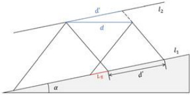  
图2不同坡度的情况  
图3投影测线间距

利用式(3)所示的重叠率计算方法可以有效避免在不同场景下造成的失效，在后续计算中我们以该定义为准。 生在

# 5.1.2模型构建

依据题意，此时需要我们构建当与测线方向垂直的平面和海底坡面的交线构成一条与水平面夹角为α的斜线时的计算模型，并依据该模型，在二维平面上给出给定测线距中心点处的距离时，海水深度、覆盖宽度、与前一条测线重复率的计算。

如图，以左侧部分为更深区域，我们给出相关位置简图：

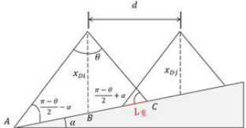  
图4相关位置简图

记为 利用图3中的几何关系，我们可以写出表格中相关参数的计算方式。其中Ab $( \frac { W _ { i } } { 2 } ) _ { \mathit { f } _ { \overline { { L } } } }$ C记为 $( \frac { w _ { i } } { 2 } ) _ { , \xi }$ ，海水深度：若 $x _ { D j }$ 已知，参考三角相关的公式，有

$$
x _ { D j } = x _ { D i } + \Delta d \cdot t a n \alpha
$$

覆盖宽度：将三角形分割成左右并运用正弦定理，有

$$
\begin{array} { r } { \frac { s i n ( \frac { \pi - \theta } { 2 } - \alpha ) } { x _ { D j } } = \frac { s i n \frac { \theta } { 2 } } { ( \frac { W _ { i } } { 2 } ) _ { \mathcal { Z } } } } \\ { \frac { s i n ( \frac { \pi - \theta } { 2 } + \alpha ) } { x _ { D i } } = \frac { s i n ( \frac { \theta } { 2 } ) } { ( \frac { W _ { i } } { 2 } ) _ { \mathcal { Z } } } } \end{array}
$$

$$
( \frac { W _ { i } } { 2 } ) _ { \it 5 } + ( \frac { W _ { i } } { 2 } ) _ { \it 6 } = W _ { i , \it 6 }
$$

解出

$$
W _ { i } = x _ { D i } \cdot s i n \frac { \theta } { 2 } [ \frac { 1 } { s i n ( \frac { \pi - \theta } { 2 } + \alpha ) } + \frac { 1 } { s i n ( \frac { \pi - \theta } { 2 } - \alpha ) } ]
$$

同时，易得覆盖宽度在海平面的投影长度为 $W _ { i , \mathcal { Q } }$ cos𝛼。

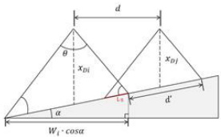  
图5投影位置简图

对于此处重叠率的计算，我们采取前文中在斜面以及复杂情况下修正后的定义，即将d以两条最右侧波束作为一组平行线投影到海底斜面上，那么有

$$
\eta = 1 - { \frac { d ^ { \prime } } { W } }
$$

$$
d ^ { * } = d \cdot \frac { s i n ( \frac { \pi } { 2 } - \frac { \theta } { 2 } ) } { s i n ( \frac { \pi } { 2 } - \alpha + \frac { \theta } { 2 } ) }
$$

# 5.1.3模型求解

依据前文中所述的计算方法，此时我们可以得到计算所需的相关参数信息，并以此建立二维平面模型，模型计算结果如下表所示：

表1问题一的计算结果  

<html><body><table><tr><td>测线距中心点 处的距离m</td><td>-800</td><td>−600</td><td>-400</td><td>-200</td><td>0</td><td>200</td><td>400</td><td>600</td><td>800</td></tr><tr><td>海水深度m</td><td>90.949</td><td>85.712</td><td>80.474</td><td>75.237</td><td>70</td><td>64.763</td><td>59.526</td><td>54.288</td><td>49.051</td></tr><tr><td>授盖宽度m</td><td>315.813</td><td>297.628</td><td>279.442</td><td>261.256</td><td>243.070</td><td>224.884</td><td>206.699</td><td>188.513</td><td>170.327</td></tr><tr><td>前一条线</td><td>：</td><td>0.357</td><td>0.315</td><td>0.267</td><td>0.213</td><td>0.149</td><td>0.074</td><td>-0.015</td><td>-0.124</td></tr></table></body></html>

可以发现最后两条测线出现了漏测，更详细的数值计算结果将在表格文件result1.xlsx中展示。

# 5.2问题二模型的建立与求解

# 5.2.1模型的准备

从第一问的求解中，我们可以提取出各种可以获取信息的参数。在对于后续问题的求解过程中，有3个重要参数：当前坡度𝛾，当前深度 $x _ { D }$ ，与当前多波束换能器的开角。由第一问所建立的模型可知，当前深度 $x _ { D }$ 由距初始航线的距离来决定，所以对于问题二的解决，我们需要沿用第一问的模型并对此做出相应扩展。参考问题一的模型，可以得到参数间存在以下关系：

△X →W→n >xDh初 △d

在解决该问题情境下的矩形待测海域之前，我们首先需要证明1点：若海底平面为一均一平面，当测量船的航向确定（测线方向）时，其坡度也确定，且坡度为定值。这一点结论的证明过程如下：

Y 海底平面

假设航向法向为 $\vec { n } _ { \scriptscriptstyle \hat { \mathcal { M } } } = ( a , b , c )$ ，则其代表了一个以𝑛航为法向的平面。由于海平面水平，不难证明该平面与海平面垂直。若海底平面法向为 $\boldsymbol { \mathfrak { i } } _ { \mathcal { Y } } = ( a ^ { \prime } , b ^ { \prime } , c ^ { \prime } )$ ，则坡线为两平面交线，且由克莱默法则可以计算出坡线方向为 $( b c ^ { \prime } - b ^ { \prime } c , c a ^ { \prime } -$ $a c ^ { \prime } , a b ^ { \prime } - b a ^ { \prime } )$ 。所以当测量船的航向确定（测线方向）时，坡度是唯一确定的，且为定值。

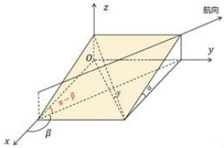  
图6相关参数关系  
图7航向坡线关系图  
图8 $\beta = 1 3 5 ^ { \circ }$ 时几何关系图

基于此，我们决定从深度与坡度着手来解决关于该矩形待测海域的相关计算，并完善多波束测深覆盖宽度的数学模型。考虑下图的情况（这里我们以 $\beta = 1 3 5 ^ { \circ }$ 为例）：

在图7中，我们需要得知当前坡度𝛾的值。设某一高度为h，那么有

$$
t a n \gamma = \frac { h } { \sqrt { ( \frac { h } { t a n \alpha } ) ^ { 2 } + ( \frac { h } { t a n \beta \cdot t a n \alpha } ) ^ { 2 } } } = t a n \alpha \cdot | s i n \beta |
$$

对于深度的计算，可以得到

$$
x _ { D i } = x _ { D i \bar { \jmath } } - \Delta x \cdot c o s ( \pi - \beta ) \cdot t a n \alpha
$$

将变化后的参数引入第一问，可以求得覆盖宽度𝑤𝑚的数值

$$
W _ { i B } = x _ { D } \cdot s i n \frac { \theta } { 2 } ( \frac { 1 } { s i n \frac { \pi - \theta } { 2 } - \gamma } + \frac { 1 } { s i n \frac { \pi - \theta } { 2 } + \gamma } )
$$

至此，我们已经实现了将第一问的模型升维到第二问的工作。在改变Δx与 $\beta$ 的情况下，可以实现对特定参数的数值计算。

# 5.2.2模型的求解

上文中，我们建立了在不同 $\Delta x$ 与的数值下，计算多波束测深的覆盖宽度的数学模型，求解的结果以保留小数点后三位的形式放在如下表格中，由于篇幅问题,更详细的数值将在表格文件result2.xlsx中呈现。

表2问题二的计算结果  

<html><body><table><tr><td colspan="2" rowspan="2">覆盖宽度/m</td><td colspan="9">测量船距海域中心点处的距离/海里</td></tr><tr><td>0</td><td>0.3</td><td>0.6</td><td>0.9</td><td>1.2</td><td>1.5</td><td>1.8</td><td>2.1</td></tr><tr><td rowspan="8">测线 方向 夹角 1</td><td>0</td><td>415.692</td><td>466.091</td><td>516.490</td><td>566.889</td><td>617.288</td><td>667.687</td><td>718.085</td><td>768.484</td></tr><tr><td>45</td><td>416.192</td><td>451.872</td><td>487.552</td><td>523.232</td><td>558.912</td><td>594.592</td><td>630.273</td><td>665.953</td></tr><tr><td>90</td><td>416.692</td><td>416.692</td><td>416.692</td><td>416.692</td><td>416.692</td><td>416.692</td><td>416.692</td><td>416.692</td></tr><tr><td>135</td><td>416.192</td><td>380.511</td><td>344.831</td><td>309.151</td><td>273.471</td><td>237.791</td><td>202.110</td><td>116.430</td></tr><tr><td>180</td><td>415.692</td><td>365.293</td><td>314.895</td><td>264.496</td><td>214.097</td><td>163.698</td><td>113.299</td><td>62.900</td></tr><tr><td>225</td><td>416.192</td><td>380.511</td><td>344.831</td><td>309.151</td><td>273.471</td><td>237.791</td><td>202.110</td><td>116.430</td></tr><tr><td>270</td><td>416.692</td><td>416.692</td><td>416.692</td><td>416.692</td><td>416.692</td><td>416.692</td><td>416.692</td><td>416.692</td></tr><tr><td>315</td><td>416.192</td><td>451.872</td><td>487.552</td><td>523.232</td><td>558.912</td><td>594.592</td><td>630.273</td><td>665.953</td></tr></table></body></html>

通过观察求解结果，可以发现以下规律：(1)在同一点不同航向会使覆盖宽度产生较大变化。（2）在不同深浅的水域中覆盖宽度变化较大，直线行驶时产生的轨迹为类三角（锥）形，并不均匀。（3）经过检验，在参数一致的情况下该模型与第一问建立的模型得出了相同的结果，验证了模型的正确性。 学生仕

# 5.3问题三模型的建立与求解：

# 5.3.1问题分析

这个问题中，需要我们在南北长2海里、东西宽4海里的矩形海域内求解一组长度最短，且覆盖全海域的测线方案。这里可以提取出两个重要信息：对于测线方案的设计来说，覆盖整个海域面积和长度最短是必然要求。假设在每处其行进微小的距离为Δ𝑥，在该处的覆盖宽度为 $w _ { i }$ ，那么有 $w _ { i } = f ( \boldsymbol { \gamma } , \boldsymbol { x } _ { D i } )$ ，则船体行进完成后总的覆盖面积S为

$$
S = \int w _ { i } \Delta x
$$

为了满足题干要求，该面积要覆盖整个海域面积。

在第二问的最后一部分结果分析中，我们提到了在不同深度、不同角度下，覆盖宽度 $w _ { i }$ 也不同。基于贪心算法的思想，为使测线的长度∆𝑥最短，需要使得 $w _ { i }$ 在各处尽可能宽。由此可得到最短测线距离。

下面我们对不同深度下不同角度的𝑤𝑖均做出计算，并且可视化出了较深处与较浅处的结果用作说明：

M A

由图可看出，不同坡度下，无论大小，总是在方向为＋𝑛π的地方取得最高值，此时是与其等高线共线的情况。如果单独抽取出该结构，将不同的方向模拟为一个圆锥，而坡面模拟为一个斜切的面，此时由几何知识可知，该切面为椭圆。而当𝑊的长度为其长轴时为最大，这也就是之前航向与等高线平行的原因。

由图同时可以观察到，无论是左图中的较浅情况还是右图中所示的较深情况，均于测线方向在 $9 0 ^ { \circ }$ 与 $2 7 0 ^ { \circ } |$ 时取得最优的覆盖宽度。而这个方向恰巧是与各点梯度向量垂直的方向。也就是当沿图10所示方向的情况下，各处可以取得最优的覆宽以及测线长度：

A

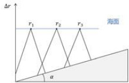  
  
图11测线方案问题简化图  
图12计算流程图

在确定了每条航线的方向后，该问题就演变成在图11所示平面中合理安排测线方案的问题。

# 5.3.2模型建立

为了保证数据的准确性和处理的简单性，重叠率的范围有一定要求。在题目重叠率 $\eta \in [ 1 0 \% , 2 0 \% ]$ 的要求下，我们给出以下计算步骤。其中“重复”的步骤指的是以为优化与控制结果的关键指标进行迭代计算。

到 是 输出结果 重复 否

在已知边界深度的计算下，第一条测线的计算方法如下：由 $x _ { D \psi }$ α得

$$
( x _ { D i j j } - \Delta r \cdot t a n \alpha ) \cdot s i n \frac { \theta } { 2 } \cdot c o s \alpha = x \cdot s i n ( \frac { \pi - \theta } { 2 } - \alpha )
$$

$$
\Delta r = \frac { c o s \alpha \cdot x _ { D i j j } \cdot s i n \frac { \theta } { 2 } } { s i n ( \frac { \pi - \theta } { 2 } - \alpha ) + s i n \alpha \cdot s i n \frac { \theta } { 2 } }
$$

$$
x _ { D 1 } = x _ { D \nmid j \mathcal { T } } - \Delta r \cdot t a n \alpha
$$

其中 $\Delta r$ 为第一条测线距边界得距离， $x _ { D }$ 为其测线深度。同时，在相邻测线之间还具有以下关系：

$$
( \frac { w _ { i } } { 2 } ) _ { \mathcal { Z } } + ( \frac { w _ { i } } { 2 } ) _ { \mathcal { G } } - \Delta d = L _ { \mathcal { R } }
$$

$$
\frac { L _ { \mathcal { P } } } { w _ { i } } = \eta
$$

参考一、二问中建立的计算宽度的模型，并结合上几式易得

$$
\frac { x _ { D i - 1 } \cdot s i n { \frac { \theta } { 2 } } } { A } + \frac { x _ { D i } \cdot s i n { \frac { \theta } { 2 } } } { B } - \frac { x _ { D i - 1 } - x _ { D i } } { t a n \alpha } = \eta \cdot x _ { D i } \cdot s i n { \frac { \theta } { 2 } } ( \frac 1 A + \frac 1 B )
$$

将式（20）化简，那么有

$$
x _ { D i } = x _ { D i - 1 } { \frac { { \frac { s i n { \frac { \theta } { 2 } } } { A } } - { \frac { 1 } { t a n \alpha } } } { \eta \cdot s i n { \frac { \theta } { 2 } } ( { \frac { 1 } { A } } + { \frac { 1 } { B } } ) - { \frac { s i n { \frac { \theta } { 2 } } } { B } } - { \frac { 1 } { t a n \alpha } } } }
$$

式(21)即为以前一条测线深度推出后一条测线深度的递推公式。其中 $x _ { D i }$ 为待计算深度， $x _ { D i - 1 }$ 为前一已知深度。其中， $A = s i n ( { \frac { \pi - \theta } { 2 } } + \alpha )$ ， $B = s i n ( \frac { \pi - \theta } { 2 } - \alpha ) ,$ 。

由于在前文的流程中未确定从较浅处开始迭代还是较深处开始迭代，因此本组对两种情况都做出了计算。我们发现当选择从较深处开始迭代时，最后多测的面积（即超出待测海域的面积）要小于从最浅处开始迭代多测的面积。推测产生此现象的原因，可能是浅处测线覆盖宽度较小、密度较大，所以并不会重复测得很多面积。

在以不同重叠率为横坐标、测线数量为纵坐标的图13（左）中，我们不难看出测线数量呈阶梯状比例，最小为34个，最多为38个。这样的结果符合重叠越少，测线越少的直观感受。

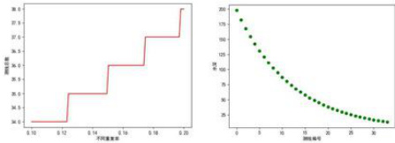  
图13不同重叠率与测线数量关系（左）与测线位置（右）

同时，我们对当测线数量最少的情况下， $\eta \in [ 1 0 \% , 1 2 . 2 \% ]$ 测线的具体位置进行了可视化处理，在图13（右）中，横坐标为距初始点距离，纵坐标为测线的垂直深度。可以观察到在垂直深度较深处分布稀疏，而在较浅处分布较为密集。

我们以𝑀a𝑥 $\mathbf { \mathcal { W } } _ { i } )$ ，Min(number $( r _ { i } ) )$ 为优化目标，找出了理想的测线数量。在这里给出了平行的测线方位与位置（见附件）。我们还需要将这些平行测线以“以”字形方式连接起来，连接后便得到了一条完整路径，见图。

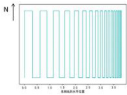  
图14连接后的路径

# 5.4问题四的求解

# 5.4.1数据初步处理及可视化

在文件附件.xlsx中展示了某海域单波束测量的测深深度数据，该海域范围较大，且数据单位不统一，因此坐标点显得较为稀疏。为了更直观地呈现附件中的数据，并对问题做出初步的分析，我们首先采用分段三次埃尔米特插值对数据进行差值扩充与可视化：

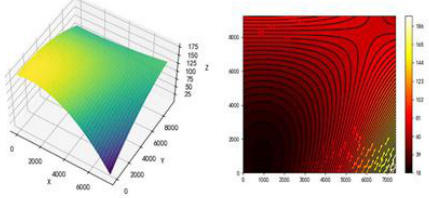  
图15海底深度三维图（左）与等深线地形图（右）

在图15中可以观察到，海域大概是从(0,0)点向周围下降，根据图15（右）所示的等深线地形图来看，在右下角的位置达到最深，在右上角线条稀疏，形成了一个较为平缓的鞍部。

由于给出的数据是有一定间隔的离散点。在路径优化的时候无法得到任一坐标的相关数据，要克服这一问题的一种方法是插入足够多的数值，用离散的点代替平滑图像。但这种方法在后续计算中有一定缺点：(1)精度较低。(2）由于某些点的缺失导致计算失效。（3）误差累积，致使结果误差很大。（4)数据量过于庞大，使

用复杂，计算困难，耗时较长。

针对上述问题，经过思考，我们决定采用大型学习模型进行拟合。也就是将已有点的数据作为训练集，建立一个用于辅助计算的机器学习模型，这样，我们给定坐标后，便可以给出精确的数据。使用这种方法将离散转为连续，能够大大提高计算的精确度和便利性。

为此，我们尝试了线性回归、支持向量机、随机森林等多种模型，并以拟合接近度 $R ^ { 2 }$ 进行评估，最终发现随机森林模型与原数据拟合度可以达到99. $9 9 9 \%$ □几乎能完全拟合原数据。因此，我们选择训练该模型并作为后续数据的支撑。拟合效果如下：

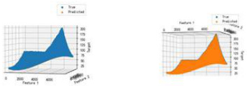  
图16海底深度三维图（左）与模型拟合效果图（右）

基于该模型，同样可以做到对任意一点深度，梯度的拟合，进而计算出每个点的坡度，因此我们对前面部分的某些概念做出优化：

设有一点 $( x _ { i } , y _ { i } )$ ，则该点至此，我们完成了相关数据的准备工作。

# 5.4.2问题分析

基于前面几个问题的研究，我们可以明确以下信息：

$$
\begin{array} { r } { \boxed { H \mathbin { \ddot { y } } \mathrm { f } \ell \vec { x } \mathrm { \cdot } \ell \xi } \Biggl \{ \underset { m i n ( S _ { \mathcal { B } \mathcal { Y } } - S ) } { m i n ( L _ { \mathcal { B } } ) } } \end{array}
$$

则有

$$
\left\{ { \begin{array} { l } { m i n ( L _ { \mathcal { L } ^ { 0 } } ) } \\ { m i n ( S _ { \mathcal { H } } - S ) } \end{array} } \right. \to m a x ( w ( x _ { i } , y _ { i } ) ) \to { \mathcal { M } } \ell \pm { \mathcal { B } } i \notin { \mathcal { E } } / { \mathcal { G } } J
$$

找到每一处的最大覆盖宽度是解决问题的关键，这同样也关系到确定航向的问题。为了贴合题目中的要求，需要分别从航向的确定和重叠率来考关于航向的确定，在第三问结尾的相关探索部分已经有所说明：沿等高方向行驶会获得最大覆宽w。曲面情况下也需要考虑，因此我们做出了下图中的模拟：

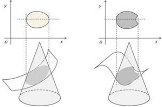  
图17曲面截取圆锥的截面图

在上图中，我们用圆锥模拟不同方向，用两类斜面去截圆锥，从其在水平面的投影来寻找最优的 $w _ { i }$ ，可以看出它们的投影为类椭圆，总体仍然以长轴（即沿梯度为开角方向）取最大，但在极端情况下，可能会出现右侧中长轴变短的情况，不过该地形在本题地图中并未出现，且也可近似认为其类长轴为最宽处。

关于重叠率，本题并未给出前几问中那样精确的范围，只需要不超过 $2 0 \%$ 参考题干中的“为保证测量的便利性和数据的完整性，相邻条带之间应有$1 0 \% - 2 0 \%$ 的重叠率”，我们以此作为标准。

对于开角的确定，题目中并未给出数值上的参考。我们对开角在 $\pm 3 0 ^ { \circ }$ 内进行了覆宽变化的探究。在深度为70的情况下，做出如下三维图。

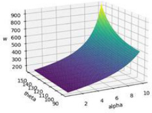  
图18不同张角和坡度下最大覆宽变化图

可以看出，在开角变大，坡度变大的情况下，测宽显著变大，在地形较倾斜范围海域造成误差，因此开角的选择应根据地形进行合理的制定。开角变小会让测量宽度变小而使航线变密集，航线的分布也会产生微小变化。在本题仍以 $\theta =$ $1 2 0 ^ { \circ }$ 为标准。

# 5.4.3模型建立

本题实际上是一个特殊的优化问题，其总体的最优解总是由局部最优解组成。

基于前文航向对𝑤大小的探究，其航向需要与其梯度方向垂直（或与等高线相切）.针对这个过程，本文查阅到一个很符合该题的群体智能算法“飞蛾火焰算法”[2][4]，同时基于贪心思想和微分思想，并结合第三问，修改了该算法的螺旋函数与适应函数的确定方式，形成自适应的“飞蛾火焰”算法。

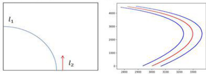  
图19航线图示说明（左）航线运行方向及覆盖示意图（右）

假设有如图所示的航线，并有正在探索的航线 $\boldsymbol { { l } } _ { 2 }$ ，本组做出以下调整：

(1)自适应火源调整方案

该火源存在的本意是为了让搜索粒子与火源位置保持一定角度，但本题地形复杂，因此采用随机森林预测出的梯度 $\nabla \vec { g } ( x _ { i } , y _ { i } )$ 和一个与 $\nabla \vec { g } ( x _ { i } , y _ { i } )$ 正交的单位向量来作为测线方向的自调整的角度。

(2)地图微分化：

由于地图范围非常大，而探索船每次探测的部分占比很小，因此我们采用微分思想，将每一点 $( x _ { i } , y _ { i } )$ 处的区域认为是与题三中平坦的情形，并采用 $( x _ { i } , y _ { i } )$ 处的w、 $\alpha$ ， $g$ 作为整个小区域的数据，对于相邻区域内的另一点 $( x _ { j } , y _ { j } )$ 满足：

$$
\alpha ( x _ { i } , y _ { i } ) = \alpha ( x _ { j } , y _ { j } )
$$

$$
\nabla \vec { g } ( x _ { i } , y _ { i } ) = \nabla \vec { g } ( x _ { j } , y _ { j } )
$$

$$
x _ { D } ( x _ { i } , y _ { i } ) = x _ { D } ( x _ { j } , y _ { j } )
$$

(3)适应度函数：

适应度函数是我们需要满足与优化的函数，这里主要是相邻覆盖度，示意图中，在 $\boldsymbol { l } _ { 2 }$ 路线向前探索时不仅要考虑与 $\nabla \overrightarrow { g } ( x _ { i } , y _ { i } )$ 垂直的方向来保证每处最大的$w _ { m a x } ( x _ { i } , y _ { i } )$ ，还需要考虑相邻 $( l _ { 1 } \ X \cdot  { \mathrm { J } } l _ { 2 }$ ）产生的重叠区域。因此本组在算法寻找最短路径时，设定一个量 $\mathsf { \Omega } _ { l } ( x _ { i } , y _ { i } )$ 。

计算方式如下：图示情况中 $( x _ { i } , y _ { i } )$ 为要搜索的点， $( x _ { j } , y _ { j } )$ 为相邻已确定的点，且 $l _ { 2 }$ 深度更深。则

$$
\frac { x _ { D } ( x _ { i } , y _ { i } ) \cdot s i n \frac { \theta } { 2 } } { s i n [ \frac { \pi - \theta } { 2 } + \alpha ( x _ { i } , y _ { i } ) ] } + \frac { x _ { D } ( x _ { i } , y _ { i } ) \cdot s i n \frac { \theta } { 2 } } { s i n [ \frac { \pi - \theta } { 2 } - \alpha ( x _ { i } , y _ { i } ) ] } - \sqrt { ( x _ { i } - x _ { j } ) ^ { 2 } + ( y _ { i } - y _ { j } ) ^ { 2 } } \cdot c o s \alpha ( x _ { i } , y _ { i } ) .
$$

$$
\frac { L _ { \mathcal { \pi } } } { w ( x _ { i } , y _ { i } ) } = \eta ( x _ { i } , y _ { i } )
$$

$$
w ( x _ { i } , y _ { i } ) = x _ { D } ( x _ { i } , y _ { i } ) \cdot s i n { \frac { \theta } { 2 } } ( { \frac { 1 } { s i n [ { \frac { \pi - \theta } { 2 } } + \alpha ( x _ { i } , y _ { i } ) ] } } + { \frac { 1 } { s i n [ { \frac { \pi - \theta } { 2 } } - \alpha ( x _ { i } , y _ { i } ) ] } } )
$$

该式与第三问的计算结构类似，由于本题地形更加起伏，所以其中坡度、梯度等数据均随位置改变，并由训练出的随机森林数据模型提供。

位置更新：

在计算重叠率时，以沿梯度向上（下）的临近点作为参照，所以我们的算法保存住其沿梯度 $\overrightarrow { \nabla g } ( x _ { i } , y _ { i } )$ 上的最近点。

（x,)(x𝑖，yi)

如图，由于梯度垂直其等高线，那么 $( x _ { j } , y _ { j } )$ 一定是最近点。在搜索完一路后，我们以梯度作为方向，让粒子跃迁到下一路。并且有

$$
x _ { D i } = x _ { D i - 1 } { \frac { { \frac { s i n { \frac { \theta } { 2 } } } { A } } - { \frac { 1 } { t a n \alpha ( x _ { i - 1 } , y _ { i - 1 } ) } } } { \eta \cdot s i n { \frac { \theta } { 2 } } ( { \frac { 1 } { A } } + { \frac { 1 } { B } } ) - { \frac { s i n { \frac { \theta } { 2 } } } { B } } - { \frac { 1 } { t a n \alpha ( x _ { i - 1 } , y _ { i - 1 } ) } } } }
$$

$$
x _ { i } = x _ { i - 1 } + \frac { \nabla \vec { g } ( x _ { i - 1 } , y _ { i - 1 } ) } { \left| \nabla \vec { g } ( x _ { i - 1 } , y _ { i - 1 } ) \right| } \cdot ( 1 , 0 ) \cdot \frac { x _ { D i } - x _ { D i - 1 } } { t a n \alpha ( x _ { i - 1 } , y _ { i - 1 } ) }
$$

$$
y _ { i } = y _ { i - 1 } + \frac { \nabla \vec { g } ( x _ { i - 1 } , y _ { i - 1 } ) } { \left| \nabla \vec { g } ( x _ { i - 1 } , y _ { i - 1 } ) \right| } \cdot ( 0 , 1 ) \cdot \frac { x _ { D i } - x _ { D i - 1 } } { t a n \alpha ( x _ { i - 1 } , y _ { i - 1 } ) }
$$

其中， $A = s i n [ { \textstyle { \frac { \pi - \theta } { 2 } } } + \alpha ( x _ { i - 1 } , y _ { i - 1 } ) ] , \ B = s i n [ { \textstyle { \frac { \pi - \theta } { 2 } } } - \alpha ( x _ { i - 1 } , y _ { i - 1 } ) ] ,$ 上式是其跃迁的迭代公式。

# 5.4.4模型的应用及求解

基于上述已建模型，我们对航线的计算流程如下：

用随机森林模型数据 加以训练，得到 划定起始线等否退出 是是否完成 保存并记录点 让模型自动在空保存结果 所有路径 的信息、计算 间中搜索出相邻可视化 的搜索 路径长度 的路线

经过初步尝试，发现不同起始线最后以固定探索出来的路径不同，且在某些区域存在漏测和鲁棒性较差等问题，可用性较差：

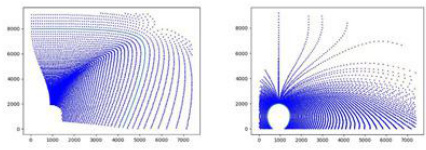  
图21航线计算流程图示

这是由于区域参数不同造成的，针对该问题，我们首先考虑到的是分区进行规划，参考等高线，将地图分成了下面几个区域，并适当改进探索步长，参数计算等算法：

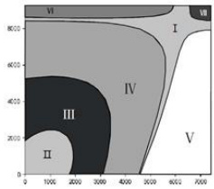  
图22初步探索路径  
图23地区划分

在每个区域内部，走势较为统一，但某些区内，由于区域内浅且坡度平缓（I，Ⅱ区域）存在随机搜索复杂度较高的情况，于是我们将这类区域单独拿出来进行拟合，得到最终结果。同时，对于不同的初始线，本组也做了相关统计，并最终选择总路线最短的一组作为出实现来作为最佳初始线分布。最终我们综合算法自探索的路线和我们处理的路线得到了所有测线，船只仍可按“己”字形遍历所有

测线（如下图）。

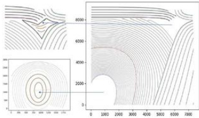  
图24路径规划示意图

(注：左下角圆形区域的曲线仅供位置上参考，具体条数见下表)

由于图线过于密集，数量较多，图像提供大概位置示意，具体的位置，已在附件里以散点数据的形式呈现

基于积分的思想，我们用下列式子得到总长和覆盖面积，并对其他值进行计算：

$$
S ^ { * } = \sum _ { i = 1 } ^ { n } w ( x _ { i } , y _ { i } ) \cdot \Delta L
$$

$$
L _ { i j } = \sum _ { i = 1 } ^ { n } \sqrt { ( x _ { i } - x _ { i - 1 } ) ^ { 2 } + ( y _ { i } - y _ { i - 1 } ) ^ { 2 } }
$$

并给出了我们每个分区的路线相关数据与统计分析数据（如下表）。由于测线之间有 $1 0 \%$ 重叠率，所以有效覆盖面积为68567951，占总海洋面积68598080的 $9 9 . 9 5 6 \%$

表3分区计算结果  

<html><body><table><tr><td>分区</td><td>测线长度</td><td>覆盖面积</td><td>测线条数</td></tr><tr><td>1</td><td>2922</td><td>810000</td><td>3</td></tr><tr><td>II</td><td>49074</td><td>3740000</td><td>22</td></tr><tr><td>II</td><td>128930</td><td>13552572</td><td>28</td></tr><tr><td>IV</td><td>164724</td><td>30913439</td><td>24</td></tr><tr><td>V</td><td>54820</td><td>18319129</td><td>9</td></tr><tr><td>VI</td><td>29974</td><td>7809427</td><td>5</td></tr><tr><td>VII</td><td>4218</td><td>1042046</td><td>3</td></tr><tr><td>总和</td><td>434662</td><td>76186613</td><td>94</td></tr></table></body></html>

由于测线之间有 $1 0 \%$ 重叠率，所以有效覆盖面积为68567951，占总海洋面积68598080的 $9 9 . 9 5 6 \%$ 。 1化托

相关指标的计算如下表：

表4相关指标计算结果  

<html><body><table><tr><td>测线的总长度</td><td>漏测海区所占百分比</td><td>重叠率超过20%部分的总长度</td></tr><tr><td>434662</td><td>0.04%</td><td>21998</td></tr></table></body></html>

对于该路线，是在 $\eta = 1 0 \%$ 的情况下给出的最短距离，我们尝试了计算之后，当 $\eta = 0 \%$ 其路线总长最短，大概为 $\eta = 1 0 \%$ 情形下的总长的 $9 0 \%$ ，这也符合其数学原理。

如果测量船需走连续的路线或回到最开始的原位置，还可以参考相关汉密尔顿图和欧拉路径的布置方式对路线进行规划。

# 六、模型的评价

# 6.1模型的优点

1．对于覆盖宽度等等信息给出了确切的公式，计算精准。  
2.采用学习类模型来处理数据，方便了后续的计算的进行，同时增加了精度  
3．融合并改进了相关算法，并分类解决，更加贴近问题，并能给出较好的解

# 6.2模型的缺点

1．在最后路线的运算中我们只是抽一些点来进行，但运算量已经较大，要想获得更高精度的结果可能需要的时间较长。2．划分区域解决问题后，在不同区域交汇处需要二次处理。

# 6.3模型的推广

该模型可以优化高度为目标更换高度，开角也可切换为更多情况，可用于建筑扫描，无人机地形扫描等多种情况，具有较多的可用空间。

# 七、参考文献

[1].GB/T12763.10­2007海洋调查规范[S].第10部分:海底地形地貌调查  
[2].徐炜翔，朱志宇.基于飞蛾火焰算法的AUV三维全局路径规划.上海理工大学学报,2021,43（2):148-155.  
[3].陆丹，李海森，魏玉阔，邓平.多波束测深系统中的海底地形可视化技术研究[A].仪器仪表学报，2012.2  
[4].王智慧，代永强，刘欢，基于自适应飞蛾扑火优化算法的三维路径规划A.计算机应用研究.2023.1 大字 .rn

#

# 附录材料目录：

1.处理过的部分数据

2.代码部分

第二间.py  
第三间（1）.py  
第三间（2）.py  
第三间（3）.py  
第三间（4）.py  
第三问（5）张角与坡度.py  
第四间（1）拟合函数.py  
第四间（2）梯度.py  
第四问（3）插值.py  
第四间（4).py  
第四间（5）.py  
第四间（6）.py  
第四间（7）.py  
第四间（8）.py  
第四间（9).py  
第一间（1）.py

代码部分：

# 第一问：

1. import pandas as pd2. import numpy asnp3. 初始化参数4.D_e=705theta=1206.alpha $= 1 . 5$ 7 ${ \mathfrak { d } } =$ 288 $\mathbf { \sigma } = \mathbf { \sigma }$ pin(s9et/2)/nhe/)9.distances $\scriptstyle \mathbf { \bar { \rho } } =$ np.aay([-8e0,6，408，200，0，208，4，608，]）10. $D =$ De-distancesnp.tan(np.radians(alpha））11.12.print（D）13.14.w=D+np.sinnpradians(theta/2））（1/np.sinnp.radians((18e-theta）/2+alpha)  
)+1/np.sin(np.radians((18e-theta)/2-alpha)))15.print(w）16.n=1-d/w  
学

20.df[海水深度/m]=D  
21.df[覆盖宽度/m]=W  
22.df[‘与前一条测线的重叠率/% $1 = n$   
23.##将 DataFrame保存为 Excel 文件  
24.athC:\sers\Deske  
25.#dfete

#

第二问：1. import pandas as pd2.import numpy as np3. def get_width(B）:4 初始化参数5. D0 $\mathbf { \sigma } = \mathbf { \sigma }$ 120#海底深度（单位：m）6. alpha $\mathbf { \Sigma } = \mathbf { 1 . 5 }$ 坡度（单位：度）7 D=D_-distances·np.tan(np.radians(alpha））\*np.cos(np.radians(180-B））8. theta $\ast$ 120#换能器的开角（单位：度）9. alpha=np.arctan(abs(np.sin(np.radians(B))\*np.tan(np.radians(alpha))\*180/np.pi10. print（D）11 $W = D ^ { \prime }$ np.sin(np.radians(theta/2））\*（12. 1/np.sin(np.radians((18e-theta)/2+alpha)）+1/np.sin(np.radians((18ə-theta）/2-alpha）)）13. print(w)14. returnW15.distancesnparay[e，0.3，0.6，0.9，1.2，1.51.8,2.]）16.distances $\ L =$ distances·185217.print(distances)18.19g20.W]21.foriin angle:22. W.append(get_width(i))23.24.#将DataFrame保存为Excel文件25.pathr:\sers\Pc\Desktopes.ls26.pdDtae(）e(a，e)

# 第三问：

(1） 1.import pandas as pd 2 import numpy as np 3. import matplotlib.pyplot as plt 4. plt.rcParams['font.sans-serif‘]=['SimHei']#显示中文 5. def get_width(B，D_0）： 6. 初始化参数 7. alpha $\mathbf { \sigma } = \mathbf { \sigma }$ 1.5#坡度（单位：度） 8. 9 $D = D \_ { \theta }$ $\mathbf { \sigma } = \mathbf { \sigma }$ 120#换能器的开角（单位：度） 牛在？ 11. lphnprctainasB)）)) \*180/np.pi n

12.  
13. print(D）  
14.  
15. $M = D ^ { \prime }$ np.sin(np.radians(theta/2)）\*（  
16 1/np.sin(np.radians(18θ-theta）)/2+alpha))+1/n  
in(np.radians(180-theta)/2-alpha）)  
17  
18 print(w)  
19. returnW  
20.  
21.ngenspac66）  
22.w1  
23.foriin angle:  
24. W.append(get_width（i,150））  
25.  
26.print(w）  
27.pt.p1ot（angle,)  
28.  
29.pltte989]  
30.pt.scatter(270[269]  
31.p1t.text（989]，（）（）ft（9,89])）  
32.te226（26  
33.  
34.angenspace（66）  
35.w  
36.foriin angle  
37. W.append(get_width(i,149.5)）  
38  
39.print(w）  
40.plt.p1ot(ang1e,w)  
41.  
42.plt.scater(9,[89]）  
43.plt.sater（270,269]o）  
44.p1t.text（90,[89]，（），（}）frmat（90,[89])）  
45.p1t.text(270，[269]，（），（}）’frmat(270,[269])）  
46.  
47.p1t.xlabel(“不同角度"）  
48.plt，ylabel（覆盖宽度）  
49.p1t.show（）  
1. import pandas as pd  
2. import numpy asnp  
3. import matplotlib.pyplot as plt  
4. plt.rcParams['font.sans-serif']=['SimHei']#显示中文  
5.  
6. def sin(a）：  
7. returnnp.sin(np.radians(a))  
8. def cos(a）：  
9. 10.def tan(a）： return np.cos(np.radians(a)） 大学生在  
11. returnnp.tan(np.radians(a))

12.13.anglenp.space（6,6）14.1ow-110-2\*1852\*p.tan(np.radians(1.5)）15.ig-10+2185npta(pdas(1.5))16.17.alpha=1.5#坡度（单位：度）18.theta $\mathbf { \Sigma } = \mathbf { \Sigma }$ 120#换能器的开角（单位：度）19.20.n=np.inspace（0.10200）21.cnt]22.iin：23. x=sin(theta/2）\*cos(alpha）\*high/（sin(9e-theta/2-alpha）  
+sin(alpha)\*sin(theta/2))24. x=high-xtan（alpha）25. print（x）26. ans $\mathbf { \beta } = \mathbf { \beta }$ [27. ans.append(x）28. A=sin（90-theta $1 2 +$ alpha)29. B $\mathbf { \sigma } = \mathbf { \sigma }$ sin(9θ-theta/2-alpha)30. $c =$ sin(theta/2)/A-1/tan(alpha)31 D=i•sin(theta/2）·（1/A+1/B)−sin(theta/2）/B-1/𝑡  
an(alpha）32.33 while True:34 x=x\*C/D35. ifx<low：36. break37. ans.append(x)38.39. print(len(ans)）40. cnt.append(len(ans))41. #print(ans[-1]）42.43.n=np.array(n)44.print(）45.print(cnt)46.plt.plot(nntol）47.plt.xlabe1（”不同重复率”）48.p1t.ylabel（“测线总数）49.50.plt.show()1.import pandas as pd2.import numpy as np3.import matplotlib.pyplot as plt4.plt.rcParams[‘font.sans-serif‘]=['SimHei']#显示中文5.6. def sin(a）:7. 89 def cos(a）: return np.sin(np.radians(a)) 国大学生在return np.cos(np.radians(a)）10.def tan(a）：11 return np.tan(np.radians(a)）12.def get_wleft(D）：13 return D\*sin(theta/2)/sin(90-theta/2-alpha)141516.anglep.nspace(0,6,6）17.1ow-110-22pta(npds(1.5)）18.high=110+21852nptan(nradians(1.5)19.20.alpha=1.5#坡度（单位：度）21.theta $\mathbf { \Sigma } = \mathbf { \Sigma }$ 120#换能器的开角（单位：度）2223.n=0.124.cnt[]25.x=sintheta/2）cos(alpha）\*high/（sin（9e-theta/2-alpha）+s  
in(alpha）\*sin(theta/2））26.x=high-xtan（alpha）27.print（x）28.ans 129.ans.append(x)30.A=sin(90-theta/2+alpha）31.B=sin（90-theta/2-alpha）32.C=sin(theta/2)/A-1/tan(alpha)33.D=n·sin(theta/2)(1/A+1/B)-sin(theta/2)/B-1/tan(a  
1pha）34.35.while True:36. x=x\*C/D37. ifx<1ow：38. break39. ans.append(x)40.41.# print(1en(ans))42.#print(ans[-1)43.index=np.arange(len(ans))44.ans=np.array(ans)45.dis]46.foriinrange(len(ans)-1)：47. dis.append((ans[i]-ans[i+1]）/tan(alpha)）48.foriinrange(len(dis)-1)：49. dis[i+1]+=dis[i]50.5152.#ptnde53.#plt.xlabel（“测线编号"）54.#plt.ylabe1（"水深）55.#plt.show()56.print(dis) 57.dis.insert(0,0) 学生在58.dis=np.array(dis）/1852

59.y=np.zeros(len(dis)）  
60.#ptt(diske10）  
61.plt.xlabel（“各测线的水平位置"）  
62.p1t.y1im(-1.2,1.2）  
63.plt.yticks(alpha=)  
64.plt.tickparamsaxisy’,idth0）  
65.ypse  
66.foriinrange(len(dis)-1)）：  
67. x=np.ful1（（1,100e），dis[i]）  
68. plt,scatter（x，y，s=.0001,col=）  
69. tx=np.linspace(dis[i],dis[i+1],00）  
70. ifi $8 2 = = 1 0$   
71 ty=1  
72. else:  
73. ty=-1  
74. ty $\mathbf { \Sigma } = \mathbf { \Sigma }$ np.fu11(（(1,1000），ty）  
75. plt.scatter(tx，ty，s=0.ee01，colo=c’）  
76（(  
77.p1t.aer（x，y）  
78.plt.show()  
79.path=rC:\sers\\Desktop\距离x1  
80.  
81.  
82.#pd.DataFrame(dis).toexce（path）  
83.##path=rC:\Users\Pc\Desktop\水深.xlsx  
84.##pd.DataFrame（ans).toexcel(path)  
1.import pandas as pd  
2. import numpyas np  
3. import matplotlib.pyplot as plt  
4. plt.rcParams['font.sans-serif']-['SimHei']#显示中文  
5.  
6. def sin(a）：  
7. return np.sin(np.radians(a)  
8. def cos(a）：  
9. return np.cos(np.radians(a)）  
10.def tan(a）：  
1. return np.tan(np.radians(a))  
12.def get_wleft(D）：  
13. return D\*sin(theta/2)/sin(9e-theta/2-alpha)  
14.def get_WRight(D）：  
15. return D\*sin(theta/2)/sin(90-theta/2+alpha)  
16.  
17.anglenp.space(0,36,360）  
18.1ow-10-2\*1852np.tan(npradia(1.5)）  
19.high10+2\*1852np.tan(npradian(1.5)）  
20.  
21.alpha $\mathbf { \beta } = \mathbf { 1 . 5 }$ #坡度（单位：度）  
22.theta $\mathbf { \sigma } = \mathbf { \sigma }$ 120#换能器的开角（单位：度） 大学生在  
23.  
24.n=0.1

(4)

25.cnt=[]26.x=sin(theta/2)cos(alpha)\*high/(sin(9e-theta/2-alpha）+sin(alpha）\*sin(theta/2））27.x=high-x\*tan（alpha）28.print（x）29.ans $\mathbf { \beta } = \mathbf { \beta }$ 130.ans.append(x)3132.while True:33. high $= x$ (get_wRight(x）-(get_wRight(x）+get_wleft(x））\*n)\*sin(alpha)34 $x =$ sin(theta/2）·cos(alpha)∗high/(sin(9e-theta/2-alpha)+sin(alpha)·sin(theta/2)）35. x=high-×·tan(alpha）36. ifx<low37. break38 ans.append（x）39.40.print(ans)41.print(len(ans)）42.print(ans[-1])43.index=np.arange(len(ans））44.p1t.atter(indexsg')45.p1t.xlabel（“测线编号"）46.p1t.ylabel（"水深）47.48.p1t.show(）49.#path=rC:\Users\\Desktop\水深xls50.#pdes51.##path=r:\Users\c\Desktop\水深.xlsx52.pd(5）1.import pandas as pd2.import numpyasnp3.importmatplotibpyplotaspt4.def sin(a）：5. return np.sin(np.radians(a))6.def cos(a）：7. return np.cos(np.radians(a))8.def tan(a）：9. return np.tan(np.radians(a))10.def get_wleft(D)：1 return D\*sin(theta/2)/sin(90-theta/2-alpha)12.13.14.angle=9015.alpha $\mathbf { \sigma } = \mathbf { \sigma }$ np.inspace(0.5,100)16.theta $\mathbf { \beta } = \mathbf { \beta }$ np.linspace（90,150,100）17 $x - 1 = 7 0$ 118 $w = [ 1 ]$ ★学生在19.foriinalpha:20. forjintheta

21. w.append(x_d\*sin（j/2)\*(1/sin(90-j/2-i)+1/sin(90-j/2+i))）  
22.print(w）  
23.wnp.array(w）.rshpe(10100）  
24.alpha，theta $\mathbf { \Sigma } = \mathbf { \Sigma }$ np.meshgrid(alpha,theta)  
25.  
26.#创建三维图形对象和坐标轴  
27.fig $\mathbf { \sigma } = \mathbf { \sigma }$ p1t.figure()  
28.ax $\mathbf { \beta } = \mathbf { \beta }$ bte)  
29.  
30.#绘制三维图形  
31.x.plourfceate，is）  
32.  
33.#设置坐标轴标签  
34.ax.set_xlabel(‘alpha')  
35.ax.setylabel('theta)  
36.ax.set_zlabel（w）  
37  
38.#显示图形  
39.p1t.show（）

第四问：

(1).拟合函数

1. import pandas as pd  
2 import numpy as np  
3. import matplotlib.pyplot as plt  
4.  
5. plt.rcParams[font.sans-serif‘]-['SimHei']#显示中文  
6.  
7. path=rC:\Users\Pc\Desktop\附件.x1sx  
8.  
9. df-pd.read_excel(path）  
10.xnp.array(df.oc[e][2:]dtypef1oat64"）  
11.  
12.y-  
13.foriinrange(1,dfshape]）：  
14 y.append(df.iloc[i][1]）  
15  
16.ypryy）  
17.  
18.x=x\*1852  
19.y=y\*1852  
20.  
21.path-r'C:\Users\\Desktop\高度xls  
22.df-pdeadexcelath）  
23.Z=nparray(df.oc[0:][:],dtypeft64）  
24  
25.print（x）  
26.print(x.shape)  
27.print(y.shape)  
28.print(2.shape) 国大学生在  
29.data=[]  
30.forjinrange(len（y)）：  
31. foriin range（len（x））：  
3 t=[x[i],y[i],[j][i]]  
data.append(t)  
34.datanparray(data)  
35.print(data.shape）  
36  
37.import numpy asnp  
38iportatpotib.potplt  
39.frommpl_toolkits.mplot3dimport Axes3D  
40.from sklearn.ensembleimport RandomForestRegressor  
41.from sklearn.model_selection importtrain_test_split  
42.fromjoblibiportdup，1oad  
43.def get_model(data）：  
44 $x =$ data[:,0:2]  
45. $y =$ data[：,2]  
46  
47. 数据分割  
48. X_train，X_test，y_train，ytest $\boldsymbol { \mathsf { \Pi } } =$ train_test_split(X,y，test_size=

2，random_state=42） 49. 50. 创建随机森林模型 51. rf=RandomForestRegressor(n_estimators=100，random_state=42) 52. 53. 训练模型 54 rf.fit(x_train,y_train.ravel()） 55. 56. 预测 57. ypred=rf.predict(X_test) 58. 59. #评估模型 60. score $\mathbf { \sigma } = \mathbf { \sigma }$ rf.score(x_test,y_test） 61. print(fR^2 Score:{score}"） 62. 63. 绘图展示预测结果和实际结果 64. fig $\mathbf { \sigma } = \mathbf { \sigma }$ plt.figure(） 65. ax $\mathbf { \beta } = \mathbf { \beta }$ fig.add_subplot(111,projection=3d’） 66. ax.scatter(X_test[:,0],X_test[:,1]，y_test,label=True’）   
ker 67 ax.scatter(X_test[:,0],x_test[:，1]，y_pred，label=‘Predicted，mar 68. ax.set_xlabel(‘Feature 1') 69. ax.set_ylabel(Feature2） 70 ax.set_zlabel('Target') 71 72 p1t,show() ax.legend() 73 returnrf 74. 75.rfheight=get_model(data） 76.print(rfightpredct([,0)） 77.#保存模型 生在   
78.dump(reight，eigtandforestodell)

(2).梯度

1.import numpy as np2. from scipy.interpolateimport interp2d3.import pandas as pd4.5.path=rC:\Users\PC\Desktop\高度.xlsx6.df=pd.read_excel(path)7.Z=np.array(df.iloc[0:][0:],dtype=f1oat64"）8.9.import numpy asnp10.import numpy asnp11.import matplotlib.pyplot asplt12.frommpl_tookits.mplot3dimportAxes3D13.frosklearnensebleiportRandoForestRegressor14.fromsklearnmodel_selectioninporttran_test_split15.fromoblibportdump1oad16.17.defcomputenoalized_gdientray)：18. m，n $\mathbf { \sigma } = \mathbf { \sigma }$ array,shape19.20. gradient_x=np.zeros(m,n））21. gradient_y $\mathbf { \sigma } = \mathbf { \sigma }$ np.zeros((m，n)）22.23. normalized_gradient_x $\mathbf { \beta } = \mathbf { \beta }$ np.zeros（（m,n））24. normalized_gradient_y=np.zeros((m，n)）25.26. foriinrange(m）：27. forjinrange(n）：28. #计算x方向的梯度29. if $j = = 0$ 30. gradient_x[i，j] $\mathbf { \sigma } = \mathbf { \sigma }$ array[i,j+1]-array[i,j]31. elifj $\mathbf { \mu } = \mathbf { \sigma } _ { \mathrm { ~ n ~ } } - \mathbf { \sigma } _ { \mathbf { 1 } }$ 32. gradient_x[i，j] $\mathbf { \beta } = \mathbf { \beta }$ array[i,j]-array[i,j-1]33. else：34. gradient_x[i，j] $\mathbf { \sigma } = \mathbf { \sigma }$ (array[i,j+1]-array[i，j-1])/  
2.035.36. #计算y方向的梯度37. if $i = - \theta$ 138. gradient_y[i,j] $\mathbf { \beta } = \mathbf { \beta }$ array[i+1,j]-array[i,j]39. elif $\textbf { i } = = \mathtt { m } - \textbf { 1 }$ 40. gradient_y[i,j]=array[i,j]-array[i-1,j]41. else:42. gradient_y[i,j] $\mathbf { \sigma } = \mathbf { \sigma }$ (array[i $^ { + }$ 1,j]-array[i-1,jl）/  
2.043.44 #计算梯度的模45. magnitude $\mathbf { \sigma } = \mathbf { \sigma }$ np.sqrt(gradient_x[i,j] $\cdots 2 +$ gradient_y[i,j]  
2）46. 47. 国大学生在48.49.50. normalized_gradient_y[i,j]=051 else:52. normalized _gradient_x[i,j] $\mathbf { \Sigma } = \mathbf { \Sigma }$ gradient_x[i,j]/magnitud  
e53. normalized_gradient_y[i,j] $\mathbf { \Sigma } = \mathbf { \Sigma }$ gradient_y[i,j]/magnitud  
e5455. returnnormalized_gradient_x，normalized_gradient_y56.57.defcomputegradientangle(noralizedgradient_xnormalizedgradienty)：58. m,n $\mathbf { \Sigma } = \mathbf { \Sigma }$ normalized_gradient_x.shape59. gradient_angle $\mathbf { \Sigma } = \mathbf { \Sigma }$ np.zeros((m,n)）60.61 foriinrange(m）：62 forjinrange(n）：63. gradient_angle[i，j]=np.arctan(normalized_gradienty[i,j]，  
normalized_gradient_x[i,j]）64.65 return gradient_angle\*180/np.pi6667.68.#测试函数69.array $= 2$ 70.gradient_xgradienty $\mathbf { \mu } = \mathbf { \sigma }$ computenalizddeny71.print(Gradient in direction:\n,gradiente72.prtrdtet737475.npnspce(1)76.ynpspce（177.print(x）78.print(x.shape）79.print(y.shae)80print(2.shape)81.gx182.forjinrange(len(y）：83. foriinrange(len（x））：84 t=[x[i],yi],gradient_][]86.gx=np.array(gx) 85. gx.append(t）87.gy-188.riange（len(y)）：89. foriin range(len（x））：90. t=[[i],y[j],gradient_y[i][i]]91. gy.append(t）92.gy-np.array(gy）93.def getodel(data）：94. 95. y $x =$ $\mathbf { \beta } = \mathbf { \beta }$ data[：,0:2] data[:，2] 大学生在96.97. #数据分割/0. A_Lta,A_Lesty_ua,y_lest $\ast$ ua_Lst-sprtA,y,Lstst=  
2,random_state=42)99.100. #创建随机森林模型101. rf=RandomForestRegressor(n_estimators=10,random_state=42)102.103. 训练模型104. rf.fit(Xtrain，ytrain.ravel()）105.106. #预测107. y_pred $\mathbf { \sigma } = \mathbf { \sigma }$ rf.predict(X_test)108.109. 评估模型110 score $\mathbf { \sigma } = \mathbf { \sigma }$ rf.score(x_test,y_test)111 print(fR^2 Score:{score}"）112.113. 绘图展示预测结果和实际结果114 fig $\mathbf { \sigma } = \mathbf { \sigma }$ plt.figure()115. ax=fig.add_subplot(11，projection=3d’）116. ax,scatter(X_test[:,0],X_test[：，1]，y_test，label=True’）117. ax.scatter(X_test[:,0],X_test[:,1]，y_pred，labe1='Predicted’,mar  
ker=118. ax.set_xlabel（‘Feature1'）119. ax.set_ylabel(‘Feature2’）120. ax.set_zlabel（‘Target’）12 .s（）123. returnrf124125.rfgxgetode1(gx）126.#printfedct)127.##保存模型128.dupf，gfode）129.rfgy=getodel（gy）130.print(rfgypedict([3,]））131.#保存模型132.dump(rfy，gandfoestode133.134.135.##利用之前已经计算的单位化梯度来计算角度136.#gradient_ange $\mathbf { \bar { \rho } } = \mathbf { \rho }$ omputegadienteaded137.#print(Gradient Angle:ngradienale)138.gradientanglegradientangle+98139.#path=rC:\Users\P\Desktop\角度.xsx140.deet

(3).插值

12345 import pandas as pd path=r'C:\Users\PC\Desktop\1.x1sx

6.df=pd.read_excel(path) 7.2nparrydfc0:][:dtypft4） 8 9.#原始二维数组 10.original_array=z 11 12.#原始数组的行列数 13.originalrowsiginalols $\mathbf { \sigma } = \mathbf { \sigma }$ original_array.shape 14. 15.#扩充后的行列数 16.expanded_rows，expanded_cols $\mathbf { \sigma } = \mathbf { \sigma }$ 2510,2010 17. 18.#创建行列索引 19.x=np.arange(original_cols) 20y=np.arange(originarows) 21. 22.#创建插值函数 23.interpfunc=interp2d(x，y，originaarray，indlina'） 24 25.#创建扩充后的行列索引 26.expanded_x $\mathbf { \sigma } = \mathbf { \sigma }$ npinspace(inolde) 27.expandedy $\mathbf { \sigma } = \mathbf { \sigma }$ np.linspace(0，inao-1xado) 28. 29.#进行插值 30.expanded_arrayinterp_fun(expanded_expandedy) 31. 32.print(expanded_array) 33. 34.path=r'C:\Wsers\PC\Desktop\插值.x1sx 35.pdDatFaeexadedrray)l(t) 4） 1.import pandas as pd 2.import numpyas np 3.import matplotlib.pyplot as plt 4. import numpy asnp 5. import matplotlib.pyplot as plt 6. frommpl_toolkits.mplot3d import Axes3D 7. from sklearn.ensemble import RandomForestRegressor 8.from sklearn.model_selection import train_test_split 9.from joblib import dump，load 10. 11.#加载模型 12.height_f $\ast$ 1oad'eightdforestel) 13.gx_rf 14gyf $\ast$ $\mathbf { \sigma } = \mathbf { \sigma }$ 1oad('g_randomforestodel.pl） load(gandorese) 15.printeightit） 16#pnt） 17.n 18. 学生在 20

21.def get_gx（xy）：  
22. returnfloat(gx_rf.predict([[×,y1])）  
23.defget_gy(x，y）：  
24 25.def get_alpha（x，y）： returnfloat(gy_rf.predict([×,y]1))  
26 step=0.01  
27. tx1=x+step\*get gx（x，y）  
28 ty1 $\mathbf { \sigma } = \mathbf { \sigma }$ y+step\*get_gy(x，y）  
29 h1=get_height(tx1,ty1)  
30. tx2=x-stepget_gx（x，y）  
31. ty2=y-stepget_gy(x，y）  
32. h2=get_height(tx2，ty2）  
33. return float(np.arctan(abs(h1-h2))/(2\*step))\*180/np.pi)  
34.def sin（a）：  
35. return np.sin(np.radians(a))  
36.def cos(a）：  
37. return np.cos(np.radians(a)  
38.def tan(a）：  
39. return np.tan(np.radians(a))  
40.defget_wleft(x，y）：  
41. D=get_height(x，y）  
42. alpha=get_alpha(x,y）  
43. return(D\*sin(theta/2)/sin(9o-theta/2+alpha))\*cos(alpha)  
44.def get_wRight(x，y）：  
45. D $\mathbf { \sigma } = \mathbf { \sigma }$ get_height(x，y）  
46 alpha $\mathbf { \sigma } = \mathbf { \sigma }$ get_alpha(x，y）  
47. return(Dsin(theta/2）/sin（90-theta/2-alpha)）\*cos(alpha）  
48.defforward_dirction(gx，gy）：  
49. return（-gy，gx）  
50.  
51.  
52.print(getheigt700,00)）)  
53.rnget)）)  
54.1ine=[]  
55.1oc_x=4200  
56.10cy-10  
57.step-100  
58.theta-120  
59.orrange（10）： 60. gx=get_gx（1oc_x，1ocy）  
61. gy=get_gy(loc_x，locy）  
62. wl=get_wleft(1oclc）  
63. wr=get_wRight(loc_x，locy）  
64 1x=1oc_x-w1\*gx  
65. 1y=1oc_y-gy  
66 rx=1oc_x+w1\*gx  
67. ry $\mathbf { \Psi } = \mathbf { \Psi }$ loc_y+wrgy  
68. 69. 学生在 dx,dy=forward_dirction(gx，gy)  
70  
71.

72. #plt.scatter(1x,ly，color='b,=1）73. #plt.scatter(rx,ry,color=b’,s=1）74. #plt.pause（0.1）75 if（(1oc_x>4\*1852or1ocy>5\*1852 or1oc_y<or1oc_<0）：76. break77. line.append1oc_xoy1）78.line=np.array(line)79.80.#plt.show()81.#plt.c1f（）82.plt.pot(1ine[0]ine)83.n=8.184.foriinline:85. x=i[0]86. y=i[1]87. while True:88 alpha=get_alpha(x，y）89. h=get_height(x，y）90. ifalpha $\quad = = \varnothing$ 91. d=2\*h\*tan(theta/2)\*(1-n)92. tx $\mathbf { \beta } = \mathbf { \beta }$ dget_gx(x，y）93. ty $\mathbf { \beta } = \mathbf { \beta }$ dget_gy(x，y）94. x=x+tx95. y=y+ty96. else:97. A $\mathbf { \beta } = \mathbf { \beta }$ sin(90-theta/2+alpha）98. 8 $\mathbf { \beta } = \mathbf { \beta }$ sin(9θ-theta/2-alpha)99. C=sin(theta/2)/A-1/tan(alpha）100. D=nsin(theta/2）\*（1/A+1/B)-sin(theta/2)/B  
-1/tan(alpha)101 next_h $\mathbf { \Sigma } = \mathbf { \Sigma }$ hc/D102 tx=(h-next_h）get_gx(x，y）103. ty $\ L =$ (h-next_h）\*get_gy(x，y）104. x=x+tx105. yy+ty106. if（x>4\*1852ory>5\*1852ory<0orx<0orget_height(  
×,y)<23)：107. break108. plt.scatter（x，y，color=b,s=1）109. plt.pause（0.001）110.foriinline:111 x-i[e]112. y=1[1]113. while True:114 alpha=get_alpha(x，y)115 h=get_height(x,y）116. ifalpha $= = 0$ 117. d=2\*h\*tan(theta/2）\*（1-n）118. tx=dget_gx（x，y）119. ty $\mathbf { \sigma } = \mathbf { \sigma }$ dget_gy(x，y） 中国大学生在120 $x = x - t x$ 121. y=y-ty

122. else:123. A=sin(90-theta/2+alpha）124 B $\mathbf { \Sigma } = \mathbf { \Sigma }$ sin(90-theta/2-alpha)125. $c =$ sin(theta/2)/A-1/tan(alpha)126. D $\mathbf { \sigma } = \mathbf { \sigma }$ nsin(theta/2)∗(1/A+1/B)-sin(theta/2)/B  
-1/tan(alpha)127. next_h=h·C/D128. tx=（h-next_h）\*get_gx(x，y）129. ty $\mathbf { \beta } = \mathbf { \beta }$ (h-next_h）·get_gy(x，y）130. x=x-tx131 y=y-ty132. if（x>4\*1852ory>5\*1852ory<0orx<0orget_height(  
（y)<21)：133. break134. plt.scatter（x，y,colorb,s=1）135. plt.pause(0.001）136.137.138.p1t.show()1. import pandas as pd2. import numpy asnp3. import matplotlib.pyplot as plt4.5. plt.rcParams[‘font.sans-serif]-[‘SimHei']#显示中文6.7. path=r'C:\Users\Pc\Desktop\附件.x1sx8.9. df=pd.read_excel(path）10.print(df.head()）11.x=np.array(dfoc[0][2:],typefot64"）12.13.y-[]14.foriinrange(1,df.shape[0])：15. y.append(df.iloc[i][1]）16.17.yrayy18.19.x=x\*185220yy\*185221.22.x,y=np.meshgrid(x,y）23.path=rC:\Users\PC\Desktop\高度.xlsx24.df=pd.read_excel(path)25.26.Z=np.array(dfoc[0:][0:],typefloat64"）27.print（2)28.Z=200-229.#创建三维图形对象和坐标轴 30.fig $\mathbf { \sigma } = \mathbf { \sigma }$ plt.figure() 大学生在31.ax $\mathbf { \beta } = \mathbf { \beta }$ fig.dd_subo111ei $\mathsf { \Omega } _ { 1 = } \mathrm { ' }$ 3d')

32.  
33.#绘制三维图形  
34.ax.ploturface（x，y，Z,cap=viriis）  
35  
36.#设置坐标轴标签  
37.x.setlabe1（）  
38.ax.setylabe（）  
39.ax.set_zlabe1（2）  
40.  
41.#显示图形  
42.p1t.show()  
1. import pandas as pd  
2. import numpyas np  
3. import matplotlib.pyplot as plt  
4 import numpy asnp  
5. import matplotlib.pyplot as plt  
6. frommpl_toolkits.mplot3d import Axes3D  
7 from sklearn.ensemble import RandomForestRegressor  
8. fromsklearn.model_selection import train_test_split  
9.from joblibimport dump，load  
10.import copy  
11.  
12.#加载模型  
13.height_rf $\mathbf { \sigma } = \mathbf { \sigma }$ load('height_random_forest_model.pkl')  
14gxf $\mathbf { \sigma } = \mathbf { \sigma }$ adgdore  
15.gyf $\ast$ load('gy_random_forest_model.pkl')  
16.#print(eigtf.predict([30,30]）  
17.print(gfpredict）  
18.#nt(fed  
19.  
20.def get_height(x，y）：  
21 returnfloat(height_rf.predict([[x,y1]))  
22.def get_gx（x，y）：  
23. returnfloat(gx_rf.predict([[×,y1])）  
24.def get_gy（x，y）：  
25. return float(gy_f.predict([x，y11)）  
26.def get_alpha（x,y）：  
27. step=0.0001  
28. tx1 $= x +$ step\*get_gx（x,y）  
29. ty1 $\mathbf { \sigma } = \mathbf { \sigma }$ y+step\*get_gy(x，y）  
30. h1=get_height(tx1,ty1）  
31. tx2=x-stepget_gx（x，y）  
32. ty2-y-stepget_gy(x，y）  
33. $h 2 =$ get_height(tx2，ty2）  
34. returnfloat(np.arctan((abs(h1-h2)/(2\*step)\*18θ/np.pi)  
35.def sin（a）：  
36. return np.sin(np.radians(a)  
37.def co（a）： 38. return np.cos(np.radians(a) 《大学生在  
39.def tan（a）：

4U.41.defget_wleft(x，y）：42. D=get_height(x，y）43. alpha=get_alpha（x，y）44 return(Dsin(theta/2)/sin(90-theta/2+alpha)\*cos(alpha)45.defget_WRight(xy）：46. D=get_height(x,y）47. alpha $\mathbf { \Sigma } = \mathbf { \Sigma }$ get_alpha(x，y）48. return(Dsin(theta/2)/sin(90-theta/2-alpha)）)\*cos(alpha)49.deffrdicig）：50 return（-gy，gx）51.deffigure_enth(lin)：52. sum=053. foriin range(len(line)-1)：54 #print(1ine[i][0],line[i][1])55 #print(i，np.sqrt((line[i][0]-line[i+1][e])\*2+(line[i][1]-line[i  
+1[1)\*\*2)）56. sum+=np.sqrt((line[i][0]-line[i+1][e])\*\*2+line[i][1]-line[i+1][1  
)\*2）57. return sum58.deffigure_width(line)）：59. sum=060. 61 foriin range(len(line)-1)： sum $\mathrel { + } \infty$ np.sqrt((line[i][e]-line[i $^ { \ast }$ 1][0]）\*2 $^ { + }$ (line[i][1]-  
line[i+1][1]）\*2）\*（get_Right(line[i][0]，inei][1]）+get_wleft(line[i][e],i  
ne[i][1])）62. return sum63.dot=np.array([0,]1)64. $\scriptstyle \eta = \theta , 1$ 65.length=[1,[],[],[],[]]66.width=[b[][,t[]]67.68.1ine[]69.10c_x=170070.10c_y1071.step-5072.theta=12073.whileTrue：74. gx=get_gx(loc_x，loc_y）75. gy=get_gy(1oc_x，locy）76. w1=get_wleft(loc_x,loc_y）77. wr=get_wRight(loc_x,ly）78. 1x=1oc_x-w1\*gx79. 1y=1ocy-wr\*gy80. rx=1oc_x+w1gx81. ry $\mathbf { \Psi } = \mathbf { \Psi }$ locy $^ { + }$ wrgy82. dx,dy=forward_dirction(gx,gy）83. 1oc_x+=step\*dx84. 1oc_y+=step\*dy85. 86. if（1oc_x>4\*1852or1ocy>5\*1852or1ocy<0or1ox<0） break 中国大学生在87. line.append([1ococy]）88.line=np.array(line)  
89.tpe]-  
90.phile True:91. flag=092. t1=[]93. forindex,i in enumerate(line）：94. xi[0]95. y=i[1]96. alpha=get_alpha（x，y）97. h=get_height(x,y）98. ifalpha<=0.005:99. d=2\*h\*tan(theta）\*(1-n)100. tx=dget_gx(x，y）101. ty=dget_gy(x，y）102. x=x+tx103. y=y+ty104. else:105. A $\mathbf { \beta } = \mathbf { \beta }$ sin(90-theta/2+alpha）106. B $\mathbf { \sigma } = \mathbf { \sigma }$ sin(9e-theta/2-alpha)107. c $\mathbf { \sigma } = \mathbf { \sigma }$ sin(theta/2)/A-1/tan(alpha)108. D=nsin(theta/2)·(1/A+1/B）-sin(theta/2)/B  
-1/tan(alpha)109. next_h=h·c/D110. tx=（h-next_h）get_gx(x，y）11 ty=（h-next_h）get_gy(x，y）112. x=x+tx113. y=y+ty114. if（y<θorx<0rgetheight(x，y)<21orget_height(x,y）>39）：115. flag=1116 else:117. t1.append([x，y1)118. iflen(line)>5：119. plt.plot(line[:-1,0]ine[:-1,1]，olrigga）120 length[e].append(figure_lenth(line)121. width[0].append(figure_width(line))122. dot $\mathbf { \Sigma } = \mathbf { \Sigma }$ np.concatenate((dot，line）,axis=0）123. plt.pause(0.1)124. 品 $\neq 1 e n ( t 1 ) = - \theta$ …125. break126. line=copy.deepcopy(t1)127 1oc_x=line[-1][0]128. loc_y=1ine[-1][1]129. step=25130. while True:131. gx=get_gx（loc_x，loc_y）132. gy $\ L =$ get_gy(loc_x，loc_y）133. w1 $\Bumpeq$ get_wleft(1oc_x，loc_y）134. wr $\mathbf { \sigma } = \mathbf { \sigma }$ get_wRight(loc_x，loc_y）135. $1 \times =$ 1oc_x-wl\*gx 中国大学生在136. 1y $\ L =$ 1oc_y-wrgy137. rx=1oc_x+w1\*gx39

138. ry-1oc_y $^ { + }$ wr\*gy139. dx，dy=forardirction(gx，gy）140. 1oc_x $+ =$ stepdx141. 1oc_y $+ =$ stepdy142. if（1oc_x>4\*1852or1ocy>5\*1852or1ocy<0orloc_x<0）：143. break144. line.append（[1oc_x，1ocy]）145. line=np.array(line)146.147.148.149.10c_x=3000150.10c_y10151.1ine]152.step=50153.theta-120154.while True:155 gx=get_gx（1oc_x，locy）156. gy=get_gy(1oc_x1cy）157. wl-get_wleft(1occy）158. wr=get_wRight(1oc_x1ocy）159. 1x=1oc_x-w1\*gx160. 1y=1oc_y-wr\*gy161. rx=1oc_x+w1gx162. ry $\mathbf { \Psi } = \mathbf { \Psi }$ loc_y+wrgy163. dx,dy=forwarddirction(gx，gy）164. 1oc_x+=step\*dx165. 1oc_y+=step\*dy166. if(1oc_x>4\*1852or1ocy>5\*1852or1ocy<or1oc_x<0）：167. break168. line.append（[ocxoy]）169.linenp.arraylie)170.1en1figure_1enth(line)171.tte1172.while True:173.flag-0174 t1=[1175. forindex,iineerateline）176 x=i[0]177 y=i[1]178. alpha=get_alpha(x,y）179. h=get_height(x,y)180 ifalpha<=0.005：181. d=2\*h\*tan(theta)\*(1-n)182. tx $\mathbf { \sigma } = \mathbf { \sigma }$ dget_gx(x，y）183. ty $\mathbf { \sigma } = \mathbf { \sigma }$ dget_gy(x，y）184. $x = x - t x$ 185. y=y-ty <★学生在186. else:187. A=sin9e-theta/2+alpha）

188. B=sin(9e-theta/2-alpha)189. C=sin(theta/2)/A-1/tan(alpha）190. D=n\*sin(theta/2）\*(1/A+1/B)-sin(theta/2）/B  
-1/tan(alpha)191 next_h=hC/D192. tx $\mathbf { \beta } = \mathbf { \beta }$ （h-next_h）get_gx(x，y）193. ty $\mathbf { \beta } = \mathbf { \beta }$ (h-next_h）·get_gy(x，y）194. x=x-tx195. y=y-ty196 f（x>4\*18520y $>$ 8100 ory<0orx<0orget_height(x，y）  
>75or2500\*y-9260\*（x-400）<-37040000）：197. flag=1198. else:199. t1.append([x，y1)200. iflen(line）>10：201. plt.plot(line[:-1,0],line[:-1,1],color=silver’）202. length[1].append(figure_lenth(line)203. width[1].append(figure_width(line))204. dot=np.concatenate（(dot，line）,axis=0）205. plt.pause(0.1)206. iflen（t1）=0：207. break208. line=copy.deepcopy(t1)209. step=50210. loc_x=line[-1][0]211 1ocy=1ine[-1][1]212. while True：213. gx $\mathbf { \Sigma } = \mathbf { \Sigma }$ get_gx(loc_x，locy）214. gy $\mathbf { \beta } = \mathbf { \beta }$ get_gy(1oc_x，1oc_y）215. w1 $\mathbf { \sigma } = \mathbf { \sigma }$ get_wleft(1oc_x,loc_y）216. wr=get_wRight(loc_x，locy）217. $1 \times =$ 1oc_x-w1\*gx218. 1y $\mathbf { \sigma } = \mathbf { \sigma }$ loc_y-wrgy219. rx=1oc_x+w1\*gx220. ry $\mathbf { \beta } = \mathbf { \beta }$ 1oc_y $^ { + }$ wr\*gy221 dx，dy=forward_dirction(gx，gy）222. 1oc_x $+ =$ stepdx223. 1oc_y $+ =$ stepdy224. if（1oc_x>4·1852or1ocy>8000or1ocy（0or1ocx<0）：225. break226. line.append（[1oc_x，1ocy）227 line=np.array(line)228229.230.231.232.1ine[]233.10c_x=4500234.1oc_y=10235.step=50 236.theta=120 中国大学生在237.whie True：238. gx=get_gx（1oc_x1cy）239. gy=get_gy(1oc_xlocy）240 wl=get_wleft(loc_x,loc_y）241. wr=get_wRight(loc_x,locy）242. 1×=1oc_x-w1\*gx243. 1y-1ocy-r\*gy244. rx=1oc_x+w1\*gx245. ry $\mathbf { \sigma } = \mathbf { \sigma }$ 1oc_y+wrgy246. dx,dy=forwadicti(gx，y）247. 1oc_x+=step\*dx248. 1oc_y+=step\*dy249. if(loc_x>4\*1852 or 1oc_y>5\*1852 or 1oc_y<0or 1oc_x<θ）：250. break251 line.append([1oc_ocy]252.1ine=np.array(line)253.1en2figre_enth(ine)4255.whileTrue:256. flag=0257 t1=[]258. forindexiieeateline）：259 $x =$ i[0]260. yi[1]261. alpha=get_alpha（x,y）262. h=get_height(x,y）263. ifalpha $c =$ 0.005：264. d=2\*h\*tan(theta）\*(1-n)265. tx=dget_gx(x，y）266. ty $\mathbf { \sigma } = \mathbf { \sigma }$ dget_gy(x，y）267. （204号 $x = x - t x$ 268. y=y-ty269. else:270. A=sin（90-theta/2+alpha）271 8 $\mathbf { \sigma } = \mathbf { \sigma }$ sin(90-theta/2-alpha)272 $c =$ sin(theta/2)/A-1/tan（alpha)273. D=n·sin(theta/2）•(1/A+1/B)-sin(theta/2）/B  
-1/tan(alpha)274. next_h $\mathbf { \Sigma } = \mathbf { \Sigma }$ h·c/D275 tx=（h-next_h）get_gx（x,y）276 ty $\mathbf { \beta } = \mathbf { \beta }$ (h-next_h）∗get_gy(x，𝑦)277. （204号 $x = x - t x$ 278 y=y-ty279. if（x>4\*18520ry>51852ory<0orx<0or2500\*y-9260  
\*x>-37040000)：280. flag=1281. else:282. t1.append（[×，y1）283.284. plt.plot(line[:-1,0],ine[:-1,1],olodarkgray）285. dot $\mathbf { \sigma } = \mathbf { \sigma }$ np.concatenate(dot,line）,axis=0) 中国大学生在286. length[2].append(figure_lenth(line))287. width[2].append(figure_width(line))42

288. plt.pause(0.1)  
289. line=copy.deepcopy(t1）  
290 line=np.array(line)  
291. iflen(t1）==0:  
292. break  
293.  
294  
295.1ine=[]  
296.10c_x=6500  
297.10c_y=9000  
298.step=50  
299.theta=120  
300.while True：  
301. gx=get_gx（1oc_x1ocy）  
302. gy=get_gy(1oc_x，locy）  
303. wl=get_wleft(loc_x,locy）  
304. wr=get_ight(1occ）  
305. 1x=1oc_x-w1\*gx  
306. 1y=1oc_y-wr\*gy  
307. rx=1oc_x+wlgx  
308. ry $\mathbf { \bar { \rho } } = \mathbf { \rho }$ loc_y+wrgy  
309. dx,dy=forwardirction(gx,gy）  
310. 1oc_x+=step\*dx  
311. 1ocy+=step\*dy  
312. if(1oc_x>4\*1852or1oc_y>5\*1852or1oc_y<0or1oc_x<0）：  
313. break  
314. line.append（[1oc_x,loy]）  
315.1ine=np.array(line)  
316.plt.plt(ine[：-1,]in[：-1,1]）  
317.while True：  
318. flag=0  
319. t1=[]  
320. for index,iinenumerate(line)：  
321 $x =$ i[0]  
322. $y = \pm [ 1 ]$   
323. alpha=get_alpha(x，y)  
324. h=get_height(x,y）  
325. ifalpha<=0.005：  
326. d=2\*h\*tan(theta）\*（1-n)  
327. tx=dget_gx（x，y）  
328. ty $\mathbf { \sigma } = \mathbf { \sigma }$ dget_gy(x，y）  
329. x=x-tx  
330. yy-ty  
331 else:  
332. A=sin(90-theta/2+alpha）  
333. B $\mathbf { \Sigma } = \mathbf { \Sigma }$ sin(9e-theta/2-alpha)  
334 c $\mathbf { \beta } = \mathbf { \beta }$ sin(theta/2)/A-1/tan(alpha)  
335. D=nsin(theta/2）\*（1/A+1/B)-sin（theta/2）/B  
1/tan(alpha) 336. next_h=h·C/D 大学生在  
337. tx=（h-next_h）getgx（x，y）

338. ty=(h-next_h）get_gy(x，y）339. x=x-tx340 y=y-ty341. if（x>4\*1852ory>5\*1852ory<0orx<0or4408\*y+2260x<47598080 or get_height（x,y）>75）：342. flag=1343. else:344. t1.append（[×，y]）345. iflen(line）>20:346. plt.plot(line[:-1,0],line[:-1,1],color='darkgrey’）347. length[3].append(figure_lenth(line))348. width[3].append(figure_width(line)）349. dot=np.concatenate((dot，line）,axis=0）350. plt.pause(0.1)351 line=copy.deepcopy(t1）352. line=np.array(line)353. if len(t1）==0：354 break355.356.357.1ine=[]358.10c_x5700359.10c_y=7900360.step-50361.theta-120362.while True:363. gx=get_gx（1oc_x，locy）364. gy=get_gy（loc_x,locy）365. w1-get_wleft(1oc_x1ocy）366. wr=get_Right(1oc_x,loc_）367. 1x=1oc_x-w1\*gx368. 1y=1ocy-wr\*gy369. rx $\mathbf { \Psi } = \mathbf { \Psi }$ 1oc_x+w1\*gx370. ry=1ocy+wrgy371. dx,dy=forardirction(gx,gy）372 1oc_x+=step\*dx373. 1ocy+=step\*dy374. if（1oc_x>41852or1oc_y>5\*1852or1ocy<0or1oc_x<0）：375 break376. line.append([1oc_x,1oc)377.1ine-np.array(line）378.1en3=figure_lenth(line)379.pto380.while True:381. flag=382. t1=[]383. forindex,i in enumerate(line）：384. $x =$ i[e]385. y=i[1] 大学生在386. alpha=get_alpha(x,y）387. h=get_height(x，y）

388. ifalpha<=0.005： 389. d=2\*h\*tan(theta)\*（1-n) 390. t $\mathbf { \Sigma } = \mathbf { \Sigma }$ dget_gx(x，y) 391. 392 ty $x = x - t x$ $\mathbf { \Sigma } = \mathbf { \Sigma }$ dget_gy(x，y） 393. y=y-ty 394. else: 395. A $\mathbf { \beta } = \mathbf { \beta }$ sin(90-theta/2+alpha) 396. 8 $\mathbf { \Psi } = \mathbf { \Psi }$ sin(90-theta/2-alpha)   
397. u $\mathbf { \beta } = \mathbf { \beta }$ sin(theta/2)/A-1/tan(alpha) 398. D=n\*sin(theta/2）\*（1/A+1/B)-sin(theta/2)/B   
-1/tan(alpha)   
399 next_h=h·c/D 400. tx $\mathbf { \beta } = \mathbf { \beta }$ (h-next_h）get_gx（x，y） 401 ty $\mathbf { \beta } = \mathbf { \beta }$ (h-next_h）get_gy(x，y） 402. $x = x - t x$ 403. y=y-ty 404 if（x>4·18520ry>1852\*5or×<0）： 405. flag=1 406. else: 407 t1.apnd(（x，yl) 408. iflen(line)>50: 409. plt.plot(1ine[-1，0]，ine[:1,1],g) 410. length[4].append(figure_lenth(line) 411 width[4].append(figure_width(line)) 412 dot $\mathbf { \Sigma } = \mathbf { \Sigma }$ np.concatenate((dot，line），axis=0） 413. plt.pause(0.1) 414 line=copydeepcopy(t1) 415. line=np.array(line) 416. iflen(t1)=0: 417 break 418 419.p1t.show() 420. 421.foriinrange(5)： 422. print(sum(1ength[i])） 423. print(sum(width[i])） 424 print(len(length[i])） 425 print(len(width[i])） 426. 427.print(en) 428. 429.th:sers\\esktodot 430.pd.Dataredot)cel(atndee)

1. import pandas as pd  
2. import numpy as np  
3. import matplotlib.pyplot as plt  
4 import numpy as np  
5. import matplotlib.pyplot as plt  
6.from mpl_toolkits.mplot3d import Axes3D  
7.from sklearn.ensembleimport RandomForestRegressor  
8.from sklearn.model_selectionimport train_test_split  
9.from joblibimportdump,load  
10.  
11.#加载模型  
12.height_rf $\mathbf { \sigma } = \mathbf { \sigma }$ load('heightrandforestodel)  
13.gxrf $\mathbf { \Sigma } = \mathbf { \Sigma }$ load('gx_randomforestodel.pkl)  
14.gy $\mathbf { \beta } = \mathbf { \beta }$ load(gyndoestodel)  
15.#print(heigtf.pedct([3)）  
16.prntfed）  
17.print(gt（)  
18.  
19.def get_height(x，y）：  
20. returnfloat(height_rf.predict([[×,y]])）  
21.def get_gx（x，y）：  
22 returnfloat(gx_rf.predict([[×,y]1))  
23.def get_gy（x，y）：  
25.def get_alpha（x，y）: 24. returnfloat(gy_rf.predict([×,y]])）  
26. step=0.01  
27 tx1 $= x +$ step\*get_gx(x,y）  
28. ty1 $\mathbf { \sigma } = \mathbf { \sigma }$ y+step\*get_gy(x，y）  
29. h1=get_height(tx1,ty1）  
30. tx2=x-stepget_gx（x，y）  
31 ty2=y-stepget_gy(x，y）  
32. $h 2 =$ get_height(t×2，ty2)  
33. returnfloat(np.arctan((abs(h1-h2)/(2\*step)）\*180/np.pi)  
34.def sin(）：  
35. return np.sin(np.radians(a))  
36.def cos（a）：  
37. return np.cos(np.radians(a)）  
38.def tan（a）：  
39. return np.tan(np.radians(a)  
40.def get_wleft(x,y）：  
41. D=get_height(x，y）  
42. alpha-get_alpha（x，y）  
43. return(D\*sin(theta/2)/sin(90-theta/2+alpha))\*cos(alpha)  
44.defget_wRight(x，y）：  
45. D=get_height（x，y）  
46. alpha $\mathbf { \Psi } = \mathbf { \Psi }$ get_alpha(x，y）  
47. return(D\*sin(theta/2）/sin（90-theta/2-alpha)）)\*cos(alpha）  
48.defforarddirction(g，gy）：  
49. return（-gy，gx）  
50.deffigure_lenth(line)：  
51. sum=0  
52. foriin range(len(line)-1）：  
53. #print(line[i][e],line[i][1]）  
54 #print(i，np.sqrt((line[i][e]-line[i+1][o])\*\*2+(line[i][1]-line[i  
（1])\*\*2)）  
55. sumnp.sqrt((inei][0]-linei+1]e]\*\*2+linei][]-inei  
2） 56. return sum -同大学 -v.cn  
57.deffigurewidth(line）：  
58 sum=0  
59. foriin range(len(line）-1）：  
60. sum $\scriptstyle + =$ np.sqrt((line[i][e]-line[i $^ +$ 1][0])\*\*2+（1ine[i][1]-  
ne[i+1][1]）\*\*2）\*（get_Right(line[i][0],line[i][1]）+get_wleft(line[i][e],1i  
i][1]）  
61. returnsum  
62.1ine=[]  
63.1oc_x=4200  
64.1oc_y10  
65.step=100  
66.theta=120  
67.forinrange100）  
68. gx=get_gx(1oc_x1ocy）  
69. gy=get_gy(1oc_xlocy）  
70 wl=get_wleft(1oc_x,1oc_y）  
71. wr=get_wRight(1oc_x,locy）  
72 1x=1oc_x-w1\*gx  
73. 1y=1oc_y-wr\*gy  
74 rx=1oc_x+w1gx  
75. ry=1oc_y+wr\*gy  
76. dx,dy=forward_dirction(gx,gy）  
77. 1oc_x+=step\*dx  
78 1oc_y+=step\*dy  
79. #plt.scatter(loc_x,loc_y,color=r',s=1）  
80. #plt.scatter(1x,ly,color=b’,s=1）  
81 #plt.scatter(rx，ry,color=b,s=1）  
82. #plt.pause(0.1）  
83. if(1oc_x>4\*1852or1ocy>5\*1852or1ocy<or1oc<0）：  
84. break  
85. line.append([1oc_x,1ocy1）  
86.linenp.array(line)  
87.  
88.#p1t.show()  
89.#plt.c1f（）  
90.plt.pt(e-]]  
91.n=0.1  
92.1ength-[]  
93.width=[]  
94.while True:  
95. flag=0  
96 forindex,i inenumerate(line）：  
97. x=i[0]  
98. $y = \pm [ 1 ]$   
99. alpha=get_alpha(x，y）  
100. h=get_height(x,y）  
101. ifalpha $c = 0 . 0 0 5$   
102. d=2\*h\*tan(theta）\*（1-n)  
103. tx=dget_gx（x，y）  
104. ty $\mathbf { \sigma } = \mathbf { \sigma }$ dget_gy(x，y） 中国大学生在  
105. x=tx+x  
106. （204号 $y = \pmb { y } + \pmb { y }$ （20  
A7

101. else: 108. A=sin(90-theta/2+alpha） 109 B $\mathbf { \Sigma } = \mathbf { \Sigma }$ sin(9e-theta/2-alpha) 110 （204号 $c =$ sin(theta/2)/A-1/tan(alpha) 111. D $\mathbf { \sigma } = \mathbf { \sigma }$ nsin(theta/2)\*（1/A+1/B)-sin(theta/2)/B -1/tan(alpha) 112. next_h=h·C/D 113. tx=（h-next_h）get_gx（x，y） 114. ty=（h-next_h）get_gy(x，y） 115. x=tx+x 116. y=ty+y 117 line[index][0]=x 118. line[index][1]-y 119 if（x>4\*1852ory>5\*1852ory<0orx<0orget_height( x,y)<21）： 120. flag=1 121. 122. plt.scatter(line[:-1,0],line[:-1,1],color=b’,s=1） 123. length.append(figure_lenth(line)） 124. width.append(figure_width(line)) 125. plt.pause(0.1) 126. ifflag=-1: 127. break 128.p1t.show(） 129.print(length) 130.print(width） (8） 1.import pandas as pd 2. import numpy as np 3. import matplotlib.pyplot as plt 4. 5. plt.rcParams['font.sans-serif']-['SimHei']#显示中文 6. path=rC:\Users\PC\Desktop\附件.xlsx 7. df=pd.read_excel(path) 8. print(df.head（)） 9.xnp.aray(dfoc[0][2:]dtypeoat64） 10.y11.foriinrange(1,df.shape[0])： 12. y.append(df.iloc[i][1]） 13.yrayy） 14.×=\*1852 15.y=y\*1852 16.x,y=np.eshgrid(x,y) 17.path=C:\Users\P\Desktop\1.lsx 18.df=pd.read_excel(path) 19.Z=p.array(dfoc[0:][0:],typft64"） 20.cset=pttorf（x，yZ,6θcapot） 21.contour=pltntour(x,y2,6c） 22.plt.label(ontourfntsie5,ok) 23.plt.colorbar(cset） ★学生在 24.p1t.show（）

1. import pandas as pd  
2. import numpy as np  
3. import matplotlib.pyplot as plt  
4 import numpy as np  
5. import matplotlib.pyplot as plt  
6. frommpl_toolkits.mplot3d import Axes3D  
7. fromsklearn.ensembleimport RandomForestRegressor  
8. fromsklearn.model_selection import train_test_split  
9. from joblib import dump,load  
10.#加载模型  
11.height_rf=load('heightrandom_forest_modelpkl)  
12.gxrf $\mathbf { \sigma } = \mathbf { \sigma }$ load('gxrand_forestodel.kl)  
13.gy_f $\mathbf { \beta } = \mathbf { \beta }$ load('gyrandoforestodell)  
14.print(heightfedict3)  
15.#print（gyfpredict（[300  
16.#print（gxfpredict（[30)）  
17.def get_height(x，y）：  
18. returnfloat(height_rf.predict([[×,y]])）  
19.defget_gx（x，y）:  
20. returnfloat(gx_rf.predict([×,y]1)）  
21.def get_gy（x，y）:  
22. returnfloat(gy_rf.predict([[x,y11)）  
23.def get_alpha（xy）:  
24 step=0.01  
25. tx1=x+step\*get_gx（x,y）  
26. ty1 $\mathbf { \sigma } = \mathbf { \sigma }$ y+step\*get_gy(x,y）  
27. h1=get_height(tx1,ty1）  
28. tx2=x-stepget_gx（x，y）  
29. ty2 $\mathbf { \sigma } = \mathbf { \sigma }$ y-stepget_gy（x，y）  
30. h2=get_height(t×2，ty2）  
31. returnnp.arctan((abs(h1-h2))/(2\*step))\*180/np.pi  
32.def sin（a）：  
33. return np.sin(np.radians(a)  
34.def cos（a）：  
35. return np.cos(np.radians(a))  
36.def tan（a）：  
37. return np.tan(np.radians(a))  
38.def get_wleft(x，y）：  
39. D=get_height(x，y）  
40. alpha=get_alpha(x,y）  
41. return(D\*sin(theta/2）/sin（90-theta/2+alpha)\*cos(alpha)  
42.def get_WRight(x,y）：  
43. （204 $D =$ get_height(x，y）  
44 alpha $\mathbf { \sigma } = \mathbf { \sigma }$ get_alpha(x，y）  
45. return(D\*sin(theta/2）/sin(9e-theta/2-alpha）)）\*cos(alpha)  
46.defforardirction(gx，gy）  
48. 47. return（-gy，gx） ★学生在  
49.print(geegt700)  
50.print（get_alpha（7000，1000)）  
51.x=np.lnspace（0,4\*1852,201）  
52.ypspe(,） 53.  
54.#alpha-[]  
55.#forjinrange(len（y）:  
56. foriin range(len（x））：  
57 print(get_alpha（x[i],y[j])）  
58. alpha.append(get_alpha（x[i],y[j])）  
59.alpapayla）eshape(2  
60.#print(alpha）  
61.1oc_x=3000  
62.1ocy=10  
63.step=10  
64.theta=120  
65.forinrange（1000）：  
66. gx=get_gx(1oc_x,1ocy）  
67. gy=get_gy(1oc_x，ocy）  
68. wl=get_wleft(loc_x,locy）  
69. wr=get_Right(1oc_loc）  
70. 1x=1oc_x-w1\*gx  
71 1y=1oc_y-wr\*gy  
72. rx $\mathbf { \beta } = \mathbf { \beta }$ 1oc_x+w1\*gx  
73. ry=1oc_y+wrgy  
74 dx,dy=forward_dirction(gx,gy）  
75. 1oc_x+=step\*dx  
76. 1oc_y+=step\*dy  
77. plt.scatter(1x,ocy，olor’1）  
78 plt.scatter(1x，1y,color=b,s=1)  
79. plt.scatter(rx，ry，color='b’,s=1）  
80. plt.pause(0.1）  
81 if(loc_x>4\*1852or1oc_y>5\*1852or1oc_y<or1oc_x<20e0）：  
82. break  
83.o1t.show（）

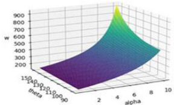

# 2026年全国大学生国家安全知识答题