# 某商超蔬菜类商品动态定价与补货决策研究

# 摘要

随着生鲜市场规模的持续扩大，蔬菜零售行业的竞争也愈加激烈。为帮助某商超改善经营模式，本文基于题目所给数据信息，建立数学模型进行分析，从而制定合理的蔬菜类商品动态定价与补货决策，提高商超收益。

针对问题一，第一问首先计算出蔬菜品类的标准差、偏度系数、峰度系数等描述统计量。然后进行数据可视化处理，分析各蔬菜品类、单品蔬菜的销售量分布规律。结果可得各单品和各蔬菜品类的日销售量都呈现出不同程度的季节性波动，其中花叶类和辣椒类蔬菜日销售量的波动性较大。第二问引入Spearman相关系数，以各蔬菜品类及单品蔬菜的日销售量为指标，进行相关性分析，求解得出除茄类外，其它五种品类蔬菜之间都呈现出显著的正相关关系。然后以单品的总销售量、每日最大销售量和日均销售量为指标，通过K­means＋＋聚类算法将单品划分为热销、畅销、平销和滞销四大类，进行相关性分析，结果可得热销单品较其他单品呈现出高总销售量，高每日最大销售量和高日均销售量特点。

针对问题二，第一问首先计算出各蔬菜品类每日成本加成定价，然后通过Pearson相关系数检验出各蔬菜品类销售总量与成本加成定价呈负线性相关关系，于是建立线性回归模型，利用最小二乘法求出线性回归方程。第二问首先针对不同品类蔬菜建立时间序列预测模型，考虑数据的时效性以前半年的日销售量为原始数据预测出未来一周各蔬菜品类的日销售量，再根据预测结果确立决策变量，以利润最大化为目标函数，以蔬菜的补货量、定价、损耗为约束条件建立优化模型，求解出未来一周最大收益为5105.60元，最后引入模拟退火模型求出最优的蔬菜品类的补货和定价策略。

针对问题三，首先筛选出可用数据范围，以最大化收益为目标函数，以单品种类数量、陈列量、补货量和定价为约束条件建立优化模型求解，筛选出29种可售单品蔬菜，并估计2023年7月1日最大收益为1282.2631元，最后基于问题二的模拟退火模型求解出最优的单品补货量和定价策略。

针对问题四，首先筛选出可代表季度蔬菜丰富度、季度效应和节日因素的指标以及六大蔬菜品类的季度平均销量，运用灰色关联分析模型，以季度各蔬菜品类的单品蔬菜销售种数、节气期间特征单品蔬菜销量和节日期间特征单品蔬菜销量作为子序列,遍历花叶类、辣椒类等六大蔬菜品类季度平均销量作为母序列，求解得出各指标与六大蔬菜品类季度平均销售量的关联度均在0.5以上，具有很强的相关性。此外本文采用文献检索法，综合引入了客流量数据、竞争对手的价格和策略数据、消费者反馈和评价数据等10种相关数据，以此来帮助商超制定合理的蔬菜补货和定价策略。

最后本文对所建立的模型进行了讨论和分析，综合评价了模型的优缺点。

关键词：K-means $^ { + + }$ 聚类优化模型模拟退火模型灰色关联分析

# 一、问题重述

# $1 .$ 1问题背景

随着社会经济的飞速发展和人民生活水平的提高，我国消费市场呈现持续活跃、稳健增长的态势。而生鲜产品作为保障民生、维护社会安稳的刚需性消费品，市场规模巨大[1]。

蔬菜作为人民日常生活不可或缺的食物之一，其本身具有高频性、精致化等消费特点，市场前景广阔。但由于蔬菜具有周期性、季节性、易腐和易伤等自然属性，加之蔬菜品种众多且产地不同所导致的购入成本各异，因此合理的定价和补货决策对于商家实现成本较低、利润最大化的经营目标至关重要，此外，制定针对于不同时间段的蔬菜需求量与供给量、供给种类的促销方案与销售组合也是需要考虑的问题。为了更好地满足市场需求，达到好的经济效益和社会效益，很有必要根据实际情况决定生产和销售活动[4]。可通过较为科学系统的数学方法对蔬菜市场进行研究分析，制定动态灵活的蔬菜商品定价以及补进策略，并依据分析结果策划合理营销方案，持续焕发商业活力，带来更高利润。

# 1.2问题要求

附件1、2、3、4所给出的是某商超近三年关于蔬菜类商品的单品编码、类别等基本信息，进价、定价和销量等销售及进货情况。为使该商超在今后蔬菜类商品的销售中做出合理决策，获得更高利润，现需结合实际情况与附近所给信息建立数学模型，分析以下问题：

问题一：依据附件1中6个蔬菜品类的商品信息以及附件2中的销售流水明细，合并统计相关数据，分别分析蔬菜各品类、蔬菜单品销售量的分布规律、相互关系，判断不同品类或不同单品之间是否存在一定的关联关系。

问题二：结合相关文献以及附件1、2、3、4，计算出各蔬菜品类的成本加成定价，再分析其与各蔬菜品类销售总量之间的关系。同时以利润最大化为目标，制定出各蔬菜品类未来一周（2023年7月1日-7日）的日补货总量和定价策略。

问题三：从附件2中找出2023年6月24­30日的可售品种，按照单品订购量（销售总量）不少于2.5千克等要求，筛选出27­33个可售单品，并据此制定7月1日的单品补货量和定价策略，尽量满足市场需求，获得最大收益。

问题四：整合分析4个附件中的数据，从季节、节日、销售形式等角度观察数据特征，整理出对于制定蔬菜商品的补货和定价决策有较大影响的相关数据，并给出选择理由，提出合理意见。

# 二、问题分析

# 2.1问题一的分析

针对问题一，第一小问，首先对附件2中的无效数据进行剔除处理，然后引入均值、最大值、最小值、中位数、标准差、偏度系数、峰度系数描述统计量，并通过数据可视化分析，通过绘制柱状图，折线图等直观观测2020年7月1日-2023年6月30日各品类蔬菜和单品蔬菜的销售情况及销售趋势，由此得出其分布规律。第二小问首先引入Spearman相关系数，以第一问得到的各蔬菜大类及大类中的单品蔬菜每日销售量为指标，进行蔬菜各品类销售量的相关性分析。然后采用K-means聚类算法，以单品的总销售量、每日最大销售量和日均销售量为指标，将单品划分为热销、畅销、平销和滞销四大类，进行单品销售量的相关性分析。

# 2.2问题二的分析

针对问题二，第一小问先根据成本加成定价公式计算得出各蔬菜品类三年来每日定价情况，然后引入Pearson相关系数判定各蔬菜品类的销售总量与成本加成定价的线性关系，最后建立线性回归模型，使用最小二乘法求出各蔬菜品类与其成本加成定价之间的线性回归方程。第二小问针对不同品类蔬菜建立合适的时间序列预测模型，考虑到数据的时效性，本文首先以前半年日销售量为原始数据预测未来一周各蔬菜品类的日销售量，然后根据预测结果建立优化模型。最后引入模拟退火模型求出最优的蔬菜品类的补货和定价策略。

# 2.3问题三的分析

针对问题三，题目要求根据2023年6月24-30日的可售品种，按照单品订购量（销售总量）不少于2.5千克等要求，筛选出27­33个可售单品。以最大收益为目标，制定7月1日的单品补货量和定价策略。本题仍然为优化问题中的线性规划问题，由由此本题基于问题二构建的模拟退火模型。首先根据题意筛选出可用的数据范围，确定目标函数及其约束条件，求出最优的单品补货量和定价策略。

# 2.4问题四的分析

针对问题四，首先在现有数据基础之上进行数据预处理，筛选出季度各蔬菜品类的单品蔬菜销售种数、节气期间特征单品蔬菜销量和节日期间特征单品蔬菜销量，分别代表季度蔬菜丰富度、季度效应和节日三个因素。其次利用以上指标数据，建立灰色关联分析模型，以季度各蔬菜品类的单品蔬菜销售种数、节气期间特征单品蔬菜销量和节日期间特征单品蔬菜销量作为子序列，遍历花叶类、辣椒类等六大蔬菜品类季度平均销量作为母序列，求出各指标对销售量的关联度，以关联度值衡量相关性的大小。通过文献检索法综合引入客流量数据、竞争对手的价格和策略数据、消费者反馈和评价数据等10种相关数据，据此制定合适的蔬菜补货和定价策略。

# 文章总体思路图如图1所示：

一 品分布 品类分布 分问题一 全 品关联 Spearman相关系数  
文 品美 K·means·关系 Pearson相关系  
处 ［模型建立 二 二 态规划 时间序列预测模型 决策类问题火模型  
分析间 向题三 动态规划（约束条得增多） 模拟火模型问题四 优化建议 模型分折请分指灰色关联分析 牛网

# 三、模型假设

1．假设蔬菜的历史销售数据能够代表未来的销售趋势，本文使用历史销售数据来预测未来的销售。2．假设蔬菜的损耗是固定的，本文使用损耗率来计算蔬菜的单位成本。3．商超的销售空间是固定的，我们假设商超的销售空间在一段时间内是恒定的。

# 四、符号说明

<html><body><table><tr><td>符号</td><td>说明</td></tr><tr><td>x𝑖k</td><td>第i种单品蔬菜第𝑘个指标（单品蔬菜总销量、每日最</td></tr><tr><td></td><td>大销量和日均销量）</td></tr><tr><td>kj</td><td>第k个聚类中心第j个指标</td></tr><tr><td>cs𝑖</td><td>第i种蔬菜品类销量</td></tr><tr><td>cppi</td><td>第i种蔬菜品类成本加成定价</td></tr><tr><td>B</td><td>单品蔬菜单位成本</td></tr><tr><td>C</td><td>单品蔬菜批发价格</td></tr><tr><td>L</td><td>单品蔬菜损耗率</td></tr><tr><td>Sij</td><td>第i蔬菜品类第j天的日销量</td></tr><tr><td>Rij</td><td>第i蔬菜品类第j天的补货量</td></tr><tr><td>P</td><td>第i蔬菜品类第j天的定价</td></tr><tr><td>Bi</td><td>第i蔬菜品类的单位成本</td></tr><tr><td>L</td><td>第i蔬菜品类平均损耗率</td></tr><tr><td>Simax</td><td>第i蔬菜品类前三年日最大销售量</td></tr><tr><td>yi</td><td>是否补货0-1变量</td></tr><tr><td>ximax</td><td>2023.6.24-6.30第i类单品蔬菜最大补货量</td></tr></table></body></html>

# 五、数据侧写

考虑到数据较为庞大和复杂，为更好地分析和理解数据，需在进行问题分析和解答前提前进行数据分析。根据题目要求，综合附件1、附件2、附件3和附件4中的数据和信息，并利用Excel和Python等工具，对数据进行多角度、多标准的整理和观察，以初步了解整体数据的大致情况，便于之后对问题的分析和解答。

# 5.1六大品类蔬菜的品种丰富度

蔬菜的品种丰富度可以为商超提供洞察消费者需求、增加竞争优势和挖掘市场潜力的机会，有助于商家优化产品组合、关注热门品种、提高销售额和满足消费者的多样化需求，六大品类蔬菜的丰富度如图2所示:

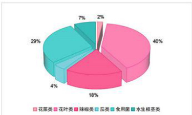  
图2六大品类蔬菜的品种丰富度占比图

由图2可知，花叶类蔬菜占品种数量的 $4 0 \%$ ，品种丰富，意味着市场上有各种各样的花叶类蔬菜可供选择。相比之下，花菜类蔬菜的品种数量只占 $2 \%$ ，在市场上可供选择的品种相对较少，选择范围较窄。

# 5.2六大品类蔬菜12个季度平均销售量情况

蔬菜12个季度的平均销售量情况可以帮助商超了解销售趋势、预测市场需求、调整产品组合和制定竞争策略。对商超进行决策制定、业务规划和市场运营都非常有价值。六大品类蔬菜12个季度平均销售量情况如图3所示：

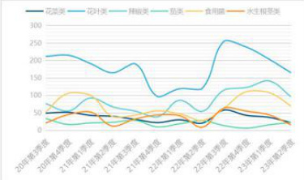  
图3六大品类蔬菜12个季度的平均销售量折线图

由图3知，花叶类较其他五类蔬菜全年销售量较高。花叶类、辣椒类、食用菌和水生根茎类销售量峰值的出现规律都呈现出周期性，大都在每年的一三四季度出现峰值。

# 5.3六大品类蔬菜损耗率

蔬菜损耗率的分布情况可以帮助商家成本管理和供应链优化，推动可持续发展，并提高商超的市场竞争力。六大蔬菜品类的损耗率如图4所示： a 14

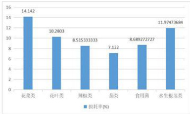  
图4六大品类蔬菜损耗率直方图

由图4可知，花菜类、水生根茎类以及花叶类的蔬菜损耗率都在 $1 0 \%$ 以上，损耗率较高，较难保存。茄类的损耗率大约为 $7 \%$ ，较容易保存，意味着销售时间较长。

# 六、问题一模型的建立与求解

# 6.1数据预处理

在分析蔬菜各品类及单品的销售量分布情况时，部分商品存在退货的情况，销售单价显示为负值，不能反映实际的销售量情况，属于无效数据，故对附件2中退货的数据进行剔除处理。

# 6.2第一问：通过数据处理分析分布规律

# 6.2.1基于数据的数字特征进行描述

题目要求根据蔬菜各品类的商品信息和单品销售量的情况，描述蔬菜各品类和单品的销售量的分布规律，本文引入均值、最大值、最小值、中位数、标准差、偏度系数、峰度系数来描述统计数据。

# （1）偏度系数

偏度系数（Skewness）用于衡量数据分布的偏斜程度。 $S _ { k } = 0$ 表示数据近似对称分布， $S _ { k } > 0$ 表示数据呈右偏分布， $S _ { k } < 0$ 表示数据呈左偏分布。偏度系数的绝对值越大，数据分布的偏斜程度越明显。其计算公式如下：

$$
\begin{array} { r } { S _ { k } = E \left[ \left( \frac { X - \mu } { \sigma } \right) ^ { 3 } \right] = \frac { \mu ^ { 3 } } { \sigma ^ { 3 } } } \end{array}
$$

其中 $S _ { k }$ 偏度系数， $E ( X )$ 为均值， $\mu ^ { 3 }$ 为三阶中心距

# （2）峰度系数

峰度系数（Kurtosis）用于衡量数据分布的峰度程度。 $K _ { u } = 0$ 表示数据分布为正态分布， $K _ { u } < 0$ 表示数据分布的峰度较小，数据更分散， $K _ { u } > 0$ 表示数据分布的峰度较大，数据更集中。峰度系数的绝对值越大，数据分布的峰度程度越明显。其计算公式如下：

$$
K _ { u } = E \left[ \left( \frac { X - \mu } { \sigma } \right) ^ { 4 } \right] = \frac { \mu ^ { 4 } } { \sigma ^ { 4 } }
$$

其中 $K _ { u }$ 偏度系数， $E ( X )$ 为均值， $\mu ^ { * }$ 为四阶标准距

（3）系数求解

利用MATLAB求解蔬菜六大类及各单品的销售量的描述统计量如下表所示（由于篇幅原因，表1只展示前九种单品的统计量表，其余单品见附件）

表1蔬菜六大品类日销售量统计学指标表  

<html><body><table><tr><td>指标</td><td>花菜类</td><td>食用菌</td><td>花叶类</td><td>辣椒类</td><td>茄类</td><td>水生根茎类</td></tr><tr><td>最小值</td><td>0.00</td><td>0.00</td><td>0.00</td><td>0.00</td><td>0.00</td><td>0.00</td></tr><tr><td>最大值</td><td>186.16</td><td>511.14</td><td>1265.47</td><td>604.23</td><td>118.93</td><td>296.79</td></tr><tr><td>均值</td><td>38.16</td><td>69.18</td><td>181.42</td><td>83.69</td><td>20.50</td><td>37.08</td></tr><tr><td>中位数</td><td>33.86</td><td>57.28</td><td>172.11</td><td>72.54</td><td>18.27</td><td>30.05</td></tr><tr><td>偏度</td><td>1.47</td><td>2.95</td><td>2.71</td><td>3.06</td><td>1.55</td><td>2.48</td></tr><tr><td>峰度</td><td>7.03</td><td>19.85</td><td>27.36</td><td>20.78</td><td>8.15</td><td>14.95</td></tr><tr><td>标准差</td><td>22.90</td><td>48.20</td><td>87.65</td><td>53.82</td><td>13.57</td><td>31.43</td></tr></table></body></html>

通过计算结果可知，蔬菜的六大品类中，花叶类和辣椒类的均值较高，标准差也相对较大，说明其销售量的波动性较大，销售量不稳定；而茄类的销售量均值较低，标准差也相对较小，说明其销售量的波动性较小，销售量稳定。六大品类中所有的偏度值都大于0，说明数据分布相对于均值向右倾斜，即可能存在一些较高销售量的极端值。其中，辣椒类的偏度值最大，表明其销售量分布相对于其他品类更加右倾。六大品类中所有的峰度值都大于8，表明数据分布相对于正态分布更加尖峰。花叶类的峰度值最高，说明其销售量分布尖峰程度最为窄高，偏离正态分布更远。

由于单品蔬菜种类颇多，本文此处选取各类蔬菜中总销售量最大的单品蔬菜和总销售量最少且不低于 $2 0 0 0 \mathrm { k g }$ 的单品蔬菜进行展示（其余单品见附件）。

表2单品销售量统计学指标表  

<html><body><table><tr><td>指标</td><td>西兰花</td><td>江</td><td>金针菇</td><td>虫草花</td><td>云南生菜</td><td>小白菜</td></tr><tr><td>最小值</td><td>0.00</td><td>0.00</td><td>0.00</td><td>0.00</td><td>0.00</td><td>0.00</td></tr><tr><td>最大值</td><td>152.13</td><td>47.65</td><td>284.88</td><td>41.13</td><td>152.16</td><td>15.00</td></tr><tr><td>均值</td><td>25.17</td><td>5.32</td><td>26.17</td><td>1.94</td><td>27.63</td><td>1.87</td></tr><tr><td>中位数</td><td>21.70</td><td>0.00</td><td>18.42</td><td>0.00</td><td>24.00</td><td>0.00</td></tr><tr><td>偏度</td><td>1.88</td><td>1.91</td><td>4.13</td><td>3.30</td><td>1.61</td><td>1.60</td></tr><tr><td>峰度</td><td>9.64</td><td>6.03</td><td>30.63</td><td>23.59</td><td>7.75</td><td>5.13</td></tr><tr><td>标准差</td><td>15.99</td><td>9.79</td><td>27.00</td><td>3.50</td><td>18.88</td><td>2.77</td></tr><tr><td>指标</td><td>芜湖青椒</td><td>青尖椒</td><td>紫茄子</td><td>长线茄</td><td>净藕</td><td>莲蓬（个）</td></tr><tr><td>最小值</td><td>0.00</td><td>0.00</td><td>0.00</td><td>0.00</td><td>0.00</td><td>0.00</td></tr><tr><td>最大值</td><td>249.97</td><td>22.00</td><td>109.43</td><td>50.21</td><td>163.55</td><td>80.00</td></tr><tr><td>均值</td><td>25.74</td><td>1.94</td><td>12.70</td><td>2.28</td><td>25.18</td><td>1.91</td></tr><tr><td>中位数</td><td>23.14</td><td>1.20</td><td>11.05</td><td>0.00</td><td>22.02</td><td>0.00</td></tr><tr><td>偏度</td><td>2.88</td><td>2.31</td><td>2.71</td><td>3.32</td><td>1.40</td><td>5.54</td></tr><tr><td>峰度</td><td>20.57</td><td>12.32</td><td>19.86</td><td>25.87</td><td>6.95</td><td>37.63</td></tr><tr><td>标准差</td><td>24.54</td><td>2.37</td><td>9.27</td><td>3.97</td><td>20.59</td><td>8.36</td></tr></table></body></html>

通过表2可知，金针菇、芜湖青椒和净藕的均值高，标准差也较高，说明其销售量的波动性很大，销售量不稳定；虫草花、小白菜、青尖椒和长线茄的均值低，标准差也低，说明其销售量的波动性较小，销售量相对稳定；所有单品蔬菜的偏度值都大于0，说明数据分布于均值右侧的居多：所有单品蔬菜的峰度值都大于0，表明数据分布相对于正态分布更加尖峰。 cn

# 6.2.2数据可视化处理直观观测数据

通过数据描述性分析，首先对蔬菜六大品类及各单品的销售量进行基本情况了解。再对数据进行可视化处理，直观观测数据的模式和趋势，深入分析蔬菜六大品类及各单品的销售量的分布规律。

（1）蔬菜六大品类总销售量分布情况

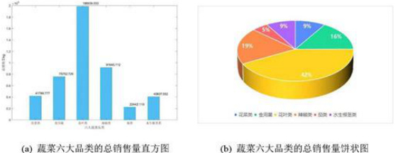  
图5蔬菜六大品类的总销售量分布图

通过图5可以看出，花叶类蔬菜的销售量占比高达 $4 2 \%$ ，位居销售量最高位，是消费者最喜爱的品类之一。其次是辣椒类和食用菌，占据相当大的市场份额。这些数据表明花叶类蔬菜在消费者中拥有广泛的认可度和受欢迎程度，辣椒类和食用菌的高销售量也证明了消费者对具有独特风味和营养价值的蔬菜产品的青睐。

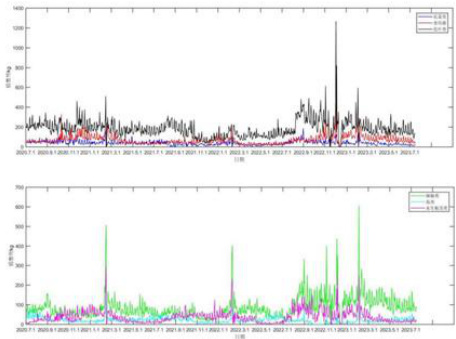  
（2）蔬菜六大品类日销量分布情况  
图6蔬菜六大品类日销量分布图

由图6可知，六类蔬菜的日销售量在2020年7月至2023年6月30日都有其高峰和低谷，呈现出明显的季节性波动。这意味着人们对不同品类的蔬菜的需求在不同季节有所变化，并且这种季节性的波动对蔬菜销售量产生了一定的影响。其次，辣椒类和水生根类的销售量在每年的特定时段都达到了最高峰，这可能与某些节日或季节性事件有关。

# （3）单品蔬菜的分布情况

由于篇幅有限制，本文此处只展示花叶类和茄类的分布情况，其余单品见附件。

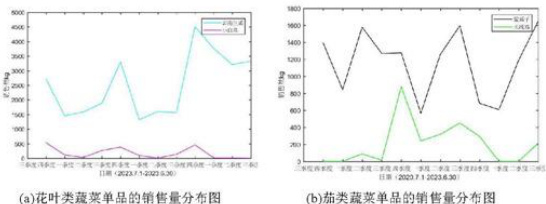  
图7单品蔬菜的分布情况

由图7可知，各类单品蔬菜都在特定阶段呈现明显的高峰和低谷阶段，说明它们的销售量可能受到季节性的影响。

# 6.3第二问：分别建立模型判断关联关系

# 6.3.1利用Spearman相关系数判断各品类之间的相关性

# （1）Spearman相关系数的运用

Spearman相关系数是一种非参数的相关性度量，可以等级化变量之间的相关性，用于分析两个连续变量之间的相关性。由于蔬菜各品类的销售量为连续变量，因此本次建模采用Spearman相关系数用于分析蔬菜各品类销售量的相关关系。X、Y为两组独立同分布的数据，其样本个数为N。 $X _ { i } , Y _ { i }$ 分别表示两组随机变量的第i个值，其中$i = 1 , 2 , . . . . . N$ 。

首先对X，Y集合同时降序或升序排列，得到两个元素排序集合 $x , y$ ，其中元素$x _ { i , { y } _ { i } }$ 分别为 $X _ { i } , Y _ { i }$ 在各自集合中的排序。设定d集合为X与Y集合中相同位元素排序之差，d集合各元素计算式如下：

$$
d _ { i } = x _ { i } - y _ { i }
$$

Spearman相关系数 $r _ { s }$ 计算公式如下：

$$
r _ { s } = 1 - \frac { 6 { \sum _ { t = 1 } ^ { N } } d _ { t } ^ { 2 } } { N ( N ^ { 2 } - 1 ) }
$$

利用MATLAB求解蔬菜六大品类的Spearman相关系数如下表所示：

表3蔬菜六大品类的Spearman相关系数表  

<html><body><table><tr><td colspan="7">Spearman相关系数</td></tr><tr><td></td><td>花菜类</td><td>食用菌</td><td>花叶类</td><td>辣椒类</td><td>茄类</td><td>水生根茎类</td></tr><tr><td>花菜类</td><td>1.00</td><td>0.48</td><td>0.64</td><td>0.45</td><td>0.21</td><td>0.41</td></tr><tr><td>食用菌</td><td>0.48</td><td>1.00</td><td>0.61</td><td>0.55</td><td>-0.08</td><td>0.62</td></tr></table></body></html>

<html><body><table><tr><td rowspan="4">花叶类 辣椒类 茄类 水生根茎类</td><td>0.64</td><td rowspan="2">0.61 0.55</td><td>1.00</td><td>0.61</td><td>0.27</td><td>0.45</td></tr><tr><td>0.45</td><td>0.61</td><td>1.00</td><td>0.13</td><td>0.35</td></tr><tr><td>0.21</td><td>-0.08</td><td>0.27</td><td>0.13</td><td>1:00</td><td>-0.18</td></tr><tr><td>0.41</td><td>0.62</td><td>0.45</td><td>0.35</td><td>-0.18</td><td>1.00</td></tr></table></body></html>

由表3可知：

[.花菜类与其它品类的相关系数较高，呈正相关，其中花叶类与花菜类的Spearman相关系数为0.64，表明它们之间存在较强的正相关关系。

[I．食用菌与花菜类，花叶类，辣椒类和水生根茎类呈正相关关系，且相关性较高。但与茄类的Spearman相关系数为-0.08，相关性近似于0。

II.花叶类与其它品类的相关系数较高，表明它们之间存在较强的正相关关系。

IⅣ.辣椒类于其它品类具有较强的正相关关系。

V．茄类和其它蔬菜品类之间的相关系数较低，说明茄类与其他品类之间的销售量关系较弱。

VI.水生根茎类与其它蔬菜品类之间的相关系数均在0.4左右，表明它们之间存在一定的正相关关系，但相关性不强。

# （2）Spearman相关系数的检验

本文对蔬菜六大品类采取Spearman相关系数检验，检验步骤如下：

# Step1）提出假设

原假设 $H _ { 0 }$ ：Spearman系数R $\neq 0$ 备择假设 $H _ { 1 }$ ：Spearman系数R $= 0$ 设定置信水平为 $9 0 \%$ （201

# Step2）计算P值

本文利用MATLAB进行斯皮尔曼系数检验，结果如表4所示

表4六大蔬菜品类的Spearman相关系数检验P值  

<html><body><table><tr><td colspan="7">p值检验</td></tr><tr><td></td><td>花菜类</td><td>食用菌</td><td>花叶类</td><td>辣椒类</td><td>茄类</td><td>水生根茎类</td></tr><tr><td>花菜类</td><td>1.00</td><td>0.00</td><td>0.00</td><td>0.00</td><td>0.00</td><td>0.00</td></tr><tr><td>食用菌</td><td>0.00</td><td>1.00</td><td>0.00</td><td>0.00</td><td>0.00</td><td>0.00</td></tr><tr><td>花叶类</td><td>0.00</td><td>0.00</td><td>1.00</td><td>0.00</td><td>0.00</td><td>0.00</td></tr><tr><td>辣椒类</td><td>0.00</td><td>0.00</td><td>0.00</td><td>1.00</td><td>0.00</td><td>0.00</td></tr><tr><td>茄类</td><td>0.00</td><td>0.00</td><td>0.00</td><td>0.00</td><td>1.00</td><td>0.00</td></tr><tr><td>水生根茎类</td><td>0.00</td><td>0.00</td><td>0.00</td><td>0.00</td><td>0.00</td><td>1.00</td></tr></table></body></html>

由表4可知，六大蔬菜品类任意两者之间的P值均为0，故接受原假设，可认为各个蔬菜品类之间的销售量存在显著相关性。

# 6.3.2通过K-means++聚类算法找出各单品之间的关联关系

# （1）K-means $^ { + + }$ 聚类算法的计算

K-means $^ { + + }$ 算法是k-means算法的拓展，在初始化簇中心时，摒弃了K-means算法随机初始化的思想，其选择初始化聚类中心的原则是初始化簇中心之间的相互距离要尽可能地远。

本次建模采用K-mean $^ { + + }$ 聚类算法，首先将单品名称相同的品种进行数据合并处理，然后以单品的总销售量、每日最大销售量和日均销售量为指标，将单品分为热销、畅销、平销和滞销四大类，进行单品销售量的相关性分析。本文设定K值为4，进行

建模聚类。K-means $^ { + + }$ 算法步骤如下：

Step1）在数据集X中随机选择一个样本点作为第一个初始聚类中心𝐶𝑖；Step2）选择出其余的聚类中心：

计算样本中的每一个样本点与已经初始化的聚类中心之间的距离，并选择其中最短的距离，记为d𝑖;

计算每个样本点被选为下一个聚类中心的概率 $P ( x )$ ，最后选择最大概率值（或者概率分布）所对应的样本点作为下一个簇中心；

$$
P ( x ) = \frac { d _ { i } ( x ) ^ { 2 } } { \sum _ { x \in \mathcal { X } } d _ { i } ( x ) ^ { 2 } }
$$

Step3）重复上述过程，直到 $\mathbf { k }$ 个聚类中心都被确定。

Step4）计算各个样本与各个聚类中心的欧式距离：

$$
D _ { i j } = \sqrt { \sum _ { k = 1 } ^ { m } ( x _ { i k } - K _ { j k } ) ^ { 2 } } \qquad j = 1 , 2 , \cdots , K ; i = 1 , 2 , \cdots , n
$$

共有 $\mathbf { m }$ 个指标，n个样本。比较得出与各聚类中心最小距离的样本，归为聚类中心的类。

Step5）迭代一次后，更新聚类中心，新聚类中心变为：

$$
K _ { j } ^ { \prime } = \frac { 1 } { n ^ { \prime } } \sum _ { x _ { i } \in K _ { j } } x _ { i }
$$

Step6）重复Step4和Step5，直到聚类中心不再改变为止。

# （2）得出聚类中心

以单品的总销售量、每日最大销售量和日均销售量为指标，使用聚类算法进行分类，将单品分为热销、畅销、平销和滞销四大类。

表5聚类中心  

<html><body><table><tr><td></td><td colspan="3">聚类中心</td><td></td></tr><tr><td></td><td>总销售量</td><td>每日最大销售量</td><td>日均销售量</td><td>类别</td></tr><tr><td>聚类中心1</td><td>438.8518911</td><td>13.93541584</td><td>0.400777983</td><td>滞销</td></tr><tr><td>聚类中心2</td><td>14215.58056</td><td>142.037</td><td>12.98226535</td><td>畅销</td></tr><tr><td>聚类中心3</td><td>6087.9508</td><td>91.985</td><td>5.55977242</td><td>平销</td></tr><tr><td>聚类中心4</td><td>28444.3606</td><td>200.5386</td><td>25.97658502</td><td>热销</td></tr></table></body></html>

# （3）问题求解

利用MATLAB求解各单品蔬菜的聚类结果如下表所示（由于篇幅原因，只展示前60种单品的聚类结果，其余结果见附件）：

表6六十种单品蔬菜聚类  

<html><body><table><tr><td>序号</td><td>名称</td><td>类别</td><td>序号</td><td>名称</td><td>类别</td><td>序号</td><td>名称</td><td>类别</td></tr><tr><td>1</td><td>金针菇</td><td>热销</td><td>11</td><td>西峡香菇</td><td>畅销</td><td>21</td><td>洪湖莲藕（粉藕）</td><td>平销</td></tr><tr><td>2</td><td>净藕</td><td>热销</td><td>12</td><td>小米椒</td><td>畅销</td><td>22</td><td>黄白菜</td><td>平销</td></tr><tr><td>3</td><td>芜湖青椒</td><td>热销</td><td>13</td><td>云南油麦菜</td><td>畅销</td><td>23</td><td>黄心菜1</td><td>平销</td></tr><tr><td>4</td><td>西兰花</td><td>热销</td><td>14</td><td>紫茄子</td><td>畅销</td><td>24</td><td>牛首油菜</td><td>平销</td></tr></table></body></html>

<html><body><table><tr><td>5</td><td>云南生菜</td><td>热销</td><td>15</td><td>白玉菇</td><td>平销</td><td>25</td><td>泡泡椒（精品）</td><td>平销</td></tr><tr><td>6</td><td>菠菜</td><td>畅销</td><td>16</td><td>保康高山大白菜</td><td>平销</td><td>26</td><td>青梗散花</td><td>平销</td></tr><tr><td>7</td><td>大白菜</td><td>畅销</td><td>17</td><td>菜心</td><td>平销</td><td>27</td><td>青茄子</td><td>平销</td></tr><tr><td>8</td><td>螺丝椒</td><td>畅销</td><td>18</td><td>海鲜茹</td><td>平销</td><td>28</td><td>青线椒</td><td>平销</td></tr><tr><td>9</td><td>奶白菜</td><td>畅销</td><td>19</td><td>红椒</td><td>平销</td><td>29</td><td>双孢菇</td><td>平销</td></tr><tr><td>10</td><td>上海青</td><td>畅销</td><td>20</td><td>红薯尖</td><td>平销</td><td>30</td><td>甜白菜</td><td>平销</td></tr><tr><td>31</td><td>商蒿</td><td>平销</td><td>41</td><td>白菜苔</td><td>滞销</td><td>51</td><td>赤松茸</td><td>滞销</td></tr><tr><td>32</td><td>娃娃菜</td><td>平销</td><td>42</td><td>白蒿</td><td>滞销</td><td>52</td><td>虫草花</td><td>滞销</td></tr><tr><td>33</td><td>苋菜</td><td>平销</td><td>43</td><td>薄荷叶</td><td>滞销</td><td>53</td><td>春菜</td><td>滞销</td></tr><tr><td>34</td><td>小青菜</td><td>平销</td><td>44</td><td>本地黄心油菜</td><td>滞销</td><td>54</td><td>大白菜秧</td><td>滞销</td></tr><tr><td>35</td><td>小皱皮</td><td>平销</td><td>45</td><td>本地上海青</td><td>滞销</td><td>55</td><td>大芥兰</td><td>滞销</td></tr><tr><td>36</td><td>杏鲍菇</td><td>平销</td><td>46</td><td>本地小毛白菜</td><td>滞销</td><td>56</td><td>大龙茄子</td><td>滞销</td></tr><tr><td>37</td><td>枝江红菜苔</td><td>平销</td><td>47</td><td>荸荠</td><td>滞销</td><td>57</td><td>灯笼椒</td><td>滞销</td></tr><tr><td>38</td><td>枝江青梗散花</td><td>平销</td><td>48</td><td>冰草</td><td>滞销</td><td>58</td><td>东门口小白菜</td><td>滞销</td></tr><tr><td>39</td><td>竹叶菜</td><td>平销</td><td>49</td><td>蔡甸藜蒿</td><td>滞销</td><td>59</td><td>甘蓝叶</td><td>滞销</td></tr><tr><td>40</td><td>艾蒿</td><td>滞销</td><td>50</td><td>茶树菇（袋）</td><td>滞销</td><td>60</td><td>高瓜</td><td>滞销</td></tr></table></body></html>

各单品的销售量相关性分析结果：

I.热销类别中的单品通常具有高总销售量、高每日最大销售量和高日均销售量。这意味着这些单品销售非常火爆，并且在销售指标上表现出相对一致的趋势。热销类别内的单品之间可能存在很高的相关性，即它们的销售指标相互影响较大。  
II.畅销类别中的单品在销售指标上表现相对较好，但相对于热销类别来说，它们的总销售量、每日最大销售量和日均销售量可能会稍低。在畅销类别内，单品之间的相关性较强。  
III.平销类别中的单品的销售指标在中等水平上保持稳定，没有明显的高或低。这些单品之间可能存在较低的相关性，销售指标相对独立。  
IV.滞销类别中的单品表现出较低的总销售量、每日最大销售量和日均销售量。这些单品之间可能存在较弱的相关性，它们的销售指标相互影响较小。

# 七、问题二模型的建立与求解

# $7 .$ 1成本加成定价

成本加成定价法含义直观，使用简便，在定价实践中运用较为广泛[2]。这种方法是指在商品成本的基础上，根据零售主体的需求加上适当比例的利润，最终形成商品的零售价格。

成本加成定价 $\mathbf { \sigma } = \mathbf { \sigma }$ 单位成本 $x$ （1+成本利润）A批发价格（元/千克）+批发价格（元/千克） $\times$ 损耗率(%) 销售单价批发价格批发价格 t

  
图8成本加成定价定义

# 7.2第一问：Pearson相关系数判断线性关系

# 7.2.1Pearson相关系数的运用

Pearson相关系数被广泛用来衡量两个变量之间线性相关程度，其取值范围介于-1到1之间，其中正值表示正向相关，负值表示负向相关，而接近于0的值表示两个变量之间几乎没有线性相关性。计算公式如下：

$$
r = \frac { \sum _ { i = 1 } ^ { n } ( X _ { i } - \bar { X } ) ( Y _ { i } - \bar { Y } ) } { \sqrt { \sum _ { i = 1 } ^ { n } ( X _ { i } - \bar { X } ) ^ { 2 } } \sqrt { \sum _ { i = 1 } ^ { n } ( Y _ { i } - \bar { Y } ) ^ { 2 } } }
$$

# （1）求解结果

Pearson相关系数结果如下表：

表7Pearson相关系数  

<html><body><table><tr><td>品类</td><td>花菜类</td><td>食用菌</td><td>花叶类</td><td>辣椒类</td><td>茄类</td><td>水生根茎类</td></tr><tr><td>相关系数</td><td>−0.30</td><td>−0.28</td><td>−0.27</td><td>−0.26</td><td>−0.17</td><td>−0.21</td></tr></table></body></html>

由上表可知，花菜类、食用菌、辣椒类、茄类、花叶类和水生根茎类的销售总量与成本加成定价的相关系数都小于0，故各蔬菜品类的销售总量与成本加成定价呈负线性相关关系。

# （2）Pearson相关系数检验

本文对上述结果Pearson相关系数检验，检验步骤如下：

# Step1）提出假设

原假设 $H _ { 0 }$ ：Pearson相关系数R $\neq 0$ 备择假设 $H _ { 1 }$ ：Pearson相关系数R $\mathit { \Theta } = 0$ 设定置信水平为 $9 0 \%$ （20号

# Step2）计算P值

本文利用MATLAB进行Pearson相关系数检验，结果如下表所示：

表8Pearson相关系数检验P值  

<html><body><table><tr><td>品类</td><td>花菜类</td><td>食用菌</td><td>花叶类</td><td>辣椒类</td><td>茄类</td><td>水生根茎类</td></tr><tr><td>p值</td><td>0.001</td><td>0.001</td><td>0.001</td><td>0.001</td><td>0.001</td><td>0.001</td></tr></table></body></html>

由表8可知，六大蔬菜品类的销售量与其成本加成定价的P值均约为0.001，远小于置信水平0.05，拒绝原假设，即六大蔬菜品类的销售量与其成本加成定价均呈现显著的线性相关关系。

# 7.2.2线性回归方程的验证与计算

由上述分析知，各品类蔬菜的销售总量与成本加成定价之间存在明显的线性关系。因此，本文以各蔬菜品类的销售总量为自变量，成本加成定价为因变量，建立线性回归模型，进一步判断各品类蔬菜的销售总量与成本加成定价之间线性相关关系的趋势。表达式如下：

$$
c p p = \beta _ { 0 } + \beta _ { 1 } c s
$$

其中，c𝑝𝑝为成本加成定价, $c s$ 为各蔬菜品类的销售总量 ${ \bf \nabla } \cdot \beta _ { 0 }$ 为截距。

最小二乘法通过找到最佳的系数值，使得线性模型的预测值与实际观测值之间的残差平方和最小化。

$$
\begin{array} { r } { \beta _ { 1 } = \frac { \sum _ { l = 1 } ^ { n } ( c s _ { i } - \overline { { c s } } ) ( c p p _ { l } - \overline { { c p p } } ) ) } { \sum _ { l = 1 } ^ { n } ( c s _ { i } - \overline { { c s } } ) ^ { 2 } } } \end{array}
$$

（1）求解结果

根据最小二乘法，建立线性回归方程 $c p p = \beta _ { 0 } + \beta _ { 1 } c s$ ，通过SPSS软件建立线性回归模型，得到如下六个回归模型判断表，其p值检验均小于0.01，故拒绝原假设，回归模型建立效果较好（因篇幅限，此处只展示辣椒类和食用菌的结果，其余见附录）。

表9回归模型判断表  

<html><body><table><tr><td colspan="5">辣椒类</td><td colspan="5">食用菌</td></tr><tr><td></td><td colspan="2">非标准化系数</td><td>标准化系数</td><td rowspan="2">P</td><td rowspan="2"></td><td colspan="2">非标准化系数</td><td>标准化系数</td><td rowspan="2">P</td></tr><tr><td></td><td>B 标准误</td><td>Beta</td><td></td><td>B</td><td>标准误</td><td>Beta</td></tr><tr><td>常数</td><td>9.508</td><td>0.914</td><td>9.508</td><td>0.000** *</td><td>常数</td><td>10.002</td><td>1. 015</td><td>10.002</td><td>0.000***</td></tr><tr><td></td><td>销量-3.623</td><td>1.909</td><td>−0.038</td><td>0.067*</td><td>销量</td><td>3.831</td><td>1.831</td><td>−0.053</td><td>0.040**</td></tr></table></body></html>

由表9分析可知，根据标准化系数，建立辣椒类与食用菌的成本加成定价与其销售量的线性方程如下：

当辣椒类和食用菌类日销售量为0时，其初始成本加成定价分别为9.508和10.002元。而当辣椒类日销售量每上升1kg，其成本加成定价就会降低0.038元；当食用菌日销售量每上升1kg，其成本加成定价就会降低0.053元。

其余线性方程如下：

花菜类： $c p p _ { 3 } = 2 0 . 9 4 3 - 0 . 0 8 9 c s _ { 3 }$ （20茄类： $c p p _ { 4 } = 1 3 . 4 2 7 - 0 . 0 5 6 \mathrm { c s } _ { 4 }$ （204号花叶类： $c p p _ { 5 } = 1 2 . 0 7 6 - 0 . 0 9 3 c s _ { 5 }$ （20号水生根茎类： $c p p _ { 6 } = 1 3 . 8 3 4 - 0 . 0 3 4 c s _ { 6 }$

当花菜类、茄类、花叶类和水生根茎类日销售量为0时，其初始成本加成定价分别为20.943、13.427、12.076和13.834元。而当其销量每增加 $1 \mathrm { k g }$ 时，各自成本加成定价分别减少0.089、0.056、0.093和0.034元。

# 7.3第二问：优化模型制定单周日补货总量和定价策略

首先建立时间序列预测模型，为确保数据的时效性，以近半年期间的日销售量为原始数据，预测2023年7月1日­7日的日销售量。然后根据得到的预测结果建立优化模型，最后通过模拟退火模型得出各蔬菜品类的最优补货和定价策略。

# 7.3.1利用时间序列预测模型得出相关指标

本文利用SPSS软件构建时间序列模型，以专家建模器为基本算法进行预测未来一周的各蔬菜品类日销量。

表10各品类蔬菜适用的时间序列模型  

<html><body><table><tr><td>名称</td><td>模型</td></tr><tr><td>花菜类</td><td>简单季节性</td></tr><tr><td>食用菌</td><td>简单季节性</td></tr><tr><td>花叶类</td><td>温特斯乘性</td></tr><tr><td>辣椒类</td><td>简单季节性</td></tr><tr><td>茄类</td><td>简单季节性</td></tr><tr><td>水生根茎类</td><td>简单季节性</td></tr></table></body></html>

由表10可知，花叶类所建立的时间序列预测模型为温特斯乘性，花菜类、食用菌、辣椒类、茄类和水生根茎类均呈现季节趋势，故建立了简单季节性模型。

# （1）两种模型公式

※温特斯乘法模型

$$
\left\{ \begin{array} { l l } { \displaystyle l _ { t } = \alpha \frac { x _ { t } } { s _ { t - m } } + ( 1 - \alpha ) ( l _ { t - 1 } + b _ { t - 1 } ) , \mathrm { ~ } ( \mathrm { ~ } \forall \mathrm { H } \mathrm { ~ } \overline { { \varphi } } \mathrm { \nearrow } \mathrm { H } \overline { { \varphi } } ) , } \\ { \displaystyle b _ { t } = \beta ( l _ { t } - l _ { t - 1 } ) + ( 1 - \beta ) b _ { t - 1 } , \mathrm { ~ } ( \mathrm { ~ } \forall \mathrm { H } \mathrm { ~ } \overline { { \varphi } } \mathrm { \nearrow } \mathrm { H } \overline { { \varphi } } ) , } \\ { \displaystyle s _ { t } = \gamma \frac { x _ { t } } { l _ { t - 1 } - b _ { t - 1 } } + ( 1 - \gamma ) s _ { t - m } , \mathrm { ~ } ( \mathrm { ~ } \frac { \mathrm { d } \overline { { \varphi } } \mathrm { \ne } \mathrm { H } \mathrm { ~ } \overline { { \varphi } } \mathrm { H } } { \mathrm { H } \overline { { \varphi } } \mathrm { H } } ) , } \\ { \displaystyle \hat { x } _ { t + h } = ( l _ { t } + h b _ { t } ) s _ { t + h - m ( k + 1 ) } , k = \Big [ \frac { h - 1 } { m } \Big ] , \mathrm { ~ } ( \mathrm { ~ f i g ~ } \mathrm { H } ) . } \end{array} \right.
$$

※简单季节性模型

模型中的一些指标解释如下：

<html><body><table><tr><td>指标</td><td>解释</td></tr><tr><td>m</td><td>周期长度（4季度）</td></tr><tr><td></td><td>水平平滑参数</td></tr><tr><td>β</td><td>趋势平滑参数</td></tr><tr><td>Y</td><td>季节平滑参数</td></tr><tr><td>𝑥t+h</td><td>第h期预测值</td></tr><tr><td>xt</td><td>第t期原始值</td></tr></table></body></html>

由于预测未来一周蔬菜的日销量，故设定 $h = 1 , 2 , \cdots , 7$

# （2）单位成本计算

各蔬菜品类单位成本计算公式：

$$
B = C \times ( 1 + L )
$$

其中B为单位成本，C为批发价格， $\mathrm { ~ L ~ }$ 为损耗率。

从而求得各蔬菜品类单位成本分别为花菜类7.57元、食用菌7.20元、花叶类：5.44元、辣椒类：7.61元、茄类：5.17元水生根茎类11.22元。

# （3）目标函数的建立

本模型的优化目标为利润最大化，其数学表达式为：

$$
\operatorname* { m a x } \sum _ { \mathrm { i } = 1 } ^ { 6 } \sum _ { \mathrm { j } = 1 } ^ { 7 } S _ { i j } \times \left( P _ { i j } - B _ { i } \right) - R _ { i j } \times B _ { i } \times L _ { i }
$$

其中 $S _ { i j }$ $R _ { i j }$ $P _ { i j }$ 1 $B _ { i }$ $\boldsymbol { L } _ { i }$ 分别表示第 $i$ 蔬菜品类第 $j$ 天的日销量、补货量、定价、单位成本和平均损耗率

（4）约束条件的确立

# $\textcircled{1}$ 需求约束：

为满足蔬菜的正常供应，各品类蔬菜补货量应当不低于每日销售量，即：

$$
R _ { i j } \geq S _ { i j } , \ i = 1 , 2 , \cdots 6 ; j \leq 1 , 2 , \cdots , 7
$$

# $\textcircled{2}$ 补货约束：

为保证商超正常的销售，需要避免某蔬菜品类补货严重过多的情况发生，需使各

蔬菜品类未来一周补货量不超过前三年各品类蔬菜日最大销售量，即：

$$
R _ { i j } \le S _ { i m a x } , ~ i = 1 , 2 , \cdots 6 ; j \le 1 , 2 , \cdots , 7
$$

其中 $S _ { i m a x }$ 表示第i蔬菜品类前三年日最大销售量。

各蔬菜品类前三年日均销量如下表：

表11各蔬菜品类前三年日均销量  

<html><body><table><tr><td>指标</td><td>花菜类</td><td>食用菌</td><td>花叶类</td><td>辣椒类</td><td>茄类</td><td>水生根茎类</td></tr><tr><td>均值</td><td>38.16</td><td>69.18</td><td>181.42</td><td>83.69</td><td>20.50</td><td>37.08</td></tr></table></body></html>

# $\textcircled{3}$ 定价约束：

由于商超收益，各蔬菜品类定价不低于其单位成本的 $1 1 0 \%$ ，且同时防止定价过高影响销售，故定价不超过单位成本的 $1 5 0 \%$ ，即

$$
\ 1 1 0 \% \times B _ { i } \leq P _ { i j } \leq 1 5 0 \% \times B _ { i } , i = 1 , 2 , \cdots 6 ; j \leq 1 , 2 , \cdots , 7
$$

# $\textcircled{4}$ 损耗约束：

若蔬菜当日未售出，隔日就无法再售，同时考虑蔬菜运输或销售过程中存在一定损耗，为避免过多的损失需要控制损耗，使补货量中存在的损失不超过前三年各蔬菜品类的最大日均损失，即：

$$
B _ { i } \times R _ { i j } \times L _ { i } + \left( R _ { i j } - S _ { i j } \right) \le L _ { i } \times S _ { i m a x } , i = 1 , 2 , \cdots 6 ; j \le 1 , 2 , \cdots , 7
$$

$7 .$ 3.2优化模型的整合呈现

$$
m a x \sum _ { i = 1 } ^ { 6 } \sum _ { j = 1 } ^ { 7 } S _ { i j } \times \left( P _ { i j } - B _ { i } \right) - R _ { i j } \times B _ { i } \times L _ { i }
$$

$$
S _ { i j } \le R _ { i j } \le S _ { i m a x _ { i } } , ~ i = 1 , 2 , \cdots 6 ; j \le 1 , 2 , \cdots , 7
$$

$$
\begin{array} { r l } & { \cdot t . \left\{ \begin{array} { c } { 1 1 0 9 \zeta \times B _ { i } \leq P _ { i j } \leq 1 5 0 \% \times B _ { i } , i = 1 , 2 , \cdots 6 ; j \leq 1 , 2 , \cdots , 7 } \\ { B _ { i } \times R _ { i j } \times L _ { i } + \left( R _ { i j } - S _ { i j } \right) \leq L _ { i } \times S _ { i m a x } , i = 1 , 2 , \cdots 6 ; j \leq 1 , 2 , \cdots , 7 } \end{array} \right. } \end{array}
$$

7.3.3依据模拟退火模型得出较优策略

模拟退火算法的基本思想是从某一较高初温出发，伴随温度参数的不断下降,结合一定的概率突跳特性在解空间中随机寻找目标函数的全局最优解，即在局部最优解能概率性地跳出并最终趋于全局最优。

# （1）Metropolis准则

Metropolis准则就是如何在局部最优解的情况下让其跳出来，是退火的基础。即以概率来接受新状态，而不是使用完全确定的规则。

假设前一个状态为A,系统根据某一指标（梯度下降，上节的能量），状态变为B,相应的，系统的能量由 $f ( A )$ 变为𝑓(𝐵),定义系统由变为的接受概率 ${ \cdot } p _ { t }$ 为：

$$
p _ { t } = \Big \{ _ { e ^ { - ( f ( A ) - f ( B ) ) \times C _ { t } } , f ( A ) \geq f ( B ) }
$$

此处f（A）即为上述目标函数。

# （2）模拟退火模型步骤如下：

Step1）给定初温 $t = 1 0 0$ 温度衰减系数 $\alpha = 0 . 9 5$ 随机产生初始状态 $s = s _ { 0 } , \Leftrightarrow k = 0 ,$ 车个温度迭代最多不超过100次； +学生在？Step2）产生新状态 $s _ { j } = G e n e t e ( s )$

Step3）如果 $\begin{array} { r } { \cdot m i n \left\{ 1 , e x p \left[ - \frac { C \left( s _ { j } \right) - C \left( s \right) } { t _ { k } } \right] \right\} \geq r a n d o m [ 0 , 1 ] , \mathcal { \Dot { \mathcal { S } } } s = s _ { j } ; } \end{array}$ Step4）直到抽样稳定准则满足：退温 $t _ { k + 1 } = u p d a t a ( t _ { k } )$ 并令 $k = k + 1$ Step5）直到算法终止准则满足：输出算法搜索结果。

# （3）模型求解

以近半年各蔬菜品类销售情况为基础做出预测折线图，各蔬菜品类预测结果如下：

dlua i+qu NNuNN 二2 00.0 C4ED2 2关自男 关前

二wMlra 1 JqunN lunaabdl 4自

NnN JQunN Mral 二 关自 关兰自

未来一周各蔬菜品类日销量预测如下表：

表12各蔬菜品类在2023年7月1日­7日的日补货总量  

<html><body><table><tr><td>日期</td><td>花菜类</td><td>食用菌</td><td>花叶类</td><td>辣椒类</td><td>茄类</td><td>水生根茎类</td></tr><tr><td>2023-7-1</td><td>33.21</td><td>68.99</td><td>188.78</td><td>112.64</td><td>27.79</td><td>32.95</td></tr><tr><td>2023-7-2</td><td>34.29</td><td>63.82</td><td>179.56</td><td>106.50</td><td>27.55</td><td>28.70</td></tr><tr><td>2023-7-3</td><td>23.98</td><td>42.43</td><td>126.60</td><td>75.24</td><td>21.54</td><td>16.17</td></tr><tr><td>2023-7-4</td><td>25.58</td><td>38.43</td><td>120.16</td><td>73.96</td><td>19.56</td><td>15.46</td></tr><tr><td>2023-7-5</td><td>26.73</td><td>43.73</td><td>121.54</td><td>73.17</td><td>19.68</td><td>15.43</td></tr><tr><td></td><td>22.92</td><td></td><td>117.89</td><td>9.6</td><td>19.1</td><td></td></tr><tr><td>2023-7-6</td><td></td><td>3.46</td><td></td><td></td><td></td><td></td></tr></table></body></html>

（4）补货量与定价策略

根据优化模型求解得未来一周最大收益为5105.60元。根据优化目标，建立模拟退火模型，求解得到2023年7月1日-7日各蔬菜品类日补货量(单位:kg)与定价策略如下：

表132023年7月1日—7日各蔬菜品类日补货量(单位:kg）与定价策略  

<html><body><table><tr><td rowspan="2">日期</td><td colspan="2">日补货定价</td><td colspan="2">日补定价</td><td colspan="2">日补定价</td></tr><tr><td></td><td></td><td></td><td></td><td></td><td></td></tr><tr><td>2023-7-1</td><td>53.354</td><td>9.85</td><td>65.201</td><td>8.64</td><td>211.456</td><td>6.53</td></tr><tr><td>2023-7-2</td><td>20.122</td><td>9.85</td><td>66.912</td><td>8.64</td><td>260.457</td><td>6.53</td></tr><tr><td>2023-7-3</td><td>41.145</td><td>9.85</td><td>31.853</td><td>8.64</td><td>261.424</td><td>6.53</td></tr><tr><td>2023-7-4</td><td>39.265</td><td>9.85</td><td>49.309</td><td>8.64</td><td>164.145</td><td>6.53</td></tr><tr><td>2023-7-5</td><td>50.924</td><td>9.85</td><td>46.763</td><td>8.64</td><td>262.481</td><td>6.53</td></tr><tr><td>2023-7-6</td><td>31.45</td><td>9.85</td><td>58.331</td><td>8.64</td><td>260.473</td><td>6.53</td></tr><tr><td>2023-7-7</td><td>29.175</td><td>9.85</td><td>61.965</td><td>8.64</td><td>203.124</td><td>6.53</td></tr><tr><td rowspan="2">日期</td><td colspan="2">日补定价</td><td colspan="2"></td><td colspan="2">水价</td></tr><tr><td></td><td></td><td>日补贷定价</td><td></td><td></td><td></td></tr><tr><td>2023-7-1</td><td>75.144</td><td>9.14</td><td>9.791</td><td>6.73</td><td>21.827</td><td>16.84</td></tr><tr><td>2023-7-2</td><td>108.957</td><td>9.9</td><td>8.732</td><td>6.73</td><td>11.628</td><td>16.84</td></tr><tr><td>2023-7-3</td><td>109.551</td><td>9.9</td><td>5.622</td><td>6.73</td><td>15.661</td><td>16.84</td></tr><tr><td>2023-7-4</td><td>43.092</td><td>9.9</td><td>10.835</td><td>6.73</td><td>9.709</td><td>14.59</td></tr><tr><td>2023-7-5</td><td>110.027</td><td>9.9</td><td>3.295</td><td>6.73</td><td>18.394</td><td>14.59</td></tr><tr><td>2023-7-6</td><td>108.927</td><td>11.43</td><td>6.624</td><td>6.73</td><td>10.224</td><td>14.59</td></tr><tr><td>2023-7-7</td><td>70.087</td><td>11.43</td><td>6.153</td><td>6.73</td><td>14.355</td><td>14.59</td></tr></table></body></html>

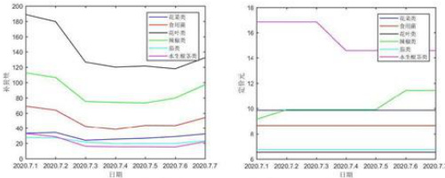  
图12六大蔬菜品类未来一周补货量（左）与定价（右）

# 八、问题三模型的建立与求解

# 8.1数据预处理

根据题目规定，制定较合理的单品补货量和定价策略，选择2023年6月24日-6月30日间所销售的单品蔬菜作为补货选择，。同时为求收益最大，还需筛选出各补货单品蔬菜此期间批发单价和损耗率。 W 一

共筛选出49种单品蔬菜进行售卖，部分单品蔬菜每日批发单价及其损耗率如下(其余单品蔬菜此期间批发单价和损耗率见附录) 4r

表14单品蔬菜每日批发单价与损耗率表  

<html><body><table><tr><td></td><td>白</td><td>菠菜</td><td>菜</td><td>菜心</td><td>草花</td><td>高</td><td>高</td><td>海鲜</td><td>紫茄子</td></tr><tr><td>2023-06-24</td><td>0</td><td>9.63</td><td>3.9</td><td>4.6</td><td>2.66</td><td>11.14</td><td>0</td><td>1.95</td><td>3.8</td></tr><tr><td>2023-06-25</td><td>0</td><td>9.63</td><td>0</td><td>4.6</td><td>2.66</td><td>11.3</td><td>13.23</td><td>1.96</td><td>3.8</td></tr><tr><td>2023-06-26</td><td>3.58</td><td>9.66</td><td>0</td><td>0</td><td>2.66</td><td>11.65</td><td>13.35</td><td>1.96</td><td>3.8</td></tr><tr><td>2023-06-27</td><td>0</td><td>9.67</td><td>4.13</td><td>4.61</td><td>2.67</td><td>11.64</td><td>13.39</td><td>1.95</td><td>3.8</td></tr><tr><td>2023-06-28</td><td>3.57</td><td>9.66</td><td>4.19</td><td>4.62</td><td>2.72</td><td>11.67</td><td>0</td><td>1.96</td><td>3.8</td></tr><tr><td>2023-06-29</td><td>3.57</td><td>0</td><td>4.2</td><td>0</td><td>2.63</td><td>11.71</td><td>13.67</td><td>1.95</td><td>3.8</td></tr><tr><td>2023-06-30</td><td>3.29</td><td>9.67</td><td>4.07</td><td>0</td><td>2.6</td><td>11.67</td><td>13.69</td><td>1.95</td><td>3.43</td></tr><tr><td>损失率</td><td>6.57%</td><td></td><td></td><td></td><td>18.51%9.43%13.7%9.43%</td><td></td><td>29.25%9.43%</td><td>0</td><td>6.07%</td></tr></table></body></html>

说明：上表中单品蔬菜批发单价为0，即当天为对其进行补货。

# 8.2优化模型制定单日日补货总量和定价策略

# （1）确立目标函数

由题意，制定2023年7月1日各单品蔬菜的补货与定价策略使得总收益达到最大，即目标函数为：

$$
\begin{array} { r } { m a x \sum _ { i = 1 } ^ { 4 9 } y _ { i } [ R _ { i } ( P _ { i } - B _ { i } ) - R _ { i } B _ { i } L _ { i } ] } \end{array}
$$

其中𝑦𝑖为0-1变量，当𝑦𝑖若为1是表示采购第 $i$ 种单品蔬菜，若为0则不采购；（204号 $R _ { i }$ ， $P _ { i }$ ， $B _ { i }$ 和𝐿𝑖分别表示第 $i$ 种单品蔬菜的补货量、定价、单位成本和损耗率。

（2）设立约束条件

# $\textcircled{1}$ 种类数量约束

单品蔬菜补货总数在27\~33之间，即：

$$
\begin{array} { r } { 2 7 \leq \sum _ { i = 1 } ^ { 4 9 } y _ { i } \leq 3 3 } \end{array}
$$

# $\textcircled{2}$ 补货最低陈列量约束

单品每次补货不低于 $2 . 5 \mathrm { k g }$ ，即：

$$
R _ { i } \geq 2 . 5 , i = 1 , 2 , \cdots , 4 9
$$

# $\textcircled{3}$ 最高补货量约束

根据近期补货规律，为防止补货无限制，则需使各单品蔬菜补货量小于2023年6月24日—6月30日中最大补货量，即：

$$
R _ { i } \leq x _ { i m a x } , \ i = 1 , 2 , \cdots , 4 9
$$

$x _ { i m a x }$ 表示2023年6月24日-6月30日中第i类单品蔬菜的最大补货量。

# $\textcircled{4}$ 定价约束

为保证商超的正常销售和盈利，规定各单品蔬菜定价不低于其单位成本的 $1 1 0 \%$ 同时不高于 $1 5 0 \%$ ，即：

$$
1 1 0 \% \times B _ { i } \leq P _ { i } \leq 1 5 0 \% \times B _ { i } , i = 1 , 2 , \cdots , 4 9
$$

# 8.2.1优化模型的整合呈现

$$
\begin{array} { r } { m a x \sum _ { i = 1 } ^ { 4 9 } y _ { i } [ R _ { i } ( P _ { i } - B _ { i } ) - R _ { i } B _ { i } L _ { i } ] } \end{array}
$$

$$
s t \cdot \left\{ \begin{array} { c } { { \displaystyle 2 7 \leq \sum _ { i = 1 } ^ { 4 9 } y _ { i } \leq 3 3 } } \\ { { \displaystyle 2 . 5 \leq R _ { i } \leq x _ { i m a x } , ~ i = 1 , 2 , \cdots , 4 9 } } \\ { { \displaystyle 1 1 0 \% \times B _ { i } \leq P _ { i } \leq 1 5 0 \% \times B _ { i } , ~ i = 1 , 2 , \cdots , 4 9 } } \end{array} \right.
$$

# 8.2.2模型说明

在问题三的背景下，本题仍然为优化问题中的线性规划问题，所以本题仍选用模拟退火模型求解。

# 8.2.3模拟退火模型求解补货及定价策略

根据优化模型筛选出29种可售单品，并求解得2023年7月1日最大收益为1282.2631元，根据优化目标，建立模拟退火模型，采用MATLAB软件求解，设定模拟退火算法的初始温度为 $1 0 0 ^ { \circ } \mathrm { C }$ ，温度衰减系数 $\alpha = 0 . 9 5$ ，且在每个温度上迭代最多100次，从而得到各个单品蔬菜的最优补货和定价策略。结果如下（由于篇幅有限，此处只展示前15种单品蔬菜在2023年7月1日的补货量与定价策略，其余见附件）

表15单品蔬菜的补货量与定价策略  

<html><body><table><tr><td>序号</td><td>单品蔬菜名称</td><td>单位成本</td><td>日补货总量 （千克）</td><td>定价</td><td>收益</td></tr><tr><td>1</td><td>本地小毛白菜</td><td>3.1446502</td><td>3.172</td><td>6.660054659</td><td>11.15086294</td></tr><tr><td>2</td><td>云南生菜</td><td>5.857126316</td><td>10.443</td><td>13.71914697</td><td>82.10308169</td></tr><tr><td>3</td><td>筒蒿</td><td>8.225298</td><td>9.014</td><td>19.92413935</td><td>105.4533559</td></tr><tr><td>4</td><td>牛首油菜</td><td>2.83711581</td><td>18.215</td><td>5.504572095</td><td>48.58771622</td></tr><tr><td>5</td><td>紫茄子(2)</td><td>4.561183885</td><td>2.5</td><td>6.668906959</td><td>5.269307683</td></tr><tr><td>6</td><td>西峡香菇（1）</td><td>13.78963446</td><td>17.72</td><td>20.33419497</td><td>115.9696123</td></tr><tr><td>7</td><td>西兰花</td><td>10.03687436</td><td>18.037</td><td>16.07104323</td><td>108.8383038</td></tr><tr><td>8</td><td>净藕（1）</td><td>4.95847682</td><td>24.97</td><td>11.32317767</td><td>158.9265801</td></tr><tr><td>9</td><td>枝江红菜苔</td><td>5.63983768</td><td>2.5</td><td>9.009640694</td><td>8.424507535</td></tr><tr><td>10</td><td>白玉菇（袋）</td><td>4.380340441</td><td>2.5</td><td>9.867592912</td><td>13.71813118</td></tr><tr><td>1</td><td>芜湖青椒（1）</td><td>3.88837377</td><td>26.919</td><td>6.162683589</td><td>61.222146</td></tr><tr><td>12</td><td>杏鲍菇（2）</td><td>9.128546381</td><td>3.151</td><td>21.79166592</td><td>39.90148967</td></tr><tr><td>13</td><td>奶白菜（份）</td><td>2.361256222</td><td>13</td><td>4.036331386</td><td>21.77597713</td></tr><tr><td>14</td><td>双孢菇（盒）</td><td>3.480389508</td><td>10</td><td>5.324995948</td><td>18.44606439</td></tr><tr><td>15</td><td>青红杭椒组合装</td><td>3.52647</td><td>5</td><td>5.620135239</td><td>10.4683262</td></tr></table></body></html>

# 九、问题四模型的建立与求解

题目要求分析影响商超收益的因素，并据此制定更优的蔬菜商品补货和定价决策，本文将通过模型分析和文献查阅两种方式提出合理建议。

# 9.1模型分析

为更好制定蔬菜补货和定价策略，本文在现在已有数据基础之上进行数据预处理筛选出季度各蔬菜品类的单品蔬菜销售种数、节气期间特征单品蔬菜销量和节日期间特征单品蔬菜销量，分别可代表季度蔬菜丰富度、季度效应和节日因素，三个指标与其所属蔬菜品类季度平均销量相结合，建立灰色关联分析模型，分析各指标对销量的影响程度，从而可说明这些指标对制定补货和定价策略存在一定影响。

# 9.1.1数据预处理

根据现有数据进行处理。本题根本要求为探查各因素对销售情况的影响，故筛选出六大蔬菜品类三年来12季度的平均销售量作为因变量因素；同时筛选出季度各蔬菜品类的单品蔬菜销售种数、节气期间特征单品蔬菜销量和节日期间特征单品蔬菜销量作为自变量因素。

# （1）特征单品蔬菜的选取

为有效的判断单品蔬菜对其所属蔬菜品类的影响，本文选取各蔬菜品类三年中销售总量最多的单品蔬菜作为特征单品蔬菜。各蔬菜品类特征单品蔬菜如下；

表16特征单品蔬菜  

<html><body><table><tr><td>蔬菜品类</td><td>花菜类</td><td>食用菌</td><td>花叶类</td><td>辣椒类</td><td>茄类</td><td>水生根茎 类</td></tr><tr><td>特征单品蔬 菜</td><td>西兰花</td><td>西峡香菇 (1)</td><td>云南生 菜</td><td>芜湖青椒 (1)</td><td>紫茄子 (1)</td><td>净藕(1)</td></tr></table></body></html>

（2）节气期间特征单品蔬菜销量的选取

立春、立夏、立秋和立冬处于四个季度较为中心时期，故选择这四个节气周围一周内特征单品蔬菜的销售量作为该指标。

# 3）节日期间特征单品蔬菜销量的选取

中国人民对于春节、端午、七夕和国庆不同节日的重视程度不一，故选择该四个节日可有效刻画重要节日对对销售情况的影响。

# 9.1.2灰色关联分析

本文利用以上指标数据，建立灰色关联分析模型，以季度各蔬菜品类的单品蔬菜销售种数、节气期间特征单品蔬菜销量和节日期间特征单品蔬菜销量作为子序列，遍历花叶类、辣椒类等六大蔬菜品类季度平均销量作为母序列，求出各指标对销售量的关联度，以关联度值衡量相关性的大小。

灰色关联分析基本思想：根据序列曲线集合形状的相似程度来判断其联系是否紧密。曲线越接近，相应序列之间的关联程度就越大，反之越小。

# 分析步骤如下：

Step1）画出各个指标的序列折线图，观察指标的趋势走向。  
Step2）确定母序列和子序列。

假设评价对象有 $m$ 个，评价指标有 $n$ 个，母序列为 $x _ { 0 } = x _ { 0 } ( k ) | k = 1 , 2 , \dots , n$ 子序列为 $x _ { i } = x _ { i } ( k ) | k = 1 , 2 , \ldots , m _ { \circ }$

Step3）对变量进行预处理。

分别对母序列和子序列中的每个指标进行预处理，先求出每个指标的均值，再用该指标中的每个元素都除以其均值。据此可以消除量纲的影响同时缩小变量范围简化计算。设标准化矩阵为Z， $Z$ 中的元素记为 $Z _ { y }$ ，计算公式如下：

$$
Z _ { i j } = \frac { x _ { i j } } { \overline { { x _ { i j } } } }
$$

得到标准化矩阵Z：

$$
Z = { \left[ \begin{array} { l l l l } { Z _ { 1 1 } } & { Z _ { 1 2 } } & { \cdots } & { Z _ { 1 m } } \\ { Z _ { 2 1 } } & { Z _ { 2 2 } } & { \cdots } & { Z _ { 2 m } } \\ { \vdots } & { \vdots } & { \ddots } & { \vdots } \\ { Z _ { n 1 } } & { Z _ { n 2 } } & { \cdots } & { Z _ { n m } } \end{array} \right] }
$$

Step4）计算子序列中各个指标与母序列的关联系数。

$$
y { \big ( } x _ { 0 } ( k ) , x _ { i } ( k ) { \big ) } = { \frac { a + \rho b } { | x _ { 0 } ( k ) - x _ { i } ( k ) | + \rho b } } ( i = 1 , 2 , \cdots m , k = 1 , 2 , \cdots n )
$$

其中 $\pmb { \rho }$ 为分辨系数，一般取0.5。a为两级最小差，b为两级最大差，计算公式如下：

$$
a = \sum _ { i } ^ { m i n } { } _ { k } ^ { m i n } | x _ { 0 } ( k ) - x _ { i } ( k ) |
$$

$$
{ \pmb b } = \sum _ { i } ^ { m a x } m ^ { a x } | x _ { 0 } ( k ) - x _ { i } ( k ) |
$$

Step5）计算灰色关联度

$$
y ( x _ { 0 } , x _ { i } ) = { \frac { 1 } { n } } \sum _ { k = 1 } ^ { n } y { \big ( } x _ { 0 } ( k ) , x _ { i } ( k ) { \big ) } = { \frac { 1 } { n } } \sum _ { k = 1 } ^ { n } { \frac { a + \rho b } { | x _ { 0 } ( k ) - x _ { i } ( k ) | + \rho b } }
$$

# 9.1.3模型求解

利用MATLAB软件求解，得到三个指标与蔬菜品类季度平均销售量的标准化折线图如下（由于篇幅有限，本文此处只展示花菜类和辣椒类的标准化折线图，其余见附件）

2.5间量 2.5  
N W  
发效（2020.7.1-2023.7.1） （20207.1-2023.6.30）

经过将原指标值标准化的处理，可以观察到季度各蔬菜品类的单品蔬菜销售种数、节气期间特征单品蔬菜销量和节日期间特征单品蔬菜销量与相应蔬菜品类的季度平均销售量呈现出令人满意的拟合效果。

本文采用灰色关联分析模型，量化这些指标之间的关联度，进一步探讨它们的相关性。三个指标与6大蔬菜品类季度平均销售量的关联度如下：

表17三个指标与6大蔬菜品类季度平均销售量的关联度表  

<html><body><table><tr><td></td><td></td><td></td><td>品特</td></tr><tr><td>花菜类季度平 均销量</td><td>0.9017</td><td>0.6937</td><td>0.6642</td></tr><tr><td>食用平</td><td>0.859</td><td>0.7287</td><td>0.7573</td></tr><tr><td>花叶类季度平 均销量</td><td>0.7377</td><td>0.5961</td><td>0.5665</td></tr><tr><td>辣度平</td><td>0.7219</td><td>0.5782</td><td>0.6297</td></tr></table></body></html>

<html><body><table><tr><td>茄类季度平均 销量</td><td>0.7781</td><td>0.5852</td><td>0.6523</td></tr><tr><td>水生根茎类季 度平均销量</td><td>0.6753</td><td>0.6918</td><td>0.8103</td></tr></table></body></html>

关联度的取值介于[0,1]之间，关联度值越高，意味着子序列能够很好的反映出母序列的变化趋势，表明子序列与母序列之间具有很强的相关性。从上表可以看出：六大蔬菜品类与季度各蔬菜品类的单品蔬菜销售种数、节气期间特征单品蔬菜销量和节日期间特征单品蔬菜销量这三个指标之间的关联度值都大于0.5以上。

# ※总结：

季度各蔬菜品类的单品蔬菜销售种数、节气期间特征单品蔬菜销量和节日期间特征单品蔬菜销量与六大蔬菜品类季度平均销量具有很强的相关性。因此，商超在制定最优补货与定价策略时参考该三种因素,能够有效地帮助商家制定更好的蔬菜商品的补货和定价决策。

# 9.2文献查阅

# 9.2.1客流量数据：

不同的时间和日期会对客流量产生显著影响，而客流量与蔬菜的销售量直接相关。商超通过掌握客流量高峰和低谷时段，可以精准调整陈列策略、促销活动时间以及进货量，最大程度地满足顾客需求并提高经营利润。

# 9.2.2竞争对手的价格和销售策略信息：

竞争对手的实力和数量，因为一家超市都有一定的服务商圈，同一商圈内竞争对手的数量、规模、核心竞争力等因素直会影响到超市的定价策略[3]。通过比较其他商超的定价策略，商家可以精准自身价格定位，以此保持竞争力。商家还可以根据竞争对手的销售策略来设计自己的促销方案，通过了解竞争对手关于产品定位、品种选择和组合搭配等方案，选择合理的优惠方式、设置合适的销售季节或节日促销活动等，以提升顾客吸引力。通过对竞争对手商业经营的研究，商家也可以发现差异化的市场机会，并根据市场需求调整自身的经营模式，从而吸引更多顾客。

# 9.2.3消费者反馈和评价数据：

收集顾客关于商品新鲜度、品质和价格的反馈，可以进一步了解顾客的需求和喜好，从而做出有针对性的销售改进和调整。首先，顾客对商品新鲜度的反馈可以让商家了解保鲜时间较长的商品以及可能存在质量问题的商品，从而对商品的运输储存工作进行调整，确保商品能够以较佳状态售卖给顾客。其次，顾客对商品品质的反馈可以反映商品的优点和不足之处。商家可以借助顾客的反馈选择进货渠道。最后，顾客对商品价格的反馈可以帮助商家了解其定价策略是否与顾客的期望相符，进而对定价策略做出适当调整。

# 9.2.4顾客需求数据：

通过顾客走访调查、购买记录和反馈收集等方式，了解顾客对蔬菜商品的需求偏好、偏好的品种、包装的偏好、购买频率等信息。

基于以上数据，商超可以制定针对性的营销策略和经营决策。首先，根据顾客对蔬菜品种和包装的偏好，商超可以优化产品陈列组合，增加顾客喜欢的蔬菜种类和规格的供应，从而满足多样化的需求。其次，根据顾客对品质、有机认证等需求的偏好以及竞争市场定价情况，商超可以优选进货源、合理定价，平衡产品质量和价格之间的关系，提供更具吸引力和竞争力的蔬菜商品。最后，根据购买频率和顾客偏好，商超可以设计有针对性的促销活动，增加顾客的忠诚度和购买欲望。 -n

# 9.2.5天气数据：

收集未来的天气预报和节假日数据，可以帮助商家做出更准确和有针对性的决策，以应对消费者购物行为的变化和利用特定的销售机会。

天气状况对顾客的购物行为有很大的影响。例如，在暴雨天气下，消费者可能不愿意外出购物，而更倾向于线上购物。通过收集未来的天气预报数据，商家可以提前准备，适时调整库存、推广策略和促销活动，以满足消费者的需求和偏好。

# 9.2.6供应链和物流数据：

收集有关供应商的信息，包括产品产量、产地规模、货源地距离等。这些数据可以帮助商超评估供应商的供货能力，确保供应链不会出现缺货或供应不足的情况。其次，记录供应商的交货时间，并与实际交货时间进行对比。这有助于商超评估供应商的交货准确性和可靠性，以便合理安排库存和补货计划。此外，监测和记录供应商提供的产品的品质和符合性。通过收集顾客的反馈和进行抽样检测，商超可了解各供应商提供的产品质量，并据此判断合作伙伴的可靠性。

# 9.2.7库存状况：

通过了解蔬菜的库存情况，可以预测可能会出现过度库存情况的蔬菜。当某种蔬菜库存过多而需求不足时，商家可能需要考虑采取打折销售、促销活动等措施来减少库存，帮助商家降低库存积压的风险，同时吸引更多的消费者购买，减少损失并库存的新鲜度。另一方面，了解蔬菜的库存情况还可以预测可能出现短缺的蔬菜种类。如果某种蔬菜的库存供应紧张，商家需考虑调高价格或采取其他供应措施，以确保供应的持续性、保持产品的可行性，这有助于商家在供应紧缺的情况下维持合理的利润，并能够及时调整供应链、寻找替代品或与供应商进行谈判。

# 9.2.8财务数据：

通过分析各蔬菜商品的成本、利润率和销售额，商超可以做出准确的定价决策。商超基于商品的成本和市场需求，可以设定合理的售价，以确保合理的利润水平；其次，根据销售数据和市场趋势，调整商品组合，引入新的热门蔬菜品种，并适应消费者需求的变化，可优化其蔬菜商品组合；通过重点关注高利润率的商品或调整库存量，可提高整体利润率。

# 9.2.9退货数据

通过分析退货记录可以帮助商家做出更好的决策：

首先可以帮助商家了解退货的原因：是因为产品质量问题，还是因为顾客对产品不满意，或者是因为误购或者不需要了。其次，退货记录可以揭示产品的质量问题。商家可以根据退货原因和产品类型，对质量问题进行统计和分析，以识别潜在的质量问题，并采取相应的措施，提高产品质量。此外，通过分析退货记录，商家可以确定哪些商品容易被退货。根据这些数据，商家可以考虑调整其商品组合，例如减少或替换不受欢迎的产品，增加更受顾客喜爱的产品。同时，退货记录也提供了有关顾客反馈和满意度的信息。商家可以利用这些数据来改进客户服务，以减少退货率。

本文收集了2020年7月1日—2023年6月30日三年期间的退货记录，如下表（由于篇幅原因，此处只展示部分单品数据，其余见附录）

38芜渐青（1） 泡泡箱（精品）35 西兰花 8 奶白菜22 34 1） 花菇（1）1814 娃娃菜 6 牛首油菜13 竹叶菜 6 丝板11 小米（份） 金针（盒）101010 ） 6云南生菜（份） 6 红薯尖云南生菜 红（1）枝江青桃散花 5 菜（份）小青菜（1）云南油麦菜（份） 甜白菜0 10 20 30 40云南油麦菜 0 2 4 6 8 10螺丝（份）

由图14可知，芜湖青椒、西兰花和西峡香菇的退货记录较高，由此商超可以联系退货的顾客，了解退货原因，如若是产品质量问题，可以强化质量控制，确保商品能够以最佳状态到达顾客手中。若是顾客的偏好问题，可以适当降低采购量，减少库存。

# 9.2.10打折次数

通过分析单品的打折次数可以帮助商超做出更好的决策:

打折销售频繁度的单品蔬菜即可反映出其销售呈现俱佳或较差两个极端现象。如果某个单品蔬菜的打折销售频繁度较低或几乎没有打折情况，这可能意味着该蔬菜在市场上非常受欢迎，供不应求。如果某个单品蔬菜的打折销售频繁度较高，这可能意味着该蔬菜的销售相对较弱。商家为了促进销售，采取了多次打折策略。此外，蔬菜的保鲜期通常较短，如果销售不及预期，商家可能需要加快处理和销售以减少损耗。

因此，通过观察单品蔬菜的打折销售频繁度，商家可以了解该蔬菜的销售情况表现，从而根据情况调整定价策略、采取促销措施，并有效管理损耗和保持蔬菜的品质。

本文收集了2020年7月1日—2023年6月30日三年期间的单品蔬菜的打折次数，如下表（由于篇幅原因，此处只展示前三十种单品数据，其余见附录）

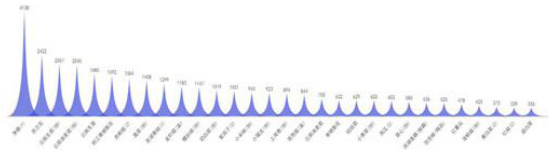  
图14前三年退货记录图  
图15前三十种单品蔬菜打折次数

由上图可知，净藕的打折次数颇多，可能意味着销售状况不理想或市场竞争激烈。商家可以通过分析销售数据、消费者反馈和竞争情况来确定适当的销售策略和促销措

施，以提高净藕的销售额和市场竞争力。

# 9.3总结

综上所述，商超采集以上相关数据可以为他们制定蔬菜商品的补货和定价决策提供更准确、科学的依据，从而提高经营效益和顾客满意度。

# 十、模型的评价与推广

# 10.1模型的优点

1、K­means＋+算法是K-means算法的升级，本文聚类指标量纲差距较大，此算法在初始聚类中心上做出规定，选取了更合理的初始聚类中心，为迭代出最佳迭代聚类中心而奠基。2、线性回归模拟各蔬菜品类销售量与成本加成定价的关系，可直观显示各蔬菜品类销售量的变化可引起一定量的成本加成定价的变化。3、时间序列预测模型为简单季节性和温特斯乘法，充分分解了各蔬菜品类近三年历史销售量的各项特征结合，近期时效特征，模拟出更加贴合实际和准确的预测值。4、模拟退火算法可根据一定概率可以放弃局部最优解，找到全局最优解。5、灰色关联分析简单易懂，可直观地反映因素之间的关联程度。通过计算关联度来判断各个因素对目标因素的影响程度，结果易于理解和解释。

# 10.2模型缺点

1、K-means++算法初始中心选择不当，仍然可能陷入局部最优解。

2、灰色关联分析过去浅显，对数据要求过高，数据若存在较大异常值，可能会对结果产生较大的影响。

# 10.3模型推广

时间序列可提取数据的长期、季节、循环和不规则趋势，可用其做一社会生产中的经济发展预测或交易预测等，如冷饮销售的预测、服饰销售的预测、天气温度的预测等。

# 十一、参考文献

[1]曾敏敏.基于时间情境A生鲜社区超市的动态定价策略研究[D].2021.  
[2]魏泽娥,陈刚,丁胜春,耿军霞.大规模定制产品的成本加成定价方法研究[J].黑龙江对外经贸,2007,No.152(02):84­85.  
[3]刘保政,刘德宝,高立群.供不应求季节性商品的价格控制和生产销售决策模型[J].东北大学学报,2005(11):23-26.  
[4]王艳.中小型连锁超市定价的影响因素及其定价策略探析[J].兰州工业学院学报,2014,21（03):99-102.

# 十二、附录

附录1：支撑材料文件列表附录2：补充表格、图片附录3：代码

附录1：支撑材料文件列表  

<html><body><table><tr><td colspan="2">文件列表名</td></tr><tr><td rowspan="6">问题一</td><td>各类每日销售量</td></tr><tr><td>特征单品蔬菜每季度销售量</td></tr><tr><td>单品蔬菜日销售量</td></tr><tr><td>Spearman相关系数代码</td></tr><tr><td>K-means++聚类代码</td></tr><tr><td>问题二SPSS线性回归数据</td></tr><tr><td rowspan="5"></td><td>SPSS预测各蔬菜品类销售量</td></tr><tr><td>补货量与定价策略作图</td></tr><tr><td>皮尔逊及其相关系数</td></tr><tr><td>优化模型</td></tr><tr><td>模拟退火算法</td></tr><tr><td rowspan="4">问题三 问题四 打折统计图</td><td></td></tr><tr><td></td></tr><tr><td>蔬菜品类销售量灰色关联分析</td></tr><tr><td>退货统计图</td></tr></table></body></html>

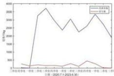  
单品蔬菜的分布情况图  
辣椒类蔬菜单品的销售量分布图  
水生根茎类蔬菜单品的销售量分布图

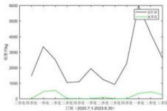  
附录2：补充表格、图片  
食用菌类蔬菜单品的销售量分布图

W期（2020.7.1-236.30）

M

单品销售量统计学指标表  

<html><body><table><tr><td>指标</td><td>荸荠</td><td>冰草</td><td>菠菜</td><td>菜心</td><td></td><td>蔡茶树</td><td>赤松茸</td><td>虫草花</td><td>春菜</td><td>大白菜</td></tr><tr><td>最小值</td><td>0.00</td><td>0.00</td><td>0.00</td><td>0.00</td><td>0.00</td><td>0.00</td><td>0.00</td><td>0.00</td><td>0.00</td><td>0.00</td></tr><tr><td>最大值</td><td>63.33</td><td>4.06</td><td>102.00</td><td>72.00</td><td>18.80</td><td>4.00</td><td>1.17</td><td>41.13</td><td>4.02</td><td>244.40</td></tr><tr><td>均值</td><td>1.54</td><td>0.04</td><td>10.56</td><td>5.98</td><td>0.92</td><td>0.08</td><td>0.01</td><td>1.94</td><td>0.02</td><td>17.53</td></tr><tr><td>中位数</td><td>0.00</td><td>0.00</td><td>7.88</td><td>4.65</td><td>0.00</td><td>0.00</td><td>0.00</td><td>0.00</td><td>0.00</td><td>0.00</td></tr><tr><td>偏度</td><td>5.65</td><td>8.10</td><td>2.19</td><td>3.08</td><td>3.26</td><td>6.18</td><td>12.24</td><td>3.30</td><td>12.23</td><td>2.97</td></tr><tr><td>风度</td><td>50.21</td><td>87.30</td><td>12.51</td><td>22.86</td><td>16.60</td><td>44.31</td><td>153.12</td><td>23.59</td><td>189.06</td><td>13.87</td></tr><tr><td>标准差</td><td>4.73</td><td>0.25</td><td>9.99</td><td>6.15</td><td>2.07</td><td>0.43</td><td>0.08</td><td>3.50</td><td>0.20</td><td>32.52</td></tr><tr><td>指标</td><td>大白菜秧</td><td>大芥兰</td><td>大龙茄子</td><td>灯笼椒</td><td>东甘蓝叶</td><td></td><td>高瓜</td><td>海鲜茹</td><td>黑肝</td><td>皮鸡</td></tr><tr><td>最小值</td><td>0.00</td><td>0.00</td><td>0.00</td><td>0.00</td><td>0.00</td><td>0.00</td><td>0.00</td><td>0.00</td><td>0.00</td><td>0.00</td></tr><tr><td>最大值</td><td>7.20</td><td>4.95</td><td>34.28</td><td>6.89</td><td>15.10</td><td>0.94</td><td>11.05</td><td>57.00</td><td>2.00</td><td>2.00</td></tr><tr><td>均值</td><td>0.02</td><td>0.01</td><td>1.07</td><td>0.27</td><td>1.41</td><td>0.00</td><td>1.49</td><td>8.37</td><td>0.00</td><td>0.01</td></tr><tr><td>中位数</td><td>0.00</td><td>0.00</td><td>0.00</td><td>0.00</td><td>0.00</td><td>0.00</td><td>0.90</td><td>7.00</td><td>0.00</td><td>0.00</td></tr><tr><td>偏度</td><td>20.95</td><td>26.41</td><td>4.11</td><td>4.23</td><td>2.06</td><td>33.05</td><td>1.72</td><td>1.75</td><td>20.43</td><td>14.72</td></tr><tr><td>蜂度</td><td>464.25</td><td>732.72</td><td>25.26</td><td>30.52</td><td>7.34</td><td>1093.0</td><td>6.17</td><td>8.89</td><td>468.47</td><td>264.42</td></tr><tr><td>标准差</td><td>0.29</td><td>0.17</td><td>3.10</td><td>0.61</td><td>2.38</td><td>0.03</td><td>1.90</td><td>6.38</td><td>0.08</td><td>0.09</td></tr><tr><td>指标</td><td>黑油菜</td><td>红灯</td><td>红杭椒</td><td>红尖椒</td><td>红椒</td><td>红</td><td>红</td><td>红薯尖</td><td>红线椒</td><td>红橡叶</td></tr><tr><td>最小值</td><td>0.00</td><td>0.00</td><td>0.00</td><td>0.00</td><td>0.00</td><td>0.00</td><td>0.00</td><td>0.00</td><td>0.00</td><td>0.00</td></tr><tr><td>最大值</td><td>29.63</td><td>9.67</td><td>18.43</td><td>16.00</td><td>113.84</td><td>4.74</td><td>0.68</td><td>55.16</td><td>2.75</td><td>0.42</td></tr><tr><td>均值</td><td>0.09</td><td>0.46</td><td>1.25</td><td>1.27</td><td>3.95</td><td>0.09</td><td>0.00</td><td>5.38</td><td>0.03</td><td>0.00</td></tr><tr><td>中位数</td><td>0.00</td><td>0.00</td><td>0.68</td><td>0.00</td><td>2.69</td><td>0.00</td><td>0.00</td><td>2.17</td><td>0.00</td><td>0.00</td></tr><tr><td>偏度</td><td>22.48</td><td>4.23</td><td>3.46</td><td>2.42</td><td>9.71</td><td>6.26</td><td>33.05</td><td>2.23</td><td>9.45</td><td>33.05</td></tr><tr><td>峰度</td><td>610.99</td><td>32.53</td><td>19.92</td><td>10.27</td><td>112.65</td><td>51.58</td><td>1093.0</td><td>9.96</td><td>108.61</td><td>1093.00</td></tr><tr><td>标准差</td><td>1.04</td><td>0.89</td><td>1.94</td><td>2.14</td><td>8.08</td><td>0.39</td><td>0.02</td><td>7.71</td><td>0.18</td><td>0.01</td></tr><tr><td>指标</td><td>洪湖莲</td><td></td><td>洪湖藕带</td><td>洪山菜猴头菇</td><td></td><td></td><td>花茄子</td><td>槐花</td><td>黄白菜</td><td>黄花菜</td></tr><tr><td>最小值</td><td>0.00</td><td>0.00</td><td>0.00</td><td>0.00</td><td>0.00</td><td>0.00</td><td>0.00</td><td>0.00</td><td>0.00</td><td>0.00</td></tr><tr><td>最大值</td><td>12.00</td><td>131.00</td><td>11.22</td><td>10.00</td><td>1.00</td><td>1.00</td><td>7.14</td><td>1.38</td><td>187.73</td><td>0.67</td></tr><tr><td>均值</td><td>0.04</td><td>5.53</td><td>0.68</td><td>0.02</td><td>0.00</td><td>0.00</td><td>0.09</td><td>0.01</td><td>7.44</td><td>0.00</td></tr><tr><td>中位数</td><td>0.00</td><td>0.00</td><td>0.00</td><td>0.00</td><td>0.00</td><td>0.00</td><td>0.00</td><td>0.00</td><td>4.72</td><td>0.00</td></tr><tr><td>偏度</td><td>19.00</td><td>4.63</td><td>3.01</td><td>23.67</td><td>19.03</td><td>19.03</td><td>8.79</td><td>12.87</td><td>6.67</td><td>19.98</td></tr><tr><td>蜂度</td><td>441.18</td><td>34.43</td><td>12.99</td><td>639.68</td><td>363.00</td><td>363.00</td><td>101.76</td><td>189.96</td><td>101.03</td><td>437.74</td></tr><tr><td>标准差</td><td>0.46</td><td>12.34</td><td>1.63</td><td>0.35</td><td>0.05</td><td>0.05</td><td>0.48</td><td>0.08</td><td>10.03</td><td>0.03</td></tr><tr><td>指标</td><td>黄心菜</td><td>活银</td><td>鸡枞菌</td><td>姬菇</td><td>荠菜</td><td>芥菜</td><td>芥兰</td><td>金</td><td>丝油</td><td></td></tr><tr><td>最小值</td><td>0.00</td><td>0.00</td><td>0.00</td><td>0.00</td><td>0.00</td><td>0.00</td><td>0.00</td><td>0.00</td><td>0.00</td><td>0.00</td></tr></table></body></html>

<html><body><table><tr><td>最大值</td><td>68.96</td><td>1.00</td><td>0.58</td><td>21.00</td><td>2.59</td><td>10.39</td><td>0.67</td><td>284.88</td><td>163.55</td><td>4.88</td></tr><tr><td>均值</td><td>4.39</td><td>0.00</td><td>0.00</td><td>1.96</td><td>0.01</td><td>0.05</td><td>0.00</td><td>26.17</td><td>25.18</td><td>0.01</td></tr><tr><td>中位数</td><td>2.39</td><td>0.00</td><td>0.00</td><td>0.22</td><td>0.00</td><td>0.00</td><td>0.00</td><td>18.42</td><td>22.02</td><td>0.00</td></tr><tr><td>偏度</td><td>4.03</td><td>33.05</td><td>22.52</td><td>2.17</td><td>12.06</td><td>13.40</td><td>33.05</td><td>4.13</td><td>1.40</td><td>27.94</td></tr><tr><td>蜂度</td><td>29.58</td><td>1093.00</td><td>524.17</td><td>8.74</td><td></td><td>163.06208.43</td><td>1093.0</td><td>30.63</td><td>6.95</td><td>849.12</td></tr><tr><td>标准差</td><td>6.71</td><td>0.03</td><td>0.02</td><td>3.00</td><td>0.15</td><td>0.52</td><td>0.02</td><td>27.00</td><td>20.59</td><td>0.16</td></tr><tr><td>指标</td><td>快菜</td><td>辣妹子</td><td>莲蓬（个）</td><td>菱角</td><td>龙牙菜</td><td></td><td>萝卜叶</td><td>螺丝椒</td><td>绿牛油</td><td>马齿苋</td></tr><tr><td>最小值</td><td>0.00</td><td>0.00</td><td>0.00</td><td>0.00</td><td>0.00</td><td>0.00</td><td>0.00</td><td>0.00</td><td>0.00</td><td>0.00</td></tr><tr><td>最大值</td><td>10.32</td><td>7.40</td><td>80.00</td><td>4.84</td><td>10.32</td><td>2.00</td><td>11.59</td><td>79.00</td><td>1.15</td><td>4.01</td></tr><tr><td>均值</td><td>0.08</td><td>0.11</td><td>1.91</td><td>0.12</td><td>0.17</td><td>0.00</td><td>0.38</td><td>14.64</td><td>0.00</td><td>0.09</td></tr><tr><td>中位数</td><td>0.00</td><td>0.00</td><td>0.00</td><td>0.00</td><td>0.00</td><td>0.00</td><td>0.00</td><td>10.29</td><td>0.00</td><td>0.00</td></tr><tr><td>偏度</td><td>10.54</td><td>6.56</td><td>5.54</td><td>5.57</td><td>6.85</td><td>26.58</td><td>4.27</td><td>1.55</td><td>33.05</td><td>5.61</td></tr><tr><td>蜂度</td><td>113.21</td><td>58.99</td><td>37.63</td><td>39.91</td><td>56.57</td><td>742.73</td><td>24.91</td><td>5.48</td><td>1093.0 0</td><td>42.20</td></tr><tr><td>标准差</td><td>0.88</td><td>0.52</td><td>8.36</td><td>0.46</td><td>0.89</td><td>0.07</td><td>1.19</td><td>13.08</td><td>0.03</td><td>0.35</td></tr><tr><td>指标</td><td>马兰头</td><td>面条菜</td><td>木耳菜</td><td>奶白菜</td><td>奶白菜</td><td>南瓜尖</td><td>牛排菇</td><td>牛生</td><td>牛油</td><td>藕尖</td></tr><tr><td>最小值</td><td>0.00</td><td>0.00</td><td>0.00</td><td>0.00</td><td>0.00</td><td>0.00</td><td>0.00</td><td>0.00</td><td>0.00</td><td>0.00</td></tr><tr><td>最大值</td><td>0.65</td><td>1.20</td><td>16.85</td><td>153.22</td><td>5.08</td><td>6.23</td><td>4.00</td><td>27.25</td><td>66.00</td><td>10.43</td></tr><tr><td>均值</td><td>0.00</td><td>0.01</td><td>1.46</td><td>11.65</td><td>0.02</td><td>0.02</td><td>0.04</td><td>0.82</td><td>3.51</td><td>0.02</td></tr><tr><td>中位数</td><td>0.00</td><td>0.00</td><td>0.00</td><td>7.73</td><td>0.00</td><td>0.00</td><td>0.00</td><td>0.00</td><td>0.00</td><td>0.00</td></tr><tr><td>偏度</td><td>13.38</td><td>9.57</td><td>1.90</td><td>2.73</td><td>17.69</td><td>18.35</td><td>10.05</td><td>4.38</td><td>3.03</td><td>23.99</td></tr><tr><td>峰度</td><td>216.67</td><td>108.07</td><td>7.14</td><td>17.61</td><td></td><td>320.58347.70</td><td>125.33</td><td>24.80</td><td>14.80</td><td>586.65</td></tr><tr><td>标准差</td><td>0.03</td><td>0.08</td><td>2.34</td><td>13.19</td><td>0.26</td><td>0.29</td><td>0.27</td><td>2.98</td><td>7.70</td><td>0.39</td></tr><tr><td>指标</td><td>泡</td><td>平菇</td><td>蒲公英</td><td>七彩椒</td><td>青菜苔</td><td>青</td><td>青杭椒</td><td>青尖椒</td><td>青茄子</td><td>青线椒</td></tr><tr><td>最小值</td><td>0.00</td><td>0.00</td><td>0.00</td><td>0.00</td><td>0.00</td><td>0.00</td><td>0.00</td><td>0.00</td><td>0.00</td><td>0.00</td></tr><tr><td>最大值</td><td>144.05</td><td>45.04</td><td>0.94</td><td>17.44</td><td>12.96</td><td>88.51</td><td>13.00</td><td>22.00</td><td>34.25</td><td>37.00</td></tr><tr><td>均值</td><td>8.86</td><td>2.32</td><td>0.00</td><td>0.59</td><td>0.03</td><td>7.67</td><td>0.54</td><td>1.94</td><td>3.39</td><td>4.13</td></tr><tr><td>中位数</td><td>0.00</td><td>0.00</td><td>0.00</td><td>0.00</td><td>0.00</td><td>0.00</td><td>0.00</td><td>1.20</td><td>2.08</td><td>2.94</td></tr><tr><td>偏度</td><td>2.48</td><td>2.56</td><td>15.87</td><td>5.96</td><td>20.66</td><td>2.07</td><td>4.29</td><td>2.31</td><td>2.38</td><td>2.77</td></tr><tr><td>峰度</td><td>10.10</td><td></td><td>301.11</td><td>67.24</td><td>442.93</td><td>9.44</td><td>23.95</td><td>12.32</td><td>10.79</td><td>13.81</td></tr><tr><td>标准差</td><td>19.56</td><td>13.83 4.35</td><td>0.04</td><td>1.14</td><td>0.55</td><td>12.00</td><td>1.64</td><td>2.37</td><td>4.17</td><td>4.57</td></tr><tr><td>指标</td><td></td><td></td><td></td><td></td><td></td><td></td><td></td><td></td><td></td><td></td></tr><tr><td></td><td>上海青</td><td>双孢茹</td><td>双沟白菜</td><td></td><td></td><td>水果丝瓜尖</td><td></td><td>田七</td><td>甜白菜</td><td>筒蒿</td></tr><tr><td>最小值 最大值</td><td>0.00</td><td>0.00</td><td>0.00</td><td>0.00</td><td>0.00</td><td>0.00</td><td>0.00</td><td>0.00</td><td>0.00 71.58</td><td>0.00 43.26</td></tr><tr><td>均值</td><td>118.00 9.75</td><td>57.00</td><td>2.16</td><td>9.00</td><td>3.01</td><td>12.85 0.30</td><td>28.47 0.62</td><td>1.24 0.04</td><td>4.28</td><td>5.08</td></tr><tr><td>中位数</td><td></td><td>4.45</td><td>0.00</td><td>0.28</td><td>0.01</td><td></td><td></td><td>0.00</td><td>0.00</td><td>3.72</td></tr><tr><td>偏度</td><td>7.41</td><td>0.00</td><td>0.00</td><td>0.00</td><td>0.00</td><td>0.00</td><td>0.00</td><td></td><td></td><td>1.57</td></tr><tr><td>峰度</td><td>3.28 32.31</td><td>2.03 8.16</td><td>29.24</td><td>4.71</td><td>15.52</td><td>6.21 53.49</td><td>6.02</td><td>4.55 55.9125.6</td><td>1.3</td><td>6.86</td></tr><tr><td>标准差</td><td></td><td></td><td>895.75 0.07</td><td>26.99 1.10</td><td>309.94 0.13</td><td>1.11</td><td>2.22</td><td>0.16</td><td>8.92</td><td>5.61</td></tr><tr><td></td><td>8.15</td><td>7.15</td></table></body></html>

<html><body><table><tr><td>指标</td><td>娃娃菜</td><td>豌豆尖</td><td>芜湖青椒</td><td>西兰花</td><td></td><td>西峡花西香</td><td>鲜木耳</td><td>鲜带</td><td>鲜粽叶</td><td>苋菜</td></tr><tr><td>最小值</td><td>0.00</td><td>0.00</td><td>0.00</td><td>0.00</td><td>0.00</td><td>0.00</td><td>0.00</td><td>0.00</td><td>0.00</td><td>0.00</td></tr><tr><td>最大值</td><td>407.00</td><td>7.92</td><td>249.97</td><td>152.13</td><td>125.42</td><td>79.17</td><td>19.00</td><td>7.00</td><td>160.00</td><td>35.95</td></tr><tr><td>均值</td><td>8.22</td><td>0.08</td><td>25.74</td><td>25.17</td><td>2.58</td><td>11.27</td><td>0.90</td><td>0.02</td><td>0.32</td><td>5.05</td></tr><tr><td>中位数</td><td>5.00</td><td>0.00</td><td>23.14</td><td>21.70</td><td>0.00</td><td>9.22</td><td>0.00</td><td>0.00</td><td>0.00</td><td>3.28</td></tr><tr><td>偏度</td><td>13.98</td><td>9.55</td><td>2.88</td><td>1.88</td><td>8.24</td><td>1.82</td><td>3.39</td><td>18.40</td><td>28.92</td><td>1.30</td></tr><tr><td>蜂度</td><td>317.78</td><td>108.70</td><td>20.57</td><td>9.64</td><td>112.63</td><td>7.81</td><td>19.25</td><td>393.14</td><td>895.72</td><td>4.96</td></tr><tr><td>标准差</td><td>16.50</td><td>0.55</td><td>24.54</td><td>15.99</td><td>7.23</td><td>11.52</td><td>1.82</td><td>0.28</td><td>5.08</td><td>5.81</td></tr><tr><td>指标</td><td></td><td>小白菜</td><td>小米椒</td><td>小青菜</td><td>小皱皮</td><td>蟹味菇</td><td>杏鲍菇</td><td>秀珍菇</td><td>绣球菌</td><td>野藕</td></tr><tr><td>最小值</td><td>0.00</td><td>0.00</td><td>0.00</td><td>0.00</td><td>0.00</td><td>0.00</td><td>0.00</td><td>0.00</td><td>0.00</td><td>0.00</td></tr><tr><td>最大值</td><td>26.00</td><td>15.00</td><td>227.12</td><td>72.10</td><td>56.00</td><td>30.00</td><td>116.05</td><td>2.51</td><td>2.00</td><td>10.20</td></tr><tr><td>均值</td><td>0.04</td><td>1.87</td><td>11.23</td><td>6.96</td><td>4.88</td><td>0.62</td><td>4.72</td><td>0.01</td><td>0.01</td><td>0.42</td></tr><tr><td>中位数</td><td>0.00</td><td>0.00</td><td>3.49</td><td>4.28</td><td>0.00</td><td>0.00</td><td>4.04</td><td>0.00</td><td>0.00</td><td>0.00</td></tr><tr><td>偏度</td><td>30.16</td><td>1.60</td><td>3.95</td><td>2.26</td><td>2.04</td><td>7.85</td><td>7.80</td><td>12.46</td><td>13.50</td><td>3.63</td></tr><tr><td>峰度</td><td>957.05</td><td>5.13</td><td>46.67</td><td>8.90</td><td>7.81</td><td>92.90</td><td>120.00</td><td>186.28</td><td>206.49</td><td>17.39</td></tr><tr><td>标准差</td><td>0.81</td><td>2.77</td><td>14.60</td><td>9.92</td><td>7.86</td><td>2.05</td><td>6.13</td><td>0.13</td><td>0.10</td><td>1.25</td></tr><tr><td>指标</td><td>野生粉藕</td><td></td><td>油菜苔</td><td>余干椒</td><td>鱼腥草圆茄子</td><td></td><td>云南生</td><td></td><td>长线茄</td><td>艺麻览</td></tr><tr><td>最小值</td><td>0.00</td><td>0.00</td><td>0.00</td><td>0.00</td><td>0.00</td><td>0.00</td><td>0.00</td><td>0.00</td><td>0.00</td><td>0.00</td></tr><tr><td>最大值</td><td>6.21</td><td>7.00</td><td>4.87</td><td>4.61</td><td>22.00</td><td>18.82</td><td>152.16</td><td>166.00</td><td>50.21</td><td>9.38</td></tr><tr><td>均值</td><td>0.05</td><td>0.26</td><td>0.04</td><td>0.03</td><td>0.46</td><td>0.96</td><td>27.63</td><td>17.50</td><td>2.28</td><td>0.01</td></tr><tr><td>中位数</td><td>0.00</td><td>0.00</td><td>0.00</td><td>0.00</td><td>0.00</td><td>0.00</td><td>24.00</td><td>13.61</td><td>0.00</td><td>0.00</td></tr><tr><td>偏度</td><td>10.93</td><td>4.18</td><td>10.73</td><td>11.49</td><td>5.96</td><td>3.85</td><td>1.61</td><td>2.48</td><td>3.32</td><td>33.05</td></tr><tr><td>峰度</td><td>137.18</td><td>23.28</td><td>126.83</td><td>149.53</td><td>53.18</td><td>24.64</td><td>7.75</td><td>17.10</td><td>25.87</td><td>1093.00</td></tr><tr><td>标准差</td><td>0.40</td><td>0.84</td><td>0.34</td><td>0.29</td><td>1.61</td><td>1.82</td><td>18.88</td><td>14.01</td><td>3.97</td><td>0.28</td></tr><tr><td>指标</td><td>枝江红菜</td><td>江</td><td>猪胜</td><td>竹叶菜</td><td></td><td>紫白菜紫贝菜</td><td>紫尖椒</td><td>紫螺</td><td>紫茄子</td><td>紫苏</td></tr><tr><td>最小值</td><td>0.00</td><td>0.00</td><td>0.00</td><td>0.00</td><td>0.00</td><td>0.00</td><td>0.00</td><td>0.00</td><td>0.00</td><td>0.00</td></tr><tr><td>最大值</td><td>89.53</td><td>47.65</td><td>2.00</td><td>61.52</td><td>1.58</td><td>1.48</td><td>1.44</td><td>1.97</td><td>109.43</td><td>3.00</td></tr><tr><td>均值</td><td>4.82</td><td>5.32</td><td>0.01</td><td>7.60</td><td>0.01</td><td>0.02</td><td>0.00</td><td>0.01</td><td>12.70</td><td>0.06</td></tr><tr><td>中位数</td><td>0.00</td><td>0.00</td><td>0.00</td><td>4.17</td><td>0.00</td><td>0.00</td><td>0.00</td><td>0.00</td><td>11.05</td><td>0.00</td></tr><tr><td>偏度</td><td>3.53</td><td>1.91</td><td>15.84</td><td>1.61</td><td>10.79</td><td>6.67</td><td>31.07</td><td>17.44</td><td>2.71</td><td>5.43</td></tr><tr><td>蜂度</td><td>18.71</td><td>6.03</td><td>282.22</td><td>6.57</td><td>125.77</td><td>54.38</td><td>994.83</td><td>350.96</td><td>19.86</td><td>39.45</td></tr><tr><td>标准差</td><td>10.63</td><td>9.79</td><td>0.09</td><td>9.29</td><td>0.12</td><td>0.13</td><td>0.04</td><td>0.08</td><td>9.27</td><td>0.25</td></tr><tr><td>指标</td><td>紫圆茄</td><td></td><td></td><td></td><td></td><td></td><td></td><td></td><td></td><td></td></tr></table></body></html>

单品蔬菜聚类结果  

<html><body><table><tr><td>序号</td><td>名称</td><td>类别</td><td>序号</td><td>名称</td><td>类别</td><td>序号</td><td>名称</td><td>类别</td></tr><tr><td>61</td><td>黑牛肝菌</td><td>滞销</td><td>71</td><td>洪湖莲藕（脆藕）</td><td>滞销</td><td>81</td><td>姬菇</td><td>滞销</td></tr><tr><td>62</td><td>黑皮鸡枞茵</td><td>滞销</td><td>72</td><td>洪湖藕带</td><td>滞销</td><td>82</td><td>荠菜</td><td>滞销</td></tr><tr><td>63</td><td>黑油菜</td><td>滞销</td><td>73</td><td>洪山菜苔</td><td>滞销</td><td>83</td><td>芥菜</td><td>滞销</td></tr><tr><td>64</td><td>红灯笼椒</td><td>滞销</td><td>74</td><td>猴头菇</td><td>滞销</td><td>84</td><td>芥兰</td><td>滞销</td></tr><tr><td>65</td><td>红杭椒</td><td>滞销</td><td>75</td><td>花菇（一人份）</td><td>滞销</td><td>85</td><td>菊花油菜</td><td>滞销</td></tr><tr><td>66</td><td>红尖椒</td><td>滞销</td><td>76</td><td>花茄子</td><td>滞销</td><td>86</td><td>快菜</td><td>滞销</td></tr><tr><td>67</td><td>红莲藕带</td><td>滞销</td><td>77</td><td>槐花</td><td>滞销</td><td>87</td><td>辣妹子</td><td>滞销</td></tr><tr><td>68</td><td>红珊瑚（粗叶）</td><td>滞销</td><td>78</td><td>黄花菜</td><td>滞销</td><td>88</td><td>莲蓬（个）</td><td>滞销</td></tr><tr><td>69</td><td>红线椒</td><td>滞销</td><td>79</td><td>活体银耳</td><td>滞销</td><td>89</td><td>菱角</td><td>滞销</td></tr><tr><td>70</td><td>红橡叶</td><td>滞销</td><td>80</td><td>鸡枞菌</td><td>滞销</td><td>90</td><td>龙牙菜</td><td>滞销</td></tr><tr><td>91</td><td>鹿茸菇（盒）</td><td>滞销</td><td>101</td><td>牛首生菜</td><td>滞销</td><td>11</td><td>丝瓜尖</td><td>滞销</td></tr><tr><td>92</td><td>萝卜叶</td><td>滞销</td><td>102</td><td>藕尖</td><td>滞销</td><td>112</td><td>四川红香椿</td><td>滞销</td></tr><tr><td>93</td><td>绿牛油</td><td>滞销</td><td>103</td><td>平菇</td><td>滞销</td><td>113</td><td>随州泡泡青</td><td>滞销</td></tr><tr><td>94</td><td>马齿苋</td><td>滞销</td><td>104</td><td>蒲公英</td><td>滞销</td><td>114</td><td>田七</td><td>滞销</td></tr><tr><td>95</td><td>马兰头</td><td>滞销</td><td>105</td><td>七彩椒</td><td>滞销</td><td>115</td><td>豌豆尖</td><td>滞销</td></tr><tr><td>96</td><td>面条菜</td><td>滞销</td><td>106</td><td>青菜苔</td><td>滞销</td><td>116</td><td>西峡花菇</td><td>滞销</td></tr><tr><td>97</td><td>木耳菜</td><td>滞销</td><td>107</td><td>青杭椒</td><td>滞销</td><td>117</td><td>鲜木耳</td><td>滞销</td></tr><tr><td>98</td><td>奶白菜苗</td><td>滞销</td><td>108</td><td>青尖椒</td><td>滞销</td><td>118</td><td>鲜藕带（袋）</td><td>滞销</td></tr><tr><td>99</td><td>南瓜尖</td><td>滞销</td><td>109</td><td>双沟白菜</td><td>滞销</td><td>119</td><td>鲜棕叶</td><td>滞销</td></tr><tr><td>100</td><td>牛排菇</td><td>滞销</td><td>110</td><td>水果辣椒</td><td>滞销</td><td>120</td><td>襄红菜谷</td><td>滞销</td></tr><tr><td>121</td><td>小白菜</td><td>滞销</td><td>131</td><td>圆茄子</td><td>滞销</td><td></td><td></td><td></td></tr><tr><td>122</td><td>蟹味菇</td><td>滞销</td><td>132</td><td>长线茄</td><td>滞销</td><td></td><td></td><td></td></tr><tr><td>123</td><td>秀珍菇</td><td>滞销</td><td>133</td><td>芝麻苋菜</td><td>滞销</td><td></td><td></td><td></td></tr><tr><td>124</td><td>绣球菌</td><td>滞销</td><td>134</td><td>猪肚菇（盒）</td><td>滞销</td><td></td><td></td><td></td></tr><tr><td>125</td><td>野藕</td><td>滞销</td><td>135</td><td>紫白菜</td><td>滞销</td><td></td><td></td><td></td></tr><tr><td>126</td><td>野生粉藕</td><td>滞销</td><td>136</td><td>紫贝菜</td><td>滞销</td><td></td><td></td><td></td></tr><tr><td>127</td><td>银耳（朵）</td><td>滞销</td><td>137</td><td>紫尖椒</td><td>滞销</td><td></td><td></td><td></td></tr><tr><td>128</td><td>油菜苔</td><td>滞销</td><td>138</td><td>紫螺丝椒</td><td>滞销</td><td></td><td></td><td></td></tr><tr><td>129</td><td>余干椒</td><td>滞销</td><td>139</td><td>紫苏</td><td>滞销</td><td></td><td></td><td></td></tr><tr><td>130</td><td>鱼腥草</td><td>滞销</td><td>140</td><td>紫圆茄</td><td>滞销</td><td></td><td></td><td></td></tr></table></body></html>

回归模型判断表  

<html><body><table><tr><td colspan="5">花菜类</td><td colspan="5">茄类</td></tr><tr><td rowspan="2"></td><td colspan="2">非标准化系数</td><td>标准化系数 Beta</td><td rowspan="2">P</td><td rowspan="2"></td><td colspan="2">非标准化系数</td><td>标准化系数</td><td rowspan="2">P</td></tr><tr><td>B</td><td>标准误</td><td></td><td>B</td><td>标准误</td><td>Beta</td></tr><tr><td>常数</td><td>20.943</td><td>2.196</td><td>20.943</td><td>0.000***</td><td>常数</td><td>13.427</td><td>0.956</td><td>13.427</td><td>0.000***</td></tr><tr><td>销量</td><td>−15.677</td><td>3.47</td><td>-0.089</td><td>0.000***</td><td>销量</td><td>−8.33</td><td>1.599</td><td>-0.056</td><td>0.000***</td></tr><tr><td colspan="5">花叶类</td><td></td><td colspan="5">水生根茎类</td></tr><tr><td></td><td colspan="2">非标准化系数</td><td>标准化系数</td><td>P</td><td></td><td colspan="2">非标准化系数</td><td>标准化系数</td><td>P</td></tr></table></body></html>

<html><body><table><tr><td></td><td>B</td><td>标准误</td><td>Beta</td><td></td><td></td><td>B</td><td>标准误</td><td>Beta</td><td></td></tr><tr><td>常数</td><td>12.076</td><td>0.598</td><td>12.076</td><td>0.000***</td><td>常数</td><td>13.834</td><td>0.823</td><td>13.834</td><td>0.000***</td></tr><tr><td>销量</td><td>−5.091</td><td>0.69</td><td>-0.093</td><td>0.000***</td><td>销量</td><td>-10.988</td><td>1.719</td><td>-0.034</td><td>0.000***</td></tr></table></body></html>

单品蔬菜每日批发单价与损耗率表  

<html><body><table><tr><td></td><td>红</td><td>红</td><td>红</td><td>洪湖</td><td>小米</td><td>金</td><td>净藕（1）</td><td>菱角</td></tr><tr><td>2023-06-24</td><td>13.46</td><td>5.68</td><td>3.6</td><td>18</td><td>2.63</td><td>1.45</td><td>11</td><td>9.19</td></tr><tr><td>2023-06-25</td><td>12.8</td><td>5.68</td><td>3.6</td><td>18</td><td>2.62</td><td>1.46</td><td>11</td><td>9.18</td></tr><tr><td>2023-06-26</td><td>12.78</td><td>5.67</td><td>3.6</td><td>18</td><td>2.61</td><td>1.44</td><td>11</td><td>0</td></tr><tr><td>2023-06-27</td><td>12.91</td><td>5.69</td><td>3.44</td><td>18</td><td>2.29</td><td>1.46</td><td>10.64</td><td>9.18</td></tr><tr><td>2023-06-28</td><td>12.81</td><td>5.71</td><td>2.99</td><td>18</td><td>2.29</td><td>1.45</td><td>10.6</td><td>9.18</td></tr><tr><td>2023-06-29</td><td>12.8</td><td>5.48</td><td>2.6</td><td>18</td><td>2.29</td><td>1.46</td><td>10.6</td><td>9.15</td></tr><tr><td>2023-06-30</td><td>12.72</td><td>5.29</td><td>2.6</td><td>18</td><td>2.33</td><td>1.45</td><td>10.38</td><td>9.16</td></tr><tr><td>损失率</td><td>9.43%</td><td>16.63%</td><td>8.42%</td><td>24.05%</td><td>9.43%</td><td>0.45%</td><td>5.54%</td><td>9.61%</td></tr><tr><td></td><td>螺丝椒</td><td>螺丝</td><td>木</td><td>木耳菜</td><td>奶白菜</td><td>七彩板</td><td>青红板组</td><td>青子</td></tr><tr><td>2023-06-24</td><td>6.24</td><td>2.78</td><td>3.25</td><td>0</td><td>2.4</td><td>11.92</td><td>3.53</td><td>4.12</td></tr><tr><td>2023-06-25</td><td>6.24</td><td>2.75</td><td>3.25</td><td>0</td><td>0</td><td>11.93</td><td>3.44</td><td>4.12</td></tr><tr><td>2023-06-26</td><td>6.6</td><td>2.93</td><td>3.27</td><td>0</td><td>2.47</td><td>11.92</td><td>3.36</td><td>4.11</td></tr><tr><td>2023-06-27</td><td>7.64</td><td>2.93</td><td>3.28</td><td>1.46</td><td>2.42</td><td>12.53</td><td>3.06</td><td>3.98</td></tr><tr><td>2023-06-28</td><td>7.97</td><td>3.39</td><td>3.24</td><td>0</td><td>2.73</td><td>12.84</td><td>2.96</td><td>3.98</td></tr><tr><td>2023-06-29</td><td>8.95</td><td>3.87</td><td>3.07</td><td>1.71</td><td>2.59</td><td>12.13</td><td>2.95</td><td>3.98</td></tr><tr><td>2023-06-30</td><td>8.97</td><td>4.29</td><td>3.12</td><td>1.53</td><td>2.56</td><td>0</td><td>3.32</td><td>3.98</td></tr><tr><td>损失率</td><td>10.18%</td><td>9.43%</td><td>7.61%</td><td>9.43%</td><td>15.68%</td><td>9.43%</td><td>9.43%</td><td>5.01%</td></tr><tr><td></td><td>青线板</td><td>上海青</td><td></td><td>娃娃菜</td><td>外地筒蒿</td><td>青</td><td>西兰花</td><td>西花</td></tr><tr><td>2023-06-24</td><td>3.11</td><td>4.32</td><td>3.39</td><td>4.75</td><td>7.66</td><td>2.83</td><td>8.42</td><td>15.6</td></tr><tr><td>2023-06-25</td><td>0</td><td>4.12</td><td>3.39</td><td>4.83</td><td>0</td><td>3.46</td><td>8.15</td><td>15.6</td></tr><tr><td>2023-06-26</td><td>2.55</td><td>4.08</td><td>3.42</td><td>4.84</td><td>8.93</td><td>3.48</td><td>7.94</td><td>15.6</td></tr><tr><td>2023-06-27</td><td>0</td><td>4.08</td><td>3.4</td><td>4.85</td><td>9.19</td><td>3.4</td><td>7.8</td><td>15.6</td></tr><tr><td>2023-06-28</td><td>2.54</td><td>4.08</td><td>3.4</td><td>4.85</td><td>0</td><td>3.3</td><td>7.45</td><td>15.6</td></tr><tr><td>2023-06-29</td><td>0</td><td>4.08</td><td>3.41</td><td>4.6</td><td>0</td><td>3.59</td><td>7.42</td><td>15.6</td></tr><tr><td>2023-06-30</td><td>0</td><td>4.09</td><td>3.41</td><td>4.4</td><td>0</td><td>3.63</td><td>7.59</td><td>15.6</td></tr><tr><td>损失率</td><td>9.43%</td><td>14.43%</td><td>0.20%</td><td>2.48%</td><td>26.16%</td><td>5.70%</td><td>9.26%</td><td>10.80%</td></tr><tr><td></td><td>鲜耳</td><td>苋菜</td><td></td><td>小青菜</td><td>小皱皮（份）</td><td></td><td>野生粉藕</td><td>圈茄子</td></tr><tr><td>2023-06-24</td><td>0</td><td>2.31</td><td>2.36</td><td>3</td><td>1.51</td><td>3.16</td><td>0</td><td></td></tr><tr><td>2023-06-25</td><td>0</td><td>2.34</td><td>1.94</td><td>3</td><td>1.45</td><td>0</td><td>0</td><td>线</td></tr><tr><td>2023-06-26</td><td>1.3</td><td>2.33</td><td>2.05</td><td>3</td><td>1.43</td><td>3.44</td><td>牛</td><td>4.4</td></tr><tr><td>2023-06-27</td><td>0</td><td>2.34</td><td>2.07</td><td>2.91</td><td>1.43</td><td>3.12</td><td>16.07cn</td><td>4.41</td></tr></table></body></html>

<html><body><table><tr><td>2023-06-28</td><td></td><td></td><td></td><td></td><td></td><td></td><td></td><td></td></tr><tr><td>2023-06-29</td><td>0 0</td><td>2.37 2.37</td><td>2.17 2.25</td><td>2.6 2.6</td><td>1.21 1.67</td><td>0 0</td><td>0 16.06</td><td>3.64 3.2</td></tr><tr><td>2023-06-30</td><td></td><td></td><td></td><td></td><td></td><td></td><td></td><td></td></tr><tr><td>损失率</td><td>0 9.43%</td><td>2.21 18.52%</td><td>2.11 9.43%</td><td>2.7 10.33%</td><td>2.1 9.43%</td><td>3.12 0.84%</td><td>16.06 12.69%</td><td>3.2 6.71%</td></tr><tr><td></td><td>云南生</td><td>云南生</td><td>云南</td><td>云南油</td><td>长线茄</td><td>枝江青</td><td>竹叶菜</td><td>紫茄子</td></tr><tr><td></td><td>菜</td><td>菜（份）</td><td>油</td><td>麦</td><td></td><td>梗散花</td><td></td><td>(1)</td></tr><tr><td>2023-06-24 2023-06-25</td><td>5.75</td><td>3.32</td><td>0</td><td>2.94</td><td>6.94</td><td>9.89</td><td>2.41</td><td>0</td></tr><tr><td>2023-06-26</td><td>5.76</td><td>3.59</td><td>4.48</td><td>2.96</td><td>6.94</td><td>0</td><td>2.37</td><td>0</td></tr><tr><td></td><td>5.76</td><td>3.59</td><td>4.48</td><td>2.79</td><td>6.94</td><td>9.89</td><td>2.42</td><td>0</td></tr><tr><td>2023-06-27</td><td>5.74</td><td>3.58</td><td>2.66</td><td>2.8</td><td>6.99</td><td>0</td><td>2.47</td><td>4.34</td></tr><tr><td>2023-06-28</td><td>0</td><td>3.85</td><td>0</td><td>2.86</td><td>7.01</td><td>9.94</td><td>2.25</td><td>0</td></tr><tr><td>2023-06-29 2023-06-30</td><td>5.68</td><td>3.81</td><td>0</td><td>2.86</td><td>7.06</td><td>9.2</td><td>2.16</td><td>4.34</td></tr><tr><td>损失率</td><td>0</td><td>3.49</td><td>0 12.81</td><td>2.84</td><td>7</td><td>8.39</td><td>2.15</td><td>0</td></tr><tr><td></td><td>15.25%</td><td>9.43</td><td>%</td><td>9.43%</td><td>6.90%</td><td>9.43%</td><td>13.62%</td><td>9.43%</td></tr><tr><td colspan="9">单品蔬菜的补货量与定价策略</td></tr><tr><td>序号</td><td colspan="2">单品蔬菜名称</td><td colspan="2">单位成本</td><td>日补量</td><td colspan="2">定价</td><td>收益</td></tr><tr><td>16</td><td colspan="2">红椒（2）</td><td colspan="2">14.1218518</td><td>2.762</td><td>28.53602594</td><td colspan="2">39.81194896</td></tr><tr><td>17</td><td colspan="2">蟹味菇与白玉菇双拼(盒)</td><td colspan="2">3.380551391</td><td>2.5</td><td>6.266528114</td><td colspan="2">7.214941807</td></tr><tr><td>18</td><td colspan="2">洪湖莲藕(粉藕)</td><td colspan="2">8.09124246</td><td>7</td><td>13.84735235</td><td colspan="2">40.2927692</td></tr><tr><td>19</td><td colspan="2">小青菜（1）</td><td colspan="2">3.065151283</td><td>5.317</td><td>6.964023716</td><td colspan="2">20.73030472</td></tr><tr><td>20</td><td colspan="2">云南生菜（份）</td><td colspan="2">3.294022393</td><td>13</td><td colspan="2">6.537646244</td><td>42.16711006</td></tr><tr><td>21</td><td colspan="2">云南油麦菜(份)</td><td colspan="2">2.800331639</td><td>9</td><td colspan="2">5.441324408</td><td>23.76893492</td></tr><tr><td>22</td><td colspan="2">菠菜（份）</td><td colspan="2">3.367236569</td><td>15</td><td colspan="2">7.990789102</td><td>69.35328799</td></tr><tr><td>23</td><td colspan="2">鱼腥草（份）</td><td colspan="2">1.91010065</td><td>2.5</td><td colspan="2">3.121868502</td><td>3.029419631</td></tr><tr><td>24</td><td colspan="2">小米椒(份)</td><td colspan="2">2.801037051</td><td>19</td><td colspan="2">6.122786889</td><td>63.11324693</td></tr><tr><td>25</td><td colspan="2">冰草（盒）</td><td colspan="2">5.562712286</td><td>13</td><td colspan="2">12.13672566</td><td>85.46217393</td></tr><tr><td>26</td><td colspan="2">金针菇（盒）</td><td colspan="2">1.694970246</td><td>20</td><td colspan="2">2.957892576</td><td>25.2584466</td></tr><tr><td>27</td><td colspan="2">黄白菜（2）</td><td colspan="2">5.066371344</td><td>7.795</td><td colspan="2">9.951873232</td><td>38.08248721</td></tr><tr><td>28</td><td colspan="2">圆茄子（2）</td><td colspan="2">4.591785559</td><td>4.015</td><td colspan="2">6.376612606</td><td>7.166080593</td></tr><tr><td>29</td><td colspan="2">奶白菜</td><td colspan="2">2.790484898</td><td>6.471</td><td colspan="2">3.803709964</td><td>6.556579405</td></tr></table></body></html>

金针站（1） 红尖菜5住康高山大白菜 组合系列小白菜 野（1）青线 轮品（2）子（1） 青尖白菜（份） 平站大白 子长统 （）小（份） 黄心菜（1）3 （（） 2  
0 2 4 木耳 0 1 2 3竹叶菜（份） 全计（（1） （份）江红英谷 黄心菜（2）红线耳（朵） 红莲带红机（份）杏（1） 红杭味（）小青菜（份） 鲜菇（袋2）鲜（1）小白菜（份） 1 高（2）（1）  
0 0.5 1 0 0.5 1本地黄心油菜文子的Aea 2 子C日  
004 W1.6  
温%0.s .0.5网中 一二季开17 日期（2020.7,1-2093.6.30）4.5 AT259双 3.51415 T（2020.7.1-2023.6.0） 2020.7.1-2023..0）

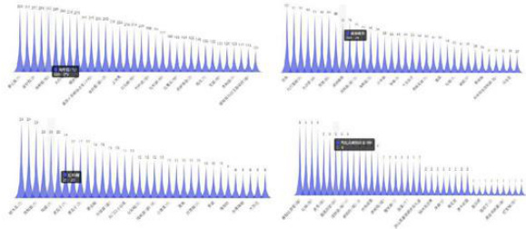  
单品蔬菜打折次数直方图  
三个指标与六大蔬菜品类季度平均销售量标准化折线图

附录3：代码  

<html><body><table><tr><td>销售量作图代码</td></tr><tr><td>data=xlsread(‘各类每日销售量.xlsx，sheet2，B2:G1096'）；</td></tr><tr><td>x=[1:1095]；</td></tr><tr><td>x=x；</td></tr><tr><td>y1=data（:，1）；</td></tr><tr><td>y2=data（：，2）；</td></tr><tr><td>y3=data（：,3）；</td></tr><tr><td>y4=data（:,4）；</td></tr><tr><td>y5=data（:,5）；</td></tr><tr><td>y6=data（:,6）；</td></tr><tr><td>figure（1）</td></tr><tr><td>hold on</td></tr><tr><td>plot(x,y1,'b’，‘Linewidth',1)</td></tr><tr><td>plot(x,y2,'r’,‘Linewidth,1）</td></tr><tr><td>plot(x,y3,‘k’,‘Linewidth,1)</td></tr><tr><td>set(gca,linewidth',1）</td></tr><tr><td>set(gca,‘Box’，on'）</td></tr><tr><td>figure（2）</td></tr><tr><td>holdon</td></tr><tr><td>plot（x,y4,'g’,‘Linewidth，1） 学生在</td></tr><tr><td>plot(x,y5,c.,Linewidth',1）</td></tr><tr><td>plot（x,y6,m’,‘Linewidth’,1）</td></tr></table></body></html>

<html><body><table><tr><td>set(gca,'linewidth',1)</td></tr><tr><td>set(gca,Box，‘on')</td></tr><tr><td>data=xlsread(‘特征单品蔬菜每季度销售量.xlsx’，'sheet1',A2:L13'）；</td></tr><tr><td>×=[1:12]；</td></tr><tr><td>x=x；</td></tr><tr><td>y1=data（：，1）；</td></tr><tr><td>y2=data（：，2）；</td></tr><tr><td>y3=data（：,3）；</td></tr><tr><td>y4=data（:,4）；</td></tr><tr><td>y5=data（：,5）；</td></tr><tr><td>y6=data（:,6）；</td></tr><tr><td>y7=data（：，7）；</td></tr><tr><td>y8=data（：,8）；</td></tr><tr><td>y9=data（:,9）；</td></tr><tr><td>y10=data（：，10）；</td></tr><tr><td>y11=data（:,11）；</td></tr><tr><td>y12=data（：，12）；</td></tr><tr><td>figure(1) holdon</td></tr><tr><td>plot（x，y1,'b’）</td></tr><tr><td>plot（x，y2,r）</td></tr><tr><td>figure（2）</td></tr><tr><td>holdon</td></tr><tr><td>plot(x,y3,'k‘）</td></tr><tr><td>plot（x，y4,'g‘）</td></tr><tr><td>figure(3)</td></tr><tr><td>hold on</td></tr><tr><td>plot（x，y5,‘c）</td></tr><tr><td>plot（x,y6,m）</td></tr><tr><td>figure(4)</td></tr><tr><td>hold on</td></tr><tr><td>plot（x，y7,'b’）</td></tr><tr><td>plot（x，y8,n）</td></tr><tr><td>figure（5)</td></tr><tr><td>holdon</td></tr><tr><td>plot（x，y9,‘k）</td></tr><tr><td>plot(x，y1e,'g'）</td></tr><tr><td>figure(6)</td></tr><tr><td>holdon</td></tr><tr><td>plot(x,y11,’c）</td></tr><tr><td>plot(×,y12,‘m)</td></tr><tr><td></td></tr></table></body></html>

# 描述性统计代码

<html><body><table><tr><td>Test=xlsread('单品蔬菜日销售量.xlsx’，sheet1','B2:EM1096'） %%统计描述</td></tr><tr><td>MIN=min（Test）；%每一列最小值 MAX=max(Test）；%每一列最大值</td></tr><tr><td>MEAN=mean（Test）；%每一列均值</td></tr><tr><td>MEDIAN=median（Test）；%每一列中位数 SKEWNESS=skewness（Test）；%每一列偏度</td></tr><tr><td>KURTOSIS=kurtosis（Test）；%每一列峰度</td></tr><tr><td>STD=std（Test）；%每一列标准差 RESULT=[MIN;MAX;MEAN;MEDIAN;SKEWNESS;KURTOSIS;STD] %矩阵表示统计量</td></tr><tr><td></td></tr><tr><td>sum=sum（Test）； Test=xlsread（‘各类每日销售量.x1sx',‘sheet2’，‘B2:G1096'） %%统计描述 MIN=min（Test）；%每一列最小值</td></tr></table></body></html>

<html><body><table><tr><td>Sperman相关系数代码</td></tr><tr><td>RX=xlsread(‘各类每日销售量.x1sx’,'sheet2'，'B2:G1096'）； [R，P]=fun_spearman(RX,1)</td></tr><tr><td>function [p]=calculate_p(r,m,kind）</td></tr><tr><td>z=abs（r）*sqrt（m-1）；%计算检验值</td></tr><tr><td>p=（1-normcdf（z））*kind;%计算p值</td></tr><tr><td>end</td></tr><tr><td>function[r]=calculate_r(X,Y）</td></tr><tr><td>RX=rank_data（X）；%计算×的等级</td></tr><tr><td>RY=rank_data（Y）；%计算Y的等级</td></tr><tr><td>d=RX-RY；%计算X和Y等级差</td></tr><tr><td>n=size（X，1）；%计算样本个数n</td></tr><tr><td>r=1-（6*sum（d.*d））/（n*（n^2-1））；%计算斯皮尔曼相关系数</td></tr><tr><td>end</td></tr><tr><td>function[R,P]=fun_spearman(X，kind）</td></tr><tr><td>ifnargin==1%判断用户输入的参数</td></tr><tr><td></td></tr><tr><td>kind=2；</td></tr><tr><td></td></tr><tr><td>end [m，n]=size（X）；%计算样本个数和指标个数</td></tr></table></body></html>

（ $1 + m < 3 0$ %判断是否样本数量disp(样本个数少于30，请直接查临界值表进行假设检验‘）elseifn<2%判断是否指标数太少disp（'指标个数太少，无法计算‘）elseif kind $\scriptstyle \gamma = 1$ &&kind $N = 2$ %判断kind是否为1或者2disp(‘kind只能取1或者 $2 ^ { \cdot }$ ）else$R =$ ones（n）；%初始化R矩阵${ \textsf { P } } =$ ones(n）；%初始化P矩阵for $\textbf { i } = \textbf { 1 }$ ：nfor $j = ( 1 + 1 )$ ：n（20 $r = { }$ calculate_r（X（：，i），X（：，j））；%计算i和j两列的相关系数r${ \mathfrak { p } } =$ calculate_p(r，m，kind）；%计算p值R（i，j） $\mathbf { \beta } = \mathbf { \beta } _ { r }$ R(j，i) $\mathbf { \sigma } = \mathbf { \sigma }$ r；%求得相关系数P（i，j） ${ \bf \Pi } = { \bf \Pi }$ p;P(j，i） ${ \tt \equiv }$ p；%求得检验p值endendendend

K-means++聚类算法代码  
1 $x = x 1$ sread('单品蔬菜统计特征数据.x1sx’，'sheet1’，B2:D141'）；  
%聚类种类  
$K = 4$   
max_iters $= 2 0$   
centroids $\mathbf { \beta } = \mathbf { \beta }$ init_centroids(X,K）；  
%迭代更新簇分配和簇质心  
for $\textbf { i } = \mathbf { \Omega }$ 1:max_iters%簇分配labels $\mathbf { \sigma } = \mathbf { \sigma }$ assign_labels(X，centroids)；%更新簇质心centroids $\mathbf { \beta } = \mathbf { \beta }$ update_centroids(X，labels,K）；  
end  
%簇分配函数  
function labels $\mathbf { \sigma } = \mathbf { \sigma }$ assign_labels(X，centroids）[\~，labels] $\mathbf { \sigma } = \mathbf { \sigma }$ min(pdist2(X,centroids，'squaredeuclidean’）,[]，2）；  
end  
%初始化簇质心函数  
function centroids $\mathbf { \sigma } = \mathbf { \sigma }$ init_centroids(X,K）%随机选择一个数据点作为第一个质心 大学生在乡centroids $\mathbf { \sigma } = \mathbf { \sigma }$ X(randperm(size(X，1）,1），：）；%选择剩余的质心

<html><body><table><tr><td>fori=2:K D=pdist2（X,centroids，‘squaredeuclidean’）； D=min(D，[]，2）； D=D/sum(D); centroids(i，:）=X（find(rand<cumsum(D），1），：）； end</td></tr><tr><td>end %更新簇质心函数 function centroids=update_centroids(X,labels，K) centroids=zeros(K，size(X,2）))； fori=1:K centroids(i，:）=mean(X(labels==i,:），1）；</td></tr></table></body></html>

# 预测补货量与作图预测代码

<html><body><table><tr><td colspan="2">预测补资量与作图预测代码</td></tr><tr><td>data1=xlsread(预测补货量与定价.xlsx，'sheet1'，'B2:G8‘）；</td><td></td></tr><tr><td>x=[1:7]；</td><td></td></tr><tr><td>y1=data1（：，1）；</td><td></td></tr><tr><td>y2=data1（：,2）；</td><td></td></tr><tr><td>y3=data1（：,3）；</td><td></td></tr><tr><td>y4=data1（:,4）； y5=data1（:,5）；</td><td></td></tr><tr><td>y6=data1（：,6）；</td><td></td></tr><tr><td></td><td></td></tr><tr><td>figure(1) holdon</td><td></td></tr><tr><td>plot(x,y1,'b’）</td><td></td></tr><tr><td>plot（x，y2,n’）</td><td></td></tr><tr><td>plot（x，y3,‘k’）</td><td></td></tr><tr><td>plot(x,y4,'g）</td><td></td></tr><tr><td>plot(x,y5,c）</td><td></td></tr><tr><td>plot（x，y6,'m）</td><td></td></tr><tr><td></td><td></td></tr><tr><td>data2=xlsread（预测补货量与定价.xlsx，sheet2，‘B2:G8）；</td><td></td></tr><tr><td>y1=data2（:，1）；</td><td></td></tr><tr><td>y2=data2（:,2）；</td><td></td></tr><tr><td>y3=data2（:,3）；</td><td></td></tr><tr><td>y4=data2（:，4）；</td><td></td></tr><tr><td>y5=data2（：,5）；</td><td></td></tr><tr><td>y6=data2（：,6）；</td><td></td></tr><tr><td>figure（1）</td><td>学生在</td></tr><tr><td>holdon</td><td></td></tr><tr><td>plot（x，y1,'b）</td><td></td></tr></table></body></html>

<html><body><table><tr><td>plot（x，y2,'r'）</td><td></td></tr><tr><td>plot（x，y3,‘k’）</td><td></td></tr><tr><td>plot（x，y4,g’）</td><td></td></tr><tr><td>plot(x，y5,c）</td><td></td></tr><tr><td>plot（x，y6,'m）</td><td></td></tr></table></body></html>

Pearson相关系数及其检验  
Test=xlsread（‘六大蔬菜品类销售量与成本加成定价.x1sx’，‘sheet1'，'B3:M1097'）；  
%%计算各列之间的相关系数以及p值  
[R,P] $\mathbf { \beta } = \mathbf { \beta }$ corrcoef(Test）;  
%用循环检验所有列的数据的正态分布性  
n_c $\mathbf { \sigma } = \mathbf { \sigma }$ size（Test，2）；%numberof column 数据的列数  
$\mathsf { H } =$ zeros(1,n_c）；%初始化节省时间和消耗  
${ \pmb P } =$ zeros(1，n_c）;%计算所得检验p值  
for $\dot { \textbf { i } } =$ 1:n_c[h,p] $\mathbf { \lambda } = \mathbf { \lambda }$ jbtest(Test(:,1）,0.01）；（204号 $H ( \ i ) = h .$ …（2 $\mathsf { P ( i ) = p ; }$   
end  
disp(H）  
disp(P)

# %检验相关系数r

$r = 0 . 5$ 三  
$\mathfrak { n } =$ nput（请输入样本数量：）  
alpha $\ L =$ input(请输入建设检验判断值：）  
$t = r ^ { 2 } ( ( ( n - 2 ) / ( 1 - r ^ { 2 } ) ) \cdot 0 . 5 )$ ；%n为样本数量  
${ \mathfrak { p } } =$ (1-tcdf(t，n-2）） $\scriptstyle * _ { 2 }$ %此时的t为输入n后求得的t值，p即为求得的检验值  
disp(检验相关洗漱得到的p值为：‘）  
disp(p)  
$\mathrm { i } +$ p<alphadisp（‘拒绝原假设，相关系数显著不等于e）  
elsedisp（‘接受原假设，相关系数显著等于0）  
end$L k = 1 0 0$ %每个温度下的迭代次数  
alfa $= 8 . 9 5$ %温度衰减系数  
$\times \frac { 1 6 } { - 2 6 } =$ [-30]；%x的下界  
$\times \ \underline { { { \mathbf { u } } } } \mathbf { b } \ = \$ [37]；%x的上界  
%%随机生成一个初始解矩阵  
$x \theta =$ zeros(1,narvs）;  
for ${ \textbf { i } } = { \textbf { 1 } }$ ：narvs  
xe（i）=x_lb(i）+（x_ub（i）-x_1b(i）)\*rand(1）；  
end  
ye $\mathbf { \Sigma } = \mathbf { \Sigma }$ Obj_fun2（x0）；%计算当前解的函数值  
%h=scatter（x0，y0，\*r）；%scatter是绘制二维散点图的函数（这里返回h是为了得到图形的句柄，未来我们对其位置进行更新）  
%%定义一些保存中间过程的量，方便输出结果和画图  
max_y $\mathbf { \lambda } = \mathbf { \lambda }$ ye；%初始化找到的最佳的解对应的函数值为ye  
MAXY $\mathbf { \Psi } = \mathbf { \Psi }$ zeros(maxgen，1）；%记录每一次外层循环结束后找到的max_y（方便画图）

<html><body><table><tr><td>优化模型</td></tr><tr><td>B=xlsread(‘六大蔬菜品类每日加成定价.x1sx，'sheet1'，'A2:F2'）；</td></tr><tr><td>%%参数初始化</td></tr><tr><td>narvs=2；%变量个数</td></tr><tr><td>Te=100；%初始温度</td></tr><tr><td></td></tr><tr><td>T=T0；%迭代中温度会发生改变，第一次迭代时温度就是TO maxgen=200；%最大迭代次数 大学生在</td></tr></table></body></html>

%%模拟退火过程

foriter $\mathbf { \Psi } = \mathbf { \Psi } _ { 1 }$ ：maxgen%外循环，我这里采用的是指定最大送代次数，用于温度降低for $\textbf { i } = \textbf { 1 } : \lfloor \kappa$ %内循环，在每个温度下开始迭代，用于广泛搜索新解（204号 $y =$ randn(1,narvs）； $\%$ 生成1行narvs列的N（O，1）随机数$\scriptstyle z \ = \ y \ /$ sqrt（sum（y.^2））；%根据新解的产生规则计算zx_new $= x \theta + z ^ { 2 } + T$ %根据新解的产生规则计算新解x_new的值%判断新解是否在定义域内，如果这个新解的位置超出了定义域，就对其进行调整for $j = 1$ ：narvsifx_new（j）<x_1b（j）r=rand（1）；x_new（j)=r\*x1b（j）+（1-）\*x0（j）；elseifx_new（j）>x_ub（j）r=rand（1）；x_new（j)=r\*x_ub（j)+（1-r)\*x0（j)）；endend$\mathbf { \times 1 } = \mathbf { \times \_ n e w } \mathrm { ; }$ %将调整后的x_new赋值给新解x1y1 $\mathbf { \sigma } = \mathbf { \sigma }$ Obj_fun2（x1）；%计算新解的函数值ify1>ye%如果新解函数值大于当前解的函数值$\times \textcircled { 1 } = x \textcircled { 1 }$ ；%更新当前解为新解$y \theta = y \mathbf { 1 }$ 1else${ \mathfrak { p } } =$ exp（-（ye-y1）/T）；%根据Metropolis准则计算一个概率  
率（2号 $\times \theta = x \pmb { 1 }$ %更新当前解为新解

$\mathbf { y } \theta \ = \mathbf { y } \mathbf { 1 } ,$ endend%判断是否要更新找到的最佳的解ifye>max_y%如果当前解更好，则对其进行更新max_y $\mathbf { \mu } = \mathbf { \sigma }$ yθ；%更新最大的ybest_x $= \times 0$ %更新找到的最好的xendendMAXY(iter) $\mathbf { \sigma } = \mathbf { \sigma }$ max_y；%保存本轮外循环结束后找到的最大的y（20 ${ \textsf { T } } =$ alfa\*T；%温度下降%pause（0.01）%暂停一段时间（单位：秒）后再接着画图%h.XData $= x \theta$ %更新散点图句柄的 $x$ 轴的数据（此时解的位置在图上发生了变化）%h.YData $\mathbf { \beta } = \mathbf { \beta }$ Obj_fun1（xe）；%更新散点图句柄的y轴的数据（此时解的位置在图上发生了变化）enddisp(最佳的位置是：‘）；disp(best_x）%输出的为最后多次迭代不变的解disp（此时最优值是：‘）；disp（max_y）%输出的为最后多次迭代不变的最优值function w $\mathbf { \sigma } = \mathbf { \sigma }$ Obj_fun2（y，R,P）$\mathsf { S } = \mathsf { x } \mathsf { 1 }$ sread('未来一周六大类日销预测.x1sx’,'sheet1','B2:G8'）；L=xlsread(‘六大蔬菜品类平均损耗率.xlsx',‘sheet1',B2:B7'）；fori=1:6for $s = 1 : 7$ w=w+S(i，j）\*（P(i，j）-B(i））-R(i,j)\*B(i）\*(i）；end

模拟退火模型代码  
B=xlsread（‘单位成本与损耗率.xlsx,'sheet1’，'A2:F2）；  
%%参数初始化  
narvs $\mathbf { \lambda } = \Im { 4 7 }$ %变量个数  
$T \theta = 1 0 \theta$ %初始温度  
一 ${ \textsf { T } } =$ Te；%迭代中温度会发生改变，第一次迭代时温度就是Te  
maxgen $\mathbf { \lambda } = \mathbf { \lambda }$ 200；%最大迭代次数  
$L { \bf k } = \mathbf { \epsilon } \mathbf { 1 } 8 0$ %每个温度下的迭代次数  
alfa $= 0 . 9 5$ %温度衰减系数  
$x \_ { 1 6 } = 2 . 5$ %x的下界  
$x _ { - } , v b = B$ %x的上界  
%%随机生成一个初始解矩阵  
$x \theta =$ zeros(1,narvs）；  
for ${ \textbf { \textit { i } } } = { \textbf { \textit { 1 } } }$ narvs <大学生在乡xe（i）=x_1b（i）+（x_ub（i）-x_lb（i）)\*rand(1）；  
end  
ye=Obj_fun2 $\left. { \mathsf { x } } \theta \right.$ . $\%$ 计算当前解的函数值  
max_y $\mathbf { \sigma } = \mathbf { \sigma }$ ye; %初始化找到的最佳的解对应的函数值为ye  
MAXY $\mathbf { \sigma } = \mathbf { \sigma }$ zeros(maxgen，1）；%记录每一次外层循环结束后找到的maxy  
%%模拟退火过程  
foriter $\mathbf { \Psi } = \mathbf { \Psi } _ { 1 }$ ：maxgen%外循环，用于温度降低for $\frac { 3 } { 2 } = \frac { 7 } { 2 } : 2 k$ %内循环，用于广泛搜索新解（204号 $\textbf { y } =$ randn（1,narvs）；%生成1行narvs列的N（e，1）随机数$z = y 1$ sqrt（sum（y $\scriptstyle \left\lceil { \begin{array} { l } { \sim 2 } \end{array} } \right.$ ）； $\%$ 根据新解的产生规则计算zx_new $= x \theta + z ^ { 2 } + T$ %根据新解的产生规则计算新解×_new的值%判断新解是否在定义域内，如果这个新解的位置超出了定义域，就对其进行调整for $j = 1$ ：narvs（204 $1 + x - n e w ( j ) < x - 2 b ( j )$ （204号（204号 $r =$ rand(1）；x_new（j)=r\*x_1b（j）+（1-r)\*xe（j）；elseifx_new（j）>x_ub(j）2号 $r =$ rand(1)；x_new（j） $\mathbf { \Sigma } = \mathbf { \Sigma }$ r_ub（j）+(1-r)\*xe(j）；endend（20 $\mathbf { x 1 } = \mathbf { \times _ { - } } \mathsf { n e w ; }$ %将调整后的x_new赋值给新解x1y1 $\mathbf { \lambda } = \mathbf { \lambda }$ obj_fun2（x1）； $x$ 计算新解的函数值ify1 $>$ ye %如果新解函数值大于当前解的函数值中 $x \theta = x \pmb { 1 }$ ；%更新当前解为新解$y \theta = y \pmb { 1 }$ else$p = \exp ( - ( y _ { 1 } - y _ { 1 } ) / T )$ ；%根据Metropolis准则计算一个概率$^ { \mathrm { i } \dagger }$ rand(1）
max_y%如果当前解更好，则对其进行更新max_y $\mathbf { \sigma } = \mathbf { \sigma }$ ye；%更新最大的ybest $x = x \theta$ %更新找到的最好的xendendMAXY(iter) $\mathbf { \sigma } = \mathbf { \sigma }$ max_y；%保存本轮外循环结束后找到的最大的y（20号 ${ \textsf { T } } =$ alfa\*T；%温度下降  
end生  
$V = x I$ sread('单位成本与损耗率.xlsx’,'sheet1’，‘B3:BT3'）；  
for i=1:49w=w+y(i)\*（R(i）\*（p(i）-B(i))-R（i)\*B(i)\*L(i）；  
end

# 灰色关联分析模型

clear;clc  
%loadgdp.mat%导入数据一个6\*4的矩阵  
data=zeros(12,4,6）；  
data（：，：，1）=x1sread（‘六大蔬菜品类与其节日、节气和季度蔬菜丰富度指标.x1sx’，花菜类  
，B2:E13'）；  
data（：，：,2） $\vDash$ x1sread（六大蔬菜品类与其节日、节气和季度蔬菜丰富度指标.x1s×’，食用菌  
,B2:E13'）；  
data（：，：,3） $\ O =$ x1sread（‘六大蔬菜品类与其节日、节气和季度蔬菜丰富度指标.x1s×’，花叶类  
,B2:E13）；  
data（：，：,4）=x1sread（‘六大蔬菜品类与其节日、节气和季度蔬菜丰富度指标.x1sx，辣椒类  
,B2:E13）；  
data（：，，5） $\ L =$ xlsread（‘六大蔬菜品类与其节日、节气和季度蔬菜丰富度指标.x1sx’，茄类  
B2:E13'）；  
data（:，：,6）=x1sread（六大蔬菜品类与其节日、节气和季度蔬菜丰富度指标.x1sx’，水生根茎  
类,B2:E13）；  
fori=1:6Mean $\mathbf { \sigma } = \mathbf { \sigma }$ mean(data（:,:,i））； $\%$ 求出每一列的均值以供后续的数据预处理data（:,,i） $\mathbf { \Sigma } = \mathbf { \Sigma }$ data（:,:,i）./repmat(Mean,size(data（:，：,i）,1）,1）；（204号 $\textsf { Y } =$ data（：，1,i）；%母序列（204号 $x =$ data（:，2:end,i）；%子序列absxe_xi $\mathbf { \sigma } = \mathbf { \sigma }$ abs（x-repmat（Y，1,size（x，2)））；%计算｜xe-xi|矩阵西 $\mathbf { \sigma } = \mathbf { \sigma }$ min(min(absxe_xi)）； %计算两级最小差a（204号 $b =$ max（max（absxe_xi））；%计算两级最大差brho $= 0 . 5$ %分辨系数取0.5gamma $\mathbf { \lambda } = \mathbf { \lambda }$ (a+rho\*b)./(absxe_xi $^ +$ rho\*b）；%计算各指标与母序列的关联系数disp（‘子序列中各个指标的灰色关联度分别为：‘）disp(mean(gamma)）（20 $x = \pm 2 : 1 2$ figure(i)hold onplot(x,data（:,1,i）,‘k’,‘Linewidth’,1）plot(x,data（:,2,i）,r',‘Linewidth',1）plot(x,data（:,3,i）,b’,‘LineWidth’,1）plot(x,data(:,4,i),'g',‘Linewidth',1)set(gca,linewidth',1）set(gca,Box’,‘on） 生在！  
end

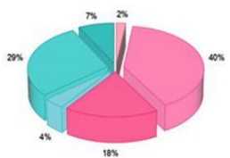

花菜类花叶类辣椒类茄类食用菌水生根茶类

# 2026年全国大学生国家安全知识答题