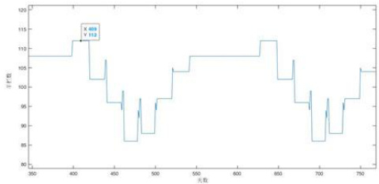
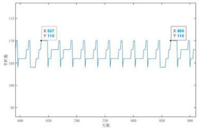
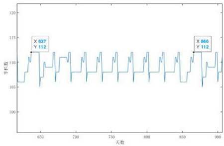
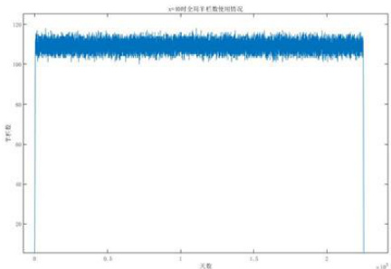
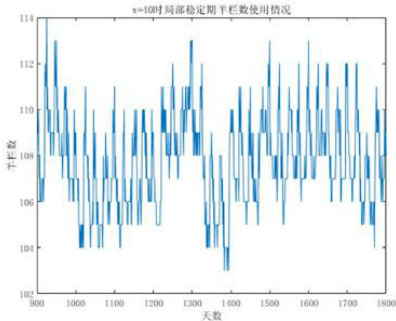
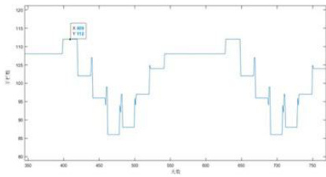

# 圈养湖羊空间利用率的优化问题

# 一、摘要

湖羊是优秀的养殖品种，湖羊养殖场通常有若干标准羊栏，根据湖羊的性别和生长阶段分群饲养，不同阶段、性别和大小的羊只对空间要求不同，所以每一羊栏所容纳的羊只数量由上述因素决定．在实际运营中，空间利用率是相对独立并影响养殖场经营效益的重要问题.本文主要研究了湖羊养殖过程中空间利用率的问题，给出了具体生产计划，较好地解决了提出的三个问题.

针对问题1，母羊的工作周期包括交配期、孕期、哺乳期和休整期，一整个周期持续 $2 2 9$ 天．仅考虑单个批次一定数量的基础母羊以固定周期的方式重复工作，可求出其(包括羔羊)所占用的羊栏天数,在理想状态下多批次交替工作可以把羊栏使用数的波动抹平，而出栏羊数正比于基础母羊的数量n,可求出n对应的每一栏能转化为多少年化出栏数.遍历n便可以得到年化出栏羊只数量范围的估计为1163至1312,要想年化出栏羊只数量达到1500，缺口约为16至32.

针对问题2，我们考虑了一般情形，即决策变量为批次之间的间隔 $g _ { i }$ 和每批次进入交配期的基础母羊数量 $x _ { i }$ ，以母羊总数量为目标函数，112个羊栏数量为约束条件建立规划模型.然而该模型是非线性的整数规划，且非线性约束条件非常多，基本不可解.我们对模型进行了化简，固定间隔和数量，即 $g _ { i } = g , x _ { i } = x$ ，这样决策变量只有两个整数，决策空间有限，用遍历的方法得到最优解 $g = 2 2 , x = 4 0$ 在一个工作周期内重复10次，该方案的年化出栏羊只数量1200(2年3胎)．然而该方案最多只使用了110个羊栏,有 $2$ 个羊栏的冗余,且空间利用率只有 $9 5 . 5 6 \%$ 我们经过一定范围的遍历得到了更优解$g = 2 2 , x _ { 1 } = 4 8 , x _ { 2 } = \cdots = x _ { 1 0 } = 4 0$ 年化出栏羊只数量达到了1224只,且空间利用率97. $3 8 \%$ 为最优解.

针对问题3,我们研究了随机因素对母羊和羔羊各个时期的影响，怀孕时间和孕期的分布使得我们需要在孕期、哺乳期、休整期对母羊分批次管理，包括育肥期的羔羊，不同分支的决策各有不同.我们确定225天的大周期，且每批次之间间隔25天，随着时间发展将出现分支.第51天，部分没有成功怀孕的母羊退出本次工作，随后按孕期结束时间不同分了 $3$ 个分支，每个分支尽量保证哺乳期的时长,但不能过于压缩休整期.与之对应的羔羊也分为了3个分支.这样只需要确定每批次进入交配期的基础母羊的数量x，具体方案就确定下来了．我们用计算机模拟充分多的周期，用蒙特卡洛方法计算损失数期望，并以其最小为优化目标，建立优化问题模型，由于决策变量是1维的，我们用遍历法求解.我们观察到随着 $x$ 的增加损失先递减后递增，在 $x = 4 0$ 时得到最小的日均损失数3.79,并给出了局部和全局的羊栏数使用情况可视化结果.

关键词：圈养湖羊，遍历，蒙特卡罗方法，MATLAB

# 二、问题重述

湖羊是优秀的养殖品种，湖羊养殖场通常有若干标准羊栏，根据湖羊的性别和生长阶段分群饲养，不同阶段、性别和大小的羊只对空间要求不同，所以每一羊栏所容纳的羊只数量由上述因素决定，从而保障羊只安全和健康。在实际运营中，虽然还要考虑很多其他因素，但空间利用率是相对独立并影响养殖场经营效益的重要问题。

湖羊养殖的生产过程主要包括自然交配繁殖和育肥两大环节。怀孕母羊分娩后给羔羊哺乳，羔羊断奶后独立喂饲，育肥长成后出栏，母羊停止哺乳后经过休整期，可以再次配种。按上述周期，一般每只基础母羊每2年可生产3胎。种公羊与基础母羊一般按不低于1:50的比例配置。

某湖羊养殖场设置标准羊栏，规格是：空怀休整期每栏基础母羊不超过14只；非交配期的种公羊每栏不超过4只；自然交配期每栏1只种公羊及不超过14只基础母羊；怀孕期每栏不超过8只待产母羊；分娩后的哺乳期，每栏不超过6只母羊及它们的羔羊；育肥期每栏不超过14只羔羊。原则上不同阶段的羊只不能同栏。

养殖场的经营管理者为保障效益，需要通过制定生产计划来优化养殖场的空间利用率，也就是说要决定什么时间开始对多少可配种的基础母羊进行配种，控制羊只繁育，进而调节对羊栏的需求量。

需要建立数学模型解决以下三个问题：

1、根据给定的各种羊只不同状态下的数据，不考虑不确定因素和种羊的淘汰更新，在连续生产的情况下，确定养殖场种公羊与基础母羊的合理数量，并估算年化出栏羊只数量的范围。如果年出栏不少于1500只羊，估算现有标准羊栏数量的缺口。

2、在问题1的基础上，给出 $1 1 2$ 个标准羊栏的具体生产计划，使得年化出栏羊只数量最大。

3、根据实际情形，考虑若干不确定性的因素，制定具体的生产计划，使得整体方案的期望损失最小。

# 三、模型假设

1、简单起见，在方案中各批次之间的交配期不重合.

2、按 $2$ 年3胎的方式计算年化出栏羊只数量.3、假设羔羊进入育肥期就不会死亡.4、允许同批次的母羊之间的移动,即从1个该批次的羊栏移至另1个同批次的羊栏.这样如果同批次的不同羊栏都有母羊移除至下一个阶段，那么剩余的同批次羊可以合并.

5、母羊的怀孕时间和孕期近似服从均匀分布.

# 四、问题分析

# 4.1.问题1的分析

针对问题1，注意到母羊的工作周期为 $\boldsymbol { 2 2 9 }$ 天，我们考虑让n只基础母羊进入交配期，且过了休整期后立刻进入下一个工作周期.在这一个周期内这n只母羊与其生产的羔羊在每个时间段使用多少羊栏是唯一确定的.如果只有1个批次反复来回，那么使用的羊栏数必然波动较大.增加批次可以使得羊栏的使用更平均.我们按理想状态估算,即多批次交替后，综合羊栏使用数量关于时间成近似的常数函数关系，那么该批次平均占用的羊栏数量就可以求出来．而年化出栏数与母羊数量正相关，因此可以求出在不同决策下每一个羊栏对应的出栏羊只数量，让n从一个固定的范围遍历便可以得到112个羊栏的条件下出栏羊只数量的范围，也可以估算要达到1500只年化出栏羊数额外需要的羊栏数.

# 4.2.问题2的分析

针对问题2,沿用问题1中固定数量的基础母羊和批次之间固定间隔的生产模式.而当每批次基础母羊和间隔给定后，我们需要计算在这样的决策下进入稳定期后，每一天所使用的羊栏数.我们建立优化模型，以母羊数量总和为优化目标，以最大羊栏数为约束条件，而经过简化，决策变量就是二维的整数，我们考虑采用遍历的方法进行求解，并进一步的对我们的结果进行优化.

# 4.3.问题3的分析

针对问题3,仍然采用问题1和 $2$ 的固定数量固定间隔的生产模式，但是因为有随机因素的参与，问题变得更加复杂.虽然交配期没变,但是孕期结束的时间并不固定,同时还有部分未能成功受孕的母羊因为要进入后续批次而退出，根据我们的简化假设，孕期结束的时间相互相差21天，而根据孕期哺乳期的条件，需要把同一批进入交配期的羊分成3个分支，这 $3$ 个分支的状态和决策各不相同，包括后续产下的羔羊也对应的

分为3个分支.

经过我们分析，应尽可能的延长哺乳期的时间,但是又不能压缩休整期的时间.多方考虑下我们需要确定好工作周期的长度和固定间隔，当基础母羊数量给定后，对应的羊栏使用数量以及相应的损失也可以求出，类似问题1，让母羊数量遍历找到使得损失最小的方案以最大程度的利用空间.

# 五、符号定义及说明

<html><body><table><tr><td>符号</td><td>含义</td><td>单位</td></tr><tr><td>[国]</td><td>表示对x向上取整</td><td></td></tr><tr><td>[x]</td><td>表示对x四舍五入取整</td><td></td></tr><tr><td>P</td><td>母羊和羔羊各个状态持续的时间</td><td>天</td></tr><tr><td>n</td><td>母羊和羔羊各个状态下每个标准羊栏能容下的最大数量</td><td>只</td></tr><tr><td>N(t</td><td>第t天使用的羊栏数量</td><td>个</td></tr></table></body></html>

# 六、模型的建立与求解

# 6.1问题1:年化出栏数和羊栏数缺口估算

# 6.1.1模型准备—一基本生产模式

1只公羊工作20天对应14只母羊工作229天，如果在平稳期尽可能利用公羊的交配能力，公羊和母羊的比例应该定为1 $\frac { 1 4 \times 2 2 9 } { 2 0 } \approx 1 : 1 6 0$ ，远低于1:50,因此公羊必然有长时间处于非工作期．而羔羊是由母羊生产所得，因此出栏羊只的数量取决于母羊的数量.

总体而言，公羊数量较少，占据羊栏数相比母羊小得多，因此在作估计时不考虑公羊所占的羊栏数，仅考虑母羊和羔羊需要的羊栏数. 先在丝为了简化问题的复杂度，我们考虑较为规律的生产模式，即每隔固定的天数让固定数量的母羊进行交配.同一个时间进入交配期的母羊称为同一批的母羊，因此，我们需要做的决策是确定间隔的时间和每批次母羊的数.我们把公羊、母羊和羔羊的各种状态的持续时间和对羊栏数的要求罗列如下:

表1：各种羊的不同状态情况  

<html><body><table><tr><td></td><td>状态</td><td>持续</td><td>标准羊栏数要求</td></tr><tr><td rowspan="2">公羊</td><td>交配期</td><td>20</td><td>1只公羊与不超过14公只基础母羊</td></tr><tr><td></td><td></td><td></td></tr><tr><td rowspan="4">母羊</td><td>交配期</td><td>20</td><td>1只公羊与不超过14只基础母羊</td></tr><tr><td></td><td></td><td></td></tr><tr><td></td><td>49</td><td>不超过6超8孕的羊羔</td></tr><tr><td>空怀体整期</td><td>20</td><td>不超过14只基础母羊</td></tr><tr><td>羔羊</td><td>育肥期</td><td>210</td><td>不超过14只羔羊</td></tr></table></body></html>

为了不让交配期重叠，我们考虑间隔天数大于交配期20天．不妨以间隔时间20天为例,各个批次的母羊在这样的生产模式下各时间段（天数）的状态如下:

表2：各批次母羊的不同状态时间  

<html><body><table><tr><td></td><td colspan="11">状态</td></tr><tr><td>批次</td><td>交配期</td><td>孕期</td><td>哺乳期</td><td>空怀休 整期</td><td>交配期</td><td>孕期</td><td>哺乳期</td><td>空怀休 整期</td><td></td><td>...</td></tr><tr><td>1</td><td>1-20</td><td></td><td>21-169170-209</td><td>210-229</td><td>230-249</td><td>250-398</td><td></td><td>399-438</td><td>439-458</td><td>...</td></tr><tr><td>2</td><td>21-40</td><td>41-189</td><td></td><td>190-229230-249</td><td>250-269</td><td></td><td>270-418419-458</td><td></td><td>459-478</td><td>.…，</td></tr><tr><td>3</td><td>41-60</td><td>61-209</td><td>210-249</td><td>250-269</td><td>270-289</td><td>290-438</td><td></td><td>439-478</td><td>479-498</td><td>…</td></tr><tr><td>4</td><td>61-80</td><td>81-229</td><td>230-269</td><td>270-289</td><td>290-309</td><td>310-458</td><td></td><td>459-498</td><td>499-518</td><td></td></tr><tr><td></td><td></td><td>..</td><td></td><td></td><td></td><td>…</td><td></td><td></td><td>...</td><td>…</td></tr><tr><td></td><td colspan="14">天数</td></tr></table></body></html>

# 6.1.2年化出栏羊只数量和羊栏缺口数估计

记批次为k，相邻批次间隔天数为 $g \geq 2 0$ ，当每批次的母羊数量 $\boldsymbol { x }$ 确定后，生产计划就得到了，按时间顺序，记母羊的四个状态：交配期、孕期、哺乳期、空怀休整期的时间分别为 1 一长纪

$$
p _ { 1 } = 2 0 , p _ { 2 } = 1 4 9 , p _ { 3 } = 4 0 , p _ { 4 } = 2 0 ,
$$

各个状态下 $^ { 1 }$ 个标准羊栏能容下的最大数量分别为

$$
n _ { 1 } = 1 4 , n _ { 2 } = 8 , n _ { 3 } = 6 , n _ { 4 } = 1 4 ,
$$

羔羊的育肥期 $p _ { s } = 2 1 0$ ，每一栏最多能容纳 $n _ { s } = 1 4$ 只育肥期羔羊

为了最大化生产效率，我们不让母羊休息，当完成一个完整的周期(229天)后立刻进入下一个周期.那么每个批次都有4个关键节点，各个批次的关键节点交错形成不同的阶段，每个阶段各个批次的羊将处于不同的时期，对标准羊栏的需求各有不同，且过了哺乳期后，羔羊需要长时间占用羊栏，进入稳定期后，各批次的母羊的各种状态交织在一起，形成229天复杂的周期，但每个批次在该一个周期内的状态仅相差一个平移，本质上是等价的，因此在做估计时只需要考虑单个周期的情形即可.下面我们研究单个批次的母羊在一个完整周期内所需羊栏数的规律，并对年化出栏羊只范围和羊栏数缺口作估计，以40只母羊为例，得下表：

表3：年化出栏数估计  

<html><body><table><tr><td colspan="2"></td><td></td><td></td><td></td><td>交配天数孕期天数哺乳期天数空怀休整期天数</td><td colspan="2"></td><td>育肥期天数</td></tr><tr><td>母羊数量</td><td>40</td><td>20</td><td>149</td><td>40</td><td>20</td><td>羔羊数量</td><td>80</td><td>210</td></tr><tr><td colspan="2">羊栏数</td><td>3</td><td>5</td><td>7</td><td>3</td><td colspan="2">羊栏数</td><td>6</td></tr><tr><td colspan="2">羊栏天数分项小计</td><td>60</td><td>745</td><td>280</td><td>60</td><td colspan="2"></td><td>1260</td></tr><tr><td colspan="2">羊栏天数合计</td><td>2405</td><td colspan="3">平均每一栏能提供年化出栏数 羊栏数为112时年化出栏数估计</td><td>11.42619543 1279.733888</td><td colspan="2"></td></tr></table></body></html>

1、计算一整个周期(229天）每批次的母羊数量 $x$ 时需要的总羊栏天数:

$$
A = \underbrace { 2 0 \times \left[ \frac { p _ { 1 } } { n _ { 1 } } \right] } _ { \mathcal { R E M } } + \underbrace { 1 4 9 \times \left[ \frac { p _ { 2 } } { n _ { 2 } } \right] } _ { \mathcal { R B } } + \underbrace { 4 0 \times \left[ \frac { p _ { 3 } } { n _ { 3 } } \right] } _ { \mathcal { R H M } } + \underbrace { 2 0 \times \left[ \frac { p _ { 4 } } { n _ { 4 } } \right] } _ { \frac { 1 9 0 \times 1 0 4 } { 2 4 7 4 5 0 } } + \underbrace { 2 1 0 \times \left[ \frac { p _ { 5 } } { n _ { 5 } } \right] } _ { \frac { 1 9 0 4 } { 2 4 7 4 5 0 } } ;
$$

2、按 $2$ 年3胎计算一整个周期(229天）每批次的母羊数量 $x$ 时的年化出栏数:

$$
B = 2 x \times \frac { 3 } { 2 } = 3 x :
$$

3、计算每批次的母羊数量x，羊栏数为 $1 1 2$ 时年化出栏数的估计：

$$
C = { \frac { 1 1 2 \times 2 2 9 \times B } { A } } ;
$$

4、计算想要得到年化1500的出栏数欠缺的羊栏数的估计:

$$
D = \frac { 1 5 0 0 \times A } { 2 2 9 \times B } - 1 1 2 .
$$

取 $\pmb { x } \in \left[ 3 0 , 6 0 \right]$ ，我们能得到年化出栏羊只数量范围在[1163，1312]，羊栏缺口数为

表4：羊栏数缺口估计  

<html><body><table><tr><td></td><td>母羊数量112个羊栏出栏羊只数估计平均每栏出栏数估计羊栏数缺口</td><td></td><td></td></tr><tr><td>30</td><td>1174.120041</td><td>10.48321465</td><td>31.0858806</td></tr><tr><td>31</td><td>1189.064806</td><td>10.61665005</td><td>29.2875053</td></tr><tr><td>32</td><td>1227.421735</td><td>10.95912263</td><td>24.8722707</td></tr><tr><td>33</td><td>1178.260789</td><td>10.52018561</td><td>30.5830356</td></tr><tr><td>34</td><td>1213.965661</td><td>10.83897912</td><td>26.3894169</td></tr><tr><td>35</td><td>1249.670534</td><td>11.15777262</td><td>22.4354336</td></tr><tr><td>36</td><td>1171.240592</td><td>10.45750529</td><td>31.4376516</td></tr><tr><td>37</td><td>1183.753846</td><td>10.56923077</td><td>29.9213974</td></tr><tr><td>38</td><td>1215.747193</td><td>10.85488565</td><td>26.1866238</td></tr><tr><td>39</td><td>1247.740541</td><td>11.14054054</td><td>22.643377</td></tr><tr><td>40</td><td>1279.733888</td><td>11.42619543</td><td>19.2772926</td></tr><tr><td>41</td><td>1235.201253</td><td>11.02858262</td><td>24.0102247</td></tr><tr><td>42</td><td>1265.328113</td><td>11.29757244</td><td>20.771886</td></tr><tr><td>43</td><td>1163.35865</td><td>10.3871308</td><td>32.4094648</td></tr><tr><td>44</td><td>1190.413502</td><td>10.62869198</td><td>29.1274315</td></tr><tr><td>45</td><td>1217.468354</td><td>10.87025316</td><td>25.9912664</td></tr><tr><td>46</td><td>1244.523207</td><td>11.11181435</td><td>22.9914562</td></tr><tr><td>47</td><td>1271.578059</td><td>11.35337553</td><td>20.1192976</td></tr><tr><td>48</td><td>1298.632911</td><td>11.59493671</td><td>17.3668122</td></tr><tr><td>49</td><td>1243.07814</td><td>11.09891197</td><td>23.1483825</td></tr><tr><td>50</td><td>1186.308973</td><td>10.5920444</td><td>29.6157205</td></tr><tr><td>51</td><td>1210.035153</td><td>10.80388529</td><td>26.8389417</td></tr><tr><td>52</td><td>1233.761332</td><td>11.01572618</td><td>24.168962</td></tr><tr><td>53</td><td>1257.487512</td><td>11.22756707</td><td>21.5997363</td></tr><tr><td>54</td><td>1281.213691</td><td>11.43940796</td><td>19.1256672</td></tr><tr><td>55</td><td>1289.040512</td><td>11.50929028</td><td>18.3294958</td></tr><tr><td>56</td><td>1312.477612</td><td>11.71855011</td><td>16.0021834</td></tr><tr><td>57</td><td>1191.148289</td><td>10.63525258</td><td>29.0403739</td></tr><tr><td>58</td><td>1212.045627</td><td>10.82183596</td><td>26.6086433</td></tr><tr><td>59</td><td>1232.942966</td><td>11.00841934</td><td>24.2593442</td></tr><tr><td>60</td><td>1253.840304</td><td>11.19500272</td><td>21.9883552</td></tr><tr><td></td><td>最大值（取整）</td><td>1312</td><td>32</td></tr><tr><td></td><td>最小值（取整）</td><td>1163</td><td>16</td></tr></table></body></html>

# 6.2问题2:112个标准羊栏的最优生产计划

在第1问的基础上，设一共有 $k$ 个批次，固定公羊有 $m$ 只，相邻批次间隔天数为$g \geq 2 0$ ，每个批次的基础母羊数量分别设为 $x _ { 1 } , . . . , x _ { k }$

先对批次 $k$ 做个估计. ${ \bigg \lceil } { \frac { 5 0 } { 1 4 } } { \bigg \rceil } = 4$ 因此取 $k = 4$ ，否则公羊的交配能力将被浪费。而公羊的数量范围可以考虑4的整数倍，而 $^ 4$ 只公羊对应最多200只母羊，数量太少导致羊栏空置率较大，因此取公羊数量 $m = 8$

# 6.2.1模型建立——规划模型

我们先对 $k = 4$ 划分时间段.

$t _ { 1 , 1 } = 1$ 发下 $t _ { 1 , j + 1 } = t _ { 1 , 1 } + \sum _ { l = 1 } ^ { j } p _ { l }$ 到在 $\left[ t _ { 1 , j } , t _ { 1 , j + 1 } - 1 \right]$ $j$ $p _ { s }$ 天，即羔羊在 $\left[ T _ { 1 , 1 } , T _ { 1 , 2 } - 1 \right]$ 上处于育肥期，其中 $T _ { 1 , 1 } = t _ { 1 , 4 } , T _ { 1 , 2 } = t _ { 1 , 4 } + p _ { 5 }$ 考虑到湖羊圈养通常是3年2胎的方式，再加上第1个初始的周期，我们一共考虑4个周期，即按$t _ { 1 , j + 4 } = t _ { 1 , j } + \sum _ { l = 1 } ^ { 4 } p _ { l } , T _ { 1 , j + 2 } = T _ { 1 , j } + \sum _ { l = 1 } ^ { 4 } p _ { l }$ 的方式选代产生各个时间节点 $\left\{ t _ { 1 , 1 } , \ldots , t _ { 1 , 1 7 } \right\}$ 和$\left\{ { \cal T } _ { 1 , 1 } , \ldots , { \cal T } _ { 1 , s } \right\} .$ （20

2、对第2-4批次：按间隔时间顺延，即 $t _ { i + 1 , j } = t _ { i , j } + g , T _ { i + 1 , j } = T _ { i , j } + g$ ，这样就得到了一组时间节点

$$
\left\{ t _ { i } , i = 1 , . . . , k , j = 1 , . . . , 4 k + 1 \right\} , \left\{ T _ { i j } , i = 1 , . . . , k , j = 1 , . . . , 2 k \right\} .
$$

3、确定每一天不同批次的羊所处的状态：记 $t _ { n } = \operatorname* { m a x } \left\{ t _ { i i } , T _ { i i } \right\} ,$ 对 $t \in \left[ 1 , t _ { m } \right]$ 求出t时刻各个批次公羊和母羊、羔羊的状态：

3.1、用0-1变量 $\delta _ { i j }$ 表示第i批次的母羊是否处在第 $j$ 个状态，是则取1，否则取0，找到 $k$ 使得 $t _ { i , k } \leq t \leq t _ { i , k + 1 } - 1 ,$ 则：

$$
\delta _ { i j } \left( t \right) = 1 , \quad \mathrm { j t } \neq j = 1 + \left( k - 1 \right) \bmod 4 .
$$

即当 $t \in \left[ t _ { i , 4 ( k - 1 ) + j - 1 } , t _ { i , 4 ( k - 1 ) + j } - 1 \right]$ 时，母羊处于 $j$ 个状态；

3.2、用0-1变量 $\overline { { \delta _ { i } } }$ 表示第i批次的羔羊是否处在育肥期，是则取1，而取0表示羔羊未出生或仍处在哺乳期,不占用羊栏,则:

$$
\overline { { \delta } } _ { i } \left( t \right) = \begin{array} { r } { \left\{ \begin{array} { l } { 1 , \quad \mathrm { ~ } \forall i f \mathrm { ~ } \mathrm { i } \hbar \underset { = } { \Psi } \mathcal { U } \mathcal { U } \mathcal { U } \mathcal { U } \mathcal { U } \mathcal { k } \in \left[ { 1 } , { 4 } \right] \left\{ \underset { = } { \Psi } \mathcal { U } \mathcal { U } T _ { i , 2 \left( k - 1 \right) + 1 } { - 4 } \leq t \leq T _ { i , 2 k } - 1 \right. } \\ { 0 , \qquad \left. \mathrm { ~ } \right\} \not \in \mathcal { V } \mathcal { U } } \end{array} \right. } \end{array}
$$

即当 $t \in \left[ T _ { t , 2 ( k - 1 ) + 1 } , T _ { t , 2 k } - 1 \right]$ 时，第i批次的羔羊正处于育肥期；

3.3、用0-1变量 $\Delta ( t )$ 表示公羊是否处在交配期的状态，是则取1，否则取0,则:

$$
\Delta ( t ) = \operatorname* { m a x } _ { t } \left\{ \delta _ { i 1 } ( t ) \right\}
$$

即当任意一批次的母羊在交配期时，公羊也在交配期.

4、计算第 $t$ 天所需要的羊栏数N(t),t∈[1,𝑡m]:

$\sum _ { i = 1 } ^ { 4 } \sum _ { j = 1 } ^ { 4 } \left[ \frac { \delta _ { i j } \left( t \right) x _ { i } } { n _ { j } } \right] ;$ 4.2、羔羊占用的羊栏数 $\sum _ { i = 1 } ^ { + } \left\lceil \frac { 2 \overline { { \delta _ { i } } } ( t ) x _ { i } } { n _ { 1 } } \right\rceil ;$ 4.3、公羊占用的羊栏数 $\Bigg \lceil \frac { \left[ 1 - \Delta ( t ) \right] m } { 4 } \Bigg \rceil$ 可求得

$$
N \big ( t \big ) = \sum _ { i = 1 } ^ { 4 } \sum _ { j = 1 } ^ { 4 } \left[ \frac { \delta _ { i j } \big ( t \big ) x _ { i } } { n _ { j } } \right] + \sum _ { i = 1 } ^ { 4 } \left[ \frac { \overline { { \delta _ { i } } } \big ( t \big ) x _ { i } } { n _ { 1 } } \right] + \left[ \frac { \left[ 1 - \Delta \big ( t \big ) \right] m } { 4 } \right]
$$

# 5、建立非线性整数规划模型：

5.1、常量：公羊数量 $m = 8$ ，总批次 $k = 4$ ，批次之间的间隔 $g = 2 0$

5.2、决策变量：每批次母羊的数量 $m \leq x _ { i } \leq n _ { 1 } m$

5.3、目标函数：按 $2$ 年3胎折算的每年出栏羊只数量 $3 \sum _ { i = 1 } ^ { k } x _ { i }$

5.4、约束条件： $N ( t ) \leq 1 1 2 , t = 1 , . . . , t _ { m }$

模型建立后我们发现求解是极其困难的，因为约束条件多而且是非线性的，因此我们考虑对模型进行简化.

# 6.2.2模型简化——重复循环的生产计划

令 $x _ { i }$ 为常量，即 $x _ { i } = x$ 在固定间隔的情况下，各个批次羊只的状态是有固定规律的(见表2)，仍然可以用(1)式求得每一时刻使用的羊栏数.固定间隔 $g$ 对 $x$ 进行遍历求得(图1)当公羊为8只，母羊为392只，间隔为21天，可以得到最多羊栏需求量为112个，羊栏的平均空间利用率为 $9 1 . 1 1 \%$

  
图1：4批次的最优解

# 6.2.3模型检验与反馈

观察上述结果，我们发现，对于 $k = 4$ 个批次，母羊集中怀孕、哺乳，羔羊集中育肥，这样羊栏的使用会过于集中，当羊羔集中出栏时，羊栏利用率就明显下降.针对这种情况，我们考虑将批次增多，这样可以使得羊栏使用不会过于集中，从而提高利用率.

然而，在具体计算时，当批次增加后，每1批次的母羊数量就会减少,公羊按1:14的比例进行交配不一定是最省羊栏的，需要做优化.首先当批次 $k$ 和每批次的母羊数量 $x$ 给定后，公羊数量可确定为 $m = \left\lceil { \frac { k x } { 5 0 } } \right\rceil$ 我们需要建立函数来描述 $x$ 和 $m$ 给定后交配期需要的最少的羊栏数.

记 $n _ { 1 } = n _ { 1 } ( x , m ) , m _ { 1 } = m _ { 1 } ( x , m )$ 分别表示交配期母羊占用的羊栏数和交配期空闲公羊占用的羊栏数：

1、先求出最小的交配期公羊的数量 $\left\lceil { \frac { x } { 1 4 } } \right\rceil$

2、让交配期的公羊i从 $\left\lceil { \frac { x } { 1 4 } } \right\rceil$ 到 $m$ 遍历，找到使得 $i + \left\lceil { \frac { m - i } { 4 } } \right\rceil$ 最小，不妨记为 $i _ { 0 }$

3、则 $n _ { \mathrm { 1 } } = { i \mathrm { _ { 0 } } , m _ { \mathrm { 1 } } = \left\lceil \frac { m - i _ { 0 } } { 4 } \right\rceil } .$

考虑到一批母羊从第一次交配到第二次交配中间需要229天，我们选择周期为$k = 1 0$ ，考虑8只公羊，每批40只，共计400只，每批次间隔22天，运行程序（图2）

我们发现，羊栏最多使用110个，平均空间利用率为95.56%.相对于4个批次，羊栏的平均空间利用率有所提升.

  
图2：8只公羊400只母羊10批次的解

对于上述情形，112个羊栏没有完全使用，于是我们在上述结果附近进行调整，利用穷举法得到（图3），当选择周期为 $k = 1 0$ ,9只公羊，第一批48只，之后每批40只，共计408只母羊，每批次间隔22（或23）天时，羊栏的最大值为112，平均空间利用率为97.38%，且年化出栏羊只数量最大为1224只，为最优解.

  
图3：9只公羊408只母羊10批次的解

所以，综上讨论，最终我们选择周期为 $k = 1 0$ ，考虑9只公羊，第一批48只，之后每批

40只，共计408只，每批次间隔22天，年化出栏羊只数量最大为 $1 2 2 4$ 只。一个周期（229天）的生产计划（部分，完整版见支撑材料）见下表：

表5：最优的生产计划  

<html><body><table><tr><td rowspan="2">母羊交配 批次</td><td rowspan="2">数量</td><td rowspan="2">羊的种类</td><td rowspan="2">天</td><td colspan="2">第1-12第1314-10第19-2021-31第32-3435第38-40第41-51第52-5354-565758-71第72-73074-7570-70第79</td><td colspan="2"></td><td rowspan="2"></td><td colspan="2">天</td><td colspan="2">天</td><td colspan="2">羊天</td><td colspan="2"></td><td colspan="2">天 天</td><td colspan="2">天 天</td><td colspan="2">天</td><td colspan="2">天</td></tr><tr><td></td><td></td><td>天</td><td>天</td><td>天</td><td></td><td>天</td><td></td><td></td><td></td><td></td><td>天</td><td></td><td></td><td></td><td></td><td></td><td></td><td></td><td></td></tr><tr><td>第1批</td><td rowspan="2">48</td><td></td><td>87</td><td>8</td><td></td><td>80</td><td></td><td></td><td>47</td><td></td><td></td><td></td><td></td><td></td><td>47</td><td></td><td></td><td></td><td></td><td></td><td></td><td></td><td></td></tr><tr><td></td><td></td><td></td><td></td><td></td><td></td><td></td><td>80</td><td></td><td></td><td></td><td></td><td></td><td></td><td></td><td>4</td><td></td><td>47</td><td>67</td><td>67</td><td></td><td></td><td>67</td></tr><tr><td>第2批</td><td rowspan="2">40</td><td>母羊</td><td>5</td><td>5</td><td>7</td><td></td><td>7</td><td>7</td><td>7</td><td>7</td><td>7</td><td>7</td><td></td><td>7</td><td>3</td><td>3</td><td>3</td><td>3</td><td></td><td>3</td><td>3</td><td>3</td></tr><tr><td></td><td></td><td>6</td><td>6</td><td>6</td><td>6</td><td></td><td>6</td><td>6</td><td>0</td><td></td><td>0</td><td>0</td><td></td><td>6</td><td>6</td><td>6</td><td>6</td><td></td><td></td><td>6</td><td>6</td></tr><tr><td>第3批</td><td rowspan="2">40</td><td>母羊 羊</td><td>5</td><td>5</td><td>5</td><td>5</td><td></td><td>5 6</td><td>5 6</td><td>5</td><td></td><td>7</td><td>7</td><td></td><td>7</td><td>7</td><td>7</td><td>7</td><td>67</td><td>.3</td><td>3</td><td></td></tr><tr><td></td><td></td><td>6</td><td>6</td><td>6</td><td>6</td><td></td><td></td><td></td><td>6</td><td>6</td><td>6</td><td>6</td><td></td><td>6</td><td>0</td><td>0</td><td>0</td><td>0</td><td>6</td><td>6</td><td></td></tr><tr><td>第4批</td><td rowspan="2">40</td><td>羊</td><td>56</td><td>66</td><td></td><td>56</td><td></td><td>56</td><td>56</td><td>56</td><td>56</td><td>56</td><td>56</td><td></td><td>56</td><td>56</td><td></td><td>76</td><td>76</td><td>>⑥</td><td>70</td><td></td></tr><tr><td></td><td></td><td></td><td></td><td>56 56</td><td>56</td><td></td><td></td><td></td><td></td><td></td><td></td><td>56</td><td></td><td></td><td></td><td></td><td></td><td></td><td></td><td></td><td></td></tr><tr><td>第5批</td><td>40</td><td></td><td>56</td><td>56</td><td></td><td></td><td></td><td>56</td><td>56</td><td>56</td><td>56</td><td>56</td><td></td><td></td><td>56</td><td>56</td><td>56</td><td>56</td><td>56</td><td></td><td>56</td><td>56</td></tr><tr><td>第6批</td><td>40</td><td></td><td>56</td><td></td><td></td><td></td><td>56</td><td>56</td><td>66</td><td>56</td><td>56</td><td>56</td><td>56</td><td></td><td>56</td><td>5@</td><td>56</td><td>56</td><td></td><td></td><td>56</td><td>56</td></tr><tr><td></td><td></td><td></td><td></td><td>56</td><td>56</td><td></td><td>5</td><td></td><td>5</td><td></td><td>5</td><td></td><td></td><td></td><td></td><td></td><td></td><td></td><td>56</td><td></td><td></td><td></td></tr><tr><td>第7批</td><td>40</td><td>母羊 羊</td><td>5 6</td><td>5 6</td><td>5 6</td><td></td><td>6</td><td>5 6</td><td>6</td><td>5 6</td><td>6</td><td>.5 6</td><td>5 6</td><td></td><td>.5 6</td><td>5 6</td><td>5 6</td><td>5 6</td><td>5 6</td><td></td><td>5</td><td>5 6</td></tr><tr><td></td><td>40</td><td></td><td></td><td></td><td></td><td></td><td></td><td></td><td></td><td>56</td><td></td><td></td><td>56</td><td></td><td></td><td></td><td></td><td></td><td></td><td>6</td><td></td><td></td></tr><tr><td>第8批</td><td></td><td></td><td>56</td><td>56</td><td>56</td><td></td><td>56</td><td>56</td><td>56</td><td></td><td>56</td><td>56</td><td></td><td></td><td>56</td><td>56</td><td>56</td><td>56</td><td>56</td><td></td><td>56</td><td>56</td></tr><tr><td>第9批</td><td>40</td><td>母 盖羊</td><td>3 6</td><td>3</td><td></td><td>3 6</td><td>5 6</td><td>5 6</td><td>5 6</td><td>5 6</td><td>5 6</td><td>5</td><td></td><td>5</td><td>5 6</td><td>5</td><td>5</td><td>5</td><td>5</td><td></td><td>5</td><td>5</td></tr><tr><td></td><td>40</td><td>母羊</td><td>3</td><td>6 3</td><td></td><td>3</td><td>3</td><td>3</td><td>3</td><td>3</td><td>3</td><td>6 5</td><td>6 5</td><td></td><td>5</td><td>6 5</td><td>6 5</td><td>6 5</td><td>6 5</td><td></td><td>6 5</td><td>6 5</td></tr><tr><td>第10批</td><td></td><td>空公羊</td><td>6 2</td><td>6 2</td></table></body></html>

# 6.3问题3:考虑不确定因素的生产计划

# 6.3.1划分时间段和决策分支

设随机变量δ，2表示母羊在第δ天怀上，孕期为 $\breve { \zeta } _ { 2 }$ 天.则孕期将在第δ+天结束．根据假设，交配时间和孕期均服从均匀分布且两者相互独立，即

$$
P \left\{ \xi _ { 1 } = i \right\} = \frac { 1 } { 2 0 } , i = 1 , . . . , 2 0 , P \left\{ \xi _ { 2 } = j \right\} = \frac { 1 } { 4 } , j = 1 4 7 , . . . , 1 5 0 .
$$

下面我们计算随机变量 $\xi = \xi _ { 1 } + \xi _ { 2 }$ 的分布.

$$
P \left\{ \xi = k \right\} = \sum _ { i + j = k } P \left\{ \xi _ { 1 } = i \right\} P \left\{ \xi _ { 2 } = j \right\} . ^ { ( 1 ) }
$$

其分布律如下：

$$
\begin{array} { c c c c c c c c c c c c c c c c c c c } { { \xi } } & { { 1 4 8 } } & { { 1 4 9 } } & { { 1 5 0 } } & { { 1 5 1 } } & { { \cdots } } & { { 1 6 7 } } & { { 1 6 8 } } & { { 1 6 9 } } & { { 1 7 0 } } & { { } } & { { } } & { { } } & { { } } & { { } } & { { } } & { { } } & { { } } \\ { { { \cal P } } } & { { \displaystyle { \frac { 1 } { 8 0 } } } } & { { \displaystyle { \frac { 2 } { 8 0 } } } } & { { \displaystyle { \frac { 3 } { 8 0 } } } } & { { \displaystyle { \frac { 4 } { 8 0 } } } } & { { \displaystyle { \frac { 4 } { 8 0 } } } } & { { \cdots } } & { { \displaystyle { \frac { 4 } { 8 0 } } } } & { { \displaystyle { \frac { 3 } { 8 0 } } } } & { { \displaystyle { \frac { 2 } { 8 0 } } } } & { { \displaystyle { \frac { 1 } { 8 0 } } } } & { { \displaystyle { \frac { 1 } { 8 0 } } } } & { { } } & { { } } & { { } } & { { } } & { { } } & { { } } \end{array}
$$

但是 $\xi$ 的取值范围有23个数，超过了21，7的倍数，为了简化问题，我们把两端的分布抹去，平均的加到中间: 二4

$$
\begin{array} { r c l c c l c r c l } { { \xi } } & { { 1 4 8 } } & { { 1 4 9 } } & { { 1 5 0 } } & { { 1 5 1 } } & { { \cdots } } & { { 1 6 7 } } & { { 1 6 8 } } & { { 1 6 9 } } & { { 1 7 0 } } \\ { { P } } & { { | } } & { { \frac { 2 } { 7 8 } } } & { { \frac { 3 } { 7 8 } } } & { { \frac { 4 } { 7 8 } } } & { { \cdots } } & { { \frac { 4 } { 7 8 } } } & { { \frac { 3 } { 7 8 } } } & { { \frac { 2 } { 7 8 } } } & { { \cdots } } \end{array} ,
$$

这样孕期结束后正好可以分成 $3$ 个分支进入哺乳期.下面确定时间段.

1、交配期：t∈[1,20].

2、开始阶段𝑡∈[21,50]，所有羊均作为孕期进入羊栏中，称为孕期1.

3、孕期结束的时间受随机变量 $\xi$ 取值的影响，最早结束于149天，最晚结束于169天,那么在t∈[51,148]上，去掉未成功受孕的母羊，其余的都在孕期，称为孕期2.

4、接下来进入孕期分支：

4.1、孕期将结束于t∈[149,155]：  
4.2、孕期将结束于t∈[156,162]：  
4.3、孕期将结束于 $t \in$ [163,169].

$5 ,$ 接下来进入哺乳期分支，每只羊延长1天哺乳期平均需要增加 $\frac { 1 } { 6 }$ 羊栏天数，而减少 $2$ 天育肥期平均可以减少2.2 羊栏天数，因此延长哺乳期将有益于节省羊栏，我们尽可能的增加孕期，那么各分支对应的决策如下:

5.1、选择哺乳期45天，则哺乳期将结束于t∈[194,200]：  
5.2、选择哺乳期45天，则哺乳期结束于t∈[201,207]：

5.3、该分支哺乳期统一结束于 $t = 2 0 7$ ，原因如下:考虑到当孕期1在第50天结束时,没有成功受孕的母羊将进入后续批次继续交配，因此相邻批次的间隔最好选择能被50整除的整数，例如25.哺乳期结束后的休整期可以把各个分支的统一调整至能够进入交配期的状态，那么在25的整数倍结束休整期能极大程度的简化后续安排，而如果把休整期定于225天结束，哺乳期不能超过207天.

6、接下来进入休整期分支，正如前面分析，所有分支的休整期均应该在225天结束，于是有：

6.1、休整期开始于 $t \in$ [195,201]:  
6.2、休整期开始于t∈[202,208]：  
6.3、休整期开始于 $\scriptstyle { t = 2 0 8 }$

以上三个分支的休整期母羊后两支可以一起安排羊栏.

7、接下来考虑羔羊育肥期的分支，由于各分支的哺乳期结束的时间和持续时间均已确定，各个分支羔羊的育肥期也是唯一确定的:  
7.1、育肥期开始于 $t \in$ [195,201]，并持续200天：  
7.2、育肥期开始于t∈[202,208]，并持续200天;  
7.3、育肥期开始于 $t = 2 0 8$ ．持续时间以2为步长从202至214天.  
以上三个分支的羔羊后两支可以一起安排羊栏.

8、我们把1-225天的安排汇总如下：

表6：各个阶段和对应的分支  

<html><body><table><tr><td>交配期</td><td>孕期</td><td>孕期2</td><td>孕期结束分支</td><td>哺乳期分支</td><td>休整期分支</td></tr><tr><td rowspan="3">1→2021→5051→148</td><td rowspan="3"></td><td rowspan="3"></td><td>[149:155</td><td>[150:156→194:200</td><td>[195:201→225</td></tr><tr><td>{156:162</td><td>157:163→201:207</td><td>202:208→225</td></tr><tr><td>163:169</td><td>[164:170→207</td><td>208→225</td></tr></table></body></html>

# 6.3.2第1-2批各个时间段上羊栏数量的计算

计算第1个周期的羊栏使用情况．先考虑母羊占用的羊栏数，即

$$
N _ { 1 } ( t ) , t \in [ 1 , 2 2 5 ] .
$$

1、交配期，t∈[1,20]:所有的羊都处于交配期,

$$
N _ { 1 } ( t ) = n _ { 1 } ( x , m ) .
$$

2、孕期1， $t \in$ [21,50]：这 $3 0$ 天内所有的羊都进入孕期，

$$
N _ { 1 } ( t ) = \Bigg \lceil \frac { x } { 8 } \Bigg \rceil .
$$

3、孕期2，t∈[51,148]：这段时间内确定怀孕的继续孕期， $y = \left[ x \times 8 5 \% \right]$ 为此阶段孕期母羊数

$$
N _ { 1 } ( t ) = \left\lceil \frac { y } { 8 } \right\rceil ,
$$

剩余的 $x - y$ 只羊进入下两个批次的交配期.

$^ 4 \cdot$ 出现分支，此时按分布随机生成 $y _ { 1 } , . . . , y _ { 2 1 }$ ，其中 $y _ { 1 } , . . . , y _ { 7 }$ 为第1分.，y...y为第2分支， $y _ { 1 5 } , . . . , y _ { 2 1 }$ 为第3分支，计算各个分支在 $t \in$ [149,225]哺乳期和休整期的数量：

则该时间段内哺乳期和休整期的母羊占用的羊栏数分别为:

$$
\left\lceil \frac { M _ { 1 1 } ( t ) } { 6 } \right\rceil + \left\lceil \frac { M _ { 1 2 } ( t ) } { 6 } \right\rceil + \left\lceil \frac { M _ { 1 3 } ( t ) } { 6 } \right\rceil \bar { \ast } \mathrm { I I } \left\lceil \frac { M _ { 2 1 } ( t ) } { 1 4 } \right\rceil + \left\lceil \frac { M _ { 2 2 } ( t ) + M _ { 2 3 } ( t ) } { 1 4 } \right\rceil .
$$

4.1、对第1分支 $y _ { i } , i = 1 , . . . , 7$ ，哺乳期 $t \in \left[ 1 4 9 + i , 1 9 3 + i \right]$ ，休整期为 $t \in \left[ 1 9 4 + i , 2 2 5 \right]$ ，且这一分支的母羊进入同一批次的哺乳期：

4.2、对第 $2$ 分支 $y _ { i } , i = 8 , . . . , 1 4$ ，哺乳期 $t \in \left[ 1 4 9 + i , 1 9 3 + i \right]$ ，休整期为𝑡∈[194+𝑖,225]，且这一分支的母羊进入同一批次的哺乳期：

4.3、对第3分支 $y _ { i } , i = 1 5 , . . . , 2 1$ ，哺乳期 $t \in \left[ 1 4 9 + i , 2 0 7 \right]$ ，休整期为𝑡∈[208,225]，且这 一分支的母羊进入同一批次的哺乳期:

$$
M _ { 2 3 } ( t ) = \{ \begin{array} { l l } { { \displaystyle \sum _ { i = 1 5 } ^ { 2 1 } y _ { i } , } } & { { t \in \big [ 2 0 8 , 2 2 5 \big ] ; } } \\ { { } } & { { } } \\ { { 0 , } } & { { \ddag t \cdot z . } } \end{array}  ( \mathcal { U } \mathbb { E } \mathbb { E } \mathbb { H } - \mathcal { F } _ { \neq z } ^ { t t \pm } \wedge \mathcal { W } \mathbb { W } \mathbb { W } \mathbb { H } ) { \big \} } )
$$

4.4、孕期母羊的数量： $L ( t ) = y - \sum _ { i = 1 } ^ { 2 } \sum _ { j = 1 } ^ { 3 } M _ { i j } ( t ) , t \in \left[ 1 4 9 , 2 2 5 \right] .$

结合 $4 . 1 \not { p } \not { q } . 4$ 可得

$$
N _ { 1 } ( t ) = \left\lceil \frac { L ( t ) } { 8 } \right\rceil + \sum _ { j = 1 } ^ { 3 } \left\lceil \frac { M _ { 1 j } ( t ) } { 6 } \right\rceil + \left\lceil \frac { \sum _ { j = 1 } ^ { 3 } M _ { 2 1 } ( t ) } { 1 4 } \right\rceil , t \in \left[ 1 4 9 , 2 2 5 \right] .
$$

5、计算第1批次对应的羔羊占用羊栏数的情况，同样分为三个分支y1….,y7、ys…,y14和 $y _ { 1 s } , . . . , y _ { 2 1 }$ ，只是后两个分支的羔羊可以作为同一批次进入羊栏．持续时间为$t \in$ [195,421].下面计算三个分支的羔羊数量

$$
G _ { 1 } ( t ) , G _ { 2 } ( t ) , G _ { 2 } ( t ) , t \in \left[ 1 9 5 , 4 2 1 \right] .
$$

5.1、第1分支的羔羊育肥期均为200天,

$$
\begin{array} { r }  G _ { 1 } ( t ) = \{ \begin{array} { l c c } { \displaystyle { \sum _ { i = 1 } ^ { t - 1 9 4 } [ 2 . 2 \times y _ { i } \times 9 7 ^ { 9 } 0 ] } , } & { \displaystyle { t \in [ 1 9 5 , 2 0 1 ] } ; } &  \displaystyle { ( \frac { 4 9 1 9 1 4 7 5 4 9 \mathrm { { R e } } ^ { 3 } \mathrm { { R e } } ^ { 3 } \mathrm { { R e } } ^ { 3 } \mathrm { { R e } } ^ { 3 } \mathrm { { R e } } ^ { 3 } \mathrm { { R e } } ^ { 3 } \mathrm { { R e } } ^ { 3 } \mathrm { { R e } } ^ { 3 } \mathrm { { R e } } ^ { 3 } \mathrm { { R e } } ^ { 3 } \mathrm { { R e } } ^ { 3 } \mathrm { { R e } } ^ { 3 } \mathrm { { R e } } ^ { 3 } \mathrm { { R e } } ^ { 3 } \mathrm { { R e } } ^ { 3 } ) } } \\ { \displaystyle { \sum _ { i = 1 } ^ { t } [ 2 . 2 \times y _ { i } \times 9 7 ^ { 9 } 0 ] } , } & { \displaystyle { t \in [ 2 0 2 , 3 9 3 ] } ; } &  \displaystyle  ( \frac  4 9 1 9 1 4 7 5 4 9 \mathrm { { R e } } ^ { 3 } \mathrm { { R e } } ^ { 3 } \mathrm { { R e } } ^ { 3 } \mathrm { { R e } } ^ { 3 } \mathrm { { R e } } ^ { 3 } \mathrm { { R e } } ^ { 3 } \mathrm { { R e } } ^ { 3 } \mathrm { { R e } } ^ { 3 } \mathrm { { R e } } ^ { 3 } \mathrm { { R e } } ^ { 3 } \mathrm { { R e } } ^ { 3 } \mathrm { { R e } } ^ { 3 } \mathrm { { R e } } ^ { 3 } \mathrm { { R e } } ^ { 3 } \mathrm { { R e } } ^ { 3 } \mathrm { { R e } } ^ { 3 } \mathrm { { R e } } ^ { 3 } \mathrm { { R e } } ^ { 3 } \mathrm { { R e } } ^ { 3 } \mathrm { { R e } } ^ { 3 } \mathrm { { R e } } ^ { 3 } \mathrm { { R e } } ^ { 3 } \mathrm { { R e } } ^ { 3 } \mathrm { { R e } } ^ { 3 } \mathrm { { R e } } ^ { 3 } \mathrm { { R e } } ^ { 3 } \mathrm { { R e } } ^ { 3 } \mathrm { { R e } } ^ { 3 } \mathrm { { R e } } ^ { 3 } \mathrm { { R e } } ^ { 3 } \mathrm { { R e } } ^ { 3 } \mathrm { { R e } } ^ { 3 } \mathrm { { R e } } ^ { 3 } \mathrm { { R e } } ^ { 3 } \mathrm { { R e } } ^ { 3 } \mathrm { { R e } } ^ { 3 } \mathrm { { R e } } ^ { 3 } \mathrm { { R e } } ^ { 3 } \mathrm { { R e } } ^ { 3 } \mathrm { { R e } } ^ { 3 }  \end{array} \end{array}
$$

5.2、第2分支和第1分支类似,

$$
\begin{array} { r } { G _ { 2 } ( t ) = \{ \begin{array} { l l } { \displaystyle \sum _ { i = 8 } ^ { 1 9 4 } [ 2 . 2 \times y _ { i } \times 9 7 ^ { 9 } 0 ] _ { i } , \quad t \in [ 2 0 2 , 2 0 8 ] ; \quad } & { ( \frac { \mathrm { d i f } \lambda \mathrm { E } \lambda \mathrm { E } \lambda \mathrm { E } \lambda } { \mathrm { E } \lambda \mathrm { E } \lambda } - \mathrm { H } \mathrm { y } _ { i } \mathrm { E } \mathrm { E } \mathrm { E } \mathrm { E } \mathrm { E } \mathrm { E } \mathrm { E } \mathrm { E } \mathrm { E } \mathrm { E } \mathrm { E } \mathrm { E } \mathrm { E } \mathrm { E } \mathrm { E } \mathrm { E } \mathrm { E } \mathrm { E } \mathrm { E } \mathrm { E } \mathrm { E } \mathrm { E } \mathrm { E } \mathrm { E } \mathrm { E } \mathrm { E } \mathrm { E } \mathrm { E } \mathrm { E } \mathrm { E } \mathrm { E } \mathrm { E } \mathrm { E } \mathrm { E } \mathrm { E } \mathrm { E } \mathrm { E } \mathrm { E } \mathrm { E } \mathrm { E } \mathrm { E } \mathrm { E } \mathrm { E } \mathrm { E } \mathrm \mathrm { E } \mathrm { E } \mathrm { E } \mathrm \mathrm { E } \mathrm { E } \mathrm } ) } \\ { \displaystyle \sum _ { i = 8 } ^ { 1 4 } [ 2 . 2 \times y _ { i } \times 9 7 ^ { 9 } 0 ] , \quad t \in [ 2 0 9 , 4 0 0 ] ; } &  ( ( \frac  \mathrm { d i f } \lambda \mathrm { E } \lambda \mathrm { E } \lambda \mathrm { E } \lambda \mathrm { E } \lambda \mathrm { E } \lambda \mathrm { E } \lambda \mathrm { E } ) \mathrm { B } \mathrm { E } \mathrm { B } \mathrm { E } \mathrm { E } \mathrm { E } \mathrm { E } \mathrm { E } \mathrm { E } \mathrm { E } \mathrm { E } \mathrm { E } \mathrm { E } \mathrm { E } \mathrm { E } \mathrm { E } \mathrm { E } \mathrm { E } \mathrm { E } \mathrm { E } \mathrm { E } \mathrm { E } \mathrm { E } \mathrm { E } \mathrm { E } \mathrm { E } \mathrm { E } \mathrm { E } \mathrm { E } \mathrm { E } \mathrm { E } \mathrm { E } \mathrm { E } \mathrm { E } \mathrm { E } \mathrm { E } \mathrm { E } \mathrm { E } \mathrm { E } \mathrm { E } \mathrm { E } \mathrm { E } \mathrm { E } \mathrm { E } \mathrm { E } \mathrm { E } \mathrm { E } \mathrm { E } \mathrm { E } \mathrm { E } \mathrm { E } \mathrm { E } \mathrm { E } \mathrm { E } \mathrm { E } \mathrm { E } \mathrm { E } \mathrm { E } \mathrm { E } \mathrm { E } \mathrm { E } \mathrm { E } \mathrm { E } \mathrm { E } \mathrm { E } \mathrm { E } \mathrm { E } \mathrm { E } \mathrm { E } \mathrm { E } \mathrm { E } \mathrm { E } \mathrm { E } \mathrm { E } \mathrm { E } \mathrm { E } \mathrm { E } \mathrm { E } \mathrm  E \end{array} \end{array}
$$

5.3、第3分支，每个2天就有1批羔羊出栏,

$$
G _ { 3 } ( t ) = \left\{ \begin{array} { c c } { \displaystyle \sum _ { i = 1 5 } ^ { 2 1 } [ 2 2 \times g _ { i } \times 9 7 9 6 ] , } & { t \in [ 2 0 8 , 4 0 9 ] ; } \\ { \displaystyle \sum _ { i = 1 5 } ^ { 2 1 } [ 2 2 \times g _ { i } \times 9 7 9 6 ] , } & { t \in \Big [ 4 0 9 + 2 ( k - 1 ) + 1 , 4 0 9 + 2 k \Big ] , k = 1 , \ldots , 6 \setminus \ \Big ( \displaystyle \frac { 3 1 9 \cdot ( k - 1 ) ^ { 2 } } { 4 9 1 3 2 \cdot 2 \cdot K + 1 } - \wedge \gamma _ { i } \pi \overline { { { g } } } \cdot 6 [ \textstyle \sum _ { i = 1 } ^ { 4 \cdot \cdot \cdot \cdot } ] \Big ) } \\ { 0 , } & { \Re \in \mathbb { Z } . } \end{array} \right.
$$

5.4、羔羊所占的羊栏数为

$$
N _ { 2 } \left( t \right) = \left\lceil \frac { G _ { 1 } \left( t \right) } { 1 4 } \right\rceil + \left\lceil \frac { G _ { 2 } \left( t \right) + G _ { 3 } \left( t \right) } { 1 4 } \right\rceil , t \in \left[ 1 9 5 , 4 2 1 \right] .
$$

该批次出栏的羊只数为

$$
\overline { G } = \sum _ { i = 1 } ^ { 2 1 } \left[ 2 . 2 \times y _ { i } \times 9 7 \% \right] .
$$

6.4、计算空闲公羊所占的栏数:

$^ { 7 , }$ 汇总：将 $N _ { 1 } ( t ) , N _ { 2 } ( t ) , N _ { 3 } ( t )$ 的定义域以补零的方式扩充至t∈[1,421]并求和得到该批次所占有的羊栏数 光在乡

$$
N ( t ) = N _ { 1 } ( t ) + N _ { 2 } ( t ) + N _ { 3 } ( t ) , t \in \left[ 1 , 4 2 1 \right] .
$$

只要输入进入交配期的母羊数量 $x$ 就能生成这样一组数列.

8、第 $2$ 批次也能生成一个数列，只是需要平移25天，即 $N ( t + 2 5 ) , t$ ∈[1,421].

# 6.3.3后续迭代与优化

对 $T > 0$ 充分大，扩充定义域是默认补零，对第1批次，输入母羊数量 $x$ 生成一段数列 $N ( t )$ ，并记

$$
N \left( 1 , t \right) = N \left( t \right) ,
$$

且在第51分钟被识别出未能成功受孕的记为 $\Delta x _ { 1 }$ ，该批次能出栏的羊只数记为 $\widehat { G } _ { i }$

第 $2$ 批次仍然输入母羊数量 $x$ ，生成一段数列，不妨仍记为 $N ( t )$ ，记

$$
N { \big ( } 2 , t + 2 5 { \big ) } = N { \big ( } t { \big ) } ,
$$

且在第76分钟被识别出未能成功受孕的记为 $\Delta x _ { 2 }$

从第3批次开始迭代:

1、对i≥3，输入母羊数量变为 ${ x + \Delta x } _ { i - 2 }$ ，生成数列 $N ( t )$ ，记

$$
N \left( i , t + 2 5 { \left( i - 1 \right) } \right) = N \left( t \right) ,
$$

且在第 $2 5 ( i + 1 ) + 1$ 分钟被识别出未能成功受孕的记为 $\Delta x _ { i }$

2、取充分大的迭代次数i，选择充分稳定的区间对给定的 $x$ 计算平均每个周期的损失费用取 $P = 1 0 0 0$ ，最大迭代 $9 P - 1$ 次，取 $T = 2 5 \left( 9 P - 1 \right) + 4 2 0$ ，得到最终的羊栏使用情况：

$$
N _ { f } \left( t \right) = \sum _ { i = 1 } ^ { 9 \tilde { P } - 1 } N \left( i , t \right) .
$$

可求得损失费用：

$$
C \left( t \right) = \left\{ \begin{array} { l l } { 3 \big [ N _ { f } \left( t \right) - 1 1 2 \big ] , } & { N _ { f } \left( t \right) \geq 1 1 2 ; } \\ { 1 1 2 - N _ { f } \left( t \right) , } & { 1 1 2 > N _ { f } \left( t \right) . } \end{array} \right.
$$

取内部平稳期t∈[451,225𝑃]，计算每天平均的费用:

$$
C _ { f } = \frac { \displaystyle \sum _ { t = 4 5 1 } ^ { 2 2 5 P } C \left( t \right) } { \displaystyle 2 2 5 P - 4 5 0 } .
$$

这相当于用蒙特卡罗方法计算每天平均损失费用.

3、用枚举法搜索最优的平均损失费用：取 $x \in$ [30,60]，可求得 $C _ { f } ( \boldsymbol { x } )$ ，找到使 $C _ { f } ( x )$ 最$x = x _ { n }$ ，得到最小的损失费用 $C _ { t } ( x _ { 0 } )$ 以及平均年化出栏数 ${ \frac { \partial } { 2 } } { \frac { i - 1 8 } { 9 P - 1 8 } } = { \frac { i - 1 8 } { 6 P - 1 2 } }$ 计算结果如下：

表7：问题3结果  

<html><body><table><tr><td>每批基础母羊数量日均损失费用年化羊只出栏数</td><td></td><td></td></tr><tr><td>30</td><td>27.17469161</td><td>825.7244489</td></tr><tr><td>31</td><td>25.3997996</td><td>854.7069138</td></tr><tr><td>32</td><td>23.78064128</td><td>883.6187375</td></tr><tr><td>33</td><td>17.34683144</td><td>912.5696393</td></tr><tr><td>34</td><td>15.80247161</td><td>941.0380762</td></tr><tr><td>35</td><td>12.99007793</td><td>970.0806613</td></tr><tr><td>36</td><td>11.30858606</td><td>999.0225451</td></tr><tr><td>37</td><td>9.785450902</td><td>1028.248497</td></tr><tr><td>38</td><td>7.029441104</td><td>1057.549599</td></tr><tr><td>39</td><td>5.430532175</td><td>1086.556112</td></tr><tr><td>40</td><td>3.786813627</td><td>1116.266032</td></tr><tr><td>41</td><td>6.560846137</td><td>1145.625752</td></tr><tr><td>42</td><td>14.82125585</td><td>1175.137275</td></tr><tr><td>43</td><td>19.7856513</td><td>1204.387275</td></tr><tr><td>44</td><td>24.79246048</td><td>1234.262525</td></tr><tr><td>45</td><td>29.85847695</td><td>1263.918337</td></tr><tr><td>46</td><td>35.11516366</td><td>1293.814629</td></tr><tr><td>47</td><td>40.05764863</td><td>1322.992485</td></tr><tr><td>48</td><td>45.19937208</td><td>1352.990982</td></tr><tr><td>49</td><td>68.33438878</td><td>1382.804609</td></tr><tr><td>50</td><td>73.0712358</td><td>1412.496493</td></tr><tr><td>51</td><td>78.57708751</td><td>1442.580661</td></tr><tr><td>52</td><td>83.39935872</td><td>1472.185371</td></tr><tr><td>53</td><td>88.50208417</td><td>1502.40481</td></tr><tr><td>54</td><td>93.59771543</td><td>1532.213928</td></tr><tr><td>55</td><td>102.2484302</td><td>1562.326653</td></tr><tr><td>56</td><td>107.3165798</td><td>1592.155311</td></tr><tr><td>57</td><td>125.0154309</td><td>1622.141784</td></tr><tr><td>58</td><td>130.0133601</td><td>1652.048597</td></tr><tr><td>59</td><td>135.1543487</td><td>1682.305611</td></tr><tr><td>60</td><td>140.2873614</td><td>1712.332665</td></tr></table></body></html>

可以看出年化羊只出栏数是递增的，而损失费用先递减后递增，在 $x = 4 0$ 时取最小值.综合考量，每批次母羊数量选择40只是较优的方案，最小损失数约为3.79，对应的年化羊只出栏数为1116只．下面我们给出一些可视化结果.

  
图4：全局羊栏数使用情况

  
图5：局部稳定期羊栏数使用情况

可以看出当 $x = 4 0$ 时，羊栏数围绕着112且波动较小，大部分羊栏都被很好地利用了

# 七、模型的评价和改进

# 7.1模型的评价

模型的优点：具有较强的可实施性，规律的生产计划容易安排且优化效果不错

模型的缺点:模型稳定性稍有欠缺，有些地方依赖参数设置的大小.如果已知条件有一定的扰动，很可能结果相差较大.

# 7.2模型的改进

在本文中我们为了计算简便，对决策空间做了一些限制，未来可以进一步考虑非常数间隔、交配期重叠等情况.

参考文献：

[1]盛耀,谢式千,潘承毅,概率论与数理统计（第四版）,高等教育出版社,2008年.

附录：

MATLAB程序源代码，版本R2022a支撑材料文件列表：

f3.m numjp.m problem1.xlsx problem2.m problem2.xlsx problem3.m rdnump.m

%problem2.m  
clear;  
%10批次  
pp=4；%周期数  
g（1:10） $= 2 2$ %批次之间间隔的天数  
P $\mathbf { \sigma } = \mathbf { \sigma }$ [20，149，40，20]；%母羊各种状态持续的时间  
$k = 1 0$ %floor（sum（p）/p（1））-1；%总批次数量  
p5 $\mathbf { \sigma } = \mathbf { \sigma }$ 210；%羔羊育肥期持续的时间  
$x ( 1 ; k ) = 4 \theta$ $\times ( 1 ) = 4 8$ ；%输入每个批次的母羊数量  
$m =$ ceil（sum（x）/50）；%公羊数量  
${ \mathfrak { m } } 2 = { \mathfrak { c e i l } } ( { \mathfrak { m } } / 4 )$ %非交配期空闲公羊占用的栏数  
%说明：  
%当 $x < = 4 2$ 时，交配期母羊用3个栏，空闲公羊6只，占2个栏  
%当 $x > 4 2$ 时，交配母羊用5个栏，空闲公羊4只，占 $\mathfrak { a }$ 个栏  
nn $\mathbf { \sigma } = \mathbf { \sigma }$ [14，8，6，14]；%各个状态下1个标准羊栏能容下的最大数量  
%数据初始化  
t（1:k，1:4\*pp+1）=0；%各个时间节点  
T（1:k,1:2\*pp）=0；  
%第1批次时间节点的计算  
$\ t ( 1 , 1 ) = 1 .$ %初始时刻  
for $y = 2 : 5$ %计算t（1,2）到t（1,6）$\ t ( 1 , \ j ) \ = \ \ t ( 1 , \ j \ \ \textup { \textsf { - } } 1 ) \ + \ \mathsf { p } ( \ j \ \textup { \textsf { - } } 1 ) \ ;$   
end  
${ \sf T } ( 1 , 1 ) = { \sf t } ( 1 , 4 ) ; { \sf T } ( 1 , 2 ) = { \sf t } ( 1 , 4 ) + { \sf p } 5 ;$ （204  
fori=2:pp%计算后续的pp-1个周期t（1,4（i-1）+2:4\*i+1）=t（1,4\*（1-2）+2:4\*（1-1）+1）+sum（p）； $\begin{array} { r l } { \texttt { t ( 1 , 4 * ( i - 1 ) + 2 : 4 * i + 1 ) } = \texttt { t ( 1 , 4 * ( i - 2 ) + 2 : 4 * ( i - 1 ) + 1 ) + s u m } } & { } \\ { \texttt { T ( 1 , 2 * ( i - 1 ) + 1 : 2 * i ) } = \texttt { T ( 1 , 2 * ( i - 2 ) + 1 : 2 * ( i - 1 ) ) } + \texttt { s u m } ( \texttt { p } ) ; } \end{array}$   
end  
tmax $\mathbf { \sigma } = \mathbf { \sigma }$ 1000；%max（max（t（：，1:4\*（pp-1）+1）））；%终止时间  
%第 $k$ 批次时间节点的计算  
for $\dot { \textbf { i } } = 2 : \mathsf { k }$ t（i,）=t（i-1,）+g（i-1）；T（i,)=T（i-1,:)+g（i-1）；  
end  
% $T =$ sort（unique（t（：）））；%细分时间节点  
%M=1ength（T）-1；%一共细分了M个时间段  
%计算母羊的状态  
%初始化0-1变量  
deltaij（1:k，1:4，1:tmax）=0；%表示母羊状态的0-1变量  
for $\texttt { l } = \texttt { 1 }$ :tmaxfor $\dot { \textbf { i } } = \pmb { 1 } : \mathsf { k }$ k $\mathbf { \sigma } = \mathbf { \sigma }$ find(t(i,:）<=1,1,last"）；$\textbf { j } = \textbf { 1 } + \boldsymbol { \mathfrak { m o d } } ( ( \boldsymbol { k } \boldsymbol { k } \cdot \textbf { 1 } ) , 4 ) ,$ deltaij $( { \small \dot { 1 } } , { \dot { 3 } } , 1 ) = { \bf 1 }$ end  
end  
for $\textbf { 1 } = \textbf { 1 }$ :sum(p)for $\textbf { \textit { i } } = \pmb { \imath } : \mathsf { k }$ 0ifmax（deltaij（i，：，1））==0%如果第1分钟第i个批次的母羊没有在工作期deltaij $^ { \ 1 , 4 , 1 ) \ = \ 1 }$ $\%$ 把此处的状态认定为空怀休整期end end 学生在  
end  
%验证每一个批次的羊同一个时间段内仅处于同一种状态

%aaa $\mathbf { \Psi } = \mathbf { \Psi }$ [];bbb=[];  
%fori=1:tmax  
% aaa $\mathbf { \Psi } = \mathbf { \Psi }$ [aaa;min(sum（deltaij（:，:，i），2））]；  
% bbb $\mathbf { \sigma } = \mathbf { \sigma }$ [bbb;max（sum（deltaij（:，:,1）,2））]；  
%end  
%min(aaa)  
%max（bbb)  
%计算羔羊的状态  
%初始化0-1变量  
deltai_bar(1:k,1:tmax) ${ \mathfrak { \sigma } } = { \mathfrak { \sigma } }$   
for $\textbf { 1 } = \textbf { 1 }$ :tmaxfor $\texttt { i } = \texttt { 1 : k }$ kk $\mathbf { \lambda } = \mathbf { \lambda }$ find（T（i,:）<=1,1,"last"）；fmod（kk,2）=1deltai_bar $( { \mathfrak { i } } , 1 ) \ = \mathbf { 1 } .$ 4endend  
end  
%计算公羊的状态  
%初始化0-1变量  
Delta（1:tmax) $\quad = \theta$   
for $\textbf { \textit { 1 } } = \textbf { \textit { 1 } }$ :tmaxDelta（1） $\mathbf { \sigma } = \mathbf { \sigma }$ max(deltaij（:,1,1））；  
end  
%计算羊栏数  
N(1:tmax） $= \theta$ %初始化  
for $\texttt { l } = \texttt { 1 }$ :tmax%$N _ { 2 } = \theta ; N _ { 2 } = \theta$ 1for $\dot { \textbf { \scriptsize 1 } } = \mathbf { 1 } : \mathbf { k }$ [n1，m1] $\mathbf { \sigma } = \mathbf { \sigma }$ numjp（x（i），m）；1 $\mathbf { \sigma } = \mathbf { \sigma }$ [n1+m1,ceil（x（i）/nn(2）），ceil（x(i）/nn(3）），ceil（x(i）/nn(4)）]；%  
各个状态下 $x$ 只母羊需要的羊栏数for $\dot { \Im } \ = \ \Im : 4$ N1 $\mathbf { \sigma } = \mathbf { \sigma }$ N1 $^ { + }$ ceil（deltaij（i，j，1）\*n（j））；%计算母羊占用的羊栏数（交配期时把空  
闲公羊也算进来）endN2=N2+ceil（2\*deltai_bar（i，1）\*×（i）/14）；end%计算公羊占用的羊栏数N3=（1-Delta（1））\*m2；$N ( 1 ) = N _ { 2 } + N _ { 2 } + N _ { 2 }$   
end  
plot(（1:length(N））,N）  
xlabel（天数）  
ylabel（‘羊栏数）  
%计算空间利用率  
N_max $\mathbf { \beta } _ { , \equiv }$ max（N）；%最大羊栏数  
index1 $\mathbf { \lambda } = \mathbf { \lambda }$ find $N = =$ max(N），1）；%第1次达到最大羊栏使用数的天数  
pct $\mathbf { \Sigma } = \mathbf { \Sigma }$ sum(N(index1:index1 $^ { + }$ sum（p）-1)）/（sum（p）\*N_max）；%空间利用率  
%计算一个周期各个批次的羊使用羊栏的情况  
NN1（1:k,1:sum（p）） $= 0$ %记录k个批次母羊使用羊栏的情况  
NN2（1:k，1:sum（p）） $= 0$ %记录 $k$ 个批次母羊产生的羔羊使用羊栏的情况  
NN3（1:sum（p）） $\quad = \ \Theta$ ；%记录空闲公羊使用羊栏的情况  
for $\textbf { 1 } =$ index1:index1+sum（p）-1 士学生在约for $\begin{array} { r l r } { \mathrm { ~  ~ \lambda ~ } } & { { } \lambda } & { { } = \mathrm { ~  ~ \lambda ~ } _ { 1 : } | \epsilon \mathrm { ~  ~ \lambda ~ } } \end{array}$ [n1，m $. \mathrm { ~ \boldsymbol ~ { ~ l ~ } ~ } = \mathsf { n u }$ mjp(x（i），m）；

n $\mathbf { \Psi } = \mathbf { \Psi }$ [n1,ceil(x(i）/nn(2)），ceil(×(i）/nn(3）），ceil(×(i）/nn(4））]；%各个状态下×只母羊需要的羊栏数for $\dot { \mathrm { ~ \scriptsize ~ j ~ } } = \boldsymbol { 1 } : \boldsymbol { 4 }$ TNN1（i,1-index1+1）=NN1（i,1-index1+1） $^ { + }$ deltaij(i,j,1）\*n（j）；endNN2(i,1-index1+1） $\mathbf { \sigma } = \mathbf { \sigma }$ NN2(i,1-index1+1) $^ { + }$ deltai_bar(i,1）\*ceil(2\*x(i）/14）；NN3（1-index1+1） $\mathbf { \lambda } = \mathbf { \lambda }$ NN3(1-index1+1) $^ +$ deltaij(i,1,1）\*m1；endNN3（1-index1+1） $\mathbf { \sigma } = \mathbf { \sigma }$ NN3（1-index1 $^ \textrm { \scriptsize + 1 }$ 0 $^ { + }$ （1-Delta（1））\*m2；endNN_re（1:2\* $k + 1 , 1 ; 5 \mathsf { u m } ( \mathsf { p } ) ) = \theta .$ %结果汇总NN_re（1:2:2\*k,） $\mathbf { \sigma } = \mathbf { \sigma }$ NN1；NN_re（2:2:2\*k,） $\mathbf { \sigma } = \mathbf { \sigma }$ NN2;NN $r e ( 2 ^ { * } \ k \ + \ 1 , : ) \ = N N 3$

%problem3.m  
clear;  
Cf=[]；  
Gf $\mathbf { \sigma } = \mathbf { \sigma }$   
for $x =$ 30:60${ \sf P } = 1 0 0 0$ %预计约P次完整的225周期imax=9\*P-1；%一共有imax批次T=25\*（9\*P-1） $^ { + }$ 420；%最大天数%逐次选代的整体数据初始化N（1:1:T） $= \theta$ 1C=N;%损失数函数Deltax $\mathbf { \beta } = \mathbf { \beta }$ [；G_bar $\Bumpeq$ [%第1批次（204号 $\dot { \textbf { i } } = \Im$ [NN,Delta_x,GG_bar] $\mathbf { \Sigma } = \mathbf { \Sigma }$ f3（x）;Deltax $\mathbf { \Sigma } = \mathbf { \Sigma }$ [Deltax，Deltaxx];G_bar $\mathbf { \lambda } = \mathbf { \lambda }$ [G_bar,GG_bar]；N（1+25\*（i-1）:1+25\*（i-1）+420）=N（1+25\*（i-1）:1+25\*（i-1）  
+420） $^ { + }$ NN;%第2批次（204号 $\mathrm { ~ \bf ~ i ~ } = 2 ;$ [NN,Delta_xx,GG_bar] $\mathbf { \sigma } = \mathbf { \sigma }$ f3（x）；Delta_x $\mathbf { \Psi } = \mathbf { \Psi }$ [Delta_x，Delta_xx]；G_bar $\mathbf { \Sigma } = \mathbf { \Sigma }$ [G_bar,GG_bar]；$\bar { \mathsf { N } } \bar { ( } 1 + 2 5 ^ { \circ } \ast ^ { \circ } ( \mathrm { ~ i ~ } - 1 ) ^ { \circ } : 1 + 2 5 ^ { \circ } \ast \mathsf { \Gamma } ( \mathrm { ~ i ~ } - 1 ) \ast 4 2 \mathsf { \Gamma } \bar { \mathsf { a } } \ast ( \mathrm { ~ i ~ } - 1 ) = \mathsf { N } ( 1 + 2 5 ^ { \circ } \ast ( \mathrm { ~ i ~ } - 1 ) : 1 + 2 5 ^ { \circ } \ast ( \mathrm { ~ i ~ } - 1 ) ) .$ 1）  
+420） $^ { + }$ NN;for $\begin{array} { r l } { \dot { \mathfrak { T } } } & { { } = } \end{array}$ 3:imax2 $x x = x +$ Delta_x(i-2）；[NN,Delta_xx，GG_bar] $= \mp 3 ( x \times )$ .Delta_x $\mathbf { \sigma } = \mathbf { \sigma }$ [Delta_x,Delta_xx];G_bar $\mathbf { \lambda } = \mathbf { \lambda }$ [G_bar,GG_bar]；$\begin{array} { r } { \mathrm { N } \overline { { ( 1 + 2 5 \mathrm { ~  ~ \dot { ~ } { ~ \psi ~ } ~ } ^ { * } ( \mathrm { ~ \bf ~ i ~ } - 1 ) \dot { } : 1 + 2 5 \mathrm { ~  ~ \psi ~ } ^ { * } ( \mathrm { ~ \bf ~ i ~ } - 1 ) \mathrm { ~ \bf ~ + ~ } 4 2 \Theta ) } } = \mathrm { N } ( 1 + 2 5 \mathrm { ~  ~ \psi ~ } + \mathrm { ~ \bf ~ ( \mathrm { ~ i ~ } ~ } - 1 ) ; 1 + 2 5 \mathrm { ~  ~ \psi ~ } ( \mathrm { ~ \bf ~ i ~ } - 1 ) ; 1 + 3 6 ) = \mathrm { N } ( 1 - 2 5 \mathrm { ~  ~ \psi ~ } ^ { * } ( \mathrm { ~ \bf ~ i ~ } - 1 ) ; 1 + 2 5 \mathrm { ~  ~ \psi ~ } ^ { * } ( \mathrm { ~ \bf ~ i ~ } - 1 ) ) . } \end{array}$   
1）+420） $^ { + }$ NN;endindex1 $\mathbf { \Sigma } = \mathbf { \Sigma }$ 901:1800；%数据演示用%plot（index1,N（index1））index2 $\mathbf { \lambda } = \mathbf { \lambda }$ 451:225\*P；%平稳期fort=1:TifN（t）>=112C（t）=3\*（N（t）-112）；else0 $C ( t ) ~ = ~ 1 1 2 ~ - ~ N ( t )$ endendC_f=[C_f；mean（C（index2））]；%计算每个周期的平均费用（2 $G _ { - } F = \{ G _ { - } F$ Sum（G_bar（18:9\*P-1））/（6\*P-12）]；%计算年化出栏羊只数量  
end  
plot(index1,N(index1））  
xlabel（‘天数）  
ylabel（‘羊栏数）%f3.m  
function [N,Delta_x，G_bar] $\mathbf { \Psi } = \mathbf { \Psi }$ f3（x）  
%f3第3问需要用的生成数列的函数  
%输入基础母羊数量×  
%输出该决策下生成的数列N  
%输出该决策下随机生成的过了交配期后未能成功怀孕的母羊数量Delta_x%输出该批次出栏的羊只数量G_bar  
%已知参数  
${ \pmb p } =$ [20，149，40，20]；%母羊各种状态持续的时间  
n $\mathbf { \Sigma } = \mathbf { \Sigma }$ [14，8，6，14]；%各个状态下1个标准羊栏能容下的最大数量  
p5 $\mathbf { \sigma } = \mathbf { \sigma }$ 210；%羔羊育肥期持续的时间  
$k = 9$ %一共9批次  
%三个分支的分布律  
xi=149:169；  
p（1:length（xi）） $\mathbf { \sigma } = \mathbf { \sigma }$ 4/78；  
p（1）=2/78;p（2） $\mathbf { \lambda } = \mathbf { \lambda }$ 3/78；  
（20） $\mathbf { \sigma } = \mathbf { \sigma }$ 3/78;p（21）=2/78;  
%设置变量  
% $x = 4 0$ %每批次母羊数量  
%其它需要的量  
m=ceil（k\*sum（x）/50）；%公羊数量  
[n1,m1] $\mathbf { \Sigma } = \mathbf { \Sigma }$ numjp（x，m）；%交配期母羊占用的羊栏数和空闲公羊占用的羊栏数$m 2 =$ cei1（m/4）； $\%$ 所有公羊都处于空闲期时占用的羊栏数  
%数列初始化  
N（1:421） $= 8$ %总羊栏使用数量  
N1 ${ \bf \Pi } = { \bf \Pi } _ { N } ^ { \dag }$ %母羊羊栏使用数量  
$N Z = N _ { i }$ %羔羊羊栏使用数量  
$N 3 = N$ %公羊羊栏使用数量  
$M \Omega { \boldsymbol { 1 } } = { \boldsymbol { N } }$ %第1个分支哺乳期母羊的数量  
$M \Omega = N$ %第2个分支哺乳期母羊的数量  
$M \Omega { \boldsymbol { 3 } } \ = \ { \boldsymbol { N } }$ %第3个分支哺乳期母羊的数量  
$M 2 \Im \ = \ \aleph _ { * }$ %第 $\mathfrak { x }$ 个分支休整期母羊的数量  
$M 2 2 = N$ %第2个分支休整期母羊的数量  
$M 2 3 = N$ %第3个分支休整期母羊的数量  
$\iota \ = \ N .$ %在分支时间段上孕期母羊的数量  
G1=N；%第1个分支母羊产下的羔羊数量  
$ G Z \ = \ N$ %第2个分支母羊产下的羔羊数量  
$6 3 = N$ %第3个分支母羊产下的羔羊数量  
%交配期  
N1（1:20） $\mathbf { \sigma } = \mathbf { \sigma }$ n1；  
%孕期1  
N1（21:50） $\ L =$ ceil（x/n（2)）；  
%孕期2  
y=round（x\*0.85）； $\%$ 正式怀孕的母羊  
N1（51:148） $\mathbf { \beta } = \mathbf { \beta }$ ceil（y/n（2））；%怀孕母羊占的羊栏数  
Delta_x=X·y；%留给后续批次的待孕母羊数量  
%后续分支  
%第1分支  
yi $\mathbf { \beta } = \mathbf { \beta }$ rdnump（xi,p,y）；%生成随机分布  
%计算第1分支哺乳期母羊数量  
forii $\mathbf { \sigma } = \mathbf { \sigma }$ 150:156  
M11（1i） $\mathbf { \lambda } = \mathbf { \lambda }$ sum(yi(1:ii-149））；  
end forii $\mathbf { \sigma } = \mathbf { \sigma }$ 157:193 ”中国大M11（ii） $\mathbf { \sigma } = \mathbf { \sigma }$ sum(yi（1:7））；  
end  
forii $\mathbf { \sigma } = \mathbf { \sigma }$ 194:200M11（1i） $\mathbf { \lambda } = \mathbf { \lambda }$ sum（yi（ii-193:7)）；  
end  
%计算第1分支休整期母羊数量  
forii $\mathbf { \Sigma } = \mathbf { \Sigma }$ 195:201M21(ii） $\mathbf { \sigma } = \mathbf { \sigma }$ sum(yi(1:ii-194））；  
end  
forii $\mathbf { \sigma } = \mathbf { \sigma }$ 202:225M21（i1） $\mathbf { \beta } = \mathbf { \beta }$ sum(yi(1:7));  
end  
%第2分支  
%计算第2分支哺乳期母羊数量  
forii $\mathbf { \sigma } = \mathbf { \sigma }$ 157:163M12（ii） $\mathbf { \sigma } = \mathbf { \sigma }$ sum(yi(8:ii-149））；  
end  
forii $\mathbf { \sigma } = \mathbf { \sigma }$ 164:200M12（ii） $\mathbf { \sigma } = \mathbf { \sigma }$ sum（yi（8:14)）；  
end  
forii $\mathbf { \sigma } = \mathbf { \sigma }$ 201:207M12（i1) $\mathbf { \lambda } = \mathbf { \lambda }$ sum(yi(ii-193:14））；  
end  
%计算第2分支休整期母羊数量  
forii $\mathbf { \sigma } = \mathbf { \sigma }$ 202:208M22（ii) $\mathbf { \sigma } = \mathbf { \sigma }$ sum(yi(8:ii-194）)）；  
end  
forii $\mathbf { \sigma } = \mathbf { \sigma }$ 209:225M22 $( \mathrm { i } \mathrm { i } ) = \mathsf { s u m } ($ yi(8:14)）；  
end  
%第3分支  
%计算第3分支哺乳期母羊数量  
forii=164:170M13（ii） $\mathbf { \sigma } = \mathbf { \sigma }$ sum(yi(15:ii-149））；  
end  
forii=171:207M13（11） $\mathbf { \lambda } = \mathbf { \lambda }$ sum(yi（15:21））；  
end  
%计算第3分支休整期母羊数量  
forii $\mathbf { \sigma } = \mathbf { \sigma }$ 208:208M23（11） $\mathbf { \Psi } = \mathbf { \Psi }$ sum(yi(8:ii-194））；  
end  
forii $\mathbf { \lambda } = \mathbf { \lambda }$ 209:225M23（i1） $\mathbf { \Sigma } = \mathbf { \Sigma }$ sum(yi（8:14)）；  
end  
%计算分支段上孕期期母羊数量  
index1 $\mathbf { \sigma } = \mathbf { \sigma }$ 149:225；  
L（index1） $\mathbf { \lambda } = \mathbf { \lambda }$ y-M11(index1）-M12(index1）-M13（index1）-M21(index1）-M22(index1）  
-M23（index1）；  
%计算分支段上母羊占用羊栏的数量  
N1（index1） $\mathbf { \sigma } = \mathbf { \sigma }$ ceil（L（index1）/n（2）） $^ +$ ceil（M11（index1）/n（3））+ceil（M12（index1）/  
n（3）） $^ { + }$ ceil（M13（index1）/n（3）） $^ { + }$ ceil（（M21（index1） $^ { + }$ M21（index1）+M21（index1））/  
n（4））；  
%计算羔羊占用羊栏的数量  
%计算第1分支的羔羊占用羊栏的数量  
forii=195:201 中国大学生在乡G1（ii） $\mathbf { \Sigma } = \mathbf { \Sigma }$ sum(round(2.2\*0.97\*yi(1:ii-194）)）；  
enddxs.moe.gov.cn  
forii=202:393G1（ii） $\mathbf { \sigma } = \mathbf { \sigma }$ sum(round（2.2\*0.97\*yi（1:7）））；  
end  
fori1=394:400G1（i1） $\mathbf { \lambda } = \mathbf { \lambda }$ sum(round(2.2\*0.97\*yi(ii-393:7))）；  
end  
%计算第2分支的羔羊占用羊栏的数量  
forii=202:208G2（ii） $\mathbf { \sigma } = \mathbf { \sigma }$ sum(round（2.2\*0.97\*yi（8:ii-194）)）；  
end  
forii1=209:400G2（i1） $\mathbf { \sigma } = \mathbf { \sigma }$ sum(round(2.2\*0.97\*yi（8:14）））；  
end  
for ii=401:407G2（ii） $\quad =$ sum(round(2.2\*0.97\*yi（ii-393:14）））；  
end  
%计算第3分支的羔羊占用羊栏的数量  
forii=208:409G3（ii） $\mathbf { \sigma } = \mathbf { \sigma }$ sum(round(2.2\*0.97\*yi（15:21）))；  
end  
for $k = 1 : 6$ forii $\mathbf { \Sigma } = \mathbf { \Sigma }$ 409+2\*（k-1）+1:409+2\*kG3（1i） $\mathbf { \sigma } = \mathbf { \sigma }$ sum（round（2.2\*0.97\*yi（15+k:21）））；end  
end  
index2 $\mathbf { \sigma } = \mathbf { \sigma }$ 195:421；  
%计算羔羊占用的羊栏数  
N2（index2） $\mathbf { \sigma } = \mathbf { \sigma }$ ceil（G1（index2）/n（4）） $^ { \ast }$ ceil（（G2（index2） $^ { + }$ G3（index2））/n（4））；  
G_bar $\mathbf { \sigma } = \mathbf { \sigma }$ sum（round（2.2\*0.97\*y1（1:21）））；%该批次出栏的羊只数量  
%计算空闲公羊占用的羊栏数  
forii=1:20N3（11）=m1;  
end  
for $1 1 = 2 1 : 2 5$ N3（ii）=m2;  
end  
%汇总  
N=N1+N2+N3；  
%plot（1:length（N），N）

end

%numjp.m  
function [n1,m1] $\mathbf { \sigma } = \mathbf { \sigma }$ numjp（x，m）  
%numjp输入盖批次母羊的数量 $x$ 以及公羊m的数量，输出交配期母羊占用的栏数n1和空闲公羊占用的  
栏数m1  
%先求出最小的的非空闲公羊数量mm<m  
%从mm到m循环，每只非空闲公羊和对应的母羊占1栏，剩余的空闲公羊每4只占1栏，取总和最  
小的  
mm $\mathbf { \sigma } = \mathbf { \sigma }$ ceil（x/14）；%最小的的非空闲公羊数量  
totel $= 1 0 0$ %总栏数初始化为一个较大的值  
（204号 ${ \mathfrak { n 1 } } = { \mathfrak { \theta } }$ ;m1 $= \theta$   
for $\textrm { \textbf { i } } =$ mm:mtoteli $\mathbf { \beta } = \textbf { i } + \mathbf { \beta }$ ceil（（m-1）/4）；iftoteli $<$ toteltotel $\mathbf { \sigma } = \mathbf { \sigma }$ toteli;${ \mathfrak { n } } \mathfrak { L } = \mathfrak { k }$ m1 $\mathbf { \Psi } = \mathbf { \Psi }$ ceil（(m-i）/4）；end  
end  
%rdnump.m  
function yi $\mathbf { \Sigma } = \mathbf { \Sigma }$ rdnump(xi,p,y）  
%rdnump生成某个离散分布的样本  
% 输入同维度向量xi和p表示离散分布律  
% 输入需要生成的样本数y  
% 输出和yi同维度的非负整数列，yi（j）为生成的样本中取值为xi（j）的个数  
yi（1:length（xi））=0；%初始化  
pp $\mathbf { \sigma } = \mathbf { \sigma }$ yi；%分布函数初始化  
for $\begin{array} { r } { \dot { \textbf { \ i } } = \textbf { 1 } } \end{array}$ :length（p）%计算分布函数pp（i） $\mathbf { \Sigma } = \mathbf { \Sigma }$ sum（p(1:i)）;  
end  
for $\dot { \textbf { i } } = \mathbf { 1 } : \mathbf { y }$ %逐个按分布律随机分配rr $\mathbf { \lambda } = \mathbf { \lambda }$ rand（）；index $\mathbf { \lambda } = \mathbf { \lambda }$ find(pp>rr,1）；yi(index) $\mathbf { \lambda } = \mathbf { \lambda }$ yi（index）+1;  
end

# 2026年全国大学生国家安全知识答题