# 基于几何模型的舞龙队位置和速度分析

# 摘要

板凳龙是一项民俗活动，盘龙时多条板凳通过把手首尾相接沿螺线盘入调头区域并盘出。本文从螺线方程出发，利用几何分析等方法建立计算把手位置和速度的模型，并用逼近等方法进行求解。

针对问题一，首先构建等距螺线方程，用坐标表示把手的位置。对于位置，结合极坐标弧长公式，求积分得到运动距离，用逐步逼近法求解极角，先得到各个时刻龙头前把手的位置；然后分析各把手之间的关系，建立关于把手极角的函数关系式并用逼近求解，得到某一时刻各节把手位置的求解方法，将其应用于各个时刻，得到结果。对于速度，用向量表示相邻把手速度方向夹角等，用余弦定理等几何分析方法得到求解方法并依次推导。将结果存入文件 result1.xlsx，展示部分结果在表 1 和表 2。

针对问题二，首先定义碰撞，将板凳的顶点落在其他板凳范围内的情况视为碰撞。接着分析得到最容易发生碰撞的点，通过向量分析列出有碰撞点情况下的表达式，并另外考虑特殊情况，建立碰撞检测模型。由此判断在整个过程中，易碰撞点的是否发生碰撞，用不同的步长增加时刻，逐步逼近碰撞时刻，得到终止时刻为412.473838 s。用问题一的模型计算该时刻所有把手的位置与速度。将结果存入文件 result2.xlsx，展示部分结果在表3和表4。

针对问题三，首先确定螺距上限，并设定初始步长为0.01 m。按步长逐步减小螺距，结合调头区域、螺距的大小和问题一的模型计算每次循环到达边界的最终时刻，然后判断整个过程中板凳之间是否会发生碰撞，如果发生碰撞则退回上一个螺距，减小步长并逐步逼近，得到螺距的最小值为0.450338 m。

针对问题四，对于第一小问，利用相切和比例条件对调头区域的两段圆弧进行几何关系分析，发现调头曲线长度始终不变，无法变短。对于第二小问，用2:1的圆弧比例进行分析。先用极坐标表示圆弧上关键点的位置，接着将整个调头过程分为四块区域并划分时间段，对于0s\~100s构建区域、夹角、位置三个矩阵，具体分析得到每秒龙头前把手的情况，结合调整后的问题一的模型推出得到每秒所有把手的位置情况，再分情况分析计算得到速度结果。将结果存入文件result4.xlsx，展示部分结果在表6和表7。

针对问题五，首先证明一个把手的速度改变时，其他把手的速度会按相同倍率改变。接着通过问题四结果得到速度矩阵，找出矩阵中最大的速度，将 $2\mathrm{m / s}$ 与该速度相除得到比值常数，将该常数与原先的速度 $1\mathrm{m / s}$ 相乘，得到龙头最大行进速度为 $1,406276\mathrm{m / s}$

关键词：等距螺线方程 几何分析 逐步逼近法 碰撞检测模型 构建矩阵

# 一、问题重述

# 1.1 问题背景

板凳龙是一项热门的非物质文化遗产项目，也是许多省市元宵节传统习俗之一，如闽浙地区中有大田板凳龙[1]和浦江板凳龙[2]等。板凳龙一般由几十节或者上百节板凳串联，包括龙头、龙身、龙尾三部分，形成龙灯。盘龙过程中，龙头在前，龙身、龙尾紧随其后，可以串演多种阵形，其中“圆曲”阵形最为经典[2]，当板凳龙顺时针盘进时，舞龙队以龙头为中心团团盘入，接着以龙头为先导，从圆圈中央朝相反的方向团团盘出，过程中整体呈现螺旋状。一般在板凳之间不发生碰撞的前提下，盘龙所需面积越小，舞龙队行进速度越快。

# 1.2 问题提出

某一板凳龙共有223节板凳，第1节是龙头，最后一节是龙尾，其余是龙身。所有板凳均有对称的两个孔，相邻板凳用穿过孔的把手相连。已知参数有龙头板凳长 $341\mathrm{cm}$ 其他板凳长 $220~\mathrm{cm}$ ，板凳宽均为 $30~\mathrm{cm}$ ，孔径 $5.5\mathrm{cm}$ ，孔中心离板头 $27.5\mathrm{cm}$ 。要求建立数学模型解决以下问题：

问题一：舞龙队从螺线第16圈A点出发，顺时针盘入，且螺线穿过所有把手中心。已知螺距为55 cm，龙头前把手速度为1 m/s。求0 s到300 s每秒各个把手对应的位置与速度。单独列出龙头、龙尾把手及第1、51、101、151、201节龙身把手在0 s、60 s、120 s、180 s、240 s、300 s时刻的位置与速度。

问题二：舞龙队沿问题一的螺线盘入，确定板凳不发生碰撞的最晚时间为终止时刻，求该时刻各个把手的位置与速度。同样单独列出龙头、龙尾把手及第1、51、101、151、201节龙身把手在此刻的位置与速度。

问题三：有一块以螺线中心为圆心，直径9 m的圆形调头空间，求最小螺距，使龙头前把手能不碰撞地沿螺线盘入调头空间边界。

问题四：已知盘入螺线的螺距 $1.7\mathrm{m}$ ，调头空间直径 $9\mathrm{m}$ 。盘出与盘入螺线关于螺线中心呈中心对称，调头空间内的调头路径是S形曲线，由两段圆弧相切连接而成，并且前一段圆弧的半径是后一段的2倍，与盘入、盘出螺线相切。问能否在不改变相切条件的前提下调整圆弧，使调头曲线变短。

龙头前把手的速度不变。以调头开始时间为0 s，给出从-100 s到100 s，每秒各把手的位置与速度。单独列出龙头、龙尾把手及第1、51、101、151、201节龙身把手在-100 s、-50 s、0 s、50 s、100 s时刻的位置与速度。

问题五：沿问题四的路径行进，且龙头的行进速度保持不变。求各把手速度均不超

过 2 m/s 时的龙头最大行进速度。

# 二、问题分析

# 2.1 问题一的分析

问题一已知龙头把手初始位置、行进速度和运动轨迹，要求得到不同时刻不同把手的位置和速度。首先根据题目条件构建符合该题的等距螺线方程，用极坐标和直角坐标表示舞龙队每节把手的位置。对于各把手各时刻位置的计算，可以先考虑各个时刻龙头前把手的位置，通过结合龙头行进速度和极坐标弧长公式的方法进行计算。然后考虑某一时刻各节把手位置的求解方法，根据螺线和把手间的关系确定相邻的板凳把手，分析并建立关于把手极角的函数关系式，然后用改变步长逐步逼近的方法求解；对于各把手各时刻速度的计算，通过分析相邻把手速度方向和沿板凳方向向量的夹角等，运用余弦定理等几何分析方法得到把手速度的递推方法，依次推导得到结果。

# 2.2 问题二的分析

问题二要求得到舞龙队发生碰撞前的终止时刻，以及该时刻各把手的位置和速度。首先定义碰撞，认为如果有板凳的顶点落在其他板凳的范围内则判定碰撞。根据分析得到最容易与其他板凳发生碰撞的点，然后借助向量等方法得到如果有点落在板凳内情况下的表达式并考虑特殊情况，由此判断在不同的时刻下，易碰撞点的是否会落在其他板凳的范围间，逐步逼近得到发生碰撞前的舞龙队终止时刻。最后用问题一建立的模型方法计算该时刻所有把手的位置与速度。

# 2.3 问题三的分析

问题三已知调头空间直径，要求得到龙头前把手能盘入该空间时的最小螺距。可以通过逐渐缩小螺距看是否会发生碰撞来确定最小螺距。首先比较问题二计算得到的最小极径与调头区域半径的大小来帮助确定螺距的初始值，即螺距上限。然后设定初始步长，按步长逐步减小螺距，判断从零时刻开始的整个过程中是否会发生碰撞，每次到达边界的最终时刻可以通过结合问题一模型以及调头区域、螺距的大小进行计算。如果在过程中发生了碰撞则退回上一个螺距，然后通过减小步长并再次循环的方法，逐步逼近螺距的最小值。

# 2.4 问题四的分析

问题四改变了螺线间距，已知调头路径形状和龙头行进速度，要求回答能否通过改变圆弧比例关系缩短调头曲线，并给出调头前后各100 s时舞龙队所有把手每秒的位置与速度。对于第一小问，可以利用给定的相切和比例条件，对区域内两段圆弧进行几何分析，发现调头曲线的总长度不变。对于第二小问，采用前后圆弧的初始比例时2:1的关系进行求解。首先确定圆弧切点和圆心的位置，用极坐标表示。接着将整个调头过程分为盘入盘出螺线及两段圆弧四块区域并对时间段进行划分，对于复杂的时间段构建区域、夹角、位置多个矩阵，先通过具体分析计算得到每秒龙头前把手的情况，然后调整问题一模型推出每秒其他所有把手的情况，得到所有位置结果并存放到矩阵。最后结合问题一的模型，分情况分析计算，得到求解所有把手每秒的速度。

# 2.5 问题五的分析

问题五设定了各把手速度的最大值，需要得到龙头的最大行进速度。首先证明一个把手的速度改变时，其他把手（包括龙头）的速度会按相同倍率改变。接着通过问题四得到的速度矩阵，找出矩阵中最大的速度，该速度最大不能超过2 m/s，因此将2 m/s与该速度相除得到比值，将该比值与原先的龙头行进速度1 m/s相乘，得到龙头最大行进速度。

# 三、模型假设

1. 理想化连接：板凳之间通过把手连接，假设连接是理想的，不会因为弯曲而产生任何额外的摩擦力或其他阻力。  
2. 刚体假设：每一节板凳视为刚体，长度固定，不会发生形变。  
3. 忽略板凳厚度：尽管板凳有一定的厚度，但在计算中忽略其厚度的影响，只关注板凳的长度和宽度。  
4. 忽略外部干扰：假设在整个运动过程中，板凳龙不受风力、地面摩擦或其他外力的影响，所有节板凳仅受龙头运动的影响。

# 四、符号说明

<table><tr><td>符号</td><td>含义</td></tr><tr><td> $r$ </td><td>螺线上某点的极径</td></tr><tr><td> $\theta$ </td><td>螺线上某点的极角</td></tr><tr><td> $p$ </td><td>螺线的螺距</td></tr><tr><td> ${\theta }_{i,t}$ </td><td>第  $i$  节把手在第  $t$  秒的极角</td></tr><tr><td> ${r}_{i,t}$ </td><td>第  $i$  节把手在第  $t$  秒离原点的距离</td></tr><tr><td> ${d}_{i}$ </td><td>第  $i$  节把手到第  $t + 1$  节把手的距离</td></tr><tr><td> $v$ </td><td>龙头前把手的行进速度</td></tr><tr><td> ${P}_{i,t}$ </td><td>第  $i$  节把手的位置</td></tr><tr><td> $l$ </td><td>一段时间内在盘入螺线上的运动距离</td></tr><tr><td> ${\vec{n}}_{0}$ </td><td>沿板凳的方向向量</td></tr><tr><td> ${l}_{1},{l}_{2}$ </td><td>调头区域内两段圆弧弧长</td></tr><tr><td> ${R}_{1},{R}_{2}$ </td><td>调头区域内两段圆弧半径</td></tr><tr><td> $S$ </td><td>一段时间内在调头区域圆弧上的运动距离</td></tr><tr><td> ${v}_{max}$ </td><td>速度矩阵中的最大速度大小</td></tr></table>

# 五、模型的建立与求解

# 5.1 问题一模型的建立与求解

# 5.1.1 建模思路

用二维的等距螺线方程表示出舞龙队盘龙时的行进轨迹，用极坐标和直角坐标分别表示每节把手的位置。对于位置的求解，首先根据龙头行进速度，求解各个时刻龙头前把手的位置；接着通过分析相邻把手的相对位置关系，根据各个时刻龙头前把手的位置推出各个时刻各节把手的位置。对于速度的求解，通过分析相邻把手速度之间的关系，根据龙头前把手的速度依次递推各节把手的速度。

# 5.1.2 螺线方程

根据题目条件，考虑用二维螺线方程表示出沿等距螺线盘龙时各点的位置信息。

等距螺线的极坐标方程为

$$
r (\theta) = a + b \theta \tag {1}
$$

其中，r 为极径； $\theta$ 为极角；a 和 b 均为实数，由题意可知 a = 0。

螺距 p 的大小可表示为

$$
p = r (\theta + 2 \pi) - r (\theta) = b \cdot 2 \pi
$$

结合以上分析，得到

$$
r (\theta) = \frac {p}{2 \pi} \theta \tag {2}
$$

将极坐标转换为直角坐标

$$
\left\{ \begin{array}{l} x = r (\theta) \cdot \cos \theta \\ y = r (\theta) \cdot \sin \theta \end{array} \right. \tag {3}
$$

这样，就可以计算出舞龙队在平面上任一角度 $\theta$ 下的具体位置。

# 5.1.3 求解各个时刻龙头前把手的位置

由于龙头前把手位于螺线之上，且沿着螺线运动，故其运动的轨迹是某一段螺线，因此可以采用积分的方式得到运动的距离。由于龙头前把手的行进速度已知，故可以建立等式求出各个时刻该把手的位置。

# 求解位置

对于龙头前把手，其某一时刻的位置可由极坐标表示为 $(\theta,b\theta)$ ，经过较短的一段时间后，得到以下行动轨迹：

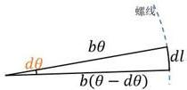

螺线
bθ
dl
b(θ - dθ)
dθ

图1. 较短时间内的行动轨迹

由于 $d\theta$ 极小，因此 $dl$ 可看成线段，构成如图2所示的三角形，对其应用余弦定理可得

$$
d l = \sqrt {(b \theta) ^ {2} + [ b (\theta - d \theta) ] ^ {2} - 2 \cdot | b \theta | \cdot | b (\theta - d \theta) | \cdot \cos d \theta} \tag {4}
$$

化简得到

$$
d l = b \sqrt {1 + \theta^ {2}} d \theta \tag {5}
$$

假设把手从第 $t_{1}$ 秒运动到第 $t_{2}$ 秒，得到运动距离l为

$$
l = \int_ {\theta_ {2}} ^ {\theta_ {1}} d l = b \int_ {\theta_ {2}} ^ {\theta_ {1}} \sqrt {1 + \theta^ {2}} d \theta \tag {6}
$$

其中 $\theta_{1}$ 对应把手在 $t_{1}$ 时的角度， $\theta_{2}$ 对应把手在 $t_{2}$ 时的角度。

对 $\theta$ 进行积分得到

$$
l = \frac {b}{2} \left[ \theta \cdot \sqrt {1 + \theta^ {2}} + l n \left(\sqrt {1 + \theta^ {2}} + \theta\right) \right] \Bigg | _ {\theta_ {2}} ^ {\theta_ {1}} \tag {7}
$$

同时由于龙头前把手的行进速度为 v = 1 m/s，可以建立等式

$$
l = v \left(t _ {2} - t _ {1}\right) \tag {8}
$$

结合（7）式和（8）式，在已知 $t_1$ 时刻下的极角的情况下，我们可以通过逐步逼近的方法求得在 $t_2$ 时刻下的极角。

令 $F(\theta) = \frac{b}{2} [\theta \cdot \sqrt{1 + \theta^2} + ln(\sqrt{1 + \theta^2} + \theta)]$ ，则有

$$
F \left(\theta_ {2}\right) = F \left(\theta_ {1}\right) - v \left(t _ {2} - t _ {1}\right) \tag {9}
$$

接下来我们需要通过 $F(\theta_{2})$ 求出 $\theta_{2}$ 的值。

# 逐步逼近求解

这里我们采用逐步逼近的方法来求解 $\theta_{2}$ ，步骤如下：

先将 $\theta_{2}$ 的初始值设定为 $\theta_{1}$ ，并设定步长 $\lambda$ 和最小步长 $\lambda_{min}$ ，进行多次循环， $\theta_{2}$ 每次循环减去一个步长，如果此时 $F(\theta_{2})$ 小于 $F(\theta_{1}) - v(t_{2} - t_{1})$ ，说明步长过大，则撤回上一步操作（将 $\theta_{2}$ 加上一个步长），并将步长除以 2，缩小步长以更精确地逼近实际值。若步长小于设定的最小步长，说明误差小于最小步长的 2 倍， $\theta_{2}$ 足够接近实际值，则结束循环。

以伪代码的形式呈现如下：

逼近求解 $\theta_{2}$ 伪代码 $\theta_{2} \leftarrow \theta_{1}, \lambda \leftarrow \lambda_{0}, \lambda_{min} = 10^{-10}$ while $\lambda \geq \lambda_{min}$ $\theta_{2} \leftarrow \theta_{2} - \lambda$ if $F(\theta_{2}) < F(\theta_{1}) - v(t_{2} - t_{1})$ $\theta_{2} \leftarrow \theta_{2} + \lambda$ $\lambda \leftarrow \lambda / 2$ end  
end

# 得出结果

根据以上过程，我们可以得到各个时刻的龙头前把手的位置。

# 5.1.4 求解某一时刻各节把手的位置

盘龙时，龙头位于前方带动龙身和龙尾运动。由于所有把手中心均位于螺线之上，所以龙头后的每节板凳也必须依次排列在龙头后的螺线轨迹上。由题意得，每块板凳的把手中心到前一块板凳把手中心的距离是固定的，因此只需要从第一块板凳开始沿着螺线依次向后逐个递推，就能得到每块板凳的具体位置。

# 列出距离方程

在极坐标下，每一节把手的坐标可表示为 $\left(\theta_{i,t},r_{i,t}\right)$ ，相应地，可以得到转化后的直角坐标为 $\left(r_{i,t}\cos\theta_{i,t},r_{i,t}\sin\theta_{i,t}\right)$ ，其中 $\theta_{i,t}$ 表示为第i节把手在第t秒的极角， $r_{i,t}$ 表示为第i节把手在第t秒离原点的距离。

已知龙头板凳长 $341\mathrm{cm}$ ，龙身和龙尾板凳长 $220~\mathrm{cm}$ ，孔的中心离最近的板头距离为 $27.5\mathrm{cm}$ 。设 $d_{i}$ 是第 $i$ 节把手到第 $i + 1$ 节把手的距离（单位为 $\mathrm{cm}$ ）， $i$ 的范围为1到223，具体表示为

$$
d _ {i} = \left\{ \begin{array}{l l} 3 4 1 - 2 7. 5 \times 2 = 2 8 6 & i = 1 \\ 2 2 0 - 2 7. 5 \times 2 = 1 6 5 & i \neq 1 \end{array} \right. \tag {10}
$$

因此需要满足的距离等式为

$$
\left(r _ {i + 1, t} \cdot \cos \theta_ {i + 1, t} - r _ {i, t} \cdot \cos \theta_ {i, t}\right) ^ {2} + \left(r _ {i + 1, t} \cdot \sin \theta_ {i + 1, t} - r _ {i, t} \cdot \sin \theta_ {i, t}\right) ^ {2} = d _ {i} ^ {2} \tag {11}
$$

将（2）式代入（11）式中得到

$$
\theta_ {i + 1, t} ^ {2} + \theta_ {i, t} ^ {2} - 2 \cdot \theta_ {i + 1, t} \cdot \theta_ {i, t} \cdot \cos (\theta_ {i + 1, t} - \theta_ {i, t}) = \frac {d _ {i} ^ {2}}{b ^ {2}} \tag {12}
$$

# 确定具体位置

由于可能有多组 $\theta_{i+1,t}$ 的解满足距离方程，为了确定下一节把手的具体位置，我们先用示意图分析解的分布情况，如图：

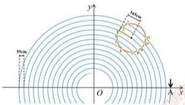

55cm
160cm
O
A x
y

图2. 把手可能位置示意图

在如图所示情况下，满足与某点距离为 $d_{i}$ 的点有多个。每块板凳依次排列在龙头板凳之后，因此应当满足 $\theta_{i+1,t} > \theta_{i,t}$ 。

设距离方程（12）中 $\theta_{i + 1,t}$ 的解集为 $C$ ，即

$$
C = \left\{\theta \mid \theta^ {2} + \theta_ {i, t} ^ {2} - 2 \cdot \theta \cdot \theta_ {i, t} \cdot \cos (\theta - \theta_ {i, t}) = \frac {d _ {i} ^ {2}}{b ^ {2}} \right\} \tag {13}
$$

同时由于相邻把手之间只需要转过一个小角度，因此应当在所有大于 $\theta_{i,t}$ 的 $\theta_{i + 1,t}$ 值中选取最小值，即

$$
\theta_ {i + 1, t} = \min \left\{\theta \in C \mid \theta > \theta_ {i, t} \right\} \tag {14}
$$

这样，我们就确定了下一节把手的具体位置。

# 逐步逼近求解

这里我们采用逐步逼近的方法来求解 $\theta_{i+1,t}$ ，步骤如下：

先将 $\theta_{i+1,t}$ 的初始值设定为 $\theta_{i,t}$ ，并设定步长 $\lambda$ 和最小步长 $\lambda_{min}$ ，进行多次循环， $\theta_{i+1,t}$ 每次循环加上一个步长，如果此时两把手间距大于板长，说明步长过大，则撤回上一步操作（将 $\theta_{i+1,t}$ 减去一个步长），并将步长除以 2，缩小步长以更精确地逼近实际值。若步长小于设定的最小步长，说明误差小于最小步长的 2 倍， $\theta_{i+1,t}$ 足够接近实际值，则结束循环。

以伪代码的形式呈现如下：

<table><tr><td>逼近求解  ${\theta }_{i + 1,t}$  伪代码</td></tr><tr><td> ${\theta }_{i + 1,t} \leftarrow  {\theta }_{i,t},{\lambda } \leftarrow  {\lambda }_{0},{\lambda }_{min} = {10}^{-{10}}$  while  $\lambda  \geq  {\lambda }_{min}$   ${\theta }_{i + 1,t} \leftarrow  {\theta }_{i + 1,t} + \lambda$  if  ${\theta }_{i + 1,t}{}^{2} + {\theta }_{i,t}{}^{2} - 2 \cdot  {\theta }_{i + 1,t} \cdot  {\theta }_{i,t} \cdot  \cos \left( {{\theta }_{i + 1,t} - {\theta }_{i,t}}\right)  > \frac{{d}_{i}^{2}}{{b}^{2}}$   ${\theta }_{i + 1,t} \leftarrow  {\theta }_{i + 1,t} - \lambda$   $\lambda  \leftarrow  \lambda /2$  end end</td></tr></table>

# > 得出结果

最终得到在第 t 秒时刻下所有把手的极角，确定了极角，则其位置也唯一确定。

# 5.1.5 把手位置结果呈现

结合以上求解步骤，将各个时刻的龙头前把手的位置逐一往后推，得到所有把手在各个时刻的位置，存入文件 result1.xlsx 中。

按照题目要求，列出部分结果如下：

表1. 问题一把手的位置

<table><tr><td></td><td>0 s</td><td>60 s</td><td>120 s</td><td>180 s</td><td>240 s</td><td>300 s</td></tr><tr><td>龙头 x</td><td>8.8</td><td>5.799209</td><td>-4.084887</td><td>-2.963609</td><td>2.594494</td><td>4.420274</td></tr><tr><td>龙头 y</td><td>0</td><td>-5.771092</td><td>-6.304479</td><td>6.09478</td><td>-5.356743</td><td>2.320429</td></tr><tr><td>第 1 节龙身 x</td><td>8.363824</td><td>7.456758</td><td>-1.445473</td><td>-5.237118</td><td>4.821221</td><td>2.459489</td></tr><tr><td>第 1 节龙身 y</td><td>2.826544</td><td>-3.440399</td><td>-7.405883</td><td>4.359627</td><td>-3.561949</td><td>4.402476</td></tr><tr><td>第 51 节龙身 x</td><td>-9.518732</td><td>-8.686317</td><td>-5.543149</td><td>2.890455</td><td>5.980011</td><td>-6.301346</td></tr><tr><td>第 51 节龙身 y</td><td>1.341137</td><td>2.540108</td><td>6.377946</td><td>7.249289</td><td>-3.827758</td><td>0.465829</td></tr><tr><td>第 101 节龙身 x</td><td>2.913983</td><td>5.687115</td><td>5.361939</td><td>1.898794</td><td>-4.917371</td><td>-6.237722</td></tr><tr><td>第 101 节龙身 y</td><td>-9.918311</td><td>-8.001384</td><td>-7.557638</td><td>-8.471614</td><td>-6.379874</td><td>3.936008</td></tr><tr><td>第 151 节龙身 x</td><td>10.861726</td><td>6.682312</td><td>2.388757</td><td>1.005154</td><td>2.965378</td><td>7.04074</td></tr><tr><td>第 151 节龙身 y</td><td>1.828753</td><td>8.134544</td><td>9.727411</td><td>9.424751</td><td>8.399721</td><td>4.393013</td></tr><tr><td>第 201 节龙身 x</td><td>4.555102</td><td>-6.619663</td><td>-10.627211</td><td>-9.28772</td><td>-7.457151</td><td>-7.458662</td></tr><tr><td>第 201 节龙身 y</td><td>10.725118</td><td>9.02557</td><td>1.359847</td><td>-4.246673</td><td>-6.180726</td><td>-5.263384</td></tr><tr><td>龙尾(后) x</td><td>-5.305444</td><td>7.364557</td><td>10.974348</td><td>7.383896</td><td>3.241051</td><td>1.785033</td></tr><tr><td>龙尾(后) y</td><td>-10.676584</td><td>-8.797992</td><td>0.843473</td><td>7.49237</td><td>9.469336</td><td>9.301164</td></tr></table>

表格中的位置坐标相对于螺线中心，单位是 m。

# 5.1.6 速度的计算

接下来计算把手的速度，在此我们认为是计算各把手沿螺线的切线速度。

由于同一块板凳上沿板凳方向的速度大小相等，因此对于每节把手，我们都可以根据前一把手的速度求解得到该把手的速度，每节把手的速度方向均为沿螺线的切线方向，基于此我们建立模型求解把手速度。

# 定义参数

设在极坐标下，每一节把手的坐标表示为 $\left(\theta_{i,t}, b\theta_{i,t}\right)$ ，相应地，转化为直角坐标即为 $\left(b\theta_{i,t} \cos \theta_{i,t}, b\theta_{i,t} \sin \theta_{i,t}\right)$ ，其中 $\theta_{i,t}$ 表示为第 $i$ 节把手在第 $t$ 秒的极角。

对于第 $i$ 节和第 $i + 1$ 节把手，画出示意图便于理解计算：

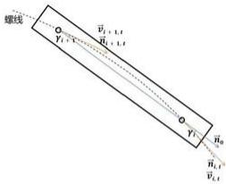

螺线
v̇₁, t
v̇₂, t
v̇₁, t
v̇₂, t
v̇₁, t
v̇₂, t
v̇₁, t

图3.相邻把手情况分析图

由图可知，我们已知前一节把手的速度 $\vec{v}_{i,t}$ ，该方向向量为 $\vec{n}_{i,t}$ ，沿板凳的方向向量为 $\vec{n}_{0}$ ， $\vec{n}_{i,t}$ 和 $\vec{n}_{0}$ 的夹角为 $\gamma_{i}$ 。

目标是求得后一节把手的速度 $\vec{v}_{i+1,t}$ ，令该方向向量为 $\vec{n}_{i+1,t}$ ， $\vec{n}_{i+1,t}$ 和 $\vec{n}_{0}$ 的夹角为 $\gamma_{i+1}$ 。

# 速度计算

令前一节把手的位置为 $P_{i,t} = (x_{i,t},y_{i,t})$ ，后一节把手的位置为 $P_{i + 1,t} = (x_{i + 1,t},y_{i + 1,t})$ ，根据前面计算位置的过程，我们可求得同一块板凳上的两节把手位置，因此可以知道：

$$
\vec {n} _ {0} = \left(x _ {i, t} - x _ {i + 1, t}, y _ {i, t} - y _ {i + 1, t}\right) \tag {15}
$$

为了找到螺线在某一点的切线方向，我们需要计算该点处位置向量对极角 $\theta$ 的导数，同时为了化简计算，将右边除以 b，得到：

$$
\vec {n} _ {i, t} = \frac {1}{b} \left(\frac {d x}{d \theta}, \frac {d y}{d \theta}\right) \tag {16}
$$

解得

$$
\vec {n} _ {i, t} = \left(\cos \theta_ {i, t} - \theta_ {i, t} \cdot \sin \theta_ {i, t}, \sin \theta_ {i, t} + \theta_ {i, t} \cdot \cos \theta_ {i, t}\right) \tag {17}
$$

结合（15）式和（17）式，采用余弦定理可计算出夹角 $\gamma_{i}$ 的余弦值：

$$
\cos r _ {i} = \frac {\vec {n} _ {0} \cdot \vec {n} _ {i , t}}{| \vec {n} _ {0} | | \vec {n} _ {i , t} |} \tag {18}
$$

同理可计算出夹角 $\gamma_{i + 1}$ 的余弦值，根据同一块板凳上沿板凳方向的速度大小相等这

一条件列出关系式：

$$
\left| \vec {v} _ {i, t} \right| \cos r _ {i} = \left| \vec {v} _ {i + 1, t} \right| \cos r _ {i + 1} \tag {19}
$$

由此可解得后一节把手的速度 $\vec{v}_{i+1,t}$ 的大小，方向为该位置沿螺线的切线方向。

# 5.1.7 把手速度结果呈现

根据以上过程，我们可以根据龙头前把手的行进速度逐一往后推，得到所有把手的速度，存入文件 result1.xlsx 中。

按照题目要求，列出部分结果如下：

表2. 问题一把手的速度

<table><tr><td></td><td>0 s</td><td>60 s</td><td>120 s</td><td>180 s</td><td>240 s</td><td>300 s</td></tr><tr><td>龙头 (m/s)</td><td>1</td><td>1</td><td>1</td><td>1</td><td>1</td><td>1</td></tr><tr><td>第 1 节龙身 (m/s)</td><td>0.999971</td><td>0.999961</td><td>0.999945</td><td>0.999917</td><td>0.999859</td><td>0.999709</td></tr><tr><td>第 51 节龙身 (m/s)</td><td>0.999742</td><td>0.999662</td><td>0.999538</td><td>0.999331</td><td>0.998941</td><td>0.998065</td></tr><tr><td>第 101 节龙身 (m/s)</td><td>0.999575</td><td>0.999453</td><td>0.999269</td><td>0.998971</td><td>0.998435</td><td>0.997302</td></tr><tr><td>第 151 节龙身 (m/s)</td><td>0.999448</td><td>0.999299</td><td>0.999078</td><td>0.998727</td><td>0.998115</td><td>0.996861</td></tr><tr><td>第 201 节龙身 (m/s)</td><td>0.999348</td><td>0.99918</td><td>0.998935</td><td>0.998551</td><td>0.997894</td><td>0.996574</td></tr><tr><td>龙尾(后)(m/s)</td><td>0.999311</td><td>0.999136</td><td>0.998883</td><td>0.998489</td><td>0.997816</td><td>0.996478</td></tr></table>

可以发现龙头前把手的行进速度始终保持不变，后面把手的速度依次减小。

# 5.2 问题二模型的建立与求解

# 5.2.1 建模思路

为了确保板凳之间不发生碰撞，就要使容易发生碰撞的点不落在其他板凳的范围内。首先借助坐标和向量得到如果目标点落在板凳内的情况，建立判断碰撞的模型。接着对所有板凳进行具体分析并考虑特殊情况，得到满足条件下的舞龙队终止时刻。最后用问题一建立的模型方法推出该时刻所有把手的位置与速度。

# 5.2.2 碰撞检测

通过确定每一块板凳的区域以及目标点的选取，建立碰撞检测模型。

# 确定范围

首先我们对每一节板凳的四个顶点进行坐标化，确定每块板凳的范围。如示意图所示：

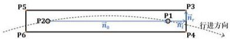

P5
P2○
n̅₀
P1
n̅ᵣ
P3
P6
P4
行进方向

图4. 对板凳的具体分析图

我们令沿板凳的方向向量为 $\vec{n}_0$ ，两节把手的位置向量分别为 $P_{1}$ 和 $P_{2}$ ，四个顶点的位置向量分别为 $P_{3}, P_{4}, P_{5}$ 和 $P_{6}$ 。

由图可知，

$$
\vec {n} _ {0} = P _ {1} - P _ {2} \tag {20}
$$

我们将方向向量 $\vec{n}_{0}$ 单位化，得到：

$$
\vec {n} _ {0} = \frac {\vec {n} _ {0}}{\| \vec {n} _ {0} \|} \tag {21}
$$

根据题意可知，孔的中心离最近的板头距离为 27.5 cm，每块板凳的宽度为 30 cm，因此可以得到 $\vec{n}_{l}$ 和 $\vec{n}_{r}$ 为：

$$
\left\{ \begin{array}{l} \vec {n} _ {l} = 2 7. 5 \cdot \vec {n} _ {0} \\ \vec {n} _ {r} = 1 5 \cdot \vec {n} _ {0} \cdot T \end{array} \right. \tag {22}
$$

其中 $T=\begin{bmatrix}0&1\\-1&0\end{bmatrix}$ ，表示对单位向量 $\vec{n}_{0}$ 逆时针旋转90°。

由于 $P_{1}$ 和 $P_{2}$ 的值可通过问题一的方法求得，在此基础上，可以得到 $P_{3}, P_{4}, P_{5}$ 和 $P_{6}$ 的值为：

$$
\left\{ \begin{array}{l} P _ {3} = P _ {1} + \vec {n} _ {l} + \vec {n} _ {r} \\ P _ {4} = P _ {1} + \vec {n} _ {l} - \vec {n} _ {r} \\ P _ {5} = P _ {2} - \vec {n} _ {l} + \vec {n} _ {r} \\ P _ {6} = P _ {2} - \vec {n} _ {l} - \vec {n} _ {r} \end{array} \right. \tag {23}
$$

# 确定目标点

在板凳龙顺时针向内盘入的过程中，由于龙身和龙尾板凳的长度相等，因此从第3块板凳到第223块板凳都是在重复上一块板凳的行动轨迹，即前一块板凳所经历的运动状态为后一块板凳即将进行的运动状态。

若其中某一板凳与其外围的板凳发生碰撞，则说明其前一块板凳曾与外围的板凳发生碰撞，以此类推，最先开始发生碰撞的必然是龙头板凳或者第2块板凳。如图为龙头板凳碰撞的其中一种情况：

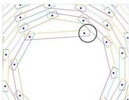

Abstract geometric pattern with concentric octagons and scattered dots, no text or symbols present

图5.碰撞示例

经过分析可以发现，最容易发生碰撞的是龙头板凳的两个顶点和第2块板凳的其中一个顶点，如下图所示：

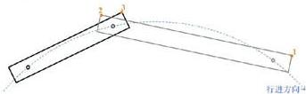

2
3
1
行进方向4

图6. 易发生碰撞的点

图像中的点1、2、3为目标点P，我们需要判断目标点P何时开始落入到外围的板凳的范围内。

# 判断是否碰撞

为了判断目标点P是否落入周围板凳的范围内，我们采用投影长度判定的方法，如以下示意图所示：

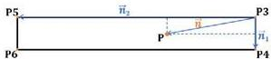

P5
n̅₂
P
n̅
P3
n̅₁
P6
P4

图7. 向量分析图

我们记向量 $\vec{n}_{1}$ 为位置向量 $P_{3}$ 指向 $P_{4}$ ，向量 $\vec{n}_{2}$ 为位置向量 $P_{3}$ 指向 $P_{5}$ ，向量 $\vec{n}$ 为位置向量 $P_{3}$ 指向 P，即：

$$
\left\{ \begin{array}{l} \vec {n} _ {1} = P _ {4} - P _ {3} \\ \vec {n} _ {2} = P _ {5} - P _ {3} \\ \vec {n} = P - P _ {3} \end{array} \right. \tag {24}
$$

首先我们计算出向量 $\vec{n}$ 在 $\vec{n}_1$ 和 $\vec{n}_2$ 方向上的投影长度 $k_{1}$ 和 $k_{2}$ 。

$$
\left\{ \begin{array}{l} k _ {1} = \frac {\vec {n} \cdot \vec {n} _ {1}}{| \vec {n} _ {1} |} \\ k _ {2} = \frac {\vec {n} \cdot \vec {n} _ {2}}{| \vec {n} _ {2} |} \end{array} \right. \tag {25}
$$

接着我们比较投影长度与板凳长宽的大小，我们令 $\lambda_{1}$ 为 $k_{1}$ 与板凳短边的比值， $\lambda_{2}$ 为 $k_{2}$ 与板凳长边的比值。

$$
\left\{ \begin{array}{l} \lambda_ {1} = \frac {k _ {1}}{| \vec {n} _ {1} |} \\ \lambda_ {2} = \frac {k _ {2}}{| \vec {n} _ {2} |} \end{array} \right. \tag {26}
$$

若 $\lambda_{1}$ 和 $\lambda_{2}$ 两者的值均位于0到1之间，则我们认为目标点P与周围板凳发生了碰撞。

# 5.2.3 求解过程

# 分析

我们对问题二的求解过程进行严谨的分析以确保该模型能够精准计算舞龙队的终止时刻。

# 1. 需要计算的板凳数量

由于不清楚三个顶点与板凳发生碰撞的位置与时刻，我们选择计算第3块到第223块板凳的范围区域以确保涵盖所有可能发生的情况。

# 2. 特殊情况

我们考虑可能出现的特殊情况，即点1、2、3均不满足发生碰撞的条件，但此刻却发生了碰撞，如下图所示：

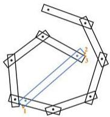

Geometric diagram of a polygon with internal lines and labeled points (no text or symbols)

图8.可能出现的特殊碰撞情况

但是由于我们按照时间遍历，找到开始碰撞的时刻立刻停止，在目标点P超出板凳

的范围之前必然已经发生碰撞并终止时间，因此我们不需要考虑这一特殊情况。

# 具体过程

需要计算整个过程中所有把手不发生碰撞的终止时刻，按以下步骤进行：

# Step1：确定初始时间步长

从第 0 秒开始往后推，将 1 秒设为初始步长。

# Step2：判断是否满足碰撞条件

根据问题一求解位置的思路从第0秒开始求解每秒的各节把手的位置，计算得到第3块到第223块板凳的范围区域，进而判断龙头和第2块板凳的三个顶点是否落在第3块到第223块板凳的范围间。

# Step3: 循环迭代

若不满足碰撞条件，则以当前步长增加时间，继续进行步骤2。

若满足碰撞条件，则时间退回至上一次循环，并缩短时间步长为原来的 $\frac{1}{100}$ 或 $\frac{1}{10}$ ，继续循环判断。

# Step4: 终止

当得到 7 位小数时终止循环，四舍五入保留 6 位小数，得到最终的终止时刻。

# 得出结果

根据以上过程，可以得到舞龙队发生碰撞前的时刻，即终止时刻为412.473838s。

# 5.2.4 终止时刻的位置和速度

# 位置

结合问题一的思路，我们可以根据从0秒到终止时刻的龙头前把手的位置逐一往后推，得到所有把手在终止时刻的位置，存入文件result2.xlsx中。

按照题目要求，列出以下部分结果：

表3. 终止时刻部分把手位置

<table><tr><td></td><td>横坐标 x (m)</td><td>纵坐标 y (m)</td></tr><tr><td>龙头</td><td>1.209931</td><td>1.942784</td></tr><tr><td>第 1 节龙身</td><td>-1.643791</td><td>1.753399</td></tr><tr><td>第 51 节龙身</td><td>1.281201</td><td>4.326588</td></tr><tr><td>第 101 节龙身</td><td>-0.536247</td><td>-5.880138</td></tr><tr><td>第 151 节龙身</td><td>0.96884</td><td>-6.957479</td></tr><tr><td>第 201 节龙身</td><td>-7.893161</td><td>-1.230763</td></tr><tr><td>龙尾(后)</td><td>0.956217</td><td>8.322736</td></tr></table>

# 速度

同样按照问题一的思路，我们可以根据龙头前把手的行进速度逐一往后推，得到所有把手的在终止时刻的速度，存入文件 result2.xlsx 中。

按照题目要求，列出部分结果：

表4. 终止时刻部分把手速度

<table><tr><td></td><td>速度 (m/s)</td></tr><tr><td>龙头</td><td>1</td></tr><tr><td>第 1 节龙身</td><td>0.991551</td></tr><tr><td>第 51 节龙身</td><td>0.976858</td></tr><tr><td>第 101 节龙身</td><td>0.97455</td></tr><tr><td>第 151 节龙身</td><td>0.973608</td></tr><tr><td>第 201 节龙身</td><td>0.973096</td></tr><tr><td>龙尾(后)</td><td>0.972938</td></tr></table>

# 5.3 问题三模型的建立与求解

# 5.3.1 建模思路

首先结合问题二的计算结果和题目信息，设定螺距的上限。结合直径9 m的调头区域和螺距计算不同螺距下到达边界的时刻。接着设定初始步长，按步长逐步减小螺距并判断在整个过程中是否发生碰撞，若发生碰撞则退回上一步，通过减小步长并再次循环，逐步逼近最小螺距。

# 5.3.2 建立模型

根据题目信息，我们可以作出龙头板凳到达边界的示意图：

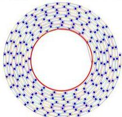

<details>
<summary>chemical</summary>

Molecular structure diagram showing a ring with blue atoms and red bonds, likely representing a molecular packing or conformational model.
</details>

图9.到达调头边界示意图

要确定在过程中板凳不发生碰撞的前提下，龙头前把手沿螺线盘入调头空间的最小螺距。首先确定初始螺距，接着逐步减小螺距并分析。

# 起始螺距

我们计算出螺距为 55 cm 时舞龙队达到终止时刻时龙头前把手的极径 $r_{1,t}$ 大小为 2.288743 m，该值小于调头空间的半径 4.5 m，说明螺距为 55 cm 时，该舞龙队能够盘入到设定的调头空间范围内，在该范围外未发生过碰撞。

为确定最小螺距，我们设定螺距的上限为 55 cm，从该值开始减小，直到找到符合条件的最小螺距终止寻找。

# 搜寻最小螺距

为了搜寻到最小螺距，我们进行以下步骤：

# Step1：确定初始螺距和初始步长

由上述分析，我们将 55 cm 作为初始螺距值，并选取 0.01 m 作为初始步长。

# Step2：判断是否发生碰撞

对于每次判断，首先确定龙头板凳到达调头空间边界的时刻，从 $t = 0$ 到该时刻，借助问题二建立的模型，计算第3块板凳到第223块板凳的范围，判断整个过程中龙头与第2块板凳是否与其他板凳发生碰撞。

# Step3: 循环迭代

如果未发生碰撞，则按当前的步长减小螺距并再次进行判断；

如果发生碰撞，则将上一次未发生碰撞的螺距长度作为初始值，并减小步长为原来的 $\frac{1}{10}$ ，继续进行循环判断。

# Step4: 终止

将步长为 $10^{-6}$ 作为循环的终止条件，最终得到一个较为精确的最小螺距值。

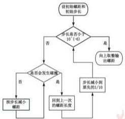

```mermaid
graph TD
    A["设初始螺距和初始步长"] --> B{是否是否小于10^(-6)}
    B -->|否| C["返回上一次的螺距长度"]
    B -->|是| D["向上取整输出螺距"]
    C --> E{是否会发生螺距}
    E -->|否| F["按步长减小螺距"]
    E -->|是| G["步长减小到原先的1/10"]
    G --> C
```

图10.搜寻最小螺距流程图

# 5.3.3 模型求解

根据以上过程，可以得到每轮循环的步长以及对应的最小螺距：

表5. 逐步逼近最小螺距

<table><tr><td>步长(m)</td><td>螺距(m)</td></tr><tr><td>0.01</td><td>0.46</td></tr><tr><td>0.001</td><td>0.451</td></tr><tr><td>0.0001</td><td>0.4504</td></tr><tr><td>0.00001</td><td>0.45034</td></tr><tr><td>0.000001</td><td>0.450338</td></tr></table>

根据表格结果，我们保留了6位小数以确保结果的精确性，得到了盘入调头空间的最小螺距为0.450338 m。

# 5.4 问题四模型的建立与求解

# 5.4.1 建模思路

根据题意可以绘制出舞龙队盘入和盘出调头空间的大致路径：

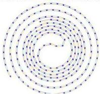

Concentric circular pattern composed of evenly spaced dots and lines, no text or symbols present

图11.盘入和盘出的大致路径

对于第一小问，首先利用相切和比例条件对调头区域内的圆弧进行几何分析，发现比例关系不影响调头路线的总长度，因此我们根据前后圆弧2:1的关系求解各个把手的位置和速度。对于第二小问，首先确定圆弧关键点的位置，将整个调头过程分为四种情况，然后结合-100s到100s的时间段，构建多个矩阵分析所有把手所有可能情况。结合问题一模型、几何分析和逐步逼近法求解所有把手每秒的位置，再通过调整问题一的模型求解每秒的速度。

# 5.4.2 分析调头区域

根据题目要求，大致绘制出舞龙队在调头空间内的行动轨迹图如下：

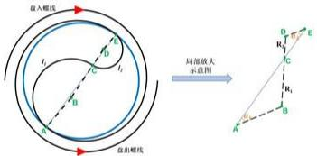

直入螺线
i₁
B
C
i₂
B
直出螺线
局部放大
示意图

图12. 调头区域圆弧分析图

我们令前一段圆弧半径为 $R_{1}$ ，其与调头空间的直径之间的夹角为 $\alpha_{1}$ ，圆弧长度为 $l_{1}$ ；后一段圆弧半径为 $R_{2}$ ，其与调头空间的直径之间的夹角为 $\alpha_{2}$ ，圆弧长度为 $l_{2}$ 。

分析题目可得出以下四个结论：

1. 由于两段圆弧与盘入、盘出螺线均相切，因此线段 AB 和 DE 垂直于切线方向，大小比例关系为 2:1;  
2. 由于两段圆弧互相之间相切，即线段 BC 和线段 CD 共线；  
3. 由于盘出螺线与盘入螺线关于螺线中心呈中心对称，因此线段AE为圆的直径；  
4. 由于线段 AB 平行于 DE，因此 $\alpha_{1} = \alpha_{2}$ 。

然后我们根据以下步骤求解问题：

# Step1：计算圆弧长度

通过计算，得到前后两段圆弧长度为：

$$
\left\{ \begin{array}{l} l _ {1} = R _ {1} (\pi - 2 \alpha_ {1}) \\ l _ {2} = R _ {2} (\pi - 2 \alpha_ {2}) \end{array} \right. \tag {27}
$$

# Step2: 构建等式

通过延长线段 AB 至点 F，使线段 BF 长度与 DE 相等，连接 EF 得到：

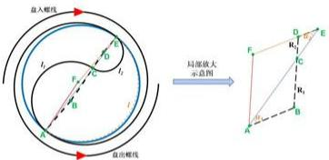

盘入螺线
i₁
D
E
C
i₂
B
A
盘出螺线
局部放大示意图
F
D
E
C
R₁
R₂
A
B

图13.辅助线分析示意图

由上述条件可知，

$$
B F = D E, B F \parallel D E \tag {28}
$$

因此四边形 BDEF 为平行四边形，得到

$$
B D = E F, B D \parallel E F \tag {29}
$$

结合以上过程得到

$$
\left\{ \begin{array}{c} A F = A B + B F = A B + D E \\ E F = B D = B C + D C \end{array} \right. \tag {30}
$$

可以发现线段 AF 与 EF 相等且位置唯一确定，其构成的圆弧长度 l 为：

$$
l = (R _ {1} + R _ {2}) (\pi - 2 \alpha_ {1}) \tag {31}
$$

可以发现

$$
l = l _ {1} + l _ {2} \tag {32}
$$

# Step3: 得出结论

两段圆弧的总长度是固定，即调头曲线长度固定不变。

# 5.4.3 计算位置和速度

为计算得到各个把手的位置和速度，我们进行以下步骤：

# 确定关键位置

首先我们先确定五个坐标位置，如图所示：

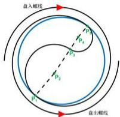

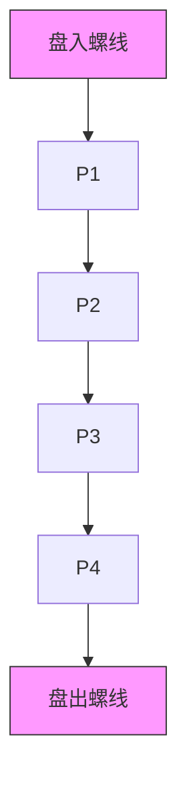

图14. 关键点位置示意图

# 1. 确定位置 $P_{1}$ 和 $P_{5}$

我们令盘入螺线的极坐标方程为 $r_{h}=b_{h}\theta$ ，其中 $b_{h}=\frac{1.7}{2\pi}$ ，其上任意一点的直角坐标为 $(b_{h}\theta\cos\theta, b_{h}\theta\sin\theta)$ ；圆的极坐标方程为 $r_{y}=R_{y}$ ，其中 $R_{y}=4.5$ ，其上任意一点的直角坐标为 $(R_{y}\cos\theta, R_{y}\sin\theta)$ 。

我们将二者联立，得到 $\theta = \frac{R_y}{b_h}$ ，计算出螺线与调头空间相切的位置 $P_{1}$ 和 $P_{5}$ 。

# 2. 确定位置 $P_{3}$

由于前一段圆弧的半径是后一段的2倍，因此线段AC是CE的2倍，可以得到两段圆弧相切的位置 $P_{3}$ 为：

$$
P _ {3} = \frac {1}{3} P _ {1} + \frac {2}{3} P _ {5} \tag {33}
$$

# 3. 确定位置 $P_{2}$

我们根据 $P_{1}$ 的位置，可以求得该点的方向向量 $\vec{n}_{1}$ ，接着求出该点处的法向量 $\vec{m}_{1}$

$$
\overrightarrow {m} _ {1} = \overrightarrow {n} _ {1} \cdot \left[ \begin{array}{l l} 0 & 1 \\ - 1 & 0 \end{array} \right] \tag {34}
$$

接着可以得出该法向量与 x 轴的夹角，同样求得向量 $P_{3}-P_{1}$ 与 x 轴的夹角，两者相减可以得到 $\alpha_{1}$ 的大小。

求出向量 $P_{3} - P_{1}$ 的模长，对其应用余弦定理可以求得前一段圆弧的半径长度，结合 $P_{1}$ 的位置得出前一段圆弧圆心的位置 $P_{2}$ 。

# 4. 确定位置 $P_{4}$

接着由于线段 BC 是 CD 的 2 倍，可以得到后一段圆弧圆心的位置 $P_{4}$ 为：

$$
P _ {4} = \frac {3}{2} P _ {3} - \frac {1}{2} P _ {2} \tag {35}
$$

# > 划分区域

接着我们令盘入螺线为第一区域，以此类推，盘出螺线为第四区域，如图所示：

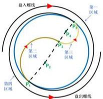

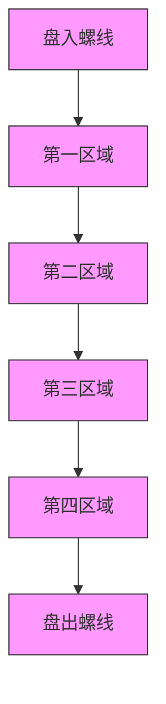

图15.区域划分图

# > 划分时间段

我们将时间段分为两部分考虑：

# 1. -100s\~0s

由于以调头开始时刻为零时刻，因此从-100s至0s这些时间段内所有把手均在盘入螺线上（我们认为盘入螺线与圆弧的交点处也为第一区域），因此我们可以将此过程看成在盘入螺线上盘出的过程。

# 1. 对于某一时刻各个把手的位置：

我们需要考虑的下一个把手位置的 $\theta_{i+1,t}$ 应当是比当前把手位置的 $\theta_{i,t}$ 小的所有值中的最大值，其余过程按照问题一的建模思路进行求解。

# 2. 对于各个时刻龙头前把手的位置：

虽然极角 $\theta_{1,t}$ 的值在不断增大，但是由于时间为负值，因此可以根据问题一的过程求解。

# 3. 对于各个时刻速度的求解：

首先求出龙头前把手位置处的方向向量，由于方向的正负不影响与板凳之间夹角的余弦值的大小，仅影响正负，因此根据问题一求解速度的过程可得出结果。

# 2. 0s\~100s

首先构造出三个大小为 $224 \times 101$ 的矩阵，分别存放区域、夹角和位置。

# 1. 初始化

首先我们构建出一个 $224 \times 101$ 的区域矩阵，在第 0 秒时，所有把手均在盘入螺线上，因此矩阵的第一列全为 1。

为计算出各个时刻龙头前把手的位置，我们绘制如下示意图：

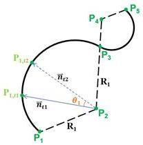

P₁,₂
n̅ₜ₂
θ₁
P₁,₁
n̅ₜ₁
R₁
P₃
P₄
P₅
R₁
P₂

图16. 龙头前把手位置变化示意图

首先我们需要考虑从第0秒到某一刻的运动路程 $S$ 是否大于前半段圆弧长度 $l_{1}$ ，若大于则说明此刻已进入后一段圆弧，同理判断是否进入盘出螺线，将结果存入区域矩阵中。

# 1) 龙头前把手位于前半段圆弧：

计算从 $t_{1}$ 秒到 $t_{2}$ 秒经过的路程 s 为

$$
s = v (t _ {2} - t _ {1}) \tag {36}
$$

根据圆弧计算公式，可以得到夹角值为

$$
\theta_ {1} = \frac {s}{R _ {1}} \tag {37}
$$

因此我们可以根据前一刻的方向向量 $\vec{n}_{t_1}$ 计算出这一刻的方向向量 $\vec{n}_{t_2}$ 为

$$
\vec {n} _ {t _ {2}} = \vec {n} _ {t _ {1}} \cdot \left[ \begin{array}{l l} \cos \theta_ {1} & \sin \theta_ {1} \\ - \sin \theta_ {1} & \cos \theta_ {1} \end{array} \right] \tag {38}
$$

因此根据半径 $R_{1}$ 可以求出龙头前把手此刻的位置 $P_{1,t_2}$ 为

$$
P _ {1, t _ {2}} = P _ {2} + R _ {1} \cdot \frac {\vec {n} _ {t _ {2}}}{\| \vec {n} _ {t _ {2}} \|} \tag {39}
$$

将该位置存入位置矩阵中。接着我们计算该位置与 x 轴的夹角，存入夹角矩阵中。

# 2) 龙头前把手位于后半段圆弧：

思路与上述一致。

# 3) 龙头前把手前一时刻处于区域 2，该时刻处于区域 3:

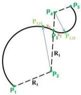

P₁
P₁,₁₁
P₄
S₁
P₃
S₂
P₁,₁₂
R₁
P₂
R₁
P₅

图17. 龙头前把手从区域 2 到 3

如图所示，首先计算出位置 $P_{3}$ 与前一时刻的距离 $s_1$ 为

$$
s _ {1} = l _ {1} - S _ {t _ {1}} \tag {40}
$$

其中 $S_{t_{1}}$ 表示前一时刻龙头前把手所经过的所有距离。

则该时刻在区域3所经过的距离 $s_{2}$ 为

$$
s _ {2} = s - s _ {1} \tag {41}
$$

接着运用上述思路求出该时刻的位置和夹角。

# 4) 龙头前把手位于盘出螺线上：

由于盘出螺线方程不好求，因此我们根据盘入螺线和盘出螺线中心对称这一条件，在盘入螺线上求解位置和角度，再将位置取反得到其在盘出螺线上的位置。

# 2. 遍历其余把手

假设在某一时刻，前一个把手位于第二区域，我们需要计算出该点与盘入螺线和圆弧的交点的长度L，若该长度大于这两个把手之间的距离 $d_{i}$ ，则说明该把手也位于第二区域，反之则位于第一区域。

# 1) 当前把手与前一把手处于同一区域

根据前一个把手的角度，由于两个把手之间的距离 $d_{i}$ 已知，因此可以计算出两个把手位置之间的角度，从而得出当前把手的角度，根据该角度计算出位置。

# 2）当前把手与前一把手处于不同区域

这里我们依旧采用问题一逐步逼近的思想来求解上一把手的位置，步骤如下：

# Step1: 初始化

我们根据前一个把手所在的区域序号 $q$ ，得出关键位置 $P_{2\mathrm{q} - 3}$ ，将后一个把手的角度 $\theta_{i + 1,t}$ 的初始值设为位置 $P_{2\mathrm{q} - 3}$ 处的角度 $\theta_{2\mathrm{q} - 3}$ ，设定步长 $\lambda$ 和最小步长 $\lambda_{min}$ 。

# Step2：迭代更新

进行多次迭代，每次迭代执行以下步骤：

将 $\theta_{i + 1,t}$ 加上一个步长 $\lambda$ ，计算此时两个把手之间的距离 $h$ 。

如果计算得到的长度 $h > d_{i}$ ，说明步长过大，则撤回上一步操作（将 $\theta_{i + 1,t}$ 减去一个步长 $\lambda$ )，并将步长除以2，缩小步长以更精确地逼近实际值。

# Step3: 终止

若步长小于设定的最小步长，说明误差小于最小步长的2倍， $\theta_{i+1,t}$ 足够接近实际值，则终止迭代。

最终我们得到该把手的位置，同时根据龙头前把手计算角度的方法求得该把手的角度。

同理若在某一时刻，前一个把手位于第三区域，则需要计算这一把手与相切位置的距离长度 $L$ ，如果该长度大于这两个把手之间的距离 $d_{i}$ ，则说明该把手也位于第三区域，反之则位于第二区域。若前一个把手位于第四区域，则判断盘出螺线和圆弧的交点位置的距离长度 $L$ 与两个把手之间的距离 $d_{i}$ 大小。

再进行上述过程，由此我们得到了所有把手在101s内的区域、夹角和位置矩阵。

# 位置

前半段时间得出各个位置的极角，后半段时间根据位置矩阵，我们得出了各个时刻每个把手的位置。

# 求解速度

前半段时间各个把手均在螺线上，因此根据问题一求解速度的方法可以得出各个把手的速度；后半段时间存在把手位于圆弧的情况，但是我们仍可以根据同一个板凳上沿板凳方向的速度大小相等这一条件建立关系式。

若两个把手均位于圆弧上，如下图所示：

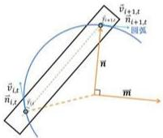

v̂_{i,t}
\vec{n}_{i,t}
v̂_{i+1,t}
\vec{n}_{i+1,t}
圆弧
\vec{v}_{i,t}
\vec{n}_{i,t}
\vec{v}_{i+1,t}
\vec{m}

图18.把手位于圆弧情况分析

由示意图可知，我们已知前一个把手的速度 $\vec{v}_{i,t}$ ，该方向向量为 $\vec{n}_{i,t}$ ，沿板凳的方向向量为 $\vec{n}_{0}$ ， $\vec{n}_{i,t}$ 和 $\vec{n}_{0}$ 的夹角为 $\gamma_{i}$ 。

目标为求得后一个把手的速度 $\vec{v}_{i+1,t}$ ，令该方向向量为 $\vec{n}_{i+1,t}$ ， $\vec{n}_{i+1,t}$ 和 $\vec{n}_{0}$ 的夹角为 $\gamma_{i+1}$ 。

为了找到圆弧在某一点的切线方向，首先先确定该点所处的区域，计算该位置处的方向向量 $\vec{n}$ ，接着求出它的垂直向量 $\vec{m}$

$$
\vec {m} = \vec {n} \cdot \left[ \begin{array}{l l} 0 & 1 \\ - 1 & 0 \end{array} \right] \tag {42}
$$

解得该把手的方向向量为

$$
\vec {n} _ {i, t} = P _ {i, t} + \overrightarrow {m} \tag {43}
$$

接着采用余弦定理计算出夹角 $\gamma_{i}$ 和夹角 $\gamma_{i + 1}$ 的余弦值，根据同一个板凳上沿板凳方向的速度大小相等这一条件列出关系式：

$$
\left| \vec {v} _ {i, t} \right| \cos \gamma_ {i} = \left| \vec {v} _ {i + 1, t} \right| \cos \gamma_ {i + 1} \tag {44}
$$

由此可解得后一个把手的速度 $\vec{v}_{i+1,t}$ 的大小，方向为该位置沿圆弧的切线方向。

若其中一个把手在螺线上，则分别用相应的方法求解速度方向，再构建出等式求出速度。

# 5.4.4 结果呈现

# 位置

根据以上思路，我们可以根据龙头前把手的位置逐一推导，得到所有把手在各个时刻的位置，存入文件 result4.xlsx 中。

根据题目要求，列出部分结果：

表6. 问题四部分把手位置

<table><tr><td></td><td>-100 s</td><td>-50 s</td><td>0 s</td><td>50 s</td><td>100 s</td></tr><tr><td>龙头 x</td><td>7.778034</td><td>6.608301</td><td>-2.711856</td><td>1.332696</td><td>-3.157229</td></tr><tr><td>龙头 y</td><td>3.717164</td><td>1.898865</td><td>-3.591078</td><td>6.175324</td><td>7.548511</td></tr><tr><td>第 1 节龙身 x</td><td>6.209273</td><td>5.366911</td><td>-0.063534</td><td>3.862265</td><td>-0.34689</td></tr><tr><td>第 1 节龙身 y</td><td>6.108521</td><td>4.475403</td><td>-4.670888</td><td>4.840828</td><td>8.079166</td></tr><tr><td>第 51 节龙身 x</td><td>-10.608038</td><td>-3.629945</td><td>2.459962</td><td>-1.671385</td><td>2.095033</td></tr><tr><td>第 51 节龙身 y</td><td>2.831491</td><td>-8.9638</td><td>-7.778145</td><td>-6.076713</td><td>4.033787</td></tr><tr><td>第 101 节龙身 x</td><td>-11.922761</td><td>10.125787</td><td>3.008493</td><td>-7.591816</td><td>-7.288774</td></tr><tr><td>第 101 节龙身 y</td><td>-4.802378</td><td>-5.972247</td><td>10.108539</td><td>5.175487</td><td>2.063875</td></tr><tr><td>第 151 节龙身 x</td><td>-14.351032</td><td>12.974784</td><td>-7.002788</td><td>-4.605165</td><td>9.462513</td></tr><tr><td>第 151 节龙身 y</td><td>-1.980993</td><td>-3.810357</td><td>10.337482</td><td>-10.386988</td><td>-3.540357</td></tr><tr><td>第 201 节龙身 x</td><td>-11.952942</td><td>10.522508</td><td>-6.872842</td><td>0.336952</td><td>8.524374</td></tr></table>

# > 速度

根据以上思路，我们可以根据龙头前把手的行进速度逐一推导，得到所有把手的速度，存入文件 result4.xlsx 中。

根据题目要求，列出部分结果：

表7. 问题四部分把手速度

<table><tr><td></td><td>-100 s</td><td>-50 s</td><td>0 s</td><td>50 s</td><td>100 s</td></tr><tr><td>龙头 (m/s)</td><td>1</td><td>1</td><td>1</td><td>1</td><td>1</td></tr><tr><td>第 1 节龙身 (m/s)</td><td>0.999904</td><td>0.999762</td><td>0.998687</td><td>1.000363</td><td>1.000124</td></tr><tr><td>第 51 节龙身 (m/s)</td><td>0.999346</td><td>0.998642</td><td>0.995134</td><td>0.949935</td><td>1.003966</td></tr><tr><td>第 101 节龙身 (m/s)</td><td>0.999091</td><td>0.998248</td><td>0.994448</td><td>0.948482</td><td>1.096263</td></tr><tr><td>第 151 节龙身 (m/s)</td><td>0.998944</td><td>0.998047</td><td>0.994156</td><td>0.948038</td><td>1.095306</td></tr><tr><td>第 201 节龙身 (m/s)</td><td>0.998849</td><td>0.997925</td><td>0.993994</td><td>0.947823</td><td>1.094933</td></tr><tr><td>龙尾(后)(m/s)</td><td>0.998817</td><td>0.997885</td><td>0.993944</td><td>0.94776</td><td>1.094833</td></tr></table>

# 5.5 问题五模型的建立与求解

# 5.5.1 建模思路

首先证明所有把手的速度是按相同倍率变化的。接着可视化问题四得到的速度矩阵，并找出矩阵中最大的速度，比较该速度与2 m/s的大小，将其乘上一个常数使其速度等于2 m/s，将该常数与原先的龙头行进速度相乘得到龙头最大行进速度。

# 5.5.2 建模过程

# 命题证明

我们先来证明若某板凳在某位置时一个把手速度变成 k 倍，则另一个把手的速度也变成 k 倍。

【命题】若某板凳在某位置时一个把手速度变成 k 倍，则另一个把手的速度也变成 k 倍。

【证明】不妨设前把手速度 $\vec{v}_{i,t}$ 变成 k 倍，由公式（19）可知

$$
\left| \vec {v} _ {i, t} \right| \cos \gamma_ {i} = \left| \vec {v} _ {i + 1, t} \right| \cos \gamma_ {i + 1} \tag {45}
$$

由于 $\left|\vec{v}_{i,t}^{'}\right|=k\cdot\left|\vec{v}_{i,t}\right|$ ，故 $\left|\vec{v}_{i+1,t}^{'}\right|=k\cdot\left|\vec{v}_{i+1,t}\right|$ ，证毕。

# 问题求解

问题四已得出在龙头行进速度为 $v_{0}=1m/s$ 的情况下，各把手在-100s到100s之间的速度矩阵V，将该矩阵通过图直观呈现：

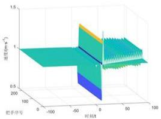

<details>
<summary>surface_3d</summary>

| 时间 | 速度 (m/s) |
| ---- | ---------- |
| -100 | 0.5        |
| -50  | 1.0        |
| 0    | 1.5        |
| 50   | 1.0        |
| 100  | 0.5        |
</details>

图19.速度矩阵三维图

根据题目要求，进行以下求解步骤：

# Step1：求出最大速度

求出速度矩阵V中最大的速度大小 $v_{max}$

$$
v _ {\max} = \max V \tag {46}
$$

# Step2: 求得 k 值

我们令龙头行进速度为原先速度的 k 倍，根据我们所证明的命题，任何一个板凳在某位置时一个把手的速度变成 k 倍会导致另一个把手的速度也变成 k 倍，因此各个把手在原先位置处的速度也均变为原先速度的 k 倍。同样，最大速度也从 $v_{max}$ 变为 k 倍，变成 $v_{max}' = 2 \, m/s$ ，于是我们求得 k 值为：

$$
k = \frac {v _ {\text { max }} ^ {\prime}}{v _ {\text { max }}} \tag {47}
$$

# Step3: 得出行进速度

得到龙头行进速度为 $v=\frac{v_{max}^{\prime}}{v_{max}}\cdot v_{0}$ ，该值为龙头的最大行进速度。

# 5.5.3 得出结果

得出龙头的最大行进速度为：1.406276 m/s。

# 六、模型的分析与检验

# 6.1 误差分析

由于我们是通过逐步逼近的方法求解把手的位置，因此存在一定误差 $\varepsilon$ ，主要来源于步长选择和停止准则。

# 步长选择

我们选择减半步长，这通常意味着每次迭代后，误差至少减半，降低了时间复杂度，同时也提供了一个稳定的收敛速度，不至于过拟合或震荡。

# 停止准则

我们将步长小于设定的最小步长 $\lambda_{min}$ 作为终止条件，即若出现步长减小的情况，必然是该预测位置与实际位置之间的距离小于当前步长，即误差值小于当前步长。

设我们最终得到的步长为 $\lambda_{1}$ ，该值应当大于设定的最小步长 $\lambda_{min}$ ，因此我们继续减半步长得到 $\lambda_{2}$ ，由于此时已到达终止条件，因此 $\lambda_{2}$ 必然小于我们设定的最小步长 $\lambda_{min}$ 。

得到

$$
\varepsilon <   \lambda_ {1} = 2 \lambda_ {2} <   2 \lambda_ {\min} \tag {48}
$$

因此，逐步逼近法在适当选择 $\lambda_{min}$ 的情况下，可以有效地逼近精确解，并且误差 $\varepsilon$ 可以控制在 $2\lambda_{min}$ 以内。

# 6.2 灵敏度分析

对于问题二，我们需要判断发生碰撞的时刻，从而确定舞龙队的终止时刻，在判断的过程中，基于两个初始条件：螺线螺距和把手间距。

因此我们通过改变同一块板凳上两个把手之间的间距和螺距，得出舞龙队盘入的终止时刻随螺线的螺距和把手间距的变化曲线图如下图所示：

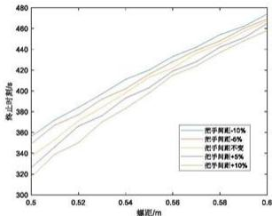

<details>
<summary>line</summary>

| 螺纹/m | 批于间距-10% | 批于间距-6% | 批于间距不变 | 批于间距+6% | 批于间距+10% |
|---|---|---|---|---|---|
| 0.5 | 320 | 340 | 360 | 380 | 400 |
| 0.52 | 340 | 360 | 380 | 400 | 420 |
| 0.54 | 360 | 380 | 400 | 420 | 440 |
| 0.56 | 380 | 400 | 420 | 440 | 460 |
| 0.58 | 400 | 420 | 440 | 460 | 480 |
| 0.6 | 420 | 440 | 460 | 480 | 500 |
</details>

图20.终止时刻随螺线的螺距和把手间距的变化曲线图

从图中可以看到，增加螺线的螺距，可以使终止时刻显著增大，改变 0.1 m 的螺距最小可使终止时刻改变 120 s 左右。随着把手间距的缩小，终止时刻随着螺距的增大而增大的幅度在减小，但减小的幅度不大。改变把手间距 20% 最大仅使终止时刻改变 40 s 左右，对其的影响不大。

可见终止时刻对螺线螺距较敏感，对把手间距不敏感。

# 七、模型的评价与推广

# 7.1 模型的优点

（1）模型利用螺旋线的极坐标方程对板凳龙的运动轨迹进行了精确的数学描述。通过螺旋线公式和物理几何关系，能够较准确地计算出每个时刻板凳龙的各个部分的位置和速度。  
（2）在求解过程中，模型采用了逐步逼近和缩短步长的方法，这种方法确保了结果的精度，并且能够适应不同的初始条件。  
（3）模型将整个板凳龙的运动过程分为多个部分，并分别建立了数学模型。这种分阶段处理的方式提高了模型的系统性，使得每个子问题都能独立且精确地求解。

# 7.2 模型的不足

(1) 模型假设板凳龙的运动是在理想条件下进行的，忽略了外部环境因素如风力、地面摩擦、舞龙队员的操作误差等。

（2）模型将板凳龙的运动简化为二维平面运动，忽略了可能的三维效应。在实际表演中，板凳龙可能会出现上下波动或倾斜，这些三维效应未被考虑。

# 7.3 模型的推广

该模型可以推广应用于其他多节刚性结构的运动分析，如机器人臂的路径规划、蛇形机器人的运动控制等。这些应用同样需要精确的运动轨迹计算和碰撞检测。

# 参考文献

[1] 肖琦, 林明珠. 闽中非物质文化遗产旅游资源活化利用研究——以三明大田板凳龙为例 [J]. 中国民族博览, 2020, (22): 65-67.  
[2] 刘少辉. 浦江板凳龙形态研究 [D]. 中国艺术研究院, 2008: 33-36.  
[3] 沈晨,姜水根.物系相关速度[J].中学物理教学参考,1994,(10):30-33.  
[4] 陆小庆,颜超,孔倩.平面曲线弧长极坐标公式探讨[J].高师理科学刊,2013,33(03):9-11.

# 附录

附录 A 支撑材料文件列表

<table><tr><td>文件名</td><td>文件内容</td></tr><tr><td>cal d.m</td><td>计算把手间距</td></tr><tr><td>cal integral.m</td><td>计算积分值</td></tr><tr><td>cal n1.m</td><td>计算把手的切线的方向向量</td></tr><tr><td>cal n1_all.m</td><td>计算所有把手的切线的方向向量</td></tr><tr><td>cal_theta_all.m</td><td>计算所有把手对应的角度</td></tr><tr><td>cal theta_n1.m</td><td>计算盘入螺线上下一个把手对应的角度</td></tr><tr><td>cal_theta_n1_reverse.m</td><td>计算盘出螺线上下一个把手对应的角度</td></tr><tr><td>cal_theta_t2.m</td><td>计算把手经过时间  $\mathrm{t}$  后对应的角度</td></tr><tr><td>cal v2.m</td><td>通过上一个把手的速度推出下一个把手的速度</td></tr><tr><td>cal v_all.m</td><td>计算所有把手所有时刻的速度</td></tr><tr><td>cal xy.m</td><td>通过螺线上把手对应的角度求出其位置</td></tr><tr><td>generate_dot.m</td><td>通过板凳前后把手对应的角度求出板凳四个顶点的位置</td></tr><tr><td>generate_dot_m</td><td>通过板凳前后把手的位置求出板凳四个顶点的位置</td></tr><tr><td>judge_area.m</td><td>判断把手当前时刻所处区域</td></tr><tr><td>judge_crash.m</td><td>判断是否发生碰撞</td></tr><tr><td>judge_in.m</td><td>判断一个点是否在某板凳的矩形区域内</td></tr><tr><td>m1.m</td><td>问题一代码</td></tr><tr><td>m2.m</td><td>问题二代码</td></tr><tr><td>m3.m</td><td>问题三代码</td></tr><tr><td>m4.m</td><td>问题四代码</td></tr><tr><td>result1.xlsx</td><td>结果表一</td></tr><tr><td>result2.xlsx</td><td>结果表二</td></tr><tr><td>result4.xlsx</td><td>结果表四</td></tr></table>

附录B程序代码

<table><tr><td>附录 B1: cal_d.m</td></tr><tr><td>function d = cal_d(i)</td></tr><tr><td>% 计算把手间距</td></tr><tr><td>if i==1</td></tr><tr><td>d = 2.86;</td></tr><tr><td>else</td></tr></table>

```matlab
d = 1.65;
end
end 
```

附录 B2: cal\_integral.m   
```matlab
function integral = cal_integral(theta)
% 计算积分值
integral = theta.*sqrt(theta.^2+1)+log(theta+sqrt(theta.^2+1));
end 
```

附录 B3: cal\_n1.m   
```matlab
function n1 = cal_n1(theta, flag)
% 计算把手的切线的方向向量
    if flag == 1 | flag == 4
    n1 = [cos(theta) - theta .* sin(theta), sin(theta) + theta .* cos(theta)];
    else
    n1 = [sin(theta), - cos(theta)];
    end
end 
```

附录 B4: cal\_n1\_all.m   
```matlab
function n1_mat = cal_n1_all(theta_mat, flag_mat)
% 计算所有把手的切线的方向向量
    [x,y] = size(theta_mat);
    n1_mat = zeros(x,y,2);
    for i=1:x
    for j=1:y
    n1_mat(i,j,:) = cal_n1(theta_mat(i,j),flag_mat(i,j));
    end
end 
```

end

附录 B5: cal\_theta\_all.m   
```matlab
function theta_n_list = cal_theta_all(theta_1,a)
% 计算所有把手对应的角度
theta_n_list = [theta_1];
for i=1:223
    theta_n1 = cal_theta_n1(theta_n_list(end),cal_d(i),a);
    theta_n_list = [theta_n_list;theta_n1];
end
end 
```

附录 B6: cal\_theta\_n1.m   
```matlab
function theta_n1 = cal_theta_n1(theta_n,d,a)
% 计算盘入螺线上下一个把手对应的角度
    theta_n1 = theta_n;
    lambda = pi/8;
    epsilon = 1e-10;
    while lambda >epsilon
    theta_n1 = theta_n1 + lambda;
    if    theta_n^2 + theta_n1^2 - 2 * theta_n * theta_n1 * cos(theta_n1 - theta_n) > d^2 / a^2
    theta_n1 = theta_n1 - lambda;
    lambda = lambda / 2;
    end
    end
end 
```

附录 B7: cal\_theta\_n1\_reverse.m   
```matlab
function theta_n1 = cal_theta_n1_reverse(theta_n, d, a)
% 计算盘出螺线上下一个把手对应的角度
theta_n1 = theta_n;
lambda = pi / 8; 
```

```matlab
epsilon = 1e-10;
while lambda > epsilon
    theta_n1 = theta_n1 - lambda;
    if    theta_n^2 + theta_n1^2 - 2 * theta_n * theta_n1 * cos(theta_n1 - theta_n) > d^2 / a^2
    theta_n1 = theta_n1 + lambda;
    lambda = lambda / 2;
    end
    end
end 
```

附录 B8: cal\_theta\_t2.m  
```matlab
function theta_t2 = cal_theta_t2(theta_t1,v,t,a,direction)
% 计算把手经过时间 t 后对应的角度
lambda = theta_t1/4;
epsilon = 1e-12;
% epsilon = 1e-10;
theta_t2 = theta_t1;
if direction == 1
    obj = cal_integral(theta_t1) - v.*t./a.*2;
    while lambda > epsilon
    theta_t2 = theta_t2 - lambda;
    if cal_integral(theta_t2) < obj
    theta_t2 = theta_t2 + lambda;
    lambda = lambda / 2;
    end
    end
else if direction == 1
    obj = cal_integral(theta_t1) + v.*t./a.*2;
    while lambda > epsilon
    theta_t2 = theta_t2 + lambda;
    if cal_integral(theta_t2) > obj
    theta_t2 = theta_t2 - lambda; 
```

```matlab
lambda = lambda/2;
end
end
end
end 
```

附录 B9: cal\_v2.m   
```matlab
function v2 = cal_v2(v1,n0,n1,n2)
% 通过上一个把手的速度推出下一个把手的速度
    n0 = reshape(n0,2,1,1);
    n1 = reshape(n1,2,1,1);
    n2 = reshape(n2,2,1,1);

    cos_gamma1 = abs(dot(n0,n1)/norm(n0)/norm(n1));
    cos_gamma2 = abs(dot(n0,n2)/norm(n0)/norm(n2));

    v2 = v1*cos_gamma1/cos_gamma2;
end
```

附录 B10: cal\_v\_all.m   
```matlab
function v_mat = cal_v_all(theta_mat,v)
% 计算所有把手所有时刻的速度
num_t = size(theta_mat,2);
tl = zeros(224,num_t,2);
tl(:,1) = cos(theta_mat)-theta_mat.*sin(theta_mat);
tl(:,2) = sin(theta_mat)*theta_mat.*cos(theta_mat);
cl = zeros(223,num_t,2);
cl(:,1) = theta_mat(1:223,:).*cos(theta_mat(1:223,:))-theta_mat(2:224,:).*cos(theta_mat(2:224,:)); 
```

```matlab
cl(:,.;,2) = theta_mat(1:223,:).*sin(theta_mat(1:223,:))-theta_mat(2:224,:).*sin(theta_mat(2:224,:));

v_mat = zeros(224,num_t);
v_mat(1,:) = v;
for j=1:num_t
    for i=2:224
    n1 = [cl(i-1,j,1),cl(i-1,j,2)];
    n2 = [tl(i-1,j,1),tl(i-1,j,2)];
    n3 = [tl(i,j,1),tl(i,j,2)];
    cos_gamma1 = abs(dot(n1,n2)/norm(n1)/norm(n2));
    cos_gamma2 = abs(dot(n1,n3)/norm(n1)/norm(n3));
    v_mat(i,j) = v_mat(i-1,j)*cos_gamma1/cos_gamma2;
    end
    end
end 
```

附录 B11: cal\_xy.m   
```matlab
function p = cal_xy(theta_n_list, a)
% 通过螺线上把手对应的角度求出其位置
x_list = a.*theta_n_list.*cos(theta_n_list);
y_list = a.*theta_n_list.*sin(theta_n_list);
p = [x_list, y_list];
end 
```

附录 B12: generate\_dot.m  
```matlab
function P = generate_dot(theta1, theta2, a)
% 通过板凳前后把手对应的角度求出板凳四个顶点的位置
P = zeros(4, 2);
p1 = cal_xy(theta1, a);
p2 = cal_xy(theta2, a);
n1 = p1 - p2;
n0 = n1 / norm(n1);
p3 = p1 + n0 * 0.275 + n0 * [0 1; -1 0] * 0.15; 
```

```matlab
p4 = p1 + n0 * 0.275 - n0 * [0 1; -1 0] * 0.15;
p5 = p2 - n0 * 0.275 + n0 * [0 1; -1 0] * 0.15;
p6 = p2 - n0 * 0.275 - n0 * [0 1; -1 0] * 0.15;
P = [p3; p4; p5; p6];
end 
```

附录 B13: generate\_dot\_m   
```matlab
function P = generate_dot_(p1,p2)
% 通过板凳前后把手的位置求出板凳四个顶点的位置
P = zeros(4,2);
p1 = reshape(p1,1,2,1);
p2 = reshape(p2,1,2,1);
n1 = p1-p2;
n0 = n1/norm(n1);
p3 = p1+n0*0.275+n0*[0 1;-1 0]*0.15;
p4 = p1+n0*0.275-n0*[0 1;-1 0]*0.15;
p5 = p2-n0*0.275+n0*[0 1;-1 0]*0.15;
p6 = p2-n0*0.275-n0*[0 1;-1 0]*0.15;
P = [p3;p4;p5;p6];
end 
```

附录 B14: judge\_area.m   
```matlab
function flag = judge_area(p,i)
% 通过把手前一时刻所处区域和当前位置判断把手当前时刻所处区域
global p_inter2;
flag = i;
if i == 1 & norm(p) < 4.5
    flag = 2;
end 
```

```matlab
if i==2 & p(1)>p_inter2(1)
    flag = 3;
end

if i==3 & norm(p)>=4.5
    flag = 4;
end 
```

附录 B15: judge\_crash.m   
```matlab
function flag = judge_crash(theta_list,a)
% 判断是否发生碰撞
    flag = 0;
    dot_mat = zeros(223,4,2);
    for i=1:223
    dot_mat(i,:,:) = generate_dot(theta_list(i),theta_list(i+1),a);
    end
    dot_list = [dot_mat(1,1,1),dot_mat(1,1,2);
    dot_mat(1,3,1),dot_mat(1,3,2);
    dot_mat(2,1,1),dot_mat(2,1,2)];
    for i=1:3
    for j=4:223
    dot = dot_list(i,:);

    if judge_in(dot,theta_list(j),theta_list(j+1),a)==1
    flag = 1;
    end
    end
end 
```

附录 16: judge\_in.m   
```matlab
function flag = judge_in(p,theta1,theta2,a)
% 判断一个点是否在某板凳的矩形区域内
flag = 0;
P = generate_dot(theta1,theta2,a);
p1 = P(1,:);
p2 = P(2,:);
p3 = P(3,:);
n0 = p-p1;
n1 = p2-p1;
n2 = p3-p1;
if
(dot(n0,n1)/dot(n1,n1)>0)&&((dot(n0,n1)/dot(n1,n1)<1)&&((dot(n0,n2)/dot(n2,n2)>0)&&((dot(n0,n2)/dot(n2,n2)<1)
flag = 1;
end
end 
```

附录 B17: m1.m   
```matlab
clear
clc
close all
% 定义常数
delta_pho = 0.55; % 螺距，代表龙形路径的距离
a = delta_pho / (2 * pi); % 与螺距相关的常数
theta_1_0 = 16 * 2 * pi; % 龙头初始的角度位置（16 圈）
v = 1; % 龙头的速度（米/秒）
p = zeros(224, 301, 2); % 用于存储每节板凳把手的坐标的位置矩阵
theta_mat = zeros(224, 301); % 用于存储每节板凳的角度位置的矩阵
output1 = [1, 2, 52, 102, 152, 202, 224]; % 指定要输出结果的板凳索引
output2 = 1:60:301; % 指定要输出结果的时间点索引
```

```matlab
% 计算龙头在每个时间点的角度位置
theta_t_list = zeros(1, 301); % 初始化角度位置列表
theta_t_list(1) = theta_1_0; % 设置初始角度位置
for i = 2:301
    theta_t_list(i) = cal_theta_t2(theta_1_0, v, i - 1, a, 1); % 计算每秒的角度位置
end

% 计算各个板凳的位置并存储在矩阵中
for i = 1:301
    theta_n_list = cal_theta_all(theta_t_list(i), a); % 计算当前时间下所有板凳的角度位置
    theta_mat(:, i) = theta_n_list; % 将角度位置存储在矩阵中
    p_n_list = cal_xy(theta_n_list, a); % 计算当前时间下所有板凳的坐标
    p(:, i,:) = p_n_list; % 将坐标存储在位置矩阵中
end

% 提取指定板凳在指定时间点的位置数据
result1 = p(output1, output2, :); % 获取指定板凳和时间点的位置
result1 = permute(result1, [3, 1, 2]); % 调整维度以便处理
result1 = reshape(result1, length(output1) * 2, length(output2), 1); % 重塑为二维矩阵
disp('问题一位置结果：');
disp(vpa(round(result1, 6), 8)); % 显示位置数据，保留6位小数

% 计算速度并存储在矩阵中
v_mat = cal_v_all(theta_mat, v); % 计算所有板凳在所有时间点的速度
result2 = v_mat(output1, output2); % 提取指定板凳和时间点的速度
disp('问题一速度结果：');
disp(vpa(round(result2, 6), 7)); % 显示速度数据，保留6位小数

% 将位置数据保存到Excel文件
result3 = permute(p, [3, 1, 2]); % 调整维度以便处理
result3 = reshape(result3, 448, 301, 1); % 重塑为二维矩阵
writematrix(round(result3, 6), 'result1.xlsx', 'Sheet', '位置', 'Range', 'B2'); % 保存到
```

Excel 文件  
```matlab
% 将速度数据保存到 Excel 文件
result4 = v_mat; % 使用速度矩阵直接保存
writematrix(round(result4, 6), 'result1.xlsx', 'Sheet', '速度', 'Range', 'B2'); % 保存到 Excel 文件

% 绘制龙形初始配置的图像
figure;
scatter(p(:, 1, 1), p(:, 1, 2), 10, 'filled', 'MarkerFaceColor', 'blue');
hold on;
for i = 1:223
    P = generate_dot(theta_mat(i, 1), theta_mat(i + 1, 1), a);
    plot(P([1, 2], 1), P([1, 2], 2));
    hold on;
    plot(P([1, 3], 1), P([1, 3], 2));
    hold on;
    plot(P([2, 4], 1), P([2, 4], 2));
    hold on;
    plot(P([3, 4], 1), P([3, 4], 2));
    hold on;
end
axis equal; % 设置坐标轴比例相等
```

附录 B18: m2.m  
```matlab
clear
cle
close all
% 定义常数
delta_pho = 0.55; % 螺距，代表龙形路径的距离
a = delta_pho / (2 * pi); % 与螺距相关的常数
theta_1_0 = 16 * 2 * pi; % 龙头初始的角度位置（16 圈）
v = 1; % 龙头的速度（米/秒）
```

```matlab
output = [1,2,52,102,152,202,224]; % 指定要输出结果的板凳索引
```

$\%$ 逐步增加时间，直到发生碰撞 $\%$ 依次细化时间步长，精确定位碰撞时刻

```matlab
% for t=0:1000
% for t=300:0.1:1000
% for t=410:0.01:1000
% for t=412.47:0.001:1000
% for t=412.473:0.00001:1000
for t=412.47382:0.0000001:1000 
```

```matlab
% 计算当前时间的龙头角度位置
theta_1_t = cal_theta_t2(theta_1_0, v, t, a, 1);
```

```txt
% 计算当前时间所有板凳的角度位置
theta_list = cal_theta_all(theta_1_t, a);
```

```matlab
% 根据角度位置计算板凳的坐标
p_list = cal_xy(theta_list, a);
x_list = p_list(:, 1); % 获取所有板凳的 x 坐标
y_list = p_list(:, 2); % 获取所有板凳的 y 坐标
```

```matlab
% 判断是否发生碰撞
if judge_crash(theta_list, a) == 1
    break; % 如果发生碰撞，则退出循环
end
end 
```

```matlab
disp('碰撞发生时刻:')
disp(vpa(t));
disp(vpa(t,9)); 
```

```matlab
% 使用已知的碰撞时间点进行进一步计算和输出
t = 412.473838; % 碰撞时刻的精确值
theta_1_t = cal_theta_t2(theta_1_0, v, t, a, 1); % 计算龙头在碰撞时刻的角度位置
theta_list = cal_theta_all(theta_1_t, a); % 计算所有板凳在碰撞时刻的角度位置

% 计算碰撞时刻所有板凳的坐标
p_list = cal_xy(theta_list, a);
x_list = p_list(:, 1); % 获取 x 坐标
y_list = p_list(:, 2); % 获取 y 坐标
v_list = cal_v_all(theta_list, v); % 计算各板凳的速度

result1 = [p_list, v_list];
writematrix(round(result1, 6), 'result2.xlsx', 'Range', 'B2');

result2 = p_list(output, );
disp('问题二位置结果: ');
disp(vpa(round(result2, 6), 8));

result3 = v_list(output);
disp('问题二速度结果: ');
disp(vpa(round(result3, 6), 8));

% 绘制龙形的图像
figure;
scatter(x_list, y_list, 10, 'filled', 'MarkerFaceColor', 'blue');
hold on;
for i = 1:223
    P = generate_dot(theta_list(i), theta_list(i+1), a);
    plot(P([1, 2], 1), P([1, 2], 2));
    hold on;
    plot(P([1, 3], 1), P([1, 3], 2)); 
```

```txt
hold on;
plot(P([2,4],1),P([2,4],2));
hold on;
plot(P([3,4],1),P([3,4],2));
hold on;
end
axis equal; 
```

附录 B19: m3.m   
```matlab
clear
clc
close all

% 逐步减小螺距，寻找最小螺距
% 逐步细化搜索步长，提高搜索精度

% init = 0.55; pace = -0.01;
% init = 0.46; pace = -0.001;
% init = 0.451; pace = -0.0001;
% init = 0.4504; pace = -0.00001;
% init = 0.45034; pace = -0.000001;
init = 0.450338; pace = -0.0000001;
for delta_pho = init:pace:0.1
    a = delta_pho / (2 * pi); % 计算与螺距相关的常数
    theta_1_0 = 16 * 2 * pi; % 龙头初始角度位置（16 圈）
    v = 1; % 龙头速度（米/秒）
    output = [1, 2, 52, 102, 152, 202, 224]; % 指定要输出结果的板凳索引
    t = 0; % 时间初始值
    flag = 0; % 碰撞标志，初始为 0（无碰撞）

% 循环计算直到龙头达到或接近调头区域边界
while a * cal_theta_t2(theta_1_0, v, t, a, 1) >= 4.5
    theta_1_t = cal_theta_t2(theta_1_0, v, t, a, 1); % 计算当前时间龙头的角度位置 
```

```matlab
theta_list = cal_theta_all(theta_1_t, a); % 计算当前时间所有板凳的角度位置
p_list = cal_xy(theta_list, a); % 计算所有板凳的坐标
x_list = p_list(:, 1); % 获取所有板凳的 x 坐标
y_list = p_list(:, 2); % 获取所有板凳的 y 坐标

if judge_crash(theta_list, a) == 1 % 判断是否发生碰撞
    flag = 1; % 发生碰撞，标志设为 1
    break; % 退出循环
end

t = t + 1; % 增加时间步长
if a * cal_theta_t2(theta_1_0, v, t, a, 1) < 5
    t = t - 0.8; % 调整时间步长以避免跳过边界
end

if a * cal_theta_t2(theta_1_0, v, t, a, 1) < 4.6
    t = t - 0.19; % 进一步调整时间步长
end

end

if flag == 1 % 如果发生了碰撞，终止搜索
    break;
end

end

disp('最小螺距;');
disp(vpa(delta_pho-pace));
disp(vpa(ceil((delta_pho-pace)*1e6)*1e-6,6));

% 绘制最终的龙形位置
delta_pho = 0.450338;
```

```matlab
a = delta_pho/2/pi;
theta_1_0 = 16*2*pi;
v = 1;
output = [1,2,52,102,152,202,224];
t = 0;
while a * cal_theta_t2(theta_1_0,v,t,a,1) >= 4.5
    theta_1_1 = cal_theta_t2(theta_1_0,v,t,a,1);
    theta_list = cal_theta_all(theta_1_t,a);

    p_list = cal_xy(theta_list,a);
    x_list = p_list(:,1);
    y_list = p_list(:,2);

    t = t + 1;
    if a * cal_theta_t2(theta_1_0,v,t,a,1) < 5
    t = t - 0.8; % 调整时间步长以避免跳过边界

    end
    if a * cal_theta_t2(theta_1_0,v,t,a,1) < 4.6
    t = t - 0.19; % 进一步调整时间步长
    end
end 
```

% 绘制龙形位置图  
```matlab
figure;
scatter(x_list,y_list,20,'filled','MarkerFaceColor','blue');
    hold on;
viscircles([0 0],4.5);
    hold on;
for i=1:223
    P = generate_dot(theta_list(i),theta_list(i+1),a); 
```

```txt
plot(P([1,2],1),P([1,2],2)); hold on;  
plot(P([1,3],1),P([1,3],2)); hold on;  
plot(P([2,4],1),P([2,4],2)); hold on;  
plot(P([3,4],1),P([3,4],2)); hold on;  
end  
axis equal; 
```

附录 B20: m4.m   
```matlab
clear
clc
close all

global p_inter2;
output1 = [1,2,52,102,152,202,224];
output2 = [1,51,101,151,201];

% 定义螺距、半径、角度等参数
delta_pho = 1.7; % 盘入螺距
a = delta_pho / (2 * pi); % 与螺距相关的常数
r = 4.5; % 调头空间的半径
theta_inter1 = r / a; % 计算角度位置

% 计算三个关键点的坐标
p_inter1 = [a * theta_inter1 * cos(theta_inter1), a * theta_inter1 * sin(theta_inter1)]; % 第一个交点
p_inter2 = -p_inter1 / 3; % 第二个交点
p_inter3 = -p_inter1; % 第三个交点

% 计算切向方向和旋转方向
direction tl = [cos(theta_inter1) - theta_inter1 * sin(theta_inter1), sin(theta_inter1) + 
```

```matlab
theta_inter1 * cos(theta_inter1)];
    direction_r = direction_tl * [0 1; -1 0];
    theta_inter_ = atan(p_inter1(2) / p_inter1(1));
    alpha = acos(abs(dot(direction_r, p_inter3) / norm(direction_r) / norm(p_inter3))); % 计算 alpha 角度
    r1 = r / 3 * 2 / cos(alpha); % 计算第一个圆弧的半径
    r2 = r1 / 2; % 计算第二个圆弧的半径

% 计算两个圆心的位置
p_center1 = p_inter1 + r1.*[cos(theta_inter_-alpha), sin(theta_inter_-alpha)];
p_center2 = p_inter2 * 3 / 2 - p_center1 / 2;

% 计算时间序列的角度位置
theta_t2_list_ = zeros(101, 1);
theta_t2_list_(1) = theta_inter1;
v = 1;
for t = 1:100
    theta_t2_list_(t+1) = cal_theta_t2(theta_inter1, v, t, a, -1);
end
theta_mat_ = zeros(224, 101);
for i = 1:101
    theta_mat_(i, i) = cal_theta_all(theta_t2_list_(i), a);
end

p_mat_ = zeros(224, 101, 2);
p_mat_(i, i) = a.*theta_mat_*cos(theta_mat);
p_mat_(i, i) = a.*theta_mat_*sin(theta_mat);
p1 = theta_mat_(output1, [1, 51, 101]);
p1_ = zeros(length(output1) * 2, 3);
for j = 1:3
    p = cal_xy(p1(:, j), a);
    p = p';
    p1_(i, j) = p(:); 
```

end

```txt
v_mat = cal_v_all(theta_mat, v); 
```

$\% \mathrm{p1}_{-}:0, - 50, - 100$ 位置

% v\_mat\_(output,[1,51,101]): 0,-50,-100 速度

% 标记不同段的路径，1 代表螺线部分，2 代表第一个圆弧部分，3 代表第二个圆弧部分，4 代表逆向螺线部分

flag\_mat = ones(224,101);

$11 = r1^{*}(pi - alpha^{*}2)$ ; % 第一个圆弧的弧长

12=11/2; % 第二个圆弧的弧长

flag\_mat(1,2:floor(l1/v+1)) = 2;

flag\_mat(1,ceil(l1/v+1):floor((l1+l2)/v+1))=3;

flag\_mat(1,ceil((l1+l2)/v+1):end)=4;

p\_mat = zeros(224,101,2);

theta\_mat = zeros(224,101);

theta\_mat(:,1)=theta\_mat(:,1);

p\_mat(:,1,1)=a.\*theta\_mat(:,1).\*cos(theta\_mat(:,1));

p\_mat(:,1,2) = a.\*theta\_mat(:,1).\*sin(theta\_mat(:,1));

% 处理第一个圆弧

for j = 2:floor(l1 / v + 1)

$\mathrm{lambda} = \mathrm{theta\_inter\_ - alpha + pi - (j - 1)*v / r1};$

theta\_mat(1, j) = lambda;

p\_mat(1, j, :) = p\_center1 + r1 \* [cos(lambda), sin(lambda)];

end

% 处理第二个圆弧

for j = ceil(l1 / v + 1):floor((l1 + l2) / v + 1)

lambda = theta\_inter\_ + alpha - pi + ((j - 1) \* v - 11) / r2;

theta\_mat(1, j) = lambda;

p\_mat(1, j, :) = p\_center2 + r2 \* [cos(lambda), sin(lambda)];

end

```matlab
% 处理逆向螺线
for j = ceil((11 + 12) / v + 1):size(flag_mat, 2)
    theta_mat(1, j) = cal_theta_t2(theta_inter1, v, ((j - 1) * v - 11 - 12) / v, a, -1);
    p_mat(1, j, :) = -a .* theta_mat(1, j) .* [cos(theta_mat(1, j)), sin(theta_mat(1, j))];
end

for i = 2:224
    for j = 2:101
    if flag_mat(i-1,j) == 1
    flag_mat(i,j) = 1;
    theta_n1 = cal_theta_n1(theta_mat(i-1,j), cal_d(i-1), a);
    theta_mat(i,j) = theta_n1;
    p_mat(i,j,:) = a .* theta_n1 .* [cos(theta_n1), sin(theta_n1)];
    end
    if flag_mat(i-1,j) == 2
    if norm(reshape(p_mat(i-1,j,:), 1, 2, 1)-p_inter1) > cal_d(i-1)
    flag_mat(i,j) = 2;
    lambda = theta_mat(i-1,j) + asin(cal_d(i-1)/2/r1) * 2;
    theta_mat(i,j) = lambda;
    p_mat(i,j,:) = p_center1 + r1 * [cos(lambda), sin(lambda)];
    else
    flag_mat(i,j) = 1;
    pace = (cal_d(i-1)-norm(reshape(p_mat(i-1,j,:), 1, 2, 1)-p_inter1)) / r / 2;
    if pace < 1e-9
    pace = 1e-9;
    end
    theta_estimate = theta_inter1;
    while pace > 1e-10
    theta_estimate = theta_estimate + pace;
    if norm(reshape(p_mat(i-1,j,:), 1, 2, 1)-a * theta_estimate * [cos(theta_estimate), sin(theta_estimate)]) > cal_d(i-1)
    theta_estimate = theta_estimate - pace; 
```

```matlab
pace = pace/2;
end
end
theta_mat(i,j) = theta_estimate;
p_mat(i,j,:) = a*theta_estimate*[cos(theta_estimate),sin(theta_estimate)];
end
end
if flag_mat(i-1,j)==3
    if norm(reshape(p_mat(i-1,j,:),1,2,1)-p_inter2)>cal_d(i-1)
    flag_mat(i,j) = 3;
    lambda = theta_mat(i-1,j)-asin(cal_d(i-1)/2/r2)*2;
    theta_mat(i,j) = lambda;
    p_mat(i,j,:) = p_center2+r2*[cos(lambda),sin(lambda)];
else
    flag_mat(i,j) = 2;
    pace = (cal_d(i-1)-norm(reshape(p_mat(i-1,j,:),1,2,1)-p_inter2))/r1/2;
    if pace<1e-9
    pace=1e-9;
    end
    theta_estimate = theta_inter_+alpha;
    while pace>1e-10
    theta_estimate = theta_estimate+pace;
    if norm(reshape(p_mat(i-1,j,:),1,2,1)-(p_center1+r1*[cos(theta_estimate),sin(theta_estimate)])>cal_d(i-1)
    theta_estimate = theta_estimate-pace;
    pace = pace/2;
    end
    end
    theta_mat(i,j) = theta_estimate;
    p_mat(i,j,:) = 
```

```matlab
p_center1+r1*[cos(theta_estimate),sin(theta_estimate)];
end
end
if flag_mat(i-1,j)==4
    if    flag_mat(i,j-1)==4  | norm(reshape(p_mat(i-1,j,:),1,2,1)-p_inter3)>cal_d(i-1)
    flag_mat(i,j)=4;
    theta_n1=cal_theta_n1_reverse(theta_mat(i-1,j),cal_d(i-1),a);
    theta_mat(i,j)=theta_n1;
    p_mat(i,j,:)=-a.*theta_n1.*[cos(theta_n1),sin(theta_n1)];
else
    flag_mat(i,j)=3;
    pace = (cal_d(i-1)-norm(reshape(p_mat(i-1,j,:),1,2,1)-p_inter3))/r2/2;
    if pace<1e-9
    pace=1e-9;
    end
    theta_estimate=theta_inter_alpha;
    while pace>1e-10
    theta_estimate=theta_estimate-pace;
    if    norm(reshape(p_mat(i-1,j,:),1,2,1)-(p_center2+r2*[cos(theta_estimate),sin(theta_estimate))]>cal_d(i-1)
    theta_estimate=theta_estimate+pace;
    pace=pace/2;
    end
    end
    theta_mat(i,j)=theta_estimate;
    p_mat(i,j,:)
p_center2+r2*[cos(theta_estimate),sin(theta_estimate)];
end 
```

```matlab
end
end
end
result01 = p_mat(output1,.;);
result02 = zeros(length(output1)*2,101);
for i=1:101
    result03 = result01(:,i,:);
    result03 = permute(result03,[3 1 2]);
    result03 = result03(:);
    result02(:,i) = result03;
end

n0_mat = p_mat(2:224,.;)-p_mat(1:223,.;);
n1_mat = cal_n1_all(theta_mat,flag_mat);
v_mat = zeros(224,101);
v_mat(1,:) = v;
for i=1:101
    for j=2:224
    v_mat(j,i) = cal_v2(v_mat(j-1,i),n0_mat(j-1,i,.,n1_mat(j-1,i,.,n1_mat(j,i,:));
end
end

v_mat_all = [v_mat_(:,101:-1:2),v_mat];
p_mat_all = [p_mat_(:,101:-1:2,.),p_mat];

result1 = permute(p_mat_all,[3,1,2]);
result1 = reshape(result1,448,201,1);
writematrix(round(result1,6),'result4.xlsx','Sheet','位置','Range','B2');

result2 = v_mat_all;
writematrix(round(result2,6),'result4.xlsx','Sheet','速度','Range','B2'); 
```

% 绘制速度变化图

figure;

mesh(-100:100,1:224,v\_mat\_all);

xlabel('时刻/t');

ylabel('把手序号');

zlabel('速度/(m·s^{-1})');

% 绘制龙形的末尾状态图

figure;

scatter(p\_mat\_all(:,end,1),p\_mat\_all(:,end,2),10,'filled','MarkerFaceColor','blue');

hold on;

for i=1:223

P = generate\_dot\_(p\_mat\_all(i, end,:), p\_mat\_all(i + 1, end,:));

plot(P([1,2],1),P([1,2],2));

hold on;

plot(P([1,3],1),P([1,3],2));

hold on;

plot(P([2,4],1),P([2,4],2));

hold on;

plot(P([3,4],1),P([3,4],2));

hold on;

end

axis equal;

% 绘制调头区域与龙形的路径

figure;

width1 = 1.5;

width2 = 2;

R = r;

% 半径

```matlab
center = [0,0];    % 圆心坐标
theta_start_ = 0;    % 起始角度（弧度）
theta_end_ = pi*2;    % 结束角度（弧度）
theta_ = linspace(theta_start_, theta_end_, 100);    % 角度范围
x_ = center_(1) + R_* cos(theta_);    % 参数化方程：x(t) = x0 + R * cos(t)
y_ = center_(2) + R_* sin(theta_);    % 参数化方程：y(t) = y0 + R * sin(t)
plot(x_, y_, 'LineWidth', width2);    % 绘制圆弧
hold on;

R_ = r1;    % 半径
center_ = p_center1;    % 圆心坐标
theta_start_ = theta_inter_ + alpha;    % 起始角度（弧度）
theta_end_ = pi+theta_inter_alpha;    % 结束角度（弧度）
theta_ = linspace(theta_start_, theta_end_, 100);    % 角度范围
x_ = center_(1) + R_* cos(theta_);    % 参数化方程：x(t) = x0 + R * cos(t)
y_ = center_(2) + R_* sin(theta_);    % 参数化方程：y(t) = y0 + R * sin(t)
plot (x_, y_, 'black', 'LineWidth', width1);    % 绘制圆弧
hold on;

R_ = r2;    % 半径
center_ = p_center2;    % 圆心坐标
theta_start_ = theta_inter_ + alpha-pi;    % 起始角度（弧度）
theta_end_ = theta_inter_alpha;    % 结束角度（弧度）
theta_ = linspace(theta_start_, theta_end_, 100);    % 角度范围
x_ = center_(1) + R_* cos(theta_);    % 参数化方程：x(t) = x0 + R * cos(t)
y_ = center_(2) + R_* sin(theta_);    % 参数化方程：y(t) = y0 + R * sin(t)

plot (x_, y_, 'black', 'LineWidth', width1);    % 绘制圆弧
hold on;

plot([p_center1(1),p_inter1(1)], [p_center1(2),p_inter1(2)], '--black', 'LineWidth', width1);
hold on;

plot([p_center1(1),p_inter2(1)], [p_center1(2),p_inter2(2)], '--black', 'LineWidth', 
```

```matlab
width1);
hold on;

plot([p_center2(1),p_inter2(1)], [p_center2(2),p_inter2(2)], '--black', 'LineWidth', width1);
hold on;

plot([p_center2(1),p_inter3(1)], [p_center2(2),p_inter3(2)], '--black', 'LineWidth', width1);
hold on;

theta_ = linspace(theta_inter1, 7*pi, 1000);
x_ = a.*theta_*cos(theta_);
y_ = a.*theta_*sin(theta_);
plot(x_, y_, 'black', 'LineWidth', width1); % 绘制圆弧
hold on;
plot(-x_, -y_, 'black', 'LineWidth', width1); % 绘制圆弧
hold on;

dot_mat_ = [p_center1; p_center2; p_inter1; p_inter2; p_inter3];
scatter(dot_mat(:,1), dot_mat(:,2), 15,'filled','black');

axis equal;

figure;
[X, Y] = meshgrid(-100:100, 1:224);
scatter3(X(:, Y(:, V_mat_all(:, 10, V_mat_all(:, 'filled');

result3 = [p1(:, [3 2]), result02(:, [1 51 101]]);
disp('问题 4 位置结果:')
disp(vpa(round(result3,6),8)); 
```

```matlab
result4 = v_mat_all(output1, output2);
disp('问题 4 速度结果: ');
disp(vpa(round(result4,6),8));
v5_head = 2/max(max(v_mat_all))*v;
disp('问题 5 龙头速度: ');
disp(vpa(floor(v5_head*1e6)*1e-6,8));
```

# 2026年全国大学生国家安全知识答题


Illustration of two cartoon children holding a shield with the number 4:15 (no text or symbols on subjects)