# 基于目标优化的板凳龙形态调节

# 摘要

针对问题一，我们建立舞龙队的运动状态模型。首先，在极坐标系中用阿基米德螺旋线方程描述了各把手满足的位置范围。接着，利用螺旋线弧长公式表示出龙头把手位置随时间变化的关系，并根据板凳间的几何关系，递推出各个时刻下各节龙身以及龙尾把手的位置，并将各把手的行进弧长的导数来表示速度。然后，对时间进行离散化处理，求解出龙头在每一个时刻下的位置，并递推出其余把手在对应时刻的位置，由每一时间步长下的行进弧长计算出各把手的速度，将位置和速度结果存入指定文件。最后，针对各把手的位置和速度特征进行了结果分析和灵敏度分析。

针对问题二，我们建立了碰撞检测模型。首先，我们首先利用反证法证明了整条龙的首次碰撞发生在龙头上。接着，根据几何关系，表示出各板凳顶点的坐标以划定边界，便于碰撞检测。基于分离轴定理，将龙头碰撞问题转化为板凳所占矩形区域的重叠问题，并通过建立碰撞检测函数来判断是否发生碰撞。然后，我们通过递推法计算出终止时刻为412.47s，并求得终止时刻处相关把手的位置与速度。最后，我们对终止时刻的板凳情况进行了结果分析。

针对问题三，我们建立了使龙头可到达调头空间的最小螺距优化模型。首先，将此问题转换为求龙头恰好不发生碰撞时的位置坐标。接着，以螺线螺距最小为目标函数，以螺距范围、问题二中的碰撞检测模型为约束条件，建立以螺线螺距为决策变量的单目标优化模型。然后，通过变步长遍历法求出符合要求的最小螺距为 $45.04\mathrm{cm}$

针对问题四，首先，我们利用调头曲线的三个相切关系，表示出由大圆半径唯一确定的调头曲线长度。接着，以调头曲线长度最小作为目标函数建立单目标优化方程。随后，以几何约束与龙头盘旋方向约束作为约束条件，建立以大圆圆弧半径为决策变量的单目标优化模型，利用遍历法确定了最小调头曲线长度为 $12.5109\mathrm{cm}$

随后，我们在问题一的基础之上建立舞龙队的多段路径运动状态模型。首先我们根据龙头速度与曲线弧长确定每段运动的临界时间，接着我们根据板凳与路径曲线之间的几何关系，确定出各龙把手的位置的临界关系与递推关系。我们根据龙头的位置确定其余各把手的位置，并根据龙头位置关于时间的关系，递推出各把手位置和速度关于时间的关系，并将数据保存到目标文件中。

针对问题五，我们在问题四的基础上建立最大龙头速度优化问题。通过问题四中各把手的位置和速度随时间的变化关系，建立以龙头速度最大为目标，以各把手存在速度上限和把手位置和速度表达式为约束条件的单目标优化模型，并利用粒子群算法进行求解，搜索出满足约束条件的最大龙头速度为 $1.33\mathrm{cm / s}$

关键词：几何关系 单目标优化 分离轴定理 变步长遍历法 粒子群算法

# 一、问题重述

# 1.1 问题的背景

“板凳龙”又被称为“盘龙”，是流行于浙江与福建一带的传统民俗文化活动。参与者将数十乃至上百条板凳依次连接，构成一条弯弯曲曲的板凳龙形象。整条盘龙由龙头引领前行，龙身与龙尾紧随其后，共同缠绕盘旋，呈现圆盘的形态。通常情况下，若舞龙队伍能灵活地完成龙的盘入与盘出动作，那么盘龙所需的活动场地越小、龙盘旋的速度越快，其观赏价值便越高。

# 1.2 问题的提出

某条板凳龙由223块板凳构成，首块板凳为龙头，最后一块为龙尾，中间部分为龙身，每块板凳的两端各有一小孔。相邻板凳依靠插入小孔的把手连接，形成盘龙的“骨架”。现需要建立数学模型，解决下列问题：

问题一：舞龙队顺时针沿 55cm 螺距的等距螺线行进，各把手中心均位于螺线上。龙头的前把手以恒定的速度 1m/s 行进。建立盘龙运动模型，求出 0 至 300 秒内，每秒舞龙队所有把手的位置与速度。

问题二：在第一问的基础上，舞龙队伍继续盘入直至板凳间恰好不发生碰撞。求出此时的时间并给出各把手的位置和速度。

问题三：舞龙队到达盘入的终止时刻后，为了避免碰撞，需要掉头切换成逆时针的盘出运动状态。如果调头空间是以螺线中心为圆心且直径为 $9\mathrm{m}$ 的圆形区域，建立最小螺距模型，给出可使龙头前把手按盘出螺线盘入到调头边界的最小螺距。

问题四：保持龙头前把手速度始终为 1 m/s，将盘入螺线的螺距更改为 1.7 m，盘出与盘入螺线中心对称。舞龙队在调头空间内调头，路径为两段相切圆弧所构成的 S 形曲线，前段圆弧半径为后段圆弧的两倍，且与螺线相切。问能否调整圆弧以缩短调头路径，同时保持各部分相切。

问题五：在问题四行进路径的基础上，在龙头速度固定的情况下，确定最大龙头行进速度，使所有把手的速度都不大于2 m/s。

# 二、模型的假设

1. 假设舞龙过程中不出现人为的位置扰动。  
2. 假设各板凳可视为绕把手自由转动的理想刚体。  
3. 假设舞龙队在进入调头空间后立即开始调头。

# 三、符号说明

表 1 符号说明

<table><tr><td>符号</td><td>说明</td><td>单位</td></tr><tr><td> $p$ </td><td>螺距</td><td> ${cm}$ </td></tr><tr><td> ${r}_{i}$ </td><td>第  $i$  个把手的极径</td><td> ${cm}$ </td></tr><tr><td> ${\theta }_{i}$ </td><td>第  $i$  个把手的极角</td><td>rad</td></tr><tr><td> $t$ </td><td>时间</td><td> $S$ </td></tr><tr><td> ${R}_{i}$ </td><td>第  $\mathrm{i}$  节板凳前后把手之间的距离</td><td>m</td></tr><tr><td>S</td><td>圆弧弧长</td><td>m</td></tr><tr><td> ${v}_{i}$ </td><td>第  $\mathrm{i}$  节板凳的速度</td><td> $m/s$ </td></tr><tr><td> ${\omega }_{i}$ </td><td>角速度</td><td>rad/s</td></tr></table>

# 四、问题的分析

# 4.1 问题一的分析

问题—要求我们求出所有把手的位置和速度。首先，我们在极坐标系中用阿基米德螺旋线方程描述了所有把手满足的空间关系。接着，利用螺旋线弧长公式求出龙头把手的位置坐标，根据几何关系，递推出同一时刻下各节龙身以及龙尾把手的位置坐标，并将速度用各把手的弧长的微分形式表示，进而建立舞龙队的运动状态模型。最后，我们基于极限的思想，将极短时间内的平均速率代替瞬时速度，求解出对应时刻下龙头、龙身及龙尾把手的位置与速度大小。

# 4.2 问题二的分析

问题二要求我们在问题一的基础上，继续运算直至板凳间恰好不发生碰撞。我们首先利用反证法证明了整条龙的首次可能碰撞必然发生在龙头上。接着，根据几何关系，表示出各板凳顶点的坐标以划定边界，便于碰撞检测。将龙头可能与龙身发生碰撞区域的板凳顶点均用二维直角坐标的形式表示。基于分离轴定理，将龙头碰撞问题转化为板凳所占矩形区域的重叠问题，进而建立出盘入碰撞检测模型。最后，我们通过递推法计算出终止时刻，并求得终止时刻处相关把手的位置与速度。

# 4.3 问题三的分析

问题三实质上是一个使龙头可到达调头空间的最小螺距优化问题。基于问题二，我们将此问题转换为求龙头恰好不发生碰撞时的位置坐标，其位于调头空间与螺线的交点上。首先，我们以螺线螺距最小为目标函数，以螺距范围、问题二中建立的盘入碰撞检测模型为约束条件，建立以螺线螺距为决策变量的单目标优化模型。最后，通过变步长遍历法求出可使龙头前把手沿螺线盘入到调头空间边界的最小螺距。

# 4.4 问题四的分析

问题四在问题三的基础上，引入了调头曲线的概念，可转化为两个子问题：①建立调头曲线长度最短的单目标优化模型。②计算调头前后的舞龙队运动状态分布。

对于子问①，首先，我们利用斜率关系和几何关系，将构成调头路径的圆的方程表示出来。接着，利用圆弧弧角分别表示出盘入和盘出的调头圆弧曲线长度，作为目标函数。随后，以几何约束与龙头盘旋方向约束作为约束条件，建立以前一段圆弧半径为决策变量的单目标优化模型，利用遍历法确定了最小圆弧半径及调头曲线的方程。

对于子问②，基于求得的调头曲线方程，对问题一中的舞龙队运动状态模型加以更改，建立舞龙队调头运动模型，利用递推法求得了各把手的运动状态。

# 4.5 问题五的分析

问题五是最大龙头速度优化问题。基于问题四中各把手的位置和速度随时间的变化关系，建立以龙头速度最大为目标，以各把手存在速度上限和把手位置和速度表达式为约束条件的单目标优化模型，并利用粒子群算法进行求解，搜索出满足约束条件的最大龙头速度。

# 五、模型的建立与求解

# 5.1 问题一模型的建立与求解

问题一要求我们求出所有把手的位置和速度。首先，我们在极坐标系中用阿基米德螺旋线方程描述了所有把手满足的空间关系。接着，利用螺旋线弧长公式求出龙头把手的位置坐标，根据几何关系，递推出同一时刻下各节龙身以及龙尾把手的位置坐标，并将速度用各把手的弧长的微分形式表示，进而建立舞龙队的运动状态模型。最后，我们基于极限的思想，将极短时间内的平均速率代替瞬时速度，求解出对应时刻下龙头、龙身及龙尾把手的位置与速度大小。

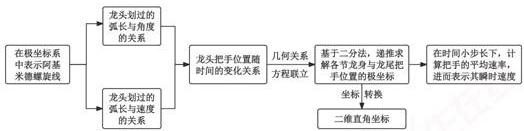

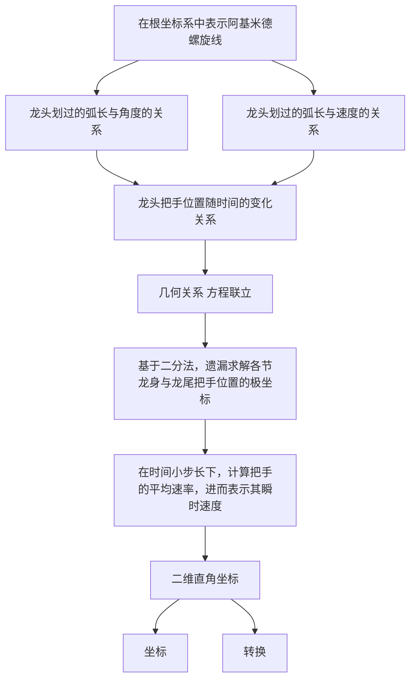

图1 问题一的流程图

# 5.1.1 舞龙队运动状态模型的建立

# 极坐标系下板凳龙螺旋线方程的建立

在本问题中，龙头、龙身、龙尾的把手中心均在等距螺旋线上。因为极坐标中的极径与极角关系常被用于描述物体的旋转运动，所以我们可以在极坐标系中用阿基米德螺旋线方程来描述龙头、龙身及龙尾把手的位置。

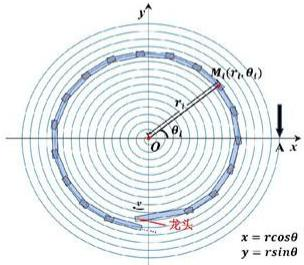

y
M₁(rₚ,θ₁)
r
θ₁
O
x
z
龙头
x = rcosθ
y = rsinθ

如左图，螺旋线的中心与极坐标系的极点重合，龙头、龙身与龙尾上的各节把手均位于螺旋线上。根据某一时刻下各把手与极点间的距离和转过的角度，我们可以写出把手 $M_{i}$ 的极坐标 $(r_{i},\theta_{i})$ 表示，其中 $r_{i}$ 为从龙头开始，依此往后每个把手的极径， $\theta_{i}$ 为对应的极角， $i=1,2,\ldots,224$ 。

图2极坐标系中的阿基米德螺旋线

由图2，在极坐标系中，该螺距为 $55\mathrm{cm}$ 的阿基米德螺螺旋线可表示为：

$$
r = \frac {p}{2 \pi} \theta = \frac {5 5}{2 \pi} \theta \tag {1}
$$

其中， $r$ 为螺线上某点的极径， $\theta$ 为对应的极角， $p$ 为螺距。当 $\theta$ 确定时，相应的 $r$ 便唯一与之对应。所以无论是求把手的位置亦或是速度，极角 $\theta$ 是都是极为关键的参数，对把手位置和速度的求解核心就是确定把手的极角 $\theta$ 随时间的变化。

对于某把手的极坐标 $M_{i}(r_{i},\theta_{i})$ ，可以转化为二维直角坐标 $M_{i}(x_{i},y_{i})$

$$
\left\{ \begin{array}{l} x _ {i} = r _ {i} \cos \theta_ {i} \\ y _ {i} = r _ {i} \sin \theta_ {i} \end{array} \right. \tag {2}
$$

在后续的模型建立与求解过程中，我们均在极坐标系中确定板凳龙各节点的坐标，最后统一根据式（2）将其转化为二维直角坐标系中的坐标。

# ■ 龙头前把手位置的确定

在“板凳龙”运动的过程中，由于龙头、龙身与龙尾紧密相连，后一节板凳受前一节的牵引而运动，且龙身每节板凳的长度固定，因此龙头的位置和运动状态对于龙身与龙尾的把手而言是至关重要的。考虑到极角对位置的重要影响，本部分的核心就是根据龙头前把手的初始极角 $\theta_{1}(0)$ ，确定其任意时刻极角 $\theta_{1}(t)$ 随时间的变化关系：

龙头在运动过程中，始终保持 $v_{1}=100cm/s$ 的恒定速率，则在时间t内，其划过的弧线长度 $l_{1}$ 可表示为：

$$
l _ {1} = v _ {1} t = 1 0 0 t \tag {3}
$$

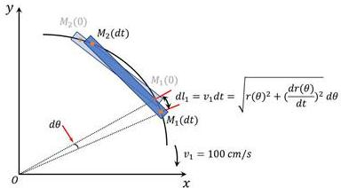

y
M₂(0)
M₂(dt)
M₁(0)
dθ
d1₁ = v₁ dt = √(r(θ)² + (dr(θ)/dt)²) dθ
M₁(dt)
v₁ = 100 cm/s
x
O

图 3 螺旋线弧长的积分求解

若设龙头把手的初始位置的极角为 $\theta_{1}(0)$ ，经过时间t后走到新的位置，极角为 $\theta_{1}(t)$ ，则其划过的弧线长度 $l_{1}$ 还可表示为：

$$
\begin{array}{l} l _ {1} = - \int_ {\theta_ {1} (0)} ^ {\theta_ {1} (t)} \sqrt {r ^ {2} + (\frac {d r}{d t}) ^ {2}} \cdot d \theta = - \int_ {\theta_ {1} (0)} ^ {\theta_ {1} (t)} \sqrt {\left(\frac {5 5}{2 \pi} \theta\right) ^ {2} + \left(\frac {5 5}{2 \pi}\right) ^ {2}} \cdot d \theta \\ = \frac {5 5}{4 \pi} \left[ \theta \cdot \sqrt {1 + \theta^ {2}} + \ln \left(\sqrt {1 + \theta^ {2}} + \theta\right) \right] \Bigg | _ {\theta_ {1} (t)} ^ {\theta_ {1} (0)} \tag {4} \\ = \frac {5 5}{4 \pi} \left[ \theta_ {1} (0) \cdot \sqrt {1 + \theta_ {1} (0) ^ {2}} + \ln \left(\sqrt {1 + \theta_ {1} (0) ^ {2}} + \theta_ {1} (0)\right) - \right. \\ \left. \theta_ {1} (t) \cdot \sqrt {1 + \theta_ {1} (t) ^ {2}} - \ln \left(\sqrt {1 + \theta_ {1} (t) ^ {2}} + \theta_ {1} (t)\right) \right] \\ \end{array}
$$

其中，由于龙头是从螺线外圈向螺线内圈移动，所以积分式前的负号是为了将积分结果改为正值，进而保证弧线长度的非负性。至此，龙头把手 $M_{1}$ 的极坐标 $(r_{1},\theta_{1}(t))$ 可通过联立式（1）（3）（4）得到：

$$
\left\{ \begin{array}{c} r = \frac {5 5}{2 \pi} \theta_ {1} \\ l _ {1} = 1 0 0 t \\ l _ {1} = \frac {5 5}{4 \pi} [ \theta_ {1} (0) \cdot \sqrt {1 + \theta_ {1} (0) ^ {2}} + \ln (\sqrt {1 + \theta_ {1} (0) ^ {2}} + \theta_ {1} (0)) - \\ \theta_ {1} (t) \cdot \sqrt {1 + \theta_ {1} (t) ^ {2}} - \ln (\sqrt {1 + \theta_ {1} (t) ^ {2}} + \theta_ {1} (t)) ] \end{array} \right. \tag {5}
$$

式（5）表明，龙头前把手的运动距离可同时由速度公式和弧长公式表示，且在龙头前把手初始时刻位置 $M_{1}(r_{1}(0),\theta_{1}(0))$ 已知的条件下，若给定时间 $\pmb{t}$ ，则我们可以求出在任意时刻下龙把手的极角 $\theta_{1}(t)$ ，进而在任意时刻下龙头前把手的位置坐标 $M_{1}(r_{1}(t),\theta_{1}(t))$ 均可确定。

由于式（5）结构复杂，无法直接解出 $\theta_{1}(t)$ 的显式形式，因此我们将龙头把手的极坐标 $M_{1}(r_{1}(t),\theta_{1}(t))$ 表示为式（5）的隐式形式，在后续参与模型求解。

# ■ 基于龙头前把手位置递推龙身与龙尾把手位置

龙身和龙尾节节相连，后一块把手的位置可由前一块决定，因此我们采用递推的方法，以龙头位置为起始参数，每个板凳前后把手的间距为递推的距离限制，以前一个把手为圆心建立圆的方程，和螺旋线产生交点，通过“联立方程—求出新交点—建立新方程—再次联立”的方式不断更新迭代次数，直至递推出龙身与龙尾上所有把手的坐标。

考虑到极角对位置的重要影响，本部分的核心就是根据龙头前把手在 $t$ 时刻下的极角 $\theta_{1}(t)$ ，递推出同一时刻下，其它所有把手极角 $\theta_{i}(t)$ 随时间的变化关系。

# (1) 方程的联立

如右图所示，设螺线上某把手在二维直角坐标系中的坐标为 $M_{j}(x_{j},y_{j})$ ，由于每个板凳前后两端孔径间的距离 $R$ 固定，因此以该把手的位置为圆心， $R$ 为半径画圆，与螺旋线的交点即为下一节把手可能存在的位置。但是，交点的数量较多，所以右图中仅画出了三种可能的相交方式为例说明。

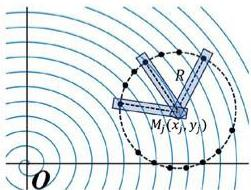

R
Mj(xj, yj)
O

图 4 圆和螺旋线方程的联立

由图4，以把手的坐标 $M(x_{m},y_{m})$ 为圆心，板凳前后两端孔径间的距离 $R$ 为半径的圆的方程可以表示为：

$$
(x - x _ {m}) ^ {2} + (y - y _ {m}) ^ {2} = R ^ {2} \tag {6}
$$

由式（1）与（2），我们可将螺旋线的方程改写为二维直角坐标形式：

$$
\left\{ \begin{array}{l} x = \frac {5 5}{2 \pi} \theta \cos \theta \\ y = \frac {5 5}{2 \pi} \theta \sin \theta \end{array} \right. \tag {7}
$$

因为所有的把手位置坐标均满足螺旋线的方程，所以联立式（6）与（7），可得圆在极坐标系下的方程：

$$
\left(\frac {5 5}{2 \pi} \theta \cos \theta - \frac {5 5}{2 \pi} \theta_ {m} \cos \theta_ {m}\right) ^ {2} - \left(\frac {5 5}{2 \pi} \theta \sin \theta - \frac {5 5}{2 \pi} \theta_ {m} \sin \theta_ {m}\right) ^ {2} = R ^ {2} \tag {8}
$$

其中， $\theta_{m}$ 为把手 $M$ 的极角，式（8）描述了在螺旋线上的下一把手的极角与把手 $M$ 之间满足的距离关系。根据该式，我们可能解出多个下一把手的极角解，因此我们需要对其进行筛选。

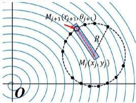

M_{j+1}(x_{j+1}, y_{j+1})
R
M_j(x_j, y_j)
O

图 5 把手的位置筛选示意图

如左图所示，在龙的盘入过程中，相比于其它把手，龙头把手的位置总是在螺旋线的内侧，因此龙头把手的极角大小总是小于其它把手的极角。类似地，越靠近龙尾的把手，相应的极角越大。对于所有可能的下一把手的极角解，我们只需要在所有大于该把手的极角解中，挑选出最小值，对应于与该把手相邻的下一把手，即图中的加重点 $M_{j+1}(r_{j+1},\theta_{j+1})$ 。

# (2) 龙身与龙尾把手位置的递推

# ① 龙头与龙身交界处的位置关系

由式（5）得出龙头前把手的极坐标 $M_{1}(r_{1},\theta_{1})$ ，因为龙头板凳两端孔径间的长度与龙身和龙尾不同，所以对于式（8），我们需要将半径 $R$ 修改为 $R_{1}$ ，表示出龙头后把手（第一节龙身的前把手） $M_2(r_2,\theta_2)$ 与龙头前把手的关系：

$$
\left\{ \begin{array}{c} \left(\frac {5 5}{2 \pi} \theta_ {2} \cos \theta_ {2} - \frac {5 5}{2 \pi} \theta_ {1} \cos \theta_ {1}\right) ^ {2} - \left(\frac {5 5}{2 \pi} \theta_ {2} \sin \theta_ {2} - \frac {5 5}{2 \pi} \theta_ {1} \sin \theta_ {1}\right) ^ {2} = R _ {1} ^ {2} \\ R _ {1} = 3 4 1 - 2 \times 2 7. 5 = 2 8 6 c m \end{array} \right. \tag {9}
$$

# ② 龙身与龙尾上所有把手位置的关系

从龙身的第一节板凳开始，往后所有的板凳前后两端的孔径之间的距离相等，均可以式（8）的形式来描述相邻把手位置之间的递推关系。结合龙身与龙尾板凳前后端孔径的间距 $R_{2}$ ，对于把手 $M_{i}(r_{i},\theta_{i})$ 与把手 $M_{i+1}(r_{i+1},\theta_{i+1})$ ，我们可将式（8）改写为：

$$
\left\{ \begin{array}{c} \left(\frac {5 5}{2 \pi} \theta_ {i + 1} \cos \theta_ {i + 1} - \frac {5 5}{2 \pi} \theta_ {i} \cos \theta_ {i}\right) ^ {2} - \left(\frac {5 5}{2 \pi} \theta_ {i + 1} \sin \theta_ {i + 1} - \frac {5 5}{2 \pi} \theta_ {i} \sin \theta_ {i}\right) ^ {2} = R _ {2} ^ {2} \\ R _ {2} = 2 2 0 - 2 7. 5 \times 2 = 1 6 5 c m \\ i = 2, 3, \dots , 2 2 4 \end{array} \right. \tag {10}
$$

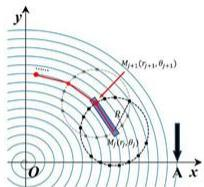

y
M_{j+1}(r_{j+1}, \theta_{j+1})
R
M_j(r_j,\theta_j)
O
x

图 6 龙身与龙尾把手位置的递推

如图 6 所示，同时结合式（5）（9）（10），我们可以先根据龙头前把手的初始位置推出其任意时刻的位置 $\theta_{1}(t)$ ，通过不断的递推，求出舞龙队所有把手在任意时刻的位置 $\theta_{i}(t)$ ，可用式（11）表示：

$$
\left\{ \begin{array}{c} r = \frac {5 5}{2 \pi} \theta \\ l _ {1} = 1 0 0 t = \frac {5 5}{4 \pi} \left[ \theta_ {1} (0) \cdot \sqrt {1 + \theta_ {1} (0) ^ {2}} + \ln \left(\sqrt {1 + \theta_ {1} (0) ^ {2}} + \theta_ {1} (0)\right) - \right. \\ \left. \theta_ {1} (t) \cdot \sqrt {1 + \theta_ {1} (t) ^ {2}} - \ln \left(\sqrt {1 + \theta_ {1} (t) ^ {2}} + \theta_ {1} (t)\right) \right] \\ (\frac {5 5}{2 \pi} \theta_ {i + 1} c o s \theta_ {i + 1} - \frac {5 5}{2 \pi} \theta_ {i} c o s \theta_ {i}) ^ {2} - (\frac {5 5}{2 \pi} \theta_ {i + 1} s i n \theta_ {i + 1} - \frac {5 5}{2 \pi} \theta_ {i} s i n \theta_ {i}) ^ {2} = R _ {i} ^ {2} \\ R _ {i} = \left\{ \begin{array}{l l} 2 8 6 c m & i = 1 \\ 1 6 5 c m & i = 2, 3, \dots , 2 2 4 \end{array} \right. \end{array} \right. \tag {11}
$$

因为龙头前把手的位置随时间的关系是隐式表达式，所以基于龙头前把手位置递推出的所有把手的位置也是隐式关系，可通过后续的递推求解。因此我们将全部把手位置的极坐标 $M_{i}(r_{i}(t),\theta_{i}(t))$ i=1,2,...,224 表示为式（11）的分段隐式形式，在后续参与模型求解。

# ■ 基于龙身与龙尾位置计算把手速度

对于龙身与龙尾的速度，我们可通过计算每个把手对应弧长关于时间的微分获得。考虑到极角对把手位置的重要影响，本部分的核心就是根据各把手在t时刻下的极角 $\theta_{i}(t)$ ，递推出 $(t+dt)$ 时刻下的极角 $\theta_{i}(t+dt)$ ，将两时刻下的极角代入到弧长公式中，根据 $v=\frac{ds}{dt}$ ，计算出任一把手在任意时刻下的速度。

假设t时刻某龙身（龙尾）的把手坐标可表示为 $M_{i}(r_{i}(t),\theta_{i}(t))$ ，在 $(t+dt)$ 时刻为 $M_{i}(r_{i}(t+dt),\theta_{i}(t+dt))$ 。则把手i在t时刻的速度 $v_{i}(t)$ 可表示为：

$$
v _ {i} (t) = \frac {d l _ {i} (\theta (t))}{d t} = \frac {l _ {i} (\theta (t + d t)) - l _ {i} (\theta (t))}{d t} \tag {12}
$$

●在式（5）的基础上，我们改变积分表达式为把手 $M_{i}$ 经过的总弧长 $l_{i}$ 与时间的关系，即：

$$
l _ {i} = \frac {5 5}{4 \pi} [ \theta_ {i} (0) \cdot \sqrt {1 + \theta_ {i} (0) ^ {2}} + \ln (\sqrt {1 + \theta_ {i} (0) ^ {2}} + \theta_ {i} (0)) \tag {13}
$$

$$
- \theta_ {i} (t) \cdot \sqrt {1 + \theta_ {i} (t) ^ {2}} - \ln \left(\sqrt {1 + \theta_ {i} (t) ^ {2}} + \theta_ {i} (t)\right) ]
$$

\- 由式（12）与式（13），得出把手i在t时刻的速度 $v_{i}(t)$ 表达式：

$$
\begin{array}{l} v _ {i} (t) = \frac {d l _ {i} (\theta (t))}{d t} = \frac {\frac {5 5}{4 \pi} \left[ \theta \cdot \sqrt {1 + \theta^ {2}} + \ln (\sqrt {1 + \theta^ {2}} + \theta) \right] \Big | _ {\theta_ {i} (t + d t)} ^ {\theta_ {i} (t)}}{d t} \\ = \frac {5 5}{4 \pi} \left[ \theta_ {i} (t) \cdot \sqrt {1 + \theta_ {i} (t) ^ {2}} + \ln \left(\sqrt {1 + \theta_ {i} (t) ^ {2}} + \theta_ {i} (t)\right) \right. \tag {14} \\ \end{array}
$$

$$
\left. - \theta_ {i} (t + d t) \cdot \sqrt {1 + \theta_ {i} (t + d t) ^ {2}} - \ln \left(\sqrt {1 + \theta_ {i} (t + d t) ^ {2}} + \theta_ {i} (t + d t)\right) \right]
$$

●同理，把手 $i+1$ 在t时刻的速度 $v_{i+1}(t)$ 表达式可表示为：

$$
\begin{array}{l} v _ {i + 1} (t) = \frac {d l _ {i + 1} (\theta (t))}{d t} = \frac {\frac {5 5}{4 \pi} \left[ \theta \cdot \sqrt {1 + \theta^ {2}} + \ln \left(\sqrt {1 + \theta^ {2}} + \theta\right) \right] \Big | _ {\theta_ {i + 1} (t + d t)} ^ {\theta_ {i} (t)}}{d t} \tag {15} \\ = \frac {5 5}{4 \pi} \left[ \theta_ {i + 1} (t) \cdot \sqrt {1 + \theta_ {i + 1} (t) ^ {2}} + \ln \left(\sqrt {1 + \theta_ {i + 1} (t) ^ {2}} + \theta_ {i + 1} (t)\right) \right. \\ \end{array}
$$

$$
\left. - \theta_ {i + 1} (t + d t) \cdot \sqrt {1 + \theta_ {i + 1} (t + d t) ^ {2}} - \ln \left(\sqrt {1 + \theta_ {i + 1} (t + d t) ^ {2}} + \theta_ {i + 1} (t + d t)\right) \right]
$$

又因为把手 $i+1$ 在 t 时刻的极角可由把手 i 在 t 时刻的极角递推而来，满足式(11)中的关系：

$$
\left\{ \begin{array}{c} \left(\frac {5 5}{2 \pi} \theta_ {i + 1} \cos \theta_ {i + 1} - \frac {5 5}{2 \pi} \theta_ {i} \cos \theta_ {i}\right) ^ {2} - \left(\frac {5 5}{2 \pi} \theta_ {i + 1} \sin \theta_ {i + 1} - \frac {5 5}{2 \pi} \theta_ {i} \sin \theta_ {i}\right) ^ {2} = R _ {i} ^ {2} \\ R _ {i} = \left\{ \begin{array}{l l} 2 8 6 c m & i = 1 \\ 1 6 5 c m & i = 2, 3, \dots , 2 2 4 \end{array} \right. \end{array} \right.
$$

所以龙身和龙尾各把手的速度可用下列隐式递推形式表示出来：

$$
\left\{ \begin{array}{l} v _ {i} (t) = \frac {5 5}{4 \pi} \left[ \theta_ {i} (t) \cdot \sqrt {1 + \theta_ {i} (t) ^ {2}} + \ln \left(\sqrt {1 + \theta_ {i} (t) ^ {2}} + \theta_ {i} (t)\right) \right. \\ - \theta_ {i} (t + d t) \cdot \sqrt {1 + \theta_ {i} (t + d t) ^ {2}} - \ln \left(\sqrt {1 + \theta_ {i} (t + d t) ^ {2}} + \theta_ {i} (t + d t)\right) ] \\ v _ {i + 1} (t) = \frac {5 5}{4 \pi} \left[ \theta_ {i + 1} (t) \cdot \sqrt {1 + \theta_ {i + 1} (t) ^ {2}} + \ln \left(\sqrt {1 + \theta_ {i + 1} (t) ^ {2}} + \theta_ {i + 1} (t)\right) \right. \\ - \theta_ {i + 1} (t + d t) \sqrt {1 + \theta_ {i + 1} (t + d t) ^ {2}} - \ln \left(\sqrt {1 + \theta_ {i + 1} (t + d t) ^ {2}} + \theta_ {i + 1} (t + d t)\right) ] \\ (\frac {5 5}{2 \pi} \theta_ {i + 1} c o s \theta_ {i + 1} - \frac {5 5}{2 \pi} \theta_ {i} c o s \theta_ {i}) ^ {2} - (\frac {5 5}{2 \pi} \theta_ {i + 1} s i n \theta_ {i + 1} - \frac {5 5}{2 \pi} \theta_ {i} s i n \theta_ {i}) ^ {2} = R _ {i} ^ {2} \\ R _ {i} = \left\{ \begin{array}{l l} 2 8 6 c m & i = 1 \\ 1 6 5 c m & i = 2, 3, \dots , 2 2 4 \end{array} \right. \end{array} \right. \tag {16}
$$

由于龙身与龙尾各把手的位置是隐式关系，可通过后续递推求解，因此我们将它们的速度 $v_{i}(t)$ 表示为如（15）所示的隐式关系，在后续参与模型求解。

综上所述，结合各把手的位置与速度方程，我们给出舞龙队的运动状态模型：

$$
\left\{ \begin{array}{l} {\mathrm{各把手的位置:}} \\ {r _ {i} = \frac {5 5}{2 \pi} \theta_ {i} \qquad x _ {i} = r _ {i} c o s \theta_ {i} \qquad y _ {i} = r _ {i} s i n \theta_ {i}} \\ {l _ {1} = 1 0 0 t = \frac {5 5}{4 \pi} [ \theta_ {1} (0) \cdot \sqrt {1 + \theta_ {1} (0) ^ {2}} + \ln \left(\sqrt {1 + \theta_ {1} (0) ^ {2}} + \theta_ {1} (0)\right) -} \\ {\qquad \qquad \qquad \qquad \theta_ {1} (t) \cdot \sqrt {1 + \theta_ {1} (t) ^ {2}} + \ln \left(\sqrt {1 + \theta_ {1} (t) ^ {2}} + \theta_ {1} (t)\right) ]} \\ {( \frac {5 5}{2 \pi} \theta_ {i + 1} c o s \theta_ {i + 1} - \frac {5 5}{2 \pi} \theta_ {i} c o s \theta_ {i}) ^ {2} - (\frac {5 5}{2 \pi} \theta_ {i + 1} s i n \theta_ {i + 1} - \frac {5 5}{2 \pi} \theta_ {i} s i n \theta_ {i}) ^ {2} = R _ {i} ^ {2}} \\ {R _ {i} = \left\{ \begin{array}{l l} {{^ {2 8 6 c m}}} & {{i = 1}} \\ {{^ {1 6 5 c m}}} & {{i = 2, 3, \ldots , 2 2 4}} \end{array} \right.} \\ {\mathrm{各把手的速度:}} \\ {v _ {i} (t) = \frac {5 5}{4 \pi} [ \theta_ {i} (t) \cdot \sqrt {1 + \theta_ {i} (t) ^ {2}} + \ln \left(\sqrt {1 + \theta_ {i} (t) ^ {2}} + \theta_ {i} (t)\right)} \\ {- \theta_ {i} (t + d t) \cdot \sqrt {1 + \theta_ {i} (t + d t) ^ {2}} - \ln \left(\sqrt {1 + \theta_ {i} (t + d t) ^ {2}} + \theta_ {i} (t + d t)\right) ]} \end{array} \right. \tag {17}
$$

# 5.1.2 舞龙队运动状态模型的求解

# ■ 求解过程

# (1) 舞龙队位置的计算

# ① 龙头位置的计算

在极坐标系中，龙头前把手的初始位置位于螺线第16圈A点处，因为每一圈的螺距固定为 $55\mathrm{cm}$ ，所以其坐标可表示为 $M_{1}(880,32\pi)$ 。因此在时间给定的条件下，式（5）龙头前把手的位置坐标方程中，只有 $\theta_{1}(t)$ 是未知量。 $\theta_{1}(t)$ 是确定龙头前把手在经过时间 $t$ 后所在位置的重要参数，我们将式（5）转化为：

$$
\begin{array}{l} \frac {5 5}{4 \pi} \left[ \theta_ {1} (t) \cdot \sqrt {1 + \theta_ {1} (t) ^ {2}} + \ln \left(\sqrt {1 + \theta_ {1} (t) ^ {2}} + \theta_ {1} (t)\right) - \theta_ {1} (0) \cdot \sqrt {1 + \theta_ {1} (0) ^ {2}} \right. \tag {18} \\ \left. - \ln \left(\sqrt {1 + \theta_ {1} (0) ^ {2}} + \theta_ {1} (0)\right) \right] - 1 0 0 t = 0 \\ \end{array}
$$

其中， $\theta_{1}(t)$ 对应于该方程的根，由于该方程可能存在多个解，且待筛选的解附近的区间是单调的，因此我们采用二分法对解的位置进行搜索，具体流程如下：

STEP1 确定使用二分法的区间：以龙头前把手的极角 $32\pi$ 为起始边界，步长为 $0.0001\pi$ ，基于解的唯一性定理，用边界相乘的方法向右寻找与龙头前把手相邻且极角增加量最小的解存在的区间。若搜索不到，则令本次搜索的右边界作为下次搜索边界的左端点，直至边界值的乘积为负，代表本次搜索范围包含了方程的根。

STEP2 基于二分法逼近零点：以 STEP1 中搜索出的区间中点作为二分法的判断条件，利用解两端的边界值相乘为负作为解存在的判断依据，利用边界相乘的方法不断使搜索区间逼近零点。

STEP3达到搜索次数，结束算法：当搜索区间更新20次后，我们认为其搜索精度较高。此时我们将第二十次的搜索区间的中点近似认作待求零点，输出该值并结束算法。

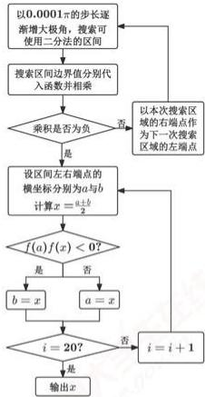

```mermaid
graph TD
    A["以0.0001π的步长逐渐增大极角，搜索可使用二分法的区间"] --> B["搜索区间边界值分别代入函数并相乘"]
    B --> C{乘积是否为负}
    C -->|是| D["设区间左右端点的横坐标分别为a和b"]
    C -->|否| E["以本次搜索区域的右端点作为下一次搜索区域的左端点"]
    D --> F{f(a)f(x) < 0?}
    F -->|是| G["b = x"]
    F -->|否| H["a = x"]
    G --> I{i = 20?}
    H --> I
    I -->|是| J["输出x"]
    I -->|否| K["i = i + 1"]
    K --> E
```

图 7 二分法求解龙头前把手位置流程图

基于二分法，在给定时间的条件下，我们最终可求得龙头的极角 $\theta_{1}(t)$ 。将其代入阿基米德螺旋线方程式（1）后，我们可求出 $0\sim 300~\mathrm{s}$ 范围内每隔 $60~\mathrm{s}$ 龙头前把手的极坐标。接着，根据式（2），将极坐标转换成平面直角坐标，得到 $0\sim 300~\mathrm{s}$ 范围内每隔 $60~\mathrm{s}$ 龙头前把手的平面直角坐标数据，如表2所示。

表 2 从 0\~300 s 范围内每隔 60 s 龙头前把手的平面直角坐标

<table><tr><td>时间(s)</td><td>0</td><td>60</td><td>120</td><td>180</td><td>240</td><td>300</td></tr><tr><td>坐标x(m)</td><td>8.800000</td><td>5.799209</td><td>-4.084887</td><td>-2.963609</td><td>2.594494</td><td>4.420274</td></tr><tr><td>坐标y(m)</td><td>0.000000</td><td>-5.771092</td><td>-6.304479</td><td>6.094780</td><td>-5.356743</td><td>2.320429</td></tr></table>

# ② 龙身与龙尾位置的计算

根据式（17），我们将相邻把手位置之间的距离关系转换成函数形式：

$$
\begin{array}{l} \left(\frac {5 5}{2 \pi} \theta_ {i + 1} \cos \theta_ {i + 1} - \frac {5 5}{2 \pi} \theta_ {i} \cos \theta_ {i}\right) ^ {2} - \left(\frac {5 5}{2 \pi} \theta_ {i + 1} \sin \theta_ {i + 1} - \frac {5 5}{2 \pi} \theta_ {i} \sin \theta_ {i}\right) ^ {2} - R _ {i} ^ {2} = 0 \\ R _ {i} = \left\{ \begin{array}{l l} 2 8 6 c m & i = 1 \\ 1 6 5 c m & i = 2, 3, \dots , 2 2 4 \end{array} \right. \tag {19} \\ \end{array}
$$

与龙头前把手位置的计算方法类似，我们同样可以利用二分法，在同一时刻下对式（19）中待筛选的解的位置进行搜索，最终我们可以得到从 $0\sim 300s$ 范围内每隔60s龙头后面第1、51、101、151、201节龙身前把手和龙尾后把手的极角，转换成二维直角坐标系。根据题干要求，我们将这部分数据与表2合并，得到龙头前把手、部分龙身前把手和龙尾后把手的位置表格，如表3所示，在后面的结果展示与分析中给出。

# (2) 龙身与龙尾速度的计算

根据式（17），我们可利用龙头前把手的初始时刻的极角 $\theta_{1}(0)$ 推出其在 $t$ 时刻的极角 $\theta_{1}(t)$ ，根据递推关系，我们可以得出所有把手在 $t$ 时刻的极角 $\theta_{i}(t)$ 。当时刻变为 $t + \Delta t$ 时，所有把手的极角对应变化为 $\theta_{i}(t + \Delta t)$ 。当 $\Delta t$ 足够小时，根据极角变化对应的弧长变化，我们可以利用平均速率近似求解对应时刻的瞬时速率。计算流程如下：

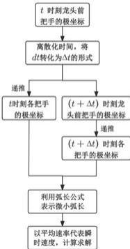

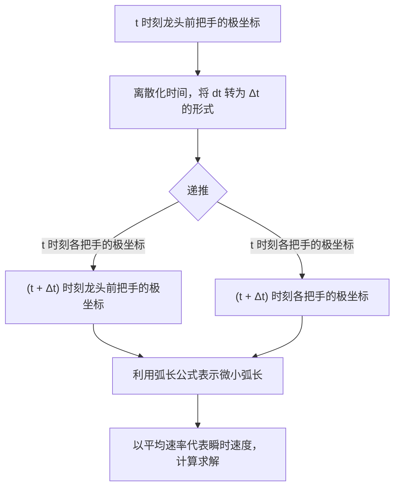

图8利用 $\Delta t$ 带来的微小弧长近似计算瞬时速率

STEP1 离散化时间: 将式(17)中的时间微分dt离散化处理为 $\Delta t$ 的形式

STEP2 引入 $\Delta t$ 的变化：在给定时刻 $t$ 的条件下，通过引入 $\Delta t$ 的时间变化，引起龙头前把手的位置微变化，根据位置的递推关系，进而引起盘龙全部把手的位置微变化，对应于极角的变化。

STEP3 表示微小弧长：利用弧长公式，将每个把手极角的微小变化转化成 $\Delta t$ 时间内走过的弧长。

STEP4 计算瞬时速度：由于每段弧长极小，所以我们可认为各把手在各自这段弧长的运动过程中是都是匀速的，可以用各自弧长段对应的平均速率代表各把手在t时刻的瞬时速度。

根据以上算法，我们可以求出各节把手的瞬时速度。依题意，我们将0\~300s范围内每隔60s对应的龙头前把手，部分龙身前把手及龙尾后把手的速度展示在表4中。

# ■ 结果展示与结果分析

# (1) 位置结果展示

表 3 龙头前把手、部分龙身前把手和龙尾后把手的位置

<table><tr><td></td><td>0 s</td><td>60 s</td><td>120 s</td><td>180 s</td><td>240 s</td><td>300 s</td></tr><tr><td>龙头 x (m)</td><td>8.800000</td><td>5.799209</td><td>-4.084887</td><td>-2.963609</td><td>2.594494</td><td>4.420274</td></tr><tr><td>龙头 y (m)</td><td>0.000000</td><td>-5.771092</td><td>-6.304479</td><td>6.094780</td><td>-5.356743</td><td>2.320429</td></tr><tr><td>第 1 节龙身 x (m)</td><td>8.363824</td><td>7.456758</td><td>-1.445473</td><td>-5.237118</td><td>4.821221</td><td>2.459489</td></tr><tr><td>第 1 节龙身 y (m)</td><td>2.826544</td><td>-3.440399</td><td>-7.405883</td><td>4.359627</td><td>-3.561949</td><td>4.402476</td></tr><tr><td>第 51 节龙身 x (m)</td><td>-9.518732</td><td>-8.686317</td><td>-5.543150</td><td>2.890455</td><td>5.980011</td><td>-6.301346</td></tr><tr><td>第 51 节龙身 y (m)</td><td>1.341137</td><td>2.540108</td><td>6.377946</td><td>7.249289</td><td>-3.827758</td><td>0.465829</td></tr><tr><td>第 101 节龙身 x (m)</td><td>2.913983</td><td>5.687116</td><td>5.361939</td><td>1.898794</td><td>-4.917371</td><td>-6.237722</td></tr><tr><td>第 101 节龙身 y (m)</td><td>-9.918311</td><td>-8.001384</td><td>-7.557638</td><td>-8.471614</td><td>-6.379874</td><td>3.936008</td></tr><tr><td>第 151 节龙身 x (m)</td><td>10.861726</td><td>6.682311</td><td>2.388757</td><td>1.005154</td><td>2.965378</td><td>7.040740</td></tr><tr><td>第 151 节龙身 y (m)</td><td>1.828753</td><td>8.134544</td><td>9.727411</td><td>9.424751</td><td>8.399721</td><td>4.393013</td></tr><tr><td>第 201 节龙身 x (m)</td><td>4.555102</td><td>-6.619664</td><td>-10.627211</td><td>-9.287720</td><td>-7.457151</td><td>-7.458662</td></tr><tr><td>第 201 节龙身 y (m)</td><td>10.725118</td><td>9.025570</td><td>1.359847</td><td>-4.246673</td><td>-6.180726</td><td>-5.263384</td></tr><tr><td>龙尾(后)x (m)</td><td>-5.305444</td><td>7.364557</td><td>10.974348</td><td>7.383896</td><td>3.241051</td><td>1.785033</td></tr><tr><td>龙尾(后)y (m)</td><td>-10.676584</td><td>-8.797992</td><td>0.843473</td><td>7.492370</td><td>9.469336</td><td>9.301164</td></tr></table>

因表 3 中数据不直观，我们将 result1.xlsx 中的数据可视化处理，结果分析如下：

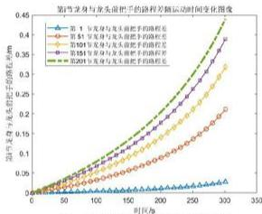

<details>
<summary>line</summary>

第1年与兔兔相关的路程差随时间变化图例
| 时间 (min) | 第1年及兔兔相关的路程差 (mm) | 第5年及兔兔相关的路程差 (mm) | 第10年及兔兔相关的路程差 (mm) | 第15年及兔兔相关的路程差 (mm) | 第20年及兔兔相关的路程差 (mm) |
|---|---|---|---|---|---|
| 0 | 0.0 | 0.0 | 0.0 | 0.0 | 0.0 |
| 50 | 0.05 | 0.07 | 0.09 | 0.11 | 0.13 |
| 100 | 0.1 | 0.14 | 0.18 | 0.22 | 0.26 |
| 150 | 0.15 | 0.21 | 0.26 | 0.31 | 0.37 |
| 200 | 0.2 | 0.29 | 0.35 | 0.4 | 0.46 |
| 250 | 0.25 | 0.37 | 0.44 | 0.5 | 0.57 |
| 300 | 0.3 | 0.46 | 0.54 | 0.6 | 0.67 |
| 350 | 0.35 | 0.56 | 0.65 | 0.7 | 0.77 |
</details>

图9把手路程差随时间变化的图像

左图为部分龙身与龙头前把手的路程差随时间变化的图像，观察到：

①龙身与龙头前把手的路程差均关于时间单调递增，函数图像为凹函数，斜率不断增大。这意味着相同时间下，龙头和龙身的速度差在随着时间不断增大。因为龙头速度固定，所以龙身各节速度必然衰减，这也在表4的数据中得到了体现。

②把手节点越靠近龙尾，在相同时间内和龙头前把手的路程差越大。这表明外侧的把手速度衰减比内侧的更大。

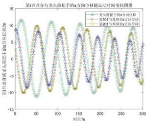

<details>
<summary>line</summary>

| 时间/s | 走头前把手x方向位移/m (左角起始点) | 走头前把手x方向位移/m (右角起始点) | 走头前把手x方向位移/m (右角起始点) |
|---|---|---|---|
| 0 | 10.0 | 10.0 | 10.0 |
| 50 | -10.0 | -10.0 | -10.0 |
| 100 | 10.0 | 10.0 | 10.0 |
| 150 | -10.0 | -10.0 | -10.0 |
| 200 | 10.0 | 10.0 | 10.0 |
| 250 | -10.0 | -10.0 | -10.0 |
| 300 | 10.0 | 10.0 | 10.0 |
</details>

图 10 第i块板凳前把手x方向位移关于时间的变化

左图为龙头、第101、第201节龙身前把手的x方向位移关于时间的变化关系图像。在图中我们可以看出：

①每一块板凳前把手在x方向的位移随着时间呈现周期性变化，且位移幅值随时间的增大而减小。这种位置变化表现出前把手的螺旋运动特性，即一方面在做具有周期变化特性的旋转运动，另一方面在不断靠近螺线中心。

②不同块板凳之间在x方向的位移随着时间呈现相位差的特性。这代表着后一节把手在不断跟进前一把手的位置，不同节把手的运动具有滞后性。

# (2) 速度结果展示

表 4 未发生碰撞时龙头前把手、部分龙身前把手和龙尾后把手的速度

<table><tr><td></td><td>0 s</td><td>60 s</td><td>120 s</td><td>180 s</td><td>240 s</td><td>300 s</td></tr><tr><td>龙头 (m/s)</td><td>1.000000</td><td>1.000000</td><td>1.000000</td><td>1.000000</td><td>1.000000</td><td>1.000000</td></tr><tr><td>第 1 节龙身 (m/s)</td><td>0.999971</td><td>0.999961</td><td>0.999945</td><td>0.999917</td><td>0.999859</td><td>0.999709</td></tr><tr><td>第 51 节龙身 (m/s)</td><td>0.999742</td><td>0.999662</td><td>0.999538</td><td>0.999331</td><td>0.998941</td><td>0.998064</td></tr><tr><td>第 101 节龙身 (m/s)</td><td>0.999575</td><td>0.999453</td><td>0.999269</td><td>0.998971</td><td>0.998435</td><td>0.997300</td></tr><tr><td>第 151 节龙身 (m/s)</td><td>0.999448</td><td>0.999299</td><td>0.999077</td><td>0.998727</td><td>0.998114</td><td>0.996860</td></tr><tr><td>第 201 节龙身 (m/s)</td><td>0.999348</td><td>0.999180</td><td>0.998934</td><td>0.998551</td><td>0.997893</td><td>0.996573</td></tr><tr><td>龙尾(后)(m/s)</td><td>0.999310</td><td>0.999137</td><td>0.998882</td><td>0.998489</td><td>0.997815</td><td>0.996476</td></tr></table>

因表 4 中数据不直观，我们将 result1.xlsx 中的数据可视化处理，结果分析如下：

右图是不同节点运动速度与时间的关系三维图，我们可以在图中看出：对于同一时刻下，除龙头前把手外，把手速度随着几点编号的增大而不断减慢，并且这种衰减现象会随着时刻的增大而加剧。对于同一节点的速度，随着时间的增大，速度会不断下降，并且速度的递减程度会随着节点编号的增大而加剧。

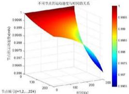

<details>
<summary>heatmap</summary>

| 时间(h) | 运动速度(m/s) | 节点编号(n=1,2,...,224) |
| ------- | ------------- | ---------------------- |
| 0       | 0.9995        | (various values)      |
| 130     | 0.9990        | (various values)      |
| 200     | 0.9985        | (various values)      |
| 240     | 0.9975        | (various values)      |
| 300     | 0.9965        | (various values)      |
| 360     | 0.9960        | (various values)      |
| 420     | 0.9955        | (various values)      |
| 480     | 0.9950        | (various values)      |
| 540     | 0.9945        | (various values)      |
| 600     | 0.9940        | (various values)      |
| 660     | 0.9935        | (various values)      |
| 720     | 0.9930        | (various values)      |
| 780     | 0.9925        | (various values)      |
| 840     | 0.9920        | (various values)      |
| 900     | 0.9915        | (various values)      |
| 960     | 0.9910        | (various values)      |
| 1020    | 0.9905        | (various values)      |
| 1080    | 0.9900        | (various values)      |
| 1140    | 0.9895        | (various values)      |
| 1200    | 0.9890        | (various values)      |
| 1260    | 0.9885        | (various values)      |
| 1320    | 0.9880        | (various values)      |
| 1380    | 0.9875        | (various values)      |
| 1440    | 0.9870        | (various values)      |
| 1500    | 0.9865        | (various values)      |
| 1560    | 0.9860        | (various values)      |
| 1620    | 0.9855        | (various values)      |
| 1680    | 0.9850        | (various values)      |
| 1740    | 0.9845        | (various values)      |
| 1800    | 0.9840        | (various values)      |
| 1860    | 0.9835        | (various values)      |
| 1920    | 0.9830        | (various values)      |
| 1980    | 0.9825        | (various values)      |
| 2040    | 0.9820        | (various values)      |
| 2100    | 0.9815        | (various values)      |
| 2160    | 0.9810        | (various values)      |
| 2220    | 0.9805        | (various values)      |
| 2280    | 0.9800        | (various values)      |
| 2340    | 0.9795        | (various values)      |
| 2400    | 0.9790        | (various values)      |
| 2460    | 0.9785        | (various values)      |
| 2520    | 0.9780        | (various values)      |
| 2580    | 0.9775        | (various values)      |
| 2640    | 0.9770        | (various values)      |
| 2700    | 0.9765        | (various values)      |
| 2760    | 0.9760        | (various values)      |
| 2820    | 0.9755        | (various values)      |
| 2880    | 0.9750        | (various values)      |
| 2940    | 0.9745        | (various values)      |
| 3000    | 0.9740        | (various values)      |
| 3645    | 1.1           | (various values)      |
| 3715    | 1.1           | (various values)      |
| 3785    | 1.1           | (various values)      |
| 3855    | 1.1           | (various values)      |
| 3925    | 1.1           | (various values)      |
| 4365    | 1.1           | (various values)      |
| 4435    | 1.1           | (various values)      |
| 4505    | 1.1           | (various values)      |
| 4575    | 1.1           | (various values)      |
| 4645    | 1.1           | (various values)      |
| 4715    | 1.1           | (various values)      |
| 4785    | 1.1           | (various values)      |
| 4855    | 1.1           | (various values)      |
| 4925    | 1.1           | (various values)      |
| 4995    | 1.1           | (various values)      |
| Note: The data is in a grid format with '时间(h)' as the index of the time axis and '运动速度(m/s)' as the y-axis position for each data point on the chart. There are no labels provided in the code.
</details>

图 11 不同节点的运动速度随时间的变化关系

# 灵敏度分析

对于龙头速度进行±5%的调整，通过计算龙身的速度变化的相对误差和绝对误差，我们发现模型对龙头的速度变化相对较大，因此模型对龙头速度的变化是敏感的。

# 5.2 问题二模型的建立与求解

问题二要求我们在问题一的基础上，继续运算直至板凳间恰好不发生碰撞。我们首先利用反证法证明了整条龙的首次可能碰撞必然发生在龙头上。接着，根据几何关系，表示出各板凳顶点的坐标以划定边界，便于碰撞检测。将龙头可能与龙身发生碰撞区域的板凳顶点均用二维直角坐标的形式表示。基于分离轴定理，将龙头碰撞问题转化为板凳所占矩形区域的重叠问题，进而建立出盘入碰撞检测模型。最后，我们通过递推法计算出终止时刻，并求得终止时刻处相关把手的位置与速度。

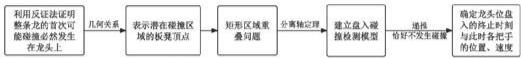

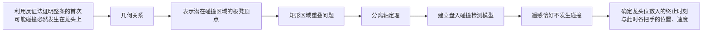

图 12 问题二的流程图

# 5.2.1 盘入碰撞检测模型的建立

# ■ 碰撞位置的说明

盘龙在运动过程中，龙头以恒定速度不断向内螺旋，板凳两端把手间距不变，导致相接的两个板凳间的夹角越来越小，进而可能与场上已存在的板凳发生碰撞。对于可能发生碰撞的表面和板凳，我们需要进行特殊说明，以简化后续的求解步骤。

# 整条龙的首次碰撞必然发生在龙头上：

设龙头位置 $M_{1}(r_{1}(t),\theta_{1}(t))$ ，后续的第 $i$ 个节点一直在重复龙头曾走过的位置，轨迹均为同一条螺旋线，龙头后面的节点运动具有滞后性。为证明整条龙的首次碰撞必然发生在龙头上，我们接下来采用反证法进行说明。

【反设】：假设整条龙的首次碰撞不发生在龙头上。

【归谬】：如果整条龙的首次碰撞不发生在龙头上，不妨设与把手 $M_{i}(r_{1}(t),\theta_{i}(t))$ 所对应的第i个板凳在t时刻与其它板凳发生了碰撞。我们在上文提到，龙头后面的节点运动具有滞后性，后一个把手的节点位置一直在重复前一节点先前运动过的轨迹。因此，如果t时刻第i个板凳发生了碰撞，那么在该板凳到达碰撞点前，必有第i-1个板凳在t时刻之前先发生了碰撞。同理，也有第i-2个板凳在第i-1个板凳碰撞之前先发生了碰撞，在此逻辑下不断递推，可得出碰撞最先发生于第1个板凳，即龙头。因此，该假设并不成立。

【结论】：整条龙的首次碰撞必然发生在龙头上。

# ■ 板凳顶点的推导

板凳的碰撞问题，实质上就是各板凳对应的矩形区域的重叠问题，由于板凳顶点是确定矩形区域范围的重要参数，所以现在需要利用把手 $M_{i}(x_{i},y_{i})$ 的坐标推导出对应连接的板凳的顶点坐标。

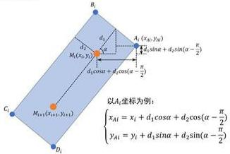

B₁
d₁
A₁(x₁₀,y₁ₙ)
M₁(x₂,y₂)
d₂
d₁cosα + d₂cos(α - π/2)
C₁
M₁₊₁(x₁₊₁,y₁₊₁)
D₁
以A₁坐标为例:
xₐᵢ = xᵢ + d₁cosα + d₂cos(α - π/2)
yₐᵢ = yᵢ + d₁sinα + d₂sin(α - π/2)

图 13 板凳顶点的推导

对于把手 $M_{i}(x_{i},y_{i})$ ，我们对由 $M_{i}$ 和 $M_{i + 1}$ 确定的第 $i$ 个板凳的顶点进行分析。如图13所示，由点 $M_{i}$ 和 $M_{i + 1}$ 确定的直线倾斜角 $\alpha$ 可以表示为：

$$
\alpha = \arctan \frac {y _ {i + 1} - y _ {i}}{x _ {i + 1} - x _ {i}} \tag {20}
$$

由几何关系，我们可以推出由 $M_{i}$ 和 $M_{i+1}$ 确定的第i个板凳的顶点 $A_{i}, B_{i}, C_{i}, D_{i}$ 的公式：

$$
\begin{array}{l} \left\{ \begin{array}{l} x _ {A i} = x _ {i} + d _ {1} \cos \alpha + d _ {2} \cos (\alpha - \frac {\pi}{2}) \\ y _ {A i} = y _ {i} + d _ {1} \sin \alpha + d _ {2} \sin (\alpha - \frac {\pi}{2}) \end{array} \right. \quad \left\{ \begin{array}{l} x _ {B i} = x _ {i} + d _ {1} \cos \alpha - d _ {2} \cos (\alpha - \frac {\pi}{2}) \\ y _ {B i} = y _ {i} + d _ {1} \sin \alpha - d _ {2} \sin (\alpha - \frac {\pi}{2}) \end{array} \right. \\ \left\{ \begin{array}{l} x _ {C i} = x _ {i + 1} - d _ {1} \cos \alpha + d _ {2} \cos (\alpha - \frac {\pi}{2}) \\ y _ {C i} = y _ {i + 1} - d _ {1} \sin \alpha + d _ {2} \sin (\alpha - \frac {\pi}{2}) \end{array} \right. \left\{ \begin{array}{l} x _ {D i} = x _ {i + 1} - d _ {1} \cos \alpha - d _ {2} \cos (\alpha - \frac {\pi}{2}) \\ y _ {D i} = y _ {i + 1} - d _ {1} \sin \alpha - d _ {2} \sin (\alpha - \frac {\pi}{2}) \end{array} \right. \tag {21} \\ d _ {1} = 2 7. 5 c m \quad d _ {2} = 1 5 c m \quad i = 1, 2, \dots , 2 2 4 \\ \alpha = \arctan \frac {y _ {i + 1} - y _ {i}}{x _ {i + 1} - x _ {i}} \\ \end{array}
$$

# ■ 分离轴定理的引入

# (1) 向量的表示

分离轴定理提出，对于凸多边形，若可找到一条轴同时可使两物体在该轴上的投影不产生重叠，那么这两个物体就是不相交的[1]。因此，对于盘龙矩形板凳的碰撞检测问题，我们可以使用分离轴定理来判断龙头是否和龙身产生碰撞。

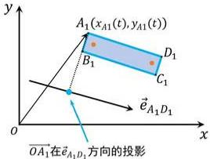

y
A₁(xₐ₁(t), yₐ₁(t))
B₁
C₁
x
O
OA₁在eₐ₁D₁方向的投影

图 13 投影轴向量的表示

如图 13，我们以矩形顶点 $A_{1}$ 和 $D_{1}$ 为例，可将向量 $\overrightarrow{OA_{1}}$ 用 $A_{1}$ 的坐标表示：

$$
\overrightarrow {O A _ {1}} = \left(x _ {A 1} (t), y _ {A 1} (t)\right) \tag {22}
$$

同时我们定义顶点 $A_{1}$ 与 $D_{1}$ 所确定方向的单位向量 $\vec{e}_{A_{1}D_{1}}$ 可表示为：

$$
\vec {e} _ {A _ {1} D _ {1}} = \frac {\left(x _ {D 1} (t) - x _ {A 1} (t) , y _ {D 1} (t) - y _ {A 1} (t)\right)}{\left| l _ {A _ {1} D _ {1}} \right|} \tag {23}
$$

在应用分离轴定理来考虑矩形与矩形之间是否有重叠时，投影轴向量可以选取矩形的邻边所在方向的单位向量。因此可以选取 $\vec{e}_{A_1D_1}$ 和 $\vec{e}_{A_1B_1}$ 作为龙头板凳矩形边的投影轴向量，由于形式类似，此处对 $\vec{e}_{A_1D_1}$ 进行说明。其中， $l_{A_1D_1} = \sqrt{(x_{D1}(t) - x_{A1}(t))^2 + (y_{D1}(t) - y_{A1}(t))^2}$ ，表示 $A_1$ 与 $D_1$ 之间的距离。

则 $\overrightarrow{OA_{1}}$ 在 $\vec{e}_{A_{1}D_{1}}$ 方向的投影可以用向量积的形式表示为：

$$
\overrightarrow {O A _ {1}} \cdot \vec {e} _ {A _ {1} D _ {1}} = \frac {x _ {A 1} (x _ {D 1} (t) - x _ {A 1} (t)) + y _ {A 1} (t) (y _ {D 1} (t) - y _ {A 1} (t))}{\left| l _ {A _ {1} D _ {1}} \right|}
$$

同理，我们也可以得出龙身板凳矩形边的投影轴向量 $\vec{e}_{A_iD_i},\vec{e}_{A_iB_i}$ ，因为把手位置在不断变化，所以它们都是关于时间变化而变化的向量。

# (2) 利用分离轴定理判断碰撞是否会发生

结合上述推出的投影轴向量，基于分离轴定理判断两矩形板凳是否产生碰撞的流程如下所示：

STEP1 表示投影点：对于龙头和某个可能发生碰撞的龙身板凳，如下图，我们可以得到两组投影轴向量 $\vec{e}_{A_{1}D_{1}}$ ， $\vec{e}_{A_{1}B_{1}}$ ， $\vec{e}_{A_{1}D_{1}}$ ， $\vec{e}_{A_{1}B_{1}}$ 。对于每个投影轴向量，我们均采用上述的向量积的形式，表示两组顶点分别在该投影轴上的投影。

STEP2 比较投影区间：由于矩形的对称性，每个矩形在同一条投影轴向量上会各自产生 2 个投影点，共计 4 个投影点。这 4 个投影点对应于 2 个区间，若这 2 个区间有交点，则更换投影轴再次进行投影，直至 4 条投影轴全部被使用。

STEP3 进行碰撞检测：经过 4 次比较，若未产生无交点的情况，则表明这两个矩形是有重叠区域的，对应于龙头和龙身的板凳产生了碰撞。

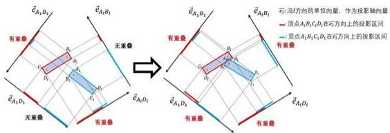

eA1B1
eA1B2
eA1D1
eA1D2
有重叠
无重叠
eA1D1
eA1D2
有重叠
无重叠
eA1D1
eA1D2
有重叠
无重叠
eA1D1
eA1D2
有重叠
无重叠
eA1D1
eA1D2
有重叠
无重叠
eA1D1
eA1D2
有重叠
无重疊
eA1D1
eA1D2
有重疊
无重疊
eA1D1
eA1D2
有重疊
无重疊
eA1D1
eA1D2
有重疊
无重疊
eA1D1
eA1D2
有重疊
无重疊
eA1D1
eA1D2
有重疊
无重疊
eA1D1

图 14 利用分离轴定理判断碰撞是否会发生

在 STEP3 中，对于重叠区域的检测方法，我们以检测投影轴向量 $\vec{e}_{A_{1}D_{1}}$ 上的重叠区域为例，做出如下解释：

由原点分别指向龙头板凳的四个顶点 $A_{1}, B_{1}, C_{1}, D_{1}$ 形成了四个向量，我们设它们在投影轴向量 $\vec{e}_{A_1D_1}$ 上的投影 $Q_{1}(t)$ 为：

$$
Q _ {1} (t) = \overrightarrow {O X _ {1}} \cdot \vec {e} _ {A _ {1} D _ {1}}, \quad X = A, B. C. D
$$

同理，由原点分别指向龙身板凳的四个顶点 $A_{i}, B_{i}, C_{i}, D_{i}$ 形成了四个向量，我们设

它们在投影轴向量 $\vec{e}_{A_1D_1}$ 上的投影 $R_{1}(t)$ 为：

$$
R _ {1} (t) = \overrightarrow {O X _ {1}} \cdot \vec {e} _ {A _ {1} D _ {1}}, \quad X = A, B. C. D \tag {24}
$$

如右图所示，为了判断两个区间是否有重叠区域，根据分离轴定理，若满足条件 $Q_{1}(t)_{max} > R_{1}(t)_{min}$ 且 $R_{1}(t)_{max} > Q_{1}(t)_{min}$ ，则可以说明两者是有重叠部分的。在其它情况下，两个区间不存在重叠区域，即不发生碰撞。

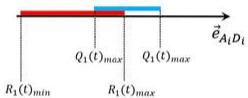

R₁(t)ₘᵢₙ
Q₁(t)ₘₐₓ
R₁(t)ₘₐₓ
Q₁(t)ₘₐₓ
e̅ᵢₗDᵢ

碰撞条件 $\left\{ \begin{array}{l} Q_{1}(t)_{max} > R_{1}(t)_{min}\\ R_{1}(t)_{max} > Q_{1}(t)_{min} \end{array} \right.$

图 15 区间重叠区域的判断

类似地， $Q_{i}(t)$ 与 $R_{i}(t)$ 也可以用上述方式判断对应矩形区域是否有重叠。

# (3) 判断函数的引入

为了更加直观地表示“恰好不发生碰撞”的状态，我们定义碰撞判断函数 $P(t)$ ，描述龙舞团由“未碰撞—碰撞”的转变：

$$
P (t) = \left\{ \begin{array}{l l} 1, & Q _ {i} (t) _ {m a x} > R _ {i} (t) _ {m i n} \text {且} R _ {i} (t) _ {m a x} > Q _ {i} (t) _ {m i n} \\ 0, & \text {其它} \end{array} \right. \tag {25}
$$

当龙头未发生碰撞时，碰撞判断函数 $P(t)$ 恒为1；

当龙头发生碰撞时， $Q_{i}(t)_{max} > R_{i}(t)_{min}$ 与 $R_{i}(t)_{max} > Q_{i}(t)_{min}$ 中必有一个成立，因此 $\min\left[\left[Q_{i}(t)_{max} - R_{i}(t)_{min}\right], \left[\left[R_{i}(t)_{max} - Q_{i}(t)_{min}\right], 0\right]=0\right.$ 碰撞判断函数 $P(t)$ 由 1 跳变为 0，代表龙头发生碰撞。

综上所述，由式（17）、（20）～（25）我们给出盘入碰撞检测模型：

各把手的位置：

$$
r _ {i} = \frac {5 5}{2 \pi} \theta_ {i} \quad x _ {i} = r _ {i} \cos \theta_ {i} \quad y _ {i} = r _ {i} \sin \theta_ {i}
$$

$$
l _ {1} = 1 0 0 t = \frac {5 5}{4 \pi} \left[ \theta_ {1} (0) \cdot \sqrt {1 + \theta_ {1} (0) ^ {2}} + \ln \left(\sqrt {1 + \theta_ {1} (0) ^ {2}} + \theta_ {1} (0)\right) - \right.
$$

$$
\left. \theta_ {1} (t) \cdot \sqrt {1 + \theta_ {1} (t) ^ {2}} + \ln \left(\sqrt {1 + \theta_ {1} (t) ^ {2}} + \theta_ {1} (t)\right) \right]
$$

$$
\left(\frac {5 5}{2 \pi} \theta_ {i + 1} \cos \theta_ {i + 1} - \frac {5 5}{2 \pi} \theta_ {i} \cos \theta_ {i}\right) ^ {2} - \left(\frac {5 5}{2 \pi} \theta_ {i + 1} \sin \theta_ {i + 1} - \frac {5 5}{2 \pi} \theta_ {i} \sin \theta_ {i}\right) ^ {2} = R _ {i} ^ {2}
$$

$$
R _ {i} = \left\{ \begin{array}{l l} 2 8 6 c m & i = 1 \\ 1 6 5 c m & i = 2, 3, \dots , 2 2 4 \end{array} \right.
$$

各把手的速度：

$$
v _ {i} (t) = \frac {5 5}{4 \pi} \left[ \theta_ {i} (t) \cdot \sqrt {1 + \theta_ {i} (t) ^ {2}} + \ln \left(\sqrt {1 + \theta_ {i} (t) ^ {2}} + \theta_ {i} (t)\right) \right. \tag {26}
$$

$$
\left. - \theta_ {i} (t + d t) \cdot \sqrt {1 + \theta_ {i} (t + d t) ^ {2}} - \ln \left(\sqrt {1 + \theta_ {i} (t + d t) ^ {2}} + \theta_ {i} (t + d t)\right) \right]
$$

分离轴定理坐标转换：

$$
\left\{ \begin{array}{l} x _ {A i} = x _ {i} + d _ {1} \cos \alpha + d _ {2} \sin \alpha \\ y _ {A i} = y _ {i} + d _ {1} \sin \alpha - d _ {2} \cos \alpha \end{array} \right. \quad \left\{ \begin{array}{l} x _ {B i} = x _ {i} + d _ {1} \cos \alpha - d _ {2} \sin \alpha \\ y _ {B i} = y _ {i} + d _ {1} \sin \alpha + d _ {2} \cos \alpha \end{array} \right.
$$

$$
\left\{ \begin{array}{l} x _ {C i} = x _ {i + 1} - d _ {1} \cos \alpha + d _ {2} \sin \alpha \\ y _ {C i} = y _ {i + 1} - d _ {1} \sin \alpha - d _ {2} \cos \alpha \end{array} \right. \quad \left\{ \begin{array}{l} x _ {D i} = x _ {i + 1} - d _ {1} \cos \alpha - d _ {2} \sin \alpha \\ y _ {D i} = y _ {i + 1} - d _ {1} \sin \alpha + d _ {2} \cos \alpha \end{array} \right.
$$

$$
d _ {1} = 2 7. 5 c m \quad d _ {2} = 1 5 c m \quad i = 1, 2, \dots , 2 2 4
$$

$$
\alpha = \arctan \frac {y _ {i + 1} - y _ {i + 1}}{x _ {i + 1} - x _ {i + 1}}
$$

碰撞检测函数：

$$
P (t) = \left\{ \begin{array}{l l} 1, & Q _ {i} (t) _ {m a x} > R _ {i} (t) _ {m i n} \text {且} R _ {i} (t) _ {m a x} > Q _ {i} (t) _ {m i n} \\ 0, & \text {其它} \end{array} \right.
$$

# 5.2.2 盘入碰撞检测模型的求解

# ■ 求解过程

基于分离轴定理判断两矩形板凳是否产生碰撞的流程如下所示：

# STEP1 初始化检测参数:

对于盘入碰撞检测模型，首先将时间离散化为 $\Delta t$ 的形式，同时取把手节数 $i=3,4,\ldots,40$ ，在i=1或2时，把手是龙头板凳的一部分；对于第40节把手所在的龙身板凳，已经可以将龙头完全包围，且龙头越盘入，半径越短，龙头不可能再与外层的龙身相遇，因此我们取 $i=3,4,\ldots,40$ 。

# STEP2 基于分离轴定理进行循环碰撞检测：

根据分离轴定理，首先对初始时刻的龙头周围的各板凳进行碰撞检测。若未发生碰撞，则我们可利用问题一建立的舞龙队运动状态模型，求出在 $\Delta t$ 时间变化范围下各把手 $(i=3,4,\ldots,40)$ 的极角位置变化，进而得出把手 $M_{l}(x_{l}(t),y_{l}(t))$ 在二维直角坐标系下的新坐标，再对新坐标进行碰撞检测。以此类推，直至有新的坐标产生碰撞。

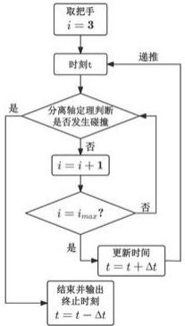

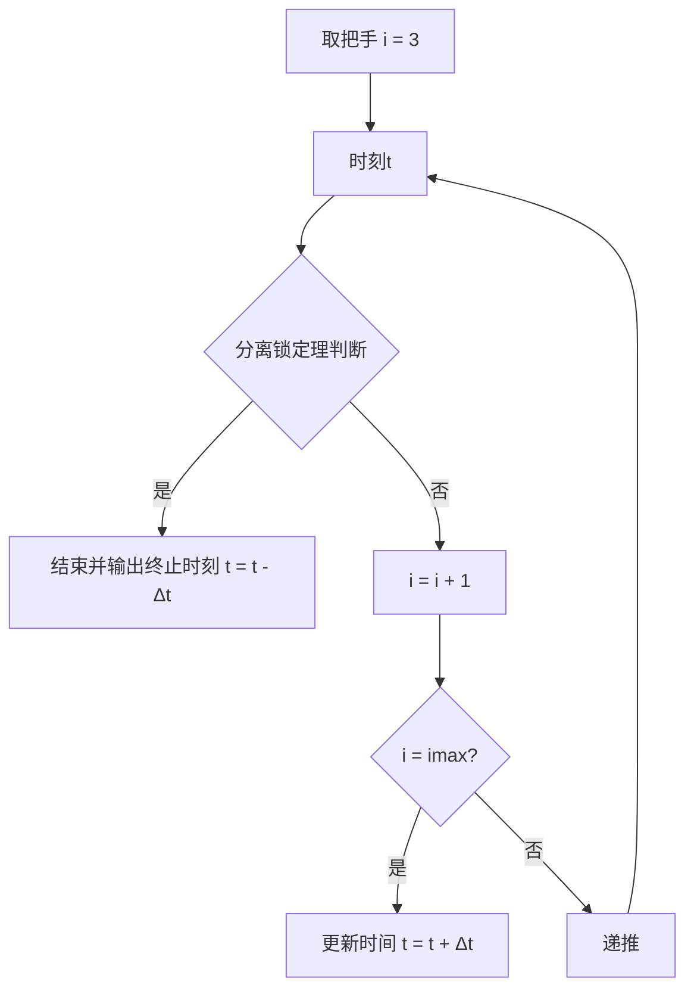

图 16 盘入碰撞检测模型的求解

# ■ 结果展示及分析

根据以上算法，我们最终求得舞龙队盘入的终止时刻为 412.47 s。

由题干要求，我们将发生碰撞时龙头前把手、龙头后面从1\~201条龙身每隔50条前把手和龙尾后把手的位置和速度展示在表5中。

表 5 发生碰撞时龙头前把手、部分龙身前把手和龙尾后把手的速度

<table><tr><td>把手</td><td>龙头</td><td>第 1 节龙身</td><td>第 51 节龙身</td><td>第 101 节龙身</td><td>第 151 节龙身</td><td>第 201 节龙身</td><td>龙尾(后)</td></tr><tr><td>位置  $\mathrm{x}\left( \mathrm{m}\right)$ </td><td>1.210065</td><td>-1.64367</td><td>1.281352</td><td>-0.536404</td><td>0.968683</td><td>-7.893184</td><td>0.956374</td></tr><tr><td>位置  $y\left( \mathrm{\;m}\right)$ </td><td>1.942693</td><td>1.753505</td><td>4.32654</td><td>-5.880121</td><td>-6.957499</td><td>-1.230607</td><td>8.322716</td></tr><tr><td>速度 (m/s)</td><td>1.000000</td><td>0.991517</td><td>0.976795</td><td>0.974486</td><td>0.973544</td><td>0.973032</td><td>0.972874</td></tr></table>

对于碰撞时的龙身各部分，我们将其用 MATLAB 绘图函数绘制在坐标系中，并对碰撞局部进行放大，如图 17 所示。

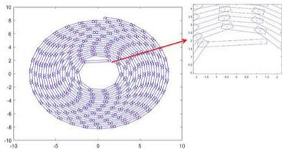

<details>
<summary>scatter</summary>

| x    | y    |
| ---- | ---- |
| -10  | -10  |
| -5   | -5   |
| 0    | 0    |
| 5    | 5    |
| 10   | 10   |
</details>

图 17 发生碰撞时盘龙的整体结构及碰撞局部放大

我们发现，碰撞发生于龙身板凳的中部，为了对比说明龙身不同位置处发生碰撞的可能性差别，我们将此处发生碰撞的前2s时的盘龙整体结构画出，如图18所示。

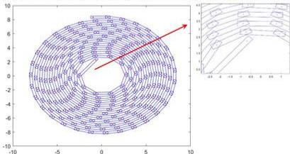

<details>
<summary>scatter</summary>

| x    | y    |
| ---- | ---- |
| -10  | 0    |
| -5   | 2    |
| 0    | 4    |
| 5    | 6    |
| 10   | 8    |
| 10   | -10  |
</details>

图 18 发生碰撞前 2 s 时盘龙整机结构及碰撞局部放大

根据图 18，我们可以看出，在龙身体结构的把手连接处，相邻板凳的空间更大，此处对于内侧的龙头而言，相对于龙身板凳中部不容易发生碰撞。

# 5.3 问题三模型的建立与求解

问题三实质上是一个使龙头可到达调头空间的最小螺距优化问题。基于问题二，我们将此问题转换为求龙头恰好不发生碰撞时的位置坐标，其位于调头空间与螺线的交点上。首先，我们以螺线螺距最小为目标函数，以螺距范围、问题二中建立的盘入碰撞检测模型为约束条件，建立以螺线螺距为决策变量的单目标优化模型。最后，通过变步长遍历法求出可使龙头前把手沿螺线盘入到调头空间边界的最小螺距。

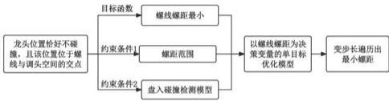

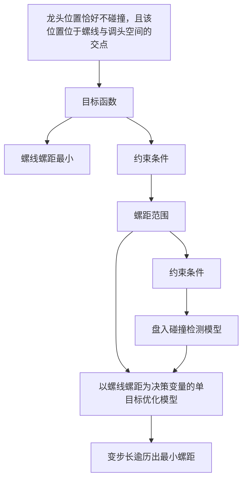

图 19 问题三求解流程图

# 5.3.1 最小螺距单目标优化模型的建立

# ■ 龙头盘入调头空间边界的极限情况的讨论

对于盘龙而言，螺距是影响其龙头发生碰撞的重要参数。盘龙行进时的螺距越大，龙头运动时的可活动空间越大，越不容易发生碰撞，对应恰不发生碰撞的位置更靠近螺线中心。

根据问题 3 的题设条件，只要龙头沿螺线在进入调头空间前不发生碰撞，我们即可认为龙头可以继续接下来的逆时针盘出的过程。因此，为了使螺距尽可能地小，会牺牲龙头的可移动空间，即龙头恰不发生碰撞的位置会随之提前。

为了不影响龙头后续的调头过程，同时最大限度地利用空间，当龙头恰不发生碰撞的位置由调头空间内提前到该空间与螺线的交点时，螺距就不可以继续减小了，因为继续缩小螺距会导致龙头恰发生碰撞的位置位于调头空间外，无法完成调头操作。

综上，我们选取调头空间与螺线的交点作为龙头恰发生碰撞的位置坐标，对螺距的搜索过程加以限制。

# ■ 最小螺距单目标优化模型的建立

# (1) 目标函数

根据上述对龙头盘入调头空间边界的极限情况的讨论，我们需要寻找满足题设位置限制的最小螺线螺距。因此我们令螺线的螺距p最小作为目标函数：

$$
\min _ {p} p \tag {27}
$$

# (2) 约束条件

# ① 螺线螺距范围约束

因为在问题二中，螺线的螺距为 55 cm，龙头发生碰撞时的位置距离螺线中心的距离为 2.289 m，小于调头空间的半径 4.5 m，所以根据我们对龙头盘入调头空间边界的极限情况的讨论，同时结合螺距为正数的特性，在后续求解过程中，我们认为最小螺距 p 满足螺线螺距范围约束：

$$
0 <   p <   5 5 c m \tag {28}
$$

# ② 盘入碰撞约束

问题二中的盘入碰撞检测模型可以求出一定螺距下，龙头发生碰撞时的位置。结合本间中对螺距最小时龙头恰不发生碰撞的位置的讨论，基于问题二的盘入碰撞检测模型，我们认为最小螺距 $p$ 满足盘入碰撞约束，又可细分为把手位置约束、分离轴定

理坐标约束、碰撞检测函数约束。

# ● 把手位置约束

根据问题二中式（26）对把手位置的递推表达式，最小螺距p满足把手位置约束：

$$
\begin{array}{l} r _ {i} = \frac {5 5}{2 \pi} \theta_ {i} \quad x _ {i} = r _ {i} \cos \theta_ {i} \quad y _ {i} = r _ {i} \sin \theta_ {i} \\ l _ {1} = 1 0 0 t = \frac {5 5}{4 \pi} \left[ \theta_ {1} (0) \cdot \sqrt {1 + \theta_ {1} (0) ^ {2}} + \ln \left(\sqrt {1 + \theta_ {1} (0) ^ {2}} + \theta_ {1} (0)\right) - \right. \\ \left. \theta_ {1} (t) \cdot \sqrt {1 + \theta_ {1} (t) ^ {2}} + \ln \left(\sqrt {1 + \theta_ {1} (t) ^ {2}} + \theta_ {1} (t)\right) \right] \tag {29} \\ \end{array}
$$

$$
R _ {i} ^ {2} = \left(\frac {5 5}{2 \pi} \theta_ {i + 1} \cos \theta_ {i + 1} - \frac {5 5}{2 \pi} \theta_ {i} \cos \theta_ {i}\right) ^ {2} - \left(\frac {5 5}{2 \pi} \theta_ {i + 1} \sin \theta_ {i + 1} - \frac {5 5}{2 \pi} \theta_ {i} \sin \theta_ {i}\right) ^ {2}
$$

$$
R _ {i} = \left\{ \begin{array}{l l} 2 8 6 c m & i = 1 \\ 1 6 5 c m & i = 2, 3, \dots , 2 2 4 \end{array} \right.
$$

# - 分离轴定理坐标约束

根据问题二式（26）中，分离轴定理对矩形顶点坐标的表达式，最小螺距p满足分离轴坐标约束：

$$
\begin{array}{l} \left\{ \begin{array}{l} x _ {A i} = x _ {i} + d _ {1} \cos \alpha + d _ {2} \sin \alpha \\ y _ {A i} = y _ {i} + d _ {1} \sin \alpha - d _ {2} \cos \alpha \end{array} \right. \quad \left\{ \begin{array}{l} x _ {B i} = x _ {i} + d _ {1} \cos \alpha - d _ {2} \sin \alpha \\ y _ {B i} = y _ {i} + d _ {1} \sin \alpha + d _ {2} \cos \alpha \end{array} \right. \\ \left\{ \begin{array}{l} x _ {C i} = x _ {i + 1} - d _ {1} \cos \alpha + d _ {2} \sin \alpha \\ y _ {C i} = y _ {i + 1} - d _ {1} \sin \alpha - d _ {2} \cos \alpha \end{array} \quad \left\{ \begin{array}{l} x _ {D i} = x _ {i + 1} - d _ {1} \cos \alpha - d _ {2} \sin \alpha \\ y _ {D i} = y _ {i + 1} - d _ {1} \sin \alpha + d _ {2} \cos \alpha \end{array} \right. \right. \tag {30} \\ \end{array}
$$

$$
d _ {1} = 2 7. 5 c m \quad d _ {2} = 1 5 c m \quad i = 1, 2, \dots , 2 2 4
$$

$$
\alpha = \arctan \frac {y _ {i + 1} - y _ {i + 1}}{x _ {i + 1} - x _ {i + 1}}
$$

# - 碰撞检测函数约束

根据问题二式（26）中，碰撞检测函数可以在龙头发生碰撞时发生值的跳变，因此最小螺距 $p$ 也满足碰撞检测函数约束：

$$
P (t) = \left\{ \begin{array}{l l} 1, & Q _ {i} (t) _ {m a x} > R _ {i} (t) _ {m i n} \text {且} R _ {i} (t) _ {m a x} > Q _ {i} (t) _ {m i n} \\ 0, & \text {其它} \end{array} \right. \tag {31}
$$

# (3) 最小螺线螺距单目标优化模型的给出

根据以上讨论的目标函数与约束条件，我们现给出以螺线螺距为决策变量的最小螺线螺距单目标优化模型：

$$
\min _ {p} p \tag {32}
$$

$$
\begin{array}{r l} & \left\{ \begin{array}{l} 0 <   p <   5 5 c m \\ r _ {i} = \frac {5 5}{2 \pi} \theta_ {i} \quad x _ {i} = r _ {i} \cos \theta_ {i} \quad y _ {i} = r _ {i} \sin \theta_ {i} \\ l _ {1} = 1 0 0 t = \frac {5 5}{4 \pi} [ \theta_ {1} (0) \cdot \sqrt {1 + \theta_ {1} (0) ^ {2}} + \ln (\sqrt {1 + \theta_ {1} (0) ^ {2}} + \theta_ {1} (0)) - \\ \theta_ {1} (t) \cdot \sqrt {1 + \theta_ {1} (t) ^ {2}} + \ln (\sqrt {1 + \theta_ {1} (t) ^ {2}} + \theta_ {1} (t)) ] \\ (\frac {5 5}{2 \pi} \theta_ {i + 1} \cos \theta_ {i + 1} - \frac {5 5}{2 \pi} \theta_ {i} \cos \theta_ {i}) ^ {2} - (\frac {5 5}{2 \pi} \theta_ {i + 1} \sin \theta_ {i + 1} - \frac {5 5}{2 \pi} \theta_ {i} \sin \theta_ {i}) ^ {2} = R _ {i} ^ {2} \\ R _ {i} = \left\{ \begin{array}{l l} 2 8 6 c m & i = 1 \\ 1 6 5 c m & i = 2, 3, \dots , 2 2 4 \end{array} \right. \\ s. t. & \left\{ \begin{array}{l l} x _ {A i} = x _ {i} + d _ {1} c o s \alpha + d _ {2} s i n   \alpha & x _ {B i} = x _ {i} + d _ {1} c o s \alpha - d _ {2} s i n   \alpha \\ y _ {A i} = y _ {i} + d _ {1} s i n \alpha - d _ {2} c o s \alpha & y _ {B i} = y _ {i} + d _ {1} s i n \alpha + d _ {2} c o s \alpha \\ x _ {C i} = x _ {i + 1} - d _ {1} c o s \alpha + d _ {2} s i n   \alpha & x _ {D i} = x _ {i + 1} - d _ {1} c o s \alpha - d _ {2} s i n   \alpha \\ y _ {C i} = y _ {i + 1} - d _ {1} s i n \alpha - d _ {2} c o s \alpha & y _ {D i} = y _ {i + 1} - d _ {1} s i n \alpha + d _ {2} c o s   \alpha \\ d _ {1} = 2 7. 5 c m & d _ {2} = 1 5 c m & i = 1, 2, \dots , 2 2 4 \\ & \alpha = a r c t a n \frac {y _ {i + 1} - y _ {i + 1}}{x _ {i + 1} - x _ {i + 1}} \\ P (t) = & \left\{ \begin{array}{l l} 1, & Q _ {i} (t) _ {\textit {m a x}} > R _ {i} (t) _ {\textit {m i n}}    \text {且}    R _ {i} (t) _ {\textit {m a x}} > Q _ {i} (t) _ {\textit {m i n}} \\ 0, & \text {其它} \end{array} \right. \end{array} \right. \end{array}
$$

# 5.3.2 最小螺距单目标优化模型的求解

# ■ 求解过程与结果展示

在螺距长度约束中，0 < p < 55 cm。为了在55 cm的范围内简洁、直观地求解出最小螺距，我们采用精度逐渐提升的变步长遍历法[2]，对螺距长度遍历，具体方法如下：

STEP1 大步长遍历：我们首先在 $p \in (0,55cm)$ 的范围内，从 $55cm$ 开始，以大步长 $\Delta p = 1cm$ 进行首次遍历，每个p都有对应的恰不发生碰撞的时刻t与极径r，我们画出r随p变化的图像如下：

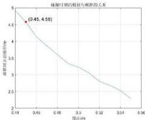

<details>
<summary>line</summary>

连续可测的段数与频次的关系
| 摇标 | 数值 |
|---|---|
| (0.45, 4.58) | 4.58 |
| (0.49, 3.5) | 3.5 |
| (0.52, 2.7) | 2.7 |
| (0.56, 2.2) | 2.1 |
</details>

图 20 大步长遍历搜索螺距

从 $p$ 取不同值对应的恰不发生碰撞的极径 $r$ 变化图像中，可以看出 $p$ 在最小精度区间 $[45cm,46cm]$ 内，极径 $r$ 穿越了调头区域的半径限制线 $4.5m_{\circ}$ 为了进一步确定更加精细的螺距值，我们以 $[45cm,46cm]$ 作为新的遍历范围，进行第二次遍历。

STEP2 小步长遍历：我们在 $p \in [45\ cm, 46\ cm]$ 的范围内，以小步长 $\Delta p = 0.01\ cm$ 进行第二次遍历，画出 $r$ 随 $p$ 变化的图像如下：

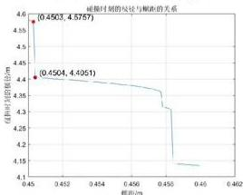

<details>
<summary>line</summary>

碰撞时刻的纵坐标与顺断的关系
| 粗距/m | (此时时刻的纵坐标/m) |
|---|---|
| 0.4503 | 4.5757 |
| 0.4504 | 4.4051 |
</details>

图 21 小步长遍历搜索螺距

在小步长 $\Delta p = 0.01\mathrm{cm}$ 的遍历下，极径 $r$ 变化图像中，可以看出 $p$ 在最小精度区间[45.03cm,45.04cm]内，极径 $r$ 穿越了调头区域的半径限制线 $4.5m$ 。由于 $p = 45.03~cm$ 时，极径 $r > 4.5m$ ，所以我们认为要想使龙头恰不发生碰撞，近似取 $p = 45.04cm$ 作为最小的螺线螺距。

最终，我们给出答案： $p = 45.04 \, cm$ 是最小的螺线螺距。

# 结果分析

在发生碰撞时，碰撞点的极径相差较大，为了分析此现象，我们分别画出螺距为45.04cm和45.03cm的碰撞示意图。

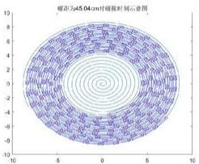

螺形为45.04cm时螺栓时刻示意图

图 22 螺距为 45.04cm, 时碰撞时刻示意图

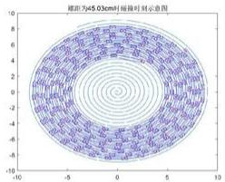

<details>
<summary>radar</summary>

螺距为45.03cm时最终时刻刻度
| Time (s) | Value |
| :--- | :--- |
| -10 | 8 |
| -9 | 6 |
| -8 | 4 |
| -7 | 2 |
| -6 | 0 |
| -5 | -2 |
| -4 | -4 |
| -3 | -6 |
| -2 | -8 |
| -1 | -10 |
| 0 | -8 |
| 1 | -6 |
| 2 | -4 |
| 3 | -2 |
| 4 | 0 |
| 5 | 2 |
| 6 | 4 |
| 7 | 6 |
| 8 | 8 |
| 9 | 6 |
| 10 | 4 |
</details>

图 23 螺距为 45.04cm, 时碰撞时刻示意图

● 当螺距为 45.03cm 时，碰撞发生在龙身中后部。当螺距增大后，若没有发生碰撞，则龙头会进入较为不易碰撞的龙身把手连接区域，将会在一段时间内不发生碰撞，因此，螺距仅增大 0.01cm，但碰撞时的半径相差较大。  
- 当螺距为 $45.04\mathrm{cm}$ ，在度过较为不易碰撞的区域后，容易与下一块板发生碰撞，结果表明碰撞发生在龙身靠前的区域，结合遍历求解的图像，当碰撞发生在龙身靠前的区域时，螺距增大，碰撞时的半径相差极小；当碰撞发生在龙身靠后的区域时，螺距增大，碰撞时的半径可能相差较大。

# 模型检验

假设龙头位于调头边界处，求解恰好不发生碰撞的螺距，结果约为 $42\mathrm{cm}$ 。这种方法不能保证在到达该位置前未发生碰撞。经检验，依此螺距盘龙时，龙头与龙身在极径 $\mathbf{r} = 4.5916\mathrm{m}$ 时，已与后面龙身的中部发生碰撞，求解及验证过程如图24所示。

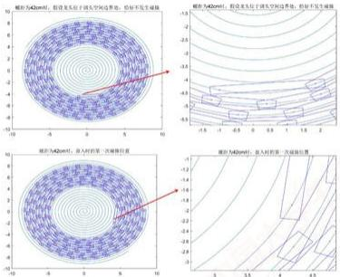

圖例: A42nm时, 観光束長於測定的空隙邊緣, 估計不見方差編號
圖例: A42nm时, 観光束長於測定的空隙邊緣, 估計不見方差編號
圖例: A42nm时, 観光束長於測定的空隙邊緣, 估計不見方差編號
圖例: A42nm时, 観入的第一層相等
圖例: A42nm时, 観入的第二層相等

图 24 模型检验展示

分析可知，未碰撞时，龙头处于相邻板凳的把手连接处；发生碰撞时的位置在板凳中部，符合我们在问题二中得出的结论：龙身中部比相邻板凳的把手连接处更易发生碰撞。

# 5.4 问题四模型的建立与求解

问题四在问题三的基础上，引入了调头曲线的概念，可转化为两个子问题：①建立调头曲线长度最短的单目标优化模型。②计算调头前后的舞龙队运动状态分布。

对于子问①，首先，我们利用斜率关系和几何关系，将构成调头路径的圆的方程表示出来。接着，利用圆弧弧角分别表示出盘入和盘出的调头圆弧曲线长度，作为目标函数。随后，以几何约束与龙头盘旋方向约束作为约束条件，建立以前一段圆弧半径为决策变量的单目标优化模型，利用遍历法确定了最小圆弧半径及调头曲线的方程。

对于子问②，基于求得的调头曲线方程，对问题一中的舞龙队运动状态模型加以更改，建立舞龙队调头运动模型，利用递推法求得了各把手的运动状态。

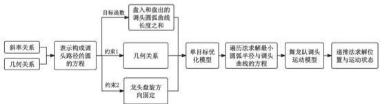

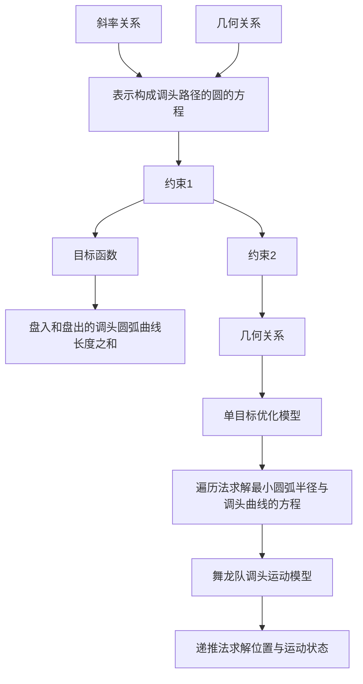

图 25 问题四的流程图

# 5.4.1 最短调头曲线长度单目标优化模型的建立

# 几何关系推导

# (1) 圆弧方程的建立

由问题三，我们求解出龙头恰好不发生碰撞的位置位于调头空间与螺线的交点处。假设该交点F的极坐标可表示为 $(r_{p},\theta_{p})$ ，螺线在该点的切线斜率 $k_{F切}$ 在平面直角坐标系中可表示为：

$$
k _ {F \text {切}} = \frac {d y}{d x} \tag {33}
$$

由二维直角坐标与极坐标的转化关系式，将式(34)分子和分母用极坐标表示后，上下同时关于 $\theta$ 求导，得：

$$
k _ {F \text {切}} = \frac {\frac {d \frac {p}{2 \pi} \theta \cdot c o s \theta}{d \theta}}{\frac {d \frac {p}{2 \pi} \theta \cdot s i n \theta}{d \theta}} = \frac {s i n \theta + \theta c o s \theta}{c o s \theta + \theta s i n \theta} \tag {34}
$$

根据圆心与切点的连线垂直于圆心，则圆心坐标满足方程： $y - y_{F} = k_{F}(x - x_{F})$

其中， $k_{F}=-\frac{1}{k_{F切}}$ 。假设调头曲线中的大圆弧的半径为 $R_{大圆弧}$ ，小圆弧的半径为 $\frac{R_{大圆弧}}{2}$ ，那么大圆弧的圆心G的坐标可表示为：

$$
\left\{ \begin{array}{c} x _ {G} = x _ {F} + R _ {\text {大圆弧}} c o s \theta^ {\prime} \\ y _ {G} = y _ {F} + R _ {\text {大圆弧}} s i n \theta^ {\prime} \\ \theta^ {\prime} = a r c t a n k _ {F} \end{array} \right. \tag {35}
$$

所以大圆弧的圆的方程可表示为：

$$
(x - x _ {G}) ^ {2} + (y - y _ {G}) ^ {2} = R _ {\text {大圆弧}} ^ {2} \tag {36}
$$

因为小圆弧与大圆弧相切于一点K，K点与圆心的连线必垂直于该切线，所以我们可以推出大圆圆心、小圆圆心、大小圆弧的切点三点共线。此时我们引入小圆圆心偏移角 $\beta$ 的概念，描述大小圆圆心连线与水平方向的夹角。因此，小圆弧长的圆心H可结合大圆弧的圆心推出：

$$
\left\{ \begin{array}{l} x _ {H} = x _ {G} + 1. 5 R _ {\mathrm{大圆弧}} c o s \beta \\ y _ {H} = y _ {G} + 1. 5 R _ {\mathrm{大圆弧}} s i n \beta \end{array} \right. \tag {37}
$$

则小圆弧的圆的方程可表示为：

$$
(x - x _ {H}) ^ {2} + (y - y _ {H}) ^ {2} = (\frac {R _ {\text {大圆弧}}}{2}) ^ {2} \tag {38}
$$

# (2) 联立消参

因为盘出螺线与盘入螺线关于螺线中心呈中心对称，所以盘出螺线在极坐标系中的表达式可写成：

$$
r = - \frac {\theta}{2 \pi} p ^ {\prime} \tag {39}
$$

其中， $p'$ 为盘入螺线的螺距1.7m。

对于我们已经建立的大圆与小圆的圆弧方程，含有两个未知参数： $R_{大圆弧}$ 与 $\beta$ 。当小圆弧与盘出螺线相切时，切点的极坐标同时满足盘出螺旋线方程与小圆弧的圆的方程。因此，联立式（38）～（40），结合坐标系转换的思想，得到下列方程：

$$
\begin{array}{l} (- \frac {\theta}{2 \pi} p ^ {\prime} c o s \theta - (x _ {G} + 1. 5 R _ {\mathrm{大圆弧}} c o s \beta) ] ^ {2} + (- \frac {\theta}{2 \pi} p ^ {\prime} s i n \theta - (y _ {G} + 1. 5 R _ {\mathrm{大圆弧}} s i n \beta) ^ {2} \\ = \left(\frac {R _ {\text {大圆弧}}}{2}\right) ^ {2} \tag {40} \\ \end{array}
$$

在式（41）中，一定有一组 $(\beta ,R_{\text{大圆弧}})$ 的组合，使得函数 $f(\beta ,R_{\text{大圆弧}}) = 0$ 。函数$f(\beta,R_{\text{大圆弧}})$ 是包含 $\beta$ 与 $R_{\text{大圆弧}}$ 的隐式关系式，当 $R_{\text{大圆弧}}$ 确定时，根据隐式关系式和几何关系， $\beta$ 也随之确定。因此在相切条件下，可以消去参数 $\beta$ 带来的影响。

# (3) 调头曲线长度的计算

在圆弧弧长的计算中，圆心角是极为重要的参数。本问题中的调头曲线长度可由大小圆弧的弧长叠加求得，因此我们需要先对大小圆弧的圆心角进行计算。

设大、小圆弧的弧长为 $S(R_{\text{大圆弧}})$ ，表示弧长是关于大圆弧半径变化而变化的。则调头曲线的总长度可以表示为：

$$
S _ {\text {总}} = S _ {\text {大圆弧}} + S _ {\text {小圆弧}} \tag {41}
$$

有几何关系，

$$
\left\{ \begin{array}{l} S _ {\text {大圆弧}} = R _ {\text {大圆弧}} \cdot \theta_ {\text {大圆弧}} = R _ {\text {大圆弧}} \cdot (\pi + \theta_ {\mathrm{F}} - \beta) \\ S _ {\text {小圆弧}} = R _ {\text {小圆弧}} \cdot \theta_ {\text {大圆弧}} = \frac {1}{2} R _ {\text {大圆弧}} \cdot (\theta_ {\mathrm{L}} - \theta_ {\mathrm{K}}) \end{array} \right. \tag {42}
$$

所以调头曲线的总长度可列为:

$$
S _ {\text {总}} = R _ {\text {大圆弧}} \cdot [ (\pi + \theta_ {\mathrm{F}} - \beta) + \frac {1}{2} (\theta_ {\mathrm{L}} - \theta_ {\mathrm{K}}) ] \tag {43}
$$

# ■ 建立最短调头曲线的单目标优化模型

# (1) 目标函数

因为 $R_{\text{大圆弧}}$ 确定时， $\beta$ 随之确定，这意味着舞龙团的调头曲线轨迹也对应唯一确定。为了使调头曲线长度缩短，我们令调头曲线长度最小为目标函数：

$$
\min _ {R _ {\text {大圆弧}}} S _ {\text {总}} = R _ {\text {大圆弧}} \cdot [ (\pi + \theta_ {\mathrm{F}} - \beta) + \frac {1}{2} (\theta_ {\mathrm{L}} - \theta_ {\mathrm{K}}) ] \tag {44}
$$

# (2) 约束条件

# ① 大圆弧半径约束

我们认为，决策变量 $R_{大圆弧}$ 的取值范围也存在几何关系约束，即大小圆弧均与调头区域相切。在这种情况下，由几何关系，有：

$$
3 R _ {\mathrm{大圆弧}} = 9 m
$$

为了保证调头曲线不会超出调头区域，我们令决策变量 $R_{大圆弧}$ 满足大圆弧半径约束，即：

$$
0 \leq R _ {\text {大圆弧}} \leq 3 m \tag {45}
$$

# ② 龙头盘旋方向约束

如右图所示，大圆弧的半径应存在下限，即在半径较小的时，可能会出现龙头无法按照调头曲线单向运动的情况。图中的龙头若想要继续向下运动，需要后方的龙身向后倒退，为龙头让出前进的空间，这显然是不符合实际情况的。

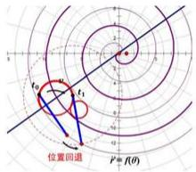

t0
t1
位置回退
P = f(θ)

图 26 龙头盘旋方向约束示意图

因此，对于大圆弧的半径 $R_{\text{大圆弧}}$ ，与龙头前后把手间距 $R_{1} = 286cm$ 之间存在不等式关系 $R_{1} \leq 2R_{\text{大圆弧}}$ ，即

$$
R _ {\text {大圆弧}} \geq 1 4 3 c m \tag {46}
$$

我们设置大圆弧的半径下限为 $143\mathrm{cm}$ ，作为龙头盘旋方向约束，保证龙头与龙身不会倒退。

# (3) 最短调头曲线的单目标优化模型

结合目标函数与约束条件，我们现在给出最短调头曲线的单目标优化模型：

$$
\min _ {R _ {\text {大圆弧}}} S _ {\text {总}} = R _ {\text {大圆弧}} \cdot [ (\pi + \theta_ {\mathrm{F}} - \beta) + \frac {1}{2} (\theta_ {\mathrm{L}} - \theta_ {\mathrm{K}}) ] \tag {47}
$$

$$
s. t. 1 4 3 c m \leq R _ {\text {大圆弧}} \leq 3 0 0 c m
$$

# 5.4.2 最短调头曲线长度单目标优化模型的求解

# ■ 求解过程

因为上述建立的单目标化模型相对简单，为提高求解效率，所以我们采用遍历法进行求解，其流程如下：

STEP1 计算调头曲线总长度初值：在 $R_{\text{大圆弧}} \in [143, 300]$ 的区间范围内，计算并记录 $R_{\text{大圆弧}} = 143cm$ 的调头曲线总长度值。

STEP2 遍历弧长区间：从 $R_{\text{大圆弧}} = 143cm$ 开始，以0.1cm的步长逐渐增大，计算满足约束条件的目标函数值。

STEP3 更新最优大圆弧半径: 在每次计算后, 比较本次计算值与调头曲线总长度的历史最小值。若本次计算值更小, 则将历史最小值替换为本次计算值, 否则增大时间, 进入下一次计算。

STEP4 检验是否到达遍历边界：当大圆弧半径的值到达300cm时，结束算法并输出最优大圆弧半径，计算曲线总长度。

通过上述的遍历法，我们最终求得可以使调头曲线总长度最短的最优大圆弧半径为240cm，曲线总长度为12.5109m。

# 5.4.3 舞龙队调头运动模型的建立

龙头位于在调头区间内时，其运动轨迹为两个相切的圆弧。由于不同节把手之间的运动存在滞后性，所以龙身和龙尾把手在后续的运动中，会经历龙头曾走过的位置。在龙头带领龙身前几节把手按照圆周运动的形式进入到调头区域后时，龙身后侧及龙尾的把手还在调头区域外做螺旋运动。调头区域会导致舞龙队把手位置及速度分布的多种情况，接下来我们分别对龙头和龙身（尾）的把手运动状态进行分类讨论。

# 位置分布的讨论

# (1) 龙头

龙头在调头空间内的运动状态分为两种：大圆弧以及小圆弧；在离开调头空间后，位置始终在盘出螺旋线上，位置坐标满足盘出螺旋线方程。接下来对不同区域内的龙头位置随时间的变化关系进行讨论。

# ① 大圆弧上

在大圆弧范围内，由于龙头速度恒定，所以其满足匀速圆周运动角速度公式：

$$
\omega_ {1} = \frac {v _ {1}}{R _ {\mathrm{大圆弧}}} \tag {48}
$$

其中， $\omega_{1}$ 为龙头的角速度， $v_{1}$ 为龙头的线速度。

假设在大圆弧范围内，龙头接下来要走的弧对应的圆心角为 $\varphi_{1}$ ，经过时间 $t_1$ 后，龙头到达小圆和大圆相切的交点处。那么有：

$$
t _ {1} = \frac {\varphi_ {1}}{\omega_ {1}} = \frac {R _ {\mathrm{大圆弧}} \varphi_ {1}}{v _ {1}} \tag {49}
$$

所以当 $0 < t \leq t_{1}$ 时，由几何关系有：

$$
\left\{ \begin{array}{l} x _ {1} = x _ {G} - R \sin (\theta_ {1} + \omega_ {1} t) \\ y _ {1} = y _ {G} - R \sin (\theta_ {1} + \omega_ {1} t) \end{array} \right. \tag {50}
$$

# ② 小圆弧上

与龙头在大圆弧上类似地，假设在大圆弧范围内，从 $t_{1}$ 时刻开始，龙头接下来要走的弧对应的圆心角为 $\varphi_{2}$ ，则经过时间 $\frac{\varphi_{2}}{\omega_{2}}=\frac{R_{\text{大圆弧}}\varphi_{1}}{2v_{1}}$ 后，龙头到达小圆和盘出螺旋线相切的交点处，设此时时间为 $t_{2}$ 。则在 $t_{1}<t\leq t_{2}$ 的范围内，由几何关系有：

$$
\left\{ \begin{array}{l} x _ {1} = x _ {H} - \frac {R}{2} \sin \left(\frac {\pi}{2} - \beta - \omega_ {2} t\right) = x _ {H} - \frac {R}{2} \cos (\beta + \omega_ {2} t) \\ y _ {1} = y _ {H} - \frac {R}{2} \cos \left(\frac {\pi}{2} - \beta - \omega_ {2} t\right) = y _ {H} - \frac {R}{2} \sin (\beta + \omega_ {2} t) \end{array} \right. \tag {51}
$$

③ 盘出螺旋线上

与在盘入螺旋线上的运动状态类似，为了解龙头在盘出螺旋线上位置随时间的变化关系，我们需要根据龙头在离开调头空间时的位置作为起始位置，结合弧长计算公式对其后续的位置进行推导。

我们可根据上一小节中求得的大圆弧半径计算出龙头离开调头空间时的位置。设该位置的极坐标为 $L(r_{L},\theta_{L})$ ，则 $r_{L}$ 与 $\theta_{L}$ 满足盘出螺旋线方程： $r=-\frac{\theta}{2\pi}p'$ 。

在龙头坐标的极角由 $\theta_{1}(t_{2})$ 变化到 $\theta_{1}(t)$ 的时间范围内，根据式（4）的弧长公式，我们可以计算出这段时间内龙头经过的弧长：

$$
l _ {1} = \int_ {\theta_ {1} (t _ {2})} ^ {\theta_ {1} (t)} \sqrt {r ^ {2} + \left(\frac {d r}{d t}\right) ^ {2}} \cdot d \theta = v (t - t _ {2}) \tag {52}
$$

基于式（53），我们可以推出龙头极角 $\theta_{1}$ 随时间t的变化关系。（隐式表达式）

根据 $\theta_{1}(t)$ ，我们可推出极径 $r_{1}(t)$ ，进而利用坐标变换求出直角系坐标下的坐标 $(x_{1}(t), y_{1}(t))$ 。

(2) 龙身（尾）

上文已经讨论了龙头从初始位置到t时刻下的位置关系。与问题一的分析过程类似地，在该部分我们要用龙头在t时刻下的位置推出第i个板凳在t时刻下的位置。对龙身（尾）同样进行大圆弧上、小圆弧上、以及盘出螺线上位置的分类讨论。以龙头为例，其受到几何关系约束，龙头前后把手的位置可能出现的情况如表7所示。

表 7 龙头上前后把手可能出现的位置

<table><tr><td>后把手\前把手</td><td>盘入螺线上</td><td>大圆弧上</td><td>小圆弧上</td><td>盘出螺线上</td></tr><tr><td>大圆弧上</td><td>√</td><td>√</td><td>×</td><td>×</td></tr><tr><td>小圆弧上</td><td>×</td><td>√</td><td>×</td><td>×</td></tr><tr><td>盘出螺线上</td><td>×</td><td>√</td><td>√</td><td>√</td></tr></table>

① $0 < t \leq t_{1}$

在该时间范围内，板凳前把手位于大圆弧上，而后把手可能位于盘入螺线或大圆弧上。

\- 后把手位于盘入螺线上：

我们以前把手的位置 $(x_{i}(t),y_{i}(t))$ 为圆心，同一板凳前后端把手之间的距离 $R_{i}$ 为半径画圆，与盘入螺线交于点 $(x,y)$ ，则 $(x,y)$ 同时满足方程：

$$
\left\{ \begin{array}{c} \left[ x - x _ {i} (t) \right] ^ {2} + \left[ y - y _ {i} (t) \right] ^ {2} = R _ {i} ^ {2} \\ x = r \cos \theta , y = r \sin \theta \\ r = \frac {\theta}{2 \pi} p \\ R _ {i} = \left\{ \begin{array}{l l} 2 8 6 c m & i = 1 \\ 1 6 5 c m & i = 2, 3, \dots , 2 2 4 \end{array} \right. \end{array} \right. \tag {53}
$$

由此可以解出交点(x,y)，即为后把手的位置。(隐式形式)

● 后把手位于大圆弧上：

我们以前把手的位置 $(x_{i}(t),y_{i}(t))$ 为圆心，同一板凳前后端把手之间的距离 $R_{i}$ 为半径画圆，与大圆弧交于点 $(x,y)$ ，则 $(x,y)$ 同时满足方程：

$$
\left\{ \begin{array}{l} {[ x - x _ {i} (t) ] ^ {2} + [ y - y _ {i} (t) ] ^ {2} = R _ {i} ^ {2}} \\ {[ x - x _ {G} ] ^ {2} + [ y - y _ {G} ] ^ {2} = R _ {i} ^ {2}} \\ R _ {i} = \left\{ \begin{array}{l l} 2 8 6 c m & i = 1 \\ 1 6 5 c m & i = 2, 3, \dots , 2 2 4 \end{array} \right. \end{array} \right. \tag {54}
$$

由此可以解出交点(x,y)，即为后把手的位置。(隐式形式)

② $t_{1}<t\leq t_{2}$

在该时间范围内，板凳前把手位于小圆弧上，而后把手受到几何约束，只可位于大圆弧上，方程形式同式（55）。

③ $t_{2}<t\leq t_{3}$

在该时间范围内，板凳前把手位于盘出螺线上，而后把手可能位于盘入螺线或大圆弧或小圆弧上。

● 后把手位于盘入螺线上：

我们以前把手的位置 $(x_{i}(t),y_{i}(t))$ 为圆心，同一板凳前后端把手之间的距离 $R_{i}$ 为半径画圆，与盘入螺线交于点 $(x,y)$ ，则 $(x,y)$ 同时满足的方程形式同（54）。

● 后把手位于大圆弧上：

我们以前把手的位置 $(x_{i}(t),y_{i}(t))$ 为圆心，同一板凳前后端把手之间的距离 $R_{i}$ 为半径画圆，与大圆弧交于点 $(x,y)$ ，则 $(x,y)$ 同时满足的方程形式同（55）。

● 后把手位于盘出螺线上：

我们以前把手的位置 $(x_{i}(t),y_{i}(t))$ 为圆心，同一板凳前后端把手之间的距离 $R_{i}$ 为半径画圆，与盘出螺线交于点 $(x,y)$ ，则 $(x,y)$ 同时满足的方程

$$
\left\{ \begin{array}{c} \left[ x - x _ {i} (t) \right] ^ {2} + \left[ y - y _ {i} (t) \right] ^ {2} = R _ {i} ^ {2} \\ x = r \cos \theta , y = r \sin \theta \\ r = - \frac {\theta}{2 \pi} p \\ R _ {i} = \left\{ \begin{array}{l l} 2 8 6 c m & i = 1 \\ 1 6 5 c m & i = 2, 3, \dots , 2 2 4 \end{array} \right. \end{array} \right. \tag {55}
$$

# ■ 速度的讨论

结合问题一中对把手速度的微分形式表达，龙身（尾）在t时刻的速度可以表示为：

$$
v _ {i} (t) = \frac {d l _ {i} (\theta (t))}{d t} = \frac {l _ {i} (\theta (t + d t)) - l _ {i} (\theta (t))}{d t} \tag {56}
$$

其弧长以及弧长变化量可以利用弧长公式进行刻画：

$$
l _ {i} = \int_ {\theta_ {i} (0)} ^ {\theta_ {i} (t)} \sqrt {(r _ {i}) ^ {2} + (\frac {d (r _ {i})}{d t}) ^ {2}} \cdot d \theta \tag {57}
$$

至此，由于龙头在 t 时刻下的位置 $(x_{1}(t),y_{1}(t))$ 都可由龙头在 0 时刻下的位置 $(x_{1}(0),y_{1}(0))$ 推出，所以第i个板凳在t时刻下的位置 $(x_{i}(t),y_{i}(t))$ 都可用龙头在 t 时刻下的位置 $(x_{1}(t),y_{1}(t))$ 推出，进而建立出舞龙队调头运动模型：

$$
\begin{array}{r l} & \text {把手速度方程:} \\ & v _ {i} (t) = \frac {d l _ {i} (\theta (t))}{d t} = \frac {l _ {i} (\theta (t + d t)) - l _ {i} (\theta (t))}{d t} \\ & l _ {i} = \int_ {\theta_ {i} (0)} ^ {\theta_ {i} (t)} \sqrt {(r _ {i}) ^ {2} + \left(\frac {d (r _ {i})}{d t}\right) ^ {2}} \cdot d \theta \\ & \text {把手位置方程:} \\ & [ x - x _ {i} (t) ] ^ {2} + [ y - y _ {i} (t) ] ^ {2} = R _ {i} ^ {2} \\ & [ x - x _ {G} ] ^ {2} + [ y - y _ {G} ] ^ {2} = R _ {i} ^ {2} \\ & x = r c o s \theta , y = r s i n \theta \\ & r = \pm \frac {\theta}{2 \pi} p \\ & R _ {i} = \left\{ \begin{array}{l l} 2 8 6 c m & i = 1 \\ 1 6 5 c m & i = 2, 3, \dots , 2 2 4 \end{array} \right. \end{array} \tag {58}
$$

# 5.4.4舞龙队调头运动模型的求解

对于建立的舞龙队调头模型，我们采用递推法进行求解，其运算流程如下表所示：

# STEP1 确定把手位置与临界条件

STEP2 判定点的相对位置：记每个凳子前后端把手之间的距离为 $R_{i}$ ，小圆弦长为 $d_{3}$ 。若 $R_{i}<d_{3}$ ，则两点可以同时出现在小圆弧线上反之，则不能。

# STEP3 求出3个临界条件的示意图

STEP4 递推下一把手所在位置：根据龙头所在位置和与临界条件比较，确定下一把手所在的位置。

# STEP5 选择对应模型，求解下一块把手位置

根据以上算法流程，我们最终求出在 $-100\mathrm{s}$ 、 $-50\mathrm{s}$ 、 $0\mathrm{s}$ 、 $50\mathrm{s}$ 、 $100\mathrm{s}$ 时，龙头前把手、龙头后面第1、51、101、151、201节龙身前把手和龙尾后把手的位置和速度，如表6和表7所示所示。

表 6 调头前后部分把手速度的展示

<table><tr><td></td><td>-100 s</td><td>-50 s</td><td>0 s</td><td>50 s</td><td>100 s</td></tr><tr><td>龙头 x (m)</td><td>7.778034</td><td>6.608301</td><td>-2.711856</td><td>4.886513</td><td>1.197819</td></tr><tr><td>龙头 y (m)</td><td>3.717164</td><td>1.898865</td><td>-3.591078</td><td>3.693087</td><td>7.944723</td></tr><tr><td>第 1 节龙身 x (m)</td><td>6.209273</td><td>5.366911</td><td>-0.063534</td><td>5.908610</td><td>3.871368</td></tr><tr><td>第 1 节龙身 y (m)</td><td>6.108521</td><td>4.475403</td><td>-4.670888</td><td>1.021961</td><td>6.928980</td></tr><tr><td>第 51 节龙身 x (m)</td><td>-10.608038</td><td>-3.629945</td><td>2.459962</td><td>-3.277652</td><td>4.257561</td></tr><tr><td>第 51 节龙身 y (m)</td><td>2.831491</td><td>-8.963800</td><td>-7.778145</td><td>-5.292185</td><td>0.363240</td></tr><tr><td>第 101 节龙身 x (m)</td><td>-11.922761</td><td>10.125787</td><td>3.008493</td><td>-6.405417</td><td>-6.623420</td></tr><tr><td>第 101 节龙身 y (m)</td><td>-4.802378</td><td>-5.972247</td><td>10.108539</td><td>6.513314</td><td>3.554127</td></tr><tr><td>第 151 节龙身 x (m)</td><td>-14.351032</td><td>12.974784</td><td>-7.002789</td><td>-6.157026</td><td>8.729522</td></tr><tr><td>第 151 节龙身 y (m)</td><td>-1.980993</td><td>-3.810357</td><td>10.337482</td><td>-9.498405</td><td>-4.998495</td></tr><tr><td>第 201 节龙身 x (m)</td><td>-11.952942</td><td>10.522509</td><td>-6.872842</td><td>-1.447835</td><td>9.576219</td></tr><tr><td>第 201 节龙身 y (m)</td><td>10.566998</td><td>-10.807425</td><td>12.382609</td><td>-13.065162</td><td>7.359124</td></tr><tr><td>龙尾(后)x (m)</td><td>-1.011059</td><td>0.189809</td><td>-1.933627</td><td>7.412182</td><td>-11.716600</td></tr><tr><td>龙尾(后)y (m)</td><td>-16.527573</td><td>15.720588</td><td>-14.713128</td><td>11.726271</td><td>-5.313625</td></tr></table>

表 7 调头前后部分把手速度的展示

<table><tr><td></td><td>-100 s</td><td>-50 s</td><td>0 s</td><td>50 s</td><td>100 s</td></tr><tr><td>龙头(m/s)</td><td>1</td><td>1</td><td>1</td><td>1</td><td>1</td></tr><tr><td>第1节龙身(m/s)</td><td>0.99965</td><td>0.9992</td><td>0.83157</td><td>0.99955</td><td>0.99977</td></tr><tr><td>第51节龙身(m/s)</td><td>0.9993</td><td>0.99848</td><td>0.82932</td><td>2.014</td><td>1.00258</td></tr><tr><td>第101节龙身(m/s)</td><td>0.99913</td><td>0.99823</td><td>0.82889</td><td>2.01562</td><td>1.51349</td></tr><tr><td>第151节龙身(m/s)</td><td>0.99904</td><td>0.9981</td><td>0.82871</td><td>2.0161</td><td>1.51327</td></tr><tr><td>第201节龙身(m/s)</td><td>0.99898</td><td>0.99803</td><td>0.82861</td><td>2.01633</td><td>1.51318</td></tr><tr><td>龙尾(后)(m/s)</td><td>0.99896</td><td>0.998</td><td>0.82858</td><td>2.01639</td><td>1.51316</td></tr></table>

针对求解结果中部分的速度突增，我们绘制出了第12s\~13s龙头部分的轨迹图，如27所示。并做出如下分析：在通过调头轨迹中半径较小的圆时，相同时间内，龙头后第一节点的路程大于龙头前端点的路程，此时该点的速度比龙头的速度大，因此产生速度突增。

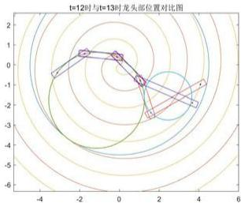

<details>
<summary>radar</summary>

| Time (s) | Height (m) |
| -------- | ---------- |
| -2       | 0          |
| -1       | 0          |
| 0        | 0          |
| 1        | 0          |
| 2        | -3         |
| 3        | -3         |
</details>

图 27 第 12 s\~13 s 龙头部分的轨迹图

# 5.5 问题五模型的建立与求解

问题五是最大龙头速度优化问题。基于问题四中各把手的位置和速度随时间的变化关系，建立以龙头速度最大为目标，以各把手存在速度上限和把手位置和速度表达式为约束条件的单目标优化模型，并利用粒子群算法进行求解，搜索出满足约束条件的最大龙头速度。

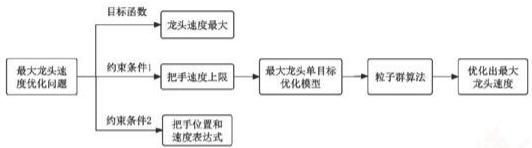

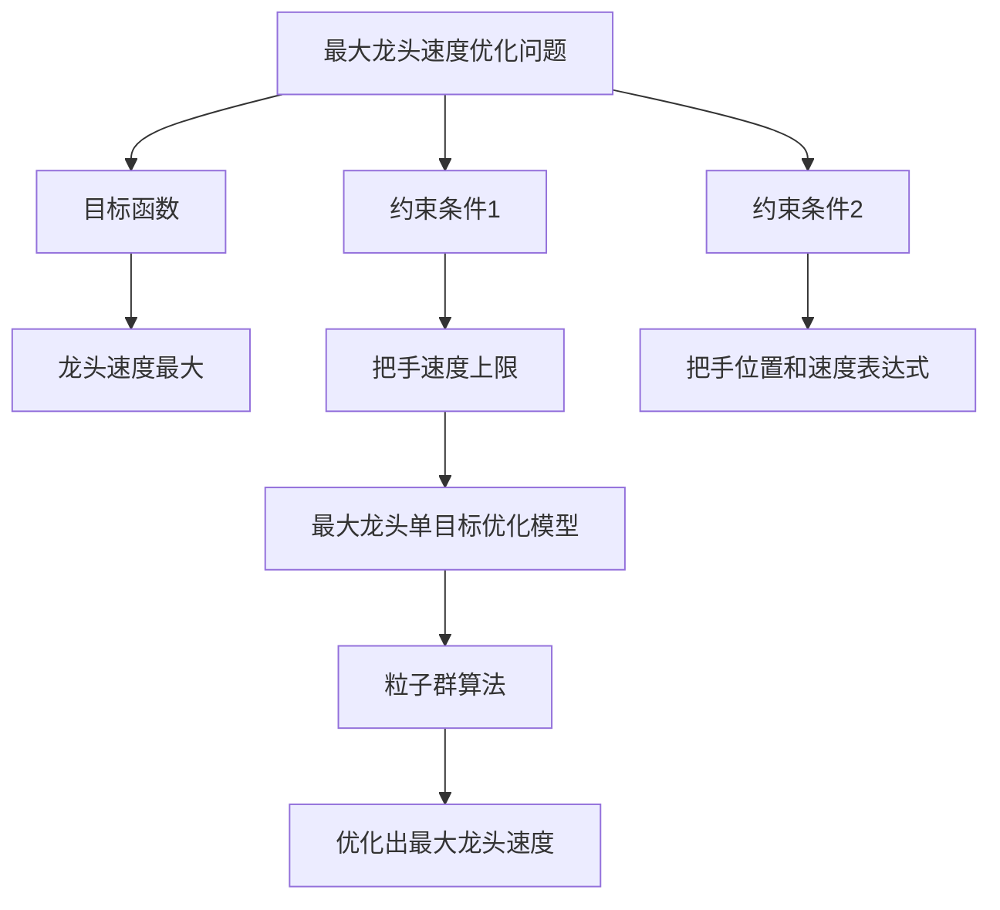

图 28 问题五的流程图

# 5.5.1 最大龙头速度单目标优化模型的建立

在问题四中，已经描述出各把手 $M_{i}$ 的位置和速度随时间变化的表达式，因此我们在此基础上来建立最大龙头速度的单目标优化模型。其中，各把手速度 $v_{i}(t)$ 可由问题四的模型得到：

$$
v _ {i} (t) = \frac {d l _ {i} (\theta (t))}{d t}
$$

# 目标函数

我们需要寻找满足把手速度限制的最大龙头速度。因此我们令龙头速度 $v_{1}(t)$ 最大作为目标函数：

$$
\max _ {v _ {1} (t)} v _ {1} (t) \tag {59}
$$

# ■ 约束条件

# ① 各把手速度范围约束

根据题目要求，各把手 $M_{l}$ 的速度均小于2m/s。在后续求解过程中，我们认为最小螺距p满足螺线螺距范围约束：

$$
v _ {i} (t) <   2 m / s \quad i = 1, 2, \dots , 2 2 4 \tag {60}
$$

# ② 各把手位置和速度表达式约束

问题四中已经得到了各把手 $M_{i}$ 位置和速度关于时间的表达形式，由于龙头是在问题四求出的路径上行进，因此把手速度满足问题四调头运动模型：

$$
\left\{ \begin{array}{l} {\mathrm{把手速度方程:}} \\ {v _ {i} (t) =  \frac {d l _ {i} (\theta (t))}{d t} =  \frac {l _ {i} (\theta (t + d t)) - l _ {i} (\theta (t))}{d t}} \\ {l _ {i} =  \int_ {\theta_ {i} (0)} ^ {\theta_ {i} (t)} \sqrt {(r _ {i}) ^ {2} + \left(\frac {d (r _ {i})}{d t}\right) ^ {2}} \cdot d \theta} \\ {\mathrm{把手位置方程:}} \\ {[ x - x _ {i} (t) ] ^ {2} + [ y - y _ {i} (t) ] ^ {2} = R _ {i} ^ {2}} \\ {[ x - x _ {G} ] ^ {2} + [ y - y _ {G} ] ^ {2} = R _ {i} ^ {2}} \\ {x = r c o s \theta , \quad y = r s i n \theta} \\ {r = \pm \frac {\theta}{2 \pi} p} \\ {R _ {i} = \left\{ \begin{array}{l l} {2 8 6 c m} & {i = 1} \\ {1 6 5 c m} & {i = 2, 3, \ldots , 2 2 4} \end{array} \right.} \end{array} \right.
$$

# (3) 最大龙头速度单目标优化模型的给出

根据以上讨论的目标函数与约束条件，我们现给出以最大龙头速度的单目标优化模型：

$$
\begin{array}{r l} & \max _ {v _ {i} (t)} v _ {1} (t) \\ & \text {把手速度方程:} \\ & v _ {i} (t) = \frac {d l _ {i} (\theta (t))}{d t} = \frac {l _ {i} (\theta (t + d t)) - l _ {i} (\theta (t))}{d t} \\ & l _ {i} = \int_ {\theta_ {i} (0)} ^ {\theta_ {i} (t)} \sqrt {(r _ {i}) ^ {2} + \left(\frac {d (r _ {i})}{d t}\right) ^ {2}} \cdot d \theta \\ & \text {把手位置方程:} \\ & [ x - x _ {i} (t) ] ^ {2} + [ y - y _ {i} (t) ] ^ {2} = R _ {i} ^ {2} \\ & [ x - x _ {G} ] ^ {2} + [ y - y _ {G} ] ^ {2} = R _ {i} ^ {2} \\ & x = r c o s \theta , y = r s i n \theta \\ & r = \pm \frac {\theta}{2 \pi} p \\ & R _ {i} = \left\{ \begin{array}{l l} 2 8 6 c m & i = 1 \\ 1 6 5 c m & i = 2, 3, \dots , 2 2 4 \end{array} \right. \end{array} \tag {61}
$$

# 5.5.2 最大龙头速度单目标优化模型的求解

# ■ 求解过程

粒子群优化算法是一种进化计算技术，源于对鸟群捕食的行为研究，其基本思想是通过群体中个体之间的协作和信息共享来寻找最优解[3]。针对这个单目标优化问题，我们采用粒子群算法进行求解，其算法流程如下：

Step1 初始化粒子群及参数: 首先, 设定粒子数目为 20, 最大迭代次数为 100, 权向量 $w = (1.5, 1.5, 0.5)$ ; 在 $v_1 \in (0, 2)$ 内范围内随机生成粒子群 $x_i = rand(\alpha_n)$

Step2 计算粒子适应度：计算 $\max_{v_{1}(t)} v_{1}(t)$ 即每个粒子对应的目标函数值。

Step3 计算个体与全局最优解：先将每个粒子的适应值 $fun(x_i)$ 与其经过最好位置的适应值 $pbest(x_i)$ 比较，若 $fun(x_i) > pbest(x_i)$ ，则将其更新为该粒子的个体最优解；再将所有粒子各自的最高适应度 $max\{pbest(x_i)\}$ 与全局最高适应度 $gbest(x_i)$ 进行比较，若 $max\{pbest(x_i)\} > gbest(x_i)$ ，则将其更新为为新的全局最优解。

Step4 判断是否达到迭代次数：判断迭代次数是否大于 100，若未超过 100，粒子群需持续更新自己的速度和位置；反之，则输出最终的 $\alpha_{n}$ 并结束算法。

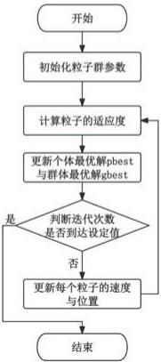

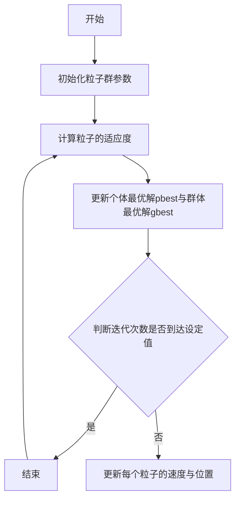

根据上述算法，我们用粒子群算法得出龙头最大速度为：1.33m/s。

# ■ 结果展示及结果分析

我们画出了运动全过程的最大速度与龙头速度的关系图，如图27所示，发现在区间[1.2,1.6]与[1.8,2]，最大速度出现陡增，与问题四中分析的速度突变现象一致。

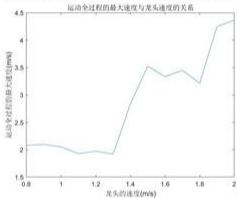

<details>
<summary>line</summary>

运动全过程的最大速度与龙头速度的关系
| 龙头的速度(%) | 运动全过程的最大速度(mm) |
|---|---|
| 0.8 | 2.0 |
| 1.0 | 1.9 |
| 1.2 | 1.8 |
| 1.4 | 3.5 |
| 1.6 | 3.4 |
| 1.8 | 3.2 |
| 2.0 | 4.5 |
</details>

图 27 运动全过程的最大速度与龙头速度的关系图

# 六、模型的评价

# 6.1 模型的优点

1. 模型求解效率快，贴合实际情况   
2. 模型精度高，可以良好地表述“板凳龙”的运动状态。  
3. 运用分离轴定理描述碰撞过程，理论依据牢靠，更加严谨。

# 七、参考文献

[1] [1] 刘娜, 毛晓菊. 基于分离轴定理的碰撞检测算法 [J]. 数字技术与应用, 2012, (08): 102. DOI: 10.19695/j.cnki.cn12-1369.2012.08.070.  
[2] 司守奎，孙玺菁. 数学建模算法与应用[M]. 北京：国防工业出版社，2022  
[3] 周驰, 高海兵, 高亮等. 粒子群优化算法[J]. 计算机应用研究, 2003(12): 7-11.. 周驰; 高海兵; 高亮; 章万国.

# 八、附录

附录1   
```matlab
代码1：问题一求解
clc;clear;
results = zeros(448,301);
resultv = zeros(224,301);
resulttheta = zeros(224,301);
P = 55e-2;
delta_lt = 1;
N_t = 300/delta_lt+1;
delta_t = 0.1;
theta_tou = 2*pi*16;
results(1,1) = roundn(P/(2*pi)*theta_tou*cos(theta_tou),-6);
results(2,1) = roundn(P/(2*pi)*theta_tou*sin(theta_tou),-6);
resulttheta(1,1) = theta_tou;
%已知初始头部坐标，求解剩余点的坐标
R = (341-27.5*2)*0.01;
theta_temp = prob1func1(theta_tou,R,1);
results(3,1) = roundn(P/(2*pi)*theta_temp*cos(theta_temp),-6);
results(4,1) = roundn(P/(2*pi)*theta_temp*sin(theta_temp),-6);
resulttheta(2,1) = theta_temp;
R = (220-27.5*2)*0.01;
for j = 3:224
    theta_temp = prob1func1(theta_temp,R,1);
    results(2*j-1,1) = roundn(P/(2*pi)*theta_temp*cos(theta_temp),-6);
    results(2*j ,1) = roundn(P/(2*pi)*theta_temp*sin(theta_temp),-6);
    resulttheta(j,1) = theta_temp;
end

%速度求解：在此基础之上运动 delta_t
%计算此时刻头部坐标
theta_tou_ = prob1func2(theta_tou,delta_t,1);
resultv(1,1) = roundn(1,-6);
%已知初始头部坐标，求解剩余点的坐标
R = (341-27.5*2)*0.01;
theta_temp_ = prob1func1(theta_tou_,R,1);
resultv(2,1)
roundn(probb1_s_integral(P theta_temp_,resulttheta(2,1))/delta_t,-6);
R = (220-27.5*2)*0.01;
for j = 3:224
    theta_temp_ = prob1func1(theta_temp_,R,1);
    resultv(j,1) 
```

```matlab
roundn(prob1_s_integral(P,theta_temp_,resulttheta(j,1))/delta_t,-6);
end

%% for i = 2:N_t
    i
    %计算此时刻头部坐标
    theta_tou = prob1func2(theta_tou,delta_lt,1);
    results(1,i) = roundn(P/(2*pi)*theta_tou*cos(theta_tou),-6);
    results(2,i) = roundn(P/(2*pi)*theta_tou*sin(theta_tou),-6);
    resulttheta(1,i) = theta_tou;
    %已知初始头部坐标，求解剩余点的坐标
    R = (341-27.5*2)*0.01;
    theta_temp = prob1func1(theta_tou,R,1);
    results(3,i) = roundn(P/(2*pi)*theta_temp*cos(theta_temp),-6);
    results(4,i) = roundn(P/(2*pi)*theta_temp*sin(theta_temp),-6);
    resulttheta(2,i) = theta_temp;
    R = (220-27.5*2)*0.01;
    for j = 3:224
    theta_temp = prob1func1(theta_temp,R,1);
    results(2*j-1,i) = roundn(P/(2*pi)*theta_temp*cos(theta_temp),-6);
    results(2*j ,i) = roundn(P/(2*pi)*theta_temp*sin(theta_temp),-6);
    resulttheta(j,i) = theta_temp;
    end

%速度求解：在此基础之上运动 delta_t
%计算此时刻头部坐标
theta_tou_ = prob1func2(theta_tou,delta_t,1);
resultv(1,i) = roundn(1,-6);
%已知初始头部坐标，求解剩余点的坐标
R = (341-27.5*2)*0.01;
theta_temp_ = prob1func1(theta_tou_,R,1);
resultv(2,i)
    roundn(prob1_s_integral(P,theta_temp_,resulttheta(2,i))/delta_t,-6);
    R = (220-27.5*2)*0.01;
    for j = 3:224
    theta_temp_ = prob1func1(theta_temp_,R,1);
    resultv(j,i)
    roundn(prob1_s_integral(P,theta_temp_,resulttheta(j,i))/delta_t,-6);
    end

end

%% 
```

```matlab
figure(1)
plot(results(1,:), results(2,:))
figure(2)
plot(results(1:2:447,1), results(2:2:448,1), 'LineWidth', 10)

disp(prob1_s_integral(P, resulttheta(1,101), resulttheta(1,1)));
disp(prob1_s_integral(P, resulttheta(2,101), resulttheta(2,1)));
disp(prob1_s_integral(P, resulttheta(1,201), resulttheta(1,1)));
disp(prob1_s_integral(P, resulttheta(2,201), resulttheta(2,1)));
disp(prob1_s_integral(P, resulttheta(1,301), resulttheta(1,1)));
disp(prob1_s_integral(P, resulttheta(2,301), resulttheta(2,1)))

figure(3)
iii = 1:301;
for i = iii
    resultint1(i) = prob1_s_integral(P, resulttheta(1,i), resulttheta(1,1));
    resultint2(i) = prob1_s_integral(P, resulttheta(2,i), resulttheta(2,1));
    resultint3(i) = prob1_s_integral(P, resulttheta(52,i), resulttheta(52,1));
    resultint4(i) = prob1_s_integral(P, resulttheta(102,i), resulttheta(102,1));
    resultint5(i) = prob1_s_integral(P, resulttheta(152,i), resulttheta(152,1));
    resultint6(i) = prob1_s_integral(P, resulttheta(202,i), resulttheta(202,1));
    end
    plot(iii(1:10:301), resultint1(1:10:301)-resultint2(1:10:301), '-^', 'LineWidth', 1)
    hold on
    plot(iii(1:10:301), resultint1(1:10:301)-resultint3(1:10:301), '-o', 'LineWidth', 1)
    plot(iii(1:10:301), resultint1(1:10:301)-resultint4(1:10:301), '-d', 'LineWidth', 1)
    plot(iii(1:10:301), resultint1(1:10:301)-resultint5(1:10:301), '-s', 'LineWidth', 1)
    plot(iii(1:10:301), resultint1(1:10:301)-resultint6(1:10:301), '-.', 'LineWidth', 3)
xlabel('时间/s');
ylabel('第i节龙身与龙头前把手的路程差/m');
title('第i节龙身与龙头前把手的路程差随运动时间变化图像');
legend('第 1 节龙身与龙头前把手的路程差', '第 51 节龙身与龙头前把手的路程差', '第 101 节龙身与龙头前把手的路程差', '第 151 节龙身与龙头前把手的路程差', '第 201 节龙身与龙头前把手的路程差'); 
```

```matlab
%%  
figure(5)  
plot(1:224, results(1,:))  
xlabel('时间/s');  
ylabel('第1节龙身与龙头前把手的路程差/m');  
title('第1节龙身与龙头前把手的路程差随运动时间变化图像');  
legend('第1节龙身与龙头前把手的路程差', '第51节龙身与龙头前把手的路程差', '第101节龙身与龙头前把手的路程差', '第151节龙身与龙头前把手的路程差', '第201节龙身与龙头前把手的路程差');
```

附录3   
代码 2: 问题二求解  
```matlab
clc;clear;
result = prob2func2(412.472,500,0.001);
disp(result) %412.473819;
result2 = zeros(224,3);
resulttheta = zeros(224,1);
P = (55e-2);
%求位置
theta_tou = prob1func2(2*pi*16,result(1),1);
result2(1,1) = roundn(P/(2*pi)*theta_tou*cos(theta_tou),-6);
result2(1,2) = roundn(P/(2*pi)*theta_tou*sin(theta_tou),-6);
resulttheta1) = theta_tou;
%已知初始头部坐标，求解剩余点的坐标
R = (341-27.5*2)*0.01;
theta_temp = prob1func1(theta_tou,R,1);
result2(2,1) = roundn(P/(2*pi)*theta_temp*cos(theta_temp),-6);
result2(2,2) = roundn(P/(2*pi)*theta_temp*sin(theta_temp),-6);
resulttheta2) = theta_temp;
R = (220-27.5*2)*0.01;
for j = 3:224 
```

```matlab
theta_temp = prob1func1(theta_temp,R,1);
result2(j,1) = roundn(P/(2*pi)*theta_temp*cos(theta_temp),-6);
result2(j,2) = roundn(P/(2*pi)*theta_temp*sin(theta_temp),-6);
resulttheta(j) = theta_temp;
end

%求速度
%速度求解：在此基础之上运动 delta_t
%计算此时刻头部坐标
delta_t = 0.1;
theta_tou_ = prob1func2(theta_tou,delta_t,1);
result2(1,3) = roundn(1,-6);
%已知初始头部坐标，求解剩余点的坐标
R = (341-27.5*2)*0.01;
theta_temp_ = prob1func1(theta_tou_R,1);
result2(2,3)
roundn(prob1_s_integral(P,theta_temp_,resulttheta(2))/delta_t,-6);
R = (220-27.5*2)*0.01;
for j = 3:224
    theta_temp_ = prob1func1(theta_temp_R,1);
    result2(j,3)
    roundn(prob1_s_integral(P,theta_temp_,resulttheta(j))/delta_t,-6);
    end

%
plot(result2(:,1),result2(:,2)) 
```

# 附录3

代码 3：问题三求解  
```matlab
%% clc;clear;
%反向求解确定区间大步长
p_array = 55e-2:-1e-2:1e-2;
for i = 1:size(p_array,2)
    result(i) = prob3func1(p_array(i));
end
figure(1) 
```

```matlab
plot(p_array, result);

%% clc; clear;
% % 反向求解确定区间小步长
% p_array = 42*1e-2:-1e-4:41.5*1e-2;
% for i = 1:size(p_array, 2)
    result(i) = prob3func1(p_array(i));
    % if result(i) == 1
    % break;
    % end
    % end
    % disp(p_array(i-1)) %0.402480000000000

%% 正向验证(验证碰撞时是否进入9)求解最小螺距
%0.42 往回验证

figure(2)
theta_result = [];
j = 0;
%0.42:0.001:0.55 t0=180
%0.45, 0.451 t0 = 180
%4503, 4504
for i = 0.45:0.0001:0.451
    j = j+1
    temptheta = prob3func2(i, 180, 500, 0.1);
    theta_result = [theta_result, temptheta]; % 返回碰撞时的角度
    if
((i/(2*pi)*temptheta*cos(temptheta))^2 + ((i/(2*pi)*temptheta*sin(temptheta)))^2)^0.5 < 4.5

disp(((i/(2*pi)*temptheta*cos(temptheta))^2 + ((i/(2*pi)*temptheta*sin(temptheta)))^2)^0.5)

break
end
end
plot(1:j, theta_result)

% P = 0.402691000000000;
% P = 0.42;
% theta = prob3func2(P, 180, 500, 0.1);
% disp(P/(2*pi)*theta) 
```

附录4   
```matlab
代码 4：问题四求解
clc;clear;
results = zeros(448,201);
results_ = zeros(448,201);
resultv = zeros(224,201);
resulttheta = zeros(224,201);
resulttheta_ = zeros(224,201);
recordstate = ones(224,201); %每代各点所处位置 1,2,3,4
recordstate_ = ones(224,201); %每代各点所处位置 1,2,3,4
ddeellttaa_tt = 0.01;
%要求解-100s 到+100s，龙头速度 1m/s，0 调头
v = 1;
P = 1.7;
%根据时间进行分段，求出临界状态，对曲线进行分段
%-100-0，跟第一问一样，用 prob3func3 和 prob3func4 来求解
R_da = 2.4;%(3.41-0.55)/2;
R_xiao = R_da/2;
result_diaotouquxian = prob4func1(R_da); %大圆心、大圆心角、小圆心、小圆心角
dayuanxin = [result_diaotouquxian(1), result_diaotouquxian(2)];
dayuanxinjiao = result_diaotouquxian(3);
xiaoyuanxin = [result_diaotouquxian(4), result_diaotouquxian(5)];
xiaoyuanxinjiao = result_diaotouquxian(6);
dian1 = [result_diaotouquxian(7), result_diaotouquxian(8)];
dian2 = [result_diaotouquxian(9), result_diaotouquxian(10)];
dian3 = [result_diaotouquxian(11), result_diaotouquxian(12)];
%第一段弧长
l1 = dayuanxinjiao*R_da;
%第二段弧长
l2 = xiaoyuanxinjiao*R_xiao;

%龙头运行到第一段结尾的时间节点
t1 = l1/v;
%龙头运行到第二段结尾的时间节点
t2 = (l1+l2)/v;
t__ = t2-t1;

%求解 6 个临界点
figure(1)
hold on
%处理 dian1 
```

```matlab
R = (341-27.5*2)*0.01; %
%将进入圆的坐标修正为圆心坐标系下的坐标(转成 0-2*pi 进行计算)
%头在圆上的坐标
%圆心和圆上点的连线
k = (dian1(2)-dayuanxin(2))/(dian1(1)-dayuanxin(1));
theta_temp2 = atan(k);
%二三象限的点的转换
if dian1(1)-dayuanxin(1) < 0
    theta_temp2 = theta_temp2+pi;
end
%限幅
theta_dian1 = mod(theta_temp2,2*pi);
theta2tou_1_temp = prob4funccos(R,R_da);
theta2tou_1 = theta_dian1-theta2tou_1_temp;
plot([dayuanxin(1)+R_da*cos(theta2tou_1)],[dayuanxin(2)+R_da*sin(theta2tou_1]),'o');
R = (220-27.5*2)*0.01; %
theta2shen_1_temp = prob4funccos(R,R_da);
theta2shen_1 = theta_dian1-theta2shen_1_temp;
plot([dayuanxin(1)+R_da*cos(theta2shen_1)],[dayuanxin(2)+R_da*sin(theta2shen_1)],'o');
%处理 dian2
R = (341-27.5*2)*0.01; %
%将进入圆的坐标修正为圆心坐标系下的坐标(转成 0-2*pi 进行计算)
%头在圆上的坐标
%圆心和圆上点的连线
k = (dian2(2)-xiaoyuanxin(2))/(dian2(1)-xiaoyuanxin(1));
theta_temp3 = atan(k);
%二三象限的点的转换
if dian2(1)-xiaoyuanxin(1) < 0
    theta_temp3 = theta_temp3+pi;
end
%限幅
theta_dian2 = mod(theta_temp3,2*pi);
if R<2*R_xiao
    theta3tou_1_temp = prob4funccos(R,R_xiao);
    theta3tou_1 = theta_dian2-theta3tou_1_temp;
plot([xiaoyuanxin(1)+R_xiao*cos(theta3tou_1)],[xiaoyuanxin(2)+R_xiao*sin(theta3tou_1)],'o');
else 
```

```matlab
theta3tou_1 = probfunclinjie3_24(dian2,R,dian3,xiaoyuanxin,R_xiao,P);
plot([P/(2*pi)*theta3tou_1*cos(-theta3tou_1)],[P/(2*pi)*theta3tou_1*sin(-theta3tou_1)], 'bo');
end

R = (220-27.5*2)*0.01; % 
if R<2*R_xiao
    theta3shen_1_temp = prob4funccos(R,R_xiao);
    theta3shen_1 = theta_dian2+theta3shen_1_temp;

plot([xiaoyuanxin(1)+R_xiao*cos(theta3shen_1)],[xiaoyuanxin(2)+R_xiao*sin(theta3shen_1)], 'o');
else
    theta3shen_1 = probfunclinjie3_24(dian2,R,dian3,xiaoyuanxin,R_xiao,P);
    plot([P/(2*pi)*theta3shen_1*cos(-theta3shen_1)],[P/(2*pi)*theta3shen_1*sin(-theta3shen_1)], 'bo');
end

%4 临界
fanx = [];
fany = [];
for i = 0:-0.01*pi:-8*pi
    fanx = [fanx,P/(2*pi)*i*cos(-i)];
    fany = [fany,P/(2*pi)*i*sin(-i)];
end
plot(fanx,fany);
hold on

k = (dian3(2)-xiaoyuanxin(2))/(dian3(1)-xiaoyuanxin(1));
theta_temp3 = atan(k);
%二三象限的点的转换
if dian3(1)-xiaoyuanxin(1) < 0
    theta_temp3 = theta_temp3+pi;
end
%限幅
theta_tou3__ = mod(theta_temp3,2*pi);

x4temp = xiaoyuanxin(1)+R_xiao*cos(theta_tou3__);
y4temp = xiaoyuanxin(2)+R_xiao*sin(theta_tou3__);
theta_temp4_ = -(((x4temp)^2+(y4temp)^2)^0.5)*2*pi/P;
%修正
theta_temp4_xiu = -pi-atan(y4temp/x4temp);
theta_tou4 = theta_temp4_-mod(theta_temp4_,2*pi)+mod(theta_temp4_xiu,2*pi); 
```

```matlab
% plot(dian3(1),dian3(2),'o');
R = (341-27.5*2)*0.01; %
buchang = 0.0001*pi;
%step1:大步长遍历求解二分法区间
theta1 = theta_tou4;
theta2 = theta1-buchang;
while
prob4func44func(theta1,theta1,R,P)*prob4func44func(theta2,theta1,R,P)>0
    theta2 = theta2-buchang;
end
%step2:二分法求解零点
%区间：(theta2,theta2+buchang)
lb = theta2;
ub = theta2+buchang;
for i = 1:20
    md = (lb+ub)/2;
    if prob4func44func(lb,theta1,R,P)*prob4func44func(md,theta1,R,P)<0
    ub = md;
    else
    lb = md;
    end
end
theta4tou_l = md;
plot([P/(2*pi)*theta4tou_l*cos(-theta4tou_l)],[P/(2*pi)*theta4tou_l*sin(-theta4tou_l)],'bo');
R = (220-27.5*2)*0.01; %
buchang = 0.0001*pi;
%step1:大步长遍历求解二分法区间
theta1 = theta_tou4;
theta2 = theta1-buchang;
while
prob4func44func(theta1,theta1,R,P)*prob4func44func(theta2,theta1,R,P)>0
    theta2 = theta2-buchng;
end
%step2:二分法求解零点
%区间：(theta2,theta2+buchang)
lb = theta2;
ub = theta2+buchang;
for i = 1:20
    md = (lb+ub)/2;
    if prob4func44func(lb,theta1,R,P)*prob4func44func(md,theta1,R,P)<0
    ub = md;
    else 
```

```matlab
lb = md;
end
end
theta4shen_1 = md;
plot([P/(2*pi)*theta4shen_1*cos(-theta4shen_1)],[P/(2*pi)*theta4shen_1*sin(-theta4shen_1)],'go');
linjie =
[theta2tou_1,theta2shen_1,theta3tou_1,theta3shen_1,theta4tou_1,theta4shen_1];
%
%开始求解
%龙头运动分段
%确定龙的起点
%零时刻的坐标
theta0 = 4.5*2*pi/P;
%起点到零时刻的弧长积分应等于 v*t = 100
%尝试得到二分法区间
temp1 = prob4func1integral1(P,theta0,theta0+4.9*pi);
lb = theta0+4.8*pi;
ub = theta0+4.9*pi;
for i = 1:30
    md = (lb+ub)/2;
    flb = prob4func1integral1(P,theta0,lb)-100;
    fmd = prob4func1integral1(P,theta0,md)-100;
    if flb * fmd < 0
    ub = md;
    else
    lb = md;
end
end
theta_tou = md;
results(1,1) = P/(2*pi)*theta_tou*cos(theta_tou);
results(2,1) = P/(2*pi)*theta_tou*sin(theta_tou);
resulttheta(1,1) = theta_tou;
%已知初始头部坐标，求解剩余点的坐标
R = (341-27.5*2)*0.01;
theta_temp = prob3func3(theta_tou,R,1,P);
results(3,1) = P/(2*pi)*theta_temp*cos(theta_temp);
results(4,1) = P/(2*pi)*theta_temp*sin(theta_temp);
resulttheta(2,1) = theta_temp;
R = (220-27.5*2)*0.01;
for j = 3:224
    theta_temp = prob3func3(theta_temp,R,1,P);
    results(2*j-1,1) = P/(2*pi)*theta_temp*cos(theta_temp); 
```

```matlab
results(2*j,1) = P/(2*pi)*theta_temp*sin(theta_temp);
resulttheta(j,1) = theta_temp;
end
figure(2)
plot(results(1:2:447,1), results(2:2:448,1))
%-100-0
delta_lt = 1;
Nt1 = 100/delta_lt+1;
for i = 2:delta_lt:Nt1
    theta_tou = prob3func4(theta_tou,delta_lt,1,P);
    results(1,i) = P/(2*pi)*theta_tou*cos(theta_tou);
    results(2,i) = P/(2*pi)*theta_tou*sin(theta_tou);
    resulttheta(1,i) = theta_tou;
%已知初始头部坐标，求解剩余点的坐标
R = (341-27.5*2)*0.01;
theta_temp = prob3func3(theta_tou,R,1,P);
results(3,i) = P/(2*pi)*theta_temp*cos(theta_temp);
results(4,i) = P/(2*pi)*theta_temp*sin(theta_temp);
resulttheta(2,i) = theta_temp;
R = (220-27.5*2)*0.01;
for j = 3:224
    theta_temp = prob3func3(theta_temp,R,1,P);
    results(2*j-1,i) = P/(2*pi)*theta_temp*cos(theta_temp);
    results(2*j,i) = P/(2*pi)*theta_temp*sin(theta_temp);
    resulttheta(j,i) = theta_temp;
end
end
figure(3)
plot(results(1:2:447,101), results(2:2:448,101))
%% 
```  
%2: 0-t1

%将进入圆的坐标修正为圆心坐标系下的坐标(转成0-2\*pi进行计算)

%头在圆上的坐标

%圆心和圆上点的连线

```javascript
k = (dian1(2)-dayuanxin(2))/(dian1(1)-dayuanxin(1));
theta_temp2 = atan(k); 
```

%二三象限的点的转换

```matlab
if dian1(1)-dayuanxin(1) < 0
    theta_temp2 = theta_temp2+pi;
end 
```

%限幅

```javascript
theta_tou2 = mod(theta_temp2, 2*pi); 
```

%角速度 = v/r

```matlab
for i = 102:delta_lt:101+t1
    recordstate(1,i) = 2;
    theta_tou2 = theta_tou2-v/R_da*delta_lt;
    results(1,i) = dayuanxin(1)+R_da*cos(theta_tou2);
    results(2,i) = dayuanxin(2)+R_da*sin(theta_tou2);
    resulttheta(1,i) = theta_tou2;
    %已知初始头部坐标，求解剩余点的坐标
    [theta_temp,recordstate(2,i)] =
    prob4func2(theta_tou2,1,recordstate(1,i),linjie,R_da,dayuanxin,R_xiao,xiaoyuanxin,theta_dian1,dian2,dian3);
    results(3,i) = dayuanxin(1)+R_da*cos(theta_temp);
    results(4,i) = dayuanxin(2)+R_da*sin(theta_temp);
    resulttheta(2,i) = theta_temp;
    for j = 3:224
    [theta_temp,recordstate(j,i)] =
    prob4func2(theta_temp,2,recordstate(j-1,i),linjie,R_da,dayuanxin,R_xiao,xiaoyuanxin,theta_dian1,dian2,dian3);
    results(2*j-1,i) = dayuanxin(1)+R_da*cos(theta_temp);
    results(2*j,i) = dayuanxin(2)+R_da*sin(theta_temp);
    resulttheta(j,i) = theta_temp;
    end
    end
    %运动到 t1
    delta_t_temp = t1-floor(t1);
    i = i+delta_t_temp;
    theta_tou2 = theta_tou2-v/R_da*delta_t_temp;

%3: t1-t2
%将进入圆的坐标修正为圆心坐标系下的坐标(转成 0-2*pi 进行计算)
%头在圆上的坐标%根据 theta_tou2 求 theta_tou3
%圆心和圆上点的连线
k = (dian2(2)-xiaoyuanxin(2))/(dian2(1)-xiaoyuanxin(1));
theta_temp3 = atan(k);
%二三象限的点的转换
if dian2(1)-xiaoyuanxin(1) < 0
    theta_temp3 = theta_temp3+pi;
end
%限幅
theta_tou3 = mod(theta_temp3,2*pi);
%运动到整数时刻
delta_t_temp = ceil(t1) - t1;
i = 100+ceil(t1);
recordstate(1,i) = 3; 
```

```matlab
resulttheta(1,i) = theta_tou3;
%已知初始头部坐标,求解剩余点的坐标
[theta_temp,recordstate(2,i)] =
prob4func2(theta_tou3,1,recordstate(1,i),linjie,R_da,dayuanxin,R_xiao,xiaoyuan
xin,theta_dian1,dian2,dian3);
resulttheta(2,i) = theta_temp;
for j = 3:224
    [theta_temp,recordstate(j,i)] = prob4func2(theta_temp,2,recordstate(j-
1,i),linjie,R_da,dayuanxin,R_xiao,xiaoyuanxin,theta_dian1,dian2,dian3);

resulttheta(j,i) = theta_temp;
end

theta_tou3 = theta_tou3+v/R_xiao*delta_t_temp;

for i = 101+ceil(t1):delta_lt:101+t2-1
    recordstate(1,i) = 3;
    if t2-cell(t1)>=1
    theta_tou3 = theta_tou3+v/R_xiao*delta_lt;

resulttheta(1,i) = theta_tou3;
%已知初始头部坐标,求解剩余点的坐标
[theta_temp,recordstate(2,i)] =
prob4func2(theta_tou3,1,recordstate(1,i),linjie,R_da,dayuanxin,R_xiao,xiaoyuan
xin,theta_dian1,dian2,dian3);

resulttheta(2,i) = theta_temp;
for j = 3:224
    [theta_temp,recordstate(j,i)] =
prob4func2(theta_temp,2,recordstate(j-
1,i),linjie,R_da,dayuanxin,R_xiao,xiaoyuanxin,theta_dian1,dian2,dian3);
    results(2*j-1,i) = xiaoyuanxin(1)+R_xiao*cos(theta_temp);
    results(2*j ,i) = xiaoyuanxin(2)+R_xiao*sin(theta_tou3);
    resulttheta(j,i) = theta_temp;
    end
    end
end

%运动到t2
delta_t_temp = t2-floor(t2);
i = i+delta_t_temp; 
```

```txt
theta_tou3 = theta_tou3 + v/R_xiao * delta_t_temp; 
```

%转换到反向螺旋线  
%转换成反向螺旋线的坐标（theta>0）  
```matlab
x4temp = xiaoyuanxin(1)+R_xiao*cos(theta_tou3);
x4temp = xiaoyuanxin(2)+R_xiao*sin(theta_tou3);
theta_temp4_ = -(((x4temp)^2+(y4temp)^2)^0.5)*2*pi/P;
% 修正
theta_temp4_xiu = -pi-atan(y4temp/x4temp);
theta_tou4 = theta_temp4_-mod(theta_temp4_,2*pi)+mod(theta_temp4_xiu,2*pi); 
```

%4 的临界  
```matlab
fanx = [];
fany = [];
for i = 0:-0.01*pi:-8*pi
    fanx = [fanx,P/(2*pi)*i*cos(-i)];
    fany = [fany,P/(2*pi)*i*sin(-i)];
end
figure(44)
plot(fanx,fany);
hold on

plot(diam3(1),dian3(2),'o');
R = (341-27.5*2)*0.01; %
buchang = 0.0001*pi;
%step1:大步长遍历求解二分法区间
theta1 = theta_tou4;
theta2 = theta1-buchang;
while
prob4func44func(theta1,theta1,R,P)*prob4func44func(theta2,theta1,R,P)>0
    theta2 = theta2-buchang;
end
%step2:二分法求解零点
%区间：(theta2,theta2+buchang)
lb = theta2;
ub = theta2+buchang;
for i = 1:20
    md = (lb+ub)/2;
    if prob4func44func(lb,theta1,R,P)*prob4func44func(md,theta1,R,P)<0
    ub = md;
    else
    lb = md; 
```

```matlab
end
end
theta4tou_1 = md;
plot([P/(2*pi)*theta4tou_1*cos(-theta4tou_1)],[P/(2*pi)*theta4tou_1*sin(-theta4tou_1)],'bo');

R = (220-27.5*2)*0.01; %
buchang = 0.0001*pi;
%step1:大步长遍历求解二分法区间
theta1 = theta_tou4;
theta2 = theta1-buchang;
while
prob4func44func(theta1,theta1,R,P)*prob4func44func(theta2,theta1,R,P)>0
    theta2 = theta2-buchang;
end
%step2:二分法求解零点
%区间：(theta2,theta2+buchang)
lb = theta2;
ub = theta2+buchang;
for i = 1:20
    md = (lb+ub)/2;
    if prob4func44func(lb,theta1,R,P)*prob4func44func(md,theta1,R,P)<0
    ub = md;
    else
    lb = md;
end
end
theta4shen_1 = md;
plot([P/(2*pi)*theta4shen_1*cos(-theta4shen_1],[P/(2*pi)*theta4shen_1*sin(-theta4shen_1)],'go');

%看一下xy坐标
% figure(1)
% hold on
% disp(P/(2*pi)*theta_tou4*cos(-theta_tou4));
% disp(P/(2*pi)*theta_tou4*sin(-theta_tou4));
% plot([P/(2*pi)*theta_tou4*cos(-theta_tou4)],[P/(2*pi)*theta_tou4*sin(-theta_tou4)],'ro')
% theta_tou4 = theta_tou4-0.01*pi;
% disp(P/(2*pi)*theta_tou4*cos(-theta_tou4));
% disp(P/(2*pi)*theta_tou4*sin(-theta_tou4));
% plot([P/(2*pi)*theta_tou4*cos(-theta_tou4)],[P/(2*pi)*theta_tou4*sin(-theta_tou4)],'bo') 
```

```matlab
%运动到整数秒
delta_t_temp = ceil(t2) - t2;
theta_tou4 = prob4func1fan(theta_tou4,delta_t_temp,1,P,0.00001*pi);
i = 100+ceil(t2);
recordstate(1,i) = 4;

resulttheta(1,i) = theta_tou4;
%已知初始头部坐标，求解剩余点的坐标
[theta_temp,recordstate(2,i)] =
prob4func2(theta_tou4,1,recordstate(1,i),linjie,R_da,dayuanxin,R_xiao,xiaoyuan
xin,theta_dian1,dian2,dian3);

resulttheta(2,i) = theta_temp;
for j = 3:224
    [theta_temp,recordstate(j,i)] = prob4func2(theta_temp,2,recordstate(j-
1,i),linjie,R_da,dayuanxin,R_xiao,xiaoyuanxin,theta_dian1,dian2,dian3);

resulttheta(j,i) = theta_temp;
end

%t2-100
for i = 101+ceil(t2):delta_lt:202
    recordstate(1,i) = 4;
    theta_tou4 = prob4func1fan(theta_tou4,delta_lt,1,P,0.00001*pi);
    resulttheta(1,i) = theta_tou4;
%已知初始头部坐标，求解剩余点的坐标
[theta_temp,recordstate(2,i)] =
prob4func2(theta_tou4,1,recordstate(1,i),linjie,R_da,dayuanxin,R_xiao,xiaoyuan
xin,theta_dian1,dian2,dian3);
    resulttheta(2,i) = theta_temp;
for j = 3:224
    [theta_temp,recordstate(j,i)] =
prob4func2(theta_temp,2,recordstate(j-
1,i),linjie,R_da,dayuanxin,R_xiao,xiaoyuanxin,theta_dian1,dian2,dian3);
    resulttheta(j,i) = theta_temp;
end

end

for i = 1:1:202
    for j = 1:224
    the__ = resulttheta(j,i); 
```

```matlab
if recordstate(j,i) == 1
    results(2*j-1,i) = P/(2*pi)*the__*cos(the_);
    results(2*j,i) = P/(2*pi)*the__*sin(the_);
    elseif recordstate(j,i) == 2
    results(2*j-1,i) = dayuanxin(1)+R_da*cos(the_);
    results(2*j,i) = dayuanxin(2)+R_da*sin(the_);
    elseif recordstate(j,i) == 3
    results(2*j-1,i) = xiaoyuanxin(1)+R_xiao*cos(the_);
    results(2*j,i) = xiaoyuanxin(2)+R_xiao*sin(the_);
    elseif recordstate(j,i) == 4
    results(2*j-1,i) = P/(2*pi)*the__*cos(-the_);
    results(2*j,i) = P/(2*pi)*the__*sin(-the_);
    end
    end
end

%% figure(10)
for i_ = 1:202
    plot(results(1:2:447,i_),results(2:2:448,i_))
    pause(0.001);
end

%% figure(11)
plot(results(1:2:183,131),results(2:2:184,131),'o-')

for i_ = 1:201
    for j = 1:224
    resultv(j,i_) = ((results(2*j-1,i_+1)-results(2*j-1,i_))^2+(results(2*j,i_+1)-results(2*j,i_))^2)^0.5;
    end
end

resultv = resultv+0.0003;
resultv(1,:) = ones(1,201); 
```

<table><tr><td>附录5</td></tr><tr><td>代码5:问题五求解</td></tr><tr><td>clc;clear;%参数初始化</td></tr></table>

```matlab
lizi_num = 10;
yundong_num = 50;
lb = 1;
ub = 3;
w = 0.5;
c1 = 1.5;
c2 = 1.5;
x_cur = lb + (ub - lb) * rand(lizi_num, 1);
v_cur = zeros(lizi_num, 1);

x_min = x_cur;
f_min = zeros(lizi_num, 1);
for i = 1: lizi_num
    f_min(i) = prob5func1m(x_min(i));
end

[result_f_min, index] = min(f_min);
result_x_min = x_min(index);

result_xf = zeros(yundong_num, 2);

%一群粒子运动
for i = 1: yundong_num
    %每个粒子运动
    for j = 1: lizi_num
    r1 = rand;
    r2 = rand;
    v_cur(j) = w*v_cur(j) + c1*r1*(x_min(j) - x_cur(j)) + c2*r2*(result_x_min - x_cur(j));
    x_cur(j) = x_cur(j) + v_cur(j);
    if x_cur(j) > ub
    x_cur(j) = ub;
    elseif x_cur(j) < lb
    x_cur(j) = lb;
    end
    f_ = prob5func1m(x_cur(j));
    if f_ < f_min(j)
    x_min(j) = x_cur(j);
    f_min(j) = f_;
    end

    if f_ < result_f_min
    result_x_min = x_cur(j);
    result_f_min = f_;
    end 
```

```matlab
end
result_xf(yundong_num,1)=result_x_min;
result_xf(yundong_num,2)=result_f_min;
end 
```

# 2026年全国大学生国家安全知识答题


Illustration of two cartoon children holding a shield with the number 4:15 (no text or symbols on subjects)