# 基于几何模型的板凳龙运动路径问题

# 摘要

“板凳龙”是我国浙闽地区的一项元宵节习俗，村民们将板凳首尾相连组成长龙，龙头在前领头，龙身龙尾相随盘旋。在保证舞龙队能够自如地盘入和盘出的情况下，盘龙所需要的面积越小、行进速度越快，则观赏性越好。本文将盘龙过程抽象为数学模型，在各板凳数据已知的条件下研究不同螺距、不同龙头行进速度时，各时刻下整个舞龙队的位置和速度，为深入研究如何优化盘龙所需的面积和行进速度提供了有效的帮助。

针对问题一，舞龙队沿一螺距已知的等距螺线顺时针盘入，各把手中心严格位于螺线上。本文将盘入螺线转化为极坐标方程，采用积分的方法建立起龙头前把手所处位置与速度和时间的关系，得到其每个时刻的龙头前把手坐标。后面本文采用建立位置迭代公式的方法，由龙头前把手位置，得到舞龙队各前把手位置。为解决各时刻舞龙队各前把手速度问题，本文根据得到的位置坐标，建立相邻两把手速度迭代公式。结合已知的龙头前把手恒定速度，本文求解出各个时刻整个舞龙队的位置和速度。

针对问题二，在舞龙队沿着螺线盘入的过程中，随着龙头前把手逐渐接近圆心，由于螺距的限制，板凳之间可能会发生碰撞。本文首先分析整个舞龙队盘入的过程，发现只要龙头与第一节龙身外部四个角点在某一位置不与其他部分发生碰撞，则后续龙身在此处也不会发生碰撞，由此确定了最早发生碰撞的四个角点，由此确定了可能发生碰撞的四个角点。在问题一中本文确定了各个时刻整个舞龙队的位置，由于角点与其所在板凳的把手中心的相对位置固定，本文得以确定角点的位置。进而采用几何方法，计算角点到其他板凳前后把手中心所在直线的距离，以此判定是否发生碰撞。从而得到了舞龙队不能再继续盘入的位置，进而计算得不能再继续盘入的时间。

针对问题三，舞龙队顺时针盘入等距螺线后，将会逆时针盘出，因此需要一定的调头空间。在螺距已知的情况下，结合问题一、问题二的模型，本文能够得出在不同的螺距情况下舞龙队盘入的终止位置。因此，本文首先通过调整螺距，首先得到使得终止时刻龙头前把手中心坐标位于调头空间内和调头空间外的两个螺距，再使用十分法，精确求得使终止时刻龙头前把手中心坐标恰好位于调头空间边界的螺距。

针对问题四，题目给定盘入螺线的螺距、调头空间，且盘出螺线与盘入螺线关于螺线中心呈中心对称。本文首先通过几何方法证明了无法通过调整两段圆弧各自半径的比例使得调头路径（由两段圆弧相切连接而成的S形曲线，与盘入、盘出螺线缝线相切）变短。随后，本文设定一符合题意的调头路径，将该路径按顺序分为四段弧线与三个关键节点。与问题一类似，确定调头路径的方程后，可以根据龙头前把手行进的速度得到其各个时刻的坐标。在构建位置、速度迭代公式前，本文首先构建了一个判断函数，用以根据板凳前把手中心的坐标判断后把手中心位于哪段弧线。判断函数构建完成后，本文分七种情况讨论了板凳前后把手中心可能所处哪一部分弧线，并利用几何方法与关联速度的思想，建立了这七种情况各自的位置、速度迭代公式，从而将问题一的位置、速度迭代公式推广到了整个盘龙路径，即盘入、调头、盘出。由此求得了从调头前一段时间到调头后一段时间内各个时刻整个舞龙队的位置和速度。

针对问题五，在舞龙队调头过程中，龙头前把手行进速度始终保持不变，但其余各把手的速度会随着位置的变化而发生变化。本文通过分析问题四所得结果，精确测试对象，找到了速度会达到整个舞龙队最大值的目标把手，并分析出在龙头进入盘出螺线的过程中，目标把手的速度将会达到最大值，进而通过python程序求解出在该过程中目标把手达到最大速度时龙头前把手精确位置。最后利用问题四的速度迭代公式，建立起目标把手与龙头前把手的速度关系，通过限制目标把手中心速度不超过上限，求得龙头的最大行进速度。

关键词：“板凳龙”，等距螺线，极坐标方程，关联速度，位置迭代，速度迭代，判断函数。

# 一 问题背景与重述

# 1.1 问题背景

我国浙闽地区有一项盛大的元宵节习俗——“板凳龙”：村民们把一节节的板凳钻孔连接，组成几十至上百节的板凳长龙。演出时，龙头在前领头，龙身和龙尾相随着将长龙盘旋成圆盘状。在能够自如盘入盘出的条件下，若是能够减少盘龙面积、加快行进速度，观赏性将会进一步提升。

# 1.2 问题要求

假设有一由223节板凳组成的板凳龙，其中第1节为龙头，接着221节龙身，最后1节为龙尾。龙头的板长为341cm，龙身与龙尾的板长均为220cm，板凳的板宽均为30cm，相邻两条板凳钻孔并通过把手连接，孔径为5.5cm，钻孔中心距最近的板头27.5cm。各部分的详细尺寸数据与连接方式如图1.1、1.2、1.3所示：

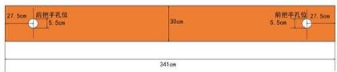

27.5cm 后把手孔位 30cm 前把手孔位 27.5cm
5.5cm 5.5cm 5.5cm
341cm

图 1.1: 龙头俯视数据图

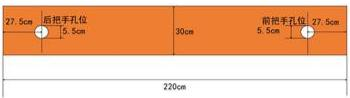

27.5cm 后把手孔位
5.5cm
30cm 前把手孔位
5.5cm 27.5cm
220cm

图 1.2: 龙身、龙尾俯视数据图

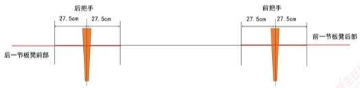

后把手
27.5cm 27.5cm
后一节板凳前部
前把手
27.5cm 27.5cm
前一节板凳后部

图 1.3: 板凳连接方式正视图

我们需要解决以下问题：

1. 有一舞龙队使用上述板凳龙，沿着螺距为 $55\mathrm{cm}$ 的等距螺线顺时针盘入，各把手中心均位于螺线上，龙头前把手的前进速度始终为 $1\mathrm{m / s}$ 。初始时刻，即 $t = 0\mathrm{s}$ 时，龙头位于螺线第16圈A点处。通过建立合适的数学模型，求解出从 $t = 0\mathrm{s}$ 至 $t = 300\mathrm{s}$ 为止，每秒各节板凳的前把手中心以及龙尾后把手中心的位置和速度。盘入螺线的起点以及方向如图1.4所示：

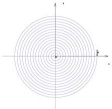

Concentric circular lines forming a circle centered at origin, with x and y axes labeled (no text or symbols beyond axis labels)

图 1.4: 盘入螺线示意图

2. 舞龙队继续向内盘入问题一中的螺线，求解在何时刻舞龙队不能再继续盘入，即板凳之间即将发生碰撞的时刻，并求出该时刻下各节板凳的前把手中心以及龙尾后把手中心的位置和速度。  
3. 考虑一个螺距为 $d(\mathrm{m})$ 的等距螺线，下称盘入螺线，舞龙队顺时针沿盘入螺线盘入后，将会切换为逆时针沿着盘出螺线（盘出螺线与盘入螺线关于螺线中心呈中心对称）盘出。因此，舞龙队需要一定的调头空间。在设定调头空间是以螺线中心为圆心、直径为 $9\mathrm{m}$ 的圆形区域的情况下，求最小的螺距 $d(\mathrm{m})$ ，使得龙头前把手能够沿着盘入螺线盘入到调头空间的边界。调头空间如图1.5所示：

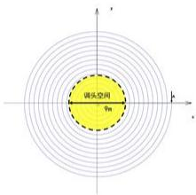

调头空间
9m

图 1.5: 调头空间示意图

4. 对于给定螺距 $d = 1.7\mathrm{m}$ 的盘入螺线，沿用问题三中对调头空间的设定，舞龙队需要在该调头空间内完成调头。调头路径是由两段圆弧相切连接成的S形曲线，前后两段圆弧半径之比为2，该路径与盘入、盘出螺线均相切。尝试通过调整圆弧的方式，在保持相切关系的情况下给出尽可能短的调头路径。若龙头前把手的前进速度始终为 $1\mathrm{m / s}$ ，求出从调头前至调头后这段时间内每秒各节板凳的前把手中心以及龙尾后把手中心的位置和速度。

5. 舞龙队沿问题四设定的最短调头路径前进，假定龙头的前进速度保持为 $v(\mathrm{m / s})$ ，求最大的 $v(\mathrm{m / s})$ 使得该过程中舞龙队各把手的速度均不超过 $2\mathrm{m / s}$ 。

# 二 问题分析

# 2.1 问题一的分析

对于问题一，已知盘入螺线的螺距和起点，本文能够建立该螺线对应的极坐标方程。由于龙头前把手沿盘入螺线的行进速度恒定，可以结合已经建立起的极坐标方程，采用积分的方式去确定其某段时间内走过的路径长度与走过的角度的关系，进而得到每一时刻的位置坐标。由此，本文能够利用极坐标方程与每节板凳的数据，建立起由前把手中心位置得到后把手中心位置的迭代公式。

在舞龙队盘入的过程中，虽然每个把手中心的前进速度各不相同，但不难看出，同一板凳上前后把手中心沿板凳中心所在直线的速度是一样的。利用这一特性，本文通过几何方法得到前后把手中心速度方向与板凳中心所在直线的夹角，进而得到同一板凳上前后把手中心速度的关系式，建立起由前把手中心速度得到后把手中心速度的迭代公式。

# 2.2 问题二的分析

对于问题二，在舞龙队沿着螺线盘入的过程中，随着龙头前把手逐渐接近圆心，由于每块板凳有自己固定的形状与体积，因此在接近于螺线中心的过程中，由于螺距的限制，可能会有一个时刻，舞龙队的板凳之间发生了碰撞。

经过分析，由于龙身与龙尾所有板凳形状完全相同，并且在盘入过程中走过的路径也相同。因此这些板凳是否发生碰撞只需要考虑第一节龙身是否与其他板凳发生碰撞，因为若在走过的路径中，第一节龙身未与其他板凳发生碰撞，后面的龙身自然也不会与其他板凳发生碰撞。故龙靠前部分只有龙头与第一节龙身可能会与其他板凳发生碰撞，并且显然只有这两块板外部的四个角点 $A_{1}$ 、 $A_{2}$ 、 $A_{3}$ 、 $A_{4}$ 可能会与其他板凳相撞，如下图所示：

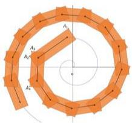


图 2.6: 板凳龙盘入示意图（橙色矩形为板凳）

由于问题一中，我们已经确定了各个时刻各把手中心位置，并且，上面提到的两块板凳把手中心与板凳的角的相对位置是固定的，本文由此计算出每个时刻各个角点的位置坐标。同时，在龙头外一层螺线上分布着一圈板凳，板凳的两个把手中心连接形成的线段是螺线的弦，并且可以利用问题一中所得到的坐标求出每条弦所在直线的解析式。因此本文利用角点到弦所在直线的距离来刻画碰撞与否，当距离小于板凳的半宽时说明已经发生了碰撞。

# 2.3 问题三的分析

结合问题一问题二，本文能够求解出当螺距已知时舞龙队盘入的终止时刻，以及此时舞龙队各把手的位置。对于问题三的问题要求，只需要通过调整螺距，使得在该螺距对应的终止时刻时，龙头前把手中心的位置恰好位于调头空间的边界上。

由此，可以先确定出两个螺距，使得在其各自的终止时刻时，龙头前把手中心的位置分别位于题设要求的调头空间内和调头空间外。再采用十分法，精确求解满足要求的最小螺距。

# 2.4 问题四的分析

对于问题四的第一问，即能否通过调整圆弧使得调头曲线变短，由于调头路径是由两段相切的圆弧构成的S型曲线，并且两段圆弧分别与盘入盘出螺线相切，通过分析其几何特性，本文通过计算判断是否能通过调整两段圆弧的半径比例使调头路径变短。

对于问题四的第二问，首先有掉头路径如图2.7所示：

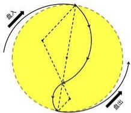

自入
自出

图 2.7: 调头空间（黄色）内掉头路径示意图

此路径有四段弧线，本文分别称作盘入螺线、第一段圆弧、第二段圆弧、盘出螺线。同时，此路径有三个关键节点，分别是盘入螺线与第一段圆弧的交点、两段圆弧的交点以及第二段圆弧与盘出螺线的交点。

首先，与问题一中的思路类似，当确定了调头路径的方程以后，根据龙头前把手的速度，可以得到各个时刻龙头前把手的位置坐标。本文先构建了一个判断函数：根据一块板凳的前把手的位置，判断该板凳后把手所位于的弧线

当一块板凳的前后两个把手均位于螺线上时，位置坐标的推导公式与问题一中相似；当一块板凳的前后两个把手均位于同一段圆弧上时，或者当一块板凳的前后两个把手分别位于两段不同的弧线时，根据前把手的位置，再利用几何知识，推导出后一把手位置。这样就可以通过前一个把手位置，通过判断函数判断后一个把手所在圆弧，即这两个把手的位置情况，再利用上面的位置推导公式，将问题一中的位置迭代公式推广到了在整个路径中运动时位置的迭代公式。进而，与问题一的思路类似，通过位置迭代公式，本文得到各个时刻，每块板凳前把手中心位置的坐标。

当一块板凳的前后两个把手均位于螺线上时，速度的推导公式与问题一中相似；当一块板凳的前后两个把手均位于同一圆弧上时，两把手速度相同；当一块板凳的前后两个把手分别位于两段不同的弧线时，可以根据前把手与后把手的位置坐标以及其分别所处的曲线，推导出前后把手中心速度的方向，以及连接前后把手中心位置线段所在直线的方向。利用直线夹角公式分别计算出前后把手中心速度方向与其所处板凳所在直线的夹角。最后根据问题一中的思路，采用关联速度的方法，根据前把手的速度得到后把手的速度。结合上述位置迭代公式，我们就将问题一中的速度迭代公式推广到了在整个路径中运动时速度的迭代公式。进而，与问题一的思路类似，通过速度的迭代公式，本文得到各个时刻，每个前把手中心的速度。

# 2.5 问题五的分析

在舞龙队调头过程中，龙头前把手行进速度始终保持不变，但其余各把手的速度会随着位置的变化而发生变化。经过分析问题四的结果发现，在龙头板凳由第二段调头圆弧进入盘出螺线的过程中，第三块板凳的前把手中心会在运动过程中速度达到最大值。

本文通过分析第四问结果确定了第三块板凳的前把手中心速度达到最大值的大致时间区间，进而计算出此时龙头前把手大致位置区间。再采用十分法，利用编程求解第三块板凳的前把手中心速度达到最大值的精确时间，以及此时龙头前把手精确位置。进而利用问题四中速度的迭代公式，可以得到在这个位置时龙头前把手中心速度与第三块板凳的前把手中心速度的关系，再通过限制第三块板凳的前把手中心速度不超过2，进而求得龙头最大行进速度。

# 三 模型准备

# 3.1 模型假设

1. 在舞龙队盘入前，已经以相同的螺距排列为等距螺线列队在盘入螺线外。  
2. 忽略板凳厚度带来的影响。  
3. 各把手中心严格位于螺线上。  
4. 忽略摩擦力带来的影响。

# 3.2 符号说明

所使用的符号及说明如表3.1所示。

表 3.1: 符号说明

<table><tr><td>符号</td><td>说明</td><td>单位</td></tr><tr><td> $d$ </td><td>螺距</td><td>m</td></tr><tr><td> $\rho$ </td><td>极径</td><td>m</td></tr><tr><td> $\theta$ </td><td>极角</td><td>rad</td></tr><tr><td> $v$ </td><td>龙头前把手行进速度</td><td>m/s</td></tr><tr><td> ${d}_{1}$ </td><td>把手中心到最近板头的距离</td><td>m</td></tr><tr><td> ${d}_{2}$ </td><td>半板宽</td><td>m</td></tr><tr><td> ${l}_{i}$ </td><td>第  $i$  块板凳前后把手中心所在直线</td><td></td></tr><tr><td> $l$ </td><td>板凳前后把手中心距离</td><td>m</td></tr><tr><td> ${A}_{1}$ </td><td>龙头前外部角点</td><td></td></tr><tr><td> ${A}_{2}$ </td><td>龙头后外部角点</td><td></td></tr><tr><td> ${A}_{3}$ </td><td>第一节龙身前外部角点</td><td></td></tr><tr><td> ${A}_{4}$ </td><td>第一节龙身后外部角点</td><td></td></tr><tr><td> ${di}j$ </td><td>角点  ${A}_{j}$  与直线  ${l}_{i}$  的距离</td><td>m</td></tr><tr><td> ${O}_{1}$ </td><td>第一段圆弧圆心</td><td></td></tr><tr><td> ${O}_{2}$ </td><td>第二段圆弧圆心</td><td></td></tr><tr><td> $\phi$ </td><td>第一段圆弧所对圆心角</td><td>rad</td></tr><tr><td> $D$ </td><td>调头空间直径</td><td>m</td></tr></table>

注意：其他符号已在文章的相应部分给出说明

# 四 模型的建立与求解

# 4.1 问题一模型的建立与求解

# 4.1.1 模型的建立

STEP1 龙头前把手中心位置的确定

由已知的螺距 $d = 0.55\mathrm{m}$ 和起点A(8.8,0)，本文能够建立盘入螺线所对应的极坐标方程：

$$
\rho (\theta) = \frac {d}{2 \pi} \theta
$$

由于龙头前把手沿盘入螺线的行进速度恒定为 $v = 1m / s$ ，从初始时刻 $t = 0s$ 至 $t = t_0 \in [0,300]$ 时刻，龙头前把手走过的路径长度为 $vt_0$ ，极角的角度从 $\theta = 32\pi$ 变为 $\theta = \theta_0$ 。根据螺线长度积分公式，能够得到以下关系式：

$$
v t _ {0} = \int_ {\theta_ {0}} ^ {3 2 \pi} \sqrt {(\rho^ {\prime} (\theta)) ^ {2} + \rho^ {2} (\theta)} \mathrm{d} \theta
$$

通过已知的 $t_{0}$ ，可以解得对应的 $\theta_{0}$ ，进而通过极坐标与直角坐标的转化公式：

$$
\left\{ \begin{array}{l} x _ {0} = \rho (\theta_ {0}) \cos \theta_ {0} \\ y _ {0} = \rho (\theta_ {0}) \sin \theta_ {0} \end{array} \right.
$$

得到 $t=t_{0}$ 时刻龙头前把手中心坐标 $(x_{0},y_{0})$ 。

STEP2 建立位置迭代公式

在得到了龙头前把手中心每个时刻的坐标后，本文建立了一个位置迭代公式以计算各个把手在每个时刻的坐标，建立过程如下：

假设在某一时刻下，某一板凳，其前后把手中心距离为 $l$ ，其前把手中心位置坐标为 $(x_{1},y_{1})$ ，极角为 $\theta = \theta_{1}$ ，极径为 $\rho = \rho_{1}$ 。假设该板凳后把手中心位置此时的坐标为 $(x_{2},y_{2})$ ，极角为 $\theta = \theta_{2}$ ，根据螺线方程，其极径满足方程：

$$
\rho_ {2} = \rho_ {1} + \frac {d}{2 \pi} (\theta_ {2} - \theta_ {1}) \tag {1}
$$

如图4.8所示的三角形中，通过余弦定理可得到如下公式：

$$
\rho_ {1} ^ {2} + \rho_ {2} ^ {2} - 2 \rho_ {1} \rho_ {2} \cos (\theta_ {2} - \theta_ {1}) = l ^ {2} \tag {2}
$$

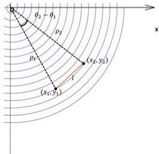

θ₂ - θ₁
ρ₂
ρ₁
(x₁, y₁)
(x₂, y₂)
l
x

图 4.8: 前后把手相对位置示意图

联立式(1)、式(2)，采用二分求零点的方法可解得 $\rho_{2}$ 与 $\theta_{2}$ ，进而通过坐标转化公式：

$$
\left\{ \begin{array}{l} x _ {2} = \rho_ {2} \cos \theta_ {2} \\ y _ {2} = \rho_ {2} \sin \theta_ {2} \end{array} \right.
$$

得到该板凳后把手中心位置的坐标 $(x_{2},y_{2})$ 。

通过STEP1中各个时刻龙头前把手中心坐标，利用该迭代公式，本文能够求解出各个时刻整个舞龙队各把手的位置。

STEP3 建立速度迭代公式

不难发现，在舞龙队盘入等距螺线的过程中，同一板凳上前后把手中心沿板凳前后把手中心所在直线的速度是一样的。本文借助这一特性，利用前后把手关于板凳的关联速度建立速度迭代公式，建立过程如下：

假设在某一时刻下，如图4.9所示：

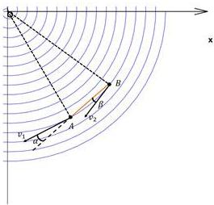

v₁
α
A
B
β
x

图 4.9: 前后把手速度示意图

某一板凳，已知其前把手中心位置坐标为 $A(x_{1},y_{1})$ ，行进速度为 $v_{1}$ ，极角为 $\theta_{1}$ ，螺线在该点的切线斜率为 $k_{1}$ 。由螺线极坐标方程，可以得到 $k_{1}$ 为：

$$
k _ {1} = \frac {\sin \theta_ {1} + \theta_ {1} \cos \theta_ {1}}{\cos \theta_ {1} - \theta_ {1} \sin \theta_ {1}}
$$

由上述位置迭代公式可以得到后把手中心B的坐标，记为 $(x_{2},y_{2})$ ，设其行进速度为 $v_{2}$ 。由螺线极坐标方程，可以得到其极角为 $\theta_{2}$ ，设螺线在该点的切线斜率为 $k_{2}$ 。
则 $k_{2}$ 为：

$$
k _ {2} = \frac {\sin \theta_ {2} + \theta_ {2} \cos \theta_ {2}}{\cos \theta_ {2} - \theta_ {2} \sin \theta_ {2}}
$$

接下来，分别设螺线在点A、点B处的切线与A、B所在直线的夹角分别为 $\alpha$ 、 $\beta$ 。由点A、点B的坐标可以得到A、B所在直线的斜率k为：

$$
k = \frac {y _ {1} - y _ {2}}{x _ {1} - x _ {2}}
$$

从而可以得到 $\alpha$ 、 $\beta$ 为：

$$
\alpha = \arctan \left| \frac {k _ {1} - k}{1 + k k _ {1}} \right|
$$

$$
\beta = \arctan \left| \frac {k _ {2} - k}{1 + k k _ {2}} \right|
$$

最后，利用前后把手关于板凳的关联速度建立速度迭代公式如下：

$$
v _ {1} \cos \alpha = v _ {2} \cos \beta
$$

通过已经求得的各个时刻整个舞龙队各把手的位置，以及龙头前把手的恒定速度，可以得到各个时刻整个舞龙队各把手的速度。

# 4.1.2 模型计算结果

将数据代入位置、速度迭代公式，通过程序得到结果如下：

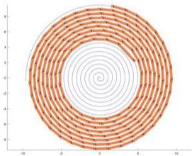

<details>
<summary>radar</summary>

| Angle (°) | Value |
| --------- | ----- |
| 0         | 0     |
| 30        | 0     |
| 60        | 0     |
| 90        | 0     |
| 120       | 0     |
| 150       | 0     |
| 180       | 0     |
| 210       | 0     |
| 240       | 0     |
| 270       | 0     |
| 300       | 0     |
| 330       | 0     |
| 360       | 0     |
| 390       | 0     |
| 420       | 0     |
| 450       | 0     |
| 480       | 0     |
| 510       | 0     |
| 540       | 0     |
| 570       | 0     |
| 600       | 0     |
| 630       | 0     |
| 660       | 0     |
| 690       | 0     |
| 720       | 0     |
| 750       | 0     |
| 780       | 0     |
| 810       | 0     |
| 840       | 0     |
| 870       | 0     |
| 900       | 0     |
| 930       | 0     |
| 960       | 0     |
| 990       | 0     |
| 1020      | 0     |
| 1050      | 0     |
| 1080      | 0     |
| 1110      | 0     |
| 1140      | 0     |
| 1170      | 0     |
| 1200      | 0     |
| 1230      | 0     |
| 1260      | 0     |
| 1290      | 0     |
| 1320      | 0     |
| 1350      | 0     |
| 1380      | 0     |
| 1410      | 0     |
| 1440      | 0     |
| 1470      | 0     |
| 1500      | 0     |
| 1530      | 0     |
| 1560      | 0     |
| 1590      | 0     |
| 1620      | 0     |
| 1650      | 0     |
| 1680      | 0     |
| 1710      | 0     |
| 1740      | 0     |
| 1770      | 0     |
| 1800      | 0     |
| 1830      | 0     |
| 1860      | 0     |
| 1890      | 0     |
| 1920      | 0     |
| 1950      | 0     |
| 1980      | 0     |
| 2010      | 0     |
| 2040      | 0     |
| 2070      | 0     |
| 2100      | 0     |
| 2130      | 0     |
| 2160      | 0     |
| 2190      | 0     |
| 2220      | 0     |
| 2250      | 0     |
| 2280      | 0     |
| 2310      | 0     |
| 2340      | 0     |
| 2370      | 0     |
| 2400      | 0     |
| Note: The data is in a ring format with alternating values between -4 and +4. There are no labels for the data series. The values are estimated based on the provided code. The chart type is a circle plot.
</details>

图 4.10: t = 300s 时舞龙队位置示意图

表 4.2: 位置结果

<table><tr><td></td><td>0s</td><td>60s</td><td>120s</td><td>180s</td><td>240s</td><td>300s</td></tr><tr><td>龙头x(m)</td><td>8.800000</td><td>5.799209</td><td>-4.084887</td><td>-2.963609</td><td>2.594494</td><td>4.420274</td></tr><tr><td>龙头y(m)</td><td>0.000000</td><td>-5.771092</td><td>-6.304479</td><td>6.094780</td><td>-5.356743</td><td>2.320429</td></tr><tr><td>第1节龙身x(m)</td><td>8.363824</td><td>7.456758</td><td>-1.445473</td><td>-5.237118</td><td>4.821221</td><td>2.459489</td></tr><tr><td>第1节龙身y(m)</td><td>2.826544</td><td>-3.440399</td><td>-7.405883</td><td>4.359627</td><td>-3.561949</td><td>4.402476</td></tr><tr><td>第51节龙身x(m)</td><td>-9.518732</td><td>-8.686317</td><td>-5.543149</td><td>2.890455</td><td>5.980011</td><td>-6.301346</td></tr><tr><td>第51节龙身y(m)</td><td>1.341137</td><td>2.540108</td><td>6.377946</td><td>7.249289</td><td>-3.827758</td><td>0.465829</td></tr><tr><td>第101节龙身x(m)</td><td>2.913983</td><td>5.687116</td><td>5.361939</td><td>1.898795</td><td>-4.917371</td><td>-6.237722</td></tr><tr><td>第101节龙身y(m)</td><td>-9.918311</td><td>-8.001384</td><td>-7.557638</td><td>-8.471614</td><td>-6.379874</td><td>3.936008</td></tr><tr><td>第151节龙身x(m)</td><td>10.861726</td><td>6.682312</td><td>2.388757</td><td>1.005154</td><td>2.965378</td><td>7.040740</td></tr><tr><td>第151节龙身y(m)</td><td>1.828753</td><td>8.134544</td><td>9.727411</td><td>9.424751</td><td>8.399721</td><td>4.393013</td></tr><tr><td>第201节龙身x(m)</td><td>4.555102</td><td>-6.619664</td><td>-10.627210</td><td>-9.287720</td><td>-7.457151</td><td>-7.458662</td></tr><tr><td>第201节龙身y(m)</td><td>10.725118</td><td>9.025570</td><td>1.359848</td><td>-4.246673</td><td>-6.180726</td><td>-5.263384</td></tr><tr><td>龙尾(后)x(m)</td><td>-5.305444</td><td>7.364557</td><td>10.974348</td><td>7.383895</td><td>3.241051</td><td>1.785033</td></tr><tr><td>龙尾(后)y(m)</td><td>-10.676584</td><td>-8.797992</td><td>0.843473</td><td>7.492371</td><td>9.469336</td><td>9.301164</td></tr></table>

表 4.3: 速度结果

<table><tr><td></td><td>0s</td><td>60s</td><td>120s</td><td>180s</td><td>240s</td><td>300s</td></tr><tr><td>龙头(m/s)</td><td>1.000000</td><td>1.000000</td><td>1.000000</td><td>1.000000</td><td>1.000000</td><td>1.000000</td></tr><tr><td>第1节龙身(m/s)</td><td>0.999971</td><td>0.999961</td><td>0.999945</td><td>0.999917</td><td>0.999859</td><td>0.999709</td></tr><tr><td>第51节龙身(m/s)</td><td>0.999742</td><td>0.999662</td><td>0.999538</td><td>0.999331</td><td>0.998941</td><td>0.998065</td></tr><tr><td>第101节龙身(m/s)</td><td>0.999575</td><td>0.999453</td><td>0.999269</td><td>0.998971</td><td>0.998435</td><td>0.997302</td></tr><tr><td>第151节龙身(m/s)</td><td>0.999448</td><td>0.999299</td><td>0.999078</td><td>0.998727</td><td>0.998115</td><td>0.996861</td></tr><tr><td>第201节龙身(m/s)</td><td>0.999348</td><td>0.999180</td><td>0.998935</td><td>0.998551</td><td>0.997894</td><td>0.996574</td></tr><tr><td>龙尾(后)(m/s)</td><td>0.999311</td><td>0.999136</td><td>0.998883</td><td>0.998489</td><td>0.997816</td><td>0.996478</td></tr></table>

# 4.2 问题二模型的建立与求解

# 4.2.1 模型的建立

STEP1 龙头与第一节龙身外部四个角点位置的确定

对任一块板凳，记把手中心距最近的板头距离为 $d_{1}$ ，半板宽为 $d_{2}$ ，前后把手中心连线所在直线为 $l_{1}$ ，板外侧边所在直线为 $a_3$ ，前、后把手中心与最近的外部角点连线所在直线分别为 $a_2$ 、 $a_4$ ，由对称性， $l_{1}$ 与 $a_2$ 、 $a_3$ 的夹角均为 $\gamma$ ，如图4.11所示：

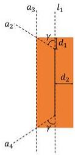

a₃
l₁
a₂
γ
d₁
d₂
γ
a₄

图 4.11: 板凳示意图

龙头前外部角点 $A_{1}$ 位置的确定如下：

假设t时刻下龙头前把手中心位置坐标为 $(x_{1},y_{1})$ ，极角为 $\theta=\theta_{1}$ 。根据问题一的位置迭代公式，求龙头后把手中心位置坐标为 $(x_{2},y_{2})$ ，进而求得龙头两把手中心所在直线 $l_{1}$ 的解析式：

$$
l _ {1}: y - y _ {1} = k _ {1} (x - x _ {1}) \qquad \text {其中} k _ {1} = \frac {y _ {1} - y _ {2}}{x _ {1} - x _ {2}}
$$

由于 $a_2$ 是由 $l_{1}$ 绕前把手中心逆时针旋转 $\gamma$ 得到的，根据直线旋转角公式，得到 $a_2$ 的解析式：

$$
a _ {2}: y - y _ {1} = k _ {2} (x - x _ {1}) \quad \text {其中} k _ {2} = \frac {\tan \gamma + k _ {1}}{k _ {1} \tan \gamma - 1}, \tan \gamma = \frac {d _ {2}}{d _ {1}}
$$

由于 $a_3$ 是由 $l_{1}$ 向远离中心原点方向平移 $d_{2}$ 得到的，由此得到 $a_3$ 的解析式：

$$
a _ {3}: y = k _ {1} x + b \quad \text {其中} b \text {满足条件:} \frac {| b - y _ {1} + k _ {1} x _ {1} |}{\sqrt {1 + k _ {1} ^ {2}}} = d _ {2} \text {与} | b | > | y _ {1} - k _ {1} x _ {2} |
$$

联立 $a_2$ 与 $a_3$ ，即可解得 $A_{1}$ 的坐标：

$$
\left(x _ {A _ {1}}, y _ {A _ {1}}\right) = \left(\frac {y _ {1} - k _ {2} x _ {1} - b}{k _ {1} - k _ {2}}, \frac {k _ {1} y _ {1} - k _ {1} k _ {2} x _ {1} - k _ {2} b}{k _ {1} - k _ {2}}\right)
$$

类似的，能够确定t时刻下龙头后外部角点 $A_{2}$ 、第一节龙身前外部角点 $A_{3}$ 、第一节龙身后外部角点 $A_{4}$ 的坐标。

STEP2 四个角点碰撞情况的判断

在STEP1中，本文利用t时刻下确定的龙头前把手坐标 $(x_{1},y_{1})$ ，解得四个角点 $A_{1}$ 、 $A_{2}$ 、 $A_{3}$ 、 $A_{4}$ 的坐标。

同时，可以通过问题一所得的结果，得到 $t$ 时刻下极角 $\theta \in [\theta_1 + \frac{3\pi}{2}, \theta_1 + \frac{5\pi}{2}]$ 的各前把手中心坐标 $(x_i, y_i)$ （ $i$ 即为该前把手属于第 $i$ 块板凳，龙头为第1块板凳），记满足前把手坐标 $(x_i, y_i)$ 落在要求的极角范围内的 $i$ 的集合为 $I$ 。通过两点间直线公式，能够求解出第 $i$ 块板凳前后把手中心连线所在直线 $l_i$ 的解析式：

$$
l _ {i}: y - y _ {i} = \frac {y _ {i} - y _ {i + 1}}{x _ {i} - x _ {i + 1}} (x - x _ {i})
$$

得到了角点坐标与直线 $l_{i}$ 的解析式后，记角点 $A_{j}$ 与直线 $l_{i}$ 的距离为 $d_{ij}$ ，即：

$$
d _ {i j} = \frac {\left| \frac {y _ {i} - y _ {i + 1}}{x _ {i} - x _ {i + 1}} (x _ {A _ {1}} - x _ {i}) - y _ {A _ {1}} + y _ {i} \right|}{\sqrt {(\frac {y _ {i} - y _ {i + 1}}{x _ {i} - x _ {i + 1}}) ^ {2} + 1}}
$$

对于是否发生碰撞，本文给出如下判断准则：

$$
\left\{ \begin{array}{c c} {\forall i, j (i \in I, j = 1, 2, 3, 4), d _ {i j} > d _ {2}} & {\text {则} t \text {时刻未发生碰撞}} \\ {\exists i, j (i \in I, j = 1, 2, 3, 4)} & {\text {使得} \quad d _ {i j} \leq d _ {2}} \end{array} \right. \text {则} t \text {时刻发生碰撞}
$$

由此能够确定舞龙队盘入的终止时刻。

# 4.2.2 模型计算结果

代入数据后，本文通过程序得到终止时刻412.473894s，发生碰撞的点为龙头左前角点，位置、速度结果如下：

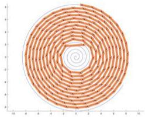

<details>
<summary>radar</summary>

| Angle (degrees) | Value |
|---|---|
| 0 | 0 |
| 1 | 1 |
| 2 | 2 |
| 3 | 3 |
| 4 | 4 |
| 5 | 5 |
| 6 | 4 |
| 7 | 3 |
| 8 | 2 |
| 9 | 1 |
| 10 | 0 |
| 11 | -1 |
| 12 | -2 |
| 13 | -3 |
| 14 | -4 |
| 15 | -5 |
| 16 | -4 |
| 17 | -3 |
| 18 | -2 |
| 19 | -1 |
| 20 | 0 |
| 21 | 1 |
| 22 | 2 |
| 23 | 3 |
| 24 | 4 |
| 25 | 5 |
| 26 | 4 |
| 27 | 3 |
| 28 | 2 |
| 29 | 1 |
| 30 | 0 |
| 31 | -1 |
| 32 | -2 |
| 33 | -3 |
| 34 | -4 |
| 35 | -5 |
| 36 | -4 |
| 37 | -3 |
| 38 | -2 |
| 39 | -1 |
| 40 | 0 |
| 41 | 1 |
| 42 | 2 |
| 43 | 3 |
| 44 | 4 |
| 45 | 5 |
| 46 | 4 |
| 47 | 3 |
| 48 | 2 |
| 49 | 1 |
| 50 | 0 |
| 51 | -1 |
| 52 | -2 |
| 53 | -3 |
| 54 | -4 |
| 55 | -5 |
| 56 | -4 |
| 57 | -3 |
| 58 | -2 |
| 59 | -1 |
| 60 | 0 |
| 61 | 1 |
| 62 | 2 |
| 63 | 3 |
| 64 | 4 |
| 65 | 5 |
| 66 | 4 |
| 67 | 3 |
| 68 | 2 |
| 69 | 1 |
| 70 | 0 |
| 71 | -1 |
| 72 | -2 |
| 73 | -3 |
| 74 | -4 |
| 75 | -5 |
| 76 | -4 |
| 77 | -3 |
| 78 | -2 |
| 79 | -1 |
| 80 | 0 |
| 81 | 1 |
| 82 | 2 |
| 83 | 3 |
| 84 | 4 |
| 85 | 5 |
| 86 | 4 |
| 87 | 3 |
| 88 | 2 |
| 89 | 1 |
| 90 | 0 |
| Note: The data is in a ring format with alternating positive and negative values. The angle values are calculated based on the number of variables (e.g., 'x' for x > x = π/2). The y-axis is labeled 'Value'. The label 'x' is also provided in the text below.
</details>

图 4.12: 盘入终止时刻舞龙队位置示意图

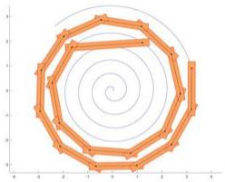

Geometric spiral diagram with orange lines and dots, no text or symbols present

图 4.13: 盘入终止时刻舞龙队位置示意图（放大）

表 4.4: 位置结果  
表 4.5: 速度结果

<table><tr><td></td><td>终止时刻412.473894s</td><td></td><td>终止时刻412.473894s</td></tr><tr><td>龙头x (m)</td><td>1.209931</td><td>龙头 (m/s)</td><td>1.000000</td></tr><tr><td>龙头y (m)</td><td>1.942784</td><td>第1节龙身 (m/s)</td><td>0.991551</td></tr><tr><td>第1节龙身x (m)</td><td>-1.643792</td><td>第51节龙身 (m/s)</td><td>0.976858</td></tr><tr><td>第1节龙身y (m)</td><td>1.753399</td><td>第101节龙身 (m/s)</td><td>0.974550</td></tr><tr><td>第51节龙身x (m)</td><td>1.281201</td><td>第151节龙身 (m/s)</td><td>0.973608</td></tr><tr><td>第51节龙身y (m)</td><td>4.326588</td><td>第201节龙身 (m/s)</td><td>0.973096</td></tr><tr><td>第101节龙身x (m)</td><td>-0.536245</td><td>龙尾(后)(m/s)</td><td>0.972938</td></tr><tr><td>第101节龙身y (m)</td><td>-5.880138</td><td rowspan="7" colspan="2"></td></tr><tr><td>第151节龙身x (m)</td><td>0.968841</td></tr><tr><td>第151节龙身y (m)</td><td>-6.957479</td></tr><tr><td>第201节龙身x (m)</td><td>-7.893161</td></tr><tr><td>第201节龙身y (m)</td><td>-1.230764</td></tr><tr><td>龙尾(后)x (m)</td><td>0.956216</td></tr><tr><td>龙尾(后)y (m)</td><td>8.322736</td></tr></table>

# 4.3 问题三模型的建立与求解

# 4.3.1 模型的建立

通过问题一、问题二中建立的模型，不难发现，在其他条件不变的情况下，每个时刻下舞龙队各把手所处的位置和舞龙队盘入的终止时刻都由螺距大小决定。

因此，本文在问题三中将沿用问题一、问题二的模型和公式，对于任一螺距d，本文建立如下判定流程：

STEP1 对于该螺距 $d$ ，利用问题二的模型，求解出该螺距下舞龙队的盘入终止时刻。

STEP2 将STEP1中求得的终止时刻与螺距d代入问题一的模型，求解出此时龙头前把手中心的坐标。

STEP3 检查STEP2中得到的龙头前把手中心坐标落在题设要求调头空间的边界上/内部/外部。

本文首先通过调整螺距d得到两个分别使龙头前把手中心落在调头空间内部和外部的螺距，再通过十分法，精确求解使龙头前把手中心恰好位于边界上的螺距。

# 4.3.2 模型计算结果

代入数据，本文通过程序求解得到能够满足要求的最小螺距为：0.450338（m）在该最小螺距下，碰撞是由龙头板凳的左后角点造成的。

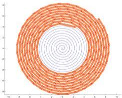

<details>
<summary>radar</summary>

| Angle | Radius |
|-------|--------|
| 0°    | 0      |
| 30°   | 1      |
| 60°   | 2      |
| 90°   | 3      |
| 120°  | 4      |
| 150°  | 5      |
| 180°  | 6      |
| 210°  | 5      |
| 240°  | 4      |
| 270°  | 3      |
| 300°  | 2      |
| 330°  | 1      |
| 360°  | 0      |
</details>

图 4.14: 最小螺距下最接近碰撞时刻示意图

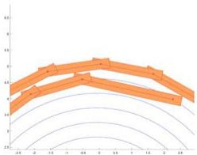

<details>
<summary>line</summary>

| X-Axis | Y-Axis |
|---|---|
| -2.0 | 0.4 |
| -1.5 | 0.6 |
| -1.0 | 0.8 |
| -0.5 | 1.0 |
| 0.0 | 1.1 |
| 0.5 | 1.0 |
| 1.0 | 0.9 |
| 1.5 | 0.7 |
| 2.0 | 0.5 |
</details>

图 4.15: 最小螺距下最接近碰撞时刻示意图（放大）

# 4.4 问题四模型的建立与求解

# 4.4.1 模型的建立

首先证明不可以通过调整圆弧使得调头路径更短：假设两圆弧的半径比为k时，调头路径如图4.16所示：

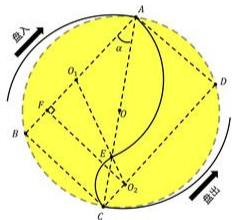

输入
A
α
O
F
B
C
D
O₂
B
D₁
B₁
C₁
输出

图 4.16: 调头路径示意图

其中四边形ABCD为矩形， $O_{1}$ 、 $O_{2}$ 分别为两个圆弧对应的圆心，过 $O_{2}$ 作 $O_{2}F$ 垂直于AB，垂足为F。

因角 $\alpha$ 为盘入螺线在切入点处切线的垂线与调头空间直径 $AC$ 的夹角，因此， $\alpha$ 与两端圆弧的半径比无关。

设第二段圆弧半径为 $r$ ，则第一段圆弧半径为 $kr$ 。两段圆弧所对应的圆心角的角度为 $\pi -2\alpha$ ，则调头路径的长度，即两段圆弧的长度之和为：

$$
s = (k + 1) r (\pi - 2 \alpha) \tag {1}
$$

在直角三角形ABC中，AC为调头空间的直径，其长度记为D，则有：

$$
A B = D \cos \alpha
$$

$$
B C = D \sin \alpha
$$

从而，在直角三角形 $O_{2}FO_{1}$ 中，有：

$$
O _ {2} F = B C = D \sin \alpha
$$

$$
O _ {1} F = A B - O _ {1} A - B F = D \cos \alpha - (k + 1) r
$$

$$
O _ {1} O _ {2} = (k + 1) r
$$

利用勾股定理，有：

$$
D ^ {2} \sin^ {2} \alpha + (D \cos \alpha - (k + 1) r) ^ {2} = (k + 1) ^ {2} r ^ {2} \tag {2}
$$

联立公式(1)、(2)，即可解得：

$$
s = \frac {D \alpha}{2 \cos \alpha}
$$

由此发现调头路径的长度 $s$ 与两段圆弧半径比 $k$ 无关，因此不可以通过调整圆弧使得调头路径更短。

本文在后续求解过程中设定两段圆弧的半径比为2:1。

计算得该比例下部分数据如下：

切入点A坐标为：

$$
\left(x _ {A}, y _ {A}\right) = (- 2. 7 1 1 8 5 6, - 3. 5 9 1 0 7 8)
$$

大圆弧圆心01坐标为：

$$
\left(x _ {O _ {1}}, y _ {O _ {1}}\right) = (- 0. 7 6 0 0 0 9, - 1. 3 0 5 7 2 6)
$$

小圆弧圆心 $O_{2}$ 坐标为：

$$
\left(x _ {O _ {2}}, y _ {O _ {2}}\right) = (1. 7 3 5 9 3 2, 2. 4 4 8 4 0 2)
$$

小圆弧的半径为：

$$
r = 1. 5 0 2 7 0 9 (m)
$$

两段圆弧交点E坐标为：

$$
(x _ {E}, y _ {E}) = (0. 9 0 3 9 5 2, 1. 1 9 7 0 2 6)
$$

切出点C坐标为：

$$
(x _ {C}, y _ {C}) = (2. 7 1 1 8 5 6, 3. 5 9 1 0 7 8)
$$

两端圆弧所对应的圆心角为：

$$
\phi = 3. 0 2 1 4 8 7 (r a d)
$$

随后，在求解调头过程中各个时刻整个舞龙队的位置和速度，有如下步骤：

STEP1 确定龙头前把手中心位置

和问题一的思路类似，由于龙头前把手的行进速度恒定，本文利用四段弧线的方程和积分求解出掉头过程中各个时刻龙头前把手中心的位置。

STEP2 建立根据前把手中心位置判断后把手中心所处弧线的判断函数

假设某一时刻，某一板凳，其前后把手中心距离为l，其前把手中心位置坐标为 $(x_{1},y_{1})$ 已知，从而能够得知该点位于哪一段弧线上。有如下情况：

1. 当该点位于盘入螺线时，该板凳后把手中心一定位于盘入螺线上。  
2. 当该点位于第一段圆弧时，引入判断角 $\varphi$ ，如图4.17所示：

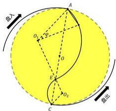

注入
O₁ + O₂
A
O
E
O₂
C
溢出

图 4.17: 情况二判断角示意图

其中， $\varphi$ 满足：

$$
(2 r) ^ {2} + (2 r) ^ {2} - 2 (2 r) ^ {2} \cos \varphi = l ^ {2}
$$

解得：

$$
\varphi = \arccos (\frac {8 r ^ {2} - l ^ {2}}{8 r ^ {2}})
$$

接下来，设前把手中心与 $O_{1}$ 连线的线段与 $O_{1}A$ 的夹角为 $\varphi'$ ，有：

$$
\varphi^ {\prime} = \arctan \left| \frac {\frac {y _ {A} - y _ {O _ {1}}}{x _ {A} - x _ {O _ {1}}} - \frac {y _ {1} - y _ {O _ {1}}}{x _ {1} - x _ {O _ {1}}}}{1 + \frac {y _ {A} - y _ {O _ {1}}}{x _ {A} - x _ {O _ {1}}} \frac {y _ {1} - y _ {O _ {1}}}{x _ {1} - x _ {O _ {1}}}} \right|
$$

当 $\varphi^{\prime}>\varphi$ 时，后把手中心在第一段圆弧上；

当 $\varphi^{\prime}\leq\varphi$ 时，后把手中心在盘入螺线上。

3. 当该点位于第二段圆弧时，此时的判断角 $\varphi$ 如图4.18所示：

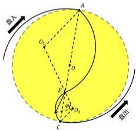

A
O₁
O
E
O₂
C
B
直出

图 4.18: 情况三判断角示意图

其中， $\varphi$ 满足：

$$
r ^ {2} + r ^ {2} - 2 r ^ {2} \cos \varphi = l ^ {2}
$$

解得：

$$
\varphi = \arccos (\frac {2 r ^ {2} - l ^ {2}}{2 r ^ {2}})
$$

接下来，设前把手中心与 $O_{2}$ 连线的线段与 $O_{2}E$ 的夹角为 $\varphi^{\prime}$ ，有：

$$
\varphi^ {\prime} = \arctan \left| \frac {\frac {y _ {E} - y _ {O _ {2}}}{x _ {E} - x _ {O _ {2}}} - \frac {y _ {1} - y _ {O _ {2}}}{x _ {1} - x _ {O _ {2}}}}{1 + \frac {y _ {E} - y _ {O _ {2}}}{x _ {E} - x _ {O _ {2}}} \frac {y _ {1} - y _ {O _ {2}}}{x _ {1} - x _ {O _ {2}}}} \right|
$$

当 $\varphi^{\prime}>\varphi$ 时，后把手中心在第二段圆弧上：

当 $\varphi^{\prime}\leq\varphi$ 时，后把手中心在第一段圆弧上。

4. 当该点位于盘出螺线时，此时的判断角 $\varphi$ 如图4.19所示：

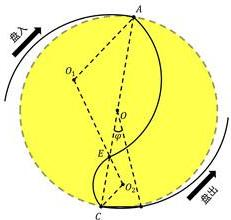

直入
O₁
O₂
O₃
O₄
E
C
直出

图 4.19: 情况四判断角示意图

其中， $\varphi$ 满足：

$$
(\frac {D}{2} + \frac {d}{2 \pi} \varphi) ^ {2} + (\frac {D}{2}) ^ {2} - D (\frac {D}{2} + \frac {d}{2 \pi}) \cos \varphi = l ^ {2}
$$

本文通过程序解得 $\varphi$ 的值。

接下来，设前把手中心与O连线的线段与OC的夹角为 $\varphi'$ ，有：

$$
\varphi^ {\prime} = \frac {2 \pi (\sqrt {x _ {1} ^ {2} + y _ {1} ^ {2}} - \frac {D}{2})}{d}
$$

当 $\varphi^{\prime}>\varphi$ 时，后把手中心在盘出螺线上；

当 $\varphi^{\prime}\leq\varphi$ 时，后把手中心在第二段圆弧上。

# STEP3 建立位置迭代公式

假设某一时刻，某一板凳，其前后把手中心距离为 $l$ ，其前把手中心位置坐标为 $(x_{1},y_{1})$ 已知，从而能够得知该点位于哪一段弧线上。

有如下情况：

1. 当板凳的前把手中心位于盘入螺线上时，位置迭代公式与问题一相同。  
2. 当板凳的前把手中心位于第一段圆弧，后把手中心位于盘入螺线上，如图4.20所示：

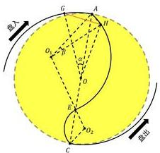

投入
G
A
H
O₁
B
L
O
E
O₂
C
盘出

图 4.20: 情况二示意图

结合螺线方程，可知：

$$
\begin{array}{l} O G = \frac {D}{2} + \frac {d \alpha}{2 \pi} \\ O H = \sqrt {x _ {1} ^ {2} + y _ {1} ^ {2}} \\ \end{array}
$$

$$
\angle G O H = \alpha + \angle A O H
$$

在三角形OGH中，有余弦定理：

$$
O G ^ {2} + O H ^ {2} - 2 O G \cdot O H \cos (\angle H O G) = l ^ {2}
$$

在三角形 $AO_{1}H$ 中，有余弦定理：

$$
(2 r) ^ {2} + (2 r) ^ {2} - 2 (2 r) ^ {2} \cos \beta = A H ^ {2}
$$

在三角形AOH中，有余弦定理：

$$
(\frac {D}{2}) ^ {2} + O H ^ {2} - D \cdot O H \cos (\angle A O H) = A H ^ {2}
$$

联立上述公式，用程序解得 $\alpha$ 和 $OG$ 的值，进而由螺线方程得到后把手中心 $G$ 的坐标：

$$
(x _ {2}, y _ {2}) = ((\frac {D}{2} + \frac {d \alpha}{2 \pi}) \cos (\frac {D \pi}{d} + \alpha), (\frac {D}{2} + \frac {d \alpha}{2 \pi}) \sin (\frac {D \pi}{d} + \alpha))
$$

3. 当板凳的前后把手中心均位于第一段圆弧，如图4.21所示：

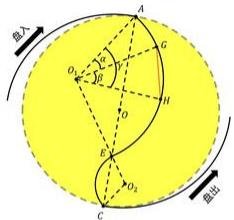

投入
O₁
O₂
O₃
O
G
H
B
C
O₂
C
盘出

图 4.21: 情况三示意图

其中， $\beta$ 满足：

$$
(2 r) ^ {2} + (2 r) ^ {2} - 2 (2 r) ^ {2} \cos \beta = l ^ {2}
$$

解得：

$$
\beta = \arccos (\frac {8 r ^ {2} - l ^ {2}}{8 r ^ {2}})
$$

又有：

$$
\gamma = \arctan \left(\frac {\frac {y _ {A} - y _ {O _ {1}}}{x _ {A} - x _ {O _ {1}}} - \frac {y _ {1} - y _ {O _ {1}}}{x _ {1} - x _ {O _ {1}}}}{1 + \frac {y _ {A} - y _ {O _ {1}}}{x _ {A} - x _ {O _ {1}}} \frac {y _ {1} - y _ {O _ {1}}}{x _ {1} - x _ {O _ {1}}}}\right)
$$

$$
\alpha = \gamma - \beta
$$

从而能够通过程序解得后把手中心G的坐标：

$$
(x _ {2}, y _ {2}) = (x _ {O _ {1}} + 2 r \cos (\arctan (\frac {y _ {O _ {1}} - y _ {A}}{x _ {O _ {1}} - x _ {A}}) + \pi - \alpha), y _ {O _ {1}} + 2 r \sin (\arctan (\frac {y _ {O _ {1}} - y _ {A}}{x _ {O _ {1}} - x _ {A}}) + \pi - \alpha))
$$

4. 当板凳的前后把手中心位于第二段圆弧，后把手中心位于第一段圆弧，如图4.22所示：

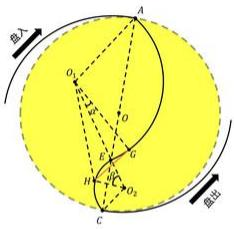

O
A
O₁
O₂
C
H
C
E
E
C
E
E
盘出

图 4.22: 情况四示意图

其中，角 $\beta$ 已知，在三角形 $O_{1}HO_{2}$ 中，由余弦定理、正弦定理有：

$$
r ^ {2} + (3 r) ^ {2} - 6 r \cos \beta = O _ {1} H ^ {2}
$$

$$
\frac {O _ {1} H}{\sin \beta} = \frac {O _ {2} H}{\sin \angle H O _ {1} O _ {2}}
$$

在三角形 $O_{1}HG$ 中，由余弦定理：

$$
O _ {1} H ^ {2} + (2 r) ^ {2} - 4 r \cdot O _ {1} H \cos (\angle H O _ {1} G) = l ^ {2}
$$

又：

$$
\alpha = \angle H O _ {1} G - \angle H O _ {1} O _ {2}
$$

联立上述公式解得：

$$
\alpha = \arccos (\frac {1 4 r ^ {2} - 6 r \cos \beta - l ^ {2}}{4 r \sqrt {1 0 r ^ {2} - 6 r \cos \beta}}) - \arcsin (\frac {r \sin \beta}{\sqrt {1 0 r ^ {2} - 6 r \cos \beta}})
$$

从而解得后把手中心G的坐标：

$$
(x _ {2}, y _ {2}) = (x _ {O _ {1}} + 2 r \cos (\arctan (\frac {y _ {O _ {1}} - y _ {A}}{x _ {O _ {1}} - x _ {A}}) + \pi + \alpha - \phi), y _ {O _ {1}} + 2 r \sin (\arctan (\frac {y _ {O _ {1}} - y _ {A}}{x _ {O _ {1}} - x _ {A}}) + \pi + \alpha - \phi))
$$

5. 当板凳的前后把手中心均位于第二段圆弧，如图4.23所示：

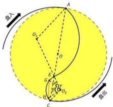

A
O₁
O
P
G
O₂
N
C
圆心
圆出

图 4.23: 情况五示意图

其中，角 $\gamma$ 已知，在三角形 $GO_{2}H$ 中，由余弦定理：

$$
r ^ {2} + r ^ {2} - 2 r ^ {2} \cos \beta = l ^ {2}
$$

解得：

$$
\beta = \arccos \left(\frac {2 r ^ {2} - l ^ {2}}{2 r ^ {2}}\right)
$$

又：

$$
\alpha = \gamma - \beta
$$

从而能够通过程序解得后把手中心G的坐标：

$$
(x _ {2}, y _ {2}) = (x _ {2}, y _ {2}) = (x _ {O _ {2}} + r \cos (\arctan (\frac {y _ {O _ {2}} + y _ {A}}{x _ {O _ {2}} + x _ {A}}) + \alpha - \phi), y _ {O _ {2}} + r \sin (\arctan (\frac {y _ {O _ {2}} + y _ {A}}{x _ {O _ {2}} + x _ {A}}) + \alpha - \phi))
$$

6. 当板凳的前后把手中心位于盘出螺线，后把手中心位于第二段圆弧，如图4.24所示：

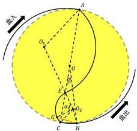

A
O₁
O₂
B
C
H
E
O₂
C
H
盘出
盘入

图 4.24: 情况六示意图

由螺线方程，有：

$$
O H = \frac {D}{2} + \frac {d \beta}{2 \pi}
$$

在三角形OCH中，由余弦、正弦定理：

$$
\frac {D ^ {2}}{4} + (\frac {D}{2} + \frac {d \beta}{2 \pi}) ^ {2} - D (\frac {D}{2} + \frac {d \beta}{2 \pi}) \cos \beta = C H ^ {2}
$$

$$
\frac {\sin \beta}{C H} = \frac {\sin (\angle O C H)}{O H}
$$

从而得到：

$$
\angle O _ {2} C H = \angle O C H - \frac {(\pi - \phi)}{2}
$$

在三角形 $O_{2}CH$ 中，由余弦、正弦定理：

$$
r ^ {2} + C H ^ {2} - 2 r \cdot C H \cos (\angle O _ {2} C H) = O _ {2} H ^ {2}
$$

$$
\frac {\sin (\angle O _ {2} H C)}{r} = \frac {\sin (\angle O _ {2} C H)}{O _ {2} H} = \frac {\sin (\angle C O _ {2} H)}{C H}
$$

在三角形 $O_{2}GH$ 中，由余弦定理：

$$
r ^ {2} + O _ {2} H ^ {2} - 2 r \cdot O _ {2} H \cos (\angle G O _ {2} H) = l ^ {2}
$$

从而：

$$
\angle G O _ {2} C = \angle G O _ {2} H - \angle C O _ {2} H
$$

$$
\alpha = \phi - \angle G O _ {2} C
$$

利用程序解得 $\alpha$ 的值，即可解得后把手中心G的坐标：

$$
(x _ {2}, y _ {2}) = (x _ {2}, y _ {2}) = (x _ {O _ {2}} + r \cos (\arctan (\frac {y _ {O _ {2}} + y _ {A}}{x _ {O _ {2}} + x _ {A}}) + \alpha - \phi), y _ {O _ {2}} + r \sin (\arctan (\frac {y _ {O _ {2}} + y _ {A}}{x _ {O _ {2}} + x _ {A}}) + \alpha - \phi))
$$

7. 当板凳的前后把手中心均位于盘出螺线上时，由于盘入螺线与盘出螺线关于螺线中心呈中心对称，故可采用类似于情况一的方法求解后把手中心的坐标。

# STEP4 建立速度迭代公式

根据上述位置迭代公式，对于一块板凳，可以解得任一时刻其前后把手中心的坐标，从而有前后把手中心所在直线的斜率。因此，要将前后把手的速度关联起来，只需要确定前后把手分别的速度方向，即前后把手中心的切线方向。

同STEP3一样，有7种情况，由于已经通过程序求解出两段圆弧的圆心 $O_{1}$ 、 $O_{2}$ 的坐标，并且已知盘入、盘出螺线的方程，故不论前后把手中心位于哪一段弧线上，都能求解出其速度方向，即在该弧线上的切线方向。从而结合前后把手中心所在直线的斜率、前后把手沿中心所在直线的速度相同，建立起前后把手速度的关系式，也就是速度迭代公式。

取定一点 $I(x,y)$ ，本文分四种情况讨论该点处切线的斜率：

1. 当I位于盘入螺线时，可由极坐标方程计算其极角 $\theta$ ，从而有切线斜率：

$$
k = \frac {\sin \theta + \theta \cos \theta}{\cos \theta - \theta \sin \theta}
$$

2. 当I位于第一段圆弧时，可计算切线斜率为：

$$
k = - \frac {x - x _ {O _ {1}}}{y - y _ {O _ {1}}}
$$

3. 当I位于第二段圆弧时，可计算切线斜率为：

$$
k = - \frac {x - x _ {O _ {2}}}{y - y _ {O _ {2}}}
$$

4. 当 $I$ 位于盘出螺线时，可由极坐标方程计算其极角 $\theta$ ，从而有切线斜率：

$$
k = \frac {\sin \theta + \theta \cos \theta}{\cos \theta - \theta \sin \theta}
$$

本文以前把手中心在第一段圆弧上，后把手中心在盘入螺线上的情况为例：

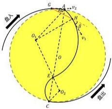

自入
G
A
v₂
H
β
v₁
O₁
O
E
O₂
C
自出

图 4.25: 速度迭代示意图

已知前把手中心H坐标为 $(x_{1},y_{1})$ ，根据上述位置迭代公式可以得到后把手中心G的坐标，记为 $(x_{2},y_{2})$ ，由盘入螺线方程可得极角为 $\theta_{2}$ 。

从而有前后把手中心所在直线的斜率：

$$
k = \frac {y _ {1} - y _ {2}}{x _ {1} - x _ {2}}
$$

前把手中心的切线斜率：

$$
k _ {1} = - \frac {x _ {1} - x _ {O _ {1}}}{y _ {1} - y _ {O _ {1}}}
$$

后把手中心的切线斜率：

$$
k _ {2} = \frac {\sin \theta_ {2} + \theta_ {2} \cos \theta_ {2}}{\cos \theta_ {2} - \theta_ {2} \sin \theta_ {2}}
$$

可以得到 $\alpha$ 、 $\beta$ 为：

$$
\alpha = \arctan \left| \frac {k _ {2} - k}{1 + k k _ {2}} \right|
$$

$$
\beta = \arctan \left| \frac {k _ {1} - k}{1 + k k _ {1}} \right|
$$

从而建立起前后把手速度 $v_{1}$ 、 $v_{2}$ 的关系式：

$$
v _ {1} \cos \beta = v _ {2} \cos \alpha
$$

对于其他情况，本文使用相应的方法得到了相应的速度迭代公式。

# 4.4.2 模型计算结果

代入数据，通过程序得到结果如下：

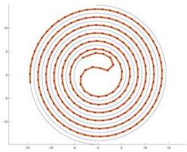

<details>
<summary>radar</summary>

| Angle (degrees) | Value |
| --------------- | ----- |
| 0               | 0     |
| 30              | 0     |
| 60              | 0     |
| 90              | 0     |
| 120             | 0     |
| 150             | 0     |
| 180             | 0     |
| 210             | 0     |
| 240             | 0     |
| 270             | 0     |
| 300             | 0     |
| 330             | 0     |
| 360             | 0     |
| 390             | 0     |
| 420             | 0     |
| 450             | 0     |
| 480             | 0     |
| 510             | 0     |
| 540             | 0     |
| 570             | 0     |
| 600             | 0     |
| 630             | 0     |
| 660             | 0     |
| 690             | 0     |
| 720             | 0     |
| 750             | 0     |
| 780             | 0     |
| 810             | 0     |
| 840             | 0     |
| 870             | 0     |
| 900             | 0     |
| 930             | 0     |
| 960             | 0     |
| 990             | 0     |
| 1020            | 0     |
| 1050            | 0     |
| 1080            | 0     |
| 1110            | 0     |
| 1140            | 0     |
| 1170            | 0     |
| 1200            | 0     |
| 1230            | 0     |
| 1260            | 0     |
| 1290            | 0     |
| 1320            | 0     |
| 1350            | 0     |
| 1380            | 0     |
| 1410            | 0     |
| 1440            | 0     |
| 1470            | 0     |
| 1500            | 0     |
| 1530            | 0     |
| 1560            | 0     |
| 1590            | 0     |
| 1620            | 0     |
| 1650            | 0     |
| 1680            | 0     |
| 1710            | 0     |
| 1740            | 0     |
| 1770            | 0     |
| 1800            | 0     |
| 1830            | 0     |
| 1860            | 0     |
| 1890            | 0     |
| 1920            | 0     |
| 1950            | 0     |
| 1980            | 0     |
| 2010            | 0     |
| Note: The angles are in degrees (from -18 to +2π). The values for 'Value' are estimated based on the formula 'E = E / (E - E)²'. There is only one data series in this case. The values for 'Value' are estimated based on the formula 'E = E / (E - E)²'.
</details>

图 4.26: t = 20s 时舞龙队位置示意图

表 4.6: 位置结果

<table><tr><td></td><td>-100s</td><td>-50s</td><td>0s</td><td>50s</td><td>100s</td></tr><tr><td>龙头x(m)</td><td>7.778034</td><td>6.608301</td><td>-2.711855</td><td>1.332696</td><td>-3.157228</td></tr><tr><td>龙头y(m)</td><td>3.717164</td><td>1.898865</td><td>-3.591077</td><td>6.175324</td><td>7.548511</td></tr><tr><td>第1节龙身x(m)</td><td>6.209273</td><td>5.366911</td><td>-0.063533</td><td>3.862265</td><td>-0.346889</td></tr><tr><td>第1节龙身y(m)</td><td>6.108521</td><td>4.475403</td><td>-4.670887</td><td>4.840828</td><td>8.079166</td></tr><tr><td>第51节龙身x(m)</td><td>-10.608037</td><td>-3.629945</td><td>2.459962</td><td>-1.665659</td><td>2.095033</td></tr><tr><td>第51节龙身y(m)</td><td>2.831492</td><td>-8.963799</td><td>-7.778145</td><td>-6.078552</td><td>4.033787</td></tr><tr><td>第101节龙身x(m)</td><td>-11.922761</td><td>10.125787</td><td>3.008493</td><td>-7.595340</td><td>-7.288774</td></tr><tr><td>第101节龙身y(m)</td><td>-4.802377</td><td>-5.972246</td><td>10.108539</td><td>5.170626</td><td>2.063875</td></tr><tr><td>第151节龙身x(m)</td><td>-14.351032</td><td>12.974784</td><td>-7.002788</td><td>-4.599737</td><td>9.462514</td></tr><tr><td>第151节龙身y(m)</td><td>-1.980992</td><td>-3.810357</td><td>10.337482</td><td>-10.389549</td><td>-3.540356</td></tr><tr><td>第201节龙身x(m)</td><td>-11.952942</td><td>10.522508</td><td>-6.872841</td><td>0.342952</td><td>8.524374</td></tr><tr><td>第201节龙身y(m)</td><td>10.566998</td><td>-10.807425</td><td>12.382609</td><td>-13.177577</td><td>8.606933</td></tr><tr><td>龙尾(后)x(m)</td><td>-1.011058</td><td>0.189810</td><td>-1.933627</td><td>5.853703</td><td>-10.980157</td></tr><tr><td>龙尾(后)y(m)</td><td>-16.527572</td><td>15.720588</td><td>-14.713128</td><td>12.615526</td><td>-6.770006</td></tr></table>

表 4.7: 速度结果

<table><tr><td></td><td>-100s</td><td>-50s</td><td>0s</td><td>50s</td><td>240s</td></tr><tr><td>龙头(m/s)</td><td>1.000000</td><td>1.000000</td><td>1.000000</td><td>1.000000</td><td>1.000000</td></tr><tr><td>第1节龙身(m/s)</td><td>0.999904</td><td>0.999762</td><td>0.998686</td><td>1.000363</td><td>1.000124</td></tr><tr><td>第51节龙身(m/s)</td><td>0.999346</td><td>0.998641</td><td>0.995134</td><td>0.949698</td><td>1.003966</td></tr><tr><td>第101节龙身(m/s)</td><td>0.999091</td><td>0.998248</td><td>0.994448</td><td>0.948246</td><td>1.096263</td></tr><tr><td>第151节龙身(m/s)</td><td>0.998944</td><td>0.998047</td><td>0.994156</td><td>0.947802</td><td>1.095306</td></tr><tr><td>第201节龙身(m/s)</td><td>0.998849</td><td>0.997925</td><td>0.993994</td><td>0.947587</td><td>1.094934</td></tr><tr><td>龙尾(后)(m/s)</td><td>0.998817</td><td>0.997885</td><td>0.993944</td><td>0.947524</td><td>1.094833</td></tr></table>

# 4.5 问题五模型的建立与求解

# 4.5.1 模型的建立

在舞龙队调头过程中，龙头前把手行进速度始终保持不变，但其余各把手的速度会随着位置的变化而发生变化。本文先将龙头前把手速度设为恒定1m/s。通过问题四的模型，我们得到如下图：

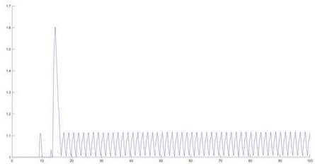

<details>
<summary>line</summary>

| X | Y |
|---|---|
| 1 | 1.0 |
| 2 | 1.0 |
| 3 | 1.0 |
| 4 | 1.0 |
| 5 | 1.0 |
| 6 | 1.0 |
| 7 | 1.0 |
| 8 | 1.0 |
| 9 | 1.0 |
| 10 | 1.0 |
| 11 | 1.0 |
| 12 | 1.0 |
| 13 | 1.0 |
| 14 | 1.0 |
| 15 | 1.0 |
| 16 | 1.0 |
| 17 | 1.0 |
| 18 | 1.0 |
| 19 | 1.0 |
| 20 | 1.0 |
| 21 | 1.0 |
| 22 | 1.0 |
| 23 | 1.0 |
| 24 | 1.0 |
| 25 | 1.0 |
| 26 | 1.0 |
| 27 | 1.0 |
| 28 | 1.0 |
| 29 | 1.0 |
| 30 | 1.0 |
| 31 | 1.0 |
| 32 | 1.0 |
| 33 | 1.0 |
| 34 | 1.0 |
| 35 | 1.0 |
| 36 | 1.0 |
| 37 | 1.0 |
| 38 | 1.0 |
| 39 | 1.0 |
| 40 | 1.0 |
| 41 | 1.0 |
| 42 | 1.0 |
| 43 | 1.0 |
| 44 | 1.0 |
| 45 | 1.0 |
| 46 | 1.0 |
| 47 | 1.0 |
| 48 | 1.0 |
| 49 | 1.0 |
| 50 | 1.0 |
| 51 | 1.0 |
| 52 | 1.0 |
| 53 | 1.0 |
| 54 | 1.0 |
| 55 | 1.0 |
| 56 | 1.0 |
| 57 | 1.0 |
| 58 | 1.0 |
| 59 | 1.0 |
| 60 | 1.0 |
| 61 | 1.0 |
| 62 | 1.0 |
| 63 | 1.0 |
| 64 | 1.0 |
| 65 | 1.0 |
| 66 | 1.0 |
| 67 | 1.0 |
| 68 | 1.0 |
| 69 | 1.0 |
| 70 | 1.0 |
| 71 | 1.0 |
| 72 | 1.0 |
| 73 | 1.0 |
| 74 | 1.0 |
| 75 | 1.0 |
| 76 | 1.0 |
| 77 | 1.0 |
| 78 | 1.0 |
| 79 | 1.0 |
| 80 | 1.0 |
| 81 | 1.0 |
| 82 | 1.0 |
| 83 | 1.0 |
| 84 | 1.0 |
| 85 | 1.0 |
| 86 | 1.0 |
| 87 | 1.0 |
| 88 | 1.0 |
| 89 | 1.0 |
| 90 | 1.0 |
| 91 | 1.0 |
| 92 | 1.0 |
| 93 | 1.0 |
| 94 | 1.0 |
| 95 | 1.0 |
| 96 | 1.0 |
| 97 | 1.0 |
| 98 | 1.0 |
| 99 | 1.0 |
|100 | ~1.0 (approx.)
</details>

图 4.27: 0 - 100s 内舞龙队所有把手最大速度随时间变化示意图

经过分析上图发现，在龙头前把手进入盘出螺线到龙头后把手进入盘出螺线的过程中，第一至八节龙身各把手的速度会明显增大，但在第九节及以后速度递减。

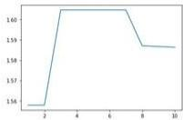

<details>
<summary>line</summary>

| X | Y |
|---|---|
| 2 | 1.56 |
| 3 | 1.60 |
| 4 | 1.60 |
| 5 | 1.60 |
| 6 | 1.60 |
| 7 | 1.59 |
| 8 | 1.58 |
| 9 | 1.58 |
| 10 | 1.58 |
</details>

图 4.28: 龙头进入盘出螺线的过程中，各节龙身前把手的最大速度

分析图4.28发现，第三至第七节龙身前把手的速度在此过程中达到最大，因此本文选定第三节龙身的前把手为目标把手，分析在龙头由第二段圆弧至盘出螺线的过程中，该把手的速度变化。

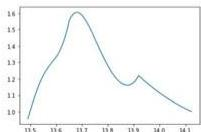

<details>
<summary>line</summary>

| X-Axis | Y-Axis |
|---|---|
| 13.5 | 1.0 |
| 13.6 | 1.3 |
| 13.7 | 1.6 |
| 13.8 | 1.2 |
| 13.9 | 1.2 |
| 14.0 | 1.1 |
| 14.1 | 1.0 |
</details>

图 4.29: 龙头进入盘出螺线的过程中，第三节龙身前把手的速度

程序求解得到，这段过程中第三节龙身前把手的最大速度为1.604793m/s。

由问题四中建立的速度迭代公式可知，在第三节龙身前把手达到最大速度的位置，其速度与龙头前把手的速度成正比。因此可通过限制第三节龙身前把手的最大速度为2m/s，来得到龙头的最大行进速度。

# 4.5.2 模型计算结果

代入数据，求解得龙头的最大行进速度为1.246266m/s。

# 五 模型的评价

# 5.1 模型的优点

- 优点1：模型没有过多的简省，较为精确地给出问题所需要的位置和速度数据，较为准确地解决了问题。  
- 优点2：模型的主体思路是构造位置迭代公式与速度迭代公式，也适用于不同运动路径的情况，可以进行推广。

# 5.2 模型的缺点

\- 缺点1：计算量大，计算复杂度较高。

# 参考文献

[1] 姜启源，《数学模型》，高等教育出版社，2007年.

# 附录

支撑材料的文件列表：

1. result1.xlsx   
2. result2.xlsx   
3. result4.xlsx   
4. function.py   
5. zeropoint.py   
6. number.py   
7. 问题一代码.py  
8. crushjudge.py   
9. 问题二代码.py  
10. 问题三代码.py  
11. dataproduce.py   
12. positioniteration.py   
13. velocityiteration.py   
14. 问题四代码.py  
15. velctorytheta.py  
16. 问题五代码.py

代码：

1. function   
```python
import numpy as np
def f1(theta):
    result=theta*np.sqrt(theta**2+1)+np.log(theta+np.sqrt(theta**2+1))
    return result
#用于计算龙头位置随时间的变化
def f2(theta,theta0,v0,t,d):
    result=f1(theta0)-f1(theta)-4*v0*t*np.pi/d
    return result
#用于计算龙头位置随时间的变化
def f3(theta,d,d0,theta_last):
    t=theta
    t_1=theta_last
```

```python
result=t*2+t_1**2-2*t+t_1*np.cos(t-t_1)-4*np.pi**2*d0**2/d**2
return result

#用于计算盘入螺线上的位置迭代
def f4(theta):
    t=theta
    result=(np.sin(t)+t*np.cos(t))/(np.cos(t)-t*np.sin(t))
    return result

#用于计算螺线上速度的斜率
def f5(theta,d, d0, theta_last):
    t=theta=np.pi
    t_1=theta_last=np.pi
    result=t*2+t_1**2-2*t+t_1*np.cos(t-t_1)-4*np.pi**2*d0**2/d**2
    return result

#用于计算盘出螺线上的位置迭代
def f6(theta,d, d0, theta0, l, gamma):
    t=theta
    to=theta0
    result=1**2+d**2*t**2/(4*np.pi**2)-d+1*t*np.cos(t-t0+gamma)/np.pi-d0**2

return result

#用于计算前把手在第一段圆弧而后把手在盘入螺线的情形
import numpy as np
def f1(theta):
    result=theta=np.sqrt(theta**2+1)+np.log(theta+np.sqrt(theta**2+1))

return result

#用于计算龙头位置随时间的变化
def f2(theta, theta0, v0, t, d):
    result=f1(theta0)-f1(theta)-4*v0*t*np.pi/d
return result

#用于计算龙头位置随时间的变化
def f3(theta,d, d0, theta_last):
    t=theta
    t_1=theta_last
    result=t*2+t_1**2-2*t+t_1*np.cos(t-t_1)-4*np.pi**2*d0**2/d**2
    return result

#用于计算盘入螺线上的位置迭代
def f4(theta):
    t=theta
    result=(np.sin(t)+t*np.cos(t))/(np.cos(t)-t*np.sin(t))
    return result

#用于计算螺线上速度的斜率
def f5(theta,d, d0, theta_last):
    t=theta+np.pi
    t_1=theta_last+np.pi
    result=t*2+t_1**2-2*t+t_1*np.cos(t-t_1)-4*np.pi**2*d0**2/d**2
    return result

#用于计算盘出螺线上的位置迭代
def f6(theta,d, d0, theta0, l, gamma):
    t=theta
    to=theta0
    result=1**2+d**2*t**2/(4*np.pi**2)-D+1*t*np.cos(t-t0+gamma)/np.pi-d0**2

return result

#用于计算前把手在第一段圆弧而后把手在盘入螺线的情形
```

2. zeropoint

```python
def zero1(f,a,b,e,theta0,v0,t,d):
    while b-a>=e:
    c=(a+b)/2  #取中点
    if f(a,theta0,v0,t,d)*f(c,theta0,v0,t,d)<0:
    b=c
    else:
    a=c
    #判断零点所在区间
    return (a+b)/2
#用于计算函数f2的零点
def zero2(f,a,b,e,d0,theta_last):
    while b-a>=e:
    c=(a+b)/2  #取中点
    if f(a,d,do,theta_last)*f(c,d,d0,theta_last)<0:
    b=c
    else:
    a=c
    #判断零点所在区间
    return (a+b)/2
#用于计算函数f3和f5的零点
def zero3(f,a,b,e,d0,theta0,l,gamma):
    while b-a>=e:
    c=(a+b)/2  #取中点
    if f(a,d,do,theta0,l,gamma)*f(c,d,d0,theta0,l,gamma)<0:
    b=c
    else:
    a=c
    #判断零点所在区间
    return (a+b)/2
#用于计算函数f6的零点
```

3. number   
```python
import numpy as np
def number(A,n):
    for i in np.arange(A.shape[0]):
    for j in np.arange(A.shape[1]):
    a=A[i,j]
    b=int(a=10**n)*10**(-n)
    #获得a的前n位小数
    if a=b>5=10**(-n-1):
    b=b=10**(-n)
    #四舍五入
    A[i,j]=b
return A
#用于保留6位小数
```

4. 问题一代码  
```python
import numpy as np
import pandas as pd
from function import f2 #用于计算龙头位置随时间的变化
from function import f3 #用于计算盘入螺线上的位置迭代
from function import f4 #用于计算螺线上速度的斜率
from zeropoint import zero1 #用于计算函数f2的零点
from zeropoint import zero2 #用于计算函数f3的零点
from number import number #用于保留6位小数
```

```python
d=0.55 #螺距
v0=1 #龙头速度
theta0=32*np.pi #龙头初始极角
lst_chair_theta=[]
for t in np.arange(301):
    if t==0:
    theta_chair0=theta0
    else:
    theta_chair0=zero1(f2,0,theta0,10**(-8),theta0,v0,t,d)
    #给出龙头的t极角theta
    lst_theta=[theta_chair0]
    for i in np.arange(223):
    if i==0:
    d0=3.41-0.275*2
    else:
    d0=2.2-0.275*2
    #确定极长
    theta_last=lst_theta[-1] #获得上一个把手的极角theta
    theta=zero2(f3,theta_last,theta_last+np.pi/2,10**(-8),d,d0,
    theta_last)
    lst_theta.append(theta)
    #计算当前把手的极角theta
    lst_chair_theta.append(lst_theta)
    lst_chair_theta=np.array(lst_chair_theta)
    lst_chair_xy=[]
for t in np.arange(301):
    lst_xy=[]
    for i in np.arange(224):
    theta=lst_chair_theta[t,i]
    lst_xy.append(d=theta=np.cos(theta)/(2*np.pi))
    lst_xy.append(d=theta=np.sin(theta)/(2*np.pi))
    #根据theta角度确定把手坐标(x,y)
    lst_chair_xy.append(lst_xy)
    lst_chair_xy=np.array(lst_chair_xy).T
    lst_chair_xy=number(lst_chair_xy,6) #保留6位小数
    df=pd.DataFrame(lst_chair_xy)
    df.to_excel("result1_1.xlsx",index=False)
    #保存数据到Excel中
    lst_chair_v=[]
for t in np.arange(0,301):
    lst_v=[v0]
    for i in np.arange(223):
    v_last=lst_v[-1] #获得上一个把手的速度
    theta_last=lst_chair_theta[t,i]
    theta=lst_chair_theta[t,i+1]
    x_last=lst_chair_xy[i+2,t]
    y_last=lst_chair_xy[i+2+1,t]
    x=lst_chair_xy[i+2+2,t]
    y=lst_chair_xy[i+2+3,t]
    #获得上一个把手和当前把手的坐标(x,y)和极角
    k_chair=(y_last-y)/(x_last-x)
    k_v_last=f4(theta_last)
    k_v=f4(theta)
    #计算极角和两个速度的斜率
    aleph1=np.arctan(np.abs((k_v_last-k_chair)/(1+k_v_last*
    k_chair)))
    aleph2=np.arctan(np.abs((k_v-k_chair)/(1+k_v-k_chair)))
    #计算两个速度与极角的夹角 
```

```txt
v=v_last*np.cos(aleph1)/np.cos(aleph2) #计算当前把手的速度
lst_v.append(v)
lst_chair_v.append(lst_v)
lst_chair_v=np.array(lst_chair_v).T
lst_chair_v=number(lst_chair_v,6) #保留6位小数
df=pd.DataFrame(lst_chair_v)
df.to_excel("resulti_2.xlsx",index=False)
#保存数据到Excel中 
```

5. crushjudge   
```python
import numpy as np
from function import f3 #用于计算盘入裸线上的位置迭代
from zeropoint import zero2 #用于计算函数f3的零点
def judge(theta,d,v0):
    d1=0.275
    d2=0.15
    lst_theta=[theta]
    for i in np.arange(223):
    if i==0:
    d0=3.41-0.275*2
    else:
    d0=2.2-0.275*2
    #确定板长
    theta_last=lst_theta[-1] #获得上一个把手的极角theta
    a=theta_last
    b=theta_last=np.pi/2
    theta_new=zero2(f3,a,b,10**(-8),d,d0,theta_last)
    lst_theta.append(theta_new)
    #计算当前把手的极角theta
    if theta_new-theta>=3*np.pi:
    break
    #当当前把手位置离龙头过远时结束
    lst_x=[]
    lst_y=[]
    for i in np.arange(len(lst_theta)):
    p=lst_theta[i]<d/(2*np.pi)
    x=p Nepal.cos(lst_theta[i])
    y=p Nepal.sin(lst_theta[i])
    lst_x.append(x)
    lst_y.append(y)
    #根据theta角度确定把手坐标(x,y)
    lst_k=[]
    for i in np.arange(len(lst_theta)-1):
    k=(lst_y[i]-lst_y[i+1])/(lst_x[i]-lst_x[i+1])
    lst_k.append(k)
    #计算极宽的斜率
    k1=lst_k[0]
    x1=lst_x[0]
    y1=lst_y[0]
    #获得龙头的坐标和斜率
    k2=(d2/d1+k1)/(1-d2*k1/d1) #计算龙头前把手和外前点直线的斜率
    b=d2*np.sqrt(k1**2+1)+y1-k1*x1
    if np.abs(b)<=np.abs(y1-k1*x1):
    b=-d2 np.sqrt(k1**2+1)+y1-k1*x1
    #计算龙头外侧边的截距
    x=(y1-k2*x1-b)/(k1-k2)
    y=(k1*y1-k1*k2+x1-k2*b)/(k1-k2) 
```

```python
# 计算龙头外前点的坐标
flag=0
for i in np.arange(len(lst_k)):
    if lst_theta[i+1]-theta>=np.pi:
    ki=lst_k[i]
    xi=lst_x[i]
    yi=lst_y[i]
    d_chair=np.abs(ki*(x-xi)+yi-y)/np.sqrt(ki**2+1)
    # 计算龙头外前点到当前板凳中心线的距离
    if d_chair<d2:
    flag=1
    # 判断是否相撞
    x2=lst_x[1]
    y2=lst_y[1]
    # 获得第一节龙头前把手的坐标
    k2=(k1-d2/d1)/(1+d2+k1/d1)  # 计算第一节龙头前把手和龙头外后点直线的斜率
    x=(y2-k2+x2-b)/(k1-k2)
    y=(k1+y2-k1+k2+x2-b+k2)/(k1-k2)
    # 计算龙头外后点的坐标
    for i in np.arange(len(lst_k)):
    if lst_theta[i+1]-theta>=np.pi:
    ki=lst_k[i]
    xi=lst_x[i]
    yi=lst_y[i]
    d_chair=np.abs(ki*(x-xi)+yi-y)/np.sqrt(ki**2+1)
    # 计算龙头外后点到当前板凳中心线的距离
    if d_chair<d2:
    flag=1
    # 判断是否相撞
    k1=lst_k[1]
    x1=lst_x[1]
    y1=lst_y[1]
    # 获得第二节龙头前把手坐标和斜率
    k2=(d2/d1+k1)/(1-d2+k1/d1)  # 计算第一节龙头前把手和外前点直线的斜率
    b=d2+np.sqrt(k1**2+1)+yi-k1+x1
    if np.abs(b)<=np.abs(y1-k1+x1):
    b=-d2+np.sqrt(k1**2+1)+yi-k1+x1
    # 计算第一节龙头外侧边的截距
    x=(y1-k2+x1-b)/(k1-k2)
    y=(k1+y1-k1+k2+x1-k2+b)/(k1-k2)
    # 计算第一节龙头外前点的坐标
    for i in np.arange(len(lst_k)):
    if lst_theta[i+1]-theta>=np.pi:
    ki=lst_k[i]
    xi=lst_x[i]
    yi=lst_y[i]
    d_chair=np.abs(ki*(x-xi)+yi-y)/np.sqrt(ki**2+1)
    # 计算第一节龙头前点到当前板凳中心线的距离
    if d_chair<d2:
    flag=1
    # 判断是否相撞
    x2=lst_x[2]
    y2=lst_y[2]
    # 获得第二节龙头前把手的坐标
    k2=(k1-d2/d1)/(1+d2+k1/d1)  # 计算第二节龙头前把手和第一节龙头外后点直线的斜率
    x=(y2-k2+x2-b)/(k1-k2)
    y=(k1+y2-k1-k2+x2-b+k2)/(k1-k2)
```

```python
#计算第一节龙身外后点的坐标
for i in np.arange(len(lst_k)):
    if lst_theta[i+1]-theta>=np.pi;
    ki=lst_k[i]
    xi=lst_x[i]
    yi=lst_y[i]
    d_chair=np.abs(ki=(x-xi)+yi-y)/np.sqrt(ki**2+1)
    #计算第一节龙身外后点到当前极费中心线的距离
    if d_chair<d2:
    flag=1
    #判断是否相撞
return flag
#用于判断是否发生规模
```

6. 问题二代码  
```python
import numpy as np
import pandas as pd
from function import f1 #用于计算龙头位置随时间的变化
from function import f3 #用于计算盘入螺线上的位置迭代
from function import f4 #用于计算螺线上速度的斜率
from zero point import zero2 #用于计算函数f3的零点
from number import number #用于保留6位小数
from crashjudge import judge #用于判断是否发生碰撞
d=0.55 #螺距
v0=1 #龙头速度
theta0=32*np.pi #龙头初始极角
for theta in np.arange(60,0,-0.01):
    flag = judge(theta, d, v0)
    if flag:
    break
    #判断龙头处于当前位置时是否有极亮碰撞
for theta in np.arange(theta+0.01, theta-0.01,-0.0001):
    flag = judge(theta, d, v0)
    if flag:
    break
    for theta in np.arange(theta+0.0001, theta-0.0001,-0.000001):
    flag = judge(theta, d, v0)
    if flag:
    break
    #细化碰撞时龙头的极角theta
theta_chairo=theta+0.000001
t=d*(f1(theta0)-f1(theta))/(4=np.pi*v0) #计算碰撞的时刻
lst_chair_theta=[theta_chair0]
for i in np.arange(223):
    if i==0:
    d0=3.41-0.275*2
    else:
    d0=2.2-0.275*2
    #确定成长
theta_last=lst_chair_theta[-1] #获得上一个把手的极角theta
theta=zero2(f3, theta_last, theta_last+pn.pi/2, 10**(-8), d, d0, theta_last)
lst_chair_theta.append(theta)
#计算当前把手的极角theta
lst_chair_xyv=[]
for i in np.arange(224):
    lst_xyv=[] 
```

```python
theta=1st_chair_theta[i]
lst_xyv.append(d*theta*np.cos(theta)/(2*np.pi))
lst_xyv.append(d*theta*np.sin(theta)/(2*np.pi))
#根据theta角度确定把手坐标(x, y)
lst_xyv.append(v0)
lst_chair_xyv.append(lst_xyv)
lst_chair_xyv=np.array(lst_chair_xyv)
for i in np.arange(223):
    v_last=1st_chair_xyv[i, 2] #获得上一个把手的速度
    theta_last=1st_chair_theta[i]
    theta=1st_chair_theta[i+1]
    x_last=1st_chair_xyv[i, 0]
    y_last=1st_chair_xyv[i, 1]
    x=1st_chair_xyv[i+1, 0]
    y=1st_chair_xyv[i+1, 1]
    #获得上一个把手和当前把手的坐标(x, y)和极角
    k_chair=(y_last-y)/(x_last-x)
    k_v_last=f4(theta_last)
    k_v=f4(theta)
    #计算软晃和两个速度的斜率
    aleph1=np.arctan(np.abs((k_v_last-k_chair)/(1+k_v_last+k_chair))) 
    aleph2=np.arctan(np.abs((k_v-k_chair)/(1+k_v*k_chair)))
    #计算两个速度与软晃的夹角
    v=v_last=np.cos(aleph1)/np.cos(aleph2) #计算当前把手的速度
    lst_chair_xyv[i+1, 2]=v
lst_chair_xyv=number(lst_chair_xyv, 6) #保留6位小数
df=pd.DataFrame(lst_chair_xyv)
df.to_excel("result2_.xlx", index=False)
#保存数据到Excel中
```

7. 问题三代码  
```python
import numpy as np
from crashjudge import judge #用于判断是否发生碰撞
v0=1  #龙头速度
D=9  #调头空间的直径
for d in np.arange(0.55,0.4,-0.01):
    theta_min=D*np.pi/d  #确定进入调头空间时的极值theta
    for theta in np.arange(theta_min+6,theta_min,-0.1):
    flag=judge(theta,d,v0)
    if flag:
    break
    if flag:
    break
    #判断当前螺距是否在调头空间外有板凳碰撞
for d in np.arange(d=0.01,d-0.01,-0.0001):
    theta_min=D*np.pi/d
    for theta in np.arange(theta_min+6,theta_min,-0.1):
    flag=Judge(theta,d,v0)
    if flag:
    break
    if flag:
    break
for d in np.arange(d=0.0001,d-0.0001,-0.00001):
    theta_min=D*np.pi/d
    for theta in np.arange(theta_min+6,theta_min,-0.1):
    flag=Judge(theta,d,v0) 
```

```python
if flag:
    break
if flag:
    break
for d in np.arange(d+0.00001, d-0.00001, -0.000001):
    theta_min = D * np.pi/d
    for theta in np.arange(theta_min + 6, theta_min, -0.1):
    flag = judge(theta, d, v0)
    if flag:
    break
    if flag:
    break
for d in np.arange(d+0.000001, d-0.000001, -0.0000001):
    theta_min = D * np.pi/d
    for theta in np.arange(theta_min + 6, theta_min, -0.1):
    flag = judge(theta, d, v0)
    if flag:
    break
    if flag:
    break
#细化最小的螺距
print(d) #输出在调头空间外不会发生碰撞的最小的螺距 
```

8. dataproduce   
```python
import numpy as np
from function import f4 #用于计算螺线上速度的斜率
from function import f5 #用于计算盘出螺线上的位置迭代
from zeropoint import zero2 #用于计算函数f5的零点
d=1.7 #螺距
v0=1 #龙头速度
D=9 #调头空间的直径
do_1=3.41-0.275*2 #龙头板长
do_2=2.2-0.275*2 #龙头和龙头尾板长
thetaa0=D*np.pi/d #计算龙头0时刻时的极角
x0=D*np.cos(theta0)/2
y0=D*np.sin(theta0)/2
#计算龙头0时刻的坐标 (x, y)
k=f(theta0)
l1=2=np.abs(y0-k*x0)/np.sqrt(k**2+1)
l2=np.sqrt(D**2-11**2)
r=D**2/(6+11) #计算第二段圆弧的半径
x1=x0+2*r/np.sqrt(1+1/k**2)
y1=-(x1-x0)/k+y0
#计算第一段圆弧的圆心坐标
x2=-(x-r/np.sqrt(1+1/k**2))
y2=-(x2+x0)/k-y0
#计算第二段圆弧的圆心坐标
aleph=np.arccos(12/(r*3))+np.pi/2 #计算两段圆弧的圆心角
theta_cairo1=np.arccos((8+r**2-d0_1**2)/(8+r**2))
#计算第一节龙舟前把手到达第一段圆弧时龙头的位置参数theta
theta_cairo1 Nap.arccos((2+r**2-d0_1**2)/(2+r**2))
#计算第一节龙舟前把手到达第二段圆弧时龙头的位置参数theta
a=theta-Np.pi
b=theta-Np.pi/2
theta_cairo3=zero2(f5,a,b,10**(-8),d,do_1,thetaO-np.pi)
#计算第一节龙舟前把手到达盘出螺线时龙头的位置参数theta
theta_cair1 NP.arccos((8+r**2-d0_2**2)/(8+r**2))
```

```txt
#计算龙头把手把手到达第一段圆弧时前把手的位置参数theta
theta_chair_2=np.arccos((2*r**2-d0_2**2)/(2+r**2))
#计算龙头把手把手到达第二段圆弧时前把手的位置参数theta
theta_chair_3=zero2(f5,a,b,10**(-8),d,d0_2,theta0-np.pi)
#计算龙头把手把手到达盘出螺线时前把手的位置参数theta
t1=2*r+aleph/v0 #计算龙头到达第二段圆弧的时刻
t2=t1+r+aleph/v0 #计算龙头到达盘出螺线的时刻
theta1=np.arctan((y1-y0)/(x1-x0))+np.pi #计算第一段圆弧的进入点相对于圆心的极角
theta2=np.arctan((y2+y0)/(x2+x0)) #计算第二段圆弧的离开点相对于圆心的极角
x_=-x0/3
y_=-y0/3
#计算两段圆弧交界点的坐标
print(theta0,x0,y0,r,x1,y1,x2,y2,aleph,theta_chair0_1,
theta_chair0_2,
theta_chair0_3,theta_chair_1,theta_chair_2,theta_chair_3,t1,
t2,theta1,
theta2,x_y_)
#输出各项重要参数
```

9. positioniteration   
```python
import numpy as np

from function import f3 #用于计算盘入螺线上的位置迭代
from function import f5 #用于计算盘出螺线上的位置迭代
from function import f6 #用于计算前把手在第一段圆弧而后把手在盘入螺线的情形
from zeropoint import zero2 #用于计算函数f3和f5的零点
from zeropoint import zero3 #用于计算函数f6的零点

def iteration1(theta_last, flag_last, flag_chair):
    d=1.7  #螺距
    D=9  #调头空间的直径
    theta0=16.6319611  #龙头0时刻时的极角
    r=1.5027088  #第二段圆弧的半径
    aleph=3.0214868  #两段圆弧的圆心角
    if flag_chair==0:
    do=3.41-0.275*2
    theta_1=0.9917636
    theta_2=2.5168977
    theta_3=14.1235657
    else:
    do=2.2-0.275*2
    theta_1=0.5561483
    theta_2=1.1623551
    theta_3=13.8544471
    #确定板长和三个重要位置参数
    if flag_last==1:
    theta=zero2(f3,theta_last,theta_last+np.pi/2,10**(-8),d,d0,
    theta_last)
    #计算后把手的位置参数theta
    flag=1  #返回后把手所在曲线的类型
    #计算前把手和后把手都在盘入螺线的情形
    elif flag_last==2:
    if theta_last<theta_1:
    b=np.sqrt(2-2*np.cos(theta_last))*r*2
    beta=(aleph-theta_last)/2
    l=np.sqrt(b**2*D**2/4-b*D*np.cos(beta))
    gamma=np.arcsin(b*np.sin(beta)/l)
    theta=zero3(f6,theta0,thetaA+np.pi/2,10**(-8),d,d0,
```

```txt
theta0,1.gamma)
#计算后把手的位置参数theta
flag=1 #返回后把手所在曲线的类型
#计算前把手在第一段圆弧雨后把手在盘入螺线的情形
else:
theta=theta_last-theta_1
#计算后把手的位置参数theta
flag=2 #返回后把手所在曲线的类型
#计算前把手和后把手都在第一段圆弧的情形
elif flag_last==3:
    if theta_last<theta_2:
    a=np.sqrt(10-6*np.cos(theta_last))*r
    phi=np.arccos((4*r**2*a**2-d0**2)/(4*a+r))
    beta=np.arcsin(r=np.sin(theta_last)/a)
    theta=aleph-pi+beta
    #计算后把手的位置参数theta
    flag=2 #返回后把手所在曲线的类型
    #计算前把手在第二段圆弧雨后把手在第一段圆弧的情形
else:
    theta=theta_last-theta_2
    #计算后把手的位置参数theta
    flag=3 #返回后把手所在曲线的类型
    #计算前把手和后把手都在第二段圆弧的情形
else:
    if theta_last<theta_3:
    p=d*(theta_last+np.pi)/(2*np.pi)
    a=np.sqrt(p**2*D**2/4-p*D*np.cos(theta_last-theta0+np.pi))
    beta=np.arcsin(p*np.sin(theta_last-theta0+np.pi)/a)
    gamma=beta-(np.pi-aleph)/2
    b=np.sqrt(a**2+r**2-2+a*r np.cos(gamma))
    sigma=np.arcsin(a*np.sin(gamma)/b)
    phi=np.arccos((r**2+b**2-d0**2)/(2+r*b))
    theta=aleph-pi+sigma
    #计算后把手的位置参数theta
    flag=3 #返回后把手所在曲线的类型
    #计算前把手在盘出螺线雨后把手在第二段圆弧的情形
else:
    a=theta_last-np.pi/2
    b=theta_last
    theta=zero2(f5,a,b,10**(-8),d,d0,theta_last)
    #计算后把手的位置参数theta
    flag=4 #返回后把手所在曲线的类型
    #计算前把手和后把手都在盘出螺线的情形
return [theta,flag]
#用于计算位置迭代
```

10. velocityiteration   
```python
import numpy as np
from function import f4 #用于计算螺线上速度的斜率
def iteration2(v_last, flag_last, flag, theta_last, theta, x_last, y_last, x, y);
x1=-0.7600091
y1=-1.3057264
#计算第一段圆弧的圆心坐标
x2=1.7359325
y2=2.4484020
```

```python
#计算第二段圆弧的圆心坐标
k_chair=(y_last-y)/(x_last-x) #计算板凳的斜率
v=-1
if flag_last==1 and flag==1:
    k_v_last=f4(theta_last)
    k_v=f4(theta)
    #计算前把手和后把手都在盘入螺线时两个速度的斜率
elif flag_last==2 and flag==1:
    k_v_last=-(x_last-x1)/(y_last-y1)
    k_v=f4(theta)
    #计算前把手在第一段圆弧而后把手在盘入螺线时两个速度的斜率
elif flag_last==2 and flag==2:
    v=v_last
    #计算前把手和后把手都在第一段圆弧的情形
elif flag_last==3 and flag==2:
    k_v_last=-(x_last-x2)/(y_last-y2)
    k_v=-(x-x1)/(y-y1)
    #计算前把手在第二段圆弧而后把手在第一段圆弧时两个速度的斜率
elif flag_last==3 and flag==3:
    v=v_last
    #计算前把手和后把手都在第二段圆弧的情形
elif flag_last==4 and flag==3:
    theta_last=theta_last+np.pi
    k_v_last=f4(theta_last)
    k_v=k_v=-(x-x2)/(y-y2)
    #计算前把手在盘出螺线而后把手在第二段圆弧时两个速度的斜率
else:
    theta_last=theta_last+np.pi
    theta=theta+np.pi
    k_v_last=f4(theta_last)
    k_v=f4(theta)
    #计算前把手和后把手都在盘出螺线时两个速度的斜率
if v==1:
    aleph1=np.arctan(np.abs((k_v_last-k_chair)/(1+k_v_last*k_chair)))
    aleph2=np.arctan(np.abs((k_v-k_chair)/(1+k_v*k_chair)))
    #计算两个速度与板凳的夹角
    v=v_last=np.cos(aleph1)/np.cos(aleph2) #计算当前把手的速度
return v
#用于计算速度迭代
import numpy as np
from function import f4 #用于计算螺线上速度的斜率
def iteration2(v_last,flag_last,flag,theta_last,theta,x_last,y_last, x,y):
    x1=-0.7600091
    y1=-1.3057264
    #计算第一段圆弧的圆心坐标
    x2=1.7359325
    y2=2.4484020
    #计算第二段圆弧的圆心坐标
    k_chair=(y_last-y)/(x_last-x) #计算板凳的斜率
    v=-1
    if flag_last==1 and flag==1:
    k_v_last=f4(theta_last)
    k_v=f4(theta)
    #计算前把手和后把手都在盘入螺线时两个速度的斜率
elif flag_last==2 and flag==1:
    k_v_last=-(x_last-x1)/(y_last-y1)
```

```python
k_v=4(theta)
#计算前把手在第一段圆弧而后把手在盘入螺线时两个速度的斜率
elif flag_last==2 and flag==2:
    v=v_last
    #计算前把手和后把手都在第一段圆弧的情形
elif flag_last==3 and flag==2:
    k_v_last=-(x_last-x2)/(y_last-y2)
    k_v=-(x-x1)/(y-y1)
    #计算前把手在第二段圆弧而后把手在第一段圆弧时两个速度的斜率
elif flag_last==3 and flag==3:
    v=v_last
    #计算前把手和后把手都在第二段圆弧的情形
elif flag_last==4 and flag==3:
    theta_last=theta_last=np.pi
    k_v_last=f4(theta_last)
    k_v=k_v=-(x-x2)/(y-y2)
    #计算前把手在盘出螺线而后把手在第二段圆弧时两个速度的斜率
else:
    theta_last=theta_last=np.pi
    theta=theta=np.pi
    k_v_last=f4(theta_last)
    k_v=f4(theta)
    #计算前把手和后把手都在盘出螺线时两个速度的斜率
if v==1:
    aleph1=np.arctan(np.abs((k_v_last-k_chair)/(1+k_v_last*k_chair)))
    aleph2=np.arctan(np.abs((k_v-k_chair)/(1+k_v*k_chair)))
    #计算两个速度与板凳的夹角
    v=v_last=np.cos(aleph1)/np.cos(aleph2) #计算当前把手的速度
return v
#用于计算速度迭代
```

11. 第四问代码  
```python
import numpy as np
import pandas as pd
from function import f2 #用于计算龙头位置随时间的变化
from zeropoint import zero1 #用于计算函数f2的零点
from number import number #用于保留6位小数
from positioniteration import iteration1 #用于计算位置迭代
from velocityiteration import iteration2 #用于计算速度迭代
d=1.7 #螺距
v0=1 #龙头速度
theta0=16.6319611 #龙头0时刻时的极角
r=1.5027088 #第二段圆弧的半径
aleph=3.0214868 #两段圆弧的圆心角
t1=9.0808299 #龙头到达第二段圆弧的时刻
t2=13.6212449 #龙头到达盘出螺线的时刻
x1=-0.7600091
y1=-1.3057264
#第一段圆弧的圆心坐标
x2=1.7359325
y2=2.4484020
#第二段圆弧的圆心坐标
theta1=4.0055376 #第一段圆弧的进入点相对于圆心的极角
theta2=0.8639494 #第二段圆弧的离开点相对于圆心的极角
1st_chair_theta=[]
1st_chair_flag=[]
```

```python
for t in np.arange(-100,101):
    if t<0:
    theta_chair0=zero1(f2,theta0,100,10**(-8),theta0,v0,t,d)
    flag_chair0=1
    elif t==0:
    theta_chair0=theta0
    flag_chair0=1
    elif t<t1:
    theta_chair0=v0*t/(2*r)
    flag_chair0=2
    elif t<t2:
    theta_chair0=v0*(t-t1)/r
    flag_chair0=3
    else:
    theta_chair0=zero1(f2,theta0,100,10**(-8),theta0,v0,-t+t2,d)
    flag_chair0=4
    #给出龙头的位置参数theta和所在曲线的类型参数flag
    lst_theta=[theta_chair0]
    lst_flag=[flag_chair0]
    for i in np.arange(223):
    theta_last=lst_theta[-1]  #获得上一个把手的位置参数theta
    flag_last=lst_flag[-1]  #获得上一个把手所在曲线的类型参数flag
    [theta_flag]=iteration1(theta_last,flag_last,i)
    lst_theta.append(theta)
    lst_flag.append(flag)
    lst_chair_theta.append(lst_theta)
    lst_chair_flag.append(lst_flag)
    #计算当前把手的位置参数theta和所在曲线的类型参数flag
    lst_chair_flag=np.array(lst_chair_flag)
    lst_chair_theta=np.array(lst_chair_theta)
    lst_chair_xy=[]
    for i in np.arange(201):
    lst=[]
    for j in np.arange(224):
    flag=lst_chair_flag[i,j]  #获得当前把手的位置参数theta
    theta=lst_chair_theta[i,j]  #获得当前把手所在曲线的类型参数flag
    if flag==1:
    p=d+theta/(2*np.pi)
    x=p*np.cos(theta)
    y=p*np.sin(theta)
    elif flag==2:
    x=x1+2+r*np.cos(theta1-theta)
    y=y1+2+r*np.sin(theta1-theta)
    elif flag==3:
    x=x2+r*np.cos(theta2+theta-aleph)
    y=y2+r*np.sin(theta2+theta-aleph)
    else:
    p=d+(theta+np.pi)/(2*np.pi)
    x=p*np.cos(theta)
    y=p*np.sin(theta)
    #计算当前把手的坐标(x,y)
    lst.append(x)
    lst.append(y)
    lst_chair_xy.append(lst)
    lst_chair_xy=np.array(lst_chair_xy).T
    lst_chair_xy=number(lst_chair_xy,6)  #保留6位小数
df=pd.DataFrame(lst_chair_xy) 
```

```python
df.to_excel("result4_1.xlsx", index=False)
#保存数据到Excel中
lst_chair_v = []
for i in np.arange(201):
    lst_v = [v0]
    for j in np.arange(223):
    flag_last = lst_chair_flag[i, j]
    theta_last = lst_chair_theta[i, j]
    flag = lst_chair_flag[i, j + 1]
    theta = lst_chair_theta[i, j + 1]
    x_last = lst_chair_xy[j + 2, i]
    y_last = lst_chair_xy[j + 2 + 1, i]
    x = lst_chair_xy[j + 2 + 2, i]
    y = lst_chair_xy[j + 2 + 3, i]
    #获得上一个把手和当前把手的坐标，角度参数theta和所在曲线的位置参数flag
    v_last = lst_v [- 1] #获得上一个把手的速度
    v = iteration2(v_last, flag_last, flag, theta_last, theta, x_last, y_last, x, y)
    lst_v.append(v)
    #计算当前把手的速度
    lst_chair_v.append(lst_v)
    lst_chair_v = np.array(lst_chair_v).T
    lst_chair_v = number(lst_chair_v, 6) #保留6位小数
df = pd.DataFrame(lst_chair_v)
df.to_excel("result4_2.xlsx", index=False)
#保存数据到Excel中 
```

12. velctorytheta  
```python
import numpy as np
from positioniteration import iteration1 #用于计算位置迭代
from velocityiteration import iteration2 #用于计算速度迭代
def f(flag,theta):
    d=1.7 #螺距
    r=1.5027088 #第二段圆弧的半径
    aleph=3.0214868 #两段圆弧的圆心角
    x1=-0.7600091
    y1=-1.3057264
    #第一段圆弧的圆心坐标
    x2=1.7359325
    y2=2.4484020
    #第二段圆弧的圆心坐标
    theta1=4.0055376 #计算第一段圆弧的进入点相对于圆心的极角
    theta2=0.8639449 #计算第二段圆弧的离开点相对于圆心的极角
    if flag==1:
    p=d+theta/(2=np.pi)
    x=p=np.cos(theta)
    y=p=np.sin(theta)
    #计算位于盘入螺线时的坐标
elif flag==2:
    x=x1+2=r=np.cos(theta1-theta)
    y=y1+2=r=np.sin(theta1-theta)
    #计算位于第一段圆弧时的坐标
elif flag==3:
    x=x2+r=np.cos(theta2+theta-aleph)
    y=y2+r=np.sin(theta2+theta-aleph)
    #计算位于第二段圆弧时的坐标
else:
```

```python
p=d*(theta+np.pi)/(2*np.pi)
x=p*np.cos(theta)
y=p*np.sin(theta)
#计算位于盘出螺线时的坐标
return [x,y]
#用于根据位置参数theta和所在曲线类型计算坐标
def v_theta(theta_last, flag_last, flag_chair, v_last):
    [theta, flag]=iteration1(theta_last, flag_last, flag_chair)
    #计算位置参数theta和所在曲线类型
    [x_last, y_last]=f(flag_last, theta_last)
    [x,y]=f(flag_last)
    #计算前把手和后把手坐标
    v=iteration2(v_last, flag_last, flag, theta_last, theta, x_last, y_last, x,y)
    #计算速度
    return [theta,v,flag]
#用于计算速度和位置
```

13. 问题五代码  
```python
import numpy as np
from velctorytheta import v_theta #用于计算速度和位置
v0=1 #龙头速度
v_max=2 #最大速度
theta0=16.6319611 #龙头0时刻时的极角
theta_chairo0=3=14.1235657 #第一节龙头前把手到达盘出螺旋时龙头的位置参数theta
lst_theta0=np.arange(theta0=np.pi,theta_chair0_3,0.001)
lst_v=[]
lst_flag=[]
lst_theta=[]
for theta0 in lst_theta0:
    [theta,v,flag]=v_theta(theta0,4,0,v0)
    lst_theta.append(theta)
    lst_v.append(v)
    lst_flag.append(flag)
for j in np.arange(2):
    for i in np.arange(len(lst_theta0)):
    theta_last=lst_theta[i]
    v_last=lst_v[i]
    flag_last=lst_flag[i]
    [theta,v,flag]=v_theta(theta_last,flag_last,1,v_last)
    lst_theta[i]=theta
    lst_v[i]=v
    lst_flag[i]=flag
#获得该过程中第三节龙头前把手的速度随龙头位置参数theta的变化
theta0=lst_theta0[lst_v.index(max(lst_v))] #获得速度最大时龙头的位置参数theta
lst_theta0=np.arange(theta0-0.001,theta0+0.001,0.000001)
lst_v=[]
lst_flag=[]
lst_theta=[]
for theta0 in lst_theta0:
    [theta,v,flag]=v_theta(theta0,4,0,v0)
    lst_theta.append(theta)
    lst_v.append(v)
    lst_flag.append(flag)
for j in np.arange(2):
    for i in np.arange(len(lst_theta0)): 
```

```ini
theta_last=1st_theta[i]
v_last=1st_v[i]
flag_last=1st_flag[i]
[theta_v, flag]=v_theta(theta_last, flag_last, 1, v_last)
1st_theta[i]=theta
1st_v[i]=v
1st_flag[i]=flag

#细分速度最大时龙头的位置
v0_max=v_max*v0/max(lst_v) #计算龙头的最大速度
print(max(lst_v))
print(v0_max) #输出龙头的最大速度
```

# 2026年全国大学生国家安全知识答题


Illustration of two cartoon children holding a shield with the number 4:15 (no text or symbols on subjects)