# 摘要

“板凳龙”，亦称作“盘龙”，在浙江与福建地区广为流传，作为一种传统的民俗文化活动而备受推崇。本论文旨在深入探讨并优化“板凳龙”表演的行进路径与速度控制，以提升其表演的艺术性和观赏性。

针对问题一，我们针对“板凳龙”的运动构建了一个数学模型，通过螺线轨迹描述“板凳龙”的行进过程。首先，我们基于螺线的极坐标方程，确定各把手的运动轨迹。接着利用微元法得到龙头运动的微分方程，然后基于板凳把手均位于螺线上、板凳不可伸长等假设得到各把手位置及速度的递推关系。最终，将问题一的参数代入计算，利用数值方法求解0s\~300s每秒的各节龙身位置与速度，并将0s、60s、120s、180s、240s、300s时，龙头前把手、龙头后面第1、51、101、151、201节龙身前把手和龙尾后把手的运动数据记录在表（2）与表（3）中。

针对问题二，我们首先将“板凳龙”的螺线轨迹简化为两个同心圆，利用几何关系得到碰撞的大致时刻。接着建立碰撞判断模型，并利用叉乘法判断点是否位于三角形内部，从而判断两板凳是否相撞。在模型求解时，我们首先根据同心圆近似碰撞模型计算出碰撞时间大约为410 s，然后在[400, 420]秒的时间区间内进行变步长搜索，最终确定碰撞时间为412.4739s。我们将该时刻龙身的位置和速度数据保存在文件中，并将龙头、第1、51、101、151、201节龙身以及龙尾的运动数据记录在表（4）与表（5）中。

针对问题三，为简化计算，我们仅考虑龙头与第一节龙身的碰撞情况，并只计算进入调头空间前一段时间是否会发生碰撞。接着，采用二分法求解最小螺距，通过不断缩小搜索区间并判断碰撞情况，最终得到满足精度要求的最小螺距0.4000m。

针对问题四，首先根据调头空间，我们将运动过程划分为四个阶段：盘入，调头第一段圆弧，调头第二段圆弧，盘出。针对每个阶段，分别建立了“板凳龙”的运动方程。由于运动轨迹关于极角为多值函数，在求解位置时，对极角的约束十分复杂，因此我们使用单值函数用于龙身位置和速度的求解。此外，我们证明了调头曲线长度不变性。最后，我们求解了特殊节点的位置和速度，并分析了龙身各节点的运动规律，并将-100s、-50s、0s、50s、100s时，龙头前把手、龙头后面第1、51、101、151、201节龙身前把手和龙尾后把手的运动数据记录在表（6）与表（7）中。

针对问题五，我们首先探究了“板凳龙”运动中把手最大速度的分布规律，分析曲率半径、速度与板凳方向夹角之间的关系，猜想最大速度出现位置不随龙头行进速度变化，出现在第二段小圆弧末端附近。为了验证这一规律，我们针对不同的龙头行进速度进行了数值计算，并选取了200个时间点进行分析。结果表明，最大速度的变化呈现周期性，且最大速度峰值均出现在第100至125个时间点之间的特定位置范围内。最终我们采用了二分法对该时间段进行搜索，通过不断迭代逼近，得到了龙头的最大行进速度为 $1.2462\mathrm{m / s}$ ，误差控制在 $0.0001\mathrm{m / s}$ 之内。

关键词：等距螺线；仿真模拟；微元法；二分法

# 一、问题重述

# 1.1 问题背景

“板凳龙”是浙闽地区元宵节期间的传统民俗活动之一，表演形式类似舞龙，但使用板凳串联模拟龙形。整个表演过程中，“板凳龙”的行进需要呈现出蜿蜒曲折的形状，具有强烈的观赏性。表演的核心在于控制队伍的行进路线，使得整个龙队的盘入盘出流畅自然，避免出现队伍拥堵或碰撞的情况。此外，合理的速度控制和路径规划也是保证表演顺利进行的关键。

# 1.2 问题提出

“板凳龙”由223节板凳组成，包括1节龙头、221节龙身、1节龙尾。其中，龙头板长为341cm，龙身和龙尾板长均为220cm，所有板凳的板宽为30cm；每节板凳上有两个孔，孔径为5.5cm，孔的中心均距离板头27.5cm；板凳通过把手连接，每节板凳上的前把手和后把手位于板凳的两端，连接处通过孔固定。

针对问题一，模拟“板凳龙”沿螺距为 $55\mathrm{cm}$ 的等距螺线顺时针盘入的过程，给出从初始时刻到300秒为止，每秒“板凳龙”各把手的位置和速度，并将结果保存到文件result1.xlsx中。同时，提供0s、60s、120s、180s、240s、300s时，龙头前把手、龙头后面第1、51、101、151、201节龙身前把手和龙尾后把手的位置和速度数据。

针对问题二，在确保“板凳龙”不发生碰撞的情况下，计算能够盘入的最晚时刻并计算此时刻龙头及龙身各关键节点（同问题一）的前把手、龙尾后把手的位置和速度。

针对问题三，在“板凳龙”表演中，盘入后需要进行调头，调头空间为以螺线中心为圆心、直径为9米的圆形区域。确定最小螺距，使得龙头前把手能够沿着相应的螺线盘入到调头空间的边界。

针对问题四，“板凳龙”沿螺距为 $1.7\mathrm{m}$ 的螺线盘入和盘出，调头空间为直径 $9\mathrm{m}$ 的圆形区域，调头路径为由两段圆弧相切连接而成的S形曲线。确定是否可以调整圆弧，仍保持各部分相切，使得调头曲线变短。给出从-100s开始到100s为止，每秒“板凳龙”各把手的位置和速度，将结果存放到文件result4.xlsx中，同时提供-100s、-50s、0s、50s、100s时，龙头及龙身各关键节点（同问题一）的前把手、龙尾后把手的位置和速度。

针对问题五，“板凳龙”沿问题四设计的路径行进，要求计算龙头的最大行进速度，使得“板凳龙”各把手的速度均不超过2m/s。

# 二、问题分析

# 2.1 问题一的分析

针对问题一，我们假设龙头把手沿等距螺线运动，通过螺距确定螺线的极坐标方程，并建立极角与时间的微分方程描述运动；随后，我们利用相邻把手之间的距离关系，建立各把手位置的递推方程组。最后沿板凳方向分解速度，建立各把手速度的递推关系。通过数值求解，得到把手位置和速度的时间变化规律。

# 2.2 问题二的分析

针对问题二，为了预测“板凳龙”运动中碰撞的发生时间，并记录碰撞时刻的龙身位置和速度数据，我们首先建立了同心圆碰撞近似模型。该模型将板凳龙的螺线轨迹近似为两个同心圆，当内圈板凳最远点极径大于等于外圈板凳最内点极径时，认为

发生碰撞。

利用几何关系，估计碰撞时刻，并在其附近进行精细搜索。随后，我们对板凳龙的行进过程进行仿真模拟，利用叉乘法建立板凳龙的碰撞判断模型。最终，对估计区间进行变步长搜索，得到精确的碰撞时间。

# 2.3 问题三的分析

针对问题三，由于龙身位置出现的对称性，为简化问题，只考虑龙头与第一节板凳的碰撞情况。最后我们采用二分法求解满足最大速度条件的最小螺距，通过迭代调整螺距区间，最终得到最小螺距，确保龙头能够安全进入调头空间。

# 2.4 问题四的分析

针对问题四，首先我们分析了“板凳龙”调头轨迹，将其划分为四个阶段：盘入，调头第一段圆弧，调头第二段圆弧，盘出，然后讨论调头曲线的长度。针对每个阶段，我们分别建立了相应的运动方程，并基于问题一中位置和速度的递推模型，通过引入单值函数求解“板凳龙”龙头和龙身的准确位置和速度。

# 2.5 问题五的分析

针对问题五，在探究“板凳龙”最大速度分布规律时，龙头前把手离开第二段圆弧时最大速度出现明显峰值，之后呈现周期性变化。通过分析曲率半径和速度与板凳方向夹角的关系，我们得出结论：最大速度出现位置不随龙头行进速度变化，出现在第二段小圆弧末端附近。因此，我们确定最大速度出现在龙头前把手离开第二段圆弧附近的一段时间区间内，并采用二分法求解龙头行进的最大速度。

# 三、模型假设

1. 假设板凳不可伸长，即沿板凳方向各点速度相同。  
2. 假设各把手中心始终位于螺线上，忽略其他因素影响。  
3. 假设“板凳龙”在行进过程中不会倒退。  
4. 假设板凳始终平行于地面，不会发生倾斜，简化为二维运动模型。

# 四、符号说明

表1 符号说明

<table><tr><td>符号</td><td>符号说明</td><td>单位</td></tr><tr><td> $\left( {{r}_{i},{\theta }_{i}}\right)$ </td><td>第  $i$  节龙身前把手中心在极坐标系中的坐标</td><td>(m,rad)</td></tr><tr><td> $\left( {{x}_{i},{y}_{i}}\right)$ </td><td>第  $i$  节龙身前把手中心在平面直角坐标系中的坐标</td><td>(m,m)</td></tr><tr><td> $d$ </td><td>等距螺线的间距</td><td>m</td></tr><tr><td> $l$ </td><td>龙身前后把手的距离</td><td>m</td></tr><tr><td> $L$ </td><td>龙头前后把手的距离</td><td>m</td></tr><tr><td> ${v}_{i}$ </td><td>第  $i$  节龙身前把手的速度</td><td>m/s</td></tr><tr><td> ${D}_{l}$ </td><td>孔的中心距离最近的板头的距离</td><td>m</td></tr><tr><td> ${D}_{h}$ </td><td>龙身板宽的二分之一</td><td>m</td></tr></table>

# 五、问题一模型的建立与求解

# 5.1 模型建立

# 5.1.1 龙头运动模型

根据题意，龙头前把手沿着等距螺线顺时针盘入。以螺线中心为极点，极轴指向出发点方向，建立极坐标系，则等距螺线方程为：

$$
r (\theta) = \alpha \theta \tag {1}
$$

其中 $\alpha$ 为常数， $\theta$ 为螺线的极角， $r(\theta)$ 为螺线的径向距离。

当极角相差 $2\pi$ 时，对应极径相差为螺距d，于是有：

$$
r (\theta + 2 \pi) - r (\theta) = \alpha \cdot 2 \pi = d \tag {2}
$$

解得 $\alpha = \frac{d}{2\pi}$ 。

因此，螺线的极坐标方程为：

$$
r (\theta) = \frac {2 \pi}{d} \theta \tag {3}
$$

将其转化为平面直角坐标系下的参数方程，整理得：

$$
\left\{ \begin{array}{l} x (\theta) = \alpha \cdot \theta \cdot \cos \theta \\ y (\theta) = \alpha \cdot \theta \cdot \sin \theta \end{array} \right. \tag {4}
$$

利用微元法推理极角 $\theta$ 与行进时间t的关系。考虑t时刻A点运动到 $t+dt$ 时刻B点的过程，dt充分小。

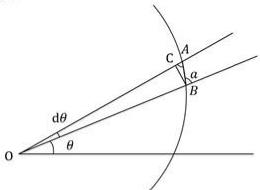

O
dθ
θ
C
A
α
B

图1 龙头运动模型

根据图（1），有：

$$
O C = O B = \alpha \theta \tag {5}
$$

$$
O A = \alpha (\theta + d \theta) \tag {6}
$$

$$
A C = O A - O C = \alpha d \theta \tag {7}
$$

由于 $d\theta$ 极小，故可以认为OA∥OB，OA⊥BC，且 $BC=\widehat{BC}$ ，则有：

$$
\tan \angle a = \tan \angle B A C = \frac {B C}{A C} = \frac {\alpha \theta d \theta}{\alpha d \theta} = \theta \tag {8}
$$

$$
B C = O B \cdot d \theta = \alpha \theta d \theta \tag {9}
$$

根据 $v=\frac{s}{t}$ 得：

$$
v = \frac {A B}{d t} = \frac {A C}{\cos \angle a \cdot d t} = \frac {\alpha d \theta}{\cos \angle a \cdot d t} \tag {10}
$$

将式（8）代入式（10），整理得微分方程：

$$
\frac {d \theta}{d t} = \frac {v}{\alpha \sqrt {1 + \theta^ {2}}} \tag {11}
$$

解得解析解：

$$
\theta \sqrt {\theta^ {2} + 1} + \ln (\theta + \sqrt {\theta^ {2} + 1}) = \frac {2 v}{\alpha} t + C \tag {12}
$$

又根据题意，在初始时刻时， $\theta=32\pi$ ，计算得：

$$
C = 3 2 \pi \sqrt {(3 2 \pi) ^ {2} + 1} + \ln (3 2 \pi + \sqrt {(3 2 \pi) ^ {2} + 1}) \tag {13}
$$

# 5.1.2 把手位置模型

记上文中的螺线方程（4）为 $F(x,y)=0$ ，根据假设，各把手中心均位于螺线上，则各节板凳前把手中心 $(x_{i},y_{i})$ 均满足螺线方程：

$$
F (x _ {i}, y _ {i}) = 0 \tag {14}
$$

$$
F (x _ {i + 1}, y _ {i + 1}) = 0 \tag {15}
$$

又根据题意，第i节龙身、第 $i+1$ 节龙身前把手之间的距离即为第i节龙身前后把手的距离，记为l，于是有：

$$
\sqrt {\left(x _ {i} - x _ {i + 1}\right) ^ {2} + \left(y _ {i} - y _ {i + 1}\right) ^ {2}} = l \tag {16}
$$

此处将龙头看作第0节龙身，则：

$$
\sqrt {\left(x _ {0} - x _ {1}\right) ^ {2} + \left(y _ {0} - y _ {1}\right) ^ {2}} = L \tag {17}
$$

此外，考虑第 $i+1$ 节龙身前把手运动的极角的范围：

$$
0 \leqslant \theta_ {i + 1} - \theta_ {i} \leqslant \pi \tag {18}
$$

综上，整理得各把手中心的位置方程组：

$$
\left\{ \begin{array}{l} F (x _ {i}, y _ {i}) = 0 \\ F (x _ {i + 1}, y _ {i + 1}) = 0 \\ \sqrt {(x _ {i} - x _ {i + 1}) ^ {2} + (y _ {i} - y _ {i + 1}) ^ {2}} = l \\ 0 \leqslant \theta_ {i + 1} - \theta_ {i} \leqslant \pi \end{array} \right. \tag {19}
$$

根据方程组（19）整理得：

$$
\theta_ {i} ^ {2} + \theta_ {i + 1} ^ {2} - 2 \theta_ {i} \theta_ {i + 1} \cos (\theta_ {i} - \theta_ {i + 1}) = \frac {l ^ {2}}{\alpha^ {2}}, 0 \leqslant \theta_ {i + 1} - \theta_ {i} \leqslant \pi \tag {20}
$$

# 5.1.3 把手速度模型

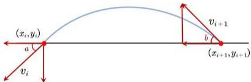

(x_i, y_i)
a
v_i
v_{i+1}
b
(x_{i+1}, y_{i+1})

图2 把手速度模型

根据螺线的参数方程（4）计算得螺线的切线方向 $e_{i}=\frac{(x^{\prime}(\theta_{i}),y^{\prime}(\theta_{i}))}{\sqrt{(x^{\prime}(\theta_{i}))^{2}+(y^{\prime}(\theta_{i}))^{2}}}$ ，其中，

$$
x ^ {\prime} \left(\theta_ {i}\right) = \alpha \left(\cos \theta_ {i} - \theta \sin \theta_ {i}\right) \tag {21}
$$

$$
y ^ {\prime} \left(\theta_ {i}\right) = \alpha \left(\sin \theta_ {i} + \theta_ {i} \cos \theta_ {i}\right) \tag {22}
$$

于是第i节龙身前把手的速度为：

$$
\boldsymbol {v} _ {i} = \left| \boldsymbol {v} _ {i} \right| \boldsymbol {e} _ {i} \tag {23}
$$

记第i节龙身后把手指向第i节板凳前把手的方向为第i节龙身的板凳方向：

$$
\boldsymbol {e} _ {i, i + 1} = \left(x _ {i} - x _ {i + 1}, y _ {i} - y _ {i + 1}\right) \tag {24}
$$

由于假设板凳不可伸缩，因此第i节板凳前把手中心沿板凳方向的分速度与第 $i+1$ 节板凳前把手中心沿板凳方向的分速度相同，于是有：

$$
\boldsymbol {v} _ {i} \cdot \boldsymbol {e} _ {i, i + 1} = \boldsymbol {v} _ {i + 1} \cdot \boldsymbol {e} _ {i, i + 1} \tag {25}
$$

# 5.2 模型求解结果

我们将参数 $d = 0.55\mathrm{m}$ ， $v = 1\mathrm{m / s}$ 代入模型进行求解，以1s的时间间隔将龙身位置和速度数据记录在文件result1.xlsx中。

以 300s 时刻为例，我们绘制如图（3）所示的板凳龙位置图，此刻把手均位于螺线上，符合题目要求。

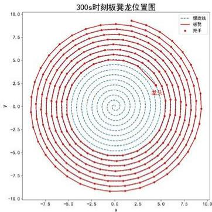

<details>
<summary>radar</summary>

| Angle (°) | X     | Y     |
|-----------|-------|-------|
| 0         | -7.5  | 10.0  |
| 0         | -5.0  | 7.5   |
| 0         | -2.5  | 5.0   |
| 0         | 0.0   | 2.5   |
| 0         | 2.5   | 0.0   |
| 0         | 5.0   | -2.5  |
| 0         | 7.5   | -5.0  |
| 0         | 10.0  | -7.5  |
| 45        | -7.5  | 10.0  |
| 45        | -5.0  | 7.5   |
| 45        | -2.5  | 5.0   |
| 45        | 0.0   | 2.5   |
| 45        | 2.5   | 0.0   |
| 45        | 5.0   | -2.5  |
| 45        | 7.5   | -5.0  |
| 45        | 10.0  | -7.5  |
| 90        | -7.5  | 10.0  |
| 90        | -5.0  | 7.5   |
| 90        | -2.5  | 5.0   |
| 90        | 0.0   | 2.5   |
| 90        | 2.5   | 0.0   |
| 90        | 5.0   | -2.5  |
| 90        | 7.5   | -5.0  |
| 90        | 10.0  | -7.5  |
| 135       | -7.5  | 10.0  |
| 135       | -5.0  | 7.5   |
| 135       | -2.5  | 5.0   |
| 135       | 0.0   | 2.5   |
| 135       | 2.5   | 0.0   |
| 135       | 5.0   | -2.5  |
| 135       | 7.5   | -5.0  |
| 135       | 10.0  | -7.5  |
| 180       | -7.5  | 10.0  |
| 180       | -5.0  | 7.5   |
| 180       | -2.5  | 5.0   |
| 180       | 0.0   | 2.5   |
| 180       | 2.5   | 0.0   |
| 180       | 5.0   | -2.5  |
| 180       | 7.5   | -5.0  |
| 180       | 10.0  | -7.5  |
| +225      | -7.5  | 10.0  |
| +225      | -5.0  | 7.5   |
| +225      | -2.5  | 5.0   |
| +225      | 0.0   | 2.5   |
| +225      | 2.5   | 0.0   |
| +225      | 5.0   | -2.5  |
| +225      | 7.5   | -5.0  |
| +225      | 10.0  | -7.5  |
The chart displays a circular grid with three distinct lines: '横齿线' (horizontal), '斜凳' (vertical), and '形手' (front). The lines are arranged in concentric rings around the origin, indicating directional orientation.
</details>

图3 300s“板凳龙”位置

根据题目要求，我们给出 0s、60s、120s、180s、240s、300s 时，龙头前把手、龙头后面第 1、51、101、151、201 节龙身前把手和龙尾后把手的位置和速度数据，结果如表（2），表（3）所示：

表2 特殊节点位置结果

<table><tr><td></td><td>0 s</td><td>60 s</td><td>120 s</td><td>180 s</td><td>240 s</td><td>300 s</td></tr><tr><td>龙头 x(m)</td><td>8.800000</td><td>5.799209</td><td>-4.084887</td><td>-2.963609</td><td>2.594494</td><td>4.420274</td></tr><tr><td>龙头 y(m)</td><td>0.000000</td><td>-5.771092</td><td>-6.304479</td><td>6.094780</td><td>-5.356743</td><td>2.320429</td></tr><tr><td>第 1 节龙身 x(m)</td><td>8.363824</td><td>7.456758</td><td>-1.445473</td><td>-5.237118</td><td>4.821221</td><td>2.459489</td></tr><tr><td>第 1 节龙身 y(m)</td><td>2.826544</td><td>-3.440399</td><td>-7.405883</td><td>4.359627</td><td>-3.561949</td><td>4.402476</td></tr><tr><td>第 51 节龙身 x(m)</td><td>-9.518732</td><td>-8.686317</td><td>-5.543150</td><td>2.890455</td><td>5.980011</td><td>-6.301346</td></tr><tr><td>第 51 节龙身 y(m)</td><td>1.341137</td><td>2.540108</td><td>6.377946</td><td>7.249289</td><td>-3.827758</td><td>0.465829</td></tr><tr><td>第 101 节龙身 x(m)</td><td>2.913983</td><td>5.687116</td><td>5.361939</td><td>1.898794</td><td>-4.917371</td><td>-6.237722</td></tr><tr><td>第 101 节龙身 y(m)</td><td>-9.918311</td><td>-8.001384</td><td>-7.557638</td><td>-8.471614</td><td>-6.379874</td><td>3.936008</td></tr><tr><td>第 151 节龙身 x(m)</td><td>10.861726</td><td>6.682311</td><td>2.388757</td><td>1.005154</td><td>2.965378</td><td>7.040740</td></tr><tr><td>第 151 节龙身 y(m)</td><td>1.828754</td><td>8.134544</td><td>9.727411</td><td>9.424751</td><td>8.399721</td><td>4.393013</td></tr><tr><td>第 201 节龙身 x(m)</td><td>4.555102</td><td>-6.619664</td><td>-10.627211</td><td>-9.287720</td><td>-7.457151</td><td>-7.458662</td></tr><tr><td>第 201 节龙身 y(m)</td><td>10.725118</td><td>9.025570</td><td>1.359847</td><td>-4.246673</td><td>-6.180726</td><td>-5.263384</td></tr><tr><td>龙尾(后)x(m)</td><td>-5.305444</td><td>7.364557</td><td>10.974348</td><td>7.383896</td><td>3.241051</td><td>1.785033</td></tr><tr><td>龙尾(后)y(m)</td><td>-10.676584</td><td>-8.797992</td><td>0.843473</td><td>7.492371</td><td>9.469336</td><td>9.301164</td></tr></table>

表3 特殊节点速度结果

<table><tr><td></td><td>0 s</td><td>60 s</td><td>120 s</td><td>180 s</td><td>240 s</td><td>300 s</td></tr><tr><td>龙头(m/s)</td><td>1.000000</td><td>1.000000</td><td>1.000000</td><td>1.000000</td><td>1.000000</td><td>1.000000</td></tr><tr><td>第 1 节龙身(m/s)</td><td>0.999971</td><td>0.999961</td><td>0.999945</td><td>0.999917</td><td>0.999859</td><td>0.999709</td></tr><tr><td>第 51 节龙身(m/s)</td><td>0.999742</td><td>0.999662</td><td>0.999538</td><td>0.999331</td><td>0.998941</td><td>0.998065</td></tr><tr><td>第 101 节龙身(m/s)</td><td>0.999575</td><td>0.999453</td><td>0.999269</td><td>0.998971</td><td>0.998435</td><td>0.997302</td></tr><tr><td>第 151 节龙身(m/s)</td><td>0.999448</td><td>0.999299</td><td>0.999078</td><td>0.998727</td><td>0.998115</td><td>0.996861</td></tr><tr><td>第 201 节龙身(m/s)</td><td>0.999348</td><td>0.999180</td><td>0.998935</td><td>0.998551</td><td>0.997894</td><td>0.996574</td></tr><tr><td>龙尾(后)(m/s)</td><td>0.999311</td><td>0.999136</td><td>0.998883</td><td>0.998489</td><td>0.997816</td><td>0.996478</td></tr></table>

# 六、问题二模型的建立与求解

# 6.1 模型建立

由等距螺线曲率半径公式 $^{[1]}$ ，

$$
\frac {\rho}{r} = \frac {(\theta^ {2} + 1) ^ {\frac {3}{2}}}{(\theta^ {2} + 2) \theta} \rightarrow 1 (\theta \rightarrow \infty) \tag {26}
$$

因此，我们认为当 $\theta$ 较大时， $\rho$ 与 $r$ 近似相等。于是建立如下同心圆碰撞近似模型。

# 6.1.1 同心圆碰撞近似模型

我们将板凳龙运动的螺线轨迹近似为两个同心圆，其中内圆半径为 $R$ ，外圆半径为 $R + d$ ，其中 $R$ 可任意取值，如图（4）所示。

我们认为，当内圈板凳最远点极径 $R^{(1)}$ 大于等于外圈板凳最内点极径 $R^{(2)}$ 时，发生碰撞。根据同心圆的对称性，第一次碰撞可确定发生在龙头处。

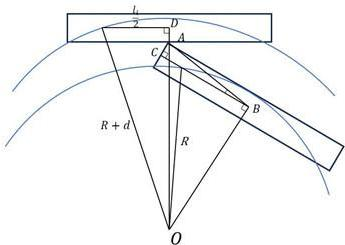

l
2
D
A
C
R + d
R
B
O

图4 同心圆轨迹碰撞示意图

记 $h_{1}$ 为圆心到外圆板中轴线距离， $h_{2}$ 为圆心到内圆板中轴线距离，则根据勾股定理：

$$
h _ {1} = O D = \sqrt {(R + d) ^ {2} - \left(\frac {l}{2}\right) ^ {2}} \tag {27}
$$

$$
h _ {2} = O B = \sqrt {R ^ {2} + \left(\frac {L}{2}\right) ^ {2}} \tag {28}
$$

由于 $R^{(1)}$ 为板凳移动时距离圆心最近的距离，因此我们过圆心向板凳下边缘作垂线，有：

$$
R ^ {(1)} = h _ {1} - 0. 1 5 \tag {29}
$$

由于 $R^{(2)}$ 为板凳移动时距离圆心最远的距离，则 $R^{(2)}$ 即为圆心与板凳上边缘顶点之间的距离：

$$
O A = R ^ {(2)} \tag {30}
$$

当 $OA = h_{1} - 0.15$ 时，判定龙头和龙身相撞，下计算 $OA$ 的长度：

根据几何关系，我们有：

$$
\tan \angle A B C = \frac {A C}{B C} \tag {31}
$$

$$
A B = \sqrt {A C ^ {2} + B C ^ {2}} \tag {32}
$$

则 $\angle ABC = \arctan{\frac{AC}{BC}}$ ， $\angle ABO = \frac{\pi}{2} +\arctan{\frac{AC}{BC}}$

根据余弦定理： $OA^2 = AB^2 + BO^2 - 2AB\cdot BO\cdot \cos \angle ABO$ 即可计算 $OA$ 。

# 6.1.2 “板凳龙” 碰撞仿真模拟

# 计算板凳四个顶点坐标

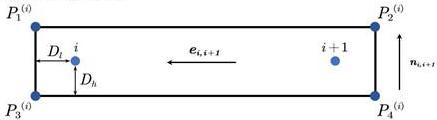

P₁⁽ⁱ⁾
Dᵢ i
← eᵢ₊ᵢ₊ₜ
i + 1
P₂⁽ⁱ⁾
P₃⁽ⁱ⁾
P₄⁽ⁱ⁾
nᵢ₊ᵢ₊ₜ

图5 板凳顶点示意图

由图（5），第i节龙身后把手指向第i节龙身前把手的方向为：

$$
\boldsymbol {e} _ {i, i + 1} = \frac {\left(x _ {i} - x _ {i + 1} , y _ {i} - y _ {i + 1}\right)}{l} \tag {33}
$$

对应的法向量为：

$$
\boldsymbol {n} _ {i, i + 1} = \frac {\left(y _ {i + 1} - y _ {i} , x _ {i + 1} - x _ {i}\right)}{l} \tag {34}
$$

计算顶点 $P_{1}^{(i)}$ 、 $P_{2}^{(i)}$ 、 $P_{3}^{(i)}$ 、 $P_{4}^{(i)}$ 的坐标：

$$
\left\{ \begin{array}{l} P _ {1} ^ {(i)} = (x _ {i}, y _ {i}) - (l + D _ {l}) \cdot \boldsymbol {e} _ {\boldsymbol {k}, i + 1} + D _ {h} \cdot \boldsymbol {n} _ {\boldsymbol {k}, i + 1} \\ P _ {2} ^ {(i)} = (x _ {i}, y _ {i}) + D _ {l} \cdot \boldsymbol {e} _ {\boldsymbol {k}, i + 1} + D _ {h} \cdot \boldsymbol {n} _ {\boldsymbol {k}, i + 1} \\ P _ {3} ^ {(i)} = (x _ {i}, y _ {i}) + D _ {l} \cdot \boldsymbol {e} _ {\boldsymbol {k}, i + 1} - D _ {h} \cdot \boldsymbol {n} _ {\boldsymbol {k}, i + 1} \\ P _ {4} ^ {(i)} = (x _ {i}, y _ {i}) - (l + D _ {l}) \cdot \boldsymbol {e} _ {\boldsymbol {k}, i + 1} - D _ {h} \cdot \boldsymbol {n} _ {\boldsymbol {k}, i + 1} \end{array} \right. \tag {35}
$$

当i=0时，l替换为L。

# 碰撞判断模型

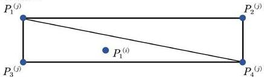

P₁⁽ʲ⁾
P₂⁽ʲ⁾
P₃⁽ʲ⁾
P₁⁽ⁱ⁾
P₄⁽ʲ⁾

图6 碰撞判断模型

当第i节龙身的顶点 $P_{1}^{(0)}$ 、 $P_{2}^{(0)}$ 在 $\square P_{1}P_{2}P_{3}P_{4}^{(j)}$ 内部时，我们判定第i节龙身与第j节龙身碰撞。如图（6）将 $\square P_{1}P_{2}P_{3}P_{4}^{(j)}$ 沿对角线划分为两个三角形，分别判断 $P_{1}^{(0)}$ 、 $P_{2}^{(0)}$ 是否在两个三角形内部，以判断 $P_{1}^{(0)}$ 是否在 $\triangle P_{1}P_{3}P_{4}^{(j)}$ 内部为例进行说明。

判断一个点是否位于三角形内部，可以通过叉乘法 $^{[2]}$ 来实现。构造从三角形顶点到点 $P_{1}^{(6)}$ 的向量，并计算三个向量之间的叉乘，如果叉乘结果都为正，或者都为负，则点 $P_{1}^{(6)}$ 位于三角形内部。

$$
\left\{ \begin{array}{l} \left(\overline {{P _ {1} ^ {(j)} P _ {3} ^ {(j)}}} \times \overline {{P _ {1} ^ {(j)} P _ {1} ^ {(j)}}}\right) \cdot \left(P _ {3} ^ {(j)} P _ {4} ^ {(j)} \times \overline {{P _ {3} ^ {(j)} P _ {1} ^ {(j)}}}\right) > 0 \\ \left(\overline {{P _ {3} ^ {(j)} P _ {4} ^ {(j)}}} \times \overline {{P _ {3} ^ {(j)} P _ {1} ^ {(j)}}}\right) \cdot \left(P _ {4} ^ {(j)} P _ {1} ^ {(j)} \times \overline {{P _ {4} ^ {(j)} P _ {1} ^ {(j)}}}\right) > 0 \\ \left(\overline {{P _ {4} ^ {(j)} P _ {1} ^ {(j)}}} \times \overline {{P _ {4} ^ {(j)} P _ {1} ^ {(j)}}}\right) \cdot \left(\overline {{P _ {1} ^ {(j)} P _ {3} ^ {(j)}}} \times \overline {{P _ {1} ^ {(j)} P _ {1} ^ {(j)}}}\right) > 0 \end{array} \right. \tag {36}
$$

# 6.2 模型求解方法

根据同心圆碰撞近似模型，我们计算出发生碰撞的上界时间420s。我们在时间区间[400s, 420s]之间变步长遍历搜索[3]，计算碰撞时间，具体遍历步骤如下图（7）所示：

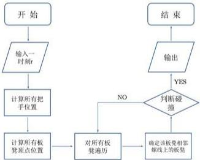

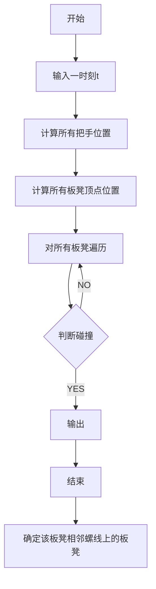

图7 判断碰撞算法流程图

# 6.3 模型求解结果

我们首先以 $\Delta t = 1s$ 的步长进行遍历，缩小碰撞时间范围至 [412s, 413s]；最后以 $\Delta t = 0.0001s$ 变步长进行精细搜索，计算板凳发生碰撞时间为 412.4739s。按照题目要求，我们将此刻龙身位置和速度数据记录在文件 result2.xlsx 中，并给出此刻龙头前把手、龙头后面第 1、51、101、151、201 节龙身前把手和龙尾后把手的位置和速度数据，结果如表（4），表（5）所示：

表4 特殊节点位置结果

<table><tr><td>龙头x(m)</td><td>1.209983</td><td>第101节龙身y(m)</td><td>-5.880132</td></tr><tr><td>龙头y(m)</td><td>1.942749</td><td>第151节龙身x(m)</td><td>0.968780</td></tr><tr><td>第1节龙身x(m)</td><td>-1.643745</td><td>第151节龙身y(m)</td><td>-6.957487</td></tr><tr><td>第1节龙身y(m)</td><td>1.753440</td><td>第201节龙身x(m)</td><td>-7.893170</td></tr><tr><td>第51节龙身x(m)</td><td>1.281259</td><td>第201节龙身y(m)</td><td>-1.230704</td></tr><tr><td>第51节龙身y(m)</td><td>4.326570</td><td>龙尾(后)x(m)</td><td>0.956277</td></tr><tr><td>第101节龙身x(m)</td><td>-0.536307</td><td>龙尾(后)y(m)</td><td>8.322728</td></tr></table>

表5 特殊节点速度结果

<table><tr><td>龙头 (m/s)</td><td>第1节 龙身(m/s)</td><td>第51节 龙身(m/s)</td><td>第101节 龙身(m/s)</td><td>第151节 龙身(m/s)</td><td>第201节 龙身(m/s)</td><td>龙尾(后) (m/s)</td></tr><tr><td>1.000000</td><td>0.991551</td><td>0.976858</td><td>0.974550</td><td>0.973608</td><td>0.973096</td><td>0.972938</td></tr></table>

# 七、问题三模型的建立与求解

# 模型建立

经过分析，螺距与碰撞时龙头前把手的极径呈现明显的单调递减关系。因此我们只需保证，在碰撞时龙头前把手的极径小于等于调头空间的半径的条件下，求解最小螺距。故建立如下优化模型：

$$
o b j: \min d \tag {37}
$$

$$
s. t. d \in S \tag {38}
$$

其中，S 表示龙头前把手进入调头空间前，未发生碰撞时螺距 d 组成的集合。

# 模型求解

在此基础上，采用二分法 $^{[4]}$ 来求解最小螺距，具体步骤如下：

1. 参数初始化：首先，设定最小螺距的初始搜索区间，设定最小螺距的下界 $l=0.3m$ 和上界r=0.55m，精度设为 $\delta=10^{-4}m$ 。  
2. 最大速度条件验证：计算中间值 $mid = (l + r) / 2$ ，并以0.01s为时间步长，判断时间区间 $(t_{in} - 10, t_{in})$ 内是否发生碰撞。  
3. 搜索区间调整：如果发生碰撞，更新下界l=mid；否则，更新上界r=mid。  
4. 迭代逼近：重复上述操作，直到 $r-l$ 满足精度要求，此时，根据最终的搜索区间得到最小螺距 $d=(l+r)/2$ 。

通过二分法求解得最小螺距为 0.4000m，误差控制在 0.0001m 之内。

# 八、问题四模型的建立与求解

# 8.1 调头路径

# 8.1.1 调头路径几何特性

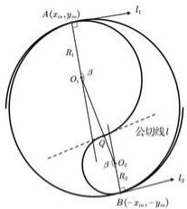

A(x_{m},y_m)
l_1
R_1
O_1
β
Q
β
O_2
R_2
l_2
B(-x_{m1}-y_m)

图8 调头空间示意图

记盘入螺线与调头空间边缘交点为 $(x_{in},y_{in})$ ，由题意，盘出螺线与盘入螺线关于螺线中心呈中心对称，则盘出螺线与调头空间边缘交点为 $(-x_{in},-y_{in})$ ，且切线 $l_{1}/l_{2}$ 。由于 $(x_{in},y_{in})$ 处的切线方向为 $e=(x_{in}^{\prime},y_{in}^{\prime})$ ，法线方向为 $n=(-y_{in}^{\prime},x_{in}^{\prime})$ ，记前一段圆弧的圆心 $O_{1}$ 坐标为：

$$
O _ {1} = (x _ {i n}, y _ {i n}) + 2 \lambda \cdot \boldsymbol {n} \tag {39}
$$

其中， $\lambda$ 为参数。由于前一段圆弧的半径是后一段圆弧半径的2倍，则后一段圆弧

的圆心坐标 $O_{2}$ 为:

$$
O _ {2} = \left(- x _ {\text {in}}, - y _ {\text {in}}\right) - \lambda \cdot n \tag {40}
$$

此外，由于 $AO_{1}\perp l_{1}$ ， $BO_{2}\perp l_{2}$ ， $l_{1}\parallel l_{2}$ ，则 $AO_{1}\parallel BO_{2}$ 。

记 $R_{1}$ 为前一段圆弧的半径， $R_{2}$ 为后一段圆弧的半径，于是有 $R_{1}=2\lambda|n|$ ， $R_{2}=\lambda|n|$ 。

由于调头路径中的两段圆弧相切，则 $QO_{1}\perp l$ ， $QO_{2}\perp l$ ， $O_{1}$ 、Q、 $O_{2}$ 三点共线，两圆弧圆心 $O_{1}$ 、 $O_{2}$ 之间的距离等于两圆弧半径之和：

$$
\left| O _ {1} O _ {2} \right| = 3 \lambda | \boldsymbol {n} | \tag {41}
$$

记 $\beta$ 为圆弧圆心角，根据几何关系和三角函数关系，我们有：

$$
\sin \frac {\beta}{2} = \frac {1}{6} \cdot \frac {| A B |}{R _ {2}} \tag {42}
$$

解得：

$$
\beta = 2 \arcsin \frac {1}{6} \frac {| A B |}{R _ {2}} \tag {43}
$$

其中， $\beta \in \left(\frac{\pi}{2},\pi\right)$

# 8.1.2 调头曲线长度

从图（8）中截取圆弧部分，如图（9）所示，进行调头曲线长度分析。

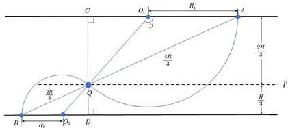

C
O₁
R₁
A
β
4R/3
2H/3
l'
2B/3
B
R₂
O₂
D
H/3

图9 调头空间内几何关系示意图

记 $AO_{1}$ 与 $BO_{2}$ 之间的距离为H，根据上文，我们有 $AO_{1}\parallel BO_{2}$ ， $AO_{1}=2BO_{2}$ 。过O点做 $AO_{1}$ 、 $BO_{2}$ 的垂线OC、OD，于是有OC=2H/3，OD=H/3，则此时 $\sin\angle O_{1}AO=H/2R$ 为一定值，因此 $\beta=\pi-2\angle O_{1}AO$ 恒不变。弧长 $C=\beta(R_{1}+R_{2})$ ，其中 $R_{1}+R_{2}=H/\sin\beta$ 为一定值。

因此，若进入调头空间后立刻开始沿圆弧调头，则无法通过调整圆弧，仍保持各部分相切，使得调头曲线变短，此时圆弧长度为13.621m。

若进入调头空间后仍继续盘入，则可通过调整圆弧半径缩短调头曲线。具体分析如下：

定义龙头开始调头的径向距离为调头半径，记为 $r$ ；又弧长 $C = H\beta / \sin \beta$ ，其中 $\beta = \pi - 2\arcsin (H / 2r)$ ，可知弧长与调头半径正相关。根据假设，“板凳龙”在行进过程中不会倒退，小圆弧的直径大于等于龙头前后把手之间的距离，则 $2\min \{r_1, r_2\} \geqslant L$ 。针对不同约束，可对最小弧长进行求解：

若仅调整调头半径，而不改变圆弧半径比例，调头半径最短为 4.281m，此时圆弧长度为 12.936m；

若同时调整调头半径和圆弧半径比例，当比例为1:1时，调头半径最短为2.847m，此时圆弧长度为8.443m。

# 8.2 “板凳龙”位置速度模型的建立与求解

# 8.2.1 模型建立

我们将“板凳龙”调头过程分为四个部分，分别为龙头进入盘入，调头第一段圆弧，调头第二段圆弧，盘出。记 $F(t)=(x,y)$ 为“板凳龙”运动轨迹的分段函数。

在龙头进入调头空间前，即 -100 s < t < 0 s 时，“板凳龙”运动方程满足螺线参数方程（4）：

$$
F (t) = (\alpha \theta (t) \cos (\theta (t)), \alpha \theta (t) \sin (\theta (t))) \tag {44}
$$

根据式（11）的解析解，修改初始条件为 $\theta \big|_{t = 0} = \theta_{in}$ ，其中 $\theta^{*}$ 表示龙头进入调头空间时的极角。此时， $\theta$ 满足：

$$
\theta \sqrt {\theta^ {2} + 1} + \ln (\theta + \sqrt {\theta^ {2} + 1}) = \frac {2 v}{\alpha} t + C _ {1} \tag {45}
$$

$$
C _ {1} = \theta_ {\text {in}} \sqrt {\theta_ {\text {in}} ^ {2} + 1} + \ln \left(\theta_ {\text {in}} + \sqrt {\theta_ {\text {in}} ^ {2} + 1}\right)
$$

当 “板凳龙” 进入第一段圆弧，即 $0 < t < \frac{\beta}{\omega_{1}}$ 时，由于此时 “板凳龙” 沿第一段圆弧以角速度 $\omega_{1} = \frac{v}{R_{1}}$ 做顺时针运动，则：

$$
F (t) = \binom {x _ {\text {in}} - 2 \lambda y _ {\text {in}} ^ {\prime} + R _ {1} \cos (\gamma_ {1} - \omega_ {1} t)} {y _ {\text {in}} - 2 \lambda x _ {\text {in}} ^ {\prime} + R _ {1} \sin (\gamma_ {1} - \omega_ {1} t)} ^ {T} \tag {46}
$$

其中， $\gamma_{1}$ 满足 $\cos \gamma_{1} = -\frac{y_{in}^{\prime}}{\sqrt{x_{in}^{\prime 2} + y_{in}^{\prime 2}}},\sin \gamma_{1} = \frac{x_{in}^{\prime}}{\sqrt{x_{in}^{\prime 2} + y_{in}^{\prime 2}}}$

当“板凳龙”进入第二段圆弧，即 $\frac{\beta}{\omega_1} < t < \beta \left(\frac{1}{\omega_1} + \frac{1}{\omega_2}\right)$ 时，由于此时“板凳龙”沿第二段圆弧以角速度 $\omega_{2} = \frac{v}{R_{2}}$ 做逆时针运动，于是有：

$$
F (t) = \left( \begin{array}{l} - x _ {i n} + \lambda y _ {i n} ^ {\prime} + R _ {2} \cos \left(\gamma_ {2} + \omega_ {2} \left(t - \frac {\beta}{\omega_ {1}}\right)\right) \\ - y _ {i n} - \lambda x _ {i n} ^ {\prime} + R _ {2} \sin \left(\gamma_ {2} + \omega_ {2} \left(t - \frac {\beta}{\omega_ {1}}\right)\right) \end{array} \right) ^ {T} \tag {47}
$$

其中， $\gamma_{2} = \gamma_{1} - \beta +\pi$

在 “板凳龙” 离开调头空间后，即 $\beta\left(\frac{1}{\omega_{1}}+\frac{1}{\omega_{2}}\right)<t<100\ s$ 时，由于盘出螺线与盘入螺线关于螺线中心呈中心对称，有：

$$
F (t) = (\alpha \theta (t) \cos (\theta (t) + \pi), \alpha \theta (t) \sin (\theta (t) + \pi)) \tag {48}
$$

与第一种情况一致，修改初始条件为 $\theta \bigg|_{t = \beta \left(\frac{1}{\omega_1} +\frac{1}{\omega_2}\right)} = \theta_{m}$ ，其中 $\theta_{m}$ 表示龙头进入调头空间时的极角。此时， $\theta$ 满足：

$$
\theta \sqrt {\theta^ {2} + 1} + \ln (\theta + \sqrt {\theta^ {2} + 1}) = \frac {2 v}{\alpha} t + C _ {2} \tag {49}
$$

$$
C _ {1} = \theta_ {i n} \sqrt {\theta_ {i n} ^ {2} + 1} + \ln \left(\theta_ {i n} + \sqrt {\theta_ {i n} ^ {2} + 1}\right) - \frac {2 v \beta}{\alpha} \left(\frac {1}{\omega_ {1}} + \frac {1}{\omega_ {2}}\right)
$$

# 把手位置模型

由于“板凳龙”的运动轨迹是关于 $\theta$ 的多值函数，因为我们考虑将 $F(t)$ 看作其余龙身的单值参数方程，将其代入各把手中心的位置方程组（19）：

$$
\left\{ \begin{array}{l} F (t _ {i}) = 0 \\ F (t _ {i + 1}) = 0 \\ D (t _ {i}, t _ {i + 1}) = l _ {i} \\ t _ {i} - t _ {i + 1} > 0 \end{array} \right. \tag {50}
$$

其中， $F(t_{i})=0$ 表示第i节龙身把手在螺线轨迹上。

# 把手速度模型

在问题一的基础上，根据“板凳龙”位置分段函数 $F(t)$ 调整龙头运动的切线方程 $F'(t)$ 得：

$$
F ^ {\prime} (t) = \left(x ^ {\prime}, y ^ {\prime}\right) = \left\{ \begin{array}{l} \left(\alpha (\cos \theta (t) - \theta (t) \sin \theta (t)) ^ {T}, - 1 0 0 <   t \leqslant 0 \right. \\ \left. \alpha (\sin \theta (t) + \theta (t) \cos \theta (t))\right), \\ \left(y (t) - y _ {m} - 2 \lambda x _ {m} ^ {\prime}, - z (t) + x _ {m} - 2 \lambda y _ {m} ^ {\prime}\right), 0 <   t <   \frac {\beta}{\omega_ {1}} \\ \left(- y (t) - y _ {m} - 2 x _ {m}; x (t) + x _ {m} - 2 y _ {m}\right), \frac {\beta}{\omega_ {1}} <   t <   \beta \left(\frac {1}{\omega_ {1}} + \frac {1}{\omega_ {2}}\right) \\ \left. \left(\alpha (\cos (\theta (t) + \pi) - \theta (t) \sin (\theta (t) + \pi))\right) ^ {T}, \beta \left(\frac {1}{\omega_ {1}} + \frac {1}{\omega_ {2}}\right) <   t <   1 0 0 \right. \\ \left. \left(\alpha (\sin (\theta (t) + \pi) + \theta (t) \cos (\theta (t) + \pi))\right)\right), \end{array} \right. \tag {51}
$$

将 $F'(t)$ 代入把手速度模型求解即可。

# 8.2.2 模型求解结果

根据题目所给的调整路径，我们对龙身位置和速度进行求解，并将其记录在文件result4.xlsx中，同时给出-100s、-50s、0s、50s、100s时，龙头前把手、龙头后面第1、51、101、151、201节龙身前把手和龙尾后把手的位置和速度，结果如表（6），表（7）所示：

表6 特殊节点位置结果

<table><tr><td></td><td>-100 s</td><td>-50 s</td><td>0 s</td><td>50 s</td><td>100 s</td></tr><tr><td>龙头 x(m)</td><td>7.778034</td><td>6.608301</td><td>-2.711856</td><td>1.332696</td><td>-3.157229</td></tr><tr><td>龙头 y(m)</td><td>3.717164</td><td>1.898865</td><td>-3.591078</td><td>6.175324</td><td>7.548511</td></tr><tr><td>第 1 节龙身 x(m)</td><td>6.209273</td><td>5.366911</td><td>-0.063534</td><td>3.862265</td><td>-0.346890</td></tr><tr><td>第 1 节龙身 y(m)</td><td>6.108521</td><td>4.475403</td><td>-4.670888</td><td>4.840828</td><td>8.079166</td></tr><tr><td>第 51 节龙身 x(m)</td><td>-10.608038</td><td>-3.629945</td><td>2.459962</td><td>-1.671385</td><td>2.095033</td></tr><tr><td>第 51 节龙身 y(m)</td><td>2.831491</td><td>-8.963800</td><td>-7.778145</td><td>-6.076713</td><td>4.033787</td></tr><tr><td>第 101 节龙身 x(m)</td><td>-11.922761</td><td>10.125787</td><td>3.008493</td><td>-7.591816</td><td>-7.288774</td></tr><tr><td>第 101 节龙身 y(m)</td><td>-4.802378</td><td>-5.972247</td><td>10.108539</td><td>5.175487</td><td>2.063875</td></tr><tr><td>第 151 节龙身 x(m)</td><td>-14.351032</td><td>12.974784</td><td>-7.002789</td><td>-4.605165</td><td>9.462513</td></tr><tr><td>第 151 节龙身 y(m)</td><td>-1.980993</td><td>-3.810357</td><td>10.337482</td><td>-10.386988</td><td>-3.540357</td></tr><tr><td>第 201 节龙身 x(m)</td><td>-11.952942</td><td>10.522509</td><td>-6.872842</td><td>0.336952</td><td>8.524374</td></tr><tr><td>第201节龙身y(m)</td><td>10.566998</td><td>-10.807425</td><td>12.382609</td><td>-13.177610</td><td>8.606933</td></tr><tr><td>龙尾(后)x(m)</td><td>-1.011059</td><td>0.189809</td><td>-1.933627</td><td>5.859094</td><td>-10.980157</td></tr><tr><td>龙尾(后)y(m)</td><td>-16.527573</td><td>15.720588</td><td>-14.713128</td><td>12.612894</td><td>-6.770006</td></tr></table>

表7 特殊节点速度结果

<table><tr><td></td><td>-100 s</td><td>-50 s</td><td>0 s</td><td>50 s</td><td>100 s</td></tr><tr><td>龙头(m/s)</td><td>1.000000</td><td>1.000000</td><td>1.000000</td><td>1.000000</td><td>1.000000</td></tr><tr><td>第1节龙身(m/s)</td><td>0.999904</td><td>0.999762</td><td>0.998687</td><td>1.000363</td><td>1.000124</td></tr><tr><td>第51节龙身(m/s)</td><td>0.999346</td><td>0.998642</td><td>0.995134</td><td>0.949935</td><td>1.003966</td></tr><tr><td>第101节龙身(m/s)</td><td>0.999091</td><td>0.998248</td><td>0.994448</td><td>0.948482</td><td>1.096263</td></tr><tr><td>第151节龙身(m/s)</td><td>0.998944</td><td>0.998047</td><td>0.994156</td><td>0.948038</td><td>1.095306</td></tr><tr><td>第201节龙身(m/s)</td><td>0.998849</td><td>0.997925</td><td>0.993994</td><td>0.947823</td><td>1.094933</td></tr><tr><td>龙尾(后)(m/s)</td><td>0.998817</td><td>0.997885</td><td>0.993944</td><td>0.947760</td><td>1.094833</td></tr></table>

# 九、问题五模型的建立与求解

# 9.1 最大速度分布规律探究

当龙头速度为 1m/s 时，我们探索最大速度随时间变化的情况，如图（10）所示：

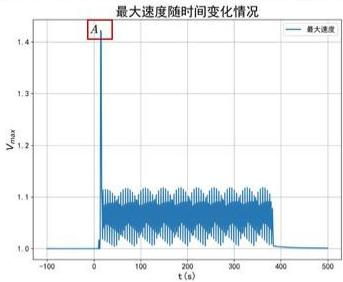

<details>
<summary>line</summary>

| t (s) | V_max |
|-------|-------|
| -100  | 1.0   |
| 0     | 1.4   |
| 500   | 1.0   |
</details>

图10 最大速度随时间变化情况

我们发现图（10）中出现明显峰值A点，且A点之后最大速度的变化呈现周期性。经过计算，A点时刻为“板凳龙”龙头前把手离开第二段圆弧时的时刻。下面说明出现明显峰值A点的原因。

首先我们分析曲率半径 $\rho$ 和速度与板凳方向夹角 $\varphi$ 之间的关系：

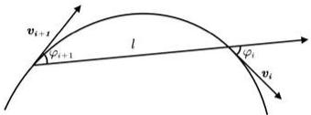

v_{i+1}
\varphi_{i+1} \quad l \quad \varphi_i \quad v_i

图11 探究曲率半径与速度变化之间的关系

根据几何关系得：

$$
\sin \varphi = \frac {l}{2 \rho} \tag {52}
$$

由于第i节龙身前把手中心沿板凳方向的分速度与第 $i+1$ 节龙身前把手中心沿板凳方向的分速度相同，则：

$$
v _ {i} \cdot \cos \varphi_ {i} = v _ {i + 1} \cdot \cos \varphi_ {i + 1} \tag {53}
$$

整理得：

$$
v _ {i + 1} = \frac {\cos \varphi_ {i}}{\cos \varphi_ {i + 1}} v _ {i} = \sqrt {\frac {1 - \frac {l ^ {2}}{4 \rho_ {i} ^ {2}}}{1 - \frac {l ^ {2}}{4 \rho_ {i + 1} ^ {2}}}} \cdot v _ {i} \tag {54}
$$

$$
\Delta v _ {i} = v _ {i + 1} - v _ {i} \approx \mu \cdot \left(\rho_ {i} ^ {2} - \rho_ {i + 1} ^ {2}\right) \tag {55}
$$

其中， $\mu$ 可近似为常数。

离开第二段小圆弧位置，第二段圆弧曲率半径为 $\rho_{i+1}$ ，盘出螺线曲率半径为 $\rho_{i}$ ，相差最为明显，于是在此处附近的相邻节点速度变化较大，所以在此处最大速度出现明显峰值。

根据上述分析，我们猜想，最大速度出现位置不随龙头行进速度变化，出现在龙头前把手离开第二段小圆弧的时刻附近。于是我们针对不同的龙头行进速度对最大速度出现位置的影响进行分析，记龙头前把手离开第二段小圆弧的时刻为 $t_{out}$ ，以0.1s为步长，绘制 $(t_{out}-10,t_{out}+10)$ 这一时间段中最大速度的图像如图（12）所示：

行进速度对最大速度位置的影响  
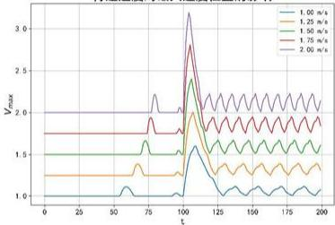

<details>
<summary>line</summary>

| t   | 1.00 n/s | 1.25 n/s | 1.50 n/s | 1.75 n/s | 2.00 n/s |
| --- | -------- | -------- | -------- | -------- | -------- |
| 0   | 1.0      | 1.0      | 1.0      | 1.0      | 1.0      |
| 25  | 1.0      | 1.0      | 1.0      | 1.0      | 1.0      |
| 50  | 1.0      | 1.0      | 1.0      | 1.0      | 1.0      |
| 75  | 1.0      | 1.0      | 1.0      | 1.0      | 1.0      |
| 100 | 1.0      | 1.0      | 1.0      | 1.0      | 1.0      |
| 125 | 1.0      | 1.0      | 1.0      | 1.0      | 1.0      |
| 150 | 1.0      | 1.0      | 1.0      | 1.0      | 1.0      |
| 175 | 1.0      | 1.0      | 1.0      | 1.0      | 1.0      |
| 200 | 1.0      | 1.0      | 1.0      | 1.0      | 1.0      |
</details>

图12 行进速度对最大速度位置的影响

由图（12）可知，最大速度峰值出现后的最大速度变化呈时间周期性。此外，我们发现最大速度均在在100～125时刻的附近的位置范围内出现，该时间段对应龙头前把手离开第二段小圆弧的时间区间。因此，我们印证猜想，接下来我们对该区域进行精细搜索。

# 9.2 模型建立

由上述分析，建立优化模型：

$$
o b j: \max v \tag {56}
$$

$$
s. t. v _ {\max} \leqslant 2 \tag {57}
$$

其中， $v_{max}$ 表示龙头前把手速度为 v 是 “板凳龙” 行进过程中，把手出现的最大速度。

# 9.3 模型求解结果

根据最大速度分布规律探究的分析，我们发现当“板凳龙”龙头前把手离开第二段圆弧时，出现最大速度。根据计算，调头空间内的圆弧长度为 $C=13.621m$ ；由t=s/v估算最大速度时间区间，以 $\Delta t=0.001s$ 为步长，计算 $(t-0.5,t+2.5)$ 内的 $v_{max}$ 。

我们采用二分法进行求解。具体步骤如下：

1. 参数初始化：首先，设定最大速度的初始搜索区间，设定最大速度的下界 $l=1\mathrm{m/s}$ 和上界 $r=2\mathrm{m/s}$ ，精度要求为 $\delta=10^{-4}\mathrm{m/s}$ 。  
2. 最大速度条件验证：计算中间值 $mid = (l + r)/2$ ，并计算 $v_{\max}$ 与 2m/s 进行比较。  
3. 搜索区间调整：如果 $v_{\max}>2m/s$ ，更新上界r=mid；否则，更新下界l=mid。  
4. 迭代逼近：重复上述操作，直到 $r-l$ 满足精度要求，此时，根据最终的搜索区间得到龙头的最大行进速度 $v=(l+r)/2$ 。

解得龙头的最大行进速度为 1.2462m/s，其中误差控制在 0.0001 m/s 之内。

# 十、模型检验

为检验运动模型的正确性，本节针对问题一对位置和速度模型分别进行验证。

# 10.1 位置模型检验

我们将螺线的极径近似为曲率半径，估计螺线中心为圆心，建立如下近似圆估计模型：

$$
r \cdot \frac {d \theta}{d t} = v \tag {58}
$$

其中， $r$ 为螺线的极径。代入问题一的初始条件 $\theta |_{t = 0} = 32\pi$ ，解得：

$$
\theta = \sqrt {(3 2 \pi) ^ {2} - \frac {4 \pi v}{r} t} \tag {59}
$$

计算其结果，与问题一的求解结果进行比较，计算误差：

$$
\varepsilon_ {j} = \sum_ {i} d i s _ {i j} \tag {60}
$$

其中， $dis_{ij}$ 表示 j 时刻两个求解结果中第 i 节龙身前把手位置之间的距离。误差结果如下图（13）所示：

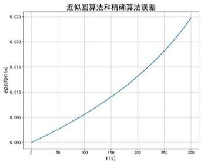

<details>
<summary>line</summary>

近似圆算法和精确算法误差
| t (s) | 0.000 |
|---|---|
| 0 | 0.000 |
| 50 | 0.002 |
| 100 | 0.004 |
| 150 | 0.006 |
| 200 | 0.008 |
| 250 | 0.011 |
| 300 | 0.015 |
</details>

图13 求解结果位置误差

由图（13）可知，误差 $\varepsilon$ 随时间t增大，这是由于随着极径变短，曲率半径估计误差偏大引起的。

# 10.2 速度模型检验

在问题一中，我们利用板凳的不可伸缩性，通过切线方程求解速度的理论值；此处我们利用差分算法进行速度近似值求解：

利用差商近似微商，即 $v=\frac{ds}{dt}\approx\frac{\Delta s}{\Delta t}$ ，取 $\Delta t=10^{-4}s$ ，计算结果与问题一的求解结果进行比较，计算误差，最大误差数量级为 $10^{-8}m/s$ 。

# 十一、模型优缺点

# 11.1 模型优点

1. 利用微元法获得微分方程，并求得解析解，避免了数值求解时带来的误差积累，提高求解效率和精度。  
2. 问题二采取同心圆近似螺线估计碰撞时间，极大地减少了后续对时间遍历的搜索空间，减小求解成本；同时估计结果与真实结果较为接近，误差在1%以内。  
3. 本文针对问题的最优子结构进行分析，分别采取二分法、变步长搜索等方法进行求解，保证结果的正确性。

# 11.2 模型缺点

1. 对于“板凳龙”运动这一连续过程，本文仅对离散时刻进行碰撞判定。  
2. 考虑到实际问题中的随机因素存在误差。

# 参考文献

[1] https://blog.csdn.net/BUAAer\_xuyang/article/details/135187865   
[2] https://blog.csdn.net/adolph\_yang/article/details/79123304   
[3] 贾宝新, 李峰, 潘一山, 等. 基于变步长加速搜索的微震源定位方法 [J]. 岩土力学, 2022, 43(03): 843-856. DOI: 10.16285/j.rsm.2021.0872.  
[4] 刘春燕, 闫广峰, 林成, 等. 基于二分法的 KPCA 核参数优选 [J]. 内江师范学院学报, 2024, 39(02): 71-76. DOI: 10.13603/j.cnki.51-1621/z.2024.02.012.

# 附录

附录一 支撑文件列表

<table><tr><td>Problem1_1.py</td><td># 圆半径近似计算位置和速度</td></tr><tr><td>Problem1_2.py</td><td># 精确计算位置和速度</td></tr><tr><td>Problem1_3.py</td><td># 差分算法计算速度</td></tr><tr><td>Problem1_4.py</td><td># 误差对比</td></tr><tr><td>Problem2_1.py</td><td># 同心圆估计碰撞时间</td></tr><tr><td>Problem2_2.py</td><td># 计算碰撞时刻,保存数据,绘制示意图</td></tr><tr><td>Problem3_1.py</td><td># 二分法计算最小螺距</td></tr><tr><td>Problem4_1.py</td><td># 精确计算问题四</td></tr><tr><td>Problem4_2.py</td><td># 差分算法计算速度</td></tr><tr><td>Problem4_3.py</td><td># 计算最短圆弧</td></tr><tr><td>Problem5_1.py</td><td># 二分法求最大速度</td></tr><tr><td>Plot1_1.py</td><td># 绘制300s时刻的精确版本的板凳龙位置图</td></tr><tr><td>Plot4_1.py</td><td># 绘制调整路径示意图</td></tr><tr><td>Plot5_1.py</td><td># 绘制最大速度随时间变化分布图</td></tr><tr><td>Plot5_2.py</td><td># 绘制最大速度随速度变化分布图</td></tr><tr><td>Table.py</td><td># 导出论文结果</td></tr><tr><td>result1.xlsx</td><td># 问题一结果</td></tr><tr><td>result2.xlsx</td><td># 问题二结果</td></tr><tr><td>result4.xlsx</td><td># 问题四结果</td></tr></table>

# 附录二 程序代码

本文采用 Python 进行编程。

第一问精确计算位置和速度（Problem1\_2.py）  
```python
# 问题一：求解各把手位置和速度
import numpy as np
import pandas as pd
from numpy import pi, sin, cos, sqrt, log
from scipy.optimize import root

# 参数
d = 0.55    # 螺距(m)
v = 1    # 龙头行进速度(m/s)

C = (32 * pi) * sqrt((32*pi)**2 + 1) + log((32 * pi) +
sqrt((32*pi)**2 + 1))
alpha = d / (2 * pi)

# 给定时刻 t，计算龙头的位置
def head(t):
    theta = root(lambda x: x * sqrt(x**2 + 1) + log(x + sqrt(x**2 + 1)) - C + 2*v*t/alpha, 10).x[0]
    return theta * alpha * cos(theta), theta * alpha * sin(theta), theta

# 给定龙头的位置，计算各把手的位置
def position(theta):
    x_post, y_post, theta_post = [theta * alpha * cos(theta)], [theta * alpha * sin(theta)], [theta]

# 计算第一节龙身前把手
    def func(t1):
    t0, l = theta, 2.86
    return t1**2 + t0**2 - 2*t1*t0*cos(t1 - t0) - (l / alpha) ** 2

t1 = root(func, theta+1).x[0]
    x_post.append(t1 * alpha * cos(t1)); y_post.append(t1 * alpha * sin(t1)); theta_post.append(t1)

# 计算后续的把手
for _ in range(222):
    def func(t):
    l = 1.65
    return t**2 + t1**2 - 2*t*t1*cos(t - t1) - (l / alpha) ** 2 
```

```python
t1 = root(func, t1+1).x[0]
x_post.append(t1 * alpha * cos(t1)); y_post.append(t1 * alpha * sin(t1)); theta_post.append(t1)
return x_post, y_post, theta_post

# 给定龙头的速度和各把手的位置，计算各把手的速度
def speed(x, y, theta):
    v1 = 1
    speed = [1]

    for i in range(223):
    d1 = np.array([cos(theta[i]) - theta[i]*sin(theta[i]), sin(theta[i]) + theta[i]*cos(theta[i]]))    # 上一把手速度方向
    d1 = d1 / np.linalg.norm(d1)
    d = np.array([cos(theta[i+1]) - theta[i+1]*sin(theta[i+1]), sin(theta[i+1]) + theta[i+1]*cos(theta[i+1]]))    # 这一把手速度方向
    d = d / np.linalg.norm(d)
    vector = np.array([x[i+1] - x[i], y[i+1] - y[i]])    # 板凳方向
    v1 = root(lambda v: np.dot(v1*d1, vector) - np.dot(v*d, vector), v1).x[0])
    speed.append(v1)
    return speed

# 主函数
if __name__ == '__main__':
    # 划分时间
    t = np.arange(0, 301, step=1)

    post_result = pd.DataFrame(columns = t, index = range(224*2))
    speed_result = pd.DataFrame(columns = t, index = range(224))

    # 计算龙头前把手的位置和速度
    head_vec = np.vectorize(head)
    head_post_x, head_post_y, head_theta = head_vec(t)

    # 计算各时刻把手的位置和速度
    for i, t in enumerate(head_theta):
    # 计算把手位置
    handle_post_x, handle_post_y, handle_theta = position(t)
    handle_post = [] 
```

```python
for j in range(224):
    handle_post.append(handle_post_x[j]);
handle_post.append(handle_post_y[j])
    post_result[i] = handle_post

# 计算把手速度
handle_speed = speed(handle_post_x, handle_post_y, handle_theta)
speed_result[i] = handle_speed

# 保存答案
post_result.round(6).to_excel('问题_位置.xlsx')
speed_result.round(6).to_excel('问题_速度.xlsx') 
```

第二问变步长搜索碰撞时间（Problem2\_2.py）  
```python
# 问题二:变步长求解碰撞时刻
import numpy as np
import pandas as pd
import matplotlib.pyplot as plt
from scipy.optimize import root
from numpy import pi, sin, cos, sqrt, arcsin, log

# 参数
d = 0.55    # 螺距(m)
v = 1    # 龙头行进速度(m/s)

C = (32 * pi) * sqrt((32*pi)**2 + 1) + log((32 * pi) +
sqrt((32*pi)**2 + 1))
alpha = d / (2 * pi)

# 给出螺旋线方程
def helix(theta):
    return np.array([alpha * theta * cos(theta), alpha * theta * sin(theta)])
# 判断点在矩形内部
def Point_in_Polygon(point, polygon):
    A, B, C, D = polygon[0], polygon[1], polygon[2], polygon[3]
    P = np.array([point[0], point[1]])
    flag1, flag2 = 0, 0

    AB, BC, CA = B-A, C-B, A-C
    AP, BP, CP = P-A, P-B, P-C 
```

```python
if np.sign(AB[0] * AP[1] - AP[0] * AB[1]) == np.sign(BC[0] * BP[1] - BP[0] * BC[1]) and np.sign(BC[0] * BP[1] - BP[0] * BC[1]) == np.sign(CA[0] * CP[1] - CP[0] * CA[1]):
    flag1 = 1

AD, DC, CA = D-A, C-D, A-C
AP, DP, CP = P-A, P-D, P-C
if np.sign(AD[0] * AP[1] - AP[0] * AD[1]) == np.sign(DC[0] * DP[1] - DP[0] * DC[1]) and np.sign(DC[0] * DP[1] - DP[0] * DC[1]) == np.sign(CA[0] * CP[1] - CP[0] * CA[1]):
    flag2 = 1

if flag2 or flag1:
    return True
else:
    return False

# 根据前把手计算四个点:
def vertices(front, back, L):
    D1 = 0.275; Dh = 0.15
    handle1 = helix(front)
    handle2 = helix(back)
    e = (handle1 - handle2) / (L - 0.55)
    n = np.array([-e[1], e[0]])
    points = np.array([handle1 - (L - D1) * e + Dh * n,
    handle1 + D1 * e + Dh * n,
    handle1 + D1 * e - Dh * n,
    handle1 - (L - D1) * e - Dh * n,])
    return points

# 判断前把手是否碰撞:所有点的位置信息,判断是否会发生碰撞
def crash(theta):
    for i, t in enumerate(theta[:2]):
    delta = 2 * arcsin(2.86 / (2 * alpha * t))

    # 寻找外圈的板凳
    neighbor = [j+i for j, k in enumerate(theta[i:-1]) if t + 2*pi - delta < k and k < t + 2*pi + delta]    # 效率版本
    # neighbor = [j for j, k in enumerate(theta[:-1]) if t < k and k < t + 4*pi ]    # 准确版本

    # 碰撞点
    if i == 0:
    point1 = vertices(theta[i], theta[i+1], 3.41)[1] 
```

```python
point2 = vertices(theta[i], theta[i+1], 3.41)[0]
else:
    point1 = vertices(theta[i], theta[i+1], 2.2)[1]
    point2 = vertices(theta[i], theta[i+1], 2.2)[0]

# 判断是否碰撞
for nei in neighbor:
    if Point_in_Polygon(point1, vertices(theta[nei], theta[nei + 1], 2.2)) or Point_in_Polygon(point2, vertices(theta[nei], theta[nei + 1], 2.2)):
    print(f'第{i+1}块板凳与第{nei+1}块板凳发生碰撞')
    return True, (i, t, nei)

print('未发生碰撞')
return False, -1

# 给定时刻 t，计算龙头的位置
def head(t):
    theta = root(lambda x: x * sqrt(x**2 + 1) + log(x + sqrt(x**2 + 1)) - C + 2*v*t/alpha, 10).x[0]
    return theta * alpha * cos(theta), theta * alpha * sin(theta), theta

# 给定龙头的位置，计算各把手的位置
def position(theta):
    x_post, y_post, theta_post = [theta * alpha * cos(theta)], [theta * alpha * sin(theta)], [theta]

# 计算第一节龙身前把手
    def func(t1):
    t0, l = theta, 2.86
    return t1**2 + t0**2 - 2*t1*t0*cos(t1 - t0) - (l / alpha) ** 2

t1 = root(func, theta+1).x[0]
    x_post.append(t1 * alpha * cos(t1)); y_post.append(t1 * alpha * sin(t1)); theta_post.append(t1)

# 计算后续的把手
for _ in range(222):
    def func(t):
    l = 1.65
    return t**2 + t1**2 - 2*t*t1*cos(t - t1) - (l / alpha) ** 2

t1 = root(func, t1+1).x[0] 
```

```python
x_post.append(t1 * alpha * cos(t1)); y_post.append(t1 * alpha * sin(t1)); theta_post.append(t1)
return x_post, y_post, theta_post

# 给定龙头的速度和各把手的位置，计算各把手的速度
def speed(x, y, theta):
    v1 = 1
    speed = [1]

    for i in range(223):
    d1 = np.array([cos(theta[i]) - theta[i] * sin(theta[i]),
    sin(theta[i]) +
    theta[i] * cos(theta[i])) # 上一把手速度方向
    d1 = d1 / np.linalg.norm(d1)
    d = np.array([cos(theta[i+1]) - theta[i+1] * sin(theta[i+1]),
    sin(theta[i+1]) + theta[i+1] * cos(theta[i+1])) # 这一把手速度方向
    d = d / np.linalg.norm(d)
    vector = np.array([x[i+1] - x[i], y[i+1] - y[i]]) # 板凳方向
    v1 = root(lambda v: np.dot(v1 * d1, vector) - np.dot(v * d,
    vector), v1).x[0]
    speed.append(v1)
    return speed

# 绘图检查
def draw(x, y, theta, t):
    the = np.linspace(0, 32*pi, 10000)
    x1, y1 = helix(the)

    fig = plt.figure(figsize=(9, 9))
    axes3 = fig.add_subplot(1, 1, 1)

# 绘制板凳
for i, tk in enumerate(theta[:-1]):
    if i == 0:
    l = 3.41
    else:
    l = 2.2
    p = plt.Polygon(xy=vertices(theta[i], theta[i+1], 1),
    color='#C82423', alpha=0.8)
    axes3.add_patch(p)

plt.plot(x1, y1, linestyle='--', color='#2878B5', label='螺旋线')
plt.scatter(x, y, s=5, c='k', label='把手') 
```

```python
plt.legend(fontsize='large')

plt.title(f'{round(t, 4)}s时刻板凳龙位置图', fontsize=22)
plt.xlabel('x', fontsize=16)
plt.ylabel('y', fontsize=16)

# 坐标轴调整
plt.tick_params(labelsize=13)
plt.subplots_adjust(top=0.9, bottom=0.1, left=0.1, right=0.9) # 调整页边距

plt.show()
plt.close()

# 主函数
if __name__ == '__main__':
    plt.rcParams['font.family'] = ['SimHei']    # 显示中文
    plt.rcParams['axes.unicode_minus'] = False    # 显示负号
    plt.axis('equal')    # 等比例

    # 划分时间
    time = np.arange(412.47, 413, 0.0001)

    # 计算龙头前把手的位置和速度
    head_vec = np.vectorize(head)
    head_post_x, head_post_y, head_theta = head_vec(time)

    # 计算各时刻把手的位置和速度
    for i, t in enumerate(head_theta):
    # 计算把手位置
    handle_post_x, handle_post_y, handle_theta = position(t)

    # 绘制图片
    draw(handle_post_x, handle_post_y, handle_theta, time[i])

    flag, mess = crash(handle_theta)

    if flag:
    break

# 保存结果
```

```python
handle_speed = speed(handle_post_x, handle_post_y, handle_theta)
result = pd.DataFrame({'x':handle_post_x,
    'y':handle_post_y,
    'v':handle_speed})
result.round(6).to_excel('问题二.xlsx')
# 绘制结果
the = np.linspace(0, 32*pi, 10000)
x1, y1 = helix(the)
fig = plt.figure(figsize=(9, 9))
axes3 = fig.add_subplot(1, 1, 1)
# 绘制板凳
for j in [mess[0], mess[2]]:
    if j == 0:
    l = 3.41
    else:
    l = 2.2
    p = plt.Polygon(xy=vertices(handle_theta[j], handle_theta[j+1], l), color='r', alpha=0.8)
    axes3.add_patch(p)
plt.plot(x1, y1, linestyle='--', color='#2878B5', label='螺旋线')
plt.plot(handle_post_x, handle_post_y, c='#C82423', label='板凳', marker='o', markersize=0, linewidth=2)
plt.scatter(handle_post_x, handle_post_y, s=20, c='#934B43', label='把手')
plt.legend(fontsize='large')
plt.title(f'{round(time[i], 4})s时刻板凳龙位置图', fontsize=22)
plt.xlabel('x', fontsize=16)
plt.ylabel('y', fontsize=16)
# 坐标轴调整
plt.tick_params(labelsize=13)
plt.subplots_adjust(top=0.9, bottom=0.1, left=0.1, right=0.9) # 调整页边距
plt.savefig('碰撞结果.png', format='png', dpi=800)
plt.show()
plt.close() 
```

第三问二分法计算最小螺距（Problem3\_1.py）  
```python
# 二分法求解最小螺距
import numpy as np
import matplotlib.pyplot as plt
from numpy import pi, sin, cos, arcsin, sqrt, log
from scipy.optimize import root

plt.rcParams['font.family'] = ['SimHei']    # 显示中文
plt.rcParams['axes.unicode_minus'] = False    # 显示负号
plt.axis('equal')    # 等比例

# 参数
v = 1    # 龙头行进速度(m/s)
C = (32 * pi) * sqrt((32*pi)**2 + 1) + log((32 * pi) +
sqrt((32*pi)**2 + 1))

# 上下界
dl = 0.4 ; dr = 0.5
while dr - dl > 0.0001:
    d = (dl + dr) / 2
    alpha = d / (2 * pi)

# 给出螺旋线方程
def helix(theta):
    return np.array([d/(2*pi) * theta * cos(theta), d/(2*pi) * theta * sin(theta)])
# 判断前把手是否碰撞: 所有点的位置信息, 判断是否会发生碰撞
def crash(theta):
    for i, t in enumerate(theta[:2]):
    delta = 2 * arcsin(2.86 / (2 * alpha * t))

# 寻找外圈的板凳
neighbor = [j+1 for j, k in enumerate(theta[i:-1]) if t + 2*pi - delta < k and k < t + 2*pi + delta]    # 效率版本
# neighbor = [j for j, k in enumerate(theta[:1]) if t < k and k < t + 4*pi ]    # 准确版本

# 碰撞点
if i == 0:
    point1 = vertices(theta[i], theta[i+1], 3.41)[1]
    point2 = vertices(theta[i], theta[i+1], 3.41)[0]
else: 
```

```python
point1 = vertices(theta[i], theta[i+1], 2.2)[1]
    point2 = vertices(theta[i], theta[i+1], 2.2)[0]

# 判断是否碰撞
for nei in neighbor:
    if Point_in_Polygon(point1, vertices(theta[nei], theta[nei + 1], 2.2)) or Point_in_Polygon(point2, vertices(theta[nei], theta[nei + 1], 2.2)):
    return True, (i, t, nei)
    return False, -1

# 判断点在矩形内部
def Point_in_Polygon(point, polygon):
    A, B, C, D = polygon[0], polygon[1], polygon[2], polygon[3]
    P = np.array([point[0], point[1]])

flag1, flag2 = 0, 0

AB, BC, CA = B-A, C-B, A-C
AP, BP, CP = P-A, P-B, P-C
if np.sign(AB[0] * AP[1] - AP[0] * AB[1]) == np.sign(BC[0] * BP[1] - BP[0] * BC[1]) and np.sign(BC[0] * BP[1] - BP[0] * BC[1]) == np.sign(CA[0] * CP[1] - CP[0] * CA[1]):
    flag1 = 1

AD, DC, CA = D-A, C-D, A-C
AP, DP, CP = P-A, P-D, P-C
if np.sign(AD[0] * AP[1] - AP[0] * AD[1]) == np.sign(DC[0] * DP[1] - DP[0] * DC[1]) and np.sign(DC[0] * DP[1] - DP[0] * DC[1]) == np.sign(CA[0] * CP[1] - CP[0] * CA[1]):
    flag2 = 1

if flag2 or flag1:
    return True
else:
    return False

# 根据前把手计算四个点:
def vertices(front, back, L):
    Dl = 0.275; Dh = 0.15
    handle1 = helix(front)
    handle2 = helix(back)
    e = (handle1 - handle2) / (L - 0.55) 
```

```python
n = np.array([e[1], e[0]])
points = np.array([handle1 - (L - D1) * e + Dh * n,
    handle1 + D1 * e + Dh * n,
    handle1 + D1 * e - Dh * n,
    handle1 - (L - D1) * e - Dh * n,])
return points

# 给定龙头的速度和各把手的位置，计算各把手的速度
def speed(x, y, theta):
    v1 = 1
    speed = [1]

for i in range(223):
    d1 = np.array([cos(theta[i]) - theta[i] * sin(theta[i]),
sin(theta[i]) +
theta[i] * cos(theta[i]))    # 上一把手速度方向
    d1 = d1 / np.linalg.norm(d1)
    d = np.array([cos(theta[i+1]) -
theta[i+1] * sin(theta[i+1]), sin(theta[i+1]) +
theta[i+1] * cos(theta[i+1]))    # 这一把手速度方向
    d = d / np.linalg.norm(d)
    vector = np.array([x[i+1] - x[i], y[i+1] - y[i]])    # 枿凳方向
    v1 = root(lambda v: np.dot(v1 * d1, vector) - np.dot(v * d, vector), v1).x[0]
    speed.append(v1)
    return speed

# 计算 theta
def ode(t, y):
    return - v / alpha * (y ** 2 + 2) / (y ** 2 + 1) ** (3/2)

# 给定时刻 t，计算龙头的位置
def head(t):
    theta = root(lambda x: x * sqrt(x ** 2 + 1) + log(x + sqrt(x ** 2 + 1)) - C + 2 * v * t / alpha, 10).x[0]
    return theta * alpha * cos(theta), theta * alpha * sin(theta), theta

# 给定龙头的位置，计算各把手的位置
def position(theta): 
```

```python
x_post, y_post, theta_post = [theta * alpha * cos(theta)], [theta * alpha * sin(theta)], [theta]

# 计算第一节龙身前把手
    def func(t1):
    t0, 1 = theta, 2.86
    return t1**2 + t0**2 - 2*t1*t0*cos(t1 - t0) - (1 / alpha)
** 2

t1 = root(func, theta+1).x[0]
x_post.append(t1 * alpha * cos(t1)); y_post.append(t1 * alpha * sin(t1)); theta_post.append(t1)

# 计算后续的把手
    for _ in range(222):
    def func(t):
    l = 1.65
    return t**2 + t1**2 - 2*t*t1*cos(t - t1) - (1 / alpha)
** 2

    t1 = root(func, t1+1).x[0]
    x_post.append(t1 * alpha * cos(t1)); y_post.append(t1 * alpha * sin(t1)); theta_post.append(t1)
    return x_post, y_post, theta_post

# 求进入圆弧的位置和时间
in_theta = 4.5 / alpha
in_time = (in_theta * sqrt(in_theta**2 + 1) + log(in_theta + sqrt(in_theta**2 + 1)) - C) * alpha / 2 / v

# 划分时间
time = np.arange(in_time - 5, in_time, 0.01)

# 计算龙头前把手的位置和速度
head_vec = np.vectorize(head)
head_post_x, head_post_y, head_theta = head_vec(time)

# 判断是否发生碰撞
for i, t in enumerate(head_theta):
    # 计算把手位置
    handle_post_x, handle_post_y, handle_theta = position(t)

    flag, mess = crash(handle_theta)

    if flag: 
```

```python
break
if flag:
    d1 = (d1 + dr) / 2
    print(f'{d}, d 偏小')
else:
    dr = (d1 + dr) / 2
    print(f'{d}, d 偏大')
print(f'二分搜索完成, 最小螺距为: {(d1 + dr) / 2}') 
```

问题四精确计算问题四（Problem4\_1.py）  
```python
问题四:计算位置和速度
import numpy as np
import pandas as pd
from numpy import pi, sin, cos, sqrt, arcsin, arctan, log
from scipy.optimize import root

# 参数
d = 1.7    # 螺距(m)
v = 1    # 龙头行进速度(m/s)
R = 4.5    # 调整区域半径(m)

alpha = d / (2 * pi)

# 求入圆弧的位置和时间
in_theta = R/ alpha
C1 = in_theta * sqrt(in_theta**2 + 1) + log(in_theta +
sqrt(in_theta**2 + 1))
in_time = (in_theta * sqrt(in_theta**2 + 1) + log(in_theta +
sqrt(in_theta**2 + 1)) - C1) * alpha / 2 / v

# 求圆弧半径和圆心角
k = 2
x0, y0 = alpha * in_theta * cos(in_theta), alpha * in_theta *
sin(in_theta)
rn = np.array([cos(in_theta) - in_theta*sin(in_theta), sin(in_theta)
+ in_theta*cos(in_theta)])
rt = np.array([-rn[1], rn[0]])

l = root(lambda x: x0**2 - (k+1)*x*x0*rn[1] + y0**2 +
(k+1)*x*rn[0]*y0, -10).x[0]

g1 = k * np.linalg.norm(rt) * 1 
```

```python
g2 = np.linalg.norm(rt) * 1

w1 = v / g1
w2 = v / g2

beta = 2 * arcsin(sqrt(x0**2 + y0**2) / (k+1) / g2)

t1 = arctan(-rn[0] / rn[1]) + pi
t2 = t1 - beta + pi

# 求出圆弧的位置和时间
out_theta = in_theta
out_time = beta * (1 / w1 + 1 / w2)
C2 = out_theta * sqrt(out_theta**2 + 1) + log(out_theta + sqrt(out_theta**2 + 1)) - 2 * v * out_time / alpha

# 给定时间 t，计算时间 t 时的角度
def head(t):
    theta = root(lambda x: x * sqrt(x**2 + 1) + log(x + sqrt(x**2 + 1)) - C1 + 2*v*t/alpha, 10).x[0]
    return theta

def tail(t):
    theta = root(lambda x: x * sqrt(x**2 + 1) + log(x + sqrt(x**2 + 1)) - C2 - 2*v*t/alpha, 10).x[0]
    return theta

def post(t):
    if t <= 0:
    theta = head(t)
    return alpha * theta * cos(theta), alpha * theta * sin(theta),
theta, 0
    elif t <= beta / w1:
    x, y = x0 - 2*l*rn[1] + g1 * cos(t1 - t * w1), y0 + 2*l*rn[0] + g1 * sin(t1 - t * w1),
    return x, y, sqrt(x**2 + y**2)/alpha, 1
    elif t <= beta * (1/w1 + 1/w2):
    x, y = -x0 + l*rn[1] + g2*cos(t2 + (t - beta / w1) * w2), -y0 - l*rn[0] + g2*sin(t2 + (t - beta / w1) * w2)
    return x, y, sqrt(x**2 + y**2)/alpha, 2
    elif t > beta * (1/w1 + 1/w2):
    theta = tail(t)
    return alpha * theta * cos(theta + pi), alpha * theta * sin(theta + pi), theta, 3 
```

```python
# 给定时间,计算把手位置
def handle_post(t):
    x1, y1, theta1, flag1 = post(t)
    x_lst, y_lst, theta_lst, flag_lst = [x1], [y1], [theta1], [flag1]

# 计算第一节龙身前把手
    def func(t):
    l = 2.86
    x, y, theta, flag = post(t)
    return (x1 - x) ** 2 + (y1 - y) ** 2 - 1 ** 2

t = root(func, t - 1).x[0]
    x1, y1, theta1, flag1 = post(t)
    x_lst.append(x1); y_lst.append(y1); theta_lst.append(theta1);
flag_lst.append(flag1)

# 计算后续的把手
    for _ in range(222):
    def func(t):
    l = 1.65
    x, y, theta, flag = post(t)
    return (x1 - x) ** 2 + (y1 - y) ** 2 - 1 ** 2
    t = root(func, t - 1).x[0]
    x1, y1, theta1, flag1 = post(t)
    x_lst.append(x1); y_lst.append(y1); theta_lst.append(theta1);
flag_lst.append(flag1)
    return x_lst, y_lst, theta_lst, flag_lst

# 给定时间,求单位切线方向:
def direction(x, y, theta, flag):
    if flag == 0:
    rt = np.array([cos(theta) - theta*sin(theta), sin(theta) + theta*cos(theta)])
    return -rt / np.linalg.norm(rt)
elif flag == 1:
    rt = np.array([y - y0 - 2*l * rn[0], x0 - 2*l * rn[1] - x])
    return rt / np.linalg.norm(rt)
elif flag == 2:
    rt = np.array([- y0 - 1 * rn[0] - y, x + x0 - 1 * rn[1]])
    return rt / np.linalg.norm(rt)
else:
    rt = np.array([cos(theta + pi) - theta*sin(theta + pi), sin(theta + pi) + theta*cos(theta + pi)]) 
```

```python
return rt / np.linalg.norm(rt)

# 给定龙头的速度和各把手的位置，计算各把手的速度
def speed(x, y, theta, flag):
    v1 = v
    speed = [v]

    for i in range(223):
    d1 = direction(x[i], y[i], theta[i],
flag[i])    # 上一把手速度方向
    d = direction(x[i+1], y[i+1], theta[i+1],
flag[i+1])    # 这一把手速度方向
    vector = np.array([x[i+1] - x[i], y[i+1] - y[i]])    # 板凳方向
    v1 = root(lambda v: v1*(np.dot(d1, vector)) - v*(np.dot(d,
vector)), v1.x[0]
    speed.append(v1)
    return speed

time = np.arange(-100, 101, 1)

post_result = pd.DataFrame(columns = time, index = range(224*2))
speed_result = pd.DataFrame(columns = time, index = range(224))

# 计算各时刻把手的位置和速度
for i in time:
    # 计算把手位置
    handle_x, handle_y, handle_theta, handle_flag = handle_post(i)

    handle_posts = []
    for j in range(224):
    handle_posts.append(handle_x[j]);
    handle_posts.append(handle_y[j])
    post_result[i] = handle_posts

    # 计算把手速度
    handle_speed = speed(handle_x, handle_y, handle_theta,
    handle_flag)
    speed_result[i] = handle_speed

    post_result.round(6).to_excel('问题四_位置.xlsx')
    speed_result.round(6).to_excel('问题四_速度.xlsx') 
```

问题四绘制调整路径示意图  
```python
# 绘制问题四调整路径图
import numpy as np
import matplotlib.pyplot as plt
from numpy import pi, sin, cos, arcsin, arctan, sqrt, log
from scipy.optimize import root

plt.rcParams['font.family'] = ['SimHei']    # 显示中文
plt.rcParams['axes.unicode_minus'] = False    # 显示负号
plt.axis('equal')    # 等比例

# 参数
d = 1.7    # 螺距(m)
v = 1    # 龙头行进速度(m/s)
R = 4.5    # 调整区域半径(m)

alpha = d / (2 * pi)
k = 2

# 求入圆弧的位置和时间
in_theta = R / alpha
C1 = in_theta * sqrt(in_theta**2 + 1) + log(in_theta +
sqrt(in_theta**2 + 1))
in_time = (in_theta * sqrt(in_theta**2 + 1) + log(in_theta +
sqrt(in_theta**2 + 1)) - C1) * alpha / 2 / v

# 求圆弧半径和圆心角
k = 2
x0, y0 = alpha * in_theta * cos(in_theta), alpha * in_theta *
sin(in_theta)
rn = np.array([cos(in_theta) - in_theta*sin(in_theta), sin(in_theta)
+ in_theta*cos(in_theta)])
rt = np.array([-rn[1], rn[0]])

l = root(lambda x: x0**2 - (k+1)*x*x0*rn[1] + y0**2 +
(k+1)*x*rn[0]*y0, -10).x[0]

g1 = k * np.linalg.norm(rt) * l

g2 = np.linalg.norm(rt) * l

w1 = v / g1

w2 = v / g2 
```

```python
beta = 2 * arcsin(sqrt(x0**2 + y0**2) / (k+1) / g2)

t1 = arctan(-rn[0] / rn[1]) + pi
t2 = t1 - beta + pi

# 求出圆弧的位置和时间
out_theta = in_theta
out_time = beta * (1 / w1 + 1 / w2)
C2 = out_theta * sqrt(out_theta**2 + 1) + log(out_theta + sqrt(out_theta**2 + 1)) - 2 * v * out_time / alpha

# 给出螺旋线方程
def helix(theta):
    return d/(2*pi) * theta * cos(theta), d/(2*pi) * theta *
sin(theta)

plt.figure(figsize=(9, 9))
plt.legend(fontsize='large')

# 绘制盘入轨迹
t1 = np.linspace(in_theta, 24*pi, num=500)
x, y = helix(t1)
plt.plot(x, y, color='#F8AC8C', label='盘入轨迹', linewidth=2.5)

# 绘制圆弧
t1 = arctan(-rn[0] / rn[1]) + pi
t2 = t1 - beta + pi

t = np.linspace(0, g1 * beta)
x, y = x0 - k*1 * rn[1] + g1 * cos(t1 - t/g1), y0 + k * l * rn[0] + g1 * sin(t1 - t/g1)
plt.plot(x, y, color='#05B9E2', label='前一段圆弧', linewidth=2.5)

t = np.linspace(g1 * beta, beta * (g1 + g2))
x, y = -x0 + l * rn[1] + g2 * cos(t2 + (t - beta * g1) / g2), -y0 - l * rn[0] + g2 * sin(t2 + (t - beta * g1) / g2)
plt.plot(x, y, color='#F27970', label='后一段圆弧', linewidth=2.5)

# 绘制盘出轨迹
t = np.linspace(in_theta, 24*pi, num=500)
x, y = d/(2*pi) * t * cos(t + pi), d/(2*pi) * t * sin(t + pi)
plt.plot(x, y, color='#32B897', label='盘出路径', linewidth=2.5, linestyle='--') 
```

```python
plt.title('调整路径示意图', fontsize=22)
plt.xlabel('x', fontsize=16)
plt.ylabel('y', fontsize=16)
plt.legend(fontsize='large')

# 坐标轴调整
plt.tick_params(labelsize=13)
plt.subplots_adjust(top=0.9, bottom=0.1, left=0.1, right=0.9) # 调整页边距

plt.savefig('调整路径示意图.png', format='png', dpi=800)
plt.show()
plt.close() 
```

第五问二分法求最大速度（Problem5\_1.py）  
```python
# 二分法求最大速度
import numpy as np
from numpy import pi, sin, cos, sqrt, arcsin, arctan, log
from scipy.optimize import root

# 参数
d = 1.7    # 螺距(m)
R = 4.5    # 调整区域半径(m)

alpha = d / (2 * pi)

ll, rr = 1.24, 1.25
delta = 0.0001
while rr - ll > delta:
    mid = (rr + ll) / 2
    v = mid
    max_v = 0

# 求入圆弧的位置和时间
in_theta = R/ alpha
C1 = in_theta * sqrt(in_theta**2 + 1) + log(in_theta + sqrt(in_theta**2 + 1))
    in_time = (in_theta * sqrt(in_theta**2 + 1) + log(in_theta + sqrt(in_theta**2 + 1)) - C1) * alpha / 2 / v

# 求圆弧半径和圆心角
k = 2
x0, y0 = alpha * in_theta * cos(in_theta), alpha * in_theta * sin(in_theta) 
```

```python
rn = np.array([cos(in_theta) - in_theta*sin(in_theta), sin(in_theta) + in_theta*cos(in_theta)])
rt = np.array([-rn[1], rn[0]])
l = root(lambda x: x0**2 - (k+1)*x*x0*rn[1] + y0**2 + (k+1)*x*rn[0]*y0, -10).x[0]

g1 = k * np.linalg.norm(rt) * l
g2 = np.linalg.norm(rt) * l

w1 = v / g1
w2 = v / g2

beta = 2 * arcsin(sqrt(x0**2 + y0**2) / (k+1) / g2)

t1 = arctan(-rn[0] / rn[1]) + pi
t2 = t1 - beta + pi

# 求出圆弧的位置和时间
out_theta = in_theta
out_time = beta * (1 / w1 + 1 / w2)
C2 = out_theta * sqrt(out_theta**2 + 1) + log(out_theta + sqrt(out_theta**2 + 1)) - 2 * v * out_time / alpha

# 给定时间 t，计算时间 t 时的角度
def head(t):
    theta = root(lambda x: x * sqrt(x**2 + 1) + log(x + sqrt(x**2 + 1)) - C1 + 2*v*t/alpha, 10).x[0]
    return theta

def tail(t):
    theta = root(lambda x: x * sqrt(x**2 + 1) + log(x + sqrt(x**2 + 1)) - C2 - 2*v*t/alpha, 10).x[0]
    return theta

def post(t):
    if t <= 0:
    theta = head(t)
    return alpha * theta * cos(theta), alpha * theta * sin(theta), theta, 0
    elif t <= beta / w1:
    x, y = x0 - 2*l*rn[1] + g1 * cos(t1 - t * w1), y0 + 2*l*rn[0] + g1 * sin(t1 - t * w1),
    return x, y, sqrt(x**2 + y**2)/alpha, 1 
```

```python
elif t <= beta * (1/w1 + 1/w2):
    x, y = -x0 + 1*rn[1] + g2*cos(t2 + (t - beta / w1) * w2),
-y0 - 1*rn[0] + g2*sin(t2 + (t - beta / w1) * w2)
    return x, y, sqrt(x**2 + y**2)/alpha, 2
elif t > beta * (1/w1 + 1/w2):
    theta = tail(t)
    return alpha * theta * cos(theta + pi), alpha * theta *
sin(theta + pi), theta, 3

# 给定时间，计算把手位置
def handle_post(t):
    x1, y1, theta1, flag1 = post(t)
    x_lst, y_lst, theta_lst, flag_lst = [x1], [y1], [theta1],
[flag1]

# 计算第一节龙身前把手
def func(t):
    l = 2.86
    x, y, theta, flag = post(t)
    return (x1 - x) ** 2 + (y1 - y) ** 2 - 1 ** 2

t = root(func, t - 1).x[0]
    x1, y1, theta1, flag1 = post(t)
    x_lst.append(x1); y_lst.append(y1); theta_lst.append(theta1);
flag_lst.append(flag1)

# 计算后续的把手
for _ in range(222):
    def func(t):
    l = 1.65
    x, y, theta, flag = post(t)
    return (x1 - x) ** 2 + (y1 - y) ** 2 - 1 ** 2
    t = root(func, t - 1).x[0]
    x1, y1, theta1, flag1 = post(t)
    x_lst.append(x1); y_lst.append(y1);
theta_lst.append(theta1); flag_lst.append(flag1)
    return x_lst, y_lst, theta_lst, flag_lst

# 给定时间，求单位切线方向：
def direction(x, y, theta, flag):
    if flag == 0:
    rt = np.array([cos(theta) - theta*sin(theta), sin(theta) + theta*cos(theta)])
    return -rt / np.linalg.norm(rt) 
```

```python
elif flag == 1:
    rt = np.array([y - y0 - 2*1*rn[0], x0 - 2*1*rn[1] - x])
    return rt / np.linalg.norm(rt)
elif flag == 2:
    rt = np.array([- y0 - l*rn[0] - y, x + x0 - l*rn[1]])
    return rt / np.linalg.norm(rt)
else:
    rt = np.array([cos(theta + pi) - theta*sin(theta + pi), sin(theta + pi) + theta*cos(theta + pi)])
    return rt / np.linalg.norm(rt)

# 给定龙头的速度和各把手的位置，计算各把手的速度
def speed(x, y, theta, flag):
    v1 = v
    speed = [v]

for i in range(223):
    d1 = direction(x[i], y[i], theta[i],
flag[i])    # 上一把手速度方向
    d = direction(x[i+1], y[i+1], theta[i+1],
flag[i+1])    # 这一把手速度方向
    vector = np.array([x[i+1] - x[i], y[i+1] - y[i]])    # 板凳方向
    v1 = root(lambda v: v1*(np.dot(d1, vector)) - v*(np.dot(d, vector)), v1).x[0]
    speed.append(v1)
    return speed

s_time = (g1 + g2) * beta / v

time = np.arange(s_time - 0.5, s_time + 2.5, 0.0001)

# 计算各时刻把手的位置和速度
for i in time:
    # 计算把手位置
    handle_x, handle_y, handle_theta, handle_flag = handle_post(i)

# 计算把手速度
    handle_speed = speed(handle_x, handle_y, handle_theta, handle_flag)
    max_v = max(max_v, max(handle_speed))

if max_v <= 2:
    print(f' {v}, {max_v}, 速度过小, (rr-ll)') 
```

```python
ll = mid
else:
    print(f"{v}, {max_v}, 速度过大, {rr-ll}")
    rr = mid

print(f'二分搜索完毕, 最大速度为{(11+rr)/2}')
```

第五问绘制最大速度随速度变化分布图（Plot5\_2.py）  
```python
# 绘制最大速度随速度的变化情况
import numpy as np
import matplotlib.pyplot as plt
from numpy import pi, sin, cos, sqrt, arcsin, arctan, log
from scipy.optimize import root
from scipy.integrate import solve_ivp

plt.rcParams['font.family'] = ['SimHei']    # 显示中文
plt.rcParams['axes.unicode_minus'] = False    # 显示负号
plt.axis('equal')    # 等比例

# 参数
d = 1.7    # 螺距(m)
R = 4.5    # 调整区域半径(m)

alpha = d / (2 * pi)

result = []
plt.figure(figsize=(9, 6))

for v in np.linspace(1, 2, 2):
    # 求入圆弧的位置和时间
    in_theta = R/ alpha
    C1 = in_theta * sqrt(in_theta**2 + 1) + log(in_theta + sqrt(in_theta**2 + 1))
    in_time = (in_theta * sqrt(in_theta**2 + 1) + log(in_theta + sqrt(in_theta**2 + 1)) - C1) * alpha / 2 / v

    # 求圆弧半径和圆心角
    k = 2
    x0, y0 = alpha * in_theta * cos(in_theta), alpha * in_theta * sin(in_theta)
    rn = np.array([cos(in_theta) - in_theta*sin(in_theta), sin(in_theta) + in_theta*cos(in_theta)])
    rt = np.array([-rn[1], rn[0]]) 
```

```python
l = root(lambda x: x0**2 - (k+1)*x*x0*rn[1] + y0**2 + (k+1)*x*rn[0]*y0, -10).x[0]

g1 = k * np.linalg.norm(rt) * 1
g2 = np.linalg.norm(rt) * 1

w1 = v / g1
w2 = v / g2

beta = 2 * arcsin(sqrt(x0**2 + y0**2) / (k+1) / g2)

t1 = arctan(-rn[0] / rn[1]) + pi
t2 = t1 - beta + pi

# 求出圆弧的位置和时间
out_theta = in_theta
out_time = beta * (1 / w1 + 1 / w2)
C2 = out_theta * sqrt(out_theta**2 + 1) + log(out_theta + sqrt(out_theta**2 + 1)) - 2 * v * out_time / alpha

# 给定时间 t，计算时间 t 时的角度
def head(t):
    theta = root(lambda x: x * sqrt(x**2 + 1) + log(x + sqrt(x**2 + 1)) - C1 + 2*v*t/alpha, 10).x[0]
    return theta

def tail(t):
    theta = root(lambda x: x * sqrt(x**2 + 1) + log(x + sqrt(x**2 + 1)) - C2 - 2*v*t/alpha, 10).x[0]
    return theta

def post(t):
    if t <= 0:
    theta = head(t)
    return alpha * theta * cos(theta), alpha * theta *
sin(theta), theta, 0
    elif t <= beta / w1:
    x, y = x0 - 2*l*rn[1] + g1 * cos(t1 - t * w1), y0 + 2*l*rn[0] + g1 * sin(t1 - t * w1),
    return x, y, sqrt(x**2 + y**2)/alpha, 1
    elif t <= beta * (1/w1 + 1/w2):
    x, y = -x0 + l*rn[1] + g2*cos(t2 + (t - beta / w1) * w2),
    -y0 - l*rn[0] + g2*sin(t2 + (t - beta / w1) * w2) 
```

```python
return x, y, sqrt(x**2 + y**2)/alpha, 2
elif t > beta * (1/w1 + 1/w2):
    theta = tail(t)
    return alpha * theta * cos(theta + pi), alpha * theta * sin(theta + pi), theta, 3

# 给定时间，计算把手位置
def handle_post(t):
    x1, y1, theta1, flag1 = post(t)
    x_lst, y_lst, theta_lst, flag_lst = [x1], [y1], [theta1],
[flag1]

# 计算第一节龙身前把手
def func(t):
    l = 2.86
    x, y, theta, flag = post(t)
    return (x1 - x) ** 2 + (y1 - y) ** 2 - 1 ** 2

t = root(func, t - 1).x[0]
x1, y1, theta1, flag1 = post(t)
x_lst.append(x1); y_lst.append(y1); theta_lst.append(theta1);
flag_lst.append(flag1)

# 计算后续的把手
for _ in range(222):
    def func(t):
    l = 1.65
    x, y, theta, flag = post(t)
    return (x1 - x) ** 2 + (y1 - y) ** 2 - 1 ** 2
    t = root(func, t - 1).x[0]
    x1, y1, theta1, flag1 = post(t)
    x_lst.append(x1); y_lst.append(y1);
theta_lst.append(theta1); flag_lst.append(flag1)
    return x_lst, y_lst, theta_lst, flag_lst

# 给定时间，求单位切线方向：
def direction(x, y, theta, flag):
    if flag == 0:
    rt = np.array([cos(theta) - theta*sin(theta), sin(theta) + theta*cos(theta)])
    return -rt / np.linalg.norm(rt)
elif flag == 1:
    rt = np.array([y - y0 - 2*1*rn[0], x0 - 2*1*rn[1] - x])
    return rt / np.linalg.norm(rt) 
```

```python
elif flag == 2:
    rt = np.array([- y0 - l*rn[0] - y, x + x0 - l*rn[1]])
    return rt / np.linalg.norm(rt)
else:
    rt = np.array([cos(theta + pi) - theta*sin(theta + pi), sin(theta + pi) + theta*cos(theta + pi)])
    return rt / np.linalg.norm(rt)

# 给定龙头的速度和各把手的位置，计算各把手的速度
def speed(x, y, theta, flag):
    v1 = v
    speed = [v]

for i in range(223):
    d1 = direction(x[i], y[i], theta[i],
flag[i])    # 上一把手速度方向
    d = direction(x[i+1], y[i+1], theta[i+1],
flag[i+1])    # 这一把手速度方向
    vector = np.array([x[i+1] - x[i], y[i+1] - y[i]])    # 板
凳方向
    v1 = root(lambda v: v1*(np.dot(d1, vector)) - v*(np.dot(d, vector)), v1).x[0]
    speed.append(v1)
    return speed

s_time = (g1 + g2) * beta / v

# 计算龙头的位置
t = np.arange(s_time - 10, s_time + 10, 0.1)

max_list = []

# 计算各时刻把手的位置和速度
for i in t:
    # 计算把手位置
    handle_x, handle_y, handle_theta, handle_flag = handle_post(i)

# 计算把手速度
    handle_speed = speed(handle_x, handle_y, handle_theta, handle_flag)
    max_list.append(max(handle_speed))

result.append(max_list) 
```

```txt
plt.plot(max_list, label=f'{v:.2f} m/s')
plt.legend(fontsize='large')
plt.title('行进速度对最大速度位置的影响', fontsize=22)
plt.xlabel('t', fontsize=16)
plt.ylabel(r'$V_{max}$', fontsize=16)

# 坐标轴调整
plt.tick_params(labelsize=13)
plt.grid(linestyle='-', linewidth=0.7, color='black', alpha=0.3)
plt.subplots_adjust(top=0.9, bottom=0.1, left=0.1, right=0.9) # 调整页边距

# plt.savefig('行进速度对最大速度位置的影响.png', format='png', dpi=800)
plt.show()
plt.close()
```

# 2026年全国大学生国家安全知识答题


Illustration of two cartoon children holding a shield with the number 4:15 (no text or symbols on subjects)