# 基于多阶段模拟仿真的生产决策问题

# 摘要

企业生产过程中需要考虑次品抽样、生产流程质量控制中的决策等问题。这些是关乎企业效益的极具经济价值的关键难题，而其本质上是一个多阶段策略优化问题。本文综合假设检验、收益期望、贝叶斯理论等数理统计方法，建立多阶段优化模型，运用模拟仿真、线性模拟退火算法完成了模型求解，得到了不同情况下的最优决策。

对于问题一（以及之后的所有问题），在计算机上进行模拟仿真。根据实际现象规律，生成一组正态分布数据，并根据标准正态分布，给定的次品率得到次品的数据范围，再比较不同的抽样结果得出优劣。结果表明实际应用过程中经常使用的 $(n,c)$ 拣样法较优（判断）中产品中次品数是否超过c，若超过则不接受，若不超过则接受），该法同时具有国家标准，具有较好的可信度。本文采用两种计算方法得出了一系列 $(n,c)$ 值，列举一部分值如下：(1) $[78,12]_{i}[85,13]_{i}$ ;(2) $[68,10]_{i}[65,3]_{i}$ $[78,4]$ 。

对于问题二，分析生产全流程，利用迭代思想将流程决策问题转化为多阶段问题，降低仿真难度。利用全概率公式考虑零件组合成为正品的概率，将拆解决方案转换为不同阶段参数，把其余所有决策转化为概率事件，从而将决策对它的价值期望转化为净利润的比较，建立以最大盈利值为目标的单目标决策函数优化模型。考虑成品中次品检测与退换的等价性，改进决策函数，确定6个决策变量：购买获得的零配件1、2的检测率，成品摩擦率、拆解率，拆解获得的零配件1、2的检测率。并且通过线性模拟退寻找最优的决策变量，得到不同情形下最优决策，发现所有决策结果均为0、1事件。且当调换费用远大于成品检查费用时，期望进行成品检查，当次品率较大时，期望检查购买所得零件。列出情形一的答案如下：只检验零配件1，不检验零配件2，不检验成品。对所有不合格成品进行拆解，不检验拆解后得到的零配件1，检验拆解后得到的零配件2。

对于问题三，生产流程添加半成品环节，通过对半成品进行分类，修改问题二的多阶段问题，从而解决对半成品的处理问题。通过新增不同阶段参数，按照问题二所述方法，将所有新增决策转化为净利润的比较，对应优化单目标决策函数优化模型。考虑模型实际意义，改进决策函数，确定16个决策变量，将其按顺序排成新的决策矩阵。沿用问题二结论，所有决策为0，1事件，比较所有可能决策方案，得到两个最优的决策矩阵（1代表检验或拆解，0代表不检验或不拆解）和净盈利值（仿真初始配件数为各10000件）[111111110001111]、448518；[1111111110000]、435188。

对于问题四，对于扰动问题，本文使用贝叶斯统计公式，结合先验信息（可能的次品率分布）和抽样数据（似然概率分布，在本题中为二项分布）来计算后验概率分布，即零件真实的次品率分布。得到最大可能的置信区间，对置信区间内的最大和最小次品率重新代入二三间的模型，给出新决策，从而得出引人干扰后的决策范围。结果表明在0.95的置信区间内，二三题的决策不变，利润值产生微小改变，如第三题的两种方案利润值分别变为：448492、436620（0.95置信区间左侧值）；425154、421235（0.95置信区间仍有侧值）。

关键词: 线性模拟退火 多阶段决策 模拟仿真 贝叶斯统计

# 1 问题重述

# 1.1 问题背景

企业生产产品需要考虑许多重要因素，首先需要确保生产的零件符合质量标准，这涉及到生产过程的监控、检验和测试，以确保产品的质量可靠。在保持质量的同时，努力降低生产成本，提高生产效率。此外还需要建立健全供应链体系，确保原材料、零部件和其他必要物资的供应及时并具有稳定性。且在生产过程中要考虑生产对环境的影响，遵守相关的环境法规，采取可持续的生产方式，减少对环境的负面影响。某企业需要分别购买两种或多种零配件以装配成成品，对于不合格成品，可以选择拆解或报废。请建立数学模型优化其生产过程中的决策问题。

# 1.2 问题提出

# 1.2.1 问题一

公司零部件供应商所提供的零部件不合格率不得高于某一定值，为了检查零部件的合格率，企业采取了一种抽样测试的方式来确定是否从供应商处购买此类零部件。因为测试会产生测试成本，故应以最小测试次数的方式进行测试。特别是在下面的两个例子中，假设额定值是10%，提供一个方案：

(1) 在 95% 的信度下认定零配件次品率超过标称值，则拒收这批零配件；  
(2) 在 90% 的信度下认定零配件次品率不超过标称值，则接收这批零配件。

# 1.2.2 问题二

在这两种零配件和成品的次品率已知的情形下，对企业生产过程的四个阶段作出决策：

（1）对零配件（零配件1和/或零配件2）是否进行检测，如果对某种零配件不检测，这种零配件将直接进入到装配环节；否则将检测出的不合格零配件丢弃；（即总共四种情况）  
（2）对装配好的每一件成品是否进行检测，如果不检测，装配后的成品直接进入到市场；否则只有检测合格的成品进入到市场；（对每件成品的决策）  
（3）对检测出的不合格成品是否进行拆解，如果不拆解，直接将不合格成品丢弃；否则对拆解后的零配件，重复步骤（1）和步骤（2）；（对每件不合格成品的决策）  
（4）对用户购买的不合格品，企业将无条件予以调换，并产生一定的调换损失（包括了物流成本、企业信誉等）。对退回的不合格品，重复步骤（3）。（该决策包含在步骤三中，即对每件退回的不合格品是否拆解或丢弃）

其中零配件具有次品率、购买单价、检测成本；成品具有次品率、装配成本、检测成本、市场售价；不合格成品具有调换损失和拆解费用。题目给出六种情况，请对这些情形给出具体方案。

# 1.2.3 问题三

对 m 道工序、n 个零配件，已知零配件、半成品和成品的次品率，仿照问题二，给出决策方案。并在图三给出的一种具体情况下（m=2,n=8）给出具体决策方案、决策依据、相应

指标。

# 1.2.4 问题四

若第2、3问各工序中产品的次品率均由抽样检测方法得到，请重新完成问题2、3。

# 2 问题分析

# 2.1 问题一的分析

抽样整体差异性较小，为等概率抽样。对于等概率抽样，简单随机抽样具有较好的代表性，故直接的思路是将简单随机抽样应用到合理选择的抽样样本上。对于大规模抽样可以采用整群抽样，即以箱为单位划分产品，对部分箱子运用简单随机抽样或全部进行检验（取决于箱子大小）。也可以采用多重抽样以降低样本数。

由于题目并未给出实际的产品样本，故需要在程序上进行模拟仿真。对于以万为单位的产品数（假设），可以考虑生成一组正态分布数据，并根据标准正态分布、给定的次品率得到次品的数据范围，再比较不同抽样的仿真结果得出优劣。

简单随机抽样具有较明显的局限性，对于理想的抽样，抽样样本数应当控制在数百以内，而且不随整体产品总量的增多而增大。当然简单随机抽样的结果可以作为检测仿真数据准确性的有力判据。

由此可以考虑采用实际应用过程中经常使用的 $(n,c)$ 抽样法，该法同时具有国家标准，具有较好的可信度。在理想情况下，对具有一定次品率的整批产品，选取抽样样本为n，则数学上相当于n重伯努利分布。对于某次品率p、样本判据c（即n件产品中次品数v是否小于等于c）、标称值 $p_{0}$ （在本题中等于0.1）、人为给定的次品率 $p_{1}$ ，以及最关键的判断接受与否的置信度 $\alpha$ 、 $\beta$ ，可以得到包括以上变量的不等式（即约束条件），由此可以求出合适的 $(n,c)$ 数对作为较为可行的抽样方案，其最明显的优点便是：有较为严谨的推导公式、有相应的国家标准可以直接查阅合适的n、c值。除去直接查阅国家标准，本题考虑采用两种不同方法进行直接计算，可以更有效率地得到期望值。

# 2.2 问题二的分析

分析决策图、将决策转换为决策参数后，可以将企业生产流程从零件的检查与装配开始分析到拆解环节。本题中不存在多目标规划，或者说存在一个最重要的指标：直接盈利值。除此之外，分析题干知，还有环保性指标（即丢弃产品的价值）、调换费用（包括信誉等较难量化的指标）。

但是决策设计拆解环节必定要求对产品进行二次利用，于是有了对循环生产的要求。故如果有拆解得到的配件，便在程序上设计循环直至直接盈利值饱和，由此可以得到某种决策的重要性不同的三个衡量指标。

则题目目标转化为优化决策参数矩阵使衡量指标达到最优，最后人为筛选最优的几个解并翻译成文字决策，即决策方案。

# 2.3 问题三的分析

显然问题三是对问题二的推广，对于每种零配件、每种半成品、成品都存在一个决策参数，即是否检验，对于三种半成品、成品存在是否拆解的决策参数。第一次循环拆解成品后得到的半成品、组装成成品前剩下的半成品（已检验或未检验）、组装成半成品前剩下的零件（已检验或未检验）则进入第二个循环，得到第二个盈利值，最后得到次品并重新进入循环。设立决策变量矩阵后，再仿照问题二的思路进行模拟退火，得到最优的决策矩阵。

# 2.4 问题四的分析

直接的思路便是利用贝叶斯公式从先验概率、似然概率求出后验概率。先验概率一般选择为Beta分布，且其与二项分布（即似然概率函数）有一定相似性。在仿真中设定抽样整体值 $n$ ，随机抽样次品率 $\theta$ ，若出现c个次品，则后验概率密度函数即为

$$
P (\theta | c) = \frac {L (\theta | c) p (\theta)}{\int L (\theta | c) p (\theta) \mathrm{d} \theta}
$$

根据后验概率密度函数，可以得到最大可能的概率区间，对区间内的次品率重新代入问题二、三的模型，从而给出新的决策。

若某批零件有一定的次品率，即不能 $100\%$ 确定它是正品还是次品。如果由某零件生产的产品是次品，那么也无法确定该产品拆解得到的零件是否为次品。进一步讲即使检测了一部分，但生产时又将检测出来的正品零件和未知质量的零件混合，即使拆解也无法确定哪些是正品，哪些是次品了。故不能省去关键的检测步骤。（与问题三的第二个小循环的情形存在差异）

# 3 模型假设

(1) 假设零件的次品和正品随机分布，以避免次品的集中扎堆情形。  
(2) 假设半成品和产品的制作过程中，由于工艺出现次品的概率是随机的。  
(3) 检测产品半成品和零件时，若部分检测，则随机地选择部分零件检测。  
（4）假设若不能回收零件、半成品和产品的次品，则直接丢弃不会造成环境污染等回收费用。  
（5）假设生产环境中的多个环节都会影响半成品、成品的次品率，但均抽象成一个次品率。  
(6) 假设生产规模较大，本文仿真起始均使用 10000 套零件。

# 4 符号说明与名词解释

<table><tr><td>符号</td><td>含义</td></tr><tr><td> $L\left( {p,n,c}\right)$ </td><td>次品率为  $\mathrm{p}$  的整批产品,选取抽样数为  $\mathrm{n}$  ,则其中次品件数  $v \leq  c$  的概率</td></tr><tr><td> ${M}_{i}$ </td><td>零配件 i 的购买单价</td></tr><tr><td> ${T}_{i}$ </td><td>零配件 i 的检测成本</td></tr><tr><td> ${P}_{i}$ </td><td>零配件 i 的次品率</td></tr><tr><td> ${n}_{i}$ </td><td>零配件 i 的购买个数</td></tr><tr><td> ${M}_{0}$ </td><td>成品的售价</td></tr><tr><td> ${T}_{0}$ </td><td>成品的检测成本</td></tr><tr><td> ${P}_{0}$ </td><td>成品的次品率</td></tr><tr><td> ${C}_{0}$ </td><td>成品的调换损失</td></tr><tr><td> ${D}_{0}$ </td><td>成品的拆解费用</td></tr><tr><td> ${H}_{0}$ </td><td>成品的装配成本</td></tr><tr><td> ${x}_{i}$ </td><td>检验参数或拆解参数</td></tr><tr><td> ${m}_{i}$ </td><td>衡量指标</td></tr></table>

# 5 模型建立与求解

# 5.1 问题一的求解

企业的产品检测一般不存在非等概率现象，对于分类较少的大样本等概率检测，采用三种可行思路：简单随机抽样、整群抽样、二重抽样。由于题目考虑理想情况且未给出数据，故自行生成产品数据进行模拟检验。

# 5.1.1 简单随机抽样

定义及操作：从 N 个单元的总体中抽取 n 个单元组成样本，如果抽样是不放回的，则所有可能的样本有 $C_{N}^{n}$ 个，每个样本被抽中的概率为 $\frac{1}{C_{N}^{n}}$ ，该方法精度中等，但对总体的代表性并不差。

# 5.1.2 整群抽样

对于大样本，直接采用简单随机抽样成本过大且在实际情况中操作较为麻烦。考虑到企业生产的产品多以箱的形式构成群体，故可以采用整群抽样。

定义及操作：对于某产品总体，先将其分成很多不重合的子总体或群，然后以群为抽样单元，随机抽取若干个群，对群内所有单元全部进行调查。实际意义为随机抽取若干个产品箱，对这些箱内的产品全部进行检验。

# 5.1.3 二重抽样

同整群抽样的目标，即降低抽样样本规模。

定义及操作：从总体中抽取一个样本量较大的样本，即第一重样本，在对第一重样本进行简单调查或分析，并从第一重样本中抽样出第二重样本。最后对第二重样本采用其他随机抽样方法。

# 5.1.4 模拟仿真与求解

采用生成正态分布数据模拟供应商生产的零配件质量，设正态分布数据的均值为 0、标准差为 1，并初步规定样本总数、次品率。

首先假设样本总数为 100000，次品率为 0.11。如果某抽样方法理想，得出的结果应为：在 95% 的可信度下认定零件次品率超过 10%；没有足够证据认为在 90% 的信度下零配件次品率不超过 10%。对于正态分布数据，采用 z 检验和零检验假设，并设定 $\alpha$ 值作为判据，且在程序上可以设定随机种子的值来模拟多次的随机抽样。以下给出某次抽样的结果。

对于简单随机抽样，设抽样比例为0.1，即抽取10000个配件，其中次品个数为1085；对于整群抽样，设定每个群的大小为10，整体抽样比例仍为10000，其中次品个数为1086；对于二重抽样，两次抽样的比例分别为0.5和0.2，总抽样比例为0.1，抽样方法为简单随机抽样，其中次品个数为1088。这三种抽样方法在抽样比例均为0.1的情况下，得出的结果均为：有95%的把握认为次品率大于10%，没有足够证据认为在90%的信度下零配件次品率不超过10%。

同理，假设次品率为 0.09，如果某抽样方法理想，得出的结果应为：没有足够证据认为在 95% 的可信度下零件次品率超过 10%；在 90% 的信度下认定零配件次品率不超过 10%。对于三种抽样方法，抽样比仍为 0.1，所得次品数分别为 872、899、908，z 检验下所得结果为：有 90% 的把握认为次品率低于 10%，没有足够证据认为在 95% 的可信度下零件次品率超过 10%。

从以上数据来看，在抽样比例为 0.1 的情况下，三种抽样方法均有较大的可信度，次品概率也相当准确。

# 5.1.5 (p,c) 抽样法

在实际生活中，根据产品的生产和使用需要，一般定出两个正数 $p_0$ ， $p_1$ 作为检测指标，其中 $p_1$ 略大于 $p_0$ 。在本题中 $p_0 = 0.1$ ，即标称值。显然，若产品的次品率 $p \leq p_0$ ，则接受这批产品出厂；若 $p \geq p_1$ ，则拒绝这批产品出厂。将以上两个事件分别记作 $H_0$ 和 $H_1$ 。

但在判断为 $H_{0}$ 事件还是 $H_{1}$ 事件时，存在判断错误的可能，即置信度。故除了给定 n 与 c，还需要给定两个数 $\alpha$ 、 $\beta$ ，其含义分别为：对于事件 $H_{0}$ ，将其判断为 $H_{1}$ 的概率不大于 $\alpha$ ；对于事件 $H_{1}$ ，将其判断为 $H_{0}$ 的概率不大于 $\beta$ 。在此题（1）中， $\alpha$ 的值未知， $\beta$ 的值已确定为 0.05；在此题（2）中， $\alpha$ 的值已确定为 0.1， $\beta$ 的值未知。

接下来进行模拟抽样。显然某个配件不是正品就是次品，故符合二项分布。对次品率为p的整批产品，选取抽样数为n，则其中次品件数 $v \leq c$ 的概率为

$$
L (p, n, c) = \sum_ {k = 0} ^ {c} \binom {n} {k} p ^ {k} (1 - p) ^ {n - k}
$$

在给定 n、c 的情况下，将 $L(p,n,c)$ 简记为 $L(p)$ 。由此可以将问题一转化为以下数学问题：

从整批产品中随机抽取 n 件产品进行检验（即检验次数为 n），其中次品的件数记为 v。若 $v \leq c$ 时，接受 $H_{0}$ 事件；若 $v \geq c$ 时，拒绝 $H_{0}$ 事件，即接受 $H_{1}$ 事件。若这批产品的次品率 $p \geq p_{1}$ ，则理想情况下应当出现 $H_{1}$ 事件，而 $L(p)$ 的值为判断成 $H_{0}$ 事件的概率，亦即判断错误的概率。由题知，该概率应当小于等于 $\beta$ ，即

$$
L (p _ {1}) \leq L (p) \leq \beta
$$

同理，若这批产品的次品率 $p \leq p_0$ ，则理想情况下应当出现 $H_0$ 事件，而 $L(p)$ 的值为判断成 $H_0$ 事件的概率，则错判为 $H_{1}$ 事件的概率为 $1 - L(p)$ 。由题知，该概率应当小于等于 $\alpha$ ，即

$$
1 - L (p _ {0}) \leq 1 - L (p) \leq \alpha
$$

即对给定的 $p_0, p_1, \alpha, \beta$ ，给出检验次数 n、检验判据 c，使之满足以上两个约束条件。因为 L 的表达式较复杂，精确求解以上两式较为困难，当 n 较大时，可以利用

$$
T = \frac {v - n p}{\sqrt {n p (1 - p)}}
$$

渐近于 $N(0,1)$ 标准正态分布作近似处理。因为在实际应用中，当样本容量较大时（通常大于30），t分布的t值会逼近于标准正态分布的z值，因此可以使用正态分布表中的值来近似t分布的计算。由于n较大的情况下，二项分布 $B(n,p)$ 也近似于正态分布，则所给约束条件可进行如下转化

$$
L \left(p _ {1}\right) \leq \beta \Leftrightarrow T (n, c, p _ {1}) \leq Z (1 - \beta)
$$

$$
L (p _ {0}) \geq 1 - \alpha \Leftrightarrow T (n, c, p _ {0}) \geq Z (\alpha)
$$

解得

$$
n p _ {1} + Z (1 - \beta) \sqrt {n p _ {1} (1 - p _ {1})} \geq c \geq n p _ {0} + Z (\alpha) \sqrt {n p _ {0} (1 - p _ {0})}
$$

$$
\sqrt {n} \geq \frac {Z (\alpha) \sqrt {p _ {0} (1 - p _ {0})} - Z (1 - \beta) \sqrt {p _ {1} (1 - p _ {1})}}{p _ {1} - p _ {0}}
$$

# 5.1.6 问题1（1）的求解

未知数为 $p_1$ 和 $\alpha$ 。

方法一：

通过遍历 $p_{1}$ 和 $\alpha$ 得到 n 的最小值。

因为

$$
\sqrt {n} \geq \frac {Z (\alpha) \sqrt {p _ {0} (1 - p _ {0})} - Z (1 - \beta) \sqrt {p _ {1} (1 - p _ {1})}}{p _ {1} - p _ {0}}
$$

故

$$
n _ {m i n} = \frac {[ Z (\alpha) \sqrt {p _ {0} (1 - p _ {0})} - Z (1 - \beta) \sqrt {p _ {1} (1 - p _ {1})} ] ^ {2}}{(p _ {1} - p _ {0}) ^ {2}}
$$

为便于分析，以 $p_{1}$ 和 $\alpha$ 为横、纵坐标，n 为纵坐标，作出二维函数图。

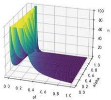

<details>
<summary>surface_3d</summary>

| pt   | n    |
|------|------|
| 0.0  | 100  |
| 0.2  | 80   |
| 0.4  | 60   |
| 0.6  | 40   |
| 0.8  | 20   |
| 1.0  | 10   |
</details>

图1

理想情况下， $p_{1}$ 应当控制在0.13-0.15左右，而n应当小于100。求得 $(n,c)$ 数对如下：

$$
[ 6 5, 4 ], [ 4 2, 2 ], [ 2 8, 1 ], [ 9 1, 7 ]
$$

方法二：

若 $p = 0.1 \leq p_1$ ，则错判为拒收的概率应当小于 $5\%$ ，即

$$
1 - L (p, n, c) \leq \beta
$$

亦即

$$
L (p, n, c) = P (X \leq c) = \sum_ {k = 0} ^ {c} \binom {n} {k} p ^ {k} (1 - p) ^ {n - k} \geq 1 - \beta = 0. 9 5
$$

那么对于某个 n, c 应当有一个极限值 $c_{0}$ ，使上式取等，由于 n 重伯努利分布对应的横坐标为整数，故 $c_{0}$ 也为整数，合格的 $c_{0}$ 所对应的抽样概率 $L(p, n, c_{0})$ 应当尽可能接近 0.95，人为规定误差为 1%，那么可以列出

$$
\begin{array}{l} L (p, n, c) \geq 0. 9 5 \dots \dots (c \geq c _ {0}) \\ \frac {L (p , n , c _ {0}) - 0 . 9 5}{0 . 9 5} \leq 0. 0 1 \\ \end{array}
$$

由此遍历 n 值（一般小于 100 较为合适），若存在 $c_{0}$ 满足以上不等式，则对应的 $(n, c_{0})$ 数对即为所得抽样方案。所有可行的 $(n, c_{0})$ 数对如下：

$$
[ 1 4, 3 ], [ 2 0, 4 ], [ 2 7, 5 ], [ 3 3, 6 ], [ 3 4, 6 ], [ 4 0, 7 ], [ 4 1, 7 ], [ 4 7, 8 ], [ 4 8, 8 ], [ 5 5, 9 ], [ 5 6, 9 ], [ 6 2, 1 0 ],
$$

$$
[ 6 3, 1 0 ], [ 7 0, 1 1 ], [ 7 1, 1 1 ], [ 7 7, 1 2 ], [ 7 8, 1 2 ], [ 7 9, 1 2 ], [ 8 5, 1 3 ], [ 8 6, 1 3 ], [ 9 3, 1 4 ], [ 9 4, 1 4 ]
$$

# 5.1.7 问题1（2）的求解

未知数为 $p_1$ 和 $\beta$ 。

方法一：

通过遍历 $p_1$ 和 $\beta$ 得到 $\mathbf{n}$ 的最小值。同理

$$
n _ {m i n} = \frac {[ Z (\alpha) \sqrt {p _ {0} (1 - p _ {0})} - Z (1 - \beta) \sqrt {p _ {1} (1 - p _ {1})} ] ^ {2}}{(p _ {1} - p _ {0}) ^ {2}}
$$

同样，以 $p_{1}$ 和 $\beta$ 为横、纵坐标，n 为纵坐标，作出二维函数图。

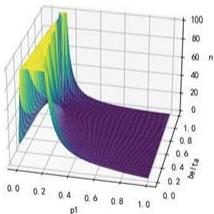

<details>
<summary>area_stacked</summary>

| p1   | n    |
|------|------|
| 0.0  | 0.0  |
| 0.2  | 20.0 |
| 0.4  | 60.0 |
| 0.6  | 80.0 |
| 0.8  | 90.0 |
| 1.0  | 100.0 |
</details>

图2

同理，理想情况下， $p_{1}$ 应当控制在 0.15 左右，而 n 应当小于 100。求得 $(n,c)$ 数对如下：

$$
[ 6 8, 1 0 ], [ 5 2, 8 ], [ 5 5, 1 3 ]
$$

方法二：

同问题一（1），若 $p = 0.1 \geq p_0$ ，则错判为接受的概率应当小于 $10\%$ ，即

$$
L (p, n, c) \leq \alpha
$$

亦即

$$
L (p, n, c) = P (X \leq c) = \sum_ {k = 0} ^ {c} \binom {n} {k} p ^ {k} (1 - p) ^ {n - k} \leq \alpha = 0. 1
$$

同样的，对于某个 n 值，应当存在一个 $c_{0}$ 值，满足下述不等式

$$
L (p, n, c) \leq 0. 1 \dots \dots (c \leq c _ {0})
$$

$$
\frac {0 . 1 - L (p , n , c _ {0})}{0 . 1} <   0. 0 1
$$

遍历 n，求得 $(n,c)$ 数对如下：

$$
[ 6 5, 3 ], [ 7 8, 4 ]
$$

# 5.1.8 小结

结果表明实际应用过程中经常使用的 $(n,c)$ 抽样法较简单随机抽样优 $((n,c)$ 数对的意思为判断 n 件产品中次品数是否超过 c，若超过则不接受，若不超过则接受）。

# 5.2 问题二的求解

# 5.2.1 未知数假设

对于决策 1，有四种情况，即两种零配件都检验、都不检验、只检验零配件 1、只检验零配件 2。考虑到从决策 2 开始，都只考虑成品，决策过程相似，故将决策 1 的四种情况合并，并对每项决策都设计检验参数来模拟是否检验产品。

对于零配件 1，其检验参数设为 $x_{1}$ ，其值为 1 则对零配件 1 检验，其值为 0 则不对零配件 1 检验；

对于零配件 2，其检验参数设为 $x_{2}$ ，意义同理；

成品的检验参数设为 $x_{3}$ ，由于决策2考虑的是每件成品，故该参数应为介于0到1中的某个值，其实际意义为对占比为 $x_{3}$ 的成品进行检验。

# 5.2.2 模型建立

Step1.

首先，对于两种零配件，企业花费的购买价格为

$$
M _ {b} = n _ {1} M _ {1} + n _ {2} M _ {2}
$$

两种零配件的检验个数为

$$
n _ {1} ^ {\prime} = n _ {1} x _ {1}, n _ {2} ^ {\prime} = n _ {2} x _ {2}
$$

两种零配件的检验成本为

$$
M _ {t _ {1}} = n _ {1} x _ {1} T _ {1} + n _ {2} x _ {2} T _ {2}
$$

最终进入成品装配的两种零配件的个数为

$$
n _ {1} ^ {\prime \prime} = n _ {1} (1 - x _ {1}) + n _ {1} x _ {1} (1 - P _ {1})
$$

$$
n _ {2} ^ {\prime \prime} = n _ {2} (1 - x _ {2}) + n _ {2} x _ {2} (1 - P _ {2})
$$

两种零配件丢弃的个数为

$$
n _ {1} = n _ {1} x _ {1} P _ {1}, n _ {2} = n _ {2} x _ {2} P _ {2}
$$

零件更新流程图如下。

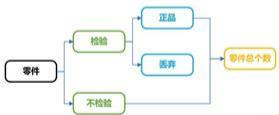

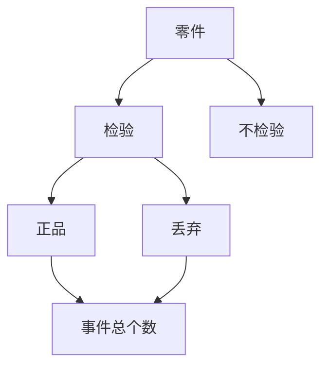

图3

其中两种零配件的合格数为

$$
n _ {1} ^ {*} = n _ {1} (1 - P _ {1}), n _ {2} ^ {*} = n _ {2} (1 - P _ {2})
$$

则两种零配件的新次品率为

$$
P _ {1} ^ {*} = \frac {P _ {1} (1 - x _ {1})}{1 - x _ {1} P _ {1}}, P _ {2} ^ {*} = \frac {P _ {2} (1 - x _ {2})}{1 - x _ {2} P _ {2}}
$$

成品个数为

$$
n = \min (n _ {1} ^ {\prime \prime}, n _ {2} ^ {\prime \prime})
$$

因为现在零配件1的次品率为 $P_{1}^{*}$ ，零配件2的次品率为 $P_{2}^{*}$ ，两个正品零配件装配成功的概率为 $1 - P_{3}$ ，则这些成品的正品率为

$$
(1 - P _ {1} ^ {*}) (1 - P _ {2} ^ {*}) (1 - P _ {3})
$$

这些成品的次品率为

$$
P _ {3} ^ {*} = 1 - (1 - P _ {1} ^ {*}) (1 - P _ {2} ^ {*}) (1 - P _ {3})
$$

Step2.

检测成品的个数为

$$
n ^ {\prime} = n x _ {3}
$$

成品的检测成本为

$$
M _ {t _ {2}} = n x _ {3} T _ {0}
$$

则可以直接售卖并盈利的成品个数为

$$
n _ {p} = n x _ {3} (1 - P _ {3} ^ {*}) + n (1 - x _ {3}) (1 - P _ {3} ^ {*})
$$

盈利的收入为

$$
M _ {p} = \left[ n x _ {3} \left(1 - P _ {3} ^ {*}\right) + n \left(1 - x _ {3}\right) \left(1 - P _ {3} ^ {*}\right) \right] M _ {0}
$$

检测过的成品中, 不合格数为

$$
n ^ {\prime \prime} = n x _ {3} P _ {3} ^ {*}
$$

Step3.

设其中需要拆解的比例为 $x_{4}$ ，则拆解的数目为

$$
n _ {d m _ {1}} = n x _ {3} P _ {3} ^ {*} x _ {4}
$$

拆解花费为

$$
M _ {d m _ {1}} = n x _ {3} P _ {3} ^ {*} x _ {4} D _ {0}
$$

直接丢弃的数目为

$$
n _ {d c _ {1}} = n x _ {3} P _ {3} ^ {*} (1 - x _ {4})
$$

Step4.

未检测过的成品个数为

$$
n _ {t} = n (1 - x _ {3})
$$

其中不合格成品数为

$$
n _ {t 1} = n (1 - x _ {3}) P _ {3} ^ {*}
$$

这些不合格产品产生的调换费用为

$$
M _ {e} = n (1 - x _ {3}) P _ {3} ^ {*} C _ {0}
$$

调换回企业后，设这些不合格产品决定拆解的比例为 $x_{5}$ ，则拆解费用为

$$
M _ {d m _ {2}} = n (1 - x _ {3}) P _ {3} ^ {*} x _ {5} H _ {0}
$$

直接丢弃的数目为

$$
n _ {d c _ {2}} = n (1 - x _ {3}) P _ {3} ^ {*} (1 - x _ {5})
$$

# 5.2.3 成品决策的流程图

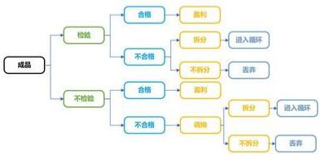

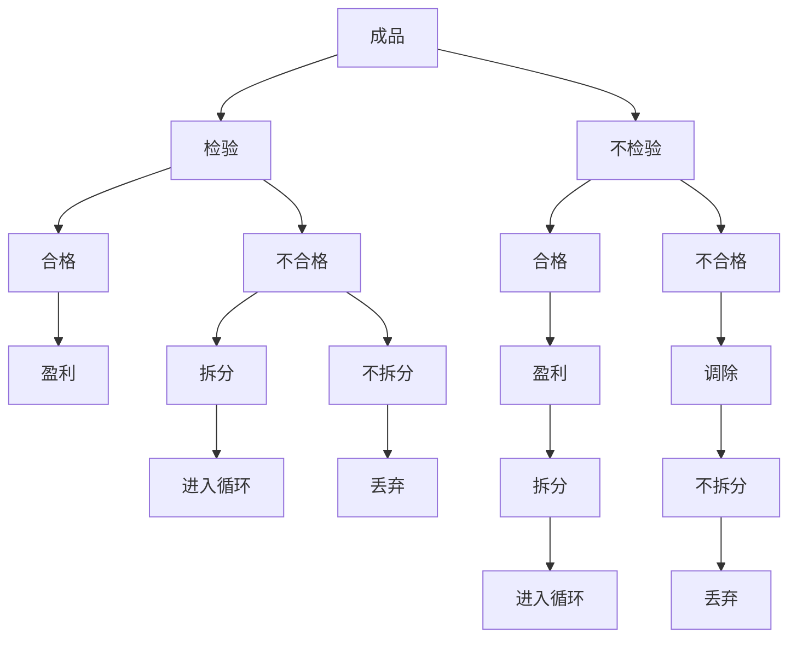

图4

# 5.2.4 生产过程中检验与否的讨论

若某批零件有一定的次品率，即不能 $100\%$ 确定它是正品还是次品。如果由某零件生产的产品是次品，那么也无法确定该产品拆解得到的零件是否为次品。进一步讲即使检测了一部分，但生产时又将检测出来的正品零件和未知质量的零件混合，即使拆解也无法确定哪些是正品，哪些是次品了。故不能省去关键的检测步骤。（与问题三的第二个小循环的情形存在差异）

# 5.2.5 决策指标计算

在这个过程中，销售收入（即盈利收入）为

$$
M _ {p} = n (1 - P _ {3} ^ {*}) M _ {0}
$$

检测费用为

$$
M _ {T} = n _ {1} x _ {1} T _ {1} + n _ {2} x _ {2} T _ {2} + n _ {3} x _ {3} T _ {3}
$$

装配成本为

$$
M _ {a} = n H _ {0}
$$

拆解成本为

$$
M _ {d m} = n x _ {3} P _ {3} ^ {*} x _ {4} D _ {0} + n (1 - x _ {3}) P _ {3} ^ {*} x _ {5} D _ {0}
$$

考虑三个决策指标: 直接盈利值(销售收入-检测成本-产品购买成本-拆解成本-装配成本)、不合格成品调换费用（包括了物流成本、企业信誉等）、环保性（丢弃产品的价值）。

其中调换费用虽然直接包含了有形的金钱损失，但也包括了无形的企业信誉，所以单独作为一个指标衡量。分别设为 $m_{1}$ 、 $m_{2}$ 、 $m_{3}$ 。则

$$
\begin{array}{l} m _ {1} = n \left(1 - P _ {3} ^ {*}\right) M _ {0} - \left(n _ {1} x _ {1} T _ {1} + n _ {2} x _ {2} T _ {2} + n _ {3} x _ {3} T _ {3}\right) - \\ \left(n _ {1} M _ {1} + n _ {2} M _ {2}\right) - \left[ n x _ {3} P _ {3} ^ {*} x _ {4} D _ {0} + n (1 - x _ {3}) P _ {3} ^ {*} x _ {5} D _ {0} \right] - n H _ {0} \\ \end{array}
$$

$$
m _ {2} = n (1 - x _ {3}) P _ {3} ^ {*} C _ {0}
$$

$$
m _ {3} = n _ {1} x _ {1} P _ {1} M _ {1} + n _ {2} x _ {2} P _ {2} M _ {2} + \left[ n x _ {3} P _ {3} ^ {*} (1 - x _ {4}) + n (1 - x _ {3}) P _ {3} ^ {*} (1 - x _ {5}) \right] \left(M _ {1} + M _ {2} + H _ {0}\right)
$$

# 5.2.6 整体流程图

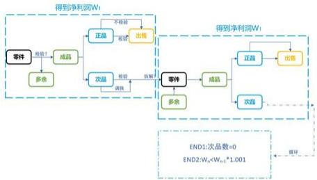


图 5

# 5.2.7 拆解后的处理

前述的讨论可以视作首次循环，为了最大化利用拆解后的产品，可以把拆解后的产品重新投入使用。对此又产生了新的决策分支：1. 对这些拆解后的产品全部进行检测，若检测合格则重新装配出售；2. 不检测，直接重新投入使用，但这些拆解后的产品次品率必然较大，故通过购买更多零配件以降下次品率，即进入第二层次循环。

对于决策 1，可以对首次循环的检测情况作出优化：如果对零配件 1、零配件 2 都检测，则进入参与成品生产的零配件均为正品，拆解后不需要进行检测，直接重新装配出售，节省了二次检测成本；对于其他三种情况，无法确定拆解后的零配件是否为次品，需要进行二次检测。

以上为理论最优情形，但在仿真过程中，考虑到现实处理的便利与变量分析的统一，对所有不合格产品（包括直接检测的和用户退回的）设定一个统一的拆解比例 $x = x_{4} = x_{5}$ ，再对拆解后得到的零件1和零件2分别设置一个额外的检测比例 $x_{6}, x_{7}$ ，并且从程序可行性角度出发，不严格设定 $x_{1}, x_{2}$ 的值为0或1，而是等同于其他检测比例，可以在 $0 \sim 1$ 间变动。

# 5.2.8 进一步的循环与退火算法

由于拆解这一步骤影响下一个循环，所以将第 n 轮循环最后的拆解步骤并入第 $n+1$ 轮循环的起始步骤以便分析与处理。第 $n+1$ 轮循环起始所具有的零配件应当为第 n 轮循环起始所余下的零配件和第 n 轮循环末尾拆解所得到的零配件，在该模型中，并不接续加入新零配件，即不考虑决策 2。那么循环应当迅速收敛，因为每一轮循环后配件数会大大减少，三个指标值也会迅速减少。该猜想符合实际的仿真过程。

具体算法上，现在有三个决策指标 $m_{1}$ 、 $m_{2}$ 、 $m_{3}$ ，需要进行优化的变量可以写成如下数组形式

$$
X = \left[ x _ {1}, x _ {2}, x _ {3}, x _ {4}, x _ {5}, x _ {6} x _ {7} \right]
$$

其中

$x_{1}=$ 是否对零件1进行检验

$x_{2}=$ 是否对零件2进行检验

$x_{3}=$ 是否对成品进行检验

$x_{4}=$ 是否对检验过的成品中的次品进行拆解

$x_{5}=$ 是否对退回的成品进行拆解

$x_{6}=$ 是否对拆解后得到的零件1进行检验

$x_{7}=$ 是否对拆解后得到的零件2进行检验

且一般假定 $x_{4}=x_{5}$ 。

对于多变量决策问题，可以采用模拟退火算法来优化变量矩阵 X。对于某个 X，每一轮循环都会得到三个指标值，即直接盈利值、调换费用、环保性，将这三个值累加到最终决策指标 $m_{1}$ 、 $m_{2}$ 、 $m_{3}$ 上。这三个指标中， $m_{1}$ 的重要性最大，而且数值比重也最大，故将中止循环的条件设为

$$
m _ {n + 1} \leq 1. 0 0 1 m _ {n}
$$

(意为盈利达到饱和，继续循环的意义不大，如若继续循环，甚至会亏本) 或

第 n 次循环拆解数 = 0

故对于某个 X，在进行若干轮循环后，盈利值达到饱和（实际 $3 \sim 8$ 轮即接近饱和），同时对应一个调换费用和一个环保性（这两个指标越低越好），仿真的目标即为找到一个 X，使盈利值尽可能大，调换费用和环保性尽可能小。

# 5.2.9 仿真结果分析

仿真结果非常理想，而且存在以下特点：

1. 尽管初始设定 $x_{1}$ 、 $x_{2}$ 的值可变，但结果值总取在 0 或 1，即决策 1 的四种情况。

2. $x_{3}$ 、 $x_{4}$ （或 $x_{5}$ ）的结果值同样取在0或1，即要么都检测要么都不检测。

3. $x_{6}$ 、 $x_{7}$ 的值对最终结果影响非常小，大约在2～3%，同时题干也并未要求对此进行讨论，可以视作过程量弱化其讨论结果，忽略不计。

# 5.2.10 最终结果与决策

仿真初始的两种零配件数量级设为 10000，所得最优的 6 个 X 与对应的企业净盈利值如下表。（将 $x_{4}$ 、 $x_{5}$ 合并后 X 的长度由 7 变为 6）

表1

<table><tr><td>情况</td><td>1</td><td>2</td><td>3</td><td>4</td><td>5</td><td>6</td></tr><tr><td>X</td><td>100101</td><td>110100</td><td>001111</td><td>111100</td><td>011110</td><td>000011</td></tr><tr><td>净盈利值</td><td>168993.2</td><td>95995</td><td>147894</td><td>117979</td><td>186483</td><td>185867</td></tr></table>

该表的对应决策如下：

(1) 只检验零配件 1, 不检验零配件 2, 不检验成品, 对所有不合格成品进行拆解。不检验拆解后得到的零配件 1, 检验拆解后得到的零配件 2。

(2) 对零配件 1、2 都检验，不检验成品，对所有不合格成品进行拆解。不检验拆解后得到的零配件。

(3) 对零配件 1、2 都不检验，检验全部成品，对所有不合格成品进行拆解。检验所有拆解后得到的两种零配件。

（4）对零配件 1、2 都检验，检验全部成品，对所有不合格成品进行拆解。不检验拆解后得到的零配件。

(5) 不检验零配件 1, 只检验零配件 2, 检验全部成品, 对所有不合格成品进行拆解。检验拆解后得到的零配件 1, 不检验拆解后得到的零配件 2。

(6) 对零配件 1、2 都不检验，不检验成品，不拆解所有不合格成品。

# 5.2.11 小结

从结果中可见，当调换费用远大于成品检查费用时，期望进行成品检查，当次品率较大时，期望检查购买所得零件。

# 5.2.12 算法合理性解释

模拟退火的某次优化过程如下图。

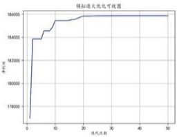

<details>
<summary>line</summary>

模拟放大优化可视图
| 进代次数 | 单位值 |
| :--- | :--- |
| 0 | 176000 |
| 5 | 184000 |
| 10 | 185000 |
| 15 | 185500 |
| 20 | 185700 |
| 25 | 185800 |
| 30 | 185900 |
| 35 | 186000 |
| 40 | 186000 |
| 45 | 186000 |
| 50 | 186000 |
</details>

图6

从图中可见，只有当 $x_{i}$ 取到极值（0 或 1）时，才会达到最优的收敛值。

# 5.3 问题三的求解

# 5.3.1 决策模型的建立

分析过程同问题二，区别在于决策变量 x 增多，令决策矩阵

$$
X = \left[ x _ {1}, \dots , x _ {1 6} \right]
$$

这些决策变量分别代表是否对8个零配件进行检验、是否对3个半成品进行检验、是否对成品进行检验、是否对三个半成品进行拆解、是否对成品进行拆解。同理，优化后的决策变量很可能只取0或1，但为了完成模拟退火的优化过程，允许其值在 $0\sim 1$ 之间浮动。

具体决策过程如下。

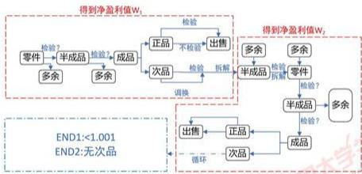

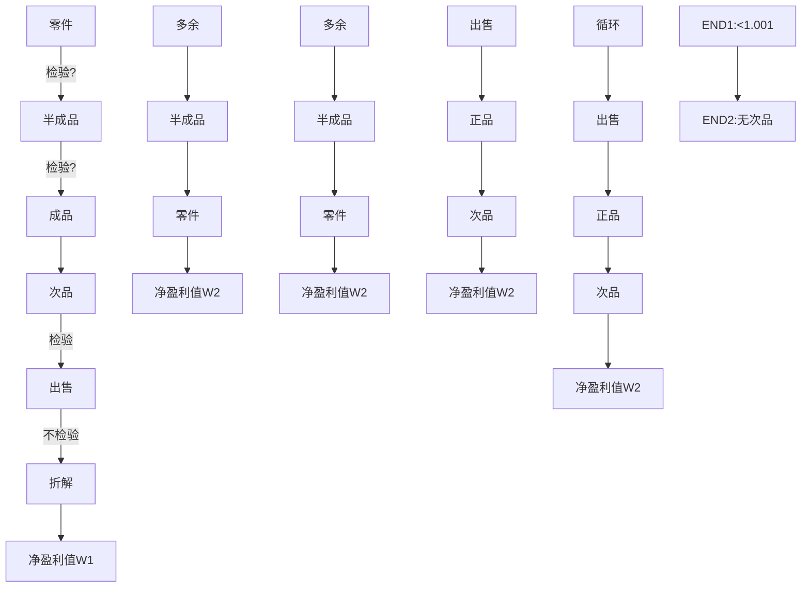

图7

# 5.3.2 第一次小循环

首先在零件组成半成品时，会有多余的零件；在半成品组成成品时，会有多余的半成品；成品同样分为正品和次品（或者检验部分和不检验部分）。每一步都包含是否检验的决策参数。对于成品中的正品，可以直接出售盈利，并视作第一次循环停止，算出该循环内的直接盈利值 $W_{1}$ 。

# 5.3.3 第二次小循环

对于成品中的次品，可以决定是否拆解，拆解得到的半成品进入第二次循环，在这些半成品中加入第一次循环得到的多余半成品，并决定是否对这些半成品进行检验和拆解，对拆解出来的零件（并加入第一次循环多余的零件）重新组成半成品，再组成成品，最后正品出售盈利，次品重新进入循环。在第二次循环中同样可以得到一个直接盈利值 $W_{2}$ ，这两个盈利值之和为一个大循环得到的总直接盈利值 $W_{3}$ ，判断是否进入下一个循环的条件类似题二，即 $W_{3n+1}$ 是否小于 $1.001W_{3n}$ 或者是否产生了次品。

# 5.3.4 模型的优化

但该模型存在需要优化的地方，经过仔细分析后，将模型优化如下。

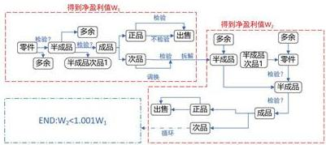

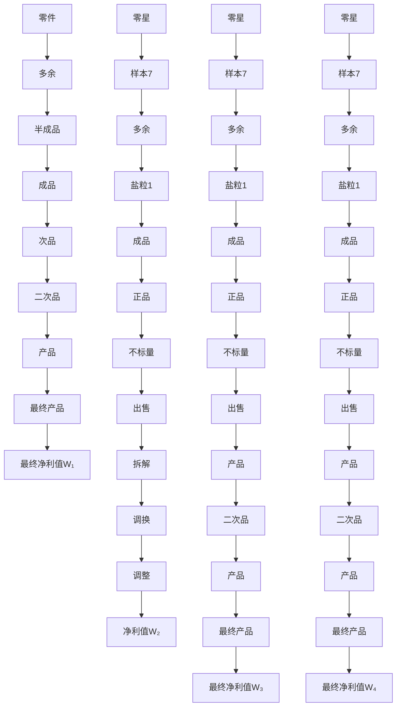

图8

在优化前的模型中，进入第二个小循环的半成品拆解再组装，是一个重复步骤，故去掉该决策，而是只对已经检验出来的半成品次品进行拆解，在第二次组成半成品时加入这些半成品，再组装成成品进行第二次出售。

# 5.3.5 决策变量的优化

显然以上步骤并不止16个决策变量，而是27个（需要加上第二次循环中，是否对8个零件进行检验、是否对3个半成品进行检验）。但通过分析可以发现，若第一次循环已经对产品进行检验，在第二次循环中不必进行再次检验，反之亦然。所以实际上只需考虑16个决策变量。

在求解过程中发现，这些变量中，起到决定性作用的变量只有前12个，即是否对零配件、半成品、成品进行检验，而是否拆解的决策重要性并不强。

# 5.3.6 线性退火算法求解

求解过程依旧采用退火算法（设置初始零件为10000套），求得最优结果如下。

表 2

<table><tr><td>答案</td><td>1</td><td>2</td></tr><tr><td>X</td><td>1111111100011111</td><td>1111111111100001</td></tr><tr><td>净盈利值</td><td>448518</td><td>435188</td></tr></table>

转化为文字决策，即

(1)8 种零件都检测，3 种半成品都不检测，检测全部成品。次品（包括 3 种半成品以及成品）全部拆解。  
(2)8 种零件都检测，3 种半成品都检测，不检测成品。对于次品，不拆解半成品，拆解全部成品。

# 5.3.7 小结

以上给出的两种最优方案有细微差别。最终盈利值较小（即第二种）的方案收敛较快，可以视作短期决策。最终盈利值较大（即第一种）的方案收敛较慢，可以视作长期决策。两种决策的利润曲线如下。

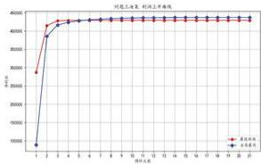

<details>
<summary>line</summary>

区间, 工具类型, 利润上开调情况
| 时间 | 数值 (单位: 元) |
|---|---|
| 1 | 50000 |
| 2 | 40000 |
| 3 | 42000 |
| 4 | 43000 |
| 5 | 43500 |
| 6 | 43800 |
| 7 | 44000 |
| 8 | 44200 |
| 9 | 44300 |
| 10 | 44400 |
| 11 | 44500 |
| 12 | 44600 |
| 13 | 44700 |
| 14 | 44800 |
| 15 | 44900 |
| 16 | 45000 |
| 17 | 45100 |
| 18 | 45200 |
| 19 | 45300 |
| 20 | 45400 |
</details>

图9

从图中可见，方案二在第三轮循环即达到收敛，方案一在第十轮循环后达到收敛。即企业若想达到最大利润，不考虑循环的时间成本，方案一较优。

# 5.4 问题四的求解

假设若根据简单随机抽样得到某次品率，可以使用贝叶斯统计推断来估计零件的真实次品率。该方法结合先验信息（可能的次品率分布）和抽样数据的似然函数来（二项分布）计算后验概率分布，从而得到零件真实的次品率。

# 5.4.1 先验分布

首先假设真实的次品率服从Beta分布，即先验分布。（Beta分布具有较好的性质，适于表示在[0,1]区间上各种形状的概率分布。因为它具有良好的形状灵活性，能够很好地描述对参数的先验认识，在贝叶斯统计中，Beta分布常常被用作先验分布。）Beta函数的定义为

$$
B (\alpha , \beta) = \int_ {0} ^ {1} u ^ {\alpha - 1} (1 - u) ^ {\beta - 1} d u
$$

Beta分布的均值和方差分别为

$$
\begin{array}{l} \mu = \frac {\alpha}{\alpha + \beta} \\ \sigma^ {2} = \frac {\alpha \beta}{(\alpha + \beta) ^ {2} (\alpha + \beta + 1)} \\ \end{array}
$$

归一化后得到的次品概率密度分布函数

$$
p (\theta) = f (\theta ; \alpha , \beta) = \frac {\theta^ {\alpha - 1} (1 - \theta) ^ {\beta - 1}}{B (\alpha , \beta)}
$$

# 5.4.2 似然函数

抽样数据服从二项分布，若次品率为 $\theta$ ，抽样 n 次，则出现 c 次次品的概率可以表示为

$$
L (\theta , c) = \binom {n} {c} \theta^ {c} (1 - \theta) ^ {n - c}
$$

# 5.4.3 后验概率

最后利用贝叶斯公式计算后验分布，并通过后验均值（即后验分布的最可能值）来估计真实的次品率，从而得到可能的真实次品率以及对应的置信度。积分形式下贝叶斯公式为

$$
P (\theta | c) = \frac {L (\theta | c) p (\theta)}{\int L (\theta | c) p (\theta) \mathrm{d} \theta}
$$

对于连续的参数变量 $\theta$ ，其后验概率密度即为 $P(\theta|c)$ 。

为计算以上公式，需要设定 $\alpha$ 、 $\beta$ 的初始值。其取值大小取决于对参数的信心程度。取值较小时，即对参数的先验知识不强，从而准许更多可能性；取值较大时，即对参数的先验性较强，对概率分布情况更有信心。参数的选择可以显著影响最终的后验分布，从而影响对真实参数的估计结果。

在贝叶斯推断中，通常会根据先验信息和信念程度来选择合适的先验分布参数 alpha 和 beta。根据似然原则，令先验函数与似然函数成比例，则

$$
\begin{array}{l} \alpha - 1 = c \\ \beta - 1 = n - c \\ \end{array}
$$

带入贝叶斯公式，得到二项分布数据的后验概率密度函数

$$
P (\theta | c) = \frac {\theta^ {\bar {\alpha} - 1} (1 - \theta) ^ {\bar {\beta} - 1}}{B (\bar {\alpha} , \bar {\beta})}
$$

其中

$$
\bar {\alpha} = \alpha + c
$$

$$
\bar {\beta} = \beta + n - c
$$

# 5.4.4 模拟仿真求解不同次品率的后验概率分布

例如，令 $n = 10000, c = 500$ ，则抽样得到的次品率为 $5.0\%$ ，可能的真实次品率均值为0.05008980243464378，置信度为0.95可能的真实次品率置信区间为[0.04590519,0.05444447]。同样若抽样得到的次品率为 $20.0\%$ ，可能的真实次品率均值为0.19976052684094991，置信度为0.95的可能的真实次品率置信区间为[0.19199026,0.20764429]。若抽样得到的次品率为 $10.0\%$ ，可能的真实次品率均值为0.09998004390341249，置信度为0.95的可能的真实次品率置信区间为[0.09418352,0.10592778]。

抽样后次品率为 5.0%、10% 和 20% 的后验概率分布图如下。

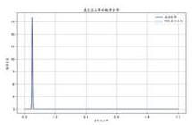

<details>
<summary>line</summary>

| 时间 | 2019 | 2020 |
|---|---|---|
| 0.0 | 15.0 | 0.0 |
| 0.1 | 0.0 | 0.0 |
| 0.2 | 0.0 | 0.0 |
| 0.3 | 0.0 | 0.0 |
| 0.4 | 0.0 | 0.0 |
| 0.5 | 0.0 | 0.0 |
| 0.6 | 0.0 | 0.0 |
| 0.7 | 0.0 | 0.0 |
| 0.8 | 0.0 | 0.0 |
| 0.9 | 0.0 | 0.0 |
| 1.0 | 0.0 | 0.0 |
</details>

(a) 次品率为 0.05

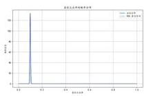

<details>
<summary>line</summary>

最近大值序列频率分布
| 时间点 | 数值 |
|---|---|
| 0.1 | 100 |
| 0.2 | 5 |
| 0.3 | 2 |
| 0.4 | 1 |
| 0.5 | 0 |
| 0.6 | 0 |
| 0.7 | 0 |
| 0.8 | 0 |
| 0.9 | 0 |
| 1.0 | 0 |
</details>

(b) 次品率为 0.1

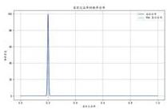

<details>
<summary>line</summary>

| Date       | Value |
| ---------- | ----- |
| 0.7        | 1.0   |
</details>

(c) 次品率为 0.2  
图10

# 5.4.5 重新求解问题二、三

最终的结果相当于在原有确定概率上加入了微扰。将扰动后的0.95概率置信区间的两个端点值作为新的次品率，重新进行问题二、问题三的操作，所得结果如下：

(1) 对于问题二，在 0.95 置信区间下，所得决策不变，即 5.2.10 的六种决策方案。  
(2) 对于问题三，在 0.95 置信区间下，所得决策亦不变，即 5.3.6 的两种决策方案。决策矩阵分别为 $[1,1,1,1,1,1,1,1,0,0,0,1,1,1,1,1]$ 、 $[1,1,1,1,1,1,1,1,1,1,1,0,0,0,0,1]$ 。若带入置

信区间的左侧值，两种决策方案所得利润值分别为：448491.9298575758、436619.5888。若带入置信区间的右侧值，两种决策方案所得利润值分别为：425153.86094869545、421234.6082。

(3) 对于问题三，画出两种不同扰动的利润上升曲线如下，可见特征依旧符合原来问题三的结论。

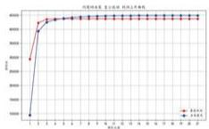

<details>
<summary>line</summary>

| 时间 | 标准线 (值) | 标准线 (标准线) |
|---|---|---|
| 1 | 35000 | 10000 |
| 2 | 45000 | 40000 |
| 3 | 48000 | 45000 |
| 4 | 49000 | 47000 |
| 5 | 49500 | 48000 |
| 6 | 49800 | 48500 |
| 7 | 49900 | 49000 |
| 8 | 49950 | 49200 |
| 9 | 49980 | 49300 |
| 10 | 49990 | 49400 |
| 11 | 49995 | 49500 |
| 12 | 49998 | 49550 |
| 13 | 49999 | 49600 |
| 14 | 49999.5 | 49650 |
| 15 | 49999.8 | 49700 |
| 16 | 49999.9 | 49750 |
| 17 | 49999.95 | 49800 |
| 18 | 49999.98 | 49850 |
| 19 | 49999.99 | 49880 |
| 20 | 49999.995 | 49900 |
</details>

(a)

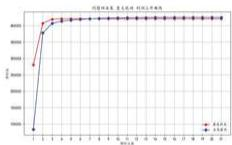

<details>
<summary>line</summary>

月度销量及成本变动趋势图
| 类别 | 数值 |
|---|---|
| 1 | 5000 |
| 2 | 30000 |
| 3 | 40000 |
| 4 | 45000 |
| 5 | 47000 |
| 6 | 48000 |
| 7 | 49000 |
| 8 | 49500 |
| 9 | 49700 |
| 10 | 49800 |
| 11 | 49900 |
| 12 | 49950 |
| 13 | 49970 |
| 14 | 49980 |
| 15 | 49990 |
| 16 | 49995 |
| 17 | 49997 |
| 18 | 49998 |
| 19 | 49999 |
| 20 | 50000 |
</details>

(b)   
图 11

# 5.4.6 小结

在0.95置信区间下，决策并未发生显著改变，说明本题的随机抽样不会对决策结果、净利润有较大影响。

# 6 模型改进

（1）问题三决策变量较多，传统的模拟退火、禁忌搜索蚁群算法、遗传算法等，效果无法达到预期。  
(2) 问题三更改了模拟退火算法中一些关键函数，从而可以使用优化后的遗传算法，即类似于最速粒子群算法和飞蛾扑火算法，但即使这两个算法在特定情况下结果比较好，情况依然非常多。  
(3) 预期在这两个算法的基础上，使用最速粒子群算法得到一个更好的快速迭代方法。

# 7 模型优缺点评价

# 7.1 模型优点

（1）模型的稳定性：第二问和第三问分成两个模块，多个步骤，不需要考虑扰动的问题，本文的模型给出了期望值，并且十分准确。第四问加入扰动，但决策结果不变，证明模型至少有95%以上的抗扰动能力。且模型随着加工的零件和产品数目上升，越来越稳定。  
(2) 模型的灵敏性：问题二使用模拟退火算法可以收敛到局部最优解。通过多次使用模拟退火可以筛选出一两个备用的决策，发现在几个情况下最优的决策比次优的决策仅仅高出0.012的利润。

(3) 算法：本文模型是一个线性进程，有多个步骤，每个步骤都是一个循环。于是可以无限循环迭代。而且使用了非传统的线性模拟退火。筛选出最优解以及几个备用决策，把备用的决策再验算，便得出正确的解。

# 7.2 模型缺点

(1) 迭代过程中有部分决策过程不合适，但是最终结果正确。  
(2) 通过模型，整个仿真过程转化成不断迭代的线性进程。但该模型忽视了一种情况，一般在生产中会优先使用检测出来的正品，但模型中存在检测到的是正品，又对其拆解的情况。但最后迭代得出的结果表明该现象为算法区域机制，对于最终结果不存在任何影响。  
（3）生产规模很小的情况下，决策不一定最好，因为模型建立在 10000 套的基础上，更适用于常规规模。

# 8 参考文献

# 参考文献

[1] 孙小素, 尚书钰. 计数标准型一次抽样检验方案设计方法探讨 兼议 GB/T 13262 2008 改进问题 [J]. 山东工商学院学报, 2024, 38(01): 69-76.

# 9 附录

# 9.1 程序结果汇总

# 9.2 代码汇总

```python
from scipy.stats import norm
import math
import random
import matplotlib.pyplot as plt
import numpy as np

plt.rcParams['font.sans-serif'] = ['KaiTi']
plt.rcParams['axes.unicode_minus'] = False

def quantile_value(p):
    # 计算标准正态分布的第p分位数值
    value = norm.ppf(p)
    return value

def get_n(p0, p1, alpha, beta):
    swap_n = quantile_value(1 - alpha) * math.sqrt(p0 * (1 - p0)) - quantile_value(beta)
    * math.sqrt(p1 * (1 - p1))
    swap_n /= p1 - p0
    return swap_n ** 2 if swap_n ** 2 < 100 else 100 
```

```python
def get_c(p0, p1, alpha, belta, n):
    # print(p0, p1, alpha, belta, n)
    l_value = n * p1 + quantile_value(belta) * math.sqrt(n * p1 * (1 - p1))
    r_value = n * p0 + quantile_value(1 - alpha) * math.sqrt(n * p0 * (1 - p0))
    return l_value, r_value

def get_ans(p1, belta):
    n = get_n(p0, p1, alpha, belta)
    c_l, c_r = get_c(p0, p1, alpha, belta, n)
    # print(n, c_l, c_r)
    return n, c_l

def get_ans_n(p1, belta):
    n = get_n(p0, p1, alpha, belta)
    c_l, c_r = get_c(p0, p1, alpha, belta, n)
    # print(n, c_l, c_r)
    return n

# todo: 问题一，法一
print("问题二，法一")
f1 = open("问题二，法一.txt", mode="w", encoding="utf-8")
p0 = 0.1
beta = 0
p1 = 0
alpha = 0.1
for p1 in [0.001 * _ for _ in range(1, 1000) if 0.001 * _ != p0]:
    for beta in [0.01 * _ for _ in range(1, 100)]: 
    n, c = get_ans(p1, belta)
    if c < 0:
    continue
    fl.write(f^p1 = {p1}, beta = {beta}, 此时n为：{n}, c为：{c}\n")
    # print(f^解为：p1 = {p1}, alpha = {alpha}")
    # print(f"此时n为：{n}, c为：{c}")
x = np.array([0.001 * _ for _ in range(1, 1000) if 0.001 * _ != p0])
y = np.array([0.01 * _ for _ in range(1, 100)])
x, y = np.meshgrid(x, y)
custom_function_vectorized = np.vectorize(get_ans_n)
z = custom_function_vectorized(x, y)

# 创建三维图形对象
fig = plt.figure()
ax = fig.add_subplot(111, projection='3d')

# 绘制三维图形
ax.plot_surface(x, y, z, cmap='viridis')

# 设置坐标轴标签
ax.set_xlabel('p1')
ax.set_ylabel('beta')
ax.set_zlabel('n')
ax.set_title('问题二 方法一')
plt.show() 
```

```python
from scipy.stats import norm
import math
import random
import matplotlib.pyplot as plt
import numpy as np

plt.rcParams['font.sans-serif'] = ['KaiTi']
plt.rcParams['axes.unicode_minus'] = False

def quantile_value(p):
    # 计算标准正态分布的第p分位数值
    value = norm.ppf(p)
    return value

def get_n(p0, p1, alpha, belta):
    swap_n = quantile_value(1 - alpha) * math.sqrt(p0 * (1 - p0)) - quantile_value(belta)
    * math.sqrt(p1 * (1 - p1))
    swap_n /= p1 - p0
    return swap_n ** 2 if swap_n ** 2 < 100 else 100

def get_c(p0, p1, alpha, belta, n):
    l_value = n * p1 + quantile_value(belta) * math.sqrt(n * p1 * (1 - p1))
    r_value = n * p0 + quantile_value(1 - alpha) * math.sqrt(n * p0 * (1 - p0))
    return l_value, r_value

def get_new_ans(p1, alpha, t):
    p1 += 2 * random.random() * math.exp(t - 1000) - math.exp(t - 1000)
    alpha += 2 * random.random() * math.exp(t - 1000) - math.exp(t - 1000)
    return p1, alpha

def get_ans(p1, alpha):
    n = get_n(p0, p1, alpha, belta)
    c_l, c_r = get_c(p0, p1, alpha, belta, n)
    # print(n, c_l, c_r)
    return n, c_l

def get_ans_n(p1, alpha):
    n = get_n(p0, p1, alpha, belta)
    c_l, c_r = get_c(p0, p1, alpha, belta, n)
    # print(n, c_l, c_r)
    return n

def is_ans(p1, alpha):
    if p1 < 0.13 or p1 > 0.19 or p1 <= p0:
    return False
    if alpha < 0 or alpha > 1:
    return False
    return True 
```

```python
def get_p(delta, t):
    # 返回一个无限小的正数，范围为0到1
    # 随着退火次数增加而越来越小
    return math.exp(-delta/t)

    # # todo: 问题一，法一
    # print("问题一，法一")
    # f1 = open("问题一，法一.txt", mode="w", encoding="utf-8")
    # p0 = 0.1
    # delta = 0.05
    # p1 = 0.15
    # alpha = 0.1
    # for pl in [0.001 * _ for _ in range(1, 1000) if 0.001 * _ != p0]:
    # for alpha in [0.01 * _ for _ in range(1, 100)]:
    #    n, c = get_ans(p1, alpha)
    #    if c < 0:
    #    continue
    #    f1.write(f"p1 = {p1}, alpha = {alpha}, , 此时n为：{n}, c为：{c}\n")
    #    # print(f"解为：p1 = {p1}, alpha = {alpha}")
    #    # print(f"此时n为：{n}, c为：{c}")
    # x = np.array([0.001 * _ for _ in range(1, 1000) if 0.001 * _ != p0])
    # y = np.array([0.01 * _ for _ in range(1, 100)])
    # x, y = np.meshgrid(x, y)
    # custom_function_vectorized = np.vectorize(get_ans_n)
    # z = custom_function_vectorized(x, y)
    # # 创建三维图形对象
    # fig = plt.figure()
    # ax = fig.add_subplot(111, projection='3d')
    #
    # # 绘制三维图形
    # ax.plot_surface(x, y, z, cmap='viridis')
    #
    # 设置坐标轴标签
    # ax.set_xlabel('p1')
    # ax.set_ylabel('alpha')
    # ax.set_zlabel('n')
    # ax.set_title('问题一 方法一')
    # ax.set_zlim(0, 10)
    # plt.show()
    
    # t = 1000    # 初始化温度值
    # t_min = 980    # 设置温度下限
    # k = 1000    # 设置迭代次数（有用吗）
    
    # while (t > t_min):
    # for i in range(500):
    # n, c = get_ans(p1, alpha)
    # pl_, alpha_ = get_new_ans(p1, alpha, t)
    # if is_ans(p1_, alpha_):
    # n_, c_ = get_ans(p1_, alpha_)
    # delta = n_ - n 
```

```txt
173
174    # #
175    if c > 0:
176    if delta < 0:
177    p1, alpha = p1_, alpha_
178    else:
179    p = get_p(delta, t)
180    if (p > random.random()):
181    p1, alpha = p1_, alpha_
182
183
184    print(f"当前最优解为: p1 = {p1}, alpha = {alpha}")
185    print(f"此时n为: {n}, c为: {c}")
186    # t = t * alpha    # 温度下降
187    t == 0.01
188
189
190
191
192
193
194
195
196
197
198
199
200
201
202
203
204
205
206
207
208
209
210
211
212
213
214
215
216
217
218
219
220
221
222
223
224
225
226
227
228
229
230
231
232
233
234
235
236
237
238
239
240
241
242
243
244
245
246
247
248
249
250
251
252
253
254
255
256
257
258
259
260
261
262
263
264
265
266
267
268
269
270
271
272
273
274
275
276
277
278
279
280
281
282
283
284
285
286
287
288
289
290
291
292
293
294
295
296
297
298
299
300
301
302
303
304
305
306
307
308
309
310
311
312
313
314
315
316
317
318
319
320
321
322
323
324
325
326
327
328
329
330 
```

传入一维列表，表示样本

:param data\_get:

: return :

补预控

\# todo: 对抽样数据进行检验 检验

data\_get = np.array(data\_get, dtype="int32")

\# 进行z检验

wanna\_p0 = 0.1

no\_num = int((data\_get == 0).sum())

all\_num = len(data\_get)

print(f"次品个数：{no\_num}，整体数目：{all\_num}")

\# 检验一

print("检验一")

\# 'smaller'代表低于alpha时成立，

z\_stat, p\_val = proportions\_ztest(no\_num, all\_num, wanna\_p0, alternative='smaller')
print(f"Z statistic: {x\_stat}, P-value: {p\_val}")

\# 判断原假设

alpha = 0.10

if p\_val < alpha:

print("拒绝零假设：即认为有90%的把握认为次品率低于10%")

else:

print("接受零假设：即认为没有90%的把握认为次品率低于10%")

\# 检验二

print("检验二")

\# 'larger'代表高于alpha时成立，

z\_stat, p\_val = proportions\_ztest(no\_num, all\_num, wanna\_p0, alternative='larger')
print(f"Z statistic: {z\_stat}, P-value:{p\_val}")

\# 判断原假设

alpha = 0.05

if p\_val < alpha:

print("拒绝零假设：即认为有95%的把握认为次品率大于10%")

else:

print("接受零假设：即认为没有95%的把握认为次品率大于10%")

np.random.seed(12845425)

random.seed(10524) # 设置随机数种子，以确保结果可重复

\# todo: 生成合理的样本

#样本总数确定

data\_num = 100000

cipin\_lv = 0.11

##样本生成（应当是二项分布）

\# data\_0\_num = int(data\_num \* cipin\_lv)

\# data\_1\_num = int(data\_num - data\_0\_num)

\# data\_get = np.concatenate((np.zeros(data\_0\_num), np.ones(data\_1\_num)))

```python
# np.random.shuffle(data_get)
# # print{"生成数据：{data_get}")
# 样本生成（正态分布，较大的90%为正品，其余为次品）
data_get = np.random.normal(loc=0, scale=1, size=data_num)  # 均值为0，标准差为1
threshold = np.percentile(data_get, cipin_lv * 100)
data_get[data_get >= threshold] = 1
data_get[data_get != 1] = 0
# print{"生成数据：{data_get}")

# 样本保存
df = pd.DataFrame(data_get, columns=['样本（0为次品，1为合格）'])
f1 = '第一问/问题一数据.xlsx'
df.to_excel(f1, index=False)

print{"样本已成功生成并保存到{f1}文件中。"}
no_num = int((data_get == 0).sum())
all_num = len(data_get)

print{"次品个数：{no_num}, 整体数目：{all_num}")

# todo:尝试不同的抽样方法
# 简单随机抽样，整群抽样，二重抽样

# 载入数据并建检验数据
df = pd.read_excel('第一问/问题一数据.xlsx', sheet_name='Sheet1')
data_get = df['样本（0为次品，1为合格）']
print{"首先进行数据检验，此北产品中合格率为：{np.sum(data_get)/len(data_get)}'}

print{"此北产品中次品率为：{(1 - np.sum(data_get)/len(data_get)) * 100}%')

# todo:简单随机抽样
# 确定抽样比例
data_get = df['样本（0为次品，1为合格）']
no_num = int((data_get == 0).sum())
all_num = len(data_get)

sample_num = all_num * 0.1
# 进行抽样
random_indices = random.sample(range(all_num), int(sample_num))
# print(random_indices)
sample = [data_get[i] for i in random_indices]
print("随机抽样的样本为：", sample)

ztest_func(sample)

# todo:整群抽样
# 依据排序进行分组，10个位一组
data_get = df['样本（0为次品，1为合格）']
all_num = len(data_get)
data_get = [[data_get[_ + _ * 10] for _ in range(10)] for _ in range(int(all_num / 10))
]

# 创建划分好的产品群体
all_num = len(data_get)
sample_num = all_num * 0.1 
```

```python
sample_indices = random.sample(range(all_num), int(sample_num))

# 抽取整个群的产品作为样本
sample = []
for indices in sample_indices:
    sample += data_get[indices]

# 打印抽样结果
print("整群抽样的样本为：", sample)
ztest_func(sample)

# todo: 二重抽样
# 第一阶段抽样
data_get = df['样本（0为次品，1为合格）']
all_num = len(data_get)
sample_num = all_num * 0.5
random_indices = random.sample(range(all_num), int(sample_num))
data_get = [data_get[i] for i in random_indices]
# print("一重抽样的样本为：", data_get)
# 第二阶段抽样
data_get = np.array(data_get)
all_num = len(data_get)
sample_num = all_num * 0.2
random_indices = random.sample(range(all_num), int(sample_num))
sample = [data_get[i] for i in random_indices]
print("二重抽样的最终样本为：", sample)
ztest_func(sample)

# todo: 尝试不同的抽样方法
# 简单随机抽样，整群抽样，二重抽样
import numpy as np
import pandas as pd
from statsmodels.stats.proportion import proportions_ztest
import random

# 载入数据并建检验数据
df = pd.read_excel('第一间/问题一数据.xlsx', sheet_name='Sheet1')
data_get = df['样本（0为次品，1为合格）']
print(f"首先进行数据检验，此批产品中合格率为：{up.sum(data_get)/len(data_get)}")
random.seed(1024) # 设置随机数种子，以确保结果可重复

# todo: 简单随机抽样
# 确定抽样比例
data_get = df['样本（0为次品，1为合格）']
no_num = int((data_get == 0).sum())
all_num = len(data_get)
sample_num = all_num * 0.1
# 进行抽样
random_indices = random.sample(range(all_num), int(sample_num)) 
```

```python
# print(random_indices)
sample = [data_get[i] for i in random_indices]
print("随机抽样的样本为：", sample)

# todo: 整群抽样
# 依据排序进行分组，10个位一组
data_get = df['样本（0为次品，1为合格）']
all_num = len(data_get)
data_get = [[data_get[__ + _ * 10] for __ in range(10)] for __ in range(int(all_num / 10))
]

# 创造划分好的产品群体
all_num = len(data_get)
sample_num = all_num * 0.1
sample_indices = random.sample(range(all_num), int(sample_num))

# 抽取整个群的产品作为样本
sample = []
for indices in sample_indices:
    sample += data_get[indices]

# 打印抽样结果
print("整群抽样的样本为：", sample)

# todo: 二重抽样
# 第一阶段抽样
data_get = df['样本（0为次品，1为合格）']
all_num = len(data_get)
sample_num = all_num * 0.5
random_indices = random.sample(range(all_num), int(sample_num))
data_get = [data_get[i] for i in random_indices]
print("一重抽样的样本为：", data_get)

# 第二阶段抽样
data_get = np.array(data_get)
all_num = len(data_get)
sample_num = all_num * 0.2
random_indices = random.sample(range(all_num), int(sample_num))
sample = [data_get[i] for i in random_indices]
print("二重抽样的最终样本为：", sample)

##
# data_get = np.array(sample)
# # 进行z检验
# wanna_p0 = 0.1
# no_num = int((data_get == 0).sum()) 
```

```python
# all_num = len(data_get)
# print(f"次品个数：{no_num}, 整体数目：{all_num}")
##
##
## 检验一
# print("检验一")
## 'smaller'代表低于alpha时成立，
# z_stat, p_val = proportions_ztest(no_num, all_num, wanna_p0, alternative='smaller')
# print(f"Z statistic: {z_stat}, P-value: {p_val}")
#
##
## 判断原假设
# alpha = 0.05
# if p_val < alpha:
#    print("拒绝零假设：即认为有95%的把握认为次品率低于10%")
# else:
#    print("接受零假设：即没有足够的证据认为次品率低于10%")
##
##
##
## 检验二
# print("检验二")
# # 'larger'代表高于alpha时成立，
# z_stat, p_val = proportions_ztest(no_num, all_num, wanna_p0, alternative='larger')
# print(f"Z statistic: {z_stat}, P-value: {p_val}")
#
##
##
# # 判断原假设
# alpha = 0.10
# if p_val < alpha:
#    print("拒绝零假设：即认为有90%的把握认为次品率大于10%")
# else:
#    print("接受零假设：即没有足够的证据认为次品率大于10%")
#
# todo: 生成合理的样本
import numpy as np
import pandas as pd

# 样本总数确定
data_num = 1000
data_0_num = int(data_num * 0.12)
data_1_num = int(data_num - data_0_num)
# 样本生成
np.random.seed(1024)
data_get = np.concatenate((np.zeros(data_0_num), np.ones(data_1_num)))
np.random.shuffle(data_get)
# 样本保存
df = pd.DataFrame(data_get, columns=['样本（0为次品，1为合格）'])
f1 = '第一问/问题一数据.xlsx'
df.to_excel(f1, index=False)
print(f"样本已成功生成并保存到{f1}文件中。") 
```  
题一代码

```python
import numpy as np
port pandas as pd
port random
port math
port matplotlib.pyplot as plt
port numpy as np
. . . crParams['font.sans-serif'] = ['KaiTi']
. . . crParams['axes.unicode_minus'] = False 
```

def get\_w(data\_list):   
```python
#此处进行仿真，为时间角度考虑，仅循环两次
ans_list = [] 
# todo: 过程函数
def get_new_part(n_part_ori, p_part_make, p_part_test):
    #零件检测函数，输入零件数、次品率、检测率，得到新零件数、新次品率、检测数
    n_part_good = n_part_ori * (1 - p_part_make)
    n_part_bad = n_part_ori * p_part_make
    n_part_bad_test = n_part_bad * p_part_test
    n_part_new = n_part_ori - n_part_bad_test
    p_part_new = 1 - n_part_good / n_part_new
    return n_part_new, p_part_new, n_part_ori * p_part_test 
```

def get\_product(n\_parts, p\_parts, p\_product\_make):   
```python
# 输入每种零件的个数，得到产品生产数、次品数、正品数
p_good = 1 - p_product_make
for enum in p_parts:
    p_good <= 1 - enum
n_parts = np.array(n_parts)
n_product = np.min(n_parts)
n_product_good = n_product * p_good
n_product_bad = n_product - n_product_good
return n_product, n_product_good, n_product_bad 
```

def deal\_product\_bad2(n\_product\_bad, p\_parts);   
```python
# 输入次品数，每个零件的次品率，得到每种新的零件个数，每种新的零件的次品率（一个成品由两个零件构成）
n_part_1 = n_product_bad
n_part_2 = n_product_bad
p_swap = p_parts[0] + p_parts[1] - p_parts[0] * p_parts[1] + (1 - p_parts[0]) * 1 - p_parts[1]) * p_product_make
p_part_1 = p_parts[0] / p_swap
p_part_2 = p_parts[1] / p_swap
return n_part_1, n_part_2, p_part_1, p_part_2 
```

# 循环仿真直至不能盈利  
```txt
# 此处使用法一（全程固定）进行循环处理
# print("此处使用法一（全程固定）进行循环处理")
```

\# todo: 决策变量

\# 总盈利值、丢弃成本，调换成本

$$
w _ {-} 1 = 0
$$

$$
w _ {2} = 0
$$

$$
w _ {3} = 0
$$

\# todo: 决策方案变量

\# 检测率、拆解率

$$
\text { p\_part1\_test } = \text { data\_list } [ 0 ]
$$

$$
\mathrm {p\_part2\_test} = \text { data\_list } [ 1 ]
$$

$$
\text { p\_product\_test } = \text { data\_list } [ 2 ]
$$

$$
\text { p\_product\_dismantle } = \text { data\_list } [ 3 ]
$$

$$
p \_ p a r t 1 \_ t e s t 0 = d a t a \_ l i s t [ 4 ]
$$

$$
\mathrm {p\_part2\_test0 = data\_list[5]}
$$

\# todo: 环境变量

\# 次品率

$$
\mathrm {p\_part1\_make} = 0. 0 5
$$

$$
\mathrm{p} \_ \text {part2\_make} = 0. 0 5
$$

$$
\mathrm {p\_product\_make} = 0. 0 5
$$

\# 购买或者制作单价

$$
\mathrm {m\_part1\_buy} = 4
$$

$$
\mathrm {m\_part2\_buy} = 1 8
$$

$$
\mathrm {m\_product\_buy} = 6 \quad \# \text {制作单价}
$$

\# 测试单价

$$
\mathrm {m\_part1\_test} = 2
$$

$$
\mathrm {m\_part2\_test} = 3
$$

$$
\mathrm {m\_product\_test} = 3
$$

\# 售价、拆解价格、调换价格

$$
\mathrm {m\_product\_sale} = 5 6
$$

$$
\mathrm {m\_product\_dismantle} = 4 0
$$

$$
\mathrm {m\_product\_exchange} = 1 0
$$

\# 零件数（总是希望利用率最大）

$$
\mathrm {n\_part1\_ori} = 1 0 0 0 0
$$

$$
\mathrm {n\_part2\_ori} = 1 0 0 0 0
$$

\# todo: 仿真交换变量

$$
\mathrm {n\_part1\_swap} = 0
$$

$$
\mathrm {p\_part1\_swap} = 0
$$

$$
\mathrm {n\_part2\_swap} = 0
$$

$$
\mathrm {p\_part2\_swap} = 0
$$

\# todo: 仿真过程(每次仿真得到的新的决策变量应当在前一次的基础上改变)

$$
\text { count } = 0
$$

while True:

$$
\# \text {   print("asd")   }
$$

#继承上次循环决策变量

$$
\mathrm{w} _ {1} \text {new}, \mathrm{w} _ {2} \text {new}, \mathrm{w} _ {3} \text {new} = \mathrm{w} _ {1}, \mathrm{w} _ {2}, \mathrm{w} _ {3}
$$

$$
\text { count } + = 1
$$

\# print(f"当前是第{count}次循环")

\# todo: 零件检测

$$
i f \quad c o u n t = 1;
$$

\# 首次进行时，需计算零件成本，计算零件检测成本

$$
w \_ 1 \_ n e w = n \_ p a r t 1 \_ o r i * m \_ p a r t 1 \_ b u y + n \_ p a r t 2 \_ o r i * m \_ p a r t 2 \_ b u y
$$

```python
# 零件检测函数，输入零件数、次品率、检测率，得到新零件数、新次品率、检测数
n_part1_new, p_part1_new, n_part1_test = get_new_part(n_part1_ori,
p_part1_make, p_part1_test)
n_part2_new, p_part2_new, n_part2_test = get_new_part(n_part2_ori,
p_part2_make, p_part2_test)
w_1_new == n_part1_test * m_part1_test + n_part2_test * m_part2_test
w_2_new += (n_part1_ori - n_part1_new) * m_part1_buy + (n_part2_ori -
n_part2_new) * m_part2_buy
# print("asd")
# print(n_part1_new, p_part1_new, n_part1_test)
# print(n_part2_new, p_part2_new, n_part2_test)
else:
# 其他情况，产品零件在最后一步进行处理，此处进行继承
n_part1_new, p_part1_new = n_part1_swap, p_part1_swap
n_part2_new, p_part2_new = n_part2_swap, p_part2_swap
# todo：生成产品
n_product, n_product_good, n_product_bad = get_product([n_part1_new, n_part2_new],
[p_part1_new, p_part2_new],
p_product_make)
n_part1_ex = n_part1_new - n_product
n_part2_ex = n_part2_new - n_product
p_part1_ex = p_part1_new
p_part2_ex = p_part2_new
# print(n_part1_ex, n_part2_ex)
# print(p_part1_ex, p_part2_ex)
# print(n_product, n_product_good, n_product_bad)
w_1_new == n_product * m_product_buy
# todo：计算决策变量（次品默认丢弃），区分产品正品与次品
w_1_new += n_product_good * m_product_sale - n_product_good * p_product_test *
m_product_test
w_1_new -= n_product_bad * p_product_test * m_product_test + n_product_bad * {
    1 - p_product_test) * m_product_exchange
# print(n_product_bad * p_product_test)
# print(n_product_bad * {
    1 - p_product_test)
w_2_new += n_product_bad * (m_part1_buy + m_part2_buy + m_product_buy)
w_3_new += n_product_bad * m_product_exchange
# w_3_new += n_product_bad * (1 - p_product_test) * m_product_exchange
# print(f"当前得到的净利润：{w_1_new}, 环境成本：{w_2_new}, 信用成本：{w_3_new}")
ans_list_append([w_1_new, w_2_new, w_3_new])
# print(f"上一轮得到的净利润：{w_1}, 环境成本：{w_2}, 信用成本：{w_3}")
# todo：判断循环是否结束
if w_1_new - w_1 <= w_1 * 0.001 or p_product_dismantle == 0:
    break
# todo：处理产品次品
n_part1_new1, n_part2_new1, p_part1_new1, p_part2_new1 = deal_product_bad2(
n_product_bad * p_product_dismantle,
p_part1_new, p_part2_new]
# print(n_part1_new1, n_part2_new1, p_part1_new1, p_part2_new1)
# print(n_part1_new + n_part1_ex) 
```

```python
# print(n_part2_new1 + n_part2_ex)
p_part1_new1 = (n_part1_new1 * p_part1_new1 + n_part1_ex * p_part1_ex) / (
n_part1_new1 + n_part1_ex)
n_part1_new1 = n_part1_new1 + n_part1_ex
p_part2_new1 = (n_part2_new1 * p_part2_new1 + n_part2_ex * p_part2_ex) / (
n_part2_new1 + n_part2_ex)
n_part2_new1 = n_part2_new1 + n_part2_ex
# print(n_part1_new1, n_part2_new1, p_part1_new1, p_part2_new1)
w_1_new = (n_product_bad * p_product_dismantle) * m_product_dismantle
w_2_new = (n_product_bad * p_product_dismantle) * (m_part1_buy + m_part2_buy + m_product_buy)
# todo: 对于拆解得到的零件，此处讨论是否进行检验
# 零件检测函数，输入零件数、次品率、检测率，得到新零件数、新次品率、检测数
n_part1_new, p_part1_new, n_part1_test = get_new_part(n_part1_new1, p_part1_new1, p_part1_test0)
n_part2_new, p_part2_new, n_part2_test = get_new_part(n_part2_new1, p_part2_new1, p_part2_test0)
# print(n_part1_new, p_part1_new, n_part1_test)
# print(n_part2_new, p_part2_new, n_part2_test)
w_1_new = n_part1_test * m_part1_test + n_part2_test * m_part2_test
w_2_new += (n_part1_new1 - n_part1_new) * m_part1_buy + (n_part2_new1 - n_part2_new) * m_part2_buy
# todo: 保留迭代值
w_1, w_2, w_3 = w_1_new, w_2_new, w_3_new
n_part1_swap, p_part1_swap, n_part2_swap, p_part2_swap = n_part1_new, p_part1_new, n_part2_new, p_part2_new
# print(f"最终得到的净利润：{w_1_new}, 环境成本：{w_2_new}, 信用成本：{w_3_new}")
if len(ans_list) == 1:
    return ans_list[0]
if ans_list[-2][0] > ans_list[-1][0]:
    return ans_list[-2]
return ans_list[-1]

get_p(delta, t):
return math.exp(delta/t)

get_new_ans_list(ans_list, t):
swap_list = []
for i in range(len(ans_list)):
    # print(+ 2 * random.random() * math.exp(t - 1000) - math.exp(t - 1000))
    swap_list.append(ans_list[i] + 2 * random.random() * math.exp(t - 1000) - math.exp(t - 1000))

# print(swap_list)
# swap_list = [enum + 2 * random.random() * math.exp(t - 1000) - math.exp(t - 1000) for enum in ans_list]
return swap_list

is_ans_list(ans_list_new):
for enum in ans_list_new: 
```

```python
if enum < 0 or enum > 1:
    return False
return True
odo: 设定初始值
1000    # 初始化温度值
in = 100    # 设置温度下限
alpha = 0.99    # 设置温度下降率
10000    # 设置迭代次数
odo: 给定一个初始解，
_list = [0.5, 0.2, 0.1, 0.1, 0.1, 0.1]
_w = 0
_all = []
odo: 开始退火过程
while (t > t_min):
i in range(50):
for i in range(k):
    ans_w = get_w(ans_list)
    ans_list_new = get_new_ans_list(ans_list, t)
    if is_ans_list(ans_list_new):
    # print("ok")
    ans_w_new = get_w(ans_list_new)
    delta = ans_w_new[0] - ans_w[0]
    if delta > 0:
    ans_list = ans_list_new
    # else:
    #    p = get_p(delta, t)
    #    # print(p)
    #    if (p < random.random()):
    #    ans_list = ans_list_new
# t = t * alpha
t = 0.2
print(f"得到的净利润：{ans_w[0]}, 环境成本：{ans_w[1]}, 信用成本：{ans_w[2]}")
print(f"最优解为：{ans_list[0], {ans_list[1], {ans_list[2], {ans_list[3]}, {ans_list[4]}, {ans_list[5]}")
# print(f"最优解为：{ans_list[0], {ans_list[1]}, {ans_list[2], {ans_list[3]}")
ans_all.append(ans_w[0])
#t(f"最终得到的净利润：{ans_w[0]}, 环境成本：{ans_w[1]}, 信用成本：{ans_w[2]}") 
```

```python
iteration = list(range(1, len(ans_all) + 1))
plt.figure()
plt.plot(iteration, ans_all, marker='+', color='b', linestyle='-')
plt.xlabel('迭代次数')
plt.ylabel('净利润')
plt.title('模拟退火优化可视图')
plt.grid(True)
plt.show()
import numpy as np
import pandas as pd
import random 
```

```python
import matplotlib.pyplot as plt
import numpy as np

plt.rcParams['font.sans-serif'] = ['KaiTi']
plt.rcParams['axes.unicode_minus'] = False 
```

# todo: 过程函数  
```python
def get_new_part(n_part_ori, p_part_make, p_part_test):
    #零件检测函数，输入零件数、次品率，检测率，得到新零件数、新次品率，检测数
    n_part_good = n_part_ori * (1 - p_part_make)
    n_part_bad = n_part_ori * p_part_make
    n_part_bad_test = n_part_bad * p_part_test
    n_part_new = n_part_ori - n_part_bad_test
    p_part_new = 1 - n_part_good / n_part_new
    return n_part_new, p_part_new, n_part_ori * p_part_test 
```

def get\_product(n\_parts, p\_parts, p\_product\_make):   
```python
# 输入每种零件的个数，得到产品生产数、次品数、正品数
p_good = 1 - p_product_make
for enum in p_parts:
    p_good ← 1 = enum
n_parts = np.array(n_parts)
n_product = np.min(n_parts)
n_product_good = n_product * p_good
n_product_bad = n_product - n_product_good
return n_product, n_product_good, n_product_bad 
```

def deal\_product\_bad2(n\_product\_bad, p\_parts):   
```python
# 输入次品数，每个零件的次品率，得到每种新的零件个数，每种新的零件的次品率（一个成品由两个零件构成）
n_part_1 = n_product_bad
n_part_2 = n_product_bad
p_swap = p_parts[0] + p_parts[1] - p_parts[0] * p_parts[1] + (1 - p_parts[0]) * (1 - p_parts[1]) * p_product_make
p_part_1 = p_parts[0] / p_swap
p_part_2 = p_parts[1] / p_swap
return n_part_1, n_part_2, p_part_1, p_part_2 
```  
# 循环仿真直至不能盈利

#此处使用法一（全程固定）进行循环处理  
print("此处使用法一（全程固定）进行循环处理")  
# todo: 决策变量  
# 总盈利值、丢弃成本，调换成本  
```python
w_1 = 0
w_2 = 0
w_3 = 0 
```  
# todo: 决策方案变量

```python
# 检测率、拆解率
p_part1_test = 0.1
p_part2_test = 0.1
p_product_test = 0.1
p_product_dismantle = 0.1
p_part1_test0 = 0.1
p_part2_test0 = 0.1
# todo: 环境变量
# 次品率
p_part1_make = 0.1
p_part2_make = 0.1
p_product_make = 0.1
# 购买或者制作单价
m_part1_buy = 4
m_part2_buy = 18
m_product_buy = 6 # 制作单价
# 测试单价
m_part1_test = 2
m_part2_test = 3
m_product_test = 3
# 售价、拆解价格、调换价格
m_product_sale = 56
m_product_dismantle = 5
m_product_exchange = 6
# 零件数（总是希望利用率最大）
n_part1_ori = 10000
n_part2_ori = 10000
# todo: 仿真交换变量
n_part1_swap = 0
p_part1_swap = 0
n_part2_swap = 0
p_part2_swap = 0
# todo: 仿真过程(每次仿真得到的新的决策变量应当在前一次的基础上改变)
count = 0
ans_all = []
while True:
    # 继承上次循环决策变量
    w_1_new, w_2_new, w_3_new = w_1, w_2, w_3
    count += 1
    print(f"当前是第{count}次循环")
    # todo: 零件检测
    if count == 1:
    # 首次进行时，需计算零件成本，计算零件检测成本
    w_1_new == n_part1_ori * m_part1_buy + n_part2_ori * m_part2_buy
    # 零件检测函数，输入零件数、次品率、检测率，得到新零件数、新次品率、检测数
    n_part1_new, p_part1_new, n_part1_test = get_new_part(n_part1_ori, p_part1_make, p_part1_test)
    n_part2_new, p_part2_new, n_part2_test = get_new_part(n_part2_ori, p_part2_make, p_part2_test) 
```

```txt
w_1_new = n_part1_test * m_part1_test + n_part2_test * m_part2_test
w_2_new += (n_part1_ori - n_part1_new) * m_part1_buy + (n_part2_ori - n_part2_new) * m_part2_buy
print(n_part1_new, p_part1_new, n_part1_test)
print(n_part2_new, p_part2_new, n_part2_test)
else:
# 其他情况，产品零件在最后一步进行处理，此处进行继承
n_part1_new, p_part1_new = n_part1_swap, p_part1_swap
n_part2_new, p_part2_new = n_part2_swap, p_part2_swap
# todo: 生成产品
n_product, n_product_good, n_product_bad = get_product([n_part1_new, n_part2_new], [p_part1_new, p_part2_new],
    p_product_make)
print(n_product, n_product_good, n_product_bad)
w_1_new -= n_product * m_product_buy
# todo: 计算决策变量（次品默认丢弃），区分产品正品与次品
w_1_new += n_product_good * m_product_sale - n_product_good * p_product_test * m_product_test
w_1_new = n_product_bad * p_product_test * m_product_test + n_product_bad * (1 - p_product_test) * m_product_exchange
w_2_new += n_product_bad * (m_part1_buy + m_part2_buy + m_product_buy)
w_3_new += n_product_bad * (1 - p_product_test) * m_product_exchange
print(f"当前得到的净利润：{w_1_new}, 环境成本：{w_2_new}, 信用成本：{w_3_new}")
ans_all.append(w_1_new)
# print(f"上一轮得到的净利润：{w_1}, 环境成本：{w_2}, 信用成本：{w_3}")
# todo: 判断循环是否结束
# if w_1_new - w_1 <= w_1 * 0.05 or p_product_dismantle == 0:
#
# break
if count > 5:
    break
# todo: 处理产品次品
n_part1_new1, n_part2_new1, p_part1_new1, p_part2_new1 = deal_product_bad2{
n_product_bad * p_product_dismantle,
    [
    p_part1_new, p_part2_new]
    # print(n_part1_new1, n_part2_new1, p_part1_new1, p_part2_new1)
w_1_new -= (n_product_bad * p_product_dismantle) * m_product_dismantle
w_2_new -= (n_product_bad * p_product_dismantle) * (m_part1_buy + m_part2_buy + m_product_buy)
# todo: 对于拆解得到的零件，此处讨论是否进行检验
# 零件检测函数，输入零件数、次品率、检测率，得到新零件数、新次品率、检测数
n_part1_new, p_part1_new, n_part1_test = get_new_part(n_part1_new1, p_part1_new1, p_part1_test0)
n_part2_new, p_part2_new, n_part2_test = get_new_part(n_part2_new1, p_part2_new1, p_part2_test0)
# print(n_part1_new, p_part1_new, n_part1_test)
# print(n_part2_new, p_part2_new, n_part2_test)
w_1_new -= n_part1_test * m_part1_test + n_part2_test * m_part2_test
w_2_new += (n_part1_new1 - n_part1_new) * m_part1_buy + (n_part2_new1 - n_part2_new) 
```

```python
* m_part2_buy
# todo: 保留迭代值
w_1, w_2, w_3 = w_1_new, w_2_new, w_3_new
n_part1_swap, p_part1_swap, n_part2_swap, p_part2_swap = n_part1_new, p_part1_new, n_part2_new, p_part2_new

print(f"最终得到的净利润：{w_1_new}, 环境成本：{w_2_new}, 信用成本：{w_3_new}")
iteration = list(range(1, len(ans_all) + 1))
plt.figure()
plt.plot(iteration, ans_all, marker='', color='b', linestyle='-')
plt.xlabel('循环次数')
plt.ylabel('净利润')
plt.title('仿真循环可视图')
plt.grid(True)
plt.show()
```  
题二代码

```python
import matplotlib.pyplot as plt
import numpy as np
from itertools import product

plt.rcParams['font.sans-serif'] = ['KaiTi']
plt.rcParams['axes.unicode_minus'] = False

def get_ans(x_list):
    # todo: 过程函数
    def get_new_part(n_part_ori, p_part_make, p_part_test):
    # 零件检测函数，输入零件数、次品率、检测率，得到新零件数、新次品率、检测数
    n_part_good = n_part_ori * (1 - p_part_make)
    n_part_bad = n_part_ori * p_part_make
    n_part_bad_test = n_part_bad * p_part_test
    n_part_new = n_part_ori - n_part_bad_test
    p_part_new = 1 - n_part_good / n_part_new
    return n_part_new, p_part_new, n_part_ori * p_part_test

def get_product(n_parts, p_parts, p_product_make):
    # 输入每种零件的个数，得到产品生产数、次品数、正品数
    p_good = 1 - p_product_make
    for enum in p_parts:
    p_good == 1 - enum
    n_parts = np.array(n_parts)
    n_product = np.min(n_parts) 
```

```python
n_product_good = n_product * p_good
n_product_bad = n_product - n_product_good
return n_product, n_product_good, n_product_bad

def deal_product_bad2(n_product_bad, p_parts, p_product_make):
    # 输入次品数，每个零件的次品率，制作工艺，得到每种新的零件个数，每种新的零件的次品率（一个成品由两个零件构成）
    n_part_1 = n_product_bad
    n_part_2 = n_product_bad
    p_swap = p_parts[0] + p_parts[1] - p_parts[0] * p_parts[1] + (1 - p_parts[0]) * (1 - p_parts[1]) * p_product_make
    p_part_1 = p_parts[0] / p_swap
    p_part_2 = p_parts[1] / p_swap
    return n_part_1, n_part_2, p_part_1, p_part_2

def deal_product_bad3(n_product_bad, p_parts, p_product_make):
    # 输入次品数，每个零件的次品率，得到每种新的零件个数，每种新的零件的次品率（一个成品由三个零件构成）
    n_part_1 = n_product_bad
    n_part_2 = n_product_bad
    n_part_3 = n_product_bad

    p_good = 1 - p_product_make
    for enum in p_parts:
    p_good <= 1 - enum
    p_swap = 1 - p_good
    p_part_1 = p_parts[0] / p_swap
    p_part_2 = p_parts[1] / p_swap
    p_part_3 = p_parts[2] / p_swap
    return n_part_1, n_part_2, n_part_3, p_part_1, p_part_2, p_part_3

# todo: 决策变量
# 总盈利值
w_1 = 0

# todo: 决策方案变量
# 检测率、拆解率
p_part1_test = x_list[0]
p_part2_test = x_list[1]
p_part3_test = x_list[2]
p_part4_test = x_list[3]
p_part5_test = x_list[4]
p_part6_test = x_list[5]
p_part7_test = x_list[6]
p_part8_test = x_list[7]
p_half_product1_test = x_list[8]
p_half_product2_test = x_list[9]
p_half_product3_test = x_list[10]
p_product_test = x_list[11]

# p_half_product1_dismantle = 0
# p_half_product2_dismantle = 0
# p_half_product3_dismantle = 0 
```

```ini
p_product_dismantle = 0
p_half_product1_dismantle = x_list[12]
p_half_product2_dismantle = x_list[13]
p_half_product3_dismantle = x_list[14]
p_product_dismantle = x_list[15] 
```  
# todo: 新的参数，用于第二次及以后的迭代

```txt
p_part1_test0 = 1 if x_list[0] == 0 else 0
p_part2_test0 = 1 if x_list[1] == 0 else 0
p_part3_test0 = 1 if x_list[2] == 0 else 0
p_part4_test0 = 1 if x_list[3] == 0 else 0
p_part5_test0 = 1 if x_list[4] == 0 else 0
p_part6_test0 = 1 if x_list[5] == 0 else 0
p_part7_test0 = 1 if x_list[6] == 0 else 0
p_part8_test0 = 1 if x_list[7] == 0 else 0 
```

```ini
# p_half_product1_test0 = x_list[16]
# p_half_product2_test0 = x_list[17]
# p_half_product3_test0 = x_list[18]
p_half_product1_test0 = 1 if x_list[8] == 0 else 0
p_half_product2_test0 = 1 if x_list[9] == 0 else 0
p_half_product3_test0 = 1 if x_list[10] == 0 else 0 
```

```python
# p_part1_test0 = x_list[16]
# p_part2_test0 = x_list[17]
# p_part3_test0 = x_list[18]
# p_part4_test0 = x_list[19]
# p_part5_test0 = x_list[20]
# p_part6_test0 = x_list[21]
# p_part7_test0 = x_list[22]
# p_part8_test0 = x_list[23]
# p_half_product1_test0 = x_list[24]
# p_half_product2_test0 = x_list[25]
# p_half_product3_test0 = x_list[26] 
```  
# todo: 环境变量

```python
# 次品率
p_part1_make = 0.1
p_part2_make = 0.1
p_part3_make = 0.1
p_part4_make = 0.1
p_part5_make = 0.1
p_part6_make = 0.1
p_part7_make = 0.1
p_part8_make = 0.1
p_half_product1_make = 0.1
p_half_product2_make = 0.1
p_half_product3_make = 0.1
p_product時間 make = 0.1 
```

# 购买或者制作单价  
```python
m_part1_buy = 2
m_part2_buy = 8
m_part3_buy = 12
m_part4_buy = 2
m_part5_buy = 8 
```

```ini
m_part6_buy = 12
m_part7_buy = 8
m_part8_buy = 12
m_half_product1_buy = 8
m_half_product2_buy = 8
m_half_product3_buy = 8
m_product_buy = 8

# 测试单价
m_part1_test = 1
m_part2_test = 1
m_part3_test = 2
m_part4_test = 1
m_part5_test = 1
m_part6_test = 2
m_part7_test = 1
m_part8_test = 2
m_half_product1_test = 4
m_half_product2_test = 4
m_half_product3_test = 4
m_product_test = 6

# 售价，拆解价格，调换价格
m_product_sale = 200
m_product_exchange = 40
m_half_product1_dismantle = 6
m_half_product2_dismantle = 6
m_half_product3_dismantle = 6
m_product_dismantle = 10

# todo：初始零件数
n_part1_ori = 10000
n_part2_ori = 10000
n_part3_ori = 10000
n_part4_ori = 10000
n_part5_ori = 10000
n_part6_ori = 10000
n_part7_ori = 10000
n_part8_ori = 10000

# todo：循环过程变量（用于维护迭代）
n_part1_swap = 0
n_part2_swap = 0
n_part3_swap = 0
n_part4_swap = 0
n_part5_swap = 0
n_part6_swap = 0
n_part7_swap = 0
n_part8_swap = 0
n_half_product1_swap = 0
n_half_product2_swap = 0
n_half_product3_swap = 0
p_part1_swap = 0
p_part2_swap = 0
p_part3_swap = 0 
```

```python
p_part4_swap = 0
p_part5_swap = 0
p_part6_swap = 0
p_part7_swap = 0
p_part8_swap = 0
p_half_product1_swap = 0
p_half_product2_swap = 0
p_half_product3_swap = 0
# todo: 开始循环
ans_list = []
count = 0
while True:
    # todo: 继承循环
    w_1_new = w_1
    count += 1
    # print(f"当前是第{count}次循环")
    # todo: 零件检测
    if count == 1:
    # todo: 计算零件成本
    w_1_new = n_part1_ori * m_part1_buy + n_part2_ori * m_part2_buy
    w_1_new = n_part3_ori * m_part3_buy + n_part4_ori * m_part4_buy
    w_1_new = n_part5_ori * m_part5_buy + n_part6_ori * m_part6_buy
    w_1_new = n_part7_ori * m_part7_buy + n_part8_ori * m_part8_buy
    # print(w_1_new)
    # todo: 零件进行检测，更新数据
    n_part1_new, p_part1_make_new, n_part1_test = get_new_part(n_part1_ori, p_part1_make, p_part1_test)
    n_part2_new, p_part2_make_new, n_part2_test = get_new_part(n_part2_ori, p_part2_make, p_part2_test)
    n_part3_new, p_part3_make_new, n_part3_test = get_new_part(n_part3_ori, p_part3_make, p_part3_test)
    n_part4_new, p_part4_make_new, n_part4_test = get_new_part(n_part4_ori, p_part4_make, p_part4_test)
    n_part5_new, p_part5_make_new, n_part5_test = get_new_part(n_part5_ori, p_part5_make, p_part5_test)
    n_part6_new, p_part6_make_new, n_part6_test = get_new_part(n_part6_ori, p_part6_make, p_part6_test)
    n_part7_new, p_part7_make_new, n_part7_test = get_new_part(n_part7_ori, p_part7_make, p_part7_test)
    n_part8_new, p_part8_make_new, n_part8_test = get_new_part(n_part8_ori, p_part8_make, p_part8_test)
    n_half_product1_new, p_half_product1_new = 0, 0
    n_half_product2_new, p_half_product2_new = 0, 0
    n_half_product3_new, p_half_product3_new = 0, 0
    # todo: 计算检测费
    w_1_new = n_part1_test * m_part1_test + n_part2_test * m_part2_test
    w_1_new = n_part3_test * m_part3_test + n_part4_test * m_part4_test
    w_1_new = n_part5_test * m_part5_test + n_part6_test * m_part6_test
    w_1_new = n_part7_test * m_part7_test + n_part8_test * m_part8_test
    # print(w_1_new)
else: 
```

```python
n_part1_new, p_part1_new = n_part1_swap, p_part1_swap
n_part2_new, p_part2_new = n_part2_swap, p_part2_swap
n_part3_new, p_part3_new = n_part3_swap, p_part3_swap
n_part4_new, p_part4_new = n_part4_swap, p_part4_swap
n_part5_new, p_part5_new = n_part5_swap, p_part5_swap
n_part6_new, p_part6_new = n_part6_swap, p_part6_swap
n_part7_new, p_part7_new = n_part7_swap, p_part7_swap
n_part8_new, p_part8_new = n_part8_swap, p_part8_swap
n_half_product1_new, p_half_product1_new = n_half_product1_swap,
p_half_product1_swap
n_half_product2_new, p_half_product2_new = n_half_product2_swap,
p_half_product2_swap
n_half_product3_new, p_half_product3_new = n_half_product3_swap,
p_half_product3_swap 
```

\# todo: 生产半成品

\# 输入每种零件的个数，每种零件的次品率，工艺的次品率，返回得到的产品总数、次品数、正品数

```python
# print(f"零件数：{n_part1_new}")
    n_half_product1, n_half_product1_good, n_half_product1_bad = \
    get_product([n_part1_new, n_part2_new, n_part3_new], {p_part1_make_new, p_part2_make_new, p_part3_make_new],
    p_half_product1_make)
    n_half_product2, n_half_product2_good, n_half_product2_bad = \
    get_product([n_part4_new, n_part5_new, n_part6_new], {p_part4_make_new, p_part5_make_new, p_part6_make_new],
    p_half_product2_make)
    n_half_product3, n_half_product3_good, n_half_product3_bad = \
    get_product([n_part7_new, n_part8_new], {p_part7_make_new, p_part8_make_new],
    p_half_product3_make)
# print(n_half_product1, n_half_product2, n_half_product3) 
```

\# todo: 计算制作费用

```python
w_1_new = n_half_product1 * m_half_product1_buy
w_1_new = n_half_product2 * m_half_product2_buy
w_1_new = n_half_product3 * m_half_product3_buy
# print(w_1_new) 
```

\# todo: 得到剩余零件数，得到剩余零件数次品率

```python
n_part1_ex1 = n_part1_new - n_half_product1
n_part2_ex1 = n_part2_new - n_half_product1
n_part3_ex1 = n_part3_new - n_half_product1
n_part4_ex1 = n_part4_new - n_half_product2
n_part5_ex1 = n_part5_new - n_half_product2
n_part6_ex1 = n_part6_new - n_half_product2
n_part7_ex1 = n_part7_new - n_half_product3
n_part8_ex1 = n_part8_new - n_half_product3
p_part1_ex = p_part1_make_new
p_part2_ex = p_part2_make_new
p_part3_ex = p_part3_make_new
p_part4_ex = p_part4_make_new
p_part5_ex = p_part5_make_new
p_part6_ex = p_part6_make_new
p_part7_ex = p_part7_make_new 
```

```python
p_part8_ex = p_part8_make_new
# todo: 得到当前半成品数，得到当前半成品次品率
p_half_product1_make_new = {n_half_product1_bad + n_half_product1_new * p_half_product1_new} / {
    n_half_product1 + n_half_product1_new)
    n_half_product1_new = n_half_product1 + n_half_product1_new
    p_half_product2_make_new = {n_half_product2_bad + n_half_product2_new * p_half_product2_new} / {
    n_half_product2 + n_half_product2_new)
    n_half_product2_new = n_half_product2 + n_half_product2_new
    p_half_product3_make_new = {n_half_product3_bad + n_half_product3_new * p_half_product3_new} / {
    n_half_product3 + n_half_product3_new)
    n_half_product3_new = n_half_product3 + n_half_product3_new
    # print(f"{n_half_product1_new}, {n_half_product2_new}, {n_half_product3_new}")
    if count == 1;
    # todo: 保留半成品次品
    n_half_product1_ex2 = p_half_product1_make_new * n_half_product1_new * p_half_product1_test
    n_half_product2_ex2 = p_half_product2_make_new * n_half_product2_new * p_half_product2_test
    n_half_product3_ex2 = p_half_product3_make_new * n_half_product3_new * p_half_product3_test
    # todo: 检测半成品
    n_half_product1_new, p_half_product1_make_new, n_half_product1_test = get_new_part(n_half_product1_new,
    p_half_product1_make_new,
    p_half_product1_test)
    n_half_product2_new, p_half_product2_make_new, n_half_product2_test = get_new_part(n_half_product2_new,
    p_half_product2_make_new,
    p_half_product2_test)
    n_half_product3_new, p_half_product3_make_new, n_half_product3_test = get_new_part(n_half_product3_new,
    p_half_product3_make_new,
    p_half_product3_test)
else:
    # todo: 保留半成品次品
    n_half_product1_ex2 = p_half_product1_make_new * n_half_product1_new * p_half_product1_test0
    n_half_product2_ex2 = p_half_product2_make_new * n_half_product2_new * p_half_product2_test0
    n_half_product3_ex2 = p_half_product3_make_new * n_half_product3_new * p_half_product3_test0
    # todo: 检测半成品 
```

```lisp
n_half_product1_new, p_half_product1_make_new, n_half_product1_test = get_new_part{n_half_product1_new,

p_half_product1_make_new,

p_half_product1_test0)
n_half_product2_new, p_half_product2_make_new, n_half_product2_test = get_new_part{n_half_product2_new,

p_half_product2_make_new,

p_half_product2_test0)
n_half_product3_new, p_half_product3_make_new, n_half_product3_test = get_new_part{n_half_product3_new,

p_half_product3_make_new,

p_half_product3_test0)
# todo: 计算检测费
w_1_new = n_half_product1_test * m_half_product1_test + n_half_product2_test * m_half_product2_test + n_half_product3_test * m_half_product3_test
# print(w_1_new)

# todo: 生产产品
# 输入每种零件的个数，每种零件的次品率，工艺的次品率，返回得到的产品总数、次品数、正品数
n_product, n_product_good, n_product_bad = \
get_product[{n_half_product1_new, n_half_product2_new, n_half_product3_new], [p_half_product1_make_new, p_half_product2_make_new, p_half_product3_make_new]; p_product_make}
# todo: 得到剩余半成品数，得到剩余半成品次品率
n_half_product1_ex = n_half_product1_new - n_product
n_half_product2_ex = n_half_product2_new - n_product
n_half_product3_ex = n_half_product3_new - n_product
p_half_product1_ex = p_half_product1_make_new
p_half_product2_ex = p_half_product2_make_new
p_half_product3_ex = p_half_product3_make_new
# todo: 计算制作费用
w_1_new -= n_product * m_product_buy
# todo: 计算决策变量
w_1_new += n_product_good * m_product_sale - n_product_good * p_product_test * m_product_test
w_1_new -= n_product_bad * p_product_test * m_product_test + n_product_bad * {1 - p_product_test} * m_product_exchange
ans_list.append(w_1_new)
# print(f"当前第{count}轮得到的净利润：{w_1_new}")
# todo: 判断循环是否结束
# if w_1_new - w_1 <= w_1 * 0.001 or p_product_dismantle == 0;
# if p_product_dismantle == 0;
# if count > 1 and w_1_new < w_1 * 1.001;
# # print("循环结束") 
```

```python
# break
if count > 20;
    break
# todo: 成品次品拆成半成品
n_half_product1_new1, n_half_product2_new1, n_half_product3_new1,
p_half_product1_new1, p_half_product2_new1, p_half_product3_new1 = \
    deal_product_bad3(n_product_bad * p_product_dismantle,
    [p_half_product1_make_new, p_half_product2_make_new,
p_half_product3_make_new],
    p_product_make)
# todo: 计算拆解费
w_1_new = n_half_product1_new1 * m_product_dismantle
# # todo: 处理半成品次品(前方遗留半成品有检测不合格和多余，此处检测不合格应当不进行检测，数目多余与拆除之后的进行检测进行检测)
# todo: 得到当前未检验半成品数目，（多余与拆除之后）
if n_half_product1_new1 + n_half_product1_ex == 0:
    p_half_product1_new1 = 0
    n_half_product1_new1 = 0
else:
    p_half_product1_new1 = (n_half_product1_new1 * p_half_product1_new1 +
n_half_product1_ex * p_half_product1_ex) / (n_half_product1_new1 + n_half_product1_ex)
    n_half_product1_new1 = n_half_product1_new1 + n_half_product1_ex
if n_half_product2_new1 + n_half_product2_ex == 0:
    p_half_product2_new1 = 0
    n_half_product2_new1 = 0
else:
    p_half_product2_new1 = (n_half_product2_new1 * p_half_product2_new1 +
n_half_product2_ex * p_half_product2_ex) / (n_half_product2_new1 + n_half_product2_ex)
    n_half_product2_new1 = n_half_product2_new1 + n_half_product2_ex
if n_half_product3_new1 + n_half_product3_ex == 0:
    p_half_product3_new1 = 0
    n_half_product3_new1 = 0
else:
    p_half_product3_new1 = (n_half_product3_new1 * p_half_product3_new1 +
n_half_product3_ex * p_half_product3_ex) / (n_half_product3_new1 + n_half_product3_ex)
    n_half_product3_new1 = n_half_product3_new1 + n_half_product3_ex
# todo: 半成品拆成零件（仅拆前方留下半成品次品）
n_part1_new1, n_part2_new1, n_part3_new1, p_part1_new1, p_part2_new1,
p_part3_new1 = \
    deal_product_bad3(n_half_product1_ex2 * p_half_product1_dismantle,
    [p_part1_make, p_part1_make, p_part1_make],
p_half_product1_make)
    n_part4_new1, n_part5_new1, n_part6_new1, p_part4_new1, p_part5_new1,
p_part6_new1 = \
    deal_product_bad3(n_half_product2_ex2 * p_half_product2_dismantle,
    [p_part4_make, p_part5_make, p_part6_make],
p_half_product2_make)
    n_part7_new1, n_part8_new1, p_part7_new1, p_part8_new1 = 
```

```python
deal_product_bad2{n_half_product3_ex2 * p_half_product3_dismantle, [p_part7_make, p_part8_make],
    p_half_product3_make)
# todo: 计算半成品拆解费
w_1_new = n_part1_new1 * m_half_product1_dismantle + n_part4_new1 *
m_half_product2_dismantle + n_part7_new1 * m_half_product3_dismantle
# todo: 得到当前零件数，得到当前零件次品率
if n_part1_new1 + n_part1_ex1 == 0:
    p_part1_new1 = 0
    n_part1_new1 = 0
else:
    p_part1_new1 = (n_part1_new1 * p_part1_new1 + n_part1_ex1 * p_part1_ex) / (n_part1_new1 + n_part1_ex1)
    n_part1_new1 = n_part1_new1 + n_part1_ex1
    if n_part2_new1 + n_part2_ex1 == 0:
    p_part2_new1 = 0
    n_part2_new1 = 0
else:
    p_part2_new1 = (n_part2_new1 * p_part2_new1 + n_part2_ex1 * p_part2_ex) / (n_part2_new1 + n_part2_ex1)
    n_part2_new1 = n_part2_new1 + n_part2_ex1
    if n_part3_new1 + n_part3_ex1 == 0:
    p_part3_new1 = 0
    n_part3_new1 = 0
else:
    p_part3_new1 = (n_part3_new1 * p_part3_new1 + n_part3_ex1 * p_part3_ex) / (n_part3_new1 + n_part3_ex1)
    n_part3_new1 = n_part3_new1 + n_part3_ex1
    if n_part4_new1 + n_part4_ex1 == 0:
    p_part4_new1 = 0
    n_part4_new1 = 0
else:
    p_part4_new1 = (n_part4_new1 * p_part4_new1 + n_part4_ex1 * p_part4_ex) / (n_part4_new1 + n_part4_ex1)
    n_part4_new1 = n_part4_new1 + n_part4_ex1
    if n_part5_new1 + n_part5_ex1 == 0:
    p_part5_new1 = 0
    n_part5_new1 = 0
else:
    p_part5_new1 = (n_part5_new1 * p_part5_new1 + n_part5_ex1 * p_part5_ex) / (n_part5_new1 + n_part5_ex1)
    n_part5_new1 = n_part5_new1 + n_part5_ex1
    if n_part6_new1 + n_part6_ex1 == 0:
    p_part6_new1 = 0
    n_part6_new1 = 0
else:
    p_part6_new1 = (n_part6_new1 * p_part6_new1 + n_part6_ex1 * p_part6_ex) / (n_part6_new1 + n_part6_ex1)
    n_part6_new1 = n_part6_new1 + n_part6_ex1
    if n_part7_new1 + n_part7_ex1 == 0:
    p_part7_new1 = 0 
```

```python
n_part7_new1 = 0
else:
p_part7_new1 = (n_part7_new1 * p_part7_new1 + n_part7_ex1 * p_part7_ex) / (n_part7_new1 + n_part7_ex1)
    n_part7_new1 = n_part7_new1 + n_part7_ex1
    if n_part8_new1 + n_part8_ex1 == 0:
    p_part8_new1 = 0
    n_part8_new1 = 0
    else:
    p_part8_new1 = (n_part8_new1 * p_part8_new1 + n_part8_ex1 * p_part8_ex) / (n_part8_new1 + n_part8_ex1)
    n_part8_new1 = n_part8_new1 + n_part8_ex1
    if n_part1_new + n_part2_new + n_part3_new + n_part4_new + n_part5_new + n_part6_new + n_part7_new + n_part8_new == 0 and n_half_product1_swap +
    n_half_product2_swap + n_half_product3_swap == 0:
    break
# print(n_part1_new1)
# todo: 处理零件
if n_part1_new1 > 0:
    n_part1_new, p_part1_make_new, n_part1_test = get_new_part(n_part1_new1, p_part1_new1, p_part1_test0)
else:
    n_part1_new, p_part1_make_new, n_part1_test = 0, 0, 0
    if n_part2_new1 > 0:n_part2_new, p_part2_make_new, n_part2_test = get_new_part(n_part2_new1, p_part2_new1, p_part2_test0)
else:
    n_part2_new, p_part2_make_new, n_part2_test = 0, 0, 0
    if n_part3_new1 > 0:n_part3_new, p_part3_make_new, n_part3_test = get_new_part(n_part3_new1, p_part3_new1, p_part3_test0)
else:
    n_part3_new, p_part3_make_new, n_part3_test = 0, 0, 0
    if n_part4_new1 > 0:n_part4_new, p_part4_make_new, n_part4_test = get_new_part(n_part4_new1, p_part4_new1, p_part4_test0)
else:
    n_part4_new, p_part4_make_new, n_part4_test = 0, 0, 0
    if n_part5_new1 > 0:n_part5_new, p_part5_make_new, n_part5_test = get_new_part(n_part5_new1, p_part5_new1, p_part5_test0)
else:
    n_part5_new, p_part5_make_new, n_part5_test = 0, 0, 0
    if n_part6_new1 > 0:n_part6_new, p_part6_make_new, n_part6_test = get_new_part(n_part6_new1, p_part6_new1, p_part6_test0)
else:
    n_part6_new, p_part6_make_new, n_part6_test = 0, 0, 0
    if n_part7_new1 > 0:n_part7_new, p_part7_make_new, n_part7_test = get_new_part(n_part7_new1, p_part7_new1, p_part7_test0)
else:
    n_part7_new, p_part7_make_new, n_part7_test = 0, 0, 0
    if n_part8_new1 > 0:n_part8_new, p_part8_make_new, n_part8_test = get_new_part(n_part8_new1, p_part8_new1, p_part8_test0)
else:
    n_part8_new, p_part8_make_new, n_part8_test = 0, 0, 0 
```

# todo: 计算检测费   
```python
# print(n_part1_test * m_part1_test)
w_1_new = n_part1_test * m_part1_test + n_part2_test * m_part2_test
w_1_new = n_part3_test * m_part3_test + n_part4_test * m_part4_test
w_1_new = n_part5_test * m_part5_test + n_part6_test * m_part6_test
w_1_new = n_part7_test * m_part7_test + n_part8_test * m_part8_test 
```

# todo: 处理迭代  
```python
# if n_part1_new + n_part2_new + n_part3_new + n_part4_new + n_part5_new + n_part6_new + n_part7_new + n_part8_new == 0:
# break
# if n_half_product1_swap + n_half_product2_swap + n_half_product3_swap == 0:
# break
# print(n_part1_new)
n_part1_swap = n_part1_new
n_part2_swap = n_part2_new
n_part3_swap = n_part3_new
n_part4_swap = n_part4_new
n_part5_swap = n_part5_new
n_part6_swap = n_part6_new
n_part7_swap = n_part7_new
n_part8_swap = n_part8_new
n_half_product1_swap = n_half_product1_new1
n_half_product2_swap = n_half_product2_new1
n_half_product3_swap = n_half_product3_new1
p_part1_swap = p_part1_make_new
p_part2_swap = p_part2_make_new
p_part3_swap = p_part3_make_new
p_part4_swap = p_part4_make_new
p_part5_swap = p_part5_make_new
p_part6_swap = p_part6_make_new
p_part7_swap = p_part7_make_new
p_part8_swap = p_part8_make_new
p_half_product1_swap = p_half_product1_new1
p_half_product2_swap = p_half_product2_new1
p_half_product3_swap = p_half_product3_new1
w_1 = w_1_new 
```

# print(f"最终得到的净利润：{w\_1\_new}")  
```python
print(f"总循环数：{count}")
# print(ans_list)
# if len(ans_list) = 1:
#    return ans_list[0]
# if ans_list[-2] > ans_list[-1]:
#    return ans_list[-2]
# return ans_list[-1]
return ans_list 
```

```txt
print(get_ans([1, 1, 1, 1, 1, 1, 1, 1, 1, 1, 0, 0, 0, 0, 1]))  
print([1, 1, 1, 1, 1, 1, 1, 1, 1, 1, 0, 0, 0, 0, 1])  
# print(get_ans([1, 1, 1, 1, 1, 1, 1, 1, 0, 0, 0, 1, 1, 1, 1, 1]) 
```

```python
# ans_maybe_list = list(product([0, 1], repeat=16))
# ans_list = []
# count = 0
# for maybe_list in ans_maybe_list:
    # count += 1
    # print(count)
    # ans_list.append([maybe_list, get_ans(maybe_list)])
# # print(sorted(ans_list, key=lambda x: x[1]))
# # ans_list = [enum for enum in ans_list if enum[1] > 0]
# ans_list = sorted(ans_list, key=lambda x: x[1])
# for enum in ans_list:
    # if enum[1] < 2000000:
    # print(enum)
print(f"最速收敛：{[1, 1, 1, 1, 1, 1, 1, 1, 1, 1, 1, 0, 0, 0, 0, 1]}")
print(f"全局最优：{[1, 1, 1, 1, 1, 1, 1, 1, 1, 0, 0, 0, 1, 1, 1, 1]}")
x = [_ + 1 for _ in range(21)]
yl = get_ans([1, 1, 1, 1, 1, 1, 1, 1, 1, 1, 1, 0, 0, 0, 0, 1]) # 最速收敛
y2 = get_ans([1, 1, 1, 1, 1, 1, 1, 1, 1, 0, 0, 0, 1, 1, 1, 1]) # 全局最优
plt.figure(figsize=(10, 6))
plt.subplot(111)
plt.plot(x,y1,'red',label='最速收敛',marker='o')
plt.plot(x,y2,color='blue',label='全局最优',marker='D')
plt.legend()
plt.title('河题三决策 利润上升曲线')
plt.xlabel('循环次数')
plt.ylabel('净利润')
plt.xticks(x)
plt.grid(True)
plt.show() 
```

题三代码  
```python
import random
import math
import matplotlib.pyplot as plt
import numpy as np

plt.rcParams['font.sans-serif'] = ['KaiTi']
plt.rcParams['axes.unicode_minus'] = False

def get_w(data_list):
    # 此处进行仿真，为时间角度考虑，仅循环两次
    ans_list = []
    # todo: 过程函数
    def get_new_part(n_part_ori, p_part_make, p_part_test):
    # 零件检测函数，输入零件数、次品率、检测率，得到新零件数、新次品率、检测数
    n_part_good = n_part_ori * (1 - p_part_make) 
```

```python
n_part_bad = n_part_ori * p_part_make
n_part_bad_test = n_part_bad * p_part_test
n_part_new = n_part_ori - n_part_bad_test
p_part_new = 1 - n_part_good / n_part_new
return n_part_new, p_part_new, n_part_ori * p_part_test

def get_product(n_parts, p_parts, p_product_make):
    # 输入每种零件的个数，得到产品生产数、次品数、正品数
    p_good = 1 - p_product_make
    for enum in p_parts:
    p_good <= 1 - enum
    n_parts = np.array(n_parts)
    n_product = np.min(n_parts)
    n_product_good = n_product * p_good
    n_product_bad = n_product - n_product_good
    return n_product, n_product_good, n_product_bad

def deal_product_bad2(n_product_bad, p_parts):
    # 输入次品数、每个零件的次品率，得到每种新的零件个数，每种新的零件的次品率（一个成品由两个零件构成）
    n_part_1 = n_product_bad
    n_part_2 = n_product_bad
    p_swap = p_parts[0] + p_parts[1] - p_parts[0] * p_parts[1] + (1 - p_parts[0]) * (1 - p_parts[1]) * p_product_make
    p_part_1 = p_parts[0] / p_swap
    p_part_2 = p_parts[1] / p_swap
    return n_part_1, n_part_2, p_part_1, p_part_2

# 循环仿真直至不能盈利
# 此处使用法一（全程固定）进行循环处理
# print("此处使用法一（全程固定）进行循环处理")
# todo：决策变量
# 总盈利值，丢弃成本，调换成本
w_1 = 0
w_2 = 0
w_3 = 0
# todo：决策方案变量
# 检测率、拆解率
p_part1_test = data_list[0]
p_part2_test = data_list[1]
p_product_test = data_list[2]
p_product_dismantle = data_list[3]

p_part1_test0 = data_list[4]
p_part2_test0 = data_list[5]
# todo：环境变量
# 次昌率
p_part1_make = 0.10592778
p_part2_make = 0.10592778
p_product_make = 0.1

# 购买或者制作单价 
```

```python
m_part1_buy = 4
m_part2_buy = 18
m_product_buy = 6 # 制作单价
# 测试单价
m_part1_test = 2
m_part2_test = 3
m_product_test = 3
# 售价、拆解价格、调换价格
m_product_sale = 56
m_product_dismantle = 5
m_product_exchange = 6
# 零件数（总是希望利用率最大）
n_part1_ori = 10000
n_part2_ori = 10000
# todo: 仿真交换变量
n_part1_swap = 0
p_part1_swap = 0
n_part2_swap = 0
p_part2_swap = 0
# todo: 仿真过程(每次仿真得到的新的决策变量应当在前一次的基础上改变)
count = 0
while True:
    # print("asd")
    # 继承上次循环决策变量
    w_1_new, w_2_new, w_3_new = w_1, w_2, w_3
    count += 1
    # print(f"当前是第{count}次循环")
    # todo: 零件检测
    if count == 1:
    # 首次进行时，需计算零件成本，计算零件检测成本
    w_1_new -= n_part1_ori * m_part1_buy + n_part2_ori * m_part2_buy
    # 零件检测函数，输入零件数、次品率、检测率，得到新零件数、新次品率、检测数
    n_part1_new, p_part1_new, n_part1_test = get_new_part(n_part1_ori, p_part1_make, p_part1_test)
    n_part2_new, p_part2_new, n_part2_test = get_new_part(n_part2_ori, p_part2_make, p_part2_test)
    w_1_new -= n_part1_test * m_part1_test + n_part2_test * m_part2_test
    w_2_new += (n_part1_ori - n_part1_new) * m_part1_buy + (n_part2_ori - n_part2_new) * m_part2_buy
    # print("asd")
    # print(n_part1_new, p_part1_new, n_part1_test)
    # print(n_part2_new, p_part2_new, n_part2_test)
else:
    # 其他情况，产品零件在最后一步进行处理，此处进行继承
    n_part1_new, p_part1_new = n_part1_swap, p_part1_swap
    n_part2_new, p_part2_new = n_part2_swap, p_part2_swap
    # todo: 生成产品
    n_product, n_product_good, n_product_bad = get_product([n_part1_new, n_part2_new], [p_part1_new, p_part2_new],
    p_product_make)
    n_part1_ex = n_part1_new - n_product 
```

```python
n_part2_ex = n_part2_new - n_product
p_part1_ex = p_part1_new
p_part2_ex = p_part2_new
# print(n_part1_ex, n_part2_ex)
# print(p_part1_ex, p_part2_ex)
# print(n_product, n_product_good, n_product_bad)
w_1_new = n_product * m_product_buy
# todo: 计算决策变量（次品默认丢弃），区分产品正品与次品
w_1_new != n_product_good * m_product_sale - n_product_good * p_product_test * m_product_test
w_1_new = n_product_bad * p_product_test * m_product_test + n_product_bad * {
    1 - p_product_test) * m_product_exchange
# print(n_product_bad * p_product_test)
# print(n_product_bad * {
    #    1 - p_product_test))
w_2_new += n_product_bad * (m_part1_buy + m_part2_buy + m_product_buy)
w_3_new += n_product_bad * m_product_exchange
# w_3_new += n_product_bad * (1 - p_product_test) * m_product_exchange
# print(f"当前得到的净利润：{w_1}, 环境成本：{w_2}, 信用成本：{w_3}, 信用成本：{w_3}")
ans_list.append([w_1_new, w_2_new, w_3_new])
# print(f"上一轮得到的净利润：{w_1}, 环境成本：{w_2}, 信用成本：{w_3}")
# todo: 判断循环是否结束
if w_1_new - w_1 <= w_1 * 0.001 or p_product_dismantle == 0:
    break
# todo: 处理产品次品
n_part1_new1, n_part2_new1, p_part1_new1, p_part2_new1 = deal_product_bad2{
n_product_bad * p_product_dismantle,
    [p_part1_new, p_part2_new]
    # print(n_part1_new1, n_part2_new1, p_part1_new1, p_part2_new1)
    # print(n_part1_new1 + n_part1_ex)
    # print(n_part2_new1 + n_part2_ex)
    p_part1_new1 = (n_part1_new1 * p_part1_new1 + n_part1_ex) / (n_part1_new1 + n_part1_ex)
    n_part1_new1 = n_part1_new1 + n_part1_ex
    p_part2_new1 = (n_part2_new1 * p_part2_new1 + n_part2_ex * p_part2_ex) / (n_part2_new1 + n_part2_ex)
    n_part2_new1 = n_part2_new1 + n_part2_ex
    # print(n_part1_new1, n_part2_new1, p_part1_new1, p_part2_new1)
    w_1_new = (n_product_bad * p_product_dismantle) * m_product_dismantle
    w_2_new = (n_product_bad * p_product_dismantle) * (m_part1_buy + m_part2_buy + m_product_buy)
# todo: 对于拆解得到的零件，此处讨论是否进行检验
# 零件检测函数，输入零件数、次品率、检测率，得到新零件数、新次品率、检测数
n_part1_new, p_part1_new, n_part1_test = get_new_part(n_part1_new1, p_part1_new1, p_part1_test0)
    n_part2_new, p_part2_new, n_part2_test = get_new_part(n_part2_new1, p_part2_new1, p_part2_test0)
    # print(n_part1_new, p_part1_new, n_part1_test)
    # print(n_part2_new, p_part2_new, n_part2_test) 
```

```python
w_1_new = n_part1_test * m_part1_test + n_part2_test * m_part2_test
w_2_new += (n_part1_new1 - n_part1_new) * m_part1_buy + (n_part2_new1 - n_part2_new) * m_part2_buy
# todo: 保留迭代值
w_1, w_2, w_3 = w_1_new, w_2_new, w_3_new
n_part1_swap, p_part1_swap, n_part2_swap, p_part2_swap = n_part1_new, p_part1_new, n_part2_new, p_part2_new

# print{f"最终得到的净利润：{w_1_new}, 环境成本：{w_2_new}, 信用成本：{w_3_new}")
if len(ans_list) == 1:
    return ans_list[0]
if ans_list[-2][0] > ans_list[-1][0]:
    return ans_list[-2]
return ans_list[-1]

get_p(delta, t):
return math.exp(delta/t)

get_new_ans_list(ans_list, t):
swap_list = []
for i in range(len(ans_list)):
    # print(+ 2 * random.random() * math.exp(t - 1000) - math.exp(t - 1000)
    swap_list.append(ans_list[i] + 2 * random.random() * math.exp(t - 1000) - math.exp(t - 1000))
# print(swap_list)
# swap_list = {enum + 2 * random.random() * math.exp(t - 1000) - math.exp(t - 1000)
for enum in ans_list}

return swap_list

is_ans_list(ans_list_new):
for enum in ans_list_new:
    if enum < 0 or enum > 1:
    return False

return True

odo: 设定初始值
1000    # 初始化温度值
min = 100    # 设置温度下限
alpha = 0.99    # 设置温度下降率
10000    # 设置迭代次数

odo: 给定一个初始解,
list = [0.5, 0.5, 0.5, 0.5, 0.5, 0.5]
w = 0

o_all = []

odo: 开始退火过程

while (t > t_min):
    i in range(50):
    for i in range(k):
    ans_w = get_w(ans_list)
    ans_list_new = get_new_ans_list(ans_list, t)
    if is_ans_list(ans_list_new):
    # print("ok")
end 
```

```python
ans_w_new = get_w(ans_list_new)
delta = ans_w_new[0] - ans_w[0]
if delta > 0:
    ans_list = ans_list_new
else:
    p = get_p(delta, t)
    # print(p)
    if (p < random.random()):
    ans_list = ans_list_new
t -= 0.2
print(f"得到的净利润：{ans_w[0]}, 环境成本：{ans_w[1]}, 信用成本：{ans_w[2]}")
print(f"最优解为：{ans_list[0], {ans_list[1], {ans_list[2]}, {ans_list[3]}, {ans_list[4], {ans_list[5]}")
# print(f"最优解为：{ans_list[0], {ans_list[1], {ans_list[2]}, {ans_list[3]}")
ans_all.append(ans_w[0]) 
```  
print(f"最终得到的净利润：{ans\_w[0]}，环境成本：{ans\_w[1]}，信用成本：{ans\_w[2]}")

```python
# iteration = list(range(1, len(ans_all) + 1))
# plt.figure()
# plt.plot(iteration, ans_all, marker='', color='b', linestyle='-'')
# plt.xlabel('迭代次数')
# plt.ylabel('净利润')
# plt.title('模拟退火优化可视图')
# plt.grid(True)
# plt.show() 
```

# 我们抽样得到的次品率10.0%  
```json
# 可能的真实次品率均值：0.09998004390341249
# 可能的真实次品率置信区间：[0.09418352 0.10592778]
# 我们抽样得到的次品率5.0%
# 可能的真实次品率均值：0.05008980243464378
# 可能的真实次品率置信区间：[0.04590519 0.05444447]
# 我们抽样得到的次品率20.0%
# 可能的真实次品率均值：0.19976052684094991
# 可能的真实次品率置信区间：[0.19199026 0.20764429]
```

# 情况一：  
```txt
# 偏小扰动：[1，0，0，1，0，1]
# 偏大扰动：[1，0，0，1，0，1]
```  
import matplotlib.pyplot as plt
import numpy as np
from itertools import product

```python
plt.rcParams['font.sans-serif'] = ['KaiTi']
plt.rcParams['axes.unicode_minus'] = False
def get_ans(x_list):
    # todo: 过程函数 
```

```python
def get_new_part(n_part_ori, p_part_make, p_part_test):
    # 零件检测函数，输入零件数、次品率、检测率，得到新零件数、新次品率、检测率
    n_part_good = n_part_ori * (1 - p_part_make)
    n_part_bad = n_part_ori * p_part_make
    n_part_bad_test = n_part_bad * p_part_test
    n_part_new = n_part_ori - n_part_bad_test
    p_part_new = 1 - n_part_good / n_part_new
    return n_part_new, p_part_new, n_part_ori * p_part_test 
```

```python
def get_product(n_parts, p_parts, p_product_make):
    # 输入每种零件的个数，得到产品生产数、次品数、正品数
    p_good = 1 - p_product_make
    for enum in p_parts:
    p_good != 1 - enum
    n_parts = np.array(n_parts)
    n_product = np.min(n_parts)
    n_product_good = n_product * p_good
    n_product_bad = n_product - n_product_good
    return n_product, n_product_good, n_product_bad 
```

def deal\_product\_bad2(n\_product\_bad, p\_parts, p\_product\_make):
    # 输入次品数、每个零件的次品率，制作工艺，得到每种新的零件个数，每种新的零件的次品率（一个成品由两个零件构成）  
```python
n_part_1 = n_product_bad
n_part_2 = n_product_bad
p_swap = p_parts[0] + p_parts[1] - p_parts[0] * p_parts[1] + (1 - p_parts[0]) * (1 - p_parts[1]) * p_product_make
p_part_1 = p_parts[0] / p_swap
p_part_2 = p_parts[1] / p_swap
return n_part_1, n_part_2, p_part_1, p_part_2 
```

def deal\_product\_bad3(n\_product\_bad, p\_parts, p\_product\_make):
    # 输入次品数，每个零件的次品率，得到每种新的零件个数，每种新的零件的次品率（一个成品由三个零件构成）  
```python
n_part_1 = n_product_bad
n_part_2 = n_product_bad
n_part_3 = n_product_bad

p_good = 1 - p_product_make
for enum in p_parts:
    p_good <= 1 - enum
p_swap = 1 - p_good
p_part_1 = p_parts[0] / p_swap
p_part_2 = p_parts[1] / p_swap
p_part_3 = p_parts[2] / p_swap
return n_part_1, n_part_2, n_part_3, p_part_1, p_part_2, p_part_3 
```

\# todo: 决策变量

\# 总盈利值

w\_1 = 0

\# todo: 决策方案变量

# 检测率、拆解率  
```ini
p_part1_test = x_list[0]
p_part2_test = x_list[1]
p_part3_test = x_list[2]
p_part4_test = x_list[3]
p_part5_test = x_list[4]
p_part6_test = x_list[5]
p_part7_test = x_list[6]
p_part8_test = x_list[7]
p_half_product1_test = x_list[8]
p_half_product2_test = x_list[9]
p_half_product3_test = x_list[10]
p_product_test = x_list[11]
# p_half_product1_dismantle = 0
# p_half_product2_dismantle = 0
# p_half_product3_dismantle = 0
# p_product_dismantle = 0
p_half_product1_dismantle = x_list[12]
p_half_product2_dismantle = x_list[13]
p_half_product3_dismantle = x_list[14]
p_product_dismantle = x_list[15] 
```  
# todo: 新的参数，用于第二次及以后的迭代

```ini
p_part1_test0 = 1 if x_list[0] == 0 else 0
p_part2_test0 = 1 if x_list[1] == 0 else 0
p_part3_test0 = 1 if x_list[2] == 0 else 0
p_part4_test0 = 1 if x_list[3] == 0 else 0
p_part5_test0 = 1 if x_list[4] == 0 else 0
p_part6_test0 = 1 if x_list[5] == 0 else 0
p_part7_test0 = 1 if x_list[6] == 0 else 0
p_part8_test0 = 1 if x_list[7] == 0 else 0
# p_half_product1_test0 = x_list[16]
# p_half_product2_test0 = x_list[17]
# p_half_product3_test0 = x_list[18]
p_half_product1_test0 = 1 if x_list[8] == 0 else 0
p_half_product2_test0 = 1 if x_list[9] == 0 else 0
p_half_product3_test0 = 1 if x_list[10] == 0 else 0
# p_part1_test0 = x_list[16]
# p_part2_test0 = x_list[17]
# p_part3_test0 = x_list[18]
# p_part4_test0 = x_list[19]
# p_part5_test0 = x_list[20]
# p_part6_test0 = x_list[21]
# p_part7_test0 = x_list[22]
# p_part8_test0 = x_list[23]
# p_half_product1_test0 = x_list[24]
# p_half_product2_test0 = x_list[25]
# p_half_product3_test0 = x_list[26]
# todo: 环境变量
# 次品率
p_part1_make = 0.10592778
p_part2_make = 0.10592778 
```

```ini
p_part3_make = 0.10592778  
p_part4_make = 0.10592778  
p_part5_make = 0.10592778  
p_part6_make = 0.10592778  
p_part7_make = 0.10592778  
p_part8_make = 0.10592778  
p_half_product1_make = 0.1  
p_half_product2_make = 0.1  
p_half_product3_make = 0.1  
p_product_make = 0.1 
```  
# 购买或者制作单价

```python
m_part1_buy = 2
m_part2_buy = 8
m_part3_buy = 12
m_part4_buy = 2
m_part5_buy = 8
m_part6_buy = 12
m_part7_buy = 8
m_part8_buy = 12
m_half_product1_buy = 8
m_half_product2_buy = 8
m_half_product3_buy = 8
m_product_buy = 8 
```  
# 测试单价

```python
m_part1_test = 1
m_part2_test = 1
m_part3_test = 2
m_part4_test = 1
m_part5_test = 1
m_part6_test = 2
m_part7_test = 1
m_part8_test = 2
m_half_product1_test = 4
m_half_product2_test = 4
m_half_product3_test = 4
m_product_test = 6 
```

#售价、拆解价格、调换价格   
```ini
m_product_sale = 200
m_product_exchange = 40
m_half_product1_dismantle = 6
m_half_product2_dismantle = 6
m_half_product3_dismantle = 6
m_product_dismantle = 10 
```

# todo: 初始零件数  
```python
n_part1_ori = 10000
n_part2_ori = 10000
n_part3_ori = 10000
n_part4_ori = 10000
n_part5_ori = 10000
n_part6_ori = 10000
n_part7_ori = 10000 
```

```python
n_part8_ori = 10000
# todo: 循环过程变量（用于维护迭代）
n_part1_swap = 0
n_part2_swap = 0
n_part3_swap = 0
n_part4_swap = 0
n_part5_swap = 0
n_part6_swap = 0
n_part7_swap = 0
n_part8_swap = 0
n_half_product1_swap = 0
n_half_product2_swap = 0
n_half_product3_swap = 0
p_part1_swap = 0
p_part2_swap = 0
p_part3_swap = 0
p_part4_swap = 0
p_part5_swap = 0
p_part6_swap = 0
p_part7_swap = 0
p_part8_swap = 0
p_half_product1_swap = 0
p_half_product2_swap = 0
p_half_product3_swap = 0
# todo: 开始循环
ans_list = []
count = 0
while True:
    # todo: 继承循环
    w_1_new = w_1
    count += 1
    # print(f"当前是第{count}次循环")
    # todo: 零件检测
    if count == 1:
    # todo: 计算零件成本
    w_1_new == n_part1_ori * m_part1_buy + n_part2_ori * m_part2_buy
    w_1_new == n_part3_ori * m_part3_buy + n_part4_ori * m_part4_buy
    w_1_new == n_part5_ori * m_part5_buy + n_part6_ori * m_part6_buy
    w_1_new == n_part7_ori * m_part7_buy + n_part8_ori * m_part8_buy
    # print(w_1_new)
    # todo: 零件进行检测，更新数据
    n_part1_new, p_part1_make_new, n_part1_test = get_new_part(n_part1_ori, p_part1_make, p_part1_test)
    n_part2_new, p_part2_make_new, n_part2_test = get_new_part(n_part2_ori, p_part2_make, p_part2_test)
    n_part3_new, p_part3_make_new, n_part3_test = get_new_part(n_part3_ori, p_part3_make, p_part3_test)
    n_part4_new, p_part4_make_new, n_part4_test = get_new_part(n_part4_ori, p_part4_make, p_part4_test)
    n_part5_new, p_part5_make_new, n_part5_test = get_new_part(n_part5_ori, p_part5_make, p_part5_test) 
```

```python
n_part6_new, p_part6_make_new, n_part6_test = get_new_part(n_part6_ori, p_part6_make, p_part6_test)
n_part7_new, p_part7_make_new, n_part7_test = get_new_part(n_part7_ori, p_part7_make, p_part7_test)
n_part8_new, p_part8_make_new, n_part8_test = get_new_part(n_part8_ori, p_part8_make, p_part8_test)
n_half_product1_new, p_half_product1_new = 0, 0
n_half_product2_new, p_half_product2_new = 0, 0
n_half_product3_new, p_half_product3_new = 0, 0 
```

# todo: 计算检测费   
```python
w_1_new = n_part1_test * m_part1_test + n_part2_test * m_part2_test
w_1_new = n_part3_test * m_part3_test + n_part4_test * m_part4_test
w_1_new = n_part5_test * m_part5_test + n_part6_test * m_part6_test
w_1_new = n_part7_test * m_part7_test + n_part8_test * m_part8_test
# print(w_1_new) 
```  
else:

```python
n_part1_new, p_part1_new = n_part1_swap, p_part1_swap
n_part2_new, p_part2_new = n_part2_swap, p_part2_swap
n_part3_new, p_part3_new = n_part3_swap, p_part3_swap
n_part4_new, p_part4_new = n_part4_swap, p_part4_swap
n_part5_new, p_part5_new = n_part5_swap, p_part5_swap
n_part6_new, p_part6_new = n_part6_swap, p_part6_swap
n_part7_new, p_part7_new = n_part7_swap, p_part7_swap
n_part8_new, p_part8_new = n_part8_swap, p_part8_swap
n_half_product1_new, p_half_product1_new = n_half_product1_swap, p_half_product1_swap
n_half_product2_new, p_half_product2_new = n_half_product2_swap, p_half_product2_swap
n_half_product3_new, p_half_product3_new = n_half_product3_swap, p_half_product3_swap 
```  
# todo: 生产半成品

# 输入每种零件的个数，每种零件的次品率，工艺的次品率，返回得到的产品总数、次品数、正品数  
```python
# print(f"零件数：{n_part1_new}")
    n_half_product1, n_half_product1_good, n_half_product1_bad = \
    get_product([n_part1_new, n_part2_new, n_part3_new], [p_part1_make_new, p_part2_make_new, p_part3_make_new],
    p_half_product1_make)
    n_half_product2, n_half_product2_good, n_half_product2_bad = \
    get_product([n_part4_new, n_part5_new, n_part6_new], [p_part4_make_new, p_part5_make_new, p_part6_make_new],
    p_half_product2_make)
    n_half_product3, n_half_product3_good, n_half_product3_bad = \
    get_product([n_part7_new, n_part8_new], [p_part7_make_new, p_part8_make_new],
    p_half_product3_make)
# print(n_half_product1, n_half_product2, n_half_product3) 
```

# todo: 计算制作费用  
```python
w_1_new = n_half_product1 * m_half_product1_buy
w_1_new = n_half_product2 * m_half_product2_buy
w_1_new = n_half_product3 * m_half_product3_buy
# print(w_1_new) 
```

# todo: 得到剩余零件数，得到剩余零件数次品率  
```python
n_part1_ex1 = n_part1_new - n_half_product1
n_part2_ex1 = n_part2_new - n_half_product1
n_part3_ex1 = n_part3_new - n_half_product1
n_part4_ex1 = n_part4_new - n_half_product2
n_part5_ex1 = n_part5_new - n_half_product2
n_part6_ex1 = n_part6_new - n_half_product2
n_part7_ex1 = n_part7_new - n_half_product3
n_part8_ex1 = n_part8_new - n_half_product3
p_part1_ex = p_part1_make_new
p_part2_ex = p_part2_make_new
p_part3_ex = p_part3_make_new
p_part4_ex = p_part4_make_new
p_part5_ex = p_part5_make_new
p_part6_ex = p_part6_make_new
p_part7_ex = p_part7_make_new
p_part8_ex = p_part8_make_new

# todo: 得到当前半成品数，得到当前半成品次品率
p_half_product1_make_new = {n_half_product1_bad + n_half_product1_new * p_half_product1_new} / {
    n_half_product1 + n_half_product1_new)
    n_half_product1_new = n_half_product1 + n_half_product1_new
    p_half_product2_make_new = {n_half_product2_bad + n_half_product2_new * p_half_product2_new} / {
    n_half_product2 + n_half_product2_new)
    n_half_product2_new = n_half_product2 + n_half_product2_new
    p_half_product3_make_new = {n_half_product3_bad + n_half_product3_new * p_half_product3_new} / {
    n_half_product3 + n_half_product3_new)
    n_half_product3_new = n_half_product3 + n_half_product3_new
    # print{"{n_half_product1_new}, {n_half_product2_new}, {n_half_product3_new}"
    if count == 1:
    # todo: 保留半成品次品
    n_half_product1_ex2 = p_half_product1_make_new * n_half_product1_new * p_half_product1_test
    n_half_product2_ex2 = p_half_product2_make_new * n_half_product2_new * p_half_product2_test
    n_half_product3_ex2 = p_half_product3_make_new * n_half_product3_new * p_half_product3_test
    # todo: 检测半成品
    n_half_product1_new, p_half_product1_make_new, n_half_product1_test = get_new_part{n_half_product1_new,
    p_half_product1_make_new,
    p_half_product1_test)
    n_half_product2_new, p_half_product2_make_new, n_half_product2_test = get_new_part{n_half_product2_new,
    p_half_product2_make_new, 
```

```python
p_half_product2_test)
n_half_product3_new, p_half_product3_make_new, n_half_product3_test = get_new_part{n_half_product3_new,

p_half_product3_make_new,

p_half_product3_test)
else:
    # todo: 保留半成品次品
    n_half_product1_ex2 = p_half_product1_make_new * n_half_product1_new *
p_half_product1_test0
    n_half_product2_ex2 = p_half_product2_make_new * n_half_product2_new *
p_half_product2_test0
    n_half_product3_ex2 = p_half_product3_make_new * n_half_product3_new *
p_half_product3_test0
    # todo: 检测半成品
    n_half_product1_new, p_half_product1_make_new, n_half_product1_test = get_new_part{n_half_product1_new,

    p_half_product1_make_new,

    p_half_product1_test0)
    n_half_product2_new, p_half_product2_make_new, n_half_product2_test = get_new_part{n_half_product2_new,

    p_half_product2_make_new,

    p_half_product2_test0)
    n_half_product3_new, p_half_product3_make_new, n_half_product3_test = get_new_part{n_half_product3_new,

    p_half_product3_make_new,

    p_half_product3_test0)
# todo: 计算检测费
w_l_new = n_half_product1_test * m_half_product1_test + n_half_product2_test * m_half_product2_test + n_half_product3_test * m_half_product3_test * m_half_product3_test
# print(w_l_new)

# todo: 生产产品
# 输入每种零件的个数，每种零件的次品率，工艺的次品率，返回得到的产品总数、次品数、正品数
n_product, n_product_good, n_product_bad = \
    get_product[{n_half_product1_new, n_half_product2_new, n_half_product3_new}, {p_half_product1_make_new, p_half_product2_make_new, p_half_product3_make_new], p_product_make}
# todo: 得到剩余半成品数，得到剩余半成品次品率
n_half_product1_ex = n_half_product1_new - n_product
n_half_product2_ex = n_half_product2_new - n_product
n_half_product3_ex = n_half_product3_new - n_product
p_half_product1_ex = p_half_product1_make_new 
```

```python
p_half_product2_ex = p_half_product2_make_new
p_half_product3_ex = p_half_product3_make_new
# todo: 计算制作费用
w_1_new = n_product * m_product_buy
# todo: 计算决策变量
w_1_new += n_product_good * m_product_sale - n_product_good * p_product_test * m_product_test
w_1_new -= n_product_bad * p_product_test * m_product_test + n_product_bad * {
    1 - p_product_test * m_product_exchange
ans_list.append(w_1_new)
# print("当前第{count}轮得到的净利润：{w_1_new}")
# todo: 判断循环是否结束
# if w_1_new - w_1 <= w_1 * 0.001 or p_product_dismantle == 0:
# if p_product_dismantle == 0:
# if count > 1 and w_1_new < w_1 * 1.001:
# # print("循环结束")
# break
if count > 20:
    break
# todo: 成品次品拆成半成品
n_half_product1_new1, n_half_product2_new1, n_half_product3_new1,
p_half_product1_new1, p_half_product2_new1, p_half_product3_new1 = \
    deal_product_bad3(n_product_bad * p_product_dismantle,
    [p_half_product1_make_new, p_half_product2_make_new,
p_half_product3_make_new],
    p_product_make)
# todo: 计算拆解费
w_1_new -= n_half_product1_new1 * m_product_dismantle
# # todo: 处理半成品次品(前方遗留半成品有检测不合格和多余，此处检测不合格应当不进行检测，数目多余与拆除之后的进行检测进行检测)
# todo: 得到当前未检验半成品数目，（多余与拆除之后）
if n_half_product1_new1 + n_half_product1_ex == 0:
    p_half_product1_new1 = 0
    n_half_product1_new1 = 0
else:
    p_half_product1_new1 = (n_half_product1_new1 * p_half_product1_new1 +
n_half_product1_ex * p_half_product1_ex) / (n_half_product1_new1 + n_half_product1_ex)
    n_half_product1_new1 = n_half_product1_new1 + n_half_product1_ex
if n_half_product2_new1 + n_half_product2_ex == 0:
    p_half_product2_new1 = 0
    n_half_product2_new1 = 0
else:
    p_half_product2_new1 = (n_half_product2_new1 * p_half_product2_new1 +
n_half_product2_ex * p_half_product2_ex) / (n_half_product2_new1 + n_half_product2_ex)
    n_half_product2_new1 = n_half_product2_new1 + n_half_product2_ex
if n_half_product3_new1 + n_half_product3_ex == 0:
    p_half_product3_new1 = 0
    n_half_product3_new1 = 0
else: 
```

```python
p_half_product3_new1 = (n_half_product3_new1 * p_half_product3_new1 + n_half_product3_ex * p_half_product3_ex) / (n_half_product3_new1 + n_half_product3_ex)
    n_half_product3_new1 = n_half_product3_new1 + n_half_product3_ex
# todo: 半成品拆成零件（仅拆前方留下半成品次品）
n_part1_new1, n_part2_new1, n_part3_new1, p_part1_new1, p_part2_new1, p_part3_new1 = \
    deal_product_bad3(n_half_product1_ex2 * p_half_product1_dismantle, [p_part1_make, p_part1_make, p_part1_make], p_half_product1_make)
n_part4_new1, n_part5_new1, n_part6_new1, p_part4_new1, p_part5_new1, p_part6_new1 = \
    deal_product_bad3(n_half_product2_ex2 * p_half_product2_dismantle, [p_part4_make, p_part5_make, p_part6_make], p_half_product2_make)
n_part7_new1, n_part8_new1, p_part7_new1, p_part8_new1 = \
    deal_product_bad2(n_half_product3_ex2 * p_half_product3_dismantle, [p_part7_make, p_part8_make], p_half_product3_make) 
```

# todo: 计算半成品拆解费   
```python
w_1_new = n_part1_new1 * m_half_product1_dismantle + n_part4_new1 * m_half_product2_dismantle + n_part7_new1 * m_half_product3_dismantle 
```  
# todo: 得到当前零件数，得到当前零件次品率

```python
if n_part1_new1 + n_part1_ex1 == 0:
    p_part1_new1 = 0
    n_part1_new1 = 0
else:
    p_part1_new1 = (n_part1_new1 * p_part1_new1 + n_part1_ex1 * p_part1_ex) / (n_part1_new1 + n_part1_ex1)
    n_part1_new1 = n_part1_new1 + n_part1_ex1
if n_part2_new1 + n_part2_ex1 == 0:
    p_part2_new1 = 0
    n_part2_new1 = 0
else:
    p_part2_new1 = (n_part2_new1 * p_part2_new1 + n_part2_ex1 * p_part2_ex) / (n_part2_new1 + n_part2_ex1)
    n_part2_new1 = n_part2_new1 + n_part2_ex1
if n_part3_new1 + n_part3_ex1 == 0:
    p_part3_new1 = 0
    n_part3_new1 = 0
else:
    p_part3_new1 = (n_part3_new1 * p_part3_new1 + n_part3_ex1 * p_part3_ex) / (n_part3_new1 + n_part3_ex1)
    n_part3_new1 = n_part3_new1 + n_part3_ex1
if n_part4_new1 + n_part4_ex1 == 0:
    p_part4_new1 = 0
    n_part4_new1 = 0
else:
    p_part4_new1 = (n_part4_new1 * p_part4_new1 + n_part4_ex1 * p_part4_ex) / (n_part4_new1 + n_part4_ex1)
    n_part4_new1 = n_part4_new1 + n_part4_ex1 
```

```txt
if n_part5_new1 + n_part5_ex1 == 0:
    p_part5_new1 = 0
    n_part5_new1 = 0
else:
    p_part5_new1 = {n_part5_new1 * p_part5_new1 + n_part5_ex1 * p_part5_ex} / {n_part5_new1 + n_part5_ex1}
    n_part5_new1 = n_part5_new1 + n_part5_ex1
    if n_part6_new1 + n_part6_ex1 == 0:
    p_part6_new1 = 0
    n_part6_new1 = 0
else:
    p_part6_new1 = {n_part6_new1 * p_part6_new1 + n_part6_ex1 * p_part6_ex} / {n_part6_new1 + n_part6_ex1}
    n_part6_new1 = n_part6_new1 + n_part6_ex1
    if n_part7_new1 + n_part7_ex1 == 0:
    p_part7_new1 = 0
    n_part7_new1 = 0
else:
    p_part7_new1 = {n_part7_new1 * p_part7_new1 + n_part7_ex1 * p_part7_ex} / {n_part7_new1 + n_part7_ex1}
    n_part7_new1 = n_part7_new1 + n_part7_ex1
    if n_part8_new1 + n_part8_ex1 == 0:
    p_part8_new1 = 0
    n_part8_new1 = 0
else:
    p_part8_new1 = {n_part8_new1 * p_part8_new1 + n_part8_ex1 * p_part8_ex} / {n_part8_new1 + n_part8_ex1}
    n_part8_new1 = n_part8_new1 + n_part8_ex1
    if n_part1_new + n_part2_new + n_part3_new + n_part4_new + n_part5_new +
    n_part6_new + n_part7_new + n_part8_new == 0 and n_half_product1_swap +
    n_half_product2_swap + n_half_product3_swap == 0:
    break
# print(n_part1_new1)
# todo: 处理零件
if n_part1_new > 0:
    n_part1_new, p_part1_make_new, n_part1_test = get_new_part(n_part1_new1, p_part1_new1, p_part1_test0)
else:
    n_part1_new, p_part1_make_new, n_part1_test = 0, 0, 0
    if n_part2_new > 0:n_part2_new, p_part2_make_new, n_part2_test = get_new_part(n_part2_new1, p_part2_new1, p_part2_test0)
else:
    n_part2_new, p_part2_make_new, n_part2_test = 0, 0, 0
    if n_part3_new > 0:n_part3_new, p_part3_make_new, n_part3_test = get_new_part(n_part3_new1, p_part3_new1, p_part3_test0)
else:
    n_part3_new, p_part3_make_new, n_part3_test = 0, 0, 0
    if n_part4_new > 0:n_part4_new, p_part4_make_new, n_part4_test = get_new_part(n_part4_new1, p_part4_new1, p_part4_test0)
else:
    n_part4_new, p_part4_make_new, n_part4_test = 0, 0, 0 
```

```python
if n_part5_new1 > 0:n_part5_new, p_part5_make_new, n_part5_test = get_new_part(n_part5_new1, p_part5_new1, p_part5_test0)
else: 
```

```python
n_part5_new, p_part5_make_new, n_part5_test = 0, 0, 0 
```

```python
if n_part6_new1 > 0:n_part6_new, p_part6_make_new, n_part6_test = get_new_part(n_part6_new1, p_part6_new1, p_part6_test0) 
```

```txt
else: 
```

```python
n_part6_new, p_part6_make_new, n_part6_test = 0, 0, 0 
```

```python
if n_part7_new1 > 0:n_part7_new, p_part7_make_new, n_part7_test = get_new_part(n_part7_new1, p_part7_new1, p_part7_test0) 
```

```txt
else: 
```

```python
n_part7_new, p_part7_make_new, n_part7_test = 0, 0, 0 
```

```python
if n_part8_new1 > 0:n_part8_new, p_part8_make_new, n_part8_test = get_new_part(n_part8_new1, p_part8_new1, p_part8_test0) 
```

```txt
else: 
```

```python
n_part8_new, p_part8_make_new, n_part8_test = 0, 0, 0 
```  
# todo: 计算检测费

```txt
# print(n_part1_test * m_part1_test)
w_1_new -= n_part1_test * m_part1_test + n_part2_test * m_part2_test
w_1_new -= n_part3_test * m_part3_test + n_part4_test * m_part4_test
w_1_new -= n_part5_test * m_part5_test + n_part6_test * m_part6_test
w_1_new -= n_part7_test * m_part7_test + n_part8_test * m_part8_test 
```

# todo: 处理迭代  
```python
# if n_part1_new + n_part2_new + n_part3_new + n_part4_new + n_part5_new + n_part6_new + n_part7_new + n_part8_new == 0: 
```

```txt
# break 
```

```python
# if n_half_product1_swap + n_half_product2_swap + n_half_product3_swap = 0:
# break 
```

```txt
# print(n_part1_new) 
```

```python
n_part1_swap = n_part1_new 
```

```python
n_part2_swap = n_part2_new 
```

```python
n_part3_swap = n_part3_new 
```

```txt
n_part4_swap = n_part4_new 
```

```python
n_part5_swap = n_part5_new 
```

```python
n_part6_swap = n_part6_new 
```

```python
n_part7_swap = n_part7_new 
```

```python
n_part8_swap = n_part8_new 
```

```python
n_half_product1_swap = n_half_product1_new1 
```

```python
n_half_product2_swap = n_half_product2_new1 
```

```python
n_half_product3_swap = n_half_product3_new1 
```

```python
p_part1_swap = p_part1_make_new 
```

```python
p_part2_swap = p_part2_make_new 
```

```python
p_part3_swap = p_part3_make_new 
```

```python
p_part4_swap = p_part4_make_new 
```

```python
p_part5_swap = p_part5_make_new 
```

```python
p_part6_swap = p_part6_make_new 
```

```python
p_part7_swap = p_part7_make_new 
```

```python
p_part8_swap = p_part8_make_new 
```

```python
p_half_product1_swap = p_half_product1_new1 
```

```python
p_half_product2_swap = p_half_product2_new1 
```

```txt
p_half_product3_swap = p_half_product3_new1
w_1 = w_1_new
# print(f"最终得到的净利润：{w_1_new}")
# print(f"总循环数：{count}")
# print(ans_list)
# if len(ans_list) == 1;
#    return ans_list[0]
# if ans_list[-2] > ans_list[-1];
#    return ans_list[-2]
# return ans_list[-1]
return ans_list 
```

# # 寻找策略  
```python
# # print(get_ans([1, 1, 1, 1, 1, 1, 1, 1, 1, 1, 1, 0, 0, 0, 1]])
# # print([1, 1, 1, 1, 1, 1, 1, 1, 1, 1, 0, 0, 0, 0, 1])
# # print(get_ans([1, 1, 1, 1, 1, 1, 1, 1, 0, 0, 0, 0, 1])
# ans_maybe_list = list(product([0, 1], repeat=16))
# ans_list = []
# count = 0
# for maybe_list in ans_maybe_list:
    # count += 1
    # print(count)
    # ans_list.append([maybe_list, get_ans(maybe_list)])
# # print(sorted(ans_list, key=lambda x: x[1]))
# ans_list = [enum for enum in ans_list if enum[1] >0]
# ans_list = sorted(ans_list, key=lambda x: x[1])
# for enum in ans_list:
    # if enum[1] < 2000000:
    # print(enum) 
```

# 展示策略  
```python
print(f"最速收敛：{{1, 1, 1, 1, 1, 1, 1, 1, 1, 1, 1, 0, 0, 0, 0, 0, 1}}")
print(f"全局最优：{{1, 1, 1, 1, 1, 1, 1, 1, 1, 0, 0, 0, 1, 1, 1, 1, 1, 1}}")
# {{[1, 1, 1, 1, 1, 1, 1, 1, 0, 0, 0, 1, 1, 1, 1, 1]}},448518.046585434}
# {{[1, 1, 1, 1, 1, 1, 1, 1, 1, 1, 1, 0, 0, 0, 0, 0, 1],435188.3987616001}}
x = [__ + 1 for __ in range(21)]
y1 = get_ans([1, 1, 1, 1, 1, 1, 1, 1, 1, 1, 1, 0, 0, 0, 0, 0, 1]) # 最速收敛
y2 = get_ans([1, 1, 1, 1, 1, 1, 1, 1, 0, 0, 0, 0, 1, 1, 1, 1]) # 全局最优
plt.figure(figsize=(10, 6))
plt.subplot(11)
plt.plot(x,y1,'red',label='最速收敛',marker='o')
plt.plot(x,y2,color='blue',label='全局最优',marker='D')
plt.legend()
plt.title('问题四决策 变大扰动 利润上升曲线')
plt.xlabel('循环次数')
plt.ylabel('净利润')
plt.xticks(x)
plt.grid(True)
plt.show()
print(yl)
```

```txt
print(y2)
# [0.09418352 0.10592778]
# 对于问题三，三种情况的决策和结果
# 正常
# [(1, 1, 1, 1, 1, 1, 1, 1, 0, 0, 0, 1, 1, 1, 1, 1), 448518.046585434]
# [(1, 1, 1, 1, 1, 1, 1, 1, 1, 1, 1, 0, 0, 0, 0, 1), 435188.3987616001]
# 偏小
# [(1, 1, 1, 1, 1, 1, 1, 1, 0, 0, 0, 1, 1, 1, 1, 1), 448491.9298575758]
# [(1, 1, 1, 1, 1, 1, 1, 1, 1, 1, 1, 0, 0, 0, 0, 0, 1), 436619.5888]
# 偏大
# [(1, 1, 1, 1, 1, 1, 1, 1, 0, 0, 0, 1, 1, 1, 1, 1), 425153.86094869545]
# [(1, 1, 1, 1, 1, 1, 1, 1, 1, 1, 1, 0, 0, 0, 0, 0, 1), 421234.6082] 
```

题四代码

# 415 全民国家安全教育

# 2026年全国大学生国家安全知识答题


Illustration of two cartoon children holding a shield with the number 4:15 (no text or symbols on subjects)