# 基于蚁群算法与遗传算法优化的蒙特卡洛模拟在生产决策优化

# 中的应用研究

摘要

在当前市场竞争愈发严峻的大环境下，企业如何在确保产品品质的前提下有效降低生产成本，已成为其持续发展与立足市场的核心议题。本文以一家电子产品制造企业为例，深入分析其在生产流程中需要做出的策略选择。

问题一中，针对供应商提供的零配件次品率，我们设计了基于正态分布近似的抽样检测方案。首先，假设合格品和次品分别以0和1来标定，则可认为次品的分布服从二项分布规律。接着，根据棣莫弗-拉普拉斯定理，结合生产问题的具体背景，将次品率的分布近似认为是正态分布。由于数学期望已知而方差未知，我们将其构造为t分布，以便进行假设检验。通过设定原假设和备择假设，选择显著性水平，并根据抽样检测结果计算t统计量，我们可以判断次品率是否超过标称值。最终得到，在 $90\%$ 的置信度下，需要抽取1600个零配件进行检测，若不超过176个次品，则可以接受这批零配件用于生产；在 $95\%$ 的置信度下，需要抽取2646个零配件进行检测，若不超过291个次品，则可以接受。

问题二中，针对企业生产过程中的决策问题，我们建立了决策树模型，并采用蒙特卡洛模拟和蚁群算法进行求解。首先，将生产过程分解为一系列决策节点，包括零件检测、成品检测、成品拆解等，每个节点都有两种决策路径：执行或不执行。然后，计算每条路径的成本和收益，从而得到每条路径的利润。通过随机模拟所有可能的决策路径，并计算每条路径的期望利润，我们可以找到最大化利润的路径。为了进一步提高求解效率和解的质量，我们引入了蚁群算法对蒙特卡洛模拟进行优化，通过信息素的正反馈机制和启发式信息的引导，寻找更优的决策路径。例如，问题二的情况一中，最优决策为对零件1进行检测，对零件2不进行检测，对成品不进行检测，对不合格成品进行拆解。这样可以在1000次采购2000个零件A和B进行制作售卖的情况下，获得平均利润35934元。

问题三中，针对多工序、多零配件的生产流程，我们提出了基于遗传算法的优化方案。首先，建立了决策树模型，并采用蒙特卡洛模拟方法进行初步决策分析。然后，引入遗传算法进行优化，通过迭代搜索策略在解空间中寻找问题的最优或近似最优解。例如，针对某种多工序、多零配件的生产流程，最优决策为对8种零件均进行检测，对3种半成品进行检测，对成品进行检测，对不合格成品进行拆解，这样可以在1000次购入15000个零件1\~8的情况下，获得平均利润813682元。

问题四中，通过对基于3σ准则的实际次品率分析，探讨了在抽样检测条件下企业生产决策的鲁棒性。通过对比95%和90%信度下的最优决策分布发现，在次品率较高时，决策倾向于更多的检测操作以减少次品带来的损失。进一步分析了在不同次品率条件下各决策分支对利润的影响，发现零件3、4、8检测以及成品检测对次品率变化较为敏感。综合考虑，在抽样检测条件下，建议检测所有零件与半成品，不检测成品，并拆解所有次品，以确保在极端情况下仍能获得可观利润并降低调度损失的风险。

# 一、问题重述

随着市场竞争的日益激烈，企业如何在保证产品质量的同时控制生产成本，成为其生存和发展的关键。本题以某电子产品生产企业为例，探讨了生产过程中面临的决策问题。

该企业生产电子产品需要购买两种零配件并进行装配，但零配件和成品都可能存在次品，在装配的成品中，只要其中一个零配件不合格，则成品一定不合格；如果两个零配件均合格，装配出的成品也不一定合格。对于不合格成品，企业可以选择报废，或者对其进行拆解，拆解过程不会对零配件造成损坏，但需要花费拆解费用。

对此，我们需要建立数学模型解决下列问题：

# 问题一：

供应商声称一批零配件（零配件1或零配件2）的次品率不会超过某个标称值。

企业准备采用抽样检测方法决定是否接收从供应商购买的这批零配件，检测费用由企业自行承担。试为企业设计检测次数尽可能少的抽样检测方案。

如果标称值为 $10\%$ ，根据设计的抽样检测方案，针对以下两种情形，分别给出具体结果：

(1) 在 95% 的信度下认定零配件次品率超过标称值，则拒收这批零配件；  
(2) 在 90% 的信度下认定零配件次品率不超过标称值，则接收这批零配件。

# 问题二：

已知两种零配件和成品次品率，试为企业生产过程的各个阶段作出决策：

(1) 对零配件（零配件 1 和零配件 2）是否进行检测，如果对某种零配件不检测，这种零配件将直接进入到装配环节；否则将检测出的不合格零配件丢弃；  
(2) 对装配好的每一件成品是否进行检测，如果不检测，装配后的成品直接进入到市场；否则只有检测合格的成品进入到市场；  
(3) 对检测出的不合格成品是否进行拆解，如果不拆解，直接将不合格成品丢弃；否则对拆解后的零配件，重复步骤(1)和步骤(2)；  
(4) 对用户购买的不合格品，企业将无条件予以调换，并产生一定的调换损失（如物流成本、企业信誉等）。对退回的不合格品，重复步骤(3)。

# 问题三：

对 $\mathfrak{m}$ 道工序、n个零配件，已知零配件、半成品和成品的次品率，重复问题二，给出生产过程的决策方案。相关组装情况和数值已给出。

# 问题四：

假设问题二和问题三中零配件、半成品和成品的次品率均是通过抽样检测方法得到的，重新完成问题二和问题三。

# 二、问题分析

# 2.1 问题一的分析

题目要求设计检测次数尽可能少的抽样检测方案，由于未给出具体的产品数量和相关数值，无法通过传统的抽样检测方法（如随机抽样、系统抽样和分层抽样等）来给出答案。

根据题意，我们假设合格品与次品分别以0和1来标定，建立了一个二项分布来描述次品在所有产品中的分布概率情况，标称值 $10\%$ 即为均值。根据棣莫弗-拉普拉斯定理，考虑到电子产品的生产规模较大，我们修改了原有的二项分布模型，将次品率的分布近似认为是正态分布。

由于题目给出的产品的具体参数有限，我们仅能确定该正态分布的期望 $\mu$ ，而无法得知其方差 $\sigma^2$ ，故通过假设检验的方法将次品分布构造为t分布，从而确定在相应置信度的条件下，抽样次数n和次品数k所需满足的要求。

# 2.2 问题二的分析

针对问题二的决策分析，我们可以将其细化为四个关键的决策节点：零件1的质量检测、零件2的质量检测、成品的质量检测，以及成品检测不合格时的拆解处理。为了深入剖析生产流程的运作机制及各决策节点的影响，本研究采用了决策树分析法进行详细梳理。

经过分析，我们发现存在两个主要的反馈循环：一是成品中检测出的次品通过拆解流程转化为待检测零件；二是销售至客户的成品可能因质量问题被退回，重新归类为次品。这两个闭环反馈机制对生产流程的优化具有重要意义。

鉴于本问题的路径数量有限，我们采用了蒙特卡洛模拟方法进行详尽的利润分析。通过对所有可能路径的利润进行逐一计算和比较，我们能够确定在何种路径下利润达到最大值，从而得出最优决策路径。

为了进一步优化模型，我们引入了蚁群算法对蒙特卡洛模拟进行优化，通过信息素的正反馈机制和启发式信息的引导，寻找更优的决策路径。

# 2.3 问题三的分析

在探讨问题三的决策分析问题时，我们遵循了与问题二一致的理论路径，继续运用蒙特卡洛模拟方法进行解析。然而，问题三的显著特征在于决策路径数量及自然状态节点的大幅扩增。依据问题设定的具体要求，我们共分析得到16个决策节点，具体分布如下：零件生产阶段涉及8个决策节点，半成品加工阶段涉及4个决策节点，以及成品阶段涉及2个决策节点。

问题所给情境的生产流程含有五个反馈循环机制，具体包括：三个循环涉及半成品中的不合格品通过拆解流程重新转化为待检测零件；一个循环涉及成品中的不合格品通过拆解流程转化为待检测半成品；另一个循环则涉及销售至客户的产品因质量问题被退回，进而被重新归类为成品次品。这些反馈循环之间存在交互与重叠，显著提升了寻求最优决策路径的计算复杂度。

鉴于问题三情境的复杂性，尤其是涉及众多随机决策事件（如产品检测与拆解），我们采纳了遗传算法作为求解工具。遗传算法在解空间的高效搜索能力，使其在处理大规模决策问题时展现出突出的优势，有助于识别出最优策略组合。

在遗传算法的实施过程中，为了确保在遗传变异过程中不遗失具有优良特性的个体，我们采纳了精英策略。该策略的实施，确保了在算法迭代过程中，表现最为优异的个体能够得到保留，并顺利传递至下一代，从而保障了算法在寻求最优解过程中的收敛性和优化效果。

# 2.4 问题四的分析

问题四要求在考虑抽样检测条件下，对问题二和问题三中的决策进行重新评估和优化。这涉及到对抽样检测所得次品率的不确定性及其对生产决策影响的理解。首先，需要认识到抽样检测得到的次品率具有一定的不确定性，这主要由于样本量的限制和抽样误差的存在。根据中心极限定理，我们可以将次品率的分布近似为正态分布，其中期望值 $\mu$ 为标称次品率，方差 $\sigma^{2}$ 取于样本量和次品率的波动。利用3σ准则，我们可以确定次品率的实际波动范围。为了确保决策的鲁棒性，即在不同次品率波动下仍能保持较好的经济效益，我们需要对极端情况下的决策进行特别考虑。在考虑了次品率的可能波动后，我们需要重新评估各种决策方案，以找到在不同信度水平下能使利润最大化的策略。

# 三、模型假设

1. 零件和成品只有两种状态：零件和成品只有合格品和次品两种状态，没有其他中间状态，即服从二项分布。  
2. 成本和收益固定：生产成本和产品收益是固定的，不随生产规模和市场环境的变化而变化。  
3. 线性生产流程：生产流程是线性的，即零件经过检测、装配、成品检测、拆解等环节后，最终成为合格产品或次品。  
4. 算法参数：模型中涉及多个算法参数，例如蚁群算法中的信息素浓度、遗传算法中的交叉概率和变异概率等，这些参数的设置需要根据实际情况进行调整。

# 四、符号说明

<table><tr><td>符号</td><td>说明</td><td>单位</td></tr><tr><td> ${N}_{i}$ </td><td>第  $\mathrm{i}$  种零件的购买数量</td><td>个</td></tr><tr><td> ${C}_{i},{c}_{i}$ </td><td>各生产阶段的成本</td><td>元</td></tr><tr><td> ${W}_{j},{w}_{j}$ </td><td>各生产过程的单价</td><td>元</td></tr><tr><td> ${D}_{i}d$ </td><td>决策变量,取 0 或 1</td><td>\\</td></tr><tr><td> ${P}_{i}$ </td><td>第  $\mathrm{i}$  种零件中能够参与装配的零件占所有购买零件的比例</td><td>\\</td></tr><tr><td> $\alpha ,\beta ,\gamma$ </td><td>均为对应物品的次品率</td><td>\\</td></tr><tr><td> ${S}_{i}s$ </td><td>生产过程对应的总收益</td><td>元</td></tr><tr><td> ${H}_{j}$ </td><td>半成品 j 的数量</td><td>个</td></tr><tr><td> ${Q}_{j}$ </td><td>第  $\mathrm{j}$  种半成品中能够参与装配的半成品占所有半成品的比例</td><td>\\</td></tr><tr><td> ${M}_{i}m$ </td><td>生产过程对应的总利润值</td><td>元</td></tr><tr><td> ${P}_{1},{P}_{2}$ </td><td>父代个体集合</td><td>\\</td></tr><tr><td> ${C}_{1},{C}_{2}$ </td><td>子代个体集合</td><td>\\</td></tr></table>

# 五、模型的建立与求解

# 5.1 问题一：已知次品率的产品抽检方案分析

# 5.1.1 二项分布下的抽检方案分析

二项分布属于离散概率分布范畴，它刻画了一个随机变量在一系列固定数量的独立试验中所呈现的分布特性。在这些试验中，每一试验均仅有两种互斥的结局，习惯上分别定义为“成功”与“失败”。此外，每一试验中“成功”事件发生的概率保持恒定。该分布模型用于描述在给定试验次数下，实现特定数量“成功”事件的概率结构。

具体来说，一个随机变量 X 遵循二项分布，通常表示为 X\~B(n,p)，其中：n 表示实验的总次数，是一个正整数；p 表示每次实验中“成功”的概率，其值在 0 和 1 之间，即 0<p<1。

在二项分布中，随机变量 X 的取值可以是 0, 1, 2, …, n，表示 n 次实验中“成功”的次数。二项分布的概率质量函数（PMF）可以表示为：

$$
P (X = k) = C _ {n} ^ {k} \cdot p ^ {k} \cdot (1 - p) ^ {n - k} \tag {1}
$$

在问题一中，抽检结果只可能是合格品或次品，故抽到次品的数量可视为二项分布，且可知其数学期望为 np = 0.1。

# 5.1.2 t 分布下的抽检方案分析

正态分布是一种连续概率分布，设随机变量 X 服从一个参数为 $\mu$ （均值）和 $\sigma^{2}$ （方差）的正态分布，记作 $X \sim N(\mu, \sigma^{2})$ ，则 X 的概率密度函数 $f(x)$ 定义为：

$$
f (x | \mu , \sigma) = \frac {1}{\sigma \sqrt {2 \pi}} e ^ {- \frac {1}{2} \left(\frac {x - \mu}{\sigma}\right) ^ {2}} \tag {2}
$$

由棣莫弗-拉普拉斯定理可知，若 $X_{1}, X_{2}, \cdots$ 为独立同分布随机变量序列，同服从B(1,p)，则 $X_{1}, X_{2}, \cdots$ 服从中心极限定理，即

$$
\lim _ {n \rightarrow \infty} P \left(\frac {1}{\sqrt {n p (1 - p)}} \left[ \sum_ {k = 1} ^ {n} X _ {k} - n p \right] \leqslant x\right) = \frac {1}{\sqrt {2 \pi}} \int_ {- \infty} ^ {x} e ^ {- \frac {u ^ {2}}{2} d u} \tag {3}
$$

即可说明，当电子产品的生产规模较大时，则可将次品率的分布近似看成是正态分布。

对于问题一，参数 $\mu = 0.1$ ， $\sigma^2$ 未知，为了得到参数 $\mu$ 的区间估计，我们采用 $\sigma^2$ 的点估计量 $S_0^2$ 代替 $\sigma^2$ ，此时次品的分布便不再是N-(0,1)，可通过如下构造将产品中次品的分布构造为t分布：

$$
\frac {\overline {{{X}}} - \mu}{S _ {n}} \sqrt {n - 1} \sim t (n - 1) \tag {4}
$$

t 分布是一种用于统计推断的概率分布，它基于正态分布并考虑了样本方差的不确定性，通过引入自由度参数，对标准正态分布进行了扩展，从而在样本容量较小的情况下，能够更为精确地反映样本均值估计的分布特性。

如下图所示，对于问题一中的情况，t 分布曲线关于纵轴对称，阴影部分的概率为 $\alpha$ :

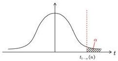

t_{1-\alpha(n)} \alpha

图 1 t(n) 分布分位点示意图

对于抽检方案的选择，我们采用了假设检验 $^{[1]}$ 的方法进行分析。

假设检验是一种统计方法，用于通过样本数据对有关总体参数的假设进行检验。其基本过程包括以下几个步骤：

（1）提出假设：首先，设定一个原假设 $(H_{0})$ ，通常表示没有效应或无差异的情况，以及一个备择假设 $(H_{1})$ ，表示存在效应或差异。  
（2）选择检验统计量：根据研究问题和数据类型，选择适当的统计检验方法，如t检验、卡方检验等，并计算检验统计量。  
（3）设定显著性水平：确定显著性水平( $\alpha$ )，通常设为0.05，这表示拒绝原假设的容许概率阈值。  
（4）计算 p 值：利用样本数据计算 p 值，即在原假设为真的前提下，观察到当前数据或更极端结果的概率。  
（5）做出决策：将 p 值与显著性水平进行比较。如果 p 值小于或等于显著性水平，则拒绝原假设，认为结果具有统计显著性；否则，不拒绝原假设。

据此，我们设定原假设和备择假设为：

$$
H _ {0}: \mu \leqslant 0. 1 \quad H _ {1}: \mu > 0. 1 \tag {5}
$$

根据题意，可得均值和方差分别可表示为：

$$
\left\{ \begin{array}{l} \overline {{X}} = \frac {1}{n} \sum X _ {i} \\ S _ {n} ^ {2} = \frac {1}{n} \left(X _ {i} - \overline {{X}}\right) ^ {2} \end{array} \right. \tag {6}
$$

代入样本值，可求得：

$$
\left\{ \begin{array}{l} \overline {{X}} = \frac {k}{n} \\ S _ {n} ^ {2} = \frac {k (n - k)}{n ^ {2}} \end{array} \right. \tag {7}
$$

在将参数纳入公式（4）的框架内，我们通过检索 t 分布表中与特定显著性水平相对应的临界分位数，设定了样本统计量小于该临界分位数的条件，从而推导出样本量 n 与参数 k 之间的数学约束关系。

结果显示，随着样本量 n 的增加，参数 k 亦呈现出同步增长的趋势。此外，样本均值在经历一段波动过程之后，呈现出逐渐下降的态势。我们设定了一个误差允许范围，即均值误差需控制在 10% 以内，以此作为误差接受的标准。据此，当样本量 n 达到 1600 次时，参数 k 达到其最大值 176，对应的样本均值为 0.11，恰好满足我们所设定的临界条件。附图展示了抽检次数 n 与样本均值之间的相关性图：

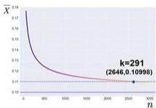

<details>
<summary>line</summary>

| n    | X̄     |
| ---- | ------- |
| 291  | 0.10998 |
</details>

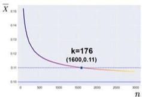

<details>
<summary>line</summary>

| n | X̄ |
|---|---|
| 1600 | 0.11 |
</details>

图 2 抽检次数 n 和样本均值 $\mu$ 的关系图

故我们得到抽检方案：90%的置信度下，对于一批用于生产的零配件，我们抽取1600个，检测其中的次品数量，若不超过176个，则可以接受这批零配件用于生产，否则拒绝；95%的置信度下，我们抽取2646个，检测其中的次品数量若不超过291个则接受，否则拒绝。

# 5.2 企业生产过程中的简单决策分析

# 5.2.1 基于决策树法的生产最优路径分析

决策树法 $^{[2]}$ 是一种通过树状图形来分析和选择决策方案的方法，它将决策问题分解为一系列节点和分支，每个节点代表一个决策或机会，分支则表示不同选择带来的结果。通过计算各结果的期望值，决策者可以从中选出最优的决策路径。下图是展现了决策树法的一般步骤：

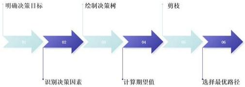

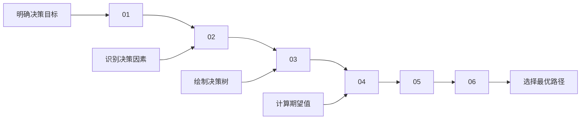

图 3 决策树法的一般步骤流程图

在处理问题二时，我们将其抽象化为四个关键的决策节点：零件1的质量检验、零件2的质量检验、最终产品的质量检验，以及对于不合格成品的拆解处理。对于每个决策节点，存在两种决策路径：执行检测或不执行检测（对于拆解节点，则为执行拆解或不执行拆解）。每种路径均伴随着不同的成本支出。因此，本研究的目的是计算每一条路径的期望收益，并通过比较这些期望值来确定最大化利润的路径，以此作为最优决策策略。

在问题二的特定情境中，存在两个反馈循环：一是成品中的不合格品通过拆解过程转化为待检测零件；二是已售出的成品可能因质量问题被客户退回，重新归类为不合格品。这两个循环导致了决策树结构的闭环特性。具体决策流程如图所示：

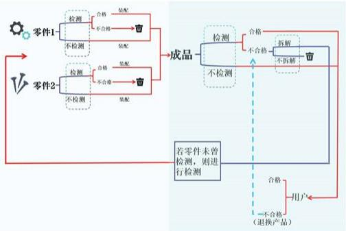

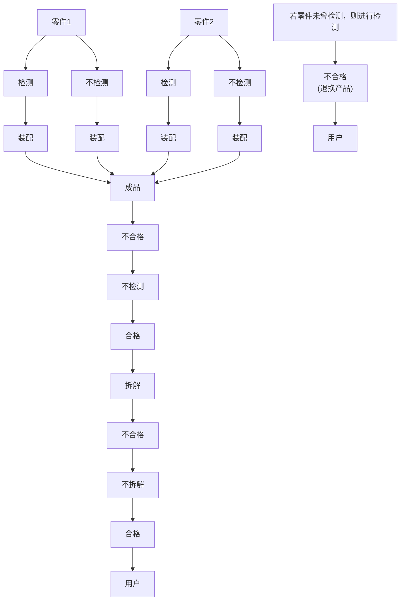

图 4 问题二决策树法分析流程图

图中虚线框处的位置为四个决策点，对于用户所用不合格产品的退换，无法在循环中较好地表示，仅做文字描述。

根据流程图我们可以清晰直观地查看整个决策系统的运作情况，以及每一条路径途经的方案分枝和自然状态点等。由此，我们能够有效地分析不同决策路径的经济影响，并为管理层提供基于数据的决策支持，以实现利润最大化。

# 5.2.2 利润值计算

# 1. 成本计算

根据决策流程图可知，问题二中的企业生产成本有如下六个来源：零件购买成本 $\left(\mathrm{C}_{1}\right)$ 、零件检测成本 $\left(\mathrm{C}_{2}\right)$ 、成品装配成本 $\left(\mathrm{C}_{3}\right)$ 、成品检测成本 $\left(\mathrm{C}_{4}\right)$ 、成品拆解成本 $\left(\mathrm{C}_{5}\right)$ 以及用户调换成本 $\left(\mathrm{C}_{6}\right)$ 。

下面对每部分的成本进行计算：

# (1) 零件购买成本 $C_{1}$

由于零件购买成本仅取决于零件 1、2 的购买数量，故有：

$$
C _ {1} = \sum_ {i = 1} ^ {2} N _ {i} W _ {1 i} \tag {8}
$$

其中 $N_{i}$ 表示第i种零件的购买数量， $W_{1i}$ 表示第i种零件的购买单价。

# (2) 零件检测成本 $C_{2}$

仅被检测零件需要花费检测费用，故有：

$$
C _ {2} = \sum_ {i = 1} ^ {2} N _ {i} W _ {2 i} D _ {1 i} \tag {9}
$$

其中 $W_{2i}$ 表示第i种零件的检测成本， $D_{1i}$ 表示第i种零件的检测决策，取0为不检测，取1为检测。

# (3) 成品装配成本 $C_{3}$

由流程图可知，用于装配的零件来源包括检测合格的零件和不参与检测的零件。我们定义装配率 $P_{1}$ 为第i种零件中能够参与装配的零件占所有购买零件的比例，则有：

$$
P _ {i} = 1 - \alpha_ {i} D _ {1 i} \tag {10}
$$

其中 $\alpha_{i}$ 为第i种零件的次品率。

从而我们可以得到，最终需要的成本为：

$$
C _ {3} = W _ {3} \prod_ {i = 1} ^ {2} N _ {i} P _ {i} \tag {11}
$$

其中 $W_{3}$ 表示两个零件装配成单个成品的成本。

# (4) 成品检测成本 $C_{4}$

成品的检测成本由成品的个数和检测决策决定，故有：

$$
C _ {4} = W _ {4} D _ {2} \prod_ {i = 1} ^ {2} N _ {i} P _ {i} \tag {12}
$$

其中 $\mathrm{W}_4$ 表示单个成品的检测成本， $\mathrm{D}_2$ 表示成品的检测决策，取0为不检测，取1为检测。

# (5) 成品拆解成本 $C_{5}$

成品经检测为不合格后才考虑是否拆解，故最终拆解费用可表示为：

$$
C _ {5} = W _ {5} \beta D _ {3} D _ {2} \prod_ {i = 1} ^ {2} N _ {i} P _ {i} \tag {13}
$$

其中 $W_{5}$ 表示单个不合格成品的拆解费用， $D_{3}$ 表示不合格成品的拆解决策，取0为不拆解，取1为拆解， $\beta$ 为成品的次品率。

# (6) 用户调换成本 $C_{6}$

需调换的成品为成品中的次品数，有：

$$
C _ {6} = W _ {6} (1 - D _ {2}) \beta \prod_ {i = 1} ^ {2} N _ {i} P _ {i} \tag {14}
$$

# 2. 收益计算

收益仅与客户所收到合格品的数量有关，即为：

$$
S = S _ {0} \left(1 - D _ {2}\right) (1 - \beta) \prod_ {i = 1} ^ {2} N _ {i} P _ {i} \tag {15}
$$

其中 $S_{0}$ 为产品的市场售价。

# 3. 利润计算

收益值减去成本即为利润：

$$
M = S - \sum_ {i = 1} ^ {6} C _ {i} \tag {16}
$$

# 5.2.3 基于蒙特卡洛模拟的最优路径求解

蒙特卡洛模拟方法[3]是一种基于随机抽样的数值计算技术，它依赖于概率论原理来近似解决一系列复杂的数学问题。该方法通过在问题的解空间中进行大量随机抽样，进而对每个样本点进行相应的模拟实验，最终通过对所得样本集的统计分析，实现对问题解的估计。

蒙特卡洛模拟方法的核心步骤可概括如下：

（1）确立问题域：清晰地界定待求解的问题，并将其转化为数学模型或算法规则，以便于后续的数值模拟。  
（2）构建模拟框架：依据问题的具体特性，设计相应的模拟实验方案，明确所需生成的随机变量及其分布特性，并确定实验的样本容量。  
（3）随机数生成：采用适宜的随机数生成技术，生成符合特定分布特征的随机变量，以此模拟问题中的不确定性和随机性因素。  
（4）执行模拟实验：依据既定的样本容量，运用生成的随机样本数据执行模拟实验，同时记录实验过程中的关键数据。  
（5）统计分析：基于模拟实验的结果，运用统计学的相关方法计算所需的统计指标，包括但不限于期望值、方差、置信区间等。  
（6）结果解读：通过对统计指标的分析和阐释，得出针对原始问题的解答或推论。  
（7）验证与优化：对模拟结果进行验证，以评估实验的有效性和可信度。如有必要，对模拟过程进行优化，例如扩大样本量、优化随机数生成策略等，以提高结果的精确度。

针对问题二的具体情况，我们通过如下步骤实现了蒙特卡洛算法的应用：

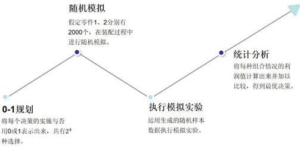

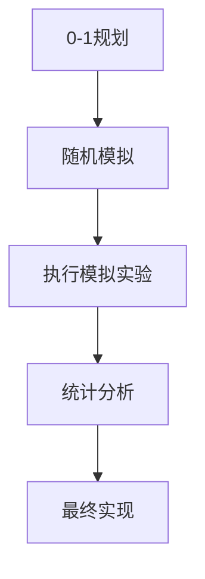

图 5 蒙特卡洛算法的步骤具体实现

# 5.2.4 基于蚁群算法的加强优化

蚁群算法 $^{[4]}$ （Ant Colony Optimization, ACO）是一种基于群体智能的优化方法，其灵感来源于自然界中蚂蚁觅食行为的信息传递机制。该算法通过模拟蚂蚁在寻找食物源过程中释放和跟随信息素的规律，实现了一种有效的搜索策略。

在蚁群算法中，每只蚂蚁依据路径上信息素的浓度和启发式信息来概率性地构建解，并通过迭代过程中的局部和全局信息素更新，以强化优质解对应的路径。

我们将每个策略用一个四元组 result = $[x_{1}, x_{2}, x_{3}, x_{4}]$ 表示，其中：

· $x_{1}$ ：是否检测零件1（0表示不检测，1表示检测）；  
· $x_{2}$ ：是否检测零件2；  
- $x_{3}$ : 是否检测成品;  
· $x_{4}$ ：是否拆解次品（0表示不拆解，1表示拆解）。

蚂蚁会在解空间（即所有可能的策略集合）中搜索，寻找使得目标函数 f(result) 最大的策略。

我们使用决策得到的利润作为该决策点的“食物”，假设蚂蚁数量为 m，城市数量为 n，t 时刻城市 i 和 j 之间的信息素浓度为 $\tau_{ij}(t)$ ，当前蚂蚁在城市 i，若只考虑信息素浓度和路径距离对蚂蚁选择路径的影响，则可以得到：

$$
P _ {i j} ^ {k} = \left\{ \begin{array}{l l} \frac {\left[ \tau_ {i j} (t) \right] ^ {\alpha} \times \left[ \frac {1}{d _ {i j} (t)} \right] ^ {\beta}}{\sum_ {s \in a l l o w e d _ {k}} \left[ \tau_ {i s} (t) \right] ^ {\alpha} \times \left[ \frac {1}{d _ {u} (t)} \right] ^ {\beta}}, & j \in a l l o w e d _ {k} \\ 0, & j \notin a l l o w e d _ {k} \end{array} \right. \tag {17}
$$

其中allowedk为第k只蚂蚁暂未访问的城市集合， $\mathrm{P}_{\mathrm{i}}^{\mathrm{k}}$ 为t时刻第k只蚂蚁从城市i转移到城市j的概率， $\alpha$ 和 $\beta$ 为待定的两个参数，作用分别为调整信息素浓度和路径距离对概率的影响。信息素浓度可以通过如下公式进行更新：

$$
\left\{ \begin{array}{l} \tau_ {i j} (t + 1) = (1 - \rho) \tau_ {i j} (t) + \sum_ {k = 1} ^ {m} \Delta \tau_ {i j} ^ {k} \\ \Delta \tau_ {i j} ^ {k} = \frac {Q}{L _ {k}} \end{array} \right. \tag {18}
$$

其中 Q 是一个常数，表示蚂蚁留下的信息素总量， $L_{k}$ 是蚂蚁 k 完成一次循环所走的路径长度， $\rho$ 是信息素的蒸发率。

蚁群算法在多次迭代过程中，通过信息素的正反馈机制和启发式信息的引导，实现了对解空间的广泛探索与局部深入挖掘的平衡。这种平衡使得算法能够在面对具有高维度、多局部最优解的复杂优化问题时，有效地收敛至近似最优解。

# 5.2.5 结果分析

将具体情况带入基于蚁群算法优化的蒙特卡洛模拟，提取出每种情况结果的利润最高的前十个决策，我们得到以下热图：

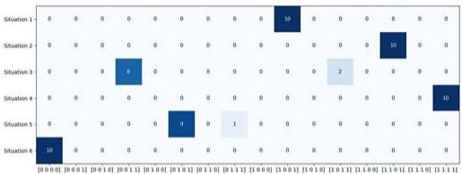  
图 6 问题二中六中情况的决策热点图

在图表 n 中，我们可以观察到，在任意给定的情况下，利润最高的前十个策略最多仅涉及两种不同的决策类型。并且，这些策略中以一种决策类型为主导。据此，我们可以推断，该主导决策类型即为该情况下的最优决策。基于这一分析，我们构建了如下的决策表：

表 1 问题二中六种情况的决策

<table><tr><td>情况 决策</td><td>1</td><td>2</td><td>3</td><td>4</td><td>5</td><td>6</td></tr><tr><td>零件1是否检测</td><td>是</td><td>是</td><td>否</td><td>是</td><td>否</td><td>否</td></tr><tr><td>零件2是否检测</td><td>否</td><td>是</td><td>否</td><td>是</td><td>是</td><td>否</td></tr><tr><td>成品是否检测</td><td>否</td><td>否</td><td>是</td><td>是</td><td>否</td><td>否</td></tr><tr><td>成品是否拆解</td><td>是</td><td>是</td><td>是</td><td>是</td><td>是</td><td>否</td></tr></table>

基于这些决策进行模拟计算，假设采购的零件1和零件2数量相同，我们得到各情况在1000次采购2000个零件A和B进行制作售卖情况下的平均利润如下表：

表 2 问题二中六种情况的最优决策平均利润值

<table><tr><td></td><td>1</td><td>2</td><td>3</td><td>4</td><td>5</td><td>6</td></tr><tr><td>最优决策平均利润</td><td>35934元</td><td>20668元</td><td>31878元</td><td>25040元</td><td>26527元</td><td>40138元</td></tr></table>

在特定的情境分析中，明显可见应用所提出的模型所推导出的最优决策能够带来显著的利润回报。

# 5.3 企业生产过程中的多决策问题分析

# 5.3.1 基于决策树法的生产最优路径分析

依据问题设定的具体要求，我们共分析得到16个决策节点，具体分布如下：零件生产阶段涉及8个决策节点，半成品加工阶段涉及4个决策节点，以及成品阶段涉及2个决策节点。

问题所给情境的生产流程含有五个反馈循环机制，具体包括：三个循环涉及半成品中的不合格品通过拆解流程重新转化为待检测零件；一个循环涉及成品中的不合格品通过拆解流程转化为待检测半成品；另一个循环则涉及销售至客户的产品因质量问题被退回，进而被重新归类为成品次品。这些反馈循环之间存在交互与重叠，显著提升了寻求最优决策路径的计算复杂度。

为了更清晰直观地分析各决策路径，我们画出了问题三情境下的决策流程图：

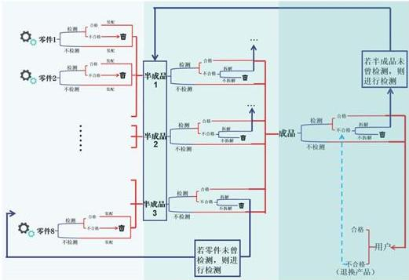

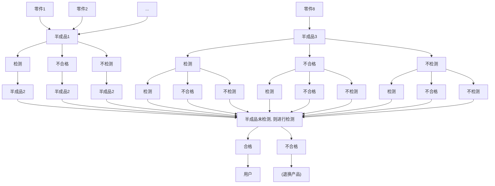

图 7 问题三决策树法分析流程图

# 5.3.2 利润分析

# 1. 成本计算

根据决策流程图可知，问题三中的企业生产成本有如下九个来源：零件购买成本 $\left(\mathrm{c}_{1}\right)$ 、零件检测成本 $\left(\mathrm{c}_{2}\right)$ 、半成品装配成本 $\left(\mathrm{c}_{3}\right)$ 、半成品检测成本 $\left(\mathrm{c}_{4}\right)$ 、半成品拆解成本 $\left(\mathrm{c}_{5}\right)$ 、成品装配成本 $\left(\mathrm{c}_{6}\right)$ 、成品检测成本 $\left(\mathrm{c}_{7}\right)$ 、成品拆解成本 $\left(\mathrm{c}_{8}\right)$ 以及用户调换成本 $\left(\mathrm{c}_{9}\right)$ 。

下面对每部分的成本进行计算：

(1) 零件购买成本 $c_{1}$

由于零件购买成本仅取决于8种零件的购买数量，故有：

$$
c _ {1} = \sum_ {i = 1} ^ {8} N _ {i} w _ {1 i} \tag {19}
$$

其中 $\mathbf{N}_{\mathrm{i}}$ 表示第i种零件的购买数量， $\mathbf{w}_{1\mathrm{i}}$ 表示第i种零件的购买单价。

# (2) 零件检测成本 $c_{2}$

仅被检测零件需要花费检测费用，故有：

$$
c _ {2} = \sum_ {i = 1} ^ {8} N _ {i} w _ {2 i} d _ {1 i} \tag {20}
$$

其中 $w_{2i}$ 表示第i种零件的检测成本， $d_{1i}$ 表示第i种零件的检测决策，取0为不检测，取1为检测。

# (3) 成品装配成本 $c_{3}$

由流程图可知，用于装配的零件来源包括检测合格的零件和不参与检测的零件，故最终需要的成本为：

$$
c _ {3} = w _ {3 1} \prod_ {i = 1} ^ {3} N _ {i} P _ {i} + w _ {3 2} \prod_ {i = 4} ^ {6} N _ {i} P _ {i} + w _ {3 3} \prod_ {i = 7} ^ {8} N _ {i} P _ {i} \tag {21}
$$

其中 $w_{3j}$ 表示8个零件装配成半成品j的成本。

# (4) 半成品检测成本 $c_{4}$

半成品的检测成本由半成品的个数和检测决策决定，故有：

$$
c _ {4} = w _ {4 1} d _ {2 1} \prod_ {i = 1} ^ {3} N _ {i} P _ {i} + w _ {4 2} d _ {2 2} \prod_ {i = 4} ^ {6} N _ {i} P _ {i} + w _ {4 3} d _ {2 3} \prod_ {i = 7} ^ {8} N _ {i} P _ {i} \tag {22}
$$

其中 $w_{4j}$ 表示单个半成品的检测成本， $d_{2j}$ 表示半成品j的检测决策，取0为不检测，取1为检测。

# (5) 半成品拆解成本 $c_{5}$

半成品经检测为不合格后才考虑是否拆解，故最终拆解费用可表示为：

$$
c _ {5} = w _ {5 1} \beta_ {1} d _ {3 1} d _ {2 1} \prod_ {i = 1} ^ {3} N _ {i} P _ {i} + w _ {5 2} \beta_ {2} d _ {3 2} d _ {2 2} \prod_ {i = 4} ^ {6} N _ {i} P _ {i} + w _ {5 3} \beta_ {3} d _ {3 3} d _ {2 3} \prod_ {i = 7} ^ {8} N _ {i} P _ {i} \tag {23}
$$

其中 $\mathbf{w}_{5j}$ 表示单个不合格半成品的拆解费用， $\mathrm{d}_{3j}$ 表示不合格半成品j的拆解决策，取0为不拆解，取1为拆解， $\beta_{j}$ 为半成品的次品率。

# (6) 成品装配成本 $c_{6}$

我们先求得半成品j的数量 $H_{j}$ 为：

$$
\left\{ \begin{array}{l} H _ {1} = \prod_ {i = 1} ^ {3} N _ {i} P _ {i} \\ H _ {2} = \prod_ {i = 4} ^ {6} N _ {i} P _ {i} \\ H _ {3} = \prod_ {i = 7} ^ {8} N _ {i} P _ {i} \end{array} \right. \tag {24}
$$

我们定义装配率 $Q_{j}$ 为第j种半成品中能够参与装配的半成品占所有半成品的比例，则有：

$$
Q _ {j} = 1 - \beta_ {j} d _ {3 j} \tag {25}
$$

能够参与装配为成品的半成品包括检测合格的半成品和未检测的半成品，可以得到成品的装配成本为：

$$
c _ {6} = w _ {6} \prod_ {j = 1} ^ {3} H _ {j} Q _ {j} \tag {26}
$$

其中 $w_{6}$ 为三个半成品装配成成品的费用。

# (7) 成品检测成本 $c_{7}$

成品的检测成本由装配成成品的个数和检测决策决定，有：

$$
c _ {7} = w _ {7} d _ {4} \prod_ {j = 1} ^ {3} H _ {j} Q _ {j} \tag {27}
$$

其中 $\mathbf{w}_7$ 为单个成品的检测成本。

# (8) 成品拆解成本 $c_{8}$

成品经检测为不合格后才考虑是否拆解，故最终拆解费用可表示为：

$$
c _ {8} = w _ {8} \gamma d _ {5} d _ {4} \prod_ {j = 1} ^ {3} H _ {j} Q _ {j} \tag {28}
$$

其中 $w_{8}$ 为单个成品的拆解成本， $\gamma$ 为成品的次品率。

# (9) 用户调换成本 $c_{9}$

需调换的成品为成品中的次品数，有：

$$
c _ {9} = w _ {9} (1 - d _ {8}) \gamma \prod_ {i = 1} ^ {3} H _ {j} Q _ {j} \tag {29}
$$

其中 $w_{9}$ 为单个成品的调换成本。

# 2. 收益计算

收益仅与客户所收到合格品的数量有关，即为：

$$
s = s _ {0} (1 - d _ {5}) (1 - \gamma) \prod_ {i = 1} ^ {3} H _ {j} Q _ {j} \tag {30}
$$

其中 $s_{0}$ 为成品的市场售价。

# 3. 利润计算

收益值减去成本即为利润：

$$
m = s - \sum_ {i = 1} ^ {9} c _ {i} \tag {31}
$$

# 5.3.3 基于蒙特卡洛模拟方法的初步决策分析

与问题二类似，问题三同样采用了蒙特卡洛思想进行随机模拟路径求取并比较利润值从而找到最优解。鉴于问题三的决策点较多，决策过程较为复杂，简单随机模拟会导致工作量过于庞大，我们需要通过其他优化算法让模拟过程不再完全随机，而是有一定策略地推进。

# 5.3.4 基于遗传算法的加强优化

遗传算法 $^{[5][6]}$ （Genetic Algorithm，GA）是一种启发式搜索算法，其灵感来源于生物进化理论和自然选择原理。遗传算法模拟了生物进化过程中的遗传和变异机制，通过迭代搜索策略在解空间中寻找问题的最优解或近似最优解。

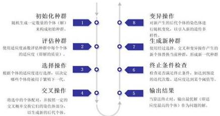

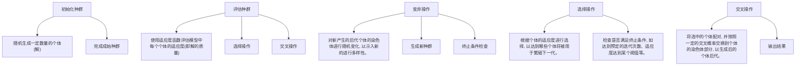

图 8 遗传算法的具体步骤

由于目标函数是关于决策 D 的函数，我们将决策编码为一组十六位二进制数组

$$
D = \left[ X _ {1}, X _ {2}, X _ {3}, \dots , X _ {1 5}, X _ {1 6} \right], \quad X _ {i} \in \{0, 1 \} \tag {32}
$$

$X_{i}$ 代表每一步的决策， $X_{1}\sim X_{8}$ 代表是否对零件进行检测， $X_{9}\sim X_{11}$ 代表是否对半成品进行检测， $X_{12}$ 达标是否对成品检测， $X_{13}\sim X_{815}$ 代表当半成品为次品时是否拆解， $X_{16}$ 代表当半成品为成品时是否拆解。

在问题三中，我们采用二进制数组作为种群中个体染色体的表征方式。针对所探讨的具体问题，我们将可能的解决方案集合定义为种群。鉴于每个个体都是由染色体所构成，种群实质上可以被视为一个染色体集合的集合体。

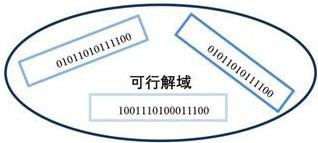

01011010111100
01011010111100
可行解域
1001110100011100

图 9 可行解域示意图

在保持初始零件数量恒定的前提下，我们将采纳由个体所表征的决策所获得的利润作为评价其适应度的标准。在完成了种群中每个个体适应度的计算之后，将通过选择过程来决定哪些个体将被选中进行繁殖，以生成后续世代。在此选择过程中，适应度较高的个体具有更高的概率被选中，从而将其遗传信息传递至下一代。相对而言，适应度较低的个体被选中进行遗传信息传递的概率则较低。

遗传过程我们采用单点交叉法对基因重组进行模拟。设两个父代个体为：

$$
\left\{ \begin{array}{l} P _ {1} = [ X _ {1 1}, X _ {1 2},..., X _ {1 1 6} ] \\ P _ {2} = [ X _ {2 1}, X _ {2 2},..., X _ {2 1 6} ] \end{array} \right. \tag {33}
$$

这两个个体长度为16的向量，交叉点 $\mathrm{g}$ 为从1到15的随机整数。交叉操作后，生成两个子代个体 $G_{1}$ 和 $G_{2}$ ，交叉公式为：

$$
\left\{ \begin{array}{l} G _ {1} = \left[ X _ {1 1}, X _ {1 2}, \dots , X _ {1 g}, X _ {2 (g + 1)}, \dots , X _ {2 1 6} \right] \\ G _ {2} = \left[ X _ {2 1}, X _ {2 2}, \dots , X _ {2 g}, X _ {1 (g + 1)}, \dots , X _ {1 1 6} \right] \end{array} \right. \tag {34}
$$

为探索更多可行解，我们引入变异算子，在产生下一代过程中，子代可能发生基因突变，即某一位二进制数发生翻转：

$$
G _ {1} = \left[ X _ {1}, X _ {2}, \dots , X _ {1 6} \right]\rightarrow \left[ X _ {1}, \dots , 1 - X _ {i}, \dots , X _ {1 6} \right] \tag {35}
$$

# 5.3.5 引入精英策略进一步优化

精英策略（Elitism）在遗传算法中是一种常用的方法，在遗传算法中扮演着至关重要的角色，它通过在每一代进化过程中直接保留一定数量的最优个体，确保了这些高适应度解不会在遗传操作的随机性中被淘汰。

这种策略有效地提升了种群的总体质量，促进了算法向全局最优解的快速收敛，并防止了算法可能出现的退化现象。通过精英策略，遗传算法能够维持种群的优秀遗传信息，同时保持足够的多样性以探索解空间，从而在复杂优化问题中展现出其强大的搜索和优化能力。

精英策略的具体实施步骤如下：

（1）选择精英个体：在每一代的种群中，根据适应度函数评估所有个体的性能，并选择一定数量的最优个体作为精英个体。  
（2）保留精英：在执行选择、交叉和变异操作之前，将这些精英个体从当前种群中分离出来并保存。  
（3）种群更新：对剩余的种群执行选择、交叉和变异操作，生成新一代的种群。  
（4）合并精英：将之前保留的精英个体重新加入到新一代种群中，替换掉新一代中的一些较差个体（通常是随机选择的或者适应度最低的）。  
（5）形成新一代：通过合并精英个体和经过遗传操作的新个体，形成完整的新

一代种群。

# 5.3.6 结果分析

我们采用随机化方法生成了包含 100 个个体的初始种群，并对该种群执行了三十次迭代过程。在每次迭代中，我们筛选出最优个体，据此，我们绘制了以下结果图以展示迭代过程中的最优个体变化情况：

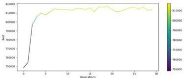

<details>
<summary>line</summary>

| Generations | Value   |
|-------------|---------|
| 0           | 700000  |
| 5           | 820000  |
| 10          | 830000  |
| 15          | 825000  |
| 20          | 835000  |
| 25          | 830000  |
| 30          | 825000  |
</details>

图 10 每代最优个体变化图

经过分析，可以观察到，在迭代至第10代之后，模型所对应的最优个体适应度呈现出稳定性特征，趋于收敛。据此推断，该模型已成功识别出最优决策方案。

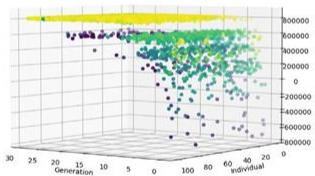

<details>
<summary>scatter</summary>

| Generation | Individual |
| ---------- | ---------- |
| 25         | 0          |
| 15         | 0          |
| 10         | 0          |
| 5          | 0          |
| 0          | 0          |
| 25         | 250000     |
| 15         | 500000     |
| 10         | 750000     |
| 5          | 1000000    |
| 0          | 1250000    |
| 25         | 1500000    |
| 15         | 1750000    |
| 10         | 2000000    |
| 5          | 2250000    |
| 0          | 2500000    |
| 25         | 2750000    |
| 15         | 3000000    |
| 10         | 3250000    |
| 5          | 3500000    |
| 0          | 3750000    |
| 25         | 4000000    |
| 15         | 4250000    |
| 10         | 4500000    |
| 5          | 4750000    |
| 0          | 5000000    |
| 25         | 5250000    |
| 15         | 5500000    |
| 10         | 5750000    |
| 5          | 6000000    |
| 0          | 6250000    |
| 25         | 6500000    |
| 15         | 6750000    |
| 10         | 7000000    |
| 5          | 7250000    |
| 0          | 7500000    |
| 25         | 7750000    |
| 15         | 8000000    |
| 10         | 8250000    |
| 5          | 8500000    |
| 0          | 8750000    |
| 25         | 9000000    |
| 15         | 9250000    |
| 10         | 9500000    |
| 5          | 9750000    |
| 0          | 1000000   |
| 25         | 12500   |
| 15         | 15       |
| 10         | 17.5     |
| 5          | 2       |
| 25         | 2.5      |
| 15         | 3        |
| 10         | 3.5      |
| 5          | 4        |
| 25         | 4.5      |
| 15         | 5        |
| 10         | 5.5      |
| 5          | 6        |
| 25         | 6.5      |
| 15         | 7        |
| 10         | 7.5      |
| 5          | 8        |
| 25         | 8.5      |
| 15         | 9        |
| 10         | 9.5      |
| 5          | 1       |
| 25         | 1.5      |
| 15         | 2        |
| 10         | 2.5      |
| 5          | 3        |
| 25         | 3.5      |
| 15         | 4        |
| 10         | 4.5      |
| 5          | 5        |
| 25         | 5.5      |
| 15         | 6        |
| 10         | 6.5      |
| 5          | 7        |
| 25         | 7.5      |
| 15         | 8        |
| 10         | 8.5      |
| 5          | 9        |
| 25         | 9.5      |
| 15         | 1       |
| 10         | 1.5      |
| 5          | 2        |
| 25         | 2.5      |
| 15         | 3        |
| 10         | 3.5      |
| 5          | 4        |
| 25         | 4.5      |
| 15         | 5        |
| 10         | 5.5      |
| 5          | 6        |
| 25         | 6.5      |
|
| (additional for the chart) are not provided in the code image.)
</details>

图 11 三维种群迭代过程图

在三维种群迭代图中，可以明显看出，初始种群呈现出较高的发散性，并且其适应度水平相对较低。经过10个迭代周期，种群迅速达到了一个较高的适应度水平，并且展现出极快的收敛速率，表明种群在优化过程中迅速趋向于稳定状态。

因此，针对问题三所提出的情境，我们成功确定了其对应的最优决策方案：

表 3 问题三中所给情况的最优决策

<table><tr><td>决策节点</td><td>决策</td></tr><tr><td>零件1检测</td><td>是</td></tr><tr><td>零件2检测</td><td>是</td></tr><tr><td>零件3检测</td><td>是</td></tr><tr><td>零件4检测</td><td>是</td></tr><tr><td>零件5检测</td><td>是</td></tr><tr><td>零件6检测</td><td>是</td></tr><tr><td>零件7检测</td><td>是</td></tr><tr><td>零件8检测</td><td>是</td></tr><tr><td>半成品1检测</td><td>是</td></tr><tr><td>半成品2检测</td><td>是</td></tr><tr><td>半成品3检测</td><td>是</td></tr><tr><td>成品检测</td><td>否</td></tr><tr><td>半成品1拆解</td><td>是</td></tr><tr><td>半成品2拆解</td><td>是</td></tr><tr><td>半成品3拆解</td><td>是</td></tr><tr><td>成品拆解</td><td>是</td></tr></table>

在采纳该决策策略的条件下，通过对1000次模拟实验中每次购入15000个零件1至8的情况进行分析，我们发现所获得的平均利润为813682元，这一数值显著表明了该策略具有较高的盈利水平。此外，为了进行对比分析，我们还抽取了其他几种决策方案，并计算得出各自的平均利润数据如下：

利润值/元  
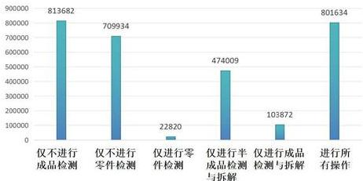

<details>
<summary>bar</summary>

| Category | Value |
|---|---|
| 仅不进行成品检测 | 813682 |
| 仅不进行零件检测 | 709934 |
| 仅进行零件检测 | 22820 |
| 仅进行半成品检测与拆解 | 474009 |
| 仅进行成品检测与拆解 | 103872 |
| 进行所有操作 | 801634 |
</details>

图 12 最优决策与其他决策对比图

通过所呈现的图表数据，可以明确观察到，模型推导出的最优决策相较于其他若干决策方案，展现出更为显著的利润率优势。

# 5.4 抽样检测条件下决策的鲁棒性分析

# 5.4.1 基于 $3\sigma$ 准则的实际次品率分析

问题一中为了检测产品的实际次品率，依据中心极限定理，将次品率的分布近似为正态分布，构造了服从t分布的T统计量对产品进行假设检验，最后得出在不同信度下的抽样检测方案。

由于问题二及问题三中的次品率均是通过抽样检测得到，则其中的零件、半成品和成品的次品率均近似服从期望为为次品率 $\mu$ ，方差为 $\sigma^2$ 的正态分布，实际次品率应当在标称次品率 $\mu$ 附近一定范围内波动。

3σ准则，又称为3σ原则，是一种统计学上的概念，用于描述在正态分布中数据的比例。在正态分布曲线上，大约有68.3%的数据落在距均值一个标准差的范围内，即 $\mu-\sigma$ 到 $\mu+\sigma$ 之间；约95.4%的数据落在两个标准差的范围内，即 $\mu-2\sigma$ 到 $\mu+2\sigma$ 之间；而约99.7%的数据则落在三个标准差的范围内，即 $\mu-3\sigma$ 到 $\mu+3\sigma$ 之间。这个准则在质量管理中非常常见。3σ准则如图所示：

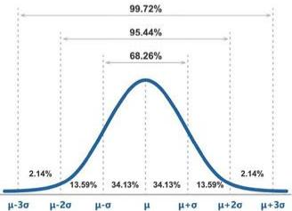  
图13 $3\sigma$ 准则

根据 $3\sigma$ 准则，绝大多数的实际次品率都将落在 $\mu + 3\sigma$ 到 $\mu + 3\sigma$ 之间，根据假设检验信度的不同，检测样本量也会不同，使得不同信度下 $\sigma$ 存在差异，从而影响实际次品率的波动范围。由于第二问和第三问在决策过程中的次品率恒定，抽样检测条件下的实际次品率波动必定会影响所做出决策的稳定性，在一些情况下可能会导致利润亏损。因此对问题进行鲁棒性分析是十分必要的。

# 5.4.2 基于 $3\sigma$ 准则的企业生产过程中简单决策鲁棒性分析

为了使得生产利润在不同情况下最优化、稳定化，考虑在实际次品率 $p$ 最恶劣条件下，即 $p = \mu + 3\sigma$ ，不同情况的决策分布。在假设检验 $95\%$ 信度和 $90\%$ 信度下，每种情况的前十个最优决策分布如下图所示：

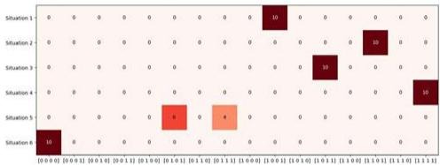  
图 14 问题二 95%信度下最优决策分布

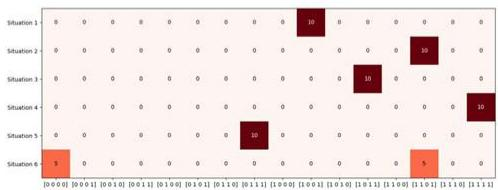  
图 15 问题二 90%信度下最优决策分布

对比原问题二的图6可以看出，在 $p=\mu+3\sigma$ 的情形下，部分最优决策发生变化，这是因为随着零件次品率以及成品组成次品率的增高，最后的总次品率会极大幅度地增加，这将大幅提升调换损失所带来的亏损。因此决策的选择趋势将更偏向于检测。图中的60种决策选择率变化对比情况如下图所示：

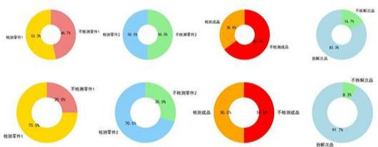

<details>
<summary>pie</summary>

| Category | Percentage (%) |
|---|---|
| 检测零件1 | 33.1 |
| 不检测零件1 | 46.7 |
| 检测零件2 | 56.0 |
| 不检测零件2 | 42.8 |
| 检测成品 | 39.9 |
| 不检测成品 | 63.7 |
| 检测成品 | 75.5 |
| 不检测成品 | 30.0 |
| 检测成品2 | 70.0 |
| 不检测成品2 | 56.0 |
| 检测成品 | 30.1 |
| 不检测成品 | 91.7 |
| 拆解成品 | 8.3 |
</details>

图 16 原决策与 90% 信度下 60 种最优决策选择率对比

从图中可以看出，检测决策的选择率均有提升，但由于成品的检测成本高，部分情况零件的检测已经能很好地将总次品率控制在一个较小的范围，成品检测的提升程度较小，最终选择率只占了 $50\%$ 。注意到在情况6中，由于拆解费用高，原问题2中并未选择拆解成品，但是随着次品率的提高，丢弃的次品过多会造成零件资源的大量损失，所以在高次品率情形下有部分选择决策了检测零件并拆解成品。

不同信度下的最优决策如下表所示，与第二问的表1对比可知，情况1、2、4的决策对次品率变化的鲁棒性好，情况3、5、6的最优决策比例受次品率影响较为明显，但总体的决策方向选择仍较为稳定：

表 4 95%信度与 90%信度下最优决策

<table><tr><td>情况决策</td><td>1</td><td>2</td><td>3</td><td>4</td><td>5</td><td>6</td><td>情况决策</td><td>1</td><td>2</td><td>3</td><td>4</td><td>5</td><td>6</td></tr><tr><td>零件1是否检测</td><td>是</td><td>是</td><td>是</td><td>是</td><td>否</td><td>否</td><td>零件1是否检测</td><td>是</td><td>是</td><td>是</td><td>是</td><td>否</td><td>是</td></tr><tr><td>零件2是否检测</td><td>否</td><td>是</td><td>否</td><td>是</td><td>是</td><td>否</td><td>零件2是否检测</td><td>否</td><td>是</td><td>否</td><td>是</td><td>是</td><td>是</td></tr><tr><td>成品是否检测</td><td>否</td><td>否</td><td>是</td><td>是</td><td>否</td><td>否</td><td>成品是否检测</td><td>否</td><td>否</td><td>是</td><td>是</td><td>是</td><td>否</td></tr><tr><td>成品是否拆解</td><td>是</td><td>是</td><td>是</td><td>是</td><td>是</td><td>否</td><td>成品是否拆解</td><td>是</td><td>是</td><td>是</td><td>是</td><td>是</td><td>是</td></tr></table>

# 5.4.3 基于 $3\sigma$ 准则的企业生产过程中多决策鲁棒性分析

在实际生产过程中，企业将面临更多更复杂的情形，除了在考察极端条件下，决策对次品率变化的适应能力，也要研究不同的决策分支与次品率、利润变化的关系，研究哪些决策会对次品率的变化敏感，以及对利润的影响程度。因此我们除了测试在次品率 $p = \mu - 3\sigma$ 决策的变化，也测试在 $p = \mu + 3\sigma$ 情况下哪些决策能使利润最大化。

不同信度及不同概率下最优决策组如下图所示：

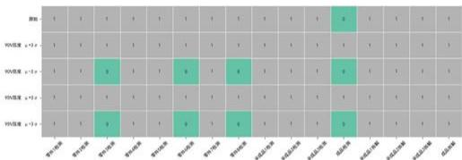  
图 17 不同情形下的最优决策组合

从图中可以看出，不同情形下发生变化的决策只有零件3、4、8以及成品检测，这三种零件的检测成本均高于其他零件，成品检测的检测费用也是所有检测中最昂贵的。在实际次品率较小的情况下，检测这几项所带来的收益是不如以一定概率承担调度损失的，但是在次品率较高的情形下，调度损失所带来的金额亏损期望是远大于检测成本的。

综上所述，在抽样检测条件下的决策应与问题三的原始决策一致，即检测所有的零件与半成品，不检测成品，并且拆解所有的次品。这种决策在极端情况下仍可有一定的可观利润，可以在保证高利润的同时一定程度上规避过多的调度损失所带来的亏损风险。

# 六、模型的评价及推广

# 6.1 模型的优点

（1）综合分析：模型涵盖了生产过程中的多个关键环节，包括零件检测、装配、成品检测、拆解以及用户退换货，全面分析了各环节的成本和收益，为决策提供了科学依据。  
（2）多种算法结合：模型结合了决策树、蒙特卡洛模拟、蚁群算法和遗传算法等多种算法，能够有效地处理不同规模和复杂度的决策问题，并找到最优或近似最优解。  
（3）实用性强：模型可以应用于实际生产中，帮助企业制定合理的生产策略，降低成本，提高利润。

# 6.2 模型的不足

（1）模型假设：模型进行了一些简化假设，例如前三问中零件和成品的次品率是已知的，且生产成本和收益是固定的。这些假设可能会影响模型的精确度和适用范围。  
（2）算法复杂性：随着生产流程复杂度的增加，决策树的规模会急剧扩大，蒙特卡洛模拟和优化算法的计算量也会显著增加，导致求解时间较长。  
（3）参数设置：模型中涉及多个参数，例如检测成本、拆解成本、市场售价等，这些参数的设置需要根据实际情况进行调整，否则会影响模型的准确性。  
（4）风险因素：模型没有考虑生产过程中可能出现的风险因素，例如原材料价格波动、市场需求变化等，这些因素可能会影响企业的实际收益。

# 6.3 模型的推广

本文提出的模型通过综合分析生产过程中的各个环节，并结合多种算法进行求解，能够有效地帮助企业优化生产流程，降低成本，提高利润。

模型可以应用于不同类型、不同规模、不同生产流程的企业，例如电子产品生产企业、汽车制造企业、餐饮企业等。通过软件开发、咨询服务、教育培训等方式进行推广，可以帮助企业更好地应用模型，提高生产效率和质量，增强市场竞争力。模型的推广将有助于推动企业实现可持续发展，提高整个制造业的竞争力。

# 七、参考文献

[1] 马凤鸣, 王忠礼. 假设检验方法分析及应用 [J]. 长春大学学报, 2012, 22(02): 188-192+196.  
[2] 张炳德, 徐方, 喻剑辉. 一种多值逻辑函数化简方法——决策树法[J]. 微电子学, 1998, (05): 72-74.  
[3] 游少波. 蒙特卡洛仿真在出版社生产计划决策上的应用 [J]. 出版参考, 2015, (06): 33-35.  
[4] 骆怡宁, 陈茂军. 基于蚁群算低碳物流路径优化的探索 [J]. 轻工科技, 2024, 40(05): 107-109+162.  
[5] 洪越. 传算法在随机分布控制中的应用综述 [J]. 现代工业经济和信息化, 2018, 8(17): 72-73. DOI: 10.16525/j.cnki.14-1362/n.2018.17.31.  
[6] 薛霄著. 2020. 复杂系统的计算实验方法——原理、模型与案例 [M]. 北京：科学出版社

# 附录

附录1   
介绍：蒙特卡洛模拟函数的相关 python 代码  
```python
# 蒙特卡罗模拟函数
def monte_carlo_simulation(result):
    cost = 0
    money = 0
    L = [[] for _ in range(8)]
    H = [[] for _ in range(3)]
    H_L = [[] for _ in range(3)]

    for j in range(8):
    L[j] = [0 if random.random() < M1[j, 0] else 1 for _ in range(number)]
    L[j], cost = test(j, L, cost, result)

    # 半成品组装
    cost, H[0] = assemble_product([L[0], L[1], L[2]], H[0], H_L[0], 0, cost, result)
    cost, H[1] = assemble_product([L[3], L[4], L[5]], H[1], H_L[1], 1, cost, result)
    cost, H[2] = assemble_product([L[6], L[7]], H[2], H_L[2], 2, cost, result)

    # 成品组装
    while len(H[0]) > 0 and len(H[1]) > 0 and len(H[2]) > 0:
    index0 = random.randint(0, len(H[0]) - 1)
    index1 = random.randint(0, len(H[1]) - 1)
    index2 = random.randint(0, len(H[2]) - 1)
    index = [index0, index1, index2]
    sum_result = H[0][index0] + H[1][index1] + H[2][index2]
    cost += M3[1]
    success = 0 if random.random() < M3[0] else 1

    if result[11]: # 成品检测
    cost += M2[2]
    if sum_result < 3 or not success:
    cost = destroy2(cost, result, index, H, H_L, L)
    continue

    if sum_result < 3 or not success:
    cost += loss
    cost = destroy2(cost, result, index, H, H_L, L)
    else: 
```

```python
money += sell
del H[0][index0]
del H_L[0][index0]
del H[1][index1]
del H_L[1][index1]
del H[2][index2]
del H_L[2][index2]

total_profit = money - cost - buy_cost
return total_profit

# 并行计算适应度函数
def fitness_parallel(population):
    with Pool(processes=epu_count()) as pool:
    fitness_scores = list(tqdm(pool.imap(monte_carlo_simulation, population), total=len(population), desc="Evaluating Population"))
    return fitness_scores 
```

附录2  
```python
介绍：使用蚁群算法求解问题二中最优决策的python代码
# 蚁群算法主循环
for iteration in tqdm(range(num_iterations), desc="Ant Colony Optimization"):
    all_solutions = []
    all_objective_values = []

    for ant in range(num_ants):
    result = [random.randint(0, 1) for _ in range(4)] # 随机生成策略
    obj_value = objective_function(result)
    all_solutions.append(result)
    all_objective_values.append(obj_value)

    # 更新信息素
    pheromone *= (1 - rho)
    for idx, solution in enumerate(all_solutions):
    obj_value = all_objective_values[idx]
    for i in range(len(solution) - 1):
    pheromone[solution[i], solution[i + 1]] += Q / (obj_value + 1) # 避免除以0

    # 记录当前迭代中的最佳利润和对应路径
    combined = list(zip(all_objective_values, all_solutions))
    sorted_combined = sorted(combined, key=lambda x: x[0], reverse=True) 
```

```python
介绍：使用遗传算法求解问题三中最优决策的python代码
# 遗传算法函数，加入精英群体
def genetic_algorithm(pop_size=100, generations=30, mutation_rate=0.09, crossover_rate=0.65, elite_size=4):
    def create_individual():
    return [random.randint(0, 1) for _ in range(16)] # 个体是长度为16的数组
def mutate(individual):
    index = random.randint(0, 15)
    individual[index] = 1 - individual[index] # 0 变1, 1变0
def crossover(parent1, parent2):
    point = random.randint(1, 14)
    child1 = parent1[:point] + parent2[:point:]
    child2 = parent2[:point] + parent1[:point:]
    return child1, child2
# 初始种群
population = [create_individual() for _ in range(pop_size)]
# 记录每一代的最佳适应度
best_fitness_per_gen = []
# 记录每代种群的适应度分布
all_fitness = []
for gen in tqdm(range(generations), desc="Generations"):
    # 计算适应度（并行）
    fitness_scores = fitness_parallel(population)
# 按适应度对种群进行排序
sorted_population = [x for _, x in sorted(zip(fitness_scores, population), reverse=True)]
# 获取当前种群中的最佳适应度
best_fitness = max(fitness_scores)
best_fitness_per_gen.append(best_fitness)
# 记录每代种群的适应度分布 
```

```python
all_fitness.append(fitness_scores)
# 保留最好的精英个体
elites = sorted_population[:elite_size]

# 其余个体通过交叉与变异生成
new_population = elites[:]
while len(new_population) < pop_size:
    if random.random() < crossover_rate:
    parent1, parent2 = random.sample(sorted_population[:pop_size // 2],
    child1, child2 = crossover(parent1, parent2)
    new_population.extend([child1, child2])
    else:
    new_population.append(random.choice(sorted_population[:pop_size // 2]))

# 变异
for individual in new_population[elite_size]: # 精英个体不参与变异
    if random.random() < mutation_rate:
    mutate(individual)

population = new_population

# 计算最终种群的适应度
final_fitness_scores = fitness_parallel(population)

# 按适应度对最终种群排序
top_individuals = sorted(zip(final_fitness_scores, population), reverse=True)[:10] 
```

# 2026年全国大学生国家安全知识答题


Illustration of two cartoon children holding a shield with the number 4:15 (no text or symbols on subjects)