# 基于差分遗传算法的农作物种植策略优化

# 摘要

随着农业生产的不断发展，优化种植策略以应对复杂的耕作条件和限制变得尤为重要。为此，本文基于华北山区某乡村的露天和大棚耕地面积、农作物种类及种植季次，以及2023年的种植情况、亩产量、种植成本和销售单价等数据，建立数学模型，精准优化种植方案，以提升农业生产效益，为乡村经济的可持续发展提供科学依据。

对于问题一，本文首先对乡村耕地结构、农作物种植现状及亩均利润进行了可视化分析，为制定最佳种植策略提供数据支持。随后，构建了以七年利润最大化为目标的种植策略优化模型，结合12个关键约束条件，包括地块种植面积上限、各类块农作物种植面积下限、决策变量的约束关系、禁止连续重茬种植、豆类作物的种植要求，以及ABC、D、E、F类地块的种植限制和食用菌的特殊种植要求。此外，模型还考虑了作物种植分散程度的要求，以及实际产量应基本满足预期销售量的约束。接下来，采用基于差分进化的改进遗传算法（DEGA），对滞销和 $50\%$ 降价出售两种情境进行求解，得出了2024-2030年的最优种植方案，并通过热力图直观展示了2024年的种植方案。最终通过对2024-2030年各年度利润折线图的分析，发现年利润整体呈现稳定的增长趋势。累计利润收敛曲线进一步表明， $50\%$ 降价情境下的七年总利润收敛至21533950.7元，显著高于滞销情境下的17925814.6元。

对于问题二，本文首先定义了预期销售量、亩产量、种植成本和销售价格四个不确定性因素，并将它们加入问题一的12个约束条件中。随后，引入条件风险价值（CVaR）优化方法，构建了一个包含总利润最大化和CVaR的目标函数，形成了兼顾收益最大化与风险控制的CVaR种植策略优化模型。接着，利用引入CVaR的DEGA算法求解得出了适用于所有不确定性情境的最佳种植方案，并绘制了2024年的种植方案热力图。最后，绘制了考虑不确定性因素的2024-2030年各年度利润折线图和累计利润收敛曲线。结果显示，在考虑不确定性的情境下，每年的年利润均略低于未考虑不确定性的情况，且七年总利润收敛至17098212.4元，低于问题一中的17925814.6元。

对于问题三，本文首先绘制各类农作物种植面积的时间趋势图，对农作物种植面积的相关关系进行初步分析。然后基于各类农作物种植面积之间的Spearman相关系数和相关性热力图，明确了农作物之间的可替代性和互补性关系。同时，基于预期销售量、销售价格和种植成本之间的Spearman相关系数和热力图，明确了三者之间的相关性。在此基础上，本文在CVaR种植策略优化模型中依次引入农作物之间的可替代性与互补性约束，以及预期销售量、销售价格和种植成本的相关性约束，构建了考虑相关性因素的CVaR种植策略优化模型。利用引入CVaR的DEGA算法，得出了2024-2030年的最佳种植方案。最后，本文绘制了考虑相关因素的2024\~2030年各年度利润折线图，发现考虑相关性后年利润显著提升。此外，通过各类农作物的利润条形图分析得出，小麦和茄子的利润明显高于其他作物，最终七年总利润提升至21799420.9元。

最后，针对考虑相关性因素的CVaR种植策略优化模型，本文通过鲁棒优化对模型进行灵敏度分析，考虑所有不确定性因素后的总利润与问题三中的利润差距极小，表明模型具有较强的稳健性。此外，本文还通过动态调参，发现预期销售量、亩产量、销售价格和种植成本的波动对总利润影响较小，进一步验证了模型的抗风险能力。

关键词：农作物种植策略优化 DEGA 算法 CVaR Spearman 相关系数

# 一、问题重述

本节旨在提取题目中的关键信息，全面概括有限耕地上农作物种植策略的问题背景，并明确求解华北山区某乡村2024\~2030年农作物最优种植方案的要求，从而更清晰地把握问题的核心要点。

# 1.1 问题背景

随着全球气候变化的加剧以及耕地资源的日益短缺与多样化，农业生产面临着可持续发展的严峻挑战。尤其是在耕地资源有限的乡村地区，因地制宜发展有机种植产业已成为推动乡村经济可持续发展的关键。通过科学选择适宜作物并优化种植策略，不仅能够提升田间管理效率和生产效益，还能有效降低不确定因素带来的种植风险，保障农民收入。因此，推动有机种植与科学管理相结合的农业模式，既是应对当前挑战的有效方案，也是实现乡村长期可持续发展的战略选择。

华北山区常年气候寒冷，大部分耕地每年只能种植一季作物，因此需采取多样化的种植策略以实现可持续发展。某乡村拥有1201亩露天耕地，分布在34个大小不一的地块上，涵盖平旱地、梯田、山坡地和水浇地四种类型。平旱地、梯田和山坡地适合每年种植一季粮食作物，而水浇地则适合每年种植一季水稻或两季蔬菜。此外，该乡村还建有16个普通大棚和4个智慧大棚，每个大棚的耕地面积为0.6亩。普通大棚适合种植一季蔬菜和一季食用菌，智慧大棚则每年可种植两季蔬菜。值得注意的是，同一地块或大棚每季内可以混合种植不同作物。

此外，为避免重茬带来的减产风险，同一作物不得连续在同一地块种植。同时，由于豆类作物的根瘤菌有助于其他作物的生长，因此每块地在三年内至少应种植一次豆类作物。除此之外，为了便于田间管理，作物的种植区域应尽量集中，并确保每种作物在单个地块的种植面积适当，以提升管理效率和产出效益。

因此，针对这些复杂的耕作条件和限制，我们希望构建合适的数学模型，综合考虑耕地资源、农作物的预期销售量、亩产量、种植成本和销售价格等因素，以优化农作物的种植策略。通过对华北山区某乡村现有耕地、适宜作物及2023年种植情况的数据分析，优化种植方案，提升农业生产效益，为该地区可持续农业发展提供针对性建议，并为乡村经济振兴提供科学依据。

# 1.2 基本问题

附件提供了华北山区某乡村的露天和大棚耕地面积、农作物种类及种植季次，以及2023年农作物的种植情况、亩产量、种植成本和销售单价等相关数据。为优化种植方案、提升农业生产效益并推动农业可持续发展，现需结合实际情况和附件信息，建立数学模型，分析以下问题：

问题一：依据附件1和附件2的数据，假设未来各种农作物的预期销售量、种植成本、亩产量和销售价格与2023年保持一致，每季种植的农作物需在当季销售。如果某作物的总产量超出预期销售量，超出部分有两种处理方式：滞销造成浪费，或按2023年销售价格的 $50\%$ 降价出售。以实现利润最大化为目标，分别制定该乡村2024-2030年的最优种植方案，并将结果填写到result1\_1.xlsx和result1\_2.xlsx中。

问题二：综合考虑各种农作物的预期销售量、亩产量、种植成本、销售价格的不确定性及潜在的种植风险：小麦和玉米的预期销售量增长率为5%\~10%，其他农作物的销售量相对于2023年变化约±5%；亩产量每年波动±10%；种植成本每年增长约5%；粮食作物销售价格稳定，蔬菜类作物年均增长约5%，食用菌销售价格每年下降1%-5%，羊肚菌降幅为5%。最终制定出该乡村2024-2030年的最优种植方案，并将结果填写到result2.xlsx中。

问题三：结合现实情况，在问题2的基础上，综合考虑各种农作物的可替代性和互补性，以及预期销售量与销售价格、种植成本之间的相关性，制定该乡村2024-2030年的最优种植策略。通过模拟数据进行求解，并将结果与问题2的结果进行比较分析。

针对以上问题，本文采用了以下整体思路框架进行系统性研究和解决：

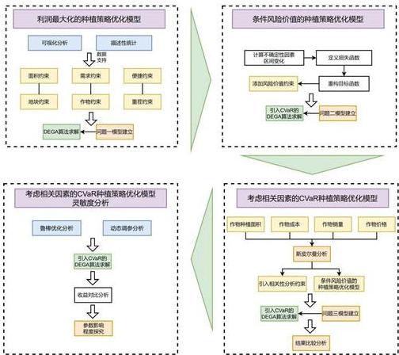

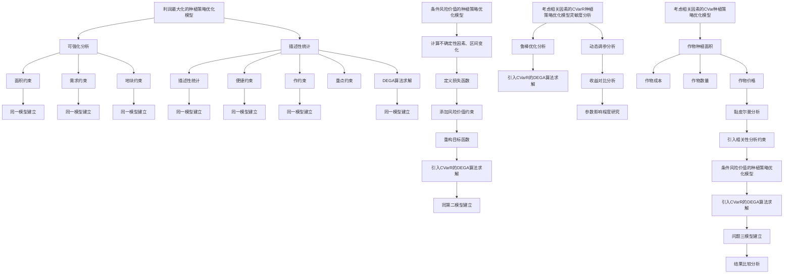

图1 总体思路框架

# 二、模型假设

1. 不考虑突发情况（如自然灾害等）对农作物种植的影响。  
2. 假设农作物之间的可替代性和互补性关系可以进行量化。  
3. 假设题目中的不确定因素是在给定的范围内随机分布的。  
4. 假设在满足豆类作物种植要求的基础上，该地区土壤肥力保持不变。  
5. 假设农作物之间的可替代性与互补性以及预期销售量、销售价格和种植成本的相关性规律可以作为利润最大化的约束条件。

# 三、符号说明

本节将文中使用到的相关数据符号进行说明。

<table><tr><td>符号</td><td>含义</td><td>单位</td><td>备注</td></tr><tr><td> ${x}_{ijt}^{n}$ </td><td>第  $t$  年、第  $j$  季、地块  $i$  上种植作物  $k$  的面积</td><td>亩</td><td>决策变量</td></tr><tr><td> ${z}_{ijt}^{n}$ </td><td>是否在第  $t$  年、第  $j$  季、地块  $i$  上种植作物  $k$ </td><td>-</td><td>二元决策变量</td></tr><tr><td> ${A}_{i}$ </td><td>地块的可用总面积</td><td>亩</td><td>常数</td></tr><tr><td> ${y}_{ijk}$ </td><td>作物  $k$  在第  $t$  年、第  $j$  季、地块  $i$  上的亩产量</td><td>斤</td><td>变量</td></tr><tr><td> ${d}_{jtk}$ </td><td>作物  $k$  在第  $t$  年、第  $j$  季的预期销售量</td><td>斤</td><td>变量</td></tr><tr><td> ${p}_{ijk}$ </td><td>作物  $k$  在第  $t$  年、第  $j$  季、地块  $i$  上的销售单价</td><td>元/斤</td><td>变量</td></tr><tr><td> ${c}_{ijk}$ </td><td>作物  $k$  在第  $t$  年、第  $j$  季、地块  $i$  上的种植成本</td><td>元/亩</td><td>变量</td></tr><tr><td> ${N}_{n}$ </td><td>基于差分进化算法的改进遗传算法的种群</td><td>-</td><td>随代数变化的矩阵</td></tr><tr><td> ${P}_{N}\left( I\right)$ </td><td>变异后生成的个体</td><td>-</td><td>变量</td></tr><tr><td> ${N}_{best}\left( I\right)$ </td><td>当前迭代次数下的种群中最优个体</td><td>-</td><td>变量</td></tr><tr><td> $F$ </td><td>缩放因子</td><td>-</td><td>控制差分向量的缩小</td></tr><tr><td> ${C}_{Nx}\left( I\right)$ </td><td>生成的第  $t$  个体</td><td>-</td><td>变量</td></tr><tr><td> ${CR}$ </td><td>种群交叉概率</td><td>-</td><td>关键参数</td></tr><tr><td>Fitness  $\left( {N}_{n}\right)$ </td><td>群体中每个个体的适应度</td><td>-</td><td>数值指标</td></tr><tr><td> ${q}_{i}$ </td><td>每个个体的累积概率</td><td>-</td><td>选择个体的工具</td></tr><tr><td> $r$ </td><td>小麦和玉米的销售量年增长率</td><td>-</td><td> $r \in  \left\lbrack  {{0.05},{0.1}}\right\rbrack$ </td></tr><tr><td> $\varepsilon$ </td><td>小麦和玉米以外农作物的销售量波动幅度</td><td>-</td><td> $\varepsilon  \in  \left\lbrack  {-{0.05},{0.05}}\right\rbrack$ </td></tr><tr><td> $\theta$ </td><td>各类农作物亩产量的年变化幅度</td><td>-</td><td> $\theta  \in  \left\lbrack  {-{0.1},{0.1}}\right\rbrack$ </td></tr><tr><td> $\beta$ </td><td>除羊肚菌外食用菌的年降价幅度</td><td>-</td><td> $\beta  \in  \left\lbrack  {{0.01},{0.05}}\right\rbrack$ </td></tr><tr><td> ${l}_{ijk}$ </td><td>在第  $t$  年、第  $j$  季、地块  $i$  上种植作物  $k$  的损失</td><td>-</td><td>损失函数</td></tr><tr><td> $\delta$ </td><td>可替代性农作物之间的调整因子</td><td>-</td><td> $\delta  > 0$ </td></tr><tr><td> $\sigma$ </td><td>互补性农作物之间的增幅比例</td><td>-</td><td> $\sigma  > 0$ </td></tr><tr><td> $w$ </td><td>各类农作物的成本年增长率</td><td>-</td><td> $w = {0.05}$ </td></tr><tr><td> ${\beta }_{k}$ </td><td>各类农作物的销售价格年增长率</td><td>-</td><td>参数</td></tr><tr><td> $\rho$ </td><td> ${d}_{ijk},{p}_{jtk},{c}_{ijk}$  之间的相关系数</td><td>-</td><td>变量</td></tr></table>

# 四、问题一的建模与求解

本节首先通过双重饼图和条形图对乡村耕地结构、农作物种植现状及亩均利润进行了可视化分析，为优化种植策略提供数据支持。随后，构建了以七年总利润最大化为目标的种植策略优化模型，综合考虑了12个关键约束条件，包括种植面积、作物限制等。接下来，基于差分进化算法的改进遗传算法，对超出预期销售量的作物分别在滞销浪费或按2023年销售价格的50%降价出售的情况下进行求解，得出了2024-2030年的最优种植方案，并通过热力图直观展示了2024年的种植方案。最后，进一步绘制2024-2030年各年度利润折线图和累计利润收敛曲线，分析滞销与50%降价情境下的总利润最大化情况。

# 4.1 问题分析

问题一的核心在于利用附件1和附件2中的数据，假设未来各类农作物的预期销售量、种植成本、亩产量及销售价格均与2023年保持一致，每季种植的农作物在当季销售。如果某作物的总产量超出预期销售量，则超出的部分有两种处理方式：一是滞销，二是按2023年销售价格的 $50\%$ 降价出售。以实现利润最大化为目标，分别制定该乡村2024\~2030年的最优种植方案。

具体而言，本节首先对乡村耕地结构、农作物种植现状及亩均利润进行了可视化分析。通过双重饼图分析乡村现有耕地结构，条形图展示主要农作物的种植现状及平均亩利润的对比。这些可视化结果为优化耕地利用和制定最佳种植策略提供了扎实的数据支持。

随后，本节构建以七年总利润最大化为目标的农作物种植策略优化模型。该模型综合考虑12个关键约束条件，包括地块种植面积上限、各地块农作物种植面积下限、决策变量的约束关系、禁止连续重茬种植、豆类作物的种植要求，以及ABC、D、E、F类地块的种植限制和食用菌的特殊种植要求。此外，还考虑了作物种植分散程度的限制，以及实际产量应基本满足预期销售量。

接下来，采用基于差分进化算法的改进遗传算法，针对超出预期销售量的作物，在滞销浪费或以2023年销售价格的50%降价出售的情境下进行求解，得出2024-2030年的最优种植方案，并通过热力图直观展示2024年的种植方案。该方案在多个约束条件下有效实现了种植收益的最大化。最后，通过绘制2024-2030年各年度利润折线图和累计利润收敛曲线，深入分析滞销与50%降价情境下的利润最大化情况。问题一的思维框架如下图所示：

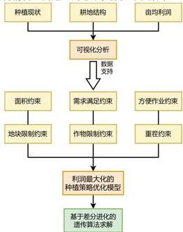

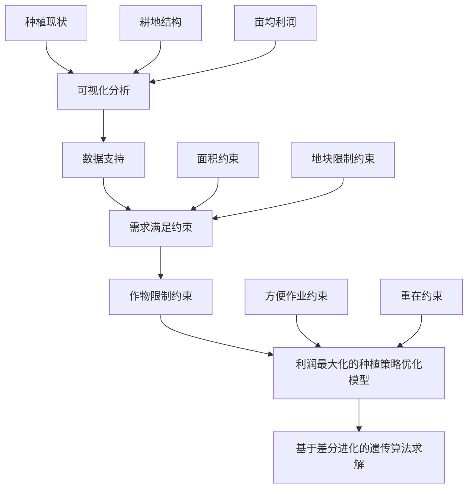

图 2 问题一的思维框架

# 4.2 数据预处理

本小节详细介绍了附件数据的预处理过程。首先，通过双重饼图对耕地结构进行全面的可视化分析，展示了不同类型耕地的占比和分布情况，揭示了乡村耕地资源的利用现状。这一分析有助于理解耕地资源的分配，并为后续优化策略奠定了基础。接着，计算了各类作物的产量及其在不同耕地条件下的亩产量对比，揭示了作物的生产潜力。同时，对各类农作物的平均亩利润进行排名，为优化耕地利用和制定最佳种植方案提供了有力的数据支持。这些数据的分析结果将为后续决策提供重要依据，从而有效提升耕地资源的使用效率和经济效益。

# 4.3 乡村耕地结构与农作物种植现状及亩均利润的可视化分析

本小节通过可视化手段对乡村耕地结构、农作物种植现状及平均亩利润进行了全面分析。首先，双重饼图深入剖析了耕地结构，展示了不同类型耕地的占比和分布，揭示了乡村耕地资源的利用情况。随后，条形图对主要农作物的种植情况进行了详细分析，清晰展示了各类作物的产量及其在不同耕地条件下的亩产量对比。最后，条形图展示了各类农作物的平均亩利润排名，为优化耕地利用和制定最佳种植方案提供了有力的数据支持。

# 4.3.1 乡村现有耕地结构的双重饼图分析

本小节通过双重饼图对乡村现有耕地结构进行了深入分析。内层饼图展示了各类耕地的总体分布情况，包括平旱地、梯田、山坡地、水浇地、普通大棚和智慧大棚。外层饼图进一步细化了这些耕地的具体构成，如普通大棚有16个和智慧大棚有4个。此双层可视化方式能够更加直观地呈现乡村耕地的多样性与分布特点，深化对乡村耕地结构的理解，并为未来的农业规划及农作物种植策略提供数据支持。

具体而言，左侧饼图展示了乡村露天耕地的分布情况，涵盖平旱地、梯田、山坡地和水浇地四类耕地，直观呈现了各类型露天耕地的占比。右侧饼图则聚焦于大棚的分布结构，详细展示了普通大棚和智慧大棚的比例构成，使本文对该乡村的耕地现状有了更加清晰的认识。

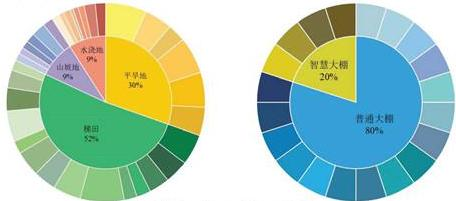  
图 3 露天耕地结构（左）与大棚耕地结构（右）分布图

由图3可知，该乡村现有露天耕地总面积为1201亩，分布在34个地块中，涵盖平旱地、梯田、山坡地和水浇地四种类型。其中，平旱地占 $30\%$ ，面积为365亩，分为6个地块，地块面积介于35亩至80亩之间。梯田是主要的耕地类型，占 $52\%$ ，总面积619亩，分布在14个地块，面积从20亩到86亩不等。山坡地和水浇地各占 $9\%$ ，山坡地面积为108亩，分为6个地块，面积范围在13亩至27亩之间；水浇地面积为109亩，分为8个地块，面积介于6亩至22亩之间。这些露天耕地多适合每年种植一季粮食类作物，而水浇地具备种植一季稻或两季蔬菜的潜力。

在大棚分布方面，村庄内共有16个普通大棚和4个智慧大棚，每个大棚占地0.6亩，普通大棚总面积为9.6亩，智慧大棚总面积为2.4亩。普通大棚具有一定的保温效果，适合每年种植一季蔬菜和一季食用菌。智慧大棚利用太阳能技术自动调节棚内温度，确保作物在冬季正常生长，每年可种植两季蔬菜。这种种植结构不仅有效提高了土地利用率，还为乡村现代农业的发展提供了重要支持。

综上所述，该乡村的露天耕地和大棚结构显示出合理的土地利用分布和多样化的种植模式。露天耕地主要用于一年一季的粮食作物种植，而水浇地则具备种植水稻或两季蔬菜的潜力。大棚的引入，尤其是智慧大棚的应用，进一步提升了农业种植的灵活性和产量，通过太阳能技术确保了作物在冬季的正常生长，实现了两季蔬菜的种植。这种耕地与设施相结合的模式，不仅为乡村现代农业的发展奠定了坚实基础，还显著提升了土地利用效率，推动了可持续农业的长远发展。

# 4.3.2 乡村农作物种植现状的条形图分析

本小节通过绘制2023年各类农作物总产量排名和不同耕地条件下主要农作物亩产量对比的条形图，深入分析了乡村农作物的种植现状。不仅展示了各类作物的产量分布，还揭示了不同耕地条件对主要作物产量的影响，为优化乡村农业结构和提升种植效益提供了有力的数据支持。

首先，本小节通过对乡村农作物总产量的条形图分析，直观展示了不同作物的产量分布。图表清晰地将各类作物按总产量进行排序，并以不同颜色区分作物类别，如粮食、蔬菜和食用菌等。通过该图表，不仅能够深入了解当前农作物种植的整体状况，还能进一步分析各类作物对乡村经济的贡献，为优化农业结构和制定农业发展规划提供数据支持。具体而言，图4展示了2023年各类农作物的总产量，并根据产量进行排名，清晰呈现了不同作物的生产情况，为未来的农业生产和规划提供了有力的数据依据。

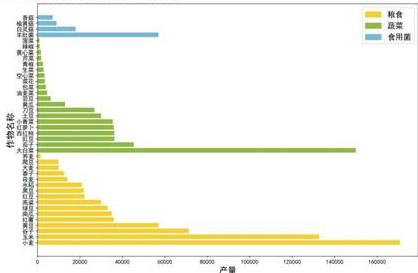  
图 4 2023 年各类农作物总产量排名

由图4可知，在2023年中，粮食作物的产量居于主导地位，其中小麦、玉米和谷子的产量显著高于其他作物。特别是小麦，在综合类别中占据了最大的产量份额，远超其他农作物。这表明，粮食作物的生产不仅是乡村经济的支柱，同时也是维持粮食安全的重要保障。同时，蔬菜类作物的产量紧随其后，主要集中在大白菜、茄子等品种上。蔬菜作物的高产量反映了其市场需求量的稳定增长，尤其是在城镇化进程加快的背景下，蔬菜类作物成为日常消费中的重要部分。高收益和市场需求的驱动促使蔬菜作物种植面积持续扩张，成为乡村经济发展的新兴动力。

此外，食用菌类作物虽然总产量较低，但其市场价值较高。图中反映了羊肚菌、白灵菇、榆黄菇和香菇等食用菌在总产量中的占比，这类高附加值作物越来越受到市场的青睐，尤其是在绿色健康饮食理念普及的情况下。尽管食用菌类作物的产量相对较少，但其收益潜力巨大，是农户在第二季次调整种植结构、增加收入的有力选择。

综合来看，2023年各类农作物的总产量呈现出粮食、蔬菜、食用菌等类别的多元化发展格局。粮食作物的种植面积和产量占据主导地位，而蔬菜和食用菌类作物则展现了较大的市场潜力和经济效益。值得注意的是，2023年所展示的农作物总产量不仅是当年生产的实际情况，也可以作为2024\~2030年期间农作物销售量的预期依据，为未来农作物种植策略和市场规划提供重要参考。

其次，本小节展示了主要粮食作物在平旱地、梯田和山坡地三种不同地形条件下的亩产量对比。通过对各类粮食作物的种植地形进行划分，可以有效分析地形差异对农作物产量的影响，从而为合理规划作物种植提供有力依据。

由图5可知，平旱地的粮食作物亩产量普遍较高，尤其是南瓜和红薯，展现了显著的产量优势。相较之下，梯田和山坡地的产量略低，特别是在梯田地形下，一些作物如荞麦表现出更适宜的种植条件，产量接近平旱地。而山坡地的整体产量较低，但部分耐旱作物如豆类依然能维持较好的产量水平。总体而言，平旱地仍是粮食作物种植的首选地形，但根据不同作物的特性，梯田和山坡地也具备一定的种植潜力。

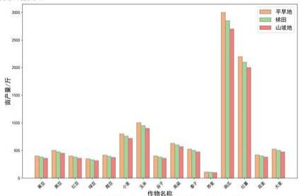  
图 5 不同耕地条件下主要粮食作物亩产量对比

此外，图6展示了在水浇地、普通大棚、智慧大棚第一季和第二季四种条件下，主要蔬菜作物的亩产量对比。通过对比不同耕地条件下的产量，可以分析耕地类型和种植季节对蔬菜作物产量的影响，从而为优化蔬菜种植结构和提高产量提供依据。

由图6可知，普通大棚和智慧大棚第一季的蔬菜亩产量整体较高，尤其是黄瓜和空心菜，这两类作物在大棚种植条件下展现出显著的增产优势。相比之下，智慧大棚第二季和水浇地的产量相对较低，但仍能保持较为稳定的水平。智慧大棚第二季的产量略低于第一季，可能与气候条件或作物的生长周期有关。总体而言，大棚技术展现了明显的优势，有效提升了蔬菜的亩产量，特别是黄瓜、空心菜和茄子等经济效益较高的作物，展现出智慧农业在提升产量和资源利用效率方面的巨大潜力。

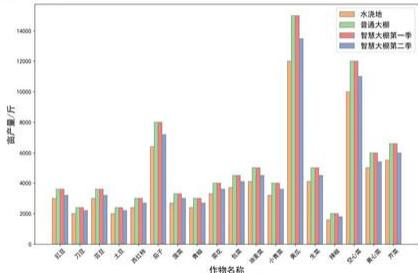  
图 6 不同耕地条件下主要蔬菜作物亩产量对比

# 4.3.3 乡村农作物平均亩利润的条形图分析

本小节重点分析了2023年各类农作物的亩均利润，依据前文计算的作物总产量，并结合附件2中的平均销售单价及每亩种植成本进行测算。结果显示，不同农作物的利润差异显著。通过对粮食类、蔬菜类及食用菌类的亩均利润进行分类分析，可以为未来的种植决策提供重要的参考依据。

本小节进一步绘制了2023年各类农作物的平均亩利润条形图，涵盖了粮食类、蔬菜类和食用菌类三大类作物，如图7所示。该图直观地展示了各类作物之间的亩均利润差异，为农业决策者提供了清晰的数据参考，帮助其更好地制定种植决策。

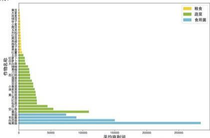

<details>
<summary>bar</summary>

| 类别 | 平均亩利润 |
|---|---|
| 粮食 | 0 |
| 蔬菜 | 0 |
| 合用菌 | 0 |
</details>

图 7 2023 年各类农作物平均亩利润排名

由图 7 可知，粮食类作物的亩均利润整体偏低，其中红薯和荞麦的利润相对较高，但仍远低于 50000 元。由于这类作物市场需求相对稳定、单价波动较小，加之较高的种植成本，导致其利润水平较低。这表明，粮食类作物的种植收益对农户而言较为有限。

蔬菜类作物的亩均利润显著高于粮食类，尤其是黄瓜、空心菜等高附加值品种，亩均利润突破了50000元，与前文提到的黄瓜、空心菜的亩产量高密切呼应。其高利润得益于较高的市场需求和快速的周转周期，使蔬菜种植成为高收益的农业产业。

此外，食用菌类作物的亩均利润表现尤为突出，尤其是榆黄菇，亩均利润接近300000元，远超其他作物。其高利润来源于较高的种植技术门槛、旺盛的市场需求以及较高的产品单价。因此，食用菌类作物对农户的种植技术和市场掌控能力要求较高，但其带来的回报同样显著。

综上所述，图7清晰地展示了不同类别农作物的亩均利润差异。粮食类作物的亩均利润整体偏低。相比之下，蔬菜类作物的亩均利润显著提升，尤其是黄瓜和空心菜等高附加值作物。食用菌类作物的利润则更加突出，以榆黄菇为代表，其亩均利润接近300000元。因此，不同作物的利润水平反映了市场需求、种植成本及技术门槛对农业收益的深刻影响。

# 4.4 利润最大化的农作物种植策略优化模型的建立

本小节探讨了如何构建利润最大化的农作物种植策略优化模型。通过综合考虑不同农作物的种植条件和耕地类型等关键因素，旨在为农户提供最优种植组合方案，以实现整体利润的最大化。首先，确定影响农作物种植收益的主要变量，然后建立数学模型进行优化求解。最终，该模型将输出最佳种植策略，为提升农业生产效益和资源利用率提供科学依据。

根据问题描述，本小节构建了以利润最大化为目标的农作物种植策略优化模型。该模型在构建过程中，结合了题目和表格中的12个关键约束条件，包括地块种植面积上限、各地块农作物种植面积下限、决策变量的约束关系、禁止连续重茬种植、豆类作物种植要求、ABC类地块的种植限制、D类地块的种植限制、E类地块的种植限制、F类地块的种植限制、食用菌的种植限制、作物种植的分散程度限制，以及实际产量基本满足预期销售量。基于这些约束条件和目标函数，构建了以下变量及数学模型。

# 4.4.1 决策变量的定义

在建立农作物种植策略优化模型时，决策变量是模型的核心组成部分，用于描述不同农作物在特定地块、季次和年份中的种植情况。通过合理定义这些变量，本文可以量化每种作物的种植面积及其分配方式，从而为实现种植收益的最大化提供依据。同时，二元决策变量用于控制每种作物是否在特定地块上种植，这为模型加入了更加灵活的约束条件，使得模型能够更加贴合实际农业生产的需求。本节定义了以下两个主要决策变量：

# (1)种植面积 $x_{ijt}^{k}$

该变量表示在第t年，第j季，地块i（如A1、A2）上种植作物编号k的面积，单位为亩。每个地块类型代表不同的耕地条件，包括平旱地、梯田、山坡地、水浇地、普通大棚和智慧大棚。该变量的取值反映了不同作物在不同时间和地块类型上的种植面积，是模型优化的关键部分。通过合理分配这些种植面积，能够优化种植结构，从而实现农作物收益的最大化。

# (2)作物选择 $z_{ijt}^{k}$

该变量为二元决策变量，用来表示是否在第 $t$ 年，第 $j$ 季，地块 $i$ 上种植作物 $k$ 。其中 $z_{ijt}^{k} = 1$ 表示在该地块的相应年份和季次种植作物 $k$ ；而 $z_{ijt}^{k} = 0$ 表示不种植作物 $k$ 。这个二元变量的引入，使得模型能够对作物的种植与否进行有效控制，结合种植面积变量 $x_{ijt}^{k}$ ，可以确保种植决策的合理性和符合实际约束条件，比如避免连续重茬种植或满足作物特定种植需求。

通过以上两个决策变量的定义，模型能够灵活地描述不同农作物在多种地块上的种植情况，为实现整体种植方案的优化奠定了基础。

# 4.4.2 约束条件的设定

本小节将详细介绍模型中的约束条件，这些条件确保了农作物种植决策的合理性和可行性。约束条件涵盖了地块总面积、地块种植面积下限、决策变量的约束关系、禁止连续重茬种植、豆类作物的特殊种植要求、ABC类地块只能种植单季粮食作物，水浇地、普通大棚、智慧大棚和食用菌的种植限制，以及作物种植的分散程度限制和实际产量基本满足预期销售量。通过这些约束的设定，模型能够准确反映实际种植规则，为制定符合现实条件的最优种植策略提供保障。具体而言，本小节构建了以下12个关键约束条件：

# (1) 地块种植面积上限

该约束条件确保在第t年，第j季，地块i上用于种植作物的总面积不能超过该地块的可用总面积 $A_{i}$ 。具体来说，对于每个地块i，作物k的种植面积 $x_{ijt}^{k}$ 的总和必须小于或等于地块的总面积 $A_{i}$ ，即：

$$
\sum_ {k = 1} ^ {4 1} x _ {i j t} ^ {k} \leq A _ {i}, \forall i \in \{A 1, A 2, \dots , F 4 \}, j, t \tag {1}
$$

式中， $i \in \{A1, A2, \cdots, F4\}$ 表示不同的地块，涵盖了多种耕地类型和条件，包括各种地形和耕作环境，总计 54 块地。

这一约束条件的引入是为了确保每一个地块的种植面积合理分配，不超过其最大承载能力，从而避免因种植面积超出可用土地面积而导致的不可行解。通过此限制，模型能够更加准确地模拟现实中的耕地资源限制，进而优化农作物种植策略。

# (2) 各地块农作物种植面积下限

根据分析，2023年每种农作物在各地块的种植面积均不小于地块总面积的50%。因此，模型中加入了农作物种植面积的下限约束，要求每种作物在特定地块上的种植面积至少达到该地块总面积的50%。这一限制反映在公式(2)中：

$$
x _ {i j t} ^ {k} \geq 0. 5 \cdot A _ {i} \cdot z _ {i j t} ^ {k}, \forall i \in \{\mathrm{A1,A2,} \dots , \mathrm{F4} \}, j, t, k \tag {2}
$$

这一约束条件确保了种植面积的合理分配，防止种植面积过小而导致资源浪费或土地利用效率低下。通过设定种植面积的下限，模型能够更好地优化农作物种植方案，既符合实际种植条件，又保障了每块地的土地资源得到充分利用。

# (3) 决策变量的约束关系

该约束条件规定了种植面积变量 $x_{ijt}^{k}$ 与作物选择变量 $z_{ijt}^{k}$ 之间的逻辑关系。具体而言，若作物选择变量 $z_{ijt}^{k}$ 为0，表示不种植作物 $k$ ，则种植面积 $x_{ijt}^{k}$ 也必须为0；若 $z_{ijt}^{k}$ 为1，表示种植该作物，则种植面积 $x_{ijt}^{k}$ 的值必须小于或等于地块i的可用总

面积 $A_{i}$ 。这一关系通过公式(3)表达为：

$$
x _ {i j t} ^ {k} \leq A _ {i} \cdot z _ {i j t} ^ {k}, \forall i \in \{\mathrm{A1,A2,} \dots , \mathrm{F4} \}, j, t, k \tag {3}
$$

此约束的引入确保了在模型中，只有当某块地选择种植特定作物时，才会分配相应的种植面积。这样可以避免模型出现不合理的种植面积分配情况，比如在未选择种植的地块上错误地分配了面积。通过限制 $x_{ijt}^{k}$ 与 $z_{ijt}^{k}$ 的关联，模型能够更好地反映实际的耕作决策，保证优化方案的合理性和可行性。

# (4) 禁止连续重茬种植

为了避免连续种植同一作物造成土壤肥力下降或病虫害积累，模型中引入了禁止重茬种植的约束条件。这一约束根据地块类型的不同，做了相应的规定。

首先，对于 A 类、B 类、C 类地块，即平旱地、梯田和山坡地，这些地块适合每年只种植一季粮食类作物，因此约束条件规定不允许在连续年份的同一地块上重复种植同一种作物。具体通过公式(4)表达为：

$$
z _ {i 1 t} ^ {k} \cdot z _ {i 1 (t + 1)} ^ {k} = 0, \forall i \in \{A 1, A 2, \dots , C 6 \}, t, k \tag {4}
$$

这意味着在这些地块上，如果某一年的某个作物k已经种植，则下一年不能继续种植同一作物。

其次，对于 D 类、E 类、F 类地块，即可以每年种植两季的地块，模型规定相邻两季的作物不能相同，避免因重复种植同一作物影响土壤质量。在连续两年中，上一年的第二季作物与下一年的第一季作物也不能相同。这一约束通过公式(5)表示：

$$
\begin{array}{l} z _ {i 1 t} ^ {k} \cdot z _ {i 2 t} ^ {k} = 0, \forall i \in \{D 1, D 2, \dots , F 4 \}, t, k \tag {5} \\ z _ {i 2 t} ^ {k} \cdot z _ {i 1 (t + 1)} ^ {k} = 0, \forall k, t \\ \end{array}
$$

这些约束条件确保了每块地在不同季次或年份之间轮换种植不同的作物，保证了耕地的可持续利用与作物产量的长期稳定性，有助于提高农业生产效率并降低病虫害的发生概率。

# (5)豆类作物种植要求

由于豆类作物的根菌能够促进土壤中的氮固定，有助于其他作物的生长，从2023年起，模型要求每块地（包括大棚地块）在三年内至少种植一次豆类作物。该要求适用于所有地块类型。其中，豆类作物的编号分别为1、2、3、4、5、17、18、19。具体约束通过公式(6)表示为：

$$
\sum_ {t = t} ^ {t + 2} \sum_ {k} z _ {i j t} ^ {k} \geq 1, \forall i \in \{A 1, A 2, \dots , F 4 \}, t, k \in \{1, 2, 3, 4, 5, 1 7, 1 8, 1 9 \} \tag {6}
$$

这一约束条件确保了每块地在三年内至少种植一次豆类作物，充分利用其对土壤的改善作用，优化农作物结构，提升作物整体产量和土壤肥力。通过这种种植方式，不仅能够提高农业生产的可持续性，还能有效减少化肥的使用，达到绿色种植的目的，进而促进农业生态系统的良性循环。

# (6) A、B、C 类地块的种植限制

A 类、B 类和 C 类地块分别为平旱地、梯田和山坡地，这些地块每年只能种植一季粮食类作物，适合的作物编号为 1 至 15，水稻除外。这一限制确保了在这些地块上，作物种植不会超出其承载能力，尤其是避免种植多季或过度耗水的作物，如水稻。具体来说，公式(7)表达了这一限制：

$$
z _ {i 2 t} ^ {k} = 0, \forall i \in \{A 1, A 2, \dots , C 6 \}, t, k \in \{1, 2, \dots , 1 5 \} \tag {7}
$$

这一约束条件旨在保证 A、B、C 类地块每年只种植一季粮食类作物，防止土地因过度耕作而退化或影响土壤质量。同时，这一规定也考虑了不同地形的耕作特性，确保农作物与地块条件的匹配性，优化农业种植结构，提升产量和土壤可持续利用性。

# (7) D 类地块的种植限制

D 类地块是水浇地，适合种植每年一季水稻或两季蔬菜。为了确保合理利用水资源和地块，模型对 D 类地块的作物种植做了多项限制，涵盖水稻和蔬菜的种植条件。具体约束如下：

首先，D 类地块一年只能选择种植水稻或蔬菜中的一种，不能混合种植。水稻的编号为 16，蔬菜的编号为 17 至 37。公式(8)对此进行了约束：

$$
z _ {i 1 t} ^ {1 6} \cdot \sum_ {k} \left(z _ {i 1 t} ^ {k} + z _ {i 2 t} ^ {k}\right) = 0, \forall i \in \{D 1, D 2, \dots , D 8 \}, t, k \in \{1 7, 1 8, \dots , 3 7 \} \tag {8}
$$

其中，若地块一年只能种植一季农作物，也认为k=1。

其次，D类地块每年第一季不能种植大白菜、白萝卜和红萝卜，编号为35、36、37的作物只能在第二季种植。这一限制旨在避免在第一季种植对水资源需求较高的作物，保护水浇地的生态平衡。公式(9)和(10)规定了该限制：

$$
z _ {i 1 t} ^ {k} = 0, \forall i \in \{D 1, D 2, \dots , D 8 \}, t, k \in \{3 5, 3 6, 3 7 \} \tag {9}
$$

$$
z _ {i 2 t} ^ {k} = 0, \forall i \in \{D 1, D 2, \dots , D 8 \}, t, k \notin \{3 5, 3 6, 3 7 \} \tag {10}
$$

此外，D类水浇地不能种植除水稻和蔬菜之外的其他作物，该限制通过公式(11)进行表达：

$$
\sum_ {k} z _ {i j t} ^ {k} = 0, \forall i \in \{D 1, D 2, \dots , D 8 \}, j, t, k \notin \{1 6, 1 7, 1 8, \dots , 3 7 \} \tag {11}
$$

这些约束条件的引入确保了 D 类水浇地的高效利用，避免了因作物过度耗水或种植冲突导致的资源浪费。通过合理分配水稻和蔬菜的种植时间，能够更好地发挥水浇地的农业潜力，同时保护地块的长远生产能力。

# (8) E 类地块的种植限制

E 类地块为普通大棚，适合每年种植一季蔬菜和一季食用菌。为了合理利用普通大棚的空间和种植条件，模型对 E 类地块的作物种植做了如下限制：

首先，E类地块在第一季可以种植蔬菜，但不允许种植大白菜、白萝卜和红萝卜，这些作物编号为35、36、37。其具体限制由公式(12)表述：

$$
\sum_ {k} z _ {i 1 t} ^ {k} = 0, \forall i \in \{\mathrm{E} 1, \mathrm{E} 2, \dots , \mathrm{E} 1 6 \}, t, k \in \{3 5, 3 6, 3 7 \} \tag {12}
$$

此约束确保了大棚在第一季的种植不被耗水量大或对大棚环境要求高的作物占用，从而保持大棚的种植效率。

其次，E类地块的第二季只允许种植食用菌类作物，食用菌的编号为38、39、40、41。这个限制的目的在于优化大棚在第二季的种植结构，专门用于食用菌类的高效生产。具体的约束通过公式(13)进行表示：

$$
\sum_ {k} z _ {i 2 t} ^ {k} = 0, \forall i \in \{\mathrm{E1}, \mathrm{E2}, \dots , \mathrm{E16} \}, t, k \notin \{3 8, 3 9, 4 0, 4 1 \} \tag {13}
$$

这一系列的种植限制条件有助于 E 类普通大棚在不同季节中最大化利用其种植能力，确保蔬菜和食用菌的合理轮作。同时，避免在大棚中种植不适合的作物，提升产量和资源利用率，为农户提供更加稳定和高效的种植方案。

# (9) F 类地块的种植限制

F 类地块为智慧大棚，适合每年种植两季蔬菜。为了合理利用智慧大棚的高科技环境和资源，模型对 F 类地块的种植做出了严格限制，确保大棚的种植结构最优。

首先，F类地块在两季中均不得种植大白菜、白萝卜和红萝卜，这些作物的编号为35、36、37。这一限制旨在避免种植需水量大或对温度、湿度等大棚条件要求较高的作物，从而优化大棚内其他蔬菜的种植环境。公式(14)对此限制进行了表达：

$$
\sum_ {k} z _ {i j t} ^ {k} = 0, \forall i \in \{\mathrm{F1}, \mathrm{F2}, \mathrm{F3}, \mathrm{F4} \}, j, t, k \in \{3 5, 3 6, 3 7 \} \tag {14}
$$

这一约束的引入，确保了智慧大棚能够在每年两季中种植对环境要求相对较低的蔬菜作物，充分发挥大棚的智能管理优势，避免因种植不适宜的作物导致产量下降或资源浪费。通过这种限制，智慧大棚能够实现更高效的生产，提升农作物的整体产量和品质。

# (10)食用菌的种植限制

本约束条件规定了食用菌的种植限制，确保合理分配其种植地块和季节。食用菌（编号为38、39、40、41）只能在普通大棚（E类地块）中的第二季种植，在其他地块或季节均不允许种植。该规定旨在优化普通大棚的资源利用，确保食用菌能够在适宜的环境下高效生长。

具体来说，公式(15)约束了食用菌只能在普通大棚的第二季种植：

$$
z _ {i 1 t} ^ {k} = 0, \forall i \in \{\mathrm{E} 1, \mathrm{E} 2, \dots , \mathrm{E} 1 6 \}, t, k \in \{3 8, 3 9, 4 0, 4 1 \} \tag {15}
$$

此外，公式(16)进一步明确了食用菌不能在其他类型的地块（如A、B、C、D、F类地块）中种植，不论是第一季还是第二季，都禁止种植食用菌：

$$
z _ {i j t} ^ {k} = 0, \forall i \in \{A, B, C, D, F \}, \forall j, t, k \in \{3 8, 3 9, 4 0, 4 1 \} \tag {16}
$$

通过这两项约束，模型确保食用菌在适合的条件下种植，避免在不适宜的地块或季节中种植食用菌，防止资源浪费和产量下降。同时，这种合理的种植规划有助于提高普通大棚的利用率，实现作物种植的最优配置。

# (11)作物种植的分散程度限制

为保证农作物的有效管理与高效生产，减少季节性种植的过度分散具有重要意义。作物种植地块的分散不仅会增加管理难度，还可能导致资源浪费，例如机械设备和人力资源的重复投入等。此外，地块的高度分散会影响农田的统一灌溉、施肥以及病虫害的防治工作，从而影响农作物的产量和品质。

因此，本小节通过约束式(17)控制每个作物每季的种植地块数量，使其不超过5，旨在避免作物过度分散。此限制能够平衡种植地块数量与管理效率之间的关系，确保农作物的种植既具有规模效应，又能维持一定的灵活性。

$$
\sum_ {i = 1} ^ {5 4} z _ {i j t} ^ {k} \leq 5, \forall j, t, k \tag {17}
$$

在面对多个品种和多季节的种植规划时，该限制有助于维持合理的农田分布和有效的农业生产活动。因此，合理控制种植地块的分散度，不仅有助于提高农作物的产出效率，还能降低农业生产成本。

# (12) 实际产量基本满足预期销售量

在农业生产规划中，保证农作物的实际产量能够基本满足市场的预期需求至关重要。这不仅直接关系到农户的收入和经济效益，还涉及到供应链的稳定性和市场的供需平衡。为此，本小节通过约束式(18)确保每个季节每种作物的实际产量至少达到预期销售量的0.9倍。这意味着，即使在不确定的环境因素影响下，农作物的生产也要接近预测的需求，以避免由于供货不足而造成的经济损失。

$$
\sum_ {i = 1} ^ {5 4} x _ {i j t} ^ {k} \cdot y _ {i j t k} \geq 0. 9 \cdot d _ {j t k}, \forall j, t, k \tag {18}
$$

通过设定该约束，农户和农业管理者可以根据市场需求进行合理规划，确保了市场的正常供应。同时，该约束还增强了农作物生产的灵活性，允许一定的产量波动范围，有助于应对天气、病虫害等不确定因素的影响。合理运用这一约束能够更好地协调农业生产与市场需求的关系，从而最大限度地保障农业生产的稳定性和效益。

综上所述，本模型共设计了12个关键约束条件，包括地块种植面积上限、各地块农作物种植面积下限、决策变量的约束关系、禁止连续重茬种植、豆类作物种植要求、ABC类地块的种植限制、D类地块的种植限制、E类地块的种植限制、F类地块的种植限制、食用菌的种植限制、作物种植的分散程度限制，以及实际产量基本满足预期销售量。这些约束条件的设定确保了模型在实际应用中的可行性与合理性，既充分利用了土地资源，又避免了不合理的种植安排，从而为实现农作物种植的利润最大化提供了坚实的保障。

# 4.4.3 目标函数的设定

在农作物种植策略优化模型中，目标函数的设定至关重要，直接影响着模型的优化结果和实际收益。本模型的目标是在未来七年（2024-2030年）内，通过合理分配种植面积、作物种类，最大化农作物种植的总利润。目标函数不仅要平衡销售收入与种植成本，还需要综合考虑作物产量、预期销售量等多个因素，以实现利润最优。

目标函数的核心是最大化七年的总利润，即总销售收入减种植成本。具体来说，模型假设各类作物的预计销售量、亩产量、种植成本和销售价格相对于2023年保持不变，并考虑了该乡村的54个地块和适宜种植的41种作物。目标函数使用多重求和公式来涵盖每个地块、每个作物在每一季中的贡献，以此确定最优的种植策略。

目标函数还考虑了产量大于预计销售量的情况。模型使用 $\alpha$ 系数来处理超出销售预期的作物产量，以反映在供过于求的情况下，农作物的价格会下降。由题目可知，本文分别设定 $\alpha=0$ 和 $\alpha=0.5$ 。通过这一机制，模型能够有效应对市场波动，确保即使在供过于求的情况下，农作物也能够以合理的价格销售。具体函数如下所示：

$$
\begin{array}{l} \max \sum_ {t = 2 0 2 4} ^ {2 0 3 0} \sum_ {i = 1} ^ {5 4} \sum_ {j = 1} ^ {2} \sum_ {k = 1} ^ {4 1} \left(\min \left(x _ {i j t} ^ {k} \cdot y _ {i j t k}, d _ {j t k}\right) \cdot p _ {i j t k} + \alpha \cdot \max \left(x _ {i j t} ^ {k} \cdot y _ {i j t k} \right. \right. \tag {19} \\ - d _ {j t k}, 0) \cdot p _ {i j t k} - x _ {i j t} ^ {k} \cdot c _ {i j t k}) \\ \end{array}
$$

式中， $y_{ijtk}$ 表示作物 k 在第 t 年、第 j 季、地块 i 上的亩产量，单位为斤； $d_{itk}$ 表示作物 k 在第 t 年、第 j 季的预期销售量，单位为斤，本文参考 2023 年各农作物的实际产量，作为未来预期销售量的预估依据； $p_{ijtk}$ 表示作物 k 在第 t 年、第 j 季、地块 i 上的销售单价，单位为元/斤，本文参考附件 2 中 2023 年统计的平均销售单价，作为未来销售单价的预估依据。而 $c_{ijtk}$ 表示作物 k 在第 t 年、第 j 季、地块 i 上的种植成本，单位为元/亩。通过这一目标函数，模型可以计算出在每个地块上不同作物的产量和收益，进而优化种植方案，确保利润最大化。

最终，通过该目标函数的设定，模型能够根据各类作物的产量、价格和市场需求，优化未来七年的种植策略。结合之前设定的12个约束条件，目标函数为农户提供了可行的种植优化方案，在最大化利润的同时，保障了土地和资源的高效利用，为农业生产的长期可持续性提供了科学的指导。

因此，根据以上约束条件与目标函数建立的农作物种植策略优化模型为：

$$
\begin{array}{l} \max \sum_ {t = 2 0 2 4} ^ {2 0 3 0} \sum_ {i = 1} ^ {5 4} \sum_ {j = 1} ^ {2} \sum_ {k = 1} ^ {4 1} \left(\min \left(x _ {i j t} ^ {k} \cdot y _ {i j t k}, d _ {j t k}\right) \cdot p _ {i j t k} + \alpha \cdot \max \left(x _ {i j t} ^ {k} \cdot y _ {i j t k} \right. \right. \\ - d _ {j t k}, 0) \cdot p _ {i j t k} - x _ {i j t} ^ {k} \cdot c _ {i j t k}) \\ \sum_ {k = 1} ^ {4 1} x _ {i j t} ^ {k} \leq A _ {i}, \forall i \in \{A 1, A 2, \dots , F 4 \}, j, t \\ x _ {i j t} ^ {k} \geq 0. 5 \cdot A _ {i} \cdot z _ {i j t} ^ {k}, \forall i \in \{\mathrm{A1,A2,} \dots , \mathrm{F4} \}, j, t, k \\ x _ {i j t} ^ {k} \leq A _ {i} \cdot z _ {i j t} ^ {k}, \forall i \in \{\mathrm{A1,A2,} \dots , \mathrm{F4} \}, j, t, k \\ z _ {i 1 t} ^ {k} \cdot z _ {i 1 (t + 1)} ^ {k} = 0, \forall i \in \{A 1, A 2, \dots , C 6 \}, t, k \\ \sum_ {t = t} ^ {t + 2} \sum_ {k} z _ {i j t} ^ {k} \geq 1, \forall i \in \{A 1, A 2, \dots , F 4 \}, t, k \in \{1, 2, 3, 4, 5, 1 7, 1 8, 1 9 \} \\ z _ {i 2 t} ^ {k} = 0, \forall i \in \{A 1, A 2, \dots , C 6 \}, t, k \in \{1, 2, \dots , 1 5 \} \tag {20} \\ z _ {i 1 t} ^ {1 6} \cdot \sum_ {k} \left(z _ {i 1 t} ^ {k} + z _ {i 2 t} ^ {k}\right) = 0, \forall i \in \{D 1, D 2, \dots , D 8 \}, t, k \in \{1 7, 1 8, \dots , 3 7 \} \\ \sum_ {k} z _ {i 1 t} ^ {k} = 0, \forall i \in \{\mathrm{E} 1, \mathrm{E} 2, \dots , \mathrm{E} 1 6 \}, t, k \in \{3 5, 3 6, 3 7 \} \\ \sum_ {k} z _ {i j t} ^ {k} = 0, \forall i \in \{\mathrm{F1}, \mathrm{F2}, \mathrm{F3}, \mathrm{F4} \}, j, t, k \in \{3 5, 3 6, 3 7 \} \\ z _ {i j t} ^ {k} = 0, \forall i \in \{A, B, C, D, F \}, \forall j, t, k \in \{3 8, 3 9, 4 0, 4 1 \} \\ \sum_ {i = 1} ^ {5 4} z _ {i j t} ^ {k} \leq 5, \forall j, t, k \\ \sum_ {i = 1} ^ {5 4} x _ {i j t} ^ {k} \cdot y _ {i j t k} \geq 0. 9 \cdot d _ {j t k}, \forall j, t, k \\ \end{array}
$$

# 4.5 基于差分进化算法的改进遗传算法的运用

优化算法在解决复杂问题时发挥了重要作用，其中遗传算法与差分进化算法作为两种经典的进化算法，广泛应用于多领域的全局优化问题。本文将遗传算法与差分进化算法相结合，旨在充分发挥二者的优势，提高算法的收敛速度与精度，从而为复杂优化问题的求解提供更有效的解决方案。

遗传算法（Genetic Algorithm, GA）源于对生物进化过程的模拟，是一种全局优化方法。其核心思想是通过模拟自然选择、遗传和变异等生物进化现象，从初始和群中进行随机选择、交叉和变异，逐步产生更适应环境的个体，使种群在搜索空间中进化到更优区域[1]。遗传算法的主要步骤包括染色体编码、种群初始化、选择、交叉和变异。它通过群体搜索策略及群体内基因的信息交换，具备较强的全局搜索能力[2]。然而，遗传算法也存在陷入局部最优解的风险，限制了其在某些复杂优化问题中的效果。

差分进化算法（Differential Evolution, DE）是在遗传算法基础上发展而来的一种多目标优化算法，特别适用于求解多维空间中的全局最优解[3]。差分进化算法与遗传算法类似，也通过随机生成初始种群，并通过变异、交叉、选择三个步骤优化和群。不同的是，差分进化算法通过父代差分向量生成变异向量，新的个体由交叉操作生成后，再与其父代个体进行选择，从而提高了全局搜索能力[4]。然而，差分进化算法也可能面临种群停滞和局部最优陷阱等问题。

为了克服遗传算法容易陷入局部最优解的问题，本文将差分进化算法引入遗传算法的框架中。差分进化算法强大的全局寻优能力可以加速遗传算法的收敛速度，并提高其精度。在种群初始化时，采用反向数组法选择适应度较低的种群作为初始个体，进一步提升算法的全局搜索能力和收敛精度[5]。通过结合两者的优势，本文采用基于差分进化算法的改进遗传算法（DEGA算法），有效提升了在农作物种植策略优化中实现利润最大化的求解效率，能够获得更优解。基于差分进化算法的改进遗传算法的具体步骤如下：

# Step 1 适应度函数

适应度函数用于评估种群优劣程度。在本文的农作物种植策略优化模型中，适应度函数以利润最大化为目标进行设计。适应度值越高，表示该种植策略的预期利润越大，种群越优。在计算个体适应度时，首先对初始化的种群进行处理，基于各类作物的言均利润及耕地条件，构建三次样条拟合模型，用以拟合作物种植面积与利润之间的关系，生成曲线以得到每一作物在不同耕地条件下的最优种植分配方案，具体为：

$$
\left\{ \begin{array}{l l} X (T), & X (T + 1), X (T + N) \\ Y (T), & Y (T + 1), Y (T + N) \\ Z (T), & Z (T + 1), Z (T + N) \end{array} \right. \tag {21}
$$

利用差分思想设计适应度函数，具体为：

$$
\text { Fitness } = \sum_ {t = 1} ^ {t = N - 1} \sqrt {\Delta X (t) + \Delta Y (t) + \Delta Z (t)} \tag {22}
$$

$$
\left\{ \begin{array}{l} \Delta X (t) = X (T + 1) - X (T) \\ \Delta Y (t) = Y (T + 1) - Y (T) \\ \Delta Z (t) = Z (T + 1) - Z (T) \end{array} \right. \tag {23}
$$

# Step 2 种群初始化

首先，根据乡村耕地结构与农作物种植现状及亩均利润的可视化分析结果，初始化n个个体 $N_{1},N_{2},N_{3},N_{4},N_{5},N_{6},\cdots,N_{n}$ ，组成初代种群；其次，对种群中每个个体进行三次方样条数据蕴涵，生成n条路径；然后，对生成的路径点进行变异操作，尽量避免初代种群陷入局部最小值；最后对生成路径的点进行反向反射，以生成反向数，并扩大种群搜索路径范围，形成 $N_{1},N_{2},N_{3},N_{4},N_{5},\cdots,N_{2n}$ 种群。计算适应度时应选取前n个适应度较低的个体组成的初始种群。

# Step 3 染色体编码

编码即将问题的可行解从其解空间转换到遗传算法所能处理的搜索空间的转换方法。常见编码方法包括二进制编码、格雷码编码、浮点数编码、实数编码。本文采用实数编码方法，对生成种群的个体随机选取待操作染色体 $N_{1,pos}, N_{2,pos}, N_{3,pos}, N_{4,pos}, \cdots, N_{n,pos}$ 。

# Step 4 变异操作

在改进算法中,变异操作即选择差分进化算法变异方式对种群中的每个个体进行变异操作,并采用最佳向量作为当前基向量的变异策略,以加快种群的收敛速度,保证种群多样性。通过变异操作生成新种群,具体公式为:

$$
P _ {N} (i) = N _ {\text {best}} (i) + F \times \left[ N _ {1} (i) - N _ {2} (i) \right] + F \times \left[ N _ {3} (i) - N _ {4} (i) \right] \tag {24}
$$

式中， $P_{N}(i)$ 为对应变异后生成的个体； $N_{best}(i)$ 为当前迭代次数下的种群中最优个体； $F$ 为缩放因子； $N_{1}(i)$ 、 $N_{2}(i)$ 、 $N_{3}(i)$ 、 $N_{4}(i)$ 为种群中互不相同的个体。

# Step 5 交叉操作

在改进算法中,交叉操作即对变异后产生的种群中的个体按一定概率对染色体中的基因进行交叉,通过交叉操作生成新种群,具体公式为:

$$
C _ {N x} (i) = \left\{ \begin{array}{l} P _ {N x} (i), i f r a n d (0, 1) \leqslant C R | | i = i _ {r a n d} \\ N _ {x} (i), e l s e \end{array} \right. \tag {25}
$$

式中， $C_{Nx}(i)$ 为生成的第 i 个体；CR 为种群交叉概率，设置 $i = i_{rand}$ 以提高个体之间交叉概率， $i_{rand}$ 为 $[0, n]$ 之间的随机数。

# Step 6 选择操作

改进算法中，选择操作即采用遗传算法中的轮盘赌方式整合变异后生成的种群与交叉之后的种群，以形成新种群，并对其按照轮盘赌方式进行选择，选出n/2个个体。轮盘赌又称比例选择法，其基本思想为：每个个体被选中的概率与其适应度大小成正比。

首先，计算群体中每个个体的适应度 $\text{Fitness}(N_{1})$ 、 $\text{Fitness}(N_{2})$ 、 $\text{Fitness}(N_{3})$ 、…、 $\text{Fitness}(N_{n})$ ，其次，计算每个个体被遗传到下一代群体中的概率，具体计算公式为：

$$
P (N _ {i}) = \frac {\text { Fitness } (N _ {i})}{\sum_ {j = 1} ^ {n} \text { Fitness } (N _ {j})} \tag {26}
$$

然后，计算每个个体的累积概率，具体计算公式为：

$$
q _ {i} = \sum_ {j = 1} ^ {i} P (N _ {i}) \tag {27}
$$

最后，在[0,1]区间内产生一个随机数 r，若 r < q[1]，则选择个体 1，否则选

择个体k，使得 $q[k-1]<r<q[k]$ 成立。重复上述步骤直至循环结束。

# Step 7 新种群组合方式

对交叉操作后生成的种群中的个体按适应度排序，并选取前 $n / 2$ 个个体与选择操作后生成的 $n / 2$ 个个体组成含有个 $n$ 个体的新种群，以避免因采用轮盘赌方法而舍弃部分较优个体和算法本身存在的不稳定性。基于差分进化算法的改进遗传算法的流程如图8所示：

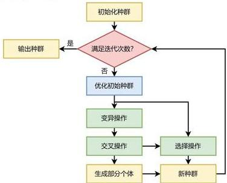

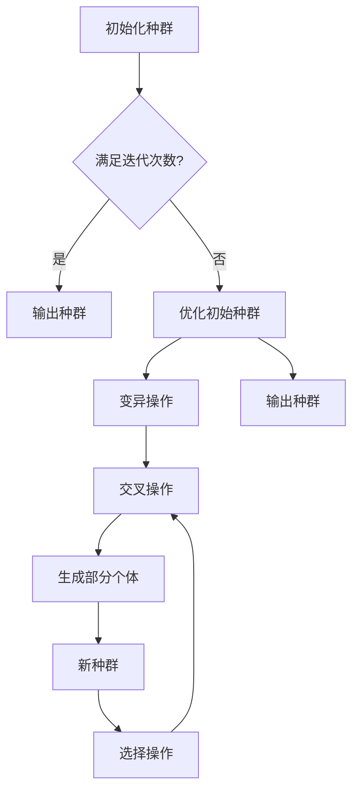

图8基于差分进化算法的改进遗传算法的基本步骤

# 4.6 利润最大化的农作物种植策略优化模型的求解

本小节首先根据2023年各农作物在不同季次的实际产量，估算其未来预期销售量，并将其代入模型，运用基于差分进化算法的改进遗传算法，通过Python求解利润最大化的农作物种植策略优化模型，得出2024-2030年滞销及 $50\%$ 降价情境下的最优种植方案，并通过热力图直观展示2024年的种植方案。随后，绘制累计利润收敛曲线，进一步分析在滞销与 $50\%$ 降价情境下的总利润最大化情况。

# 4.6.1 各种农作物未来预期销售量的估算

本小节根据附件2中的2023年农作物种植情况，通过将各农作物在每个季次的种植面积与相应地块和季次的亩产量相乘，计算出2023年各农作物在每个季次的实际产量。问题一假设未来各类农作物的预期销售量、种植成本、亩产量及销售价格相较2023年保持不变。因此，在问题一中，2024至2030年期间的农作物预期销售量等同于2023年的产量。

具体而言，表 1 展示了 2023 年各农作物在不同种植季次中的部分实际产量数据。通过对单季、第一季和第二季不同农作物的种植面积和亩产量进行计算，得出了每种作物每个季次的总产量，为后续的农作物种植策略优化模型的求解提供了基础数据。

表 1 2023 年各季次部分农作物的实际产量

<table><tr><td>作物编号</td><td>作物名称</td><td>种植季次</td><td>总产量/斤</td></tr><tr><td>1</td><td>黄豆</td><td>单季</td><td>167580</td></tr><tr><td>2</td><td>黑豆</td><td>单季</td><td>65550</td></tr><tr><td>3</td><td>红豆</td><td>单季</td><td>68400</td></tr><tr><td>4</td><td>绿豆</td><td>单季</td><td>95520</td></tr><tr><td>5</td><td>爬豆</td><td>单季</td><td>29625</td></tr><tr><td>6</td><td>小麦</td><td>单季</td><td>506160</td></tr><tr><td>7</td><td>玉米</td><td>单季</td><td>384750</td></tr><tr><td>8</td><td>谷子</td><td>单季</td><td>210900</td></tr><tr><td>...</td><td>...</td><td>...</td><td>...</td></tr><tr><td>34</td><td>芹菜</td><td>第二季</td><td>5430</td></tr><tr><td>35</td><td>大白菜</td><td>第二季</td><td>150000</td></tr><tr><td>36</td><td>白萝卜</td><td>第二季</td><td>100000</td></tr><tr><td>37</td><td>红萝卜</td><td>第二季</td><td>36000</td></tr><tr><td>38</td><td>榆黄菇</td><td>第二季</td><td>9000</td></tr><tr><td>39</td><td>香菇</td><td>第二季</td><td>7200</td></tr><tr><td>40</td><td>白灵菇</td><td>第二季</td><td>18000</td></tr><tr><td>41</td><td>羊肚菌</td><td>第二季</td><td>4200</td></tr></table>

由表1可知，不同作物的产量存在显著差异。例如，单季种植的黄豆、玉米、小麦等作物的产量较高，而第二季种植的作物如芹菜、榆黄菇、羊肚菌等的总产量相对较低。这可能与种植季节的气候条件、土壤肥力以及作物本身的生长周期有关。通过进一步分析这些数据，不仅为农作物种植策略优化模型的求解提供了基础支持，还为未来的种植规划和农作物管理提供了有效参考。

# 4.6.2 2024 至 2030 年滞销与 50% 降价情境下的最优种植方案

本小节将各类农作物的未来预期销售量代入模型，利用基于差分进化算法的改进遗传算法，通过Python对利润最大化的农作物种植策略优化模型进行求解。最终将该村2024\~2030年在滞销和 $50\%$ 降价情境下的最优种植方案分别填入result1\_1.xlsx和result1\_2.xlsx文件中。随后，采用热力图对2024年两种情境下的最优种植方案进行可视化分析，颜色深浅代表种植面积的大小。

首先，本小节绘制了2024年滞销情境下的最优种植方案，如图9所示。图中分别展示了该年度两个种植季次的种植面积分布情况，颜色深浅反映了各类农作物的种植规模。通过热力图的颜色变化，可以直观地了解不同作物在不同季次及地块上的种植面积差异。

由图9可知，粮食作物在ABC类地块的种植总面积较大，特别是小麦、荞麦、红豆和红薯的种植地块分布较多且集中，种植面积也较大。这些作物在ABC类地块占据了较多的种植资源。相比之下，D类地块中各农作物的单块种植面积较小，但红萝卜和大白菜的总种植面积较大，显示了这些作物在D类地块中的种植优势。此外，EF类地块的蔬菜种植面积相对均匀分布，没有明显的集中趋势。纵向观察，各地块的种植面积得到了充分利用，资源配置合理。

在第二季中，D类地块的农作物种植总面积依然较大，特别是大白菜、红萝卜、西红柿和小青菜的种植面积较为显著，反映出这些作物在D类地块中的高种植密度。EF 类地块在第二季的蔬菜种植面积继续保持均匀分布，没有出现明显的面积集中情况。纵向来看，各地块在第二季的种植面积依然得到了充分利用，土地资源利用率较高，种植策略保持了合理的分配。

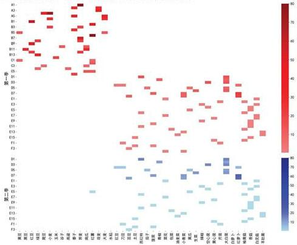  
图 9 2024 年滞销情境下最优种植方案

接着，本小节绘制了2024年 $50\%$ 降价情境下的最优种植方案，如图10所示。图中展示了该情境下两个种植季次的作物种植面积分布情况。通过热力图的颜色深浅，可以清晰地看到不同作物在各个地块上的种植面积大小。

由图 10 中可以看出，ABC 类地块的单季农作物种植总面积较大，尤其是玉米、谷子和南瓜的种植地块数量较多且分布集中，总面积较大。这些作物在 ABC 类地块占据了相对较多的种植资源。相比之下，D 类地块的单块种植面积较小，但红萝卜和白萝卜的总种植面积较大，表明这两种作物在 D 类地块中具有明显的种植优势。此外，EF 类地块的农作物种植面积较为均匀，未表现出明显的面积集中现象。纵向来看，各地块的种植面积得到了较充分的利用，资源配置较为合理。

在第二季中，D类地块的农作物种植总面积依然较大，特别是白萝卜和红萝卜的种植面积较为突出，显示出这些作物在D类地块中具有较高的种植密度。EF类地块在第二季的蔬菜种植面积依然均匀分布，没有表现出明显的面积集中现象。纵向观察，各地块的种植面积都得到了充分利用，土地资源利用率较高，种植策略保持了合理的分配。

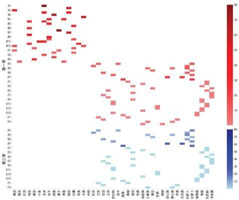  
图 10 2024 年 50% 降价情境下最优种植方案

通过对比2024年滞销与50%降价情境下的最优种植方案，可以发现不同市场条件对农作物种植策略有显著影响。在滞销情境下，农户更倾向于减少高风险作物的种植面积，转而种植稳定性较高的农作物，以降低滞销带来的经济损失。而在50%降价情境下，由于利润下降，农户则更加注重作物的种植效益，选择种植具有较高产量和较强市场需求的作物，以应对价格下跌带来的挑战。这种种植策略的调整反映了不同经济环境下，农户对市场变化的敏感性以及优化资源配置的能力，有助于实现利润最大化与风险最小化的平衡。

# 4.6.3 滞销与 $50\%$ 降价情境下的最大化利润分析

在求解出2024\~2030年滞销及 $50\%$ 降价情境下的最优种植方案后，本小节进一步对各年度利润以及七年总利润进行了可视化分析，以更直观地展示不同情境下的经济效益。

首先，图 11 展示了 2024\~2030 年在滞销情境与 50% 降价情境下各年度的利润变化情况。通过对比两种情境下的利润走势，可以直观地观察不同市场条件对农作物种植策略优化后的年利润产生的影响。

由图 11 可知，在滞销情境下，年利润整体保持相对稳定，虽有小幅波动，但整体呈现较低的水平。特别是在 2028 年，利润略有下降，随后在 2029 年和 2030 年有所恢复，但依然低于 2027 年。这说明在滞销的情况下，尽管优化了种植策略，农户仍无法完全避免市场低迷带来的影响。

而在 $50\%$ 降价情境下，年利润明显高于滞销情境，且表现出较为稳定的增长趋势。尽管在2027年出现了轻微的下滑，但随后利润迅速恢复并保持稳定。这表明，在价格下降的情境下，优化的种植策略更有助于维持较高的利润水平，农户能够通过选择高效益作物应对降价带来的收入减少。

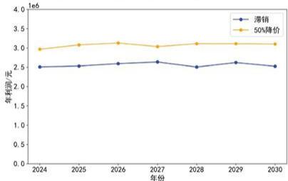

<details>
<summary>line</summary>

| 年份 | 滞销 (元) | 50%降价 (元) |
|---|---|---|
| 2024 | 2.45 | 3.0 |
| 2025 | 2.48 | 3.1 |
| 2026 | 2.52 | 3.15 |
| 2027 | 2.55 | 3.05 |
| 2028 | 2.48 | 3.1 |
| 2029 | 2.53 | 3.1 |
| 2030 | 2.48 | 3.05 |
</details>

图 11 2024\~2030 年各年度利润折线图

接着，本小节展示了基于DEGA算法在滞销与 $50\%$ 降价两种情境下的农作物种植策略优化过程中，累计利润随迭代次数变化的收敛曲线。图12直观呈现了两种情境下的利润增长差异。

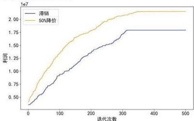

<details>
<summary>line</summary>

| 迭代次数 | 滞销 (1e7) | 50%降价 (1e7) |
| :--- | :--- | :--- |
| 0 | 0.4 | 0.4 |
| 100 | 0.8 | 1.2 |
| 200 | 1.2 | 1.6 |
| 300 | 1.6 | 1.9 |
| 400 | 1.8 | 2.0 |
| 500 | 1.8 | 2.0 |
</details>

图 12 滞销与 50% 降价情境下的累计利润收敛曲线

从图12中可以看出， $50\%$ 降价情境下的累计利润增长速度显著快于滞销情境，曲线迅速上升，并最终收敛至21533950.7元。而滞销情境下，累计利润的增长较为缓慢，最终收敛至17925814.6元。降价出售情境在提高利润方面明显优于滞销处理，表明处理超出预期销售量的作物时，降价出售更具经济效益。

总体来看，50%降价情境下的累计利润始终高于滞销情境，最终实现了更高的总利润。通过基于DEGA算法的优化分析，求解得出的2024\~2030年滞销与50%降价情境下的最优种植方案成功达到了利润最大化目标，进一步验证了运用DEGA算法求解农作物种植策略优化模型的有效性。

# 4.7 小结

本节首先对乡村耕地结构、农作物种植现状及言均利润进行了深入的可视化分析，利用双重饼图和条形图分别展示了耕地结构以及主要农作物的产量与利润对比，为制定最佳种植策略提供了坚实的数据支持。在此基础上，构建了一个以七年总利润最大化为目标的种植策略优化模型。该模型综合考虑了12个关键约束条件，包括地块种植面积的上限、各地块农作物的最低种植面积、决策变量间的约束关系、禁止连续重茬种植的要求、豆类作物的特殊种植要求，以及ABC、D、E、F类地块的不同种植限制和食用菌的种植要求。模型还纳入了作物种植分散程度的要求，并保证实际产量基本满足预期销售量的约束。

随后，本节采用基于差分进化的改进遗传算法（DEGA）对滞销和50%降价出售两种情境进行了求解，得出了2024-2030年的最优种植方案，并通过热力图直观展示了2024年种植方案的空间分布情况。通过对2024-2030年各年度利润折线图的分析，发现年利润整体呈现出稳定的增长趋势，表明在不同市场情境下，优化后的种植策略能够保持相对稳定的收益水平。进一步的累计利润收敛曲线分析显示，50%降价情境下的累计利润最终收敛至21533950.7元，显著高于滞销情境下的17925814.6元。这表明，在降价情境中，优化后的种植策略更具经济效益，有助于实现利润的最大化。

# 五、问题二的建模与求解

本节定义了预期销售量、亩产量、种植成本和销售价格四个不确定性因素，并基于问题一的12个约束条件，引入条件风险价值（CVaR）优化方法，构建包含总利润最大化与CVaR约束的目标函数，形成了收益最大化与风险控制相结合的CVaR种植策略优化模型。随后，使用引入CVaR的DEGA算法求解适用于所有不确定性情境的最佳种植方案。最后，通过绘制考虑不确定性因素的2024-2030年各年度的利润折线图和累计利润收敛曲线，深入分析不确定性情境下的利润表现。

# 5.1 问题分析

问题二旨在综合考虑各类农作物的预期销售量、亩产量、种植成本、销售价格的不确定性及潜在种植风险。其中，小麦和玉米的预期销售量增长率为5%\~10%，其他农作物的销售量相较2023年变化幅度约为±5%；亩产量每年波动约±10%；种植成本每年增长约5%；粮食作物销售价格保持稳定，蔬菜类作物年均价格增长约5%，食用菌价格每年下降1%\~5%，其中羊肚菌价格降幅为5%。基于此，最终制定出该乡村2024-2030年的最优种植方案。

具体而言，本节首先定义了预期销售量、亩产量、种植成本和销售价格四个不确定性因素，并将它们加入问题一的12个约束条件中。随后，引入条件风险价值（CVaR）优化方法，构建了一个同时包含总利润最大化和CVaR的目标函数，形成了兼顾收益最大化与风险控制的CVaR种植策略优化模型。接着，利用引入CVaR的DEGA算法求解全局最优解，最终得出了适用于所有不确定性情境的最佳种植方案，并绘制了2024年的种植方案热力图。最后，依次绘制了考虑不确定性因素的2024-2030年各年度的利润折线图和累计利润收敛曲线，深入分析不确定性情境下的利润表现。

问题二的思维框架如下图所示：

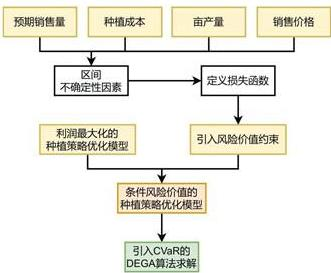

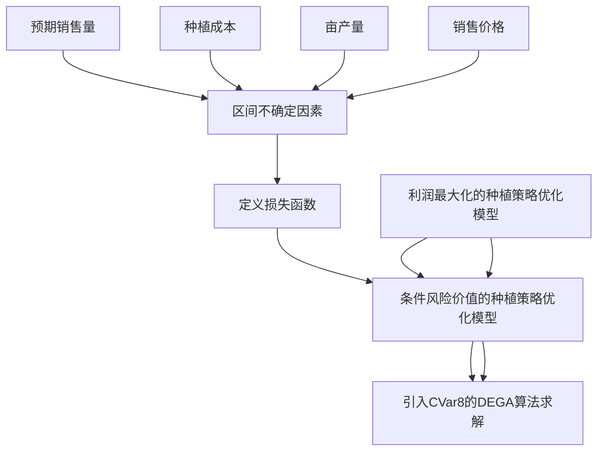

图 13 问题二的思维框架

# 5.2 CVaR 种植策略优化模型的建立

条件风险价值（CVaR）是一种广泛应用于风险管理领域的指标，用于衡量在极端不利情况下的预期损失。相比于传统的在险值（VaR），CVaR不仅考虑到特定置信水平下的最大损失，还计算在该置信水平之外的平均损失，因此能提供更全面的风险度量。CVaR的基本原理为：在预设的置信水平下，CVaR表示在超过VaR情况下平均的损失，从而帮助农业生产者在面对极端市场波动时做出更加稳健的决策[6]。

为了应对未来农作物需求量、亩产量、种植成本和销售价格等因素的波动带来的不确定性和风险，本节在问题一的基础上引入了条件风险价值（CVaR）优化方法，求解该乡村2024-2030年农作物的最优种植方案。该方法不仅能够最大化期望收益，还在极端情况下有效控制了潜在损失。通过CVaR优化，模型能够在不确定性条件下考虑极端损失，从而提高种植方案的稳健性和抗风险能力。

# 5.2.1 不确定性因素的定义

在农作物种植过程中，面临的各种不确定性因素会显著影响最终的种植收益。在本文研究中，明确了四个主要的不确定性因素，分别为各类农作物的预期销售量、亩产量、种植成本和销售价格。这些因素之间的波动性往往受到多重外部条件的影响，如气候变化、市场需求波动、生产资料价格的上涨或下降等，给种植者带来了较大的风险和挑战。因此，在不确定性条件下，合理评估和应对这些因素至关重要。通过对这些不确定因素的定义和分析，可以为后续种植策略优化提供重要依据。

# (1) 预期销售量的不确定性

在农作物的预期销售量方面，不确定性主要体现在市场需求的波动上。对于编号分别为6和7的小麦和玉米，其预期销售量的增长率设定为5%\~10%之间。公式中的参数 $r\in[0.05,0.1]$ 表示小麦和玉米的销售量年增长率，其值取决于市场需求的预期变化。时间变量t代表预测的年度，基准年为2023年。

对于其他农作物，其销售量与2023年相比，波动幅度约为±5%。公式中的$\varepsilon\in[-0.05,0.05]$ 表示其他农作物的销售量相对2023年的变化幅度，这种变化幅度在较小的范围内波动，说明市场对于这些农作物的需求较为稳定。预期销售量的具体公式如下所示：

$$
\left\{ \begin{array}{l l} d _ {j t k} = d _ {j, 2 0 2 3, k} \times (1 + r) ^ {t - 2 0 2 3} & r \in [ 0. 0 5, 0. 1 ], k \in \{6, 7 \} \\ d _ {j t k} = d _ {j, 2 0 2 3, k} \times (1 + \varepsilon) & \varepsilon \in [ - 0. 0 5, 0. 0 5 ], k \notin \{6, 7 \} \end{array} \right. \tag {28}
$$

该模型能够精准捕捉市场波动，准确反映不同作物的销售量变化，为优化种植策略提供有力的数据支持，降低因市场需求波动带来的风险。

# (2) 亩产量的不确定性

在农作物种植过程中，亩产量的不确定性是影响农户收益的重要因素之一。亩产量不仅受到气候、土壤条件等自然因素的影响，还可能受到病虫害、种植技术水平、农业投入等人为因素的干扰。因此，准确预测亩产量的波动情况对于优化种植策略至关重要。本小节通过建立亩产量波动模型，将每年亩产量的变化范围设定为±10%，以反映现实中存在的波动。通过这种方式，可以更好地应对实际生产中亩产量的不确定性，确保农作物种植策略的稳健性和可行性。

$$
y _ {i j t k} = y _ {i, j, 2 0 2 3, k} \times (1 + \theta), \forall i, j, t, k, \theta \in [ - 0. 1, 0. 1 ] \tag {29}
$$

式中，参数 $\theta\in[-0.1,0.1]$ 表示亩产量的年变化幅度。该模型有效捕捉了农作物亩产量的年际波动性，为制定稳健的种植策略提供了数据依据。

# (3)种植成本的不确定性

种植成本是影响农作物种植收益的关键因素之一,其不确定性主要体现在生产资料价格、劳动力成本以及技术投入的变化上。为准确反映成本的年际波动,本小节设定种植成本每年约增长5%,以捕捉农业投入成本随时间推移的自然增长趋势。

$$
c _ {i j t k} = c _ {i, j, 2 0 2 3, k} \times 1. 0 5 ^ {t - 2 0 2 3}, \forall i, j, t, k \tag {30}
$$

通过公式可以看出，种植成本相对于2023年基准年成本 $c_{i,j,2023,k}$ ，每年按5%的增长率进行调整。该模型有效考虑了农作物生产过程中不可控的成本上涨因素，为种植策略的优化提供了更加现实的依据。

# (4) 销售价格的不确定性

粮食作物的销售价格较为稳定，而编号为17\~37的蔬菜类作物每年平均价格增长约5%。公式(31)表示蔬菜类作物的销售价格相较2023年基准价格 $p_{i,j,2023,k}$ ，每年按5%的增长率变化。

$$
p _ {i j t k} = p _ {i, j, 2 0 2 3, k} \times 1. 0 5 ^ {t - 2 0 2 3}, k \in \{1 7, 1 8, \dots , 3 7 \} \tag {31}
$$

除了羊肚菌外，编号为38、39和40的食用菌价格每年下降1%\~5%。公式中的 $\beta\in[0.01,0.05]$ 表示食用菌的年降幅，反映出市场需求和价格的逐年下滑趋势。

$$
p _ {i j t k} = p _ {i, j, 2 0 2 3, k} \times (1 - \beta) ^ {t - 2 0 2 3}, \beta \in [ 0. 0 1, 0 0 5 ], k \in \{3 8, 3 9, 4 0 \} \tag {32}
$$

编号为 41 的羊肚菌，其销售价格每年下降约 5%。公式(33)显示羊肚菌相对于 2023 年基准价格，每年的价格按 5% 的固定降幅进行调整。

$$
p _ {i j t k} = p _ {i, j, 2 0 2 3, k} \times 0. 9 5 ^ {t - 2 0 2 3}, k = 4 1 \tag {33}
$$

公式(31)、(32)和(33)通过对蔬菜类作物以及食用菌的销售价格变化进行详细建模，捕捉了不同作物在市场上的价格波动趋势。

综上所述，通过引入这些不确定性因素，优化模型能够更加精准地反映未来种植策略中的潜在风险和收益变化，有效帮助农户应对市场不确定性，最大化收益并降低风险，为制定科学、稳健的种植方案提供重要依据。

# 5.2.2 CVaR 方法的引入

不确定性因素对种植利润产生了直接影响，进一步加剧了种植方案的不确定性。为此，在第一问的约束条件基础上，本节引入CVaR方法，构建新的目标函数，以有效控制这些风险。

本小节首先定义损失函数。在种植策略优化模型中，损失可被视为期望收益与实际收益之间的差距。由于实际收益受到不确定性因素的影响，损失可通过以下公式进行表达：

$$
\begin{array}{l} l _ {i j t k} = \left(p _ {i j t k} ^ {\prime} \cdot \min \left(y _ {i j t k} ^ {\prime} \cdot x _ {i j t} ^ {k}, d _ {j t k} ^ {\prime}\right) - c _ {i j t k} ^ {\prime} \cdot x _ {i j t} ^ {k}\right) \tag {34} \\ - \left(p _ {i j t k} \cdot \min \left(y _ {i j t k} \cdot x _ {i j t} ^ {k}, d _ {j t k}\right) - c _ {i j t k} \cdot x _ {i j t} ^ {k}\right) \\ \end{array}
$$

式中， $l_{ijkt}$ 表示损失， $p_{ijtk}$ 、 $y_{ijtk}$ 、 $d_{jtk}$ 、 $c_{ijtk}$ 是在不确定情境下的变量，而 $p_{ijtk}^{\prime}$ 、 $y_{ijtk}^{\prime}$ 、 $d_{jtk}^{\prime}$ 、 $c_{ijtk}^{\prime}$ 则是在理想或基准情境下的变量。

CVaR的核心在于衡量最坏情景下，超过特定损失阈值（VaR）后的平均损失。与单纯依赖VaR不同，CVaR通过进一步关注超出VaR的极端损失，确保种植方案在面对不确定性时保持稳健性[7]。VaR（在险值）用于定义在特定置信水平（如 $95\%$ ）下可能遭遇的最大损失，而CVaR则基于这一VaR，计算超出该阈值部分的平均损失，从而提供更全面的风险评估。其具体公式如下：

$$
\mathrm{CVaR} _ {\alpha} = \frac {1}{1 - \alpha} \sum_ {s = 1} ^ {S} \max \left(l _ {i j t k} ^ {s} - V a R _ {\alpha}, 0\right) \tag {35}
$$

其中 $\alpha$ 为置信水平，本节取 $95\%$ ，意味着本节关注的是最坏 $5\%$ 情况下的损失。

在优化农作物种植策略时，不仅需要考虑收益最大化，还必须充分考虑市场不确定性带来的风险。为此，CVaR作为一种有效的风险控制方法被引入优化目标中，以在最大化期望收益的同时，确保在最坏情景下的损失得到有效控制。本小节假设超出预期销售量的产量部分将面临滞销风险，基于此对损失和收益进行平衡，优化后的目标函数如下所示：

$$
\max \left(\mathrm{E} \left[ \sum_ {i j, t, k} \left(p _ {i j t k} \cdot \min \left(y _ {i j t k} \cdot x _ {i j t} ^ {k}, d _ {j t k}\right) - c _ {i j t k} \cdot x _ {i j t} ^ {k}\right) \right] - \lambda \cdot \mathrm{CVaR} _ {\alpha}\right) \tag {36}
$$

式中， $y_{ijtk}$ 表示作物 k 在第 t 年、第 j 季、地块 i 上的亩产量，单位为斤； $d_{jtk}$ 表示作物 k 在第 t 年、第 j 季的预期销售量，单位为斤； $p_{ijtk}$ 表示作物 k 在第 t 年、第 j 季、地块 i 上的销售单价，单位为元/斤。而 $c_{ijtk}$ 表示作物 k 在第 t 年、第 j 季、地块 i 上的种植成本，单位为元/亩。 $x_{ijt}^{k}$ 表示第 t 年、第 j 季、地块 i 上种植作物 k 的面积。

该公式可以分为两部分进行分析。第一部分关注的是七年内的期望总利润最大化，反映了不同种植方案下的收益情况，旨在通过合理的种植策略提升整体收益。第二部分则引入了CVaR约束，通过参数 $\lambda$ 的调节来平衡收益与风险。这一部分确保在极端不利的情景下，损失不会超过可控范围，从而提高模型的稳健性和抗风险能力。两部分共同作用，实现了收益最大化与风险控制的有机结合。

因此，根据以上约束条件与目标函数建立的 CVaR 种植策略优化模型为：

$$
\max \left(\mathrm{E} \left[ \sum_ {i, j, t, k} \left(p _ {i j t k} \cdot \min \left(y _ {i j t k} \cdot x _ {i j t} ^ {k}, d _ {j t k}\right) - c _ {i j t k} \cdot x _ {i j t} ^ {k}\right) \right] - \lambda \cdot \mathrm{CVaR} _ {\alpha}\right)
$$

$$
s. t. \left\{ \right.\begin{array}{c}\sum_ {k = 1} ^ {4 1} x _ {i j t} ^ {k} \leq A _ {i}, \forall i \in \{A 1, A 2, \dots , F 4 \}, j, t\\x _ {i j t} ^ {k} \geq 0. 5 \cdot A _ {i} \cdot z _ {i j t} ^ {k}, \forall i \in \{A 1, A 2, \dots , F 4 \}, j, t, k\\x _ {i j t} ^ {k} \leq A _ {i} \cdot z _ {i j t} ^ {k}, \forall i \in \{A 1, A 2, \dots , F 4 \}, j, t, k\\z _ {i 1 t} ^ {k} \cdot z _ {i 1 (t + 1)} ^ {k} = 0, \forall i \in \{A 1, A 2, \dots , C 6 \}, t, k\\\sum_ {t = i} ^ {t + 2} \sum_ {k} z _ {i j t} ^ {k} \geq 1, \forall i \in \{A 1, A 2, \dots , F 4 \}, t, k \in \{1, 2, 3, 4, 5, 1 7, 1 8, 1 9 \}\\z _ {i 2 t} ^ {k} = 0, \forall i \in \{A 1, A 2, \dots , C 6 \}, t, k \in \{1, 2, \dots , 1 5 \}\\z _ {i 1 t} ^ {1 6} \cdot \sum_ {k} \left(z _ {i 1 t} ^ {k} + z _ {i 2 t} ^ {k}\right) = 0, \forall i \in \{D 1, D 2, \dots , D 8 \}, t, k \in \{1 7, 1 8, \dots , 3 7 \}\\\sum_ {k} z _ {i 1 t} ^ {k} = 0, \forall i \in \{E 1, E 2, \dots , E 1 6 \}, t, k \in \{3 5, 3 6, 3 7 \}\\\sum_ {k} z _ {i j t} ^ {k} = 0, \forall i \in \{F 1, F 2, F 3, F 4 \}, j, t, k \in \{3 5, 3 6, 3 7 \}\\z _ {i j t} ^ {k} = 0, \forall i \in \{A, B, C, D, F \}, \forall j, t, k \in \{3 8, 3 9, 4 0, 4 1 \}\\\sum_ {i = 1} ^ {5 4} z _ {i j t} ^ {k} \leq 5, \forall j, t, k\\\sum_ {i = 1} ^ {5 4} x _ {i j t} ^ {k} \cdot y _ {i j t k} \geq 0. 9 \cdot d _ {j t k},   \forall j, t, k\\d _ {j t k} = d _ {j, 2 0 2 3, k} \times (1 + r) ^ {t - 2 0 2 3} r \in [ 0. 0 5, 0. 1 ], k \in [ 6, 7 ]\\d _ {j t k} = d _ {j, 2 0 2 3, k} \times (1 + e) e \in [ -   -   0. 0 5,   0.   0   ] k   e [   -   6,   ]\\y _ {i j t k} = y _ {i j,   2 0 2 3, k} \times (1 + e),   v i, j, t, k, e [ -   -   0.   1,   ]\\c _ {i j t k} = c _ {i j,   2 0 2 3, k} \times   {\bf l}. {\bf l}. {\bf l}. {\bf l}. {\bf l}. {\bf l}. {\bf l}. {\bf l}. {\bf l}. {\bf l}. {\bf l}. {\bf l}. {\bf l}. {\bf l}. {\bf l}. {\bf l}. {\bf l}. {\bf l}. {\bf l}. {\bf l}. {\bf l}. {\bf l}. {\bf l}. {\bf l}. {\bf l}. {\bf l}\\p _ {i j t k} = p _ {i j,   2 0 2 3, k} \times {\bf l}. {\bf l}. {\bf l}. {\bf l}. {\bf l}. {\bf l}. {\bf l}. {\bf l}. {\bf l}. {\bf l}. {\bf l}. {\bf l}. {\bf l}. {\bf l}. {\bf l}. {\bf l}. {\bf l}. {\bf l}. {\bf l}. {\bf l}. {\bf l}. {\bf l}. {\bf l}. {\bf l}. {\bf l .}\\p _ {i j t k} = p _ {i j,   2 0 2 3, k} \times {\bf l}. {\bf l}. {\bf l}. {\bf l}. {\bf l}. {\bf l}. {\bf l}. {\bf l}. {\bf l}. {\bf l}. {\bf l}. {\bf l}. {\bf l}. {\bf l}. {\bf l}. {\bf l}. {\bf l}. {\mathrm{f}}\\p _ {i j t k} = p _ {i j,   2 0 2 3, k} \times {\bf l}. {\bf l}. {\bf l}. {\bf l}. {\bf l}. {\bf l}. {\bf l}. {\bf l}. {\bf l}. {\bf l}. {\bf l}. {\bf l}. {\bf l}. {\bf l}. {\bf l}. {\bf l}. {\bf l}. {{\mathrm{f}}}\\p _ {i j t k} = p _ {i j,   2 0 2 3, k} \times {\bf l}. {\bf l}. {\bf l}. {\bf l}. {\bf l}. {\bf l}. {\bf l}. {\bf l}. {\bf l}. {{\mathrm{f}}}\\p _ {i j t k} = p _ {i j,   2 0 2 3, k} \times {\bf l}. {\bf l}. {\bf l}. {\bf l}. {\bf l}. {\bf l}. {{\mathrm{f}}}\\p _ {i j t k} = p _ {i j,   2 0 2 3, k} \times {\bf l}. {\bf l}. {\bf l}. {\bf l}. {\bf l}. {{\mathrm{f}}}\\p _ {i j t k} = p _ {i j,   2 0 2 3, k} \times {\bf l}. {\bf l}. {\bf l}. {\bf l}. {{\mathrm{f}}}\\p _ {i j t k} = p _ {i j,   2 0 2 3, k} \times {\bf l}. {\bf l}. {\bf l}. {{\mathrm{f}}}\\p _ {i j t k} = p _ {i j,   2 0 2 3, k} \times {\bf l}. {\bf l}. {\bf l}. {{\mathrm{f}}}\\p _ {i j t k} = p _ {i j,   2 0 2 3, k} \times {\bf l}, {{\mathrm{f}}}\\p _ {i j t k} = p _ {i j,   n}, {{\mathrm{f}}}\\p _ {i j t k} = p _ {i j,   n}, {{\mathrm{f}}}\\p _ {i j t k} = p _ {i j,   n}, {{\mathrm{f}}}\\p _ {i j t k} = p _ {i j,   n}, {{\mathrm{f}}}\\p _ {i j t k} = p _ {i j,   m}, {{\mathrm{f}}}\\p _ {i j t k} = p _ {i j,   m}, {{\mathrm{f}}}\\p _ {i j t k} = p _ {i j,   m}, {{\mathrm{f}}}\\p _ {i j t k} = p _ {i j,   m}, {{\mathrm{f}}}\\p _ {i j t k} = p _ {i j,   n}, {{\mathrm{f}}}\\p _ {i j t k} = p _ {i j,   n}, {{\mathrm{f}}}\\p _ {i j t k} = p _ {i j,   n}, {{\mathrm{f}}}\\p _ {i j t k} = p _ {i j,   o}, {{\mathrm{f}}}\\p _ {i j t k} = p _ {i j,   n}, {{\mathrm{f}}}\\p _ {i j t k} = p _ {i j,   n}, {{\mathrm{f}}}\\p _ {i j t k} = p _ {i j,   n}, {{\mathrm{f}}}\\p _ {i j t k} = p _ {i j,   u}, {{\mathrm{f}}}\\p _ {i j t k} = p _ {i j,   u}, {{\mathrm{f}}}\\p _ {i j t k} = p _ {i j,   u}, {{\mathrm{f}}}\\p _ {i j t k} = p _ {i j,   u}, {{\mathrm{f}}}\\p _ {i j t k} = p _ {i j,   n}, {{\mathrm{f}}}\\p _ {i j t k} = p _ {i j,   n}, {{\mathrm{f}}}\\p _ {i j t k} = p _ {i j,   n}, {{\mathrm{f}}}\\p _ {i j t k} = p _ {i j,   y}, {{\mathrm{f}}}\\p _ {i j t k} = p _ {i j,   y}, {{\mathrm{f}}}\\p _ {i j t k} = p _ {i j,   y}, {{\mathrm{f}}}\\p _ {i j t k} = p _ {i j,   y}, {{\mathrm{f}}}\\p _ {i j t k} = p _ {i j,   n}, {{\mathrm{f}}}\\p _ {i j t k} = p _ {i j,   n}, {{\mathrm{f}}}\\p _ {i j t k} = p _ {i j,   n}, {{\mathrm{f}}}\\p _ {i j t k} = p _ {i j,   w}, {{\mathrm{f}}}\\p _ {i j t k} = p _ {i j,   w}, {{\mathrm{f}}}\\p _ {i j t k} = p _ {i j,   w}, {{\mathrm{f}}}\\p _ {i j t k} = p _ {i j,   w}, {{\mathrm{f}}}\\p _ {i j t k} = p _ {i j,   n}, {{\mathrm{f}}}\\p _ {i j t k} = p _ {i j,   n}, {{\mathrm{f}}}\\p _ {i j t k} = p _ {i j,   n}, {{\mathrm{f}}}\\p _ {i j t k} = p _ {i j,   v}, {{\mathrm{f}}}\\p _ {i j t k} = p _ {i j,   v}, {{\mathrm{f}}}\\p _ {i j t k} = p _ {i j,   v}, {{\mathrm{f}}}\\p _ {i j t k} = p _ {i j,   v}, {{\mathrm{f}}}\\p _ {i j t k} = p _ {i j,   w}, {{\mathrm{f}}}\\p _ {i j t k} = p _ {i j,   w}, {{\mathrm{f}}}\\p _ {i j t k} = p _ {i j,   w}, {{\mathrm{f}}}\\p _ {i j t k} = p _ {i j,   v}, {{\mathrm{f}}}\\p _ {i j t k} = p _ {i j,   w}, {{\mathrm{f}}}\\p _ {i j t k} = p _ {i j,   v}, {{\mathrm{f}}}\\p _ {i j t k} = p _ {i j,   w}, {{\mathrm{f}}}\\p _ {i j t k} = p _ {i j,   w}, {{\mathrm{f}}}\\p _ {i j t k} = p _ {i j,   v}, {{\mathrm{f}}}\\p _ {i j t k} = p _ {i j,   v}, {{\mathrm{f}}}\\p _ {i j t k} = p _ {i j,   w}, {{\mathrm{f}}}\\p _ {i j t k} = p _ {i j,   v}, {{\mathrm{f}}}\\p _ {i j t k} = p _ {i j,   v}, {{\mathrm{f}}}\\p _ {i j t k} = p _ {i j,   v}, {{\mathrm{f}}}\\p _ {- i / v}: b (\mathcal L) | a | b (\mathcal L) | a | b (\mathcal L) | a | b (\mathcal L) | a | b (\mathcal L) | a | b (\mathcal L) | a | b (\mathcal L) | a | b (\mathcal L) | a | b (\mathcal L) | a | b (\mathcal L) | a | b (\mathcal L) | a | b (\mathcal L) | a |b (\mathcal L) | a | b (\mathcal L) | a | b (\mathcal L) | a | b (\mathcal L) | a | b (\mathcal L) | a | b (\mathcal L) | a | b (\mathcal L) | a | b (\mathcal L) | a | b (\mathcal L) | a | b (\mathcal L) | a | b (\mathcal L) | a | b(\mathcal L) | a | b(\mathcal L) | a | b(\mathcal L) | a | b(\mathcal L) | a | b(\mathcal L) | a | b(\mathcal L) | a | b(\mathcal L) | a | b(\mathcal L) | a | b(\mathcal L) | a | b(\mathcal L) | a | b(\mathcal L) | a | b(\texttt {.}) | a | b(\texttt {.}) | a | b(\texttt {.}) | a | b(\texttt {.}) | a | b(\texttt {.}) | a | b(\texttt {.}) | a | b(\texttt {.}) | a | b(\texttt {.}) | a | b(\texttt {.}) | a | b(\texttt {.}) | a | b(\texttt {.}) | a | b(\texttt {.})|a|b(\texttt {.})|a|b(\texttt {.})|a|b(\texttt {.})|a|b(\texttt {.})|a|b(\texttt {.})|a|b(\texttt {.})|a|b(\texttt {.})|a|b(\texttt {.})|a|b(\texttt {.})|a|b(\texttt {.})|a|b(\texttt {.})|a|b(8).\\pmb{\sigma}_{n}\pmb{\sigma}_{n}\pmb{\sigma}_{n}\pmb{\sigma}_{n}\pmb{\sigma}_{n}\pmb{\sigma}_{n}\pmb{\sigma}_{n}\pmb{\sigma}_{n}\pmb{\sigma}_{n}\pmb{\sigma}_{n}\pmb{\sigma}_{n}\pmb{\sigma}_{n}\pmb{\sigma}_{n}\pmb{\sigma}_{n}\pmb{\sigma}_{n}\pmod{n!}\end{array}
$$

# 5.3 CVaR 种植策略优化模型的求解

本小节基于问题一中的DEGA算法，并在每次选择过程中引入了CVaR，以进一步优化风险控制。为了确保CVaR种植策略优化模型的有效性，通过蒙特卡洛模拟生成1000个不同情景，涵盖预期销售量、亩产量、种植成本和销售价格等多种市场条件的变化。该模型通过整合目标函数处理所有情景，重点在于最小化极端不利情境下的损失。在此过程中，模型对各情景下的收益与损失进行综合评估，确保在大多数情境下实现高收益，同时有效控制最坏情况下的损失。最终，求解结果为全局最优解，即一个适用于所有情景的最佳种植方案，确保了整体策略的稳健性和可行性。CVaR种植策略优化模型的求解步骤如下：

Step 1 确定置信水平：设定一个 $95\%$ 的置信水平，用于确定在该水平下可能发生的最大损失区间，表示在 $95\%$ 的情况下，损失不会超过该区间，从而帮助更好地评估和控制风险。

Step 2 计算在险值（VaR）：根据设定的置信水平，计算出在该置信水平下可能发生的最大损失，即 VaR 值。VaR 值表示在正常市场条件下的最大潜在损失，在此置信水平下，有 5% 的概率损失会超过 VaR，但在其余的情况下，损失应保持在 VaR 值范围内。这一步骤有助于评估和设定风险限度，确保在大多数情境中损失控制在预期范围内。

Step 3 计算超出 VaR 的损失平均值：在所有超过 VaR 的损失情境中，计算这些损失的平均值，即条件在险值（CVaR）。CVaR 不仅关注在正常市场条件下的损失，还特别衡量了在最极端 5% 的情况下可能发生的损失幅度。通过计算超出 VaR 的损失平均值，CVaR 为评估极端情景下的风险提供了更全面的指标，帮助决策者在面对不利情境时做好充分的风险控制准备，确保即便在最坏情况下，损失依然可控。

Step 4 优化目标函数：在优化过程中，结合期望收益与 CVaR，通过同时考虑收益和风险，将损失严格控制在 CVaR 范围内。该过程不仅关注收益的最大化，还通过引入 CVaR 这一风险约束条件，确保在极端不利情境下的潜在损失也能保持在可控范围内。这样一来，优化目标函数实现了收益最大化与风险最小化的动态平衡，既能够在大多数情景下获得较高的收益，又能有效抵御最坏情况下的风险，从而确保整体决策的稳健性和长期可持续性。

Step 5 求解最优种植方案：通过 DEGA 算法，在充分考虑预期销售量、亩产量、种植成本和销售价格等不确定性和潜在风险的前提下，逐步优化并求解出最优的种植策略。DEGA 算法通过多次迭代，探索大量可能的解决方案，并根据设定的目标函数进行筛选和调整，最终找到能够在大多数情景中实现最高收益，同时有效控制风险的全局最优解[8]。引入 CVaR 的 DEGA 算法的基本步骤如下：

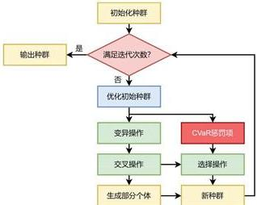

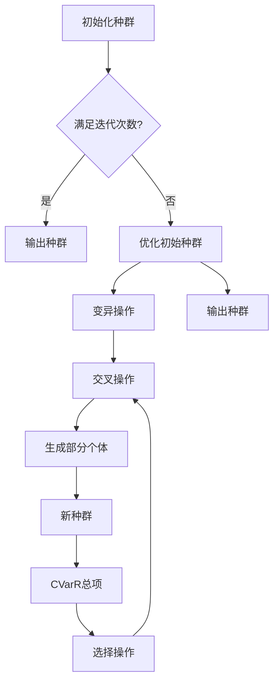

图 14 引入 CVaR 的 DEGA 算法的基本步骤

通过这一优化过程，模型不仅在不确定的市场条件下成功实现了收益最大化，还有效地控制了极端情况下的潜在风险。借助CVaR的风险约束，农业生产者能够在面对市场波动和不确定性时，制定出更为稳健的种植策略，确保在追求高收益的同时，风险保持在可接受的范围内。最终，该模型为种植方案提供了全方位的保障，兼顾了收益与风险的平衡，提升了整体决策的可行性和稳健性。

# 5.4 考虑不确定性因素的最优种植方案

本小节将各类农作物的未来预期销售量代入模型，结合引入CVaR的DEGA算法，使用Python对CVaR种植策略优化模型进行求解，最终得出该乡村在2024\~2030年考虑不确定性因素的最优种植方案，并将结果填入选2.xlsx文件中。随后，通过热力图对2024年的最优种植方案进行可视化分析，图中颜色深浅代表种植面积的大小。

本小节绘制了2024年考虑不确定性因素的最优种植方案，如图15所示。图中分别展示了该年度两个种植季次的种植面积分布情况，颜色深浅反映了各类农作物的种植规模。通过热力图的颜色变化，可以直观地了解不同作物在不同季次及地块上的种植面积差异。

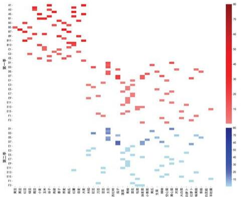  
图 15 2024 年考虑不确定性因素的最优种植方案

由图 15 可知，粮食作物在 ABC 类地块的种植总面积较大，特别是谷子、南瓜和红薯的种植地块分布较多且集中，种植面积也较大。这些作物在 ABC 类地块占据了较多的种植资源。相比之下，D 类地块中各农作物的单块种植面积较小，但土豆的总种植面积较大，显示了这种作物在 D 类地块中的种植优势。此外，EF 类地块的蔬菜种植面积相对均匀分布，没有明显的集中趋势。纵向观察，各地块的种植面积得到了充分利用，资源配置合理。

在第二季中，D类地块的农作物种植总面积依然较大，特别是土豆、茄子的种植面积较为显著，反映出这些作物在D类地块中的高种植密度。EF类地块在第二季的蔬菜种植面积继续保持均匀分布，没有出现明显的面积集中情况。纵向来看，各地块在第二季的种植面积依然得到了充分利用，土地资源利用率较高，种植策略保持了合理的分配。

# 5.5 考虑不确定性因素的最大化利润分析

在求解出 2024\~2030 年考虑不确定性因素的最优种植方案后，本小节进一步对各年度利润及七年累计利润进行了可视化分析，直观展示不同情境下的经济效益差异。

首先，图 16 展示了 2024–2030 年在考虑不确定性和未考虑不确定性两种情境下的各年度利润变化情况。通过对比两种情境下的利润走势，可以直观地观察不确定性因素对农作物种植策略优化后年利润的影响。

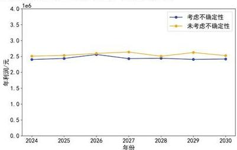

<details>
<summary>line</summary>

| 年份 | 考虑不确定性 (元) | 未考虑不确定性 (元) |
|---|---|---|
| 2024 | 2.35 | 2.45 |
| 2025 | 2.40 | 2.48 |
| 2026 | 2.50 | 2.55 |
| 2027 | 2.35 | 2.65 |
| 2028 | 2.35 | 2.45 |
| 2029 | 2.30 | 2.55 |
| 2030 | 2.35 | 2.45 |
</details>

图 16 考虑不确定性因素的 2024\~2030 年各年度利润折线图

由图16可知，在考虑不确定性情境下，年利润整体保持相对稳定，虽有轻微波动，但整体水平略低于未考虑不确定性情境。特别是在2027年，利润出现了较为明显的下降，随后在2028年略有恢复。这表明，在不确定性条件下，农户可能面临市场波动带来的风险，尽管优化了种植策略，年利润依然受到不确定性因素的负面影响。

相比之下，在未考虑不确定性情境下，年利润始终保持在较高水平，并且波动较小，表现出更为稳定的增长趋势。尽管2028年也出现了轻微下滑，但利润迅速恢复，并在随后的年份保持稳定。这表明，在未考虑不确定性因素的情境下，农户能够通过优化种植策略维持较高的利润水平，利润受市场波动的影响较小，表现出较强的稳定性。

接着，本小节展示了基于引入CVaR的DEGA算法在考虑不确定性和未考虑不确定性两种情境下的农作物种植策略优化过程中，累计利润随迭代次数变化的收敛曲线。图17直观呈现了两种情境下的利润增长差异。

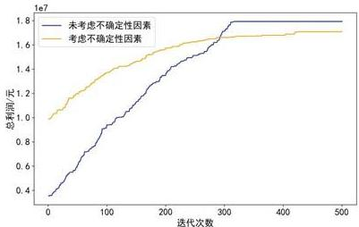

<details>
<summary>line</summary>

| 迭代次数 | 未考虑不确定性因素 (总利润/元) | 考虑不确定性因素 (总利润/元) |
| :--- | :--- | :--- |
| 0 | 4000000 | 10000000 |
| 50 | 6000000 | 11000000 |
| 100 | 8000000 | 12000000 |
| 150 | 10000000 | 13000000 |
| 200 | 12000000 | 14000000 |
| 250 | 14000000 | 15000000 |
| 300 | 16000000 | 16000000 |
| 350 | 17500000 | 16500000 |
| 400 | 18500000 | 17000000 |
| 450 | 18500000 | 17500000 |
| 500 | 18500000 | 17500000 |
</details>

图 17 考虑不确定性因素的累计利润收敛曲线

从图 17 中可以看出，未考虑不确定性情境下的累计利润增长速度显著快于考虑不确定性情境，曲线呈现出较快的上升趋势，并最终收敛至 17925814.6 元。相比之下，考虑不确定性情境下，累计利润的增长相对较为缓慢，最终收敛至 17098212.4 元。这表明，在未考虑不确定性因素时，农户的利润增长更加迅速，且能够达到更高的累计利润。

总体来看，考虑不确定性情境下的累计利润始终低于未考虑不确定性情境，最终实现的总利润较低。基于引入CVaR的DEGA算法的优化分析，成功求解出2024-2030年间在不同不确定性条件下的最优种植方案，进一步验证了该算法在农作物种植策略优化中的有效性。这也表明，在面对不确定性因素时，利润增长受到一定程度的抑制，农户在进行决策时需要充分考虑不确定性对整体收益的影响。

# 5.6 小结

本节首先定义了预期销售量、亩产量、种植成本和销售价格四个不确定性因素，并将其加入问题一的12个约束条件中。基于此，进一步引入了条件风险价值（CVaR）优化方法，构建了一个包含总利润最大化与CVaR约束的目标函数，形成了兼顾收益最大化与风险控制的CVaR种植策略优化模型。随后，使用包含CVaR的DEGA算法进行求解，得出了适用于各种不确定性情境下的最佳种植方案，并绘制了2024年种植方案的热力图以直观展示最优种植结构。

最后，本节还绘制了考虑不确定性因素的2024至2030年各年度利润折线图和累计利润收敛曲线。结果表明，在考虑不确定性情境下，每年的年利润均略低于未考虑不确定性时的情况，且总利润最终收敛至17098212.4元，低于问题一中未考虑不确定性因素时的17925814.6元。这表明，在加入不确定性因素后，尽管风险得到了有效控制，但收益也相应有所降低。

# 六、问题三的建模与求解

本节首先根据2024\~2030年各农作物的最优种植方案，绘制种植面积随时间变化的趋势图，初步分析各农作物之间的相关性。接着，通过Spearman相关系数与热力图明确农作物间的可替代性和互补性关系，同时展示预期销售量、销售价格与种植成本的相关性。在CVaR种植策略优化模型基础上，加入相关性约束，并通过DEGA算法求解最佳方案，最终分析利润表现并绘制相关图表。

# 6.1 问题分析

问题三旨在基于问题二，进一步综合考虑各类农作物的可替代性与互补性，以及预期销售量、销售价格与种植成本之间的相关性，制定该乡村2024\~2030年的最优种植策略。通过模拟数据进行求解，并与问题二的结果进行比较分析。

具体而言，本节首先根据问题二中2024-2030年各农作物的最优种植方案，绘制各类农作物种植面积随时间变化的趋势图，对各农作物之间的种植面积相关关系进行初步分析。随后，通过计算各类农作物种植面积之间的Spearman相关系数，并绘制相关性热力图，明确各农作物之间的可替代性和互补性关系。同时，计算预期销售量、销售价格与种植成本之间的Spearman相关系数，并通过热力图直观展示了三者之间的相关性。

接下来，在问题二的CVaR种植策略优化模型基础上，依次引入农作物之间的可替代性和互补性约束，以及预期销售量、销售价格与种植成本之间的相关性约束，构建考虑相关性因素的CVaR种植策略优化模型。通过使用引入CVaR的DEGA算法，对2024-2030年最佳种植方案进行求解。最后，绘制考虑相关因素的2024-2030年各年度利润折线图和各类农作物的利润条形图，深入分析考虑相关因素下的总利润表现。

问题三的思维框架如下图所示：

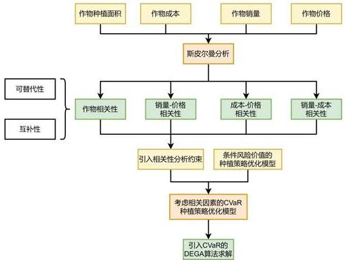

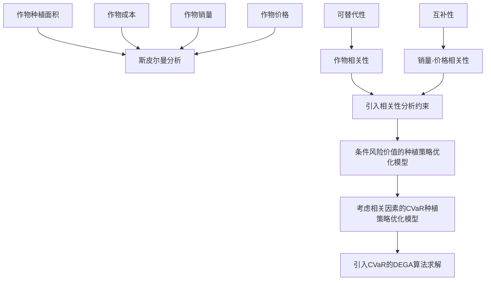

图 18 问题三的思维框架

# 6.2 基于 Spearman 相关系数的相关性分析

基于问题二的种植方案，本小节将计算各类农作物的种植面积，以及预期销售量与销售价格、种植成本之间的 Spearman 相关系数，并通过绘制相关性热力图直观分析它们之间的相关关系。

# 6.2.1 Spearman 相关系数的计算

常见的相关系数包括皮尔逊相关系数与 Spearman（斯皮尔曼）相关系数，与皮尔逊相关系数相比，Spearman 相关系数不受数据量纲的影响、对异常大数不敏感，且不要求变量服从正态分布，也不要求变量之间呈线性关系[9]。由于问题二中各类农作物的种植面积、预期销售量、销售价格和种植成本仅有 7 年数据，属于小样本，因此采用 Shapiro-Wilk 检验来判断每个变量是否符合正态分布。

S-W检验的结果显示各个变量的显著性P值均小于0.05，水平呈现显著性，拒绝原假设，即各类农作物的种植面积、预期销售量、销售价格、种植成本均不满足正态分布。因此本节选择使用Spearman相关性分析。

Spearman 相关系数也称为秩相关系数，用于检验时间序列变化趋势是否存在统计学意义上的显著相关性 $^{[10]}$ 。其基本原理是先将两个变量的所有样本值按大小顺序分别进行排名，然后使用每个样本值对应的排名，来代替原始样本值进行相关性计算。

具体来说，假设需要比较的两个变量为 $X$ 和 $Y$ ，各包含 $n$ 个样本值，则分别将 $X$ 和 $Y$ 的所有样本值从小到大排序，得到它们对应的排名序集合和 $y_{i}$ 。其中， $x$ 中的第 $i$ 个元素 $x_{i}$ 表示 $x_{i}$ 中的第 $i$ 个样本在 $X^{i}$ 中的排名； $y$ 中的第 $i$ 个元素 $y_{i}$ 表示 $Y$ 中的第 $i$ 个样本在 $Y^{i}$ 中的排名。基于每个样本的排名 $x_{i}$ 和 $y_{i}$ ，可以计算Spearman相关系数，来判断 $X$ 和 $Y$ 之间的相关性。Spearman相关系数主要应用于评估两个变量间是否存在明显的单调相关性，取值范围为[-1,1]。它通过比较样本排名之间的相关程度，来反映原变量之间的相关性。计算公式如下：

$$
\rho = \frac {\sum_ {i = 1} ^ {N} (x _ {i} - \bar {x}) (y _ {i} - \bar {y})}{\sqrt {\sum_ {i = 1} ^ {N} (x _ {i} - \bar {x}) ^ {2} \sum_ {i = 1} ^ {N} (y _ {i} - \bar {y}) ^ {2}}} \tag {38}
$$

# 6.2.2 各类农作物种植面积的相关性分析

本小节通过绘制各类农作物种植面积随时间变化的趋势图和种植面积相关性的热力图，系统分析了不同农作物之间的种植面积相关性。通过这些可视化手段，可以直观地观察到各类作物在不同年份的种植面积波动情况，以及它们之间的替代性或互补性关系，从而为农作物种植结构优化和土地资源配置提供数据支持。

图19展示了2024\~2030年期间，各类农作物的种植面积随时间的变化趋势。通过对这些趋势的分析，可以观察到不同农作物之间的种植面积波动规律，以及这些农作物之间可能存在的替代性或互补性关系。了解这些变化对于优化农业种植结构、合理配置土地资源，以及应对市场需求和气候变化具有重要的参考价值。

从图 19 中可以看出，某些作物的种植面积随时间的变化呈现出明显的反向波动趋势，表明这些作物可能具有替代关系。例如，左上图中黑豆和黍子的种植面积呈现出相反的趋势：在 2024\~2025 年，黑豆的种植面积增加时，黍子的种植面积则减少，反之亦然。这种趋势反映了在特定年份，由于市场需求、价格波动或气候条件，农民会在这两类作物之间进行选择，增加其中一种的种植面积，而减少另一种。类似的反向波动还出现在其他图中，如右上图中的南瓜和大麦，这也表明了它们可能具有替代性。

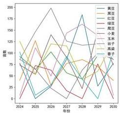

<details>
<summary>line</summary>

| 年份 | 美国 | 黑国 | 红豆 | 绿豆 | 韩国 | 小美 | 玉米 | 子子 | 温森 | 女子 |
|---|---|---|---|---|---|---|---|---|---|---|
| 2024 | 100 | 110 | 90 | 80 | 70 | 60 | 50 | 40 | 30 | 20 |
| 2025 | 120 | 130 | 100 | 90 | 80 | 70 | 60 | 50 | 40 | 30 |
| 2026 | 150 | 160 | 120 | 110 | 100 | 90 | 80 | 70 | 60 | 50 |
| 2027 | 180 | 190 | 140 | 130 | 120 | 110 | 100 | 90 | 80 | 70 |
| 2028 | 200 | 210 | 160 | 150 | 140 | 130 | 120 | 110 | 100 | 90 |
| 2029 | 170 | 180 | 140 | 130 | 120 | 110 | 100 | 90 | 80 | 70 |
| 2030 | 150 | 160 | 120 | 110 | 100 | 90 | 80 | 70 | 60 | 50 |
</details>

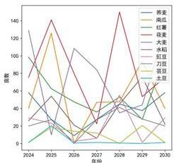

<details>
<summary>line</summary>

| 年份 | 芸麦 | 南瓜 | 红薯 | 花麦 | 大麦 | 光奶 | 豆豆 | 刀豆 | 菜籽 | 土豆 |
|---|---|---|---|---|---|---|---|---|---|---|
| 2024 | 80 | 60 | 10 | 15 | 10 | 5 | 5 | 5 | 5 | 5 |
| 2025 | 140 | 100 | 150 | 100 | 150 | 50 | 50 | 50 | 50 | 50 |
| 2026 | 100 | 60 | 100 | 50 | 100 | 50 | 50 | 50 | 50 | 50 |
| 2027 | 50 | 40 | 50 | 25 | 50 | 25 | 25 | 25 | 25 | 25 |
| 2028 | 120 | 100 | 140 | 100 | 140 | 100 | 100 | 100 | 100 | 100 |
| 2029 | 60 | 40 | 60 | 40 | 60 | 40 | 40 | 40 | 40 | 40 |
| 2030 | 40 | 30 | 40 | 30 | 40 | 30 | 30 | 30 | 30 | 30 |
</details>

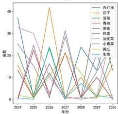

<details>
<summary>line</summary>

| 年份 | 西红杨 | 厄子 | 蔗菜 | 鲜椒 | 苹花 | 包菜 | 油菜类 | 小青菜 | 黄瓜 | 生菜 |
|---|---|---|---|---|---|---|---|---|---|---|
| 2024 | 35 | 10 | 5 | 25 | 15 | 5 | 0 | 0 | 0 | 0 |
| 2025 | 30 | 15 | 10 | 20 | 10 | 5 | 5 | 0 | 0 | 0 |
| 2026 | 40 | 20 | 15 | 25 | 15 | 10 | 10 | 5 | 0 | 0 |
| 2027 | 30 | 10 | 5 | 20 | 10 | 5 | 5 | 5 | 0 | 0 |
| 2028 | 25 | 5 | 0 | 15 | 5 | 0 | 5 | 5 | 5 | 5 |
| 2029 | 20 | 0 | -5 | 10 | 5 | -5 | -5 | -5 | -5 | -5 |
| 2030 | 15 | -5 | -10 | 5 | -5 | -10 | -10 | -10 | -10 | -10 |
</details>

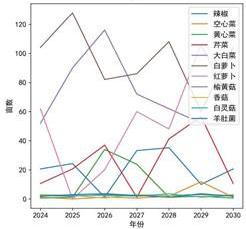

<details>
<summary>line</summary>

| 年份 | 粉椒 | 空心菜 | 黄心菜 | 充菜 | 大白菜 | 红萝卜 | 桃黄芪 | 菜仙 | 白灵菇 | 羊丝圈 |
|---|---|---|---|---|---|---|---|---|---|---|
| 2024 | 120 | 60 | 50 | 20 | 10 | 5 | 5 | 5 | 5 | 5 |
| 2025 | 110 | 80 | 40 | 30 | 15 | 10 | 5 | 5 | 5 | 5 |
| 2026 | 100 | 90 | 30 | 40 | 20 | 15 | 10 | 5 | 5 | 5 |
| 2027 | 90 | 100 | 20 | 50 | 25 | 20 | 15 | 10 | 5 | 5 |
| 2028 | 80 | 110 | 15 | 60 | 30 | 25 | 20 | 15 | 5 | 5 |
| 2029 | 70 | 120 | 10 | 70 | 35 | 30 | 25 | 20 | 5 | 5 |
| 2030 | 60 | 130 | 5 | 80 | 40 | 35 | 30 | 25 | 5 | 5 |
</details>

图19各类农作物的种植面积随时间变化的趋势

另一方面，图中还可以观察到一些作物的种植面积随时间的变化呈现出同步上升或下降的趋势，说明这些作物可能具有互补关系。比如，左下图中青椒和菜花的种植面积变化趋势相似，两个作物的种植面积在各年份同时上升或同时下降，表明它们在农业种植系统中具有互补性。右下图中大白菜和芹菜的变化趋势也具有类似的规律，它们的种植面积同步上升或下降，进一步支持了这种互补性作物的假设。这些作物可能是由于市场需求的同步变化或农田轮作制度的安排，而表现出相似的种植趋势。

接着，本小节基于问题二的求解得到的2024-2030年各类农作物的最优种植方案，计算出每一年各类农作物的总种植面积。随后，依据这七年时间序列的种植面积数据进行了相关性分析，并绘制了农作物相关性热力图，如图20所示。图中直观展示了不同农作物间的相关性，颜色从蓝色到红色，分别代表负相关和正相关，颜色越深表示相关性越强。

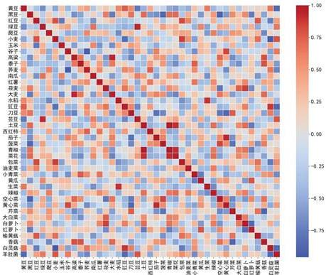  
图 20 各类农作物种植面积的相关性热力图

从图20中可以看出，部分农作物之间存在明显的负相关关系。例如，芸豆与黄豆之间表现出较为显著的负相关性，这表明在种植面积的分配上，这两种作物可能存在一定的替代性。种植芸豆的面积增加时，黄豆的种植面积则会相应减少。类似地，菠菜与黑豆之间也呈现出负相关的趋势，说明这两类作物可能竞争有限的种植资源，形成替代效应。这种替代性通常与作物的种植条件和市场需求类似或存在竞争关系相关联，农户可以根据经济效益或气候条件在这类作物之间做出取舍。

另一方面，热力图显示，部分作物之间具有较强的正相关关系，表明它们具有一定的互补性。例如，包菜与红豆之间的正相关性较高，这意味着这些作物可能同时存在于同一片土地上，或者在农户的种植决策中常常被一同选择。黄心菜与谷子之间也呈现出正相关关系，说明它们在种植策略上可能具有互补效应，或在轮作、间作等农业活动中具有协同效应。

# 6.2.3 预期销售量与销售价格、种植成本之间的相关性分析

本小节基于 2024\~2030 年间各类农作物的预期销售量、销售价格及种植成本数据，计算了 Spearman 相关系数，并绘制了相关性热力图，如图 21 所示。图中直观展示了预期销售量与销售价格、种植成本之间的相关性，颜色越深表示相关性越强。通过该图可以清晰观察到三个变量之间的相互关系，有助于进一步理解农作物的经济表现与成本之间的联系，为优化种植策略提供科学依据。

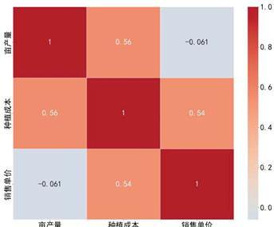

<details>
<summary>heatmap</summary>

|        | 亩产量 | 种植成本 | 销售单价 |
| ------ | ------ | -------- | -------- |
| 亩产量 | 1      | 0.56     | -0.061   |
| 种植成本 | 0.56   | 1        | 0.54     |
| 销售单价 | -0.061 | 0.54     | 1        |
</details>

图 21 预期销售量与销售价格、种植成本之间的相关性热力图

从图21中可以看出，亩产量与种植成本之间的相关性较强，相关系数为0.56，表明随着产量的增加，种植成本也会相应增加。这符合实际情况，因为产量的提高往往伴随着更多的投入。种植成本与销售单价之间的相关性为0.54，显示出较为正向的关系，表明种植成本较高的作物通常售价也较高。而亩产量与销售单价之间的相关性较弱，相关系数为-0.061，表明它们之间的关系较为不显著，可能因为不同作物的市场定价机制与产量并非直接相关。

# 6.3 考虑相关因素的 CVaR 种植策略优化模型的建立

本小节将农作物之间的可替代性与互补性约束条件，以及预期销售量、销售价格与种植成本之间的相关性约束引入问题二的模型，构建了考虑相关因素的CVaR种植策略优化模型。最终，通过引入CVaR的DEGA算法对模型进行求解，得出了不同市场条件下的最优种植策略。该优化模型为应对不确定性提供了更稳健的决策基础，同时为农作物种植的科学管理提供了有力的理论依据。

# 6.3.1 农作物间约束条件的扩展

在现实生活中，不同农作物之间往往存在一定的可替代性和互补性。为更准确地模拟这一实际情况，本小节在问题二模型中引入了两个约束条件，分别为农作物之间的可替代性约束和互补性约束。接下来，将分别对这两个约束条件进行详细说明。

# (1) 农作物之间的可替代性约束

在实际农业生产中，某些农作物具有相似的生长条件和用途，因此它们之间存在一定的可替代性。当一种作物的种植面积增加时，另一种可替代作物的种植面积则应相应减少，以避免资源浪费或市场饱和。因此，本节在模型中引入了可替代性约束，用以限制这些替代作物的总种植面积，确保合理配置种植资源。

例如，作物 A 和作物 B 为替代作物。替代作物之间的种植面积应呈反向变化，因此本小节设置如下约束：

$$
\sum_ {i} \sum_ {t} x _ {i j t} ^ {A} + \delta \cdot \sum_ {i} \sum_ {t} x _ {i j t} ^ {B} \leq M \tag {39}
$$

其中， $x_{ijt}^{k}$ 表示第 t 年、第 j 季、地块 i 上种植作物 k 的面积。 $\delta > 0$ 为可替代性农作物之间的调整因子，M 为上限，表示两者种植面积之和不能超过选定的两个地块的可用面积总和。这意味着作物 A 和作物 B 不能同时大面积种植。

# (2) 农作物之间的互补性约束

在农业生产中，某些作物之间不仅可能存在可替代性，还有可能具有互补性。这意味着当一种作物的种植面积增加时，与其互补的另一作物的种植面积也需要相应增加，以充分发挥互补效应，提升整体效益。因此，本节引入了互补性约束，确保互补作物之间的种植面积比例关系得以维持。

例如，作物 C 和作物 D 为互补作物。本小节定义两个互补作物的种植面积总和之间的关系为正相关，即：

$$
\sum_ {i} \sum_ {t} x _ {i j t} ^ {C} \geq \sigma \cdot \sum_ {i} \sum_ {t} x _ {i j t} ^ {D} \tag {40}
$$

其中， $\sigma > 0$ 表示互补性农作物之间的增幅比例。该约束条件意味着，当作物C的种植面积增加时，作物D也必须按一定比例同步增加。

# 6.3.2 预期销售量、销售价格与种植成本之间的相关性约束

在农作物种植决策过程中，预期销售量、销售价格和种植成本之间的相互关系直接影响种植策略的优化效果。为更加精确地模拟实际情况，本小节将预期销售量、销售价格与种植成本之间的相关性约束引入模型。通过相关性分析方法进行量化，能够反映出市场变化对种植收益和成本的综合影响。通过引入这些约束条件，模型能够更好地应对复杂的市场动态，提高决策的准确性和稳健性。

# (1) 考虑相关性的预期销售量约束

考虑销售价格和种植成本的相关性因素,可以有效提高销售量预测的准确性。为此,本小节构建一个包含这些相关性因素的约束条件,有助于更加科学地表示未来销售量,并为决策提供坚实的数据支撑。

$$
d _ {j t k} = d _ {j, 2 0 2 3, k} \times \left(1 + \gamma + w \cdot \rho_ {d, c} + \beta_ {k} \cdot\right) ^ {t - 2 0 2 3}, \forall i, j, t, k \in \{6, 7 \} \tag {41}
$$

$$
d _ {j t k} = d _ {j, 2 0 2 3, k} \times (1 + \varepsilon) \times \left(1 + w \cdot \rho_ {d, c} + \beta_ {k} \cdot \rho_ {d, p}\right) ^ {t - 2 0 2 3}, \forall i, j, t, k \notin \{6, 7 \}
$$

其中，w表示各类农作物的成本年增长率，是一个常数，取值为0.05。 $\rho_{d,c}$ 表示 $d_{jtk}$ 、 $c_{ijtk}$ 之间的相关系数， $\rho_{d,p}$ 表示 $d_{jtk}$ 、 $p_{ijtk}$ 之间的相关系数。 $\beta_{k}$ 表示各类农作物的销售价格年增长率，具体如下：

$$
\beta_ {k} \in \left\{ \begin{array}{l l} 0. 0 5 & k \in \{1 7, 1 8, \dots , 3 7 \} \\ [ - 0. 0 5, 0. 0 1 ] & k \in \{3 8, 3 9, 4 0 \} \\ - 0. 0 5 & k = 4 1 \\ 0 & o t h e r \end{array} \right. \tag {42}
$$

# (2) 考虑相关性的销售价格约束

考虑预期销售量与种植成本的相关性因素,可以有效提升销售价格预测的准确性。为此,本小节构建了包含这些相关性因素的约束条件,以更加科学地表征未来销售价格,并为决策提供有力的数据支持。

$$
\begin{array}{l} p _ {i j t k} = p _ {i, j, 2 0 2 3, k} \times \left(1 + \beta_ {k} + r \cdot \rho_ {d, p} + w \cdot \rho_ {p, c}\right) ^ {t - 2 0 2 3}, \forall i, j, t, k \in \{6, 7 \} \tag {43} \\ p _ {i j t k} = p _ {i, j, 2 0 2 3, k} \times (1 + \varepsilon \cdot \rho_ {d, p}) \times (1 + \beta_ {k} + w \cdot \rho_ {p, c}) ^ {t - 2 0 2 3}, \forall i, j, t, k \notin \{6, 7 \} \\ \end{array}
$$

其中， $\rho_{d,p}$ 表示 $d_{jtk}$ 、 $p_{ijtk}$ 之间的相关系数， $\rho_{p,c}$ 表示 $p_{ijtk}$ 、 $c_{ijtk}$ 之间的相关系数。

# (3) 考虑相关性的种植成本约束

考虑预期销售量与销售价格的相关性因素,可以有效提升种植成本预测的准确性。为此,本小节构建了一个包含这些相关性因素的约束条件,以更加科学地表征未来的种植成本,并为决策提供有力的数据支持。

$$
\begin{array}{l} c _ {i j t k} = c _ {i, j, 2 0 2 3, k} \times \left(1 + w + r \cdot \rho_ {d, c} + \beta_ {k} \cdot \rho_ {p, c}\right) ^ {t - 2 0 2 3}, \forall i, j, t, k \in \{6, 7 \} \tag {44} \\ c _ {i j t k} = c _ {i, j, 2 0 2 3, k} \times (1 + \varepsilon \cdot \rho_ {d, c}) \times (1 + w + \beta_ {k} \cdot \rho_ {p, c}) ^ {t - 2 0 2 3}, \forall i, j, t, k \notin \{6, 7 \} \\ \end{array}
$$

其中， $\rho_{d,c}$ 表示 $d_{jtk}$ 、 $c_{ijtk}$ 之间的相关系数， $\rho_{p,c}$ 表示 $p_{ijtk}$ 、 $c_{ijtk}$ 之间的相关系数。

# 6.3.3 考虑相关因素的 CVaR 种植策略优化模型

在优化农作物种植策略时，不仅需要追求收益最大化，还必须充分考虑市场不确定性带来的风险。因此，CVaR作为一种有效的风险控制方法被引入优化目标，以在最大化期望收益的同时，确保在最不利情境下的损失得到有效控制。本小节假设，超出预期销售量的产量将面临滞销风险，基于这一假设，对损失与收益进行平衡，最终优化后的目标函数如下所示：

$$
\max \left(\mathrm{E} \left[ \sum_ {i, j, t, k} \left(p _ {i j t k} \cdot \min \left(y _ {i j t k} \cdot x _ {i j t} ^ {k}, d _ {j t k}\right) - c _ {i j t k} \cdot x _ {i j t} ^ {k}\right) \right] - \lambda \cdot \mathrm{CVaR} _ {\alpha}\right) \tag {45}
$$

式中， $y_{ijtk}$ 表示作物 k 在第 t 年、第 j 季、地块 i 上的亩产量，单位为斤； $d_{jtk}$ 表示作物 k 在第 t 年、第 j 季的预期销售量，单位为斤； $p_{ijtk}$ 表示作物 k 在第 t 年、第 j 季、地块 i 上的销售单价，单位为元/斤。而 $c_{ijtk}$ 表示作物 k 在第 t 年、第 j 季、地块 i 上的种植成本，单位为元/亩。 $x_{ijt}^{k}$ 表示第 t 年、第 j 季、地块 i 上种植作物 k 的面积。

这个公式可以分为两部分进行分析。第一部分专注于七年内期望总利润的最大化。它通过评估不同种植方案下的收益情况，旨在通过合理的种植策略提升整体收益。这一部分的核心在于确定最优的种植方案，从而最大限度地提高预期利润，以应对未来可能的市场波动和环境变化。

第二部分则引入了条件价值约束，以调节参数来平衡收益与风险。这一部分确保在极端不利的情景下，损失不会超出可控范围，从而提高模型的稳健性和抗风险能力。通过这一约束，模型不仅关注收益最大化，还重视风险控制，确保在面对极端情况时依然能够维持较好的表现。两部分共同作用，实现了收益最大化与风险控制的有机结合。

因此，根据以上约束条件与目标函数建立的考虑相关因素的CVaR种植策略优化模型为：

$$
\max \left(\mathrm{E} \left[ \sum_ {i, j, t, k} \left(p _ {i j t k} \cdot \min \left(y _ {i j t k} \cdot x _ {i j t} ^ {k}, d _ {j t k}\right) - c _ {i j t k} \cdot x _ {i j t} ^ {k}\right) \right] - \lambda \cdot \mathrm{CVaR} _ {\alpha}\right) \tag {46}
$$

$$
\begin{array}{l} \sum_ {k = 1} ^ {4 1} x _ {i j t} ^ {k} \leq A _ {i}, \forall i \in \{\mathrm{A} 1, \mathrm{A} 2, \dots , \mathrm{F} 4 \}, j, t \\ x _ {i j t} ^ {k} \geq 0. 5 \cdot A _ {i} \cdot z _ {i j t} ^ {k}, \forall i \in \{\mathrm{A1,A2,} \dots , \mathrm{F4} \}, j, t, k \\ x _ {i j t} ^ {k} \leq A _ {i} \cdot z _ {i j t} ^ {k}, \forall i \in \{\mathrm{A1,A2,} \dots , \mathrm{F4} \}, j, t, k \\ z _ {i 1 t} ^ {k} \cdot z _ {i 1 (t + 1)} ^ {k} = 0, \forall i \in \{\mathrm{A1,A2}, \dots , \mathrm{C6} \}, t, k \\ \sum_ {t = t} ^ {t + 2} \sum_ {k} z _ {i j t} ^ {k} \geq 1, \forall i \in \{A 1, A 2, \dots , F 4 \}, t, k \in \{1, 2, 3, 4, 5, 1 7, 1 8, 1 9 \} \\ z _ {i 2 t} ^ {k} = 0, \forall i \in \{\mathrm{A1,A2}, \dots , \mathrm{C6} \}, t, k \in \{1, 2, \dots , 1 5 \} \\ z _ {i 1 t} ^ {1 6} \cdot \sum_ {k} \left(z _ {i 1 t} ^ {k} + z _ {i 2 t} ^ {k}\right) = 0, \forall i \in \{D 1, D 2, \dots , D 8 \}, t, k \in \{1 7, 1 8, \dots , 3 7 \} \\ \sum_ {k} z _ {i 1 t} ^ {k} = 0, \forall i \in \{\mathrm{E} 1, \mathrm{E} 2, \dots , \mathrm{E} 1 6 \}, t, k \in \{3 5, 3 6, 3 7 \} \\ \sum_ {k} z _ {i j t} ^ {k} = 0, \forall i \in \{\mathrm{F1}, \mathrm{F2}, \mathrm{F3}, \mathrm{F4} \}, j, t, k \in \{3 5, 3 6, 3 7 \} \\ z _ {i j t} ^ {k} = 0, \forall i \in \{\mathrm{A}, \mathrm{B}, \mathrm{C}, \mathrm{D}, \mathrm{F} \}, \forall j, t, k \in \{3 8, 3 9, 4 0, 4 1 \} \\ \sum_ {i = 1} ^ {5 4} z _ {i j t} ^ {k} \leq 5, \forall j, t, k \\ \sum_ {i = 1} ^ {5 4} x _ {i j t} ^ {k} \cdot y _ {i j t k} \geq 0. 9 \cdot d _ {j t k}, \forall j, t, k \\ d _ {j t k} = d _ {j, 2 0 2 3, k} \times (1 + r) ^ {t - 2 0 2 3} \quad r \in [ 0. 0 5, 0. 1 ], k \in \{6, 7 \} \\ d _ {j t k} = d _ {j, 2 0 2 3, k} \times (1 + \varepsilon) \quad \varepsilon \in [ - 0. 0 5, 0. 0 5 ], k \notin \{6, 7 \} \\ y _ {i j t k} = y _ {i, j, 2 0 2 3, k} \times (1 + \theta), \forall i, j, t, k, \theta \in [ - 0. 1, 0. 1 ] \\ c _ {i j t k} = c _ {i, j, 2 0 2 3, k} \times 1. 0 5 ^ {t - 2 0 2 3}, \forall i, j, t, k \\ p _ {i j t k} = p _ {i, j, 2 0 2 3, k} \times 1. 0 5 ^ {t - 2 0 2 3}, k \in \{1 7, 1 8, \dots , 3 7 \} \\ p _ {i j t k} = p _ {i, j, 2 0 2 3, k} \times (1 - \beta) ^ {t - 2 0 2 3}, \beta \in [ 0. 0 1, 0 0 5 ], k \in \{3 8, 3 9, 4 0 \} \\ p _ {i j t k} = p _ {i, j, 2 0 2 3, k} \times 0. 9 5 ^ {t - 2 0 2 3}, k = 4 1 \\ \sum_ {i} \sum_ {t} x _ {i j t} ^ {A} + \delta \cdot \sum_ {i} \sum_ {t} x _ {i j t} ^ {B} \leq M \\ \sum_ {i} \sum_ {t} x _ {i j t} ^ {C} \geq \sigma \cdot \sum_ {i} \sum_ {t} x _ {i j t} ^ {D} \\ d _ {j t k} = d _ {j, 2 0 2 3, k} \times \left(1 + \gamma + w \cdot \rho_ {d, c} + \beta_ {k} \cdot\right) ^ {t - 2 0 2 3}, k \in \{6, 7 \} \\ d _ {j t k} = d _ {j, 2 0 2 3, k} \times (1 + \varepsilon) \times \left(1 + w \cdot \rho_ {d, c} + \beta_ {k} \cdot \rho_ {d, p}\right) ^ {t - 2 0 2 3}, k \notin \{6, 7 \} \\ p _ {i j t k} = p _ {i, j, 2 0 2 3, k} \times \left(1 + \beta_ {k} + r \cdot \rho_ {d, p} + w \cdot \rho_ {p, c}\right) ^ {t - 2 0 2 3}, k \in \{6, 7 \} \\ p _ {i j t k} = p _ {i, j, 2 0 2 3, k} \times (1 + \varepsilon \cdot \rho_ {d, p}) \times (1 + \beta_ {k} + w \cdot \rho_ {p, c}) ^ {t - 2 0 2 3}, k \notin \{6, 7 \} \\ c _ {i j t k} = c _ {i, j, 2 0 2 3, k} \times \left(1 + w + r \cdot \rho_ {d, c} + \beta_ {k} \cdot \rho_ {p, c}\right) ^ {t - 2 0 2 3}, k \in \{6, 7 \} \\ c _ {i j t k} = c _ {i, j, 2 0 2 3, k} \times \left(1 + \varepsilon \cdot \rho_ {d, c}\right) \times \left(1 + w + \beta_ {k} \cdot \rho_ {p, c}\right) ^ {t - 2 0 2 3}, k \notin \{6, 7 \} \\ \end{array}
$$

s.t.

# 6.4 考虑相关因素的最大化利润分析

在求解出 2024\~2030 年考虑相关因素的最优种植方案后，本小节进一步对各年度利润及各类农作物的利润进行了可视化分析，直观展示不同情境下的经济效益差异。

首先，图 22 展示了 2024\~2030 年在考虑相关性和未考虑相关性两种情境下的各年度利润变化情况。通过对比两种情境下的利润走势，可以直观地观察相关性因素对农作物种植策略优化后年利润的影响。

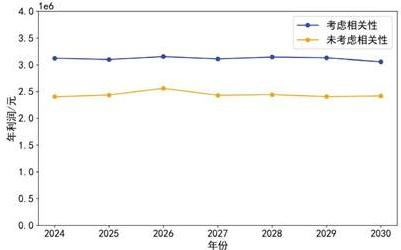

<details>
<summary>line</summary>

| 年份 | 考虑相关性 (元) | 未考虑相关性 (元) |
|---|---|---|
| 2024 | 3.1e6 | 2.4e6 |
| 2025 | 3.05e6 | 2.45e6 |
| 2026 | 3.15e6 | 2.5e6 |
| 2027 | 3.08e6 | 2.4e6 |
| 2028 | 3.1e6 | 2.45e6 |
| 2029 | 3.08e6 | 2.4e6 |
| 2030 | 3.0e6 | 2.45e6 |
</details>

图 22 考虑相关因素的 2024\~2030 年各年度利润折线图

从图22中可以看出，考虑相关因素后各年度的年利润明显高于未考虑相关性的情境。具体表现为，2024\~2030年间，蓝色折线代表的利润水平始终高于黄色折线，且两者之间的差距在各年保持相对稳定。这表明将农作物之间的可替代性、互补性以及预期销售量、销售价格与种植成本的相关性引入优化模型，有效提高了整体利润。尤其在2026年，考虑相关性后的年利润达到顶峰，进一步证明了相关性因素对利润提升的积极作用。

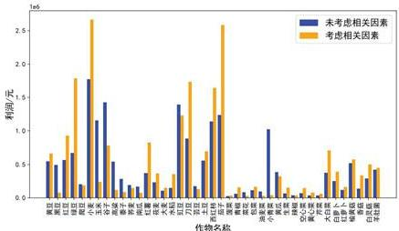

<details>
<summary>bar</summary>

| 作物名称 | 未考虑相关因素 (元) | 考虑相关因素 (元) |
|---|---|---|
| 黄豆 | 0.6 | 0.7 |
| 棕榈 | 0.5 | 0.9 |
| 菜籽油 | 0.8 | 1.8 |
| 玉米 | 1.2 | 2.6 |
| 小松果 | 1.4 | 0.8 |
| 鸡蛋 | 0.3 | 0.4 |
| 菜籽油 | 0.4 | 0.5 |
| 菜籽油 | 0.5 | 0.6 |
| 玉米 | 0.6 | 0.7 |
| 玉米 | 0.7 | 0.8 |
| 棕榈油 | 0.8 | 1.7 |
| 菜籽油 | 1.0 | 1.6 |
| 菜籽油 | 1.1 | 2.6 |
| 玉米 | 1.3 | 0.9 |
| 玉米 | 1.4 | 0.8 |
| 棕榈油 | 1.5 | 0.7 |
| 菜籽油 | 1.6 | 0.6 |
| 菜籽油 | 1.7 | 0.5 |
| 玉米 | 1.8 | 0.4 |
| 玉米 | 1.9 | 0.3 |
| 棕榈油 | 2.0 | 0.2 |
| 菜籽油 | 2.1 | 0.1 |
| 菜籽油 | 2.2 | 0.05 |
| 玉米 | 2.3 | 0.03 |
| 玉米 | 2.4 | 0.02 |
| 棕榈油 | 2.5 | 0.01 |
| 菜籽油 | 2.6 | 0.005 |
| 菜籽油 | 2.7 | 0.003 |
| 玉米 | 2.8 | 0.002 |
| 玉米 | 2.9 | 0.001 |
| 棕榈油 | 3.0 | 0.0005 |
| 菜籽油 | 3.1 | 0.0003 |
| 菜籽油 | 3.2 | 0.0002 |
| 玉米 | 3.3 | 0.0001 |
| 玉米 | 3.4 | 0.00005 |
| 棕榈油 | 3.5 | 0.00003 |
| 菜籽油 | 3.6 | 0.00002 |
| 菜籽油 | 3.7 | 0.00001 |
| 玉米 | 3.8 | 0.000005 |
| 玉米 | 3.9 | 0.000003 |
| 棕榈油 | 4.0 | 0.000002 |
| 菜籽油 | 4.1 | 0.000001 |
| 菜籽油 | 4.2 | 0.0000005 |
| 玉米 | 4.3 | 0.0000003 |
| 玉米 | 4.4 | 0.0000002 |
| 棕榈油 | 4.5 | 0.0000001 |
| 菜籽油 | 4.6 | 0.00000005 |
| 菜籽油 | 4.7 | 0.00000003 |
| 玉米 | 4.8 | 0.00000002 |
| 玉米 | 4.9 | 0.00000001 |
| 棕榈油 | 5.0 | 0.00000001 |
| 菜籽油 | 5.1 | 0.00000001 |
| 菜籽油 | 5.2 | 0.00000001 |
| 玉米 | 5.3 | 0.00000001 |
| 玉米 | 5.4 | 0.00000001 |
| 棕榈油 | 5.5 | 0.00000001 |
| 菜籽油 | 5.6 | 0.00000001 |
| 菜籽油 | 5.7 | 0.00000001 |
| 玉米 | 5.8 | 0.00000001 |
| 玉米 | 5.9 | 0.00000001 |
| 棕榈油 | 6.0 | 0.00000001 |
| 菜籽油 | 6.1 | 0.00000001 |
| 菜籽油 | 6.2 | 0.00000001 |
| 玉米 | 6.3 | 0.00000001 |
| 玉米 | 6.4 | 0.00000001 |
| 棕榈油 | 6.5 | 0.6 |
| 菜籽油 | 6.6 | 1    |
| 菜籽油 | 6.7 |      |
| 菜籽油 |      |        |
| 白草木糖   |      |        |
| 白草木糖   |      |        |
| 白草木糖   |      |        |
| 白草木糖   |      |        |
| 白草木糖   |      |        |
| 白草木糖   |      |        |
| 白草木糖   |      |        |
| 白草木糖   |      |        |
| 白草木糖   |      |       |
| 白草木糖   |      |       |
| 白草木糖   |      |       |
| 白草木糖   |      |       |
| 白草木糖   |      |       |
| 白草木糖   |      |       |
| 白草木糖   |      |       |
| 白草木糖   |      |       |
| 白草木糖   |      |       |
| 百草木糖   |      |       |
| 百草木糖   |      |       |
| 百草木糖   |      |       |
| 百草木糖   |      |       |
| 百草木糖   |      |       |
| 百草木糖   |      |       |
| 百草木糖   |      |       |
| 百草木糖   |      |       |
| 百草木糖 - 百草木糖 - 百草木糖 - 百草木糖 - 百草木糖 - 百草木糖 - 百草木糖 - 百草木糖 - 百草木糖 - 百草木糖 - 百草木糖 - 百草木糖 - 百草木糖 - 百草木糖 - 百草木糖 - 百草木糖 - 百草木糖 - 百草水
</details>

图 23 考虑相关因素的各类农作物利润条形图

从图 23 中可以看出，小麦和茄子的利润显著高于其他作物，特别是在考虑相关因素的情境下，这两种作物的利润大幅提升。表明在最优种植策略中，小麦和茄子具有较强的盈利能力。这可能是由于它们市场需求稳定、种植成本较低、销售价格较高等因素综合作用的结果。因此，小麦和茄子在未来的种植规划中应得到更多的关注和资源投入，以最大化种植收益。

相对而言，一些农作物的利润表现较为低迷。例如，辣椒和菠菜的利润在两种情境下均处于较低水平，尤其是在考虑相关因素后，这些作物的利润并未显著提升。由此可以推测，这些作物的市场需求较低，或者它们的种植成本较高，导致整体收益不理想。对于这些低利润作物，需要优化种植面积，甚至调整作物种类，以避免资源浪费并提升整体收益水平。

综合考虑相关性因素后，农作物的种植策略得到了优化，显著提升了整体收益。通过引入作物之间的可替代性和互补性约束，结合预期销售量、销售价格与种植成本的相关性，模型实现了更科学的规划与决策。最终，七年总利润从原先的未考虑相关因素情境下的17925814.6元提升至21799420.9元，增长幅度显著。这一结果表明，在复杂的市场环境中，充分考虑相关性因素对于制定更优的种植策略至关重要，不仅有助于控制风险，还能实现收益的最大化。

# 6.5 小结

本节首先绘制了各类农作物种植面积的时间趋势图，对农作物种植面积随时间变化的相关关系进行了初步分析。接着，利用各类农作物种植面积之间的Spearman相关系数和相关性热力图，明确了不同农作物之间的可替代性与互补性关系。此外，本节还通过计算预期销售量、销售价格和种植成本三者之间的Spearman相关系数，并绘制其热力图，清晰展现了这三者之间的相关性，从而为后续的优化模型提供了数据支持。

在此基础上，本节在CVaR种植策略优化模型中逐步引入了农作物之间的可替代性与互补性约束，以及预期销售量、销售价格与种植成本之间的相关性约束，最终构建了一个考虑相关性因素的CVaR种植策略优化模型。通过使用包含CVaR的DEGA算法，本节得出了2024至2030年期间的最佳种植方案。最后，本节绘制了考虑相关因素的2024至2030年各年度的利润折图，结果表明在考虑相关性后，年利润显著提升。同时，通过各类农作物的利润条形图分析得出，小麦和茄子的利润明显高于其他作物，最终七年的总利润提升至21799420.9元。

# 七、模型的分析与检验

本节将对所构建的考虑相关因素的CVaR种植策略优化模型进行深入分析与检验，重点包含灵敏度分析。这些分析不仅验证了模型在不同条件下的表现和鲁棒性，还为模型的进一步优化及实际应用提供了可靠的科学依据。通过这些检验，确保模型在真实场景中能够有效运行，并为农作物种植决策过程提供有力支持。

# 7.1 基于鲁棒优化的灵敏度分析

本小节基于鲁棒优化方法进行灵敏度分析，考虑了四个不确定性因素均为最坏情况，旨在求解在这种极端条件下的最大利润。通过将鲁棒优化结果与问题三中2024\~2030年各年的年利润进行对比分析，可以观察到虽然鲁棒优化后的年利润有所降低，但与问题三中的年利润差距不大。这表明鲁棒优化模型在面对最坏情况下的利润表现仍然相对稳定，体现了其在极端条件下的可靠性。

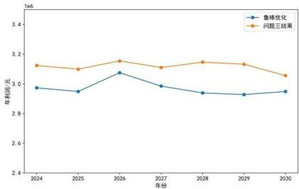

<details>
<summary>line</summary>

| 年份 | 鲁棒优化 (年利润/元) | 问题三结果 (年利润/元) |
|---|---|---|
| 2024 | 2.98 | 3.15 |
| 2025 | 2.93 | 3.11 |
| 2026 | 3.07 | 3.17 |
| 2027 | 2.99 | 3.11 |
| 2028 | 2.93 | 3.16 |
| 2029 | 2.91 | 3.14 |
| 2030 | 2.94 | 3.05 |
</details>

图 24 考虑相关因素的各类农作物利润条形图

进一步分析发现，鲁棒优化后总利润的波动幅度较小，这说明模型在应对不确定性因素时具备了较强的稳健性和抗风险能力。综合来看，鲁棒优化有效地控制了利润的波动，验证了其在处理极端情况时的优越表现。该结果充分证明了模型在复杂环境下仍能保持良好的性能，从而为实际应用提供了有力的支持。

# 7.2 基于动态调参的灵敏度分析

本小节基于动态调参方法，依次调节了以下四个参数：预期销售量上升5%、亩产量上升5%、销售价格上升5%、种植成本下降5%。针对这四种参数变动情况，计算得出了2024\~2030年各年的年利润的条件期望。通过将这些新的利润数据与问题三中相应年份的年利润进行对比分析，可以清晰地观察到模型在不同参数设定下的表现。

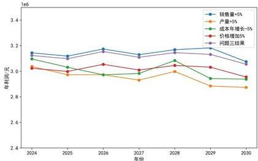

<details>
<summary>line</summary>

| 年份 | 销售量+5% | 产量+5% | 成本年增长-5% | 价格增加5% | 问题三结果 |
|---|---|---|---|---|---|
| 2024 | 3.15e6 | 3.05e6 | 3.10e6 | 3.05e6 | 3.10e6 |
| 2025 | 3.10e6 | 2.98e6 | 3.05e6 | 2.98e6 | 3.05e6 |
| 2026 | 3.18e6 | 2.95e6 | 2.98e6 | 2.95e6 | 3.10e6 |
| 2027 | 3.12e6 | 2.90e6 | 3.00e6 | 2.98e6 | 3.05e6 |
| 2028 | 3.18e6 | 2.98e6 | 3.10e6 | 3.05e6 | 3.10e6 |
| 2029 | 3.15e6 | 2.88e6 | 2.95e6 | 3.08e6 | 3.12e6 |
| 2030 | 3.08e6 | 2.85e6 | 2.92e6 | 2.98e6 | 3.05e6 |
</details>

图 25 考虑相关因素的各类农作物利润条形图

分析结果显示，尽管参数有所调整，总利润的波动依然较小。这一发现表明，模型在面对各种参数变动时能够保持稳定的收益水平，从而充分验证了其稳健性和抗风险能力。这种稳定性不仅增强了模型的实际应用价值，也表明其在处理实际问题中可能出现的变化时具有较强的适应能力。

综上所述，本节对考虑相关性因素的CVaR种植策略优化模型进行了全面的稳健性分析。首先，通过鲁棒优化方法对模型进行灵敏度分析，结果表明，在考虑所有不确定性因素后的总利润与问题三中的利润差距极小，充分体现了模型的稳健性。其次，本文通过动态调节关键参数（包括预期销售量、亩产量、销售价格和种植成本），发现这些参数的波动对总利润的影响较小，进一步验证了模型在面对不同风险因素时的抗风险能力。这些分析结果表明，模型不仅在极端条件下表现出优良的稳定性，而且在实际应用中也具备较强的适应性和可靠性。

# 八、模型的评价与推广

本节将对所构建的农作物种植策略优化模型进行全面评价，重点评估其在实际应用中的有效性，并探讨各模型的优缺点，为进一步优化和改进模型提供依据。

# 8.1 模型的优点

（1）差分进化通过“差分变异”来生成新解，能够扩大搜索空间，避免陷入局部最优解。结合遗传算法的选择、交叉和变异操作，DEGA能够有效探索大规模、复杂的解空间，在解决农作物种植策略这种具有多个约束条件和复杂目标的优化问题中有独特的优势。  
(2) 模型引入了条件风险价值优化方法, 有助于提升整个模型的稳健性, 能够在市场环境波动的情境下保持较高的收益。  
(3）模型充分考虑了各个农作物之间、预期销售量与销售价格、种植成本之间的相关性，能够准确地反映出不同作物之间的复杂相互作用以及市场经济变化下的影响，从而提高决策的可靠性。

# 8.2 模型的缺点

模型引入了多种约束条件（如重茬限制、豆类作物轮作、作物分散程度等），并且通过改进的遗传算法求解，导致模型的复杂度增加，求解时间较长。

# 8.3 模型的推广

本文建立的考虑相关性因素的CVaR种植策略优化模型可以推广到不同地区的农业生产中。不同地区的气候、土地类型和市场需求存在较大差异，但模型中的基本框架，如作物轮作要求、风险控制等，可以通过调整相应的参数和约束条件，应用于不同地区的农业优化。特别是在面对不确定性较大的气候和市场波动时，模型可以为不同区域提供期望收益较高的种植建议。

尽管该模型专注于农作物种植，但模型中考虑风险和相关性因素的框架也可以推广到其他资源管理领域，如水资源管理、土地资源利用等。在这些领域，资源的合理分配和风险的有效控制同样重要，CVaR和DEGA算法的结合可以为其他类型的资源优化提供理论支持和实践参考。

# 参考文献

[1] Prasad K K, Ghosh A. A Genetic Algorithm Approach to Optimal Asset Allocation of Defined Contribution Pension Funds: Evidence From India's National Pension System[J]. Compensation & Benefits Review, 2024, 56(4): 195-210.   
[2] 南春子, 何冠鸿. 基于遗传算法的不同地下结构特征板跨最经济配筋研究 [J]. 智能建筑与智慧城市, 2024, (08): 20-22.  
[3] Yiming C. Furnace Temperature Curve Optimization Model Based on Differential Evolution Algorithm[J]. Journal of Electronic Research and Application, 2024, 8(4): 64-80.   
[4] 马玉峰, 宁欣, 郑艳玲, 等. 基于差分进化算法的减速器齿轮参数优化设计 [J]. 机械强度, 2024, 46(03): 652-661.  
[5] 赵鹏, 丁雪, 程婷婷, 等. 基于差分进化算法的改进遗传算法的 UUV 路径规划 [J]. 自动化应用, 2024, 65(05): 25-28.  
[6] Yu Z C. Data-driven risk-averse newsvendor problems: developing the CVaR criteria and support vector machines[J]. International Journal of Production Research, 2024, 62(4): 1221-1238.   
[7] 杨佳鑫, 蒲港. 基于CVaR风险规避的群岛物流网络优化研究[J]. 中国物流与采购, 2023, (23): 55-56.  
[8] 徐邦玺. 基于遗传算法和CVaR实现投资组合优化[J]. 经济研究导刊, 2024, (13): 71-74.  
[9] 季鹏,陈芳芳,徐天奇等.基于Spearman相关系数法与有功分量法的高阻接地故障选线方法研究[J].山东电力技术,2022,49(12):8-13+31.  
[10] Han Y.D. A H.A robust Spearman correlation coefficient permutation test[J]. Communications in Statistics - Theory and Methods, 2024, 53(6): 2141-2153.

# 附录

附录 1 2023 年各季次农作物实际产量的表格....46

附录 2 考虑不确定性因素的最优种植方案的可视化结果.....47

附录3 DEGA算法的程序 51

附录 4 引入 CVaR 的 DEGA 算法的主体程序.....55

附录 5 引入相关因素的 DEGA 的主体程序.....57

附录 1 2023 年各季次农作物实际产量的表格

<table><tr><td>作物编号</td><td>作物名称</td><td>种植季次</td><td>总产量/斤</td></tr><tr><td>1</td><td>黄豆</td><td>单季</td><td>167580</td></tr><tr><td>2</td><td>黑豆</td><td>单季</td><td>65550</td></tr><tr><td>3</td><td>红豆</td><td>单季</td><td>68400</td></tr><tr><td>4</td><td>绿豆</td><td>单季</td><td>95520</td></tr><tr><td>5</td><td>爬豆</td><td>单季</td><td>29625</td></tr><tr><td>6</td><td>小麦</td><td>单季</td><td>506160</td></tr><tr><td>7</td><td>玉米</td><td>单季</td><td>384750</td></tr><tr><td>8</td><td>谷子</td><td>单季</td><td>210900</td></tr><tr><td>9</td><td>高粱</td><td>单季</td><td>90000</td></tr><tr><td>10</td><td>黍子</td><td>单季</td><td>37500</td></tr><tr><td>11</td><td>荞麦</td><td>单季</td><td>4725</td></tr><tr><td>12</td><td>南瓜</td><td>单季</td><td>111150</td></tr><tr><td>13</td><td>红薯</td><td>单季</td><td>113400</td></tr><tr><td>14</td><td>莜麦</td><td>单季</td><td>42000</td></tr><tr><td>15</td><td>大麦</td><td>单季</td><td>30000</td></tr><tr><td>16</td><td>水稻</td><td>单季</td><td>21000</td></tr><tr><td>17</td><td>豇豆</td><td>第一季</td><td>115640</td></tr><tr><td>18</td><td>刀豆</td><td>第一季</td><td>87120</td></tr><tr><td>19</td><td>芸豆</td><td>第一季</td><td>17640</td></tr><tr><td>20</td><td>土豆</td><td>第一季</td><td>99000</td></tr><tr><td>21</td><td>西红柿</td><td>第一季</td><td>118260</td></tr><tr><td>21</td><td>西红柿</td><td>第二季</td><td>2430</td></tr><tr><td>22</td><td>茄子</td><td>第一季</td><td>142560</td></tr><tr><td>22</td><td>茄子</td><td>第二季</td><td>6480</td></tr><tr><td>23</td><td>菠菜</td><td>第二季</td><td>2700</td></tr><tr><td>24</td><td>青椒</td><td>第一季</td><td>4860</td></tr><tr><td>24</td><td>青椒</td><td>第二季</td><td>2430</td></tr><tr><td>25</td><td>菜花</td><td>第一季</td><td>9810</td></tr><tr><td>26</td><td>包菜</td><td>第一季</td><td>11070</td></tr><tr><td>27</td><td>油麦菜</td><td>第一季</td><td>12240</td></tr><tr><td>28</td><td>小青菜</td><td>第一季</td><td>114480</td></tr><tr><td>28</td><td>小青菜</td><td>第二季</td><td>3240</td></tr><tr><td>29</td><td>黄瓜</td><td>第一季</td><td>24300</td></tr><tr><td>29</td><td>黄瓜</td><td>第二季</td><td>12150</td></tr><tr><td>30</td><td>生菜</td><td>第一季</td><td>4080</td></tr><tr><td>30</td><td>生菜</td><td>第二季</td><td>4080</td></tr><tr><td>31</td><td>辣椒</td><td>第一季</td><td>3240</td></tr><tr><td>32</td><td>空心菜</td><td>第一季</td><td>9900</td></tr><tr><td>33</td><td>黄心菜</td><td>第一季</td><td>4920</td></tr><tr><td>34</td><td>芹菜</td><td>第二季</td><td>5430</td></tr><tr><td>35</td><td>大白菜</td><td>第二季</td><td>150000</td></tr><tr><td>36</td><td>白萝卜</td><td>第二季</td><td>100000</td></tr><tr><td>37</td><td>红萝卜</td><td>第二季</td><td>36000</td></tr><tr><td>38</td><td>榆黄菇</td><td>第二季</td><td>9000</td></tr><tr><td>39</td><td>香菇</td><td>第二季</td><td>7200</td></tr><tr><td>40</td><td>白灵菇</td><td>第二季</td><td>18000</td></tr><tr><td>41</td><td>羊肚菌</td><td>第二季</td><td>4200</td></tr></table>

附录2 考虑不确定性因素的最优种植方案的可视化结果  
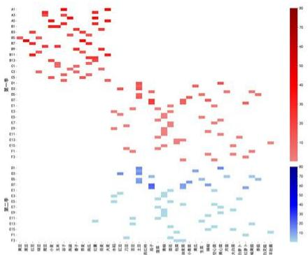

<details>
<summary>heatmap</summary>

| | 第一节 | 第二节 |
|---|---|---|
| A1 | 50 | 60 |
| A2 | 45 | 55 |
| A3 | 40 | 50 |
| A4 | 35 | 45 |
| A5 | 30 | 40 |
| A6 | 25 | 35 |
| A7 | 20 | 30 |
| A8 | 15 | 25 |
| A9 | 10 | 20 |
| A10 | 5 | 15 |
| A11 | 0 | 10 |
| A12 | -5 | 5 |
| A13 | -10 | 0 |
| A14 | -15 | -5 |
| A15 | -20 | -10 |
| A16 | -25 | -15 |
| A17 | -30 | -20 |
| A18 | -35 | -25 |
| A19 | -40 | -30 |
| A20 | -45 | -35 |
| A21 | -50 | -40 |
| A22 | -55 | -45 |
| A23 | -60 | -50 |
| A24 | -65 | -55 |
| A25 | -70 | -60 |
| A26 | -75 | -65 |
| A27 | -80 | -70 |
| A28 | -85 | -75 |
| A29 | -90 | -80 |
| A30 | -95 | -85 |
| A31 | -100 | -90 |
| A32 | -105 | -95 |
| A33 | -110 | -100 |
| A34 | -115 | -105 |
| A35 | -120 | -110 |
| A36 | -125 | -115 |
| A37 | -130 | -120 |
| A38 | -135 | -125 |
| A39 | -140 | -130 |
| A40 | -145 | -135 |
| A41 | -150 | -140 |
| A42 | -155 | -145 |
| A43 | -160 | -150 |
| A44 | -165 | -155 |
| A45 | -170 | -160 |
| A46 | -175 | -165 |
| A47 | -180 | -170 |
| A48 | -185 | -175 |
| A49 | -190 | -180 |
| A50 | -195 | -185 |
| A51 | -200 | -190 |
| A52 | -205 | -195 |
| A53 | -210 | -200 |
| A54 | -215 | -205 |
| A55 | -220 | -210 |
| A56 | -225 | -215 |
| A57 | -230 | -220 |
| A58 | -235 | -225 |
| A59 | -240 | -230 |
| A60 | -245 | -235 |
| A61 | -250 | -240 |
| A62 | -255 | -245 |
| A63 | -260 | -250 |
| A64 | -265 | -255 |
| A65 | -270 | -260 |
| A66 | -275 | -265 |
| A67 | -280 | -270 |
| A68 | -285 | -275 |
| A69 | -290 | -280 |
| A70 | -295 | -285 |
| A71 | -300 | -290 |
| A72 | -305 | -295 |
| A73 | -310 | -300 |
| A74 | -315 | -305 |
| A75 | -320 | -310 |
| A76 | -325 | -315 |
| A77 | -330 | -320 |
| A78 | -335 | -325 |
| A79 | -340 | -330 |
| A80 | -345 | -335 |
| A81 | -350 | -340 |
| A82 | -355 | -345 |
| A83 | -360 | -350 |
| A84 | -365 | -355 |
| A85 | -370 | -360 |
| A86 | -375 | -365 |
| A87 | -380 | -370 |
| A88 | -385 | -375 |
| A89 | -390 | -380 |
| A90 | -395 | -385 |
| A91 | -400 | -390 |
| A92 | -405 | -395 |
| A93 | -410 | -400 |
| A94 | -415 | -405 |
| A95 | -420 | -410 |
| A96 | -425 | -415 |
| A97 | -430 | -420 |
| A98 | -435 | -425 |
| A99 | -440 | -430 |
| A100+ (second) + "Second" (third) + "Third" (four) + "Third" (five) + "Third" (six) + "Third" (seven) + "Third" (eight) + "Third" (eight) + "Third" (eight) + "Third" (eight) + "Third" (eight) + "Third" (eight) + "Third" (eight) + "Third" (eight) + "Third" (eight) + "Third" (eight) + "Third" (eight) + "Third" (eight) + "Third" (eight) + "Third" (eight) + "Third" (eight) / "Third" (eight) + "Third" (eight) / "Third" (eight) + "Third" (eight) / "Third" (eight) + "Third" (eight) / "Third" (eight) + "Third" (eight) / "Third" (eight) + "Third" (eight) / "Third" (eight) + "Third" (eight) / "Third" (eight) + "Third" (eight) / "Three" / "Three" / "Three" / "Three" / "Three" / "Three" / "Three" / "Three" / "Three" / "Three" / "Three" / "Three" / "Three" / "Three" / "Three" / "Three" / "Three" / "Three" / "Three" / "Three" / "Three" / "Three" / "Three" / "Three" / "Three" / "Three", "Three", "Three", "Three", "Three", "Three", "Three", "Three", "Three", "Three", "Three", "Three", "Three", "Three", "Three", "Three", "Three", "Three", "Three", "Three", "Three", "Three", "Three", "Three", "Three", "Three", "Three", "Three", "Three", "Three", "Three", "Three", "Three", "Three", and one, three, four, five, six, seven, eight, nine, and ten, respectively. The chart displays a single column of colored squares representing the values for each row in the table. The values are explicitly labeled on the left side of the table. The chart is divided into four sections: top section (top row), middle section (middle row), bottom section (bottom row), and bottom section (bottom row). The color scale ranges from light blue (low value) to dark blue (high value). The chart is structured as a grid of colored squares, with darker colors indicating higher values. The highest value appears in the top-right corner, while the lowest value appears in the bottom-left corner. The chart is grouped by row label 'First' and 'Second' columns.
</details>

图26 2024年考虑不确定性因素的最优种植方案

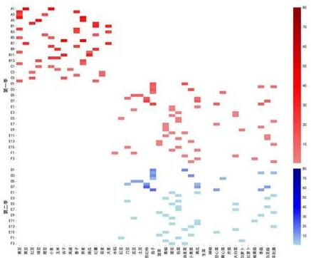

<details>
<summary>heatmap</summary>

| | 第一步 | 第二步 |
|---|---|---|
| 红色 | 45 | 42 |
| 黑色 | 46 | 43 |
| 红色 | 47 | 44 |
| 黑色 | 48 | 45 |
| 红色 | 49 | 46 |
| 黑色 | 50 | 47 |
| 红色 | 51 | 48 |
| 黑色 | 52 | 49 |
| 红色 | 53 | 50 |
| 黑色 | 54 | 51 |
| 红色 | 55 | 52 |
| 黑色 | 56 | 53 |
| 红色 | 57 | 54 |
| 黑色 | 58 | 55 |
| 红色 | 59 | 56 |
| 黑色 | 60 | 57 |
| 红色 | 61 | 58 |
| 黑色 | 62 | 59 |
| 红色 | 63 | 60 |
| 黑色 | 64 | 61 |
| 红色 | 65 | 62 |
| 黑色 | 66 | 63 |
| 红色 | 67 | 64 |
| 黑色 | 68 | 65 |
| 红色 | 69 | 66 |
| 黑色 | 70 | 67 |
| 红色 | 71 | 68 |
| 黑色 | 72 | 69 |
| 红色 | 73 | 70 |
| 黑色 | 74 | 71 |
| 红色 | 75 | 72 |
| 黑色 | 76 | 73 |
| 红色 | 77 | 74 |
| 黑色 | 78 | 75 |
| 红色 | 79 | 76 |
| 黑色 | 80 | 77 |
| 红色 | 81 | 78 |
| 黑色 | 82 | 79 |
| 红色 | 83 | 80 |
| 黑色 | 84 | 81 |
| 红色 | 85 | 82 |
| 黑色 | 86 | 83 |
| 红色 | 87 | 84 |
| 黑色 | 88 | 85 |
| 红色 | 89 | 86 |
| 黑色 | 90 | 87 |
| 红色 | 91 | 88 |
| 黑色 | 92 | 89 |
| 红色 | 93 | 90 |
| 黑色 | 94 | 91 |
| 红色 | 95 | 92 |
| 黑色 | 96 | 93 |
| 红色 | 97 | 94 |
| 黑色 | 98 | 95 |
| 红色 | 99 | 96 |
| 黑色 | 100 | 97 |
| 红色 | 101 | 98 |
| 黑色 | 102 | 99 |
| 红色 | 103 | 100 |
The chart displays a heatmap of values across the first and last time points for each category. The color intensity is based on the value scale from -10 to +80, with darker red indicating higher values and lighter blue indicating lower values. The x-axis labels are '第一步' (First Step) and '第二步' (Second Step), while the y-axis labels are '第一步' (First Step) and '第二步' (Second Step). The legend indicates that the color corresponds to the value in each cell. The color intensity varies by color, with darker red indicating higher values and lighter blue indicating lower values. The chart is saved as a PNG file named 'image_footnote.png'.
</details>

图 27 2025 年考虑不确定性因素的最优种植方案

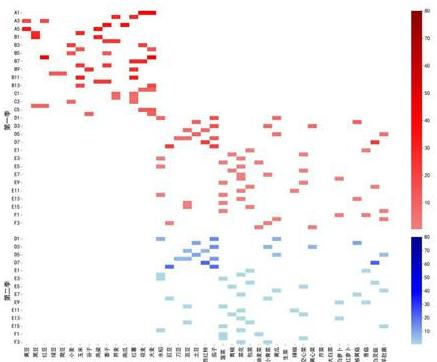  
图 28 2026 年考虑不确定性因素的最优种植方案

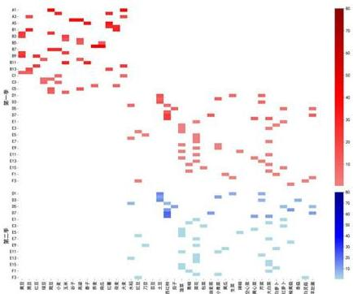

<details>
<summary>heatmap</summary>

| | 第一季 | 第二季 |
|---|---|---|
| 1 | 43 | 58 |
| 2 | 44 | 57 |
| 3 | 45 | 56 |
| 4 | 46 | 55 |
| 5 | 47 | 54 |
| 6 | 48 | 53 |
| 7 | 49 | 52 |
| 8 | 50 | 51 |
| 9 | 51 | 50 |
| 10 | 52 | 49 |
| 11 | 53 | 48 |
| 12 | 54 | 47 |
| 13 | 55 | 46 |
| 14 | 56 | 45 |
| 15 | 57 | 44 |
| 16 | 58 | 43 |
| 17 | 59 | 42 |
| 18 | 60 | 41 |
| 19 | 61 | 40 |
| 20 | 62 | 39 |
| 21 | 63 | 38 |
| 22 | 64 | 37 |
| 23 | 65 | 36 |
| 24 | 66 | 35 |
| 25 | 67 | 34 |
| 26 | 68 | 33 |
| 27 | 69 | 32 |
| 28 | 70 | 31 |
| 29 | 71 | 30 |
| 30 | 72 | 29 |
| 31 | 73 | 28 |
| 32 | 74 | 27 |
| 33 | 75 | 26 |
| 34 | 76 | 25 |
| 35 | 77 | 24 |
| 36 | 78 | 23 |
| 37 | 79 | 22 |
| 38 | 80 | 21 |
| 39 | 81 | 20 |
| 40 | 82 | 19 |
| 41 | 83 | 18 |
| 42 | 84 | 17 |
| 43 | 85 | 16 |
| 44 | 86 | 15 |
| 45 | 87 | 14 |
| 46 | 88 | 13 |
| 47 | 89 | 12 |
| 48 | 90 | 11 |
| 49 | 91 | 10 |
| 50 | 92 | 9 |
| 51 | 93 | 8 |
| 52 | 94 | 7 |
| 53 | 95 | 6 |
| 54 | 96 | 5 |
| 55 | 97 | 4 |
| 56 | 98 | 3 |
| 57 | 99 | 2 |
| 58 | 100 | 1 |
| N/A (右下角) (右上角) (右下角) (右上角) (右下角) (右上角) (右下角) (右上角) (右下角) (右上角) (右下角) (右上角) (右下角) (右上角) (右下角) (右上角) (右下角) (右上角) (右下角) (右上角) (右下角) (右上角)
</details>

图 29 2027 年考虑不确定性因素的最优种植方案

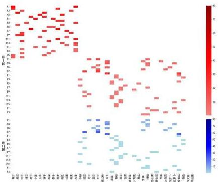  
图 30 2028 年考虑不确定性因素的最优种植方案

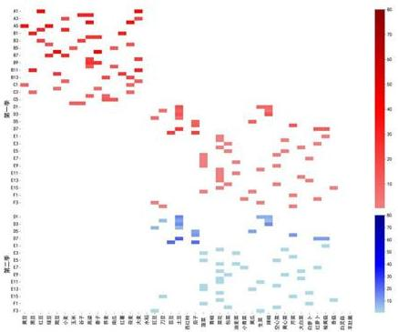

<details>
<summary>heatmap</summary>

| | 真点 | 线段 | 数值 |
|---|---|---|---|
| A1 | 福建 | 上部 | 80 |
| A2 | 福建 | 下部 | 75 |
| A3 | 福建 | 上部 | 70 |
| A4 | 福建 | 下部 | 65 |
| A5 | 福建 | 上部 | 60 |
| A6 | 福建 | 下部 | 55 |
| A7 | 福建 | 上部 | 50 |
| A8 | 福建 | 下部 | 45 |
| A9 | 福建 | 上部 | 40 |
| A10 | 福建 | 下部 | 35 |
| A11 | 福建 | 上部 | 30 |
| A12 | 福建 | 下部 | 25 |
| A13 | 福建 | 上部 | 20 |
| A14 | 福建 | 下部 | 15 |
| A15 | 福建 | 上部 | 10 |
| A16 | 福建 | 下部 | 5 |
| A17 | 福建 | 上部 | 0 |
| A18 | 福建 | 下部 | 5 |
| A19 | 福建 | 上部 | 10 |
| A20 | 福建 | 下部 | 15 |
| A21 | 福建 | 上部 | 20 |
| A22 | 福建 | 下部 | 25 |
| A23 | 福建 | 上部 | 30 |
| A24 | 福建 | 下部 | 35 |
| A25 | 福建 | 上部 | 40 |
| A26 | 福建 | 下部 | 45 |
| A27 | 福建 | 上部 | 50 |
| A28 | 福建 | 下部 | 55 |
| A29 | 福建 | 上部 | 60 |
| A30 | 福建 | 下部 | 65 |
| A31 | 福建 | 上部 | 70 |
| A32 | 福建 | 下部 | 75 |
| A33 | 福建 | 上部 | 80 |
| A34 | 福建 | 下部 | 75 |
| A35 | 福建 | 上部 | 70 |
| A36 | 福建 | 下部 | 65 |
| A37 | 福建 | 上部 | 60 |
| A38 | 福建 | 下部 | 55 |
| A39 | 福建 | 上部 | 50 |
| A40 | 福建 | 下部 | 45 |
| A41 | 福建 | 上部 | 40 |
| A42 | 福建 | 下部 | 35 |
| A43 | 福建 | 上部 | 30 |
| A44 | 福建 | 下部 | 25 |
| A45 | 福建 | 上部 | 20 |
| A46 | 福建 | 下部 | 15 |
| A47 | 福建 | 上部 | 10 |
| A48 | 福建 | 下部 | 5 |
| A49 | 福建 | 上部 | 0 |
| A50 | 福建 | 下部 | 5 |
| A51 | 福建 | 上部 | 10 |
| A52 | 福建 | 下部 | 15 |
| A53 | 福建 | 上部 | 20 |
| A54 | 福建 | 下部 | 25 |
| A55 | 福建 | 上部 | 30 |
| A56 | 福建 | 下部 | 35 |
| A57 | 福建 | 上部 | 40 |
| A58 | 福建 | 下部 | 45 |
| A59 | 福建 | 上部 | 50 |
| A60 | 福建 | 下部 | 55 |
| A61 | 福建 | 上部 | 60 |
| A62 | 福建 | 下部 | 65 |
| A63 | 福建 | 上部 | 70 |
| A64 | 福建 | 下部 | 75 |
| A65 | 福建 | 上部 | 80 |
| A66 | 福建 | 下部 | 75 |
| A67 | 福建 | 上部 | 70 |
| A68 | 福建 | 下部 | 65 |
| A69 | 福建 | 上部 | 60 |
| A70 | 福建 | 下部 | 55 |
| A71 | 福建 | 上部 | 50 |
| A72 | 福建 | 下部 | 45 |
| A73 | 福建 | 上部 | 40 |
| A74 | 福建 | 下部 | 35 |
| A75 | 福建 | 上部 | 30 |
| A76 | 福建 | 下部 | 25 |
| A77 | 福建 | 上部 | 20 |
| A78 | 福建 | 下部 | 15 |
| A79 | 福建 | 上部 | 10 |
| A80+<fcel>-<fcel>-<fcel>-<nl>
</details>

图 31 2029 年考虑不确定性因素的最优种植方案

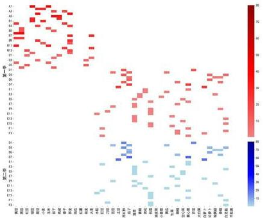

<details>
<summary>heatmap</summary>

| | 第一季 | 第二季 |
|---|---|---|
| 1 | 40 | 35 |
| 2 | 45 | 30 |
| 3 | 50 | 25 |
| 4 | 55 | 20 |
| 5 | 60 | 15 |
| 6 | 65 | 10 |
| 7 | 70 | 5 |
| 8 | 75 | 0 |
| 9 | 80 | -5 |
| 10 | 85 | -10 |
| 11 | 90 | -15 |
| 12 | 95 | -20 |
| 13 | 100 | -25 |
| 14 | 105 | -30 |
| 15 | 110 | -35 |
| 16 | 115 | -40 |
| 17 | 120 | -45 |
| 18 | 125 | -50 |
| 19 | 130 | -55 |
| 20 | 135 | -60 |
| 21 | 140 | -65 |
| 22 | 145 | -70 |
| 23 | 150 | -75 |
| 24 | 155 | -80 |
| 25 | 160 | -85 |
| 26 | 165 | -90 |
| 27 | 170 | -95 |
| 28 | 175 | -100 |
| 29 | 180 | -105 |
| 30 | 185 | -110 |
| 31 | 190 | -115 |
| 32 | 195 | -120 |
| 33 | 200 | -125 |
| 34 | 205 | -130 |
| 35 | 210 | -135 |
| 36 | 215 | -140 |
| 37 | 220 | -145 |
| 38 | 225 | -150 |
| 39 | 230 | -155 |
| 40 | 235 | -160 |
| 41 | 240 | -165 |
| 42 | 245 | -170 |
| 43 | 250 | -175 |
| 44 | 255 | -180 |
| 45 | 260 | -185 |
| 46 | 265 | -190 |
| 47 | 270 | -195 |
| 48 | 275 | -200 |
| 49 | 280 | -205 |
| 50 | 285 | -210 |
| 51 | 290 | -215 |
| 52 | 295 | -220 |
| 53 | 300 | -225 |
| 54 | 305 | -230 |
| 55 | 310 | -235 |
| 56 | 315 | -240 |
| 57 | 320 | -245 |
| 58 | 325 | -250 |
| 59 | 330 | -255 |
| 60 | 335 | -260 |
| 61 | 340 | -265 |
| 62 | 345 | -270 |
| 63 | 350 | -275 |
| 64 | 355 | -280 |
| 65 | 360 | -285 |
| 66 | 365 | -290 |
| 67 | 370 | -295 |
| 68 | 375 | -300 |
| 69 | 380 | -305 |
| 70 | 385 | -310 |
| 71 | 390 | -315 |
| 72 | 395 | -320 |
| 73 | 400 | -325 |
| ... (additional values estimated) are not explicitly labeled in the image. The color scale ranges from blue (low) to red (high). The chart is a heatmap with a color bar indicating the value for each month. Values are estimated based on the data provided in the code.
</details>

图 32 2030 年考虑不确定性因素的最优种植方案

附录 3 DEGA 算法的程序  
```python
import numpy as np
import random
import pandas as pd 
```

# 读取数据  
```txt
land_data = pd.read_excel(r"D:\桌面\附件1(1).xlsx")  # 地块信息
crop_data = pd.read_excel(r"D:\桌面\附件2(1).xlsx")  # 作物产量/成本/价格
demand_data = pd.read_excel(r"D:\桌面\农作物每季需求量_带作物编号(1).xlsx")
# 需求量 
```

# 去除空格并确保唯一  
```python
land_types = land_data['地块名称'].str.strip().unique().tolist()
crop_data['组合编号'] = crop_data['作物编号'].astype(str) + '-' + crop_data['地块类型']
crop_types = crop_data['组合编号'].unique().tolist()
years = range(2024, 2031)
seasons = range(1, 3) 
```

# 参数设置  
```txt
POPULATION_SIZE = 100 # 种群规模
NUM_GENERATIONS = 500 # 迭代次数
MUTATION_FACTOR = 0.8 # 变异因子
CROSSOVER_RATE = 0.8 # 交叉率
EARLY_STOPPING_THRESHOLD = 0.01 # 停止阈值 
```

# 初始化种群  
```python
def initialize_population():
    population = []
    for _ in range(POPULATION_SIZE):
    individual = {
    'x': np.zeros((len(land_types), len(crop_types), len(seasons), len(years))),    'z': np.random.randint(0, 2, (len(land_types), len(crop_types), len(seasons), len(years)))
    } 
```

```python
# 初始化解，面积只能是 50% 或 100%
for i, land in enumerate(land_types):
    land_area = land_data.loc[land_data['地块名称'] == land, '地块面积'].values[0]
    for k in range(len(crop_types)):
    for j in range(len(seasons)):
    for t in range(len(years)): 
```

\# 随机选择 50% 或 100% 的面积
individual['x'][i, k, j, t] = random.choice([0.5, 1.0])

\* land\_area

population.append(individual)

return population

\# 适应度函数：基于目标函数计算每个个体的适应度

def calculate\_fitness(individual):

fitness = 0

penalty = 0

for i, land in enumerate(land\_types):

for k, crop in enumerate(crop\_types):

for j in seasons:

for t in years:

area = individual['x'][i, k, j - 1, t - 2024]

z\_val = individual['z'][i, k, j - 1, t - 2024]

crop\_info = crop\_data[crop\_data['组合编号'] == crop]

if not crop\_info.empty:

price = crop\_info['销售单价'].values[0]

cost = crop\_info['种植成本'].values[0]

yield\_per\_acre = crop\_info['亩产量/斤'].values[0]

demand = demand\_data[demand\_data['作物编号'] == int(crop.split('\_')[0])]['需求量'].values[0]

profit = min(yield\_per\_acre \* area, demand) \* price

\- cost \* area

fitness += profit

\# 约束条件 1: 地块总面积限制

if np.sum(individual['x'][i, :, j - 1, t - 2024]) >

land\_data.loc[land\_data['地块名称'] == land,

"地块面积"].values[0]:

penalty += 1000 # 违反面积限制的罚则

\# 约束条件 2: 单块地种植面积下限

if area <= 0.5 \* land\_data.loc[land\_data['地块名称']

= land, "地块面积"].values[0] and z\_val = 1:

penalty += 500 # 种植面积不足的罚则

\# 约束条件 3: 作物种植与二元变量关联

if area > land\_data.loc[land\_data['地块名称'] == lan

d, "地块面积"].values[0] \* z\_val:

penalty += 1000 # 违反种植与二元变量关联

return fitness - penalty

# 差分进化变异操作  
```python
def differential_mutation(population):
    new_population = []
    for i, target in enumerate(population):
    indices = list(range(len(population)))
    indices.remove(i)
    r1, r2, r3 = random.sample(indices, 3)
    donor = {'x': np.copy(population[r1]['x'], 'z': np.copy(population[r1]['z'])}
    donor['x'] = population[r1]['x'] + MUTATION_FACTOR * (population[r2]['x'] - population[r3]['x']) 
```

\# 确保生成的解在合理范围内，面积只能是 50% 或 100%

```python
for i in range(len(land_types)):
    land_area = land_data.loc[land_data['地块名称'] == land_types[i], '地块面积'].values[0]
    donor['x'][i] = np.clip(donor['x'][i], 0.5 * land_area, 1.0 * land_area) 
```

new\_population.append(donor)

return new\_population

# 交叉操作  
```python
def crossover(target, donor):
    trial = {'x': np.copy(target['x'], 'z': np.copy(target['z'])}
    for i in range(len(land_types)):
    if random.random() > CROSSOVER_RATE:
    trial['x'][i] = donor['x'][i]  # 交叉替换
    return trial 
```

# 选择操作：选择适应度较好的个体  
```python
def selection(target, trial):
    target_fitness = calculate_fitness(target)
    trial_fitness = calculate_fitness(trial)
    return trial if trial_fitness > target_fitness else target 
```

# 主算法流程  
```python
def differential_evolution():
    population = initialize_population()
    best_fitness_history = []

    for generation in range(NUM_GENERATIONS):
    new_population = []
    for i in range(POPULATION_SIZE):
    donor = differential_mutation(population)[i]  # 生成变异个体
    trial = crossover(population[i], donor)  # 交叉生成新的个体
    selected_individual = selection(population[i], trial)  # 选择最优
    new_population.append(selected_individual)

    # 替换种群
    population = new_population

    # 计算每一代的最优适应度
    fitness_values = [calculate_fitness(ind) for ind in population]
    best_fitness = max(fitness_values)
    best_fitness_history.append(best_fitness)

    # 早期停止机制
    if generation > 0 and abs(best_fitness_history[-1] - best_fitness_history[-2]) < EARLY_STOPPING_THRESHOLD:
    print("Early stopping at generation {generation},")
    break

    print("Generation {generation}: Best Fitness = {best_fitness}")

return max(population, key=calculate_fitness) 
```

# 运行算法  
```python
best_solution = differential_evolution()
# 输出最优结果
output_data = []
for i, land in enumerate(land_types):
    for k, crop in enumerate(crop_types):
    for j in seasons:
    for t in years:
    area = best_solution['x'][i, k, j - 1, t - 2024]
    if area > 0:
    output_data.append([land, crop, j, t, area]) 
```

\# 保存结果到Excel

print(output\_data)

附录 4 引入 CVaR 的 DEGA 算法的主体程序  
```python
# 适应度函数：加入CVaR惩罚项
def calculate_fitness_with_cvar(individual, alpha=0.95):
    fitness = 0
    penalty = 0
    losses = []
    for i, land in enumerate(land_types):
    for k, crop in enumerate(crop_types):
    for j in seasons:
    for t in years:
    area = individual['x'][i, k, j - 1, t - 2024]
    z_val = individual['z'][i, k, j - 1, t - 2024]

    crop_info = crop_data[crop_data['组合编号'] == crop]
    if not crop_info.empty:
    # 价格和成本的波动
    base_price = crop_info['销售单价'].values[0]
    base_cost = crop_info['种植成本'].values[0]
    base_yield_per_acre = crop_info['亩产量/斤'].values

[0]

    # 不同农作物的价格趋势
    if '粮食' in crop:  # 粮食类作物价格稳定
    price = base_price
    elif '蔬菜' in crop:  # 蔬菜类作物每年价格上涨5%
    price = base_price * (1.05 ** (t - 2023))
    elif '食用菌' in crop:  # 食用菌价格每年下降1%-5%
    price_decline = random.uniform(0.01, 0.05)
    price = base_price * (1 - price_decline) ** (t - 2023)

    else:
    price = base_price

    # 考虑种植成本的年增长率为5%
    cost = base_cost * (1.05 ** (t - 2023))

    # 考虑产量的波动范围为±10%
    yield_per_acre = base_yield_per_acre * (1 + rando 
```

m.uniform(-0.1, 0.1))   
```txt
# 需求量的变化范围为±5%
demand = demand_data[demand_data['作物编号'] == int(crop.split('_')[0])['需求量'].values[0]
    demand = demand * (1 + random.uniform(-0.05, 0.05)) 
```

```python
- cost * area
# 计算收益
profit = min(yield_per_acre * area, demand) * price
fitness += profit 
```

# 记录损失（负收益）  
```python
if profit < 0:
    losses.append(abs(profit)) 
```

```python
约束条件 1：地块总面积限制
if np.sum(individual['x'][i, :, j - 1, t - 2024]) > \
    land_data.loc[land_data['地块名称'] == land,
```  
"地块面积"].values[0]:

```txt
penalty += 1000 # 违反面积限制的罚则 
```

```python
# 约束条件 2: 单块地种植面积下限
if area <= 0.5 * land_data.loc[land_data['地块名称']
== land, "地块面积"].values[0] and z_val = 1:
penalty += 500 # 种植面积不足的罚则 
```

```python
# 约束条件 3：作物种植与二元变量关联
if area > land_data.loc[land_data['地块名称'] == land, "地块面积"].values[0] * z_val: 
```

```txt
penalty += 1000 # 违反种植与二元变量关联 
```

# CVaR 惩罚项计算  
```python
if losses:
    sorted_losses = sorted(losses)
    index = int(np.ceil((1 - alpha) * len(sorted_losses)))
    cvar = np.mean(sorted_losses[:index])  # 计算CVaR
    penalty += cvar  # 将CVaR作为惩罚项 
```

```txt
return fitness - penalty 
```

附录 5 引入相关因素的 DEGA 的主体程序  
```python
# 创建作物相关性矩阵
def create_correlation_matrix():
    # 根据作物的替代性和互补性手动定义相关性矩阵
    # 这里以作物数量为 len(crop_types) 的方阵为例
    correlation_matrix = np.identity(len(crop_types))  # 初始化为单位矩阵，表示自相关性为 1

    # 手动设置作物之间的相关性（可替代性/互补性），例如：
    # correlation_matrix[i, j] = 0.5 表示作物 i 和作物 j 有 0.5 的相关性
    # 作物编号 i 和 j 之间的相关性
    for i in range(len(crop_types)):
    for j in range(i + 1, len(crop_types)):
    # 根据农作物的替代性/互补性设置相关性，例如蔬菜类可能具有较高的可替代性
    if '蔬菜' in crop_types[i] and '蔬菜' in crop_types[j]:
    correlation_matrix[i, j] = 0.7  # 蔬菜类作物较高的可替代性
    correlation_matrix[j, i] = 0.7  # 对称矩阵
    elif '粮食' in crop_types[i] and '粮食' in crop_types[j]:
    correlation_matrix[i, j] = 0.5  # 粮食类作物中等替代性
    correlation_matrix[j, i] = 0.5
    else:
    correlation_matrix[i, j] = 0.2  # 其他作物的低相关性
    correlation_matrix[j, i] = 0.2

return correlation_matrix

# 适应度函数：加入CVaR和相关性分析
def calculate_fitness_with_cvar_and_correlation(individual, correlation_matrix, alpha=0.95):
    fitness = 0
    penalty = 0
    losses = []
    for i, land in enumerate(land_types):
    for k, crop in enumerate(crop_types):
    for j in seasons:
    for t in years:
    area = individual['x'][i, k, j - 1, t - 2024]
    z_val = individual['z'][i, k, j - 1, t - 2024]

    crop_info = crop_data[crop_data['组合编号'] == crop]
    if not crop_info.empty:
    # 价格和成本的波动
    base_price = crop_info['销售单价'].values[0] 
```

```python
base_cost = crop_info['种植成本'].values[0]  
base_yield_per_acre = crop_info['亩产量/斤'].values[0] 
```

```python
# 销售价格、种植成本和亩产量的相关性影响
price_correlation_factor = 1 + correlation_matrix[k].
mean() # 相关性对价格的影响
cost_correlation_factor = 1 + correlation_matrix[k].
mean() # 相关性对种植成本的影响 
```

```python
# 不同农作物的价格趋势
if '粮食' in crop: # 粮食类作物价格稳定
    price = base_price * price_correlation_factor
elif '蔬菜' in crop: # 蔬菜类作物每年价格上涨5%
    price = base_price * (1.05 ** (t - 2023)) * price_correlation_factor
elif '食用菌' in crop: # 食用菌价格每年下降1%-5%
    price_decline = random.uniform(0.01, 0.05)
    price = base_price * (1 - price_decline) ** (t - 2023) * price_correlation_factor
else:
    price = base_price * price_correlation_factor
# 考虑种植成本的年增长率为5%并且受相关性影响
cost = base_cost * (1.05 ** (t - 2023)) * cost_corr
elation_factor 
```

```python
# 考虑产量的波动范围为±10%并且受相关性影响
yield_per_acre = base_yield_per_acre * (1 + random uniform(-0.1, 0.1))

# 需求量的变化范围为±5%
demand = demand_data[demand_data['作物编号'] == int(crop.split('_')[0])]['需求量'].values[0]
demand = demand * (1 + random.uniform(-0.05, 0.05)) 
```

```txt
- cost * area
# 计算收益
profit = min(yield_per_acre * area, demand) * price
fitness += profit
# 记录损失（负收益）
```

```python
if profit < 0;
    losses.append(abs(profit))

# 约束条件 1：地块总面积限制
if np.sum(individual['x'][i, :, j - 1, t - 2024]) > \
    land_data.loc[land_data['地块名称'] == land,
"地块面积"].values[0]: 
```

```txt
penalty += 1000 # 违反面积限制的罚则 
```

```python
# 约束条件 2: 单块地种植面积下限
if area <= 0.5 * land_data.loc[land_data['地块名称'] = land, "地块面积"].values[0] and z_val = 1: 
```

```txt
penalty += 500 # 种植面积不足的罚则 
```

```python
# 约束条件 3：作物种植与二元变量关联
if area > land_data.loc[land_data['地块名称'] == land, "地块面积"].values[0] * z_val: 
```

```txt
penalty += 1000 # 违反种植与二元变量关联 
```

\# CVaR 惩罚项计算

```python
if losses:
    sorted_losses = sorted(losses)
    index = int(np.ceil((1 - alpha) * len(sorted_losses)))
    cvar = np.mean(sorted_losses[:index])  # 计算CVaR
    penalty += cvar  # 将CVaR作为惩罚项 
```

```txt
return fitness - penalty 
```

\# 主算法流程

```python
def differential_evolution():
    population = initialize_population()
    best_fitness_history = []
    correlation_matrix = create_correlation_matrix()  # 创建相关性矩阵
    for generation in range(NUM_GENERATIONS):
    new_population = []
    for i in range(POPULATION_SIZE):
    donor = differential_mutation(population)[i]  # 生成变异个体
    trial = crossover(population[i], donor)  # 交叉生成新的个体
    selected_individual = selection(population[i], trial)  # 选择最优
    new_population.append(selected_individual) 
```

\# 替换种群

```txt
population = new_population 
```

```python
# 计算每一代的最优适应度
fitness_values = [calculate_fitness_with_cvar_and_correlation(ind, correlation_matrix) for ind in population]
best_fitness = max(fitness_values)
best_fitness_history.append(best_fitness)

# 早期停止机制
if generation > 0 and abs(best_fitness_history[-1] - best_fitness_history[-2]) < EARLY_STOPPING_THRESHOLD:
    print("Early stopping at generation {generation}.")
    break

print("Generation {generation}: Best Fitness = {best_fitness}") 
```

return max(population, key=lambda ind: calculate\_fitness\_with\_cvar\_and\_correlation(ind, correlation\_matrix))

# 2026年全国大学生国家安全知识答题


Illustration of two cartoon children holding a shield with the number 4:15 (no text or symbols on subjects)