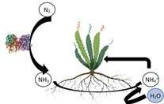
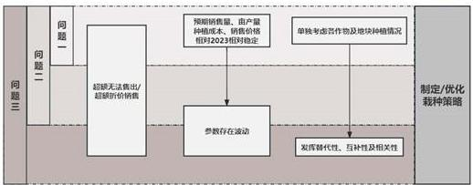
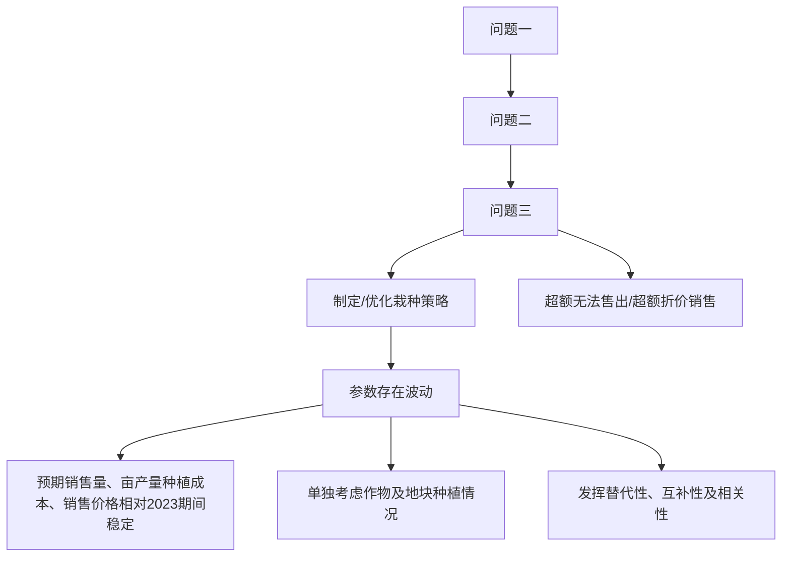
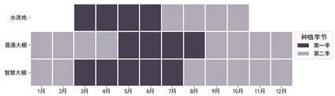
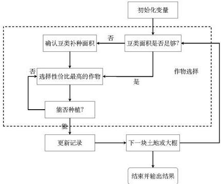
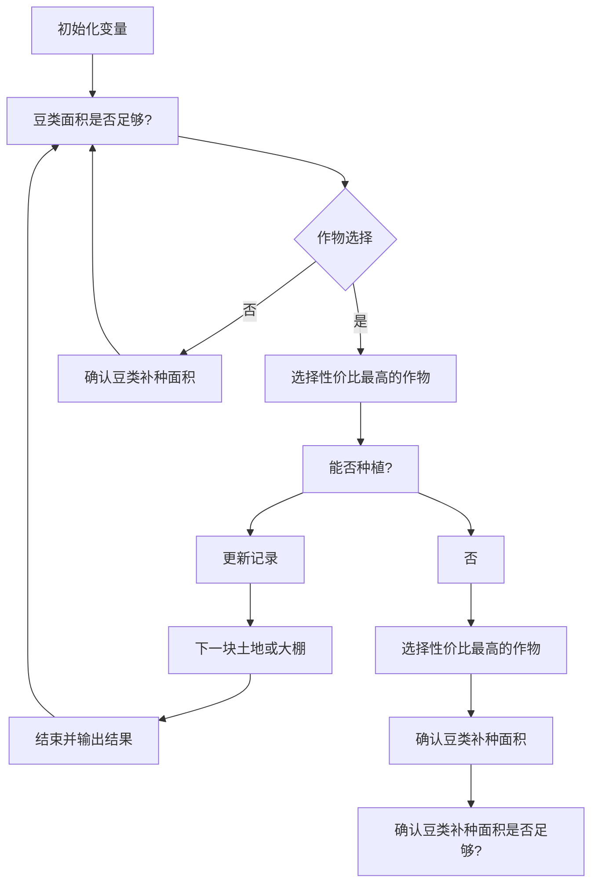
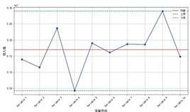
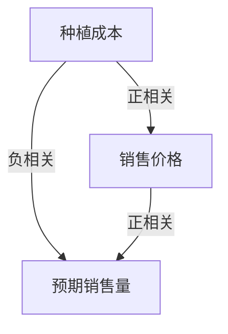
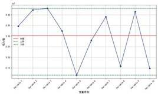

# 基于随机优化的农作物种植策略模型

摘要

本文研究最大化利用土地资源，建立栽种策略优化模型，利用贪心算法、随机扰动、蒙特卡洛、灵敏度检验等方法求解科学土地管理、超额出售、多因素时间波动，农作物替代性、互补性以及相关性等问题。

针对问题一，定义第 $t$ 年的第 $i$ 季度时，在第 $j$ 块地种植第 $k$ 种作物种植面积为决策变量，构建了以种植经济效益最大化为目标函数，可耕种地域面积、实际可售量、连作方式、地块及作物栽种等限制为约束的种植策略线性规划模型。为科学管理土地，满足种植地不宜太分散的目标，传入参数 $p, q$ ，分别约束每块土地最多种作物数量，每种作物最多可种地块数量。综合考虑 $p, q$ 尽可能小与收益尽可能大。对题目给出的数据进行预处理，统一数据格式便于读取，并统计数据生成成本与产量的三维数据表。最终，使用求解器求解得：超出部分滞销结果为40244799.20元，超出部分折价结果为56325297.78元；使用贪心策略求解得：超出部分滞销结果为36848378.08元，超出部分折价结果为46724871.84元。这两种求解方法各有优缺点，求解器求解结果更优，但求解慢，而贪心算法则相反，根据具体需求选择方法，两种销售情况会导致结果产生较大差异，原因归结于收益大的作物在降价后仍可保持高收益，会被高频率大面积种植。

针对问题二，考虑作物亩产量、预计销量和销售价格的波动因素，为增强风险应对能力，以最大化种植经济效益期望为目标函数，设定决策变量为波动场景下的可行策略对应的种植经济效益，增加其余参数的时间维度，在延续上一间的约束条件基础上，构建了随机规划模型。对于超过部分滞销情况，使用蒙特卡洛算法生成100组符合正态分布的随机参数序列，使用求解器在随机序列下求出100组种植策略。将分布函数离散化，可得到每组随机序列对应的概率，接着对每种规划策略进行扰动。最终得到100组随机扰动策略下，种植经济效益均值最高的种植规划策略，其中，抗波动性最强方案的种植经济效益均值为：51667432.02。

针对问题三，基于问题二模型，目标函数与决策变量保持不变，分析作物相关性以及销量-价格-成本相关性对变量的影响。对相关性强且作物类型相同的作物进行替代，比较目标函数对其替换程序的灵敏度检测其替代性，最终选择用小麦替代谷子，青椒替代辣椒，对互补性强的植物进行软约束，使其尽可能协同耕种，提升效率，如豆类轮作可提升总体产量，接着，根据销量-价格-成本关系，根据销量推算合理的成本与价格。综合考虑上述因素后，在模拟数据下求解最优种植方案的种植经济效益均值为：53028389.86，相较于第二问结果更优，符合优化的目标。

关键词: 贪心策略 求解器 蒙特卡洛算法 随机规划

# 一 问题重述

# 1.1 问题背景

农业是乡村地区的核心支柱，尤其在偏远地区，种植业为当地居民提供主要收入来源。切合实际，积极善用当下仅限资源，因势利导，兴盛种植产业是实施乡村振兴战略的重要抓手。合理规划适宜农作物，可规避气候、病虫害等多种不确定性因素，优化水、肥与土地等资源利用，降低土壤侵蚀，灵活应对市场需求，提升经济产出。

为制定科学栽种管理策略，应遵循如下原则：

1. 由于同种作物在同一地上连续多次种植时，易导致相关病原菌与害虫在土壤中积累，破坏土壤物理结构，无法有效支持作物正常生长，因此各类作物在同一地块或大棚内应避免重茬种植。  
2. 为方便土地管理，应避免各类作物过于分散，在单个地块或大棚内占地面积过小等。  
3. 由于豆类作物的根部可与根瘤菌共生，而根瘤菌能够将空气中的氮转化为植物可以直接吸收利用的氮化合物，因此通过豆类作物与非豆类作物合理轮作，可有效减少病虫害积累，增强土壤健康性。



<details>
<summary>chemical</summary>

Chemical reaction diagram showing nitrogen and ammonia transfer in a plant, with water as reagent
</details>

图1固氮原理

# 1.2 问题提出

位于华北地区的某山区乡村，气候较为寒冷，多数农田年均仅可栽种一季作物。该乡村现有户外1201亩耕地，划分为34个面积不等的地块，涵盖梯田、平旱地、水浇地与山坡地四类类型。此外，该乡村拥有16个普通大棚与4个智慧大棚，各大棚均占地0.6亩。不同地块或大棚栽种方式要求不同，详见附件1。基于豆类作物根菌的有益作用，自2023年起，各种地块或大棚三年内必须种植豆类作物至少一次。结合附件1中2023年历史具体数据，解决如下问题：

问题一：假设各类农作物后续预期销量、售价、种植成本和亩产量相较于2023年保持稳定，且当季种植当季销售，不存在存放过季的情况。若所有作物超过预期销量部分的产量，无法正常售卖，分为两种情况：(1)周转极慢，销量为0；(2)依据2023年售价的 $50\%$ 减价出售。

分析在两种情景下的最优种植策略，并填写附件 result1\_1.xlsx 与 result1\_2.xlsx。

问题二：结合过往实践经验，宏观形势持续向好将带动口粮消费有所提升，玉米与小麦的未来销量存在增长趋向，平均年增长率居于5%与10%间，其余作物销量波动在±5%之间。单亩农作物产量受气候影响存在±10%的波动。市场条件影响下，作物种植成本预计年均增长率大约为5%。粮食类农作物单价大致保持平稳；蔬菜类趋向于增长，大约年均增长5%；可食用大型真面售价趋势稳定，每年稍有下降1%-5%，其中，羊肚菌降幅尤为突出，达到5%。全面考虑上述各因素的不确定性及暗含种植风险，求解2024-2030年该村最优种植策略，并填写附件3。

问题三：由于真实情况下，各类农作物间存在相当程度的可替代关系与互补关系，其预期销量、售价与种植成本间具有一定关联性。基于问题二，统筹考虑多要素，制定2024-2030年最优种植方案。利用模拟数据求解后，与问题二结果进行对比分析。

# 二 问题分析

# 2.1 问题一的分析

问题一中，假定后续每一年的策略规划中，其预期销售量、种植成本、亩产量都与2023年相同。基于此分别考虑超过部分滞销和按照 $50\%$ 折价出售的种植策略情况，可以构建线性规划模型，对连种约束和豆类种植等约束进行限制后，使用求解器进行求解或构建贪心策略，依次遍历每块土地，选取对当前土地性价比最高的作物优先进行种植。同时考虑豆类种植约束，要求任何连续三年内豆类作物种植面积大于当前土地面积，则可以保证三年内每亩地都种过一次豆类作物。

# 2.2 问题二的分析

问题二中，在问题一构建的优化模型基础上，增加了作物预期销售量、种植成本、销售价格的变化条件。为输出最优的种植方案，需要在各种不确定因素和种植风险中选择一个能够在不同的预期销售量、种植成本、销售价格的变化条件中相对都有较好表现的种植策略。求解过程可以考虑使用蒙特卡洛算法生成多个随机序列，模拟不同的现实情况。

# 2.3 问题三的分析

问题三中，基于问题二构建的增加变量扰动的优化模型，进一步考虑农作物之间的可替代性和互补性，并综合考虑预期销售量与销售价格、种植成本之间的相关性，从而使构建的种植策略优化模型更加接近现实情况。首先，可依据农作物对总收入的灵敏度进行分析替代，从而减少农作物种类，优化种植结构。同时，对预期销售量与销售价格、种植成本进行相关性约束，从而构建增加了变量扰动和作物关联因素的种植优化模型。





图2问题分析

# 三 模型假设

1. 假设当季种植的农作物在当季销售，无库存。  
2. 假设问题一中每种农作物的未来预期销量、种植成本、亩产量和售价相较于2023年保持稳定。  
3. 假设问题二相关销量、售价等变量波动符合正态分布。  
4. 假设问题三中各种农作物预期销售量与销售价格、种植成本之间存在一定相关性。

# 四 符号说明

<table><tr><td>符号</td><td>说明</td><td>单位</td></tr><tr><td> $t$ </td><td>第  $t$  年</td><td>\\</td></tr><tr><td> $i$ </td><td>第  $i$  个季度</td><td>\\</td></tr><tr><td> $j$ </td><td>第  $j$  块地或大棚</td><td>\\</td></tr><tr><td> $k$ </td><td>第  $k$  种作物</td><td>\\</td></tr><tr><td> ${S}_{j}$ </td><td>第  $j$  块地或大棚占地面积</td><td>亩</td></tr><tr><td> ${T}_{j}$ </td><td>第  $j$  块地或大棚的地块或大棚类型</td><td>\\</td></tr><tr><td> ${I}_{s}$ </td><td>第  $k$  种作物是否归属大豆类作物</td><td>\\</td></tr><tr><td>Request  ${}_{ik}$ </td><td>第  $i$  季度第  $k$  种作物的预期需量</td><td>斤</td></tr><tr><td>Produce  ${}_{ijk}$ </td><td>第  $i$  季度第  $j$  块地上种植第  $k$  种作物的亩产量</td><td>亩</td></tr><tr><td>Cost  ${}_{ijk}$ </td><td>第  $i$  季度第  $j$  块地块种植第  $k$  种作物的种植成本</td><td>元/亩</td></tr><tr><td>Price  ${}_{ik}$ </td><td>第  $i$  季度第  $k$  种作物的平均销售价格</td><td>元/斤</td></tr><tr><td> ${X}_{ijk}$ </td><td>第  $t$  年的第  $i$  季度,第  $j$  个地块或大棚上销  $k$  种作物的栽种面积</td><td>亩</td></tr><tr><td> ${Y}_{ijk}$ </td><td>第  $i$  季度是否第  $j$  块地块上种植物  $k$ </td><td>\\</td></tr></table>

# 五 模型的建立与求解

由于部分数据在数据表中带有空格后缀，影响数据读取，因此需对于单元格格式进行修改，将空格全部替换删除后，进行后续数据分析及模型建立。

根据不同地块类型包括的地块区域，进行区块划分可视化：


Circuit diagram with labeled components and connections, including resistors, capacitors, and switches

图3区域划分

查阅相关资料并结合题目已知，可知综合考虑经济效益与实际因素，各类地块或大棚可种植农作物如下：

# 1. 地块

(1) 平旱地 (A) 为无灌溉条件的平坦土地，完全依赖天然降水进行作物种植；梯田 (B) 为在山坡上开垦的阶梯状耕地，山坡地 (C) 为坡度较大的山地。该类地块适合种植耐旱、需水较少的单季粮食作物（水稻除外），以配合作物生长的自然节奏。  
(2) 水浇地 (D) 每年可以单季种植水稻或两季种植蔬菜作物。由于水稻生长周期较长，因此一年一季；蔬菜生产周期较短，一年可分为两季种植。从水稻角度考虑，该类地块可通过稳定的灌溉设施确保水稻作为典型的水生作物，在种植期间充分的水分供应。从蔬菜角度考虑，第一季水资源充足，适宜种植需水量高的蔬菜，因此不包含大白菜、白萝卜与红萝卜；第二季响应季节要求，贴合耐寒蔬菜生长需求，并简化管理，仅选择大白菜、白萝卜或红萝卜中的一类种植。

# 2. 大棚

大棚维护成本高，粮食作物经济效益低，不适宜粮食类低附加值作物。此外，棚内空间密闭，对于易遭受特定病虫害的萝卜类作物与大白菜易积累病虫害；棚内空间较为狭小，土层较浅，无法容纳萝卜类作物与大白菜发达的根系。

(1) 普通大棚 (E) 利用塑料薄膜或玻璃覆盖作物, 形成可控的小气候环境, 因此每年可种植两季作物, 第一季可种植多种蔬菜 (大白菜、白萝卜和红萝卜除外), 但由于其环境调节能力的局限性, 无法支持第二季多种蔬菜的生长条件, 仅适宜种植对湿度与温度要求较低的作物, 即食用菌。  
(2) 智慧大棚 (F) 是普通大棚的升级版本，依托多方面现代技术，实时监控并调控温度、湿度、光照等环境因素，优化作物生长条件，因此可种植两季蔬菜（大白菜、白萝卜和红萝卜除外）。

表 1 农作物种植要求

<table><tr><td>作物名称</td><td>作物类别</td><td>种植耕地</td><td>耕种时期</td><td>备注</td></tr><tr><td>黄豆、黑豆、红豆、绿豆、爬豆</td><td></td><td></td><td></td><td>豆类</td></tr><tr><td>小麦、玉米、谷子、高粱、黍子</td><td>粮食</td><td>A、B、C</td><td>单季种植</td><td></td></tr><tr><td>荞麦、南瓜、红薯、莜麦、大麦</td><td></td><td></td><td></td><td></td></tr><tr><td>水稻</td><td></td><td>D</td><td>单季种植</td><td></td></tr><tr><td>豇豆、刀豆、菜豆</td><td></td><td></td><td></td><td>豆类</td></tr><tr><td>土豆、西红柿、茄子、菠菜、青椒 菜花、包菜、油麦菜、小青菜、黄瓜 生菜、辣椒、空心菜、黄心菜、芹菜</td><td>蔬菜</td><td>D、E F</td><td>第一季 第一季、第二季</td><td></td></tr><tr><td>大白菜、白萝卜、红萝卜</td><td></td><td>D</td><td>第二季</td><td></td></tr><tr><td>榆黄菇、香菇、白灵菇、羊肚菌</td><td>食用菌</td><td>E</td><td>第二季</td><td></td></tr></table>

通常水浇地受季节性降水和灌溉影响大，因此种植季节集中灌溉资源较丰富的时间段，如夏秋季；普通大棚具有一定适应能力，种植季节时间段边长，但并不具备完全的调控能力，因此仍需避开极端天气，如酷暑；为确保作物的高产与环境的长期稳定，智慧大棚需留存一定土壤修复时间。综上，分为两季耕种的地块或大棚的两个季的时间分布可表示为：



水凉地
普通大程
智慧大程
1月 2月 3月 4月 5月 6月 7月 8月 9月 10月 11月 12月
种组季节
第一季
第二季

图4时间分布

# 5.1 模型一的建立与求解

# 5.1.1 模型一的建立

根据问题一假设，各类农作物后续预期销量、售价、种植成本和亩产量相较于2023年保持稳定，因此对2023年销售及产出情况进行分析：

分析附件 2 中 2023 年销量与售价，可知不同情形下种植得作物单价相等，即假设不同情形作物生长情况相同，市场行情等价。统计不同作物不同地块类型的不同时期下的亩产量与对应成本后，为便于后续决策，从经济利益角度出发，利用单位产量带来的净收益与每单位成本支出所带来收益，进行边际收入与性价比分析，并将边际收入从高至低排序展示，可得：

<table><tr><td>作物名称</td><td>地块类型</td><td>种植季次</td><td>亩产量</td><td>亩成本</td><td>销售单价</td><td>单位成本</td><td>边际收入</td><td>性价比</td></tr><tr><td>榆黄菇</td><td>普通大棚</td><td>第二季</td><td>5000</td><td>3000</td><td>57.5</td><td>0.60</td><td>95.8300</td><td>56.90</td></tr><tr><td>香菇</td><td>普通大棚</td><td>第二季</td><td>4000</td><td>2000</td><td>19</td><td>0.50</td><td>38.0000</td><td>18.50</td></tr><tr><td>黄瓜</td><td>普通大棚</td><td>第一季</td><td>15000</td><td>3500</td><td>7</td><td>0.23</td><td>30.0000</td><td>6.77</td></tr><tr><td>黄瓜</td><td>智慧大棚</td><td>第二季</td><td>13500</td><td>3850</td><td>8.4</td><td>0.29</td><td>29.4500</td><td>8.11</td></tr><tr><td>芹菜</td><td>水浇地</td><td>第一季</td><td>5500</td><td>900</td><td>4</td><td>0.16</td><td>24.4400</td><td>3.84</td></tr><tr><td>...</td><td>...</td><td>...</td><td>...</td><td>...</td><td>...</td><td>...</td><td>...</td><td></td></tr><tr><td>红薯</td><td>梯田</td><td>单季</td><td>2100</td><td>2000</td><td>3.25</td><td>0.95</td><td>3.4125</td><td>2.30</td></tr><tr><td>黄豆</td><td>平旱地</td><td>单季</td><td>400</td><td>400</td><td>3.25</td><td>1.00</td><td>3.2500</td><td>2.25</td></tr><tr><td>红薯</td><td>山坡地</td><td>单季</td><td>2000</td><td>2000</td><td>3.25</td><td>1.00</td><td>3.2500</td><td>2.25</td></tr><tr><td>黄豆</td><td>梯田</td><td>单季</td><td>380</td><td>400</td><td>3.25</td><td>1.05</td><td>3.0875</td><td>2.20</td></tr><tr><td>黄豆</td><td>山坡地</td><td>单季</td><td>360</td><td>400</td><td>3.25</td><td>1.11</td><td>2.9250</td><td>2.14</td></tr></table>

(1)

# - 变量及参数准备

# 1. 决策变量

为制定耕种策略，需调节每一时间节点上每一空间所需耕种作物，因此可将决策变量设置为第 $t$ 年的第 $i$ 季度时，在第 $j$ 块地种植第 $k$ 种作物的种植面积，利用序数变量进行如下表示：

$$
X _ {t i j k} \tag {2}
$$

其中，t 表示年份，i 表示季度，j 表示地块编号，k 表示作物编号。

\- 利用名义变量对 $i$ 进行表示：

$$
i = \left\{ \begin{array}{l l} 0, & \text { 第一季度 } \\ 1, & \text { 第二季度 } \end{array} \right. \tag {3}
$$

对于单季种植作物，默认其归属于第一季度，后续对其所属年份的第二季度进行约束即可。

\- 利用0-1变量 $Y_{tijk}$ 表示第 $i$ 季度是否在第 $j$ 块地上种植作物 $k$

$$
Y _ {t i j k} = \left\{ \begin{array}{l l} 0, \text {   第   } i \text {   季度未在第   } j \text {   块地上种植作物   } k \\ 1, \text {   第   } i \text {   季度在第   } j \text {   块地上种植作物   } k \end{array} \right. \tag {4}
$$

利用大M法链接 $X_{tijk}$ 与 $Y_{tijk}$

$$
X _ {t i j k} \leq M \cdot Y _ {t i j k} \quad \forall t, i, j, k \tag {5}
$$

$$
X _ {t i j k} \geq 0. 0 1 \cdot Y _ {t i j k} \quad \forall t, i, j, k \tag {6}
$$

其中，M 表示大常数。

表 2 作物名称与对应编号

<table><tr><td>作物编号i</td><td>作物名称</td><td>作物编号i</td><td>作物名称</td><td>作物编号i</td><td>作物名称</td><td>作物编号i</td><td>作物名称</td></tr><tr><td>1</td><td>黄豆</td><td>12</td><td>南瓜</td><td>22</td><td>茄子</td><td>32</td><td>空心菜</td></tr><tr><td>2</td><td>黑豆</td><td>13</td><td>红薯</td><td>23</td><td>菠菜</td><td>33</td><td>黄心菜</td></tr><tr><td>3</td><td>红豆</td><td>14</td><td>莜麦</td><td>24</td><td>青椒</td><td>34</td><td>芹菜</td></tr><tr><td>4</td><td>绿豆</td><td>15</td><td>大麦</td><td>25</td><td>菜花</td><td>35</td><td>大白菜</td></tr><tr><td>5</td><td>爬豆</td><td>16</td><td>水稻</td><td>26</td><td>包菜</td><td>36</td><td>白萝卜</td></tr><tr><td>6</td><td>小麦</td><td>17</td><td>豇豆</td><td>27</td><td>油麦菜</td><td>37</td><td>红萝卜</td></tr><tr><td>7</td><td>玉米</td><td>18</td><td>刀豆</td><td>28</td><td>小青菜</td><td>38</td><td>榆黄菇</td></tr><tr><td>8</td><td>谷子</td><td>19</td><td>芸豆</td><td>29</td><td>黄瓜</td><td>39</td><td>香菇</td></tr><tr><td>9</td><td>高粱</td><td>20</td><td>土豆</td><td>30</td><td>生菜</td><td>40</td><td>白灵菇</td></tr><tr><td>10</td><td>黍子</td><td>21</td><td>西红柿</td><td>31</td><td>辣椒</td><td>41</td><td>羊肚菌</td></tr><tr><td>11</td><td>荞麦</td><td></td><td></td><td></td><td></td><td></td><td></td></tr></table>

# 2. 已知参数

\- 利用 0-1 变量 $I_k$ 表示作物 $k$ 是否为豆类作物：

$$
I _ {k} = \left\{ \begin{array}{l l} 0, k & \text {为豆类作物} \\ 1, k & \text {非豆类作物} \end{array} \right. \tag {7}
$$

- $S_{j}$ 表示第 $j$ 块地的面积;  
- Request $_{ik}$ 表示第 $i$ 季度第 $k$ 种作物的预期需量;

- Produce $_{tijk}$ 表示第 $i$ 季度第 $j$ 块地上种植第 $k$ 种作物的亩产量;  
- $Price_{ik}$ 表示第 $i$ 季度第 $k$ 种作物的平均销售价格;  
- $\mathrm{Cost}_{ijk}$ 表示第 $i$ 季度第 $j$ 块地种植第 $k$ 种作物的种植成本;  
- $Z_{tik}$ : 第 $i$ 季度第 $k$ 类作物的实际销量。  
- 利用名义变量 $T_{j}$ 表示第 $j$ 块地的地块类型

$$
T _ {j} = \left\{ \begin{array}{l l} 1, & \text {平旱地} \\ 2, & \text {梯田} \\ 3, & \text {山坡地} \\ 4, & \text {水浇地} \\ 5, & \text {普通大棚} \\ 6, & \text {智慧大棚} \end{array} \right. \tag {8}
$$

# - 目标函数

该模型目标为最大化种植收益，即售价与对应成本差值所带来的净收入，因此可将优化目标表示为：

$$
\text { Max   } Z \tag {9}
$$

# - 约束条件

# 1. 实际经济收益 Z 的定义

$$
Z = \text { 总收入 } - \text { 总成本 } \tag {10}
$$

■针对情况一

仅仅可售出预期需求量内的销量，超出部分无法获得资金回笼：

$$
Z = \sum_ {t, i, k} \left(\text { Price } _ {i k} \cdot Z _ {t i k} - \sum_ {j} \text { Cost } _ {i j k} \cdot X _ {t i j k}\right) \tag {11}
$$

■ 针对情况二

预期需量内销售作物按照正常情况进行销售，超额部分折价50%：

$$
Z = \sum_ {t, i, k} \left(\text { Price } _ {i k} \cdot Z _ {t i k} + 0. 5 \cdot \text { Price } _ {i k} \cdot Z _ {\text { excess }, t i k} - \sum_ {j} \text { Cost } _ {i j k} \cdot X _ {t i j k}\right) \tag {12}
$$

其中， $Z_{excess,tik}$ 表示超出部分产量，即超出部分销量。

# 2. 可耕种地块面积约束

根据实际情况，任意时刻的各个地块面积存在限制，实际耕种面积不可超出实际面积，因此对于所有同一时刻进行耕种的相同编号 $j$ 的地块面积所种植的所有 $k$ 类作物所占面积进行求和：

$$
\sum_ {k} X _ {t i j k} \leq S _ {j} \quad \forall t, i, j \tag {13}
$$

其中， $S_{j}$ 表示第 j 块地的实际面积。

# 3. 实际可售量限制

由于当季产出当即售卖，不进行存储，因此对于每年的各季度进行比较约束。

1) 实际销量无法超出真实产出：

$$
Z _ {t i k} \leq \sum_ {j} \text { Produce } _ {i j k} \cdot X _ {t i j k} \quad \forall t, i, k \tag {14}
$$

其中， $Produce_{tijk}$ 表示第 i 季度第 j 块地上种植第 k 种作物的亩产量。

■ 针对情况一

2) 由于存在预期销售量限制，实际销量无法超过市场需求：

$$
Z _ {t i k} \leq \text { Request } _ {i k} \quad \forall t, i, k \tag {15}
$$

其中， $Request_{ik}$ 表示第 i 季度第 k 种作物的预期需量。根据题设，本题预期需求相较于 2023 年需求量保持相对稳定，由于 2023 年已实际发生，因此其真实需求等价其真实销量。

■ 针对情况二

2) 实际销量可超出市场需求，但由于其价格相较于原价格有变动，为计算实际收益，需划分出超出部分，单独计算：

$$
Z _ {\text { excess }, t i k} = \sum_ {j} \left(\text { Produce } _ {t i j k} \cdot X _ {t i j k} - \text { Request } _ {i k}\right) \tag {16}
$$

# 4. 连作限制

同种作物连作会劣化土壤而导致生长发育障碍，因此需限制同一土地上不可连年栽种同一类作物，等价于所有土地前后两年未被相同作物栽种过，因此两年种植覆盖面积之和不可大于总面积。

\- 粮食类作物（编号1-15）

$$
X _ {t, 0, j, k} + X _ {t + 1, 0, j, k} \leq S _ {j} \quad \forall t, j, k \in \{1, 2, \dots , 1 5 \} \tag {17}
$$

\- 蔬菜类作物（编号17-37）

蔬菜类作物在水浇地及普通大棚中仅种植于第一季的时间段内，而智能大棚（F）中为两季都可种植，因此需要避免重茬种植：

$$
Y _ {t 0 j k} Y _ {t 1 j k} = 0 \quad \forall t, k \in \{1 7, 1 8, \dots , 3 7 \}, T _ {j} = 6 \tag {18}
$$

$$
Y _ {t 0 j k} Y _ {(t - 1) 1 j k} = 0 \quad \forall t, k \in \{1 7, 1 8, \dots , 3 7 \}, T _ {j} = 6 \tag {19}
$$

$$
Y _ {t 1 j k} Y _ {(t + 1) j k} = 0 \quad \forall t, k \in \{1 7, 1 8, \dots , 3 7 \}, T _ {j} = 6 \tag {20}
$$

\- 食用菌类作物（编号 38-41）

食用菌类作物仅为第二季耕作，不会导致连作结果产生，无需约束。

# 5. 作物自身栽种限制

\- 豆类轮作限制

基于豆类作物的固氮作用，结合土地实际情况，为提升种植质量，刻画任意一年及后续两年，一块土地的所有面积均豆类被覆盖过，利用 $I_{k}$ 进行判定后，将面积求和与实际面积比较：

$$
\sum_ {t = t _ {0}} ^ {t _ {0} + 2} \sum_ {i} \sum_ {k} I _ {k} \cdot X _ {t i j k} \geq S _ {j} \quad \forall j \tag {21}
$$

其中， $I_{k}$ 表示作物 k 是否为豆类作物。

\- 非水稻粮食类作物（编号1-15）可栽种范围限制

若为非水稻粮食类作物，则仅可种植于平旱地、梯田与山坡地，

$$
Y _ {t i j k} = 1 \quad \forall t, i, k \in \{1, 2, \dots , 1 5 \}, T _ {j} \in \{1, 2, 3 \} \tag {22}
$$

\- 水稻（编号16）可栽种范围限制

若为水稻，则仅可种植于水浇地，因此：

$$
Y _ {t i j k} = 1 \quad \forall t, i, k = 1 6, T _ {j} = 4 \tag {23}
$$

同时由于水稻为单季作物，单季时间为3月-10月，因此其后续第二季无法种植其余作物，而水浇地可种植作物仅有水稻和蔬菜（编号17-37），仅需约束水稻蔬菜互斥即可：

$$
Y _ {t 0 1 6 k} \cdot Y _ {t 0 j k} = 0 \quad \forall t, k \in \{1 7, \dots , 3 7 \}, T _ {j} = 4 \tag {24}
$$

# 6. 地块类型对应作物栽种限制

\- 平旱地 (A)、梯田 (B)、山坡地 (C) 作物栽种限制

该类地块仅可栽种非水稻类粮食（编号1-15），且该类作物为单季作物：

$$
Y _ {t 0 j k} = 0 \quad \forall t, k \notin \{1, 2, \dots , 1 5 \}, T _ {j} \in \{1, 2, 3 \} \tag {25}
$$

\- 水浇地 (D) 作物栽种限制

该类地块仅可栽种水稻(编号16)、第一季蔬菜(非大白菜、白萝卜、红萝卜)(编号17-34)、第二季大白菜、白萝卜、红萝卜(编号34-37):

$$
Y _ {t 0 j k} = 0 \quad \forall t, i \neq 1 6, T _ {j} = 4 \tag {26}
$$

$$
Y _ {t 0 j k} = 0 \quad \forall t, i \notin \{1 7, 1 8, \dots , 3 4 \}, T _ {j} = 4 \tag {27}
$$

$$
Y _ {t 1 j k} = 0 \quad \forall t, i \notin \{3 5, 3 6, 3 7 \}, T _ {j} = 4 \tag {28}
$$

\- 普通大棚 (E) 栽种作物限制

该类地块第一季可耕种蔬菜(除大白菜、白萝卜、红萝卜)(编号17-34)，第二季可耕种食用菌类作

物 (编号 38-41):

$$
Y _ {w j k} = 0 \quad \forall t, k \notin \{1 7, 1 8, \dots , 3 4 \}, T _ {j} = 5 \tag {29}
$$

$$
Y _ {t 1 j k} = 0 \quad \forall t, k \notin \{3 8, 3 9, \dots , 4 1 \}, T _ {j} = 5 \tag {30}
$$

\- 智慧大棚 (F) 栽种作物限制

该类大棚仅可种植大白菜、白萝卜、红萝卜外的蔬菜类作物（编号17-34）：

$$
Y _ {t i j k} = 0 \quad \forall t, i, k \notin \{1 7, 1 8, \dots , 3 4 \}, T _ {j} = 6 \tag {31}
$$

# 7. 科学管理约束

为便于管理，节省应避免各作物过于分散，可分别进行横向与纵向管理

\- 纵向管理

利用一个时间节点上，对于同一片土地上的作物类别上限进行约束，上限设置为 p:

$$
\sum_ {k} Y _ {t i j k} \leq p \quad \forall t, i, j \tag {32}
$$

\- 横向管理

利用一个时间节点上，对于同一种作物所栽种的地块类别上限进行约束，上限设置为 q:

$$
\sum_ {j} Y _ {t i j k} \leq q \quad \forall t, i, k \tag {33}
$$

▶ 综上，多地块类型耕种策略优化模型如下：

$$
\text { Max } Z \tag {34}
$$

■ 针对情况一

$$
s. t. = \left\{ \begin{array}{l} Z = \sum_ {t, i, k} \left(\text {Price} _ {i k} \cdot Z _ {t i k} - \sum_ {j} \text {Cost} _ {i j k} \cdot X _ {t i j k}\right) \\ \sum_ {k} X _ {t i j k} \leq S _ {j} \forall t, i, j \\ Z _ {t i k} \leq \sum_ {j} \text {Produce} _ {i j k} \cdot X _ {t i j k} \forall t, i, k \\ Z _ {t i k} \leq \text {Request} _ {i k} \forall t, i, k \\ X _ {t, 0, j, k} + X _ {t + 1, 0, j, k} \leq S _ {j} \forall t, j, k \in \{1, 2, \dots , 1 5 \} \\ Y _ {\theta j k} \cdot Y _ {\tau i j k} = 0 \forall t, k \in \{1 7, 1 8, \dots , 3 7 \}, T _ {j} = 6 \\ Y _ {\theta j k} \cdot Y _ {(t - 1) i j k} = 0 \forall t, k \in \{1 7, 1 8, \dots , 3 7 \}, T _ {j} = 6 \\ Y _ {\tau i j k} \cdot Y _ {(t + 1) j k} = 0 \forall t, k \in \{1 7, 1 8, \dots , 3 7 \}, T _ {j} = 6 \\ \sum_ {t = t _ {0}} ^ {t _ {0} + 2} \sum_ {i} \sum_ {k} I _ {k} \cdot X _ {t i j k} \geq S _ {j} \forall j \\ Y _ {\tau i j k} = 1 \forall t, i, k \in \{1, 2, \dots , 1 5 \}, T _ {j} \in \{1, 2, 3 \} \\ Y _ {\tau i j k} = 1 \forall t, i, k = 1 6, T _ {j} = 4 \\ Y _ {\mathrm{soik}} \cdot Y _ {\theta j k} = 0 \forall t, k \in (1 7, \dots , 3 7), T _ {j} = 4 \\ Y _ {\theta j k} = 0 \forall t, k \notin (1, 2, \dots , 1 5), T _ {j} \in (1, 2, 3) \\ Y _ {\theta j k} = 0 \forall t, i \neq 1 6, T _ {j} = 4 \\ Y _ {\theta j k} = 0 \forall t, i \notin (1 7, 1 8, \dots , 3 4), T _ {j} = 4 \\ Y _ {\tau i j k} = 0 \forall t, i \notin (3 5, 3 6, 3 7), T _ {j} = 4 \\ Y _ {\theta j k} = 0 \forall t, k \notin (1 7, 1 8, \dots , 3 4), T _ {j} = 5 \\ Y _ {\tau i j k} = 0 \forall t, k \notin (3 8, 3 3, \dots , 4 1), T _ {j} = 5 \\ Y _ {\tau i j k} = 0 \forall t, i, k \notin (1 7, 1 8, \dots , 3 4), T _ {j} = 6 \\ \sum_ {k} Y _ {\tau i j k} \leq p \forall t, i, j \\ \sum_ {j} Y _ {\tau i j k} \leq q \forall t, i, k \end{array} \right. (3 5)
$$

■ 针对情况二

$$
s. t. = \left\{ \begin{array}{l} Z = \sum_ {t, i, k} \left(\text {Price} _ {i k} \cdot Z _ {t i k} + 0. 5 \cdot \text {Price} _ {i k} \cdot Z _ {\text {excess,tik}} - \sum_ {j} \text {Cost} _ {t j k} \cdot X _ {t i j k}\right) \\ \sum_ {k} X _ {t i j k} \leq S _ {j} \quad \forall t, i, j \\ Z _ {t i k} \leq \sum_ {j} \text {Produce} _ {i j k} \cdot X _ {t i j k} \quad \forall t, i, k \\ Z _ {\text {excess,tik}} = \sum_ {j} (\text {Produce} _ {t i j k} \cdot X _ {t i j k} - \text {Request} _ {i k}) \\ X _ {t, 0, j, k} + X _ {t + 1, 0, j, k} \leq S _ {j} \quad \forall t, j, k \in \{1, 2, \dots , 1 5 \} \\ Y _ {t 0 j k} Y _ {t 1 j k} = 0 \quad \forall t, k \in \{1 7, 1 8, \dots , 3 7 \}, T _ {j} = 6 \\ Y _ {t 0 j k} Y _ {(t - 1) 1 j k} = 0 \quad \forall t, k \in \{1 7, 1 8, \dots , 3 7 \}, T _ {j} = 6 \\ Y _ {t 1 j k} Y _ {(t + 1) j k} = 0 \quad \forall t, k \in \{1 7, 1 8, \dots , 3 7 \}, T _ {j} = 6 \\ \sum_ {t = t _ {0}} ^ {t _ {0} + 2} \sum_ {1} \sum_ {k} I _ {k} \cdot X _ {t i j k} \geq S _ {j} \quad \forall j \\ Y _ {t i j k} = 1 \quad \forall t, i, k \in \{1, 2, \dots , 1 5 \}, T _ {j} \in \{1, 2, 3 \} \\ Y _ {t i j k} = 1 \quad \forall t, i, k = 1 6, T _ {j} = 4 \\ Y _ {t 0 1 6 k} \cdot Y _ {t 0 j k} = 0 \quad \forall t, k \in \{1 7, \dots , 3 7 \}, T _ {j} = 4 \\ Y _ {t 0 j k} = 0 \quad \forall t, k \notin (1, 2, \dots , 1 5), T _ {j} \in \{1, 2, 3 \} \\ Y _ {t 0 j k} = 0 \quad \forall t, i \neq 1 6, T _ {j} = 4 \\ Y _ {t 0 j k} = 0 \quad \forall t, i \notin (1 7, 1 8, \dots , 3 4), T _ {j} = 4 \\ Y _ {t 1 j k} = 0 \quad \forall t, i \notin (3 5, 3 6, 3 7), T _ {j} = 4 \\ Y _ {t 0 j k} = 0 \quad \forall t, k \notin (1 7, 1 8, \dots , 3 4), T _ {j} = 5 \\ Y _ {t 1 j k} = 0 \quad \forall t, k \notin (3 8, 3 9, \dots , 4 1), T _ {j} = 5 \\ Y _ {t i j k} = 0 \quad \forall t, i, k \notin (1 7, 1 8, \dots , 3 4), T _ {j} = 6 \\ \sum_ {k} Y _ {t i j k} \leq p \quad \forall t, i, j \\ \sum_ {j} Y _ {t i j k} \leq q \quad \forall t, i, k \end{array} \right. (3 6)
$$

# 5.1.2 模型一的求解

# - 求解器

利用求解器可得求解结果如下：

表 3 p、q 对目标结果影响（情况一）

<table><tr><td> $q \smallsetminus  p$ </td><td>3</td><td>4</td></tr><tr><td>7</td><td>40074981.11</td><td>40090847.97</td></tr><tr><td>8</td><td>40244799.20</td><td>40318460.40</td></tr><tr><td>9</td><td>40348792.18</td><td>40320676.02</td></tr></table>

表 4 p, q 对目标结果影响（情况二）

<table><tr><td> $q\backslash p$ </td><td>3</td><td>4</td></tr><tr><td>3</td><td>56325297.78</td><td>56425735.23</td></tr><tr><td>4</td><td>57486637.53</td><td>57543540.01</td></tr><tr><td>5</td><td>58853858.52</td><td>58860743.46</td></tr></table>

(注:p 为一片土地上作物类别的上限，q 为一种作物栽种的地块数量上限) 比较结果，协调科学管理与提高经济效益的关系后：

■ 针对情况一：选择 p=3，q=8；■ 针对情况二：选择 p=3，q=3。

# - 贪心算法

仅考虑当前情况下的最优耕种策略，保证每一步尽可能最优后得到最终全局最优耕种策略。





图5贪心策略

step1 初始化 对于 $S_{j}$ 、 $Request_{ik}$ 、 $Produce_{tijk}$ 、 $Price_{ik}$ 等参数进行初始化设置；

# step2 作物选择

1. 进行类别搜索，根据前两年豆类作物种植记录，计算前两年豆类作物种植面积是否满足约束，判断是否补种大豆或栽种其他类别作物。  
2. 选择类别后，由于越往后可种植空间越小，因此应有优先选择高性价比作物，带来高收益，因此应从当前可种植最高经济价值作物开始栽种物。

# step3数量约束

超出部分滞销的情况：限定每种作物的种植数量最大值为2023年预计销量

超出部分 $50\%$ 销售情况：若种植数量超出作物预计销量，则重新计算作物的性价比，对每个地块上作物性价比重新进行排序。

step4 更新记录 更新记录，保证后续需求满足当前种植情形，接着进入下一块地块或大棚进行后续循环。

最终，两种算法求解结果展示如下：

表 5 两种情况下两种求解方法总收入比较

<table><tr><td>序号</td><td>情况</td><td>总收入(元)</td></tr><tr><td rowspan="2">求解器</td><td>超出滞销</td><td>40,244,799.20</td></tr><tr><td>超出半价</td><td>56,325,297.78</td></tr><tr><td rowspan="2">贪心算法</td><td>超出滞销</td><td>36,848,378.08</td></tr><tr><td>超出半价</td><td>46,724,871.84</td></tr></table>

# 5.1.3 结果分析

销售情况二计算的最大利润比情况一的更优，因为情况二相较于情况一，高收益作物会在满足限制条件最多可栽种地块的情况下，反复种植，因为其在售价减去50%后仍然可以取得不错的收益，比如黄瓜等作物，因此情况二在对作物最大种植土地数约束时，会对目标函数产生较大的影响。

# 5.2 模型二的建立与求解

# 5.2.1 模型二的建立

# - 变量及参数准备

由于预期销量、亩产量、种植成本、售价相较于问题一失去稳定性，会随时间发生波动，因此对于部分未含有时间概念变量及参数需增加时间维度，其余变量相较于问题一不做改变：

\- Price $_{tik}$ : 在第 $t$ 年第 $i$ 季度第 $k$ 作物的销售价格;

$Price_{stik}$ : 相应 s 情景下对应售价

\- $\mathrm{Cost}_{tijk}$ : 在第 $t$ 年第 $i$ 季度在第 $j$ 块地上种植第 $k$ 作物的亩成本;

Cost $_{stijk}$ : 相应 s 情景下对应亩成本

\- Request $_{tik}$ : 在第 $t$ 年第 $i$ 季度第 $k$ 作物的预期需求量;

$Request_{stik}$ ：相应 s 情景下对应与其需求。

同时建立如下集合：

\- 集合 $A_{n}$ 记录变动前可行策略解

\- 集合 $S$ 记录各变量发生波动场景，其概率分布为 $P_{s}$ ，求解时依次读取内部各参数值即可

\- 目标函数

为抵抗不稳定性，取期望，最终求解期望最大对应策略：

$$
\text { Max } \quad E (\text { income } (A _ {n}) _ {s}) \tag {37}
$$

\- 约束条件

1. 期望值 $E(\mathrm{income}(A_n)_s)$ 的定义如下：

$$
E \left(\text { income } (A _ {n}) _ {s}\right) = \left(\sum_ {s} \text { income } (A _ {n}) _ {s} \cdot P _ {s}\right) \tag {38}
$$

$$
\operatorname{income} \left(A _ {n}\right) _ {s} = \sum_ {t, i, k} \left(\operatorname{Price} _ {\text {stik}} \cdot Z _ {\text {tik}} - \sum_ {j} \operatorname{Cost} _ {\text {stijk}} \cdot X _ {\text {tijk}}\right) \tag {39}
$$

由于总体条件未作改变，仅调整不同参数值，其余约束条件不变。

▶ 综上，多地块类型耕种策略优化模型如下：

$$
\operatorname{Max} \left(\sum_ {s} \text { income } (A _ {n}) _ {s} \cdot P _ {s}\right) \tag {40}
$$

$$
\left\{ \begin{array}{l} \text { income } (A _ {n}) = \sum_ {t, i, k} \left(\text { Price } _ {t i k} \cdot Z _ {t i k} - \sum_ {j} \text { Cost } _ {t i j k} \cdot X _ {t i j k}\right) \\ \sum_ {k} X _ {t i j k} \leq S _ {j} \quad \forall t, i, j \\ Z _ {t i k} \leq \sum_ {j} \text { Produce } _ {t i j k} \cdot X _ {t i j k} \quad \forall t, i, k \\ Z _ {t i k} \leq \text { Request } _ {t i k} \quad \forall t, i, k \\ X _ {t, 0, j, k} + X _ {t + 1, 0, j, k} \leq S _ {j} \quad \forall t, j, k \in \{1, 2, \dots , 1 5 \} \\ Y _ {t o j k} Y _ {t o j k} = 0 \quad \forall t, k \in \{1 7, 1 8, \dots , 3 7 \}, T _ {j} = 6 \\ Y _ {t o j k} Y _ {(t - 1) t j k} = 0 \quad \forall t, k \in \{1 7, 1 8, \dots , 3 7 \}, T _ {j} = 6 \\ Y _ {t t j k} Y _ {(t + 1) t j k} = 0 \quad \forall t, k \in \{1 7, 1 8, \dots , 3 7 \}, T _ {j} = 6 \\ \sum_ {t = t _ {0}} ^ {t = t + 2} \sum_ {i} \sum_ {k} I _ {k} \cdot X _ {t i j k} \geq S _ {j} \quad \forall j \\ Y _ {t i j k} = 1 \quad \forall t, i, k \in \{1, 2, \dots , 1 5 \}, T _ {j} \in \{1, 2, 3 \} \\ Y _ {t i j k} = 1 \quad \forall t, i, k = 1 6, T _ {j} = 4 \\ Y _ {t o t i k} \cdot Y _ {t o j k} = 0 \quad \forall t, k \in \{1 7, \dots , 3 7 \}, T _ {j} = 4 \\ Y _ {t o j k} = 0 \quad \forall t, k \notin \{1, 2, \dots , 1 5 \}, T _ {j} \in \{1, 2, 3 \} \\ Y _ {t o j k} = 0 \quad \forall t, i \neq 1 6, T _ {j} = 4 \\ Y _ {t o j k} = 0 \quad \forall t, i \notin \{1 7, 1 8, \dots , 3 4 \}, T _ {j} = 4 \\ Y _ {t t j k} = 0 \quad \forall t, i \notin (3 5, 3 6, 3 7), T _ {j} = 4 \\ Y _ {t o j k} = 0 \quad \forall t, k \notin (1 7, 1 8, \dots , 3 4), T _ {j} = 5 \\ Y _ {t t j k} = 0 \quad \forall t, k \notin (3 8, 3 9, \dots , 4 1), T _ {j} = 5 \\ Y _ {t i j k} = 0 \quad \forall t, i, k \notin (1 7, 1 8, \dots , 3 4), T _ {j} = 6 \\ \sum_ {k} Y _ {t i j k} \leq p \quad \forall t, i, j \\ \sum_ {j} Y _ {t i j k} \leq q \quad \forall t, i, k. \end{array} \right. s. t. (4 1)
$$

# 5.2.2 模型二的求解

查阅参考文献可知，华北增减产率的概率分布近似正态分布[1]。因此对于任意一个变量序列，都对应一个出现的概率。随机生成100个随机变量序列，并使用求解器迭代产生100种种植策略，使用循环给每种种植策略求解在100个随机变量 $\mathbf{x}$ 序列下的收入均值。再从得到的100个收入均值中选取最大的作为受其他因素波动影响最小的种植策略。得到最优种植策略的收入均值为：51667432.02。将结果存入result2.xlsx。这里选取最优策略的前十种收入情况作为结果展示：种植经济效益均值

表 6 总收入与变量序列

<table><tr><td>序号</td><td>变量序列</td><td>总收入</td></tr><tr><td>1</td><td>变量序列 1</td><td>51397067.98</td></tr><tr><td>2</td><td>变量序列 2</td><td>51151854.36</td></tr><tr><td>3</td><td>变量序列 3</td><td>52365835.69</td></tr><tr><td>4</td><td>变量序列 4</td><td>50430382.96</td></tr><tr><td>5</td><td>变量序列 5</td><td>51900609.99</td></tr><tr><td>6</td><td>变量序列 6</td><td>51612847.22</td></tr><tr><td>7</td><td>变量序列 7</td><td>51871244.50</td></tr><tr><td>8</td><td>变量序列 8</td><td>51859868.20</td></tr><tr><td>9</td><td>变量序列 9</td><td>52895676.77</td></tr><tr><td>10</td><td>变量序列 10</td><td>51488932.56</td></tr><tr><td>均值</td><td colspan="2">51667432.02</td></tr></table>



<details>
<summary>line</summary>

| 年份 | 增长率 (%) |
|---|---|
| 2014 | 0.75 |
| 2015 | 0.65 |
| 2016 | 0.95 |
| 2017 | 0.1 |
| 2018 | 0.85 |
| 2019 | 0.75 |
| 2020 | 0.85 |
| 2021 | 0.85 |
| 2022 | 0.95 |
| 2023 | 1.05 |
</details>

图 6 前十个变量序列结果可视化

# 5.2.3 结果分析

在增加随机扰动因素后，模型二的结果比模型一的结果要大，这是因为，在所有的扰动因子中，小麦和玉米的预期销售量以及蔬菜类作物的销售价格都是呈现稳定增长的，而其他作物增长率无法确定，属于不稳定作物，所以在模型二的最优解结构中，应当增加收入稳定增长的作物，减少不稳定作物的种植，从而使整体结果呈现增长。

# 5.3 模型三的建立与求解

# 5.3.1 模型三的建立

\- 可替代性与互补性分析

# 1. 可替代性

可替代性发生于性质相似、用途趋同的农作物间相互替代。结合生活常识，查阅相关文献与各大类作物划分、耕种要求与性价比，2011年和2012年市场上就出现过小麦大量替代玉米的现象。2011年到2012年国内玉米价格高位运行，部分地区玉米-小麦价差达到500-600元/吨（张春良，2012）。在此背景下，大量饲料企业纷纷采用小麦替代玉米，辅以酶制剂的使用，当时饲料中小麦的替代比例已经能达到 $50\%$ [2]。可猜测下列作物间有一定可能存在可替代性：

表 7 可替代性分析

<table><tr><td>作物名称</td><td>作物类型</td><td>耕种要求</td><td>性价比</td><td>营养成分</td></tr><tr><td>小麦</td><td>粮食</td><td>平旱地、梯田、山坡地</td><td>2070</td><td>碳水化合物</td></tr><tr><td>谷子</td><td>粮食</td><td>平旱地、梯田、山坡地</td><td>2070</td><td>碳水化合物</td></tr><tr><td>青椒</td><td>蔬菜</td><td>水浇地、大棚</td><td>13750</td><td>膳食纤维、维生素</td></tr><tr><td>辣椒</td><td>蔬菜</td><td>水浇地、大棚</td><td>13300</td><td>膳食纤维、维生素</td></tr></table>

尝试对上述作物进行替代，当替代作物满足被替代作物的原始应满足需求时，并且从农民角度出发，当一种作物替代另一种作物后，不会对优化耕种策略对应的经济效益产生较大影响时，则两作物 $k_{0}$ 、 $k_{1}$ 之间存在可替代性，作物之间的替代有利于减少作物种类，简化耕种流程，减小生产成本：

替代公式：替代因子 $\alpha$ 属于[0,1]，

$$
\text { Request } _ {\text { tik } _ {0}} + = \alpha \times \text { Request } _ {\text { tik } _ {1}}, \text { Request } _ {\text { tik } _ {1}} = \text { Request } _ {\text { tik } _ {1}} \times (1 - \alpha) .
$$

求解可得如下表：

表 8 可替代性分析

<table><tr><td>替换方案</td><td>原始收益</td><td>替换后收益</td></tr><tr><td>小麦替换谷子</td><td>40244799.1993</td><td>39210519.8953</td></tr><tr><td>青椒替代辣椒</td><td>40244799.1993</td><td>40203379.8178</td></tr></table>

因此，当一种作物的产量、价格降低或成本升高时，可以考虑用其替代作物进行替代；通过作物的替换，能够有效的减少耕地种植的产物种类，减少维护所需的成本。

同时由模型二分析可得，小麦、玉米的预期销售量能够保持稳定增长，蔬菜类作物的销售价格能够保持稳定增长。因此，相对其他变化未知的作物而言，这三种作物能够带来更加稳定的收入预期，可以考虑使用小麦、玉米以及蔬菜替代其他的粮食作物。

# 2.互补性

互补性发生于两样相互依存的农作物间相互支持或补充。

\- 查阅文献[3]可知豆科作物和非豆科作物间的多样化轮作不仅有利于降低豆科作物的根腐病，同时可以提高轮作系统的综合生产力。在这里，将豆科作物与非豆科作物协作带来的产量影响因素设置为 $1\%$

$$
\text { 单位产量 } = \text { 原产量 } * 1. 0 1 \tag {42}
$$

\- 大面积耕地为 A、B、C 类耕地，而该耕地仅用于粮食种植，其中小麦和稻子多使用收割机收割，当合并种植后可同步进行收割作业，节省收割成本。其节约成本系数设置为 1%：

$$
\text { 单位成本 } = \text { 原成本 } * 0. 9 9 \tag {43}
$$

# - 相关性分析

# 1. 预期销量与销售价格

$$
\text { Price } = H _ {1} (\text { Request }) \tag {44}
$$

宏观上看，预期销量增长，对于农户来说如果要达到利益最大化的目标，则应当提高销售价格，因而作物的预期销量和销售价格成正相关。也就是说，在预期销量增加的情况下，商家极有可能抬高物价。因而做出假设，如果农作物的预期销售量变化幅度与农作物的销售价格相同。

# 2. 预期销量与种植成本

$$
C o s t = H _ {2} (R e q u e s t) \tag {45}
$$

预期销量增长，相对而言同一块地种植同种作物的面积也会增大，则管理成本减小，因而考虑预期销量与种植成本成负相关，从而做出假设：农作物的预期销售量变化与农作物种植成本变化幅度成相反数。

# 2. 销售价格与种植成本

对于任何一种农作物其销售价格与种植成本必然成正相关，从而作出假设，农作物的销售价格与种植成本的变化幅度相同




图 7 相关性分析

# - 变量及参数准备

由于预期销量、亩产量、种植成本、售价相较于问题一失去稳定性，会随时间发生波动，因此对于部分未含有时间概念变量及参数需增加时间维度，其余变量相较于问题一不做改变：

\- Price $_{tik}$ : 在第 $t$ 年第 $i$ 季度第 $k$ 作物的销售价格;

$Price_{stik}$ : 相应 s 情景下对应售价

\- $\mathrm{Cost}_{tijk}$ : 在第 $t$ 年第 $i$ 季度在第 $j$ 块地上种植第 $k$ 作物的亩成本;

Cost $_{stijk}$ : 相应 s 情景下对应亩成本

\- Request $_{tik}$ : 在第 $t$ 年第 $i$ 季度第 $k$ 作物的预期需求量;

$Request_{stik}$ ：相应 s 情景下对应与其需求。替代公式：替代因子 $\alpha$ 属于 [0,1]，

$$
\text { Request } _ {t i k _ {0}} + = \alpha \times \text { Request } _ {t i k _ {1}}, \text { Request } _ {t i k _ {1}} = \text { Request } _ {t i k _ {1}} \times (1 - \alpha).
$$

同时建立如下集合：

- 集合 $A_{n}$ 记录变动前可行策略解  
- 集合 $S$ 记录各变量发生波动场景，其概率分布为 $P_{s}$ ，求解时依次读取内部各参数值即可  
- 单位产量=原产量\*1.01   
- 单位成本=原成本\*0.99

\- 目标函数

为抵抗不稳定性，取期望，最终求解期望最大对应策略：

$$
\text { Max } \quad E (\text { income } (A _ {n}) _ {s}) \tag {46}
$$

# - 约束条件

1. 期望值 $E(\mathrm{income}(A_n)_s)$ 的定义如下：

$$
E \left(\text { income } (A _ {n}) _ {s}\right) = \left(\sum_ {s} \text { income } (A _ {n}) _ {s} \cdot P _ {s}\right) \tag {47}
$$

$$
\operatorname{income} \left(A _ {n}\right) _ {s} = \sum_ {t, i, k} \left(\operatorname{Price} _ {s t i k} \cdot Z _ {t i k} - \sum_ {j} \operatorname{Cost} _ {s t i j k} \cdot X _ {t i j k}\right) \tag {48}
$$

由于总体条件未作改变，仅调整不同参数值，其余约束条件不变。

▶ 综上，多地块类型耕种策略优化模型如下：

$$
\operatorname{Max} \left(\sum_ {s} \text { income } (A _ {n}) _ {s} \cdot P _ {s}\right) \tag {49}
$$

其余约束同模型二

# 5.3.2 模型三的求解

在第二问的模型基础上，增加了替代作物的条件互补性和相关性的影响。对于构建得到的新的线性规划模型，使用求解器进行求解。同样随机生成100个随机变量序列，符合正态分布的规律，并使用求解器迭代产生20种种植策略，使用循环给每种种植策略求解在100个随机变量x序列下的收入均值。再从得到的100个收入均值中选取最大的作为受其他因素波动影响最小的种植策略。得到最佳种植策略的收入期望为：53078389.86。下面展示在十个随机变量序列中最优种植策略的收入表现。

表 9 变量序列及其对应值

<table><tr><td>序号</td><td>变量序列</td><td>收入值</td></tr><tr><td>1</td><td>变量序列 1</td><td>53465542.8490</td></tr><tr><td>2</td><td>变量序列 2</td><td>54226261.2048</td></tr><tr><td>3</td><td>变量序列 3</td><td>54300097.6131</td></tr><tr><td>4</td><td>变量序列 4</td><td>53238101.9011</td></tr><tr><td>5</td><td>变量序列 5</td><td>51162180.1083</td></tr><tr><td>6</td><td>变量序列 6</td><td>52793444.7591</td></tr><tr><td>7</td><td>变量序列 7</td><td>53902897.3964</td></tr><tr><td>8</td><td>变量序列 8</td><td>51580210.0559</td></tr><tr><td>9</td><td>变量序列 9</td><td>54140485.6243</td></tr><tr><td>10</td><td>变量序列 10</td><td>51474677.1141</td></tr><tr><td>均值</td><td colspan="2">53078389.86</td></tr></table>



<details>
<summary>line</summary>

| 月份 | 数值 |
|---|---|
| 2016年 | 3.4 |
| 2017年 | 3.5 |
| 2018年 | 3.5 |
| 2019年 | 3.2 |
| 2020年 | 0.7 |
| 2021年 | 1.6 |
| 2022年 | 3.4 |
| 2023年 | 1.7 |
| 2024年 | 3.5 |
| 2025年 | 1.7 |
</details>

图 8 前十个变量序列结果可视化

# 5.3.3 结果分析

问题三的求解结果：53078389.86，问题二的求解结果：51667432.02，满足对模型的优化目标；分析优化内容如下：

1. 用预期需求量稳定增长的作物，在替代性前提下，替代了其他不稳定的作物  
2. 考虑了作物间的互补影响，豆类轮种改善了土质，整体提高了产量  
3. 通过分析需求-价格-成本的关系，用其相关性预测更为合理的结果。

总结：综合考虑更多的变量之间的影响，能够提高模型的适应性，优化模型的结果。

[UTF8]ctexart booktabs

表 10 问题二和问题三的求解结果

<table><tr><td>问题</td><td>求解结果</td></tr><tr><td>问题二</td><td>51667432.02</td></tr><tr><td>问题三</td><td>53078389.86</td></tr></table>

# 六 模型的评价

# 6.1 模型的合理性与准确性

本模型基于合理的假设和现实中的约束条件，充分考虑了不同地块类型、作物特性、种植成本、市场需求等多种因素，构建了线性规划和随机优化模型。通过求解器和贪心算法两种方法，能够在有限土地资源下合理分配种植策略，使得种植经济效益最大化，种植经济效益期望最大化。模型计算结果符合题目要求，具备良好的准确性和可解释性，鲁棒性强。

# 6.2 模型的创新性

- 在模型中同时考虑了作物种植中的替代性和互补性，提高种植收益和资源利用效率。用预期销售量稳定提升的作物去替代一些不稳定的作物，提升模型对环境变化的适应性。  
- 将随机因素引入模型，利用蒙特卡洛方法生成多个波动场景，从而能够更好地模拟真实种植环境和市场条件的变化，提升模型的鲁棒性。  
- 通过豆类作物的轮作优化以及不同地块、作物的灵活安排，有效避免了土壤退化和资源浪费，提升了整体种植规划的可持续性。

# 6.3 模型的局限性

- 模型未考虑极端天气、自然灾害等不可控因素，这可能对实际种植收益产生较大影响。  
- 由于数据量较大且作物种类繁多，模型的复杂度较高，求解时间相对较长，在大规模场景下可能需要进一步简化或改进算法以提高计算效率。

# 6.4 结论

该模型对农业生产活动能起到一定的辅助作用。使用随机优化，对于复杂的作物市场环境给出了最优种植策略，从而最大化土地产出。并提供求解器和贪心算法两种方式求解。而局限性存在于现实中土壤情况更为复杂，同一片土地类型也存在不同的土壤情况，影响模型的进一步推广，可以进一步分类土地以更加精细化指定策略。

# 参考文献

[1] 王静, 方锋, 王素萍, 李臻琦. 基于概率统计方法的中国农作物生产风险评估 [J]. 气象与环境科学, 2023, 46 (02): 9-18.  
[2] 毛雨. 粮食消费结构演变背景下价格对饲料粮品种替代的影响机制 [D]. 西南财经大学, 2023.  
[3] 李军贤. 豆科作物轮作对半干旱地区农作系统氮平衡和生产力的影响 [D]. 甘肃农业大学, 2019.

# 附录

附录一：问题一(1)求解器求解  
```python
import pandas as pd
import gurobipy as gp
from gurobipy import GRB
import opemyrl

# 读取Excel文件中的地块面积数据
file1 = '附件1.xlsx'
data1 = pd.read_excel(file1, sheet_naze='乡村的现有耕地')
data2 = pd.read_excel(file1, sheet_naze='乡村种植的农作物')

file2 = '附件2.xlsx'
data3 = pd.read_excel(file2, sheet_naze='2023年的农作物种植情况')
data4 = pd.read_excel(file2, sheet_naze='2023年统计的相关数据')

# 已知数据（需根据实际情况初始化）
T = 7 # 学数
I = 2 # 季节数
J = 54 # 地块数
K = 41 # 作物种类数
p=4
q=9
Y=100000
S = data1['地块面积/亩'].tolist()
I_k = data2['Ik'].tolist)

Price = [[3.25,7.5,8.25,7,6.75,
    3.5,3.6,7.5,6,7.5,4,0,1.5,
    3.25,5.5,3.5,7,8,6,75,6.5,
    3.75,6.25,5.5,5,7.5,5,25,5.5,
    6.5,5,5,7.5,7,5,25,7,25,4.5,
    4.5,4,0,0,0,0,0,0],
    [0,0,0,0,0,0,0,0,0,0,0,
    0,0,0,0,9,6,8,1,7,8,4,5,7.5,
    6.6,6.9,6.8,6.6,7,8,6,6.9,
    8.4,6.3,8.7,5.4,5.4,4.8,2.5,
    2.3,5.25,57.5,19,16,100]]
Request=[[S7000,21850,22400,33040,9875,
    170840,132750,71400,30000,12500,
    1500,35100,36000,14000,10000,21000,
    36480,26880,6480,30000,35400,43200,
    0,1800,36000,4050,4500,34400,9000,1500,
    1200,36000,1800,0,0,0,0,0,0,
    [0,0,0,0,0,0,0,0,0,0,0] 
```

```json
0,1080,4050,1350,0,0,0,1800,150000, 100000,36000,9000,7200,18000,4200]] 
```

```python
df1 = pd.read_excel('cost.xlsx', sheet_name='第一季')
df2 = pd.read_excel('cost.xlsx', sheet_name='第二季')
Cost1 = df1.values.transpose()
Cost2 = df2.values.transpose()
Cost=[Cost1, Cost2] 
```

```python
df3 = pd.read_excel('Produce.xlsx', sheet_name='第一季')
df4 = pd.read_excel('Produce.xlsx', sheet_name='第二季')
Produce1 = df3.values.transpose()
Produce2 = df4.values.transpose()
Produce=[Produce1, Produce2] 
```

# 创建模型  
```txt
model = gp.Model("Crop_Planting") 
```

#决策变量  
```python
X = model.addVars(T, I, J, K, vtype=GRB.CONTINUOUS, name="X")
Y = model.addVars(T, I, J, K, vtype=GRB.BINARY, name="Y")
Z = model.addVars(T, I, K, vtype=GRB.CONTINUOUS, name="Z")
Z_rice = model.addVars(T, range(27, 35), vtype=GRB.BINARY, name="Z_Rice") 
```

定义目标函数  
```txt
model.setObjective(
    gp.quicksum(Price[i][k] * Z[t, i, k] - gp.quicksum(Cost[i][j][k] * X[t, i, j, k] for j in range(J))
    for t in range(T) for i in range(I) for k in range(K)),
    GRB.MAXIMIZE
) 
```

约束1：错量不超过作物总产量  
```txt
model.addConstrs((Z[t, i, k] <= gp.quicksum(Produce[i][j][k] * X[t, i, j, k] for j in range(J)) for t in range(T) for i in range(I) for k in range(K)), name="Production_Limit") 
```

# 约束2：销量不超过市场需求  
```txt
model.addConstrs((Z[t, i, k] <= Request[i][k] for t in range(T) for i in range(I) for k in range(K)), name="Demand_Linit") 
```

约束3：是否种植该作物  
```prolog
model.addConstrs((X[t, i, j, k] <= M * Y[t, i, j, k]
    for t in range(T) for i in range(I) for j in range(J) for k in range(K)),
    name='X_UpperBound_Y')
model.addConstrs((X[t, i, j, k] >= 0.01 * Y[t, i, j, k]
    for t in range(T) for i in range(I) for j in range(J) for k in range(K)). 
```

```txt
name="X_LowerBound_Y") 
```

约束4：每块地每季度种植面积总和不能超过地块总面积  
```python
for t in range(T):
    for i in range(I):
    for j in range(J):
    model.addConstr(gp.quicksum(X[t, i, j, k] for k in range(K)) <= S[j], name=f"Area_{t}_{i}_{j}") 
```

# 约束 5：三年内必须至少种植一次卫类作物  
```python
model.addConstrs((gp.quicksum(X[t, i, j, k) * I_k[x] for t in range(2) for i in range(I) for k in range(K))
    >= S[j]
    for j in range(J)),
    name="Leguze_First_Two_Years")
for j in range(O):
    for t in range(T - 2): # 以3年为单位进行检查
    model.addConstr(gp.quicksum(X[tt, i, j, k) * I_k[x] for tt in range(t, t + 3) for i in range(I) for k in range(K)) >> S[j], name="Leguze[i_j]{t}") 
```

# 约束6：同一种作物在同一片土地上不能连续两个季度种植  
```txt
model.addConstrs((X[t, i, j, k] * X[t, i+1, j, k] <= S[j])
    for t in range(T) for j in range(J) for k in range(K) for i in range(I-1)),
    name="No_Consecutive_Planting")

model.addConstrs((X[t, i+1, j, k] * X[t+1, i, j, k] <= S[j])
    for t in range(T-1) for j in range(J) for k in range(K) for i in range(I-1)),
    name="No_Consecutive_Planting") 
```

约束7：最多种植p种作物  
```javascript
model.addConstrs((gp.quicksum(Y[t, i, j, k] for k in range(K)) <= p for t in range(T) for i in range(I) for j in range(J)), name="Max_Three_Crops") 
```

# 添加约束：每种作物最多种在q块地上  
```javascript
model.addConstrs((gp.quicksum(Y[t, i, j, k] for j in range(J)) <= q for t in range(T) for i in range(I) for k in range(K)), name="Max_Five_Plots_Per_Crop") 
```

约束8：确保粮食作物在连续年份的第一季不能连种  
```txt
model.addConstrs((X[t, 0, j, k] + X[t+1, 0, j, k] <= S[j])
for t in range(T-1) for j in range(J) for k in range(1, 16)),
name="No_Consecutive_Years_For_Grain") 
```

约束：编号为1-26的土地在第二季不种植任何作物  
```txt
model.addConstrs((X[t, 1, j, k] == 0
    for t in range(T) for j in range(26) for k in range(K)),
    name="No_Planting_Second_Season_For_Lands_1_26") 
```

约束：编号为1-26的土地上只能种植编号为1-15的作物

```python
model.addConstrs((X[t, i, j, k] == 0
    for t in range(T) for i in range(I) for j in range(26) for k in range(15, 41)),
    name="No_Planting_Crops_16_41_On_Lands_1_26") 
```

\# 约束：编号为 1-15 的作物只能种植在编号为 1-26 的土地上

```txt
model.addConstrs((X[t, i, j, k] == 0
    for t in range(T) for i in range(I) for j in range(26, J) for k in range(15)),
    name="No_Planting_Crops_1_15_On_Lands_27_54") 
```

\# 约束：编号为 27-34 的土地种植水稻

```python
model.addConstrs((gp.quicksum(X[t, i, j, k] for i in range(I) for k in range(K) if k == 15) <= M * Z_rice[t, j]
    for t in range(T) for j in range(27, 35)),
    name="Rice_Planting_Only_Once") 
```

\# 确保水稻只能种植在单季

```python
model.addConstrs((gp.quicksum(X[t, i, j, 15] for i in range(I)) <= S[j])
    for t in range(T) for j in range(27, 35)),
    name="Single_Season_Rice") 
```

\# 添加约束1：如果种植了水稻，用第二季不种植任何作物

```txt
model.addConstrs((gp.quicksum(X[t, 1, j, k] for k in range(X)) <= M * (1 - Z_rice[t, j])
    for t in range(T) for j in range(27, 35)),
    name="No_Second_Season_If_Rice") 
```

\# 添加约束2：第一季只能种植 17-34 号作物

```python
model.addConstrs((gp.quicksum(X[t, 0, j, k] for k in range(16, 35)) == gp.quicksum(X[t, 0, j, k] for k in range(16, 35))
    for t in range(T) for j in range(27, 35)),
    name="First_Season_Crops_17_34") 
```

\# 添加约束3：第二季只能种植 35-37 号作物

```txt
model.addConstrs((gp.quicksun(X[t, 1, j, k] for k in range(34, 38)) == gp.quicksun(X[t, 1, j, k] for k in range(34, 38))
    for t in range(T) for j in range(27, 35)),
    name="Second_Season_Crops_35_37") 
```

\# 添加约束：编号为 35-37 的作物只能种植在编号为 27-34 的土地上

```txt
model.addConstrs((X[t, i, j, k] == 0
    for t in range(T) for i in range(I) for j in range(26) for k in range(34, 37+1)),
    name="No_Planting_Crops_35_37_On_Lands_1_26") 
```

\# 添加约束1：编号为 38-41 的作物只能在 35-50 号地的第二季种植

```txt
model.addConstrs((X[t, 1, j, k] == 0 
```

```txt
for t in range(T) for j in range(35) for k in range(37, 41), name="No_Planting_Crops_38_41_On_Lands_1_34") 
```

# 添加约束2：编号为 38-41 的作物只能种植在第二季  
```python
model.addConstrs((X[t, 0, j, k] == 0
    for t in range(T) for j in range(35, 51) for k in range(37, 41)),
    name="No_Planting_Crops_38_41_First_Season") 
```

# 设置相对Gap  
```python
model.setParam('MIPGap', 0.01) 
```

# 优化模型  
```txt
model.optimize()
```

# 输出结果  
```python
if model.status == GRB.OPTIMAL:
    print(f"Optimal solution found with objective value: {model.objVal}")
    for t in range(T):
    for i in range(I):
    for j in range(J):
    for k in range(K):
    if X[t, i, j, k].x > 0:
    print(f"Year {t+1}, Season {i+1}, Land {j+1}, Crop {x+1}: {X[t, i, j, k].x} acres planted .")
print(f"Optimal solution found with objective value: {model.objVal}(元)") 
```

附录二：问题一(2)求解器求解  
```python
import pandas as pd
import gurobipy as gp
from gurobipy import GRB
import openpyxl 
```

# 读取Excel文件中的地块面积数据  
```python
file1 = '附件1.xlsx' # 修改为附件1的实际文件路径
data1 = pd.read_excel(file1, sheet_name='乡村的现有耕地')
data2 = pd.read_excel(file1, sheet_name='乡村种植的农作物')
file2 = '附件2.xlsx' # 修改为附件1的实际文件路径
data3 = pd.read_excel(file2, sheet_name='2023年的农作物种植情况')
data4 = pd.read_excel(file2, sheet_name='2023年统计的相关数据')
```

# 已知数据（要根据实际情况初始化）  
```txt
T = 7
I = 2 
```

```python
J = 54
K = 41
p=4
q=5
X=100000
S = data1['地块面积/亩'].tolist()
I_x = data2['In'].tolist()
Price = [[3.25,7.5,8.25,7.6,7.5,
    3.5,3.6,7.5,6.7,5,40,1.5,
    3.25,5.5,3.5,7.8,6.75,6.5,
    3.75,6.25,5.5,5.75,5.25,5.5,
    6.5,5.5,7.5,7.5,25,7,25,4.5,
    4.5,4,0,0,0,0,0,0,0],
    [0,0,0,0,0,0,0,0,0,0,0,0,
    0,0,0,0,9,6,8,1,7,8,4,5,7.5,
    6.6,6.9,6.8,6.6,7,8,6,6.9,
    8.4,6.3,8.7,5.4,5,4,4,8,2.5,
    2.5,3.25,57.5,19,16,100]]
Request=[[S7000,21850,22400,33040,9875,
    170840,132750,71400,30000,12500,
    1500,35100,36000,14000,10000,21000,
    36480,26880,6480,30000,35400,43200,
    0,1800,3600,4050,4500,34400,9000,1500,
    1200,3600,1800,0,0,0,0,0,0,,o],
    [0,0,0,0,0,0,,o,,o,,o,,o,,o,,o,,o],
    0,,o,,o,,o,,o,,o,,o,,o,,o,,o,,o],
    1080,4050,1350,,o,,o,,o,,o,,o,,o,,o,,o],
    100000,,360000,,9000,,7200,,18000,,4200]]
df1 = pd.read_excel('cost.xlsx',sheet_naze='第一季')
df2 = pd.read_excel('cost.xlsx',sheet_naze='第二季')
Cost1 = df1.values.transpose()
Cost2 = df2.values.transpose()
Cost=[Cost1,Cost2]
df3 = pd.read_excel('Produce.xlsx',sheet_naze='第一季')
df4 = pd.read_excel('Produce.xlsx',sheet_naze='第二季')
Produce1 = df3.values.transpose()
Produce2 = df4.values.transpose()
Produce=[Produce1,Froduce2]
# 创建模型
model = gp.Model("Crop_Planting")
# 决策变量:
X = model.addVars(T,I,J,X,vtype=GBR.CONTINUOUS,nase='X') 
```

```txt
Y = model.addVars(T, I, J, K, vtype=GRB.BINARY, name="Y")
Z_rice = model.addVars(T, range(27, 35), vtype=GRB.BINARY, name="Z_Rice")
Z = model.addVars(T, I, K, vtype=GRB.CONTINUOUS, name="Z_Sold")
Z_excess = model.addVars(T, I, K, Vtype=GRB.CONTINUOUS, name="Z_Excess")

# 定义目标函数
model.setObjective(
    gp.quicksum(
    Price[i][k] * Z[t, i, k] + 0.5 * Price[i][k] * Z_excess[t, i, k]
    - gp.quicksum(Cost[i][j][k] * X[t, i, j, k] for j in range(J))
    for t in range(T) for i in range(I) for k in range(K)
    ),
    GRB.MAXIMIZE

)

# 添加约束：Z_sold 不能超过要求
model.addConstrs((Z[t, i, k] <= Request[i][k] for t in range(T) for i in range(I) for k in range(K)), name="Sold_Limit")

# 添加约束：Z_sold 不能超过总产量
model.addConstrs((Z[t, i, k] <= gp.quicksum(Produce[i][j][k] * X[t, i, j, k] for j in range(J))
    for t in range(T) for i in range(I) for k in range(K)), name="Production_Lizit_Sold")

# 添加约束：超出部分 Z_excess
model.addConstrs((Z_excess[t, i, k] == gp.quicksum(Produce[i][j][k] * X[t, i, j, k] for j in range(J)) - Z[t, i, k]
    for t in range(T) for i in range(I) for k in range(K)), name="Excess_Calculation")

# 的约束3：是否种植性作物
model.addConstrs((X[t, i, j, k] <= M * Y[t, i, j, k]
    for t in range(T) for i in range(I) for j in range(J) for k in range(K)),
    name="X_UpperBound_Y")

model.addConstrs((X[t, i, j, k] >= 0.01 * Y[t, i, j, k]
    for t in range(T) for i in range(I) for j in range(J) for k in range(K)),
    name="X_LoverBound_Y")

# 的约束4：每块地每季度种植面积总和不能超过地块总面积
for t in range(T):
    for i in range(I):
    for j in range(J):
    model.addConstr(gp.quicksum(X[t, i, j, k] for k in range(K)) <= S[j], name=f"Area_t_{i_{i_{j}}*}

# 的约束5：三年内必须至少种植性一次正类作物
model.addConstrs(gp.quicksum(X[t, i, j, k] * I_k[k] for t in range(2) for i in range(I) for k in range(K))
    >= S[j]
    for j in range(J)), 
```

```python
name="Leguze_First_Two_Years")
for j in range(J):
    for t in range(T-2):
    model.addConstr(gp.quicksum(X[tt, i, j, k] * I_k[k] for tt in range(t, t+3) for i in range(I) for k in range(K)) >= S[j], name=f"Leguze{-j},{t}") 
```

约束6：同一种作物在同一片土地上不能连续两个季度种植  
```txt
model.addConstrs((X[t, i, j, k] * X[t, i+1, j, k] <= S[j])
    for t in range(T) for j in range(J) for k in range(K) for i in range(I-1)),
    name="No_Consecutive_Planting")

model.addConstrs((X[t, i+1, j, k] * X[t+1, i, j, k] <= S[j])
    for t in range(T-1) for j in range(J) for k in range(K) for i in range(I-1)),
    name="No_Consecutive_Planting") 
```

#约束7：最多种植p种作物  
```javascript
model.addConstrs((gp.quicksum(Y[t, i, j, k] for k in range(K)) <= p for t in range(T) for i in range(I) for j in range(J)), name="Max_Three_Crops") 
```

# 添加约束：每种作物最多种在q块地上  
```javascript
model.addConstrs((gp.quicksum(Y[t, i, j, k] for j in range(J)) <= q for t in range(T) for i in range(I) for k in range(K)), name="Max_Five_Plots_Per_Crop") 
```

约束S：确保粮食作物在连续年份的第一季不能连种  
```txt
model.addConstrs((X[t, 0, j, k] + X[t+1, 0, j, k] <= S[j]
    for t in range(T-1) for j in range(J) for k in range(1, 16)),
    name="No_Consecutive_Years_For_Grain") 
```

约束：编号为1-26的土地在第二季不种植任何作物  
```txt
model.addConstrs((X[t, 1, j, k] == 0
    for t in range(T) for j in range(26) for k in range(K)),
    name="No_Planting_Second_Season_For_Lands_1_26") 
```

约束：编号为1-26的土地上只能种植编号为1-15的作物  
```python
model.addConstrs((X[t, i, j, k] == 0
    for t in range(T) for i in range(I) for j in range(26) for k in range(15, 41)),
    name="No_Planting_Crops_16_41_On_Lands_1_26") 
```

# 约束：编号为 1-15 的作物只能种植在编号为 1-26 的土地上  
```txt
model.addConstrs((X[t, i, j, k] == 0
    for t in range(T) for i in range(I) for j in range(26, J) for k in range(15)),
    name="No_Planting_Crops_1_15_On_Lands_27_54") 
```

# 约束：编号为 27-34 的土地种植水稻  
```javascript
model.addConstrs((gp.quicksum(X[t, i, j, k] for i in range(I) for k in range(K) if k == 15) <= M * Z_rice[t, 
```

j]

```txt
for t in range(T) for j in range(27, 35), name="Rice_Planting_Only_Once") 
```

# 确保水稻只能种植在单季  
```python
model.addConstrs((gp.quicksum(X[t, i, j, 15] for i in range(I)) <= S[j])
    for t in range(T) for j in range(27, 35)),
    name="Single_Season_Rice") 
```

# 添加约束1：如果种植了水稻，则第二季不种植任何作物  
```txt
model.addConstrs((gp.quicksum(X[t, 1, j, k] for k in range(X)) <= M * (1 - Z_rice[t, j])
    for t in range(T) for j in range(27, 35)),
    name="No_Second_Season_If_Rice") 
```

# 添加约束2：第一季只能种植 17-34 号作物  
```python
model.addConstra((gp.quicksun(X[t, 0, j, k] for k in range(16, 35)) == gp.quicksun(X[t, 0, j, k] for k in range(16, 35))
    for t in range(T) for j in range(27, 35)),
    name="First_Season_Crops_17_34") 
```

# 添加约束3：第二季只能种植 35-37 号作物  
```txt
model.addConstrs((gp.quicksum(X[t, 1, j, k] for k in range(34, 38)) == gp.quicksum(X[t, 1, j, k] for k in range(34, 38))
    for t in range(T) for j in range(27, 35)),
    name="Second_Season_Crops_35_37") 
```

# 添加约束：编号为 35-37 的作物只能种植在编号为 27-34 的土地上  
```txt
model.addConstrs((X[t, i, j, k] == 0
    for t in range(T) for i in range(I) for j in range(26) for k in range(34, 37+1)),
    name="No_Planting_Crops_35_37_On_Lands_1_26") 
```

添加约束1：编号为38-41的作物只能在35-50号地的第二季种植  
```txt
model.addConstrs((X[t, 1, j, k] == 0
    for t in range(T) for j in range(35) for k in range(37, 41)),
    name="No_Planting_Crops_38_41_On_Lands_1_34") 
```

# 添加约束2：编号为 38-41 的作物只能种植在第二季  
```python
model.addConstrs((X[t, 0, j, k] == 0
    for t in range(T) for j in range(35, 51) for k in range(37, 41)),
    name="No_Planting_Crops_38_41_First_Season") 
```

设置相对Gap为0.5%（相对误差）  
```python
model.setParam('MIPGap', 0.01) 
```

# 优化模型  
```txt
model.optimize()
```

# 输出结果  
```python
if model.status == GRB.OPTIMAL:
    print(f"Optimal solution found with objective value: {model.objVal}")
    for t in range(T):
    for i in range(I):
    for j in range(J):
    for k in range(K):
    if X[t, i, j, k].x > 0:
    print(f*Year (t+1), Season (i+1), Land (j+1), Crop (k+1): (X[t, i, j, k].x) acres planted .)
print(f"Optimal solution found with objective value: {model.objVal}(元)") 
```

# 加载 Excel 文件  
```python
file_path = '附件3/result1_1.xlsx'
wb = openpyxl.load_workbook(file_path) 
```

# 选择每年的表格  
```python
for t in range(T): # 通历每一年
    vs = vb.worksheets[t] # 选择第 t+1 张表

    for i in range(I):
    for j in range(J):
    for k in range(K):
    if X[t, i, j, k].x > 0:
    if i == 0:
    row = j + 2
    column = k + 3
    vs.cell(row=rov, column=column, value=X[t, i, j, k].x)
    else:
    if j >= 26:
    row = j + 30
    column = k + 3
    vs.cell(row=rov, column=column, value=X[t, i, j, k].x) 
```

# 保存修改后的文件  
```txt
wb.save('附件3/result1_1.xlsx')
print("结果已成功写入7个表对应的Excel文件！")
print("结果已成功写入Excel文件！") 
```

附录三：问题一贪心算法求解  
```txt
#coding=utf-8 
```

import pandas as pd

import numpy as np

\# 读取 Excel 文件中的特定工作表

filepath1 = "附件1.xlsx"

filepath2 = '附件2.xlsx'

data1\_land\_info = pd.read\_excel(filepath1, sheet\_name="乡村的现有耕地")

data1\_zw\_info = pd.read\_excel(filepath1, sheet\_name="乡村种植的农作物")

data2\_land\_2023\_info = pd.read\_excel(filepath2, sheet\_name="2023年的农作物种植情况")

data2\_zw\_2023\_info = pd.read\_excel(filepath2, sheet\_name="2023年统计的相关数据")

land\_info = data1\_land\_info[['地块名称', '地块类型', '地块面积/亩']]

zw\_info = data1\_zw\_info[['作物编号', '作物名称', '作物类型']]

land\_2023\_info = data2\_land\_2023\_info[['种植地块', '作物编号', '作物名称', '作物类型', '种植面积/亩', '种植季次', '地块类型']]

zw\_2023\_info = data2\_zw\_2023\_info[['作物编号', '作物名称', '地块类型', '种植季次', '亩产量/斤', '种植成本/(元/亩)', '销售单价/(元/斤)', '单价']]

zw\_2023\_info['性价比'] = zw\_2023\_info['亩产量/斤'] \* zw\_2023\_info['单价'] - zw\_2023\_info['种植成本/(元/亩)']

planting\_history = {}

def initialize\_planting\_history(land\_2023\_info):

```python
for index, row in land_2023_info.iterrows():
    land_name = row['种植地块']
    season = row['种植季次']
    crop_name = row['作物名称']
    area = row['种植面积/亩']
    if land_name not in planting_history:
    planting_history[land_name] = {}
    if 2023 not in planting_history[land_name]:
    planting_history[land_name](2023) = {}
    planting_history[land_name](2023)[season] = {'作物名称': crop_name, '种植面积/亩': area} 
```

\# 初始化2023年数据

print(initialize\_planting\_history(land\_2023\_info))

\# 记录每年的种植信息

```python
def record_planting(year, land_name, season, crop_name, allocated_area):
    if land_name not in planting_history:
    planting_history[land_name] = {}
    if year not in planting_history[land_name]:
    planting_history[land_name][year] = {}
    planting_history[land_name][year][season] = {'作物名称': crop_name, '种植面积/亩': allocated_area} 
```

定义函数计算每个地块的产量

def find\_yield(row):
    match = zw\_2023\_info[(zw\_2023\_info['作物编号'] == row['作物编号']) &

```python
(zv_2023_info['地块类型'] == rov['地块类型']) k
(zv_2023_info['种植季次'] == rov['种植季次']])

if not match.empty:
    return match.iloc[0]['亩产量/斤'] * rov['种植面积/亩']

else:
    return None

# 计算总产量
data2_land_2023_info['总产量/斤'] = data2_land_2023_info.apply(find_yield, axis=1)
# 计算作物的总产量
crop_total_yield = data2_land_2023_info.groupby(['作物编号', '作物名称', '种植季次'])['总产量/斤'].sum().reset_index()

# 根据地块类型、种植季次、作物编号等进行分组，并按原估价比排序排序
land_crop_efficiency_rank = zv_2023_info.groupby(['地块类型', '种植季次']).apply(
    lambda x: x.sort_values('性价比', ascending=False)).reset_index(drop=True)

# 将性价比结果保存到 Excel 文件中
output_file = '性价比排行榜.xlsx'
land_crop_efficiency_rank.to_excel(output_file, index=False)

print(f"性价比结果已保存至 {output_file}")

# 贪心算法实现：生成2024-2030年的种植策略
def greedy_crop_strategy_ABC_DEF(land_info, crop_efficiency_rank, crop_total_yield_initial):
    total_profit = 0
    years = range(2024, 2031)
# 保存分配结果
planting_plan = []

# 记录每块地去年种植的作物
last_year_crop = {land_name: None for land_name in land_info['地块名称']}

for year in years:
    year_profit = 0 # 每年的收益
    # 初始化地块的剩余面积
    land_info['剩余面积/亩'] = land_info['地块面积/亩']
    crop_total_yield = crop_total_yield_initial.copy()

    # 通历每块土地
    for idx, land in land_info.iterrows():
    land_name = land['地块名称']
    land_type = land['地块类型']
    remaining_area = land['剩余面积/亩']

    # 对于 ABC 类土地的处理逻辑
    if land_name[0] in ['A', 'B', 'C']: 
```

```python
beans = ['黄豆', '黑豆', '红豆', '硬豆', '腐豆']
# 如果是2025年及以后，检查前两年互类种植面积
if year >= 2025:
    past_two_years_bean_area = 0
    # 计算前两年的互类作物种植面积
    for past_year in range(year - 2, year):
    if land_name in planting_history and past_year in planting_history[land_name]:
    for season in planting_history[land_name][past_year].values();
    if season['作物名称'] in beans:
    pant_two_years_bean_area += season['种植面积/亩']

    # 如果前两年互类种植面积小于当前地块面积，则优先种种互类
    if past_two_years_bean_area < land['地块面积/亩]:
    required_bean_area = land['地块面积/亩'] - past_two_years_bean_area

    # 获取性价比最高且需求未知和的互类作物
    available_beans = crop_efficiency_rank[
    (crop_efficiency_rank['作物名称'].isin(beans)) & 
    (crop_efficiency_rank['地块类型'] == land_type)
    ]

    for _, bean_crop in available_beans.iterrozs():
    bean_crop_id = bean_crop['作物编号']
    bean_crop_name = bean_crop['作物名称']
    bean_efficiency = bean_crop['性价比']

    # 获取互类作物的需求
    bean_demand = crop_total_yield[
    (crop_total_yield['作物编号'] == bean_crop_id)
    ]
    if not bean_demand.empty:
    total_demand = bean_demand['总产量/斤'].values[0]

    if total_demand > 0 and required_bean_area > 0:
    # 分配互类作物的种植面积
    allocated_area = min(required_bean_area, total_demand / bean_crop['总产量/斤'])
    total_demand -= allocated_area * bean_crop['总产量/斤]
    remaining_area -= allocated_area
    required_bean_area -= allocated_area

    # 计算收益
    year_profit += allocated_area * bean_efficiency

    # 更新互类需求
    crop_total_yield.loc[
    (crop_total_yield['作物编号'] == bean_crop_id), '总产量/斤' 
```

```python
] = total_demand
# 保存豆类种植记录
planting_plan.append({
    '地块名称': land_name,
    '作物编号': bean_crop_id,
    '作物名称': bean_crop_name,
    '种植面积/亩': allocated_area,
    '种植事次': f*(year)第1季',
    '性价比': bean_efficiency
})

# 记录种植信息
record_planting(year, land_name, f"第1季", bean_crop_name, allocated_area)

remaining_area == 0:
break # 地块种植面积已满，退出

前后仍有剩余面积，则继续种植性价比高的其他作物
area > 0:
    crops = crop_efficiency_rank[
    efficiency_rank['地块类型'] == land_type)

年种植的作物，确保不重复种植
crop_name = None
2023:
year_crop_name = planting_history.get(land_name, {}).get(year - 1, {}).get('第一',
    {})..get(
    '物名称', None)
crop in available_crops.iterrovs():
d = crop['作物编号']
name = crop['作物名称']
efficiency = crop['性价比']

是否与前一年种植的作物相同
p_name == last_year_crop_name:
continue # 如果相同，跳过该作物

该作物的需求
demand = crop_total_yield[
crop_total_yield['作物编号'] == crop_id)
crop_demand.empty: 
```

```python
total_demand = crop_demand['总产量/斤'].values[0]
if total_demand > 0:
    while remaining_area > 0 and total_demand > 0:
    # 分配给作物的面积
    allocated_area = min(remaining_area, total_demand / crop['亩产量/斤'])
    total_demand == allocated_area * crop['亩产量/斤']
    remaining_area == allocated_area

    # 计算收益
    year_profit == allocated_area * crop_efficiency

    # 更新需求
    crop_total_yield.loc[
    (crop_total_yield['作物编号'] == crop_id), '总产量/斤'
    ] = total_demand

    # 保存分配记录
    planting_plan.append({
    '地块名称': land_name,
    '作物编号': crop_id,
    '作物名称': crop_name,
    '种植面积/亩': allocated_area,
    '种植季次': f'(year) 第 1 季", # 这里是第一季
    '性价比': crop_efficiency
    })

    # 记录当前种植信息
    record_planting(year, land_name, f*第 1 季*, crop_name, allocated_area)

    if remaining_area == 0:
    break 
```

\# 如果是2024年，正常种植逻辑

else:

\# 获取当前土地可种植的作物

```txt
available_crops = crop_efficiency_rank[
    (crop_efficiency_rank['地块类型'] == land_type)
] 
```

\# 检查前一年种植的作物，确保不重复种植

```python
last_year_crop_name = None
if year > 2023:
    last_year_crop_name = planting_history.get(land_name, {}).get(year - 1, {}).get('第一季', {}).get(
    '作物名称', None) 
```

```python
for _, crop in available_crops.iterrovs():
    crop_id = crop['作物编号']
    crop_name = crop['作物名称']
    crop_efficiency = crop['性价比']

# 检查是否与前一年种植作物相同
if crop_name == last_year_crop_name:
    continue: 如果相同，跳过该作物

# 获取该作物的需求
crop_demand = crop_total_yield[
    (crop_total_yield['作物编号'] == crop_id)
]
if not crop_demand.empty:
    total_demand = crop_demand['总产量/斤'].values[0]
    if total_demand > 0:
    while remaining_area > 0 and total_demand > 0:
    # 分配给作物的面积
    allocated_area = sin(remaining_area, total_demand / crop['亩产量/斤'])
    total_demand -= allocated_area * crop['亩产量/斤']
    remaining_area -= allocated_area

    # 计算效应
    year_profit += allocated_area * crop_efficiency

    # 更新需求
    crop_total_yield.loc[
    (crop_total_yield['作物编号'] == crop_id), '总产量/斤'
    ] = total_demand

# 保存分配记录
planting_plan.append({
    '地块名称': land_name,
    '作物编号': crop_id,
    '作物名称': crop_name,
    '种植面积/亩': allocated_area,
    '种植季次': f*(year)第1季*, #这里是第一季
    '性价比': crop_efficiency
})

# 记录当前种植信息
record_planting(year, land_name, f"第1季", crop_name, allocated_area)

if remaining_area == 0:
    break 
```

```python
# 对于 DEF 类土地的处理进物（多季次）
elif land_name[0] in ['D', 'E', 'F']:
    # print(f"为 {land_name} (land_type}) 分配土地 {year} 年")
    flag = 0
    # 每个年份的季次循环
    for season in [1,2]:
    if land_type == '水浇地':
    if season == 1:
    # 记录已经分配给该地块的作物，避免重复分配
    assigned_crops = set(plan['作物名称'] for plan in planting_plan if
    plan['地块名称'] == land_name and plan[
    '种植季次'] == f*(year) 第 {1} 季')
    # 获取当前价格比最高且要求去饱和的作物
    for _, highest_efficiency_crop in crop_efficiency_rank[
    (crop_efficiency_rank['地块类型'] == land_type) k -crop_efficiency_rank[
    '作物名称'].isin(['大白菜', '白萝卜', '拉萝卜'])].iterrows():
    highest_efficiency_crop_name = highest_efficiency_crop['作物名称']
    highest_efficiency_crop_id = highest_efficiency_crop['作物编号']

    # 检查当前作物是否已经分配过，避免重复分配
    if highest_efficiency_crop_name in assigned_crops:
    continue

    # 获取该作物的当前要求量
    total_demand = crop_total_yield.loc[
    crop_total_yield['作物编号'] == highest_efficiency_crop_id, '总产量/斤'].values
    [0]

    if total_demand > 0:
    if highest_efficiency_crop_name == '水箱':
    flag = 1
    # 第一季优先种植水稻，第二季不再种植任何作物
    allocated_area = sin(reaining_area,
    total_demand / highest_efficiency_crop['亩产量/斤'])
    remaining_area == allocated_area
    year_profit == allocated_area * highest_efficiency_crop['性价比']

    # 更新水稻的需求量
    crop_total_yield.loc[
    crop_total_yield['作物编号'] == highest_efficiency_crop_id, '总产量/斤'
    ] -= allocated_area * highest_efficiency_crop['亩产量/斤']

    # 保存分配记录 
```

```python
planting_plan.append({
    '地块名称': land_name,
    '作物名称': '水稻',
    '种植面积/亩': allocated_area,
    '种植季次': f'(year) 第 1 季",
    '性价比': highest_efficiency_crop['性价比']
})
# print(
    # f*Allocated {allocated_area} acres of rice to {land_name} in {year} 第 1 季")

# 设置 flag, 第二季不再种植作物
flag = True
break # 找到需求未饱和的水稻后，退出循环
else:
# 第一季种植蔬菜，非水稻作物
while remaining_area > 0 and total_demand > 0:
    allocated_area = min(remaining_area * highest_efficiency_crop['窗产量/斤'], total_demand) / highest_efficiency_crop['窗产量/斤']
    remaining_area -= allocated_area
    total_demand -= allocated_area * highest_efficiency_crop['窗产量/斤']
    year_profit += allocated_area * highest_efficiency_crop['性价比']

# 更新蔬菜作物的需求量
crop_total_yield.loc[
    (crop_total_yield['作物编号'] == highest_efficiency_crop_id) k
    (crop_total_yield['种植季次'] == '第一季'), '总产量/斤'
] = total_demand

# 保件分配记录
planting_plan.append({
    '地块名称': land_name,
    '作物名称': highest_efficiency_crop_name,
    '种植面积/亩': allocated_area,
    '种植季次': f'(year) 第 1 季',
    '性价比': highest_efficiency_crop['性价比']
})
# print(
    # f*Allocated {allocated_area} acres of {highest_efficiency_crop_name} to {land_name} in {year} 第 1 季")

# 如果种植完当前作物后地块还有剩余面积，继续寻找下一个未饱和的作物
if remaining_area > 0:
    for _, next_highest_crop in crop_efficiency_crop[
    (crop_efficiency_rank['地块类型'] == land_type) k 
```

```python
(crop_efficiency_rank['种植季次'] == season) k
(crop_efficiency_rank['作物名称'] != highest_efficiency_crop_name)
].iterrows():

next_highest_crop_id = next_highest_crop['作物编号']
next_highest_crop_name = next_highest_crop['作物名称']
next_total_demand = crop_total_yield.loc[
    crop_total_yield['作物编号'] == next_highest_crop_id, '总产量/斤'
].values[0]

if next_total_demand > 0:
    # 继续分配下一个作物
    while remaining_area > 0 and next_total_demand > 0:
    allocated_area_next = min(remaining_area,
    next_total_demand / next_highest_crop[
    '亩产量/斤'])
    remaining_area -= allocated_area_next
    next_total_demand -= allocated_area_next * next_highest_crop[
    '亩产量/斤']
    year_profit += allocated_area_next * next_highest_crop['性价比']
    ]

    # 更新需求量
    crop_total_yield.loc[
    crop_total_yield[
    '作物编号'] == next_highest_crop_id, '总产量/斤'
    ] = next_total_demand

    # 保存分配记录
    planting_plan.append({
    '地块名称': land_name,
    '作物名称': next_highest_crop_name,
    '种植面积/亩': allocated_area_next,
    '种植季次': f'(year) 第1季',
    '性价比': next_highest_crop['性价比']
    })

    # print(
    # f'allocated (allocated_area_next) acres of {
    next_highest_crop_name to (land_name) in (year) 第1季
    )

    # 如果地块已经没有剩余面积，则退出循环
    if remaining_area == 0:
    break 
```

\# 第一季种完蔬菜后，第二季选择不同的作物

if not flag: # 只有第一季种蔬菜时才继续种第二季

remaining\_area = land['地块面积/亩']

\# 寻找需求未饱和的性价比最高的符合条件的作物，直到地块没有剩余面积

```python
for _, second_highest_efficiency_crop in crop_efficiency_rank[
    (crop_efficiency_rank['地块类型'] == land_type) k
    (crop_efficiency_rank['作物名称'] != highest_efficiency_crop_name) k
    (crop_efficiency_rank['作物名称'].isin(['大白菜', '白萝卜', '红萝卜'])
].iterrows(): 
```

```txt
second_highest_efficiency_crop_id = second_highest_efficiency_crop['作物编号']
second_highest_efficiency_crop_name = second_highest_efficiency_crop['作物名称']
]
second_total_demand = crop_total_yield.loc[
crop_total_yield[
'作物编号'] == second_highest_efficiency_crop_id, '总产量/斤'].values[0] 
```  
if second\_total\_demand > 0:

\# 第二季种植性价比最高的作物，直到剩余面积用尽

```python
while remaining_area > 0 and second_total_demand > 0:
    allocated_area_second_season = min(remaining_area, second_total_demand / second_highest_efficiency_crop['亩产量/斤'])
    remaining_area => allocated_area_second_season
    second_total_demand => allocated_area_second_season * \
    second_highest_efficiency_crop['亩产量/斤']
year_profit => allocated_area_second_season * \
    second_highest_efficiency_crop['性价比'] 
```

# 更新第二季作物的需求量  
```python
crop_total_yield.loc[
    (crop_total_yield['作物编号'] == second_highest_efficiency_crop_id) k
    (crop_total_yield['种植季次'] == '第二季'), '总产量/斤'
] = second_total_demand 
```

# 保存分配记录  
```python
planting_plan.append({
    '地块名称': land_name,
    '作物名称': second_highest_efficiency_crop_name,
    '种植面积/前': allocated_area_second_season,
    '种植季次': f'(year) 第 2 季",
    '性价比': second_highest_efficiency_crop['性价比']
})
# print(
    # f'Allocated(allocated_area_second_season) acres of {
    second_highest_efficiency_crop_name) to (land_name) in (year) 第 2 
```

季\*)

\# 如果地块已经没有剩余面积，退出循环

```python
if remaining_area == 0:
    break 
```

else:

\# 第二季不再种植作物

```python
if flag:
    # print(f"{land_name} 在第 2 季不进行种植")
flag = False
continue
```

\# 处理普通大棚和智慧大棚

if land\_type == '普通大棚':

\# 第一季可以种植多种蔬菜

```python
if season == 1:
    vegs = crop_efficiency_rank[
    (crop_efficiency_rank['地块类型'] == land_type) k
    (<crop_efficiency_rank['作物名称'].isin(['大白菜', '白萝卜', '红萝卜'])
    ]
    for _, veggie in vegs.iterrovus():
    veggie_id = veggie['作物编号']
    veggie_name = veggie['作物名称']
    veggie_efficiency = veggie['性价比']
    veggie_demand = crop_total_yield[
    (crop_total_yield['作物编号'] == veggie_id)
    ]
    if not veggie_demand.empty:
    total_demand = veggie_demand['总产量/斤'].values[0]
    if total_demand > 0:
    allocated_area = sin(remaining_area, total_demand / veggie['亩产量/斤'])
    total_demand -= allocated_area * veggie['亩产量/斤']
    remaining_area -= allocated_area

# 计算收益
year_profit += allocated_area * veggie_efficiency
print(
    f*Allocated{allocated_area} acres of {veggie_naze} to {land_name} in {
    year} 第 1 季")

# 更新需求
crop_total_yield.loc[
    (crop_total_yield['作物编号'] == veggie_id), '总产量/斤'
] = total_demand 
```

# 保存分配记录  
```python
planting_plan.append({
    '地块名称': land_name,
    '作物编号': veggie_id,
    '作物名称': veggie_name,
    '种植面积/亩': allocated_area,
    '种植率次': f'{year} 第 1 季",
    '性价比': veggie_efficiency
})
if remaining_area == 0:
break
else:
print('种植第二季')
# 第二季可能种植食用菌，重置剩余面积
remaining_area = land['地块面积/亩']
mushrooms = crop_efficiency_rank[
    (crop_efficiency_rank['地块类型'] == land_type) k
    (crop_efficiency_rank['作物名称'].isin(['榆黄菇', '番茄', '白灵菇', '芋肚菌'])
]
print(mushrooms)
for .. mushroom in mushrooms.iterrovs():
    mushroom_id = mushroom['作物编号']
    mushroom_name = mushroom['作物名称']
    mushroom_efficiency = mushroom['性价比']

    mushroom_demand = crop_total_yield[
    (crop_total_yield['作物编号'] == mushroom_id)
]
print(mushroos_demand)
if not mushroom_demand.empty:
    total_demand = mushroom_demand['地产量/斤'].values[0]
    if total_demand > 0:
    allocated_area = min(remaining_area, total_demand / mushroom['亩产量/斤'])
    total_demand -= allocated_area * mushroom['亩产量/斤']
    remaining_area -= allocated_area

# 计算收益
year_profit += allocated_area * mushroom_efficiency

print(
    f"Allocated {allocated_area} acres of {mushroon_name} to {land_name} in {year} 第 2 季")

# 更新需求
crop_total_yield.loc[ 
```

```python
(crop_total_yield['作物编号'] == mushroom_id), '总产量/斤']
] = total_demand

* 保存分配记录
planting_plan.append({
    '地块名称': land_name,
    '作物编号': mushroom_id,
    '作物名称': mushroom_name,
    '种植面积/亩': allocated_area,
    '种植季次': f"{year} 第 2 季",
    '性价比': mushroom_efficiency
})

if remaining_area == 0:
    break 
```

```python
elif land_type == '智慧大栅':
    beans = ['盆豆', '刀豆', '茶豆']
# 从2025年开始检查前两年豆类作物的种植情况
if season == 1:
    if year >= 2025:
    # 获取前两年的豆类作物种植面积
    past_two_year_beans_area = 0
    for past_year in [year - 2, year - 1]:
    if land_name in planting_history and past_year in planting_history[land_name]:
    for season_data in planting_history[land_name][past_year].values():
    if season_data['作物名称'] in beans:
    past_two_year_beans_area += season_data['种植面积/亩']
# 计算三年豆类种植面积的需求
required_bean_area = land['地块面积/亩'] - past_two_year_beans_area
# 如果前两年豆类作物面积不足，优先种植豆类
if required_bean_area > 0:
    print({*land_name} 前两年豆类作物不足，必须种植 {required_bean_area} 亩豆类作物）
    # 获取性价比最高的豆类作物
    beans_crops = crop_efficiency_rank[
    (crop_efficiency_rank['地块类型'] == land_type) k
    (crop_efficiency_rank['作物名称'].isin(beams))
    ]
# 分配豆类作物，直到剩余面积为0或要求满足
for _, bean_crop in beans_crops.iterrovs():
    bean_id = bean_crop['作物编号']
    bean_name = bean_crop['作物名称'] 
```

```python
bean_efficiency = bean_crop['性价比']
bean_demand = crop_total_yield[
    crop_total_yield['作物编号'] == bean_id
    ']['总产量/斤'].values[0]
if bean_demand > 0:
    allocated_area = min(required_bean_area, bean_demand / bean_crop['亩产量
    /斤'])
    required_bean_area -= allocated_area
    remaining_area -= allocated_area
    bean_demand -= allocated_area * bean_crop['亩产量/斤']
    year_profit += allocated_area * bean_efficiency
# 更新Ⅱ类作物的需求量
crop_total_yield.loc[
    crop_total_yield['作物编号'] == bean_id, '总产量/斤'
] = bean_demand
# 保存分配记录
planting_plan.append({
    '地块名称': land_name,
    '作物编号': bean_id,
    '作物名称': bean_name,
    '种植面积/亩': allocated_area,
    '种植季次': f*(year)第{season}季',
    '性价比': bean_efficiency
})
# 录录种植历史
record_planting(year, land_name, f*第{season}季*, bean_name,
    allocated_area)
print(
    f*Allocated {allocated_area} acres of {bean_name} to {land_name} in
    {year}第{season}季')
# 如果Ⅱ类作物的需求已经满足，退出循环
if required_bean_area <= 0:
    break 
```

\- 如果需要种植豆类作物，则跳过其他作物分配

if required\_bean\_area > 0:

continue

\# 获取上一年第二季的种植情况

```python
last_year_second_season_crop = planting_history.get(land_name, {},).get(2023, {}).get(
'第二季',(),).get(
'作物名称', None)
last_season_crop = None: # 记录上一季种植的作物
for season in [1, 2]:
remaining_area = land['地块面积/亩']
# 智慧大傅每季都可以种多种蔬菜，排除相邻两季种植同一种作物以及上一年第二季种植的作物
vegs = crop_efficiency_rank(
(crop_efficiency_rank['地块类型'] == land_type) & 
```

```python
(crop_efficiency_rank['作物名称'].isin(['大白菜', '白萝卜', '红萝卜'])) k
(crop_efficiency_rank['作物名称'] != last_season_crop) k # 前除上一手种植的作物
(crop_efficiency_rank['作物名称'] != last_year_second_season_crop) # 前除上一年第二季种植的作物
]
for _, veggie in vegs.iterrows():
veggie_id = veggie['作物编号']
veggie_name = veggie['作物名称']

veggie_efficiency = veggie['性价比']

veggie_demand = crop_total_yield[
(crop_total_yield['作物编号'] == veggie_id)
]

if not veggie_demand.empty:
    total_demand = veggie_demand['总产量/斤'].values[0]
    if total_demand > 0:
    allocated_area = sin(remaining_area, total_demand / veggie['亩产量/斤'])
    total_demand -= allocated_area * veggie['亩产量/斤']
    remaining_area -= allocated_area
    # 计算收益
    year_profit += allocated_area * veggie_efficiency
    print(
    f"Allocated {allocated_area} acres of {veggie_name} to {land_name} in {year} 第 {season} 半")
    # 更新需求
    crop_total_yield.loc[
(crop_total_yield['作物编号'] == veggie_id), '总产量/斤'
] = total_demand
# 保存分配记录 
```

```python
planting_plan.append({
    '地块名称': land_name,
    '作物编号': veggie_id,
    '作物名称': veggie_name,
    '种植面积/亩': allocated_area,
    '种植季次': f"{year} 第 {season} 季",
    '性价比': veggie_efficiency
})
# 记录种植历史
record_planting(year, land_name, f"第 {season} 季", veggie_name, allocated_area)
# 记录当前季节的作物，以便下一手排除
last_season_crop = veggie_name
if remaining_area == 0:
    break
else:
    continue
print(f"{year} 年的总收益为: {year_profit} 元")
total_profit += year_profit # 累积到总收益
# 转换为DataFrame并返回
planting_plan_df = pd.DataFrame(planting_plan)
# 输出总收益
print(f"2024-2030年的总种植收益为: {total_profit} 元")
return planting_plan_df, total_profit

示例调用
调用该函数处理ABC和DEF类土地的分配
planting_plan_ABC_DEF, total_profit = greedy_crop_strategy_ABC_DEF(land_info, land_crop_efficiency_rank, crop_total_yield) 
```

```txt
# 打印种植策略并保存到Excel文件
output_file_strategy = 'ABC_DEF种植策略.xlsx'
planting_plan_ABC_DEF.to_excel(output_file_strategy, index=False)
# print(f"种植策略已保存至{output_file_strategy}")
# print(f"2024-2030年的总收益为：{total_profit}元")
```

附录四：第二题求解器求解  
```python
import pandas as pd
import gurobipy as gp
from gurobipy import GRB
import openpyxl
import numpy as np 
```

# 读取Excel文件中的地块面积数据  
```python
file1 = '附件1.xlsx' # 修改为附件1的实际文件路径
data1 = pd.read_excel(file1, sheet_name='乡村的现有耕地')
data2 = pd.read_excel(file1, sheet_name='乡村种植的农作物') 
```

file2 = '附件2.xlsx' # 修改为附件1的实际文件路径  
```python
data3 = pd.read_excel(file2, sheet_name='2023年的农作物种植情况')
data4 = pd.read_excel(file2, sheet_name='2023年统计的相关数据')
```

# 已知数据  
```txt
T = 7
I = 2
J = 54
K = 41
p=4
q=9
M=100000
S = data['地块面积/亩'.tolist()
I_k = data[ 'In' ].tolist()
Price = [[3.25,7.5,8,25,7,6.75,
3.5,3,6.75,6,7.5,40,1.5,
3.25,5,3,5,7,8,6.75,6.5,
3.75,6,25,5,5,8,75,5,25,5,5,
6.5,5,5,75,7,5,25,7,25,4,5,
4.5,4,0,0,0,0,0,0,0],
[0,0,0,0,0,0,0,0,0,0,
0,0,0,0,9,6,8,1,7,8,4,5,7,5,
6.6,6,9,6,8,6,7,8,6,6,9,
8.4,6,3,8,7,5,4,4,4,8,2.5,
2.5,3,25,57,5,19,16,100]] 
```

# 定义需求的年增长率范围 5% 到 10%  
```python
growth_rate_min = 0.05 
```

```txt
growth_rate_max = 0.10 
```

# 初始化需求矩阵：第 1 季度第 k 种作物的初始需求量  
```txt
Request=[[57000,21850,22400,33040,9875,
170840,132750,71400,30000,12500,
1500,351500,36000,14000,10000,21000,
36480,26880,6480,30000,35400,43200,
0,1800,3600,4050,4500,34400,9000,1500,
1200,3600,1800,0,0,0,0,0,0,0],
[0,0,0,0,0,0,0,0,0,0,0,0,0,
0,0,0,0,0,810,2160,900,810,0,
0,1080,4050,1350,0,0,0,1800,15000,
100000,36000,9000,7200,18000,4200]] 
```

# 更新每年需求  
```python
for t in range(1, T):
    growth_rate = np.random.uniform(growth_rate_min, growth_rate_max)
    for i in range(I):
    for k in range(K):
    Request[i][k] *= (1 + growth_rate) # 更新需求量 
```

```python
df1 = pd.read_excel('cost.xlsx', sheet_name='第一季')
df2 = pd.read_excel('cost.xlsx', sheet_name='第二季')
Cost1 = df1.values.transpose()
Cost2 = df2.values.transpose()
Cost=[Cost1, Cost2] 
```

```python
df3 = pd.read_excel('Produce.xlsx', sheet_name='第一季')
df4 = pd.read_excel('Produce.xlsx', sheet_name='第二季')
Produce1 = df3.values.transpose()
Produce2 = df4.values.transpose()
Produce=[Produce1, Produce2] 
```

# 创建模型  
```txt
model = gp.Model("Crop_Planting") 
```

#决策变量：  
```python
X = model.addVars(T, I, J, K, vtype=GRB.CONTINUOUS, name="X")
Y = model.addVars(T, I, J, K, vtype=GRB.BINARY, name="Y")
Z = model.addVars(T, I, K, vtype=GRB.CONTINUOUS, name="Z")
Z_rice = model.addVars(T, range(27, 35), vtype=GRB.BINARY, name="Z_Rice") 
```

# 定义目标函数  
```javascript
model.setObjective(
    gp.quicksum(Price[i][k] * Z[t, i, k] - gp.quicksum(Cost[i][j][k] * X[t, i, j, k] for j in range(J))
    for t in range(T) for i in range(I) for k in range(K)), 
```

GRB.MAXIMIZE

)

约束1：销量不超过作物总产量

```txt
model.addConstrs((Z[t, i, k] <= gp.quicksum(Produce[i][j][k] * X[t, i, j, k] for j in range(J)) for t in range(T) for i in range(I) for k in range(K)), name="Production_Limit") 
```

约束：销量不超过市场需求

```txt
model.addConstrs((Z[t, i, k] <= Request[i][k] for t in range(T) for i in range(I) for k in range(K)), name="Demand_Limit") 
```

#约束3：是否种植该作物

```python
model.addConstrs(X[t, i, j, k] <= M * Y[t, i, j, k]
    for t in range(T) for i in range(I) for j in range(J) for k in range(K)),
    name="X_UpperBound_Y")
model.addConstrs(X[t, i, j, k] >= 0.01 * Y[t, i, j, k]
    for t in range(T) for i in range(I) for j in range(J) for k in range(K)),
    name="X_LowerBound_Y") 
```

#约束4：每块地每季度种植面积总和不能超过地块总面积

for t in range(T):

```python
for i in range(I):
    for j in range(J):
    model.addConstr(gp.quicksum(X[t, i, j, k] for k in range(X)) <= S[j], name=f"Area_{t}_{i}_{j}") 
```

约束 5：三年内必须至少种植一次豆类作物

```python
model.addConstrs((gp.quicksum(X[t, i, j, k] * I_k[k] for t in range(2) for i in range(I) for k in range(K))
>= S[j]
for j in range(J)).
name="Legune_First_Two_Years")
for j in range(J):
for t in range(T - 2): # 以3年为单位进行检查
model.addConstrs((gp.quicksum(X[t, i, j, k] * I_k[k] for tt in range(t, t + 3) for i in range(I) for k in range(K)) >> S[j], name="Legune_{t}-(t)") 
```

\# 约束6：同一种作物在同一片土地上不能连续两个季度种植

```python
model.addConstrs((X[t, i, j, k] * X[t, i+1, j, k] <= S[j]
    for t in range(T) for j in range(J) for k in range(K) for i in range(I-1)),
    name="No_Consecutive_Planting")

model.addConstrs((X[t, i+1, j, k] * X[t+1, i, j, k] <= S[j]
    for t in range(T-1) for j in range(J) for k in range(K) for i in range(I-1)),
    name="No_Consecutive_Planting") 
```

约束7：最多种植p种作物

```txt
model.addConstrs((gp.quicksum(Y[t, i, j, k] for k in range(K)) <= p 
```

```javascript
for t in range(T) for i in range(I) for j in range(J)), name="Max_Three_Crops") 
```

# 添加约束：每种作物最多种在q块地上  
```javascript
model.addConstrs((gp.quicksum(Y[t, i, j, k] for j in range(J)) <= q for t in range(T) for i in range(I) for k in range(K)), name="Max_Five_Plots_Per_Crop") 
```

# 约束S：确保粮食作物在连续年份的第一季不能连种  
```txt
model.addConstrs((X[t, 0, j, k] + X[t+1, 0, j, k] <= S[j]
    for t in range(T-1) for j in range(J) for k in range(1, 16)),
    name="No_Consecutive_Years_For_Grain") 
```

约束：编号为1-26的土地在第二季不种植任何作物  
```txt
model.addConstrs((X[t, 1, j, k] == 0
    for t in range(T) for j in range(26) for k in range(K)),
    name="No_Planting_Second_Season_For_Lands_1_26") 
```

# 约束：编号为 1-26 的土地上只能种植编号为 1-15 的作物  
```python
model.addConstrs((X[t, i, j, k] == 0
    for t in range(T) for i in range(I) for j in range(26) for k in range(15, 41)),
    name="No_Planting_Crops_16_41_On_Lands_1_26") 
```

约束：编号为1-15的作物只能种植在编号为1-26的土地上  
```txt
model.addConstrs((X[t, i, j, k] == 0
    for t in range(T) for i in range(I) for j in range(26, J) for k in range(15)),
    nare="No_Planting_Crops_1_15_On_Lands_27_54") 
```

约束：编号为27-34的土地种植水稻  
```python
model.addConstrs((gp.quicksum(X[t, i, j, k] for i in range(I) for k in range(X) if k == 15) <= M * Z_rice[t, j]
    for t in range(T) for j in range(27, 35)),
    name="Rice_Planting_Only_Once") 
```

# 确保水稻只能种植在单季  
```javascript
model.addConstrs((gp.quicksum(X[t, i, j, 15] for i in range(I)) <= S[j]
    for t in range(T) for j in range(27, 35)),
    name="Single_Season_Rice") 
```

# 添加约束1：如果种植了水稻，则第二季不种植任何作物  
```txt
model.addConstra((gp.quicksum(X[t, 1, j, k] for k in range(K)) <= M * (1 - Z_rice[t, j])
    for t in range(T) for j in range(27, 35)),
    name="No_Second_Season_If_Rice") 
```  
# 添加约束2：第一季只能种植 17-34 号作物

```python
model.addConstrs((gp.quicksum(X[t, 0, j, k] for k in range(16, 35)) == gp.quicksum(X[t, 0, j, k] for k in range(16, 35))
    for t in range(T) for j in range(27, 35)),
    name="First_Season_Crops_17_34") 
```

# 添加约束3：第二季只能种植 35-37 号作物  
```txt
model.addConstrs((gp.quicksun(X[t, 1, j, k] for k in range(34, 38)) == gp.quicksun(X[t, 1, j, k] for k in range(34, 38))
    for t in range(T) for j in range(27, 35)),
    name="Second_Season_Crops_35_37") 
```

# 添加约束：编号为 35-37 的作物只能种植在编号为 27-34 的土地上  
```txt
model.addConstrs((X[t, i, j, k] == 0
    for t in range(T) for i in range(I) for j in range(26) for k in range(34, 37+1)),
    name="No_Planting_Crops_35_37_On_Lands_1_26") 
```

# 添加约束1：编号为 38-41 的作物只能在 35-50 号地的第二季种植  
```txt
model.addConstrs((X[t, 1, j, k] == 0
    for t in range(T) for j in range(35) for k in range(37, 41)),
    name="No_Planting_Crops_38_41_On_Lands_1_34") 
```

# 添加约束2：编号为 38-41 的作物只能种植在第二季  
```python
model.addConstrs((X[t, 0, j, k] == 0
    for t in range(T) for j in range(35, 51) for k in range(37, 41)),
    name="No_Planting_Crops_38_41_First_Season") 
```

# 设置相对Gap  
```python
model.setParam('MIPGap', 0.01) 
```

# 优化模型  
```txt
model.optimize()
```

# 输出结果  
```python
if model.status == GRB.OPTIMAL:
    print(f"Optimal solution found with objective value: {model.objVal}")
    for t in range(T):
    for i in range(I):
    for j in range(J):
    for k in range(K):
    if {t, i, j, k}.x > 0:
    print(f"Year {t+1}, Season {i+1}, Land {j+1}, Crop {k+1}: {X[t, i, j, k].x} acres planted .")
print(f"Optimal solution found with objective value: {model.objVal}(元)") 
```

附录五：问题三求解器求解  
```python
import pandas as pd
import gurobipy as gp
from gurobipy import GRB
import openpyxl
import numpy as np

# 读取Excel文件中的地块面积数据
file1 = '附件1.xlsx'
data1 = pd.read_excel(file1, sheet_nase='乡村的现有耕地')
data2 = pd.read_excel(file1, sheet_nase='乡村种植的农作物')
file2 = '附件2.xlsx'
data3 = pd.read_excel(file2, sheet_nase='2023年的农作物种植情况')
data4 = pd.read_excel(file2, sheet_nase='2023年统计的相关数据') 
```

# 已知数据（需根据实际情况初始化）  
```csv
T = 7
I = 2
J = 54
K = 41
p=4
q=9
M=100000
S = data['地块面积/亩'].tolist()
I_k = data['Ik'].tolist()
Price = [[3.25,7.5,8,25,7,6,75,
3.5,3,6,7.5,6,7,5,40,1,5,
3.25,5,5,3.5,7,8,6,75,6,5,
3.75,6,25,5.5,5,75,5,25,5,5,
6.5,5,5,7.5,7.5,25,7,25,4,5,
4.5,4,0,0,0,0,0,0],
[0,0,0,0,0,0,0,0,0,0,
0,0,0,0,9,6,8,1,7,8,4.5,7.5,
6.6,6,9,6,8,6.6,7.8,6,6.9,
8.4,6.3,8.7,5.4,5.4,4.8,2.5,
2.5,3.25,57.5,19,16,100]] 
```

# 定义需求的年增长率范围 5% 到 10%  
```txt
growth_rate_min = 0.05
growth_rate_max = 0.10 
```

# 初始化需求矩阵：第 1 季度第 x 种作物的初始需求量  
```javascript
Request=[[57000,21850,22400,33040,9875,
170840,132750,71400,30000,12500,
1500,35100,36000,14000,10000,21000, 
```

```json
36480,26880,6480,30000,35400,43200,
0,3000,3600,4050,4500,34400,9000,1500,
0,3600,1800,0,0,0,0,0,0,0],
[0,0,0,0,0,0,0,0,0,0,0,0,0,
0,0,0,0,810,2160,900,810,0,
0,1080,4050,1350,0,0,0,1800,15000,
100000,36000,9000,7200,18000,4200]] 
```  
# 更新每年需求

for t in range(1, T): # 从第二年开始 (t=1)，因为第一年需求是已知的  
```python
growth_rate = np.random.uniform(growth_rate_nin, growth_rate_max)
for i in range(I):
    for k in range(K):
    Request[1][k] ** (1 + growth_rate)  # 更新需求量
df1 = pd.read_excel('cost.xlsx',sheet_name='第一季')
df2 = pd.read_excel('cost.xlsx',sheet_name='第二季')
Cost1 = df1.values.transpose()
Cost2 = df2.values.transpose()
Cost=[Cost1,Cost2]
df3 = pd.read_excel('Produce.xlsx',sheet_name='第一季')
df4 = pd.read_excel('Produce.xlsx',sheet_name='第二季')
Produce1 = df3.values.transpose()
Produce2 = df4.values.transpose()
Produce1 = Produce1 * 1.05
Produce2 = Produce2 * 1.05
Produce = [Produce1, Produce2] 
```

# 创建模型  
```txt
model = gp.Model("Crop_Planting") 
```

#决策变量  
```txt
X = model.addVars(T, I, J, K, vtype=GRB.CONTINUOUS, name="X")
Y = model.addVars(T, I, J, K, vtype=GRB_BINARY, name="Y")
Z = model.addVars(T, I, K, vtype=GRB_CONTINUOUS, name="Z")
Z_rice = model.addVars(T, range(27, 35), vtype=GRB_BINARY, name="Z_Rice")

# 定义目标函数
model.setObjective(
    gp.quicksum([Price[i][k] * Z[t, i, k] - gp.quicksum([Cost[i][j][k] * X[t, i, j, k] for j in range(J))]) for t in range(T) for i in range(I) for k in range(K)),
    GRB.MAXIMIZE
) 
```  
# 约束1：错量不超过作物总产量

```txt
model.addConstrs((Z[t, i, k] <= gp.quicksum(Produce[i][j][k] * X[t, i, j, k] for j in range(J)) for t in range(T) for i in range(I) for k in range(K)), name="Production_Limit") 
```

约束：销量不超过市场需求  
```txt
model.addConstrs((Z[t, i, k] <= Request[i][k] for t in range(T) for i in range(I) for k in range(K)), name="Demand_Linit") 
```

#约束3：是否种植该作物  
```javascript
model.addConstrs((X[t, i, j, k] <= M * Y[t, i, j, k]
    for t in range(T) for i in range(I) for j in range(J) for k in range(K)),
    name="X_UpperBound_Y") 
```

```python
model.addConstrs((X[t, i, j, k] >= 0.01 * Y[t, i, j, k]
    for t in range(T) for i in range(I) for j in range(J) for k in range(K)),
    name="X_LoverBound_Y") 
```

#约束4：每块地每季度种植面积总和不能超过地块总面积  
```python
for t in range(T):
    for i in range(I):
    for j in range(J):
    model.addConstr(gp.quicksum(X[t, i, j, k] for k in range(K)) <= S[j], name=f"Area_{t}_{i}_{j}") 
```

# 约束 5: 三年内必须至少种植一次豆类作物  
```javascript
model.addConstr((gp.quicksum([X[t, i, j, k] * I_k[x] for t in range(2) for i in range(I) for k in range(K)) >= S[j]) for j in range(J)), name="Legune_First_Two_Years") for j in range(J): for t in range(T - 2): # 以3年为单位进行检查 model.addConstr(gp.quicksum([X[t, i, j, k] * I_k[x] for tt in range(t, t + 3) for i in range(I) for k in range(K)) >> S[j], name="Legune[i_j(t)") 
```

约束6：同一种作物在同一片土地上不能连续两个季度种植  
```txt
model.addConstrs((X[t, i, j, k] * X[t, i+1, j, k] <= S[j])
    for t in range(T) for j in range(J) for k in range(K) for i in range(I-1)),
    name="No_Consecutive_Planting")

model.addConstrs((X[t, i*1, j, k] * X[t*1, i, j, k] <= S[j])
    for t in range(T-1) for j in range(J) for k in range(K) for i in range(I-1)),
    name="No_Consecutive_Planting") 
```

#约束7：最多种植p种作物  
```javascript
model.addConstrs((gp.quicksum(Y[t, i, j, k] for k in range(K)) <= p for t in range(T) for i in range(I) for j in range(J)), name="Max_Three_Crops") 
```  
# 添加约束：每种作物最多种在q块地上

```txt
model.addConstrs((gp.quicksum(Y[t, i, j, k] for j in range(J)) <= q
    for t in range(T) for i in range(I) for k in range(K)),
    name="Max_Five_Plots_Per_Crop") 
```

约束8：确保粮食作物在连续年份的第一季不能连种  
```txt
model.addConstrs((X[t, 0, j, k] + X[t+1, 0, j, k] <= S[j])
for t in range(T-1) for j in range(J) for k in range(1, 16)),
name="No_Consecutive_Years_For_Grain") 
```

# 约束：编号为 1-26 的土地在第二季不种植任何作物  
```txt
model.addConstrs((X[t, 1, j, k] == 0
    for t in range(T) for j in range(26) for k in range(K)),
    name="No_Planting_Second_Season_For_Lands_1_26") 
```

约束：编号为1-26的土地上只能种植编号为1-15的作物  
```python
model.addConstrs((X[t, i, j, k] == 0
    for t in range(T) for i in range(I) for j in range(26) for k in range(15, 41)),
    name="No_Planting_Crops_16_41_On_Lands_1_26") 
```

约束：编号为1-15的作物只能种植在编号为1-26的土地上  
```txt
model.addConstrs((X[t, i, j, k] == 0
    for t in range(T) for i in range(I) for j in range(26, J) for k in range(15)),
    name="No_Planting_Crops_1_15_On_Lands_27_54") 
```

# 约束：编号为 27-34 的土地种植水稻  
```python
model.addConstrs((gp.quicksum(X[t, i, j, k] for i in range(I) for k in range(K) if k == 15) <= M * Z_rice[t, j]
    for t in range(T) for j in range(27, 35)),
    name="Rice_Planting_Only_Once") 
```

# 确保水稻只能种植在单季  
```javascript
model.addConstrs((gp.quicksum(X[t, i, j, 15] for i in range(I)) <= S[j]
    for t in range(T) for j in range(27, 35)),
    name="Single_Season_Rice") 
```

# 添加约束1：如果种植了水稻，则第二季不种植任何作物  
```txt
model.addConstrs((gp.quicksum(X[t, 1, j, k] for k in range(X)) <= M * (1 - Z_rice[t, j])
    for t in range(T) for j in range(27, 35)),
    name="No_Second_Season_If_Rice") 
```

# 添加约束2：第一季只能种植 17-34 号作物  
```python
model.addConstra((gp.quicksum(X[t, 0, j, k] for k in range(16, 35)) == gp.quicksum(X[t, 0, j, k] for k in range(16, 35))
    for t in range(T) for j in range(27, 35)),
    name="First_Season_Crops_17_34") 
```

# 添加约束3：第二季只能种植 35-37 号作物  
```txt
model.addConstrs((gp.quicksum(X[t, 1, j, k] for k in range(34, 38)) == gp.quicksum(X[t, 1, j, k] for k in range(34, 38))
    for t in range(T) for j in range(27, 35)),
    name="Second_Season_Crops_35_37") 
```

# 添加约束：编号为 35-37 的作物只能种植在编号为 27-34 的土地上  
```txt
model.addConstrs((X[t, i, j, k] == 0
    for t in range(T) for i in range(I) for j in range(26) for k in range(34, 37+1)),
    name="No_Planting_Crops_35_37_On_Lands_1_26") 
```

# 添加约束1：编号为 38-41 的作物只能在 35-50 号地的第二季种植  
```txt
model.addConstrs((X[t, 1, j, k] == 0
    for t in range(T) for j in range(35) for k in range(37, 41)),
    name="No_Planting_Crops_38_41_On_Lands_1_34") 
```

# 添加约束2：编号为 38-41 的作物只能种植在第二季  
```python
model.addConstrs((X[t, 0, j, k] == 0
    for t in range(T) for j in range(35, 51) for k in range(37, 41)),
    name="No_Planting_Crops_38_41_First_Season") 
```

# 设置相对Gap  
```python
model.setParam('MIPGap', 0.01) 
```

优化模型  
```txt
model.optimize()
```

输出结果  
```python
if model.status == GRB.OPTIMAL;
    print(f"Optimal solution found with objective value: {model.objVal}")
    for t in range(T):
    for i in range(I):
    for j in range(j):
    for k in range(K):
    if X[t, i, j, k].x > 0:
    print(f*Year (t+1), Season (i+1), Land (j+1), Crop (k+1): {X[t, i, j, k].x} acres planted .})
print(f"Optimal solution found with objective value: {model.objVal}(元)") 
```

# 2026年全国大学生国家安全知识答题


Illustration of two cartoon children holding a shield with the number 4:15 (no text or symbols on subjects)