# 反潜航空深弹命中概率的优化问题

# 摘要

应用深水炸弹（简称深弹）反潜，曾是二战时期反潜的重要手段，随着现代军事技术的发展，鱼雷逐渐替代深弹成为现代反潜的主要武器。但在海峡等海底地形较为复杂的海域，由于价格低等优点，仍有一些国家在研究和使用深弹。本文针对投弹命中概率大小，以平面坐标系和深度来建立不同的投弹方案，深究使命中概率最大的方案。

针对问题一，由条件可知，潜艇中心位置深度定位没有误差，且两水平定位的误差相互独立且服从相同的正态分布，可得两水平坐标联合概率密度函数。为深研究最大投弹命中概率与投弹落点平面坐标 $(t,s)$ 及定深引信引爆深度d的关系，本问以 $(t,s,d)$ 作为决策变量，根据定深引信引爆深度d与潜艇中心位置深度定位值 $h_{0}$ 的不同关系分别讨论5种情形，得到每种情形的命中概率表达式，最终得出投弹命中概率与投弹落点坐标及引爆深度的一般关系，分析得到当 $h_{0}-\frac{1}{2}H<d<h_{0}+\frac{1}{2}H$ 时，才可能有概率最大的投弹方案，此时获得投弹最大命中概率与投弹落点平面坐标的关系 $p(t,s)$ 。结论：1. 投弹命中概率最大的方案为定深引信引爆深度d设定在潜艇上表面深度和下表面深度之间，投弹落点水平坐标在 $(0,0)$ ，投弹落点水平坐标为“看哪打哪”。2. 投弹命中概率与潜艇航向无关。3. 对于所给参数值，运用Matlab软件计算得出最大概率 $p(0,0)=0.0837$ 。

针对问题二，在问题一的基础上，增加考虑潜艇中心位置的深度定位误差问题。因为深度方向误差与水平方向误差相互独立，所以问题一中所求的使得投弹命中概率最大的投弹方案中水平方向“看硼打硼”投弹方案仍成立。接下来，根据定深引信引爆深度 $d$ 与潜艇中心实际深度最小值 $l$ 的相对位置可建立5种情形：先以情形(5)为例进行具体说明，根据潜艇深度 $z$ 不同，在问题一的分析基础上，得到情形(5)的命中概率表达式。同理，依次得出其余4种情形命中概率表达式，即可获得完整的投弹命中概率表达式 $P(A;d)$ 。对于所给参数值，通过数值计算得：当定深引信引爆深度为157.56，投弹命中概率最大，最大命中概率为0.0586。

针对问题三，在问题一和问题二的基础上，我们得到当 $a = L + 2R, b = W + 2R$ 时，命中潜艇的概率与 $d$ 的关系式。由matlab程序求得当 $d = 157.50$ 时潜艇被命中的概率最大，潜艇被命中的最大概率为0.3232.

关键词：反潜深弹 命中概率 正态分布 三重积分 优化算法

# 一、问题重述

# 1.1 问题背景

应用深水炸弹（简称深弹），是二战时期反潜的重要手段，随着现代军事技术的发展，鱼雷逐渐成为现代反潜作战的主要武器，但在海峡或浅海等海底地形较为复杂的海域，由于价格较低、抗干扰能力强等，深弹在一些国家仍在研究和使用。

反潜飞机攻击水下目标前，先由侦察飞机通过电子侦察设备发现水下潜艇目标的大致位置，然后派遣反潜飞机前来攻击。当潜艇发现被电子设备跟踪时，通常会立即关闭电子设备及发动机，采取静默方式就地隐蔽。

在一定条件下，反潜攻击方可知潜艇航向，由于存在定位误差，潜艇中心实际位置的3个坐标为相互独立的随机变量。潜艇主体部分简化为长方体，深弹在水中垂直下降。深弹采用双引信（触发引信+定深引信）引爆，定深引信预先设定引爆深度，深弹在海水中的最大杀伤距离称为杀伤半径。

深弹满足以下情形之一，视为命中潜艇：

(1) 航空深弹落点在目标平面尺度范围内，且引爆深度位于潜艇上表面的下方，由触发引信引爆；  
(2) 航空深弹落点在目标平面尺度范围内，且引爆深度位于潜艇上表面的上方，同时潜艇在深弹的杀伤范围内，由定深引信引爆；  
(3) 航空深弹落点在目标平面尺度范围外，则到达引爆深度时，由定深引信引爆，且此时潜艇在深弹的杀伤范围内。

# 1.2 问题提出

问题一：投射一枚深弹，潜艇中心位置深度已知且无误差，两个水平坐标定位均服从正态分布 $N\left(0,\sigma^{2}\right)$ 。文中给出了潜艇长 $100\mathrm{m}$ 、宽 $20\mathrm{m}$ 、高 $25\mathrm{m}$ 、深弹最大杀伤半径 $20\mathrm{m}$ 等具体数值条件，要求分析投弹的最大命中概率与投弹落点平面坐标及定深引信引爆深度之间的关系，并且得出使投弹命中概率最大的投弹方案，以及相应的最大命中概率表达式。

问题二：仍投射一枚深弹，但潜艇中心位置各方向的定位均有误差。潜艇中心位置深度定位值 $Z$ 服从单边截尾正态分布，标准差为 $40\mathrm{m}$ ，实际深度最小值为 $120\mathrm{m}$ ，其他参数同问题一，给出投弹命中概率表达式，并设计定深引信的引爆深度，使得投弹命中概率最大。

问题三：由于单枚深弹命中率较低，为增强杀伤效果，通常需要投掷多枚深弹。设一架反潜飞机可携带9枚航空深弹，所有深弹定深引信引爆深度相同，投弹落点于平面上呈现阵列分布。在问题1，2前提下，设计投弹方案，包括引爆深度及落点之间平面间隔，使投弹命中概率最大（投弹命中指至少一枚深弹命中潜艇）。

# 二、问题分析

问题一：根据题目条件可知，潜艇中心位置的深度定位没有误差，两个水平坐标定位均服从正态分布。为探究最大投弹命中概率与投弹落点平面坐标及深引信引爆深度的一般关系，本问以投弹落点坐标 $(t,s,d)$ 作为决策变量，根据定深引信引爆深度d与潜艇中心位置深度定位值 $h_{0}$ 的不同关系分别讨论了5种情形，得到每种情形投弹的命中概率表达式，最终得出投弹命中概率与投弹落点坐标及引爆深度的一般关系；之后根据前面的分析，得出投弹最大命中概率方案的结论，并且利用引理1的正态分布分析，累次积分表达式的改写等方法，证明结论的正确性，并且得出投弹命中概率最大的投弹方案与命中最大概率的表达式，同时求出最大概率 $p$

问题二：与问题一不同，问题二在潜艇中心的深度方向上也存在误差，但由于深度方向的误差与水平方向上的误差相互独立，所以问题一中所得到的水平方向方案仍然成立。接下来根据定深引信引爆深度d与潜艇中心位置实际深度最小值l的相对位置进行5种情形讨论，以情形(5)为例具体说明，进行与第一问类似的求解方式解其5种不同情况的命中概率表达式，相加得到情形(5)的命中概率表达式。其余4种情形同理，最终将5种情形的命中概率表达式进行总结，得到最终投弹命中的概率表达式。通过计算，可得到投弹命中概率的最大值以及对应的定深引信引爆深度。

问题三：多枚深弹同时投掷，至少有一枚或多枚深弹的落点在潜艇的水平范围内，参数与问题一、二相同。九枚深弹引爆深度相同，落点平面坐标呈阵列分布。在建立模型时，以最大化投中概率为优化目标。考虑定深引信引爆深度与阵列间隔，对于间隔的处理方法与问题一类似，定深引信引爆深度考虑方法与问题二相近，建出总命中概率模型，进行优化求解。

# 三、模型假设

1. 假设潜艇采取静默时，立即静止  
2. 假设反潜攻击方在一定条件下知道潜艇航向  
3. 假设深弹之间互不影响，不会引起连锁爆炸等情况

四、符号说明

<table><tr><td>符号</td><td>含义</td><td>单位</td></tr><tr><td> $L$ </td><td>潜艇长度</td><td> $m$ </td></tr><tr><td>W</td><td>潜艇宽度</td><td> $m$ </td></tr><tr><td> $H$ </td><td>潜艇高度</td><td> $m$ </td></tr><tr><td> $t$ </td><td>深弹  $x$  轴坐标</td><td> $m$ </td></tr><tr><td> $S$ </td><td>深弹  $y$  轴坐标</td><td> $m$ </td></tr><tr><td> $d$ </td><td>深弹  $z$  轴坐标</td><td> $m$ </td></tr><tr><td> ${h}_{0}$ </td><td>潜艇中心位置深度定位值</td><td> $m$ </td></tr><tr><td> ${h}_{0}^{\text{上 }}$ </td><td>潜艇上表面深度定位值</td><td> $m$ </td></tr><tr><td> ${h}_{0}^{\text{下}}$ </td><td>潜艇下表面深度定位值</td><td> $m$ </td></tr><tr><td> $R$ </td><td>深弹最大杀伤范围半径</td><td> $m$ </td></tr><tr><td> $r$ </td><td>与潜艇相交的截面半径</td><td> $m$ </td></tr><tr><td> $l$ </td><td>潜艇中心位置实际深度最小值</td><td> $m$ </td></tr><tr><td> $A$ </td><td>“成功命中潜艇”事件</td><td></td></tr><tr><td>Ω</td><td>积分区域</td><td></td></tr></table>

# 五、模型建立与求解

# 5.1 问题一模型建立与求解

# 5.1.1 问题一模型建立

以投弹落点平面坐标 $(t,s)$ 和定深引信引爆深度d为决策变量。在潜艇中心位置深度的定位值 $h_{0}$ 无误差的假设下，根据d与 $h_{0}$ 的不同关系，分情形分析投弹落点 $(t,s)$ 能够命中潜艇的范围，计算潜艇落入到被命中范围的概率。通过比较可以获得能够使得投弹命中概率最大的引爆深度d的设定范围，进一步可以求得使得投弹命中概率最大的投弹落点 $(t,s)$ 。将潜艇上表面深度记为 $h_{0}^{k}$ ，下表面深度记为 $h_{0}^{n}$ ，由题目可得

$$
h _ {0} ^ {\text {上}} = h _ {0} - \frac {1}{2} H,
$$

$$
h _ {0} ^ {\text {下}} = h _ {0} + \frac {1}{2} H.
$$

# 5.1.2.1 投弹命中概率与投弹落点坐标及设定引爆深度的一般关系

在目标坐标系中，潜艇中心位置的水平位置定位坐标为(0,0)，但由于测量误差，潜艇实际水平位置坐标为二维随机变量 $(X,Y)$ ， $X,Y$ 相互独立且均服从正态分布 $N(0,\sigma^2)$ ，所以 $(X,Y)$ 服从二维正态分布 $N(0,0,\sigma^2,\sigma^2,0)$ ，其联合概率密度函数为：

$$
f (x, y) = \frac {1}{2 \pi \sigma^ {2}} e ^ {- \frac {x ^ {2} + y ^ {2}}{2 \sigma^ {2}}} \tag {1}
$$

根据 $d$ 与 $h_0$ 的不同关系，分为以下五种情形进行分析：（1）深弹引爆深度 $d$ 小于等于潜艇上表面与最大杀伤半径的差值；（2）深弹引爆深度 $d$ 小于潜艇上表面的深度，大于上表面与最大杀伤半径的差值；（3）深弹引爆深度 $d$ 设定在潜艇上表面深度和下表面深度之间；（4）深弹深度 $d$ 大于潜艇下表面，小于下表面与最大杀伤半径之和；（5）深弹深度 $d$ 大于潜艇下表面与最大杀伤半径之和。具体如下：

（1）深弹引爆深度d小于等于潜艇上表面与最大杀伤半径的差值

$$
d \leq h _ {0} ^ {\text {上}} - R = h _ {0} - \frac {1}{2} H - R
$$

此时，无论投弹落点 $(t,s)$ 在哪和潜艇实际水平位置 $(X,Y)$ 在哪，炸弹在达到引爆深度d时便爆炸，引爆深度过低，杀伤半径无法触及到潜艇的上表面，命中概率：

$$
p (t, s, d) = 0
$$

(2) 深弹引爆深度 d 小于潜艇上表面的深度 $h_{0}^{\perp}=h_{0}-\frac{1}{2}H$ ，大于上表面与最大杀伤半径的差值，即

$$
h _ {0} ^ {\text {上}} - R <   d \leq h _ {0} ^ {\text {上}}
$$

如图 1 所示

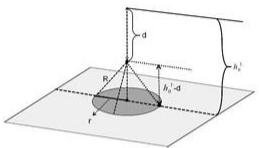

d
R
h₀'
d
r

图1情形二引爆深度 $d$ 位置示意图

此时，深弹杀伤范围与潜艇上表面所在平面相交产生截面，截面为圆盘，用杀伤半径 $R$ 和上表面与深弹深度差值通过勾股定理可计算出截面圆盘的半径：

$$
r = \sqrt {R ^ {2} - \left(h _ {0} ^ {\text {上}} - d\right) ^ {2}} \tag {2}
$$

进而可得，截面圆盘的圆周投影到水平面的标准方程

$$
(x - t) ^ {2} + (y - s) ^ {2} = R ^ {2} - \left(h _ {0} ^ {\text {上}} - d\right) ^ {2} \tag {3}
$$

潜艇的上表面只要与截面圆盘有接触，潜艇即会被命中。在潜艇方位角为 $\beta$ 时，根据截面圆盘和潜艇会被命中的临界位置，可以获得潜艇会被命中范围为临界位置潜艇中心点形成的包络线所围的区域 $\Omega_{2}$ ：中心为 $(t,s)$ ，长侧的直线段长为 $L$ ，短侧的直线段长为 $W$ ，四个“角”均为半径 $r = \sqrt{R^2 - (h_0^{\mathrm{上}} - d)^2}$ 的1/4的圆弧。

如图2阴影部分所示

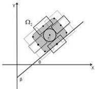

y
Ω₂
0
x
β

图2 情形二可命中范围区域 $\Omega_{2}$

潜艇实际水平位置 $(X,Y)$ 落在 $\Omega_2$ 内的概率即为此时命中潜艇的概率：

$$
p (t, s, d) = \iint_ {\Omega_ {2}} f (x, y) d x d y \tag {4}
$$

(3) 深弹引爆深度 d 设定在潜艇上表面深度和下表面深度之间

$$
h _ {0} ^ {\text {上}} <   d <   h _ {0} ^ {\text {下}}
$$

此时，如果潜艇的表面刚好在投弹点下方，深弹由触发引信引爆，潜艇被命中；如果潜艇表面不在投弹点下方，深弹由定深引信引爆，当潜艇的侧面触及炸弹的最大杀伤范围，潜艇也被命中。深弹杀伤范围与深度 $d$ 的水平面截面圆盘的半径为 $R$ ，截面圆盘的圆周投影到水平面的标准方程

$$
(x - t) ^ {2} + (y - s) ^ {2} = R ^ {2} \tag {5}
$$

在潜艇方位角为 $\beta$ 时，根据截面圆盘和潜艇会被命中的临界位置，可以获得潜艇会被命中的范围为临界位置潜艇中心点形成的包络线所围的区域 $\Omega_{3}$ ：中心为 $(t,s)$ ，长侧的直线段长为 $L$ ，短侧的直线段长为 $W$ ，四个“角”均为半径为 $R$ 的1/4的圆弧。

如图3阴影部分所示

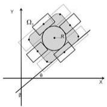

Y
Ω₁
R
θ
X
β

图3 情形三可命中范围区域 $\Omega_{3}$

潜艇实际水平位置 $(X,Y)$ 落在 $\Omega_{3}$ 内的概率即为此时命中潜艇的概率:

$$
p (t, s, d) = \iint_ {\Omega_ {3}} f (x, y) d x d y \tag {6}
$$

（4）深弹深度d大于潜艇下表面，小于下表面与最大杀伤半径的和，即

如图 4 所示

$$
h _ {0} ^ {\mathrm{下}} \leq d <   h _ {0} ^ {\mathrm{下}} + R
$$

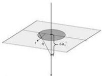

r
R
a
θ
θ₀

图4 情形二引爆深度 d 位置示意图

此时，如果潜艇的表面刚好在投弹点下方，深弹由触发引信引爆，潜艇被命中；如果潜艇表面不在投弹点下方，深弹由定深引信引爆，当潜艇的下表面触及炸弹的最大杀伤范围，潜艇也被命中。深弹杀伤范围与深度 $h_{0}^{\mathrm{F}}$ 的水平面截面圆盘的半径为

$$
r = \sqrt {R ^ {2} - \left(d - h _ {0} ^ {\text {下}}\right) ^ {2}} \tag {7}
$$

截面圆盘的圆周投影到水平面的标准方程

$$
(x - t) ^ {2} + (y - s) ^ {2} \leq R ^ {2} - \left(d - h _ {0} ^ {\text {下}}\right) ^ {2} \tag {8}
$$

在潜艇方位角为 $\beta$ 时，根据截面圆盘和潜艇会被命中的临界位置，可以获得潜艇会被命中的范围为临界位置潜艇中心点形成的包络线所围的区域 $\Omega_4$ ：中心为 $(t,s)$ ，长侧的直线段长为 $L$ ，短侧的直线段长为 $W$ ，四个“角”均为半径为 $r = \sqrt{R^2 - (d - h_0^\text{下})^2}$ 的 $1/4$ 的圆弧。

如图 5 阴影部分所示

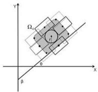

Y
Ω₄
θ
x
β

图5 情形四可命中范围区域 $\Omega_{4}$

潜艇实际水平位置 $(X,Y)$ 落在 $\Omega_{4}$ 内的概率即为此时命中潜艇的概率:

$$
p (t, s, d) = \iint_ {\Omega_ {d}} f (x, y) d x d y \tag {9}
$$

(5) 深弹深度 d 大于潜艇下表面与最大杀伤半径之和，即

$$
d \geq h _ {0} ^ {\text {下}} + R
$$

此时，只有当潜艇的表面刚好在投弹点下方，深弹由触发引信引爆，潜艇才能被命中。在潜艇方位角为 $\beta$ 时，潜艇会被命中的范围为一长方形区域 $\Omega_{5}$ ：中心在 $(t,s)$ ，长为 $L$ ，宽为 $W$ 。

如图 6 阴影部分所示

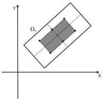

y
Ω₁
x

图6 情形五可命中范围区域 $\Omega_{5}$

潜艇实际水平位置 $(X,Y)$ 落在 $\Omega_{5}$ 内的概率即为此时命中潜艇的概率：

$$
p (t, s, d) = \iint_ {\Omega_ {y}} f (x, y) d x d y \tag {10}
$$

综上，投弹命中概率与投弹落点坐标及设定引爆深度的一般关系为：

$$
p (t, s, d) = \left\{ \begin{array}{c} 0, d \leq h _ {0} - \frac {1}{2} H - R, \\ \iint_ {\Omega_ {t}} f (x, y) d x d y, h _ {0} - \frac {1}{2} H - R <   d \leq h _ {0} - \frac {1}{2} H, \\ \iint_ {\Omega_ {t}} f (x, y) d x d y, h _ {0} - \frac {1}{2} H <   d \leq h _ {0} + \frac {1}{2} H, \\ \iint_ {\Omega_ {t}} f (x, y) d x d y, h _ {0} + \frac {1}{2} H <   d \leq h _ {0} + \frac {1}{2} H + R, \\ \iint_ {\Omega_ {t}} f (x, y) d x d y, d > h _ {0} + \frac {1}{2} H + R, \end{array} \right.
$$

其中 $\Omega_2, \Omega_3, \Omega_4, \Omega_5$ 分别如图2、图3、图5与图6所示。

# 5.1.2.2 投弹最大命中概率的方案及证明

根据以上分析，可以得到如下结论：

定理1：对任意的水平投弹落点 $(t,s)$ ，当 $h_0^{\text{上}} < d < h_0^{\text{下}}$ 时， $p(t,s,d)$ 取得最大值

$$
p (t, s) = \iint_ {\Omega_ {1}} f (x, y) d x d y \tag {11}
$$

其中 $f(x,y)=\frac{1}{2\pi\sigma^{2}}e^{-\frac{x^{2}+y^{2}}{2\sigma^{2}}}$ ， $\Omega_{3}$ 为中心为 $(t,s)$ ，长侧的直线段长为 L，短侧的直线段长为 W，四个“角”均为半径为 R 的 1/4 的圆弧区域（如图 3）。

证明：首先，当 $h_{0}^{上}<d<h_{0}^{下}$ 时， $p(t,s,d)=\iint_{\Omega_{1}}f(x,y)dx dy$ 关于d为正的常数值。分情形讨论，

①当 $d \leq h_0^{\pm} - R = h_0 - \frac{1}{2} H - R$ 时， $\iint_{\Omega_3} f(x, y) dx dy \geq p(t, s, d) = 0$ ；

②当 $h_{0}^{上}-R<d\leq h_{0}^{上}$ 时，由于 $r=\sqrt{R^{2}-\left(h_{0}^{上}-d\right)^{2}}\leq R,\quad\Omega_{3}\supseteq\Omega_{2}$ （如图7），

$$
\iint_ {\Omega_ {1}} f (x, y) d x d y = \iint_ {\Omega_ {2}} f (x, y) d x d y + \iint_ {\Omega_ {3} \backslash \Omega_ {2}} f (x, y) d x d y \geq \iint_ {\Omega_ {2}} f (x, y) d x d y = p (t, s, d);
$$

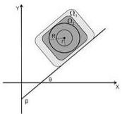

y
Ω₁
Ω₂
R
θ
x
β

图7可命中范围 $\Omega_{2}$ 与 $\Omega_{3}$ 的重叠图

③当 $h_0^{\mathrm{下}} < d < h_0^{\mathrm{下}} + R$ 时，由于 $r = \sqrt{R^2 - (d - h_0^{\mathrm{下}})^2} \leq R$ ， $\Omega_3 \supseteq \Omega_4$

$$
\iint_ {\Omega_ {3}} f (x, y) d x d y = \iint_ {\Omega_ {4}} f (x, y) d x d y + \iint_ {\Omega_ {3} \backslash \Omega_ {4}} f (x, y) d x d y \geq \iint_ {\Omega_ {4}} f (x, y) d x d y = p (t, s, d);
$$

④当 $d\geq h_{0}^{下}+R$ 时，由于 $\Omega_{3}\supseteq\Omega_{5}$

$$
\iint_ {\Omega_ {3}} f (x, y) d x d y = \iint_ {\Omega_ {3}} f (x, y) d x d y + \iint_ {\Omega_ {3} \backslash \Omega_ {5}} f (x, y) d x d y \geq \iint_ {\Omega_ {5}} f (x, y) d x d y = p (t, s, d),
$$

所以，对任意的水平投弹落点 $(t,s)$ ，当 $h_0^{\perp} < d < h_0^{\text{下}}$ 时，取得最大值 $p(t,s)$

$$
p (t, s) = \iint_ {\Omega_ {3}} f (x, y) d x d y
$$

其中 $\Omega_{3}$ 如图3所示。

证毕。

结论1：任意的水平投弹落点 $(t,s)$ ，使得投弹命中概率最大的投弹方案中设定定深引信引爆深度 $d$ 为定位的潜艇上、下表面深度之间。

为解决投弹命中概率最大的投弹方案中投弹落点 $(t,s)$ 的问题，先介绍一下引理：

引理1：设函数 $g(t) = \int_{t - m}^{t + m}\mathrm{e}^{-\frac{x^2}{2\sigma^2}}\mathrm{d}x(m > 0)$ ，则当 $t = 0$ 时 $g(t)$ 取得最大值。

$$
g (0) = \int_ {- m} ^ {m} \mathrm{e} ^ {- \frac {x ^ {2}}{2 \sigma^ {2}}} \mathrm{d} x \tag {12}
$$

证明：对函数 $g(t)$ 求导得：

$$
g ^ {\prime} (t) = \mathrm{e} ^ {- \frac {(t + m) ^ {2}}{2 \sigma^ {2}}} - \mathrm{e} ^ {- \frac {(t - m) ^ {2}}{2 \sigma^ {2}}}
$$

令 $g'(t)=0$ 解得唯一极值点 t=0 即为最大值点，所以当 t=0 时 $g(t)$ 取得最大值

$$
g (0) = \int_ {- m} ^ {m} \mathrm{e} ^ {\frac {x ^ {2}}{2 \sigma^ {2}}} \mathrm{d} x.
$$

注：引理 1 的几何意义如图 8 所示，即当定长度的积分区间的中点在原点时，积分值最大。

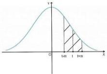

y
O
t=m
t
t+m
x

图8 正态分布示意图

在定深引信引爆深度 $d$ 设定在最优范围内，可以得到最大命中概率与投弹落点平面坐标 $(t,s)$ 的更具体的关系。

定理2：（最大命中概率与投弹落点平面坐标关系）对于 $p(t,s) = \iint_{\Omega_3}f(x,y)\mathrm{d}x\mathrm{d}y$ ，其中 $f(x,y)$ ， $\Omega_3$ 为中心为 $(t,s)$ ，长侧的直线段长为 $L$ ，短侧的直线段长为 $W$ ，四个“角”均为半径为 $R$ 的1/4的圆弧区域（如图3），

$$
p (t, s) = \frac {1}{2 \pi \sigma^ {2}} \int_ {t ^ {\prime} - R - \frac {L}{2}} ^ {t ^ {\prime} + R + \frac {L}{2}} \mathrm{e} ^ {- \frac {x ^ {2}}{2 \sigma^ {2}}} (\int_ {s ^ {\prime} - m (t ^ {\prime}, x ^ {\prime})} ^ {s ^ {\prime} + m (t ^ {\prime}, x ^ {\prime})} \mathrm{e} ^ {- \frac {y ^ {2}}{2 \sigma^ {2}}} \mathrm{d} y ^ {\prime}) \mathrm{d} x ^ {\prime} \tag {13}
$$

或

$$
p (t, s) = \frac {1}{2 \pi \sigma^ {2}} \int_ {s ^ {\prime} - R - \frac {W}{2}} ^ {s ^ {\prime} + R + \frac {W}{2}} \mathrm{e} ^ {- \frac {y ^ {2}}{2 \sigma^ {2}}} (\int_ {t ^ {\prime} - n (s ^ {\prime}, y ^ {\prime})} ^ {t ^ {\prime} + n (s ^ {\prime}, y ^ {\prime})} \mathrm{e} ^ {- \frac {x ^ {2}}{2 \sigma^ {2}}} \mathrm{d} x ^ {\prime}) \mathrm{d} y ^ {\prime}, \tag {14}
$$

其中

$$
m \left(t ^ {\prime}, x ^ {\prime}\right) = \left\{ \begin{array}{c} \frac {W}{2} + \sqrt {R ^ {2} - \left(x - \frac {L}{2}\right) ^ {2}}, t ^ {\prime} - \frac {L}{2} - R \leq x <   t ^ {\prime} - \frac {L}{2} \\ \frac {W}{2} + R, t ^ {\prime} - \frac {L}{2} \leq x <   t ^ {\prime} + \frac {L}{2} \\ \frac {W}{2} - \sqrt {R ^ {2} - \left(x - \frac {L}{2}\right) ^ {2}}, t ^ {\prime} + \frac {L}{2} \leq x <   t ^ {\prime} + \frac {L}{2} + R \end{array} \right.
$$

$$
n (s ^ {\prime}, y ^ {\prime}) = \left\{ \begin{array}{l} \frac {L}{2} + \sqrt {R ^ {2} - (y - \frac {W}{2}) ^ {2}}, s ^ {\prime} - \frac {W}{2} - R \leq y <   t ^ {\prime} - \frac {W}{2} \\ \frac {L}{2} + R, t ^ {\prime} - \frac {W}{2} \leq y <   t ^ {\prime} + \frac {W}{2} \\ \frac {L}{2} - \sqrt {R ^ {2} - (y - \frac {W}{2}) ^ {2}}, t ^ {\prime} + \frac {W}{2} \leq y <   t ^ {\prime} + \frac {W}{2} + R \end{array} \right.
$$

$$
\binom {t ^ {\prime}} {s ^ {\prime}} = \left( \begin{array}{c c} \cos \theta & \sin \theta \\ - \sin \theta & \cos \theta \end{array} \right) \binom {t} {s}.
$$

证明：将图3坐标系按逆时针旋转 $\theta = \beta -\frac{\pi}{2}$ 得到新的坐标系，新的横轴用 $X^{\prime}$ 表示，纵轴用 $Y^{\prime}$ 表示（如图9）

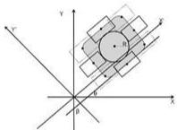

Y
Z
B
X
β

图9 旋转后新坐标系

两个坐标系中坐标的对应关系式为：

$$
\binom {x ^ {\prime}} {y ^ {\prime}} = \left( \begin{array}{c c} \cos \theta & \sin \theta \\ - \sin \theta & \cos \theta \end{array} \right) \binom {x} {y} \text {或} \binom {x} {y} = \left( \begin{array}{c c} \cos \theta & - \sin \theta \\ \sin \theta & \cos \theta \end{array} \right) \binom {x ^ {\prime}} {y ^ {\prime}}
$$

为方便观察，将新坐标系摆正如图 10。

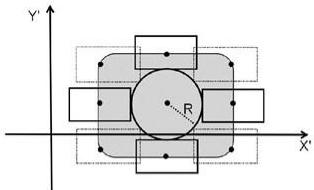

Y'
R
X'

图10 摆正后新坐标系

原来的区域 $\Omega_{3}$ 在新的坐标系中对应的区域为 $\Omega_{3}^{\prime}$ ， $\Omega_{3}^{\prime}$ 的形状与 $\Omega_{3}$ 相同，中心点 $(t', s')$ 与 $(t, s)$ 为：

$$
\binom {t ^ {\prime}} {s ^ {\prime}} = \left( \begin{array}{c c} \cos \theta & \sin \theta \\ - \sin \theta & \cos \theta \end{array} \right) \binom {t} {s}
$$

其他参数或边界曲线表达式如图 11 所示

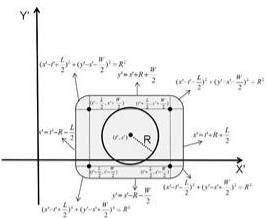

(x^r - r_1 \frac{L}{2} y^r + (y^r - r_1 \frac{W}{2} y^r - R^r)\ny^r = r^r + R + \frac{W}{2}\n(x^r - r_1 \frac{L}{2} y^r + (y^r - r_1 \frac{W}{2} y^r - R^r)\ny^r = r^r - R + \frac{L}{2}\n(x^r - r_1 \frac{L}{2} y^r + (y^r - r_1 \frac{W}{2} y^r - R^r)\ny^r = r^r + R + \frac{L}{2}\n(x^r - r_1 \frac{L}{2} y^r + (y^r - r_1 \frac{W}{2} y^r - R^r)\ny^r = r^r - R + \frac{L}{2}\n\nY

图11 边界曲线表达式示意图

可以改写为累次积分表达式

$$
\begin{array}{l} p (t, s) = \iint_ {\Omega_ {1}} f (x, y) \mathrm{d} x \mathrm{d} y \\ = \iint_ {\Omega_ {j}} f (x ^ {\prime} \cos \theta - y ^ {\prime} \sin \theta , x ^ {\prime} \sin \theta + y ^ {\prime} \cos \theta) | J | d x ^ {\prime} d y ^ {\prime} \\ = \frac {1}{2 \pi \sigma^ {2}} \iint_ {\Omega_ {1} ^ {\prime}} \mathrm{e} ^ {- \frac {x ^ {2} + y ^ {2}}{2 \sigma^ {2}}} \mathrm{d} x ^ {\prime} \mathrm{d} y ^ {\prime} \tag {15} \\ = \frac {1}{2 \pi \sigma^ {2}} \int_ {t ^ {\prime} - R - \frac {L}{2}} ^ {t ^ {\prime} + R + \frac {L}{2}} (\int_ {s ^ {\prime} - m (t ^ {\prime}, x ^ {\prime})} ^ {s ^ {\prime} + m (t ^ {\prime}, x ^ {\prime})} \mathrm{e} ^ {- \frac {x ^ {2} + y ^ {2}}{2 \sigma^ {2}}} \mathrm{d} y ^ {\prime}) \mathrm{d} x ^ {\prime} \\ = \frac {1}{2 \pi \sigma^ {2}} \int_ {t ^ {\prime} - R - \frac {L}{2}} ^ {t ^ {\prime} + R + \frac {L}{2}} \mathrm{e} ^ {- \frac {x ^ {2}}{2 \sigma^ {2}}} (\int_ {s ^ {\prime} - m (t ^ {\prime}, x ^ {\prime})} ^ {s ^ {\prime} + m (t ^ {\prime}, x ^ {\prime})} \mathrm{e} ^ {- \frac {y ^ {2}}{2 \sigma^ {2}}} \mathrm{d} y ^ {\prime}) \mathrm{d} x ^ {\prime} \\ \end{array}
$$

其中 $m(t', x') = \begin{cases} \frac{W}{2} + \sqrt{R^2 - (x - \frac{L}{2})^2}, & t' - \frac{L}{2} - R \leq x < t' - \frac{L}{2} \\ \frac{W}{2} + R, & t' - \frac{L}{2} \leq x < t' + \frac{L}{2} \\ \frac{W}{2} - \sqrt{R^2 - (x - \frac{L}{2})^2}, & t' + \frac{L}{2} \leq x < t' + \frac{L}{2} + R \end{cases}$

同理，若先对 $x'$ 后对 $y'$ 积分得：

$$
\begin{array}{l} p (t, s) = \frac {1}{2 \pi \sigma^ {2}} \int_ {s ^ {\prime} - R - \frac {W}{2}} ^ {s ^ {\prime} + R + \frac {W}{2}} \left(\int_ {t ^ {\prime} - n (s ^ {\prime}, y ^ {\prime})} ^ {t ^ {\prime} + n (s ^ {\prime}, y ^ {\prime})} e ^ {- \frac {x ^ {2} + y ^ {2}}{2 \sigma^ {2}}} d x ^ {\prime}\right) d y ^ {\prime} \tag {16} \\ = \frac {1}{2 \pi \sigma^ {2}} \int_ {s ^ {\prime} - R - \frac {W}{2}} ^ {s ^ {\prime} + R + \frac {W}{2}} e ^ {- \frac {y ^ {2}}{2 \sigma^ {2}}} (\int_ {t ^ {\prime} - m (s ^ {\prime}, y ^ {\prime})} ^ {t ^ {\prime} + n (s ^ {\prime}, y ^ {\prime})} e ^ {- \frac {x ^ {2}}{2 \sigma^ {2}}} d x ^ {\prime}) d y ^ {\prime} \\ \end{array}
$$

其中 $n(s', y') = \begin{cases} \frac{L}{2} + \sqrt{R^2 - (y - \frac{W}{2})^2}, & s' - \frac{W}{2} - R \leq y < t' - \frac{W}{2} \\ \frac{L}{2} + R, & t' - \frac{W}{2} \leq y < t' + \frac{W}{2} \\ \frac{L}{2} - \sqrt{R^2 - (y - \frac{W}{2})^2}, & t' + \frac{W}{2} \leq y < t' + \frac{W}{2} + R \end{cases}$

证毕。

定理3：（最大命中概率表达式） $p(t,s)$ 在 $(0,0)$ 取得最大值，且最大值表达式为

$$
\begin{array}{l} p (0, 0) = \frac {1}{2 \pi \sigma^ {2}} \left(\int_ {- R - \frac {L}{2}} ^ {\frac {L}{2}} d x \int_ {- \frac {W}{2}} ^ {\frac {W}{2} + \sqrt {R ^ {2} - (x + \frac {L}{2}) ^ {2}}} e ^ {- \frac {x ^ {2} + y ^ {2}}{2 \sigma^ {2}}} d y \right. \\ + \int_ {- \frac {L}{2}} ^ {\frac {L}{2}} d x \int_ {- \frac {W}{2} - R} ^ {\frac {W}{2} + R} e ^ {- \frac {x ^ {2} + y ^ {2}}{2 \sigma^ {2}}} d y \tag {17} \\ + \int_ {\frac {L}{2}} ^ {R + \frac {L}{2}} d x \int_ {- \frac {W}{2}} ^ {\frac {W}{2} + \sqrt {R ^ {2} - (x - \frac {L}{2}) ^ {2}}} e ^ {- \frac {x ^ {2} + y ^ {2}}{2 \sigma^ {2}}} d y). \\ \end{array}
$$

证明：由引理1得 $g(s^{\prime}) = \int_{x^{\prime} - m(t^{\prime},x^{\prime})}^{x^{\prime} + m(t^{\prime},x^{\prime})}\mathrm{e}^{-\frac{y^{2}}{2\sigma^{2}}}\mathrm{d}y^{\prime}$ 的最大值为 $g(0) = \int_{-m(t^{\prime},x^{\prime})}^{m(t^{\prime},x^{\prime})}\mathrm{e}^{-\frac{y^{2}}{2\sigma^{2}}}\mathrm{d}y^{\prime}$

又由积分保号性可知

$$
p (t, s) \leq \frac {1}{2 \pi \sigma^ {2}} \int_ {t ^ {\prime} - R - \frac {L}{2}} ^ {t ^ {\prime} + R + \frac {L}{2}} (\mathrm{e} ^ {- \frac {x ^ {2}}{2 \sigma^ {2}}} \int_ {- m (t ^ {\prime}, x ^ {\prime})} ^ {m (t ^ {\prime}, x ^ {\prime})} \mathrm{e} ^ {- \frac {y ^ {2}}{2 \sigma^ {2}}} \mathrm{d} y ^ {\prime}) \mathrm{d} x ^ {\prime}
$$

且当 $s'=0$ 时等号成立.

改写积分次序，

$$
\begin{array}{l} p (t, s) = \frac {1}{2 \pi \sigma^ {2}} \int_ {s ^ {\prime} - R - \frac {W}{2}} ^ {s ^ {\prime} + R + \frac {W}{2}} \left(\int_ {t ^ {\prime} - n (s ^ {\prime}, y ^ {\prime})} ^ {t ^ {\prime} + n (s ^ {\prime}, y ^ {\prime})} e ^ {- \frac {x ^ {2} + y ^ {2}}{2 \sigma^ {2}}} d x ^ {\prime}\right) d y ^ {\prime} \\ = \frac {1}{2 \pi \sigma^ {2}} \int_ {x ^ {\prime} - R - \frac {W}{2}} ^ {x ^ {\prime} + R + \frac {W}{2}} e ^ {- \frac {y ^ {2}}{2 \sigma^ {2}}} (\int_ {t ^ {\prime} - n (x ^ {\prime}, y ^ {\prime})} ^ {t ^ {\prime} + n (x ^ {\prime}, y ^ {\prime})} e ^ {- \frac {x ^ {2}}{2 \sigma^ {2}}} d x ^ {\prime}) d y ^ {\prime}, \\ \end{array}
$$

同理，

$$
p (t, s) \leq \frac {1}{2 \pi \sigma^ {2}} \int_ {- R - \frac {W}{2}} ^ {R + \frac {W}{2}} \mathrm{e} ^ {- \frac {y ^ {\prime 2}}{2 \sigma^ {2}}} (\int_ {- n (x ^ {\prime}, y ^ {\prime})} ^ {n (x ^ {\prime}, y ^ {\prime})} \mathrm{e} ^ {- \frac {x ^ {\prime 2}}{2 \sigma^ {2}}} \mathrm{d} x ^ {\prime}) \mathrm{d} y ^ {\prime}
$$

且当 $t'=0$ 时等号成立.

综上，当 $s' = 0$ ， $t' = 0$ 时，即

$$
\binom {t ^ {\prime}} {s ^ {\prime}} = \left( \begin{array}{c c} \cos \theta & \sin \theta \\ - \sin \theta & \cos \theta \end{array} \right) \binom {t} {s} = \binom {0} {0}
$$

也即 t=0, s=0 时， $p(t,s)$ 取最大值

$$
\begin{array}{l} p (0, 0) = \frac {1}{2 \pi \sigma^ {2}} (\int_ {- R - \frac {L}{2}} ^ {\frac {L}{2}} d x ^ {\prime} \int_ {- \frac {W}{2}} ^ {\frac {W}{2} + \sqrt {R ^ {2} - (x ^ {\prime} + \frac {L}{2}) ^ {2}}} e ^ {- \frac {x ^ {2} + y ^ {2}}{2 \sigma^ {2}}} d y ^ {\prime} \\ + \int_ {- \frac {L}{2}} ^ {\frac {L}{2}} d x ^ {\prime} \int_ {- \frac {W}{2} - R} ^ {\frac {W}{2} + R} e ^ {- \frac {x ^ {2} + y ^ {2}}{2 \sigma^ {2}}} d y ^ {\prime} \\ + \int_ {\frac {L}{2}} ^ {R + \frac {L}{2}} d x ^ {\prime} \int_ {- \frac {W}{2}} ^ {\frac {W}{2} - \sqrt {R ^ {2} - (x ^ {\prime} - \frac {L}{2}) ^ {2}}} e ^ {- \frac {x ^ {2} + y ^ {2}}{2 \sigma^ {2}}} d y ^ {\prime}). \\ \end{array}
$$

由于积分值与积分变量符号无关，

$$
\begin{array}{l} p (0, 0) = \frac {1}{2 \pi \sigma^ {2}} \left(\int_ {- R - \frac {L}{2}} ^ {- \frac {L}{2}} d x \int_ {- \frac {W}{2}} ^ {\frac {W}{2} + \sqrt {R ^ {2} - (x + \frac {L}{2}) ^ {2}}} e ^ {- \frac {x ^ {2} + y ^ {2}}{2 \sigma^ {2}}} d y \right. \\ + \int_ {- \frac {L}{2}} ^ {\frac {L}{2}} d x \int_ {- \frac {W}{2} - R} ^ {\frac {W}{2} + R} e ^ {- \frac {x ^ {2} + y ^ {2}}{2 \sigma^ {2}}} d y \\ + \int_ {\frac {L}{2}} ^ {R + \frac {L}{2}} d x \int_ {- \frac {W}{2}} ^ {\frac {W}{2} + \sqrt {R ^ {2} - (x - \frac {L}{2}) ^ {2}}} e ^ {- \frac {x ^ {2} + y ^ {2}}{2 \sigma^ {2}}} d y). \\ \end{array}
$$

证毕。

综合结论1及以上定理，可得如下结论：

结论 2：投弹命中概率最大的投弹方案为：东西方向 t=0，南北方向 s=0，即投弹落点平面坐标为“看哪打哪”；定深引信引爆深度设定在潜艇 $h_{0}^{上}=h_{0}-\frac{1}{2}H$ 与 $h_{0}^{下}=h_{0}+\frac{1}{2}H$ 之间，即潜艇上下表面之间。

结论 3：投弹命中概率与潜艇航向无关。

# 5.1.2 问题一模型求解

针对所给参数值：潜艇长 100 m，宽 20 m，高 25 m，潜艇航向方位角为 90°，深弹杀伤半径为 20 m，潜艇中心位置的水平定位标准差 $\sigma = 120$ m，潜艇中心位置的深度定位值为 150 m，利用 Matlab 中 integral2 函数计算出模型的结果（程序见附录），最大概率为 $p(0,0) = 0.0837$ .

# 5.2 问题二模型建立与求解

# 5.2.1 投弹命中概率表达式的建立

如果潜艇中心的深度方向有误差，由于深度方向的误差与平面两个水平方向的误差相互独立，所以问题一中所求投弹命中概率最大的投弹方案中水平方向的方案仍然成立，即东西方向仍为 $t = 0$ ，南北方向仍为 $s = 0$ 。记定深引信引爆深度设定为 $d$ ，潜艇命中的事件为 $A$ ，潜艇被命中的概率为 $P(A; d)$ ，当潜艇深度 $Z = z$ 时潜艇被命中的概率 $P(A|Z = z; d)$ 。根据 $d$ 与潜艇中心位置实际深度最小值 $l$ 的相对位置分以下情形讨论（如图12），

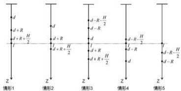

d
d+R
d+R+H/2
f
Z
Z
d+R
d+R+H/2
Z
Z
d-R-H/2
d-R
d+R+H/2
Z
Z
d-R-H/2
d-R
d-R-H/2
Z
Z
Z

图12 $d$ 与实际深度最小值 $l$ 相对位置图

情形（1）： $d+R+\frac{1}{2}H\leq l$ ；

情形（2）： $d+R\leq l<d+R+\frac{1}{2}H$ ；

情形（3）： $d-R\leq l<d+R$ ；

情形（4）： $d-R-\frac{1}{2}H\leq l<d-R$ ；

情形（5）： $l<d-R-\frac{1}{2}H$

在各情形中可以求得 $P(A|Z = z;d)$ 的表达式。

以情形（5）为例进行具体说明。当 $l<d-R-\frac{1}{2}H$ 时，即 $l+R+\frac{1}{2}H<d$ 时，潜艇深度Z=z位于不同的位置，被命中的方式不完全相同，与问题1的五种情况类似，将问题1中的 $h_{0}$ 换为z，具体为

① $l \leq z < d - R - \frac{1}{2} H$ ，潜艇只能在触发引信引爆时命中，即潜艇在水平中心位置落入到长方形区域 $\Omega_{21}$ （如图13）时被命中，命中概率为

$$
P (A \mid Z = z; d) = \iint_ {\Omega_ {2 1}} f (x, y) \mathrm{d} x \mathrm{d} y = \int_ {- \frac {1}{2} W} ^ {\frac {1}{2} W} \mathrm{d} y \int_ {- \frac {1}{2} L} ^ {\frac {1}{2} L} f (x, y) \mathrm{d} x \tag {18}
$$

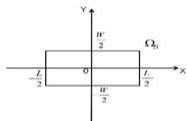

Y
W/2
Ω₁
0
L/2
W/2
L/2
X

图13 ①区域 $\Omega_{21}$

② $d-R-\frac{1}{2}H\leq z<d-\frac{1}{2}H$ ，潜艇可能在触发引信引爆时命中，也可能被下侧方的深弹爆炸命中，类似于问题1，下表面平面与深弹杀伤范围截面为一半径为$r=\sqrt{R^{2}-(d-z-\frac{1}{2}H)^{2}}$ 的圆盘，此时潜艇在水平中心位置落入到区域 $\Omega_{22}$ （如图 14）
时被命中，命中概率为

$$
\begin{array}{l} P (A \mid Z = z; d) = \iint_ {\Omega_ {2}} f (x, y) \mathrm{d} x \mathrm{d} y \\ = \int_ {- \frac {1}{2} L - r} ^ {\frac {1}{2} L} d x \int_ {- \frac {1}{2} W - \sqrt {r ^ {2} - (x + \frac {1}{2} L) ^ {2}}} ^ {\frac {1}{2} W + \sqrt {r ^ {2} - (x + \frac {1}{2} L) ^ {2}}} f (x, y) d y + \int_ {- \frac {1}{2} L} ^ {\frac {1}{2} L} d x \int_ {- \frac {1}{2} W - r} ^ {\frac {1}{2} W + r} f (x, y) d y \tag {19} \\ + \int_ {\frac {1}{2} L} ^ {\frac {1}{2} L + r} d x \int_ {- \frac {1}{2} W - \sqrt {r ^ {2} - (x - \frac {1}{2} L) ^ {2}}} ^ {\frac {1}{2} W + \sqrt {r ^ {2} - (x - \frac {1}{2} L) ^ {2}}} f (x, y) d y, \\ \end{array}
$$

其中 $r = \sqrt{R^2 - (d - z - \frac{1}{2} H)^2}$

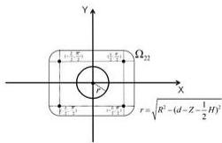

Y
r=\frac{1}{r-1} \frac{r}{r-1} \Omega_{22}
r=\sqrt{R^2-(d-Z-\frac{1}{2}H)^2}

图14②区域 $\Omega_{22}$

③ $d-\frac{1}{2}H\leq z<d+\frac{1}{2}H$ ，潜艇可能在触发引信引爆时命中，也可能被侧方的深弹爆炸命中，此时潜艇在水平中心位置落入到区域 $\Omega_{32}$ （如图15）时被命中，命中概率为

$$
\begin{array}{l} P (A \mid Z = z; d) = \iint_ {\Omega_ {3 2}} f (x, y) \mathrm{d} x \mathrm{d} y \\ = \int_ {- \frac {1}{2} L - R} ^ {- \frac {1}{2} L} d x \int_ {- \frac {1}{2} W - \sqrt {R ^ {2} - (x + \frac {1}{2} L) ^ {2}}} ^ {\frac {1}{2} W + \sqrt {R ^ {2} - (x + \frac {1}{2} L) ^ {2}}} f (x, y) d y + \int_ {- \frac {1}{2} L} ^ {\frac {1}{2} L} d x \int_ {- \frac {1}{2} W - R} ^ {\frac {1}{2} W + R} f (x, y) d y \tag {20} \\ + \int_ {\frac {1}{2} L} ^ {\frac {1}{2} L + R} d x \int_ {- \frac {1}{2} W - \sqrt {R ^ {2} - (x - \frac {1}{2} L) ^ {2}}} ^ {\frac {1}{2} W + \sqrt {R ^ {2} - (x - \frac {1}{2} L) ^ {2}}} f (x, y) d y, \\ \end{array}
$$

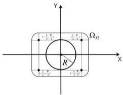

Y
i₁ - i₂
i₂ - i₃
Ω₃₂
R
i₁ - i₂
i₂ - i₃
X

图15③区域 $\Omega_{32}$

④ $d + \frac{1}{2} H \leq z < d + \frac{1}{2} H + R$ ，潜艇的上表面平面与深弹杀伤范围截面为一半径为 $r = \sqrt{R^2 - (d - z + \frac{1}{2}H)^2}$ 的圆盘，潜艇上表面只要与截面圆盘即被命中，此时潜艇水平中心位置落入到区域 $\Omega_{32}$ （如图16）时被命中，命中概率为

$$
\begin{array}{l} P (A \mid Z = z; d) = \iint_ {\Omega_ {d 2}} f (x, y) \mathrm{d} x \mathrm{d} y \\ = \int_ {- \frac {1}{2} L - r} ^ {- \frac {1}{2} L} d x \int_ {- \frac {1}{2} W - \sqrt {r ^ {2} - (x + \frac {1}{2} L) ^ {2}}} ^ {\frac {1}{2} W + \sqrt {r ^ {2} - (x + \frac {1}{2} L) ^ {2}}} f (x, y) d y + \int_ {- \frac {1}{2} L} ^ {\frac {1}{2} L} d x \int_ {- \frac {1}{2} W - r} ^ {\frac {1}{2} W + r} f (x, y) d y \tag {21} \\ + \int_ {\frac {1}{2} L} ^ {\frac {1}{2} L + r} d x \int_ {- \frac {1}{2} W - \sqrt {r ^ {2} - (x - \frac {1}{2} L) ^ {2}}} ^ {\frac {1}{2} W + \sqrt {r ^ {2} - (x - \frac {1}{2} L) ^ {2}}} f (x, y) d y, \\ \end{array}
$$

其中 $r = \sqrt{R^2 - (d - z + \frac{1}{2} H)^2}$

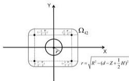

Y
Ω₄₂
r = \sqrt{R² - (d-Z + \frac{1}{2}H)²}

图16④区域 $\Omega_{42}$

⑤ $d+\frac{1}{2}H+R\leq z$ ，此时深弹爆炸无法波及到深度z任意位置处的潜艇， $P(A|Z=z;d)=0.$ 。

综上，情形（5）： $l<d-R-\frac{1}{2}H$ 即 $l+R+\frac{1}{2}H<d$ 时潜艇被命中的概率为

$$
\begin{array}{l} P (A; d) = \int_ {l} ^ {+ \infty} P (A | Z = z; d) f _ {h _ {0}, \sigma_ {s}, l} (z) d z \\ = \underbrace {\int_ {l} ^ {d - R - \frac {1}{2} H} P (A \mid Z = z ; d) f _ {h _ {0} , \sigma_ {z} , l} (z) \mathrm{d} z} _ {(1)} + \underbrace {\int_ {d - R - \frac {1}{2} H} ^ {d - \frac {1}{2} H} P (A \mid Z = z ; d) f _ {h _ {0} , \sigma_ {z} , l} (z) \mathrm{d} z} _ {(2)} \\ + \underbrace {\int_ {d - \frac {1}{2} H} ^ {d + \frac {1}{2} H} P (A | Z = z ; d) f _ {h _ {0} , \sigma_ {z} , l} (z) \mathrm{d} z} _ {(3)} + \underbrace {\int_ {d + \frac {1}{2} H} ^ {d + R + \frac {1}{2} H} P (A | Z = z ; d) f _ {h _ {0} , \sigma_ {z} , l} (z) \mathrm{d} z} _ {(6)}, \\ \end{array}
$$

其中①中的 $P(A|Z = z;d)$ 见式(18)，②中的 $P(A|Z = z;d)$ 见式(19)，③中的 $P(A|Z = z;d)$ 见式(20)，④中的 $P(A|Z = z;d)$ 见式(21)。

类似的，

情形(1): $d+R+\frac{1}{2}H \leq l$ 即 $d \leq l-R-\frac{1}{2}H$ 时，定深引信事先设定的引爆深度过浅，潜艇被命中的概率 $P(A,d)=0$ .

情形（2）： $d+R\leq l<d+R+\frac{1}{2}H$ 即 $l-R-\frac{1}{2}H<d\leq l-R$ 时，潜艇被命中的概率为

$$
\begin{array}{l} P (A; d) = \int_ {l} ^ {+ \infty} P (A | Z = z; d) f _ {h _ {0}, \sigma_ {z}, l} (z) d z \\ = \underbrace {\int_ {l} ^ {d + R + \frac {1}{2} H} P (A | Z = z ; d) f _ {h _ {0} , \sigma_ {z} , l} (z) \mathrm{d} z} _ {(4)}, \\ \end{array}
$$

其中④中的 $P(A|Z=z)$ 见式(21)。

情形（3）： $d - R\leq l <   d + R$ 即 $l - R <   d\leq l + R$ 时潜艇被命中的概率为

$$
\begin{array}{l} P (A; d) = \int_ {1} ^ {+ \infty} P (A | Z = z; d) f _ {h _ {0}, \sigma_ {z}, 1} (z) d z \\ = \underbrace {\int_ {t} ^ {d + \frac {1}{2} H} P (A \mid Z = z ; d) f _ {h _ {0} , \sigma_ {z} , t} (z) \mathrm{d} z} _ {③} + \underbrace {\int_ {d + \frac {1}{2} H} ^ {d + R + \frac {1}{2} H} P (A \mid Z = z ; d) f _ {h _ {0} , \sigma_ {z} , t} (z) \mathrm{d} z} _ {④}, \\ \end{array}
$$

其中③中的 $P(A|Z=z;d)$ 见式(20)，④中的 $P(A|Z=z;d)$ 见式(21)。

情形（4）： $d-R-\frac{1}{2}H\leq l<d-R$ 即 $l+R<d\leq l+R+\frac{1}{2}H$ 时潜艇被命中的概率为

$$
\begin{array}{l} P (A; d) = \int_ {1} ^ {+ \infty} P (A | Z = z; d) f _ {h _ {0}, \sigma_ {z}, l} (z) d z \\ = \underbrace {\int_ {l} ^ {d - \frac {1}{2} H} P (A \mid Z = z ; d) f _ {h _ {0} , \sigma_ {z} , l} (z) \mathrm{d} z} _ {(2)} \\ + \underbrace {\int_ {d - \frac {1}{2} H} ^ {d + \frac {1}{2} H} P (A | Z = z ; d) f _ {h _ {0} , \sigma_ {g} , l} (z) \mathrm{d} z} _ {(3)} + \underbrace {\int_ {d + \frac {1}{2} H} ^ {d + R + \frac {1}{2} H} P (A | Z = z ; d) f _ {h _ {0} , \sigma_ {g} , l} (z) \mathrm{d} z} _ {(6)}, \\ \end{array}
$$

其中②中的 $P(A|Z=z;d)$ 见式(19)，③中的 $P(A|Z=z;d)$ 见式(20)，④中的 $P(A|Z=z;d)$ 见式(21)。

综上，投弹命中的概率表达式为分为5段的分段函数：

$$
P (A; d) = \left\{ \begin{array}{c} 0, d \leq l - R - \frac {1}{2} H, \\ \underbrace {\int_ {l} ^ {d + R + \frac {1}{2} H} P (A | Z = z ; d) f _ {h _ {0} , \sigma_ {r , d}} (z) \mathrm{d} z} _ {④}, l - R - \frac {1}{2} H <   d \leq l - R, \\ \underbrace {\int_ {l} ^ {d + \frac {1}{2} H} P (A | Z = z ; d) f _ {h _ {0} , \sigma_ {r , d}} (z) \mathrm{d} z} _ {③} + \underbrace {\int_ {d + \frac {1}{2} H} ^ {d + R + \frac {1}{2} H} P (A | Z = z ; d) f _ {h _ {0} , \sigma_ {r , d}} (z) \mathrm{d} z} _ {③}, l - R <   d \leq l + R, \\ \underbrace {\int_ {l} ^ {d + \frac {1}{2} H} P (A | Z = z ; d) f _ {h _ {0} , \sigma_ {r , d}} (z) \mathrm{d} z} _ {②} + \underbrace {\int_ {d - \frac {1}{2} H} ^ {d + \frac {1}{2} H} P (A | Z = z ; d) f _ {h _ {0} , \sigma_ {r , d}} (z) \mathrm{d} z} _ {②} \\ + \underbrace {\int_ {d + \frac {1}{2} H} ^ {d + R + \frac {1}{2} H} P (A | Z = z ; d) f _ {h _ {0} , \sigma_ {r , d}} (z) \mathrm{d} z} _ {④}, l + R <   d \leq l + R + \frac {1}{2} H, \\ \underbrace {\int_ {l - R - \frac {1}{2} H} ^ {d - R - \frac {1}{2} H} P (A | Z = z ; d) f _ {h _ {0} , \sigma_ {r , d}} (z) \mathrm{d} z} _ {①} + \underbrace {\int_ {d - R - \frac {1}{2} H} ^ {d - \frac {1}{2} H} P (A | Z = z ; d) f _ {h _ {0} , \sigma_ {r , d}} (z) \mathrm{d} z} _ {②} \\ + \underbrace {\int_ {d - \frac {1}{2} H} ^ {d + \frac {1}{2} H} P (A | Z = z ; d) f _ {h _ {0} , \sigma_ {r , d}} (z) \mathrm{d} z} _ {③} + \underbrace {\int_ {d + \frac {1}{2} H} ^ {d + R + \frac {1}{2} H} P (A | Z = z ; d)} _ {④}, l + R + \frac {1}{2} H <   d, \\ (2 2) \end{array} \right.
$$

其中①中的 $P(A|Z=z;d)$ 见式(18)，②中的 $P(A|Z=z;d)$ 见式(19)，③中的 $P(A|Z=z;d)$ 见式(20)，④中的 $P(A|Z=z;d)$ 见式(21)， $f(x,y)$ 见式(1)，

$$
f _ {h _ {0}, \sigma_ {z}, l} (z) = \frac {1}{\sigma_ {z}} \frac {1}{1 - \Phi (\frac {l - h _ {0}}{\sigma_ {z}})} * \frac {1}{\sqrt {2 \pi}} * e ^ {- \frac {(z - h _ {0}) ^ {2}}{\sigma_ {z} ^ {2}}}.
$$

# 5.2.2 问题二模型求解

由于 $P(A;d)$ 表达式复杂，只能采用数值解法。针对所给参数值：潜艇中心位置的深度定位值为 150 m，标准差 $\sigma_{z}=40$ m，潜艇中心位置实际深度的最小值为 120 m，潜艇长 100 m，宽 20 m，高 25 m，潜艇航向方位角为 90°，深弹杀伤半径为 20 m，潜艇中心位置的水平定位标准差 $\sigma=120$ m，先在较大的可能范围 [87.5,180] 内以 1 d 的步长计算 $P(A;d)$ ，结果如图 17 所示，可以确定使得概率最大的 d 在 [156,160] 之间（Matlab 程序见附录 2）。更进一步，在 [156,160] 内将 d 按步长 0.01 计算 $P(A;d)$ （见附录 2），结果如图 18，得当定深引信引爆深度为 157.56m 时命中潜艇概率最大，最大概率为 0.0586。

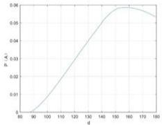

<details>
<summary>line</summary>

| d | P(A) |
|---|---|
| 80 | 0.000 |
| 90 | 0.002 |
| 100 | 0.010 |
| 110 | 0.020 |
| 120 | 0.030 |
| 130 | 0.040 |
| 140 | 0.050 |
| 150 | 0.055 |
| 160 | 0.057 |
| 170 | 0.056 |
| 180 | 0.054 |
</details>

图17 [87.5,180]内 $d$ 的步长为1时命中潜艇的概率与 $d$ 的关系

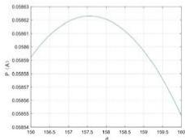

<details>
<summary>line</summary>

| d | P (A) |
|---|---|
| 106.5 | 0.05859 |
| 157 | 0.05862 |
| 157.5 | 0.05863 |
| 158 | 0.05861 |
| 158.5 | 0.05857 |
| 159 | 0.05854 |
| 199.5 | 0.05855 |
| 160 | 0.05854 |
</details>

图18 [156,160]内 $d$ 的步长为0.01时命中潜艇的概率与 $d$ 的关系

# 5.3 问题三模型建立与求解

# 5.3.1 问题三求解思路

单枚深弹命中的概率为 $P(A)$ ，每枚深弹相互独立，可视 $P(A)$ 与问题二情况相似，即问题二的大部分关系可以直接在本问中沿用。本问探究多枚深弹命中至少一枚命中潜艇的方案，使得命中概率最大。先研究9枚炸弹命中范围不重叠的情况，即 $a\geq L + 2R,b\geq W + 2R$ 的情形，由于水平测量误差 $(X,Y)$ 服从正态分布 $N(0,0,\sigma^2,\sigma^2,0)$ ，有问题一可知投弹点水平位置离原点越远，命中概率越小，从而只需考虑 $a = L + 2R,b = W + 2R$ 。又根据问题二的结论，比较小的 $d$ 命中概率较小，只需考虑 $d\geq l + R + \frac{1}{2} H$ 的情形。炸弹编号如图19所示。此时1号炸弹命中潜艇的概率与问题2相同；2号炸弹命中潜艇的概率记为 $P_{2}(A;d)$

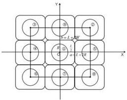

①
②
R = L, s, BW
③
④
⑤
⑥
⑦
⑧
⑨
⑩
⑪
⑫
⑬
X
Y

图19 九枚炸弹命中范围相切的情形及炸弹编号

$$
P _ {2} (A; d) = \left\{ \begin{array}{l} 0, d \leq l - R - \frac {1}{2} H, \\ \underbrace {\int_ {l} ^ {d + R + \frac {1}{2} H} P (A | Z = z ; d) f _ {h _ {n} , \sigma , j} (z) \mathrm{d} z} _ {④}, l - R - \frac {1}{2} H <   d \leq l - R, \\ \underbrace {\int_ {l} ^ {d + \frac {1}{2} H} P (A | Z = z ; d) f _ {h _ {n} , \sigma , j} (z) \mathrm{d} z} _ {②} + \underbrace {\int_ {d + \frac {1}{2} H} ^ {d + R + \frac {1}{2} H} P (A | Z = z ; d) f _ {h _ {n} , \sigma , j} (z) \mathrm{d} z} _ {④}, l - R <   d \leq l + R, \\ \underbrace {\int_ {l} ^ {d + \frac {1}{2} H} P (A | Z = z ; d) f _ {h _ {n} , \sigma , j} (z) \mathrm{d} z} _ {②} + \underbrace {\int_ {d - \frac {1}{2} H} ^ {d + \frac {1}{2} H} P (A | Z = z ; d) f _ {h _ {n} , \sigma , j} (z) \mathrm{d} z} _ {③} \\ + \underbrace {\int_ {d + \frac {1}{2} H} ^ {d + R + \frac {1}{2} H} P (A | Z = z ; d) f _ {h _ {n} , \sigma , j} (z) \mathrm{d} z} _ {④}, l + R <   d \leq l + R + \frac {1}{2} H, \\ \underbrace {\int_ {l} ^ {d - R - \frac {1}{2} H} P (A | Z = z ; d) f _ {h _ {n} , \sigma , j} (z) \mathrm{d} z} _ {①} + \underbrace {\int_ {d - R - \frac {1}{2} H} ^ {d - \frac {1}{2} H} P (A | Z = z ; d) f _ {h _ {n} , \sigma , j} (z) \mathrm{d} z} _ {②} \\ + \underbrace {\int_ {d - \frac {1}{2} H} ^ {d + \frac {1}{2} H} P (A | Z = z ; d) f _ {h _ {n} , \sigma , j} (z) \mathrm{d} z} _ {③} + \underbrace {\int_ {d + \frac {1}{2} H} ^ {d + R + \frac {1}{2} H} P (A | Z = z ; d) f _ {h _ {n} , \sigma , j} (z) \mathrm{d} z} _ {④}, l + R + \frac {1}{2} H <   d, \\ (2 3) \end{array} \right.
$$

式(23)形式与式(22)相同，但是其中①的

$$
P (A \mid Z = z; d) = \int_ {b - \frac {1}{2} W} ^ {b + \frac {1}{2} W} d y \int_ {a - \frac {1}{2} L} ^ {a + \frac {1}{2} L} f (x, y) d x,
$$

②的

$$
\begin{array}{l} P (A \mid Z = z; d) = \int_ {a - \frac {1}{2} L - r} ^ {a - \frac {1}{2} L} d x \int_ {b - \frac {1}{2} W - \sqrt {r ^ {2} - (x + \frac {1}{2}) ^ {2}}} ^ {b + \frac {1}{2} W + \sqrt {r ^ {2} - (x + \frac {1}{2}) ^ {2}}} f (x, y) d y + \int_ {a - \frac {1}{2} L} ^ {a + \frac {1}{2} L} d x \int_ {b - \frac {1}{2} W - r} ^ {b + \frac {1}{2} W + r} f (x, y) d y \\ + \int_ {a + \frac {1}{2} L} ^ {a + \frac {1}{2} L + r} d x \int_ {b - \frac {1}{2} W - \sqrt {r ^ {2} - (x - \frac {1}{2} L) ^ {2}}} ^ {b + \frac {1}{2} W + \sqrt {r ^ {2} - (x - \frac {1}{2} L) ^ {2}}} f (x, y) d y, \\ \end{array}
$$

③的

$$
\begin{array}{l} P (A \mid Z = z; d) = \int_ {a - \frac {1}{2} L - R} ^ {a - \frac {1}{2} L} d x \int_ {b - \frac {1}{2} W - \sqrt {R ^ {2} - (x + \frac {1}{2} L) ^ {2}}} ^ {b + \frac {1}{2} W + \sqrt {R ^ {2} - (x + \frac {1}{2} L) ^ {2}}} f (x, y) d y + \int_ {b - \frac {1}{2} L} ^ {a + \frac {1}{2} L} d x \int_ {b - \frac {1}{2} W - R} ^ {a + \frac {1}{2} W + R} f (x, y) d y \\ + \int_ {a + \frac {1}{2} L} ^ {a + \frac {1}{2} L + R} d x \int_ {b - \frac {1}{2} W - \sqrt {R ^ {2} - (x - \frac {1}{2} L) ^ {2}}} ^ {b + \frac {1}{2} W + \sqrt {R ^ {2} - (x - \frac {1}{2} L) ^ {2}}} f (x, y) d y, \\ \end{array}
$$

④的

$$
\begin{array}{l} P (A \mid Z = z; d) = \int_ {a - \frac {1}{2} L - r} ^ {a - \frac {1}{2} L} d x \int_ {b - \frac {1}{2} W - \sqrt {r ^ {2} - (x + \frac {1}{2} L) ^ {2}}} ^ {b + \frac {1}{2} W + \sqrt {r ^ {2} - (x + \frac {1}{2} L) ^ {2}}} f (x, y) d y + \int_ {a - \frac {1}{2} L} ^ {a + \frac {1}{2} L} d x \int_ {b - \frac {1}{2} W - r} ^ {b + \frac {1}{2} W + r} f (x, y) d y \\ + \int_ {a + \frac {1}{2} L} ^ {a + \frac {1}{2} L + r} d x \int_ {b - \frac {1}{2} W - \sqrt {r ^ {2} - (x - \frac {1}{2} L) ^ {2}}} ^ {b + \frac {1}{2} W + \sqrt {r ^ {2} - (x - \frac {1}{2} L) ^ {2}}} f (x, y) d y. \\ \end{array}
$$

其他炸弹可类似处理。命中潜艇的概率为9个概率总和。

# 5.3.2 问题三模型分析及求解

对于问题中的参数，当 $a = L + 2R, b = W + 2R$ 时，由matlab程序（见附录3）可以求得当 $d = 157.50$ 时潜艇被命中的概率最大，潜艇被命中的最大概率为0.3232.对于其他可能有多枚炸弹命中潜艇的情形有待进一步研究。

# 六、模型的优缺点

(1) 模型考虑范围全面，满足普遍性和适用性。   
(2) 模型证明严谨，理论可靠性强。   
(3) 模型建立基于潜艇瞬时静止假设，缺乏一定实际性  
(4) 模型建立所利用专业数学知识，缺乏一定简易性

# 七、模型的推广

在实际水下反潜方面，可以将本文中反潜深弹的参数替换成其他水下反潜武器(如鱼雷等)的参数，进而提高水下军事导弹命中概率，对我国水下军事发展具有积极作用。

本模型涉及到如何以最优方式部署资源以最大化特定结果的概率，不仅可用于军事领域，还可以推广至医学研究、金融市场等。

# 八、参考文献

[1] 李宗吉, 程善政, 刘洋. 蒙特卡洛模拟法计算航空自导深弹命中概率 [J]. 弹箭与制导学报, 2012, 32(02): 22-24. DOI: 10.15892/j.cnki.djzdxb.2012.02.031.

[2] 李居伟, 谢力波, 刘钧贤. 反潜巡逻机使用航空自导深弹攻潜效能及方法研究 [J]. 数字海洋与水下攻防, 2018, 1(01): 34-37.  
[3] 赵萍萍, 王丽霞. 重积分的一般计算方法 [J]. 高等数学研究, 2022, 25(02): 57-59.  
[4] 孙常存, 袁鹏, 闫雪, 等. 反潜助飞鱼雷命中概率影响因素仿真分析 [J]. 兵工自动化, 2023, 42(10): 40-43+77.

# 附录

# 附录1

# 第一问求解代码：

```txt
sigma = 120; % 标准差，单位：米
L = 100; % 潜艇长度，单位：米
R = 20; % 杀伤半径，单位：米
W = 20; % 潜艇宽度，单位：米 
```

% 定义被积函数

```javascript
f = @(x, y) exp(-(x.^2 + y.^2) / (2 * sigma^2)); 
```

% 计算第一个积分项（左侧部分）

```lisp
I1 = integral2(f, -R-L/2, -L/2, @(x)-W/2-sqrt(R^2 - (x + L/2).^2), @(x)W/2+sqrt(R^2 - (x + L/2).^2));
```

% 计算第二个积分项（中间部分）

```javascript
I2 = integral2(f, -L/2, L/2, -W/2-R, W/2+R); 
```

% 计算第三个积分项（右侧部分）

```javascript
I3 = integral2(f, L/2, R+L/2, @(x)-W/2-sqrt(R^2 - (x - L/2).^2), @(x)W/2+sqrt(R^2 - (x - L/2).^2));
```

% 计算总积分

```javascript
p00 = (1 / (2 * pi * sigma^2)) * (I1 + I2 + I3); 
```

% 显示结果

```javascript
disp(['The probability p(0,0) is: ', num2str(p00)]); 
```

# 附录2.1

```matlab
function [d,I]=x2
sigma = 120; % 标准差
L = 100; % 潜艇长度
R = 20; % 杀伤半径
W = 20; % 潜艇宽度
H = 25; % 高度
sigma_z = 40; % Z 的标准差
ll = 120;
h0 = 150;
f = @(x, y) (1 / (2 * pi * sigma^2)) * exp(-(x.^2 + y.^2) / (2 * sigma^2));
Phi = @(x) normcdf(x, 0, 1);
dm=1/(1 - Phi((ll - h0) / sigma_z));
% 定义函数 g(z) 
```

```matlab
g_z = @(z) (1/sigma_z)*dm * (1 / sqrt(2 * pi) ) * exp(-(z - h0).^2) / (2 * sigma_z^2));
%test=integral(@(z) g_z(z),120,200);
fun = @(x,y,z) f(x,y).*g_z(z);

d = 152.5:1:180;

I1 = arrayfun(@(d) integral3(@(x, y, z) f(x, y) .* g_z(z), -L/2, L/2, -W/2, W/2, ll, d-R-H/2), d);
I2=[];
I3=[];
I4=[];
I5=arrayfun(@(d) integral(@(z) g_z(z), d-H/2, d+H/2), d);
I5=0.083734*I5;
I6=[];
I7=[];
I8==();

for i=1:length(d)
    dx=0.5;
    dy=0.5;
    dz=0.5;
    %%以下计算 I2
    % 初始化黎曼和
    sum=0;
    % 计算黎曼和
    zmin = d(i) - R - 0.5 * H;
    zmax = d(i) - 0.5 * H;
    xmin = @(z) -L/2-sqrt(R^2 - (d(i) - z - H/2).^2);
    xmax = @(z) -L/2;
    ymin = @(x,z) -W/2-sqrt(R^2 - (d(i) - z - H/2).^2-(x+L/2).^2);
    ymax = @(x,z) W/2+sqrt(R^2 - (d(i) - z - H/2).^2-(x+L/2).^2);
    for z = zmin:dz:zmax
    xl=xmin(z);
    xu=xmax(z);
    for x =xl:dx:xu
    yl=ymin(x,z);
    yu=ymax(x,z);
    for y =yl:dy:yu
    sum = sum + fun(x,y,z) * dx * dy * dz;
    end
    end
end

I2=[I2 sum];

%%以下计算 I3
% 初始化黎曼和
sum=0;
% 计算黎曼和
zmin = d(i) - R - 0.5 * H;
zmax = d(i) - 0.5 * H;
xmin = -0.5*L;
xmax = 0.5*;
ymin = @(z) -W/2-sqrt(R^2 - (d(i) - z - H/2).^2);
ymax = @(z) W/2+sqrt(R^2 - (d(i) - z - H/2).^2);
sum= 0;
for z = zmin:dz:zmax
xl=xmin; 
```

```matlab
xu=xmax;
for x = x1:dx:xu
    y1=ymin(z);
    yu=ymax(z);
    for y = y1:dy:yu

    sum = sum + fun(x,y,z) * dx * dy * dz;
    end
end
I3=[I3 sum]; 
```

# %%以下计算 I4

# % 初始化黎曼和

sum=0;

# % 计算黎曼和

```matlab
zmin = d(i) - R - 0.5 * H;
zmax = d(i) - 0.5 * H;
xmin = @(z) L/2;
xmax = @(z) L/2+sqrt(R^2 - (d(i) - z - H/2).^2);
ymin = @(x,z) - W/2-sqrt(R^2 - (d(i) - z - H/2).^2-(x-L/2).^2);
ymax = @(x,z) W/2+sqrt(R^2 - (d(i) - z - H/2).^2-(x-L/2).^2);
sum= 0;
for z = zmin:dz:zmax
xl=xmin(z);
xu=xmax(z);
for x =xl:dx:xu
    yl=ymin(x,z);
    yu=ymax(x,z);
    for y =yl:dy:yu
    sum = sum + fun(x,y,z) * dx * dy * dz;
    end
end
end
I4=[I4 sum]; 
```

# %%以下计算 I6

# % 初始化黎曼和

sum=0;

# % 计算黎曼和

```matlab
zmin = d(i) + 0.5 * H;
zmax = d(i) + R+ 0.5 * H;
xmin = @(z) - L/2-sqrt(R^2 - (d(i) - z + H/2).^2);
xmax = @(z) - L/2;
ymin = @(x,z) - W/2-sqrt(R^2 - (d(i) - z + H/2).^2-(x+L/2).^2);
ymax = @(x,z) W/2-sqrt(R^2 - (d(i) - z + H/2).^2-(x+L/2).^2);
for z = zmin:dz:zmax
xl=xmin(z);
xu=xmax(z);
for x = xl:dx:xu
    yl=ymin(x,z);
    yu=ymax(x,z);
    for y = yl:dy:yu
    sum = sum + fun(x,y,z) * dx * dy * dz;
end 
```

```matlab
end
end
I6=[I6 sum];

%%以下计算 I7
% 初始化黎曼和
sum=0;
% 计算黎曼和
zmin = d(i) + 0.5 * H;
zmax = d(i) +R+ 0.5 * H;
xmin = @(z) -L/2;
xmax = @(z) L/2;
ymin = @(x,z) -W/2-sqrt(R^2 - (d(i) - z + H/2).^2);
ymax = @(x,z) W/2+sqrt(R^2 - (d(i) - z + H/2).^2);
for z = zmin:dz:zmax
xl=xmin(z);
xu=xmax(z);
for x =xl:dx:xu
    yl=ymin(x,z);
    yu=ymax(x,z);
    for y =yl:dy:yu

sum = sum + fun(x,y,z) * dx * dy * dz;
end

end
end
I7=[I7 sum];

%%以下计算 I8
% 初始化黎曼和
sum=0;
% 计算黎曼和
zmin = d(i) + 0.5 * H;
zmax = d(i) +R+ 0.5 * H;
xmin = @(z) L/2;
xmax = @(z) L/2+R;
ymin = @(x,z) -W/2-sqrt(R^2 - (d(i) - z + H/2).^2-(x-L/2).^2);
ymax = @(x,z) W/2+sqrt(R^2 - (d(i) - z + H/2).^2-(x-L/2).^2);
for z = zmin:dz:zmax
xl=xmin(z);
xu=xmax(z);
for x =xl:dx:xu
    yl=ymin(x,z);
    yu=ymax(x,z);
    for y =yl:dy:yu

sum = sum + fun(x,y,z) * dx * dy * dz;
end

end
end
I8=[I8 sum];
end
I=I1+I2+I3+I4+I5+I6+I7+I8;
[peak,i]=max(I);
peak_d=d(i); 
```

附录2.2  
```matlab
function [d,I]=x3
sigma = 120; % 标准差
L = 100; % 潜艇长度
R = 20; % 杀伤半径
W = 20; % 潜艇宽度
H = 25; % 高度
sigma_z = 40; % Z 的标准差
ll = 120;
h0 = 150;

f = @(x, y) (1 / (2 * pi * sigma^2)) * exp(-(x.^2 + y.^2) / (2 * sigma^2));
Phi = @(x) normcdf(x, 0, 1);
dm=1/(1 - Phi((ll - h0) / sigma_z));
% 定义函数 g(z)
g_z = @(z) (1/sigma_z)*dm * (1 / sqrt(2 * pi)) * exp(-(z - h0).^2) / (2 * sigma_z^2));
%test=integral(@(z) g_z(z), 120, 200);
fun = @(x,y,z) f(x,y).*g_z(z);

d = 140:1:152.5;

%I1 = arrayfun(@(d) integral3(@(x, y, z) f(x, y).* g_z(z), -L/2, L/2, -W/2, W/2, ll, d-R-H/2), d);
I2=[];
I3=[];
I4=[];
Is=arrayfun(@(d) integral(@(z) g_z(z), d-H/2,d+H/2), d);
Is=0.083734*IS;
I6=[];
I7=[];
I8=[];
for i=1:length(d)
    dx=0.5;
    dy=0.5;
    dz=0.5;
    %%以下计算 I2
    % 初始化整曼和
    sum=0;
    % 计算整曼和
    zmin = ll;
    zmax = d(i) - 0.5 * H;
    xmin = @(z) -L/2-sqrt(R^2 - (d(i) - z - H/2).^2);
    xmax = @(z) -L/2;
    ymin = @(x,z) -W/2-sqrt(R^2 - (d(i) - z - H/2).^2-(x+L/2).^2);
    ymax = @(x,z) W/2+sqrt(R^2 - (d(i) - z - H/2).^2-(x+L/2).^2);
    for z = zmin:dz::zmax
    xl=xmin(z);
    xu=xmax(z);
    for x =xl:dx:xu
    yl=ymin(x,z);
    yu=ymax(x,z);
    for y =yl:dy:yu
    sum = sum + fun(x,y,z) * dx * dy * dz;
    end 
```

```matlab
end
end
I2=[I2 sum];

%%以下计算 I3
% 初始化黎曼和
sum=0;
% 计算黎曼和
zmin = 11;
zmax = d(i) - 0.5 * H;
xmin = -0.5*L;
xmax = 0.5*L;
ymin = @(z) - W/2-sqrt(R^2 - (d(i) - z - H/2).^2);
ymax = @(z) W/2+sqrt(R^2 - (d(i) - z - H/2).^2);
sum=0;
for z = zmin:dz:zmax
xl=xmin;
xu=xmax;
for x =xl:dx:xu
    yl=ymin(z);
    yu=ymax(z);
    for y =yl:dy:yu

    sum = sum + fun(x,y,z) * dx * dy * dz;
    end
end
end
I3=[I3 sum];

%%以下计算 I4
% 初始化黎曼和
sum=0;
% 计算黎曼和
zmin = 11;
zmax = d(i) - 0.5 * H;
xmin = @(z) L/2;
xmax = @(z) L/2+sqrt(R^2 - (d(i) - z - H/2).^2);
ymin = @(x,z) -W/2-sqrt(R^2 - (d(i) - z - H/2).^2-(x-L/2).^2);
ymax = @(x,z) W/2+sqrt(R^2 - (d(i) - z - H/2).^2-(x-L/2).^2);
sum=0;
for z = zmin:dz:zmax
xl=xmin(z);
xu=xmax(z);
for x =xl:dx:xu
    yl=ymin(x,z);
    yu=ymax(x,z);
    for y =yl:dy:yu

    sum = sum + fun(x,y,z) * dx * dy * dz;
    end
end
end
I4=[I4 sum];

%%以下计算 I6
% 初始化黎曼和
sum=0; 
```

% 计算黎曼和  
```matlab
zmin = d(i) + 0.5 * H;
zmax = d(i) + R+ 0.5 * H;
xmin = @(z) - L/2-sqrt(R^2 - (d(i) - z + H/2).^2);
xmax = @(z) - L/2;
ymin = @(x,z) - W/2-sqrt(R^2 - (d(i) - z + H/2).^2-(x+L/2).^2);
ymax = @(x,z) W/2-sqrt(R^2 - (d(i) - z + H/2).^2-(x+L/2).^2);
for z = zmin:dz:zmax
xl=xmin(z);
xu=xmax(z);
for x = xl:dx:xu
    yl=ymin(x,z);
    yu=ymax(x,z);
    for y = yl:dy:yu

    sum = sum + fun(x,y,z) * dx * dy * dz;
    end
end
end
I6=[I6 sum]; 
```  
%%以下计算 I7

% 初始化黎曼和  
```txt
sum=0; 
```  
% 计算黎曼和

```matlab
zmin = d(i) + 0.5 * H;
zmax = d(i) + R+ 0 * H;
xmin = @(z) - L/2;
xmax = @(z) L/2;
ymin = @(x,z) - W/2-sqrt(R^2 - (d(i) - z + H/2).^2);
ymax = @(x,z) W/2+sqrt(R^2 - (d(i) - z + H/2).^2);
for z = zmin:dz:zmax
xl=xmin(z);
xu=xmax(z);
for x = xl:dx:xu
    yl=ymin(x,z);
    yu=ymax(x,z);
    for y = yl:dy:yu
    sum = sum + fun(x,y,z) * dx * dy * dz;
    end
end
end
I7=[I7 sum]; 
```

%%以下计算 I8  
% 初始化黎曼和  
```txt
sum=0; 
```  
% 计算黎曼和

```matlab
zmin = d(i) + 0.5 * H;
zmax = d(i) + R+ 0.5 * H;
xmin = @(z) L/2;
xmax = @(z) L/2+R;
ymin = @(x,z) -W/2-sqrt(R^2 - (d(i) - z + H/2).^2-(x-L/2).^2);
ymax = @(x,z) W/2+sqrt(R^2 - (d(i) - z + H/2).^2-(x-L/2).^2);
for z = zmin:dz::zmax
    x1=xmin(z);
    xu=xmax(z); 
```

```matlab
for x = x1:dx:xu
    y1 = ymin(x,z);
    yu = sumx(x,z);
    for y = y1:dy:yu
    sum = sum + fun(x,y,z) * dx * dy * dz;
    end
    end
end
I8=[I8 sum];
end
I = I2 + I3 + I4 + I5 + I6 + I7 + I8;
[peak, i] = max(i);
peak_d = d(i); 
```

附录2.3  
```matlab
function [d,I]=x4
sigma = 120; % 标准差
L = 100; % 潜艇长度
R = 20; % 杀伤半径
W = 20; % 潜艇宽度
H = 25; % 高度
sigma_z = 40; % Z 的标准差
ll = 120;
h0 = 150;

f = @(x, y) (1 / (2 * pi * sigma^2)) * exp(-(x.^2 + y.^2) / (2 * sigma^2));
Phi = @(x) normcdf(x, 0, 1);
dm=1/(1 - Phi((ll - h0) / sigma_z));
% 定义函数 g(z)
g_z = @(z) (1/sigma_z)*dm * (1 / sqrt(2 * pi) ) * exp(-(z - h0).^2) / (2 * sigma_z^2));
% test=integral(@(z) g_z(z), 120, 200);
fun = @(x,y,z) f(x,y).*g_z(z);

d = 100:1:140;

%I1 = arrayfun(@(d) integral3(@(x, y, z) f(x, y) .* g_z(z), -L/2, L/2, -W/2, W/2, ll, d-R-H/2), d);
%I2=[];
%I3=[];
%I4=[];
I5=arrayfun(@(d) integral(@(z) g_z(z), ll,d+H/2), d);
I5=0.083734*I5;
I6=[];
I7=[];
I8=[];
for i=1:length(d)
    dx=0.5;
    dy=0.5;
    dz=0.5;
%%以下计算 I6 
```

% 初始化黎曼和  
```matlab
sum=0;
% 计算解曼和
zmin = d(i) + 0.5 * H;
zmax = d(i) + R + 0.5 * H;
xmin = @(z) - L/2-sqrt(R^2 - (d(i) - z + H/2).^2);
xmax = @(z) - L/2;
ymin = @(x,z) - W/2-sqrt(R^2 - (d(i) - z + H/2).^2-(x+L/2).^2);
ymax = @(x,z) W/2+sqrt(R^2 - (d(i) - z + H/2).^2-(x+L/2).^2);
for z = zmin:dz:zmax
xl=xmin(z);
xui=xmax(z);
for x = xl:dx:xu
    yl=ymin(x,z);
    yu=ymax(x,z);
    for y = yl:dy:yu

sum = sum + fun(x,y,z) * dx * dy * dz;
end
end
I6=[I6 sum]; 
```

%%以下计算 I7  
% 初始化黎曼和  
```matlab
sum=0;
% 计算黎曼和
zmin = d(i) + 0.5 * H;
zmax = d(i) + R* 0.5 * H;
xmin = @(z) - L/2;
xmax = @(z) L/2;
ymin = @(x,z) - W/2-sqrt(R^2 - (d(i) - z + H/2).^2);
ymax = @(x,z) W/2+sqrt(R^2 - (d(i) - z + H/2).^2);
for z = zmin:dz:zmax
xl=xmin(z);
xu=xmax(z);
for x = xl:dx:xu
    yl=ymin(x,z);
    yu=ymax(x,z);
    for y = yl:dy:yu
    sum = sum + fun(x,y,z) * dx * dy * dz;
    end
end
end
I7=[I7 sum]; 
```  
%%以下计算18

% 初始化黎曼和  
```matlab
sum=0;
% 计算黎曼和
zmin = d(i) + 0.5 * H;
zmax = d(i) + R+ 0.5 * H;
xmin = @(z) L/2;
xmax = @(z) L/2+R;
ymin = @(x,z) -W/2-sqrt(R^2 - (d(i) - z + H/2).^2-(x-L/2).^2);
ymax = @(x,z) W/2+sqrt(R^2 - (d(i) - z + H/2).^2-(x-L/2).^2);
for z = zmin:dz:zmax 
```

```matlab
xl=xmin(z);
xu=xmax(z);
for x = x1:dx:xu
    y1=ymin(x,z);
    yu=ymax(x,z);
    for y = y1:dy:yu

sum = sum + fun(x,y,z) * dx * dy * dz;
end
end
end
I8=[I8 sum];
end
I=I5+I6+I7+I8;
[peak,i]=max(1);
peak_d=d(1); 
```

附录2.4  
```matlab
function [d,I]=x5
sigma = 120; % 标准差
L = 100; % 潜艇长度
R = 20; % 杀伤半径
W = 20; % 潜艇宽度
H = 25; % 高度
sigma_z = 40; % Z 的标准差
ll = 120;
h0 = 150;
f = @(x, y) (1 / (2 * pi * sigma^2)) * exp(-(x.^2 + y.^2) / (2 * sigma^2));
Phi = @(x) normcdf(x, 0, 1);
dm=1/(1 - Phi((ll - h0) / sigma_z));
% 定义函数 g(z)
g_z = @(z) (1/sigma_z)*dm * (1 / sqrt(2 * pi) ) * exp(-(z - h0).^2) / (2 * sigma_z^2));
%test=integral(@(z) g_z(z),120,200);
fun = @(x,y,z) f(x,y).*g_z(z);
d = 87.5:1:100;
%I1 = arrayfun(@(d) integral3(@(x, y, z) f(x, y) .* g_z(z), -L/2, L/2, -W/2, W/2, ll, d-R-H/2), d);
%I2=[];
%I3=[];
%I4=[];
% I5=arrayfun(@(d) integral(@(z) g_z(z), ll,d+H/2), d);
% I5=0.083734*I5;
I6=[];
I7=[];
I8=[];
for i=1:length(d)
    dx=0.5;
    dy=0.5;
    dz=0.5;
    end 
```

```matlab
%%以下计算 I6
% 初始化黎曼和
sum=0;
% 计算黎曼和
zmin = 11;
zmax = d(i) +R+ 0.5 * H;
xmin = @(z) -l/2-sqrt(R^2 - (d(i) - z + H/2).^2);
xmax = @(z) -l/2;
ymin = @(x,z) -W/2-sqrt(R^2 - (d(i) - z + H/2).^2-(x+L/2).^2);
ymax = @(x,z) W/2+sqrt(R^2 - (d(i) - z + H/2).^2-(x+L/2).^2);
for z = zmin:dz:zmax
xl=xmin(z);
xu=xmax(z);
for x =xl:dx:xu
    yl=ymin(x,z);
    yu=ymax(x,z);
    for y =yl:dy:yu

    sum = sum + fun(x,y,z) * dx * dy * dz;
    end

end

end

I6=[I6 sum];

%%以下计算 I7
% 初始化黎曼和
sum=0;
% 计算黎曼和
zmin = 11;
zmax = d(i) +R+ 0.5 * H;
xmin = @(z) -L/2;
xmax = @(z) L/2;
ymin = @(x,z) -W/2-sqrt(R^2 - (d(i) - z + H/2).^2);
ymax = @(x,z) W/2+sqrt(R^2 - (d(i) - z + H/2).^2);
for z = zmin:dz:zmax
xl=xmin(z);
xu=xmax(z);
for x =xl:dx:xu
    yl=ymin(x,z);
    yu=ymax(x,z);
    for y =yl:dy:yu

    sum = sum + fun(x,y,z) * dx * dy * dz;
    end

end

end

I7=[I7 sum];

%%以下计算 I8
% 初始化黎曼和
sum=0;
% 计算黎曼和
zmin = 11;
zmax = d(i) +R+ 0.5 * H;
xmin = @(z) L/2;
xmax = @(z) L/2+R;
ymin = @(x,z) -W/2-sqrt(R^2 - (d(i) - z + H/2).^2-(x-L/2).^2);
ymax = @(x,z) W/2+sqrt(R^2 - (d(i) - z + H/2).^2-(x-L/2).^2); 
```

```matlab
for z = zmin:dz:zmax
    xl=xmin(z);
    xu=xmax(z);
    for x = xl:dx:xu
    yl=ymin(x,z);
    yu=ymax(x,z);
    for y = yl:dy:yu

    sum = sum + fun(x,y,z) * dx * dy * dz;
    end
    end
    end
    I8=[I8 sum];
end
I=I6+I7+I8;
[peak,i]=max(I);
peak_d=d(i); 
```

附录2.5  
```matlab
function [d,I,peak,peak_d]=x6
sigma = 120; % 标准差
L = 100; % 潜艇长度
R = 20; % 杀伤半径
W = 20; % 潜艇宽度
H = 25; % 高度
sigma_z = 40; % Z 的标准差
ll = 120;
h0 = 150;
f = @(x, y) (1 / (2 * pi * sigma^2)) * exp(-(x.^2 + y.^2) / (2 * sigma^2));
Phi = @(x) normcdf(x, 0, 1);
dm=1/(1 - Phi((ll - h0) / sigma_z));
% 定义函数 g(z)
g_z = @(z) (1/sigma_z)*dm * (1 / sqrt(2 * pi)) * exp(-(z - h0).^2) / (2 * sigma_z^2));
%test=integral(@(z) g_z(z),120,200);
fun = @(x,y,z) f(x,y).*g_z(z);
d = 156:0.01:160;
I1 = arrayfun(@(d) integral3(@(x, y, z) f(x, y). * g_z(z), -L/2, L/2, -W/2, W/2, ll, d-R-H/2), d);
I2=[];
I3=[];
I4=[];
I5=arrayfun(@(d) integral(@(z) g_z(z), d-H/2,d+H/2), d);
I5=0.083734*I5;
I6=[];
I7=[];
I8=[];
for i=1:length(d)
    dx=0.5; 
```

```matlab
dy=0.5;
dz=0.5;
%%以下计算 I2
% 初始化黎曼和
sum=0;
% 计算黎曼和
zmin = d(i) - R - 0.5 * H;
zmax = d(i) - 0.5 * H;
xmin = @(z) - L/2-sqrt(R^2 - (d(i) - z - H/2).^2);
xmax = @(z) - L/2;
ymin = @(x,z) - W/2-sqrt(R^2 - (d(i) - z - H/2).^2-(x+L/2).^2);
ymax = @(x,z) W/2-sqrt(R^2 - (d(i) - z - H/2).^2-(x+L/2).^2);
for z = zmin:dz:zmax
xl=xmin(z);
xu=xmax(z);
for x =xl:dx:xu
    yl=ymin(x,z);
    yu=ymax(x,z);
    for y =yl:dy:yu
    sum = sum + fun(x,y,z) * dx * dy * dz;
    end
end
end
I2=[I2 sum];

%%以下计算 I3
% 初始化黎曼和
sum=0;
% 计算黎曼和
zmin = d(i) - R - 0.5 * H;
zmax = d(i) - 0.5 * H;
xmin = -0.5*L;
xmax = 0.5*L;
ymin = @(z) - W/2-sqrt(R^2 - (d(i) - z - H/2).^2);
ymax = @(z) W/2-sqrt(R^2 - (d(i) - z - H/2).^2);
sum=0;
for z = zmin:dz:zmax
xl=xmin;
xu=xmax;
for x =xl:dx:xu
    yl=ymin(z);
    yu=ymax(z);
    for y =yl:dy:yu

sum = sum + fun(x,y,z) * dx * dy * dz;
end
end
end
I3=[I3 sum];

%%以下计算 I4
% 初始化黎曼和
sum=0;
% 计算黎曼和
zmin = d(i) - R - 0.5 * H;
zmax = d(i) - 0.5 * H;
xmin = @(z) L/2; 
```

```matlab
xmax = @(z) L/2+sqrt(R^2 - (d(i) - z - H/2).^2);
ymin = @(x,z) - W/2-sqrt(R^2 - (d(i) - z - H/2).^2-(x-L/2).^2);
ymax = @(x,z) W/2+sqrt(R^2 - (d(i) - z - H/2).^2-(x-L/2).^2);
sum= 0;
for z = zmin:dz: zmax
    xl=xmin(z);
    xu=xmax(z);
    for x = xl:dx:xu
    yl=ymin(x,z);
    yu=ymax(x,z);
    for y = yl:dy:yu

    sum = sum + fun(x,y,z) * dx * dy * dz;
    end
end
end
I4=[I4 sum]; 
```

# %%以下计算 I6

# % 初始化黎曼和

sum=0;

# % 计算黎曼和

```matlab
min = d(i) + 0.5 * H;
zmax = d(i) + R+ 0.5 * H;
min = @(z) -L/2-sqrt(R^2 - (d(i) - z + H/2).^2);
xmax = @(z) -L/2;
ymin = @(x,z) -W/2-sqrt(R^2 - (d(i) - z + H/2).^2-(x+L/2).^2);
ymax = @(x,z) W/2+sqrt(R^2 - (d(i) - z + H/2).^2-(x+L/2).^2);
for z = zmin:dz::zmax
xl=xmin(z);
xu=xmax(z);
for x = xl:dx:xu
    yl=ymin(x,z);
    yu=ymax(x,z);
    for y = yl:dy:yu

sum = sum + fun(x,y,z) * dx * dy * dz;
end
end
16=[16 sum]; 
```

# %%以下计算 I7

# % 初始化黎曼和

sum=0;

# % 计算黎曼和

```matlab
zmin = d(i) + 0.5 * H;
zmax = d(i) + R+ 0.5 * H;
xmin = @(z) - L/2;
xmax = @(z) L/2;
ymin = @(x,z) - W/2-sqrt(R^2 - (d(i) - z + H/2).^2);
ymax = @(x,z) W/2+sqrt(R^2 - (d(i) - z + H/2).^2);
for z = zmin:dz:zmax
xl=xmin(z);
xu=xmax(z);
for x = xl:dx:xu
    yl=ymin(x,z);
    yu=ymax(x,z); 
```

```matlab
for y =yl:dy:yu
    sum = sum + fun(x,y,z) * dx * dy * dz;
    end
end
end
I7=[I7 sum];

%%以下计算 I8
% 初始化解曼和
sum=0;
% 计算黎曼和
zmin = d(i) + 0.5 * H;
zmax = d(i) + R + 0.5 * H;
xmin = @(z) L/2;
xmax = @(z) L/2+R;
ymin = @(x,z) -W/2-sqrt(R^2 - (d(i) - z + H/2).^2-(x-L/2).^2);
ymax = @(x,z) W/2+sqrt(R^2 - (d(i) - z + H/2).^2-(x-L/2).^2);
for z = zmin:dz:zmax
xl=xmin(z);
xu=xmax(z);
for x =xl:dx:xu
yl=ymin(x,z);
yu=ymax(x,z);
for y =yl:dy:yu

    sum = sum + fun(x,y,z) * dx * dy * dz;
    end
end
end
I8=[I8 sum];
end
I=I1+I2+I3+I4+I5+I6+I7+I8;
[peak,i]=max(I);
peak_d=d(i); 
```

```matlab
附录3
第三问求解代码：
function [d,I,peak,peak_d]=x7
sigma = 120; % 标准差
L = 100; % 潜艇长度
R = 20; % 杀伤半径
W = 20; % 潜艇宽度
H = 25; % 高度
sigma_z = 40; % Z 的标准差
ll = 120;
h0 = 150;
a=L+2*R;
b=w+2*R;
f = @(x, y) (1 / (2 * pi * sigma^2)) * exp(-(x.^2 + y.^2) / (2 * sigma^2)); 
```

```matlab
Phi = @(x) normcdf(x, 0, 1);
dm=1/(1 - Phi((ll - h0) / sigma_z));
% 定义函数 g(z)
g_z = @(z) (1/sigma_z)*dm * (1 / sqrt(2 * pi)) * exp(-((z - h0).^2) / (2 * sigma_z^2));
%test=integral(@(z) g_z(z),120,200);
fun = @(x,y,z) f(x,y).*g_z(z);

d = 152.5:1:165;

I11 = arrayfun(@(d) integral3(@(x, y, z) f(x, y).* g_z(z), -L/2, L/2, -W/2, W/2, ll, d-R-H/2), d);
I12 = arrayfun(@(d) integral3(@(x, y, z) f(x, y).* g_z(z), a-L/2, a+L/2, b-W/2, b+W/2, ll, d-R-H/2), d);
I13 = arrayfun(@(d) integral3(@(x, y, z) f(x, y).* g_z(z), -L/2, +L/2, b-W/2, b+W/2, ll, d-R-H/2), d);
I14 = arrayfun(@(d) integral3(@(x, y, z) f(x, y).* g_z(z), a-L/2, a+L/2, -W/2, +W/2, ll, d-R-H/2), d);
I1=I11+I12+I13+I14;

I21=[];
I22=[];
I23=[];
I24=[];
I31=[];
I32=[];
I33=[];
I34=[];
I41=[];
I42=[];
I43=[];
I44=[];
I511=[];
I512=[];
I513=[];
I514=[];
I521=[];
I522=[];
I523=[];
I524=[];
I531=[];
I532=[];
I533=[];
I534=[];
I61=[];
I62=[];
I63=[];
I64=[];
I71=[];
I72=[];
I73=[];
I74=[];
I81=[];
I82=[];
I83=[];
I84=[]; 
```

```matlab
for i=1:length(d)
    dx=1;
    dy=1;
    dz=1;
    %%以下计算 I21
    % 初始化黎曼和
    sum=0;
    % 计算黎曼和
    zmin = d(i) - R - 0.5 * H;
    zmax = d(i) - 0.5 * H;
    xmin = @(z) - L/2-sqrt(R^2 - (d(i) - z - H/2).^2);
    xmax = @(z) - L/2;
    ymin = @(x,z) - W/2-sqrt(R^2 - (d(i) - z - H/2).^2-(x+L/2).^2);
    ymax = @(x,z) W/2-sqrt(R^2 - (d(i) - z - H/2).^2-(x+L/2).^2);
    for z = zmin:dz:zmax
    xl=xmin(z);
    xu=xmax(z);
    for x =xl:dx:xu
    yl=ymin(x,z);
    yu=ymax(x,z);
    for y =yl:dy:yu
    sum = sum + fun(x,y,z) * dx * dy * dz;
    end
    end
end
I21=[I21 sum];

%%以下计算 I22
% 初始化黎曼和
sum=0;
% 计算黎曼和
zmin = d(i) - R - 0.5 * H;
zmax = d(i) - 0.5 * H;
xmin = @(z) a-L/2-sqrt(R^2 - (d(i) - z - H/2).^2);
xmax = @(z) a-L/2;
ymin = @(x,z) b-W/2-sqrt(R^2 - (d(i) - z - H/2).^2-(x+L/2).^2);
ymax = @(x,z) b-W/2-sqrt(R^2 - (d(i) - z - H/2).^2-(x+L/2).^2);
for z = zmin:dz:zmax
xl=xmin(z);
xu=xmax(z);
for x =xl:dx:xu
    yl=ymin(x,z);
    yu=ymax(x,z);
    for y =yl:dy:yu
    sum = sum + fun(x,y,z) * dx * dy * dz;
    end
end
end
I22=[I22 sum]; 
```

# %%以下计算 I23

% 初始化黎曼和

sum=0;

% 计算黎曼和

```matlab
zmin = d(i) - R - 0.5 * H;
zmax = d(i) - 0.5 * H;
xmin = @(z) - L/2 - sqrt(R^2 - (d(i) - z - H/2).^2); 
```

```matlab
xmax = @(x) -L/2;
ymin = @(x,z) b-W/2-sqrt(R^2 - (d(i) - z - H/2).^2-(x+L/2).^2);
ymax = @(x,z) b+W/2-sqrt(R^2 - (d(i) - z - H/2).^2-(x+L/2).^2);
for z = xmin:dz:zmax
xl=xmin(z);
xu=xmax(z);
for x =xl:dx:xu
    yl=ymin(x,z);
    yu=ymax(x,z);
    for y =yl:dy:yu
    sum = sum + fun(x,y,z) * dx * dy * dz;
    end
end
end
I23=[I23 sum]; 
```

# %%以下计算 I24

# % 初始化黎曼和

sum=0;

# % 计算黎曼和

```matlab
zmin = d(i) - R - 0.5 * H;
zmax = d(i) - 0.5 * H;
xmin = @(z) a-L/2-sqrt(R^2 - (d(i) - z - H/2).^2);
xmax = @(z) a-L/2;
ymin = @(x,z) -W/2-sqrt(R^2 - (d(i) - z - H/2).^2-(x+L/2).^2);
ymax = @(x,z) +W/2+sqrt(R^2 - (d(i) - z - H/2).^2-(x+L/2).^2);
for z = zmin:dz:zmax
xl=xmin(z);
xu=xmax(z);
for x = xl:dx:xu
    yl=ymin(x,z);
    yu=ymax(x,z);
    for y = yl:dy:yu
    sum = sum + fun(x,y,z) * dx * dy * dz;
    end
end
end
I24=[I24 sum]; 
```

# %%以下计算 I31

# % 初始化黎曼和

sum=0;

# % 计算黎曼和

```matlab
zmin = d(i) - R - 0.5 * H;
zmax = d(i) - 0.5 * H;
xmin = -0.5*L;
xmax = 0.5*L;
ymin = @(z) - W/2-sqrt(R^2 - (d(i) - z - H/2).^2);
ymax = @(z) W/2-sqrt(R^2 - (d(i) - z - H/2).^2);
sum= 0;
for z = zmin:dz:zmax
    xl=xmin;
    xu=xmax;
    for x = xl:dx:xu
    y1=ymin(z);
    yu=ymax(z); 
```

```matlab
for y =yl:dy:yu
    sum = sum + fun(x,y,z) * dx * dy * dz;
    end
end
end
I31=[I31 sum];

%%以下计算 I32
% 初始化黎曼和
sum=0;
% 计算黎曼和
zmin = d(i) - R - 0.5 * H;
zmax = d(i) - 0.5 * H;
xmin = a -0.5*L;
xmax = a+0.5*L;
ymin = @(z) b-W/2-sqrt(R^2 - (d(i) - z - H/2).^2);
ymax = @(z) b+W/2-sqrt(R^2 - (d(i) - z - H/2).^2);
sum=0;
for z = zmin:dz:zmax
xl=xmin;
xu=xmax;
for x =xl:dx:xu
yl=ymin(z);
yu=ymax(z);
for y =yl:dy:yu

sum = sum + fun(x,y,z) * dx * dy * dz;
end
end
end
I32=[I32 sum];

%%以下计算 I33
% 初始化黎曼和
sum=0;
% 计算黎曼和
zmin = d(i) - R - 0.5 * H;
zmax = d(i) - 0.5 * H;
xmin = -0.5*L;
xmax = 0.5*L;
ymin = @(z) b-W/2-sqrt(R^2 - (d(i) - z - H/2).^2);
ymax = @(z) b+W/2-sqrt(R^2 - (d(i) - z - H/2).^2);
sum=0;
for z = zmin:dz:zmax
xl=xmin;
xu=xmax;
for x =xl:dx:xu
yl=ymin(z); 
yu=ymax(z);
for y =yl:dy:yu

sum = sum + fun(x,y,z) * dx * dy * dz;
end
end
end
I33=[I33 sum];
%%以下计算 I34 
```

```matlab
% 初始化黎曼和
sum=0;
% 计算黎曼和
zmin = d(i) - R - 0.5 * H;
zmax = d(i) - 0.5 * H;
xmin = a -0.5*L;
xmax = a+0.5*L;
ymin = @(z) -W/2-sqrt(R^2 - (d(i) - z - H/2).^2);
ymax = @(z) +W/2+sqrt(R^2 - (d(i) - z - H/2).^2);
sum= 0;
for z = zmin:d2:zmax
xl=xmin;
xu=xmax;
for x =xl:dx:xu
    yl=ymin(z);
    yu=ymax(z);
    for y =yl:dy:yu

sum = sum + fun(x,y,z) * dx * dy * dz;
end

end

end

I34=[I34 sum];
%%以下计算 I41
% 初始化黎曼和
sum=0;
% 计算黎曼和
zmin = d(i) - R - 0.5 * H;
zmax = d(i) - 0.5 * H;
xmin = @(z) L/2;
xmax = @(z) L/2+sqrt(R^2 - (d(i) - z - H/2).^2);
ymin = @(x,z) -W/2-sqrt(R^2 - (d(i) - z - H/2).^2-(x-L/2).^2);
ymax = @(x,z) W/2+sqrt(R^2 - (d(i) - z - H/2).^2-(x-L/2).^2);
sum= 0;
for z = zmin:d2:zmax
xl=xmin(z);
xu=xmax(z);
for x =xl:dx:xu
    yl=ymin(x,z);
    yu=ymax(x,z);
    for y =yl:dy:yu

sum = sum + fun(x,y,z) * dx * dy * dz;
end

end

end

I41=[I41 sum];
%%以下计算 I42
% 初始化黎曼和
sum=0;
% 计算黎曼和
zmin = d(i) - R - 0.5 * H;
zmax = d(i) - 0.5 * H;
xmin = @(z) a+L/2;
xmax = @(z) a+L/2+sqrt(R^2 - (d(i) - z - H/2).^2);
ymin = @(x,z) b-W/2-sqrt(R^2 - (d(i) - z - H/2).^2-(x-L/2).^2);
ymax = @(x,z) b+W/2+sqrt(R^2 - (d(i) - z - H/2).^2-(x-L/2).^2);
sum= 0; 
```

```matlab
for z = zmin:dz:zmax
    xl=xmin(z);
    xu=xmax(z);
    for x =xl:dx:xu
    yl=ymin(x,z);
    yu=ymax(x,z);
    for y =yl:dy:yu

    sum = sum + fun(x,y,z) * dx * dy * dz;
    end
end
end
I42=[I42 sum];

    %%以下计算 I43
% 初始化黎曼和
sum=0;
% 计算黎曼和
zmin = d(i) - R - 0.5 * H;
zmax = d(i) - 0.5 * H;
xmin = @(z) L/2;
xmax = @(z) L/2+sqrt(R^2 - (d(i) - z - H/2).^2);
ymin = @(x,z) b - W/2-sqrt(R^2 - (d(i) - z - H/2).^2-(x-L/2).^2);
ymax = @(x,z) b+ W/2+sqrt(R^2 - (d(i) - z - H/2).^2-(x-L/2).^2);
sum=0;
for z = zmin:dz:zmax
xl=xmin(z);
xu=xmax(z);
for x =xl:dx:xu
    yl=ymin(x,z);
    yu=ymax(x,z);
    for y =yl:dy:yu

    sum = sum + fun(x,y,z) * dx * dy * dz;
    end
end
end
I43=[I43 sum];
%%以下计算 I44
% 初始化黎曼和
sum=0;
% 计算黎曼和
zmin = d(i) - R - 0.5 * H;
zmax = d(i) - 0.5 * H;
xmin = @(z) a+L/2;
xmax = @(z) a+L/2+sqrt(R^2 - (d(i) - z - H/2).^2);
ymin = @(x,z) -W/2-sqrt(R^2 - (d(i) - z - H/2).^2-(x-L/2).^2);
ymax = @(x,z) W/2+sqrt(R^2 - (d(i) - z - H/2).^2-(x-L/2).^2);
sum=0;
for z = zmin:dz:zmax
xl=xmin(z);
xu=xmax(z);
for x =xl:dx:xu
    yl=ymin(x,z);
    yu=ymax(x,z);
    for y =yl:dy:yu

    sum = sum + fun(x,y,z)*dx*dy*dz; 
```

```matlab
end
end
end
I44=[I44 sum];

%%以下计算 I511
% 初始化整量和
sum=0;
% 计算整量和
zmin = d(i) - 0.5 * H;
zmax = d(i) + 0.5 * H;
xmin = -L/2-R;
xmax = -L/2;
ymin = @(x) -W/2-sqrt(R^2 -(x-L/2).^2);
ymax = @(x) W/2+sqrt(R^2 - (x-L/2).^2);
sum= 0;
for z = zmin:d2:zmax
xl=xmin;
xu=xmax;
for x =xl:dx:xu
    yl=ymin(x);
    yu=ymax(x);
    for y =yl:dy:yu
    sum = sum + fun(x,y,z) * dx * dy * dz;
    end
end
end
I511=[I511 sum];

%%以下计算 I512
% 初始化整量和
sum=0;
% 计算整量和
zmin = d(i) - 0.5 * H;
zmax = d(i) + 0.5 * H;
xmin = a -L/2-R;
xmax = a-L/2;
ymin = @(x) b-W/2-sqrt(R^2 -(x-L/2).^2);
ymax = @(x) b+W/2+sqrt(R^2 - (x-L/2).^2);
sum= 0;
for z = zmin:d2:zmax
xl=xmin;
xu=xmax;
for x =xl:dx:xu
    yl=ymin(x);
    yu=ymax(x);
    for y =yl:dy:yu
    sum = sum + fun(x,y,z) * dx * dy * dz;
    end
end
end
IS12=[I512 sum];
%%以下计算 I513
% 初始化整量和
sum=0;
% 计算整量和
zmin = d(i) - 0.5 * H;
zmax = d(i) + 0.5 * H; 
```

```matlab
xmin = -L/2-R;
xmax = -L/2;
ymin = @(x) b+w/2-sqrt(R^2 -(x-L/2).^2);
ymax = @(x) b+w/2+sqrt(R^2 -(x-L/2).^2);
sum=0;
for z = zmin:dz:zmax
xl=xmin;
xu=xmax;
for x =xl:dx:xu
    yl=ymin(x);
    yu=ymax(x);
    for y =yl:dy:yu
    sum = sum + fun(x,y,z) * dx * dy * dz;
    end
end
end
I513=[I513 sum];

%%以下计算 I514
% 初始化黎曼和
sum=0;
% 计算黎曼和
zmin = d(i) - 0.5 * H;
zmax = d(i) + 0.5 * H;
xmin = a -L/2-R;
xmax = a -L/2;
ymin = @(x) -W/2-sqrt(R^2 -(x-L/2).^2);
ymax = @(x) W/2+sqrt(R^2 -(x-L/2).^2);
sum=0;
for z = zmin:dz:zmax
xl=xmin;
xu=xmax;
for x =xl:dx:xu
    yl=ymin(x);
    yu=ymax(x);
    for y =yl:dy:yu
    sum = sum + fun(x,y,z) * dx * dy * dz;
    end
end
end
I514=[I514 sum]; 
```

# %%以下计算 I521

% 初始化黎曼和

sum=0;

% 计算黎曼和

```matlab
zmin = d(i) - 0.5 * H;
zmax = d(i) + 0.5 * H;
xmin = -L/2;
xmax = L/2;
ymin = -W/2-R;
ymax = W/2+R;
sum = 0;
or z = zmin:dz:zmax
xl=xmin;
xu=xmax;
for x = xl:dx:xu
    yl=ymin; 
```

```matlab
yu=ymax;
for y =yl:dy:yu
sum = sum + fun(x,y,z) * dx * dy * dz;
end

end

end

IS21=[IS21 sum];
%%%以下计算 IS22
% 初始化黎曼和
sum=0;
% 计算黎曼和
zmin = d(i) - 0.5 * H;
zmax = d(i) + 0.5 * H;
xmin = a-L/2;
xmax = a+L/2;
ymin = b-W/2-R;
ymax = b+W/2*R;
sum=0;
for z = zmin:dz:zmax
xl=xmin;
xu=xmax;
for x =xl:dx:xu
    yl=ymin;
    yu=ymax;
    for y =yl:dy:yu
    sum = sum + fun(x,y,z) * dx * dy * dz;
    end
end

end

IS22=[IS22 sum];

%%以下计算 IS23
% 初始化黎曼和
sum=0;
% 计算黎曼和
zmin = d(i) - 0.5 * H;
zmax = d(i) + 0.5 * H;
xmin = -L/2;
xmax = L/2;
ymin = b-W/2-R;
ymax = b+W/2*R;
sum=0;
for z = zmin:dz:zmax
xl=xmin;
xu=xmax;
for x =xl:dx:xu
    yl=ymin;
    yu=ymax;
    for y =yl:dy:yu
    sum = sum + fun(x,y,z) * dx * dy * dz;
    end
end

end

Is23=[IS23 sum];
%%%以下计算 IS224
% 初始化黎曼和
sum=0;
% 计算黎曼和 
```

```matlab
zmin = d(i) - 0.5 * H;
zmax = d(i) + 0.5 * H;
xmin = a-L/2;
xmax = a+L/2;
ymin = -W/2-R;
ymax = W/2+R;
sum= 0;
for z = zmin:dz:zmax
    xl=xmin;
    xu=xmax;
    for x =x1:dx:xu
    y1=ymin;
    yu=ymax;
    for y =yl:dy:yu
    sum = sum + fun(x,y,z) * dx * dy * dz;
    end
end
end
I524=[I524 sum];
%%以下计算 I531
% 初始化黎曼和
sum=0;
% 计算黎曼和
zmin = d(i) - 0.5 * H;
zmax = d(i) + 0.5 * H;
xmin = L/2;
xmax = L/2+R;
ymin = @(x) -W/2-sqrt(R^2 - (x-L/2).^2);
ymax = @(x) W/2+sqrt(R^2 - (x-L/2).^2);
sum= 0;
for z = zmin:dz:zmax
xl=xmin;
xu=xmax;
for x =x1:dx:xu
    y1=ymin(x);
    yu=ymax(x);
    for y =yl:dy:yu
    sum = sum + fun(x,y,z) * dx * dy * dz;
    end
end
end
I531=[I531 sum]; 
```

# %%以下计算 I532

% 初始化黎曼和

sum=0;

% 计算黎曼和

```matlab
zmin = d(i) - 0.5 * H;
zmax = d(i) + 0.5 * H;
xmin = a+L/2;
xmax = a+L/2+R;
ymin = @(x) b-W/2-sqrt(R^2 - (x-L/2).^2);
ymax = @(x) b+W/2+sqrt(R^2 - (x-L/2).^2);
sum= 0;
for z = zmin:dz:zmax
    xl=xmin;
    xu=xmax;
for x =xl:dz:xu 
```

```matlab
yl=ymin(x);
yu=ymax(x);
for y =yl:dy:yu
    sum = sum + fun(x,y,z) * dx * dy * dz;
    end
end
end
I532=[I532 sum];

%%以下计算 I533
% 初始化整量和
sum=0;
% 计算整量和
zmin = d(i) - 0.5 * H;
zmax = d(i) + 0.5 * H;
xmin = L/2;
xmax = L/2+R;
ymin = @(x) b-W/2-sqrt(R^2 - (x-L/2).^2);
ymax = @(x) b-W/2-sqrt(R^2 - (x-L/2).^2);
sum=0;
for z = zmin:dz:zmax
xl=xmin;
xu=xmax;
for x =xl:dx:xu
    y=ymin(x);
    yu=ymax(x);
    for y =yl:dy:yu
    sum = sum + fun(x,y,z) * dx * dy * dz;
    end
end
end
I533=[I533 sum]; 
```

```matlab
%%以下计算 I534
% 初始化整和
sum=0;
% 计算整和
zmin = d(i) - 0.5 * H;
zmax = d(i) + 0.5 * H;
xmin = a+L/2;
xmax = a+L/2+R;
ymin = @(x) - W/2-sqrt(R^2 - (x-L/2).^2);
ymax = @(x) W/2-sqrt(R^2 - (x-L/2).^2);
sum= 0;
for z = zmin:dz:zmax
xl=xmin;
xu=xmax;
for x =xl:dx:xu
    yl=ymin(x);
    yu=ymax(x);
    for y =yl:dy:yu
    sum = sum + fun(x,y,z) * dx * dy * dz;
    end
end
end
I534=[I534 sum];
%%以下计算 I61
% 初始化整和 
```

```matlab
sum=0;
% 计算黎曼和
zmin = d(i) + 0.5 * H;
zmax = d(i) + R+ 0.5 * H;
xmin = @(z) - L/2-sqrt(R^2 - (d(i) - z + H/2).^2);
xmax = @(z) - L/2;
ymin = @(x,z) - W/2-sqrt(R^2 - (d(i) - z + H/2).^2-(x+L/2).^2);
ymax = @(x,z) W/2+sqrt(R^2 - (d(i) - z + H/2).^2-(x+L/2).^2);
for z = zmin:dz:zmax
xl=xmin(z);
xu=xmax(z);
for x = xl:dx:xu
    yl=ymin(x,z);
    yu=ymax(x,z);
    for y = yl:dy:yu

    sum = sum + fun(x,y,z) * dx * dy * dz;
    end
end
I61=[I61 sum]; 
```

# %%以下计算 I62

% 初始化黎曼和

```txt
sum=0; 
```

% 计算黎曼和

```matlab
zmin = d(i) + 0.5 * H;
zmax = d(i) + R+ 0.5 * H;
xmin = @(z) a-l/2-sqrt(R^2 - (d(i) - z + H/2).^2);
xmax = @(z) a-l/2;
ymin = @(x,z) b-W/2-sqrt(R^2 - (d(i) - z + H/2).^2-(x+l/2).^2);
ymax = @(z, z) b+W/2-sqrt(R^2 - (d(i) - z + H/2).^2-(x+l/2).^2);
for z = zmin:dz:zmax
xl=xmin(z);
xu=xmax(z);
for x = xl:dx:xu
    yl=ymin(x,z);
    yu=ymax(x,z);
    for y = yl:dy:yu

sum = sum + fun(x,y,z) * dx * dy * dz;
end
end
I62=[I62 sum]; 
```

# %%以下计算 I63

% 初始化黎曼和

```txt
sum=0; 
```

% 计算黎曼和

```txt
zmin = d(i) + 0.5 * H;
zmax = d(i) + R+ 0.5 * H;
xmin = @(z) -L/2-sqrt(R^2 - (d(i) - z + H/2).^2);
xmax = @(z) -L/2;
ymin = @(x,z) b-W/2-sqrt(R^2 - (d(i) - z + H/2).^2-(x+L/2).^2);
ymax = @(x,z) b+W/2+sqrt(R^2 - (d(i) - z + H/2).^2-(x+L/2).^2);
for z = zmin:dz: zmax
xl=xmin(z); 
```

```matlab
xu=xmax(z);
for x =xl:dx:xu
    yl=ymin(x,z);
    yu=ymax(x,z);
    for y =yl:dy:yu

sum = sum + fun(x,y,z) * dx * dy * dz;
end

end

end

I63=[I63 sum];
%%以下计算 I64

% 初始化整量和
sum=0;
% 计算整量和
zmin = d(i) + 0.5 * H;
zmax = d(i) +R+ 0.5 * H;
xmin = @(z) a-L/2-sqrt(R^2 - (d(i) - z + H/2).^2);
xmax = @(z) a-L/2;
ymin = @(x,z) -W/2-sqrt(R^2 - (d(i) - z + H/2).^2-(x+L/2).^2);
ymax = @(x,z) W/2+sqrt(R^2 - (d(i) - z + H/2).^2-(x+L/2).^2);
for z = zmin:dz:zmax
xl=xmin(z);
xu=xmax(z);
for x =xl:dx:xu
    yl=ymin(x,z);
    yu=ymax(x,z);
    for y =yl:dy:yu

sum = sum + fun(x,y,z) * dx * dy * dz;
end

end

end

I64=[I64 sum];

%%以下计算 I71
% 初始化整量和
sum=0;
% 计算整量和
zmin = d(i) + 0.5 * H;
zmax = d(i) +R+ 0.5 * H;
xmin = @(z) -L/2;
xmax = @(z) L/2;
ymin = @(x,z) -W/2-sqrt(R^2 - (d(i) - z + H/2).^2);
ymax = @(x,z) W/2+sqrt(R^2 - (d(i) - z + H/2).^2);
for z = zmin:dz:zmax
xl=xmin(z);
xu=xmax(z);
for x =xl:dx:xu
    yl=ymin(x,z);
    yu=ymax(x,z);
    for y =yl:dy:yu

sum = sum + fun(x,y,z) * dx * dy * dz;
end

end

end

I71=[I71 sum]; 
```

%%以下计算 I72  
```matlab
% 初始化黎曼和
sum=0;
% 计算黎曼和
zmin = d(i) + 0.5 * H;
zmax = d(i) + R+ 0.5 * H;
xmin = @(z) a-L/2;
xmax = @(z) a+L/2;
ymin = @(x,z) b-W/2-sqrt(R^2 - (d(i) - z + H/2).^2);
ymax = @(x,z) b+W/2-sqrt(R^2 - (d(i) - z + H/2).^2);
for z = zmin:dz:zmax
xl=xmin(z);
xu=xmax(z);
for x = xl:dx: xu
    yl=ymin(x,z);
    yu=ymax(x,z);
    for y = yl:dy:yu

sum = sum + fun(x,y,z) * dx * dy * dz;
end

end

end

I72=[I72 sum];
%%以下计算 I73

% 初始化黎曼和
sum=0;
% 计算黎曼和
zmin = d(i) + 0.5 * H;
zmax = d(i) + R+ 0.5 * H;
xmin = @(z) - L/2;
xmax = @(z) L/2;
ymin = @(x,z) b-W/2-sqrt(R^2 - (d(i) - z + H/2).^2);
ymax = @(x,z) b+W/2-sqrt(R^2 - (d(i) - z + H/2).^2);
for z = zmin:dz: zmax
xl=xmin(z);
xu=xmax(z);
for x = xl:dx:xu
    yl=ymin(x,z);
    yu=ymax(x,z);
    for y = yl:dy:yu

sum = sum + fun(x,y,z) * dx * dy * dz;
end

end

end

I73=[I73 sum];
%%以下计算 I74

% 初始化黎曼和
sum=0;
% 计算黎曼和
zmin = d(i) + 0.5 * H;
zmax = d(i) + R+ 0.5 * H;
xmin = @(z) a-L/2;
xmax = @(z) a+L/2;
ymin = @(x,z) - W/2-sqrt(R^2 - (d(i) - z + H/2).^2);
ymax = @(x,z) W/2-sqrt(R^2 - (d(i) - z + H/2).^2);
for z = zmin:dz: zmax
xl=xmin(z); 
```

```matlab
xu=xmax(z);
for x =xl:dx:xu
    yl=ymin(x,z);
    yu=ymax(x,z);
    for y =yl:dy:yu

    sum = sum + fun(x,y,z) * dx * dy * dz;
    end
end
end
I74=[I74 sum];
%%以下计算 I81
% 初始化黎曼和
sum=0;
% 计算黎曼和
zmin = d(i) + 0.5 * H;
zmax = d(i) +R+ 0.5 * H;
xmin = @(z) L/2;
xmax = @(z) L/2+R;
ymin = @(x,z) -W/2-sqrt(R^2 - (d(i) - z + H/2).^2-(x-L/2).^2);
ymax = @(x,z) W/2+sqrt(R^2 - (d(i) - z + H/2).^2-(x-L/2).^2);
for z = zmin:dz:zmax
xl=xmin(z);
xu=xmax(z);
for x =xl:dx:xu
    yl=ymin(x,z);
    yu=ymax(x,z);
    for y =yl:dy:yu

    sum = sum + fun(x,y,z) * dx * dy * dz;
    end
end
end
I81=[I81 sum];
%%以下计算 I82
% 初始化黎曼和
sum=0;
% 计算黎曼和
zmin = d(i) + 0.5 * H;
zmax = d(i) +R+ 0.5 * H;
xmin = @(z) a+L/2;
xmax = @(z) a+L/2+R;
ymin = @(x,z) b-W/2-sqrt(R^2 - (d(i) - z + H/2).^2-(x-L/2).^2);
ymax = @(x,z) b+W/2+sqrt(R^2 - (d(i) - z + H/2).^2-(x-L/2).^2);
for z = zmin:dz:zmax
xl=xmin(z);
xu=xmax(z);
for x =xl:dx:xu
    yl=ymin(x,z);
    yu=ymax(x,z);
    for y =yl:dy:yu

    sum = sum + fun(x,y,z) * dx * dy*dz;
    end
end
end
I82=[I82 sum]; 
```

```matlab
%%以下计算 I83
% 初始化黎曼和
sum=0;
% 计算黎曼和
zmin = d(i) + 0.5 * H;
zmax = d(i) + R+ 0.5 * H;
xmin = @(z) L/2;
xmax = @(z) L/2*R;
ymin = @(x,z) b-W/2-sqrt(R^2 - (d(i) - z + H/2).^2-(x-L/2).^2);
ymax = @(x,z) b-W/2-sqrt(R^2 - (d(i) - z + H/2).^2-(x-L/2).^2);
for z = zmin:dz:zmax
xl=xmin(z);
xu=xmax(z);
for x = x1:dx: xu
    yl=ymin(x,z);
    yu=ymax(x,z);
    for y = y1:dy: yu

sum = sum + fun(x,y,z) * dx * dy * dz;
end

end

end

I83=[I83 sum];
%%以下计算 I84
% 初始化黎曼和
sum=0;
% 计算黎曼和
zmin = d(i) + 0.5 * H;
zmax = d(i) + R+ 0.5 * H;
xmin = @(z) a+L/2;
xmax = @(z) a+L/2*R;
ymin = @(x,z) - W/2-sqrt(R^2 - (d(i) - z + H/2).^2-(x-L/2).^2);
ymax = @(x,z) W/2-sqrt(R^2 - (d(i) - z + H/2).^2-(x-L/2).^2);
for z = zmin:dz: zmax
xl=xmin(z);
xu=xmax(z);
for x = x1:dx: xu
    yl=ymin(x,z);
    yu=ymax(x,z);
    for y = y1:dy: yu

sum = sum + fun(x,y,z) * dx * dy * dz;
end

end

end

I84=[I84 sum];
end

I=I11+4*I12+2*I13+2*I14+I21+4*I22+2*I23+2*I24+I31+4*I32+2*I33+2*I34+I41+4*I42+2*I43+2*I44+I511+4*I512+2*I513+2*I514+I521+4*I522+2*I523+2*I524+I531+4*I532+2*I533+2*I534+I61+4*I62+2*I63+2*I64+I71+4*I72+2*I73+2*I74+I81+4*I82+2*I83+2*I84;
[peak,i]=max(1);
peak_d=d(1);

I2 = integral2(f, -L/2, L/2, -W/2-R, W/2+R);
% 计算第三个积分项（右侧部分） 
```

```javascript
I3 = integral2(f, L/2, R+L/2, @(x)-W/2-sqrt(R^2 - (x - L/2).^2), @(x)W/2+sqrt(R^2 - (x - L/2).^2));
```

% 计算总积分  
```javascript
p00 = (1 / (2 * pi * sigma^2)) * (I1 + I2 + I3);
% 显示结果
disp(['The probability p(0,0) is: ', num2str(p00)]); 
```

# 415 全民国家安全教育

# 2026年全国大学生国家安全知识答题


Illustration of two cartoon children holding a shield with the number 4:15 (no text or symbols on subjects)