# 交通流量管控

# 摘要

随着城市道路交通拥堵问题日渐严重，不仅影响了道路的通行效率，也成为地方经济发展和百姓幸福感的一个“痛点”。本文主要研究交通流量管控问题，给出了对应问题的具体解决方法方案。

针对问题一，首先进行数据整理与清洗，根据附件2中的数据，提取经中路-纬中路交叉口的车流数据。通过绘制交叉口流量变化曲线，解析了交叉口流量的日变和时变特征，结合方差分析判断工作日和非工作日交通流量差异性，发现工作日与非工作日流量特征没有显著差异。根据交通流量变化规律，采用K-means聚类、DBSCAN聚类和高斯混合（GMM）聚类三种不同算法对交叉口流量时段进行划分，得到交叉口流量变化四个阶段，其中7：00至20：00交通流量相对平稳并没有显著高峰期。最后，筛选检测器正常工作期间交叉口各相位历史数据，基于极限梯度提升树算法（XGBoost）对经中路-纬中路交叉口各个相位的交通量进行估计，预测结果误差较小。

针对问题二，通过车牌匹配对经中路-纬中路交叉口各相位流量进行转向识别，获取交叉口车辆左转、直行和右转路径。以工作日晚高峰期间为例，提取各交叉口流量数据，方法一采用韦伯斯特（Webster）信号配时方法计算单点信号控制最优方案。根据各交叉口距离计算相位差，选取公共周期下限与上限，以2s为步长寻优干线协调绿波控制方案。方法二假设整体车流平均速度与“绿灯时长与周期时长的比值”成反比，设置约束条件，以经中路和纬中路两条主路车辆平均速度最大为目标构建规划模型，通过遗传算法求解各相位最优绿灯时长分配方案，得到优化后整体平均车速（最优适应度）为50.35km/h。

针对问题三，从附件2中提取五一期间所有车辆的行驶数据，包括车辆的出现时间、位置、行驶方向和车牌号等信息。对这些数据进行预处理，针对重复出现的车辆使用时间差的方式，设置判断阈值，筛选出重复逗留在该路网区域内的巡游车。统计巡游车平均停留时间，计算假期期间需要的停车位周转次数，利用巡游车进行总停车需求时间的计算，后分配停车位。设置合理的停车时间，估算在该时段内景区需要增加的停车位数量，得到巡游车在五一假期在路网停留的日均总时长，以计算得到的停留总时长作为巡游车的停车平均时，按照每辆车的停车需求计算平均每天需要增加的停车位数量。

针对问题四，从附件2中提取五一期间和非管控期间的交通数据，对这些数据进行对比分析，以量化管控措施的效果。一方面，通过提取计算五一期间和非五一工作日路段流量，管制措施有效的缓解了18：00-19：00（晚高峰）拥堵情况。另一方面，对巡游车辆进行统计，发现实施措施之后巡游车辆变化规律显示早高峰时段维持时间变短，晚高峰时段被推迟。

关键词：时间序列分析法 K-means 聚类算法 信号灯控制模型 模拟退火算法

# 一、问题重述

# 1.1 问题背景

交通流量管控对于现代城市的运行至关重要，它涉及到确保畅通安全、提高交通效率、减少环境污染以及提升居民生活质量等多个方面，因此如何进行交通管控成为了日趋严重的问题，解决此问题也能大大的提高安全性、缓解拥堵、提升交通效率、改善居民生活质量。交通流量管控是现代城市管理中的一个关键组成部分，它对于维护城市交通系统的顺畅运行和提升城市整体功能具有重大意义。

# 1.2 问题要求

交通流量管控问题是对城市交通管理中的一个重要组成部分，它通过各种策略和措施对车辆流动进行调节和指导，以实现交通系统的高效、安全和环保运行。已知路段行驶方向编号及交叉口之间的距离、纬中路各交叉口车辆信息、五一黄金周期间交通管控措施，需要我们解决以下问题；

(1) 对经中路-纬中路交叉口，根据车流量的差异，将一天分成若干个时段，估计不同时段各个相位（包括四个方向直行、转弯）的车流量；  
(2) 对经中路和纬中路上所有交叉口的信号灯进行优化配置，在保证车辆通行的前提下，使得两条主路上的车流平均速度最大；  
(3) 对五一黄金周期间的数据进行分析，判定寻找停车位的巡游车辆，并估算假期景区需要临时征用多少停车位才能满足需求；  
(4) 小镇对景区周边道路实行了临时性交通管理措施，结合数据评价临时管控措施在两条主路上的效果。

# 二、问题分析

# 2.1 问题一的分析

问题一需要提取每个交叉口在不同时间段的车流量数据，观察粗略处理后的文件，发现附件2中存在无车牌号的情况，但本文不会将这类设定为异常数据。比如在考虑车流量时，我们只需要在乎车的数量，而并非在意其是否有属于自己的标志。在构建预测模型时，有时候包含异常值可以增加模型对未来异常情况的预测能力和加强鲁棒性。根据车流量的波动，可以将一天划分为早高峰、午间平峰、晚高峰和其他等时段。这通常可以通过观察车流量的峰值和低谷来确定。使用统计方法（如移动平均或时间序列分析）来估计每个时段的车流量。可以通过计算每个时段内车辆通过交叉口的平均数来实现。建立一个基于时间的车流量模型，考虑工作日和周末的差异，以及特殊事件（如节假日）的影响，最后估计出不同时段各个相位（包括四个方向直行、转弯）车流量。

# 2.2 问题二的分析

问题二解决的核心是基于现有的交通流量数据，通过对经中路和纬中路上的所有交叉口信号灯进行优化配置，以最大化车流的平均速度，可以理解为车辆减少车辆在等待信号灯通过时的总等待时间。首先，需要从附件2中的车辆数据入手，分析各个交叉口在不同时段的车流最分布情况，尤其是各个方向的车流最值和低谷。可以通过计算车辆在不同交叉口的流量变化情况，估计出每个方向的车流通行压力。模型建立上，交叉口的交通灯控制需要遵循四相位原则，即每个方向(北南、南-北、东-西、西-东)分别对应一个相位。为有效提高通行效率，信号灯配时方案应采用动态调整策略。通过动态调整各相位的绿灯时长，可以有效减少排队长度和通行廷误。将所有交叉口的车流量数据整合，分析车流的动态变化。即基于每个相位的实际车流量，使用轮询控制模型动态调节信号灯配时。模型还应包括信号灯的相位、绿灯时长、黄灯时长、全红时长等参数，确定模型的参数，如信号灯周期、各相位的绿灯时长等。参数应根据车流量、行人流量和交通规则进行调整。定义目标函数，如最大化车流平均速度、最小化车辆等待时间或总延误。确定模型的约束条件，如信号灯周期的最小和最大值、绿灯时长的合理范围等，约束条件应符合实际交通规则和安全要求为有效提高通行效率。同时，轮询控制模型中的门限服务策略可以有效控制每个相位的绿灯时间，当某个方向的车流达到一定门限值时，信号灯切换到下一个相位。进而构建一个基于车流量的交通灯控制模型。通过这些步骤，可以有效地对信号灯进行优化配置，以提高交通流速和减少车辆等待时间，并监控效果。实施后，实时监控交通状况，确保优化效果。根据实际情况，对信号灯设置进行调整，以应对不断变化的交通需求。调用优化算法库（如SciPy、DEAP等）来简化实现过程，收集模拟测试中的关键指标，分析模拟测试的结果，比较不同方案的性能，用于模拟交通流和信号灯控制效果，再使用数据分析工具如Python等，用于处理和分析交通数据，仿真模拟对不同配时方案进行测试，选择最优的信号灯配时策略，以实现经中路和纬中路上车流的最大化通行速度。

# 2.3 问题三的分析

问题三任务是识别五一假期期间寻找停车位的巡游车辆，整理如缺失的车牌号、时间等。根据车牌号将相同车辆的所有出现记录合并，构建每辆车的行驶轨迹并估算景区所需的临时停车位数量。巡游车辆识别可以根据车辆的行驶轨迹数据，识别出反复绕行且行驶速度较低的车辆，将其定义为巡游车辆。停车需求估算是根据巡游车辆数量、巡游时间段和停车位利用率，估算出临时停车位的需求量。可使用排队论模型或蒙特卡洛模拟进行估算。

# 2.4 问题四的分析

任务是评价五一黄金周期间小镇对景区周边道路实行的临时交通管理措施的效果。针对问题4，在问题3的基础上，该小镇对景区周边道路实行了临时性交通管理措施，要求结合数据评价临时管控措施在两条主路上的效果，并进行对比。问题4根据要求进入景区通过环东路-纬中路进入，通过环东路-纬中路、经中路-纬中路、环北路-经中路、环西路-纬中路离开的约束条件，可以通过对比实验或假设检验来评价管控措施的效果数据分析。使用网归分析、财间序列分析等方法，从数据中提取管控措施的效果，并提出改进建议。包括各个路段的车流量、车速和通过时间等信息。我们需要对这些数据进行整理和对比，以量化管控措施的效果。接着数据清洗，去除异常数据，例如重复记录或缺失值。将数据按管控前和管控期间进行分类，构建不同时间段和路段的车流量和车速数据集

# 三、模型假设

为了方便模型的建立与模型的可行性，我们这果首先对模型提出一些假设，使得模型更加究备，预测的估果更加合理。

1、数据真实性假设：假设所有提供的数据都是准确和可靠的，这为模型的建立和分析提供了坚实的基础。

2、车辆流量均匀性假设：在短时间内，车流量的变化被认为是相对平稳的，这有助于使用统计方法来估计车流量，而不需要考虑极端或异常情况。

3、车辆行为一致性假设：假设车辆在交叉口的转弯和直行行为有一定的规律性，这有助于预测车辆的行驶路径和交通流量分布。

4、停车位需求线性增长假设：假设停车位的需求与游客数量呈线性关系，这使得可以通过游客增长来预测停车位的需求，从而进行相应的规划和调整。  
5、巡游车辆识别假设：通过识别在特定区域内频繁低速行驶的车辆，可以估计寻找停车位的车辆数量，这有助于管理和优化停车资源。  
6、信号灯控制对车速的线性影响假设：假设信号灯的等待时间与车辆平均通行速度之间存在线性关系，这有助于通过调整信号灯设置来优化交通流速。

# 四、符号说明

<table><tr><td>符号</td><td>符号说明</td></tr><tr><td> ${Q}_{i,j}$ </td><td>在交叉口  $\mathrm{i}$  的第  $\mathrm{j}$  个相位的流量</td></tr><tr><td> ${V}_{avg}$ </td><td>所有车辆在经中路和纬中路上行驶的平均速度</td></tr><tr><td> ${V}_{i,j}$ </td><td>交叉口  $\mathrm{i}$  在第  $\mathrm{j}$  个相位的平均时速</td></tr><tr><td> ${T}_{cycle,i}$ </td><td>交叉口  $\mathrm{i}$  信号周期时长</td></tr><tr><td> ${t}_{green i,j}$ </td><td>交叉口  $\mathrm{i}$  的第  $\mathrm{j}$  个相位的绿灯时长</td></tr><tr><td> ${t}_{red i,j}$ </td><td>交叉口  $\mathrm{i}$  的第  $\mathrm{j}$  个相位的红灯时长</td></tr></table>

# 五、模型建立与求解

# 5.1 问题 1 模型建立与求解

对经中路-纬中路交叉口进行若干时段划分以及对不同时段各个相位（包括四个方向直行、转弯）车流量进行估计的关键是对现有历史数据的特征进行提取。首先，从庞大的历史数据中筛选“经中路-纬中路”交叉口所属的数据内容，然后进行汇总统计，得到各日期各时段各方向的交通量数据。然后，绘制交叉口流量变化曲线，解析交叉口流量的日变和时变特征，结合方差分析判断工作日和非工作日交通流量差异性。接着，根据交通流量变化规律，采用K-means、DBSCAN和高斯混合模型三种不同聚类算法对流量时段进行划分。最后，基于极限梯度提升树算法（XGBoost）对交叉口各个相位的交通量进行估计。

# 5.1.1 交叉口数据提取

针对问题 1，首先对数据进行预处理，筛选出“经中路-纬中路”交叉口的车辆数据，提取的样例数据如表 1 所示。

表 1 原始数据样例（示例）

<table><tr><td>方向</td><td>时间</td><td>车牌号</td><td>交叉口</td></tr><tr><td>4</td><td>2024-04-03T13:47:18.000</td><td>AF45D87</td><td>经中路-纬中路</td></tr><tr><td>4</td><td>2024-04-01T21:16:31.000</td><td>AFXBA37</td><td>经中路-纬中路</td></tr><tr><td>4</td><td>2024-04-01T21:14:07.000</td><td>EF8U5E0</td><td>经中路-纬中路</td></tr><tr><td>4</td><td>2024-04-01T10:12:40.000</td><td>AB3F68FK</td><td>经中路-纬中路</td></tr><tr><td>4</td><td>2024-04-01T09:17:32.000</td><td>AF2U9DD</td><td>经中路-纬中路</td></tr><tr><td>4</td><td>2024-04-03T07:17:08.000</td><td>AF3AJ7F</td><td>经中路-纬中路</td></tr><tr><td>4</td><td>2024-04-02T16:19:42.000</td><td>AF33656</td><td>经中路-纬中路</td></tr><tr><td>4</td><td>2024-04-01T03:45:40.000</td><td>AF78C68</td><td>经中路-纬中路</td></tr><tr><td>4</td><td>2024-04-01T08:57:09.000</td><td>AF9Y7B4</td><td>经中路-纬中路</td></tr></table>

利用现有的监控设备记录的车辆信息，按照时间段对通过交叉口的车辆的车流量进行时段划分。首先，将时间数据转换为 datetime 格式，并从中提取出每个车辆通过交叉口的具体时间和方向数据。接着以小时为单位，对交通量数据进行统计。最后，对一天 24 小时的车流量进行时间序列统计。交叉口每日各时间段交通量统计结果如表 2。

表 2 每日各小时流量统计结果表（示例）

<table><tr><td>日期</td><td>时段(小时)</td><td>方向</td><td>交通量</td></tr><tr><td>2024/4/1</td><td>4</td><td>3</td><td>29</td></tr><tr><td>2024/4/1</td><td>4</td><td>4</td><td>82</td></tr><tr><td>2024/4/1</td><td>5</td><td>1</td><td>88</td></tr><tr><td>2024/4/1</td><td>5</td><td>3</td><td>73</td></tr><tr><td>2024/4/1</td><td>5</td><td>4</td><td>136</td></tr><tr><td>2024/4/1</td><td>6</td><td>1</td><td>432</td></tr><tr><td>2024/4/1</td><td>6</td><td>3</td><td>289</td></tr><tr><td>2024/4/1</td><td>6</td><td>4</td><td>350</td></tr><tr><td>2024/4/1</td><td>7</td><td>1</td><td>623</td></tr><tr><td>2024/4/1</td><td>7</td><td>3</td><td>604</td></tr></table>

# 5.1.2 交叉口流量日变与时变特征

附件数据中各交叉口的交通量数据记录日期为2024年4月1日至2024年5月6日。“经中路-纬中路”交叉口临近景区，五一黄金周期间该地区交通需求出现了显著增加，且相关部门采取了单向交通组织等管控措施，导致了该交叉口五一假期与平时交通特征发生了显著变化。因此，本部分仅对四月份的交叉口流量日变特征与时变特征进行统计分析。

将交叉口四个相位车流量进行汇总，得到交叉口总流量。对4月1日至4月28日这四周的交叉口流量分别按日进行统计，得到交通量日变和时变规律如图1所示。

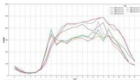

<details>
<summary>line</summary>

| X | Y (Series 1) | Y (Series 2) | Y (Series 3) | Y (Series 4) | Y (Series 5) |
|---|---|---|---|---|---|
| 0 | 0 | 0 | 0 | 0 | 0 |
| 1 | 1 | 1 | 1 | 1 | 1 |
| 2 | 3 | 3 | 3 | 3 | 3 |
| 3 | 6 | 6 | 6 | 6 | 6 |
| 4 | 8 | 8 | 8 | 8 | 8 |
| 5 | 9 | 9 | 9 | 9 | 9 |
| 6 | 10 | 10 | 10 | 10 | 10 |
| 7 | 10.5 | 10.5 | 10.5 | 10.5 | 10.5 |
| 8 | 10.2 | 10.2 | 10.2 | 10.2 | 10.2 |
| 9 | 9.5 | 9.5 | 9.5 | 9.5 | 9.5 |
| 10 | 8.5 | 8.5 | 8.5 | 8.5 | 8.5 |
| 11 | 7.5 | 7.5 | 7.5 | 7.5 | 7.5 |
| 12 | 6.5 | 6.5 | 6.5 | 6.5 | 6.5 |
| 13 | 5.5 | 5.5 | 5.5 | 5.5 | 5.5 |
| 14 | 4.5 | 4.5 | 4.5 | 4.5 | 4.5 |
| 15 | 3.5 | 3.5 | 3.5 | 3.5 | 3.5 |
| 16 | 2.5 | 2.5 | 2.5 | 2.5 | 2.5 |
| 17 | 1.5 | 1.5 | 1.5 | 1.5 | 1.5 |
| 18 | 0.5 | 0.5 | 0.5 | 0.5 | 0.5 |
| 19 | -0.5 | -0.5 | -0.5 | -0.5 | -0.5 |
| 20+ | -1.5 | -1.5 | -1.5 | -1.5 | -1.5 |
The chart displays a line graph with multiple data series labeled '未分类' and '未分类'. The values for the lines are estimated based on the y-axis label 'Y'. The x-axis is labeled 'X', and the legend indicates different series: '未分类', '未分类', and their respective values.
</details>

a)4月1日至7日

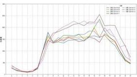

<details>
<summary>line</summary>

| Date | Series 1 | Series 2 | Series 3 | Series 4 | Series 5 |
|---|---|---|---|---|---|
| 09/01 | 10.0 | 10.0 | 10.0 | 10.0 | 10.0 |
| 09/02 | 9.5 | 9.5 | 9.5 | 9.5 | 9.5 |
| 09/03 | 9.0 | 9.0 | 9.0 | 9.0 | 9.0 |
| 09/04 | 8.5 | 8.5 | 8.5 | 8.5 | 8.5 |
| 09/05 | 8.0 | 8.0 | 8.0 | 8.0 | 8.0 |
| 09/06 | 7.5 | 7.5 | 7.5 | 7.5 | 7.5 |
| 09/07 | 7.0 | 7.0 | 7.0 | 7.0 | 7.0 |
| 09/08 | 6.5 | 6.5 | 6.5 | 6.5 | 6.5 |
| 09/09 | 6.0 | 6.0 | 6.0 | 6.0 | 6.0 |
| 09/10 | 5.5 | 5.5 | 5.5 | 5.5 | 5.5 |
| 09/11 | 5.0 | 5.0 | 5.0 | 5.0 | 5.0 |
| 09/12 | 4.5 | 4.5 | 4.5 | 4.5 | 4.5 |
| 10/01 | 4.0 | 4.0 | 4.0 | 4.0 | 4.0 |
| 10/02 | 3.5 | 3.5 | 3.5 | 3.5 | 3.5 |
| 10/03 | 3.0 | 3.0 | 3.0 | 3.0 | 3.0 |
| 10/04 | 2.5 | 2.5 | 2.5 | 2.5 | 2.5 |
| 10/05 | 2.0 | 2.0 | 2.0 | 2.0 | 2.0 |
| 10/06 | 1.5 | 1.5 | 1.5 | 1.5 | 1.5 |
| 10/07 | 1.0 | 1.0 | 1.0 | 1.0 | 1.0 |
| 10/08 | 0.5 | 0.5 | 0.5 | 0.5 | 0.5 |
| 10/09 | -1.0 | -1.0 | -1.0 | -1.0 | -1.0 |
| 10/10 | -2.5 | -2.5 | -2.5 | -2.5 | -2.5 |
| 11/01 | -4.0 | -4.0 | -4.0 | -4.0 | -4.0 |
| 11/02 | -6.5 | -6.5 | -6.5 | -6.5 | -6.5 |
| 11/03 | -9.0 | -9.0 | -9.0 | -9.0 | -9.0 |
| 11/04 | -12.5| -12.5| -12.5| -12.5| -12.5|
| 11/05 | -16.0| -16.0| -16.0| -16.0| -16.0|
| 11/06 | -20.5| -20.5| -20.5| -20.5| -20.5|
| 11/07 | -26.0| -26.0| -26.0| -26.0| -26.0|
| 11/08 | -32.5| -32.5| -32.5| -32.5| -32.5|
| 11/09 | -41   | -41   | -41   | -41   | -41   |
| 11/10 | -49   | -49   | -49   | -49   | -49   |
| Peak (approx.) ~ 'Peak' indicates the value of the chart on the y-axis (labeled as 'MM') is estimated based on the y-axis label (labeled as 'MM'). The x-axis is labeled 'Date' (e.g., 'Date' or 'Year') and the y-axis is labeled 'Value'. The chart displays a single data series with no visible trend lines or additional categories.
</details>

b)4月8日至14日

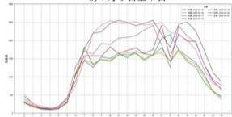

<details>
<summary>line</summary>

| X | Y1 | Y2 | Y3 | Y4 |
|---|---|---|---|---|
| 0 | 0.5 | 0.6 | 0.7 | 0.8 |
| 1 | 1.2 | 1.3 | 1.4 | 1.5 |
| 2 | 2.1 | 2.2 | 2.3 | 2.4 |
| 3 | 3.5 | 3.6 | 3.7 | 3.8 |
| 4 | 4.8 | 4.9 | 5.0 | 5.1 |
| 5 | 5.2 | 5.3 | 5.4 | 5.5 |
| 6 | 4.9 | 5.0 | 5.1 | 5.2 |
| 7 | 4.5 | 4.6 | 4.7 | 4.8 |
| 8 | 4.0 | 4.1 | 4.2 | 4.3 |
| 9 | 3.5 | 3.6 | 3.7 | 3.8 |
| 10 | 3.0 | 3.1 | 3.2 | 3.3 |
| 11 | 2.5 | 2.6 | 2.7 | 2.8 |
| 12 | 2.0 | 2.1 | 2.2 | 2.3 |
| 13 | 1.5 | 1.6 | 1.7 | 1.8 |
| 14 | 1.0 | 1.1 | 1.2 | 1.3 |
| 15 | 0.5 | 0.6 | 0.7 | 0.8 |
| 16 | 0.0 | 0.1 | 0.2 | 0.3 |
| 17 | -0.5 | -0.6 | -0.7 | -0.8 |
| 18 | -1.0 | -1.1 | -1.2 | -1.3 |
| 19 | -1.5 | -1.6 | -1.7 | -1.8 |
| 20 | -2.0 | -2.1 | -2.2 | -2.3 |
| 21 | -2.5 | -2.6 | -2.7 | -2.8 |
| 22 | -3.0 | -3.1 | -3.2 | -3.3 |
| 23 | -3.5 | -3.6 | -3.7 | -3.8 |
| 24 | -4.0 | -4.1 | -4.2 | -4.3 |
| 25 | -4.5 | -4.6 | -4.7 | -4.8 |
| 26 | -5.0 | -5.1 | -5.2 | -5.3 |
| 27 | -5.5 | -5.6 | -5.7 | -5.8 |
| 28 | -6.0 | -6.1 | -6.2 | -6.3 |
| 29 | -6.5 | -6.6 | -6.7 | -6.8 |
| 30 | -7.0 | -7.1 | -7.2 | -7.3 |
| 31 | -7.5 | -7.6 | -7.7 | -7.8 |
| 32 | -8.0 | -8.1 | -8.2 | -8.3 |
| 33 | -8.5 | -8.6 | -8.7 | -8.8 |
| 34 | -9.0 | -9.1 | -9.2 | -9.3 |
| 35 | -9.5 | -9.6 | -9.7 | -9.8 |
| 36 | -10.0 | -10.1 | -10.2 | -10.3 |
| 37 | -10.5 | -10.6 | -10.7 | -10.8 |
| 38 | -11.0 | -11.1 | -11.2 | -11.3 |
| 39 | -11.5 | -11.6 | -11.7 | -11.8 |
| 40+ (continued)<lcel><lcel><lcel><lcel><lcel><nl>
</details>

c)4月15日至21日

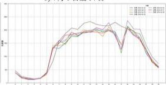  
d)4月22日至28日  
图 1 交叉口流量日变与时变曲线图

# (1) 日变特征

由图 1 可知，工作日周一至周五交叉口的交通流量变化规律基本一致；非工作日周六与周日交叉口流量相对工作日有所上升。为了明确工作日与非工作日交通量差异性，进一步采用方差分析（ANOVA）分析一周内不同天的交通量是否存在显著差异。

方差分析（ANOVA）可用于比较三个或更多样本均值的差异是否显著。它的基本思想是将数据的总变异分解为组间变异和组内变异两部分。组间变异（Between-group variation）：不同组（天）之间的平均值差异引起的变异。组内变异（Within-group variation）：同一组（天）内部数据的变异。通过计算F统计量来比较这两部分变异。如果所有组的均值相同，则F值接近1。如果某些组的均值显著不同，则组间变异会增大，F值会增大。如果F值较大，且对应的p值小于显著性水平（通常是0.05），则拒绝零假设（所有组均值相等），认为至少有两个组的均值存在显著差异。

考虑到附件原始数据中数据缺失问题，经中路-纬中路交叉口仅4月19日至30日完整的采集了四个相位的交通流量，因此，对该范围内每日交通量进行方差分析。统计量 $F = 0.0388$ 和显著性指标 $p = 0.9991$ ， $F$ 值非常小，表明组间（不同天）的交通量差异相对于组内（同一天内部）的变异来说是非常小； $p$ 值接近1，远大于通常的显著性水平0.05，意味着数据中的变异主要是由随机因素引起的，而不是由不同天引起的。即，一周内不同日的交通量差异在统计上并不显著。由于工作日和非工作日交叉口交通流量并没有显著差异，后续将不考虑交通量的日变特征，将工作日和非工作日作为一个整体进行分析。

# (2) 时变特征

对一天 24 小时的交通流量变化趋势进行观察，可知交通流量具有明显的昼夜变化规律，凌晨 0:00 至 5:00 交叉口交通流量较少；5:00 至 7:00 交通流量出现明显增加；7:00 至 20:00 交通流量处于相对平稳的波动状态，并没有明显的早高峰和晚高峰；晚上 20:00 后交通流量逐渐回落。下面针对一天 24 小时的交通流量变化规律开展时段划分和流量估计。

# 5.1.3 基于聚类分析的时段划分

考虑到交叉口流量具有比较明显的阶段性变化特征，而聚类方法能够寻找数据之间内在结构特征，可以识别交通流量的周期性模式，预测特定时间段内的交通流量，或者识别交通拥堵的潜在原因。因此，本文分别采用K-means聚类、DBSCAN和高斯混合模型（GMM）三种聚类算法对交通量进行时段划分。

# (1) 模型构建

K-means聚类：旨在将数据点分成K个簇，使得簇内的方差尽可能小，簇间的方差尽可能大。通过迭代选择质心和重新分配数据点到最近的质心来工作，直到收敛。K-means算法试图最小化所有数据点到其对应簇质心的距离的平方和，这个目标函数也被称为惯性（Inertia），公式如下：

$$
\min \sum_ {i = 1} ^ {k} \sum_ {x \in C _ {i}} \left| X - \mu_ {i} \right| ^ {2} \tag {1}
$$

其中， $C_i$ 是第 $i$ 个聚类， $\mu_{i}$ 是 $C_i$ 的中心。

K-means 聚类算法的步骤如下：

步骤 1：随机选择 K 个点作为质心，然后按照最近邻归类。

步骤 2：对每个簇进行质心更新，对每个数据点计算其与所有质心的距离，并将其分配给最近的质心。

步骤 3：重复上述步骤，直到质心变化很小或达到设定的迭代次数。

DBSCAN 聚类：是一种基于密度的聚类算法，能够识别任意形状的簇，并且能够处理噪声数据。

DBSCAN 聚类算法的步骤如下：

步骤1：确定两个参数：邻域半径 $\varepsilon$ 和最小点数MinPts。

步骤2：对于数据集中的每个点，找出其 $\varepsilon$ -邻域内的所有点。

步骤3：标记那些 $\varepsilon$ -邻域内至少包含MinPts个点的点的核心点。

步骤 4：从每个核心点开始，通过密度可达关系递归地将所有密度相连的点划入同一个簇。

步骤 5：未被划入任何簇的点被视为噪声。

高斯混合模型（GMM）：是一种基于概率的聚类方法，它假设数据由多个高斯分布混合而成，每个高斯分布对应一个簇。

GMM 聚类算法的步骤如下:

步骤 1：初始化高斯混合分布的模型参数。

步骤 2：计算各混合成分生成的后验概率。

步骤 3：计算新的模型参数。

步骤 4：按照新的模型参数重复 2，3 步，直到满足停止条件。

步骤 5：将每个样本划入对应的簇

使用 Python 对上述模型进行交通量的时段划分求解，算法流程见附件 1。

# (2) 结果分析

由于五一期间进行了交通管制，当前模型仅使用四月份的数据进行交通流量的时段划分。三个聚类模型得到的时段分类结果如图2所示。

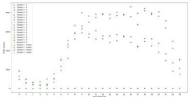

<details>
<summary>scatter</summary>

| Category | Value |
|---|---|
| A | 100 |
| B | 50 |
| C | 25 |
| D | 10 |
| E | 5 |
| F | 2 |
| G | 1 |
| H | 0.5 |
| I | 0.25 |
| J | 0.1 |
| K | 0.05 |
| L | 0.025 |
| M | 0.01 |
| N | 0.005 |
| O | 0.0025 |
| P | 0.001 |
| Q | 0.0005 |
| R | 0.00025 |
| S | 0.0001 |
| T | 0.00005 |
| U | 0.000025 |
| V | 0.00001 |
| W | 0.000005 |
| X | 0.0000025 |
| Y | 0.000001 |
| Z | 0.0000005 |
| AA | 0.00000025 |
| AB | 0.0000001 |
| AC | 0.00000005 |
| AD | 0.000000025 |
| AE | 0.00000001 |
| AF | 0.000000005 |
| AG | 0.0000000025 |
| AH | 0.000000001 |
| AI | 0.0000000005 |
| AJ | 0.00000000025 |
| AK | 0.0000000001 |
| AL | 0.00000000005 |
| AM | 87.7736 |
| AN | 87.7736 |
| AO | 87.7736 |
| AP | 87.7736 |
| AQ | 87.7736 |
| AR | 87.7736 |
| AS | 87.7736 |
| AT | 87.7736 |
| AU | 87.7736 |
| AV | 87.7736 |
| AW | 87.7736 |
| AX | 87.7736 |
| AY | 87.7736 |
| AZ | 87.7736 |
| BA | 87.7736 |
| BB | 87.7736 |
| BC | 87.7736 |
| BD | 87.7736 |
| BE | 87.7736 |
| BF | 87.7736 |
| BG | 87.7736 |
| BH | 87.7736 |
| BI | 87.7736 |
| BJ | 87.7736 |
| BK | 87.7736 |
| BL | 87.7736 |
| BM | 87.7736 |
| BN | 87.7736 |
| BO | 87.7736 |
| BP | 87.7736 |
| BPB | 87.7736 |
| BPB+Q | 87.7736 |
| BPB+Q+Q+Q+Q+Q+Q+Q+Q+Q+Q+Q+Q+Q+Q+Q+Q+Q+Q+Q+Q+Q+Q+Q+Q+Q+Q+Q+Q+Q+Q+Q+Q+Q+Q+Q+Q+Q+Q+Q+Q+Q+Q+Q+Q+Q+Q+Q+Q+Q+Q+O
Z
Z
Z
Z
Z
Z
Z
Z
Z
Z
Z
Z
Z
Z
Z
Z
Z
Z
Z
Z
Z
Z
Z
Z
Z
Z
Z
Z
Z
Z
Z
Z
Z
Z
Z
Z
Z
Z
Z
Z
Z
Z
Z
Z
Z
Z
Z
Z
Z
Z
24
</details>

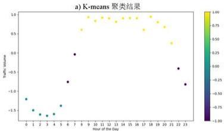

<details>
<summary>scatter</summary>

a) K-means 聚类结果
| Hour of the Day | Traffic Volume |
| :--- | :--- |
| 0 | -1.2 |
| 1 | -1.4 |
| 2 | -1.5 |
| 3 | -1.5 |
| 4 | -1.5 |
| 5 | -0.8 |
| 6 | -0.7 |
| 7 | 0.0 |
| 8 | 0.6 |
| 9 | 0.8 |
| 10 | 0.9 |
| 11 | 0.9 |
| 12 | 0.9 |
| 13 | 0.9 |
| 14 | 0.9 |
| 15 | 0.9 |
| 16 | 0.9 |
| 17 | 0.9 |
| 18 | 0.9 |
| 19 | 0.9 |
| 20 | 0.8 |
| 21 | 0.4 |
| 22 | -0.4 |
| 23 | -0.8 |
</details>

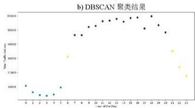

<details>
<summary>scatter</summary>

| X | Y |
|---|---|
| 1 | 10000 |
| 2 | 9500 |
| 3 | 9000 |
| 4 | 8500 |
| 5 | 8000 |
| 6 | 7500 |
| 7 | 7000 |
| 8 | 6500 |
| 9 | 6000 |
| 10 | 5500 |
| 11 | 5000 |
| 12 | 4500 |
| 13 | 4000 |
| 14 | 3500 |
| 15 | 3000 |
| 16 | 2500 |
| 17 | 2000 |
| 18 | 1500 |
| 19 | 1000 |
| 20 | 500 |
| 21 | 250 |
| 22 | 100 |
| 23 | 50 |
</details>

c) 高斯混合模型（GMM）聚类结果  
图 2 交叉口流量时段划分聚类分析结果

由图 2 可知，不同聚类分析结果均将交叉口流量时段划分为 4 个簇，揭示了车流量在一天内的变化趋势。从深夜到凌晨交叉口交通流量处于较低水平，呈现一个较为平稳的低谷状态。在早晨和晚上时分会出现显著上升和回落过程。而白天维持了一个相对较高的流量状态，尽管这段时间出现了一定的波动，但并未出现明显的高峰现象。

进一步计算各聚类模型的轮廓系数，得到 K-means 聚类方法的轮廓系数为 0.5322，DBSCAN 聚类方法的轮廓系数为 0.7189，高斯混合模型（GMM）聚类方法的轮廓系数为 0.7271。由图可知三个模型计算得到的结果均较为相似，只有一些临界的时间点有所差异。由于轮廓系数取值越接近 1 则说明聚类性能越好，因此，划分时段的临界值更倾向于参考 DBSCAN 和 GMM 的划分结果。

根据上述结果，综合考虑将一天划分出四个时段，得到的第一个时段的划分范围为[0:00, 5:00]，第二个时段的划分范围为[5:00, 7:00]，第三个时段的划分范围为[7:00, 20:00]，第四个时段的划分范围为[20:00, 24:00]。

# 5.1.4 基于极限梯度提升树的流量估计

交通量在一天中会呈现周期性变化，具有时间序列特性，考虑到极限梯度提升树算法（eXtreme Gradient Boosting，XGBoost）能够捕捉时间的非线性关系，在处理大规模交通量数据集时表现出色，因此，采用该方法对各时段交叉口流量进行估计。

极限梯度提升树算法（XGBoost）是一种提升树算法，在传统的梯度提升算法的基础上，增加了正则化项（L1和L2正则化），以防止模型过拟合。它通过迭代地添加新的树，每棵树都尝试纠正前一棵树的错误，从而提高模型的性能。

模型目标函数主要由两部分组成：训练损失和正则化项。公式如下：

$$
\operatorname{Obj} (\theta) = \mathrm{L} (\theta) + \Omega (\theta) \tag {2}
$$

其中， $L(\theta)$ 是训练损失， $\Omega(\theta)$ 是正则化项， $\theta$ 表示模型参数。

训练损失是模型预测值与真实值之间差异的度量，通常使用均方误差（MSE）作为回归任务的损失函数。正则化项由两部分组成：树的叶子节点数量和叶子节点的权重值。

考虑到附件原始数据中数据缺失问题，经中路-纬中路交叉口仅4月19日至30日完整的采集了四个相位的交通流量，因此，采用该时间段内流量数据作为模型输入，划分训练集和测试集。使用Python对流量预测模型求解，通过xgb.XGBRegressor来训练模型，其中objective='reg:squarederror'指定回归任务和平方误差损失函数，random\_state用于确保结果的可重复性。通过RandomizedSearchCV方法进行XGBoost模型超参数优化。最后得到模型预测结果如图3所示，并输出模型检验参数MSE、RMSE、MAE和R²值。

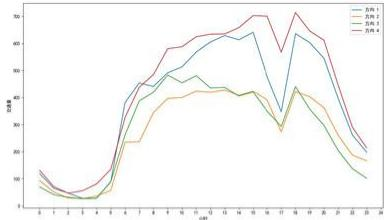  
图3交叉口各相位流量预测结果

模型检验结果 MSE=2851.33、RMSE=53.39、MAE=38.45、 $R^{2}=0.95$ ， $R^{2}$ 值表明模型能够很好地解释数据中的变异性，预测性能很好。MSE 和 RMSE 值表明模型的预测误差相对较小，证实了模型有效性。MAE 值相对较低表明模型对数据的异常值具有一定稳健性。因此，XGBoost 模型预测结果可信度较高，不同时段各个相位（包括四个方向直行、转弯）车流量的估算结果具体如表 3 所示。

表 3 不同时段各个相位车流量

<table><tr><td>时段(小时)</td><td>方向 1 交通量</td><td>方向 2 交通量</td><td>方向 3 交通量</td><td>方向 4 交通量</td></tr><tr><td>0:00</td><td>119.5</td><td>93.8</td><td>70.2</td><td>131.1</td></tr><tr><td>1:00</td><td>64.7</td><td>51.2</td><td>41.4</td><td>71.0</td></tr><tr><td>2:00</td><td>47.5</td><td>29.4</td><td>32.1</td><td>46.9</td></tr><tr><td>3:00</td><td>28.0</td><td>27.1</td><td>26.8</td><td>55.5</td></tr><tr><td>4:00</td><td>29.0</td><td>36.3</td><td>28.1</td><td>81.1</td></tr><tr><td>5:00</td><td>88.7</td><td>57.1</td><td>89.5</td><td>134.8</td></tr><tr><td>6:00</td><td>381.0</td><td>235.2</td><td>261.7</td><td>326.3</td></tr><tr><td>7:00</td><td>453.9</td><td>236.5</td><td>387.8</td><td>437.8</td></tr><tr><td>8:00</td><td>440.9</td><td>344.8</td><td>419.7</td><td>484.9</td></tr><tr><td>9:00</td><td>491.5</td><td>396.8</td><td>483.0</td><td>580.3</td></tr><tr><td>10:00</td><td>513.1</td><td>400.1</td><td>454.2</td><td>587.6</td></tr><tr><td>11:00</td><td>567.9</td><td>423.7</td><td>480.6</td><td>624.3</td></tr><tr><td>12:00</td><td>605.0</td><td>419.5</td><td>435.4</td><td>633.8</td></tr><tr><td>13:00</td><td>628.7</td><td>427.6</td><td>437.4</td><td>634.7</td></tr><tr><td>14:00</td><td>613.1</td><td>408.5</td><td>405.7</td><td>658.3</td></tr><tr><td>15:00</td><td>641.2</td><td>423.1</td><td>421.1</td><td>702.4</td></tr><tr><td>16:00</td><td>477.2</td><td>391.4</td><td>349.7</td><td>700.5</td></tr><tr><td>17:00</td><td>347.9</td><td>273.7</td><td>293.3</td><td>567.6</td></tr><tr><td>18:00</td><td>636.0</td><td>421.8</td><td>440.1</td><td>713.8</td></tr><tr><td>19:00</td><td>602.6</td><td>403.4</td><td>357.5</td><td>645.7</td></tr><tr><td>20:00</td><td>545.0</td><td>362.2</td><td>297.2</td><td>611.7</td></tr><tr><td>21:00</td><td>396.9</td><td>260.5</td><td>204.4</td><td>445.6</td></tr><tr><td>22:00</td><td>261.9</td><td>187.4</td><td>137.3</td><td>290.0</td></tr><tr><td>23:00</td><td>198.2</td><td>166.5</td><td>102.0</td><td>214.2</td></tr></table>

# 5.2 问题 2 模型建立与求解

# 5.2.1 数据预处理

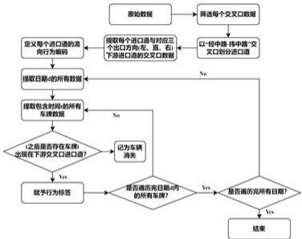

```mermaid
graph TD
    A["原始数据"] --> B["筛选每个交叉口数据"]
    B --> C{以"经审核 伟中题"交叉口划分进口道}
    C --> D["提取每个进口道与对应三个出口方向(左、右)下游进口道的交叉口数据"]
    D --> E["定义每个进口道的流向行为编码"]
    E --> F["提取日期=时的所有数据"]
    F --> G{+之后是否存在车前 出现在下游交叉口进口道?}
    G -->|No| H["记录车辆消失"]
    G -->|Yes| I["赋予行为标签"]
    H --> J{是否需历史日期/时的所有车辆?}
    J -->|No| K["赋予行为标签"]
    J -->|Yes| L{是否需历史日期/时的所有车辆?}
    L -->|Yes| M["结束"]
    L -->|No| N["赋予行为标签"]
```

图 4 交叉口流量转向识别方法

针对问题2，首先对数据进行预处理，通过车牌匹配对经中路-纬中路交叉口各相位流量转向进行识别，即通过交叉口相邻进口到车牌重复顺序出现区分车辆左转、直行和右转路径。车牌匹配和路径识别方法如图4所示。

为了排除节假日和周末等因素对信号控制方案的影响，结合问题1的交通流量时间变化特征，选取最具代表性的工作日晚高峰（4月24日周三晚高峰18:00-19:00）片段数据，对问题2进行建模与求解。通过上述方法得到经中路和纬中路两条主路关键交叉口——经中路-纬中路交叉口高峰小时各相位转向交通流量如图5所示。

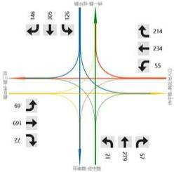

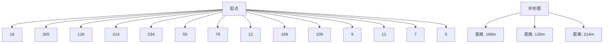

图 5 经中路-纬中路交叉口流量流向图

提取该时间段各交叉口晚高峰四个相位的交通流量如表4所示。

表 4 晚高峰各交叉口各相位流量

<table><tr><td>交叉口</td><td>方向</td><td>流量</td><td>交叉口</td><td>方向</td><td>流量</td></tr><tr><td rowspan="4">环西路-纬中路</td><td>1</td><td>1266</td><td rowspan="4">经四路-纬中路</td><td>1</td><td>25</td></tr><tr><td>2</td><td>1227</td><td>2</td><td>21</td></tr><tr><td>3</td><td>676</td><td>3</td><td>29</td></tr><tr><td>4</td><td>971</td><td>4</td><td>22</td></tr><tr><td rowspan="4">经一路-纬中路</td><td>1</td><td>474</td><td rowspan="4">经五路-纬中路</td><td>1</td><td>95</td></tr><tr><td>2</td><td>647</td><td>2</td><td>84</td></tr><tr><td>3</td><td>233</td><td>3</td><td>23</td></tr><tr><td>4</td><td>338</td><td>4</td><td>32</td></tr><tr><td rowspan="4">经二路-纬中路</td><td>1</td><td>420</td><td rowspan="4">环北路-经中路</td><td>1</td><td>289</td></tr><tr><td>2</td><td>261</td><td>2</td><td>197</td></tr><tr><td>3</td><td>-</td><td>3</td><td>342</td></tr><tr><td>4</td><td>-</td><td>4</td><td>652</td></tr><tr><td rowspan="4">经三路-纬中路</td><td>1</td><td>422</td><td rowspan="4">经中路-纬一路</td><td>1</td><td>181</td></tr><tr><td>2</td><td>401</td><td>2</td><td>-</td></tr><tr><td>3</td><td>255</td><td>3</td><td>584</td></tr><tr><td>4</td><td>281</td><td>4</td><td>558</td></tr><tr><td rowspan="4">经中路-纬中路</td><td>1</td><td>583</td><td rowspan="4">环南路-经中路</td><td>1</td><td>400</td></tr><tr><td>2</td><td>401</td><td>2</td><td>493</td></tr><tr><td>3</td><td>423</td><td>3</td><td>558</td></tr><tr><td>4</td><td>732</td><td>4</td><td>490</td></tr><tr><td rowspan="2">纬中路-景区出入口</td><td>1</td><td>469</td><td></td><td></td><td></td></tr><tr><td>2</td><td>412</td><td></td><td></td><td></td></tr></table>

注：1-由东向西，2-由西向东，3-由南向北，4-由北向南。

# 5.2.2 干线协调信号控制方案设计（方法一）

针对问题3，假设各交叉口各相位的通行能力为2100辆/h，采用韦伯斯特(Webster)信号配时方法设置各交叉口单点信号控制最优方案。假设各路段车辆自由流速度为50km/h，根据各交叉口距离计算相位差，设计干线协调信号控制方案。最后，基于经中路-纬中路关键节点联立两条主路，实现相交主干道绿波协调控制。

# (1) 单点优化控制

根据韦伯斯特（Webster）信号配时计算公式，单个交叉口最优信号周期计算方法如下：

$$
C = \frac {1 . 5 \times L + 5}{1 - Y} \tag {3}
$$

其中：C 为信号周期，L 为损失时间，Y 为各相位流量比之和。假设每个相位的损失时间为 5 s，四个相位损失时间之和为 20 s。

各相位流量比之和 Y 计算公式：

$$
Y = \sum_ {i = 1} ^ {n} y _ {i}, y _ {i} = \frac {Q _ {i}}{S _ {i}} \tag {4}
$$

其中， $y_{i}$ 为各相位流量比； $Q_{i}$ 为第 i 个相位的流量， $S_{i}$ 为相位的通行能力（取 2100 辆/h）。

各相位绿灯时长分配，根据各相位的流量比来分配每个相位的绿灯时长：

$$
G _ {i} = \frac {y _ {i}}{Y} \times C \tag {5}
$$

其中： $G_{i}$ 为第 i 个相位的绿灯时长，C 为信号周期时长。

通过韦伯斯特（Webster）计算方法，得到工作日晚高峰各交叉口最佳信号周期方案如表5所示。

表 5 各交叉口最佳信号配时方案

<table><tr><td>交叉口</td><td>方向</td><td>车流量</td><td>饱和流量比率</td><td>有效绿灯时长</td><td>交叉口</td><td>车流量</td><td>饱和流量比率</td><td>有效绿灯时长</td></tr><tr><td rowspan="4">经中路-纬中路</td><td>1</td><td>583</td><td>0.28</td><td>24</td><td rowspan="4">经三路-纬中路</td><td>422</td><td>0.2</td><td>20</td></tr><tr><td>2</td><td>401</td><td>0.19</td><td>20</td><td>401</td><td>0.19</td><td>20</td></tr><tr><td>3</td><td>423</td><td>0.2</td><td>20</td><td>255</td><td>0.12</td><td>16</td></tr><tr><td>4</td><td>732</td><td>0.35</td><td>27</td><td>281</td><td>0.13</td><td>17</td></tr><tr><td rowspan="4">环西路-纬中路</td><td>1</td><td>1266</td><td>0.6</td><td>40</td><td rowspan="4">纬中路-景区出入口</td><td>469</td><td>0.22</td><td>21</td></tr><tr><td>2</td><td>1227</td><td>0.58</td><td>39</td><td>412</td><td>0.2</td><td>20</td></tr><tr><td>3</td><td>676</td><td>0.32</td><td>26</td><td></td><td></td><td></td></tr><tr><td>4</td><td>971</td><td>0.46</td><td>33</td><td>7</td><td>0</td><td>10</td></tr><tr><td rowspan="4">经中路-纬一路</td><td>1</td><td>181</td><td>0.09</td><td>14</td><td rowspan="4">经四路-纬中路</td><td>25</td><td>0.01</td><td>11</td></tr><tr><td>2</td><td></td><td></td><td></td><td>21</td><td>0.01</td><td>11</td></tr><tr><td>3</td><td>584</td><td>0.28</td><td>24</td><td>29</td><td>0.01</td><td>11</td></tr><tr><td>4</td><td>558</td><td>0.27</td><td>23</td><td>22</td><td>0.01</td><td>11</td></tr><tr><td rowspan="4">环南路-经中路</td><td>1</td><td>400</td><td>0.19</td><td>20</td><td rowspan="4">经五路-纬中路</td><td>95</td><td>0.05</td><td>12</td></tr><tr><td>2</td><td>493</td><td>0.23</td><td>22</td><td>84</td><td>0.04</td><td>12</td></tr><tr><td>3</td><td>558</td><td>0.27</td><td>23</td><td>23</td><td>0.01</td><td>11</td></tr><tr><td>4</td><td>490</td><td>0.23</td><td>22</td><td>32</td><td>0.02</td><td>11</td></tr><tr><td rowspan="4">经一路-纬中路</td><td>1</td><td>474</td><td>0.23</td><td>21</td><td rowspan="4">环北路-经中路</td><td>289</td><td>0.14</td><td>17</td></tr><tr><td>2</td><td>647</td><td>0.31</td><td>25</td><td>197</td><td>0.09</td><td>15</td></tr><tr><td>3</td><td>233</td><td>0.11</td><td>16</td><td>342</td><td>0.16</td><td>18</td></tr><tr><td>4</td><td>338</td><td>0.16</td><td>18</td><td>652</td><td>0.31</td><td>26</td></tr><tr><td rowspan="2">经二路-纬中路</td><td>1</td><td>420</td><td>0.2</td><td>20</td><td></td><td></td><td></td><td></td></tr><tr><td>2</td><td>261</td><td>0.12</td><td>16</td><td></td><td></td><td></td><td></td></tr></table>

# (2) 干线协调绿波控制

根据交叉口间距，方案目标以自由流车速行驶通过各个交叉口，得到各相位差如表6所示。

表 6 纬中路交叉口相位差

<table><tr><td>交叉口名称</td><td>相位名称</td><td>间距(m)</td><td>上行进口峰值比</td><td>相位差(s)</td></tr><tr><td>1环西路-纬中路</td><td>西南东北</td><td>0.000</td><td>0.300</td><td>78.200</td></tr><tr><td>2经一路-纬中路</td><td>西南东北</td><td>310.500</td><td>0.380</td><td>80.730</td></tr><tr><td>3经二路-纬中路</td><td>西东搭接</td><td>609.500</td><td>0.700</td><td>71.990</td></tr><tr><td>4经三路-纬中路</td><td>东西搭接</td><td>1299.500</td><td>0.510</td><td>2.530</td></tr><tr><td>5经中路-纬中路</td><td>东西南北</td><td>1598.500</td><td>0.190</td><td>23.230</td></tr><tr><td>6纬中路-景区出入口</td><td>东西南北</td><td>2208.000</td><td>0.460</td><td>23.000</td></tr><tr><td>7经四路-纬中路</td><td>西南东北</td><td>2817.500</td><td>0.220</td><td>46.230</td></tr><tr><td>8经五路-纬中路</td><td>西东搭接</td><td>3059.000</td><td>0.630</td><td>32.200</td></tr></table>

根据表5中各交叉口各相位流量比，设置绿波控制方案公共周期范围为80s至120s，以2s为步长计算各交叉口理想间距，得到公共周期为92s时，绿波控制控制方案带宽最宽。其中，每个交叉口的相位方案由单口放行、对称放行以及组合放行方式组合而成，各个相位绿灯时长如表7所示。

表 7 各交叉口相位与信号配时方案表

<table><tr><td>交叉口名称</td><td>排污名称</td><td>公共周期</td><td>最优先进口</td><td>最第四进口</td><td>极端东直左</td><td>极端西直左</td><td>极端东西直</td><td>对称东西直</td><td>对称东西左</td><td>离进口降幅比</td><td>北进口降幅比</td></tr><tr><td>13#百路-修...</td><td>西南东北</td><td>92</td><td>29</td><td>28</td><td>0</td><td>0</td><td>0</td><td>0</td><td>0</td><td>15</td><td>20</td></tr><tr><td>26#一班-修...</td><td>西南华北</td><td>92</td><td>26</td><td>35</td><td>0</td><td>0</td><td>0</td><td>0</td><td>0</td><td>13</td><td>18</td></tr><tr><td>3#二班-修...</td><td>西部诸暨</td><td>92</td><td>0</td><td>0</td><td>20</td><td>9</td><td>55</td><td>0</td><td>0</td><td>0</td><td>0</td></tr><tr><td>4#三班-修...</td><td>东西诸暨</td><td>92</td><td>0</td><td>0</td><td>9</td><td>9</td><td>39</td><td>0</td><td>0</td><td>17</td><td>18</td></tr><tr><td>5#中班-修...</td><td>东西南北</td><td>92</td><td>25</td><td>18</td><td>0</td><td>0</td><td>0</td><td>0</td><td>0</td><td>18</td><td>31</td></tr><tr><td>6#中班-修...</td><td>东西南北</td><td>92</td><td>49</td><td>42</td><td>0</td><td>0</td><td>0</td><td>0</td><td>0</td><td>0</td><td>1</td></tr><tr><td>7#百路-修...</td><td>西南东北</td><td>92</td><td>24</td><td>20</td><td>0</td><td>0</td><td>0</td><td>0</td><td>0</td><td>28</td><td>20</td></tr><tr><td>8#五班-修...</td><td>西部诸暨</td><td>92</td><td>0</td><td>0</td><td>13</td><td>12</td><td>46</td><td>0</td><td>0</td><td>9</td><td>12</td></tr></table>

干线协调控制方案时距图如图6所示。

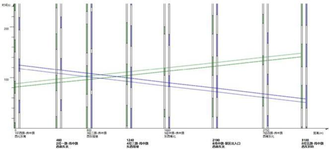

<details>
<summary>bar_line</summary>

| 城市 | 数值 (亿元) |
| :--- | :--- |
| 17 | 120 |
| 21 | 130 |
| 460 | 140 |
| 211 | 150 |
| 1240 | 160 |
| 482 | 170 |
| 2190 | 180 |
| 3160 | 190 |
| 3160 | 200 |
</details>

图 6 各交叉口时距图

# 5.2.3 基于遗传算法的最大车速求解（方法二）

针对问题 3，假设通过调整信号方案中各相位绿灯时长，降低车辆停驶次数、减少车辆延误时间，能够提升交通流量的平均速度。因此，模型目标为通过优化每个交叉口的各个相位的绿灯时长，使得绿灯时长能够合理分配给不同方向的车流，使得车流的平均速度最大化，从而减少交通拥堵，提高通行效率。

# (1) 模型构建

根据假设，车流的平均速度与“绿灯时长与周期时长的比值”成反比：

$$
V _ {i, j} = v _ {\text { free }} \times \frac {t _ {\text { green } i , j}}{T _ {\text { cycle } , i}} \tag {6}
$$

其中： $V_{i,j}$ 为交叉口 i 在第 j 个相位的平均车速； $v_{free}$ 为自由流状态车速； $T_{cycle,i}$ 为交叉口 i 信号周期时长； $t_{green,i,j}$ 为交叉口 i 的第 j 个相位的绿灯时长。

模型优化目标：

$$
M A X V _ {a v g} = \frac {\sum_ {i = 1} ^ {n} \sum_ {j = 1} ^ {m} V _ {i , j} \times Q _ {i , j}}{\sum_ {i = 1} ^ {n} \sum_ {j = 1} ^ {m} Q _ {i , j}}, \mathrm{n=12,m=4} \tag {7}
$$

其中， $V_{avg}$ 为经中路和纬中路两条主路上所有车辆的平均速度； $Q_{i,j}$ 为在交叉口 i 的第 j 个相位的流量。

模型约束条件：

$$
\left\{ \begin{array}{c} \sum_ {j = 1} ^ {m} \left(t _ {\text {green} i, j} + t _ {\text {red} i, j} + t _ {\text {yellow} i, j}\right) = T _ {\text {cycle}, i} \forall i \\ Q _ {i, j} \leq S _ {i, j} \cdot t _ {\text {green} i, j}, \forall i, j \\ t _ {\text {green} i, j} \geq 0, \forall i, j \end{array} \right. \tag {8}
$$

其中： $t_{red i,j}$ 为交叉口 i 的第 j 个相位的红灯时长； $t_{yellow,i}$ 为交叉口 i 各相位黄灯时长（取 2s）； $S_{i,j}$ 为交叉口 i 的第 j 个相位的饱和流量。

# (2) 模型求解

利用遗传算法进行求解，步骤如下：

步骤 1：编码方案：将每个交叉口的各相位绿灯时长编码为一个个体。

步骤 2：初始种群：随机生成一组信号灯配置作为初始种群。

步骤3：适应度函数：使用平均车速作为适应度函数，评估每个个体的优劣。

步骤 4：选择：根据适应度选择出优良个体用于交叉和变异。

步骤 5：交叉和变异：对选中的个体进行交叉操作（交换部分基因）和变异操作（随机调整绿灯时长）。

步骤 6：迭代更新：重复选择、交叉、变异的过程，逐代优化种群中的个体，直到适应度收敛或达到预设的迭代次数。

步骤 7：设置适应度函数：

$$
F i t n e s s = V _ {a v g} = \frac {\sum_ {i = 1} ^ {n} \sum_ {j = 1} ^ {m} V _ {i , j} \times Q _ {i , j}}{\sum_ {i = 1} ^ {n} \sum_ {j = 1} ^ {m} Q _ {i , j}} \tag {9}
$$

每次迭代中，更新每个个体的 $t_{greeni,j}$ ，通过调整信号时长逐步逼近最优解。

读取所有的 $Q_{i,j}$ 作为输入，随机生成 $S_{i,j}$ （满足 $Q_{i,j}/S_{i,j}\leq0.8$ ）与 $T_{cycle,i}$ ，基于遗传算法进行迭代优化，输出结果。其中，遗传算法超参数初始化如表8所示，种群迭代过程如图7所示：

表 8 遗传算法超参数初始化

<table><tr><td>类型</td><td>描述</td><td>初始化参数值</td></tr><tr><td>种群数量</td><td>POPULATION_SIZE</td><td>100</td></tr><tr><td>最大代数</td><td>NUM_GENERATIONS</td><td>500</td></tr><tr><td>变异率</td><td>MUTATION_RATE</td><td>0.1</td></tr><tr><td>交叉率</td><td>CROSSOVER_RATE</td><td>0.7</td></tr><tr><td>自由流速度</td><td>vfree</td><td>60</td></tr><tr><td>调节速度与信号比的关系常数</td><td>alpha</td><td>0.5</td></tr></table>

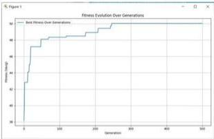

<details>
<summary>line</summary>

| Generation | Fitness Value |
| ---------- | ------------- |
| 0          | 0             |
| 50         | 44            |
| 100        | 64            |
| 150        | 84            |
| 200        | 104           |
| 250        | 124           |
| 300        | 144           |
| 350        | 164           |
| 400        | 184           |
| 450        | 204           |
| 500        | 224           |
</details>

图 7 遗传算法迭代过程

# (3) 结果分析

基于遗传算法得到各交叉口信号绿灯时长的优化结果如表9所示。

表 9 各相位绿灯时长优化结果

<table><tr><td>交叉口</td><td>北进口</td><td>东进口</td><td>南进口</td><td>西进口</td></tr><tr><td>经中路-纬中路</td><td>59</td><td>66</td><td>60</td><td>65</td></tr><tr><td>环西路-纬中路</td><td>90</td><td>79</td><td>35</td><td>88</td></tr><tr><td>经中路-纬一路</td><td>62</td><td>78</td><td>85</td><td>13</td></tr><tr><td>环南路-经中路</td><td>52</td><td>71</td><td>71</td><td>72</td></tr><tr><td>经一路-纬中路</td><td>71</td><td>62</td><td>59</td><td>55</td></tr><tr><td>经二路-纬中路</td><td>59</td><td>6</td><td>22</td><td>63</td></tr><tr><td>经三路-纬中路</td><td>58</td><td>34</td><td>44</td><td>57</td></tr><tr><td>纬中路-景区出入口</td><td>46</td><td>58</td><td>68</td><td>82</td></tr><tr><td>经四路-纬中路</td><td>93</td><td>88</td><td>71</td><td>85</td></tr><tr><td>经五路-纬中路</td><td>72</td><td>51</td><td>68</td><td>64</td></tr><tr><td>环北路-经中路</td><td>34</td><td>62</td><td>43</td><td>62</td></tr></table>

作为经中路和纬中路两条主路的关键节点，经中路-纬中路交叉口四个相位的交通流量相对均衡，为了保证两条主路车流通过带宽，各相位绿灯时长分配也相对平均。所有路口中环西路-纬中路交叉口流量最高，为了保证该交叉口车流量的快速消散，高峰期间信号周期最长。纬中路-景区出入口由于东西向为景区进出车流主要通行方向，东西方向进口的绿灯时长最长，优化后保证了景区出入口车流的顺畅通过。

进一步统计优化前后各交叉口各相位车流速度，如图8所示。优化后整体平均车速（最优适应度）为50.35km/h，相比优化前有显著提升。结果表明，优化后的信号方案充分考虑了各方向的流量需求和交通压力，合理分配了各相位的路灯时长，缓解了各交叉口的拥堵，提高了交叉口的通行效率。

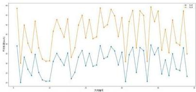

<details>
<summary>line</summary>

| 方式编号 | Series 1 (蓝色) | Series 2 (橙色) |
|---|---|---|
| 1 | 0.3 | 0.8 |
| 2 | -0.2 | 0.6 |
| 3 | 0.4 | 0.7 |
| 4 | -0.1 | 0.5 |
| 5 | 0.5 | 0.9 |
| 6 | -0.3 | 0.7 |
| 7 | 0.6 | 0.8 |
| 8 | -0.4 | 0.6 |
| 9 | 0.7 | 0.9 |
| 10 | -0.2 | 0.7 |
| 11 | 0.8 | 0.8 |
| 12 | -0.5 | 0.6 |
| 13 | 0.9 | 0.9 |
| 14 | -0.6 | 0.7 |
| 15 | 0.7 | 0.8 |
| 16 | -0.4 | 0.6 |
| 17 | 0.8 | 0.9 |
| 18 | -0.3 | 0.7 |
| 19 | 0.6 | 0.8 |
| 20 | -0.2 | 0.6 |
| 21 | 0.7 | 0.9 |
| 22 | -0.5 | 0.7 |
| 23 | 0.8 | 0.8 |
| 24 | -0.6 | 0.6 |
| 25 | 0.9 | 0.9 |
| 26 | -0.4 | 0.7 |
| 27 | 0.7 | 0.8 |
| 28 | -0.3 | 0.6 |
| 29 | 0.8 | 0.9 |
| 30 | -0.2 | 0.7 |
| 31 | 0.6 | 0.8 |
| 32 | -0.5 | 0.6 |
| 33 | 0.9 | 0.9 |
| 34 | -0.6 | 0.7 |
| 35 | 0.7 | 0.8 |
| 36 | -0.4 | 0.6 |
| 37 | 0.8 | 0.9 |
| 38 | -0.3 | 0.7 |
| 39 | 0.6 | 0.8 |
| 40 | -0.2 | 0.6 |
| 41 | 0.7 | 0.9 |
| 42 | -0.5 | 0.7 |
| 43 | 0.8 | 0.8 |
| 44 | -0.6 | 0.6 |
| 45 | 0.9 | 0.9 |
| 46 | -0.4 | 0.7 |
| 47 | 0.7 | 0.8 |
| 48 | -0.3 | 0.6 |
| 49 | 0.8 | 0.9 |
| 50 | -0.2 | 0.7 |
| 51 | 0.6 | 0.8 |
| 52 | -0.5 | 0.6 |
| 53 | 0.9 | 0.9 |
| 54 | -0.6 | 0.7 |
| 55 | 0.7 | 0.8 |
| 56 | -0.4 | 0.6 |
| 57 | 0.8 | 0.9 |
| 58 | -0.3 | 0.7 |
| 59 | 0.6 | 0.8 |
| 60 | -0.2 | 0.6 |
| 61 | 0.7 | 0.9 |
| 62 | -0.5 | 0.7 |
| 63 | 0.8 | 0.8 |
| 64 | -0.6 | 0.6 |
| 65 | 0.9 | 0.9 |
| 66 | -0.4 | 0.7 |
| 67 | 0.7 | 0.8 |
| 68 | -0.3 | 0.6 |
| 69 | 0.8 | 0.9 |
| 70 | -0.2 | 0.7 |
| 71 | 0.6 | 0.8 |
| 72 | -0.5 | 0.6 |
| 73 | 0.9 | 0.9 |
| 74 | -0.6 | 0.7 |
| 75 | 0.7 | 0.8 |
| 76 | -0.4 | 0.6 |
| 77 | 0.8 | 0.9 |
| 78 | -0.3 | 0.7 |
| 79 | 0.6 | 0.8 |
| 80 | -0.2 | 0.6 |
| 81 | 0.7 | 0.9 |
| 82 | -0.5 | 0.7 |
| 83 | 0.8 | 0.8 |
| 84 | -0.6 | 0.6 |
| 85 | 0.9 | 0.9 |
| 86 | -0.4 | 0.7 |
| 87 | 0.7 | 0.8 |
| 88 | -0.3 | 0.6 |
| 89 | 0.8 | 0.9 |
| 90 | -0.2 | 0.7 |
| 91 | 0.6 | 0.8 |
| 92 | -0.5 |<fcel>
</details>

图 8 优化前后车流平均速度对比

# 5.3 问题3模型建立与求解

针对已知交叉口数据和交通管制方案如图9所示。对现有数据进行对应时段和交叉口的归纳和整理，开展模型的建立与停车位需求的求解。

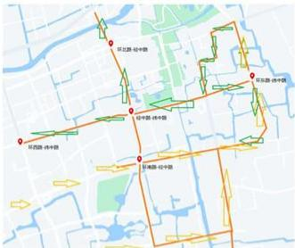

环北路-韩中路
环北路-韩中路
环北路-韩中路
环北路-韩中路
环北路-韩中路
环北路-韩中路
环北路-韩中路
环北路-韩中路
环北路-韩中路
环北路-韩中路
环北路-韩中路
环北路-韩中路
环北路-韩中路
环北路-韩中路
环北路-韩中路
环东路-韩中路
环东路-韩中路
环东路-韩中路
环东路-韩中路
环东路-韩中路
环东路-韩中路
环东路-韩中路
环东路-韩中路
环东路-韩中路
环东路-韩中路
环东路-韩中路
环东路-韩中路
环东路-韩中路
环东路-韩中路
环东路-韓中路
环东路-韓中路
环东路-韓中路
环东路-韓中路
环东路-韓中路
环东路-韓中路
环东路-韓中路
环东路-韓中路
环东路-韓中路
环东路-韓中路
环东路-韓中路
环东路-韓中路
环东路-韓中路
环东路-韓中路
环东路-韓中地

图9 五一交通管制图

# 5.3.1 建模计算概述

针对问题3，首先对数据进行预处理，要求对五一黄金周期间的数据进行分析，判定寻找停车位的巡游车辆，并估算假期景区需要临时征用多少停车位才能满足需求。首先筛选出五一黄金周期间的车流量数据，针对重复出现的车辆使用时间差的方式筛选出重复逗留在该路网区域内的巡游车的详情，最后确定需要分配停车位的巡游车数量，设置合理的停车时间，估算在该时段内景区需要增加的停车位数量。

# 5.3.2 停车需求周转率（方法一）

按照题目要求，筛选出五一期间的车流量数据，从原始数据中筛选5月1日职5日的数据条，按照车牌号、时间、方向和交叉口进行分组。提取的样例数据如表7所示。

表 7 提取数据样例（示例）

<table><tr><td>方向</td><td>时间</td><td>车牌号</td><td>交叉口</td></tr><tr><td>2</td><td>2024-05-02T13:13:42.809</td><td>EF9JDBBK</td><td>环西路-纬中路</td></tr><tr><td>2</td><td>2024-05-01T23:48:47.052</td><td>AF8MCE7K</td><td>环西路-纬中路</td></tr><tr><td>2</td><td>2024-05-02T11:16:21.320</td><td>EE8T3D9</td><td>环西路-纬中路</td></tr><tr><td>3</td><td>2024-05-01T18:21:45.458</td><td>AFA46A8K</td><td>环西路-纬中路</td></tr><tr><td>1</td><td>2024-05-01T20:13:11.594</td><td>AF26BCE</td><td>环西路-纬中路</td></tr><tr><td>1</td><td>2024-05-02T23:22:10.895</td><td>AF2YA78</td><td>环西路-纬中路</td></tr><tr><td>1</td><td>2024-05-03T10:35:15.226</td><td>AFA7D5EK</td><td>环西路-纬中路</td></tr></table>

# (1) 停车周转率计算

周转率表示每个停车位在假期期间可以被多少辆车使用，计算公式为:

$$
\text { turnover\_rate } = \frac {\mathrm{T} _ {\text { total }}}{\mathrm{t} _ {\text { park }}} \tag {10}
$$

其中， $T_{total}$ 为假期的总时长（5 天 ×24 小时 =120 小时）， $t_{park}$ 为每辆车的平均停车时长（4 小时）。

总停车位需求：假期期间需要的停车位数量为汎游车辆总数除以停车位的周转率，计算公式为：

$$
\mathrm{P} _ {\text { total }} = \frac {\mathrm{N}}{\text { turnover\_rate }} \tag {11}
$$

其中 N 为巡游车辆的数量。

平均每天停车位需求，总停车位需求 $P_{total}$ 除以 5 天，得到假期期间每天的平均停车位需求：

$$
\mathrm{P} _ {\text {day}} = \frac {\mathrm{P} _ {\text {total}}}{5} \tag {12}
$$

# (2) 模型求解

步骤1：数据读取和预处理：读取CSV文件中的数据，并将其存储在'data'变量中。将'时间'列转换为'datetime'类型，以便进行时间相关的计算。提取'时间'列中的日期部分，创建一个新的'日期'列。按照车牌号、日期、交叉口和时间的顺序对数据进行排序。

步骤 2：定义交叉口：设定进入和离开景区的交叉口列表。进入景区的交叉口：['环南路-经中路', '环东路-纬中路']；离开景区的交叉口：['环东路-纬中路', '经中路-纬中路', '环北路-经中路', '环西路-纬中路']

步骤 3：识别车辆状态：通过检查交叉口是否在进入或离开列表中，为每条记录标记是否进入或离开景区。

步骤 4：计算时间差：使用\`groupby\`方法对数据按车牌号分组，然后对每组数据的\`时间\`列使用\`diff()\`方法计算时间差，单位为秒。

步骤 5：巡游车辆判断：设置巡游判断的时间阈值（30 分钟，即 1800 秒）。使用布尔表达式 $(data['时间差'] <= time\_threshold)$ & $(data['时间差'] > 0)$ 来标记每辆车的记录，如果时间差小于或等于 1800 秒且大于 0 秒，则认为该记录表示车辆在巡游。

步骤 6：精细化巡游车辆识别定义了一个函数 'refine\_roaming\_cars'，用于进一步精细化判断车辆是否巡游。函数内部检查车辆是否至少有一次进入景区的记录和至少一次离开景区的记录如果车辆没有离开记录但有巡游记录，则保留这些巡游记录；否则，将该组的所有记录标记为非巡游。

步骤 7：筛选巡游车辆数据：从数据集中筛选出巡游车辆的数据。

步骤 8: 统计巡游车辆数量: 使用\`nunique()\`方法统计数据集中巡游车辆的唯一车牌号数量, 即巡游车辆的总数。

步骤 9：计算停车位需求：假设每辆车平均停车时间为 4 小时，假期总时长为 5 天（即 120 小时）。计算出每辆车在假期期间需要的停车位周转次数（'turnover\_rate'）。

使用总巡游车辆数除以周转率，得到假期期间总共需要的停车位数量（'parking\_slots\_needed'）。将总停车位数量除以假期天数，得到平均每日需要增加的停车位数量（'average\_parking\_slots\_needed\_per\_day'）。

# (3) 结果分析

运行代码，得到停车位需求估算结果，如图 10 所示。

```batch
F:\Tools\Py3_12python.exe F:\PycharmProjects\mathEgaojiao\wandaring_car.py
假期期间估算的巡航车辆数量为：10529
假期期间，若景区需要临时增加的停车位总数量：358.97
平均每天需要增加的停车位数量为：78.19
进程已结束，退出代码为 0
```  
图 10 停车位计算结果

结果表明，在五一期间该路网区域有10529辆巡游车辆，这些车剧本在短时间内重复出现在紧邻的交叉口无法顺利停车，表明假期内景区的停车压力和周边道路的行车需求较大，比较符合典型的节假日交通量和出行需求的变化。

根据当前方法计算得到的景区及其周边在五一期间应临时增加351个停车位，平均每天需要增加约71个停车位，缓解交通压力，为假期景区管制车辆提供一定的参考。

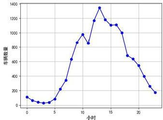

<details>
<summary>line</summary>

| 小时 | 车辆数量 |
|---|---|
| 0 | 100 |
| 1 | 50 |
| 2 | 30 |
| 3 | 40 |
| 4 | 60 |
| 5 | 150 |
| 6 | 250 |
| 7 | 400 |
| 8 | 650 |
| 9 | 900 |
| 10 | 850 |
| 11 | 1100 |
| 12 | 1350 |
| 13 | 1200 |
| 14 | 1100 |
| 15 | 1050 |
| 16 | 950 |
| 17 | 700 |
| 18 | 600 |
| 19 | 500 |
| 20 | 400 |
| 21 | 300 |
| 22 | 200 |
</details>

图 11 巡游车辆平均时变图

通过计算得到巡游车辆随时间的变化状况，如图 11 所示，根据当前结果，可以发现在约上午 9 时到下午 17 时，该区域的停车压力较高，在约中午 12 时左右逐渐达到峰值，推测是此时人们的午饭进食需求较高，巡游车辆和出入该区域的流量有相互冲突的情况，加剧道路的车辆通行状况，所以在开放停车位的时候应该考虑尽量在中午 12 时之前利用和调度最大的停车资源。

# 5.3.3 长停车需求时分配（方法二）

首先统计五月份内所有交叉口时间差大于一分钟且小于三十分钟的车辆，并作为判定为巡游车的一个条件，再结合速度约束判定巡游车。首先对数据进行长时间停车的车辆汇总和处理，计算出它们的平均停留时间，再利用巡游车进行总停车需求时间的计算，后分配停车位。

# (1) 长时间停车车辆计算

小于一小时的短途停车可以认为是巡航或者是短暂停留，而超过半天的停留可能是工作人员或者居民等情况，所以在计算车辆长时逗留时，按一天24小时统计时间差大于一小时且小于十二个小时的车辆频次，进行数据的归纳和可视化，结果如图12所示，我们可以发现在14时到21时在该区域内长时间停放的车辆较多。

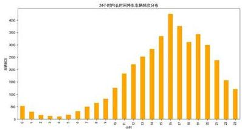

<details>
<summary>bar</summary>

24小时内长时停车车辆数量分布
| 月份 | 车辆数量 (辆) |
|---|---|
| 1 | 300 |
| 2 | 150 |
| 3 | 100 |
| 4 | 80 |
| 5 | 70 |
| 6 | 60 |
| 7 | 100 |
| 8 | 200 |
| 9 | 300 |
| 10 | 500 |
| 11 | 800 |
| 12 | 1500 |
| 13 | 2500 |
| 14 | 3000 |
| 15 | 3500 |
| 16 | 4200 |
| 17 | 3800 |
| 18 | 3200 |
| 19 | 3500 |
| 20 | 3000 |
| 21 | 2800 |
| 22 | 1800 |
| 23 | 1200 |
| 24 | 800 |
The chart displays the monthly count of vehicles in a specific time period. The x-axis represents months (1 to 24), and the y-axis represents the number of vehicles (in units). There is only one data series labeled '车辆数量' (car count).
</details>

图 12 长停车车辆平均时变图

以上述数据计算时间差大于一小时且小于十二个小时的车辆平均停留差值可得，将其作为平均停车的参考时长值，进行后续停车总需求时的计算。得到的计算结果如图 13 所示。


长时间停车车辆的平均时间差为：3.72 小时
进程已结束，退出代码为 0

图 13 停留车辆平均时

统计得到的巡游车的个数，将上述车辆在路网内长时间停留的平均时间作为后续估计停车位的平均停车时间，两者相乘求和计算，得到巡游车在五一假期在路网停留的日均总时长，以计算得到的停留总时长作为巡游车的停车平均时，最后按照假设每辆车的停车需求为四小时，计算平均每天需要增加的停车位数量。

# (2) 模型求解

步骤 1：数据预处理：将'时间'列转换为 datetime 类型，以便进行时间相关的计算。按照车牌号和时间对数据进行排序，确保数据的顺序性。

步骤2：定义阈值：设置低速行驶的速度阈值（30 km/h）。设置巡游车辆的巡游次数阈值（5次）。设置平均停车时间（3.72小时）。设置假期天数（5天）。

步骤3：识别车辆状态：按照上述约束进行计算。

步骤 4：计算时间差：使用 groupby 方法对数据按车牌号分组，然后对每组数据的时间列使用 diff() 方法计算时间差，单位为秒。

步骤 5：生成距离数据：按照主路的长度距离范围（1.8 到 3.5 之间），作为示例路段长度。计算每辆车的平均速度，假设速度与时间差成反比。

步骤6：标记低速行驶并统计每辆车的低速出现次数：根据定义的低速阈值，标记出低速行驶的记录。使用groupby方法对数据按车牌号分组，然后对每组数据的'低速'列

使用 sum() 方法统计低速行驶的次数。

步骤7：提取巡游车辆的信息：从vehicle\_stats中提取巡游车辆的信息。

步骤8：根据巡游车辆的数量和平均停车时间，计算假期期间的总停车需求（单位：秒），将总停车需求转换为小时。统计巡游车辆数量：使用\`nunique()\`方法统计数据集中巡游车辆的唯一车牌号数量，即巡游车辆的总数。

步骤9：计算停车位需求：假设每辆车平均停车时间为4小时，假期总时长为5天（即120小时）。

# (3) 结果分析

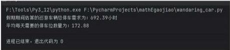

F:\Tools\Py3_12\python.exe F:\PycharmProjects\mathEgaojiao\wandaring_car.py
假期期间估算的巡航车辆包停车需求为: 692.39小时
平均每天需要的停车位数量为: 172.88

进程已结束，退出代码为 0

图 14 巡游车辆平均时变图

按照方法二的计算结果可得，如图14所示，五一期间景区及其周边应临时增加173个停车位。根据上述内容可知，结合图11和图12的结果，我们发现在0时到9时停放在该区域的车辆总数较少，然后停放的车辆逐渐在16时达到停放的高峰，这也比较符合一般条件，说明有一部分的人们通常会选择在上午9时0时左右开始出发前往该景区附近区域，游玩后进食午饭离开；还有另一部分人们会选择在周边进食后逗留在该区域附近进入景区进行游玩，在16时之后便会陆续离开；也有一小部分的人们会选择在晚上居住在景区附近过夜，所以晚上长时间停车车辆的下降趋势相对较缓。

根据上述内容，可以发现在中午10时开始，道路上的巡游车辆达到较高的水平，并呈现逐渐增长的趋势，在约14时达到巡游高峰；而在该区域停放的车辆则在大约14时-15时左右开始达到较高的水平，且在16时达到停放峰值。在五一假期期间景区可以根据这两个峰值进行停车位资源的时间分配策略，合理满足停车需求。

综合上述两个计算结果，由于方法一计算的车辆时间差间隔包含了0到30分钟的数据，约束相对较弱，会导致最后计算得到的停车位需求结果稍微偏大；而方法二略去了小于一分钟的数据，还加入了路段速度约束，可能会导致结果偏小。方法一计算得到的临时停车位为351；按照方法二的计算结果可得，五一期间景区及其周边应临时增加173个停车位。综合考虑，在五一期间景区及其周边应临时最少增加351个停车位，如果条件不允许或者有所限制，则至少应该增加174个临时停车位缓解道路压力。

# 5.4 问题4模型建立与求解

问题 4 分两方面分析，一方面是否对高峰时段进行合理管控，另一方面是否对巡游车辆减少。

<table><tr><td></td><td>方向</td><td></td><td>时间</td><td>车牌号</td><td>交叉口</td></tr><tr><td>1685546</td><td>1</td><td>2024-05-01T20:13:11.594</td><td>AF26BCE</td><td>环西路-林中路</td><td></td></tr><tr><td>1685547</td><td>1</td><td>2024-05-02T23:22:10.895</td><td>AF2YA78</td><td>环西路-林中路</td><td></td></tr><tr><td>1685548</td><td>1</td><td>2024-05-03T10:35:15.226</td><td>AF7A05EK</td><td>环西路-林中路</td><td></td></tr><tr><td>1685549</td><td>1</td><td>2024-05-03T21:16:56.803</td><td>AB7ZAB6M</td><td>环西路-林中路</td><td></td></tr><tr><td>1685550</td><td>1</td><td>2024-05-01T20:86:23.399</td><td>AFBCCC9M</td><td>环西路-林中路</td><td></td></tr><tr><td>...</td><td>...</td><td></td><td>...</td><td>...</td><td></td></tr><tr><td>6006656</td><td>1</td><td>2024-05-04T21:14:35.000</td><td>AF33BAL</td><td>经中路-林中路</td><td></td></tr><tr><td>6006659</td><td>1</td><td>2024-05-05T11:46:36.000</td><td>EBA3DZE</td><td>经中路-林中路</td><td></td></tr><tr><td>6006661</td><td>1</td><td>2024-05-04T12:11:34.000</td><td>AF8HKB6C</td><td>经中路-林中路</td><td></td></tr><tr><td>6006662</td><td>1</td><td>2024-05-04T18:42:34.000</td><td>AFABCD7</td><td>经中路-林中路</td><td></td></tr><tr><td>6006665</td><td>1</td><td>2024-05-05T15:27:50.000</td><td>EFEF75C</td><td>经中路-林中路</td><td></td></tr></table>

图 15 筛选五一黄金周数据结果

对比两个柱状图，对于经中路-纬中路这个中心交叉口的4月30日与5月1日的各方向流量对比，管制措施有效的缓解了18:00-19:00（晚高峰）拥堵情况，使晚高峰时段的流量进行了疏导。

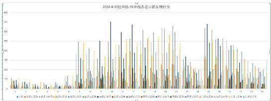  
图 18 2024 年 4 月 30 日拥堵情况

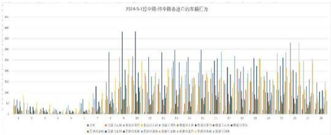

<details>
<summary>bar</summary>

2026-5-18 中路-9中路查进口的车辆行为
| 车辆 | 数量 |
|---|---|
| 玉米 | 3 |
| 美国 | 4 |
| 东风 | 5 |
| 江苏 | 6 |
| 长沙 | 7 |
| 宁波 | 8 |
| 泰美 | 9 |
| 兰灵 | 10 |
| 美亚 | 11 |
| 美丽 | 12 |
| 美丽红 | 13 |
| 美丽红 | 14 |
| 美丽红 | 15 |
| 美丽红 | 16 |
| 美丽红 | 17 |
| 美丽红 | 18 |
| 美丽红 | 19 |
| 美丽红 | 20 |
| 美丽红 | 21 |
| 美丽红 | 22 |
| 美丽红 | 23 |
| 美丽红 | 24 |
| 美丽红 | 25 |
| 美丽红 | 26 |
| 美丽红 | 27 |
| 美丽红 | 28 |
| 美丽红 | 29 |
| 美丽红 | 30 |
| 美丽红 | 31 |
| 美丽红 | 32 |
| 美丽红 | 33 |
| 美丽红 | 34 |
| 美丽红 | 35 |
| 美丽红 | 36 |
| 美丽红 | 37 |
| 美丽红 | 38 |
| 美丽红 | 39 |
| 美丽红 | 40 |
| 美丽红 | 41 |
| 美丽红 | 42 |
| 美丽红 | 43 |
| 美丽红 | 44 |
| 美丽红 | 45 |
| 美丽红 | 46 |
| 美丽红 | 47 |
| 美丽红 | 48 |
| 美丽红 | 49 |
| 美丽红 | 50 |
| 美丽红 | 51 |
| 美丽红 | 52 |
| 美丽红 | 53 |
| 美丽红 | 54 |
| 美丽红 | 55 |
| 美丽红 | 56 |
| 美丽红 | 57 |
| 美丽红 | 58 |
| 美丽红 | 59 |
| 美丽红 | 60 |
| 美丽红 | 61 |
| 美丽红 | 62 |
| 美丽红 | 63 |
| 美丽红 | 64 |
| 美丽红 | 65 |
| 美丽红 | 66 |
| 美丽红 | 67 |
| 美丽红 | 68 |
| 美丽红 | 69 |
| 美丽红 | 70 |
| 美丽红 | 71 |
| 美丽红 | 72 |
| 美丽红 | 73 |
| 美丽红 | 74 |
| 美丽红 | 75 |
| 美丽红 | 76 |
| 美丽红 | 77 |
| 美丽红 | 78 |
| 美丽红 | 79 |
| 美丽红 | 80 |
| 美丽红 | 81 |
| 美丽红 | 82 |
| 美丽红 | 83 |
| 美丽红 | 84 |
| 美丽红 | 85 |
| 美丽红 | 86 |
| 美丽红 | 87 |
| 美丽红 | 88 |
| 美丽红 | 89 |
| 美丽红 | 90 |
| 美丽红 | 91 |
| 美丽红 | 92 |
| 美丽红 | 93 |
| 美丽红 | 94 |
| 美丽红 | 95 |
| 美丽红 | 96 |
| 美丽红 | 97 |
| 美丽红 | 98 |
| 美丽红 | 99 |
| 美丽红 | 100 |

| 车辆类型 (车型) | 数量 (辆) |
| :---: :---: :---: :---: :---: :---: :---: :---: :---: :---: :---: :---: :---: :---: :---: :---: :---: :---: :---: :---: :---: :---: :---: :---: :---: :---: :---: :---: :---: :---: :---: :---: :---: :---: ::---: :---: :---: :---: :---: :---: :---: :---: :---: :---: :---: :---: :---: :---: :---: :---: :---: :---: :---: :---: :---: :---: :---: :---: :---: :---: :---: :---: :---: :---: :---: :---: :---: :----):
</details>

图 19 2024 年 5 月 1 日拥堵情况

根据问题 3 的巡游车辆定义，计算实施管控措施后巡游车辆数量随时间变化。结果下图。

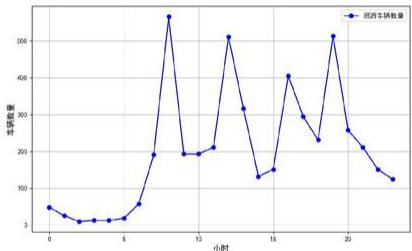

<details>
<summary>line</summary>

| 小时 | 车辆数量 |
|---|---|
| 0 | 60 |
| 1 | 45 |
| 2 | 35 |
| 3 | 35 |
| 4 | 35 |
| 5 | 40 |
| 6 | 190 |
| 7 | 580 |
| 8 | 190 |
| 9 | 200 |
| 10 | 210 |
| 11 | 520 |
| 12 | 320 |
| 13 | 130 |
| 14 | 140 |
| 15 | 410 |
| 16 | 300 |
| 17 | 220 |
| 18 | 520 |
| 19 | 260 |
| 20 | 210 |
| 21 | 150 |
| 22 | 130 |
</details>

图 20 巡游车辆数量随时间变化

实施措施之后巡游车辆随小时变化的数据不符合经中路-纬中路这个中心交叉口的分时段流量，因此可以得出早高峰时段维持时间变短，晚高峰时段被推迟。

从整体来看，临时性交通管控措施后的效果体现在两个方面：一方面，晚高峰期车辆的分布变得不明显，通过管控，晚高峰在中心交叉口车辆的总数量及车辆行为有所控制；另一方面，巡游车辆数量的峰值较为集中，反映了部分车辆集中在特定时段进入景区的行为。

# 六、模型的评价与推广

# 6.1模型的评价

1、数据驱动的决策支持：数据分析为决策提供了坚实的基础，减少了决策过程中的不确定性和偏差。通过精确的数据分析，管理者可以更有信心地制定策略，提高决策的质量和效率。  
2、灵活性与可扩展性：模型能够根据不同的需求和条件进行定制，使其能够适应多变的交通环境和管理需求。随着技术的进步和数据量的增加，模型可以不断扩展和升级，以适应更复杂的挑战。

3、针对性强：每个模型都针对特定的问题设计，确保了解决方案的精确性和有效性。明确的模型目标有助于集中资源和努力，提高问题解决的效率。  
4、量化评估与优化依据：模型能够提供量化的评估结果，帮助管理者理解不同措施的具体影响。基于数据的优化建议有助于实现资源的最优分配和使用。  
5、直观可视化：通过图表和图形等可视化手段，复杂的数据和分析结果变得更加易于理解。可视化工具使得决策者能够快速把握关键信息，加快决策过程。  
6、适应性强：模型能够适应实时变化的交通状况，为动态交通管理提供支持。例如，时段划分模型可以根据实际交通流量的变化进行调整，以应对高峰时段的挑战

# 6.2 模型的推广

1、跨区域应用与推广，模型可以根据各地区的具体需求进行定制，无论是景区、商业中心还是城市道路，都能提供有效的交通管理和流量预测。只要拥有相应的交通数据和停车数据，这些模型能够帮助解决不同区域的交通问题，例如问题一的时段划分和车流量估计可以推广到其他景区，商业中心或城市道路，帮助不同区域进行交通管理和流量预测。  
2、智能交通系统结合模型可以与现代智能交通管理系统结合，通过集成传感器、摄像头和车联网等技术，模型能够实时获取交通流量和车辆行为数据，提高交通管理的响应速度和准确性。结合实时监控系统，模型能够动态调整交通信号灯时长和停车资源，以适应不断变化的交通状况，提高交通系统的运行效率问题二的信号灯时长分配模型与实施流量监控系统结合，能够优化信号灯的分配，提高交通通行效率。问题三的巡游车辆识别可以结合实施控制系统动态调整停车资源。  
3、大规模城市交通优化模型特别适用于大城市的交通管理需求。大城市的交通系统通常更为复杂，模型能够处理大规模数据，为大城市提供有效的交通优化方案。模型能够提供系统性的交通管理策略，包括交通信号控制、公共交通调度、道路网络设计等，以满足大城市的交通管理需求。

# 七、参考文献

[1] 李伟龙, 张晓晴, 胡雅洁, 等. 基于 K-means 聚类算法的负荷峰谷时段划分 [J]. 电气开关, 2024, 62(04): 29-31.  
[2]李涛,任炳宇,张晨,等.“无站点”模式配送车辆配载与路径优化方法研究[J].综合运输,2024,46(08):150-156.DOI:10.20164/j.cnki.cn11-1197/u.2024.08.027.  
[3] 王飞, 魏林琳. 基于复杂网络的空中交通流量短期预测 [J]. 南京航空航天大学学报, 2024, 56(04): 741-749. DOI: 10.16356/j.1005-2615.2024.04.017.  
[4]王泉,陆啟想,施珘.用于交通流量预测的多图扩散注意力网络[J/OL].计算应用,1-10[2024-09-08].http://kns.cnki.net/kcms/detail/51.1307.TP.20240810.1439.008.html.  
[5] 黄君泽, 吴文渊, 李轶, 等. 面向动态公交的离散分层记忆粒子群优化算法 [J]. 计算机工程, 2024, 50(04): 20-30. DOI: 10.19678/j.issn.1000-3428.0068931.  
[6]陈春谊.基于模拟退火算法的深中通道交通5G基站部署规划设计应用[J].通讯世界,2024,31(07):42-44.

# 附录

# 问题一代码

```python
1. 交通量提取
import pandas as pd
import warnings
warnings.filterwarnings('ignore')
df2 = pd.read_csv("经中路-纬中路数据.csv", encoding='GBK')
df2['时间'] = pd.to_datetime(df2['时间'])
df2.set_index('时间', inplace=True)
weekdays_data = df2[df2.index.weekday < 8]
hourly_traffic = weekdays_data.groupby([weekdays_data.index.date, week-days_data.index.hour, '方向']).size()
hourly_traffic_df2 = hourly_traffic.reset_index(name='交通量')
hourly_traffic_df2.columns = ['日期', '小时', '方向', '交通量']
hourly_traffic_df2.to_csv('每日每小时的交通量.csv', index=False, encoding='GBK')

2. ANOVA 分析
import pandas as pd
import numpy as np
from scipy import stats
from statsmodels.stats.multicomp import pairwise_tukeyhsd
# 读取数据
traffic_data = pd.read_csv('每日每小时不分方向的交通量.csv', encoding='GBK', parse_dates=['日期'])
# 首先，添加一列来表示星期几
traffic_data['weekday'] = traffic_data['日期'].dt.weekday
# 准备 ANOVA 测试的数据
groups = []
values = [] 
```

```python
for day in range(7):
    day_data = traffic_data[traffic_data['weekday'] == day]
    group_label = 'Monday-Friday' if day < 5 else 'Saturday' if day == 5 else 'Sunday'
    groups.extend([group_label] * len(day_data))
    values.extend(day_data['交通量'])
# 进行 ANOVA 测试
anova_results = stats.f_oneway(*[values[i::7] for i in range(7) if i < 5 or i == 6])
print(f"ANOVA test results: F={anova_results.statistic}, p-value={anova_results.pvalue})")
# 如果 ANOVA 测试显示存在显著差异，进行 Tukey's HSD 事后测试
if anova_results.pvalue < 0.05:
    # 准备 Tukey's HSD 事后测试的数据
    tukey_groups = np.array(groups)
    # 进行 Tukey's HSD 事后测试
    tukey_results = pairwise_tukeyhsd(endog=values, groups=tukey_groups, alpha=0.05)
    # 输出 Tukey's HSD 测试结果
    print(tukey_results)
    # 提取并显示具体差异
    tukey_table = tukey_results.summary()
    print(tukey_table)

3.时段划分
3.1 K-means 聚类
import pandas as pd
from sklearn.cluster import KMeans
import matplotlib.pyplot as plt
import numpy as np
from sklearn.metrics import silhouette_score
# 读取数据 
```

```python
data = pd.read_csv("每日每小时的交通量.csv", encoding='GBK', parse_dates=['日期'], dayfirst=True)
    # 将日期列设置为日期时间格式
    data['日期'] = pd.to_datetime(data['日期'])
    # 筛选出4月份的数据
    data['month'] = data['日期'].dt.month
    april_data = data[data['month'] == 4]
    # 将数据透视为每个小时每个方向的交通量
    pivot_data = april_data.pivot_table(index='小时', columns='方向', values='交通量', aggfunc='sum')
    # 重置索引，以便小时成为一列
    pivot_data.reset_index(inplace=True)
    # 将所有列名转换为字符串类型
    pivot_data.columns = pivot_data.columns.astype(str)
    # 应用K-means聚类
    kmeans = KMeans(n_clusters=3)  # 假设我们想要将一天分为4个时段
    kmeans.fit(pivot_data.drop(columns='小时'))
    pivot_data['cluster'] = kmeans.labels_
    # 打印结果
    print(pivot_data[['小时', 'cluster']])
    # 可视化
    plt.figure(figsize=(12, 6))
    colors = ['red', 'green', 'blue', 'orange']
    for i in range(4):
    cluster_data = pivot_data[pivot_data['cluster'] == i]
    plt.scatter(cluster_data['小时'], cluster_data.mean(axis=1), color=colors[i], label=f'Cluster {i+1}')
    plt.xlabel('Hour of the Day')
    plt.ylabel('Average Traffic Volume')
    plt.title('Traffic Volume Clustering by Direction')
    plt.xticks(range(0, 24))  # 设置横轴刻度为每小时
```

```python
plt.legend()
plt.show()
# 可视化每个方向的交通量
plt.figure(figsize=(12, 6))
colors = ['red', 'green', 'blue', 'orange']
directions = pivot_data.columns[1:]  # 假设第一个列是'小时'，其余的是方向
for direction in directions:
    for i in range(4):
    cluster_data = pivot_data[pivot_data['cluster'] == i]
    plt.scatter(cluster_data['小时'], cluster_data[direction], color=colors[i], alpha=0.5, label=f'Cluster{i+1} - {direction}')
plt.xlabel('Hour of the Day')
plt.ylabel('Traffic Volume')
plt.title('Traffic Volume Clustering by Direction')
plt.xticks(range(0, 24))  # 设置横轴刻度为每小时
plt.legend()
plt.show()
silhouette_avg = silhouette_score(pivot_data.drop(columns=['小时', 'cluster']), pivot_data['cluster'])
print("轮廓系数：", silhouette_avg) 
```

# 3.2 DBSCAN

import pandas as pd

from sklearn.cluster import DBSCAN

import matplotlib.pyplot as plt

from sklearn.preprocessing import StandardScaler

from sklearn.metrics import silhouette\_score

\# 读取数据

data = pd.read\_csv("每日每小时的交通量.csv", encoding='GBK', parse\_dates=['日期'], dayfirst=True)

\# 将日期列设置为日期时间格式

data['日期'] = pd.to\_datetime(data['日期'])

\# 筛选出特定月份的数据，例如 4 月

```python
data['month'] = data['日期'].dt.month
may_data = data[data['month'] == 4]
# 选择特征和标签
# 假设我们只关注每小时的交通量总和
features = may_data.groupby('小时')['交通量'].sum().values.reshape(-1, 1)
labels = may_data.groupby('小时')['方向'].first().values    # 假设每个小时的方向
是一致的
# 将特征和标签合并为一个 DataFrame
df = pd.DataFrame({
    '小时': may_data.groupby('小时')['小时'].first(),
    '交通量': features.flatten(),
    '方向': labels
})
# 标准化特征
scaler = StandardScaler()
df['交通量'] = scaler.fit_transform(df[['交通量']])
# 应用 DBSCAN 聚类
dbscan = DBSCAN(eps=0.4, min_samples=5, algorithm='ball_tree')    # eps 和
min_samples 需要根据数据调整
clusters = dbscan.fit_predict(df[['交通量']])
# 将聚类结果添加到 DataFrame
df['cluster'] = clusters
# 打印结果
print(df)
# 可视化
plt.figure(figsize=(12, 6))
scatter = plt.scatter(df['小时'], df['交通量'], c=df['cluster'], cmap='viridis')
plt.title('DBSCAN Clustering of Traffic Volume by Hour')
plt.xlabel('Hour of the Day')
plt.ylabel('Traffic Volume')
plt.xticks(range(0, 24))
```

```python
plt.colorbar(scatter)
plt.show()
silhouette_avg = silhouette_score(df['交通量'], df['cluster'])
print("轮廓系数: ", silhouette_avg)

3.3 高斯混合 GMM
import pandas as pd
from sklearn.mixture import GaussianMixture
import matplotlib.pyplot as plt
from sklearn.preprocessing import StandardScaler
from sklearn.metrics import silhouette_score
# 读取数据
data = pd.read_csv("每日每小时的交通量.csv", encoding='GBK', parse_dates=['日期'], dayfirst=True)
# 将日期列设置为日期时间格式
data['日期'] = pd.to_datetime(data['日期'])
# 筛选出特定月份的数据，例如 4 月
data['month'] = data['日期'].dt.month
may_data = data[data['month'] == 4]
# 选择特征
grouped_data = may_data.groupby('小时')['交通量'].sum().reset_index()
# 标准化特征
scaler = StandardScaler()
grouped_data['traffic_volume_scaled'] = scaler.fit_transform(grouped_data['交通量']))
# 创建 GMM 实例
n_components = 3    # 假设我们想要聚类的时段
gmm = GaussianMixture(n_components=n_components, random_state=42)
# 拟合数据
gmm.fit(grouped_data['traffic_volume_scaled']])
# 预测每个数据点的簇标签
labels = gmm.predict(grouped_data['traffic_volume_scaled'])) 
```

```python
# 将聚类结果添加到 DataFrame
grouped_data['cluster'] = labels
# 打印结果
print(grouped_data['小时', '交通量', 'cluster'])
# 可视化
plt.figure(figsize=(12, 6))
plt.scatter(grouped_data['小时'], grouped_data['交通量'], c=grouped_data['cluster'], cmap='viridis')
plt.xlabel('Hour of the Day')
plt.ylabel('Total Traffic Volume')
plt.title('GMM Clustering of Traffic Volume by Hour')
plt.xticks(range(0, 24))
plt.show()
silhouette_avg = silhouette_score(grouped_data[['traffic_volume_scaled']], labels)
print("轮廓系数:", silhouette_avg)
4.XGBoost 交通量预测
import pandas as pd
import numpy as np
import xgboost as xgb
from sklearn.model_selection import train_test_split
import matplotlib.pyplot as plt
import matplotlib
# 设置 matplotlib 支持中文字体
matplotlib.rcParams['font.sans-serif'] = ['SimHei'] # 指定默认字体
matplotlib.rcParams['axes.unicode_minus'] = False # 解决负号显示问题
# 加载数据
df = pd.read_csv('每日每小时的交通量.csv', encoding='gbk')
# 将日期列设置为日期时间格式
df['日期'] = pd.to_datetime(df['日期'])
# 筛选 4 月 19 到 4 月 30 日的数据
start_date = '2024-04-19' 
```

```python
end_date='2024-04-30'
df = df[(df['日期'] >= start_date) & (df['日期'] <= end_date)]
# 打印筛选后的数据形状
print("Filtered data shape:", df.shape)
# 特征工程
df['hour_sin'] = np.sin(df['小时'] * (2. * np.pi / 24))
df['hour_cos'] = np.cos(df['小时'] * (2. * np.pi / 24))
# 预测每个方向的交通量
predictions = {}
total_pred = np.zeros(24) # 初始化总预测数组
for direction in df['方向'].unique():
    # 为每个方向筛选数据
    df_direction = df[df['方向'] == direction]
    # 确保每个方向都有24小时的数据
    if len(df_direction) < 24:
    print("Skipping direction {direction} due to insufficient data")
    continue
    # 手动选择测试数据
    test_data = df_direction.groupby('小时', as_index=False, group_keys=False).apply(
    lambda x: x.sample(n=1)).reset_index(drop=True)
    if len(test_data) == 24:
    X_test = test_data['小时', '方向', 'hour_sin', 'hour_cos']
    y_test = test_data['交通量']
    # 训练数据是剩余的数据
    train_indices = df_direction.index.difference(test_data.index)
    X_train = df_direction.loc[train_indices, ['小时', '方向', 'hour_sin', 'hour_cos']]
    y_train = df_direction.loc[train_indices, '交通量']
    # 训练模型 
```

```python
model = xgb.XGBRegressor(objective='reg:squarederror', random_state=42)
    model.fit(X_train, y_train)
    # 预测测试集
    pred_direction = model.predict(X_test)
    predictions[direction] = pred_direction
    # 绘制图形
    plt.figure(figsize=(14, 8))
    plt.plot(range(24), pred_direction, label=f'方向 {direction}')
    plt.title(f'方向 {direction} 交通量预测')
    plt.xlabel('小时')
    plt.ylabel('交通量')
    plt.xticks(range(0, 25))
    plt.legend()
    plt.show()
    else:
    print(f"Skipping direction {direction} due to insufficient test data")
# 累加每个方向的预测结果以得到总预测
# 绘制每个方向的预测结果
for direction, pred in predictions.items():
    if len(pred) == 24:
    plt.figure(figsize=(14, 8))
    plt.plot(range(24), pred, label=f'方向 {direction}')
    # 添加数据标签
    for i, txt in enumerate(pred):
    plt.text(i, txt, f'{txt:.2f}', ha='center', va='bottom')
    plt.title(f'方向 {direction} 交通量预测')
    plt.xlabel('小时')
    plt.ylabel('交通量')
    plt.xticks(range(0, 25))
    plt.legend()
    plt.show() 
```

```python
# 累加每个方向的预测结果以得到总预测
total_pred = np.sum(list(predictions.values()), axis=0)
# 绘制总交通量的变化图
plt.figure(figsize=(14, 8))
plt.plot(range(24), total_pred, label='总交通量', color='black')
# 添加数据标签
for i, txt in enumerate(total_pred):
    plt.text(i, txt, f'{txt:.2f}', ha='center', va='bottom')
plt.title('总交通量预测')
plt.xlabel('小时')
plt.ylabel('交通量')
plt.xticks(range(0, 25))
plt.legend()
plt.show()
# 累加每个方向的预测结果以得到总预测
for pred in predictions.values():
    if len(pred) == 24:
    total_pred += np.array(pred)
    else:
    print(f"Skipping incorrect prediction length")
# 创建一个空的 DataFrame 来存储预测结果
pred_df = pd.DataFrame()
# 将每个方向的预测结果添加到 DataFrame 中
for direction, preds in predictions.items():
    if len(preds) != 24:
    print(f"Warning: Direction '{direction}' has {len(preds)} data points, filling with zeros.")
    # 填充或截断数据以确保长度为 24
    padded_preds = np.pad(preds, (0, 24 - len(preds)), 'constant') if len(preds) < 24 else preds[:24]
    else:
    padded_preds = preds 
```

```python
# 创建临时 DataFrame
temp_df = pd.DataFrame({
    '小时': np.arange(24),
    '方向': np.repeat(direction, 24),
    '预测交通量': padded_preds
})
# 合并到主 DataFrame
pred_df = pd.concat([pred_df, temp_df], ignore_index=True)
# 打印结果
print(pred_df)
# 绘制表格
fig.ax = plt.subplots(figsize=(10, 8))
# 隐藏坐标轴
ax.axis('off')
# 绘制表格
table_data = pred_df['小时', '方向', '预测交通量']
table = ax.table(cellText = table_data.values, coll.labels = table_data.columns, loc='center', cellLoc='center')
# 调整表格样式
table.auto_set_font_size(False)
table.set_fontsize(12)
table.scale(1.2, 1.2)
plt.show()
pred_df.to_excel('预测交通量.xlsx', index=False) 
```

# 2026年全国大学生国家安全知识答题


Illustration of two cartoon children holding a shield with the number 4:15 (no text or symbols on subjects)