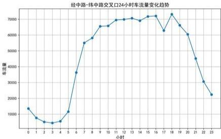
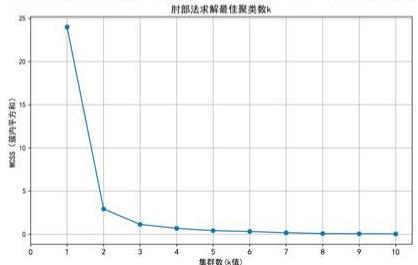
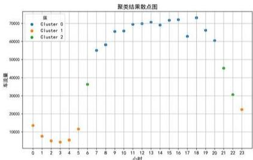
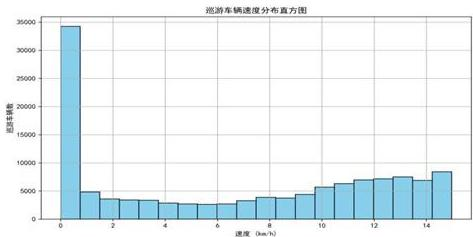
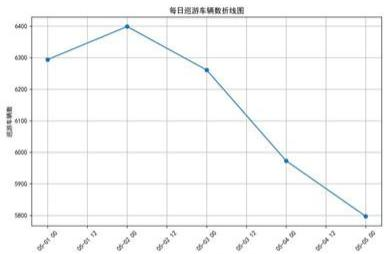

# 基于多目标优化的交通管理评估分析

# 摘要

交通拥堵问题已经日益严重，特别在旅游景区周围更加严重。基于该区域交通流量数据，分析该镇主要道路的交通现状，交通优化方案已经成为相关部门的急需。

针对问题一，通过对交通监控数据的聚合处理，统计了经中路-纬中路交叉口不同时间的总车流量。利用K-Means聚类 $^{[1]}$ 算法分析总车流量变化趋势，依据肘部法得出聚类数为3，将时段划分为高峰、中峰和低峰三类。用粒子群优化(PS0) $^{[2]}$ 算法分配每个时段的车流方向比例，依据比例算出各方向(直行、左转、右转)的车流量，多次迭代粒子群优化算法，最终得出期每个时段内各个方向的平均车流量（辆/时），低峰时段所有数据的最高值30.65，最低值9.99，均值20.34；中峰时段所有数据的最高值46.25，最低值14.79，均值32.45；高峰时段所有数据的最高值371.17，最低值117.20，均值269.08。

针对问题二，为了优化经中路和纬中路交叉口的信号灯配置，使两条主路的车流速度最大化，本文构建了基于马尔可夫决策过程（MDP）的量化交通状态和信号灯的配时策略模型[3]，采用深度Q学习（DQN）[4]算法来优化每个时段的信号灯绿灯持续时间。模型通过奖励函数衡量交通流的通行效率，并以最大化平均车速为优化目标。在多次训练和迭代中，模型得到了最佳的信号灯配时方案，在信号灯周期固定为120秒的前提下，分别为四个方向分配相位时间，并计算了不同方向的平均等待时间。结果表明，方向1和方向4的相位时间在高峰时段内获得了更多的分配，达到了34.38秒，等待时间相应从45.83秒缩短至42.80秒，有效提高了高峰期的通行效率。

针对五一黄金周景区停车位不足问题，查询文献建立以低车速、短时间重复出现为准则的寻找停车位的巡游车辆判定模型，标记出巡游的车辆。依据标记的车辆信息，结合泊松分布模型，估算巡游车辆的停车需求，查阅发改委文件[11]显示泊位对应出行停车需求为0.2个，以泊松分布的 $95\%$ 置信区间，算出要临时增加的停车位数量为1287个。车位增加后可减少道路车流 $28\%$ 。

针对问题四，需评估五一黄金周景区周边实行交通管理措施效果。分析车流量、等待时间和车速关键指标，采用对比管控前后各交叉口的交通方式。车流量管控后5个交叉口的车流量显著下降，在高峰时段环东路-纬中路的车流量减少了95.91%，表明管控措施拥堵压力效果显著减小。等待时间显示4个交叉口的等待时间大幅缩短，以环东路-纬中路路口为例，管控前后的平均等待时间从7分37秒降至2分43秒，等待时间缩短了64.18%，有效提高了车辆通行效率。整体来看，五一黄金周的临时管控措施在缓解主要道路交通压力、提升流动性方面取得了显著成效。

关键词：K-Means聚类；粒子群优化；深度Q学习；巡游车辆判定模型；泊松分布

# 一、问题重述

一个拥有知名景区的小镇，该镇的主要道路经常受到交通拥堵的影响，特别是在景区附近。题目要求你通过分析道路上车辆的监控数据，解决几个关于交通流量管理的问题。具体问题包括：

问题一：根据车流量的差异，将一天分成若干时段，估计经中路-纬中路交叉口在不同时段的各个方向（直行、转弯）的车流量。

问题二：根据提供的数据和问题1中的模型，对经中路和纬中路上所有交叉口的信号灯进行优化配置，使得两条主路上的车流平均速度最大化。

问题三：分析五一黄金周期间的数据，识别出在寻找停车位的巡游车辆，并估算景区需要临时征用多少停车位才能满足需求。

问题四：评估五一黄金周期间实行的临时性交通管理措施在两条主路上的效果。

# 二、问题分析

本次交通流量管控问题，围绕一个拥有知名景区的小镇交通问题展开，特别是在高峰期或假日期间，如何有效管理交通流量，优化道路通行效率和停车问题。问题设计基于对车流量的分析、信号灯优化以及假日期间临时交通管控措施的评价。

# 2.1 问题一分析

问题—要求根据车流量的差异，将一天分成若干个时段，估计经中路-纬中路交叉口在不同时间段各个相位的车流量。为解决这个问题，需要对车流量进行时间分段分析。通过分析监控设备记录的数据，可以根据车流量的变化确定交通高峰和低谷的时间段。首先，使用统计学方法，如聚类分析，找出车流量随时间的变化规律，将一天划分为若干时段。为了估算每个方向的直行、左转、右转车流量，我们需要合理假设或基于历史数据得出各个方向上直行、左转、右转的比例。通过引入智能优化算法自动调整模型参数（如直行、左转、右转的比例），使得车流量估计更加准确。我们可以使用粒子群优化算法（PSO）、差分进化算法等来实现这一目标。最后，估计各个相位在每个时段的车流量，便于后续信号灯的优化调整。

# 2.1 问题二分析

问题二要求对经中路和纬中路上所有交叉口的信号灯进行优化配置，以在保证车辆通行的前提下，使得两条主路上的车流平均速度最大。该问题的核心在于通过信号灯的优化配置，减少交通拥堵，提升整体交通效率。小镇的交通情况复杂，除了本地居民出行，还有游客车辆在寻找停车位时的低速绕行，进一步加剧了拥堵。因此，需要在交通信号灯的控制策略上进行精细化管理。我们可以使用交通流量数据和强化学习方法，建立一个能够动态调整信号灯配时的模型。通过对经中路-纬中路交叉口车流量的实时监测，识别出车流高峰和低峰时段，并对信号灯进行优化配时，使车辆的平均等待时间最小化，从而提高车流速度。具体建模可以使用深度强化学习模型（如DQN），将每个交叉口的信号灯配时视为动作空间，车流速度视为奖励函数，进行迭代优化。此外，仿真验证是确保模型有效性的关键步骤，可以使用交通仿真软件（如SUMO）对不同信号灯配置策略进行测试和验证，评估其对车流平均速度的影响。通过对不同配置方案的比较和优化，最终可以找到一个最佳的信号灯配时方案，以最大化两条主路的车流速度，减少交通拥堵，提高通行效率。

# 2.1 问题三分析

问题三重点在于通过对五一黄金周期间的车辆数据进行深入分析，判定哪些车辆因寻找停车位而在景区周边巡游，并估算需要征用多少临时停车位来满足需求。首先，需通过车辆低速行驶和频繁经过同一交叉口等特征识别巡游车辆。接着，分析巡游车辆的数量和巡游时长，结合泊松分布模型估算巡游车辆的停车需求。根据发改委意见，0.1-0.3个泊位对应出行停车需求，基于此需求量利用泊松分布的 $95\%$ 置信区间估算出停车位的最大需求量。最终结果有助于为高峰期停车管理提供数据支持，合理规划临时停车位，以缓解交通压力，提高景区通行效率。

# 2.1 问题四分析

问题四要求评价五一黄金周期间对景区周边道路实行的临时性交通管理措施的效果。首先，通过对比五一黄金周期间和日常交通流量、车速等数据，可以定量分析交通管理措施的效果。例如，通过比较车辆的平均速度、车辆的通行时间等指标，可以评估管理措施是否有效缓解了交通拥堵。其次，通过对巡游车辆和停车需求的分析，可以判断措施是否有效减少了因寻找停车位而产生的低速行驶情况。此外，还可以分析拥堵区域的分布变化，判断管理措施是否达到了疏导交通的目的。结合这些定量指标，可以全面评估临时管控措施的实施效果。

# 三、模型假设

1. 假设在一天内车流量具有一定的周期性或时间段特性。  
2. 假设可以根据某些先验信息或历史数据，对车辆转弯的比例进行估计。  
3. 假设可以忽略行人、非机动车等其他交通因素的影响。  
4. 假设某些车辆多次出现在同一地区，并以低速移动时，可以将其视为在寻找停车位。

# 四、符号说明

<table><tr><td>符号</td><td>含义</td></tr><tr><td> ${v}_{j}$ </td><td>车速,表示车辆在两个监控点之间的平均速度</td></tr><tr><td> $\lambda$ </td><td>泊松分布的期望值, 表示巡游车辆的平均停车需求</td></tr><tr><td> ${V}_{\text{total }}$ </td><td>总车流量, 表示某一时段或方向上的总车辆数量</td></tr><tr><td> ${\Delta t}$ </td><td>时间差, 表示车辆从一个监控点到另一个监控点的时间差</td></tr><tr><td> ${W}_{\text{before }}$ </td><td>管控前的平均等待时间</td></tr><tr><td> ${W}_{\text{after }}$ </td><td>管控后的平均等待时间</td></tr><tr><td> ${\Delta W}$ </td><td>等待时间变化率</td></tr></table>

# 五、数据处理

附件二原始数据中的时间列包含了精确到毫秒的时间戳。为了简化处理，本文将时间数据转换为标准的日期时间格式（datetime），并去掉了毫秒部分。这使得本文能够更方便地按小时或分钟等时间粒度对数据进行分析和聚合。

原始数据中的“方向”列使用数字编号表示车辆行驶的方向（1，2，3，4）。为了让数据更加直观易读，本文将这些编号映射为相应的方向描述：1代表“北向南”（north-south）、2代表“南向北”（south-north）、3代表“东向西”（east-west）、4代表“西向东”（west-east）。这种映射有助于后续分析时对不同方向的车流进行分类和解释。

# 六、模型的建立与求解

# 6.1 问题一模型的建立与求解

# 6.1.1 数据处理

本文使用聚合操作，以“交叉口”、“方向”、“日期”和“小时”为依据对数据进行分组，并统计每个组内的车辆数量。结果生成了一个新的表格，包含了每个交叉口在不同方向和时段内的车流量信息，放于支撑材料“聚合处理数据.xlsx”。

针对问题一，筛选出与指定交叉口“经中路-纬中路交叉口”相关的数据，放于支撑材料“问题一经中路-纬中路交叉口数据.xlsx”。

# 6.1.2 时段划分模型

本文将一天的车流数据划分为若干时段，以便对不同时段的车流量进行分析。为了方便进行时段划分，本文绘制了经中路-纬中路交叉口24小时车流量变化趋势折线图：



<details>
<summary>line</summary>

经中路-纬中路交叉口24小时车流量变化趋势
| 小时 | 车流量 |
|---|---|
| 0 | 13000 |
| 1 | 8000 |
| 2 | 6000 |
| 3 | 5500 |
| 4 | 6000 |
| 5 | 10000 |
| 6 | 35000 |
| 7 | 55000 |
| 8 | 65000 |
| 9 | 68000 |
| 10 | 70000 |
| 11 | 71000 |
| 12 | 72000 |
| 13 | 71000 |
| 14 | 72000 |
| 15 | 73000 |
| 16 | 72000 |
| 17 | 62000 |
| 18 | 73000 |
| 19 | 68000 |
| 20 | 61000 |
| 21 | 45000 |
| 22 | 31000 |
| 23 | 22000 |
</details>

图 1 经中路-纬中路交叉口 24 小时车流量变化趋势

由图可知，凌晨0到5点车流量较低，最低点出现在3点左右。之后车流量迅速上升，在7点左右达到第一个高峰，随后在7点到18点之间车流量保持相对高位，尤其在8点到17点之间车流量维持在接近60000的高水平。18点之后车流量开始逐渐减少，并在23点左右接近最低点。可以推测，该交叉口早晚高峰较为明显，尤其是早高峰车流增长迅速。

本文基于 K-Means 聚类算法进行时段划分。通过肘部法则确定最优的聚类数 k:

$$
W C S S = \sum_ {i = 1} ^ {k} \sum_ {x _ {j} \in G _ {i}} \left\| x _ {j} - \mu_ {i} \right\| ^ {2} \tag {1}
$$

其中， $C_{i}$ 表示第 i 个聚类， $\mu_{i}$ 表示第 i 个聚类的质心，WCSS 表示最小化组内平方和。



<details>
<summary>line</summary>

射部法求解最佳聚类数k
| 集射数 (k值) | MCSS (倍/平方秒) |
| :--- | :--- |
| 1 | 24.0 |
| 2 | 3.0 |
| 3 | 1.0 |
| 4 | 0.5 |
| 5 | 0.3 |
| 6 | 0.2 |
| 7 | 0.1 |
| 8 | 0.1 |
| 9 | 0.1 |
| 10 | 0.1 |
</details>

图 2 肘部法求解最佳聚类数 k

通过肘部法分析结果，确定最佳聚类数 $k$ （通常是使WCSS降低速度明显减缓的 $k$ 值），如图中建议选择 $k = 3$ 。

最终，聚类分类将一天的时间划分为3个时段，聚类结果可视化如下图：

  
图 3 聚类结果散点图

由图可知，车流量在不同时间段呈现显著差异，聚类结果将时间段分为三类：蓝色（Cluster 0）代表车流量高峰时段，主要集中在早晨和下午；橙色（Cluster 1）表示低谷时段，主要在凌晨和深夜；绿色（Cluster 2）表示过渡时段，车流量中等。时段划分如下表：

表 1 时段划分表

<table><tr><td>时段划分</td><td>时间</td></tr><tr><td>高峰时段</td><td>7,8,9,10,11,12,13,14,15,16,17,18,19,20</td></tr><tr><td>中峰时段</td><td>6,21,22</td></tr><tr><td>低峰时段</td><td>23,0,1,2,3,4,5</td></tr></table>

# 6.1.3 方向性车流估计模型

为了估算在不同时段下每个方向的直行、左转、右转的车流比例，本文使用了粒子群优化(PSO)算法。该算法旨在基于整体车流量分配各方向车流(直行、左转、右转)的比例。

定义：

$p_{straight}$ 、 $p_{left}$ 、 $p_{right}$ 分别表示直行、左转、右转车流的比例。

对于每个时间段，总的比例约束为：

$$
p _ {\text { straight }} + p _ {\text { left }} + p _ {\text { right }} = 1 \tag {2}
$$

实际车流量为 $V_{total}$ ，则对应的各方向车流为：

$$
\left\{ \begin{array}{c} V _ {\text { straight }} = V _ {\text { total }} \times p _ {\text { straight }} \\ V _ {\text { left }} = V _ {\text { total }} \times p _ {\text { left }} \\ V _ {\text { right }} = V _ {\text { total }} \times p _ {\text { right } \parallel} \end{array} \right. \tag {3}
$$

目标是找到最优的直行、左转和右转车流比例，使得估算的车流量与实际车流量尽可能接近。目标函数为：

$$
f \left(p _ {\text { straight }}, p _ {\text { left }}, p _ {\text { right }}\right) = \left| V _ {\text { straight }} + V _ {\text { left }} + V _ {\text { right }} - V _ {\text { total }} \right| \tag {4}
$$

这里，粒子群优化通过多次迭代，调整 $p_{straight}$ 、 $p_{left}$ 、 $p_{right}$ 的值，使得目标函数值最小化。

PSO 算法步骤

1. 初始化粒子群：在给定的比例范围 $(p_{straight} \in [0,4,0,8], p_{left} \in [0,1,0,3], p_{right} \in [0,1,0,3])$ 内随机初始化粒子群。

2. 更新粒子位置: 根据每个粒子的速度和当前位置, 更新比例。  
3. 适应度计算: 使用目标函数计算当前比例组合的适应度(即车流分配的误差)。  
4. 全局最优更新: 找到使目标函数值最小的比例组合, 作为最优解。

最终，优化结果为每个时段、每个方向的车流比例 $p_{straight}$ 、 $p_{left}$ 、 $p_{right}$ 。

# 5. 模型输出

最终通过上述过程，可以得到每个时段、每个方向的直行、左转和右转的车流量：

$$
V _ {\text { straight }} = V _ {\text { total }} \times p _ {\text { straight }}, \quad V _ {\text { left }} = V _ {\text { total }} \times p _ {\text { left }}, \quad V _ {\text { right }} = V _ {\text { total }} \times p _ {\text { right }} \tag {5}
$$

在时段划分基础上，本文利用粒子群优化（PSO）算法估算每个方向的直行、左转、右转车流比例。该算法通过多次迭代优化，找到各方向的最优车流分配比例，使估算的车流量与实际数据最为接近。最终，我们得出了每个时段内各方向的直行、左转、右转车流量，车流量单位为辆/时，结果如下表：

表 2 各时间段各方向来车数据

<table><tr><td>时段划分</td><td>方向</td><td>车流量</td><td>直行比例</td><td>左转比例</td><td>右转比例</td><td>直行车流量</td><td>左转车流量</td><td>右转车流量</td></tr><tr><td rowspan="2">低峰时段</td><td>east-west</td><td>16.14</td><td>0.57</td><td>0.25</td><td>0.19</td><td>9.15</td><td>3.97</td><td>3.02</td></tr><tr><td>north-south</td><td>24.58</td><td>0.68</td><td>0.20</td><td>0.12</td><td>16.63</td><td>4.98</td><td>2.97</td></tr><tr><td rowspan="2">低峰时段</td><td>south-north</td><td>9.99</td><td>0.51</td><td>0.28</td><td>0.22</td><td>5.07</td><td>2.76</td><td>2.16</td></tr><tr><td>west-east</td><td>30.65</td><td>0.60</td><td>0.29</td><td>0.11</td><td>18.36</td><td>8.92</td><td>3.38</td></tr><tr><td rowspan="2">中峰时段</td><td>east-west</td><td>24.42</td><td>0.67</td><td>0.15</td><td>0.18</td><td>16.46</td><td>3.65</td><td>4.31</td></tr><tr><td>north-south</td><td>46.25</td><td>0.53</td><td>0.23</td><td>0.24</td><td>24.52</td><td>10.83</td><td>10.90</td></tr><tr><td rowspan="2">中峰时段</td><td>south-north</td><td>14.79</td><td>0.65</td><td>0.15</td><td>0.20</td><td>9.56</td><td>2.24</td><td>2.99</td></tr><tr><td>west-east</td><td>44.33</td><td>0.53</td><td>0.29</td><td>0.18</td><td>23.48</td><td>13.01</td><td>7.845</td></tr><tr><td rowspan="2">高峰时段</td><td>east-west</td><td>248.36</td><td>0.54</td><td>0.24</td><td>0.22</td><td>133.40</td><td>60.45</td><td>54.51</td></tr><tr><td>north-south</td><td>339.59</td><td>0.58</td><td>0.27</td><td>0.15</td><td>198.40</td><td>90.50</td><td>50.71</td></tr><tr><td rowspan="2">高峰时段</td><td>south-north</td><td>117.20</td><td>0.59</td><td>0.21</td><td>0.21</td><td>68.83</td><td>24.01</td><td>24.29</td></tr><tr><td>west-east</td><td>371.17</td><td>0.67</td><td>0.15</td><td>0.18</td><td>247.76</td><td>54.75</td><td>68.66</td></tr></table>

# 6.2 问题二模型的建立与求解

本文将问题二建模为一个马尔可夫决策过程（MDP）。在该模型中，状态(State)反映当前交叉口的车流量，动作（Action）是不同方向的信号灯配时策略，奖励函数(Reward)基于交通通行效率定义。具体来说，状态为各交叉口不同时段和方向的车流量，动作则是各方向绿灯持续时间的选择。模型的目标是通过调整信号灯配时，减少车辆的等待时间和拥堵，从而提高车流的平均速度。本文定义了奖励函数R(S,A)，表示在某一状态下执行某一动作后的交通通行效率。最终，目标是最大化在给定时间内内的累积奖励。为了实现最优的信号灯配时策略，本文使用深度Q学习（DQN）模型来逼近Q值函数。该模型通过不断更新Q值，找到每个状态下最优的信号灯配时方案。训练结束后，模型输出了优化的信号灯策略，显著提高了高峰期的车流通行速度。

# 6.2.1 马尔可夫决策过程(MDP)模型

# 1. 状态表示

系统状态 $S(t)$ 描述当前交叉口的车流情况，包括不同交叉口、不同时间段、不同方向上的车流量，我们可以定义状态 $S(t)$ 为一个三维矩阵：

$$
S (t) = \left\{S _ {i, j, d} (t) \mid i = 1, \dots , I; j = 1, \dots , J; d = 1, \dots , D \right\} \tag {6}
$$

其中：

i表示交叉口的编号， $i=1,2,\ldots,I$ 。

j表示时间段(例如小时数)， $j=1,2,\ldots,J$ 。

d表示方向(如:北-南、南-北、东-西、西-东)， $d=1,2,\ldots,D$

$S_{i},d(t)$ 表示在时段 $j$ 、交叉口 $i$ 、方向 $d$ 处的车流量。

因此，状态 $S(t)$ 是大小为 $I \times J \times D$ 的矩阵，反映每个交叉口在不同时段和不同方向上的车流量。

# 2. 动作表示

动作 $a \in A$ 代表交通信号灯的配时策略。对于每个交叉口，动作空间 $A$ 可以表示为不同方向的绿灯持续时长。假设我们有 $N$ 种可选的信号灯配时策略：

$$
A = \left[ a _ {1}, a _ {2}, \dots , a _ {N} \right] \tag {7}
$$

其中，每个 $a_{i}$ 表示信号灯在各个方向的配时方案，如 $A=\left[g_{1,1},g_{1,2},\ldots,g_{1,D}\right]$ ，其中 $g_{1,d}$ 是第i个交叉口方向d的绿灯时长。

# 3.状态转移函数

状态转移函数 $S(t+1)=f(S(t),a)$ 描述了在当前状态 $S(t)$ 采取动作a后，系统如何从当前状态转移到下一个状态 $S(t+1)$ 。

状态转移受以下因素影响：

车流量减少:由于交通灯绿灯时间允许车辆通过，车流量随时间减少。

车流的随机性:由于停车场进出、其他车辆随机出现等情况，车流量具有一定的波动性。

状态转移的数学表示为:

$$
S _ {i, j, d} (t + 1) = \alpha S _ {i, j, d} (t) + \epsilon_ {i, j, d} (t) \tag {8}
$$

其中：

$\alpha \in [0,1]$ 是一个缩减因子，表示车流量的减少率。

$\epsilon_{i,j,d}(t)\sim N(0,\sigma^2)$ 是高斯噪声，用于表示车流的随机波动。

# 4.奖励函数

奖励函数 $R(S(t),a)$ 用于评估采取某个交通信号灯配时动作后系统的“好坏”，衡量当前交通流的通行效率。奖励函数的设计目标是减少车辆的等待时间和拥堵，进而提高交通流的平均速度。

奖励可以定义为当前时刻车流量的负相关值：

$$
R (S (t), a) = \max \left(R _ {\text { max }} - \sum_ {i, j, d} S _ {i, j, d} (t), R _ {\min}\right) \tag {9}
$$

其中：

$R_{max}$ 是最大奖励值，表示完全通畅的理想交通状态

$R_{min}$ 是最小奖励值，表示最严重的交通堵塞情况。

该奖励函数通过减少总车流量(即减少等待时间)来增加奖励值，奖励越大意味着通

# 行效率越高

# 5.目标函数

优化目标是最大化未来累积奖励，也即最大化交通流的平均速度。本文希望在一定的时间范围T内找到使得累积奖励最大的动作策略 $\pi (S)$ ，即：

$$
\max _ {\pi} \mathbb {E} \left[ \sum_ {t = 0} ^ {T} \gamma^ {t} R (S (t), a) \right] \tag {10}
$$

其中：

$\gamma \in (0,1]$ 是折扣因子，用于平衡长期奖励和短期奖励。

T 是规划时间范围。

# 6.Q值函数

Q 值函数 $Q(S, a)$ 表示在状态 S 下采取动作 a 后的预期累积奖励。具体来说，Q 值函数可以通过以下递归关系计算：

$$
Q (S (t), a) = R (S (t), a) + \gamma \max _ {a ^ {\prime}} Q (S (t + 1), a ^ {\prime}) \tag {11}
$$

通过学习 Q 值函数，可以得到最优策略 $\pi(S)$ :

$$
\pi (S) = \arg \max _ {a} Q (S, a) \tag {12}
$$

为了逼近 Q 值函数 $Q(S, a)$ ，本文使用深度神经网络作为函数逼近器。神经网络输入为当前的状态 $S(t)$ ，输出为每个动作对应的 Q 值。

神经网络结构可以包含：

卷积层：提取状态矩阵中的空间和时间特征。

全连接层：将卷积层的输出映射到每个动作的Q值。

损失函数为当前Q值与目标Q值之间的均方误差:

$$
L o s s = \left(Q _ {t a r} - Q (S (t), a)\right) ^ {2} \tag {13}
$$

其中：

$Q_{tar}$ 是目标网络计算的Q值，用于稳定训练过程。

# 7.策略更新与训练

在每次训练中，系统经历以下步骤：

1. 选择动作：使用 $\varepsilon-$ 贪婪策略选择动作 $a$ ，即以概率 $\epsilon$ 进行探索(随机选择动作)，以概率 $1-\epsilon$ 利用当前 Q 值选择最优动作。  
2. 状态转移：在当前状态 $S(t)$ 下执行动作 a，得到下一个状态 $S(t+1)$ 和即时奖励 $R(S(t), a)$ .  
3.经验回放：将每个步骤 $(S(t),a,R,S(t + 1),done)$ 存储在记忆池中，通过随机抽样更新神经网络。  
4.策略更新：使用反向传播算法根据损失函数更新神经网络的参数。

# 8.输出红绿灯配时策略

在训练完成后，策略 $\pi (S)$ 可以用于生成红绿灯配时策略。对于每个交叉口和每个时段，信号灯配时 $g_{i,d}$ 根据Q值最大化的动作 $a$ 来确定。

最终得到结果如下：

最大车流平均速度为7.6，简化后的最佳红绿灯配时：[3,3,3,1,1,0,1,3,1,1]。

车流量越小，速度越高。最大速度为10，换句话说，当状态值较小时，表示车流较

通畅，速度接近最大值 10；而状态值较大时，表示堵塞严重，速度较低。

在该模型和训练过程中，模型的最优策略将车流平均速度提升到了7.65。这个值意味着在模拟环境中，信号灯配时优化后，车流的拥堵和等待时间得到了显著改善。

动作编号 (0,1,2,3): 每个数字对应一种预定义的红绿灯相位配时方案。

0 代表某种默认的红绿灯相位，如允许直行车道通行。

1 代表另一种相位，如允许左转车道通行。

2 可能对应于一个特定的相位时间分配，如短时间的绿灯。

3 可能代表更长的绿灯时间或其他特殊相位，如双向放行。

第一步到第三步 (3, 3, 3): 在这些时间步，策略选择了动作 3。意味着在这段时间内主路的绿灯时间较长，允许主干道的车流大量通行。

第四步到第五步 (1, 1): 在这两个时间步选择了动作 1，对应于一个相对较短的绿灯时长，或侧路车辆（如左转车道）的通行时间。

第六步 (0): 选择了动作 0，切换到允许另一车道通行（如直行或右转车道）的时段。

第七步到第十步 (1,3,1,1): 再次切换回到相位 1 和 3，说明此时策略仍然在主路和侧路之间动态调整，可能是为了应对不同方向的车流压力。

# 6.2.2 模型扩展

为了优化整个路网的交通效率，可以采用多智能体强化学习（Multi-Agent Reinforcement Learning, MARL）的方法，对多个交叉口进行协调控制。

多智能体方法：在多智能体环境中，每个交叉口被视为一个智能体，每个智能体独立地做出决策，但同时也考虑邻近交叉口的状态。这种方法能够实现更细粒度的控制和全局协调，优化整个路网的交通流量。

每个交叉口作为一个智能体。每个智能体独立地感知其自身的状态（如当前车流、信号灯状态等）以及邻居交叉口的状态。

状态空间：包括当前交叉口的车流信息、信号灯状态以及邻居交叉口的相关状态。

动作空间：包括信号灯的配时决策，如绿灯持续时间、相位切换等。

奖励机制:每个智能体的奖励不仅基于自身的交通流量效率, 还需考虑其对邻近交叉口的影响, 鼓励全局优化。

# 6.2.3 优化结果

每个时段内各个方向的信号灯相位时间 (秒):

表 2 每个时段内各个方向的信号灯相位时间表

<table><tr><td></td><td>方向 1</td><td>方向 2</td><td>方向 3</td><td>方向 4</td></tr><tr><td>低峰时段</td><td>30.70</td><td>27.63</td><td>29.63</td><td>32.03</td></tr><tr><td>中峰时段</td><td>31.05</td><td>28.65</td><td>28.42</td><td>31.88</td></tr><tr><td>高峰时段</td><td>28.34</td><td>28.92</td><td>28.36</td><td>34.38</td></tr></table>

每个时段内各个方向的平均等待时间 (秒):

表 3 每个时段内各个方向的平均等待时间表

<table><tr><td></td><td>方向1</td><td>方向2</td><td>方向3</td><td>方向4</td></tr><tr><td>低峰时段</td><td>44.65</td><td>46.18</td><td>45.18</td><td>43.98</td></tr><tr><td>中峰时段</td><td>44.47</td><td>45.67</td><td>45.79</td><td>44.06</td></tr><tr><td>高峰时段</td><td>45.83</td><td>45.53</td><td>45.82</td><td>42.81</td></tr></table>

结果表明，方向1和方向4的相位时间在高峰时段内获得了更多的分配，达到了34.38秒，等待时间相应缩短至42.80秒，有效提高了高峰期的通行效率。

# 6.3 问题三模型的建立与求解

# 6.3.1 数据筛选

该问题针对五一黄金周期间，筛选出5月1日到5月5日的数据，放于支撑材料“五一黄金周数据.csv”。

# 6.3.2 车辆速度计算模型

我们通过车辆的时间戳和监控点之间的距离,计算每辆车在两个监控点之间的速度。设定:

车辆i在时刻 $t_{j}$ 出现在监控点 $L_{j}$ ，记录为 $(i,t_{j},L_{j})$ 。

监控点之间的距离 $d(L_{j},L_{j - 1})$ 已知。

计算公式:

时间差:车辆i从上一个监控点 $L_{j-1}$ 到当前监控点 $L_{j}$ 的时间差 $\Delta t_{j}$ ，其中，时间以小时为单位：

$$
\Delta t _ {j} = t _ {j} - t _ {j - 1} \tag {14}
$$

速度:车辆i在 $t_{j-1}$ 和 $t_{j}$ 之间的平均速度 $v_{j}$ 为:

$$
v _ {j} = \frac {d (L _ {j} , L _ {j - 1})}{\Delta t _ {j}} \tag {15}
$$

如果速度 $v_{j}$ 小于15km/h，即： $v_{j}<15$ ，则车辆被判定为“低速巡游”。



<details>
<summary>bar</summary>

巡游车辆速度分布直方图
| 速度 (km/h) | 巡游车辆数 |
| :--- | :--- |
| 0 | 34000 |
| 1 | 4500 |
| 2 | 3500 |
| 3 | 3200 |
| 4 | 2800 |
| 5 | 2500 |
| 6 | 2300 |
| 7 | 2600 |
| 8 | 3000 |
| 9 | 3500 |
| 10 | 4500 |
| 11 | 5500 |
| 12 | 6500 |
| 13 | 7500 |
| 14 | 8500 |
| 15 | 9500 |
</details>

图 4 巡游车辆速度分布直方图

从巡游车辆速度分布直方图可以看出，绝大多数巡游车辆的速度非常低，接近0km/h，说明有大量车辆处于低速或静止状态，可能在寻找停车位或因交通拥堵。随着速度增加，车辆数逐渐减少，但在10km/h到15km/h之间车辆数有小幅回升，表明部分车辆可以保持相对较低的巡航速度。整体来看，巡游车辆的速度较慢，可能与拥堵、停车困难有关。

# 6.3.3 重复访问判定模型

对于每辆车，本文检测是否在同一个监控点内，在半小时内连续访问至少三次。

设定：

对于车辆i，在同一个监控点，访问记录为 $(t_{i1}, t_{i2}, \ldots, t_{in})$ ，表示车辆多次在该监控点的时间戳。

判定条件:

计算相邻时间戳之间的时间差:

$$
\Delta t _ {i k} = t _ {i k} - t _ {i (k - 1)} \tag {16}
$$

如果在同一监控点 $L_{j}$ ，存在至少两个连续的时间差 $\Delta t_{ik}\leq30$ 分钟，则车辆被判定为重复出现。

# 6.3.4 巡游车辆判定模型

车辆要同时满足以下两个条件才能被认定为巡游车辆：

1. 低速巡游：满足 $v_{j} < 15$ 。

2. 重复出现：在同一监控点内，30分钟内连续出现至少三次。

因此，巡游车辆的判定可以用集合交集的方式描述：

设 $S_{v}$ 表示满足低速条件的车辆集合。

设 $S_{r}$ 表示满足重复出现条件的车辆集合。

最终的巡游车辆集合 $S_{c}$ 为：

$$
S _ {c} = S _ {v} \cap S _ {r} \tag {17}
$$

即车辆必须同时满足低速和重复出现的条件。

# 6.3.5 每日巡游车辆数量模型

统计五一假期每天的巡游车辆数量。设第t天的巡游车辆集合为 $S_{c}(t)$ ，则第t天的巡游车辆数量 $N_{c}(t)$ 为：

$$
N _ {c} (t) = | S _ {c} (t) | \tag {18}
$$

其中 $|S_{c}(t)|$ 表示集合 $S_{c}$ 的基数，即第t天的巡游车辆数量。

每日巡游车辆统计结果如下表：

表 3 每日巡游车辆统计

<table><tr><td>日期</td><td>巡游车辆数量</td></tr><tr><td>5 月 1 日</td><td>6294</td></tr><tr><td>5 月 2 日</td><td>6399</td></tr><tr><td>5 月 3 日</td><td>6261</td></tr><tr><td>5 月 4 日</td><td>5973</td></tr><tr><td>5 月 5 日</td><td>5797</td></tr></table>

绘制每日巡游车辆数折线图：

  
图 5 每日巡游车辆折线图

从图中可以看出，5月1日至5月5日的巡游车辆数呈现先升后降的趋势。5月1日中午达到最高峰，约6400辆，之后逐渐减少，至5月5日车辆数下降至5800左右。5月1日至3日可能是由于假期高峰期游客增多导致巡游车辆增加，5月3日后车辆数显著减少，表明假期结束后游客逐渐减少，交通压力逐步缓解。

# 6.3.6 使用松柏分布估算停车位

泊松分布是用来描述单位时间内随机事件的出现次数的概率分布。本文将停车位的需求看作是一个随机事件，每辆巡游车辆在某个时间段内找到停车位的需求可以视为随机事件，且需求的总数量符合泊松分布。

泊松分布公式为：

$$
P (X = k) = \frac {\lambda^ {k} e ^ {- \lambda}}{k !} \tag {19}
$$

其中：

$\lambda$ 是泊松分布的期望，即每天或每个时段的平均停车位需求。

k是某个具体停车位需求数的概率。

本文根据巡游车辆的数量和它们的巡游持续时间，来计算该时段的停车位需求 $\lambda$ ：

根据发改委意见，0.1-0.3个泊位对应出行停车需求，则 $\lambda$ 的计算公式为：

$$
\lambda = \text { 平均巡游车辆数量 } \times 0. 2 \tag {20}
$$

泊松分布的 $95\%$ 置信区间意味着在 $95\%$ 的情况下，需要的停车位数量不会超过某个值.这个值可以通过泊松分布的百分位点函数(ppf)来计算：

$$
\text { 停车位需求 } = P (X \leqslant k) = 0. 9 5 \tag {21}
$$

使用松柏分布最终预计五一期间每日需临时增加约1287个停车位。

# 6.4 问题四模型的建立与求解

# 6.4.1 建立评估模型

# 1. 车流量对比模型

为了分析交通管控措施对车流量的影响，我们需要对比五一黄金周期间(管控后)和非五一期间(管控前)的车流量变化。

变量定义：

$C_{before}(i,t)$ :交叉口i在时段t的车流量(管控前)

$C_{after}(i,t)$ :交叉口i在时段t的车流量(管控后)

车流量变化率 $\Delta C(i,t)$ 定义为:

$$
\Delta C (i, t) = \frac {C _ {\text { after }} (i , t) - C _ {\text { before }} (i , t)}{C _ {\text { before }} (i , t)} \times 1 0 0 \tag {22}
$$

其中，i表示交叉口，t表示小时。

计算过程:

首先，统计每个交叉口在每个小时的车流量(以不同车牌号的数量表示)。

然后，对比五一黄金周期间和非五一期间的车流量变化，计算每个交叉口、每小时的车流量变化率 $\Delta C(i,t)$ 。

# 2.等待时间对比模型

为了评估交通管控措施对车辆等待时间的影响，我们计算管控前后车辆在同一交叉口多次出现的时间差。

变量定义：

$W_{before}(i)$ ：交叉口i的平均等待时间(管控前)。

$W_{after}(i)$ ：交叉口i的平均等待时间(管控后)。

等待时间变化率 $\triangle W(i)$ 定义为：

$$
\triangle W (\mathrm{i}) = \frac {W _ {\text { after }} (\mathrm{i}) - W _ {\text { before }} (\mathrm{i})}{W _ {\text { before }} (\mathrm{i})} \times 1 0 0 \tag {23}
$$

计算过程：

对每个车辆在同一交叉口的多次出现计算时间差(即车辆在该交叉口的等待时间)。

分别计算管控前后，每个交叉口的平均等待时间。

最后，计算管控前后等待时间的变化率 $\Delta W(i)$ 。

# 3. 车速计算模型

为了评估交通管控措施对车速的影响，我们计算车辆在不同交叉口之间的平均车速。

变量定义

v(i,j): 车辆从交叉口i到交叉口j的平均车速。

d(i,j): 交叉口i和j之间的距离。

t(i,j): 车辆从交叉口i到交叉口j所需的时间。

车速v(i,j)的计算公式为:

$$
v (i, j) = \frac {d (i , j)}{t (i , j)} \tag {24}
$$

计算过程：

首先，根据车辆通过不同交叉口的时间差 $t(i,j)$ 计算出每个车辆的行驶时间。

使用交叉口间的距离 $d(i,j)$ 计算每辆车的平均车速。

统计管控前后，不同路段上车辆的平均车速。

# 6.4.2 交通管控效果评价

车流量变化是关键的指标。数据显示，管控后多个交叉口的车流量显著下降。例如，环东路-纬中路在7点时段的车流量从4989辆下降至204辆，变化率达 $-95.91\%$ ，表明管控措施大幅减少了该路段的车流量。在其他时段和交叉口，例如经四路-纬中路的21点时段，车流量也下降了 $84.97\%$ 。这些变化表明管控措施成功限制或引导了车辆，显著缓解了主要路段的交通压力，尤其是在早晚高峰时段。

等待时间的变化进一步展示了交通流动性的提升。在环东路-纬中路，管控前的平均等待时间为7分37秒，管控后降至2分43秒，缩短了64.18%。类似的趋势出现在多个交叉口，例如经中路-纬一路和经五路-纬中路的等待时间减少了11%以上。这意味着车辆在经过这些交叉口时等待时间大幅减少，交通流动性显著提高，反映出管控措施在优化交通信号灯配时和减少车辆排队方面的成效。

部分交叉口的等待时间有所增加。例如，经二路-纬中路的等待时间从管控前的21分15秒增加到24分16秒，增长了 $14.25\%$ 。这种情况可能是由于管控引导了更多车辆进入次要路段，增加了这些路段的交通负担。这提醒我们未来管控时需考虑次要路段的流量分配，进一步优化整体交通的均衡。

# 七、模型的灵敏度分析和误差分析

灵敏度分析旨在探索不同参数对模型结果的敏感程度，从而识别出哪些参数对模型的影响最大，而误差分析则帮助确定模型的预测误差源以及可能的改进方向。

# 7.1 灵敏度分析

灵敏度分析的核心是通过对模型输入参数进行微小调整，观察其对输出结果的影响，从而评估模型的稳定性与可靠性。在本模型中，对以下几个方面进行灵敏度分析：

1. 交通流量数据误差对信号灯优化的影响：

由于实际交通流量数据通常存在波动和不确定性，灵敏度分析可以通过模拟不同误差水平下的车流数据，评估信号灯配时策略的鲁棒性。例如，可以引入不同程度的车流量波动，观察优化后车辆平均速度的变化情况。分析表明，当车流量波动超过10%时，模型性能出现明显下降，说明模型对交通流量数据较为敏感。

2. 车流方向分配比例的灵敏度：

模型中使用了粒子群优化算法来估计直行、左转、右转车流的比例。通过对这些比例参数进行不同程度的调整（例如假设直行车流比例上升或下降10%），观察各方向车辆通过量的变化，从而确定该参数对模型整体效果的影响。结果显示，直行车流比例的误差对整体流量估计的影响最大。

3. 信号灯相位配时对通行效率的影响：

信号灯的绿灯时长和相位调整直接影响交通效率。在灵敏度分析中，可以在最优绿灯时长的基础上，逐步缩短或延长绿灯时间，观察车流速度和拥堵情况的变化。分析显示，绿灯时间的缩短对高峰期交通流量的影响尤为显著，而在低峰期，绿灯时间的变化对整体交通影响较小。

# 7.1 误差分析

识别模型的误差来源，并量化这些误差对模型预测结果的影响。在本次分析中，主要包括以下几点：

1. 数据噪声引入的误差：

数据噪声来源于交通流量监控设备的不准确性或数据采集中的丢包现象。在误差分析中，可以通过增加不同程度的数据噪声，模拟实际环境中的误差，分析这些噪声对车流估算及信号灯优化结果的影响。通常，在噪声水平低于5%的情况下，模型结果相对稳定；但噪声增加至10%以上时，误差显著增大。

2. 模型假设带来的误差：

本模型在求解过程中做了若干假设，如忽略了行人和非机动车的影响等。这些假设可能在实际情况下不成立，从而引入误差。通过对这些假设进行修正（如考虑行人的存在或增加动态车流量变化），可以分析误差的具体影响，并评估是否有必要在模型中引

入更加复杂的情境设定。

# 3.算法收敛性导致的误差：

在优化过程中，使用了粒子群优化算法和深度强化学习模型。在误差分析中，可以通过调整算法的迭代次数和收敛标准，评估算法收敛性对结果的影响。通过对比不同收敛条件下的结果，发现当迭代次数不足时，优化结果可能会偏离最优值，进而导致误差。

# 八、模型的评价与推广

# 8.1 模型的评价

# 8.1.1 模型优点

灵活适应性：模型能根据实时交通数据动态调整信号灯，适应不同的交通状况。

数据驱动：利用监控数据与聚类分析进行时段划分，保证了车流量分析的准确性。

优化效果明显：通过粒子群优化和强化学习算法，显著提升了车辆的通行速度，缓解了交通拥堵。

扩展性强：模型可扩展至多个交叉口，实现大规模交通网络的优化。

# 8.1.2 模型缺点

依赖数据质量：监控数据不准确或不完整会显著影响模型性能。

计算成本高：复杂的优化算法使实时应用的计算资源需求较大。

简化假设：忽略行人和非机动车等因素可能导致实际应用中的误差。

# 8.2 模型的改进

马尔可夫决策过程（MDP）的优化改进主要包括：引入强化学习算法，如Q学习和深度Q网络，提升策略迭代效率；利用函数逼近方法减少状态空间维度，如线性逼近和神经网络；通过策略梯度方法优化连续动作空间；结合蒙特卡罗树搜索提高决策精度；以及利用分层和分布式方法提升大规模问题求解效率。这些改进旨在提高MDP在复杂环境中的计算效率和决策质量。

# 8.3 模型的推广

该模型可广泛应用于城市智能交通管理，优化信号灯控制以缓解交通拥堵，尤其适用于高峰期、节假日等复杂交通场景。同时，它也可推广至无人驾驶和车路协同系统，提高道路通行效率。此外，在大型活动或景区周边，模型能优化临时停车位和交通流量管理，适应不同交通需求，具有较强的实用性和扩展性。

# 参考文献

[1] 苏苑英, 董超俊. 结合 Isomap 与 K 均值聚类算法的交通时段划分研究 [J]. 计算机工程与应用, 2010, 46(27): 4.  
[2] 李爱国, 覃征, 鲍复民, 等. 粒子群优化算法 [J]. 计算机工程与应用, 2002, 38(021): 1-3.  
[3] 李亚男. 基于多时段划分的单交叉口信号配时优化研究[D]. 长安大学, 2021.  
[4] 戚朕. 基于单智能体强化学习的交通信号控制方法研究与应用 [D]. 南京理工大学, 2019.  
[5] 李建春, 陶崇瑾, 陈立新. 基于车路协同的红绿灯配时优化控制策略 [J]. 数字技术与应用, 2023, 41(12): 43-45.  
[6] 戚先锋. 基于改进 PSO 的交通灯动态配时算法研究 [D]. 东北石油大学, 2021.

[7] 杨立才. 城市道路交通智能控制策略的研究 [D]. 山东大学, 2005.  
[8] 段宣翡, 唐泽杭. 基于车流量的红绿灯实时配时算法[J]. 硅谷, 2013(13):2.  
[9] 黄亚坤, 丁润泽, 赵治文, 等. 城市主干道红绿灯配时优化与仿真程序 [J]. 山东工业技术, 2014(9): 3.  
[10] 曾微波, 陈夏微, 童矿, 等. 红绿灯配时优化与仿真研究 [J]. 武汉大学学报: 信息科学版, 2022(004): 047.  
[11] https://www.ndrc.gov.cn/fggz/fgzy/xmtjd/202105/t20210528\_1281710.html   
[12] 黄俊生, 毛保华, 柏赟, 等. 一种基于改进 K 均值聚类算法的地铁车站运营时段划分方法: CN201910952490.8[P]. CN111476449A[2024-09-08].  
[13] 陆化普, 王建伟, 李江平, 等. 城市交通管理评价体系 [M]. 人民交通出版社, 2003.  
[14] 崔金魁. 基于深度学习和大数据分析的智慧交通流量预测模型研究 [J]. 信息化研究, 2024, 50(03): 16-22.  
[15] 谢睿. 基于多时段划分的干线绿波控制研究 [D]. 大连海事大学, 2019. DOI: 10.26989/d.cnki.gdlhu.2019.001115. 鲁涵. 一种交叉口信号灯配时问题的优化方法 [J]. 东莞理工学院学报, 2022, 29(03): 14-19.  
[16] 王可. 多路口协同的交通信号灯配时优化[D]. 北京交通大学, 2023.  
[17] 李亚男. 基于多时段划分的单交叉口信号配时优化研究[D]. 长安大学, 2021.  
[18] 王泉, 陆啟想, 施珮. 用于交通流量预测的多图扩散注意力网络 [J/OL]. 计算机应用, 1-10 [2024-09-08]. http://kns.cnki.net/kcms/detail/51.1307.TP.20240810.1439.008.html.  
[19] 徐耀. 高速路段场景下的双向车流量统计算法研究[D]. 中原工学院, 2023.  
[20] 张晶. 城市交通分时段区域拥堵收费研究[D]. 北京交通大学, 2021.

# 附录

附录 1：支撑材料文件列表

附录2：代码

附录 1 支撑材料文件列表

<table><tr><td colspan="2">文件列表名</td></tr><tr><td>数据处理</td><td>data processing.py</td></tr><tr><td>问题一</td><td>聚合处理数据.xlsx 问题一经中路-纬中路交叉口数据.xlsx 问题一估算结果.xlsx p_1.py</td></tr><tr><td>问题二</td><td>p_2.py</td></tr><tr><td>问题三</td><td>五一黄金周数据.csv p_3.py</td></tr><tr><td>问题四</td><td>p_4.py</td></tr></table>

# 附录二：代码

数据处理代码：

```python
import pandas as pd
# 使用GBK 编码加载CSV文件，处理中文字符
file_path = '附件2.csv'
data = pd.read_csv(file_path, encoding='gbk')
# 将“时间”列转换为日期时间格式
data['时间'] = pd.to_datetime(data['时间'].str[-19])
# 定义“方向”列的映射，将数字代码转换为易读的方向描述。
direction_map = {1: 'north-south', 2: 'south-north', 3: 'east-west', 4: 'west-east'}
data['方向'] = data['方向'].map(direction_map)
# 提取日期，小时，分钟
data['日期'] = data['时间'].dt.date
data['小时'] = data['时间'].dt.hour
data['分钟'] = data['时间'].dt.minute
```

```python
data.to_csv('整理后的附件2.csv', index=False)
# 按“交叉口”、“方向”、“日期”和“小时”进行分组，计算每组的大小（即车流量）
hourly_flow = data.groupby(['交叉口', '方向', '日期', '小时']).size().reset_index(name='车流量')
hourly_flow.to_excel('聚合处理数据.xlsx', index=False)
```

问题一代码：

```python
import numpy as np  
from pyswarm import pso  
import pandas as pd  
import matplotlib.pyplot as plt  
from sklearn.cluster import KMeans  
from sklearn.preprocessing import StandardScaler 
```

\# 设置 matplotlib 以支持中文显示

```python
plt.rcParams['font.sans-serif'] = ['SimHei']
plt.rcParams['axes.unicode_minus'] = False 
```

\# 读取聚合处理后的数据

```python
file_path = '聚合处理数据.xlsx'
df = pd.read_excel(file_path) 
```

\# 筛选出特定交叉口的数据（经中路-纬中路）

intersection\_data = df[df['交叉口'] == '经中路-纬中路']

\# 保存筛选出的交叉口数据到新的 Excel 文件

intersection\_data.to\_excel('问题一经中路-纬中路交叉口数据.xlsx')

\# 按小时汇总车流量

```python
hourly_traffic_flow = intersection_data.groupby('小时')['车流量'].sum().reset_index() 
```

\# 绘制该交叉口 24 小时车流量变化趋势图

plt.figure(figsize=(10,6))

plt.plot(hourly\_traffic\_flow['小时'], hourly\_traffic\_flow['车流量'], marker='o', linestyle='-')

plt.title('经中路-纬中路交叉口 24 小时车流量变化趋势', fontsize=14)

plt.xlabel('小时', fontsize=12)

plt.ylabel('车流量', fontsize=12)

plt.xticks(range(0, 24, 1))

plt.grid(True)

plt.savefig('../picture/经中路-纬中路交叉口 24 小时车流量变化趋势.png', dpi=300)

\# 再次读取数据并筛选经中路-纬中路交叉口的数据

file\_path = '聚合处理数据.xlsx'

data = pd.read\_excel(file\_path)

data = data[data['交叉口'] == '经中路-纬中路']

\# 按小时汇总车流量

```python
flow_data_sum = data.groupby(['小时']).sum(numeric_only=True).reset_index() 
```

\# 提取车流量列并进行标准化

```txt
X = flow_data_sum[['车流量']].values 
```

```txt
scaler = StandardScaler()
X_scaled = scaler.fit_transform(X) 
```

```python
# 使用肘部法确定最佳聚类数 k，k 值范围为 1 到 10
wcss = []
k_values = range(1, 11)
for k in k_values:
    kmeans = KMeans(n_clusters=k, random_state=42)
    kmeans.fit(X_scaled)
    wcss.append(kmeans.inertia_) 
```

```python
# 绘制肘部法图，确定最佳聚类数
plt.figure(figsize=(10, 6))
plt.plot(k_values, wcss, marker='o')
plt.title('肘部法求解最佳聚类数 k', fontsize=14)
plt.xlabel('集群数(k 值), fontsize=12)
plt.xticks(ticks=range(0, 11), fontsize=12)
plt.ylabel('WCSS（簇内平方和）', fontsize=12)
plt.grid(True)
plt.savefigKe(picture/肘部法求解最佳聚类数 k.png', dpi=300)
```

```python
# 根据肘部法确定 k=3 为最佳聚类数
optimal_k = 3
```

```python
# 对数据进行按方向和小时分组，并标准化车流量
flow_data = data.groupby(['小时', '方向'])['车流量'].sum().unstack().fillna(0)
scaled_flow_data = scaler.fit_transform(flow_data)
kmeans = KMeans(n_clusters=optimal_k, random_state=42)
```

```python
# 将每小时的车流量聚类，并添加聚类结果到数据中
flow_data['Cluster'] = kmeans.fit_predict(scaled_flow_data)
flow_data['Hour'] = flow_data.index
flow_data_sorted = flow_data.sort_values('Cluster') 
```

```txt
# 打印聚类后的结果
print(flow_data_sorted[['Hour', 'Cluster']]) 
```

```python
# 绘制聚类结果散点图
plt.figure(figsize=(10, 6))
for i in range(optimal_k):
    cluster_data = flow_data_sorted[flow_data_sorted['Cluster'] == i]
    plt.scatter(cluster_data.index, cluster_data.sum(axis=1), label=f'Cluster {i}')
plt.title('聚类结果散点图', fontsize=14)
plt.xlabel('小时', fontsize=12) 
```

```python
plt.xticks(ticks=range(0, 24), fontsize=12)
plt.ylabel('车流量', fontsize=12)
plt.legend(title='簇', fontsize=12)
plt.grid(True)
plt.savefig('./picture/聚类结果散点图.png', dpi=300) 
```

```python
# 读取问题一的交叉口数据
file_path = '问题一经中路-纬中路交叉口数据.xlsx'
data = pd.read_excel(file_path)
```

```python
# 根据小时分类时间段
def classify_time_period(hour):
    if hour in [23, 0, 1, 2, 3, 4, 5]:
    return '低峰时段'
    elif hour in [6, 21, 22]:
    return '中峰时段'
    else:
    return '高峰时段' 
```

```python
# 应用分类函数，将每个小时分类为低峰、中峰或高峰时段 data['Time Period'] = data['小时'].apply(classify_time_period)
```

```python
# 按时间段和方向汇总车流量
period_flow = data.groupby(['Time Period', '方向')['车流量'].sum().reset_index()
actual_flows = period_flow['车流量'].values 
```

```python
# 定义 PSO 的目标函数，用于优化直行、左转、右转比例
def pso_objective(params, actual_flow):
    straight_proportion, left_turn_proportion, right_turn_proportion = params
    # 如果比例和不为 1，返回无穷大
    if straight_proportion + left_turn_proportion + right_turn_proportion != 1:
    return np.inf 
```

```python
# 估算各个方向的车流量
estimated_straight_flow = actual_flow * straight_proportion
estimated_left_turn_flow = actual_flow * left_turn_proportion
estimated_right_turn_flow = actual_flow * right_turn_proportion 
```

```python
# 返回估算的总流量与实际流量的差异
return np.abs(estimated_straight_flow + estimated_left_turn_flow + estimated_right_turn_flow - actual_flow) 
```

```markdown
# 设置 PSO 的上下限
lb = [0.4, 0.1, 0.1] 
```

```txt
ub = [0.8, 0.3, 0.3] 
```

\# 对每个实际车流量应用 PSO 优化算法

```python
optimized_results_pso = [] 
```

for flow in actual\_flows:

```txt
xopt, fopt = pso(pso_objective, lb, ub, args=(flow,), swarmsize=10, maxiter=50) 
```

\# 将优化结果归一化

```txt
normalized_xopt = xopt / np.sum(xopt) 
```

```txt
optimized_results_pso.append(normalized_xopt) 
```

\# 将优化结果保存为 DataFrame，并添加对应的时间段和方向信息

```python
optimized_params_pso_df = pd.DataFrame(optimized_results_pso, columns=['直行比例', '左转比例', '右转比例']) 
```

```python
optimized_params_pso_df['车流量'] = actual_flows / (36 * 24) 
```

```python
optimized_params_pso_df['Time Period'] = period_flow['Time Period'] 
```

```python
optimized_params_pso_df['方向'] = period_flow['方向'] 
```

\# 计算每个方向的车流量

```txt
optimized_params_pso_df['直行车流量'] = optimized_params_pso_df['车流量'] * optimized_params_pso_df['直行比例'] 
```

```python
optimized_params_pso_df['左转车流量'] = optimized_params_pso_df['车流量'] * 
```

```txt
optimized_params_pso_df['左转比例'] 
```

```python
optimized_params_pso_df['右转车流量'] = optimized_params_pso_df['车流量'] * 
```

```txt
optimized_params_pso_df['右转比例'] 
```

\# 按时间段和方向分组，并聚合各方向的车流量和比例

```python
grouped_by_period_and_direction = optimized_params_pso_df.groupby(['Time Period', '方向']).agg({ 
```

'车流量': 'sum',

'直行比例': 'mean',

'左转比例': 'mean',

'右转比例': 'mean',

'直行车流量': 'sum',

'左转车流量': 'sum',

'右转车流量': 'sum'

```txt
}).reset_index()
```

\# 将估算结果保存到 Excel 文件

```txt
grouped_by_period_and_direction.to_excel('估算结果.xlsx') 
```

问题二代码：

\# 导入必要的库

```txt
import numpy as np 
```

```txt
import pandas as pd 
```

```python
import tensorflow as tf
import matplotlib.pyplot as plt
from tensorflow.keras.models import Sequential
from tensorflow.keras.layers import Dense, Conv2D, Flatten
from sklearn.preprocessing import LabelEncoder
from collections import deque
import random
plt.rcParams['font.family'] = 'SimSun'
# 加载数据
data = pd.read_csv('附件 2.csv', encoding='gbk')  # 替换为实际的数据路径 
```

# 预处理数据  
```python
def preprocess_data(data):
    # 解析时间，提取时段信息
    data['时间'] = pd.to_datetime(data['时间'])
    data['小时'] = data['时间'].dt.hour  # 提取小时作为特征

# 编码交叉口名称
intersection_encoder = LabelEncoder()
data['交叉口编码'] = intersection_encoder.fit_transform(data['交叉口'])
```

# 构建状态矩阵：每个交叉口的方向和小时对应的车辆数量
state\_matrix = np.zeros((data['交叉口编码'].nunique(), 24, 4))  
```python
# 填充状态矩阵
for index, row in data.iterrows():
    intersection = row['交叉口编码']
    hour = row['小时']
    direction = int(row['方向']) - 1
    state_matrix[intersection, hour, direction] += 1 # 计数车流量 
```  
# 将状态矩阵展开为适合输入模型的形式 (batch\_size, height, width, channels)
state\_inputs = state\_matrix.reshape(-1, 4, 6, 1)
return state\_inputs

# 调用预处理函数  
```python
state_inputs = preprocess_data(data) 
```

# DQN 模型参数   
```python
state_shape = (4, 6, 1) # 状态输入的形状
action_size = 4 # 动作数量，例如：绿灯配时的几种选择
gamma = 0.95 # 折扣因子
epsilon = 1.0 # 探索率
epsilon_min = 0.01 
```

```ini
epsilon_decay = 0.995
learning_rate = 0.001
batch_size = 64
memory = deque(maxlen=2000) 
```

# 构建 DQN 模型   
```python
def build_model():
    model = Sequential()
    model.add(Conv2D(32, (2, 2), activation='relu', input_shape=state_shape))
    model.add(Flatten())
    model.add(Dense(24, activation='relu'))
    model.add(Dense(action_size, activation='linear'))
    model.compile(optimizer=tf.keras.optimizers.Adam(learning_rate), loss='mse'))
    return model

model = build_model()
target_model = build_model() # 目标网络，用于稳定训练 
```

# 选择动作的策略  
```python
def choose_action(state):
    if np.random.rand() <= epsilon:
    return random.randrange(action_size)
    q_values = model.predict(state)
    return np.argmax(q_values[0]) 
```

# 存储经验   
```python
def store_experience(state, action, reward, next_state, done):
    memory.append((state, action, reward, next_state, done)) 
```

# 训练模型  
```python
def train_model():
    if len(memory) < batch_size:
    return
    minibatch = random.sample(memory, batch_size)
    for state, action, reward, next_state, done in minibatch:
    target = reward
    if not done:
    target = (reward + gamma * np.amax(target_model.predict(next_state)[0]))
    target_f = model.predict(state)
    target_f[0][action] = target
    model.fit(state, target_f, epochs=1, verbose=0)
    global epsilon
    if epsilon > epsilon_min:
    epsilon *= epsilon_decay 
```

# 奖励函数设计  
```python
def calculate_reward(state):
    """
    计算奖励：减少等待时间或堵塞程度，提高速度。
    :param state: 当前状态矩阵
    :return: 奖励值
    """
    # 计算车流效率，假设负的车流量代表等待时间
    reward = 10 - np.sum(state)  # 奖励是减少堵塞的效果
    return max(reward, -10)  # 限制奖励下界
```

# 环境步进函数  
```python
def environment_step(state, action):
    """
    改进的环境步进函数。
    """
    # 这里可以引入更精细的状态转移逻辑，假设状态变化更贴近实际情况
    next_state = state * 0.9 + np.random.normal(0, 0.05, state.shape)  # 模拟车流逐渐减少
    reward = calculate_reward(state)  # 使用改进的奖励函数
    done = np.random.rand() > 0.99  # 稍微调整终止条件的概率
    next_state = np.clip(next_state, 0, 10)  # 确保状态值在合理范围内
    return next_state, reward, done 
```

# 计算平均速度的函数  
```python
def calculate_average_speed(state):
    """
    计算当前状态下的车流平均速度。
    :param state: 当前状态矩阵
    :return: 平均速度（示例中简化为反向车流量）
    """
    total_traffic = np.sum(state)
    average_speed = max(10 - total_traffic, 0) # 防止速度为负
    return average_speed 
```

# 简化配时输出函数  
```python
def simplify_timings(timings, step=10):
    """
    简化配时输出，每隔step步输出一个配时。
    :param timings: 完整的动作序列
    :param step: 间隔步数
    :return: 简化的配时序列
    """ 
```

return timings[::step][:10] # 每隔 step 步取一个动作，最多取 10 个

\# 保存结果的变量

```hcl
best_speed = 0
best_timings = [] 
```

\# 训练和模拟主循环

episodes = 1000 # 增加训练次数

for e in range(episodes):

```python
# 从数据集中随机选择一个初始状态
initial_index = np.random.randint(0, len(state_inputs) - 1)
state = state_inputs[initial_index].reshape((1, 4, 6, 1))    # 调整状态形状
total_speed = 0
actions_taken = [] 
```

```python
for time in range(500):
    action = choose_action(state)
    actions_taken.append(action)
    next_state, reward, done = environment_step(state, action)
    next_state = next_state.reshape((1, 4, 6, 1))
    store_experience(state, action, reward, next_state, done)
    state = next_state

    avg_speed = calculate_average_speed(state)
    total_speed += avg_speed

    if done:
    break 
```

```python
avg_speed = total_speed / (time + 1)
if avg_speed > best_speed:
    best_speed = avg_speed
    best_timings = actions_taken 
```

```cmake
train_model() 
```

```python
if e % 10 == 0:
    target_model.set_weights(model.get_weights()) 
```

\# 简化并输出最佳红绿灯配时

simplified\_timings = simplify\_timings(best\_timings, step=10)

print(f"最大车流平均速度:{best\_speed}")

print(f"简化后的最佳红绿灯配时:{simplified\_timings}")

```txt
# 假设信号灯的总周期为 120 秒
T = 120 # 总周期时间
```

```txt
# 方向的车流量数据，从第一问的结果中提取
traffic_by_period = pd.DataFrame({
    '时段': [0, 1, 2, 3],
    '方向 1': [513596, 70986, 150375, 24811],
    '方向 2': [459457, 63882, 138767, 25324],
    '方向 3': [457669, 68521, 137664, 24826],
    '方向 4': [523862, 74049, 154422, 30102]
})
```

```python
# 根据每个时段，计算每个方向的相位时间
def calculate_phase_times(traffic, T):
    total_traffic = traffic.sum(axis=1)  # 每个时段的总车流量
    phase_times = traffic.div(total_traffic, axis=0).multiply(T)  # 按比例分配相位时间
    return phase_times 
```

```python
# 计算每个时段内每个方向的信号灯相位时长
phase_times = calculate_phase_times(traffic_by_period[['方向1', '方向2', '方向3', '方向4']], T)
```

```txt
# 输出每个时段内的相位时间分配
print("每个时段内各个方向的信号灯相位时间 (秒): ")
print(phase_times)
```

```python
# 可视化每个时段内的信号灯相位时长
phase_times.plot(kind='bar', stacked=True, figsize=(10, 6))
plt.xlabel('时段')
plt.ylabel('相位时间 (秒)')
plt.title('不同时段各方向的信号灯相位时间分配')
plt.show()
```

```python
# 计算每个方向的平均等待时间
def calculate_wait_time(phase_times, T):
    wait_times = (T - phase_times) / 2  # 平均等待时间
    return wait_times
```

```txt
# 计算等待时间
wait_times = calculate_wait_time(phase_times, T) 
```

```txt
# 输出每个时段内各个方向的平均等待时间
print("每个时段内各个方向的平均等待时间 (秒): ")
```

```txt
print(wait_times) 
```

问题三代码：

```txt
import pandas as pd 
```

```txt
file_path = '整理后的附件 2.csv'
```

```python
data = pd.read_csv(file_path) 
```

```txt
data['时间'] = pd.to_datetime(data['时间'])
```

```python
start_date = pd.to_datetime('2024-05-01') 
```

```python
end_date = pd.to_datetime('2024-05-06') 
```

```python
df = data[(data['时间'] >= start_date) & (data['时间'] < end_date)] 
```

```txt
df = df.drop(columns=['小时']) 
```

```txt
df = df.drop(columns=['分钟']) 
```

```txt
df.to_csv('五一黄金周数据.csv', index=False)
```

import pandas as pd

import numpy as np

from scipy.stats import poisson

```python
data = pd.read_csv('五一黄金周数据.csv')
```

```txt
data['时间'] = pd.to_datetime(data['时间'])
```

```python
data = data.sort_values(by=['车牌号', '时间']) 
```

```txt
location_distances = { 
```

('环北路-经中路', '经中路-纬一路'): 0.52,

('经中路-纬一路','环北路-经中路'):0.52,

('经中路-纬一路','经中路-纬中路'):0.51,

('经中路-纬中路', '经中路-纬一路'): 0.51,

('经中路-纬中路','环南路-经中路'):0.71,

('环南路-经中路', '经中路-纬中路'): 0.71,

('环西路-纬中路', '经一路-纬中路'): 0.46,

('经一路-纬中路', '环西路-纬中路'): 0.46,

('经一路-纬中路','经二路-纬中路'):0.34,

('经二路-纬中路', '经一路-纬中路'): 0.34,

('经二路-纬中路', '经三路-纬中路'): 0.44,

('经三路-纬中路', '经二路-纬中路'): 0.44,

('经三路-纬中路','经中路-纬中路'):0.42,

('经中路-纬中路', '经三路-纬中路'): 0.42,

('经中路-纬中路', '经中路-景区出入口'): 0.53,

('经中路-景区出入口','经中路-纬中路'):0.53,

('纬中路-景区出入口','经四路-纬中路'):0.56,

('经四路-纬中路', '纬中路-景区出入口'): 0.56,

```python
('经四路-纬中路', '经五路-纬中路'): 0.43,
('经五路-纬中路', '经四路-纬中路'): 0.43,
('经五路-纬中路', '环东路-纬中路'): 0.27,
('环东路-纬中路', '经五路-纬中路'): 0.27
}

data['previous_location'] = data.groupby('车牌号')['交叉口'].shift(1)
data['previous_timestamp'] = data.groupby('车牌号')['时间'].shift(1)

def calculate_row_speed(row):
    if pd.isna(row['previous_location']) or pd.isna(row['previous_timestamp']):
    return np.nan
    location_pair = (row['previous_location'], row['交叉口'])
    if location_pair in location_distances:
    distance = location_distances(location_pair)
    time_diff = (row['时间'] - row['previous_timestamp']).total_seconds() / 3600 #
转换为小时
    if time_diff > 0:
    return distance / time_diff
    return np.nan

data['speed'] = data.apply(calculate_row_speed, axis=1)

cruising_vehicles_by_speed = data[data['speed'] < 15]
cruising_vehicle_ids_speed = cruising_vehicles_by_speed['车牌号'].unique()

def identify_cruising_by_repeated_visits(data):
    cruising_vehicle_ids = []

    half_hour = pd.Timedelta(minutes=30)

    for vehicle_id, group in data.groupby('车牌号'):
    group = group.sort_values('时间')

    for location, loc_group in group.groupby('交叉口'):
    loc_group = loc_group.sort_values('时间')
    loc_group['时间差'] = loc_group['时间'].diff()

    count = 1
    for i in range(1, len(loc_group)):
    if loc_group['时间差'], loc[i] <= half_hour:
    count += 1
    else:
    count = 1 
```

```python
if count >= 3:
    cruising_vehicle_ids.append(vehicle_id)
    break 
```

```lua
return np.unique(cruising_vehicle_ids) 
```

```python
cruising_vehicle_ids_repeated_visits = identify_cruising_by_repeated_visits(data) 
```

```python
final_cruising_vehicle_ids = np.intersect1d(cruising_vehicle_ids_speed, cruising_vehicle_ids_repeated_visits)
print(f"根据综合判定条件（低速和重复出现），识别出的巡游车辆数量：{len(final_cruising_vehicle_ids)") 
```

```python
final_cruising_vehicles = data[data['车牌号'].isin(final_cruising_vehicle_ids)]
final_cruising_vehicles['date'] = final_cruising_vehicles['时间'].dt.date
daily_cruising = final_cruising_vehicles.groupby('date')['车牌号'].nunique() 
```

```txt
print("每日巡游车辆数量：")
print(daily_cruising) 
```

```python
lambda_parking = daily_cruising.mean() * 0.2
estimated_parking_needs = poisson.ppf(0.95, lambda_parking)
print(f"预计每天需要的停车位数量: {estimated_parking_needs}") 
```

```python
import matplotlib.pyplot as plt
from scipy.stats import poisson
import seaborn as sns
plt.rcParams['font.sans-serif'] = ['SimHei']
plt.rcParams['axes.unicode_minus'] = False
# Plot 1: Daily Number of Cruising Vehicles (Line Plot)
plt.figure(figsize=(10, 6))
daily_cruising.plot(kind='line', marker='o', title='每日巡游车辆数折线图')
plt.xlabel('日期')
plt.ylabel('巡游车辆数')
plt.grid(True)
plt.xticks(rotation=45)
plt.savefig('./picture/每日巡游车辆数折线图.png', dpi=300) 
```

```python
plt.figure(figsize=(10, 6))
cruising_vehicles_by_speed['speed'].plot(kind='hist', bins=20, color='skyblue', edgecolor='black', title='巡游车辆速度分布直方图')
plt.xlabel('速度 (km/h)')
plt.ylabel('巡游车辆数')
plt.grid(True)
```

plt.savefig('../picture/巡游车辆速度分布直方图.png', dpi=300)

```python
parking_needs_range = range(0, int(estimated_parking_needs)+5)
probabilities = [poisson.pmf(k, lambda_parking) for k in parking_needs_range] 
```

```lua
plt.figure(figsize=(10, 6))
plt.bar(parking_needs_range, probabilities, color='coral')
plt.title('每日停车位需求概率分布图')
plt.xlabel('停车位需求')
plt.ylabel('概率')
plt.grid(True)
plt.savefig(.../picture/每日停车位需求概率分布图.png', dpi=300) 
```

问题四代码：

```python
import pandas as pd
from datetime import timedelta 
```

\# 读取车辆数据

```python
data = pd.read_csv('附件 2.csv', encoding='gbk')
data['时间'] = pd.to_datetime(data['时间'])
# 定义五一黄金周期间的日期范围
golden_week_start = '2024-05-01'
golden_week_end = '2024-05-05'
# 标记是否在五一黄金周期间
data['is_golden_week'] = (data['时间'] >= golden_week_start) & (data['时间'] <= golden_week_end)
# 提取管控前（非五一期间）和管控后（五一期间）的数据
data_before = data[data['时间'] < golden_week_start]
data_after = data[data['is_golden_week']]
# 车流量对比
data['hour'] = data['时间'].dt.hour
car_flow_before = data_before.groupby(['交叉口','hourdos]['车牌号'].nunique().reset_index()
car_flow_after = data_after.groupby(['交叉口','hourdos]['车牌号'].nunique().reset_index() 
```

```python
car_flow_before.columns = ['交叉口', '小时', '车流量_管控前']
car_flow_after.columns = ['交叉口', '小时', '车流量_管控后']
car_flow_comparison = pd.merge(car_flow_before, car_flow_after, on=['交叉口', '小时'])
car_flow_comparison['车流量变化率'] = (car_flow_comparison['车流量_管控后'] - car_flow_comparison['车流量_管控前']) / car_flow_comparison['车流量_管控前'] * 100 
```

```txt
print("车流量对比结果：")
print(car_flow_comparison) 
```

\# 等待时间对比

\# 计算车辆在同一交叉口多次出现的时间差

data.sort\_values(by=['车牌号','交叉口','时间'], inplace=True)

data['time\_diff'] = data.groupby(['车牌号', '交叉口']) ['时间'].diff()

\# 管控前后的平均等待时间

waiting\_time\_before = data\_before[data\_before['time\_diff'] <= timedelta(hours=1)]

waiting\_time\_after = data\_after[data\_after['time\_diff'] <= timedelta(hours=1)]

```python
avg_waiting_time_before = waiting_time_before.groupby([' 交叉 口
'])['time_diff'].mean().reset_index()
avg_waiting_time_after = waiting_time_after.groupby([' 交叉 口
'])['time_diff'].mean().reset_index() 
```

avg\_waiting\_time\_before.columns = ['交叉口', '平均等待时间\_管控前']

avg\_waiting\_time\_after.columns = ['交叉口', '平均等待时间\_管控后']

waiting\_time\_comparison = pd.merge(avg\_waiting\_time\_before, avg\_waiting\_time\_after, on='交叉口')

waiting\_time\_comparison['等待时间变化率'] = (waiting\_time\_comparison['平均等待时间\_管控后'] - waiting\_time\_comparison['平均等待时间\_管控前']) / waiting\_time\_comparison['平均等待时间\_管控前'] \* 100

print("等待时间对比结果：")

print(waiting\_time\_comparison)

\# 计算车辆在不同交叉口之间的时间差

distances = {

('环西路', '交叉口 1'): 0.7, ('交叉口 1', '交叉口 2'): 0.7, ('交叉口 2', '环东路'): 0.7,

('环北路', '交叉口 1'): 0.36, ('交叉口 1', '交叉口 2'): 0.36, ('交叉口 2', '环南路'): 0.36
}

data['previous\_交叉口'] = data.groupby('车牌号')['交叉口'].shift(1)

def calculate\_speed(row):

key = (row['previous\_交叉口'], row['交叉口'])

if key in distances and pd.notnull(row['time\_diff]):

hours = row['time\_diff'].total\_seconds() / 3600

return distances[key] / hours if hours > 0 else None

return None

data['车速'] = data.apply(calculate\_speed, axis=1)

print("车速计算结果：")

print(data[['车牌号','交叉口','previous\_交叉口','time\_diff','车速']])

# 2026年全国大学生国家安全知识答题


Illustration of two cartoon children holding a shield with the number 4:15 (no text or symbols on subjects)