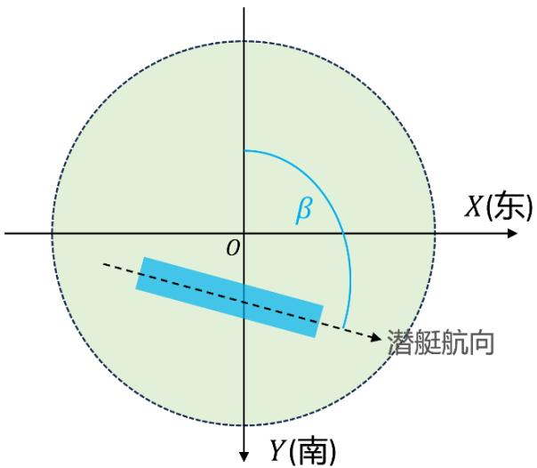
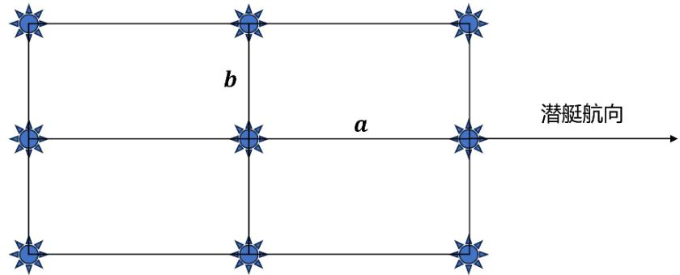

# D 题 反潜航空深弹命中概率问题

应用深水炸弹（简称深弹）反潜，曾是二战时期反潜的重要手段，而随着现代军事技术的发展，鱼雷已成为现代反潜作战的主要武器。但是，在海峡或浅海等海底地形较为复杂的海域，由于价格低、抗干扰能力强，仍有一些国家在研究和发展深水炸弹反潜技术。

反潜飞机攻击水下目标前，先由侦察飞机通过电子侦察设备发现水下潜艇目标的大致位置，然后召唤反潜飞机前来进行攻击。当潜艇发现被侦察飞机电子设备跟踪时，通常会立即关闭电子设备及发动机，采取静默方式就地隐蔽。

本问题采用目标坐标系：潜艇中心位置的定位值在海平面上的投影为原点 ??，正东方向为 ?? 轴正向，正南方向为 ?? 轴正向，垂直于海平面向下方向为 ?? 轴正向。正北方向顺时针旋转到潜艇航向的方位角记为 $\beta$ ，假定在一定条件下反潜攻击方可获知该航向（见图1）。

X(东)
β
O
潜艇航向
Y(南)

图 1 水平面目标定位误差及潜艇航向示意图

由于存在定位误差，潜艇中心实际位置的 3 个坐标是相互独立的随机变量，其中 ??，??均服从正态分布 $N ( 0 , \sigma ^ { 2 } )$ ，?? 服从单边截尾正态分布 $N ( h _ { 0 } , \sigma _ { z } ^ { 2 } , l )$ ，其密度函数为

$$
f _ {h _ {0}, \sigma_ {z}, l} (v) = \frac {1}{\sigma_ {z}} \cdot \frac {\phi \left(\frac {v - h _ {0}}{\sigma_ {z}}\right)}{1 - \Phi \left(\frac {l - h _ {0}}{\sigma_ {z}}\right)} \qquad (l <   v <   + \infty),
$$

这里 $h _ { 0 }$ 是潜艇中心位置深度的定位值，?? 是潜艇中心位置实际深度的最小值， $\phi$ 和 $\phi$ 分别是标准正态分布的密度函数与分布函数。

将潜艇主体部分简化为长方体，深弹在水中垂直下降。假定深弹采用双引信（触发引信+定深引信）引爆，定深引信事先设定引爆深度，深弹在海水中的最大杀伤距离称为杀伤半径。深弹满足以下情形之一，视为命中潜艇：

(1) 航空深弹落点在目标平面尺度范围内，且引爆深度位于潜艇上表面的下方，由触发引信引爆；  
(2) 航空深弹落点在目标平面尺度范围内，且引爆深度位于潜艇上表面的上方，同时潜艇在深弹的杀伤范围内，由定深引信引爆；  
(3) 航空深弹落点在目标平面尺度范围外，则到达引爆深度时，由定深引信引爆，且此时潜艇在深弹的杀伤范围内。

请建立数学模型，解决以下问题：

问题1 投射一枚深弹，潜艇中心位置的深度定位没有误差，两个水平坐标定位均服从正态分布。分析投弹最大命中概率与投弹落点平面坐标及定深引信引爆深度之间的关系，并给出使得投弹命中概率最大的投弹方案，及相应的最大命中概率表达式。

针对以下参数值给出最大命中概率：潜艇长 100 m，宽20 m，高25 m，潜艇航向方位角为 90∘，深弹杀伤半径为20m，潜艇中心位置的水平定位标准差 $\sigma = 1 2 0 \mathrm { ~ m ~ }$ ，潜艇中心位置的深度定位值为 150 m.

问题2 仍投射一枚深弹，潜艇中心位置各方向的定位均有误差。请给出投弹命中概率的表达式。

针对以下参数，设计定深引信引爆深度，使得投弹命中概率最大：潜艇中心位置的深度定位值为150 m，标准差 $\sigma _ { z } = 4 0 \mathrm { ~ m ~ }$ ，潜艇中心位置实际深度的最小值为 120 m，其他参数同问题1。

问题3 由于单枚深弹命中率较低，为了增强杀伤效果，通常需要投掷多枚深弹。若一架反潜飞机可携带9枚航空深弹，所有深弹的定深引信引爆深度均相同，投弹落点在平面上呈阵列形状（见图 2）。在问题 2 的参数下，请设计投弹方案（包括定深引信引爆深度，以及投弹落点之间的平面间隔），使得投弹命中（指至少一枚深弹命中潜艇）的概率最大。

b
a
潜艇航向

图 2 多枚投弹落点平面分布示意图