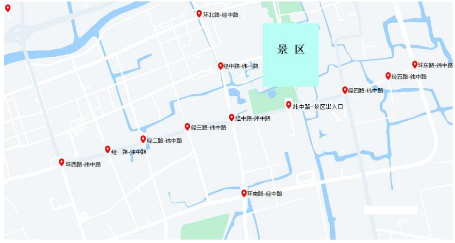

# E题 交通流量管控

随着城市化进程的加快、机动车的快速普及，以及人们活动范围的不断扩大，城市道路交通拥堵问题日渐严重，即使在一些非中心城市，道路交通拥堵问题也成为影响地方经济发展和百姓幸福感的一个“痛点”，是相关部门的棘手难题之一。

考虑一个拥有知名景区的小镇。景区周边道路上既有本地居民出行，也有过境车辆，还有大量前来景区游览的游客车辆，后者常常会因寻找停车位而在周边道路上来回低速绕圈，影响了道路的通行效率。

图1是小镇中两条主路的情况：纬中路，从环西路到环东路，约3.5公里；经中路，从环北路到环南路，约 1.8 公里。两条路上共有 12 个交叉口，监控设备可以记录每个交叉口四个方向的车流数据。以经中路-纬中路交叉口为例，有经中路北往南（north-south）、经中路南往北（south-north）、纬中路东往西（east-west）、纬中路西往东（west-east）四个相位通过的每辆车的信息，包括拍摄地点、行驶方向、拍摄时间和车牌号。

景区
环北路-经中路
经中路-纬一路
经三路-纬中路
经中路-纬中路
纬中路-景区出入口
环东路-纬中路
经五路-纬中路
经四路-纬中路
经二路-纬中路
环西路-纬中路
经一路-纬中路
环南路-经中路

图 1 小镇主要道路示意图

附件 2记录了 2024年 4月 1日到 5月 6日这两条主路上有监控设备的地方出现过的所有车辆信息。监控设备安装在停车线后方，因此并不知道车辆通过停车线后是左转、直行还是右转。

由于沿途有住宅小区、酒店和写字楼等建筑物，车辆可以驶入这些建筑物的停车场或者从停车场驶出，所以可能造成这两条主路上的车辆会突然出现或者突然消失。

请结合实际，探讨以下几个问题：

问题 1 对经中路-纬中路交叉口，根据车流量的差异，可将一天分成若干个时段，估计不同时段各个相位（包括四个方向直行、转弯）车流量。

问题 2 根据所给数据和上述模型，对经中路和纬中路上所有交叉口的信号灯进行优化配置，在保证车辆通行的前提下，使得两条主路上的车流平均速度最大。

问题 3 对五一黄金周期间的数据进行分析，判定寻找停车位的巡游车辆，并估算假期景区需要临时征用多少停车位才能满足需求？

问题 4 五一黄金周期间，该小镇对景区周边道路实行了临时性交通管理措施，具体管控措施见附件3。请结合数据评价临时管控措施在两条主路上的效果。

附件1 路段行驶方向编号及交叉口之间的距离

附件2 纬中路各交叉口车辆信息

附件3 五一黄金周期间交通管控措施