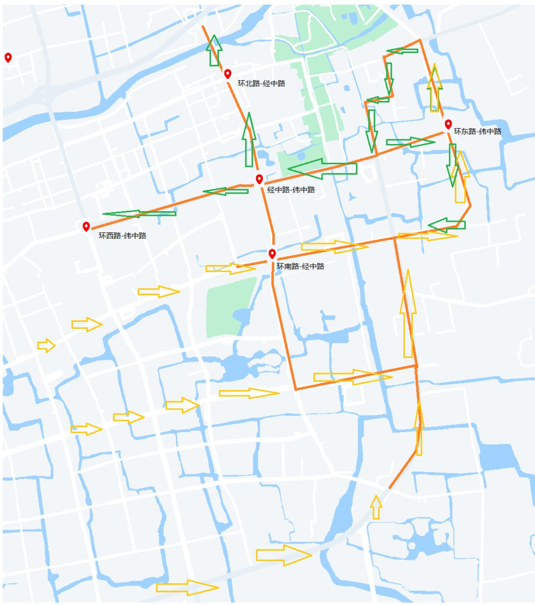

# 2024 年“五一”小镇景区实施临时交通管控措施

自5月1日至5月5日，结合实际情况，对小镇景区周边道路实行临时性交通管理措施，请过往车辆按照交通指示标志与现场交警指挥通行。

交通管控具体措施如下图所示，其中红色路段是管控路段，可以根据实际车流量的大小临时禁止或者限制车辆通行；橙色箭头是车辆进入小镇景区的路线；绿色箭头是车辆驶出小镇景区的路线；车辆应按照箭头方向和现场交警指挥通行。

环北路-经中路
环东路-纬中路
经中路-纬中路
环西路-纬中路
环南路-经中路