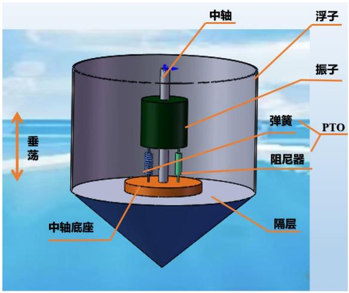
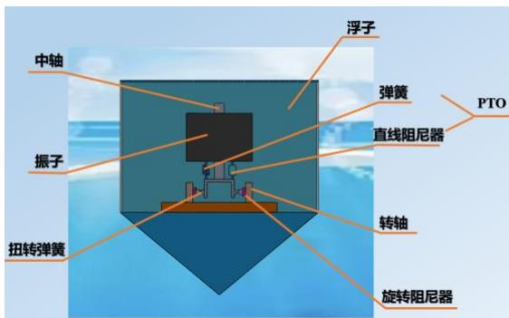
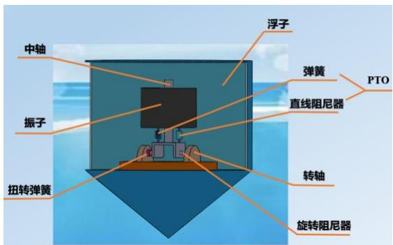
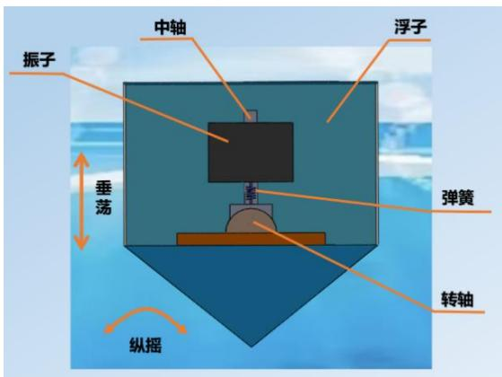
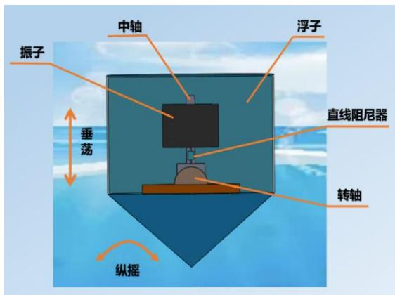
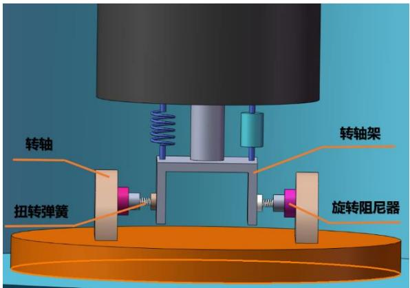

# A 题 波浪能最大输出功率设计

随着经济和社会的发展，人类面临能源需求和环境污染的双重挑战，发展可再生能源产业已成为世界各国的共识。波浪能作为一种重要的海洋可再生能源，分布广泛，储量丰富，具有可观的应用前景。波浪能装置的能量转换效率是波浪能规模化利用的关键问题之一。

图 1 为一种波浪能装置示意图，由浮子、振子、中轴以及能量输出系统（PTO，包括弹簧和阻尼器）构成，其中振子、中轴及PTO被密封在浮子内部；浮子由质量均匀分布的圆柱壳体和圆锥壳体组成；两壳体连接部分有一个隔层，作为安装中轴的支撑面；振子是穿在中轴上的圆柱体，通过PTO 系统与中轴底座连接。在波浪的作用下，浮子运动并带动振子运动（参见附件 1 和附件 2），通过两者的相对运动驱动阻尼器做功，并将所做的功作为能量输出。考虑海水是无粘及无旋的，浮子在线性周期微幅波作用下会受到波浪激励力（矩）、附加惯性力（矩）、兴波阻尼力（矩）和静水恢复力（矩）。在分析下面问题时，忽略中轴、底座、隔层及PTO 的质量和各种摩擦。

中轴
浮子
振子
弹簧
PTO
阻尼器
垂荡
中轴底座
隔层

图1 波浪能装置示意图

请建立数学模型解决以下问题：

问题 1 如图 1 所示，中轴底座固定于隔层的中心位置，弹簧和直线阻尼器一端固定在振子上，一端固定在中轴底座上，振子沿中轴做往复运动。直线阻尼器的阻尼力与浮子和振子的相对速度成正比，比例系数为直线阻尼器的阻尼系数。考虑浮子在波浪中只做垂荡运动（参见附件 1），建立浮子与振子的运动模型。初始时刻浮子和振子平衡于静水中，利用附件 3 和附件 4 提供的参数值（其中波浪频率取 1.4005 s−1，这里及以下出现的频率均指圆频率，角度均采用弧度制），分别对以下两种情况计算浮子和振子在波浪激励力 ??cos????（?? 为波浪激励力振幅，?? 为波浪频率）作用下前40个波浪周期内时间间隔为0.2 s的垂荡位移和速度：(1) 直线阻尼器的阻尼系数为 10000 N·s/m；(2) 直线阻尼器的阻尼系数与浮子和振子的相对速度的绝对值的幂成正比，其中比例系数取 10000，幂指数取 0.5。将结果存放在 result1-1.xlsx 和result1-2.xlsx 中。在论文中给出 10 s、20 s、40 s、60 s、100 s 时，浮子与振子的垂荡位移和速度。

问题 2 仍考虑浮子在波浪中只做垂荡运动，分别对以下两种情况建立确定直线阻尼器的最优阻尼系数的数学模型，使得PTO 系统的平均输出功率最大：(1) 阻尼系数为常量，阻尼系数在区间 [0,100000] 内取值；(2) 阻尼系数与浮子和振子的相对速度的绝对值的幂成正比，比例系数在区间 [0,100000] 内取值，幂指数在区间 [0,1] 内取值。利用附件 3 和附件 4 提供的参数值（波浪频率取 $2 . 2 1 4 3 s ^ { - 1 } ;$ ）分别计算两种情况的最大输出功率及相应的最优阻尼系数。

问题 3 如图 2 所示，中轴底座固定于隔层的中心位置，中轴架通过转轴铰接于中轴底座中心，中轴绕转轴转动，PTO系统连接振子和转轴架，并处于中轴与转轴所在的平面。除了直线阻尼器，在转轴上还安装了旋转阻尼器和扭转弹簧，直线阻尼器和旋转阻尼器共同做功输出能量。在波浪的作用下，浮子进行摇荡运动，并通过转轴及扭转弹簧和旋转阻尼器带动中轴转动。振子随中轴转动，同时沿中轴进行滑动。扭转弹簧的扭矩与浮子和振子的相对角位移成正比，比例系数为扭转弹簧的刚度。旋转阻尼器的扭矩与浮子和振子的相对角速度成正比，比例系数为旋转阻尼器的旋转阻尼系数。考虑浮子只做垂荡和纵摇运动（参见附件 2），建立浮子与振子的运动模型。初始时刻浮子和振子平衡于静水中，利用附件3 和附件4提供的参数值（波浪频率取 $1 . 7 1 5 2 \ s ^ { - 1 } \rangle$ ），假定直线阻尼器和旋转阻尼器的阻尼系数均为常量，分别为 10000 N·s/m和 1000 N·m·s，计算浮子与振子在波浪激励力和波浪激励力矩 ?? cos ????，?? cos ????（?? 为波浪激励力振幅，?? 为波浪激励力矩振幅，?? 为波浪频率）作用下前40个波浪周期内时间间隔为 0.2s的垂荡位移与速度和纵摇角位移与角速度。将结果存放在 result3.xlsx中。在论文中给出 10 s、20 s、40 s、60 s、100 s时，浮子与振子的垂荡位移与速度和纵摇角位移与角速度。

中轴
振子
扭转弹簧
浮子
弹簧
直线阻尼器
转轴
旋转阻尼器
PTO

中轴
振子
扭转弹簧
浮子
弹簧
直线阻尼器
PTO
转轴
旋转阻尼器

振子
中轴
浮子
垂荡
弹簧
转轴
纵摇

中轴
浮子
振子
垂直
转轴
直线阻尼器
纵摇

转轴
扭转弹簧
转轴架
旋转阻尼器

图 2 波浪能装置不同侧面的示意图

问题 4 考虑浮子在波浪中只做垂荡和纵摇的情形，针对直线阻尼器和旋转阻尼器的阻尼系数均为常量的情况，建立确定直线阻尼器和旋转阻尼器最优阻尼系数的数学模型，直线阻尼器和旋转阻尼器的阻尼系数均在区间 [0,100000] 内取值。利用附件 3 和附件 4 提供的参数值（波浪频率取 $1 . 9 8 0 6 \ s ^ { - 1 }$ ）计算最大输出功率及相应的最优阻尼系数。

附件 1 垂荡的动画

附件 2 垂荡和纵摇的动画

附件 3 不同入射波浪频率下的附加质量、附加转动惯量、兴波阻尼系数、波浪激励力（矩）振幅

附件 4 浮子和振子的物理参数和几何参数值

# 附录 术语

浮体在波浪的作用下做摇荡运动时，会受到海水的作用，包括附加惯性力（矩）、兴波阻尼力（矩）和静水恢复力（矩）。

附加惯性力（矩） 推动浮体做摇荡运动的力（矩）不仅要推动浮体运动，还要推动浮体周围的流体运动。因此，要使浮体在海水中获得（角）加速度，需要施加额外的力（矩），称为附加惯性力（矩）。附加惯性力（矩）对应产生一个虚拟质量（虚拟转动惯量），即为附加质量（附加转动惯量）。

兴波阻尼力（矩） 浮体在海水中做摇荡运动时，会兴起波浪，从而产生对浮体摇荡运动的阻力（矩），称为兴波阻尼力（矩）。兴波阻尼力（矩）与摇荡运动的（角）速度成正比，方向相反，比例系数称为兴波阻尼系数。

静水恢复力 浮体在海水中做垂荡运动时，会受到使浮体回到平衡位置的作用力，称为静水恢复力。静水恢复力实际上是由浮体在垂荡运动时所受到的浮力变化引起的。

静水恢复力矩 浮体在海水中做纵摇运动时，会受到使浮体转正的力矩，称为静水恢复力矩，其大小与浮体相对于静水面的转角成正比，比例系数称为静水恢复力矩系数。