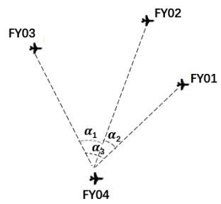
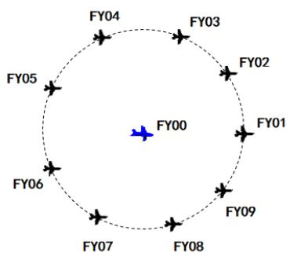
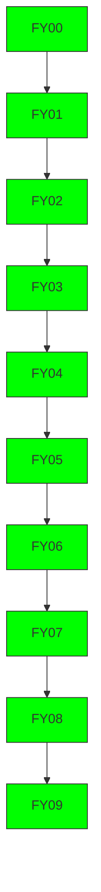
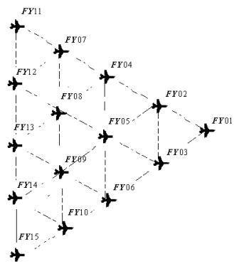
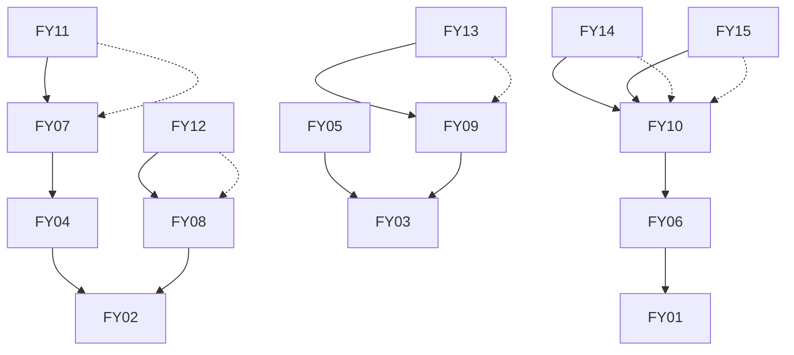

# B 题 无人机遂行编队飞行中的纯方位无源定位

无人机集群在遂行编队飞行时，为避免外界干扰，应尽可能保持电磁静默，少向外发射电磁波信号。为保持编队队形，拟采用纯方位无源定位的方法调整无人机的位置，即由编队中某几架无人机发射信号、其余无人机被动接收信号，从中提取出方向信息进行定位，来调整无人机的位置。编队中每架无人机均有固定编号，且在编队中与其他无人机的相对位置关系保持不变。接收信号的无人机所接收到的方向信息约定为：该无人机与任意两架发射信号无人机连线之间的夹角（如图 1 所示）。例如：编号为 FY01、FY02 及 FY03 的无人机发射信号，编号为FY04 的无人机接收到的方向信息是 $\alpha _ { 1 } , ~ \alpha _ { 2 }$ 和 $\alpha _ { 3 }$ 。

FY03
α₁ α₂
α₃
FY02
FY01
FY04

图1 无人机接收到的方向信息示意图

请建立数学模型，解决以下问题：

问题1 编队由10架无人机组成，形成圆形编队，其中 9架无人机（编号 FY01\~FY09）均匀分布在某一圆周上，另 1 架无人机（编号 FY00）位于圆心（见图 2）。无人机基于自身感知的高度信息，均保持在同一个高度上飞行。

图2 圆形无人机编队示意图

(1) 位于圆心的无人机（FY00）和编队中另 2 架无人机发射信号，其余位置略有偏差的无人机被动接收信号。当发射信号的无人机位置无偏差且编号已知时，建立被动接收信号无人机的定位模型。

(2) 某位置略有偏差的无人机接收到编号为FY00 和 FY01的无人机发射的信号，另接收到编队中若干编号未知的无人机发射的信号。若发射信号的无人机位置无偏差，除 FY00 和 FY01外，还需要几架无人机发射信号，才能实现无人机的有效定位？  
(3) 按编队要求，1 架无人机位于圆心，另9 架无人机均匀分布在半径为100 m的圆周上。当初始时刻无人机的位置略有偏差时，请给出合理的无人机位置调整方案，即通过多次调整，每次选择编号为 FY00 的无人机和圆周上最多 3 架无人机遂行发射信号，其余无人机根据接收到的方向信息，调整到理想位置（每次调整的时间忽略不计），使得9 架无人机最终均匀分布在某个圆周上。利用表 1 给出的数据，仅根据接收到的方向信息来调整无人机的位置，请给出具体的调整方案。

表 1 无人机的初始位置

<table><tr><td>无人机编号</td><td>极坐标 (m,°)</td></tr><tr><td>0</td><td>(0,0)</td></tr><tr><td>1</td><td>(100,0)</td></tr><tr><td>2</td><td>(98,40.10)</td></tr><tr><td>3</td><td>(112,80.21)</td></tr><tr><td>4</td><td>(105,119.75)</td></tr><tr><td>5</td><td>(98,159.86)</td></tr><tr><td>6</td><td>(112,199.96)</td></tr><tr><td>7</td><td>(105,240.07)</td></tr><tr><td>8</td><td>(98,280.17)</td></tr><tr><td>9</td><td>(112,320.28)</td></tr></table>

问题2 实际飞行中，无人机集群也可以是其他编队队形，例如锥形编队队形（见图3，直线上相邻两架无人机的间距相等，如 50 m）。仍考虑纯方位无源定位的情形，设计无人机位置调整方案。

图3 锥形无人机编队示意图